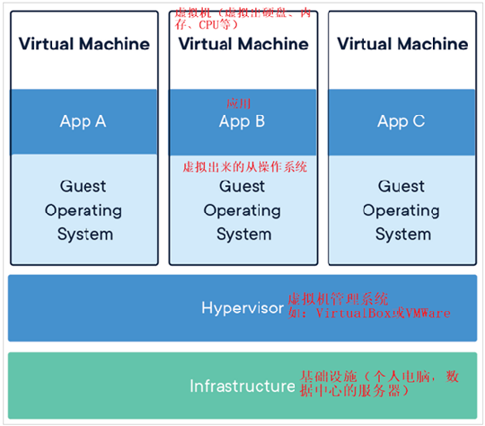
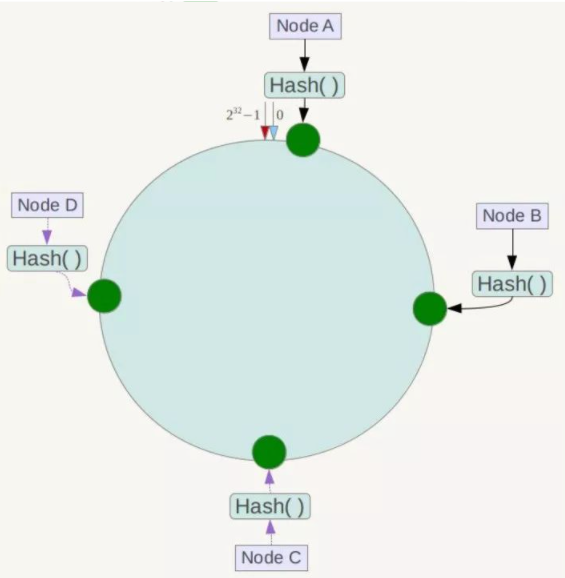
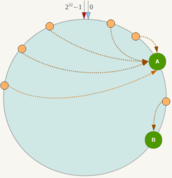
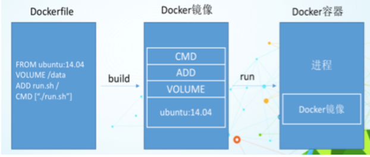

# 第 1 章、简介

https://www.bilibili.com/video/BV1gr4y1U7CY/

## 1、是什么
### 1.1、docker出现
Docker之所以发展如此迅速，也是因为它对此给出了一个标准化的解决方案-----系统平滑移植，容器虚拟化技术。
环境配置相当麻烦，换一台机器，就要重来一次，费力费时。很多人想到，能不能从根本上解决问题，软件可以带环境安装？也就是说，安装的时候，把原始环境一模一样地复制过来。开发人员利用 Docker 可以消除协作编码时“在我的机器上可正常工作”的问题。

### 1.2、docker理念
Docker是基于Go语言实现的云开源项目。
Docker的主要目标是“Build，Ship and Run Any App,Anywhere”，也就是通过对应用组件的封装、分发、部署、运行等生命周期的管理，使用户的APP（可以是一个WEB应用或数据库应用等等）及其运行环境能够做到“**一次镜像，处处运行**”。

Linux容器技术的出现就解决了这样一个问题，而 Docker 就是在它的基础上发展过来的。将应用打成镜像，通过镜像成为运行在Docker容器上面的实例，而 Docker容器在任何操作系统上都是一致的，这就实现了跨平台、跨服务器。只需要一次配置好环境，换到别的机子上就可以一键部署好，大大简化了操作。
### 1.3、总结
解决了**运行环境和配置问题**的软件容器， 方便做持续集成并有助于整体发布的容器虚拟化技术。
## 2、容器 vs 虚拟机
### 2.1、容器发展简史


### 2.2、传统虚拟机技术
虚拟机（virtual machine）就是带环境安装的一种解决方案。
它可以在一种操作系统里面运行另一种操作系统，比如在Windows10系统里面运行Linux系统CentOS7。应用程序对此毫无感知，因为虚拟机看上去跟真实系统一模一样，而对于底层系统来说，虚拟机就是一个普通文件，不需要了就删掉，对其他部分毫无影响。这类虚拟机完美的运行了另一套系统，能够使应用程序，操作系统和硬件三者之间的逻辑不变。  


虚拟机的缺点：

- 资源占用多
- 冗余步骤多
- 启动慢
### 2.3、容器虚拟化技术
由于前面虚拟机存在某些缺点，Linux发展出了另一种虚拟化技术：
Linux容器(Linux Containers，缩写为 LXC)
Linux容器是与系统其他部分隔离开的一系列进程，从另一个镜像运行，并由该镜像提供支持进程所需的全部文件。容器提供的镜像包含了应用的所有依赖项，因而在从开发到测试再到生产的整个过程中，它都具有可移植性和一致性。
Linux 容器不是模拟一个完整的操作系统而是对进程进行隔离。有了容器，就可以将软件运行所需的所有资源打包到一个隔离的容器中。容器与虚拟机不同，不需要捆绑一整套操作系统，只需要软件工作所需的库资源和设置。系统因此而变得高效轻量并保证部署在任何环境中的软件都能始终如一地运行。


### 2.4、对比

比较了 Docker 和传统虚拟化方式的不同之处：

- 传统虚拟机技术是虚拟出一套硬件后，在其上运行一个完整操作系统，在该系统上再运行所需应用进程；
- 容器内的应用进程直接运行于**宿主的内核**，容器内**没有自己的内核且也没有进行硬件虚拟**。因此容器要比传统虚拟机更为轻便。
- **每个容器之间互相隔离**，每个容器有自己的文件系统 ，容器之间进程不会相互影响，能区分计算资源。
## 3、能干嘛
### 3.1、技术职级变化

- coder
- programmer
- software engineer
- DevOps engineer
### 3.2、开发/运维（DevOps）
新一代开发工程师
一次构建、随处运行

- 更快速的应用交付和部署
   - 传统的应用开发完成后，需要提供一堆安装程序和配置说明文档，安装部署后需根据配置文档进行繁杂的配置才能正常运行。Docker化之后只需要交付少量容器镜像文件，在正式生产环境加载镜像并运行即可，应用安装配置在镜像里已经内置好，大大节省部署配置和测试验证时间。
- 更便捷的升级和扩缩容
   - 随着微服务架构和Docker的发展，大量的应用会通过微服务方式架构，应用的开发构建将变成搭乐高积木一样，每个Docker容器将变成一块“积木”，应用的升级将变得非常容易。当现有的容器不足以支撑业务处理时，可通过镜像运行新的容器进行快速扩容，使应用系统的扩容从原先的天级变成分钟级甚至秒级。
- 更简单的系统运维
   - 应用容器化运行后，生产环境运行的应用可与开发、测试环境的应用高度一致，容器会将应用程序相关的环境和状态完全封装起来，不会因为底层基础架构和操作系统的不一致性给应用带来影响，产生新的BUG。当出现程序异常时，也可以通过测试环境的相同容器进行快速定位和修复。
- 更高效的计算资源利用
   - Docker是内核级虚拟化，其不像传统的虚拟化技术一样需要额外的Hypervisor支持，所以在一台物理机上可以运行很多个容器实例，可大大提升物理服务器的CPU和内存的利用率。
### 3.3、Docker应用场景

## 4、去哪下
### 4.1、官网
docker官网：[http://www.docker.com](http://www.docker.com)
### 4.2、仓库
Docker Hub官网: [https://hub.docker.com/](https://hub.docker.com/)

## 5、Alpine Linux
Alpine Linux 是一款独立的、非商业的通用 Linux 发行版，专为追求安全性、简单性和资源效率的用户而设计。 可能很多人没听说过这个 Linux 发行版本，但是经常用 Docker 的朋友可能都用过，因为他小，简单，安全而著称，所以作为基础镜像是非常好的一个选择，可谓是麻雀虽小但五脏俱全，镜像非常小巧，不到 6M的大小，所以特别适合容器打包。

# 第 2 章、安装
## 1、前提说明
### 1.1、运行环境

### 1.2、环境要求
目前，CentOS 仅发行版本中的内核支持 Docker。
Docker 运行在CentOS 7 (64-bit)上，要求系统为64位、Linux系统内核版本为 3.8以上，这里选用Centos7.x
## 2、平台架构图解
### 2.1、基本组成

- 镜像(image)
   - Docker 镜像（Image）可以用来创建 Docker 容器，一个镜像可以创建很多容器。
- 容器(container)
   - Docker 利用容器（Container）独立运行的一个或一组应用，应用程序或服务运行在容器里面，容器就类似于一个虚拟化的运行环境，容器是用镜像创建的运行实例。
   - 容器为镜像提供了一个标准的和隔离的运行环境，它可以被启动、开始、停止、删除。
   - 每个容器都是相互隔离的、保证安全的平台。
   - 可以把容器看做是一个简易版的 Linux 环境。
- 仓库(repository)
   - 仓库（Repository）是集中存放镜像文件的场所。
- Docker 本身
   - Docker 本身是一个容器运行载体或称之为管理引擎。
### 2.2、入门版架构

**工作原理：**
Docker是一个Client-Server结构的系统，Docker守护进程运行在主机上， 然后通过Socket连接从客户端访问，守护进程从客户端接受命令并管理运行在主机上的容器。 **容器，是一个运行时环境，就是前面说到的集装箱。**


### 2.3、架构版
Docker 是一个 C/S 模式的架构，后端是一个松耦合架构，众多模块各司其职。 


## 3、安装步骤
[https://docs.docker.com/engine/install/centos/](https://docs.docker.com/engine/install/centos/)

### 3.1、卸载旧版本
```bash
yum remove docker \
             docker-client \
             docker-client-latest \
             docker-common \
             docker-latest \
             docker-latest-logrotate \
             docker-logrotate \
             docker-engine
```
### 3.2、查看Linux内核

### 3.3、环境准备

- CentOS7能上外网
- 安装gcc、gcc-c++
   - **所以yum安装方式，这个可以省略。**
   - yum -y install gcc
   - yum -y install gcc-c++
- 安装软件包
   - yum install -y yum-utils
- 设置存储库
   - 不推荐官方，网络不稳定。推荐下面阿里云
   - yum-config-manager --add-repo http://mirrors.aliyun.com/docker-ce/linux/centos/docker-ce.repo
- 更新yum软件包索引
   - yum makecache fast
### 3.4、安装

- 安装DOCKER CE
   - `yum -y install docker-ce docker-ce-cli containerd.io`
- 启动docker
   - `systemctl start docker`
   - systemctl enable docker
- 测试
   - `docker version`
   - `docker run hello-world`
### 3.5、卸载
```bash
systemctl stop docker 
yum remove docker-ce docker-ce-cli containerd.io
rm -rf /var/lib/docker
rm -rf /var/lib/containerd
```
## 4、阿里云镜像加速
[https://promotion.aliyun.com/ntms/act/kubernetes.html](https://promotion.aliyun.com/ntms/act/kubernetes.html)


```bash
sudo mkdir -p /etc/docker
sudo tee /etc/docker/daemon.json <<-'EOF'
{
  "registry-mirrors": ["https://baxqt5v7.mirror.aliyuncs.com"]
}
EOF
sudo systemctl daemon-reload
sudo systemctl restart docker
```


## 5、HelloWorld
### 5.1、执行命令
启动Docker后台容器(测试运行 hello-world)
docker run hello-world

输出这段提示以后，hello world就会停止运行，容器自动终止。

### 5.2、运行流程


## 6、为什么Docker比VM快
### 6.1、更少的抽象层
docker有着比虚拟机更少的抽象层
由于docker不需要Hypervisor(虚拟机)实现硬件资源虚拟化,运行在docker容器上的程序直接使用的都是实际物理机的硬件资源。因此在CPU、内存利用率上docker将会在效率上有明显优势。
### 6.2、宿主机的内核
docker利用的是宿主机的内核,而不需要加载操作系统OS内核
当新建一个容器时,docker不需要和虚拟机一样重新加载一个操作系统内核。进而避免引寻、加载操作系统内核返回等比较费时费资源的过程,当新建一个虚拟机时,虚拟机软件需要加载OS,返回新建过程是分钟级别的。而docker由于直接利用宿主机的操作系统,则省略了返回过程,因此新建一个docker容器只需要几秒钟。


# 第 3 章、常用命令
## 1、帮助启动类
| **命令**                 | **功能**               |
| ------------------------ | ---------------------- |
| systemctl start docker   | 启动docker             |
| systemctl stop docker    | 停止docker             |
| systemctl restart docker | 重启docker             |
| systemctl status docker  | 查看docker状态         |
| systemctl enable docker  | 开机启动               |
| docker info              | 查看docker概要信息     |
| docker --help            | 查看docker总体帮助文档 |
| docker 具体命令 --help   | 查看docker命令帮助文档 |

## 2、镜像命令
| **命令**                      | **功能**                       | **说明**                                                   |
| ----------------------------- | ------------------------------ | ---------------------------------------------------------- |
| docker images                 | 列出本地主机上的镜像           | -a :列出本地所有的镜像（含历史映像层）；-q :只显示镜像ID。 |
| docker search xxx             | 列出远程仓库镜像               | --limit : 只列出N个镜像。默认25个                          |
| docker pull xxx[:TAG]         | 下载镜像                       | 没有TAG就是最新版                                          |
| docker system df              | 查看镜像/容器/数据卷所占的空间 |                                                            |
| docker rmi XXX                | 删除镜像                       | -f：强制删除。删除全部docker rmi -f $(docker images -qa)   |
| docker system prune --volumes | 清除docker镜像缓存             |                                                            |

批量删除符合正则条件的镜像

```bash
# 比如：名称包含5000/mall，版本号是0.0.1的镜像
# 10.0.0.86:5000/mall-auth-server    0.0.1    e0d081b9747d   6 days ago   469MB
docker images | grep '5000/mall.*\b0\.0\.1\b' | awk '{print $3}' | xargs docker rmi
```


> docker虚悬镜像dangling image：
> 仓库名、标签都是`<none>`的镜像，俗称虚悬镜像。
>
> 查看所有虚悬镜像：docker images -f "dangling=true"
>
> 删除虚悬镜像：docker image prune -f

## 3、容器命令
有镜像才能创建容器， 这是根本前提(下载一个CentOS或者ubuntu镜像演示)
docker pull ubuntu 本次演示用ubuntu演示
### 3.1、新建+启动容器
`docker run [OPTIONS] IMAGE [COMMAND] [ARG...]`
OPTIONS说明（常用）：有些是一个减号，有些是两个减号

- `--name="容器新名字" `：为容器指定一个名称；
- `-d`：后台运行容器并返回容器ID，也即启动守护式容器(后台运行)；
- `-i`：以交互模式运行容器，通常与 -t 同时使用；
- `-t`：为容器重新分配一个伪输入终端，通常与 -i 同时使用；
   - 即启动交互式容器(前台有伪终端，等待交互)；
- `-P`: 随机端口映射，大写P
- `-p`: 指定端口映射，小写p
   - 


使用镜像centos:latest以交互模式启动一个容器,在容器内执行/bin/bash命令。
> /bin/bash 不加，也有默认终端

### 3.2、其他命令
| **命令**                                | **功能**                 | **说明**                                      |
| --------------------------------------- | ------------------------ | --------------------------------------------- |
| docker ps [OPTIONS]                     | 列出容器，默认正在运行的 | -a :所有；-l :最近；-n：近n个；-q :只显编号。 |
| docker ps --format "{{.ID}}:{{.Names}}" | 格式列出容器             |                                               |
| exit                                    | 退出容器                 | run进容器，exit，容器停止                     |
| ctrl+p+q                                | 退出容器                 | 容器不停止                                    |
| docker start 容器ID或者容器名           | 启动已停止运行的容器     |                                               |
| docker restart 容器ID或者容器名         | 重启容器                 |                                               |
| docker stop 容器ID或者容器名            | 停止容器                 |                                               |
| docker update 容器 --restart=always     | 开机启动                 |                                               |
| docker kill 容器ID或容器名              | 强制停止容器             |                                               |
| docker rm 容器ID                        | 删除已停止的容器         | docker ps -aq &#124; xargs docker rm          |
| docker logs 容器ID                      | 查看容器日志             |                                               |
| docker top 容器ID                       | 查看容器内运行的进程     |                                               |
| docker inspect 容器ID                   | 查看容器内部细节信息     |                                               |
| docker stats                            | 查看容器资源消耗情况     |                                               |

### 3.3、守护式容器(后台服务器)
在大部分的场景下，我们希望 docker 的服务是在后台运行的， 我们可以过 -d 指定容器的后台运行模式。
docker run -d 容器名
> 注意：
> Docker容器后台运行,就必须有一个前台进程。

### 3.4、进入运行的容器
**进入正在运行的容器并以命令行交互**

- docker exec -it 容器ID bashShell
- docker attach 容器ID

**上述两个区别**

- attach：
   - 直接进入容器启动命令的终端，不会启动新的进程。
   - 用exit退出，会导致容器的停止。
- exec：
   - 是在容器中打开新的终端，并且可以启动新的进程。
   - 用exit退出，不会导致容器的停止。
> 推荐使用 docker exec 命令，因为退出容器终端，不会导致容器的停止。

**进入redis服务**

- docker exec -it 容器ID /bin/bash
- docker exec -it 容器ID redis-cli
> 一般用-d后台启动的程序，再用exec进入对应容器实例

### 3.5、容器与主机文件拷贝

- 容器→主机
   - `docker cp  容器ID:容器内路径 目的主机路径`
- 主机→容器
   - `docker cp 主机文件  容器ID:容器路径`
### 3.6、导入导出容器

- export 导出容器的内容留作为一个tar归档文件[对应import命令]
   - docker export 容器ID > 文件名.tar
- import 从tar包中的内容创建一个新的文件系统再导入为镜像[对应export]
   - cat 文件名.tar | docker import - 镜像用户/镜像名:镜像版本号
## 4、小总结


| **命令** | **中文说明**                                        | **英文说明**                                                 |
| -------- | --------------------------------------------------- | ------------------------------------------------------------ |
| attach   | 当前 shell 下 attach 连接指定运行镜像               | Attach to a running container                                |
| build    | 通过 Dockerfile 定制镜像                            | Build an image from a Dockerfile                             |
| commit   | 提交当前容器为新的镜像                              | Create a new image from a container changes                  |
| cp       | 从容器中拷贝指定文件或者目录到宿主机中              | Copy files/folders from the containers filesystem to the host path |
| create   | 创建一个新的容器，同 run，但不启动容器              | Create a new container                                       |
| diff     | 查看 docker 容器变化                                | Inspect changes on a container's filesystem                  |
| events   | 从 docker 服务获取容器实时事件                      | Get real time events from the server                         |
| exec     | 在已存在的容器上运行命令                            | Run a command in an existing container                       |
| export   | 导出容器的内容流作为一个 tar 归档文件[对应 import ] | Stream the contents of a container as a tar archive          |
| history  | 展示一个镜像形成历史                                | Show the history of an image                                 |
| images   | 列出系统当前镜像                                    | List images                                                  |
| import   | 从tar包中的内容创建一个新的文件系统映像[对应export] | Create a new filesystem image from the contents of a tarball |
| info     | 显示系统相关信息                                    | Display system-wide information                              |
| inspect  | 查看容器详细信息                                    | Return low-level information on a container                  |
| kill     | kill 指定 docker 容器                               | Kill a running container                                     |
| load     | 从一个 tar 包中加载一个镜像[对应 save]              | Load an image from a tar archive                             |
| login    | 注册或者登陆一个 docker 源服务器                    | Register or Login to the docker registry server              |
| logout   | 从当前 Docker registry 退出                         | Log out from a Docker registry server                        |
| logs     | 输出当前容器日志信息                                | Fetch the logs of a container                                |
| port     | 查看映射端口对应的容器内部源端口                    | Lookup the public-facing port which is NAT-ed to PRIVATE_PORT |
| pause    | 暂停容器                                            | Pause all processes within a container                       |
| ps       | 列出容器列表                                        | List containers                                              |
| pull     | 从docker镜像源服务器拉取指定镜像或者库镜像          | Pull an image or a repository from the docker registry server |
| push     | 推送指定镜像或者库镜像至docker源服务器              | Push an image or a repository to the docker registry server  |
| restart  | 重启运行的容器                                      | Restart a running container                                  |
| rm       | 移除一个或者多个容器                                | Remove one or more containers                                |
| rmi      | 移除一个或多个镜像[无容器使用该镜像才可删除]        | Remove one or more images                                    |
| run      | 创建一个新的容器并运行一个命令                      | Run a command in a new container                             |
| save     | 保存一个镜像为一个 tar 包[对应 load]                | Save an image to a tar archive                               |
| search   | 在 docker hub 中搜索镜像                            | Search for an image on the Docker Hub                        |
| start    | 启动容器                                            | Start a stopped containers                                   |
| stop     | 停止容器                                            | Stop a running containers                                    |
| tag      | 给源中镜像打标签                                    | Tag an image into a repository                               |
| top      | 查看容器中运行的进程信息                            | Lookup the running processes of a container                  |
| unpause  | 取消暂停容器                                        | Unpause a paused container                                   |
| version  | 查看 docker 版本号                                  | Show the docker version information                          |
| wait     | 截取容器停止时的退出状态值                          | Block until a container stops, then print its exit code      |
| stats    | 查看资源占用情况                                    |                                                              |

# 第 4 章、Docker镜像
## 1、是什么
### 1.1、镜像
是一种轻量级、可执行的独立软件包，它包含运行某个软件所需的所有内容，我们把应用程序和配置依赖打包好形成一个可交付的运行环境(包括代码、运行时需要的库、环境变量和配置文件等)，这个打包好的运行环境就是image镜像文件。
只有通过这个镜像文件才能生成Docker容器实例(类似Java中new出来一个对象)。
### 1.2、分层的镜像
以pull为例，在下载的过程中可以看到docker的镜像是在一层一层的在下载的。

### 1.3、UnionFS（联合文件系统）
UnionFS（联合文件系统）：Union文件系统（UnionFS）是一种分层、轻量级并且高性能的文件系统，它支持对文件系统的修改作为一次提交来一层层的叠加，同时可以将不同目录挂载到同一个虚拟文件系统下(unite several directories into a single virtual filesystem)。Union 文件系统是 Docker 镜像的基础。镜像可以通过分层来进行继承，基于基础镜像（没有父镜像），可以制作各种具体的应用镜像。
特性：一次同时加载多个文件系统，但从外面看起来，只能看到一个文件系统，联合加载会把各层文件系统叠加起来，这样最终的文件系统会包含所有底层的文件和目录。
### 1.4、镜像加载原理
Docker的镜像实际上由一层一层的UnionFS文件系统组成。
bootfs(boot file system) 主要包含 bootloader 和 kernel ,  bootloader 主要是引导加载 kernel ,  Linux 刚启动时会加载 bootfs 文件系统，在 Docker 镜像的最底层是引导文件系统 bootfs 。这一层与我们典型的 Linux/Unix 系统是一样的，包含 boot 加载器和内核。当 boot 加载完成之后整个内核就都在内存中了，此时内存的使用权已由 bootfs 转交给内核，此时系统也会卸载 bootfs 。
rootfs (root file system) ，在 bootfs 之上。包含的就是典型 Linux 系统中的 /dev, /proc, /bin, /etc 等标准目录和文件。rootfs 就是各种不同的操作系统发行版，比如 Ubuntu，Centos 等等。 

平时安装进虚拟机的 Ubuntu 都是好几个G，为什么docker这里才70M左右？

对于一个精简的OS，rootfs可以很小，只需要包括最基本的命令、工具和程序库就可以了，因为底层直接用Host的kernel，自己只需要提供 rootfs 就行了。由此可见对于不同的linux发行版, bootfs基本是一致的, rootfs会有差别, 因此不同的发行版可以公用bootfs。
### 1.5、为什么采用分层结构
镜像分层最大的一个好处就是共享资源，方便复制迁移，就是为了复用。
比如说有多个镜像都从相同的 base 镜像构建而来，那么 Docker Host 只需在磁盘上保存一份 base 镜像；
同时内存中也只需加载一份 base 镜像，就可以为所有容器服务了。而且镜像的每一层都可以被共享。
## 2、重点理解
Docker镜像层都是只读的，容器层是可写的。
当容器启动时，一个新的可写层被加载到镜像的顶部。 这一层通常被称作“容器层”，“容器层”之下的都叫“镜像层”。
所有对容器的改动 - 无论添加、删除、还是修改文件都只会发生在容器层中。只有容器层是可写的，容器层下面的所有镜像层都是只读的。

## 3、commit操作
docker commit提交容器副本使之成为一个新的镜像
`docker commit -m="描述信息" -a="作者" 容器ID 目标镜像名:[标签名]`
## 4、小总结
Docker中的镜像分层，支持通过扩展现有镜像，创建新的镜像。类似Java继承于一个Base基础类，自己再按需扩展。
新镜像是从 base 镜像一层一层叠加生成的。每安装一个软件，就在现有镜像的基础上增加一层。

# 第 5 章、镜像发布
## 1、镜像发布流程

## 2、发布到阿里云
### 2.1、推送

- 创建仓库镜像
   - 选择控制台，进入容器镜像服务
   - 选择个人实例
   - 命名空间
   - 仓库名称
   - 设置登录密码
      - 
- 将镜像推送到阿里云
   - 
### 2.2、拉取
将阿里云上的镜像下载到本地


## 3、私有库Registry
本地镜像发布到私有库 Docker Registry

Docker 官方提供的 Registry 是一个开源的项目，用于存储和分发 Docker 镜像。它是一个轻量级的镜像仓库，提供基本的镜像存储和检索功能。Docker Registry 是一个通用的镜像存储解决方案，适用于各种场景。

### 3.1、安装运行Registry

- 下载镜像Docker Registry
   - `docker pull registry`
   
- 运行私有库Registry，相当于本地有个私有Docker hub
   - `docker run -d -p 5000:5000  -v /zzyyuse/myregistry/:/tmp/registry --privileged=true registry`
   - 默认情况，仓库被创建在容器的/var/lib/registry目录下，建议自行用容器卷映射，方便于宿主机联调
   
- curl验证私服库上有什么镜像
   - `curl -XGET http://192.168.123.205:5000/v2/_catalog`
   
   查看镜像版本
   
   - curl -X GET http://<registry_address>/v2/<repository_name>/tags/list
   
- 修改配置文件使之支持http
   - `vim /etc/docker/daemon.json`
   - 添加 `"insecure-registries": ["192.168.111.162:5000"]`
   - 注意配置之间有逗号`,`
### 3.2、推送

- 将新镜像修改符合私服规范的Tag
   - `docker tag 341f55bbefb8 192.168.123.205:5000/mylinux:1.3`
   - 
- push推送到私服库
   -  `docker push 192.168.123.205:5000/mylinux:1.3`
- curl验证私服库上镜像
### 3.3、拉取
pull到本地
`docker pull 192.168.123.205:5000/mylinux:1.3`


## 4、私有库Harbor

[Harbor (goharbor.io)](https://goharbor.io/)

Harbor 是一个由 VMware 主导的开源项目，它构建在 Docker Registry 之上，并提供了更多的企业级功能。Harbor 支持多租户、安全扫描、策略管理、用户权限控制、LDAP/AD 集成等高级特性。Harbor 的目标是提供一个企业级的、安全的、可扩展的容器镜像仓库。


# 第 6 章、容器数据卷
> 注意：
> 容器卷记得加入
> --privileged=true

## 1、是什么

- 将docker容器内的数据保存进宿主机的磁盘中。
- 可以理解为把宿主机的磁盘挂载到Docker容器内。
- 运行一个带有容器卷存储功能的容器实例
   - `docker run -it --privileged=true -v /宿主机绝对路径目录:/容器内目录 镜像名`
## 2、能干嘛
Docker容器产生的数据，如果不备份，那么当容器实例删除后，容器内的数据自然也就没有了。
为了能保存数据在docker中我们使用卷。
特点：

- 数据卷可在容器之间共享或重用数据
- 卷中的更改可以直接实时生效
- 数据卷中的更改不会包含在镜像的更新中
- 数据卷的生命周期一直持续到没有容器使用它为止
## 3、添加容器卷
宿主与容器之间映射添加容器卷

- 命令
   - `docker run -it --privileged=true -v /宿主机绝对路径目录:/容器内目录 镜像名`
- 查看数据卷是否挂载成功
   - `docker inspect 容器ID`
## 4、读写规则
读写规则映射添加说明

- 读写(默认)
   - `docker run -it --privileged=true -v /宿主机绝对路径目录:/容器内目录:rw 镜像名`
- 只读
   - 容器实例内部被限制，只能读取不能写
   - `docker run -it --privileged=true -v /宿主机绝对路径目录:/容器内目录:ro 镜像名`
## 5、继承和共享

- 容器1完成和宿主机的映射
   - `docker run -it  --privileged=true -v /mydocker/u:/tmp --name u1 ubuntu`
- 容器2继承容器1的卷规则
   - `docker run -it  --privileged=true --volumes-from 父类  --name u2 ubuntu`
## 6、常用命令
`docker volume`

## 7、匿名和具名挂载

# 第 7 章、常规安装简介
## 1、总体步骤

- 搜索镜像
- 拉取镜像
- 查看镜像
- 启动镜像
   - 服务端口映射
- 停止容器
- 移除容器
## 2、安装tomcat

- docker hub上面查找tomcat镜像
   - docker search tomcat
- 从docker hub上拉取tomcat镜像到本地
   - docker pull tomcat
- docker images查看是否有拉取到的tomcat
- 使用tomcat镜像创建容器实例(也叫运行镜像)
   - docker run -it -p 8080:8080 tomcat
- tomcat8
   - docker pull billygoo/tomcat8-jdk8
   - docker run -d -p 8080:8080 --name mytomcat8 billygoo/tomcat8-jdk8
## 3、安装mysql

- 新建mysql容器实例
```bash
docker run -d -p 3306:3306 \
--privileged=true \
-v /mydata/mysql/log:/var/log/mysql \
-v /mydata/mysql/data:/var/lib/mysql \
-v /mydata/mysql/conf:/etc/mysql/conf.d \
-e MYSQL_ROOT_PASSWORD=123456  \
--name mysql mysql:5.7
```

- 新建my.cnf
   - 
```bash
[client]
default_character_set=utf8
[mysqld]
collation_server = utf8_general_ci
character_set_server = utf8
```

- 重新启动mysql容器实例
> 因为挂载的是宿主机的磁盘，将当前容器实例删除，重新使用上面命令运行，之前的数据都会恢复。

## 4、安装redis

- 从docker hub上(阿里云加速器)拉取redis镜像到本地
- 在CentOS宿主机下新建目录/app/redis
   - mkdir -p /app/redis
- 将一个redis.conf文件模板拷贝进/app/redis目录下
- /app/redis目录下修改redis.conf文件
- 创建容器(也叫运行镜像)
```bash
docker run  -p 6379:6379 --name myr3 --privileged=true -v /app/redis:/etc/redis -v /app/redis/data:/data -d redis:6.0.8 redis-server /etc/redis/redis.conf
```


## 5、安装nacos

[Docker 简单部署 Nacos 超详细图文步骤_=蜗牛=的博客-CSDN博客_docker nacos](https://blog.csdn.net/u011374856/article/details/109204466)

```bash
docker run -d -p 8848:8848 \
--name nacos \
--env MODE=standalone \
--env SPRING_DATASOURCE_PLATFORM=mysql \
--env MYSQL_SERVICE_HOST=10.0.0.207 \
--env MYSQL_SERVICE_PORT=3306 \
--env MYSQL_SERVICE_DB_NAME=nacos \
--env MYSQL_SERVICE_USER=root \
--env MYSQL_SERVICE_PASSWORD=123456 \
-v /mydata/nacos/conf:/home/nacos/conf \
-v /mydata/nacos/logs:/home/nacos/logs \
-v /mydata/nacos/data:/home/nacos/data \
nacos/nacos-server:2.0.4-slim
```

> 如果挂载外部目录，需要先不挂载目录启动一下，然后把对应的文件复制出来
>
> docker cp -a nacos:/home/nacos /mydata/nacos/


## 6、安装ElasticSearch

### 6.1、ElasticSearch

```bash
# 准备
mkdir -p /mydata/elasticsearch/config
mkdir -p /mydata/elasticsearch/data
echo "http.host: 0.0.0.0" >> /mydata/elasticsearch/config/elasticsearch.yml
chmod -R 777 /mydata/elasticsearch/ #保证权限

# 安装
docker run --name elasticsearch -p 9200:9200 -p 9300:9300 \
-e "discovery.type=single-node" \
-e ES_JAVA_OPTS="-Xms64m -Xmx512m" \
-v /mydata/elasticsearch/config/elasticsearch.yml:/usr/share/elasticsearch/config/elasticsearch.yml \
-v /mydata/elasticsearch/data:/usr/share/elasticsearch/data \
-v /mydata/elasticsearch/plugins:/usr/share/elasticsearch/plugins \
-d elasticsearch:7.17.6
```

> 如果启动失败，一般是挂载目录权限问题，再重新执行一下chmod -R 777 /mydata/elasticsearch/ ，然后再重启容器就可以了。
>
> 以后再外面装好插件重启即可；
> 特别注意：
> -e ES_JAVA_OPTS="-Xms64m -Xmx256m"  测试环境下，设置 ES 的初始内存和最大内存，否则导致过大启动不了 ES

### 6.2、Kibana

```bash
docker run --name kibana \
-e ELASTICSEARCH_HOSTS=http://192.168.56.10:9200 \
-p 5601:5601 \
-d kibana:7.17.6
```

> 版本需要与ElasticSearch一致
>
> ELASTICSEARCH_HOSTS 改为 ElasticSearch 的地址


# === 高级篇 ===
# 第 8 章、复杂安装详说
## 1、MySql主从复制
### 1.1、主服务器

- 新建主服务器容器实例3307
```bash
docker run -p 3307:3306 --name mysql-master \
-v /mydata/mysql-master/log:/var/log/mysql \
-v /mydata/mysql-master/data:/var/lib/mysql \
-v /mydata/mysql-master/conf:/etc/mysql \
-e MYSQL_ROOT_PASSWORD=root  \
-d mysql:5.7
```

- 进入/mydata/mysql-master/conf目录下新建my.cnf
```bash
[mysqld]
## 设置server_id，同一局域网中需要唯一
server_id=101 
## 指定不需要同步的数据库名称
binlog-ignore-db=mysql  
## 开启二进制日志功能
log-bin=mall-mysql-bin  
## 设置二进制日志使用内存大小（事务）
binlog_cache_size=1M  
## 设置使用的二进制日志格式（mixed,statement,row）
binlog_format=mixed  
## 二进制日志过期清理时间。默认值为0，表示不自动清理。
expire_logs_days=7  
## 跳过主从复制中遇到的所有错误或指定类型的错误，避免slave端复制中断。
## 如：1062错误是指一些主键重复，1032错误是因为主从数据库数据不一致
slave_skip_errors=1062
```

- 修改完配置后重启master实例
   - `docker restart mysql-master`
- 进入mysql-master容器
   - `docker exec -it mysql-master /bin/bash`
   - `mysql -uroot -proot`
- master容器实例内创建数据同步用户
   - `CREATE USER 'slave'@'%' IDENTIFIED BY '123456';`
   - `GRANT REPLICATION SLAVE, REPLICATION CLIENT ON *.* TO 'slave'@'%';`
### 1.2、从服务器

- 新建从服务器容器实例3308
```bash
docker run -p 3308:3306 --name mysql-slave \
-v /mydata/mysql-slave/log:/var/log/mysql \
-v /mydata/mysql-slave/data:/var/lib/mysql \
-v /mydata/mysql-slave/conf:/etc/mysql \
-e MYSQL_ROOT_PASSWORD=root  \
-d mysql:5.7
```

- 进入/mydata/mysql-slave/conf目录下新建my.cnf
```bash
[mysqld]
## 设置server_id，同一局域网中需要唯一
server_id=102
## 指定不需要同步的数据库名称
binlog-ignore-db=mysql  
## 开启二进制日志功能，以备Slave作为其它数据库实例的Master时使用
log-bin=mall-mysql-slave1-bin  
## 设置二进制日志使用内存大小（事务）
binlog_cache_size=1M  
## 设置使用的二进制日志格式（mixed,statement,row）
binlog_format=mixed  
## 二进制日志过期清理时间。默认值为0，表示不自动清理。
expire_logs_days=7  
## 跳过主从复制中遇到的所有错误或指定类型的错误，避免slave端复制中断。
## 如：1062错误是指一些主键重复，1032错误是因为主从数据库数据不一致
slave_skip_errors=1062  
## relay_log配置中继日志
relay_log=mall-mysql-relay-bin  
## log_slave_updates表示slave将复制事件写进自己的二进制日志
log_slave_updates=1  
## slave设置为只读（具有super权限的用户除外）
read_only=1
```

- 修改完配置后重启slave实例
   - `docker restart mysql-slave`
- 在**主数据库**中查看主从同步状态
   - `show master status;`
- 进入mysql-slave容器
   - `docker exec -it mysql-slave /bin/bash`
   - `mysql -uroot -proot`
- 在从数据库中配置主从复制
```sql
change master to 
master_host='192.168.123.205',
master_port=3307, 
master_user='slave', 
master_password='123456', 
master_log_file='mall-mysql-bin.000001', 
master_log_pos=617, 
master_connect_retry=30;

# master_host：主数据库的IP地址；
# master_port：主数据库的运行端口；
# master_user：在主数据库创建的用于同步数据的用户账号；
# master_password：在主数据库创建的用于同步数据的用户密码；
# master_log_file：指定从数据库要复制数据的日志文件，通过查看主数据的状态，获取File参数；
# master_log_pos：指定从数据库从哪个位置开始复制数据，通过查看主数据的状态，获取Position参数；
# master_connect_retry：连接失败重试的时间间隔，单位为秒。
```

- 在从数据库中查看主从同步状态
   - `show slave status \G`
   - 
- 在从数据库中开启主从同步
   - `start slave;`
- 查看从数据库状态发现已经同步
   - `show slave status \G`
   - 
### 1.3、主从复制测试
主机新建库-使用库-新建表-插入数据，ok
从机使用库-查看记录，ok

## 2、redis集群
### 2.1、分布式存储（面试题）
> 问：1~2亿条数据需要缓存，请问如何设计这个存储案例？
> 答：单机单台100%不可能，肯定是分布式存储，用redis。
> 上述问题阿里P6~P7工程案例和场景设计类必考题目， 一般业界有3种解决方案

#### 2.1.1、哈希取余分区

2亿条记录就是2亿个k,v，我们单机不行必须要分布式多机。
假设有3台机器构成一个集群，用户每次读写操作都是根据公式：hash(key) % N个机器台数。
通过计算，来决定数据映射到哪一个节点上。

- 优点：
   - 简单粗暴，直接有效，只需要预估好数据规划好节点，例如3台、8台、10台，就能保证一段时间的数据支撑。使用Hash算法让固定的一部分请求落到同一台服务器上，这样每台服务器固定处理一部分请求（并维护这些请求的信息），起到负载均衡+分而治之的作用。
- 缺点：
   - 原来规划好的节点，进行扩容或者缩容就比较麻烦了额，不管扩缩，每次数据变动导致节点有变动，映射关系需要重新进行计算，在服务器个数固定不变时没有问题，如果需要弹性扩容或故障停机的情况下，原来的取模公式就会发生变化：Hash(key)/3会变成Hash(key) /?。此时地址经过取余运算的结果将发生很大变化，根据公式获取的服务器也会变得不可控。
   - 某个redis机器宕机了，由于台数数量变化，会导致hash取余全部数据重新洗牌。
#### 2.1.2、一致性哈希算法分区
一致性哈希算法在1997年由麻省理工学院中提出的，设计目标是为了解决分布式缓存数据变动和映射问题，某个机器宕机了，分母数量改变了，自然取余数失效。
一致性哈希算法必然有个hash函数并按照算法产生hash值，这个算法的所有可能哈希值会构成一个全量集，这个集合可以成为一个hash空间[0,2^32-1]，这个是一个线性空间，但是在算法中，我们通过适当的逻辑控制将它首尾相连(0 = 2^32),这样让它逻辑上形成了一个环形空间。
它也是按照使用取模的方法，前面介绍的节点取模法是对节点（服务器）的数量进行取模。而一致性Hash算法是对2^32取模，简单来说，一致性Hash算法将整个哈希值空间组织成一个虚拟的圆环，如假设某哈希函数H的值空间为0-2^32-1（即哈希值是一个32位无符号整形），整个哈希环如下图：整个空间按顺时针方向组织，圆环的正上方的点代表0，0点右侧的第一个点代表1，以此类推，2、3、4、……直到2^32-1，也就是说0点左侧的第一个点代表2^32-1， 0和2^32-1在零点中方向重合，我们把这个由2^32个点组成的圆环称为Hash环。

将集群中各个IP节点映射到环上的某一个位置。
将各个服务器使用Hash进行一个哈希，具体可以选择服务器的IP或主机名作为关键字进行哈希，这样每台机器就能确定其在哈希环上的位置。假如4个节点NodeA、B、C、D，经过IP地址的哈希函数计算(hash(ip))，使用IP地址哈希后在环空间的位置如下：

当我们需要存储一个kv键值对时，首先计算key的hash值，hash(key)，将这个key使用相同的函数Hash计算出哈希值并确定此数据在环上的位置，从此位置沿环顺时针“行走”，第一台遇到的服务器就是其应该定位到的服务器，并将该键值对存储在该节点上。
如我们有Object A、Object B、Object C、Object D四个数据对象，经过哈希计算后，在环空间上的位置如下：根据一致性Hash算法，数据A会被定为到Node A上，B被定为到Node B上，C被定为到Node C上，D被定为到Node D上。

**优点**

- **容错性**
   - 假设Node C宕机，可以看到此时对象A、B、D不会受到影响，只有C对象被重定位到Node D。一般的，在一致性Hash算法中，如果一台服务器不可用，则受影响的数据仅仅是此服务器到其环空间中前一台服务器（即沿着逆时针方向行走遇到的第一台服务器）之间数据，其它不会受到影响。简单说，就是C挂了，受到影响的只是B、C之间的数据，并且这些数据会转移到D进行存储。
- **扩展性**
   - 数据量增加了，需要增加一台节点NodeX，X的位置在A和B之间，那收到影响的也就是A到X之间的数据，重新把A到X的数据录入到X上即可，不会导致hash取余全部数据重新洗牌。

**缺点**

- **倾斜问题**
   - 一致性Hash算法在服务节点太少时，容易因为节点分布不均匀而造成数据倾斜（被缓存的对象大部分集中缓存在某一台服务器上）问题，例如系统中只有两台服务器：
   - 
#### 2.1.3、哈希槽分区
哈希槽实质就是一个数组，数组[0,2^14 -1]形成hash slot空间。
解决均匀分配的问题，在数据和节点之间又加入了一层，把这层称为哈希槽（slot），用于管理数据和节点之间的关系，现在就相当于节点上放的是槽，槽里放的是数据。

槽解决的是粒度问题，相当于把粒度变大了，这样便于数据移动。
哈希解决的是映射问题，使用key的哈希值来计算所在的槽，便于数据分配。
**一个集群只能有16384个槽**，编号0-16383（0-2^14-1）。这些槽会分配给集群中的所有主节点，分配策略没有要求。可以指定哪些编号的槽分配给哪个主节点。集群会记录节点和槽的对应关系。解决了节点和槽的关系后，接下来就需要对key求哈希值，然后对16384取余，余数是几key就落入对应的槽里。slot = CRC16(key) % 16384。以槽为单位移动数据，因为槽的数目是固定的，处理起来比较容易，这样数据移动问题就解决了。
如下代码，key之A 、B在Node2， key之C落在Node3上


### 2.2、3主3从集群配置
#### 2.2.1、新建6个实例
新建6个docker容器redis实例
```bash
docker run -d --name redis-node-1 --net host --privileged=true -v /mydata/redis/share/redis-node-1:/data redis:6.0.8 --cluster-enabled yes --appendonly yes --port 6381
docker run -d --name redis-node-2 --net host --privileged=true -v /mydata/redis/share/redis-node-2:/data redis:6.0.8 --cluster-enabled yes --appendonly yes --port 6382
docker run -d --name redis-node-3 --net host --privileged=true -v /mydata/redis/share/redis-node-3:/data redis:6.0.8 --cluster-enabled yes --appendonly yes --port 6383
docker run -d --name redis-node-4 --net host --privileged=true -v /mydata/redis/share/redis-node-4:/data redis:6.0.8 --cluster-enabled yes --appendonly yes --port 6384
docker run -d --name redis-node-5 --net host --privileged=true -v /mydata/redis/share/redis-node-5:/data redis:6.0.8 --cluster-enabled yes --appendonly yes --port 6385
docker run -d --name redis-node-6 --net host --privileged=true -v /mydata/redis/share/redis-node-6:/data redis:6.0.8 --cluster-enabled yes --appendonly yes --port 6386

# docker run：创建并运行docker容器实例
# --name redis-node-6：容器名字
# --net host：使用宿主机的IP和端口，默认
# --privileged=true：获取宿主机root用户权限
# -v /data/redis/share/redis-node-6:/data：容器卷，宿主机地址:docker内部地址
# redis:6.0.8：redis镜像和版本号
# --cluster-enabled yes：开启redis集群
# --appendonly yes：开启持久化
# --port 6386：redis端口号
```
#### 2.2.2、构建集群关系
进入其中一个容器并为6台机器构建集群关系

- 进入容器
   - `docker exec -it redis-node-1 /bin/bash`
- 构建主从关系
```bash
redis-cli --cluster create 192.168.123.205:6381 192.168.123.205:6382 192.168.123.205:6383 192.168.123.205:6384 192.168.123.205:6385 192.168.123.205:6386 --cluster-replicas 1
```
#### 2.2.3、查看集群状态
> 在集群中的任何一个机器都可以查看。

- 在linux下查看：
   - redis-cli --cluster check 192.168.123.205:6382
- 登录redis后查看：
   - cluster info
   - cluster nodes
### 2.3、主从容错切换迁移
#### 2.3.1、数据读写存储

- -c 采用集群策略连接。（设置数据会自动切换到相应的写主机）
   - `redis-cli -c -p 6379`
- 普通方式登录，存储数据时，可能会出现MOVED重定向操作错误。
   - 在redis-cli每次录入、查询键值，redis都会计算出该key应该送往的插槽，如果不是该客户端对应服务器的插槽，redis会报错，并告知应前往的redis实例地址和端口。
#### 2.3.2、容错切换迁移

- 如果主节点下线，超时后，从节点自动升为主节点（超时时间在配置文件中配置）
- 主节点恢复后，变成从机。
### 2.4、主从扩容案例
#### 2.4.1、新建节点
新建6387、6388两个节点
```bash
docker run -d --name redis-node-7 --net host --privileged=true -v /mydata/redis/share/redis-node-7:/data redis:6.0.8 --cluster-enabled yes --appendonly yes --port 6387
docker run -d --name redis-node-8 --net host --privileged=true -v /mydata/redis/share/redis-node-8:/data redis:6.0.8 --cluster-enabled yes --appendonly yes --port 6388

docker ps
```
#### 2.4.2、新增主节点

- 进入6387容器实例
   - `docker exec -it redis-node-7 /bin/bash`
- 将新增的6387节点(空槽号)作为master节点加入原集群
   - `redis-cli --cluster add-node 新节点IP:端口 集群IP:端口`
   - 例如：`redis-cli --cluster add-node 192.168.123.205:6387 192.168.123.205:6381`
- 第1次检查集群情况
   - `redis-cli --cluster check 192.168.123.205:6381`
   - 结果是：**节点已经添加上，但没有分配插槽。**
- 重新分派槽号
   - `redis-cli --cluster reshard 集群IP:端口号`
   - 例如：`redis-cli --cluster reshard 192.168.123.205:6385`
   - 
- 第2次检查集群情况
   - 6387是3个新的区间，以前的3个还是连续。
   - 重新分配成本太高，所以从6381/6382/6383三个旧节点分别匀出1364个坑位给新节点6387。
#### 2.4.3、添加从节点

- 为主节点6387分配从节点6388
```bash
# redis-cli --cluster add-node ip:新slave端口 ip:新master端口 --cluster-slave --cluster-master-id 新主机节点ID
# 例如：
redis-cli --cluster add-node 192.168.123.205:6388 192.168.123.205:6387 --cluster-slave --cluster-master-id fdd58c9252ddb3fc16216bbc88141dd1390f1faa
```

- 第3次检查集群情况
   - 变成4主4从。
### 2.5、主从缩容案例
目的：6387和6388下线
#### 2.5.1、删除从节点

- 检查集群情况1获得6388的节点ID
- 将6388删除 从集群中将4号从节点6388删除
   - `redis-cli --cluster del-node 集群ip:端口 从机节点ID`
   - 比如：`redis-cli --cluster del-node 192.168.123.205:6388 e8009a668aeec94083af2660d41d00e4364b0542`
#### 2.5.2、删除主节点

- 将6387的槽号清空，重新分配，本例将清出来的槽号都给6381
   - `redis-cli --cluster reshard 集群IP:端口号`
   - 例如：`redis-cli --cluster reshard 192.168.123.205:6385`
   - 
- 检查集群情况，确定6387的插槽为0后，将其删除。
   - `redis-cli --cluster check 192.168.123.205:6381`
   - `redis-cli --cluster del-node 集群ip:端口 从机节点ID`
- 检查集群情况，看看是否成功删除。


## 3、安装 nginx

- 随便启动一个 nginx 实例【只是为了复制出配置】

  - `docker run -p 80:80 --name nginx -d nginx:1.10`

- 将容器内的配置文件拷贝到当前目录：（/mydata/nginx）

  - `docker cp nginx:/etc/nginx /mydata/`

- 修改复制出来的目录名称：`mv nginx conf` 

- 终止原容器：`docker stop nginx`

- 令删除原容器：`docker rm nginx`

- 创建新的 nginx，执行以下命令

  - ```bash
    docker run -p 80:80 --name nginx \
    -v /mydata/nginx/html:/usr/share/nginx/html \
    -v /mydata/nginx/logs:/var/log/nginx \
    -v /mydata/nginx/conf:/etc/nginx \
    -d nginx:1.10
    ```

- 完成后

  - 


# 第 9 章、DockerFile解析
## 1、简介
Dockerfile是用来构建Docker镜像的文本文件，是由一条条构建镜像所需的指令和参数构成的脚本。

官网
[https://docs.docker.com/engine/reference/builder/](https://docs.docker.com/engine/reference/builder/)
构建三步骤：

- 编写Dockerfile文件
- docker build命令构建镜像
- docker run依镜像运行容器实例
## 2、构建过程解析
### 2.1、基础知识

- 每条保留字指令都必须为大写字母且后面要跟随至少一个参数
- 指令按照从上到下，顺序执行
- `#`表示注释
- 每条指令都会创建一个新的镜像层并对镜像进行提交
### 2.2、大致流程

- docker从基础镜像运行一个容器
- 执行一条指令并对容器作出修改
- 执行类似docker commit的操作提交一个新的镜像层
- docker再基于刚提交的镜像运行一个新容器
- 执行dockerfile中的下一条指令直到所有指令都执行完成
### 2.3、小总结
从应用软件的角度来看，Dockerfile、镜像与容器分别代表软件的三个不同阶段：

- Dockerfile是软件的原材料
- 镜像是软件的交付品
- 容器则可以认为是软件镜像的运行态，也即依照镜像运行的容器实例

Dockerfile面向开发，r镜像成为交付标准，容器则涉及部署与运维，三者缺一不可，合力充当Docker体系的基石。


- Dockerfile
   - 需要定义一个Dockerfile，Dockerfile定义了进程需要的一切东西。Dockerfile涉及的内容包括执行代码或者是文件、环境变量、依赖包、运行时环境、动态链接库、操作系统的发行版、服务进程和内核进程(当应用进程需要和系统服务和内核进程打交道，这时需要考虑如何设计namespace的权限控制)等等;
- 镜像
   - 在用Dockerfile定义一个文件之后，docker build时会产生一个Docker镜像，当运行 Docker镜像时会真正开始提供服务;
- 容器
   - 容器是直接提供服务的。
## 3、常用保留字指令
[https://www.runoob.com/docker/docker-dockerfile.html](https://www.runoob.com/docker/docker-dockerfile.html)
参考tomcat8的dockerfile入门
[https://github.com/docker-library/tomcat

| **指令**   | **说明**                                                     |
| ---------- | ------------------------------------------------------------ |
| FROM       | 基础镜像，指定一个已经存在的镜像作为模板，第一条必须是from   |
| MAINTAINER | 镜像维护者的姓名和邮箱地址                                   |
| RUN        | 容器构建时需要运行的命令。【build时运行】两种格式：shell格式【RUN yum -y install vim】、exec格式【RUN["可执行文件","参数1","参数2"]】。 |
| EXPOSE     | 当前容器对外暴露出的端口                                     |
| WORKDIR    | 指定在创建容器后，终端默认登陆的进来工作目录，一个落脚点     |
| USER       | 指定该镜像以什么样的用户去执行，如果都不指定，默认是root     |
| ENV        | 用来在构建镜像过程中设置环境变量                             |
| ADD        | 将宿主机目录下的文件拷贝进镜像且会自动处理URL和解压tar压缩包 |
| COPY       | 类似ADD，拷贝文件和目录到镜像中。将从构建上下文目录中 <源路径> 的文件/目录复制到新的一层的镜像内的 <目标路径> 位置。COPY src dest。COPY ["src", "dest"]。<src源路径>：源文件或者源目录。<dest目标路径>：容器内的指定路径，该路径不用事先建好，路径不存在的话，会自动创建。 |
| VOLUME     | 容器数据卷，用于数据保存和持久化工作                         |
| CMD        | 指定容器启动后的要干的事情。【在docker run 时运行】注意：Dockerfile 中可以有多个 CMD 指令，但只有最后一个生效，CMD 会被 docker run 之后的参数替换。 |
| ENTRYPOINT | 也是用来指定一个容器启动时要运行的命令。类似于 CMD 指令，但是ENTRYPOINT不会被docker run后面的命令覆盖， 而且这些命令行参数会被当作参数送给 ENTRYPOINT 指令指定的程序。优点：在执行docker run的时候可以指定 ENTRYPOINT 运行所需的参数。注意：如果 Dockerfile 中如果存在多个 ENTRYPOINT 指令，仅最后一个生效。 |

**ENTRYPOINT说明：**
命令格式：

ENTRYPOINT可以和CMD一起用，一般是变参才会使用 CMD ，这里的 CMD 等于是在给 ENTRYPOINT 传参。
当指定了ENTRYPOINT后，CMD的含义就发生了变化，不再是直接运行其命令而是将CMD的内容作为参数传递给ENTRYPOINT指令，他两个组合会变成
 
案例如下：假设已通过 Dockerfile 构建了 nginx:test 镜像：


| **是否传参**         | **按照dockerfile编写执行**     | **传参运行**                                 |
| -------------------- | ------------------------------ | -------------------------------------------- |
| **Docker命令**       | docker run nginx:test          | docker run nginx:test -c /etc/nginx/new.conf |
| **衍生出的实际命令** | nginx -c /etc/nginx/nginx.conf | nginx -c /etc/nginx/new.conf                 |

## 4、案例
制作 Centos7 镜像具备 vim + ifconfig + jdk8 。

- 准备JDK文件
   - jdk-8u331-linux-x64.tar.gz
- 准备编写Dockerfile文件 `vi Dockerfile`
```bash
FROM centos:centos7.6.1810
MAINTAINER renchao<renchao@126.com>
 
ENV MYPATH /root
WORKDIR $MYPATH
 
#安装vim编辑器，ifconfig，java8及lib库
RUN yum -y install vim\
	&&yum -y install net-tools\
	&&yum -y install glibc.i686\
	&&mkdir /usr/local/java

#ADD 是相对路径jar,把jdk-8u331-linux-x64.tar.gz添加到容器中,安装包必须要和Dockerfile文件在同一位置
ADD jdk-8u331-linux-x64.tar.gz /usr/local/java/

#配置java环境变量
ENV JAVA_HOME /usr/local/java/jdk1.8.0_171
ENV JRE_HOME $JAVA_HOME/jre
ENV CLASSPATH $JAVA_HOME/lib/dt.jar:$JAVA_HOME/lib/tools.jar:$JRE_HOME/lib:$CLASSPATH
ENV PATH $JAVA_HOME/bin:$PATH
 
EXPOSE 80
 
CMD echo $MYPATH
CMD echo "success--------------ok"
CMD /bin/bash
```

- 构建
   - `docker build -t 新镜像名:TAG .`
   - 注意：TAG后面有个空格，有个点；镜像名不能有大写字母。
   - 例如：`docker build -t centos:7.6_Java .`
## 5、虚悬镜像
仓库名、标签都是`<none>`的镜像，俗称虚悬镜像（dangling image）。
Dockerfile写一个
```bash
FROM scratch	# 构建基础镜像时使用
CMD echo 'action is success'
```
构建 `docker build .`

- 查看
   - `docker image ls -f dangling=true`
- 删除
   - `docker rmi $(docker images -qf dangling=true)`
- 删除所有没有使用的镜像
   - `docker image prune -a`

## 6、微服务实战
### 6.1、建服务模块
#### 6.1.1、建Module
新建docker_boot
#### 6.1.2、改POM
```xml
<?xml version="1.0" encoding="UTF-8"?>
<project xmlns="http://maven.apache.org/POM/4.0.0"
         xmlns:xsi="http://www.w3.org/2001/XMLSchema-instance"
         xsi:schemaLocation="http://maven.apache.org/POM/4.0.0 http://maven.apache.org/xsd/maven-4.0.0.xsd">
    <modelVersion>4.0.0</modelVersion>
    <parent>
        <groupId>org.springframework.boot</groupId>
        <artifactId>spring-boot-starter-parent</artifactId>
        <version>2.5.6</version>
        <relativePath/>
    </parent>
    <groupId>com.renchao</groupId>
    <artifactId>docker</artifactId>
    <version>1.0-SNAPSHOT</version>
    
    <properties>
        <project.build.sourceEncoding>UTF-8</project.build.sourceEncoding>
        <maven.compiler.source>1.8</maven.compiler.source>
        <maven.compiler.target>1.8</maven.compiler.target>
    </properties>

    <dependencies>
        <!--SpringBoot通用依赖模块-->
        <dependency>
            <groupId>org.springframework.boot</groupId>
            <artifactId>spring-boot-starter-web</artifactId>
        </dependency>
    </dependencies>

    <build>
        <plugins>
            <plugin>
                <groupId>org.springframework.boot</groupId>
                <artifactId>spring-boot-maven-plugin</artifactId>
            </plugin>
        </plugins>
    </build>
    
</project>
```
#### 6.1.3、写YML
```yaml
server:
  port: 6001
```
#### 6.1.4、主启动
```java
@SpringBootApplication
public class DockerBootApplication {
    public static void main(String[] args) {
        SpringApplication.run(DockerBootApplication.class, args);
    }
}
```
#### 6.1.5、业务类
```java
@RestController
public class OrderController {
    @Value("${server.port}")
    private String port;

    @RequestMapping("/order/docker")
    public String helloDocker() {
        return "hello docker"+"\t"+port+"\t"+ UUID.randomUUID();
    }

    @RequestMapping(value ="/order/index",method = RequestMethod.GET)
    public String index() {
        return "服务端口号: "+"\t"+port+"\t"+UUID.randomUUID();
    }
}
```
#### 6.1.6、生成jar包

### 6.2、构建镜像

- 编写Dockerfile
```bash
# 基础镜像使用java
FROM java:8
# 作者
MAINTAINER renchao
# VOLUME 指定临时文件目录为/tmp，在主机/var/lib/docker目录下创建了一个临时文件并链接到容器的/tmp
VOLUME /tmp
# 将jar包添加到容器中并更名为test_docker.jar
ADD docker_boot-0.0.1-SNAPSHOT.jar test_docker.jar
# 运行jar包
RUN bash -c 'touch /test_docker.jar'
ENTRYPOINT ["java","-jar","/test_docker.jar"]
#暴露6001端口作为微服务
EXPOSE 6001
```

- 将微服务jar包和Dockerfile文件上传到同一个目录下/mydocker
- 构建
   - `docker build -t test_docker:1.6 .`
- 运行容器
   - `docker run -d -p 6001:6001 test_docker:1.6`
- 访问测试
# 第 10 章、Docker网络
## 1、常用基本命令

- All命令
   - 
- 查看网络
   - `docker network ls`
- 查看网络源数据
   - `docker network inspect  XXX网络名字`
- 创建网络
   - `docker network create 网络名字`
- 删除网络
   - `docker network rm XXX网络名字`
## 2、网络模式
### 2.1、bridge模式
默认模式，也可以使用`--network  bridge`指定，默认使用docker0网桥。
Docker 服务默认会创建一个 docker0 网桥（其上有一个 docker0 内部接口），该桥接网络的名称为docker0，它在内核层连通了其他的物理或虚拟网卡，这就将所有容器和本地主机都放到同一个物理网络。Docker 默认指定了 docker0 接口 的 IP 地址和子网掩码，让主机和容器之间可以通过网桥相互通信。

> evth-pair技术

### 2.2、host模式
使用`--network host`指定
容器将不会获得一个独立的Network Namespace， 而是和宿主机共用一个Network Namespace。容器将不会虚拟出自己的网卡而是使用宿主机的IP和端口。

### 2.3、none模式
使用`--network none`指定。
在none模式下，并不为Docker容器进行任何网络配置。 也就是说，这个Docker容器没有网卡、IP、路由等信息，只有一个lo(就是127.0.0.1表示本地回环)。需要我们自己为Docker容器添加网卡、配置IP等。
### 2.4、container模式
使用 `--network container:容器名或ID` 指定。
新建的容器和已经存在的一个容器共享一个网络ip配置而不是和宿主机共享。新创建的容器不会创建自己的网卡，配置自己的IP，而是和一个指定的容器共享IP、端口范围等。同样，两个容器除了网络方面，其他的如文件系统、进程列表等还是隔离的。

## 3、自定义网络
使用`--network 自定义的网络名称`指定。
自定义桥接网络,自定义网络默认使用的是桥接网络bridge。
自定义网络维护好了主机名和ip的对应关系（ip和主机名都能互相ping通）
通过 `docker network create 网络名字`创建自定义网络。

# 第 11 章、compose容器编排
## 1、简介
Compose 是 Docker 公司推出的一个工具软件（官方的开源项目），可以管理多个 Docker 容器组成一个应用。你需要定义一个 YAML 格式的配置文件docker-compose.yml，写好多个容器之间的调用关系。然后，只要一个命令，就能同时启动/关闭这些容器。实现对Docker容器集群的快速编排。
官网
[https://docs.docker.com/compose/compose-file/compose-file-v3/](https://docs.docker.com/compose/compose-file/compose-file-v3/)
官网下载
[https://docs.docker.com/compose/install/](https://docs.docker.com/compose/install/)
安装步骤

```bash
curl -L "https://github.com/docker/compose/releases/download/1.29.2/docker-compose-$(uname -s)-$(uname -m)" -o /usr/local/bin/docker-compose
chmod +x /usr/local/bin/docker-compose
docker-compose --version
```
卸载步骤

## 2、核心概念
### 2.1、一个文件
docker-compose.yml
### 2.2、两个要素

- 服务（service）
   - 一个个应用容器实例，比如订单微服务、库存微服务、mysql容器、nginx容器或者redis容器。
- 工程（project）
   - 由一组关联的应用容器组成的一个完整业务单元，在 docker-compose.yml 文件中定义。
## 3、使用步骤
Compose使用的三个步骤：

- Dockerfile
   - 编写Dockerfile定义各个微服务应用并构建出对应的镜像文件
- docker-compose.yml
   - 使用 docker-compose.yml 定义一个完整业务单元，安排好整体应用中的各个容器服务。
- 执行命令
   - 最后，执行docker-compose up命令 来启动并运行整个应用程序，完成一键部署上线
## 4、常用命令
| **命令**                             | **说明**                                     |
| ------------------------------------ | -------------------------------------------- |
| docker compose -h                    | 查看帮助                                     |
| docker compose up                    | 启动所有docker-compose服务                   |
| docker compose up -d                 | 启动所有docker-compose服务并后台运行         |
| docker compose down                  | 停止并删除容器、网络、卷、镜像。             |
| docker compose exec 服务id /bin/bash | 进入容器实例内部。yml文件中写的服务id        |
| docker compose ps                    | 展示当前docker-compose编排过的运行的所有容器 |
| docker compose top                   | 展示当前docker-compose编排过的容器进程       |
| docker compose logs yml里面的服务id  | 查看容器输出日志                             |
| docker compose config                | 检查配置                                     |
| docker compose config -q             | 检查配置，有问题才有输出                     |
| docker compose restart               | 重启服务                                     |
| docker compose start                 | 启动服务                                     |
| docker compose stop                  | 停止服务                                     |

# 第 12 章、可视化工具
## 1、轻量级Portainer
### 1.1、简介
Portainer 是一款轻量级的应用，它提供了图形化界面，用于方便地管理Docker环境，包括单机环境和集群环境。
官网
[https://www.portainer.io/](https://www.portainer.io/)
[https://docs.portainer.io/v/ce-2.9/start/install/server/docker/linux](https://docs.portainer.io/v/ce-2.9/start/install/server/docker/linux)
### 1.2、安装

- docker命令安装
```bash
docker run -d -p 8000:8000 -p 9000:9000 --name portainer --restart=always -v /var/run/docker.sock:/var/run/docker.sock -v portainer_data:/data portainer/portainer
```

- 登录
- 第一次登录需创建admin，访问地址：xxx.xxx.xxx.xxx:9000
## 2、CAdvisor+InfluxDB+Granfana
看脑图笔记