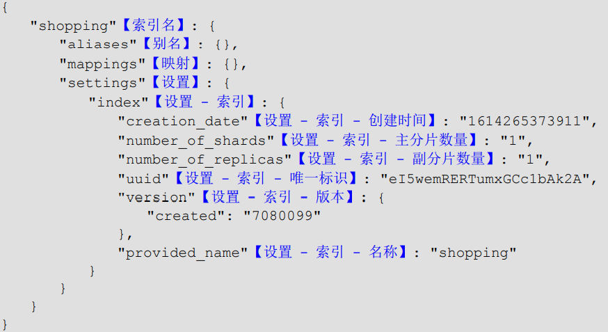
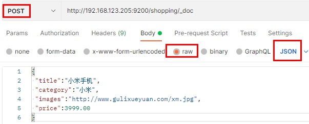

# 第 一 章、介绍

课程视频：
[https://www.bilibili.com/video/BV1hh411D7sb](https://www.bilibili.com/video/BV1hh411D7sb)

## 1.1、安装

### 1.1.1、下载软件

Elasticsearch 的官方地址：[https://www.elastic.co/cn/](https://www.elastic.co/cn/)
下载地址：[https://www.elastic.co/cn/downloads/past-releases#elasticsearch](https://www.elastic.co/cn/downloads/past-releases#elasticsearch)
文档：
[https://www.elastic.co/guide/en/elasticsearch/reference/7.4/getting-started-search.html](https://www.elastic.co/guide/en/elasticsearch/reference/7.4/getting-started-search.html)

### 1.1.2、安装软件

Windows 版的 Elasticsearch 的安装很简单，解压即安装完毕

| **目录** | **说明**       |
| -------- | -------------- |
| bin      | 可执行脚本目录 |
| config   | 配置目录       |
| jdk      | 内置 JDK 目录  |
| lib      | 类库           |
| logs     | 日志目录       |
| modules  | 模块目录       |
| plugins  | 插件目录       |

解压后，进入 bin 文件目录，点击 `elasticsearch.bat` 文件启动 ES 服务

> 注意：9300 端口为 Elasticsearch 集群间组件的通信端口，9200 端口为浏览器访问的 http协议 RESTful 端口。
> 打开浏览器（推荐使用谷歌浏览器），输入地址：http://ip:9200，测试结果

### 1.1.3、问题解决

- Elasticsearch 是使用 java 开发的，且 7.8 版本的 ES 需要 JDK 版本 1.8 以上，默认安装包带有 jdk 环境，如果系统配置 JAVA_HOME，那么使用系统默认的 JDK，如果没有配置使用自带的 JDK，一般建议使用系统配置的 JDK。
- 双击启动窗口闪退，通过路径访问追踪错误，如果是“空间不足”，请修改config/jvm.options 配置文件

```bash
# 设置 JVM 初始内存为 1G。此值可以设置与-Xmx 相同，以避免每次垃圾回收完成后 JVM 重新分配内存
# Xms represents the initial size of total heap space
# 设置 JVM 最大可用内存为 1G
# Xmx represents the maximum size of total heap space
-Xms1g
-Xmx1g
```

## 1.2、Docker 安装 Es

### 1.2.1、下载镜像文件

`docker pull elasticsearch:7.4.2` 存储和检索数据
`docker pull kibana:7.4.2` 可视化检索数

### 1.2.2、创建实例

- ElasticSearch

```bash
# 创建挂载目录
mkdir -p /mydata/elasticsearch/config
mkdir -p /mydata/elasticsearch/data
echo "http.host: 0.0.0.0" >> /mydata/elasticsearch/config/elasticsearch.yml
# 设置目录权限，必须设置，不然没法启动
chmod -R 777 /mydata/elasticsearch/

# 启动
docker run --name elasticsearch -p 9200:9200 -p 9300:9300 \
-e "discovery.type=single-node" \
-e ES_JAVA_OPTS="-Xms64m -Xmx512m" \
-v /mydata/elasticsearch/config/elasticsearch.yml:/usr/share/elasticsearch/config/elasticsearch.yml \
-v /mydata/elasticsearch/data:/usr/share/elasticsearch/data \
-v /mydata/elasticsearch/plugins:/usr/share/elasticsearch/plugins \
-d elasticsearch:7.4.2

# 以后再外面装好插件重启即可；
# 特别注意：
# -e ES_JAVA_OPTS="-Xms64m -Xmx256m" \ 测试环境下，设置 ES 的初始内存和最大内存，否则导致过大启动不了
```

- Kibana

```bash
docker run --name kibana -e ELASTICSEARCH_HOSTS=http://192.168.123.205:9200 -p 5601:5601 -d kibana:7.4.2
# http://192.168.123.205:9200 一定改为自己虚拟机的地址
```

## 1.2、数据格式

Elasticsearch 是面向文档型数据库，一条数据在这里就是一个文档。为了方便大家理解，我们将 Elasticsearch 里存储文档数据和关系型数据库 MySQL 存储数据的概念进行一个类比

ES 里的 Index 可以看做一个库，而 Types 相当于表，Documents 则相当于表的行。
这里 Types 的概念已经被逐渐弱化，Elasticsearch 6.X 中，一个 index 下已经只能包含一个type，Elasticsearch 7.X 中, Type 的概念已经被删除了。

## 1.3、Kibana

# 第 二 章、HTTP 操作

## 2.1、索引操作

### 2.1.1、创建索引

对比关系型数据库，创建索引就等同于创建数据库
在 Postman 中，向 ES 服务器发 **PUT 请求** ：http://127.0.0.1:9200/shopping


### 2.1.2、查看所有索引

在 Postman 中，向 ES 服务器发 **GET 请求** ：http://127.0.0.1:9200/_cat/indices?v
这里请求路径中的_cat 表示查看的意思，indices 表示索引，所以整体含义就是查看当前 ES服务器中的所有索引。


### 2.1.3、查看单个索引

在 Postman 中，向 ES 服务器发 **GET 请求** ：http://127.0.0.1:9200/shopping
查看索引向 ES 服务器发送的请求路径和创建索引是一致的。但是 HTTP 方法不一致。


### 2.1.4、删除索引

在 Postman 中，向 ES 服务器发 **DELETE 请求** ：http://127.0.0.1:9200/shopping

## 2.2、文档操作

### 2.2.1、创建文档

添加的数据格式为 JSON 格式
在 Postman 中，向 ES 服务器发 POST 请求 ：http://127.0.0.1:9200/shopping/_doc

```json
{
  "title":"小米手机",
  "category":"小米",
  "images":"http://www.gulixueyuan.com/xm.jpg",
  "price":3999.00
}
```


此处发送请求的方式必须为 POST，不能是 PUT，否则会发生错误

上面的数据创建后，由于没有指定数据唯一性标识（ID），默认情况下，ES 服务器会随机生成一个。
如果想要自定义唯一性标识，需要在创建时指定：http://127.0.0.1:9200/shopping/_doc/1

>  此处需要注意：如果增加数据时明确数据主键，那么请求方式也可以为 PUT  


### 2.2.2、查看文档

查看文档时，需要指明文档的唯一性标识，类似于 MySQL 中数据的主键查询
在 Postman 中，向 ES 服务器发 **GET 请求** ：http://127.0.0.1:9200/shopping/_doc/1

_seq_no 是乐观锁相关操作
[https://www.bilibili.com/video/BV1np4y1C7Yf?p=107](https://www.bilibili.com/video/BV1np4y1C7Yf?p=107)

### 2.2.3、修改文档

和新增文档一样，输入相同的 URL 地址请求，如果请求体变化，会将原有的数据内容覆盖
在 Postman 中，向 ES 服务器发 **POST 请求** ：http://127.0.0.1:9200/shopping/_doc/1


### 2.2.4、修改字段

修改数据时，也可以只修改某一给条数据的局部信息
在 Postman 中，向 ES 服务器发 **POST 请求** ：http://127.0.0.1:9200/shopping/_update/1
请求体内容为：

```json
{ 
 "doc": {
    "price":3333.00
 } 
}
```

### 2.2.5、删除文档

删除一个文档不会立即从磁盘上移除，它只是被标记成已删除（逻辑删除）。
在 Postman 中，向 ES 服务器发 **DELETE 请求** ：http://127.0.0.1:9200/shopping/_doc/1


### 2.2.6、条件删除文档

一般删除数据都是根据文档的唯一性标识进行删除，实际操作时，也可以根据条件对多条数据进行删除
首先分别增加多条数据:

```json
{
 "title":"小米手机",
 "category":"小米",
 "images":"http://www.gulixueyuan.com/xm.jpg",
 "price":4000.00
}
{
 "title":"华为手机",
 "category":"华为",
 "images":"http://www.gulixueyuan.com/hw.jpg",
 "price":4000.00
}
```

向 ES 服务器发 **POST 请求** ：http://127.0.0.1:9200/shopping/_delete_by_query
请求体内容为：

```json
{
	"query":{
		 "match":{
			"price":4000.00
		}
	}
}
```


### 2.2.7、批量操作

```json
POST user/_bulk
{"title":"小米手机","category":"小米","images":"http://www.gulixueyuan.com/xm.jpg","price":4000}
{"title":"华为手机","category":"华为","images":"http://www.gulixueyuan.com/hw.jpg","price":4000}
```

## 2.3、映射操作

有了索引库，等于有了数据库中的 database。
接下来就需要建索引库(index)中的映射了，类似于数据库(database)中的表结构(table)。
创建数据库表需要设置字段名称，类型，长度，约束等；索引库也一样，需要知道这个类型
下有哪些字段，每个字段有哪些约束信息，这就叫做映射(mapping)。

### 2.3.1、创建映射

在 Postman 中，向 ES 服务器发 **PUT 请求** ：http://127.0.0.1:9200/student/_mapping
请求体内容为：

```json
{
	"properties": {
		"name":{
			"type": "text",
			"index": true
		},
		"sex":{
			"type": "text",
			"index": false
		},
		"age":{
			"type": "long",
			"index": false
		}
	}
}
```

映射数据说明：

- 字段名：任意填写，下面指定许多属性，例如：title、subtitle、images、price
- type：类型，Elasticsearch 中支持的数据类型非常丰富，关键的：
  - String 类型，又分两种：
    - text：可分词
    - keyword：不可分词，数据会作为完整字段进行匹配
  - Numerical：数值类型，分两类
    - 基本数据类型：long、integer、short、byte、double、float、half_float
    - 浮点数的高精度类型：scaled_float
  - Date：日期类型
  - Array：数组类型
  - Object：对象
- index：是否索引，默认为 true，也就是说你不进行任何配置，所有字段都会被索引。
  - true：字段会被索引，则可以用来进行搜索
  - false：字段不会被索引，不能用来搜索
- store：是否将数据进行独立存储，默认为 false
  - 原始的文本会存储在_source 里面，默认情况下其他提取出来的字段都不是独立存储的，是从_source 里面提取出来的。当然你也可以独立的存储某个字段，只要设置"store": true 即可，获取独立存储的字段要比从_source 中解析快得多，但是也会占用更多的空间，所以要根据实际业务需求来设置。
- analyzer：分词器，这里的 ik_max_word 即使用 ik 分词器,后面会有专门的章节学习

### 2.3.2、查看映射

在 Postman 中，向 ES 服务器发 **GET 请求** ：http://127.0.0.1:9200/student/_mapping

### 2.3.3、索引映射关联

在 Postman 中，向 ES 服务器发 **PUT 请求** ：http://127.0.0.1:9200/student1

```json
{
	"settings": {},
	"mappings": {
		"properties": {
			"name":{
				"type": "text",
				"index": true
			},
			"sex":{
				"type": "text",
				"index": false
			},
			"age":{
				"type": "long",
				"index": false
			}
		}
	}
}
```

## 2.4、高级查询

Elasticsearch 提供了基于 JSON 提供完整的查询 DSL 来定义查询
定义数据 :

```json
# POST /student/_doc/1001
{
	"name":"zhangsan",
	"nickname":"zhangsan",
	"sex":"男",
	"age":30
}
# POST /student/_doc/1002
{
	"name":"lisi",
	"nickname":"lisi",
	"sex":"男",
	"age":20
}
# POST /student/_doc/1003
{
	"name":"wangwu",
	"nickname":"wangwu",
	"sex":"女",
	"age":40
}
# POST /student/_doc/1004
{
	"name":"zhangsan1",
	"nickname":"zhangsan1",
	"sex":"女",
	"age":50
}
# POST /student/_doc/1005
{
	"name":"zhangsan2",
	"nickname":"zhangsan2",
	"sex":"女",
	"age":30
}

```

### 2.4.1、查询所有文档

在 Postman 中，向 ES 服务器发 **GET 请求** ：http://127.0.0.1:9200/student/_search

```json
{
  "query": {
    "match_all": {}
  }
}
```

> "query"：这里的 query 代表一个查询对象，里面可以有不同的查询属性
> "match_all"：查询类型，例如：match_all(代表查询所有)， match，term ， range 等等
> {查询条件}：查询条件会根据类型的不同，写法也有差异


### 2.4.2、匹配查询

match 匹配类型查询，会把查询条件进行分词，然后进行查询，多个词条之间是 or 的关系
在 Postman 中，向 ES 服务器发 GET 请求 ：http://127.0.0.1:9200/student/_search

```json
{
	"query": {
		"match": {
			"name":"zhangsan"
		}
	}
}
```

### 2.4.3、字段匹配查询

multi_match 与 match 类似，不同的是它可以在多个字段中查询。
在 Postman 中，向 ES 服务器发 GET 请求 ：http://127.0.0.1:9200/student/_search

```json
{
	"query": {
		"multi_match": {
			"query": "zhangsan",
			"fields": ["name","nickname"]
		}
	}
}
```

### 2.4.4、关键字精确查询

term 查询，精确的关键词匹配查询，不对查询条件进行分词。
在 Postman 中，向 ES 服务器发 GET 请求 ：http://127.0.0.1:9200/student/_search

```json
{
	"query": {
		"term": {
			"name": {
				"value": "zhangsan"
			}
		}
	}
}
```

### 2.4.5、多关键字精确查询

terms 查询和 term 查询一样，但它允许你指定多值进行匹配。
如果这个字段包含了指定值中的任何一个值，那么这个文档满足条件，类似于 mysql 的 in
在 Postman 中，向 ES 服务器发 GET 请求 ：http://127.0.0.1:9200/student/_search

```json
{
	"query": {
		"terms": {
			"name": ["zhangsan","lisi"]
		}
	}
}
```

### 2.4.6、指定查询字段

默认情况下，Elasticsearch 在搜索的结果中，会把文档中保存在_source 的所有字段都返回。
如果我们只想获取其中的部分字段，我们可以添加_source 的过滤
在 Postman 中，向 ES 服务器发 GET 请求 ：http://127.0.0.1:9200/student/_search

```json
{
	"_source": ["name","nickname"], 
	"query": {
		"terms": {
			"nickname": ["zhangsan"]
		}
	}
}
```

### 2.4.7、过滤字段

我们也可以通过：

- includes：来指定想要显示的字段
- excludes：来指定不想要显示的字段

在 Postman 中，向 ES 服务器发 GET 请求 ：http://127.0.0.1:9200/student/_search

```json
{
	"_source": {
		"includes": ["name","nickname"]
	}, 
	"query": {
		"terms": {
			"nickname": ["zhangsan"]
		}
	}
}
```

```json
{
	"_source": {
		"excludes": ["name","nickname"]
	}, 
	"query": {
		"terms": {
			"nickname": ["zhangsan"]
		}
	}
}
```

### 2.4.8、组合查询

`bool`把各种其它查询通过`must`（必须 ）、`must_not`（必须不）、`should`（应该）的方式进行组合
在 Postman 中，向 ES 服务器发 GET 请求 ：http://127.0.0.1:9200/student/_search

```json
{
	"query": {
		"bool": {
			"must": [
				{
					"match": {
						"name": "zhangsan"
					}
				}
			],
			"must_not": [
				{
					"match": {
						"age": "40"
					}
				}
			],
			"should": [
				{
					"match": {
						"sex": "男"
					}
				}
			]
		}
	}
}
```

### 2.4.9、范围查询

range 查询找出那些落在指定区间内的数字或者时间。range 查询允许以下字符

| **操作符** | **说明**   |
| ---------- | ---------- |
| gt         | 大于>      |
| gte        | 大于等于>= |
| lt         | 小于<      |
| lte        | 小于等于<= |

在 Postman 中，向 ES 服务器发 GET 请求 ：http://127.0.0.1:9200/student/_search

```json
{
	"query": {
		"range": {
			"age": {
				"gte": 30,
				"lte": 35
			}
		}
	}
}
```

### 2.4.10、模糊查询

返回包含与搜索字词相似的字词的文档。
编辑距离是将一个术语转换为另一个术语所需的一个字符更改的次数。这些更改可以包括：

- 更改字符（box → fox）
- 删除字符（black → lack）
- 插入字符（sic → sick）
- 转置两个相邻字符（act → cat）

为了找到相似的术语，fuzzy 查询会在指定的编辑距离内创建一组搜索词的所有可能的变体或扩展。然后查询返回每个扩展的完全匹配。
通过 fuzziness 修改编辑距离。一般使用默认值 AUTO，根据术语的长度生成编辑距离。
在 Postman 中，向 ES 服务器发 GET 请求 ：http://127.0.0.1:9200/student/_search

```json
{
	"query": {
		"fuzzy": {
			"name": {
				"value": "zhangsan"
			}
		}
	}
}
```

```json
{
	"query": {
		"fuzzy": {
			"name": {
				"value": "zhangsan"
				"fuzziness": 2
			}
		}
	}
}
```

### 2.4.11、单字段排序

sort 可以让我们按照不同的字段进行排序，并且通过 order 指定排序的方式。desc 降序，asc升序。
在 Postman 中，向 ES 服务器发 GET 请求 ：http://127.0.0.1:9200/student/_search

```json
{
	"query": {
		"match_all": {}
	},
	"sort": [
		{
			"age": {
				"order":"desc"
			}
		}
	]
}
```

### 2.4.12、多字段排序

假定我们想要结合使用 age 和 _score 进行查询，并且匹配的结果首先按照年龄排序，然后按照相关性得分排序
在 Postman 中，向 ES 服务器发 GET 请求 ：http://127.0.0.1:9200/student/_search

```json
{
	"query": {
		"match_all": {}
	},
	"sort": [
		{
			"age": {
				"order": "desc"
			}
		},
		{
			"_score":{
				"order": "desc"
			}
		}
	]
}
```

### 2.4.13、高亮查询

在进行关键字搜索时，搜索出的内容中的关键字会显示不同的颜色，称之为高亮。
Elasticsearch 可以对查询内容中的关键字部分，进行标签和样式(高亮)的设置。
在使用 match 查询的同时，加上一个 highlight 属性：

- pre_tags：前置标签
- post_tags：后置标签
- fields：需要高亮的字段
- title：这里声明 title 字段需要高亮，后面可以为这个字段设置特有配置，也可以空

在 Postman 中，向 ES 服务器发 GET 请求 ：http://127.0.0.1:9200/student/_search

```json
{
	"query": {
		"match": {
			"name": "zhangsan"
		}
	},
	"highlight": {
		"pre_tags": "<font color='red'>",
		"post_tags": "</font>",
		"fields": {
			"name": {}
		}
	}
}
```

### 2.4.14、分页查询

- from：当前页的起始索引，默认从 0 开始。 from = (pageNum - 1) * size
- size：每页显示多少条

在 Postman 中，向 ES 服务器发 GET 请求 ：http://127.0.0.1:9200/student/_search

```json
{
	"query": {
		"match_all": {}
	},
	"sort": [
		{
			"age": {
				"order": "desc"
			}
		}
	],
	"from": 0,
	"size": 2
}
```

### 2.4.15、聚合查询

聚合允许使用者对 es 文档进行统计分析，类似与关系型数据库中的 group by，当然还有很多其他的聚合，例如对某个字段取最大值、平均值等等。
下面都是对某个字段进行操作。

#### ①取最大值 max

在 Postman 中，向 ES 服务器发 GET 请求 ：http://127.0.0.1:9200/student/_search

```json
{
	"aggs":{
		"max_age":{
			"max":{"field":"age"}
		}
	},
	"size":0
}
```

#### ②取最小值 min

在 Postman 中，向 ES 服务器发 GET 请求 ：http://127.0.0.1:9200/student/_search

```json
{
	"aggs":{
		"min_age":{
			"min":{"field":"age"}
		}
	},
	"size":0
}
```

#### ③求和 sum

在 Postman 中，向 ES 服务器发 GET 请求 ：http://127.0.0.1:9200/student/_search

```json
{
	"aggs":{
		"sum_age":{
			"sum":{"field":"age"}
		}
	},
	"size":0
}
```

#### ④取平均值 avg

在 Postman 中，向 ES 服务器发 GET 请求 ：http://127.0.0.1:9200/student/_search

```json
{
	"aggs":{
		"avg_age":{
			"avg":{"field":"age"}
		}
	},
	"size":0
}
```

#### ⑤值进行去重之后再取总数

在 Postman 中，向 ES 服务器发 GET 请求 ：http://127.0.0.1:9200/student/_search

```json
{
	"aggs":{
		"distinct_age":{
			"cardinality":{"field":"age"}
		}
	},
	"size":0
}
```

#### ⑥State 聚合

stats 聚合，对某个字段一次性返回 count，max，min，avg 和 sum 五个指标
在 Postman 中，向 ES 服务器发 GET 请求 ：http://127.0.0.1:9200/student/_search

```json
{
	"aggs":{
		"stats_age":{
			"stats":{"field":"age"}
		}
	},
	"size":0
}
```

### 2.4.16、分组查询

相当于 sql 中的 group by 语句
terms 聚合，分组统计
在 Postman 中，向 ES 服务器发 GET 请求 ：http://127.0.0.1:9200/student/_search

```json
{
	"aggs":{
		"age_groupby":{
			"terms":{"field":"age"}
		}
	},
	"size":0
}
```

## 2.5、Kibana 练习

```bash
## 查询全部
GET _search
{
  "query": {
    "match_all": {}
  }
}

## 排序
GET bank/_search
{
  "query": {
    "match_all": {}
  },
  "sort": [
    {
      "age": {
        "order": "asc"
      }
    }
  ]
}

## 匹配查询，会分词
GET bank/_search
{
  "query": {
    "match": {
      "address" : "mill lane"
    }
  }
}

## 短句匹配
GET bank/_search
{
  "query": {
    "match_phrase": {
      "address" : "mill lane"
    }
  }
}

## 多字段匹配
GET bank/_search
{
  "query": {
    "multi_match": {
      "query": "Lopezo Castleton",
      "fields": ["city","address"]
    }
  }
}


## 组合查询
GET bank/_search
{
  "query": {
    "bool": {
      "must": [
        {
          "match": {
            "address" : "mill"
          }
        }
      ],
      "must_not": [
        {
          "match": {
            "age" : 18
          }
        }
      ],
      "should": [
        {
          "match": {
            "lastname" : "Wallace"
          }
        }
      ]
    }
  }
}


## 过滤查询
GET bank/_search
{
  "query": {
    "bool": {
      "must": [
        {"match_all": {}}
      ],
      "filter": {
        "range": {
          "balance": {
            "gte": 20000,
            "lte": 30000
          }
        }
      }
    }
  }
}


## 非 text 字段用 term。
GET bank/_search
{
  "query": {
    "term": {
      "account_number": {
        "value": "49"
      }
    }
  }
}

## 精准完全匹配
GET bank/_search
{
  "query": {
    "match": {
      "address.keyword": "Humboldt Street"
    }
  }
}

## 只要包含就可以
GET bank/_search
{
  "query": {
    "match_phrase": {
      "address": "Humboldt Street"
    }
  }
}


## 会进行分词查询
GET bank/_search
{
  "query": {
    "match": {
      "address": "Humboldt Street"
    }
  }
}

## 搜索所有人的年龄分布以及平均年龄，但不显示这些人的详情。
GET bank/_search
{
  "query": {
    "match_all": {}
  },
  "aggs": {
    "ageAss": {
      "terms": {
        "field": "age",
        "size": 10
      }
    },
    "ageAvg": {
      "avg": {
        "field": "age"
      }
    }
  },
  "size": 0
}

## 按照年龄聚合，并且请求这些年龄段的这些人的平均薪资
GET bank/_search
{
  "aggs": {
    "ageAss": {
      "terms": {
        "field": "age",
        "size": 10
      },
      "aggs": {
        "balanceAvg": {
          "avg": {
            "field": "balance"
          }
        }
      }
    }
  },
  "size": 0
}


## 查出所有年龄分布，并且这些年龄段中 M 的平均薪资和 F 的平均薪资以及这个年龄段的总体平均薪资
GET bank/_search
{
  "aggs": {
    "ageAGG": {
      "terms": {
        "field": "age",
        "size": 100
      },
      "aggs": {
        "genderAGG": {
          "terms": {
            "field": "gender.keyword",
            "size": 10
          },
          "aggs": {
            "balanceAvg": {
              "avg": {
                "field": "balance"
              }
            }
          }
        }
      }
    },
    "balanceAvg":{
      "avg": {
        "field": "balance"
      }
    }
  },
  "size": 0
}

```

# 第 三 章、Java API 操作

## 3.1、创建 Maven 项目

```xml
<dependencies>
    <dependency>
        <groupId>org.elasticsearch</groupId>
        <artifactId>elasticsearch</artifactId>
        <version>7.4.2</version>
    </dependency>
    <!-- elasticsearch 的客户端 -->
    <dependency>
        <groupId>org.elasticsearch.client</groupId>
        <artifactId>elasticsearch-rest-high-level-client</artifactId>
        <version>7.4.2</version>
    </dependency>
    <!-- elasticsearch 依赖 2.x 的 log4j -->
    <dependency>
        <groupId>org.apache.logging.log4j</groupId>
        <artifactId>log4j-api</artifactId>
        <version>2.8.2</version>
    </dependency>
    <dependency>
        <groupId>org.apache.logging.log4j</groupId>
        <artifactId>log4j-core</artifactId>
        <version>2.8.2</version>
    </dependency>
    <dependency>
        <groupId>com.fasterxml.jackson.core</groupId>
        <artifactId>jackson-databind</artifactId>
        <version>2.9.9</version>
    </dependency>
    <!-- junit 单元测试 -->
    <dependency>
        <groupId>junit</groupId>
        <artifactId>junit</artifactId>
        <version>4.12</version>
    </dependency>
</dependencies>
```

## 3.2、客户端对象

创建 com.atguigu.es.test.Elasticsearch01_Client 类，代码中创建 Elasticsearch 客户端对象
因为早期版本的客户端对象已经不再推荐使用，且在未来版本中会被删除，所以这里我们采用高级 REST 客户端对象


## 3.2、索引操作

ES 服务器正常启动后，可以通过 Java API 客户端对象对 ES 索引进行操作

```java
public class IndexTest {

    /**
     * 创建客户端
     */
    public RestHighLevelClient getClient() {
        HttpHost http = new HttpHost("192.168.123.205", 9200, "http");
        RestClientBuilder builder = RestClient.builder(http);
        return new RestHighLevelClient(builder);
    }
    /**
     * 创建索引
     */
    @Test
    public void testCreate() throws IOException {
        RestHighLevelClient client = getClient();
        // 获取索引操作客户端
        IndicesClient indices = client.indices();
        // 创建索引的请求对象
        CreateIndexRequest request = new CreateIndexRequest("user");
        // 发送请求，获取响应
        CreateIndexResponse response = indices.create(request, RequestOptions.DEFAULT);
        System.out.println(response.isAcknowledged());
        // 关闭客户端
        client.close();
    }

    /**
     * 查看索引
     */
    @Test
    public void testGet() throws IOException {
        RestHighLevelClient client = getClient();
        IndicesClient indices = client.indices();
        // 查看索引的请求对象
        GetIndexRequest request = new GetIndexRequest("shopping");
        // 发送请求，获取响应
        GetIndexResponse response = indices.get(request, RequestOptions.DEFAULT);
        System.out.println("aliases:"+response.getAliases());
        System.out.println("mappings:"+response.getMappings());
        System.out.println("settings:"+response.getSettings());

        client.close();
    }

    /**
     * 删除索引
     */
    @Test
    public void testDelete() throws IOException {
        RestHighLevelClient client = getClient();
        IndicesClient indices = client.indices();
        // 查看索引的请求对象
        DeleteIndexRequest request = new DeleteIndexRequest("shopping");
        // 发送请求，获取响应
        AcknowledgedResponse response = indices.delete(request, RequestOptions.DEFAULT);
        System.out.println("操作结果 ： " + response.isAcknowledged());

        client.close();
    }
}
```

## 3.3、文档操作

```java
public class DocTest {

    /**
     * 新增文档
     */
    @Test
    public void testAdd() throws IOException {
        RestHighLevelClient client = IndexTest.getClient();

        // 新增文档的请求对象,并设置索引
        IndexRequest request = new IndexRequest("user");
        // 设置文档的唯一标识
        request.id("1001");

        // 创建文档对象
        User user = new User("zhangshan", 30, "男");
        ObjectMapper mapper = new ObjectMapper();
        String userJson = mapper.writeValueAsString(user);

        // 向请求对象中添加文档，格式为Json
        request.source(userJson, XContentType.JSON);

        // 客户端发送请求，获取响应对象
        IndexResponse response = client.index(request, RequestOptions.DEFAULT);

        // 打印结果信息
        System.out.println("_index:" + response.getIndex());
        System.out.println("_id:" + response.getId());
        System.out.println("_result:" + response.getResult());
        client.close();
    }

    /**
     * 修改文档
     */
    @Test
    public void testUpdate() throws IOException {
        RestHighLevelClient client = IndexTest.getClient();
        // 创建修改文档的请求对象
        UpdateRequest request = new UpdateRequest("user", "1001");
        // 设置请求体
        request.doc(XContentType.JSON, "sex", "女55");
        // 发送请求
        UpdateResponse response = client.update(request, RequestOptions.DEFAULT);

        System.out.println("_index:" + response.getIndex());
        System.out.println("_id:" + response.getId());
        System.out.println("_result:" + response.getResult());

        client.close();
    }

    /**
     * 查询文档
     */
    @Test
    public void testGet() throws IOException {
        RestHighLevelClient client = IndexTest.getClient();
        GetRequest request = new GetRequest("user","1001");
        GetResponse response = client.get(request, RequestOptions.DEFAULT);

        // 打印结果信息
        System.out.println("_index:" + response.getIndex());
        System.out.println("_type:" + response.getType());
        System.out.println("_id:" + response.getId());
        System.out.println("source:" + response.getSourceAsString());
    }

    /**
     * 删除文档
     */
    @Test
    public void testDelete() throws IOException {
        RestHighLevelClient client = IndexTest.getClient();
        DeleteRequest request = new DeleteRequest("user", "1001");
        DeleteResponse response = client.delete(request, RequestOptions.DEFAULT);
        System.out.println(response.toString());
    }

    /**
     * 批量新增
     */
    @Test
    public void testBulk() throws IOException {
        RestHighLevelClient client = IndexTest.getClient();
        BulkRequest request = new BulkRequest();
        request.add(new IndexRequest("user").id("1001").source(XContentType.JSON, "name", "张三"));
        request.add(new IndexRequest("user").id("1002").source(XContentType.JSON, "name", "李四"));
        request.add(new IndexRequest("user").id("1003").source(XContentType.JSON, "name", "王五"));
        BulkResponse responses = client.bulk(request, RequestOptions.DEFAULT);
        System.out.println("took:" + responses.getTook());
        System.out.println("items:" + Arrays.toString(responses.getItems()));
    }

    /**
     * 批量删除
     */
    @Test
    public void testBulkDelete() throws IOException {
        RestHighLevelClient client = IndexTest.getClient();
        BulkRequest request = new BulkRequest();
        request.add(new DeleteRequest("user", "1001"));
        request.add(new DeleteRequest("user", "1002"));
        request.add(new DeleteRequest("user", "1003"));
        BulkResponse responses = client.bulk(request, RequestOptions.DEFAULT);
        System.out.println("took:" + responses.getTook());
    }
}
```

## 3.4、高级搜索

### 3.4.1、查询全部

```java
public class SearchTest {
    /**
     * 请求和输出，通用方法，其他测试都会使用这个方法
     */
    public static SearchResponse requestAndOutput(SearchSourceBuilder sourceBuilder) throws IOException {
        // 获取客户端
        RestHighLevelClient client = IndexTest.getClient();
        // 搜索请求对象
        SearchRequest request = new SearchRequest("student");

        // 发送请求，并且输出请求结果
        request.source(sourceBuilder);
        SearchResponse response = client.search(request, RequestOptions.DEFAULT);
        SearchHits hits = response.getHits();
        System.out.println("took:" + response.getTook());
        System.out.println("timeout:" + response.isTimedOut());
        System.out.println("total:" + hits.getTotalHits());
        System.out.println("MaxScore:" + hits.getMaxScore());
        System.out.println("hits========>>");
        for (SearchHit hit : hits) {
            //输出每条查询的结果信息
            System.out.println(hit.getSourceAsString());
        }
        System.out.println("<<========");
        // 关闭客户端
        client.close();
        return response;
    }
    /**
     * 查询全部
     */
    @Test
    public void testBody() throws IOException {
        SearchSourceBuilder sourceBuilder = new SearchSourceBuilder();
        sourceBuilder.query(QueryBuilders.matchAllQuery());
        requestAndOutput(sourceBuilder);
    }
}

```

### 3.4.2、关键词查询

```java
    /**
     * term 查询，查询条件为关键字
     */
    @Test
    public void testTerm() throws IOException {
        // 构建查询的请求体
        SearchSourceBuilder sourceBuilder = new SearchSourceBuilder();
        sourceBuilder.query(QueryBuilders.termQuery("age","30"));
        requestAndOutput(sourceBuilder);
    }

```

### 3.4.3、分页查询

```java
    /**
     * 分页查询
     */
    @Test
    public void testPagingQuery() throws IOException {
        SearchSourceBuilder sourceBuilder = new SearchSourceBuilder();
        sourceBuilder.query(QueryBuilders.matchAllQuery());
        // 配置分页查询
        sourceBuilder.from(0);
        sourceBuilder.size(3);
        requestAndOutput(sourceBuilder);
    }

```

### 3.4.4、结果排序

```java
    /**
     * 数据排序
     */
    @Test
    public void testSort() throws IOException {
        SearchSourceBuilder sourceBuilder = new SearchSourceBuilder();
        sourceBuilder.query(QueryBuilders.matchAllQuery());
        // 设置排序
        sourceBuilder.sort("age", SortOrder.DESC);
        requestAndOutput(sourceBuilder);
    }

```

### 3.4.5、字段过滤

```java
    /**
     * 过滤字段
     */
    @Test
    public void testExcludes() throws IOException {
        SearchSourceBuilder sourceBuilder = new SearchSourceBuilder();
        sourceBuilder.query(QueryBuilders.matchAllQuery());
        // 配置查询字段过滤
        String[] includes = {"name", "age"};
        String[] excludes = {};
        sourceBuilder.fetchSource(includes, excludes);
        requestAndOutput(sourceBuilder);
    }

```

### 3.4.6、Bool 查询

```java
    /**
     * Bool 查询
     */
    @Test
    public void testBool() throws IOException {
        SearchSourceBuilder sourceBuilder = new SearchSourceBuilder();
        // 构建Bool
        BoolQueryBuilder boolQuery = QueryBuilders.boolQuery();
        // 必须包含
        boolQuery.must(QueryBuilders.matchQuery("age", "30"));
        // 一定不含
        boolQuery.mustNot(QueryBuilders.matchQuery("name", "zhangsan"));
        // 可能包含
        boolQuery.should(QueryBuilders.matchQuery("sex", "男"));
        // Bool导入请求体
        sourceBuilder.query(boolQuery);
        requestAndOutput(sourceBuilder);
    }
```

### 3.4.7、范围查询

```java
    /**
     * 范围查询
     */
    @Test
    public void testRange() throws IOException {
        SearchSourceBuilder sourceBuilder = new SearchSourceBuilder();

        RangeQueryBuilder rangeQuery = QueryBuilders.rangeQuery("age");
        rangeQuery.gte(30);
        rangeQuery.lte(40);

        sourceBuilder.query(rangeQuery);
        requestAndOutput(sourceBuilder);
    }
```

### 3.4.8、模糊查询

```java
    /**
     * 模糊查询
     */
    @Test
    public void testFuzzy() throws IOException {
        SearchSourceBuilder sourceBuilder = new SearchSourceBuilder();
        FuzzyQueryBuilder fuzzyQuery = QueryBuilders.fuzzyQuery("name", "zhangsan");
        fuzzyQuery.fuzziness(Fuzziness.ONE);
        sourceBuilder.query(fuzzyQuery);
        requestAndOutput(sourceBuilder);
    }
```

### 3.4.9、高亮查询

```java
    @Test
    public void testHighlight() throws IOException {
        SearchSourceBuilder sourceBuilder = new SearchSourceBuilder();
        FuzzyQueryBuilder fuzzyQuery = QueryBuilders.fuzzyQuery("name", "zhangsan");
        sourceBuilder.query(fuzzyQuery);

        //设置高亮构建对象
        HighlightBuilder highlightBuilder = new HighlightBuilder();
        highlightBuilder.preTags("<font color='red'>"); //设置前缀
        highlightBuilder.postTags("</font>");   //设置后缀
        highlightBuilder.field("name"); //设置高亮字段
        sourceBuilder.highlighter(highlightBuilder);

        SearchResponse response = SearchTest.requestAndOutput(sourceBuilder);

        // 打印高亮结果
        System.out.println("==========下面是打印的高亮===========");
        for (SearchHit hit : response.getHits()) {
            System.out.println( hit.getHighlightFields());
        }
    }
```

## 3.5、聚合查询

### 3.5.1、最大年龄

```java
    /**
     * 最大年龄
     */
    @Test
    public void testGroup() throws IOException {
        SearchSourceBuilder sourceBuilder = new SearchSourceBuilder();
        sourceBuilder.aggregation(AggregationBuilders.max("maxAge").field("age"));
        SearchResponse response = SearchTest.requestAndOutput(sourceBuilder);
        System.out.println(response);
    }
```

### 3.5.2、分组统计

```java
    /**
     * 分组统计
     */
    @Test
    public void testGroupStatistics() throws IOException {
        SearchSourceBuilder sourceBuilder = new SearchSourceBuilder();
        sourceBuilder.aggregation(AggregationBuilders.terms("ageGroupBy").field("age"));
        SearchResponse response = SearchTest.requestAndOutput(sourceBuilder);
        System.out.println(response);
    }
```

## 3.6、复杂嵌套检索

```java
    /**
     * 复杂检索
     */
    @Test
    public void testComplexity() throws IOException {
        RestHighLevelClient client = IndexTest.getClient();

        // 创建检索请求,并指定索引
        SearchRequest request = new SearchRequest("bank");

        // 创建DSL，类似请求体
        SearchSourceBuilder sourceBuilder = new SearchSourceBuilder();

        // 查询所有
        MatchAllQueryBuilder allQuery = QueryBuilders.matchAllQuery();
        sourceBuilder.query(allQuery);

        // 计算平均薪资
        AvgAggregationBuilder avgSalary = AggregationBuilders.avg("avgSalary").field("balance");
        sourceBuilder.aggregation(avgSalary);

        // 按年龄分布
        TermsAggregationBuilder builder = AggregationBuilders.terms("ageDistribution").field("age").size(10);
        // 按性别分布
        TermsAggregationBuilder distribution = AggregationBuilders.terms("genderDistribution").field("gender.keyword");

        // 不同性别平均薪资【三级】【嵌套】
        distribution.subAggregation(avgSalary);
        // 不同年龄段的性别分布情况【二级】【嵌套】
        builder.subAggregation(distribution);
        // 按年龄分布情况进行聚合【一级】
        sourceBuilder.aggregation(builder);

        // 输出查询条件
        System.out.println(sourceBuilder);

        // 构建请求
        request.source(sourceBuilder);

        // 发送请求并且获得结果
        SearchResponse response = client.search(request, RequestOptions.DEFAULT);

        // 输出查询的信息
        SearchHits hits = response.getHits();
        for (SearchHit hit : hits) {
            Account account = JSON.parseObject(hit.getSourceAsString(), Account.class);
            System.out.println(account);
        }

        // 输出聚合信息
        Aggregations aggregations = response.getAggregations();
        Avg avgAgg = aggregations.get("avgSalary");
        System.out.println("=======整体平均薪资==========");
        System.out.println(avgAgg.getValue());

        System.out.println("=======按年龄分布情况==========");
        Terms ageDis = aggregations.get("ageDistribution");
        List<? extends Terms.Bucket> buckets = ageDis.getBuckets();
        buckets.forEach(bucket -> {
            System.out.println("======" + bucket.getKey() + "岁==========>");
            System.out.println(bucket.getDocCount() + "人");
            Terms gender = bucket.getAggregations().get("genderDistribution");
            gender.getBuckets().forEach(g->{
                System.out.println("  " + (g.getKey().equals("M")?"男":"女") + "===");
                System.out.println("  " + g.getDocCount() + " 人");
                Avg avg = g.getAggregations().get("avgSalary");
                System.out.println("  平均薪资：" + avg.getValue());
            });
        });
        client.close();
    }

```

