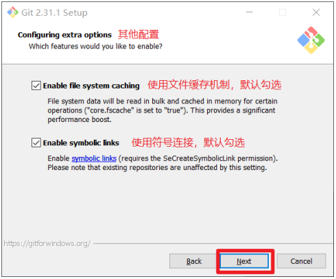
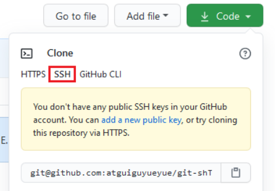

# 第1章 Git 概述
Git 是一个免费的、开源的分布式版本控制系统，可以快速高效地处理从小型到大型的各种项目。
Git 易于学习，占地面积小，性能极快。 它具有廉价的本地库，方便的暂存区域和多个工作 流分支等特性。其性能优于 Subversion、CVS、Perforce 和 ClearCase 等版本控制工具。
## 1.1 何为版本控制
版本控制是一种记录文件内容变化，以便将来查阅特定版本修订情况的系统。
版本控制其实最重要的是可以记录文件修改历史记录，从而让用户能够查看历史版本， 方便版本切换。  
## 1.2 为什么需要版本控制
个人开发过渡到团队协作。  
## 1.3 版本控制工具

- **集中式版本控制工具**
	CVS、SVN(Subversion)、VSS…… 集中化的版本控制系统诸如 CVS、SVN 等，都有一个单一的集中管理的服务器，保存所有文件的修订版本，而协同工作的人们都通过客户端连到这台服务器，取出最新的文件或 者提交更新。多年以来，这已成为版本控制系统的标准做法。
	这种做法带来了许多好处，每个人都可以在一定程度上看到项目中的其他人正在做些什 么。而管理员也可以轻松掌控每个开发者的权限，并且管理一个集中化的版本控制系统，要 远比在各个客户端上维护本地数据库来得轻松容易。
	事分两面，有好有坏。这么做显而易见的缺点是中央服务器的单点故障。如果服务器宕 机一小时，那么在这一小时内，谁都无法提交更新，也就无法协同工作。
- **分布式版本控制工具
	**Git、Mercurial、Bazaar、Darcs……
	像 Git 这种分布式版本控制工具，客户端提取的不是最新版本的文件快照，而是把代码仓库完整地镜像下来（本地库）。这样任何一处协同工作用的文件发生故障，事后都可以用其他客户端的本地仓库进行恢复。因为每个客户端的每一次文件提取操作，实际上都是一次对整个文件仓库的完整备份。
	分布式的版本控制系统出现之后,解决了集中式版本控制系统的缺陷:
      - 服务器断网的情况下也可以进行开发（因为版本控制是在本地进行的）
      - 每个客户端保存的也都是整个完整的项目（包含历史记录，更加安全）
## 1.4 Git 简史


## 1.5 Git 工作机制

## 1.6 Git 和代码托管中心
代码托管中心是基于网络服务器的远程代码仓库，一般我们简单称为远程库。

- **局域网**
✓ GitLab 
- **互联网** 
✓ GitHub（外网） 
✓ Gitee 码云（国内网站）  

#  第2章 Git 安装
 	官网地址： https://git-scm.com/
Git 选项配置，推荐默认设置，然后下一步。  

Git 的默认编辑器，建议使用默认的 Vim 编辑器，然后点击下一步。  

默认分支名设置，选择让 Git 决定，分支名默认为 master，下一步。  

修改 Git 的环境变量，选第一个，不修改环境变量，只在 Git Bash 里使用 Git。  

选择后台客户端连接协议，选默认值 OpenSSL，然后下一步。  

配置 Git 文件的行末换行符，Windows 使用 CRLF，Linux 使用 LF，选择第一个自动 转换，然后继续下一步。  

选择 Git 终端类型，选择默认的 Git Bash 终端，然后继续下一步。  

选择 Git pull 合并的模式，选择默认，然后下一步。  

选择 Git 的凭据管理器，选择默认的跨平台的凭据管理器，然后下一步。  

其他配置，选择默认设置，然后下一步。  

实验室功能，技术还不成熟，有已知的 bug，不要勾选，然后点击右下角的 Install 按钮，开始安装 Git。  

点击 Finsh 按钮，Git 安装成功！
在 Git Bash 终端里输入 git --version 查看 git 版本，如图所示，说明 Git 安装成功。  

# 第 3 章 Git 理论

## 3.1 工作区域

Git 本地有三个工作区域：工作目录（Working Directory）、暂存区(Stage/Index)、资源库(Repository 或 Git Directory)。如果再加上远程的 git 仓库(Remote Directory)就可以分为四个工作区域。

>Stash：隐藏，是一个工作状态保存栈，用于保存/恢复 WorkSpace 中的临时状态。

## 3.2 工作流程

Git 的工作流程说明：
1. 在工作目录中添加、修改文件；
2. 将需要进行版本管理的文件放入暂存区域；
3. 将暂存区域的文件提交到 git 本地仓库。
因此，git 管理的文件有三种状态：
- 已修改(modified)
- 已暂存(staged)
- 已提交(committed)


# 第 4 章 Git 常用命令

>Git 2.23及更高版本推荐使用 `git switch` 和 `git restore` 分别代替 `git checkout` 的分支切换和文件操作(工作目录或暂存区中的文件状态)

## 4.1 仓库

```bash
# 在当前目录新建一个Git代码库
$ git init

# 新建一个目录，将其初始化为Git代码库
$ git init [project-name]

# 下载一个项目和它的整个代码历史
$ git clone [url]
```

## 4.2 配置

> git status 时，中文文件名会乱码，执行下面命令解决
> git config core.quotepath false

```bash
# 显示当前的Git配置[所有]
$ git config --list
$ git config -l

# 显示系统配置
$ git config --system --list

# 显示当前用户配置
$ git config --global --list

# 编辑Git配置文件
$ git config -e [--global]

# 设置提交代码时的用户信息
$ git config [--global] user.name "[name]"
$ git config [--global] user.email "[email address]"
```

## 4.3 增加/删除文件

```bash
# 添加指定文件到暂存区
$ git add [file1] [file2] ...

# 添加指定目录到暂存区，包括子目录
$ git add [dir]

# 添加当前目录的所有文件到暂存区
$ git add .

# 添加每个变化前，都会要求确认
# 对于同一个文件的多处变化，可以实现分次提交
$ git add -p

# 删除工作区文件，并且将这次删除放入暂存区
$ git rm [file1] [file2] ...

# 停止追踪指定文件，但该文件会保留在工作区
$ git rm --cached [file]

# 改名文件，并且将这个改名放入暂存区
$ git mv [file-original] [file-renamed]

# 删除未跟踪文件（保留 `.gitignore` 文件）
git clean -f

# 未跟踪的目录也删除
git clean -fd

# 连 .gitignore 忽略的文件也要删除（慎用！）
git clean -xfd

# 在真正删除前，先看看哪些文件会被删
git clean -fdn
git clean -fd --dry-run

```

## 4.4 代码提交

```bash
# 提交暂存区到仓库区
$ git commit -m [message]

# 提交暂存区的指定文件到仓库区
$ git commit [file1] [file2] ... -m [message]

# 提交工作区自上次commit之后的变化，直接到仓库区
$ git commit -a

# 提交时显示所有diff信息
$ git commit -v

# 使用一次新的commit，替代上一次提交
# 如果代码没有任何新变化，则用来改写上一次commit的提交信息
$ git commit --amend -m [message]

# 重做上一次commit，并包括指定文件的新变化
$ git commit --amend [file1] [file2] ...
```

## 4.5 分支

```bash
# 列出所有本地分支
$ git branch

# 列出所有远程分支
$ git branch -r

# 列出所有本地分支和远程分支
$ git branch -a

# 新建一个分支，但依然停留在当前分支
$ git branch [branch-name]

# 新建一个分支，并切换到该分支
$ git checkout -b [branch]
$ git switch -c new_branch

# 新建一个分支，指向指定commit
$ git branch [branch] [commit]

# 新建一个分支，与指定的远程分支建立追踪关系
$ git branch --track [branch] [remote-branch]

# 切换到指定分支，并更新工作区
$ git checkout [branch-name]
$ git switch [branch-name]

# 切换到上一个分支
$ git checkout -

# 检出或还原某个文件到当前分支
$ git checkout <branch-name> -- <file-path>

# 建立追踪关系，在现有分支与指定的远程分支之间
$ git branch --set-upstream [branch] [remote-branch]

# 合并指定分支到当前分支
$ git merge [branch]

# 选择一个commit，合并进当前分支
$ git cherry-pick [commit]

# 删除分支
$ git branch -d [branch-name]

# 删除远程分支
$ git push origin --delete [branch-name]
$ git branch -dr [remote/branch]

# log查看分支
git log --decorate
# --oneline 精简显示
git log --decorate --oneline
# --graph 图像化显示
git log --decorate --oneline --graph --all
```

>- git冲突的场景：
>   - 情景一：多个分支代码合并到一个分支时；
>   - 情景二：多个分支向同一个远端分支推送代码时；
>- git的合并中产生冲突的具体情况：
>   1. 两个分支中修改了同一个文件（Git v2.33.0 版本后可能会根据 ort 策略合并 ）
>   2. 两个分支中修改了同一个文件的名称
>- 两个分支中分别修改了不同文件中的部分，不会产生冲突，可以直接将两部分合并。
## 4.6 标签

```bash
# 列出所有tag
$ git tag

# 新建一个tag在当前commit
$ git tag [tag]

# 新建一个tag在指定commit
$ git tag [tag] [commit]

# 删除本地tag
$ git tag -d [tag]

# 删除远程tag
$ git push origin :refs/tags/[tagName]

# 查看tag信息
$ git show [tag]

# 提交指定tag
$ git push [remote] [tag]

# 提交所有tag
$ git push [remote] --tags

# 新建一个分支，指向某个tag
$ git checkout -b [branch] [tag]
```

## 4.7 查看信息

```bash
# 显示有变更的文件
$ git status

# 显示当前分支的版本历史
$ git log

# 显示commit历史，以及每次commit发生变更的文件
$ git log --stat

# 搜索提交历史，根据关键词
$ git log -S [keyword]

# 显示某个commit之后的所有变动，每个commit占据一行
$ git log [tag] HEAD --pretty=format:%s

# 显示某个commit之后的所有变动，其"提交说明"必须符合搜索条件
$ git log [tag] HEAD --grep feature

# 显示某个文件的版本历史，包括文件改名
$ git log --follow [file]
$ git whatchanged [file]

# 显示指定文件相关的每一次diff
$ git log -p [file]

# 显示过去5次提交
$ git log -5 --pretty --oneline

# 

# 显示所有提交过的用户，按提交次数排序
$ git shortlog -sn

# 显示指定文件是什么人在什么时间修改过
$ git blame [file]

# 显示暂存区和工作区的差异
$ git diff

# 显示暂存区和上一个commit的差异
$ git diff --cached [file]

# 显示工作区与当前分支最新commit之间的差异
$ git diff HEAD

# 比较工作目录与test分支的差别
$ git diff test

# 比较当前工作目录下的lib目录与上次提交之间的差别
$ git diff HEAD -- ./lib

# 统计一下有哪些文件被改动，有多少行被改动
$ git diff --stat

# 显示两次提交之间的差异
$ git diff [first-branch]...[second-branch]

# 显示今天你写了多少行代码
$ git diff --shortstat "@{0 day ago}"

# 显示某次提交的元数据和内容变化
$ git show [commit]

# 显示某次提交发生变化的文件
$ git show --name-only [commit]

# 显示某次提交时，某个文件的内容
$ git show [commit]:[filename]

# 显示当前分支的最近几次提交
$ git reflog
```

## 4.8 远程同步

```bash
# 下载远程仓库的所有变动
$ git fetch [remote]

# 显示所有远程仓库
$ git remote -v

# 显示某个远程仓库的信息
$ git remote show [remote]

# 增加一个新的远程仓库，并命名
$ git remote add [shortname] [url]

# 取回远程仓库的变化，并与本地分支合并
$ git pull [remote] [branch]

# 上传本地指定分支到远程仓库
$ git push [remote] [branch]

# 强行推送当前分支到远程仓库，即使有冲突
$ git push [remote] --force

# 推送所有分支到远程仓库
$ git push [remote] --all
```

## 4.9 撤销

```bash
# 撤回最近一次 commit（保留修改到工作区）相当于还没执行git commit
git reset --soft HEAD~1

# 恢复暂存区的指定文件到工作区
$ git checkout -- [file]
$ git restore <file>

# 恢复某个commit的指定文件到暂存区和工作区
$ git checkout [commit] [file]

# 恢复暂存区的所有文件到工作区
$ git checkout .

# 重置暂存区的指定文件，与上一次commit保持一致，但工作区不变
$ git reset [file]

# 重置暂存区与工作区，与上一次commit保持一致
$ git reset --hard

# 重置当前分支的指针为指定commit，同时重置暂存区，但工作区不变
$ git reset [commit]

# 重置当前分支的HEAD为指定commit，同时重置暂存区和工作区，与指定commit一致
$ git reset --hard [commit]

# 重置当前HEAD为指定commit，但保持暂存区和工作区不变
$ git reset --keep [commit]

# 新建一个commit，用来撤销指定commit
# 后者的所有变化都将被前者抵消，并且应用到当前分支
$ git revert [commit]

暂时将未提交的变化移除，稍后再移入
$ git stash
$ git stash pop
```

>git reset 命令有三个主要的重置模式。
>--soft 模式：
>仅仅会将 HEAD 移动到目标提交，而不会修改暂存区和工作目录。
>
>--mixed 模式（默认模式）：
>会将 HEAD 移动到目标提交，同时将暂存区重置为目标提交的状态，但不会修改工作目录。
>
>--hard 模式：
>会将 HEAD 移动到目标提交，同时将暂存区和工作目录都重置为目标提交的状态。
>这意味着未提交的更改将被永久性地丢弃，工作目录中的文件将与目标提交一致。
>
>HEAD~ 代表上一个快照
## 4.10 其他

```bash
# 生成一个可供发布的压缩包
$ git archive
```


# 第 5 章 Git 团队协作机制
## 5.1 团队内协作

## 5.2 跨团队协作

# 第 6 章 GitHub 操作
GitHub 网址：[https://github.com/](https://github.com/)
## 6.1 创建远程仓库


## 6.2 远程仓库操作
| **命令名称**                         | **作用**                                                 |
| ------------------------------------ | -------------------------------------------------------- |
| `git remote -v`                      | 查看当前所有远程地址别名                                 |
| `git remote add 别名 远程地址`       | 起别名                                                   |
| `git push 别名 分支`                 | 推送本地分支上的内容到远程仓库                           |
| `git clone 远程地址`                 | 将远程仓库的内容克隆到本地                               |
| `git pull 远程库地址别名 远程分支名` | 将远程仓库对于分支最新内容拉下来后与当前本地分支直接合并 |
| `git remote set-url 别名 远程地址`   | 修改远程仓库 URL                                         |
| `git remote rm 别名`                 | 删除远程仓库 URL                                         |

## 6.3 邀请加入团队

1. 项目设置

2. 填入想要合作的人

3. 复制地址发送给该用户，复制内容如下：

4. 对方登陆账号， 并打开收到邀请的链接，点击接受邀请。  

## 6.4 跨团队协作

1. 将远程仓库的地址复制发给邀请跨团队协作的人，比如东方不败。
2. 在东方不败的 GitHub 账号里的地址栏复制收到的链接，然后点击 Fork 将项目叉到自己的本地仓库。
3. 东方不败就修改叉取过来的文件。
4. 修改完毕后，点击上方的 Pull 请求，并创建一个新的请求。


5.  回到岳岳 GitHub 账号可以看到有一个 Pull request 请求。  

6.  如果代码没有问题，可以点击 Merge pull reque 合并代码。  
## 6.4 SSH 免密登录

> GitHub 22端口连接超时解决
>
> [通过 HTTPS 端口使用 SSH - GitHub 文档](https://docs.github.com/en/authentication/troubleshooting-ssh/using-ssh-over-the-https-port)


 远程仓库中还有一个 SSH 的地址，因此我们也可以使用 SSH 进行访问。  


- 生成SSH密钥
输入命令，然后三次回车。密钥在家目录 .ssh 文件夹。
 `ssh-keygen -t rsa -C 1633705113@qq.com`
- 打开  id_rsa.pub 文件并复制其内容。
   - `cat ~/.ssh/id_rsa.pub`
-  登录 GitHub，点击用户头像→Settings→SSH and GPG keys

- 接下来再往远程仓库 push 的时候使用 SSH 连接就不需要登录了。


# 第 7 章 IDEA 集成 Git
## 7.1 配置 Git 忽略文件

- **创建忽略规则文件 xxxx.ignore（前缀名随便起，建议是 git.ignore）**
这个文件的存放位置原则上在哪里都可以，为了便于让~/.gitconfig 文件引用，建议也放在用户家目录下git.ignore 文件模版内容如下：
```bash
# Compiled class file
*.class
# Log file
*.log
# BlueJ files
*.ctxt
# Mobile Tools for Java (J2ME)
.mtj.tmp/
# Package Files #
*.jar
*.war
*.nar
*.ear
*.zip
*.tar.gz
*.rar
# virtual machine crash logs, see 
http://www.java.com/en/download/help/error_hotspot.xml
hs_err_pid*
.classpath
.project
.settings
target
.idea
*.iml
```

- **在.gitconfig 文件中引用忽略配置文件（此文件在 Windows 的家目录中）**
```bash
[user]
	name = renchao
	email = renchao@admin.com
  
#注意：这里要使用“正斜线（/）”，不要使用“反斜线（\）”
[core]
	excludesfile = C:/Users/KEFU/git.ignore
```
## 7.2 配置 Git 程序


7.3 初始化本地库

选择要创建 Git 本地仓库的工程。

## 7.4 添加到暂存区
右键点击项目选择 Git -> Add 将项目添加到暂存区。
## 7.5 提交到本地库
右键点击项目或者菜单选择 Git -> Commit 将项目提交到本地库。


## 7.6 切换版本
在 IDEA 的左下角，点击 Git 或者 Alt + 9 查看版本。

右键选择要切换的版本，然后在菜单里点击 Checkout Revision。

## 7.7 创建分支
选择 Git，在 Repository 里面，点击 Branches 按钮。
【或者点击右下角的分支按钮也有 New Branch 按钮。】

在弹出的 Git Branches 框里，点击 New Branch 按钮。

填写分支名称，创建 `hot-fix` 分支。
然后在 IDEA 的右下角看到 `hot-fix`，说明分支创建成功，并且当前已经切换成 hot-fix 分支。
## 7.8 切换分支
在 IDEA 窗口的右下角分支按钮，右击需要切换的分支，选择 Checkout 。

在右下角看到了需要切换的分支，或者黄色指针在对应的分支上，说明分支切换成功。  

## 7.9 合并分支
右击需要合并到当前分支的分支，然后选择 Merge Selected into Current。

如果代码没有冲突，分支直接合并成功。分支合并成功以后，代码自动提交，无需手动提交本地库。
## 7.10 解决冲突
如图所示，如果 master 分支和 hot-fix 分支都修改了代码，在合并分支的时候就会发生冲突。

点击 Conflicts 框里的 Merge 按钮，进行手动合并代码。

手动合并完代码以后，点击右下角的 Apply 按钮。
代码冲突解决，自动提交本地库。
# 第 8 章 IDEA 集成 GitHub
## 8.1 设置 GitHub 账号

按照提示，根据流程登陆就可以了。
> 一般网络不好的时候，可以所以令牌登陆。

## 8.2 分享工程到 GitHub
菜单 Git - GitHup

完成后，会自动创建好远程仓库。
## 8.3 push 推送本地库到远程库
点击 Git - push。


注意：push 是将本地库代码推送到远程库，如果本地库代码跟远程库代码版本不一致，push 的操作是会被拒绝的。也就是说，要想 push 成功，一定要保证本地库的版本要比远程库的版本高！
因此一个成熟的程序员在动手改本地代码之前，一定会先检查下远程库跟本地代码的区别！如果本地的代码版本已经落后，切记要先 pull 拉取一下远程库的代码，将本地代码更新到最新以后，然后再修改，提交，推送！
## 8.4 pull 拉取远程库到本地库
点击 Git -  pull 到本地仓库。

> 如果分支不能选择，Ctrl + F5 更新就可以了。

注意：pull 是拉取远端仓库代码到本地，如果远程库代码和本地库代码不一致，会自动 合并，如果自动合并失败，还会涉及到手动解决冲突的问题。
## 8.5 clone 克隆远程库到本地


## 8.6 提交冲突
[https://blog.csdn.net/qq_16570607/article/details/121870014](https://blog.csdn.net/qq_16570607/article/details/121870014)

# 第 9 章 国内代码托管中心-码云
## 9.1 简介
众所周知，GitHub 服务器在国外，使用 GitHub 作为项目托管网站，如果网速不好的话，严重影响使用体验，甚至会出现登录不上的情况。针对这个情况，大家也可以使用国内的项目托管网站-码云。
码云是开源中国推出的基于 Git 的代码托管服务中心，网址是 [https://gitee.com/](https://gitee.com/) ，使用方式跟 GitHub 一样，而且它还是一个中文网站，如果你英文不是很好它是最好的选择。
## 9.2 IDEA 集成码云

- 安装码云插件
- 登陆码云账号
## 9.3 码云操作
操作方法与 GitHub 相同。
同时使用 码云 与 GitHub 的时候，注意选择对应的不同仓库就可以了。

# 第 10 章 自建代码托管平台-GitLab
## 10.1 GitLab 简介
GitLab 是由 GitLabInc.开发，使用 MIT 许可证的基于网络的 Git 仓库管理工具，且具有wiki 和 issue 跟踪功能。使用 Git 作为代码管理工具，并在此基础上搭建起来的 web 服务。
GitLab 由乌克兰程序员 DmitriyZaporozhets 和 ValerySizov 开发，它使用 Ruby 语言写成。后来，一些部分用 Go 语言重写。截止 2018 年 5 月，该公司约有 290 名团队成员，以及 2000 多名开源贡献者。GitLab 被 IBM，Sony，JülichResearchCenter，NASA，Alibaba，Invincea，O’ReillyMedia，Leibniz-Rechenzentrum(LRZ)，CERN，SpaceX 等组织使用。
## 10.2 GitLab 官网地址
官网地址：[https://about.gitlab.com/](https://about.gitlab.com/)
安装说明：[https://packages.gitlab.com/gitlab/gitlab-ce/packages/el/7/gitlab-ce-13.10.2-ce.0.el7.x86_64.rpm](https://packages.gitlab.com/gitlab/gitlab-ce/packages/el/7/gitlab-ce-13.10.2-ce.0.el7.x86_64.rpm)
## 10.3 GitLab 安装
### 10.3.1 服务器准备
准备一个系统为 CentOS7 以上版本的服务器，要求内存 4G，磁盘 50G。
关闭防火墙，并且配置好主机名和 IP，保证服务器可以上网。
此教程使用虚拟机：主机名：gitlab-server IP 地址：192.168.6.200
### 10.3.2 安装包准备
Yum 在线安装 gitlab- ce 时，需要下载几百 M 的安装文件，非常耗时，所以最好提前把所需 RPM 包下载到本地，然后使用离线 rpm 的方式安装。
```bash
https://packages.gitlab.com/gitlab/gitlab-ce/packages/el/7/gitlab-ce-13.10.2-ce.0.el7.x86_64.rpm
```
### 10.3.3 编写安装脚本
安装 gitlab 步骤比较繁琐，因此我们可以参考官网编写 gitlab 的安装脚本。
`vim gitlab-install.sh`
```bash
sudo rpm -ivh /opt/module/gitlab-ce-13.10.2-ce.0.el7.x86_64.rpm
sudo yum install -y curl policycoreutils-python openssh-server cronie
sudo lokkit -s http -s ssh
sudo yum install -y postfix
sudo service postfix start
sudo chkconfig postfix on
curl https://packages.gitlab.com/install/repositories/gitlab/gitlab-ce/script.rpm.sh | sudo bash
sudo EXTERNAL_URL="http://gitlab.example.com" yum -y install gitlab-ce
```
 给脚本增加执行权限
`chmod +x gitlab-install.sh`
然后执行该脚本，开始安装 gitlab-ce。注意一定要保证服务器可以上网。
`./gitlab-install.sh`
### 10.3.4 初始化 GitLab 服务
执行以下命令初始化 GitLab 服务，过程大概需要几分钟，耐心等待…
`gitlab-ctl reconfigure`
### 10.3.5 启动 GitLab 服务
`gitlab-ctl start`
### 10.3.6 GitLab常用命令
```bash
sudo gitlab-ctl start    # 启动所有 gitlab 组件；
sudo gitlab-ctl stop        # 停止所有 gitlab 组件；
sudo gitlab-ctl restart        # 重启所有 gitlab 组件；
sudo gitlab-ctl status        # 查看服务状态；
sudo gitlab-ctl reconfigure        # 启动服务；
sudo vim /etc/gitlab/gitlab.rb        # 修改默认的配置文件；
gitlab-rake gitlab:check SANITIZE=true --trace    # 检查gitlab；
sudo gitlab-ctl tail        # 查看日志；
```


# 第 11 章 高级

https://www.bilibili.com/video/BV1bs411N7ny


# 第 12 章 使用技巧

## 12.1 配置代理服务器

github受网络环境影响，有时经常无法访问，通过配置代理服务器可以解决。

### 12.1.1 全局代理设置

```
git config --global http.proxy http://代理服务器地址:端口号
git config --global https.proxy https://代理服务器地址:端口号
```


### 12.1.2 特定仓库代理

首先进入特定仓库目录，然后运行：

```
git config http.proxy http://代理服务器地址:端口号
git config https.proxy https://代理服务器地址:端口号
```


### 12.1.3 查看代理

你可以使用以下命令来查看当前Git代理的设置：

```
git config --global --get http.proxy
git config --global --get https.proxy
```


### 12.1.4 取消代理

如果要取消代理设置，可以运行以下命令：

```
git config --global --unset http.proxy
git config --global --unset https.proxy
```

### 12.1.5 使用 SOCKS

SOCKS 类型，可以使用下面的语法：

```
git config --global http.proxy socks5://代理服务器地址:端口号
git config --global https.proxy socks5://代理服务器地址:端口号
```

### 12.1.6 需要验证的代理

如果代理需要用户名和密码认证，可以使用以下语法：

```
git config --global http.proxy http://用户名:密码@代理服务器地址:端口号
git config --global https.proxy https://用户名:密码@代理服务器地址:端口号
```

请注意，在将用户名和密码包含在URL中可能会导致安全问题，尤其是在共享或公共环境中，因此请谨慎使用这种方式。


## 12.2 git-svn
 
### 12.2.1 常用命令

```bash
# 以下是一些常用的`git-svn`命令和它们的作用：
git svn clone <SVN-URL> # 从SVN仓库克隆项目到Git仓库。
git svn fetch # 从SVN仓库获取最新的变更。
git svn rebase # 将SVN仓库的变更重新应用到Git仓库的当前分支上。
git svn dcommit # 将本地Git提交推送到SVN仓库。
git svn branch <branch-name> # 创建一个新的Git分支，从SVN分支派生。
git svn log # 查看SVN仓库的提交历史。
```

### 12.2.2 同步SVN提交

```bash
# 第一步
git svn fetch
# 第二步
git svn rebase
```

