# 第 1 章、介绍

[【尚硅谷】大厂必备技术之JUC并发编程_哔哩哔哩_bilibili](https://www.bilibili.com/video/BV1Kw411Z7dF/?vd_source=c54c78bc01ba0d1126a1a5c0702d8597)

## 1.1、JUC 简介 
在 Java 中，线程部分是一个重点。JUC是 java.util .concurrent 工具包的简称。这是一个处理线程的工具包，JDK 1.5 开始出现的。
## 1.2、进程与线程 
进程（Process） 
是计算机中的程序关于某数据集合上的一次运行活动，是系统进行资源分配和调度的基本单位，是操作系统结构的基础。 在当代面向线程设计的计算机结构中，进程是线程的容器。程序是指令、数据及其组织形式的描述，进程是程序的实体。是计算机中的程序关于某数据集合上的一次运行活动，是系统进行资源分配和调度的基本单位，是操作系统结构的基础。程序是指令、数据及其组织形式的描述，进程是程序的实体。
线程（thread）
是操作系统能够进行运算调度的最小单位。它被包含在进程之中，是进程中的实际运作单位。一条线程指的是进程中一个单一顺序的控制流，一个进程中可以并发多个线程，每条线程并行执行不同的任务。
总结来说:
进程：指在系统中正在运行的一个应用程序；程序一旦运行就是进程；**资源分配的最小单位。**
线程：系统分配处理器时间资源的基本单元，或者说进程之内独立执行的一个单元执行流。**程序执行的最小单位。**

## 1.3、线程状态
### 1.3.1、线程状态枚举类
Thread.State
```java
public enum State {
    /**
     * 尚未启动的线程状态。
     */
    NEW,

    /**
     * 可运行的线程状态。 
     * 处于可运行状态的线程正在 Java 虚拟机中执行，
     * 但它也可能正在等待来自操作系统的其他资源，例如处理器。
     */
    RUNNABLE,

    /**
     * 线程阻塞等待监视器锁的线程状态。 
     * 处于阻塞状态的线程正在等待监视器锁进入同步块/方法或调用 Object.wait 后重新进入同步块/方法。
     */
    BLOCKED,

    /**
     * 等待线程的线程状态。 由于调用以下方法之一，线程处于等待状态：
     * Object.wait 没有超时
     * Thread.join 没有超时
     * LockSupport.park
     * 处于等待状态的线程正在等待另一个线程执行特定操作。
     * 例如：
     * 一个对对象调用 Object.wait() 的线程正在等待另一个线程对该对象调用 Object.notify() 或 Object.notifyAll()。
     * 已调用 Thread.join() 的线程正在等待指定线程终止。
     */
    WAITING,

    /**
     * 具有指定等待时间的等待线程的线程状态。 由于以指定的正等待时间调用以下方法之一，线程处于定时等待状态：
     * Thread.sleep
     * Object.wait 超时
     * Thread.join 超时
     * LockSupport.parkNanos
     * LockSupport.parkUntil
     */
    TIMED_WAITING,

    /**
     * 已终止线程的线程状态。 线程已完成执行。
     */
    TERMINATED;
}
```

### 1.3.2、wait/sleep 的区别 

- sleep 是 Thread 的静态方法，wait 是 Object 的方法，任何对象实例都能调用。
- sleep 不会释放锁，它也不需要占用锁。wait 会释放锁，但调用它的前提是当前线程占有锁(即代码要在 synchronized 中)。
- 它们都可以被 interrupted 方法中断。
## 1.4、并发与并行 
### 1.4.1、串行模式 
串行表示所有任务都一一按先后顺序进行。
串行是一次只能取得一个任务，并执行完这个任务。
### 1.4.2、并行模式 
并行意味着可以同时取得多个任务，并同时去执行所取得的这些任务。
并行的效率从代码层次上强依赖于多进程/多线程代码，从硬件角度上则依赖于多核 CPU。
多项工作一起执行，之后再汇总。
### 1.4.3、并发 
并发(concurrent)指的是多个程序可以同时运行的现象，更细化的是多进程可以同时运行或者多指令可以同时运行。但这不是重点，在描述并发的时候也不会去扣这种字眼是否精确，==并发的重点在于它是一种现象==, ==并发描述的是多进程同时运行的现象==。但实际上，对于单核心 CPU 来说，同一时刻只能运行一个线程。所以，这里的"同时运行"表示的不是真的同一时刻有多个线程运行的现象，这是并行的概念，而是提供一种功能让用户看来多个程序同时运行起来了，但实际上这些程序中的进程不是一直霸占 CPU 的，而是执行一会停一会。
要解决大并发问题，通常是将**大任务分解成多个小任务**, 由于操作系统对进程的调度是随机的，所以切分成多个小任务后，可能会从任一小任务处执行。这可能会出现一些现象：

- 可能出现一个小任务执行了多次，还没开始下个任务的情况。这时一般会采用队列或类似的数据结构来存放各个小任务的成果。
- 可能出现还没准备好第一步就执行第二步的可能。这时，一般采用多路复用或异步的方式，比如只有准备好产生了事件通知才执行某个任务。
- 可以多进程/多线程的方式并行执行这些小任务。也可以单进程/单线程执行这些小任务，这时很可能要配合多路复用才能达到较高的效率。

## 1.5、管程（锁）
管程(monitor)是保证了同一时刻只有一个进程在管程内活动，即管程内定义的操作在同一时刻只被一个进程调用(由编译器实现)。但是这样并不能保证进程以设计的顺序执行JVM 中同步是基于进入和退出管程(monitor)对象实现的，每个对象都会有一个管程(monitor)对象，管程(monitor)会随着 java 对象一同创建和销毁。
执行线程首先要持有管程对象，然后才能执行方法，当方法完成之后会释放管程，方法在执行时候会持有管程，其他线程无法再获取同一个管程。


## 1.6、用户线程和守护线程 

- 用户线程：平时用到的普通线程,自定义线程。
- 守护线程：运行在后台,是一种特殊的线程,比如垃圾回收。
> 当主线程结束后：
> 如果有用户线程还在运行，JVM 存活。
> 如果没有用户线程，只剩守护线程，JVM 结束。


## 1.7、创建线程4种方法

- 继承 Thread
- 实现 Runnable
- 使用 Callable
- 使用线程池


# 第 2 章、Lock 接口 
## 2.1、Synchronized 回顾
synchronized 是 Java 中的关键字，是一种同步锁。它修饰的对象有以下几种：

- 修饰一个代码块
   - 被修饰的代码块称为同步语句块，其作用的范围是大括号{}括起来的代码，作用的对象是调用这个代码块的对象；
- 修饰一个方法
   - 被修饰的方法称为同步方法，其作用的范围是整个方法，作用的对象是调用这个方法的对象；
   - 虽然可以使用 synchronized 来定义方法，但 synchronized 并不属于方法定义的一部分，因此，synchronized 关键字不能被继承。如果在父类中的某个方法使用了 synchronized 关键字，而在子类中覆盖了这个方法，在子类中的这个方法默认情况下并不是同步的，而必须显式地在子类的这个方法中加上synchronized 关键字才可以。当然，还可以在子类方法中调用父类中相应的方法，这样虽然子类中的方法不是同步的，但子类调用了父类的同步方法，因此，子类的方法也就相当于同步了。
- 修饰一个静态的方法
   - 其作用的范围是整个静态方法，作用的对象是这个类的所有对象；
- 修饰一个类
   - 其作用的范围是 synchronized 后面括号括起来的部分，作用主的对象是这个类的所有对象。

如果一个代码块被 synchronized 修饰了，当一个线程获取了对应的锁，并执行该代码块时，其他线程便只能一直等待，等待获取锁的线程释放锁，而这里获取锁的线程释放锁只会有两种情况：

- 获取锁的线程执行完了该代码块，然后线程释放对锁的占有；
- 线程执行发生异常，此时 JVM 会让线程自动释放锁。

那么如果这个获取锁的线程由于要等待 IO 或者其他原因（比如调用 sleep方法）被阻塞了，但是又没有释放锁，其他线程便只能干巴巴地等待，试想一下，这多么影响程序执行效率。因此就需要有一种机制可以不让等待的线程一直无期限地等待下去（比如只等待一定的时间或者能够响应中断），通过 Lock 就可以办到。
## 2.2、什么是 Lock
Lock 锁实现提供了比使用同步方法和语句可以获得的更广泛的锁操作。它们允许更灵活的结构，可能具有非常不同的属性，并且可能支持多个关联的条件对象。Lock 提供了比 synchronized 更多的功能。
## 2.3、Lock 接口
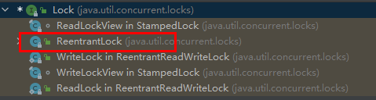
### 2.3.1、lock()方法
lock()方法是平常使用得最多的一个方法，就是用来获取锁。如果锁已被其他线程获取，则进行等待。
使用 Lock，必须主动去释放锁，并且在发生异常时，不会自动释放锁。因此一 般来说，Lock 必须在 try{}catch{}块中进行，并且将释放锁的操作放在 finally 块中进行，以保证锁一定被被释放，防止死锁的发生。
### 2.3.2、newCondition
关键字 synchronized 与 wait()/notify()这两个方法一起使用可以实现等待/通知模式， Lock 锁的 newContition()方法返回 Condition 对象，Condition 类
也可以实现**等待/通知模式**。
用 notify()通知时，JVM 会随机唤醒某个等待的线程， 使用 Condition 类可以进行选择性通知， Condition 比较常用的两个方法：

- await()
   - 会使当前线程等待,同时会释放锁,当其他线程调用 signal()时,线程会重新获得锁并继续执行。
- signal()
   - 用于唤醒一个等待的线程。
   - **注意：**在调用 Condition 的 await()/signal()方法前，也需要线程持有相关的 Lock 锁，调用 await()后线程会释放这个锁，在 singal()调用后会从当前Condition 对象的等待队列中，唤醒一个线程，唤醒的线程尝试获得锁， 一旦获得锁成功就继续执行。
### 2.3.3、ReentrantLock
ReentrantLock，意思是“可重入锁”，关于可重入锁的概念将在后面讲述。
ReentrantLock 是唯一实现了 Lock 接口的类，并且 ReentrantLock 提供了更多的方法。下面通过一些实例看具体看一下如何使用。
```java
public class ReentrantLockTest {

    private final Lock lock = new ReentrantLock(); //注意每次调用必须是同一把锁

    public void insert() {
        lock.lock();
        try {
            System.out.println(Thread.currentThread().getName() + "得到了锁");
            for (int i = 0; i < 5; i++) {
                System.out.println(Thread.currentThread().getName() + "运行：" + i);
            }
        } finally {
            System.out.println(Thread.currentThread().getName() + "释放了锁");
            lock.unlock();
        }
    }
    
    public static void main(String[] args) {
        ReentrantLockTest test = new ReentrantLockTest();
        new Thread(test::insert, "AA").start();
        new Thread(test::insert, "BB").start();
    }

}
```
## 2.4、Lock 与 synchronized 区别
Lock 和 synchronized 有以下几点不同：

- Lock 是一个接口，而 synchronized 是 Java 中的关键字，synchronized 是内置的语言实现；
- synchronized 在发生异常时，会自动释放线程占有的锁，因此不会导致死锁现象发生；而 Lock 在发生异常时，如果没有主动通过 unLock()去释放锁，则很可能造成死锁现象，因此使用 Lock 时需要在 finally 块中释放锁；
- Lock 可以让等待锁的线程响应中断，而 synchronized 却不行，使用synchronized 时，等待的线程会一直等待下去，不能够响应中断；
- 通过 Lock 可以知道有没有成功获取锁，而 synchronized 却无法办到。
- Lock 可以提高多个线程进行读操作的效率。
   - 在性能上来说，如果竞争资源不激烈，两者的性能是差不多的，而当竞争资源非常激烈时（即有大量线程同时竞争），此时 Lock 的性能要远远优于synchronized。
# 第 3 章、线程间通信
线程间通信的模型有两种：共享内存和消息传递，以下方式都是基于这两种模型来实现的。下面用一道面试常见的题目来分析。
> 场景---两个线程，一个线程对当前数值加 1，另一个线程对当前数值减 1,要求用线程间通信。

## 3.1、synchronized 方案
```java
public class TestVolatile {

    /**
     * 交替加减
     */
    public static void main(String[] args) {
        DemoClass demoClass = new DemoClass();
        new Thread(() -> {
            for (int i = 0; i < 5; i++) {
                demoClass.increment();
            }
        }, "线程 A").start();


        new Thread(() -> {
            for (int i = 0; i < 5; i++) {
                demoClass.decrement();
            }
        }, "线程 B").start();
    }
}

class DemoClass {
    //加减对象
    private int number = 0;

    /**
     * 加 1
     */
    public synchronized void increment() {
        try {
            while (number != 0) { // 不能使用if,要使用while防止虚假唤醒
                this.wait();
            }
            number++;
            System.out.println("--------" + Thread.currentThread().getName() + "加一成功----------,值为:" + number);
            notifyAll();
        } catch (Exception e) {
            e.printStackTrace();
        }
    }

    /**
     * 减 1
     */
    public synchronized void decrement() {
        try {
            while (number == 0) {
                this.wait();
            }
            number--;
            System.out.println("--------" + Thread.currentThread().getName() + "减一成功----------,值为:" + number);
            notifyAll();
        } catch (Exception e) {
            e.printStackTrace();
        }
    }
}
```
## 3.2、Lock 方案
```java
public class Demo02 {
    public static void main(String[] args) {
        DemoClass demoClass = new DemoClass();

        new Thread(()->{
            for (int i = 0; i < 10; i++) {
                demoClass.increment();
            }
        }, "加法线程AA").start();

        new Thread(()->{
            for (int i = 0; i < 10; i++) {
                demoClass.decrement();
            }
        }, "减法线程BB").start();
    }
}

class DemoClass{
    //加减对象
    private int number = 0;
    //声明锁
    private final Lock lock = new ReentrantLock();
    //声明钥匙
    private final Condition condition = lock.newCondition();
    /**
     * 加 1
     */
    public void increment() {
        try {
            lock.lock();
            while (number != 0){
                condition.await();
            }
            number++;
            System.out.println("--------" + Thread.currentThread().getName() + "加一成功----------,值为:" + number);
            condition.signalAll();
        }catch (Exception e){
            e.printStackTrace();
        }finally {
            lock.unlock();
        }
    }
    /**
     * 减一
     */
    public void decrement(){
        try {
            lock.lock();
            while (number == 0){
                condition.await();
            }
            number--;
            System.out.println("--------" + Thread.currentThread().getName() + "减一成功----------,值为:" + number);
            condition.signalAll();
        }catch (Exception e){
            e.printStackTrace();
        }finally {
            lock.unlock();
        }
    }
}
```
## 3.3、定制化通信
>  A 线程打印 5 次 A，B 线程打印 10 次 B，C 线程打印 15 次 C,按照 此顺序循环 10 轮  

```java
public class Demo03 {
    public static void main(String[] args) {
        DemoClass03 demoClass = new DemoClass03();

        new Thread(() -> {
            for (int i = 0; i < 5; i++) {
                demoClass.printA(i);
            }
        }, "a").start();

        new Thread(() -> {
            for (int i = 0; i < 5; i++) {
                demoClass.printB(i);
            }
        }, "b").start();

        new Thread(() -> {
            for (int i = 0; i < 5; i++) {
                demoClass.printC(i);
            }
        }, "c").start();


    }
}


class DemoClass03 {
    private int i = 0;
    private final Lock lock = new ReentrantLock();

    private final Condition conditionA = lock.newCondition();
    private final Condition conditionB = lock.newCondition();
    private final Condition conditionC = lock.newCondition();

    /**
     * 打印5次A
     */
    public void printA(int j) {
        try {
            lock.lock();
            while (i != 0) {
                System.out.println("A要睡了");
                conditionA.await();
                System.out.println("A醒了");
            }
            System.out.println("====第 " + j + " 轮开始======");
            System.out.println(Thread.currentThread().getName() + "输出开始==");
            for (int k = 0; k < 5; k++) {
                System.out.println("A");
            }
            Thread.sleep(3000);
            i = 1;
            conditionB.signal();
        } catch (InterruptedException e) {
            e.printStackTrace();
        } finally {
            lock.unlock();
        }
    }

    /**
     * 打印10次B
     */
    public void printB(int j) {
        try {
            lock.lock();
//            System.out.println("B醒了==");
            while (i != 1) {
                System.out.println("B要睡了");
                conditionB.await();
                System.out.println("B醒了");
            }
            System.out.println(Thread.currentThread().getName() + "输出开始==");
            for (int k = 0; k < 10; k++) {
                System.out.println("B");
            }
            Thread.sleep(3000);
            i = 2;
            conditionC.signal();
        } catch (InterruptedException e) {
            e.printStackTrace();
        } finally {
            lock.unlock();
        }
    }

    /**
     * 打印15次C
     */
    public void printC(int j) {
        try {
            lock.lock();
            while (i != 2) {
                System.out.println("C要睡了");
                conditionC.await();
                System.out.println("C醒了");
            }
            System.out.println(Thread.currentThread().getName() + "输出开始==");
            for (int k = 0; k < 15; k++) {
                System.out.println("B");
            }
            Thread.sleep(3000);
            i = 0;
            conditionA.signal();
        } catch (InterruptedException e) {
            e.printStackTrace();
        } finally {
            lock.unlock();
        }
    }
}
```

# 第 4 章、集合线程安全 
## 4.1、ArrayList 解决方案
### 4.1.1、解决方案

- Vector
   - 是通过 synchronized 关键字实现,效率较低
- Collections
- CopyOnWriteArrayList
```java
public class ListTest {
    public static void main(String[] args) {
//        List<String> list = new ArrayList<>();    //线程不安全，会报并发修改异常ConcurrentModificationException
//        List<String> list = new Vector<>();   // 安全
//        List<String> list = Collections.synchronizedList(new ArrayList<>());  // 安全
        List<String> list = new CopyOnWriteArrayList<>();   // 安全
        for (int i = 0; i < 10; i++) {
            int finalI = i;
            new Thread(() -> list.add(finalI + "1")).start();
            new Thread(() -> list.add(finalI + "2")).start();
            new Thread(() -> list.add(finalI + "3")).start();
            new Thread(() -> list.add(finalI + "4")).start();
            System.out.println(list);
        }
    }
}
```
### 4.1.2、CopyOnWriteArrayList
CopyOnWriteArrayList相当于线程安全的 ArrayList。和 ArrayList 一样，它是个可变数组；
但是和ArrayList 不同的时，**它具有以下特性：**

- 它最适合于具有以下特征的应用程序：List 大小通常保持很小，只读操作远多于可变操作，需要在遍历期间防止线程间的冲突。
- 它是线程安全的。
- 因为通常需要复制整个基础数组，所以可变操作（add()、set() 和 remove() 等等）的开销很大。
- 迭代器支持 hasNext(), next()等不可变操作，但不支持可变 remove()等操作。
- 使用迭代器进行遍历的速度很快，并且不会与其他线程发生冲突。在构造迭代器时，迭代器依赖于不变的数组快照。

Vector 和 Collections 独占锁效率低：采用**读写分离思想解决：**

- 写线程获取到锁，其他写线程阻塞。
- 当我们往一个容器添加元素的时候，不直接往当前容器添加，而是先将当前容器进行 Copy，复制出一个新的容器，然后新的容器里添加元素，添加完元素之后，再将原容器的引用指向新的容器。

CopyOnWriteArrayList 原理，**动态数组与线程安全：**

- **动态数组机制**
   - 它内部有个“volatile 数组”(array)来保持数据。在“添加/修改/删除”数据时，都会新建一个数组，并将更新后的数据拷贝到新建的数组中，最后再将该数组赋值给“volatile 数组”, 这就是它叫做 CopyOnWriteArrayList 的原因。
   - **由于它在“添加/修改/删除”数据时，都会新建数组，所以涉及到修改数据的操作**，CopyOnWriteArrayList 效率很低；
   - 但是单单只是进行遍历查找的话，效率比较高。
- **线程安全机制**
   - 通过 volatile 和互斥锁来实现的。
   - 通过“volatile 数组”来保存数据的。一个线程读取 volatile 数组时，总能看到其它线程对该 volatile 变量最后的写入；就这样，通过 volatile 提供了“读取到的数据总是最新的”这个机制的保证。
   - 通过互斥锁来保护数据。在“添加/修改/删除”数据时，会先“获取互斥锁”，再修改完毕之后，先将数据更新到“volatile 数组”中，然后再“释放互斥锁”，就达到了保护数据的目的。
## 4.2、HashSet 解决方案

- CopyOnWriteArraySet

`Set<String> set = new CopyOnWriteArraySet<>();`

## 4.3、HashMap 解决方案

- Hashtable
   - 是通过 synchronized 关键字实现,效率较低
- ConcurrentHashMap

`Map<String, Object> map = new ConcurrentHashMap<>();`

# 第 5 章、多线程锁
## 5.1、锁分类
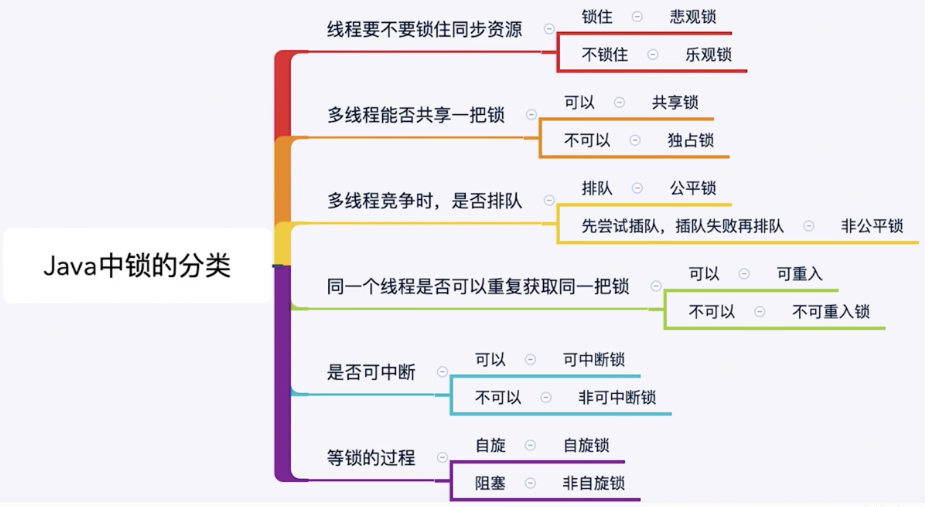
## 5.2、锁对象
> 以 synchronized 为例说明。
> synchronized 锁以下 3 种形式：
> - **普通同步方法**，锁是当前实例对象。
> - **静态同步方法**，锁是当前类的 Class 对象。
> - **同步方法块**，锁是 Synchonized 括号里配置的对象。

**一个对象**里面如果有多个 synchronized 方法，某一个时刻内，只要一个线程去调用其中的一个 synchronized 方法了，其它的线程都只能等待。
换句话说，某一个时刻内，只能有唯一一个线程去访问这些 synchronized 方法。
主要弄清楚锁对象这个概念就可以了。**每个锁对象，同一时刻只能由一个线程持有。**
## 5.3、公平锁与非公平锁
[https://zhuanlan.zhihu.com/p/114257735](https://zhuanlan.zhihu.com/p/114257735)
公平锁：多个线程按照申请锁的顺序去获得锁，线程会直接进入队列去排队，永远都是队列的第一位才能得到锁。
`ReentrantLock lock = new ReentrantLock(true);`

- 优点：所有的线程都能得到资源，不会饿死在队列中。
- 缺点：吞吐量会下降很多，队列里面除了第一个线程，其他的线程都会阻塞，cpu唤醒阻塞线程的开销会很大。

非公平锁：多个线程去获取锁的时候，会直接去尝试获取，获取不到，再去进入等待队列，如果能获取到，就直接获取到锁。

- 优点：可以减少CPU唤醒线程的开销，整体的吞吐效率会高点，CPU也不必取唤醒所有线程，会减少唤起线程的数量。
- 缺点：你们可能也发现了，这样可能导致队列中间的线程一直获取不到锁或者长时间获取不到锁，导致饿死。
## 5.4、可重入锁
可重入锁又名递归锁，是指在同一个线程在外层方法获取锁的时候，再进入该线程的内层方法会自动获取锁（前提锁对象得是同一个对象或者class），不会因为之前已经获取过还没释放而阻塞。
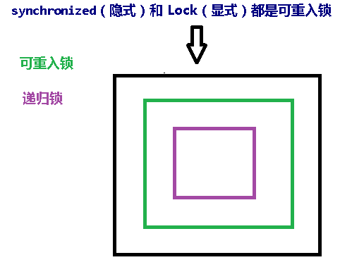
**ReentrantLock** 和 **synchronized** 都是可重入锁。
可重入锁优点：

- 避免死锁
- 提升封装性
## 5.5、死锁
死锁是指两个或两个以上的进程在执行过程中，由于竞争资源或者由于彼此通信而造成的一种阻塞的现象，若无外力作用，它们都将无法推进下去。
### 5.5.1、案例
```java
public class DeadlockTest {
    public static void main(String[] args) {
        Object o1 = new Object();
        Object o2 = new Object();

        new Thread(() -> {
            synchronized (o1) {
                System.out.println(Thread.currentThread().getName() + "拿到o1锁，准备获取o2锁。。。");
                synchronized (o2) {
                    System.out.println(Thread.currentThread().getName() + "拿到o2锁!");
                }
            }
        }, "AA").start();

        new Thread(() -> {
            synchronized (o2) {
                System.out.println(Thread.currentThread().getName() + "拿到o2锁，准备获取o1锁。。。");
                synchronized (o1) {
                    System.out.println(Thread.currentThread().getName() + "拿到o1锁!");
                }
            }
        }, "BB").start();

    }
}
```
### 5.5.2、验证死锁
> 在cmd命令行中查看。

- 列出进程号
   - `jps -l`
   - 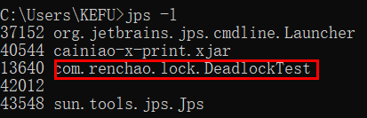
- 使用jvm自带的堆栈跟踪工具查看
   - `jstack 进程号`
   - 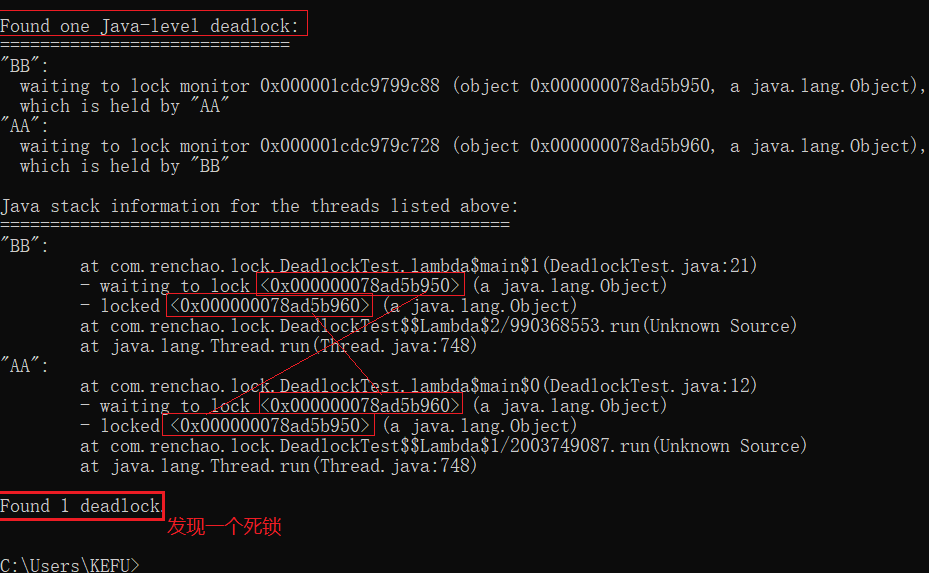
# 第 6 章、Callable & Future
## 6.1、Callable 接口
目前有两种创建线程的方法：

- 创建 Thread 类
- 使用 Runnable

但是这两种方法在线程终止时（即 run（）完成时），都无法使线程返回结果。
为了支持此功能，Java 中提供了 Callable 接口。
**Callable 接口的特点如下(重点)：**

- Callable，需要实现在完成时返回结果的 call（）方法。
- call() 方法可以引发异常，而 run() 则不能。
- 为实现 Callable 而必须重写 call 方法。
- 不能通过 Thread 类直接开启线程，因为Thread的构造方法不支持 Callable。
## 6.2、Future 接口 
当 call() 方法完成时，结果必须存储在主线程已知的对象中，以便主线程可以知道该线程返回的结果。为此，可以使用 Future 对象。
将 Future 视为保存结果的对象，它可能暂时不保存结果，但将来会保存（一旦Callable 返回）。Future 基本上是主线程可以跟踪进度以及其他线程的结果的一种方式。
要实现此接口，必须重写 5 种方法，下面列出3个重要方法：

- **public boolean cancel（boolean mayInterrupt）**
   - 用于停止任务。
   - 如果尚未启动，它将停止任务。如果已启动，则**仅在 mayInterrupt 为 true时才会中断任务。**
   - 除非任务已经结束，
- **boolean isCancelled()**
   - 如果此任务在正常完成之前被取消，则返回 true。
- **public Object get()**
   - 用于获取任务的结果。
   - 如果任务完成，它将立即返回结果，否则将等待任务完成，然后返回结果。
   - 如果任务在完成之前被取消了，使用get()会报取消异常CancellationException
   - 也可以设置超时时间。
- **public boolean isDone()**
   - 如果任务完成或者前面执行了cancel()，则返回 true，否则返回 false

要创建线程，需要 Callable。为了获得结果，需要 Future。
可以看到 Callable 和 Future 做两件事：

- Callable 与 Runnable 类似，因为它封装了要在另一个线程上运行的任务
- 而 Future 用于存储从另一个线程获得的结果。
> 实际上，Future 也可以与 Runnable 一起使用。

## 6.3、FutureTask

> 使用的适配器模式

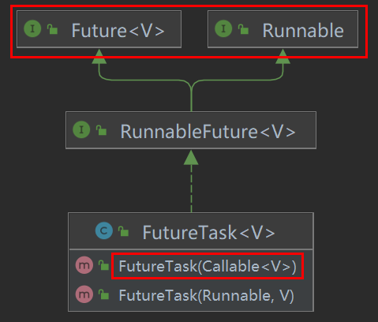
Java 有具体的 FutureTask 类型，该类型实现 Runnable 和 Future，并方便地将两种功能组合在一起。 可以通过为其构造函数提供 Callable 来创建FutureTask。然后，将 FutureTask 对象提供给 Thread 的构造函数以创建 Thread 对象。因此，间接地使用 Callable 创建线程。
**核心原理：(重点)**
在主线程中需要执行比较耗时的操作时，但又不想阻塞主线程时，可以把这些作业交给 Future 对象在后台完成。

- 当主线程将来需要时，就可以通过 Future 对象获得后台作业的计算结果或者执行状态。
- 一般 FutureTask 多用于耗时的计算，主线程可以在完成自己的任务后，再去获取结果。
- 仅在计算完成时才能检索结果；**如果计算尚未完成，则阻塞 get 方法。**
- 一旦计算完成，就不能再重新开始或取消计算。
- get 方法而获取结果只有在计算完成时获取，否则会一直阻塞直到任务转入完成状态，然后会返回结果或者抛出异常
- get 只计算一次，因此 get 方法放到最后。
## 6.4、使用 Callable 和 Future
```java
public class CallableTest {
    public static void main(String[] args) throws ExecutionException, InterruptedException, TimeoutException {
        FutureTask<String> task = new FutureTask<>(() -> {
            System.out.println("进程正常执行中。。。。");
            TimeUnit.SECONDS.sleep(5);
            System.out.println("进程执行结束。。。");
            return "test";
        });

        new Thread(task,"线程Callable01").start();

        TimeUnit.SECONDS.sleep(2);
        System.out.println("是否取消成功：" + task.cancel(false));

        System.out.println("任务是否被取消：" + task.isCancelled());

        System.out.println("任务是否完成：" + task.isDone());

        TimeUnit.SECONDS.sleep(5);
        System.out.println(task.get());
    }
}
```

# 第 7 章、辅助类
## 7.1、CountDownLatch 减少计数
CountDownLatch 类可以设置一个计数器，然后通过 countDown 方法来进行减 1 的操作，使用 await 方法等待计数器不大于 0，然后继续执行 await 方法之后的语句。
• CountDownLatch 主要有两个方法，当一个或多个线程调用 await 方法时，这些线程会阻塞。
• 其它线程调用 countDown 方法会将计数器减 1(调用 countDown 方法的线程不会阻塞)。
• 当计数器的值变为 0 时，因 await 方法阻塞的线程会被唤醒，继续执行。
> 场景: 6 个同学陆续离开教室后值班同学才可以关门。

```java
public class CountDownLatchTest {
    public static void main(String[] args) throws InterruptedException {
        
        CountDownLatch count = new CountDownLatch(6);

        for (int i = 1; i <= 6; i++) {
            new Thread(()->{
                System.out.println(Thread.currentThread().getName() + " 离开了。。。");
                count.countDown();
            },"同学 " + i).start();
        }

        count.await();
        System.out.println("同学都走了，值日同学关门了======");
    }
}
```
## 7.2、CyclicBarrier 循环栅栏
CyclicBarrier 看英文单词可以看出大概就是循环阻塞的意思，在使用中 CyclicBarrier 的构造方法第一个参数是目标障碍数，每次执行 CyclicBarrier 一次障碍数会加一，如果达到了目标障碍数，才会执行 cyclicBarrier.await()之后的语句。然后重新开始计数，达到了目标障碍数会再次执行 cyclicBarrier.await()之后的语句，如此循环。
```java
public class CyclicBarrierTest {

    public static void main(String[] args) {
        CyclicBarrier barrier = new CyclicBarrier(5);

        for (int i = 1; i <= 20; i++) {
            new Thread(() -> {
                System.out.println(Thread.currentThread().getName() + "到了。。。");
                try {
                    barrier.await();
                    System.out.println("5个人到齐了！！！==========" + Thread.currentThread().getName() + " 进来了！");
                } catch (InterruptedException | BrokenBarrierException e) {
                    e.printStackTrace();
                }
            }, "第" + i + "个人").start();
        }
    }
}
```
## 7.3、Semaphore 信号灯
Semaphore 的构造方法中传入的第一个参数是最大信号量（可以看成最大线程池），每个信号量初始化为一个最多只能分发一个许可证。使用 acquire 方
法获得许可证，release 方法释放许可。
> 场景: 抢车位, 6 部汽车 3 个停车位。

```java
public class SemaphoreTest {
    public static void main(String[] args) {
        Semaphore semaphore = new Semaphore(3);
        //Semaphore semaphore = new Semaphore(1,true); // 设置公平竞争

        for (int i = 1; i <= 6; i++) {
            new Thread(() -> {
                System.out.println(Thread.currentThread().getName() + "在找车位！！");
                try {
                    semaphore.acquire();    // 占车位
                    System.out.println(Thread.currentThread().getName() + "找到位！！===========");
                    TimeUnit.SECONDS.sleep(2);
                } catch (InterruptedException e) {
                    e.printStackTrace();
                } finally {
                    System.out.println(Thread.currentThread().getName() + "开走了。。。。。。。。。。。。。。。。。。。");
                    semaphore.release();    // 释放车位
                }
            }, "车主" + i).start();
        }
    }
}
```

# 第 8 章、读写锁
[https://blog.csdn.net/Student111w/article/details/118877187](https://blog.csdn.net/Student111w/article/details/118877187)
## 8.1、ReadWriteLock介绍
现实中有这样一种场景：对共享资源有读和写的操作，且写操作没有读操作那么频繁。在没有写操作的时候，多个线程同时读一个资源没有任何问题，所以应该允许多个线程同时读取共享资源；但是如果一个线程想去写这些共享资源，就不应该允许其他线程对该资源进行读和写的操作了。
针对这种场景，JAVA 的并发包提供了 ReadWriteLock 接口。它有两个锁，一个是读操作相关的锁，称为共享锁；一个是写相关的锁，称为排他锁。
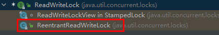
ReadWriteLock 定义了两个方法：

- readLock();
- writeLock();

一个用来获取读锁，一个用来获取写锁。也就是说将文件的读写操作分开，分成 2 个锁来分配给线程，从而使得多个线程可以同时进行读操作。
ReentrantReadWriteLock 实现了 ReadWriteLock 接口。
ReentrantReadWriteLock 里面提供了很多丰富的方法，不过最主要的有两个方法：**readLock() 和 writeLock()** 用来获取读锁和写锁。
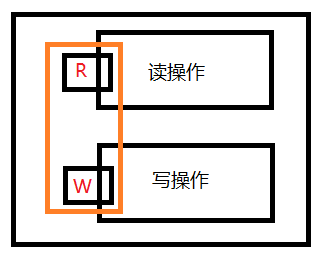
要把 **readLock() **和 **writeLock() **两把看成一个整体。
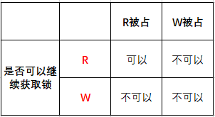
下面通过几个例子来看一下 ReentrantReadWriteLock 具体用法。

## 8.2、ReadWriteLock案例
```java
public class ReentrantReadWriteLockTest {
    private final ReentrantReadWriteLock lock = new ReentrantReadWriteLock();

    public void read() {
        try {
            lock.readLock().lock();
            System.out.println(Thread.currentThread().getName() + " 开始读了。。。");
            Thread.sleep(3000);
        } catch (InterruptedException e) {
            e.printStackTrace();
        } finally {
            System.out.println(Thread.currentThread().getName() + " 读结束了。。。");
            lock.readLock().unlock();
        }
    }

    public void write() {
        try {
            lock.writeLock().lock();
            System.out.println(Thread.currentThread().getName() + " 开始写了。。。");
            Thread.sleep(3000);
        } catch (InterruptedException e) {
            e.printStackTrace();
        } finally {
            System.out.println(Thread.currentThread().getName() + " 写完了。。。");
            lock.writeLock().unlock();
        }
    }

    public static void main(String[] args) {
        ReentrantReadWriteLockTest test = new ReentrantReadWriteLockTest();
        Thread t1 = new Thread(test::read, "ReadThread1");
        Thread t2 = new Thread(test::read, "ReadThread2");
        Thread t3 = new Thread(test::write, "WriteThread3");
        Thread t4 = new Thread(test::write, "WriteThread4");

        t1.start();
        t2.start();
        t3.start();
        t4.start();
        // 分别测试 读读t1、t2；  读写t2、t3； 写写t3、t4。
    }
}
```
## 8.3、锁降级
将写入锁降级为读锁，**读锁不能升级为写锁**。
获取写锁 —> 获取读锁 —> 释放写锁 —> 释放读锁
也就是说，在同一个线程内，在有写锁的情况下，可以再次获取读锁。但是在有读锁的情况下，是获取不到写锁的。
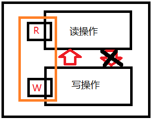


## 8.4、数据库死锁

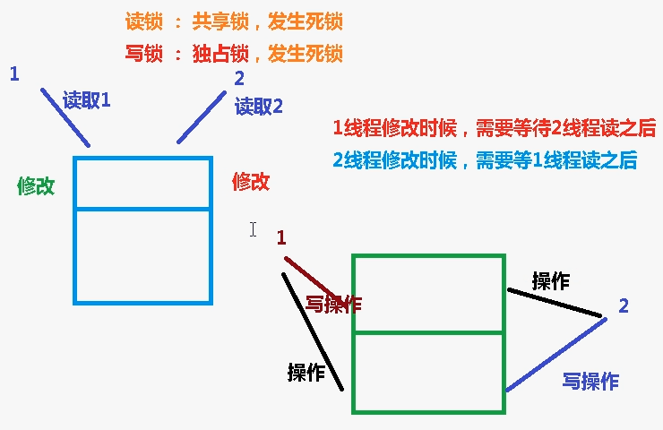


# 第 9 章、阻塞队列
## 9.1、BlockingQueue 简介 
Concurrent 包中，BlockingQueue 很好的解决了多线程中，如何高效安全“传输”数据的问题。通过这些高效并且线程安全的队列类，为我们快速搭建高质量的多线程程序带来极大的便利。
阻塞队列，顾名思义，首先它是一个队列, 通过一个共享的队列，可以使得数据由队列的一端输入，从另外一端输出；
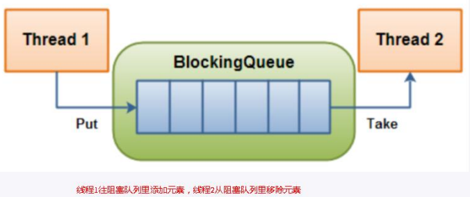
当队列是空的，从队列中获取元素的操作将会被阻塞
当队列是满的，从队列中添加元素的操作将会被阻塞
常用的**队列**主要有以下两种：

- **先进先出（FIFO）：**
   - 先插入的队列的元素也最先出队列，类似于排队的功能。
- **后进先出（LIFO）：**
   - 后插入队列的元素最先出队列，这种队列优先处理最近发生的事件(栈)

在多线程领域：所谓**阻塞**，在某些情况下会挂起线程（即阻塞），一旦条件满足，被挂起的线程又会自动被唤起。
## 9.2、BlockingQueue 核心方法
BlockingQueue 的核心方法：
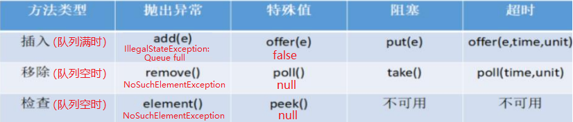

> 阻塞队列使用的是 阻塞和超时

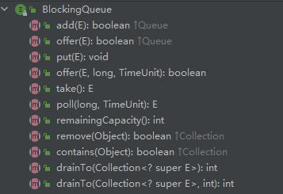
**drainTo(): **一次性从 BlockingQueue 获取所有可用的数据对象（还可以指定获取数据的个数)，通过该方法，可以提升获取数据效率；不需要多次分批加
锁或释放锁。

## 9.3、实现类
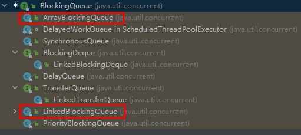
### 9.3.1、ArrayBlockingQueue(常用) 
基于数组的阻塞队列实现，在 ArrayBlockingQueue 内部，维护了一个定长数组，以便缓存队列中的数据对象，这是一个常用的阻塞队列，除了一个定长数
组外，ArrayBlockingQueue 内部还保存着两个整形变量，分别标识着队列的头部和尾部在数组中的位置。
**ArrayBlockingQueue 在生产者放入数据和消费者获取数据，共用同一个锁对象，由此也意味着两者无法真正并行运行**，这点尤其不同 LinkedBlockingQueue；按照实现原理来分析，ArrayBlockingQueue 完全可以采用分离锁，从而实现生产者和消费者操作的完全并行运行。Doug Lea 之所以没这样去做，也许是因为 ArrayBlockingQueue 的数据写入和获取操作已经足够轻巧，以至于引入独立的锁机制，除了给代码带来额外的复杂性外，其在性能上完全占不到任何便宜。 ArrayBlockingQueue 和LinkedBlockingQueue 间还有一个明显的不同之处在于，前者在**插入或删除元素时不会产生或销毁任何额外的对象实例**，而后者则会生成一个额外的 Node 对象。这在长时间内需要高效并发地处理大批量数据的系统中，其对于 GC 的影响还是存在一定的区别。而在创建 ArrayBlockingQueue 时，我们还可以控制对象的内部锁是否采用公平锁，默认采用非公平锁。
**一句话总结: **由数组结构组成的有界阻塞队列。

### 9.3.2、LinkedBlockingQueue(常用)
基于链表的阻塞队列，同 ArrayListBlockingQueue 类似，其内部也维持着一个数据缓冲队列（该队列由一个链表构成），当生产者往队列中放入一个数据时，队列会从生产者手中获取数据，并缓存在队列内部，而生产者立即返回；只有当队列缓冲区达到最大值缓存容量时（LinkedBlockingQueue 可以通过构造函数指定该值），才会阻塞生产者队列，直到消费者从队列中消费掉一份数据，生产者线程会被唤醒，反之对于消费者这端的处理也基于同样的原理。
而 LinkedBlockingQueue 之所以能够高效的处理并发数据，还因为其对于生产者端和消费者端分别采用了独立的锁来控制数据同步，这也意味着在高并发的情况下生产者和消费者可以并行地操作队列中的数据，以此来提高整个队列的并发性能。
ArrayBlockingQueue 和 LinkedBlockingQueue 是两个最普通也是最常用的阻塞队列，一般情况下，在处理多线程间的生产者消费者问题，使用这两个类足矣。
**一句话总结: **由链表结构组成的有界（但大小默认值为integer.MAX_VALUE）阻塞队列。

### 9.3.3、DelayQueue
DelayQueue 中的元素只有当其指定的延迟时间到了，才能够从队列中获取到该元素。**DelayQueue 是一个没有大小限制的队列**，因此往队列中插入数据的操作（生产者）永远不会被阻塞，而只有获取数据的操作（消费者）才会被阻塞。
**一句话总结: **使用优先级队列实现的延迟无界阻塞队列。
### 9.3.4、PriorityBlockingQueue
基于优先级的阻塞队列（优先级的判断通过构造函数传入的 Compator 对象来决定），但需要注意的是 PriorityBlockingQueue 并不会阻塞数据生产者，而
只会在没有可消费的数据时，阻塞数据的消费者。
因此使用的时候要特别注意，生产者生产数据的速度绝对不能快于消费者消费数据的速度，否则时间一长，会最终耗尽所有的可用堆内存空间。
在实现 PriorityBlockingQueue 时，内部控制线程同步的锁采用的是公平锁。
**一句话总结: **支持优先级排序的无界阻塞队列。

### 9.3.5、SynchronousQueue
一种无缓冲的等待队列，类似于无中介的直接交易，有点像原始社会中的生产者和消费者，生产者拿着产品去集市销售给产品的最终消费者，而消费者必须亲自去集市找到所要商品的直接生产者，如果一方没有找到合适的目标，那么对不起，大家都在集市等待。相对于有缓冲的 BlockingQueue 来说，少了一个中间经销商的环节（缓冲区），如果有经销商，生产者直接把产品批发给经销商，而无需在意经销商最终会将这些产品卖给那些消费者，由于经销商可以库存一部分商品，因此相对于直接交易模式，总体来说采用中间经销商的模式会吞吐量高一些（可以批量买卖）；但另一方面，又因为经销商的引入，使得产品从生产者到消费者中间增加了额外的交易环节，单个产品的及时响应性能可能会降低。
声明一个 SynchronousQueue 有两种不同的方式，它们之间有着不太一样的行为。
公平模式和非公平模式的区别：

- **公平模式：**SynchronousQueue 会采用公平锁，并配合一个 FIFO 队列来阻塞多余的生产者和消费者，从而体系整体的公平策略；
- **非公平模式**（SynchronousQueue 默认）：SynchronousQueue 采用非公平锁，同时配合一个 LIFO 队列来管理多余的生产者和消费者，而后一种模式，如果生产者和消费者的处理速度有差距，则很容易出现饥渴的情况，即可能有某些生产者或者是消费者的数据永远都得不到处理。

**一句话总结:** 不存储元素的阻塞队列，也即单个元素的队列。
### 9.3.6、LinkedTransferQueue
LinkedTransferQueue 是一个由链表结构组成的无界阻塞 TransferQueue 队列。相对于其他阻塞队列，LinkedTransferQueue 多了 tryTransfer 和transfer 方法。
LinkedTransferQueue 采用一种预占模式。意思就是消费者线程取元素时，如果队列不为空，则直接取走数据，若队列为空，那就生成一个节点（节点元素为 null）入队，然后消费者线程被等待在这个节点上，后面生产者线程入队时发现有一个元素为 null 的节点，生产者线程就不入队了，直接就将元素填充到该节点，并唤醒该节点等待的线程，被唤醒的消费者线程取走元素，从调用的方法返回。
**一句话总结: **由链表组成的无界阻塞队列。

### 9.3.7、LinkedBlockingDeque
LinkedBlockingDeque 是一个由链表结构组成的双向阻塞队列，即可以从队列的两端插入和移除元素。
对于一些指定的操作，在插入或者获取队列元素时如果队列状态不允许该操作可能会阻塞住该线程直到队列状态变更为允许操作，这里的阻塞一般有两种情
况：

- 插入元素时: 
   - 如果当前队列已满将会进入阻塞状态，一直等到队列有空的位置时再讲该元素插入，该操作可以通过设置超时参数，超时后返回 false 表示操作失败，也可以不设置超时参数一直阻塞，中断后抛出 InterruptedException 异常。
- 读取元素时: 
   - 如果当前队列为空会阻塞住直到队列不为空然后返回元素，同样可以通过设置超时参数

**一句话总结: **由链表组成的双向阻塞队列。

# 第 10 章、ThreadPool 线程池
## 10.1、线程池简介
线程池（英语：thread pool）：一种线程使用模式。线程过多会带来调度开销，进而影响缓存局部性和整体性能。而线程池维护着多个线程，等待着监督管理者分配可并发执行的任务。这避免了在处理短时间任务时创建与销毁线程的代价。线程池不仅能够保证内核的充分利用，还能防止过分调度。
线程池的优势： 线程池做的工作只要是控制运行的线程数量，处理过程中将任务放入队列，然后在线程创建后启动这些任务，如果线程数量超过了最大数量，超出数量的线程排队等候，等其他线程执行完毕，再从队列中取出任务来执行。
主要特点为：

- 降低资源消耗: 
   - 通过重复利用已创建的线程，降低线程创建和销毁造成的销耗。
- 提高响应速度: 
   - 当任务到达时，任务可以不需要等待线程创建就能立即执行。
- 提高线程的可管理性: 
   - 线程是稀缺资源，如果无限制的创建，不仅会销耗系统资源，还会降低系统的稳定性，使用线程池可以进行统一的分配，调优和监控。

Java 中的线程池是通过 **Executor 框架**实现的，该框架中用到了下面这几个类。

- Executor
- Executors
- ExecutorService
- ThreadPoolExecutor 

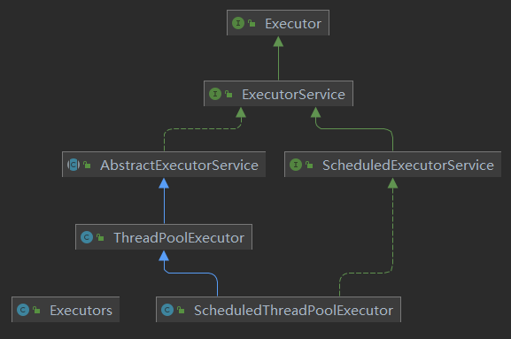

## 10.2、线程池参数说明
### 10.2.1、常用参数(重点)

- **corePoolSize**
   - 线程池的核心线程数
- **maximumPoolSize**
   - 能容纳的最大线程数
- **keepAliveTime**
   - 空闲线程存活时间
- **unit**
   - 存活的时间单位
- **workQueue**
   - 存放提交但未执行任务的队列
- **threadFactory**
   - 创建线程的工厂类
- **handler**
   - 等待队列满后的拒绝策略

线程池中，有**三个重要的参数，决定着拒绝策略：**

- corePoolSize - 核心线程数，也即最小的线程数。
- workQueue - 阻塞队列 。 
- maximumPoolSize -最大线程数。

当提交任务数大于 corePoolSize 的时候，会优先将任务放到 workQueue 阻塞队列中。当阻塞队列饱和后，会扩充线程池中线程数，直到达到maximumPoolSize 最大线程数配置。此时，再多余的任务，则会**触发线程池的拒绝策略**了。
总结起来，也就是一句话，当提交的任务数大于（workQueue.size() + maximumPoolSize ），就会触发线程池的拒绝策略。
### 10.2.2、拒绝策略(重点)
拒绝策略提供顶级接口 **RejectedExecutionHandler** ，其中方法 rejectedExecution 即定制具体的拒绝策略的执行逻辑。
jdk默认提供了四种拒绝策略：
**AbortPolicy: **丢弃任务，并抛出拒绝执行 RejectedExecutionException 异常信息。线程池默认的拒绝策略。必须处理好抛出的异常，否则会打断当前的执行流程，影响后续的任务执行。
**CallerRunsPolicy: **当触发拒绝策略，只要线程池没有关闭的话，则使用调用线程直接运行任务。一般并发比较小，性能要求不高，不允许失败。但是，由于调用者自己运行任务，如果任务提交速度过快，可能导致程序阻塞，性能效率上必然的损失较大。
**DiscardPolicy: **直接丢弃，其他啥都没有。
**DiscardOldestPolicy:** 当触发拒绝策略，只要线程池没有关闭的话，丢弃阻塞队列 workQueue 中最老的一个任务，并将新任务加入。
## 10.3、线程池的种类与创建
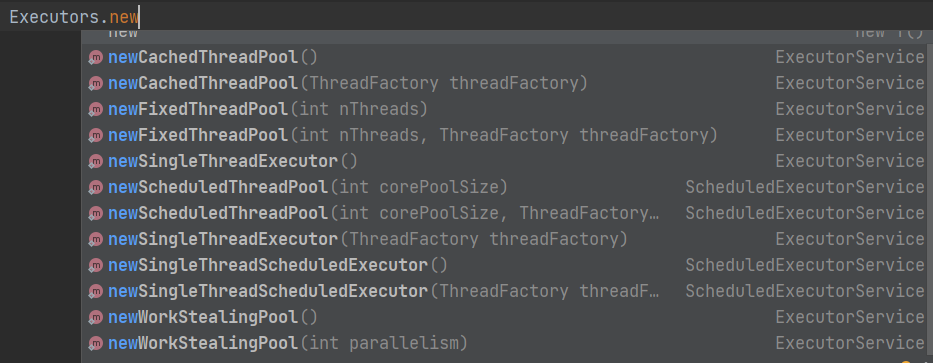
### 10.3.1、newCachedThreadPool(常用)
作用：

- 创建一个可缓存线程池，如果线程池长度超过处理需要，可灵活回收空闲线程，若无可回收，则新建线程。

特点: 

- 线程池中数量没有固定，可达到最大值（Interger. MAX_VALUE）
- 线程池中的线程可进行缓存重复利用和回收（回收默认时间为 1 分钟）
- 当线程池中，没有可用线程，会重新创建一个线程。

构造方式：
```java
/**
* corePoolSize 线程池的核心线程数
* maximumPoolSize 能容纳的最大线程数
* keepAliveTime 空闲线程存活时间
* unit 存活的时间单位
* workQueue 存放提交但未执行任务的队列
* threadFactory 创建线程的工厂类:可以省略
* handler 等待队列满后的拒绝策略:可以省略
*/
public static ExecutorService newCachedThreadPool() {
    return new ThreadPoolExecutor(0, 
                                  Integer.MAX_VALUE,
                                  60L, 
                                  TimeUnit.SECONDS,
                                  new SynchronousQueue<Runnable>());
}
```
> 场景: 适用于创建一个可无限扩大的线程池，服务器负载压力较轻，执行时间较短，任务多的场景。

### 10.3.2、newFixedThreadPool(常用)
作用：

- 创建一个可重用固定线程数的线程池，以共享的无界队列方式来运行这些线程。在任意点，在大多数线程会处于处理任务的活动状态。如果在所有线程处于活动状态时提交附加任务，则在有可用线程之前，附加任务将在队列中等待。如果在关闭前的执行期间由于失败而导致任何线程终止，那么一个新线程将代替它执行后续的任务（如果需要）。在某个线程被显式地关闭之前，池中的线程将一直存在。

特征：

- 线程池中的线程处于一定的量，可以很好的控制线程的并发量
- 线程可以重复被使用，在显示关闭之前，都将一直存在
- 超出一定量的线程被提交时候需在队列中等待

构造方式：
```java
public static ExecutorService newFixedThreadPool(int nThreads) {
    return new ThreadPoolExecutor(nThreads, //核心线程数
                                  nThreads,//能容纳的最大线程数
                                  0L, //空闲线程存活时间
                                  TimeUnit.MILLISECONDS,//存活时间的单位
                                  new LinkedBlockingQueue<Runnable>());//存放提交但未执行任务的队列
}
```
> 场景: 适用于可以预测线程数量的业务中，或者服务器负载较重，对线程数有严格限制的场景。

### 10.3.3、newSingleThreadExecutor(常用)
作用：

- 创建一个使用单个 worker 线程的 Executor，以无界队列方式来运行该线程。（注意，如果因为在关闭前的执行期间出现失败而终止了此单个线程，那么如果需要，一个新线程将代替它执行后续的任务）。可保证顺序地执行各个任务，并且在任意给定的时间不会有多个线程是活动的。与其他等效的newFixedThreadPool 不同，可保证无需重新配置此方法所返回的执行程序即可使用其他的线程。

特征：

- 线程池中最多执行 1 个线程，之后提交的线程活动将会排在队列中以此执行。

构造方式：
```java
public static ExecutorService newSingleThreadExecutor() {
    return new FinalizableDelegatedExecutorService//与newFixedThreadPool的构造方式是不一样的。
        (new ThreadPoolExecutor(1, 
                                1,
                                0L, 
                                TimeUnit.MILLISECONDS,
                                new LinkedBlockingQueue<Runnable>()));
}
```
> 场景: 适用于需要保证顺序执行各个任务，并且在任意时间点，不会同时有多个线程的场景。

### 10.3.4、newScheduleThreadPool(了解)
作用: 
线程池支持定时以及周期性执行任务，创建一个 corePoolSize 为传入参数，最大线程数为整形的最大数的线程池**
特征:

- 线程池中具有指定数量的线程，即便是空线程也将保留
- 可定时或者延迟执行线程活动

构造方式：
```java
public static ScheduledExecutorService newScheduledThreadPool(int corePoolSize) {
    return new ScheduledThreadPoolExecutor(corePoolSize);
}
```
> 场景: 适用于需要多个后台线程执行周期任务的场景。

### 10.3.5、newWorkStealingPool
jdk1.8 提供的线程池，底层使用的是 ForkJoinPool 实现，创建一个拥有多个任务队列的线程池，可以减少连接数，创建当前可用 cpu 核数的线程来并行执行任务。
构造方式：
```java
/**
* parallelism：并行级别，通常默认为 JVM 可用的处理器个数
* factory：用于创建 ForkJoinPool 中使用的线程。
* handler：用于处理工作线程未处理的异常，默认为 null
* asyncMode：用于控制 WorkQueue 的工作模式:队列---反队列
*/
public static ExecutorService newWorkStealingPool() {
    return new ForkJoinPool
        (Runtime.getRuntime().availableProcessors(),
         ForkJoinPool.defaultForkJoinWorkerThreadFactory,
         null, true);
}
```
> 场景: 适用于大耗时，可并行执行的场景。

## 10.4、线程池入门案例
> 场景: 火车站 3 个售票口, 10 个用户买票

```java
public class BuyTickets {
    public static void main(String[] args) {
        /**
        * corePoolSize 线程池的核心线程数
        * maximumPoolSize 能容纳的最大线程数
        * keepAliveTime 空闲线程存活时间
        * unit 存活的时间单位
        * workQueue 存放提交但未执行任务的队列
        * threadFactory 创建线程的工厂类:可以省略
        * handler 等待队列满后的拒绝策略:可以省略
        */
        ExecutorService executor = new ThreadPoolExecutor(3,
                                                          3,
                                                          0L,
                                                          TimeUnit.SECONDS,
                                                          new LinkedBlockingQueue<>(),
                                                          Executors.defaultThreadFactory(),
                                                          new ThreadPoolExecutor.AbortPolicy());

        try {
            for (int i = 1; i <= 10; i++) {
                int finalI = i;
                executor.submit(() -> {
                    System.out.println("第 " + finalI + " 个乘客正在：" + Thread.currentThread().getName() + " 处购票。。。");
                    try {
                        TimeUnit.SECONDS.sleep(5);
                    } catch (InterruptedException e) {
                        e.printStackTrace();
                    }
                });
            }
        } finally {
            executor.shutdown();
        }
    }
}
```
## 10.5、线程池底层工作原理(重要)
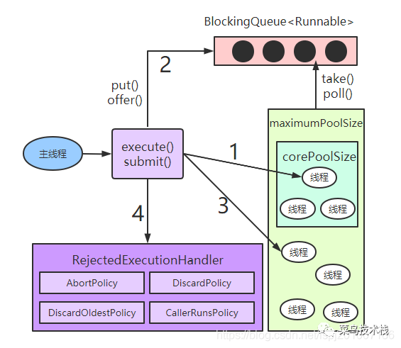

1. 在创建了线程池后，线程池中的线程数为零。
2. 当调用 execute()方法添加一个请求任务时，线程池会做出如下判断： 
   1. 如果正在运行的线程数量小于 corePoolSize，那么马上创建线程运行这个任务；
   2. 如果正在运行的线程数量大于或等于 corePoolSize，那么将这个任务放入队列； 
   3. 如果这个时候队列满了且正在运行的线程数量还小于maximumPoolSize，那么还是要创建非核心线程**立刻运行这个任务**；
   4. 如果队列满了且正在运行的线程数量大于或等于 maximumPoolSize，那么线程池会启动饱和拒绝策略来执行。
3. 当一个线程完成任务时，它会从队列中取下一个任务来执行。
4. 当一个线程无事可做超过一定的时间（keepAliveTime）时，线程会判断：
   1. 如果当前运行的线程数大于 corePoolSize，那么这个线程就被停掉。 
   2. 所以线程池的所有任务完成后，终会恢复到 corePoolSize 的大小。
## 10.6、注意事项(重要)

- 项目中创建多线程时，使用常见的三种线程池创建方式，单一、可变、定长都有一定问题，原因是 FixedThreadPool 和 SingleThreadExecutor 底层都是用LinkedBlockingQueue 实现的，这个队列最大长度为 Integer.MAX_VALUE，容易导致 OOM。所以实际生产一般自己通过 ThreadPoolExecutor 的 7 个参数，自定义线程池
- 创建线程池推荐适用 ThreadPoolExecutor 及其 7 个参数手动创建：
   - corePoolSize 线程池的核心线程数
   - maximumPoolSize 能容纳的最大线程数
   - keepAliveTime 空闲线程存活时间
   - unit 存活的时间单位
   - workQueue 存放提交但未执行任务的队列
   - threadFactory 创建线程的工厂类
- handler 等待队列满后的拒绝策略

为什么不允许适用不允许 Executors.的方式手动创建线程池,如下图：
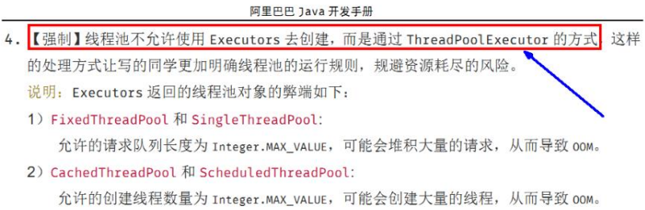

# 第 11 章、Fork/Join 
## 11.1、框架简介
Fork/Join 它可以将一个大的任务拆分成多个子任务进行并行处理，最后将子任务结果合并成最后的计算结果，并进行输出。
Fork/Join 框架要完成两件事情：

- Fork：首先框架需要把大的任务分割成足够小的子任务，如果子任务比较大的话还要对子任务进行继续分割。
- Join：把分拆任务的结果进行合并。分割的子任务分别放到双端队列里，然后几个启动线程分别从双端队列里获取任务执行。子任务执行完的结果都放在另外一个队列里，启动一个线程从队列里取数据，然后合并这些数据。


在 Java 的 Fork/Join 框架中，使用两个类完成上述操作。

- **ForkJoinTask：**
   - 我们要使用 Fork/Join 框架，首先需要创建一个 ForkJoin 任务。
   - 该类提供了在任务中执行 fork 和 join 的机制。
   - 通常情况下我们不需要直接集成 ForkJoinTask 类，只需要继承它的子类，Fork/Join 框架提供了两个子类：
      - **RecursiveAction：**用于没有返回结果的任务
      - **RecursiveTask：**用于有返回结果的任务
- **ForkJoinPool：**
   - ForkJoinTask 需要通过 ForkJoinPool 来执行。
## 11.2、入门案例
> 生成一个计算任务，计算 1+2+3.........+100000

```java
public class ForkJoinTest {
    public static void main(String[] args) throws ExecutionException, InterruptedException {
        MyTask task = new MyTask(0L, 100000L);
        ForkJoinPool forkJoinPool = new ForkJoinPool();
        ForkJoinTask<Long> submit = forkJoinPool.submit(task);
        System.out.println(submit.get());
        forkJoinPool.shutdown();
    }
}


class MyTask extends RecursiveTask<Long> {

    public static final int THRESHOLD = 10;
    private final long start;
    private final long end;

    public MyTask(long start,long end) {
        this.start = start;
        this.end = end;
    }

    @Override
    protected Long compute() {
        long result = 0L;
        if (end - start < THRESHOLD) {
            for (long i = start; i <= end; i++) {
                result += i;
            }
        } else {
            long median = (end + start) / 2;
            MyTask task1 = new MyTask(start, median);
            MyTask task2 = new MyTask(median + 1, end);
            task1.fork();
            task2.fork();
            result = task1.join() + task2.join();
        }
        return result;
    }
}
```

## 11.3、框架的实现原理
ForkJoinPool 由 ForkJoinTask 数组和 ForkJoinWorkerThread 数组组成，
ForkJoinTask 数组负责将存放以及将程序提交给 ForkJoinPool，而 ForkJoinWorkerThread 负责执行这些任务。
### 11.3.1、 Fork 方法

- **ForkJoinPool**
   - 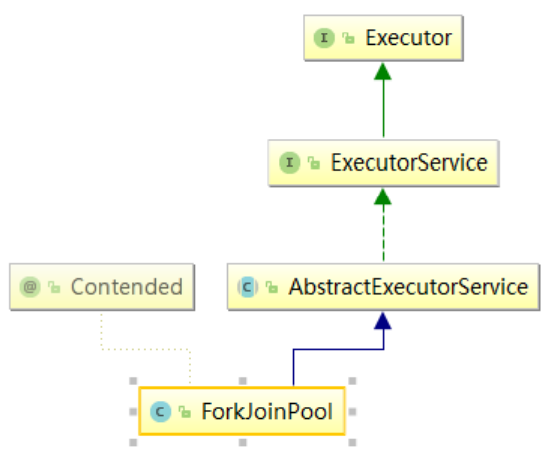
- **ForkJoinTask**
   - 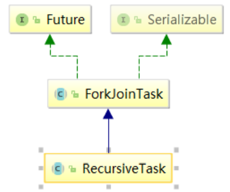

Fork 方法的实现原理： 当我们调用 ForkJoinTask 的 fork 方法时，程序会把任务放在 ForkJoinWorkerThread 的 pushTask 的 workQueue 中，异步地
执行这个任务，然后立即返回结果。
```java
public final ForkJoinTask<V> fork() {
    Thread t;
    if ((t = Thread.currentThread()) instanceof ForkJoinWorkerThread)
        ((ForkJoinWorkerThread)t).workQueue.push(this);
    else
        ForkJoinPool.common.externalPush(this);
    return this;
}
```
pushTask 方法把当前任务存放在 ForkJoinTask 数组队列里。然后再调用ForkJoinPool 的 signalWork()方法唤醒或创建一个工作线程来执行任务。
代码如下：
```java
final void push(ForkJoinTask<?> task) {
    ForkJoinTask<?>[] a; ForkJoinPool p;
    int b = base, s = top, n;
    if ((a = array) != null) {    // ignore if queue removed
        int m = a.length - 1;     // fenced write for task visibility
        U.putOrderedObject(a, ((m & s) << ASHIFT) + ABASE, task);
        U.putOrderedInt(this, QTOP, s + 1);
        if ((n = s - b) <= 1) {
            if ((p = pool) != null)
                p.signalWork(p.workQueues, this);	//这里======
        }
        else if (n >= m)
            growArray();
    }
}
```
### 11.3.2、join 方法
Join 方法的主要作用是阻塞当前线程并等待获取结果。
ForkJoinTask 的 join 方法实现代码如下：
```java
public final V join() {
    int s;
    if ((s = doJoin() & DONE_MASK) != NORMAL)
        reportException(s);
    return getRawResult();
}
```
它首先调用 doJoin 方法，通过 doJoin()方法得到当前任务的状态来判断返回什么结果。
任务状态有 4 种：

- 已完成（NORMAL）
   - 直接返回任务结果。
- 被取消（CANCELLED）
   - 直接抛出 CancellationException
- 信号（SIGNAL）
- 出现异常（EXCEPTIONAL）
   - 直接抛出对应的异常

doJoin 方法的实现：
```java
private int doJoin() {
    int s; Thread t; ForkJoinWorkerThread wt; ForkJoinPool.WorkQueue w;
    return (s = status) < 0 ? s :
        ((t = Thread.currentThread()) instanceof ForkJoinWorkerThread) ?
        (w = (wt = (ForkJoinWorkerThread)t).workQueue).
        tryUnpush(this) && (s = doExec()) < 0 ? s :
        wt.pool.awaitJoin(w, this, 0L) :
        externalAwaitDone();
}

//===============

final int doExec() {
    int s; boolean completed;
    if ((s = status) >= 0) {
        try {
            completed = exec();
        } catch (Throwable rex) {
            return setExceptionalCompletion(rex);
        }
        if (completed)
            s = setCompletion(NORMAL);
    }
    return s;
}
```
doJoin()方法流程如下:

- 首先通过查看任务的状态，看任务是否已经执行完成，如果执行完成，则直接返回任务状态；
- 如果没有执行完，则从任务数组里取出任务并执行。
- 如果任务顺利执行完成，则设置任务状态为 NORMAL，如果出现异常，则记录异常，并将任务状态设置为 EXCEPTIONAL。
### 11.3.3、异常处理
ForkJoinTask 在执行的时候可能会抛出异常，但是我们没办法在主线程里直接捕获异常，所以 ForkJoinTask 提供了 isCompletedAbnormally()方法来检查任务是否已经抛出异常或已经被取消了，并且可以通过 ForkJoinTask 的 getException 方法获取异常。
getException 方法返回 Throwable 对象，如果任务被取消了则返回 CancellationException。如果任务没有完成或者没有抛出异常则返回 null。

# 第 12 章、异步回调
## 12.1、CompletableFuture 简介
[https://blog.csdn.net/zsx_xiaoxin/article/details/123898171](https://blog.csdn.net/zsx_xiaoxin/article/details/123898171)
CompletableFuture 在 Java 里面被用于异步编程，异步通常意味着非阻塞，可以使得我们的任务单独运行在与主线程分离的其他线程中，并且通过回调可以在主线程中得到异步任务的执行状态，是否完成，和是否异常等信息。
CompletableFuture 实现了 Future, CompletionStage 接口，实现了 Future 接口就可以兼容现在有线程池框架，而 CompletionStage 接口才是异步编程的接口抽象，里面定义多种异步方法，通过这两者集合，从而打造出了强大的 CompletableFuture 类。
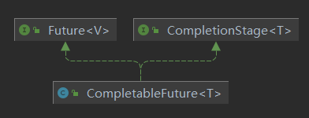
## 12.2、Future 缺点
Futrue 在 Java 里面，通常用来表示一个异步任务的引用，比如我们将任务提交到线程池里面，然后我们会得到一个 Futrue，在 Future 里面有 isDone 方法来 判断任务是否处理结束，还有 get 方法可以一直阻塞直到任务结束然后获取结果，但整体来说这种方式，还是同步的，因为需要客户端不断阻塞等待或者不断轮询才能知道任务是否完成。
Future 的主要缺点如下：

- 不支持手动完成
   - 我提交了一个任务，但是执行太慢了，我通过其他路径已经获取到了任务结果，现在没法把这个任务结果通知到正在执行的线程，所以必须主动取消或者一直等待它执行完成。
- 不支持进一步的非阻塞调用
   - 通过 Future 的 get 方法会一直阻塞到任务完成，但是想在获取任务之后执行额外的任务，因为 Future 不支持回调函数，所以无法实现这个功能
- 不支持链式调用
   - 对于 Future 的执行结果，我们想继续传到下一个 Future 处理使用，从而形成一个链式的 pipline 调用，这在 Future 中是没法实现的。
- 不支持多个 Future 合并
   - 比如我们有 10 个 Future 并行执行，我们想在所有的 Future 运行完毕之后，执行某些函数，是没法通过 Future 实现的。
- 不支持异常处理
   - Future 的 API 没有任何的异常处理的 api，所以在异步运行时，如果出了问题是不好定位的。
## 12.3、CompletableFuture
### 12.3.1、使用 CompletableFuture
场景:主线程里面创建一个 CompletableFuture，然后主线程调用 get 方法会阻塞，最后我们在一个子线程中使其终止。
```java
public class CompletableFutureTest {
    public static void main(String[] args) throws Exception{
        CompletableFuture<String> future = new CompletableFuture<>();

        new Thread(() -> {
            try{
                System.out.println(Thread.currentThread().getName() + "子线程开始干活");
                //子线程睡 5 秒
                Thread.sleep(5000);
                //在子线程中完成主线程
                future.complete("success");
            }catch (Exception e){
                e.printStackTrace();
            }
        }, "A").start();
        //主线程调用 get 方法阻塞
        System.out.println("主线程调用 get 方法获取结果为: " + future.get());
        System.out.println("主线程完成,阻塞结束!!!!!!");
    }
}
```
### 12.3.2、没有返回值的异步任务
```java
public class CompletableFutureTest01 {

    /**
     * 没有返回值的异步任务
     */
    public static void main(String[] args) throws Exception {
        System.out.println("主线程开始");
        //运行一个没有返回值的异步任务
        CompletableFuture<Void> future = CompletableFuture.runAsync(() -> {
            try {
                System.out.println("子线程启动干活");
                Thread.sleep(5000);
                System.out.println("子线程完成");
            } catch (Exception e) {
                e.printStackTrace();
            }
        });
        //主线程阻塞
        future.get();
        System.out.println("主线程结束");
    }
}
```
### 12.3.3、有返回值的异步任务
```java
public class CompletableFutureTest02 {
    public static void main(String[] args) throws Exception{
        System.out.println("主线程开始");
        //运行一个有返回值的异步任务
        CompletableFuture<String> future =
                CompletableFuture.supplyAsync(() -> {
                    try {
                        System.out.println("子线程开始任务");
                        Thread.sleep(5000);
                    } catch (Exception e) {
                        e.printStackTrace();
                    }
                    return "子线程完成了!";
                });
        //主线程阻塞
        String s = future.get();
        System.out.println("主线程结束, 子线程的结果为:" + s);
    }
}
```
### 12.3.4、线程依赖
当一个线程依赖另一个线程时，可以使用 thenApply 方法来把这两个线程串行化。
```java
public class CompletableFutureTest03 {
    private static Integer num = 10;
    /**
     * 先对一个数加 10,然后取平方
     */
    public static void main(String[] args) throws Exception{
        System.out.println("主线程开始");
        CompletableFuture<Integer> future =
                CompletableFuture.supplyAsync(() -> {
                    try {
                        System.out.println("加 10 任务开始");
                        num += 10;
                    } catch (Exception e) {
                        e.printStackTrace();
                    }
                    return num;
                }).thenApply(integer -> {
                    return num * num;
                });
        Integer integer = future.get();
        System.out.println("主线程结束, 子线程的结果为:" + integer);
    }
}
```
### 12.3.5、消费处理结果
thenAccept 消费处理结果, 接收任务的处理结果，并消费处理，无返回结果。
```java
public class CompletableFutureTest04 {
    private static Integer num = 10;

    /**
     * 先对一个数加 10,然后取平方
     */
    public static void main(String[] args) throws Exception {
        System.out.println("主线程开始");
        CompletableFuture.supplyAsync(() -> {
                    try {
                        System.out.println("加 10 任务开始");
                        num += 10;
                    } catch (Exception e) {
                        e.printStackTrace();
                    }
                    return num;
                })
                .thenApply(integer -> num * num)
                .thenAccept(integer -> System.out.println("子线程全部处理完成,最后调用了 accept,结果为:" + integer));
    }
}
```
### 12.3.6、异常处理
exceptionally 异常处理,出现异常时触发。
```java
public class CompletableFutureTest05 {
    private static Integer num = 10;
    /**
     * 先对一个数加 10,然后取平方
     */
    public static void main(String[] args) throws Exception{
        System.out.println("主线程开始");
        CompletableFuture<Integer> future = CompletableFuture.supplyAsync(() -> {
            int i= 1/0;
            System.out.println("加 10 任务开始");
            num += 10;
            return num;
        }).exceptionally(ex -> {
            System.out.println(ex.getMessage());
            return -1;
        });
        System.out.println(future.get());
    }
}
```
handle 类似于 thenAccept/thenRun 方法,是最后一步的处理调用，但是同时可以处理异常。
```java
public class CompletableFutureTest051 {
    private static Integer num = 10;

    /**
     * 先对一个数加 10,然后取平方
     */
    public static void main(String[] args) throws Exception {
        System.out.println("主线程开始");
        CompletableFuture<Integer> future = CompletableFuture.supplyAsync(() -> {
            System.out.println("加 10 任务开始");
            num += 10;
            return num;
        }).handle((i, ex) -> {
            System.out.println("进入 handle 方法");
            if (ex != null) {
                System.out.println("发生了异常,内容为:" + ex.getMessage());
                return -1;
            } else {
                System.out.println("正常完成,内容为: " + i);
                return i;
            }
        });
        System.out.println(future.get());
    }
}
```
### 12.3.7、结果合并
thenCompose 合并两个有依赖关系的 CompletableFutures 的执行结果
```java
public class CompletableFutureTest06 {
    private static Integer num = 10;

    /**
     * 先对一个数加 10,然后取平方
     */
    public static void main(String[] args) throws Exception {
        System.out.println("主线程开始");
        //第一步加 10
        CompletableFuture<Integer> future = CompletableFuture.supplyAsync(() -> {
            System.out.println("加 10 任务开始");
            num += 10;
            return num;
        });
        //合并
        CompletableFuture<Integer> future1 = future.thenCompose(i ->
                //再来一个 CompletableFuture
                CompletableFuture.supplyAsync(() -> {
                    return i + 1;
                }));
        System.out.println(future1.get());
        System.out.println(future.get());
    }
}
```
thenCombine 合并两个没有依赖关系的 CompletableFutures 任务
```java
public class CompletableFutureTest061 {
    private static Integer num = 10;

    /**
     * 先对一个数加 10,然后取平方
     */
    public static void main(String[] args) throws Exception{
        System.out.println("主线程开始");
        CompletableFuture<Integer> job1 = CompletableFuture.supplyAsync(() -> {
            System.out.println("加 10 任务开始");
            num += 10;
            return num;
        });
        CompletableFuture<Integer> job2 = CompletableFuture.supplyAsync(() -> {
            System.out.println("乘以 10 任务开始");
            num = num * 10;
            return num;
        });
        //合并两个结果
        CompletableFuture<Object> future = job1.thenCombine(job2,
                new BiFunction<Integer, Integer, List<Integer>>() {
                    @Override
                    public List<Integer> apply(Integer a, Integer b) {
                        List<Integer> list = new ArrayList<>();
                        list.add(a);
                        list.add(b);
                        return list;
                    }
                });
        System.out.println("合并结果为:" + future.get());
    }
}
```
合并多个任务的结果 allOf 与 anyOf

- allOf: 一系列独立的 future 任务，等其所有的任务执行完后做一些事情
```java
public class CompletableFutureTest062 {
    private static Integer num = 10;

    public static void main(String[] args) throws Exception {
        System.out.println("主线程开始");
        List<CompletableFuture<Integer>> list = new ArrayList<>();
        CompletableFuture<Integer> job1 = CompletableFuture.supplyAsync(() -> {
            System.out.println("加 10 任务开始");
            num += 10;
            return num;
        });
        list.add(job1);
        
        CompletableFuture<Integer> job2 = CompletableFuture.supplyAsync(() -> {
            System.out.println("乘以 10 任务开始");
            num = num * 10;
            return num;
        });
        list.add(job2);
        
        CompletableFuture<Integer> job3 = CompletableFuture.supplyAsync(() -> {
            System.out.println("减以 10 任务开始");
            num = num * 10;
            return num;
        });
        list.add(job3);
        
        CompletableFuture<Integer> job4 = CompletableFuture.supplyAsync(() -> {
            System.out.println("除以 10 任务开始");
            num = num * 10;
            return num;
        });
        list.add(job4);
        
        //多任务合并
        List<Integer> collect =
                list.stream().map(CompletableFuture::join).collect(Collectors.toList());
        System.out.println(collect);
    }
}
```

- anyOf: 只要在多个 future 里面有一个返回，整个任务就可以结束，而不需要等到每一个 future 结束
```java
public class CompletableFutureTest063 {
    private static Integer num = 10;

    public static void main(String[] args) throws Exception{
        System.out.println("主线程开始");
        CompletableFuture<Integer>[] futures = new CompletableFuture[4];
        CompletableFuture<Integer> job1 = CompletableFuture.supplyAsync(() -> {
            try{
                Thread.sleep(5000);
                System.out.println("加 10 任务开始");
                num += 10;
                return num;
            }catch (Exception e){
                return 0;
            }
        });
        futures[0] = job1;
        CompletableFuture<Integer> job2 = CompletableFuture.supplyAsync(() -> {
            try{
                Thread.sleep(2000);
                System.out.println("乘以 10 任务开始");
                num = num * 10;
                return num;
            }catch (Exception e){
                return 1;
            }
        });
        futures[1] = job2;
        CompletableFuture<Integer> job3 = CompletableFuture.supplyAsync(() -> {
            try{
                Thread.sleep(3000);
                System.out.println("减以 10 任务开始");
                num = num * 10;
                return num;
            }catch (Exception e){
                return 2;
            }
        });
        futures[2] = job3;
        CompletableFuture<Integer> job4 = CompletableFuture.supplyAsync(() -> {
            try{
                Thread.sleep(4000);
                System.out.println("除以 10 任务开始");
                num = num * 10;
                return num;
            }catch (Exception e){
                return 3;
            }
        });
        futures[3] = job4;
        CompletableFuture<Object> future = CompletableFuture.anyOf(futures);
        System.out.println(future.get());
    }
}
```


··