一、 Class文件结构

## 1.1. Class字节码文件结构
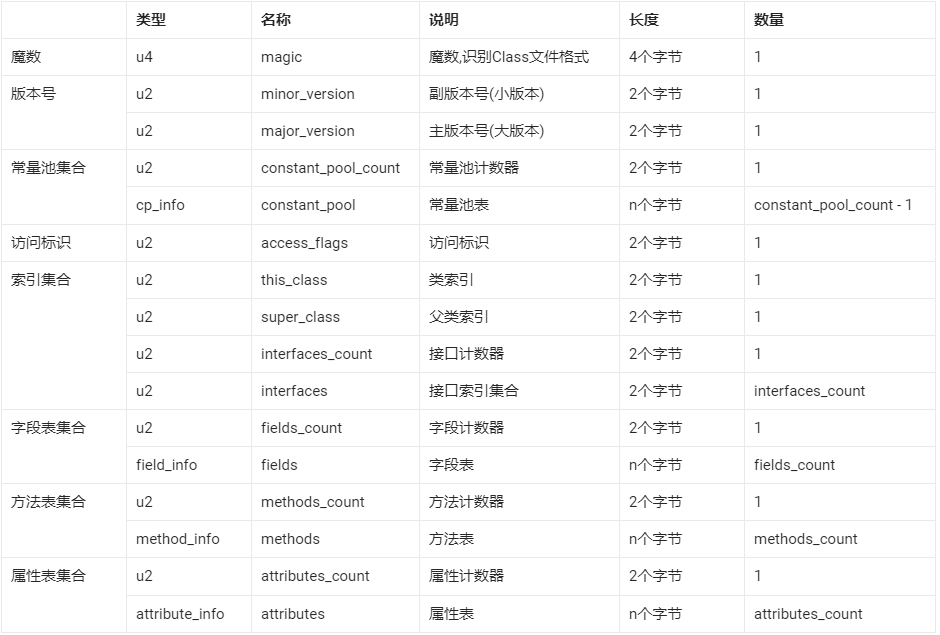


## 1.2. Class文件数据类型
| **数据类型** | **定义**                                                     | **说明**                                                     |
| ------------ | ------------------------------------------------------------ | ------------------------------------------------------------ |
| **无符号数** | 无符号数可以用来描述数字、索引引用、数量值或按照utf-8编码构成的字符串值。 | 其中无符号数属于基本的数据类型。 以u1、u2、u4、u8来分别代表1个字节、2个字节、4个字节和8个字节 |
| **表**       | 表是由多个无符号数或其他表构成的复合数据结构。               | 所有的表都以“_info”结尾。 由于表没有固定长度，所以通常会在其前面加上个数说明。 |


## 1.3. 魔数
**Magic Number（魔数）**

- 每个Class文件开头的4个字节的无符号整数称为魔数（Magic Number）
- 它的唯一作用是确定这个文件是否为一个能被虚拟机接受的有效合法的Class文件。即：魔数是Class文件的标识符。
- 魔数值固定为0xCAFEBABE。不会改变。
- 如果一个Class文件不以0xCAFEBABE开头，虚拟机在进行文件校验的时候就会直接抛出以下错误：

```java
Error: A JNI error has occurred, please check your installation and try again
Exception in thread "main" java.lang.ClassFormatError: Incompatible magic value 1885430635 in class file StringTest
```

- 使用魔数而不是扩展名来进行识别主要是基于安全方面的考虑，因为文件扩展名可以随意地改动。
## 1.4. 文件版本号
紧接着魔数的4个字节存储的是Class文件的版本号。同样也是4个字节。第5个和第6个字节所代表的含义就是编译的副版本号minor_version，而第7个和第8个字节就是编译的主版本号major_version。
它们共同构成了class文件的格式版本号。譬如某个Class文件的主版本号为M，副版本号为m，那么这个Class文件的格式版本号就确定为M.m。
版本号和Java编译器的对应关系如下表：

| 主版本（十进制） | 副版本（十进制） | 编译器版本 |
| ---------------- | ---------------- | ---------- |
| 45               | 3                | 1.1        |
| 46               | 0                | 1.2        |
| 47               | 0                | 1.3        |
| 48               | 0                | 1.4        |
| 49               | 0                | 1.5        |
| 50               | 0                | 1.6        |
| 51               | 0                | 1.7        |
| 52               | 0                | 1.8        |
| 53               | 0                | 1.9        |
| 54               | 0                | 1.10       |
| 55               | 0                | 1.11       |


Java的版本号是从45开始的，JDK1.1之后的每个JDK大版本发布主版本号向上加1。
不同版本的Java编译器编译的Class文件对应的版本是不一样的。目前，高版本的Java虚拟机可以执行由低版本编译器生成的Class文件，但是低版本的Java虚拟机不能执行由高版本编译器生成的Class文件。否则JVM会抛出java.lang.UnsupportedClassVersionError异常。（向下兼容）
在实际应用中，由于开发环境和生产环境的不同，可能会导致该问题的发生。因此，需要我们在开发时，特别注意开发编译的JDK版本和生产环境中的JDK版本是否一致。
> 虚拟机JDK版本为1.k（k>=2）时，对应的class文件格式版本号的范围为45.0 - 44+k.0（含两端）。


## 1.5. 常量池集合
常量池是Class文件中内容最为丰富的区域之一。常量池对于Class文件中的字段和方法解析也有着至关重要的作用。
随着Java虚拟机的不断发展，常量池的内容也日渐丰富。可以说，常量池是整个Class文件的基石。
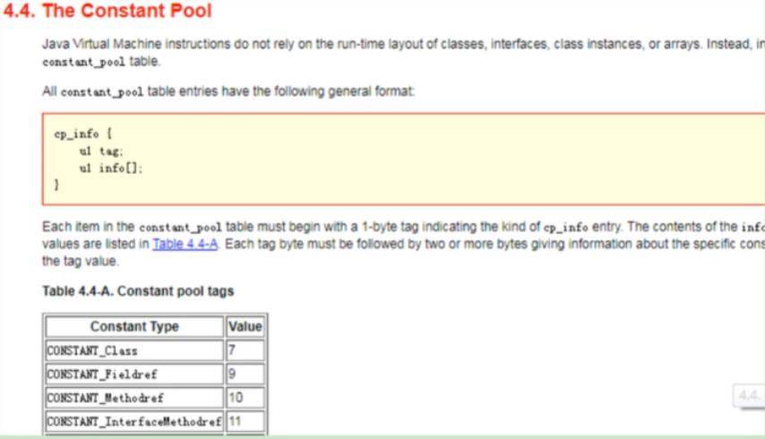
在版本号之后，紧跟着的是常量池的数量，以及若干个常量池表项。
常量池中常量的数量是不固定的，所以在常量池的入口需要放置一项u2类型的无符号数，代表常量池容量计数值（constant_pool_count）。与Java中语言习惯不一样的是，这个容量计数是从1而不是0开始的。

| 类型           | 名称                | 数量                    |
| -------------- | ------------------- | ----------------------- |
| u2（无符号数） | constant_pool_count | 1                       |
| cp_info（表）  | constant_pool       | constant_pool_count - 1 |

由上表可见，Class文件使用了一个前置的容量计数器（constant_pool_count）加若干个连续的数据项（constant_pool）的形式来描述常量池内容。我们把这一系列连续常量池数据称为常量池集合。
> 常量池表项中，用于存放编译时期生成的各种字面量和符号引用，这部分内容将在类加载后进入方法区的运行时常量池中存放


### 1.5.1. 常量池计数器
**constant_pool_count（常量池计数器）**

- 由于常量池的数量不固定，时长时短，所以需要放置两个字节来表示常量池容量计数值。
- 常量池容量计数值（u2类型）：从1开始，表示常量池中有多少项常量。即constant_pool_count=1表示常量池中有0个常量项。
- Demo的值为：


其值为0x0016，掐指一算，也就是22。需要注意的是，这实际上只有21项常量。索引为范围是1-21。为什么呢？
通常我们写代码时都是从0开始的，但是这里的常量池却是从1开始，因为它把第0项常量空出来了。这是为了满足后面某些指向常量池的索引值的数据在特定情况下需要表达“不引用任何一个常量池项目”的含义，这种情况可用索引值0来表示。
### 1.5.2. 常量池表
constant_pool是一种表结构，以1 ~ constant_pool_count - 1为索引。表明了后面有多少个常量项。
常量池主要存放两大类常量：字面量（Literal）和符号引用（Symbolic References）
它包含了class文件结构及其子结构中引用的所有字符串常量、类或接口名、字段名和其他常量。常量池中的每一项都具备相同的特征。第1个字节作为类型标记，用于确定该项的格式，这个字节称为tag byte（标记字节、标签字节）。

| 类型                             | 标志(或标识) | 描述                   |
| -------------------------------- | ------------ | ---------------------- |
| CONSTANT_Utf8_info               | 1            | UTF-8编码的字符串      |
| CONSTANT_Integer_info            | 3            | 整型字面量             |
| CONSTANT_Float_info              | 4            | 浮点型字面量           |
| CONSTANT_Long_info               | 5            | 长整型字面量           |
| CONSTANT_Double_info             | 6            | 双精度浮点型字面量     |
| CONSTANT_Class_info              | 7            | 类或接口的符号引用     |
| CONSTANT_String_info             | 8            | 字符串类型字面量       |
| CONSTANT_Fieldref_info           | 9            | 字段的符号引用         |
| CONSTANT_Methodref_info          | 10           | 类中方法的符号引用     |
| CONSTANT_InterfaceMethodref_info | 11           | 接口中方法的符号引用   |
| CONSTANT_NameAndType_info        | 12           | 字段或方法的符号引用   |
| CONSTANT_MethodHandle_info       | 15           | 表示方法句柄           |
| CONSTANT_MethodType_info         | 16           | 标志方法类型           |
| CONSTANT_InvokeDynamic_info      | 18           | 表示一个动态方法调用点 |

#### Ⅰ. 字面量和符号引用
在对这些常量解读前，我们需要搞清楚几个概念。
常量池主要存放两大类常量：字面量（Literal）和符号引用（Symbolic References）。如下表：

| 常量     | 具体的常量          |
| -------- | ------------------- |
| 字面量   | 文本字符串          |
|          | 声明为final的常量值 |
| 符号引用 | 类和接口的全限定名  |
|          | 字段的名称和描述符  |
|          | 方法的名称和描述符  |

**全限定名**
com/atguigu/test/Demo这个就是类的全限定名，仅仅是把包名的“.“替换成”/”，为了使连续的多个全限定名之间不产生混淆，在使用时最后一般会加入一个“;”表示全限定名结束。
**简单名称**
简单名称是指没有类型和参数修饰的方法或者字段名称，上面例子中的类的add()方法和num字段的简单名称分别是add和num。
**描述符**
描述符的作用是用来描述字段的数据类型、方法的参数列表（包括数量、类型以及顺序）和返回值。根据描述符规则，基本数据类型（byte、char、double、float、int、long、short、boolean）以及代表无返回值的void类型都用一个大写字符来表示，而对象类型则用字符L加对象的全限定名来表示，详见下表：

| 标志符 | 含义                                          |
| ------ | --------------------------------------------- |
| B      | 基本数据类型byte                              |
| C      | 基本数据类型char                              |
| D      | 基本数据类型double                            |
| F      | 基本数据类型float                             |
| I      | 基本数据类型int                               |
| J      | 基本数据类型long                              |
| S      | 基本数据类型short                             |
| Z      | 基本数据类型boolean                           |
| V      | 代表void类型                                  |
| L      | 对象类型，比如：`Ljava/lang/Object;`          |
| [      | 数组类型，代表一维数组。比如：`double[] is [D |

用描述符来描述方法时，按照先参数列表，后返回值的顺序描述，参数列表按照参数的严格顺序放在一组小括号“()”之内。如方法java.lang.String tostring()的描述符为()Ljava/lang/String; ，方法int abc(int[]x, int y)的描述符为([II)I。
**补充说明：**
虚拟机在加载Class文件时才会进行动态链接，也就是说，Class文件中不会保存各个方法和字段的最终内存布局信息。因此，这些字段和方法的符号引用不经过转换是无法直接被虚拟机使用的。当虚拟机运行时，需要从常量池中获得对应的符号引用，再在类加载过程中的解析阶段将其替换为直接引用，并翻译到具体的内存地址中。
这里说明下符号引用和直接引用的区别与关联：

- 符号引用：符号引用以一组符号来描述所引用的目标，符号可以是任何形式的字面量，只要使用时能无歧义地定位到目标即可。符号引用与虚拟机实现的内存布局无关，引用的目标并不一定已经加载到了内存中。
- 直接引用：直接引用可以是直接指向目标的指针、相对偏移量或是一个能间接定位到目标的句柄。直接引用是与虚拟机实现的内存布局相关的，同一个符号引用在不同虚拟机实例上翻译出来的直接引用一般不会相同。如果有了直接引用，那说明引用的目标必定已经存在于内存之中了。
#### Ⅱ. 常量类型和结构
常量池中每一项常量都是一个表，J0K1.7之后共有14种不同的表结构数据。如下表格所示：

根据上图每个类型的描述我们也可以知道每个类型是用来描述常量池中哪些内容（主要是字面量、符号引用）的。比如:
CONSTANT_Integer_info是用来描述常量池中字面量信息的，而且只是整型字面量信息。
标志为15、16、18的常量项类型是用来支持动态语言调用的（jdk1.7时才加入的）。
**细节说明:**

- CONSTANT_Class_info结构用于表示类或接口
- CONSTAT_Fieldref_info、CONSTAHT_Methodref_infoF和lCONSTANIT_InterfaceMethodref_info结构表示字段、方汇和按口小法
- CONSTANT_String_info结构用于表示示String类型的常量对象
- CONSTANT_Integer_info和CONSTANT_Float_info表示4字节（int和float）的数值常量
- CONSTANT_Long_info和CONSTAT_Double_info结构表示8字作（long和double）的数值常量 
   - 在class文件的常最池表中，所行的a字节常借均占两个表成员（项）的空问。如果一个CONSTAHT_Long_info和CNSTAHT_Double_info结构在常量池中的索引位n，则常量池中一个可用的索引位n+2，此时常量池长中索引为n+1的项仍然有效但必须视为不可用的。

 

- CONSTANT_NameAndType_info结构用于表示字段或方法，但是和之前的3个结构不同，CONSTANT_NameAndType_info结构没有指明该字段或方法所属的类或接口。
- CONSTANT_Utf8_info用于表示字符常量的值
- CONSTANT_MethodHandle_info结构用于表示方法句柄
- CONSTANT_MethodType_info结构表示方法类型
- CONSTANT_InvokeDynamic_info结构表示invokedynamic指令所用到的引导方法(bootstrap method)、引导方法所用到的动态调用名称(dynamic invocation name)、参数和返回类型，并可以给引导方法传入一系列称为静态参数（static argument）的常量。

**解析方法：**

- 一个字节一个字节的解析
- 使用javap命令解析：javap-verbose Demo.class或jclasslib工具会更方便。

**总结1：**

- 这14种表（或者常量项结构）的共同点是：表开始的第一位是一个u1类型的标志位（tag），代表当前这个常量项使用的是哪种表结构，即哪种常量类型。
- 在常量池列表中，CONSTANT_Utf8_info常量项是一种使用改进过的UTF-8编码格式来存储诸如文字字符串、类或者接口的全限定名、字段或者方法的简单名称以及描述符等常量字符串信息。
- 这14种常量项结构还有一个特点是，其中13个常量项占用的字节固定，只有CONSTANT_Utf8_info占用字节不固定，其大小由length决定。为什么呢？因为从常量池存放的内容可知，其存放的是字面量和符号引用，最终这些内容都会是一个字符串，这些字符串的大小是在编写程序时才确定，比如你定义一个类，类名可以取长取短，所以在没编译前，大小不固定，编译后，通过utf-8编码，就可以知道其长度。

**总结2：**

- 常量池：可以理解为Class文件之中的资源仓库，它是Class文件结构中与其他项目关联最多的数据类型（后面的很多数据类型都会指向此处），也是占用Class文件空间最大的数据项目之一。
- 常量池中为什么要包含这些内容？Java代码在进行Javac编译的时候，并不像C和C++那样有“连接”这一步骤，而是在虚拟机加载C1ass文件的时候进行动态链接。也就是说，在Class文件中不会保存各个方法、字段的最终内存布局信息，因此这些字段、方法的符号引用不经过运行期转换的话无法得到真正的内存入口地址，也就无法直接被虚拟机使用。当虚拟机运行时，需要从常量池获得对应的符号引用，再在类创建时或运行时解析、翻译到具体的内存地址之中。关于类的创建和动态链接的内容，在虚拟机类加载过程时再进行详细讲解

## 1.6. 访问标志
**访问标识（access_flag、访问标志、访问标记）**
在常量池后，紧跟着访问标记。该标记使用两个字节表示，用于识别一些类或者接口层次的访问信息，包括：这个Class是类还是接口；是否定义为public类型；是否定义为abstract类型；如果是类的话，是否被声明为final等。各种访问标记如下所示：

| 标志名称       | 标志值 | 含义                                                         |
| -------------- | ------ | ------------------------------------------------------------ |
| ACC_PUBLIC     | 0x0001 | 标志为public类型                                             |
| ACC_FINAL      | 0x0010 | 标志被声明为final，只有类可以设置                            |
| ACC_SUPER      | 0x0020 | 标志允许使用invokespecial字节码指令的新语义，JDK1.0.2之后编译出来的类的这个标志默认为真。（使用增强的方法调用父类方法） |
| ACC_INTERFACE  | 0x0200 | 标志这是一个接口                                             |
| ACC_ABSTRACT   | 0x0400 | 是否为abstract类型，对于接口或者抽象类来说，次标志值为真，其他类型为假 |
| ACC_SYNTHETIC  | 0x1000 | 标志此类并非由用户代码产生（即：由编译器产生的类，没有源码对应） |
| ACC_ANNOTATION | 0x2000 | 标志这是一个注解                                             |
| ACC_ENUM       | 0x4000 | 标志这是一个枚举                                             |


类的访问权限通常为ACC_开头的常量。
每一种类型的表示都是通过设置访问标记的32位中的特定位来实现的。比如，若是public final的类，则该标记为ACC_PUBLIC | ACC_FINAL。
使用ACC_SUPER可以让类更准确地定位到父类的方法super.method()，现代编译器都会设置并且使用这个标记。

**补充说明：**

1.  带有ACC_INTERFACE标志的class文件表示的是接口而不是类，反之则表示的是类而不是接口。 
   - 如果一个class文件被设置了ACC_INTERFACE标志，那么同时也得设置ACC_ABSTRACT标志。同时它不能再设置ACC_FINAL、ACC_SUPER 或ACC_ENUM标志。
   - 如果没有设置ACC_INTERFACE标志，那么这个class文件可以具有上表中除ACC_ANNOTATION外的其他所有标志。当然，ACC_FINAL和ACC_ABSTRACT这类互斥的标志除外。这两个标志不得同时设置。
2.  ACC_SUPER标志用于确定类或接口里面的invokespecial指令使用的是哪一种执行语义。针对Java虚拟机指令集的编译器都应当设置这个标志。对于Java SE 8及后续版本来说，无论class文件中这个标志的实际值是什么，也不管class文件的版本号是多少，Java虚拟机都认为每个class文件均设置了ACC_SUPER标志。 
   - ACC_SUPER标志是为了向后兼容由旧Java编译器所编译的代码而设计的。目前的ACC_SUPER标志在由JDK1.0.2之前的编译器所生成的access_flags中是没有确定含义的，如果设置了该标志，那么0racle的Java虚拟机实现会将其忽略。
3.  ACC_SYNTHETIC标志意味着该类或接口是由编译器生成的，而不是由源代码生成的。 
4.  注解类型必须设置ACC_ANNOTATION标志。如果设置了ACC_ANNOTATION标志，那么也必须设置ACC_INTERFACE标志。 
5.  ACC_ENUM标志表明该类或其父类为枚举类型。 

## 1.7. 类索引、父类索引、接口索引
在访问标记后，会指定该类的类别、父类类别以及实现的接口，格式如下：

| 长度 | 含义                         |
| ---- | ---------------------------- |
| u2   | this_class                   |
| u2   | super_class                  |
| u2   | interfaces_count             |
| u2   | interfaces[interfaces_count] |


这三项数据来确定这个类的继承关系：

- 类索引用于确定这个类的全限定名
- 父类索引用于确定这个类的父类的全限定名。由于Java语言不允许多重继承，所以父类索引只有一个，除了java.1ang.Object之外，所有的Java类都有父类，因此除了java.lang.Object外，所有Java类的父类索引都不为e。
- 接口索引集合就用来描述这个类实现了哪些接口，这些被实现的接口将按implements语句（如果这个类本身是一个接口，则应当是extends语句）后的接口顺序从左到右排列在接口索引集合中。
### 1.7.1. this_class（类索引）
2字节无符号整数，指向常量池的索引。它提供了类的全限定名，如com/atguigu/java1/Demo。this_class的值必须是对常量池表中某项的一个有效索引值。常量池在这个索引处的成员必须为CONSTANT_Class_info类型结构体，该结构体表示这个class文件所定义的类或接口。
### 1.7.2. super_class（父类索引）
2字节无符号整数，指向常量池的索引。它提供了当前类的父类的全限定名。如果我们没有继承任何类，其默认继承的是java/lang/object类。同时，由于Java不支持多继承，所以其父类只有一个。
super_class指向的父类不能是final。
### 1.7.3. interfaces
指向常量池索引集合，它提供了一个符号引用到所有已实现的接口
由于一个类可以实现多个接口，因此需要以数组形式保存多个接口的索引，表示接口的每个索引也是一个指向常量池的CONSTANT_Class（当然这里就必须是接口，而不是类）。
#### Ⅰ. interfaces_count（接口计数器）
interfaces_count项的值表示当前类或接口的直接超接口数量。
#### Ⅱ. interfaces[]（接口索引集合）
interfaces[]中每个成员的值必须是对常量池表中某项的有效索引值，它的长度为interfaces_count。每个成员interfaces[i]必须为CONSTANT_Class_info结构，其中0 <= i < interfaces_count。在interfaces[]中，各成员所表示的接口顺序和对应的源代码中给定的接口顺序（从左至右）一样，即interfaces[0]对应的是源代码中最左边的接口。

## 1.8. 字段表集合
**fields**
用于描述接口或类中声明的变量。字段（field）包括类级变量以及实例级变量，但是不包括方法内部、代码块内部声明的局部变量。
字段叫什么名字、字段被定义为什么数据类型，这些都是无法固定的，只能引用常量池中的常量来描述。
它指向常量池索引集合，它描述了每个字段的完整信息。比如字段的标识符、访问修饰符（public、private或protected）、是类变量还是实例变量（static修饰符）、是否是常量（final修饰符）等。
**注意事项：**

- 字段表集合中不会列出从父类或者实现的接口中继承而来的字段，但有可能列出原本Java代码之中不存在的字段。譬如在内部类中为了保持对外部类的访问性，会自动添加指向外部类实例的字段。
- 在Java语言中字段是无法重载的，两个字段的数据类型、修饰符不管是否相同，都必须使用不一样的名称，但是对于字节码来讲，如果两个字段的描述符不一致，那字段重名就是合法的。
### 1.8.1. 字段计数器
**fields_count（字段计数器）**
fields_count的值表示当前class文件fields表的成员个数。使用两个字节来表示。
fields表中每个成员都是一个field_info结构，用于表示该类或接口所声明的所有类字段或者实例字段，不包括方法内部声明的变量，也不包括从父类或父接口继承的那些字段。

| 标志名称       | 标志值           | 含义       | 数量             |
| -------------- | ---------------- | ---------- | ---------------- |
| u2             | access_flags     | 访问标志   | 1                |
| u2             | name_index       | 字段名索引 | 1                |
| u2             | descriptor_index | 描述符索引 | 1                |
| u2             | attributes_count | 属性计数器 | 1                |
| attribute_info | attributes       | 属性集合   | attributes_count |

### 1.8.2. 字段表
#### Ⅰ. 字段表访问标识
我们知道，一个字段可以被各种关键字去修饰，比如：作用域修饰符（public、private、protected）、static修饰符、final修饰符、volatile修饰符等等。因此，其可像类的访问标志那样，使用一些标志来标记字段。字段的访问标志有如下这些：

| 标志名称      | 标志值 | 含义                       |
| ------------- | ------ | -------------------------- |
| ACC_PUBLIC    | 0x0001 | 字段是否为public           |
| ACC_PRIVATE   | 0x0002 | 字段是否为private          |
| ACC_PROTECTED | 0x0004 | 字段是否为protected        |
| ACC_STATIC    | 0x0008 | 字段是否为static           |
| ACC_FINAL     | 0x0010 | 字段是否为final            |
| ACC_VOLATILE  | 0x0040 | 字段是否为volatile         |
| ACC_TRANSTENT | 0x0080 | 字段是否为transient        |
| ACC_SYNCHETIC | 0x1000 | 字段是否为由编译器自动产生 |
| ACC_ENUM      | 0x4000 | 字段是否为enum             |

#### Ⅱ. 描述符索引
描述符的作用是用来描述字段的数据类型、方法的参数列表（包括数量、类型以及顺序）和返回值。根据描述符规则，基本数据类型（byte，char，double，float，int，long，short，boolean）及代表无返回值的void类型都用一个大写字符来表示，而对象则用字符L加对象的全限定名来表示，如下所示：

| 标志符 | 含义                                                |
| ------ | --------------------------------------------------- |
| B      | 基本数据类型byte                                    |
| C      | 基本数据类型char                                    |
| D      | 基本数据类型double                                  |
| F      | 基本数据类型float                                   |
| I      | 基本数据类型int                                     |
| J      | 基本数据类型long                                    |
| S      | 基本数据类型short                                   |
| Z      | 基本数据类型boolean                                 |
| V      | 代表void类型                                        |
| L      | 对象类型，比如：`Ljava/lang/Object;`                |
| [      | 数组类型，代表一维数组。比如：`double[][][] is [[[D |


#### Ⅲ. 属性表集合
一个字段还可能拥有一些属性，用于存储更多的额外信息。比如初始化值、一些注释信息等。属性个数存放在attribute_count中，属性具体内容存放在attributes数组中。
```java
// 以常量属性为例，结构为：
ConstantValue_attribute{
	u2 attribute_name_index;
	u4 attribute_length;
    u2 constantvalue_index;
}
```
说明：对于常量属性而言，attribute_length值恒为2。

## 1.9. 方法表集合
methods：指向常量池索引集合，它完整描述了每个方法的签名。

- 在字节码文件中，每一个method_info项都对应着一个类或者接口中的方法信息。比如方法的访问修饰符（public、private或protected），方法的返回值类型以及方法的参数信息等。
- 如果这个方法不是抽象的或者不是native的，那么字节码中会体现出来。
- 一方面，methods表只描述当前类或接口中声明的方法，不包括从父类或父接口继承的方法。另一方面，methods表有可能会出现由编译器自动添加的方法，最典型的便是编译器产生的方法信息（比如：类（接口）初始化方法`<clinit>()`和实例初始化方法`<init>()`）。

**使用注意事项：**
在Java语言中，要重载（Overload）一个方法，除了要与原方法具有相同的简单名称之外，还要求必须拥有一个与原方法不同的特征签名，特征签名就是一个方法中各个参数在常量池中的字段符号引用的集合，也就是因为返回值不会包含在特征签名之中，因此Java语言里无法仅仅依靠返回值的不同来对一个已有方法进行重载。但在Class文件格式中，特征签名的范围更大一些，只要描述符不是完全一致的两个方法就可以共存。也就是说，如果两个方法有相同的名称和特征签名，但返回值不同，那么也是可以合法共存于同一个class文件中。
也就是说，尽管Java语法规范并不允许在一个类或者接口中声明多个方法签名相同的方法，但是和Java语法规范相反，字节码文件中却恰恰允许存放多个方法签名相同的方法，唯一的条件就是这些方法之间的返回值不能相同。
### 1.9.1. 方法计数器
**methods_count（方法计数器）**
methods_count的值表示当前class文件methods表的成员个数。使用两个字节来表示。
methods表中每个成员都是一个method_info结构。
### 1.9.2. 方法表
**methods[]（方法表）**
methods表中的每个成员都必须是一个method_info结构，用于表示当前类或接口中某个方法的完整描述。如果某个method_info结构的access_flags项既没有设置ACC_NATIVE标志也没有设置ACC_ABSTRACT标志，那么该结构中也应包含实现这个方法所用的Java虚拟机指令。
method_info结构可以表示类和接口中定义的所有方法，包括实例方法、类方法、实例初始化方法和类或接口初始化方法
方法表的结构实际跟字段表是一样的，方法表结构如下：

| 标志名称       | 标志值           | 含义       | 数量             |
| -------------- | ---------------- | ---------- | ---------------- |
| u2             | access_flags     | 访问标志   | 1                |
| u2             | name_index       | 方法名索引 | 1                |
| u2             | descriptor_index | 描述符索引 | 1                |
| u2             | attributes_count | 属性计数器 | 1                |
| attribute_info | attributes       | 属性集合   | attributes_count |

**方法表访问标志**
跟字段表一样，方法表也有访问标志，而且他们的标志有部分相同，部分则不同，方法表的具体访问标志如下：

| 标志名称      | 标志值 | 含义                                |
| ------------- | ------ | ----------------------------------- |
| ACC_PUBLIC    | 0x0001 | public，方法可以从包外访问          |
| ACC_PRIVATE   | 0x0002 | private，方法只能本类访问           |
| ACC_PROTECTED | 0x0004 | protected，方法在自身和子类可以访问 |
| ACC_STATIC    | 0x0008 | static，静态方法                    |

## 1.10. 属性表集合
方法表集合之后的属性表集合，指的是class文件所携带的辅助信息，比如该class文件的源文件的名称。以及任何带有RetentionPolicy.CLASS 或者RetentionPolicy.RUNTIME的注解。这类信息通常被用于Java虚拟机的验证和运行，以及Java程序的调试，一般无须深入了解。
此外，字段表、方法表都可以有自己的属性表。用于描述某些场景专有的信息。
属性表集合的限制没有那么严格，不再要求各个属性表具有严格的顺序，并且只要不与已有的属性名重复，任何人实现的编译器都可以向属性表中写入自己定义的属性信息，但Java虚拟机运行时会忽略掉它不认识的属性。
### 1.10.1. 属性计数器
**attributes_count（属性计数器）**
attributes_count的值表示当前class文件属性表的成员个数。属性表中每一项都是一个attribute_info结构。
### 1.10.2. 属性表
**attributes[]（属性表）**
属性表的每个项的值必须是attribute_info结构。属性表的结构比较灵活，各种不同的属性只要满足以下结构即可。
**属性的通用格式**

| 类型 | 名称                 | 数量             | 含义       |
| ---- | -------------------- | ---------------- | ---------- |
| u2   | attribute_name_index | 1                | 属性名索引 |
| u4   | attribute_length     | 1                | 属性长度   |
| u1   | info                 | attribute_length | 属性表     |


**属性类型**
属性表实际上可以有很多类型，上面看到的Code属性只是其中一种，Java8里面定义了23种属性。下面这些是虚拟机中预定义的属性：

| 属性名称                            | 使用位置           | 含义                                                         |
| ----------------------------------- | ------------------ | ------------------------------------------------------------ |
| Code                                | 方法表             | Java代码编译成的字节码指令                                   |
| ConstantValue                       | 字段表             | final关键字定义的常量池                                      |
| Deprecated                          | 类，方法，字段表   | 被声明为deprecated的方法和字段                               |
| Exceptions                          | 方法表             | 方法抛出的异常                                               |
| EnclosingMethod                     | 类文件             | 仅当一个类为局部类或者匿名类时才能拥有这个属性，这个属性用于标识这个类所在的外围方法 |
| InnerClass                          | 类文件             | 内部类列表                                                   |
| LineNumberTable                     | Code属性           | Java源码的行号与字节码指令的对应关系                         |
| LocalVariableTable                  | Code属性           | 方法的局部变量描述                                           |
| StackMapTable                       | Code属性           | JDK1.6中新增的属性，供新的类型检查检验器和处理目标方法的局部变量和操作数有所需要的类是否匹配 |
| Signature                           | 类，方法表，字段表 | 用于支持泛型情况下的方法签名                                 |
| SourceFile                          | 类文件             | 记录源文件名称                                               |
| SourceDebugExtension                | 类文件             | 用于存储额外的调试信息                                       |
| Synthetic                           | 类，方法表，字段表 | 标志方法或字段为编译器自动生成的                             |
| LocalVariableTypeTable              | 类                 | 是哟很难过特征签名代替描述符，是为了引入泛型语法之后能描述泛型参数化类型而添加 |
| RuntimeVisibleAnnotations           | 类，方法表，字段表 | 为动态注解提供支持                                           |
| RuntimeInvisibleAnnotations         | 类，方法表，字段表 | 用于指明哪些注解是运行时不可见的                             |
| RuntimeVisibleParameterAnnotation   | 方法表             | 作用与RuntimeVisibleAnnotations属性类似，只不过作用对象或方法 |
| RuntimeInvisibleParameterAnnotation | 方法表             | 作用与RuntimeInvisibleAnnotations属性类似，只不过作用对象或方法 |
| AnnotationDefault                   | 方法表             | 用于记录注解类元素的默认值                                   |
| BootstrapMethods                    | 类文件             | 用于保存invokeddynamic指令引用的引导方法限定符               |

或者（查看官网）
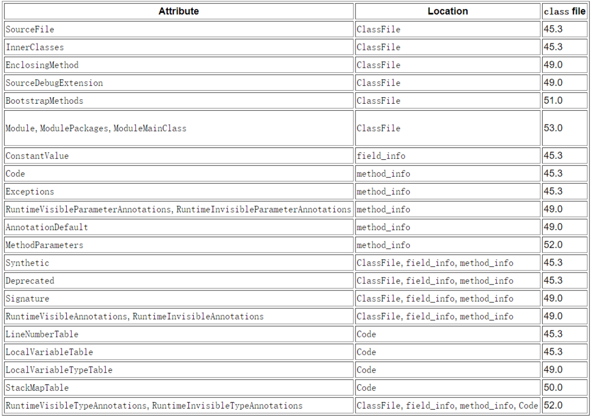

**部分属性详解**
**① ConstantValue属性**
ConstantValue属性表示一个常量字段的值。位于field_info结构的属性表中。
```java
ConstantValue_attribute{
	u2 attribute_name_index;
	u4 attribute_length;
	u2 constantvalue_index;//字段值在常量池中的索引，常量池在该索引处的项给出该属性表示的常量值。（例如，值是1ong型的，在常量池中便是CONSTANT_Long）
}
```

**② Deprecated 属性**
Deprecated 属性是在JDK1.1为了支持注释中的关键词@deprecated而引入的。
```java
Deprecated_attribute{
	u2 attribute_name_index;
	u4 attribute_length;
}
```
**③ Code属性**
Code属性就是存放方法体里面的代码。但是，并非所有方法表都有Code属性。像接口或者抽象方法，他们没有具体的方法体，因此也就不会有Code属性了。Code属性表的结构，如下图：

| 类型           | 名称                   | 数量             | 含义                     |
| -------------- | ---------------------- | ---------------- | ------------------------ |
| u2             | attribute_name_index   | 1                | 属性名索引               |
| u4             | attribute_length       | 1                | 属性长度                 |
| u2             | max_stack              | 1                | 操作数栈深度的最大值     |
| u2             | max_locals             | 1                | 局部变量表所需的存续空间 |
| u4             | code_length            | 1                | 字节码指令的长度         |
| u1             | code                   | code_lenth       | 存储字节码指令           |
| u2             | exception_table_length | 1                | 异常表长度               |
| exception_info | exception_table        | exception_length | 异常表                   |
| u2             | attributes_count       | 1                | 属性集合计数器           |
| attribute_info | attributes             | attributes_count | 属性集合                 |

可以看到：Code属性表的前两项跟属性表是一致的，即Code属性表遵循属性表的结构，后面那些则是他自定义的结构。
**④ InnerClasses 属性**
为了方便说明特别定义一个表示类或接口的Class格式为C。如果C的常量池中包含某个CONSTANT_Class_info成员，且这个成员所表示的类或接口不属于任何一个包，那么C的ClassFile结构的属性表中就必须含有对应的InnerClasses属性。InnerClasses属性是在JDK1.1中为了支持内部类和内部接口而引入的，位于ClassFile结构的属性表。
**⑤ LineNumberTable属性**
LineNumberTable属性是可选变长属性，位于Code结构的属性表。
LineNumberTable属性是用来描述Java源码行号与字节码行号之间的对应关系。这个属性可以用来在调试的时候定位代码执行的行数。

- start_pc，即字节码行号；1ine_number，即Java源代码行号。

在Code属性的属性表中，LineNumberTable属性可以按照任意顺序出现，此外，多个LineNumberTable属性可以共同表示一个行号在源文件中表示的内容，即LineNumberTable属性不需要与源文件的行一一对应。
```java
// LineNumberTable属性表结构：
LineNumberTable_attribute{
    u2 attribute_name_index;
    u4 attribute_length;
    u2 line_number_table_length;
    {
        u2 start_pc;
        u2 line_number;
    } line_number_table[line_number_table_length];
}
```

**⑥ LocalVariableTable属性**
LocalVariableTable是可选变长属性，位于Code属性的属性表中。它被调试器用于确定方法在执行过程中局部变量的信息。在Code属性的属性表中，LocalVariableTable属性可以按照任意顺序出现。Code属性中的每个局部变量最多只能有一个LocalVariableTable属性。

- start pc + length表示这个变量在字节码中的生命周期起始和结束的偏移位置（this生命周期从头e到结尾10）
- index就是这个变量在局部变量表中的槽位（槽位可复用）
- name就是变量名
- Descriptor表示局部变量类型描述
```java
// LocalVariableTable属性表结构：
LocalVariableTable_attribute{
    u2 attribute_name_index;
    u4 attribute_length;
    u2 local_variable_table_length;
    {
        u2 start_pc;
        u2 length;
        u2 name_index;
        u2 descriptor_index;
        u2 index;
    } local_variable_table[local_variable_table_length];
}
```

**⑦ Signature属性**
Signature属性是可选的定长属性，位于ClassFile，field_info或method_info结构的属性表中。在Java语言中，任何类、接口、初始化方法或成员的泛型签名如果包含了类型变量（Type Variables）或参数化类型（Parameterized Types），则Signature属性会为它记录泛型签名信息。
**⑧ SourceFile属性**
SourceFile属性结构

| 类型 | 名称                 | 数量 | 含义         |
| ---- | -------------------- | ---- | ------------ |
| u2   | attribute_name_index | 1    | 属性名索引   |
| u4   | attribute_length     | 1    | 属性长度     |
| u2   | sourcefile index     | 1    | 源码文件素引 |

可以看到，其长度总是固定的8个字节。
**⑨ 其他属性**
Java虚拟机中预定义的属性有20多个，这里就不一一介绍了，通过上面几个属性的介绍，只要领会其精髓，其他属性的解读也是易如反掌。


# 二、 字节码指令集
## 2.1. 概述
### 2.1.1. 执行模型
如果不考虑异常处理的话，那么Java虚拟机的解释器可以使用下面这个伪代码当做最基本的执行模型来理解
```java
do{
    自动计算PC寄存器的值加1;
    根据PC寄存器的指示位置，从字节码流中取出操作码;
    if(字节码存在操作数) 从字节码流中取出操作数;
    执行操作码所定义的操作;
}while(字节码长度>0)；
```

### 2.1.2. 字节码与数据类型
在Java虚拟机的指令集中，大多数的指令都包含了其操作所对应的数据类型信息。例如，iload指令用于从局部变量表中加载int型的数据到操作数栈中，而fload指令加载的则是float类型的数据。
对于大部分与数据类型相关的字节码指令，它们的操作码助记符中都有特殊的字符来表明专门为哪种数据类型服务：

- i代表对int类型的数据操作，
- l代表long
- s代表short
- b代表byte
- c代表char
- f代表float
- d代表double

也有一些指令的助记符中没有明确地指明操作类型的字母，如arraylength指令，它没有代表数据类型的特殊字符，但操作数永远只能是一个数组类型的对象。
还有另外一些指令，如无条件跳转指令goto则是与数据类型无关的。
大部分的指令都没有支持整数类型byte、char和short，甚至没有任何指令支持boolean类型。编译器会在编译期或运行期将byte和short类型的数据带符号扩展（Sign-Extend）为相应的int类型数据，将boolean和char类型数据零位扩展（Zero-Extend）为相应的int类型数据。与之类似，在处理boolean、byte、short和char类型的数组时，也会转换为使用对应的int类型的字节码指令来处理。因此，大多数对于boolean、byte、short和char类型数据的操作，实际上都是使用相应的int类型作为运算类型。
### 2.1.3. 指令分析
由于完全介绍和学习这些指令需要花费大量时间。为了让大家能够更快地熟悉和了解这些基本指令，这里将JVM中的字节码指令集按用途大致分成9类。

- 加载与存储指令
- 算术指令
- 类型转换指令
- 对象的创建与访问指令
- 方法调用与返回指令
- 操作数栈管理指令
- 比较控制指令
- 异常处理指令
- 同步控制指令

（说在前面）在做值相关操作时：

- 一个指令，可以从局部变量表、常量池、堆中对象、方法调用、系统调用中等取得数据，这些数据（可能是值，可能是对象的引用）被压入操作数栈。
- 一个指令，也可以从操作数栈中取出一到多个值（pop多次），完成赋值、加减乘除、方法传参、系统调用等等操作。
## 2.2. 加载与存储指令
### 2.2.1. 作用
加载和存储指令用于将数据从栈帧的局部变量表和操作数栈之间来回传递。
### 2.2.2. 常用指令

1. 【局部变量压栈指令】将一个局部变量加载到操作数栈：
   - `xload、xload_<n>`（其中x为i、l、f、d、a，n为0到3）
2. 【常量入栈指令】将一个常量加载到操作数栈：
   - `bipush、sipush`
   - `ldc、ldc_w、ldc2_w`
   - `aconst_null、iconst_m1、iconst_<i>、lconst_<l>）、fconst_<f>、dconst_<d>`
3. 【出栈装入局部变量表指令】将一个数值从操作数栈存储到局部变量表：
   - `xstore、xstore_<n>`（其中x为i、l、f、d、a，n为0到3）；
   - `xastore`（其中x为i、l、f、d、a、b、c、s）
4. 扩充局部变量表的访问索引的指令：`wide`。

上面所列举的指令助记符中，有一部分是以尖括号结尾的（例如`iload_<n>`）。这些指令助记符实际上代表了一组指令（例如`iload_<n>`代表了`iload_0、iload_1、iload_2`和`iload_3`这几个指令）。这几组指令都是某个带有一个操作数的通用指令（例如iload）的特殊形式，对于这若干组特殊指令来说，它们表面上没有操作数，不需要进行取操作数的动作，但操作数都隐含在指令中。
除此之外，它们的语义与原生的通用指令完全一致（例如`iload_0`的语义与操作数为0时的iload指令语义完全一致）。在尖括号之间的字母指定了指令隐含操作数的数据类型，`<n>`代表非负的整数，`<i>`代表是int类型数据，`<l>`代表long类型，`<f>`代表float类型，`<d>`代表double类型。
操作byte、char、short和boolean类型数据时，经常用int类型的指令来表示。

### 2.2.3. 再谈操作数栈与局部变量表
**操作数栈（Operand Stacks）**
我们知道，Java字节码是Java虚拟机所使用的指令集。因此，它与Java虚拟机基于栈的计算模型是密不可分的。在解释执行过程中，每当为Java方法分配栈桢时，Java虚拟机往往需要开辟一块额外的空间作为操作数栈，来存放计算的操作数以及返回结果。
具体来说便是：执行每一条指令之前，Java虚拟机要求该指令的操作数已被压入操作数栈中。在执行指令时，Java虚拟机会将该指令所需的操作数弹出，并且将指令的结果重新压入栈中。


以加法指令iadd为例。假设在执行该指令前，栈顶的两个元素分别为int值1和int值2，那么iadd指令将弹出这两个int，并将求得的和int值3压入栈中。


由于iadd指令只消耗栈顶的两个元素，因此，对于离栈顶距离为2的元素，即图中的问号，iadd 指令并不关心它是否存在，更加不会对其进行修改。

**局部变量表（Local Variables）**
Java方法栈桢的另外一个重要组成部分则是局部变量区，字节码程序可以将计算的结果缓存在局部变量区之中。
实际上，Java虚拟机将局部变量区当成一个数组，依次存放this指针（仅非静态方法），所传入的参数，以及字节码中的局部变量。
和操作数栈一样，long类型以及double类型的值将占据两个单元，其余类型仅占据一个单元。
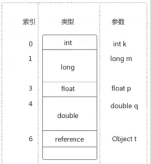

举例：
```java
public void foo(long l, float f) {
    {
        int i = e;
    }
    {
        String s = "Hello, World";
    }
}
```
对应的图示：

this表示当前类的引用，l和f的类型的值占两个槽位，i和s变量由于分别在各自代码块中，没有共同的生命周期，所以占同一个槽位（即槽位复用）
在栈帧中，与性能调优关系最为密切的部分就是局部变量表。局部变量表中的变量也是重要的垃圾回收根节点，只要被局部变量表中直接或间接引用的对象都不会被回收。

### 2.2.4. 局部变量压栈指令
> iload 从局部变量中装载int类型值
> lload 从局部变量中装载long类型值
> fload 从局部变量中装载float类型值
> dload 从局部变量中装载double类型值
> aload 从局部变量中装载引用类型值（refernce）
> iload_0 从局部变量0中装载int类型值
> iload_1 从局部变量1中装载int类型值
> iload_2 从局部变量2中装载int类型值
> iload_3 从局部变量3中装载int类型值
> lload_0 从局部变量0中装载long类型值
> lload_1 从局部变量1中装载long类型值
> lload_2 从局部变量2中装载long类型值
> lload_3 从局部变量3中装载long类型值
> fload_0 从局部变量0中装载float类型值
> fload_1 从局部变量1中装载float类型值
> fload_2 从局部变量2中装载float类型值
> fload_3 从局部变量3中装载float类型值
> dload_0 从局部变量0中装载double类型值
> dload_1 从局部变量1中装载double类型值
> dload_2 从局部变量2中装载double类型值
> dload_3 从局部变量3中装载double类型值
> aload_0 从局部变量0中装载引用类型值
> aload_1 从局部变量1中装载引用类型值
> aload_2 从局部变量2中装载引用类型值
> aload_3 从局部变量3中装载引用类型值
> iaload 从数组中装载int类型值
> laload 从数组中装载long类型值
> faload 从数组中装载float类型值
> daload 从数组中装载double类型值
> aaload 从数组中装载引用类型值
> baload 从数组中装载byte类型或boolean类型值
> caload 从数组中装载char类型值
> saload 从数组中装载short类型值

**局部变量压栈常用指令集**

| xload_n     | xload_0 | xload_1 | xload_2 | xload_3 |
| ----------- | ------- | ------- | ------- | ------- |
| **iload_n** | iload_0 | iload_1 | iload_2 | iload_3 |
| **lload_n** | lload_0 | lload_1 | lload_2 | lload_3 |
| **fload_n** | fload_0 | fload_1 | fload_2 | fload_3 |
| **dload_n** | dload_0 | dload_1 | dload_2 | dload_3 |
| **aload_n** | aload_0 | aload_1 | aload_2 | aload_3 |


**局部变量压栈指令剖析**
局部变量压栈指令将给定的局部变量表中的数据压入操作数栈。
这类指令大体可以分为：

- `xload_<n>`（x为i、l、f、d、a，n为0到3）
- `xload`（x为i、l、f、d、a）

说明：在这里，x的取值表示数据类型。
指令xload_n表示将第n个局部变量压入操作数栈，比如iload_1、fload_0、aload_0等指令。其中aload_n表示将一个对象引用压栈。
指令xload通过指定参数的形式，把局部变量压入操作数栈，当使用这个命令时，表示局部变量的数量可能超过了4个，比如指令iload、fload等。
举例：
```java
public void load(int num, Object obj, long count, boolean flag, short[] arr) {
    System.out.println(num);
    System.out.println(obj);
    System.out.println(count);
    System.out.println(flag);
    System.out.println(arr);
}
```

字节码执行过程：
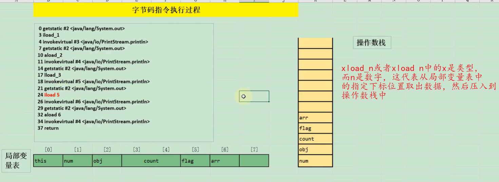

### 2.2.2. 常量入栈指令
> aconst_null 将null对象引用压入栈
> iconst_m1 将int类型常量-1压入栈
> iconst_0 将int类型常量0压入栈
> iconst_1 将int类型常量1压入栈
> iconst_2 将int类型常量2压入栈
> iconst_3 将int类型常量3压入栈
> iconst_4 将int类型常量4压入栈
> iconst_5 将int类型常量5压入栈
> lconst_0 将long类型常量0压入栈
> lconst_1 将long类型常量1压入栈
> fconst_0 将float类型常量0压入栈
> fconst_1 将float类型常量1压入栈
> dconst_0 将double类型常量0压入栈
> dconst_1 将double类型常量1压入栈
> bipush 将一个8位带符号整数压入栈
> sipush 将16位带符号整数压入栈
> ldc 把常量池中的项压入栈
> ldc_w 把常量池中的项压入栈（使用宽索引）
> ldc2_w 把常量池中long类型或者double类型的项压入栈（使用宽索引）


**常量入栈常用指令集**

| xconst_n     | 范围                                | xconst_null | xconst_m1 | xconst_0 | xconst_1 | xconst_2 | xconst_3 | xconst_4 | xconst_5 |
| ------------ | ----------------------------------- | ----------- | --------- | -------- | -------- | -------- | -------- | -------- | -------- |
| **iconst_n** | [-1, 5]                             |             | iconst_m1 | iconst_0 | iconst_1 | iconst_2 | iconst_3 | iconst_4 | iconst_5 |
| **lconst_n** | 0, 1                                |             |           | lconst_0 | lconst_1 |          |          |          |          |
| **fconst_n** | 0, 1, 2                             |             |           | fconst_0 | fconst_1 | fconst_2 |          |          |          |
| **dconst_n** | 0, 1                                |             |           | dconst_0 | dconst_1 |          |          |          |          |
| **aconst_n** | null, String literal, Class literal | aconst_null |           |          |          |          |          |          |          |
| **bipush**   | 一个字节，即[-128, 127]             |             |           |          |          |          |          |          |          |
| **sipush**   | 两个字节，即[-32768, 32767]         |             |           |          |          |          |          |          |          |
| **ldc**      | 四个字节                            |             |           |          |          |          |          |          |          |
| **ldc_w**    | 宽索引                              |             |           |          |          |          |          |          |          |
| **ldc2_w**   | 宽索引，long或double                |             |           |          |          |          |          |          |          |


**常量入栈指令剖析**
常量入栈指令的功能是将常数压入操作数栈，根据数据类型和入栈内容的不同，又可以分为const系列、push系列和ldc指令。
指令const系列：用于对特定的常量入栈，入栈的常量隐含在指令本身里。指令有：
`iconst_<i>（i从-1到5）、lconst_<l>（1从0到1）、fconst_<f>（f从0到2）、dconst_<d>（d从0到1）、aconst_null`。
比如

- iconst_m1将-1压入操作数栈；
- iconst_x（x为0到5）将x压入栈；
- lconst_0、lconst_1分别将长整数0和1压入栈；
- fconst_0、fconst_1、fconst_2分别将浮点数0、1、2压入栈；
- dconst_0和dconst_1分别将double型0和1压入栈；
- aconst_null将null压入操作数栈；

从指令的命名上不难找出规律，指令助记符的第一个字符总是喜欢表示数据类型，i表示整数，l表示长整数，f表示浮点数，d表示双精度浮点，习惯上用a表示对象引用。如果指令隐含操作的参数，会以下划线形式给出。
指令push系列：主要包括bipush和sipush。它们的区别在于接收数据类型的不同，bipush接收8位整数作为参数，sipush接收16位整数，它们都将参数压入栈。
指令ldc系列：如果以上指令都不能满足需求，那么可以使用万能的

- ldc指令，它可以接收一个8位的参数，该参数指向常量池中的int、float或者String的索引，将指定的内容压入堆栈。
- 类似的还有ldc_w，它接收两个8位参数，能支持的索引范围大于ldc。
- 如果要压入的元素是long或者double类型的，则使用ldc2_w指令，使用方式都是类似的

总结如下：

| 类型                         | 常数指令 | 范围                          |
| ---------------------------- | -------- | ----------------------------- |
| int(boolean,byte,char,short) | iconst   | [-1, 5]                       |
|                              | bipush   | [-128, 127]                   |
|                              | sipush   | [-32768, 32767]               |
|                              | ldc      | any int value                 |
| long                         | lconst   | 0, 1                          |
|                              | ldc      | any long value                |
| float                        | fconst   | 0, 1, 2                       |
|                              | ldc      | any float value               |
| double                       | dconst   | 0, 1                          |
|                              | ldc      | any double value              |
| reference                    | aconst   | null                          |
|                              | ldc      | String literal, Class literal |


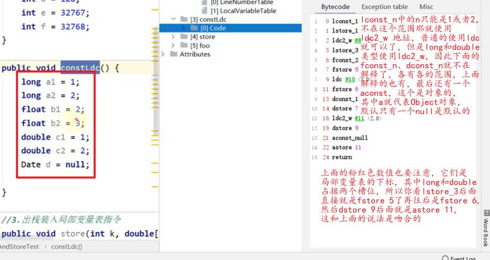
### 2.2.3. 出栈装入局部变量表指令
> istore 将int类型值存入局部变量
> lstore 将long类型值存入局部变量
> fstore 将float类型值存入局部变量
> dstore 将double类型值存入局部变量
> astore 将将引用类型或returnAddress类型值存入局部变量
> istore_0 将int类型值存入局部变量0
> istore_1 将int类型值存入局部变量1
> istore_2 将int类型值存入局部变量2
> istore_3 将int类型值存入局部变量3
> lstore_0 将long类型值存入局部变量0
> lstore_1 将long类型值存入局部变量1
> lstore_2 将long类型值存入局部变量2
> lstore_3 将long类型值存入局部变量3
> fstore_0 将float类型值存入局部变量0
> fstore_1 将float类型值存入局部变量1
> fstore_2 将float类型值存入局部变量2
> fstore_3 将float类型值存入局部变量3
> dstore_0 将double类型值存入局部变量0
> dstore_1 将double类型值存入局部变量1
> dstore_2 将double类型值存入局部变量2
> dstore_3 将double类型值存入局部变量3
> astore_0 将引用类型或returnAddress类型值存入局部变量0
> astore_1 将引用类型或returnAddress类型值存入局部变量1
> astore_2 将引用类型或returnAddress类型值存入局部变量2
> astore_3 将引用类型或returnAddress类型值存入局部变量3
> iastore 将int类型值存入数组中
> lastore 将long类型值存入数组中
> fastore 将float类型值存入数组中
> dastore 将double类型值存入数组中
> aastore 将引用类型值存入数组中
> bastore 将byte类型或者boolean类型值存入数组中
> castore 将char类型值存入数组中
> sastore 将short类型值存入数组中
> wide指令
> wide 使用附加字节扩展局部变量索引


**出栈装入局部变量表常用指令集**

| xstore_n     | xstore_0 | xstore_1 | xstore_2 | xstore_3 |
| ------------ | -------- | -------- | -------- | -------- |
| **istore_n** | istore_0 | istore_1 | istore_2 | istore_3 |
| **lstore_n** | lstore_0 | lstore_1 | lstore_2 | lstore_3 |
| **fstore_n** | fstore_0 | fstore_1 | fstore_2 | fstore_3 |
| **dstore_n** | dstore_0 | dstore_1 | dstore_2 | dstore_3 |
| **astore_n** | astore_0 | astore_1 | astore_2 | astore_3 |


**出栈装入局部变量表指令剖析**
出栈装入局部变量表指令用于将操作数栈中栈顶元素弹出后，装入局部变量表的指定位置，用于给局部变量赋值。
这类指令主要以store的形式存在，比如`xstore（x为i、l、f、d、a）、xstore_n（x为i、l、f、d、a，n为0至3）`。

- 其中，指令istore_n将从操作数栈中弹出一个整数，并把它值给局部变量索引n位置。
- 指令xstore由于没有隐含参数信息，故需要提供一个byte类型的参数类指定目标局部变量表的位置。

说明：一般说来，类似像store这样的命令需要带一个参数，用来指明将弹出的元素放在局部变量表的第几个位置。但是，为了尽可能压缩指令大小，使用专门的istore_1指令表示将弹出的元素放置在局部变量表第1个位置。类似的还有istore_0、istore_2、istore_3，它们分别表示从操作数栈顶弹出一个元素，存放在局部变量表第0、2、3个位置。由于局部变量表前几个位置总是非常常用，因此这种做法虽然增加了指令数量，但是可以大大压缩生成的字节码的体积。如果局部变量表很大，需要存储的槽位大于3，那么可以使用istore指令，外加一个参数，用来表示需要存放的槽位位置。
举例：


## 2.3. 算术指令
### 2.3.1. 作用
算术指令用于对两个操作数栈上的值进行某种特定运算，并把结果重新压入操作数栈。
### 2.3.2. 分类
大体上算术指令可以分为两种：对整型数据进行运算的指令与对浮点类型数据进行运算的指令。
### 2.3.3. byte、short、char和boolean类型说明
在每一大类中，都有针对Java虚拟机具体数据类型的专用算术指令。但没有直接支持byte、short、char和boolean类型的算术指令，对于这些数据的运算，都使用int类型的指令来处理。此外，在处理boolean、byte、short和char类型的数组时，也会转换为使用对应的int类型的字节码指令来处理。
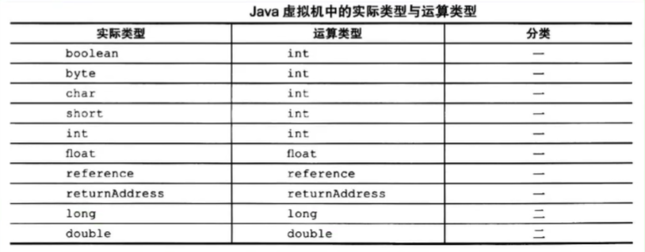

### 2.3.4. 运算时的溢出
数据运算可能会导致溢出，例如两个很大的正整数相加，结果可能是一个负数。其实Java虚拟机规范并无明确规定过整型数据溢出的具体结果，仅规定了在处理整型数据时，只有除法指令以及求余指令中当出现除数为0时会导致虚拟机抛出异常ArithmeticException。
### 2.3.5. 运算模式
**向最接近数舍入模式**：JVM要求在进行浮点数计算时，所有的运算结果都必须舍入到适当的精度，非精确结果必须舍入为可被表示的最接近的精确值，如果有两种可表示的形式与该值一样接近，将优先选择最低有效位为零的；
**向零舍入模式**：将浮点数转换为整数时，采用该模式，该模式将在目标数值类型中选择一个最接近但是不大于原值的数字作为最精确的舍入结果；
### 2.3.6. NaN值使用
当一个操作产生溢出时，将会使用有符号的无穷大表示，如果某个操作结果没有明确的数学定义的话，将会使用NaN值来表示。而且所有使用NaN值作为操作数的算术操作，结果都会返回NaN；
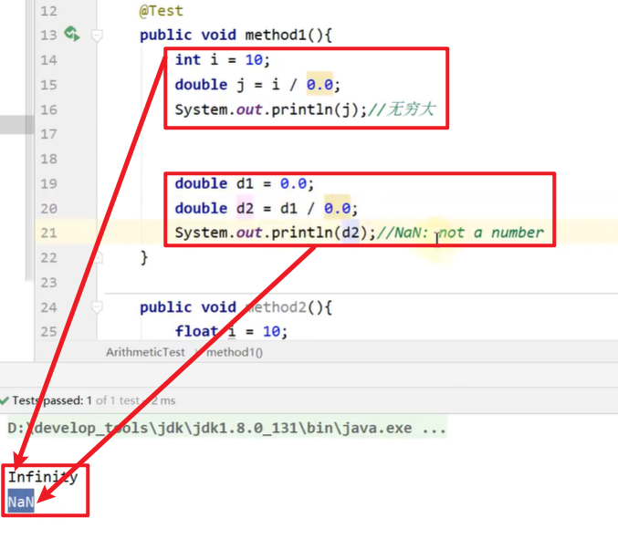

### 2.3.7. 所有算术指令
> **整数运算**
> iadd 执行int类型的加法
> ladd 执行long类型的加法
> isub 执行int类型的减法
> lsub 执行long类型的减法
> imul 执行int类型的乘法
> lmul 执行long类型的乘法
> idiv 执行int类型的除法
> ldiv 执行long类型的除法
> irem 计算int类型除法的余数
> lrem 计算long类型除法的余数
> ineg 对一个int类型值进行取反操作
> lneg 对一个long类型值进行取反操作
> iinc 把一个常量值加到一个int类型的局部变量上
>
> **逻辑运算**
>

> **移位操作**
> ishl 执行int类型的向左移位操作
> lshl 执行long类型的向左移位操作
> ishr 执行int类型的向右移位操作
> lshr 执行long类型的向右移位操作
> iushr 执行int类型的向右逻辑移位操作
> lushr 执行long类型的向右逻辑移位操作
>
> **按位布尔运算**
> iand 对int类型值进行“逻辑与”操作
> land 对long类型值进行“逻辑与”操作
> ior 对int类型值进行“逻辑或”操作
> lor 对long类型值进行“逻辑或”操作
> ixor 对int类型值进行“逻辑异或”操作
> lxor 对long类型值进行“逻辑异或”操作
>
> **浮点运算**
> fadd 执行float类型的加法
> dadd 执行double类型的加法
> fsub 执行float类型的减法
> dsub 执行double类型的减法
> fmul 执行float类型的乘法
> dmul 执行double类型的乘法
> fdiv 执行float类型的除法
> ddiv 执行double类型的除法
> frem 计算float类型除法的余数
> drem 计算double类型除法的余数
> fneg 将一个float类型的数值取反
> dneg 将一个double类型的数值取反


**算术指令集**

| 算数指令   |              | int(boolean,byte,char,short) | long | float         | double        |
| ---------- | ------------ | ---------------------------- | ---- | ------------- | ------------- |
| 加法指令   |              | iadd                         | ladd | fadd          | dadd          |
| 减法指令   |              | isub                         | lsub | fsub          | dsub          |
| 乘法指令   |              | imul                         | lmul | fmul          | dmul          |
| 除法指令   |              | idiv                         | ldiv | fdiv          | ddiv          |
| 求余指令   |              | irem                         | lrem | frem          | drem          |
| 取反指令   |              | ineg                         | lneg | fneg          | dneg          |
| 自增指令   |              | iinc                         |      |               |               |
| 位运算指令 | 按位或指令   | ior                          | lor  |               |               |
|            | 按位或指令   | ior                          | lor  |               |               |
|            | 按位与指令   | iand                         | land |               |               |
|            | 按位异或指令 | ixor                         | lxor |               |               |
| 比较指令   |              |                              | lcmp | fcmpg / fcmpl | dcmpg / dcmpl |

举例1
```java
public static int bar(int i) {
	return ((i + 1) - 2) * 3 / 4;
}
```

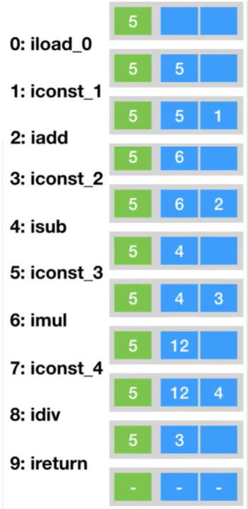

举例2
```java
public void add() {
	byte i = 15;
	int j = 8;
	int k = i + j;
}
```

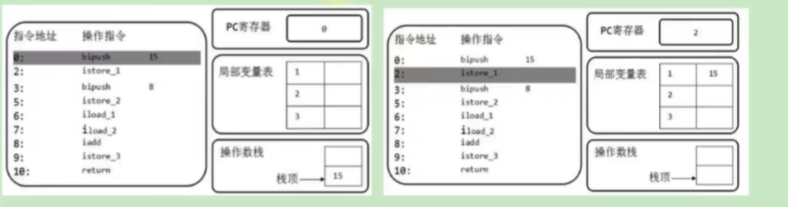
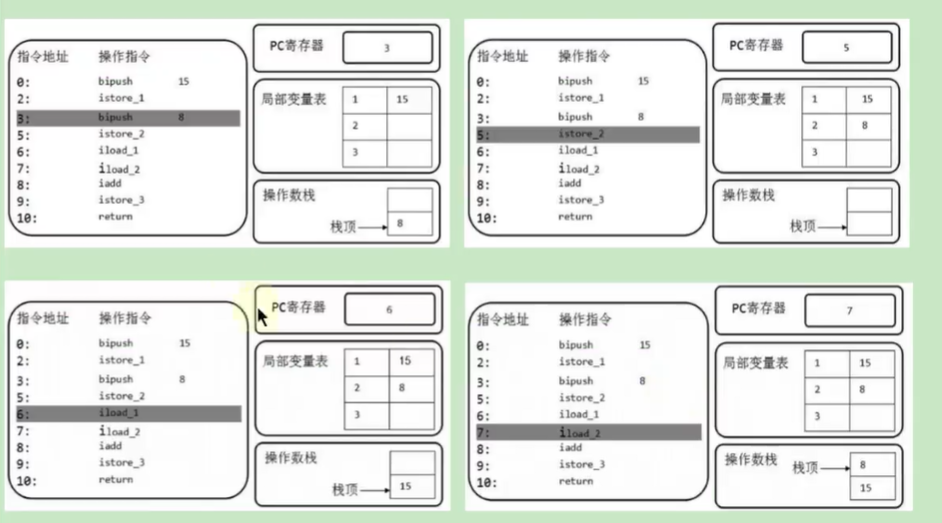
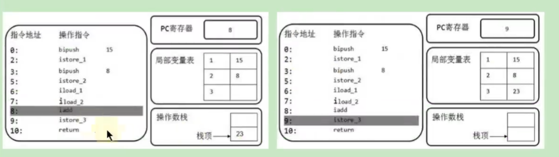


举例3
```java
public static void main(String[] args) {
	int x = 500;
	int y = 100;
	int a = x / y;
	int b = 50;
	System.out.println(a + b);
}
```

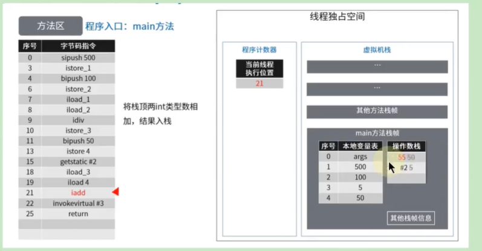
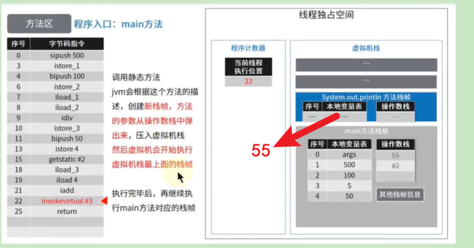
## 2.4. 类型转换指令
类型转换指令可以将两种不同的数值类型进行相互转换。
这些转换操作一般用于实现用户代码中的显式类型转换操作，或者用来处理字节码指令集中数据类型相关指令无法与数据类型一一对应的问题。
> **宽化类型转换**
> i2l 把int类型的数据转化为long类型
> i2f 把int类型的数据转化为float类型
> i2d 把int类型的数据转化为double类型
> l2f 把long类型的数据转化为float类型
> l2d 把long类型的数据转化为double类型
> f2d 把float类型的数据转化为double类型
>
> **窄化类型转换**
> i2b 把int类型的数据转化为byte类型
> i2c 把int类型的数据转化为char类型
> i2s 把int类型的数据转化为short类型
> l2i 把long类型的数据转化为int类型
> f2i 把float类型的数据转化为int类型
> f2l 把float类型的数据转化为long类型
> d2i 把double类型的数据转化为int类型
> d2l 把double类型的数据转化为long类型
> d2f 把double类型的数据转化为float类型


**类型转换指令集**

|            | **byte** | **char** | **short** | **int** | **long** | **float** | **double** |
| ---------- | -------- | -------- | --------- | ------- | -------- | --------- | ---------- |
| **int**    | i2b      | i2c      | i2s       | ○       | i2l      | i2f       | i2d        |
| **long**   | l2i i2b  | l2i i2c  | l2i i2s   | l2i     | ○        | l2f       | l2d        |
| **float**  | f2i i2b  | f2i i2c  | f2i i2s   | f2i     | f2l      | ○         | f2d        |
| **double** | d2i i2b  | d2i i2c  | d2i i2s   | d2i     | d2l      | d2f       | ○          |

### 2.4.1. 宽化类型转换指令
**宽化类型转换( Widening Numeric Conversions)**

1. 转换规则

Java虚拟机直接支持以下数值的宽化类型转换（ widening numeric conversion,小范围类型向大范围类型的安全转换）。也就是说，并不需要指令执行，包括

-  从int类型到long、float或者 double类型。对应的指令为：i21、i2f、i2d 
-  从long类型到float、 double类型。对应的指令为：i2f、i2d 
-  从float类型到double类型。对应的指令为：f2d 

简化为：int-->long-->float-> double

2. 精度损失问题
-  宽化类型转换是不会因为超过目标类型最大值而丢失信息的，例如，从int转换到long,或者从int转换到double,都不会丢失任何信息，转换前后的值是精确相等的。 
-  从int、long类型数值转换到float，或者long类型数值转换到double时，将可能发生精度丢失一一可能丢失掉几个最低有效位上的值，转换后的浮点数值是根据IEEE754最接近含入模式所得到的正确整数值。 

尽管宽化类型转换实际上是可能发生精度丢失的，但是这种转换永远不会导致Java虚拟机抛出运行时异常

3. 补充说明

从byte、char和 short类型到int类型的宽化类型转换实际上是不存在的。对于byte类型转为int,拟机并没有做实质性的转化处理，只是简单地通过操作数栈交換了两个数据。而将byte转为long时，使用的是i2l,可以看到在内部，byte在这里已经等同于int类型处理，类似的还有 short类型，这种处理方式有两个特点：
一方面可以减少实际的数据类型，如果为 short和byte都准备一套指令，那么指令的数量就会大増，而虚拟机目前的设计上，只愿意使用一个字节表示指令，因此指令总数不能超过256个，为了节省指令资源，将 short和byte当做int处理也在情理之中。
另一方面，由于局部变量表中的槽位固定为32位，无论是byte或者 short存入局部变量表，都会占用32位空间。从这个角度说，也没有必要特意区分这几种数据类型。

### 2.4.2. 窄化类型转换指令
**窄化类型转换( Narrowing Numeric Conversion)**

1. 转换规则

Java虚拟机也直接支持以下窄化类型转换：

-  从主int类型至byte、 short或者char类型。对应的指令有：i2b、i2c、i2s 
-  从long类型到int类型。对应的指令有：l2i 
-  从float类型到int或者long类型。对应的指令有：f2i、f2l 
-  从double类型到int、long或者float类型。对应的指令有：d2i、d2l、d2f 
2. 精度损失问题

窄化类型转换可能会导致转换结果具备不同的正负号、不同的数量级，因此，转换过程很可能会导致数值丢失精度。
尽管数据类型窄化转换可能会发生上限溢出、下限溢出和精度丢失等情况，但是Java虚拟机规范中明确规定数值类型的窄化转换指令永远不可能导致虚拟机抛出运行时异常

3. 补充说明

当将一个浮点值窄化转换为整数类型T(T限于int或long类型之一)的时候，将遵循以下转换规则：

-  如果浮点值是NaN,那转换结果就是int或long类型的0. 
-  如果浮点值不是无穷大的话，浮点值使用IEEE754的向零含入模式取整，获得整数值v。如果v在目标类型T(int或long)的表示范围之内，那转换结果就是v。否则，将根据v的符号，转换为T所能表示的最大或者最小正数 

当将一个double类型窄化转换为float类型时，将遵循以下转换规则，通过向最接近数舍入模式舍入一个可以使用float类型表示的数字。最后结果根据下面这3条规则判断：

-  如果转换结果的绝对值太小而无法使用float来表示，将返回float类型的正负零 
-  如果转换结果的绝对值太大而无法使用float来表示，将返回float类型的正负无穷大。 
-  对于double类型的NaN值将按规定转换为float类型的NaN值。 

## 2.5. 对象的创建与访问指令
Java是面向对象的程序设计语言，虚拟机平台从字节码层面就对面向对象做了深层次的支持。有一系列指令专门用于对象操作，可进一步细分为创建指令、字段访问指令、数组操作指令、类型检查指令。
> **对象操作指令**
> new 创建一个新对象
> getfield 从对象中获取字段
> putfield 设置对象中字段的值
> getstatic 从类中获取静态字段
> putstatic 设置类中静态字段的值
> checkcast 确定对象为所给定的类型。后跟目标类，判断栈顶元素是否为目标类 / 接口的实例。如果不是便抛出异常
> instanceof 判断对象是否为给定的类型。后跟目标类，判断栈顶元素是否为目标类 / 接口的实例。是则压入 1，否则压入 0
> **数组操作指令**
> newarray 分配数据成员类型为基本上数据类型的新数组
> anewarray 分配数据成员类型为引用类型的新数组
> arraylength 获取数组长度
> multianewarray 分配新的多维数组


### 2.5.1. 创建指令
| 创建指令       | 含义             |
| -------------- | ---------------- |
| new            | 创建类实例       |
| newarray       | 创建基本类型数组 |
| anewarray      | 创建引用类型数组 |
| multilanewarra | 创建多维数组     |


虽然类实例和数组都是对象，但Java虚拟机对类实例和数组的创建与操作使用了不同的字节码指令：

1. 创建类实例的指令： 
   - 创建类实例的指令：new
   - 它接收一个操作数，为指向常量池的索引，表示要创建的类型，执行完成后，将对象的引用压入栈。
2. 创建数组的指令： 
   - 创建数组的指令：newarray、anewarray、multianewarray
   - 上述创建指令可以用于创建对象或者数组，由于对象和数组在Java中的广泛使用，这些指令的使用频率也非常高。


### 2.5.2. 字段访问指令
| 字段访问指令         | 含义                                                   |
| -------------------- | ------------------------------------------------------ |
| getstatic、putstatic | 访问类字段（static字段，或者称为类变量）的指令         |
| getfield、 putfield  | 访问类实例字段（非static字段，或者称为实例变量）的指令 |

对象创建后，就可以通过对象访问指令获取对象实例或数组实例中的字段或者数组元素。

- 访问类字段（static字段，或者称为类变量）的指令：getstatic、putstatic
- 访问类实例字段（非static字段，或者称为实例变量）的指令：getfield、putfield

举例：以getstatic指令为例，它含有一个操作数，为指向常量池的Fieldref索引，它的作用就是获取Fieldref指定的对象或者值，并将其压入操作数栈。
```java
public void sayHello() {
    System.out.println("hel1o"); 
}
```

对应的字节码指令：
```shell
0 getstatic #8 <java/lang/System.out>
3 ldc #9 <hello>
5 invokevirtual #10 <java/io/PrintStream.println>
8 return
```

图示：
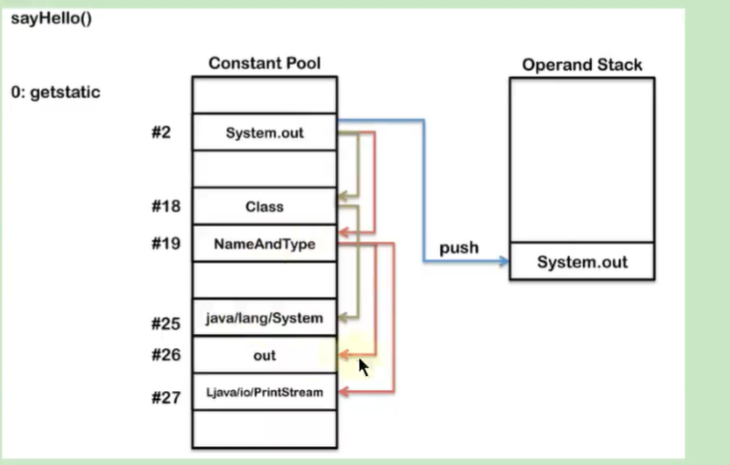

### 2.5.3. 数组操作指令
数组操作指令主要有：xastore和xaload指令。具体为：

- 把一个数组元素加载到操作数栈的指令：baload、caload、saload、iaload、laload、faload、daload、aaload
- 将一个操作数栈的值存储到数组元素中的指令：bastore、castore、sastore、iastore、lastore、fastore、dastore、aastore

| 数组指令    | byte(boolean) | char    | short   | long    | long    | float   | double  | reference |
| ----------- | ------------- | ------- | ------- | ------- | ------- | ------- | ------- | --------- |
| **xaload**  | baload        | caload  | saload  | iaload  | laload  | faload  | daload  | aaload    |
| **xastore** | bastore       | castore | sastore | iastore | lastore | fastore | dastore | aastore   |


取数组长度的指令：arraylength。该指令弹出栈顶的数组元素，获取数组的长度，将长度压入栈。
指令xaload表示将数组的元素压栈，比如saload、caload分别表示压入short数组和char数组。指令xaload在执行时，要求操作数中栈顶元素为数组索引i，栈顶顺位第2个元素为数组引用a，该指令会弹出栈顶这两个元素，并将a[i]重新压入栈。
xastore则专门针对数组操作，以iastore为例，它用于给一个int数组的给定索引赋值。在iastore执行前，操作数栈顶需要以此准备3个元素：值、索引、数组引用，iastore会弹出这3个值，并将值赋给数组中指定索引的位置。

### 2.5.4. 类型检查指令
检查类实例或数组类型的指令：instanceof、checkcast。

- 指令instanceof用来判断给定对象是否是某一个类的实例，它会将判断结果压入操作数栈
- 指令checkcast用于检查类型强制转换是否可以进行。如果可以进行，那么checkcast指令不会改变操作数栈，否则它会抛出ClassCastException异常

| 类型检查指令 | 含义                             |
| ------------ | -------------------------------- |
| instanceof   | 判断给定对象是否是某一个类的实例 |
| checkcast    | 检查类型强制转换是否可以进行     |


## 2.6. 方法调用与返回指令
> **方法调用指令**
> invokcvirtual 运行时按照对象的类来调用实例方法
> invokespecial 根据编译时类型来调用实例方法
> invokestatic 调用类（静态）方法
> invokcinterface 调用接口方法
>
> **方法返回指令**
> ireturn 从方法中返回int类型的数据
> lreturn 从方法中返回long类型的数据
> freturn 从方法中返回float类型的数据
> dreturn 从方法中返回double类型的数据
> areturn 从方法中返回引用类型的数据
> return 从方法中返回，返回值为void


### 2.6.1. 方法调用指令
方法调用指令：invokevirtual、invokeinterface、invokespecial、invokestatic、invokedynamic，以下5条指令用于方法调用：

- invokevirtual指令用于调用对象的实例方法，根据对象的实际类型进行分派（虚方法分派），支持多态。这也是Java语言中最常见的方法分派方式。
- invokeinterface指令用于调用接口方法，它会在运行时搜索由特定对象所实现的这个接口方法，并找出适合的方法进行调用。
- invokespecial指令用于调用一些需要特殊处理的实例方法，包括实例初始化方法（构造器）、私有方法和父类方法。这些方法都是静态类型绑定的，不会在调用时进行动态派发。
- invokestatic指令用于调用命名类中的类方法（static方法）。这是静态绑定的。
- invokedynamic指令用于调用动态绑定的方法，这个是JDK1.7后新加入的指令。用于在运行时动态解析出调用点限定符所引用的方法，并执行该方法。
- invokedynamic指令的分派逻辑是由用户所设定的引导方法决定的，而前面4条调用指令的分派逻辑都固化在java虚拟机内部。

| 方法调用指令    | 含义                                                         |
| --------------- | ------------------------------------------------------------ |
| invokevirtual   | 调用对象的实例方法                                           |
| invokeinterface | 调用接口方法                                                 |
| invokespecial   | 调用一些需要特殊处理的实例方法，包括实例初始化方法（构造器）、私有方法和父类方法 |
| invokestatic    | 调用命名类中的类方法（static方法）                           |
| invokedynamic   | 调用动态绑定的方法                                           |


### 2.6.2. 方法返回指令
方法调用结束前，需要进行返回。方法返回指令是根据返回值的类型区分的。

- 包括ireturn（当返回值是boolean、byte、char、short和int 类型时使用）、lreturn、freturn、dreturn和areturn
- 另外还有一条return 指令供声明为void的方法、实例初始化方法以及类和接口的类初始化方法使用。

| 方法返回指令 | void   | int     | long    | float   | double  | reference |
| ------------ | ------ | ------- | ------- | ------- | ------- | --------- |
| **xreturn**  | return | ireturn | lreturn | freutrn | dreturn | areturn   |


通过ireturn指令，将当前函数操作数栈的顶层元素弹出，并将这个元素压入调用者函数的操作数栈中（因为调用者非常关心函数的返回值），所有在当前函数操作数栈中的其他元素都会被丢弃。
如果当前返回的是synchronized方法，那么还会执行一个隐含的monitorexit指令，退出临界区。
最后，会丢弃当前方法的整个帧，恢复调用者的帧，并将控制权转交给调用者。

举例：
```java
public int methodReturn() {
    int i = 500;
    int j = 200;
    int k = 50;
    
    return (i + j) / k;
}
```

图示：

## 2.7. 操作数栈管理指令
如同操作一个普通数据结构中的堆栈那样，JVM提供的操作数栈管理指令，可以用于直接操作操作数栈的指令。
这类指令包括如下内容：

- 将一个或两个元素从栈顶弹出，并且直接废弃：`pop，pop2`
- 复制栈顶一个或两个数值并将复制值或双份的复制值重新压入栈顶：`dup，dup2，dup_x1，dup2_×1，dup_×2，dup2_×2`
- 将栈最顶端的两个Slot数值位置交换：`swap`。Java虚拟机没有提供交换两个64位数据类型（long、double）数值的指令。
- 指令`nop`，是一个非常特殊的指令，它的字节码为0x00。和汇编语言中的nop一样，它表示什么都不做。这条指令一般可用于调试、占位等。

这些指令属于通用型，对栈的压入或者弹出无需指明数据类型。

- 不带_x的指令是复制栈顶数据并压入栈顶。包括两个指令，`dup，dup2`。dup的系数代表要复制的Slot个数。dup开头的指令用于复制1个Slot的数据。例如1个int或1个reference类型数据dup2开头的指令用于复制2个Slot的数据。例如1个long，或2个int，或1个int+1个float类型数据
- 带_x的指令是复制栈顶数据并插入栈顶以下的某个位置。共有4个指令，`dup_×1，dup2_×1，dup_×2，dup2×2`。对于带_x的复制插入指令，只要将指令的dup和x的系数相加，结果即为需要插入的位置。因此dup_×1插入位置：1+1=2，即栈顶2个slot下面dup_×2插入位置：1+2=3，即栈顶3个slot下面；dup2×1插入位置：2+1=3，即栈顶3个Slot下面
- pop：将栈顶的1个Slot数值出栈。例如1个short类型数值
- pop2：将栈顶的2个slot数值出栈。例如1个double类型数值，或者2个int类型数值

> **通用(无类型）栈操作**
> nop 不做任何操作
> pop 弹出栈顶端一个字长的内容
> pop2 弹出栈顶端两个字长的内容
> dup 复制栈顶部一个字长内容
> dup_x1 复制栈顶部一个字长的内容，然后将复制内容及原来弹出的两个字长的内容压入栈
> dup_x2 复制栈顶部一个字长的内容，然后将复制内容及原来弹出的三个字长的内容压入栈
> dup2 复制栈顶部两个字长内容
> dup2_x1 复制栈顶部两个字长的内容，然后将复制内容及原来弹出的三个字长的内容压入栈
> dup2_x2 复制栈顶部两个字长的内容，然后将复制内容及原来弹出的四个字长的内容压入栈
> swap 交换栈顶部两个字长内容


## 2.8. 控制转移指令
程序流程离不开条件控制，为了支持条件跳转，虚拟机提供了大量字节码指令，大体上可以分为

- 1）比较指令、
- 2）条件跳转指令、
- 3）比较条件跳转指令、
- 4）多条件分支跳转指令、
- 5）无条件跳转指令等。

> **比较指令**
> lcmp 比较long类型值
> fcmpl 比较float类型值（当遇到NaN时，返回-1）
> fcmpg 比较float类型值（当遇到NaN时，返回1）
> dcmpl 比较double类型值（当遇到NaN时，返回-1）
> dcmpg 比较double类型值（当遇到NaN时，返回1）
>
> **条件跳转指令**
> ifeq 如果等于0，则跳转
> ifne 如果不等于0，则跳转
> iflt 如果小于0，则跳转
> ifge 如果大于等于0，则跳转
> ifgt 如果大于0，则跳转
> ifle 如果小于等于0，则跳转
> **比较条件分支指令**
> if_icmpeq 如果两个int值相等，则跳转
> if_icmpne 如果两个int类型值不相等，则跳转
> if_icmplt 如果一个int类型值小于另外一个int类型值，则跳转
> if_icmpge 如果一个int类型值大于或者等于另外一个int类型值，则跳转
> if_icmpgt 如果一个int类型值大于另外一个int类型值，则跳转
> if_icmple 如果一个int类型值小于或者等于另外一个int类型值，则跳转
> ifnull 如果等于null，则跳转
> ifnonnull 如果不等于null，则跳转
> if_acmpeq 如果两个对象引用相等，则跳转
> if_acmpne 如果两个对象引用不相等，则跳转
> **多条件分支跳转指令**
> tableswitch 通过索引访问跳转表，并跳转
> lookupswitch 通过键值匹配访问跳转表，并执行跳转操作
> **无条件跳转指令**
> goto 无条件跳转
> goto_w 无条件跳转（宽索引）


### 2.8.1. 比较指
比较指令的作用是比较占栈顶两个元素的大小，并将比较结果入栈。比较指令有： dcmpg,dcmpl、 fcmpg、fcmpl、lcmp。与前面讲解的指令类似，首字符d表示double类型，f表示float,l表示long
对于double和float类型的数字，由于NaN的存在，各有两个版本的比较指令。以float为例，有fcmpg和fcmpl两个指令，它们的区别在于在数字比较时，若遇到NaN值，处理结果不同。
指令dcmpl和 dcmpg也是类似的，根据其命名可以推测其含义，在此不再赘述。
数值类型的数据，才可以谈大小！boolean、引用数据类型不能比较大小。
**举例**
指令 fcmp和fcmpl都从中弹出两个操作数，并将它们做比较，设栈顶的元素为v2，顶顺位第2位的元素为v1：若v1=v2，则压入0；若v1>v2，则压入1；若v1<v2，则压入-1。
两个指令的不同之处在于，如果遇到NaN值， fcmpg会压入1,而fcmpl会压入-1

### 2.8.2. 条件跳转指令
条件跳转指令通常和比较指令结合使用。在条件跳转指令执行前，一般可以先用比较指令进行栈顶元素的准备，然后进行条件跳转。
条件跳转指令有：ifeq，iflt，ifle，ifne，ifgt，ifge，ifnull，ifnonnull。这些指令都接收两个字节的操作数，用于计算跳转的位置（16位符号整数作为当前位置的offset）。
它们的统一含义为：弹出栈顶元素，测试它是否满足某一条件，如果满足条件，则跳转到给定位置。

| <    | <=   | ==   | !=   | >=   | >    | null   | not null  |
| ---- | ---- | ---- | ---- | ---- | ---- | ------ | --------- |
| iflt | ifle | ifeq | ifng | ifge | ifgt | ifnull | ifnonnull |


与前面运算规则一致：

- 对于boolean、byte、char、short类型的条件分支比较操作，都是使用int类型的比较指令完成
- 对于long、float、double类型的条件分支比较操作，则会先执行相应类型的比较运算指令，运算指令会返回一个整型值到操作数栈中，随后再执行int类型的条件分支比较操作来完成整个分支跳转

由于各类型的比较最终都会转为int类型的比较操作，所以Java虚拟机提供的int类型的条件分支指令是最为丰富和强大的。
### 2.8.3. 比较条件跳转指令
比较条件跳转指令类似于比较指令和条件跳转指令的结合体，它将比较和跳转两个步骤合二为一。
这类指令有：if_icmpeq、if_icmpne、if_icmplt、if_icmpgt、if_icmple、if_icmpge、if_acmpeq和if_acmpne。其中指令助记符加上“if_”后，以字符“i”开头的指令针对it型整数操作（也包括short和byte类型），以字符“a”开头的指令表示对象引用的比较。

| <         | <=        | ==                   | !=                   | >=        | >         |
| --------- | --------- | -------------------- | -------------------- | --------- | --------- |
| if_icmplt | if_icmple | if_icmpeq、if_acmpeq | if_icmpne、if_acmpne | if_icmpge | if_icmpgt |

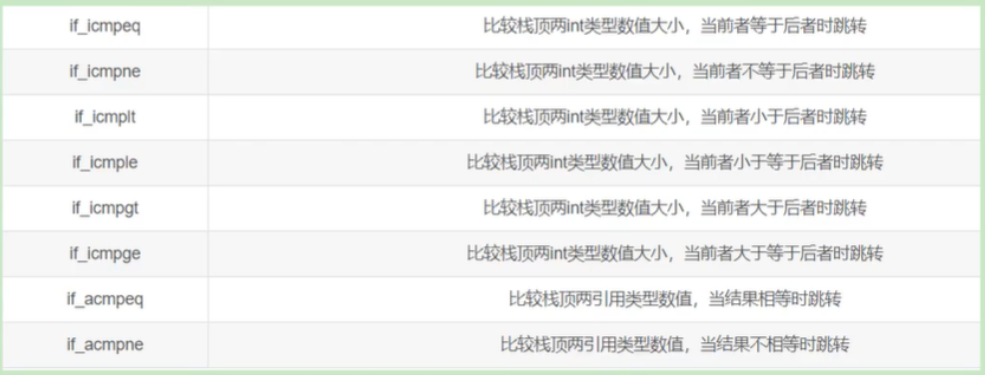

这些指令都接收两个字节的操作数作为参数，用于计算跳转的位置。同时在执行指令时，栈顶需要准备两个元素进行比较。指令执行完成后，栈顶的这两个元素被清空，且没有任何数据入栈。如果预设条件成立，则执行跳转，否则，继续执行下一条语句。
### 2.8.4. 多条件分支跳转指令
多条件分支跳转指令是专为switch-case语句设计的，主要有tableswitch和lookupswitch。

| 指令名称     | 描述                             |
| ------------ | -------------------------------- |
| tableswitch  | 用于switch条件跳转，case值连续   |
| lookupswitch | 用于switch条件跳转，case值不连续 |

从助记符上看，两者都是switch语句的实现，它们的区别：

- tableswitch要求多个条件分支值是连续的，它内部只存放起始值和终止值，以及若干个跳转偏移量，通过给定的操作数index，可以立即定位到跳转偏移量位置，因此效率比较高。
- lookupswitch内部存放着各个离散的case-offset对，每次执行都要搜索全部的case-offset对，找到匹配的case值，并根据对应的offset计算跳转地址，因此效率较低。

指令tableswitch的示意图如下图所示。由于tableswitch的case值是连续的，因此只需要记录最低值和最高值，以及每一项对应的offset偏移量，根据给定的index值通过简单的计算即可直接定位到offset。

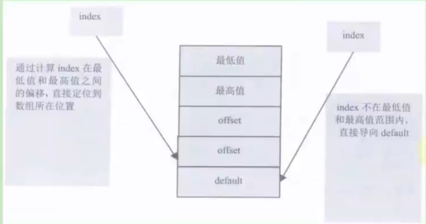

指令lookupswitch处理的是离散的case值，但是出于效率考虑，将case-offset对按照case值大小排序，给定index时，需要查找与index相等的case，获得其offset，如果找不到则跳转到default。指令lookupswitch如下图所示。


### 2.8.5. 无条件跳转指令
目前主要的无条件跳转指令为goto。指令goto接收两个字节的操作数，共同组成一个带符号的整数，用于指定指令的偏移量，指令执行的目的就是跳转到偏移量给定的位置处。
如果指令偏移量太大，超过双字节的带符号整数的范围，则可以使用指令goto_w，它和goto有相同的作用，但是它接收4个字节的操作数，可以表示更大的地址范围。
指令jsr、jsr_w、ret虽然也是无条件跳转的，但主要用于try-finally语句，且已经被虚拟机逐渐废弃，故不在这里介绍这两个指令。

| 指令名称 | 描述                                                         |
| -------- | ------------------------------------------------------------ |
| goto     | 无条件跳转                                                   |
| goto_w   | 无条件跳转（宽索引）                                         |
| jsr      | 跳转至指定16位offset位置，并将jsr下一条指令地址压入栈顶      |
| jsr_w    | 跳转至指定32位offer位置，并将jsr_w下一条指令地址压入栈顶     |
| ret      | 返回至由指定的局部变量所给出的指令位置（一般与jsr、jsr_w联合使用） |


## 2.9. 异常处理指令
> **异常处理指令**
> athrow 抛出异常或错误。将栈顶异常抛出
> jsr 跳转到子例程
> jsr_w 跳转到子例程（宽索引）
> ret 从子例程返回


**athrow指令**
在Java程序中显示抛出异常的操作（throw语句）都是由athrow指令来实现。
除了使用throw语句显示抛出异常情况之外，JVM规范还规定了许多运行时异常会在其他Java虚拟机指令检测到异常状况时自动抛出。例如，在之前介绍的整数运算时，当除数为零时，虚拟机会在idiv或1div指令中抛出ArithmeticException异常。
正常情况下，操作数栈的压入弹出都是一条条指令完成的。唯一的例外情况是在抛异常时，Java虚拟机会清除操作数栈上的所有内容，而后将异常实例压入调用者操作数栈上。
**处理异常**
在Java虚拟机中，处理异常（catch语句）不是由字节码指令来实现的（早期使用jsr、ret指令），而是采用异常表来完成的。
**异常表**
如果一个方法定义了一个try-catch 或者try-finally的异常处理，就会创建一个异常表。它包含了每个异常处理或者finally块的信息。异常表保存了每个异常处理信息。比如：

- 起始位置
- 结束位置
- 程序计数器记录的代码处理的偏移地址
- 被捕获的异常类在常量池中的索引

当一个异常被抛出时，JVM会在当前的方法里寻找一个匹配的处理，如果没有找到，这个方法会强制结束并弹出当前栈帧，并且异常会重新抛给上层调用的方法（在调用方法栈帧）。如果在所有栈帧弹出前仍然没有找到合适的异常处理，这个线程将终止。如果这个异常在最后一个非守护线程里抛出，将会导致JVM自己终止，比如这个线程是个main线程。

不管什么时候抛出异常，如果异常处理最终匹配了所有异常类型，代码就会继续执行。在这种情况下，如果方法结束后没有抛出异常，仍然执行finally块，在return前，它直接跳到finally块来完成目标
## 2.10. 同步控制指令
Java虚拟机支持两种同步结构：方法级的同步和方法内部一段指令序列的同步，这两种同步都是使用monitor来支持的
### 2.10.1. 方法级的同步
方法级的同步：是隐式的，即无须通过字节码指令来控制，它实现在方法调用和返回操作之中。虚拟机可以从方法常量池的方法表结构中的ACC_SYNCHRONIZED访问标志得知一个方法是否声明为同步方法；
当调用方法时，调用指令将会检查方法的ACC_SYNCHRONIZED访问标志是否设置。

- 如果设置了，执行线程将先持有同步锁，然后执行方法。最后在方法完成（无论是正常完成还是非正常完成）时释放同步锁。
- 在方法执行期间，执行线程持有了同步锁，其他任何线程都无法再获得同一个锁。
- 如果一个同步方法执行期间抛出了异常，并且在方法内部无法处理此异常，那这个同步方法所持有的锁将在异常抛到同步方法之外时自动释放。

举例：
```java
private int i = 0;
public synchronized void add() {
	i++;
}
```

对应的字节码：
```shell
0  aload_0
1  dup
2  getfield #2 <com/atguigu/java1/SynchronizedTest.i>
5  iconst_1 
6  iadd
7  putfield #2 <com/atguigu/java1/SynchronizedTest.i>
10 return
```

这段代码和普通的无同步操作的代码没有什么不同，没有使用monitorenter和monitorexit进行同步区控制。
这是因为，对于同步方法而言，当虚拟机通过方法的访问标示符判断是一个同步方法时，会自动在方法调用前进行加锁，当同步方法执行完毕后，不管方法是正常结束还是有异常抛出，均会由虚拟机释放这个锁。
因此，对于同步方法而言，monitorenter和monitorexit指令是隐式存在的，并未直接出现在字节码中。
### 2.10.2. 方法内指令指令序列的同步
同步一段指令集序列：通常是由java中的synchronized语句块来表示的。jvm的指令集有monitorenter和monitorexit 两条指令来支持synchronized关键字的语义。
当一个线程进入同步代码块时，它使用monitorenter指令请求进入。如果当前对象的监视器计数器为0，则它会被准许进入，若为1，则判断持有当前监视器的线程是否为自己，如果是，则进入，否则进行等待，直到对象的监视器计数器为0，才会被允许进入同步块。
当线程退出同步块时，需要使用monitorexit声明退出。在Java虚拟机中，任何对象都有一个监视器与之相关联，用来判断对象是否被锁定，当监视器被持有后，对象处于锁定状态。
指令monitorenter和monitorexit在执行时，都需要在操作数栈顶压入对象，之后monitorenter和monitorexit的锁定和释放都是针对这个对象的监视器进行的。
下图展示了监视器如何保护临界区代码不同时被多个线程访问，只有当线程4离开临界区后，线程1、2、3才有可能进入。
对应的字节码：
```shell
 0: aloade
 1: dup
 2: astore_1
 3: monitorenter
 4: aload_0
 5: dup
 6: getfield #2 //Field i:I
 9: iconst_1
10: isub
11: putfield #2 //Field i:I
14: aload_1
15: monitorexit
16: goto 24
19: astore_2
26: aload_1
21: monitorexit
22: aload_2
23: athrow
24: return

Exception table:
	from to target type
	4	 16	   19  any
	19	 22    19  any
```

编译器必须确保无论方法通过何种方式完成，方法中调用过的每条monitorenter指令都必须执行其对应的monitorexit指令，而无论这个方法是正常结束还是异常结束。
为了保证在方法异常完成时monitorenter和monitorexit指令依然可以正确配对执行，编译器会自动产生一个异常处理器，这个异常处理器声明可处理所有的异常，它的目的就是用来执行monitorexit指令


# 三、 类的加载过程（生命周期）详解
## 3.1. 概述
在Java中数据类型分为基本数据类型和引用数据类型。基本数据类型由虚拟机预先定义，引用数据类型则需要进行类的加载。
按照Java虚拟机规范，从class文件到加载到内存中的类，到类卸载出内存为止，它的整个生命周期包括如下7个阶段：
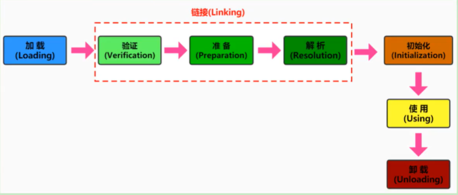
其中，验证、准备、解析3个部分统称为链接（Linking）
从程序中类的使用过程看

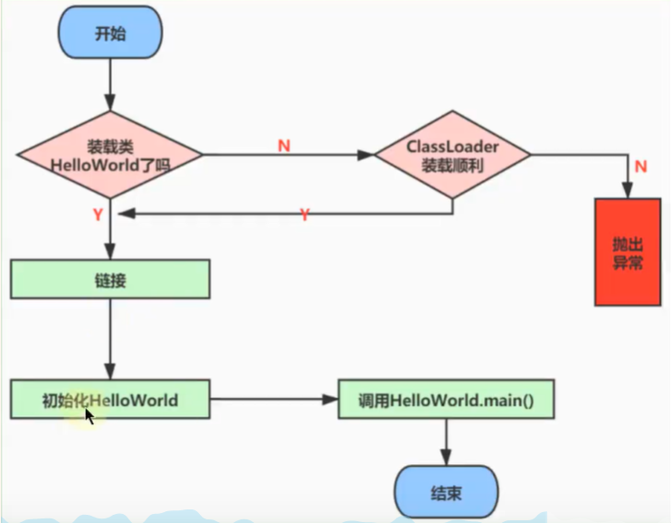
**大厂面试题**
> 蚂蚁金服：
> 描述一下JVM加载Class文件的原理机制？
> 一面：类加载过程
>
> 百度：
> 类加载的时机
> java类加载过程？
> 简述java类加载机制？
>
> 腾讯：
> JVM中类加载机制，类加载过程？
>
> 滴滴：
> JVM类加载机制
>
> 美团：
> Java类加载过程
> 描述一下jvm加载class文件的原理机制
>
> 京东：
> 什么是类的加载？
> 哪些情况会触发类的加载？
> 讲一下JVM加载一个类的过程JVM的类加载机制是什么？


---

## 3.2. 过程一：Loading（加载）阶段
### 3.2.1. 加载完成的操作
**加载的理解**
**所谓加载，简而言之就是将Java类的字节码文件加载到机器内存中，并在内存中构建出Java类的原型——类模板对象。**所谓类模板对象，其实就是Java类在]VM内存中的一个快照，JVM将从字节码文件中解析出的常量池、类字段、类方法等信息存储到类模板中，这样]VM在运行期便能通过类模板而获取Java类中的任意信息，能够对Java类的成员变量进行遍历，也能进行Java方法的调用。
反射的机制即基于这一基础。如果JVM没有将Java类的声明信息存储起来，则JVM在运行期也无法反射。

**加载完成的操作**
**加载阶段，简言之，查找并加载类的二进制数据，生成Class的实例。**

在加载类时，Java虚拟机必须完成以下3件事情：

-  通过类的全名，获取类的二进制数据流。 
-  解析类的二进制数据流为方法区内的数据结构（Java类模型） 
-  创建java.lang.Class类的实例，表示该类型。作为方法区这个类的各种数据的访问入口 

### 3.2.2. 二进制流的获取方式
对于类的二进制数据流，虚拟机可以通过多种途径产生或获得。（只要所读取的字节码符合JVM规范即可）

- 虚拟机可能通过文件系统读入一个class后缀的文件（最常见）
- 读入jar、zip等归档数据包，提取类文件。
- 事先存放在数据库中的类的二进制数据
- 使用类似于HTTP之类的协议通过网络进行加载
- 在运行时生成一段class的二进制信息等
- 在获取到类的二进制信息后，Java虚拟机就会处理这些数据，并最终转为一个java.lang.Class的实例。

如果输入数据不是ClassFile的结构，则会抛出ClassFormatError。
### 3.2.3. 类模型与Class实例的位置
**类模型的位置**
加载的类在JVM中创建相应的类结构，类结构会存储在方法区（JDKl.8之前：永久代；J0Kl.8及之后：元空间）。
**Class实例的位置**
类将.class文件加载至元空间后，会在堆中创建一个Java.lang.Class对象，用来封装类位于方法区内的数据结构，该Class对象是在加载类的过程中创建的，每个类都对应有一个Class类型的对象。

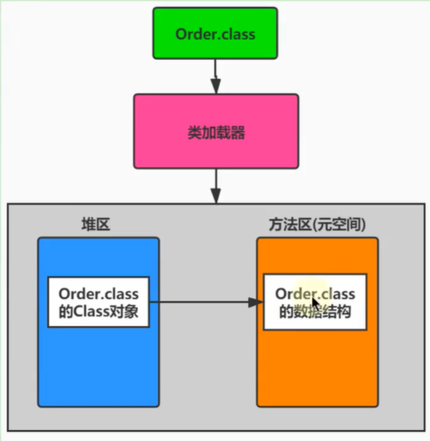

```java
Class clazz = Class.forName("java.lang.String");
//获取当前运行时类声明的所有方法
Method[] ms = clazz.getDecla#FF0000Methods();
for (Method m : ms) {
    //获取方法的修饰符
    String mod = Modifier.toString(m.getModifiers());
    System.out.print(mod + "");
    //获取方法的返回值类型
    String returnType = (m.getReturnType()).getSimpleName();
    System.out.print(returnType + "");
    //获取方法名
    System.out.print(m.getName() + "(");
    //获取方法的参数列表
    Class<?>[] ps = m.getParameterTypes();
    if (ps.length == 0) {
        System.out.print(')');
    }
    for (int i = 0; i < ps.length; i++) {
        char end = (i == ps.length - 1) ? ')' : ',';
        //获取参教的类型
        System.out.print(ps[i].getSimpleName() + end);
    }
}
```

### 3.2.4. 数组类的加载
创建数组类的情况稍微有些特殊，因为数组类本身并不是由类加载器负责创建，而是由JVM在运行时根据需要而直接创建的，但数组的元素类型仍然需要依靠类加载器去创建。创建数组类（下述简称A）的过程：

- 如果数组的元素类型是引用类型，那么就遵循定义的加载过程递归加载和创建数组A的元素类型；
- JVM使用指定的元素类型和数组维度来创建新的数组类。

如果数组的元素类型是引用类型，数组类的可访问性就由元素类型的可访问性决定。否则数组类的可访问性将被缺省定义为public。
## 3.3. 过程二：Linking（链接）阶段
### 3.3.1. 环节1：链接阶段之Verification（验证）
当类加载到系统后，就开始链接操作，验证是链接操作的第一步。
**它的目的是保证加载的字节码是合法、合理并符合规范的。**
验证的步骤比较复杂，实际要验证的项目也很繁多，大体上Java虚拟机需要做以下检查，如图所示。
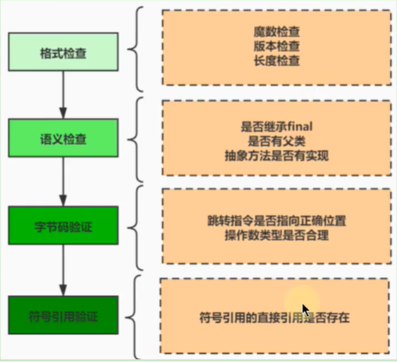

**整体说明：**
验证的内容则涵盖了类数据信息的格式验证、语义检查、字节码验证，以及符号引用验证等。

- **其中格式验证会和加载阶段一起执行**。验证通过之后，类加载器才会成功将类的二进制数据信息加载到方法区中。
- **格式验证之外的验证操作将会在方法区中进行**。

链接阶段的验证虽然拖慢了加载速度，但是它避免了在字节码运行时还需要进行各种检查。（磨刀不误砍柴工）

**具体说明：**

1.  格式验证：是否以魔数0XCAFEBABE开头，主版本和副版本号是否在当前Java虚拟机的支持范围内，数据中每一个项是否都拥有正确的长度等。 
2.  语义检查：Java虚拟机会进行字节码的语义检查，但凡在语义上不符合规范的，虚拟机也不会给予验证通过。比如： 
   - 是否所有的类都有父类的存在（在Java里，除了object外，其他类都应该有父类）
   - 是否一些被定义为final的方法或者类被重写或继承了
   - 非抽象类是否实现了所有抽象方法或者接口方法
3.  字节码验证：Java虚拟机还会进行字节码验证，**字节码验证也是验证过程中最为复杂的一个过程**。它试图通过对字节码流的分析，判断字节码是否可以被正确地执行。比如： 
   - 在字节码的执行过程中，是否会跳转到一条不存在的指令
   - 函数的调用是否传递了正确类型的参数
   - 变量的赋值是不是给了正确的数据类型等

栈映射帧（StackMapTable）就是在这个阶段，用于检测在特定的字节码处，其局部变量表和操作数栈是否有着正确的数据类型。但遗憾的是，100%准确地判断一段字节码是否可以被安全执行是无法实现的，因此，该过程只是尽可能地检查出可以预知的明显的问题。如果在这个阶段无法通过检查，虚拟机也不会正确装载这个类。但是，如果通过了这个阶段的检查，也不能说明这个类是完全没有问题的。
**在前面3次检查中，已经排除了文件格式错误、语义错误以及字节码的不正确性。但是依然不能确保类是没有问题的。**

4.  符号引用的验证：校验器还将进符号引用的验证。Class文件在其常量池会通过字符串记录自己将要使用的其他类或者方法。因此，在验证阶段，**虚拟机就会检查这些类或者方法确实是存在的**，并且当前类有权限访问这些数据，如果一个需要使用类无法在系统中找到，则会抛出NoClassDefFoundError，如果一个方法无法被找到，则会抛出NoSuchMethodError。此阶段在解析环节才会执行。 
### 3.3.2. 环节2：链接阶段之Preparation（准备）
**准备阶段（Preparation），简言之，为类的静态变分配内存，并将其初始化为默认值。**
当一个类验证通过时，虚拟机就会进入准备阶段。在这个阶段，虚拟机就会为这个类分配相应的内存空间，并设置默认初始值。Java虚拟机为各类型变量默认的初始值如表所示。

| 类型      | 默认初始值 |
| --------- | ---------- |
| byte      | (byte)0    |
| short     | (short)0   |
| int       | 0          |
| long      | 0L         |
| float     | 0.0f       |
| double    | 0.0        |
| char      | \\u0000    |
| boolean   | false      |
| reference | null       |

Java并不支持boolean类型，对于boolean类型，内部实现是int，由于int的默认值是0，故对应的，boolean的默认值就是false。

**注意**

- **这里不包含基本数据类型的字段用static final修饰的情况，因为final在编译的时候就会分配了，准备阶段会显式赋值。**
```java
// 一般情况：static final修饰的基本数据类型、字符串类型字面量会在准备阶段赋值
private static final String str = "Hello world";
// 特殊情况：static final修饰的引用类型不会在准备阶段赋值，而是在初始化阶段赋值
private static final String str = new String("Hello world");
```

-  注意这里不会为实例变量分配初始化，类变量会分配在方法区中，而实例变量是会随着对象一起分配到Java堆中。 
-  在这个阶段并不会像初始化阶段中那样会有初始化或者代码被执行。 
### 3.3.3. 环节3：链接阶段之Resolution（解析）
在准备阶段完成后，就进入了解析阶段。解析阶段（Resolution），简言之，将类、接口、字段和方法的符号引用转为直接引用。
**具体描述**：
符号引用就是一些字面量的引用，和虚拟机的内部数据结构和和内存布局无关。比较容易理解的就是在Class类文件中，通过常量池进行了大量的符号引用。但是在程序实际运行时，只有符号引用是不够的，比如当如下println()方法被调用时，系统需要明确知道该方法的位置。
**举例**：
输出操作System.out.println()对应的字节码：
```java
invokevirtual #24 <java/io/PrintStream.println>
```

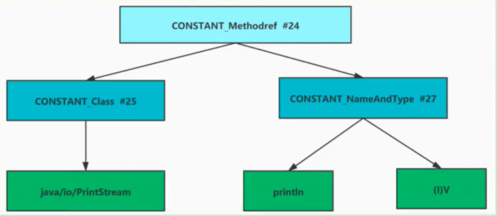

以方法为例，Java虚拟机为每个类都准备了一张方法表，将其所有的方法都列在表中，当需要调用一个类的方法的时候，只要知道这个方法在方法表中的偏移量就可以直接调用该方法。通过解析操作，符号引用就可以转变为目标方法在类中方法表中的位置，从而使得方法被成功调用。

---

## 3.4. 过程三：Initialization（初始化）阶段
### 3.4.1. static与final的搭配问题
**说明**：使用static+ final修饰的字段的显式赋值的操作，到底是在哪个阶段进行的赋值？

-  情况1：在链接阶段的准备环节赋值 
-  情况2：在初始化阶段`<clinit>()`中赋值 

**结论**： 在链接阶段的准备环节赋值的情况：

-  对于基本数据类型的字段来说，如果使用static final修饰，则显式赋值(直接赋值常量，而非调用方法通常是在链接阶段的准备环节进行 
-  对于String来说，如果使用字面量的方式赋值，使用static final修饰的话，则显式赋值通常是在链接阶段的准备环节进行 
-  在初始化阶段`<clinit>()`中赋值的情况： 排除上述的在准备环节赋值的情况之外的情况。 

**最终结论**：使用static+final修饰，且显式赋值中不涉及到方法或构造器调用的基本数据类到或String类型的显式赋值，是在链接阶段的准备环节进行。
```java
public static final int INT_CONSTANT = 10;                                // 在链接阶段的准备环节赋值
public static final int NUM1 = new Random().nextInt(10);                  // 在初始化阶段clinit>()中赋值
public static int a = 1;                                                  // 在初始化阶段<clinit>()中赋值

public static final Integer INTEGER_CONSTANT1 = Integer.valueOf(100);     // 在初始化阶段<clinit>()中赋值
public static Integer INTEGER_CONSTANT2 = Integer.valueOf(100);           // 在初始化阶段<clinit>()中概值

public static final String s0 = "helloworld0";                            // 在链接阶段的准备环节赋值
public static final String s1 = new String("helloworld1");                // 在初始化阶段<clinit>()中赋值
public static String s2 = "hellowrold2";                                  // 在初始化阶段<clinit>()中赋值
```

### 3.4.2. `<clinit>()`的线程安全性
对于`<clinit>()`方法的调用，也就是类的初始化，虚拟机会在内部确保其多线程环境中的安全性。
虚拟机会保证一个类的()方法在多线程环境中被正确地加锁、同步，如果多个线程同时去初始化一个类，那么只会有一个线程去执行这个类的`<clinit>()`方法，其他线程都需要阻塞等待，直到活动线程执行`<clinit>()`方法完毕。
正是因为**函数`<clinit>()`带锁线程安全的**，因此，如果在一个类的`<clinit>()`方法中有耗时很长的操作，就可能造成多个线程阻塞，引发死锁。并且这种死锁是很难发现的，因为看起来它们并没有可用的锁信息。
如果之前的线程成功加载了类，则等在队列中的线程就没有机会再执行`<clinit>()`方法了。那么，当需要使用这个类时，虚拟机会直接返回给它已经准备好的信息。
### 3.4.3. 类的初始化情况：主动使用vs被动使用
Java程序对类的使用分为两种：主动使用和被动使用。
**主动使用**
Class只有在必须要首次使用的时候才会被装载，Java虚拟机不会无条件地装载Class类型。Java虚拟机规定，一个类或接口在初次使用前，必须要进行初始化。这里指的“使用”，是指主动使用，主动使用只有下列几种情况：（即：如果出现如下的情况，则会对类进行初始化操作。而初始化操作之前的加载、验证、准备已经完成。

1.  实例化：当创建一个类的实例时，比如使用new关键字，或者通过反射、克隆、反序列化。 
```java
/**
 * 反序列化
 */
Class Order implements Serializable {
    static {
        System.out.println("Order类的初始化");
    }
}

public void test() {
    ObjectOutputStream oos = null;
    ObjectInputStream ois = null;
    try {
        // 序列化
        oos = new ObjectOutputStream(new FileOutputStream("order.dat"));
        oos.writeObject(new Order());
        // 反序列化
        ois = new ObjectInputStream(new FileOutputStream("order.dat"));
        Order order = ois.readObject();
    }
    catch (IOException e){
        e.printStackTrace();
    }
    catch (ClassNotFoundException e){
        e.printStackTrace();
    }
    finally {
        try {
            if (oos != null) {
                oos.close();
            }
            if (ois != null) {
                ois.close();
            }
        }
        catch (IOException e){
            e.printStackTrace();
        }
    }
}
```

2.  静态方法：当调用类的静态方法时，即当使用了字节码invokestatic指令。 
3.  静态字段：当使用类、接口的静态字段时（final修饰特殊考虑），比如，使用getstatic或者putstatic指令。（对应访问变量、赋值变量操作） 
```java
public class ActiveUse {
	@Test
    public void test() {
        System.out.println(User.num);
    }
}

class User {
    static {
        System.out.println("User类的初始化");
    }
    public static final int num = 1;
}
```

4.  反射：当使用java.lang.reflect包中的方法反射类的方法时。比如：Class.forName("com.atguigu.java.Test") 
5.  继承：当初始化子类时，如果发现其父类还没有进行过初始化，则需要先触发其父类的初始化。 
> 当Java虚拟机初始化一个类时，要求它的所有父类都已经被初始化，但是这条规则并不适用于接口。
> - 在初始化一个类时，并不会先初始化它所实现的接口
> - 在初始化一个接口时，并不会先初始化它的父接口
> - 因此，一个父接口并不会因为它的子接口或者实现类的初始化而初始化。只有当程序首次使用特定接口的静态字段时，才会导致该接口的初始化。


6.  default方法：如果一个接口定义了default方法，那么直接实现或者间接实现该接口的类的初始化，该接口要在其之前被初始化。 
```java
interface Compare {
	public static final Thread t = new Thread() {
        {
            System.out.println("Compare接口的初始化");
        }
    }   
}
```

7.  main方法：当虚拟机启动时，用户需要指定一个要执行的主类（包含main()方法的那个类），虚拟机会先初始化这个主类。 
> VM启动的时候通过引导类加载器加载一个初始类。这个类在调用public static void main(String[])方法之前被链接和初始化。这个方法的执行将依次导致所需的类的加载，链接和初始化。

8.  MethodHandle：当初次调用MethodHandle实例时，初始化该MethodHandle指向的方法所在的类。（涉及解析REF getStatic、REF_putStatic、REF invokeStatic方法句柄对应的类）

**被动使用**
除了以上的情况属于主动使用，其他的情况均属于被动使用。**被动使用不会引起类的初始化。**
也就是说：**并不是在代码中出现的类，就一定会被加载或者初始化。**如果不符合主动使用的条件，类就不会初始化。

1.  静态字段：当通过子类引用父类的静态变量，不会导致子类初始化，只有真正声明这个字段的类才会被初始化。 
```java
public class PassiveUse {
 	@Test
    public void test() {
        System.out.println(Child.num);
    }
}

class Child extends Parent {
    static {
        System.out.println("Child类的初始化");
    }
}

class Parent {
    static {
        System.out.println("Parent类的初始化");
    }
    
    public static int num = 1;
}
```

2.  数组定义：通过数组定义类引用，不会触发此类的初始化 
```java
Parent[] parents= new Parent[10];
System.out.println(parents.getClass()); 
// new的话才会初始化
parents[0] = new Parent();
```


3.  引用常量：引用常量不会触发此类或接口的初始化。因为常量在链接阶段就已经被显式赋值了。 
```java
public class PassiveUse {
    public static void main(String[] args) {
        System.out.println(Serival.num);
        // 但引用其他类的话还是会初始化
        System.out.println(Serival.num2);
    }
}

interface Serival {
    public static final Thread t = new Thread() {
        {
            System.out.println("Serival初始化");
        }
    };

    public static int num = 10; 
    public static final int num2 = new Random().nextInt(10);
}
```


4.  loadClass方法：调用ClassLoader类的loadClass()方法加载一个类，并不是对类的主动使用，不会导致类的初始化。 
```java
Class clazz = ClassLoader.getSystemClassLoader().loadClass("com.test.java.Person");
```


**扩展**
> -XX:+TraceClassLoading：追踪打印类的加载信息

## 3.5. 过程四：类的Using（使用）
任何一个类型在使用之前都必须经历过完整的加载、链接和初始化3个类加载步骤。一旦一个类型成功经历过这3个步骤之后，便“厉事俱备只欠东风”，就等着开发者使用了。
开发人员可以在程序中访问和调用它的静态类成员信息（比如：静态字段、静态方法），或者使用new关键字为其创建对象实例。
## 3.6. 过程五：类的Unloading（卸载）
### 3.6.1. 类、类的加载器、类的实例之间的引用关系
在类加载器的内部实现中，用一个Java集合来存放所加载类的引用。另一方面，一个Class对象总是会引用它的类加载器，调用Class对象的getClassLoader()方法，就能获得它的类加载器。由此可见，代表某个类的Class实例与其类的加载器之间为双向关联关系。
一个类的实例总是引用代表这个类的Class对象。在Object类中定义了getClass()方法，这个方法返回代表对象所属类的Class对象的引用。此外，所有的java类都有一个静态属性class，它引用代表这个类的Class对象。

### 3.6.2.类的生命周期
当Sample类被加载、链接和初始化后，它的生命周期就开始了。当代表Sample类的Class对象不再被引用，即不可触及时，Class对象就会结束生命周期，Sample类在方法区内的数据也会被卸载，从而结束Sample类的生命周期。
**一个类何时结束生命周期，取决于代表它的Class对象何时结束生命周期。**
### 3.6.3. 具体例子
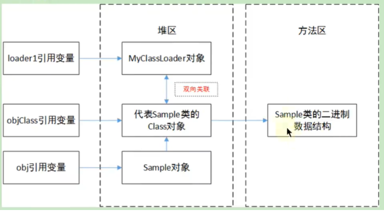

loader1变量和obj变量间接应用代表Sample类的Class对象，而objClass变量则直接引用它。
如果程序运行过程中，将上图左侧三个引用变量都置为null，此时Sample对象结束生命周期，MyClassLoader对象结束生命周期，代表Sample类的Class对象也结束生命周期，Sample类在方法区内的二进制数据被卸载。
当再次有需要时，会检查Sample类的Class对象是否存在，如果存在会直接使用，不再重新加载；如果不存在Sample类会被重新加载，在Java虚拟机的堆区会生成一个新的代表Sample类的Class实例（可以通过哈希码查看是否是同一个实例）
### 3.6.4. 类的卸载
（1）启动类加载器加载的类型在整个运行期间是不可能被卸载的（jvm和jls规范）
（2）被系统类加载器和扩展类加载器加载的类型在运行期间不太可能被卸载，因为系统类加载器实例或者扩展类的实例基本上在整个运行期间总能直接或者间接的访问的到，其达到unreachable的可能性极小。
（3）被开发者自定义的类加载器实例加载的类型只有在很简单的上下文环境中才能被卸载，而且一般还要借助于强制调用虚拟机的垃圾收集功能才可以做到。可以预想，稍微复杂点的应用场景中（比如：很多时候用户在开发自定义类加载器实例的时候采用缓存的策略以提高系统性能），被加载的类型在运行期间也是几乎不太可能被卸载的（至少卸载的时间是不确定的）。
综合以上三点，一个已经加载的类型被卸载的几率很小至少被卸载的时间是不确定的。同时我们可以看的出来，开发者在开发代码时候，不应该对虚拟机的类型卸载做任何假设的前提下，来实现系统中的特定功能。

### 回顾：方法区的垃圾回收
方法区的垃圾收集主要回收两部分内容：常量池中废弃的常量和不再使用的类型。
HotSpot虚拟机对常量池的回收策略是很明确的，只要常量池中的常量没有被任何地方引用，就可以被回收。
判定一个常量是否“废弃”还是相对简单，而要判定一个类型是否属于“不再使用的类”的条件就比较苛刻了。需要同时满足下面三个条件：

- 该类所有的实例都已经被回收。也就是Java堆中不存在该类及其任何派生子类的实例。
- 加载该类的类加载器已经被回收。这个条件除非是经过精心设计的可替换类加载器的场景，如OSGi、JSP的重加载等，否则通常是很难达成的。
- 该类对应的java.lang.Class对象没有在任何地方被引用，无法在任何地方通过反射访问该类的方法。

Java虚拟机被允许对满足上述三个条件的无用类进行回收，这里说的仅仅是“被允许”，而并不是和对象一样，没有引用了就必然会回收。

# 四、 再谈类的加载器
## 4.1. 概述
类加载器是JVM执行类加载机制的前提。
**ClassLoader的作用：**
ClassLoader是Java的核心组件，所有的Class都是由ClassLoader进行加载的，ClassLoader负责通过各种方式将Class信息的二进制数据流读入JVM内部，转换为一个与目标类对应的java.lang.Class对象实例。然后交给Java虚拟机进行链接、初始化等操作。因此，ClassLoader在整个装载阶段，只能影响到类的加载，而无法通过ClassLoader去改变类的链接和初始化行为。至于它是否可以运行，则由Execution Engine决定。
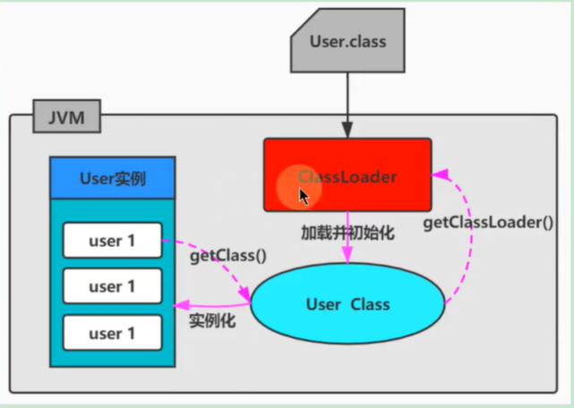
**大厂面试题**
> 蚂蚁金服：
> 深入分析ClassLoader，双亲委派机制
> 类加载器的双亲委派模型是什么？一面：双亲委派机制及使用原因
>
> 百度：
> 都有哪些类加载器，这些类加载器都加载哪些文件？
> 手写一个类加载器Demo
> Class的forName（“java.lang.String”）和Class的getClassLoader（）的Loadclass（“java.lang.String”）有什么区别？
>
> 腾讯：
> 什么是双亲委派模型？
> 类加载器有哪些？
>
> 小米：
> 双亲委派模型介绍一下
>
> 滴滴：
> 简单说说你了解的类加载器一面：讲一下双亲委派模型，以及其优点
>
> 字节跳动：
> 什么是类加载器，类加载器有哪些？
>
> 京东：
> 类加载器的双亲委派模型是什么？
> 双亲委派机制可以打破吗？为什么


### 4.1.1. 类加载器的分类
类的加载分类：显式加载 vs 隐式加载
class文件的显式加载与隐式加载的方式是指JVM加载class文件到内存的方式。

- 显式加载指的是在代码中通过调用ClassLoader加载class对象，如直接使用Class.forName(name)或this.getClass().getClassLoader().loadClass()加载class对象。
- 隐式加载则是不直接在代码中调用ClassLoader的方法加载class对象，而是通过虚拟机自动加载到内存中，如在加载某个类的class文件时，该类的class文件中引用了另外一个类的对象，此时额外引用的类将通过JVM自动加载到内存中。

在日常开发以上两种方式一般会混合使用。
```java
//隐式加载
User user=new User();
//显式加载，并初始化
Class clazz=Class.forName("com.test.java.User");
//显式加载，但不初始化
ClassLoader.getSystemClassLoader().loadClass("com.test.java.Parent");
```

### 4.1.2. 类加载器的必要性
一般情况下，Java开发人员并不需要在程序中显式地使用类加载器，但是了解类加载器的加载机制却显得至关重要。从以下几个方面说：

- 避免在开发中遇到java.lang.ClassNotFoundException异常或java.lang.NoClassDefFoundError异常时，手足无措。只有了解类加载器的 加载机制才能够在出现异常的时候快速地根据错误异常日志定位问题和解决问题
- 需要支持类的动态加载或需要对编译后的字节码文件进行加解密操作时，就需要与类加载器打交道了。
- 开发人员可以在程序中编写自定义类加载器来重新定义类的加载规则，以便实现一些自定义的处理逻辑。

### 4.1.3. 命名空间
**何为类的唯一性？**
**对于任意一个类，都需要由加载它的类加载器和这个类本身一同确认其在Java虚拟机中的唯一性。**每一个类加载器，都拥有一个独立的类名称空间：**比较两个类是否相等，只有在这两个类是由同一个类加载器加载的前提下才有意义。**否则，即使这两个类源自同一个Class文件，被同一个虚拟机加载，只要加载他们的类加载器不同，那这两个类就必定不相等。

**命名空间**

-  每个类加载器都有自己的命名空间，命名空间由该加载器及所有的父加载器所加载的类组成 
-  在同一命名空间中，不会出现类的完整名字（包括类的包名）相同的两个类 
-  在不同的命名空间中，有可能会出现类的完整名字（包括类的包名）相同的两个类 

在大型应用中，我们往往借助这一特性，来运行同一个类的不同版本。
### 4.1.4. 类加载机制的基本特征
双亲委派模型。但不是所有类加载都遵守这个模型，有的时候，启动类加载器所加载的类型，是可能要加载用户代码的，比如JDK内部的ServiceProvider/ServiceLoader机制，用户可以在标准API框架上，提供自己的实现，JDK也需要提供些默认的参考实现。例如，Java中JNDI、JDBC、文件系统、Cipher等很多方面，都是利用的这种机制，这种情况就不会用双亲委派模型去加载，而是利用所谓的上下文加载器。
可见性，子类加载器可以访问父加载器加载的类型，但是反过来是不允许的。不然，因为缺少必要的隔离，我们就没有办法利用类加载器去实现容器的逻辑。
单一性，由于父加载器的类型对于子加载器是可见的，所以父加载器中加载过的类型，就不会在子加载器中重复加载。但是注意，类加载器“邻居”间，同一类型仍然可以被加载多次，因为互相并不可见。
### 4.1.5. 类加载器之间的关系
Launcher类核心代码
```java
Launcher.ExtClassLoader var1;
try {
    var1 = Launcher.ExtClassLoader.getExtClassLoader();
} catch (IOException var10) {
    throw new InternalError("Could not create extension class loader", var10);
}

try {
    this.loader = Launcher.AppClassLoader.getAppClassLoader(var1);
} catch (IOException var9) {
    throw new InternalError("Could not create application class loader", var9);
}

Thread.currentThread().setContextClassLoader(this.loader);
```

-  **ExtClassLoader的Parent类是null** 
-  **AppClassLoader的Parent类是ExtClassLoader** 
-  **当前线程的ClassLoader是AppClassLoader** 
> 注意，这里的Parent类并不是Java语言意义上的继承关系，而是一种包含关系

## 4.2. 类的加载器分类
JVM支持两种类型的类加载器，分别为引导类加载器（Bootstrap ClassLoader）和自定义类加载器（User-Defined ClassLoader）。
从概念上来讲，自定义类加载器一般指的是程序中由开发人员自定义的一类类加载器，但是Java虚拟机规范却没有这么定义，而是将所有派生于抽象类ClassLoader的类加载器都划分为自定义类加载器。无论类加载器的类型如何划分，在程序中我们最常见的类加载器结构主要是如下情况：

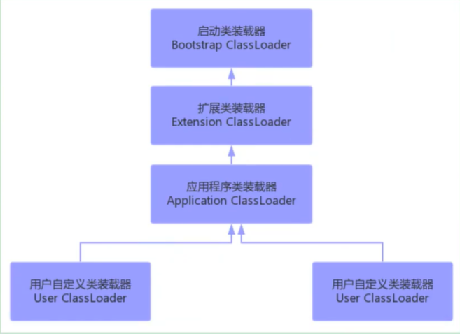

- 除了顶层的启动类加载器外，其余的类加载器都应当有自己的“父类”加戟器。
- 不同类加载器看似是继承（Inheritance）关系，实际上是包含关系。在下层加载器中，包含着上层加载器的引用。

父类加载器和子类加载器的关系：
```java
class ClassLoader{
    ClassLoader parent;//父类加载器
        public ClassLoader(ClassLoader parent){
        this.parent = parent;
    }
}
class ParentClassLoader extends ClassLoader{
    public ParentClassLoader(ClassLoader parent){
        super(parent);
    }
}
class ChildClassLoader extends ClassLoader{
    public ChildClassLoader(ClassLoader parent){ //parent = new ParentClassLoader();
        super(parent);
    }
}
```
正是由于子类加载器中包含着父类加载器的引用，所以可以通过子类加载器的方法获取对应的父类加载器
**注意：**
启动类加载器通过C/C++语言编写，而自定义类加载器都是由Java语言编写的，虽然扩展类加载器和应用程序类加载器是被jdk开发人员使用java语言来编写的，但是也是由java语言编写的，所以也被称为自定义类加载器

### 4.2.1. 引导类加载器
启动类加载器（引导类加载器，Bootstrap ClassLoader）

-  这个类加载使用C/C++语言实现的，嵌套在JVM内部。 
-  它用来加载Java的核心库（JAVAHOME/jre/lib/rt.jar或sun.boot.class.path路径下的内容）。用于提供JVM自身需要的类。 
-  并不继承自java.lang.ClassLoader，没有父加载器。 
-  出于安全考虑，Bootstrap启动类加载器只加载包名为java、javax、sun等开头的类 
-  加载扩展类和应用程序类加载器，并指定为他们的父类加载器。
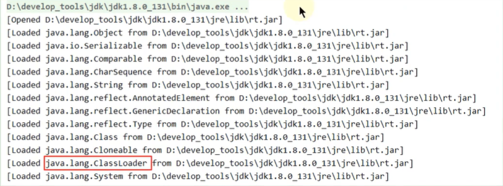
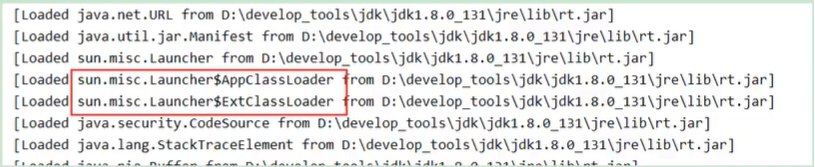
使用-XX:+TraceClassLoading参数得到。 

启动类加载器使用C++编写的？Yes！

- C/C++：指针函数&函数指针、C++支持多继承、更加高效
- Java：由C演变而来，（C）–版，单继承
```java
System.out.println("＊＊＊＊＊＊＊＊＊＊启动类加载器＊＊＊＊＊＊＊＊＊＊");
// 获取BootstrapclassLoader能够加载的api的路径
URL[] urLs = sun.misc.Launcher.getBootstrapcLassPath().getURLs();
for (URL element : urLs) {
    System.out.println(element.toExternalForm());
}
// 从上面的路径中随意选择一个类，来看看他的类加载器是什么：引导类加载器
ClassLoader classLoader = java.security.Provider.class.getClassLoader();
System.out.println(classLoader);
```

**执行结果：**


### 4.2.2. 扩展类加载器
扩展类加载器（Extension ClassLoader）

-  Java语言编写，由sun.misc.Launcher$ExtClassLoader实现。 
-  继承于ClassLoader类 
-  父类加载器为启动类加载器 
-  从java.ext.dirs系统属性所指定的目录中加载类库，或从JDK的安装目录的jre/lib/ext子目录下加载类库。如果用户创建的JAR放在此目录下，也会自动由扩展类加载器加载。
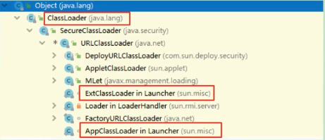 

```java
System.out.println("＊＊＊＊＊＊＊＊＊＊＊扩展类加载器＊＊＊＊＊＊＊＊＊＊＊");
String extDirs =System.getProperty("java.ext.dirs");
for (String path :extDirs.split( regex:";")){
    System.out.println(path);
}

// 从上面的路径中随意选择一个类，来看看他的类加载器是什么：扩展类加载器
lassLoader classLoader1 = sun.security.ec.CurveDB.class.getClassLoader();
System.out.print1n(classLoader1); //sun.misc. Launcher$ExtCLassLoader@1540e19d
```

**执行结果：**
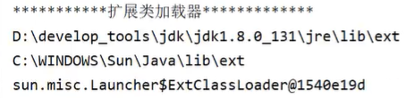

### 4.2.3. 系统类加载器
应用程序类加载器（系统类加载器，AppClassLoader）

- java语言编写，由sun.misc.Launcher$AppClassLoader实现
- 继承于ClassLoader类
- 父类加载器为扩展类加载器
- 它负责加载环境变量classpath或系统属性java.class.path 指定路径下的类库
- 应用程序中的类加载器默认是系统类加载器。
- 它是用户自定义类加载器的默认父加载器
- 通过ClassLoader的getSystemClassLoader()方法可以获取到该类加载器

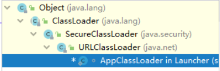
### 4.2.4. 用户自定义类加载器
用户自定义类加载器

- 在Java的日常应用程序开发中，类的加载几乎是由上述3种类加载器相互配合执行的。在必要时，我们还可以自定义类加载器，来定制类的加载方式。
- 体现Java语言强大生命力和巨大魅力的关键因素之一便是，Java开发者可以自定义类加载器来实现类库的动态加载，加载源可以是本地的JAR包，也可以是网络上的远程资源。
- 通过类加载器可以实现非常绝妙的插件机制，这方面的实际应用案例举不胜举。例如，著名的OSGI组件框架，再如Eclipse的插件机制。类加载器为应用程序提供了一种动态增加新功能的机制，这种机制无须重新打包发布应用程序就能实现。
- 同时，自定义加载器能够实现应用隔离，例如Tomcat，Spring等中间件和组件框架都在内部实现了自定义的加载器，并通过自定义加载器隔离不同的组件模块。这种机制比C/C程序要好太多，想不修改C/C程序就能为其新增功能，几乎是不可能的，仅仅一个兼容性便能阻挡住所有美好的设想。
- 自定义类加载器通常需要继承于ClassLoader。
## 4.3. 测试不同的类的加载器
每个Class对象都会包含一个定义它的ClassLoader的一个引用。
**获取ClassLoader的途径**
```java
// 获得当前类的ClassLoader
clazz.getClassLoader()
// 获得当前线程上下文的ClassLoader
Thread.currentThread().getContextClassLoader()
// 获得系统的ClassLoader
ClassLoader.getSystemClassLoader()
```

**说明：**

- 站在程序的角度看，引导类加载器与另外两种类加载器（系统类加载器和扩展类加载器）并不是同一个层次意义上的加
载器，引导类加载器是使用C++语言编写而成的，而另外两种类加载器则是使用Java语言编写而成的。由于引导类加载
器压根儿就不是一个Java类，因此在Java程序中只能打印出空值。
- 数组类的Class对象，不是由类加载器去创建的，而是在Java运行期JVM根据需要自动创建的。对于数组类的类加载器
来说，是通过Class.getClassLoader()返回的，与数组当中元素类型的类加载器是一样的；如果数组当中的元素类型
是基本数据类型，数组类是没有类加载器的。
```java
// 运行结果：null
String[] strArr = new String[6];
System.out.println(strArr.getClass().getClassLoader());

// 运行结果：sun．misc．Launcher＄AppCLassLoader＠18b4aac2
ClassLoaderTest[] test=new ClassLoaderTest[1];
System.out.println(test.getClass().getClassLoader());

// 运行结果：null
int[]ints =new int[2];
System.out.println(ints.getClass().getClassLoader());
```

**代码：**
```java
public class ClassLoaderTest1{
    public static void main(String[] args) {
        //获取系统该类加载器
        ClassLoader systemClassLoader=ClassLoader.getSystemCLassLoader();
        System.out.print1n(systemClassLoader);//sun.misc.Launcher$AppCLassLoader@18b4aac2
        //获取扩展类加载器
        ClassLoader extClassLoader =systemClassLoader.getParent();
        System.out.println(extClassLoader);//sun.misc. Launcher$ExtCLassLoader@1540e19d
        //试图获取引导类加载器：失败
        ClassLoader bootstrapClassLoader =extClassLoader.getParent();
        System.out.print1n(bootstrapClassLoader);//null

        //##################################
        try{
            ClassLoader classLoader =Class.forName("java.lang.String").getClassLoader();
            System.out.println(classLoader);
            //自定义的类默认使用系统类加载器
            ClassLoader classLoader1=Class.forName("com.atguigu.java.ClassLoaderTest1").getClassLoader();
            System.out.println(classLoader1);
            
            //关于数组类型的加载：使用的类的加载器与数组元素的类的加载器相同
            String[] arrstr = new String[10];
            System.out.println(arrstr.getClass().getClassLoader());//null：表示使用的是引导类加载器
                
            ClassLoaderTest1[] arr1 =new ClassLoaderTest1[10];
            System.out.println(arr1.getClass().getClassLoader());//sun.misc. Launcher$AppcLassLoader@18b4aac2
            
            int[] arr2 = new int[10];
            System.out.println(arr2.getClass().getClassLoader());//null:
        } catch (ClassNotFoundException e) {
            e.printStackTrace();
        }
    }
}
```
## 4.4. ClassLoader源码解析
**ClassLoader与现有类的关系：**
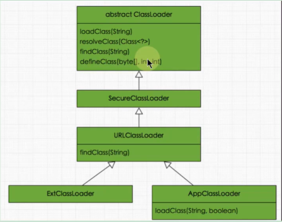
除了以上虚拟机自带的加载器外，用户还可以定制自己的类加载器。Java提供了抽象类java.lang.ClassLoader，所有用户自定义的类加载器都应该继承ClassLoader类。
### 4.4.1. ClassLoader的主要方法
抽象类ClassLoader的主要方法：（内部没有抽象方法）
```java
public final ClassLoader getParent()
```
返回该类加载器的超类加载器
```java
public Class<?> loadClass(String name) throws ClassNotFoundException
```

加载名称为name的类，返回结果为java.lang.Class类的实例。如果找不到类，则返回 ClassNotFoundException异常。该方法中的逻辑就是双亲委派模式的实现。
```java
protected Class<?> findClass(String name) throws ClassNotFoundException
```
查找二进制名称为name的类，返回结果为java.lang.Class类的实例。这是一个受保护的方法，JVM鼓励我们重写此方法，需要自定义加载器遵循双亲委托机制，该方法会在检查完父类加载器之后被loadClass()方法调用。

-  在JDK1.2之前，在自定义类加载时，总会去继承ClassLoader类并重写loadClass方法，从而实现自定义的类加载类。但是在JDK1.2之后已不再建议用户去覆盖loadClass()方法，而是建议把自定义的类加载逻辑写在findClass()方法中，从前面的分析可知，findClass()方法是在loadClass()方法中被调用的，当loadClass()方法中父加载器加载失败后，则会调用自己的findClass()方法来完成类加载，这样就可以保证自定义的类加载器也符合双亲委托模式。 
-  需要注意的是ClassLoader类中并没有实现findClass()方法的具体代码逻辑，取而代之的是抛出ClassNotFoundException异常，同时应该知道的是findClass方法通常是和defineClass方法一起使用的。
> 一般情况下，在自定义类加载器时，会直接覆盖ClassLoader的findClass()方法并编写加载规则，取得要加载类的字节码后转换成流，然后调用defineClass()方法生成类的Class对象。

```java
protected final Class<?> defineClass(String name, byte[] b,int off,int len)
```
根据给定的字节数组b转换为Class的实例，off和len参数表示实际Class信息在byte数组中的位置和长度，其中byte数组b是ClassLoader从外部获取的。这是受保护的方法，只有在自定义ClassLoader子类中可以使用。

-  defineClass()方法是用来将byte字节流解析成JVM能够识别的Class对象（ClassLoader中已实现该方法逻辑），通过这个方法不仅能够通过class文件实例化class对象，也可以通过其他方式实例化class对象，如通过网络接收一个类的字节码，然后转换为byte字节流创建对应的Class对象。 
-  defineClass()方法通常与findClass()方法一起使用，一般情况下，在自定义类加载器时，会直接覆盖ClassLoader的findClass()方法并编写加载规则，取得要加载类的字节码后转换成流，然后调用defineClass()方法生成类的Class对象

**简单举例：**
```java
protected Class<?> findClass(String name) throws ClassNotFoundException {
    // 获取类的字节数组
    byte[] classData =getClassData(name);
    if (classData == null) {
        throw new ClassNotFoundException();
    } else{
        //使用defineClass生成class对象
        return defineClass(name,classData,θ,classData.length);
    }
}
```
```java
protected final void resolveClass(Class<?> c)
```

链接指定的一个Java类。使用该方法可以使用类的Class对象创建完成的同时也被解析。前面我们说链接阶段主要是对字节码进行验证，为类变量分配内存并设置初始值同时将字节码文件中的符号引用转换为直接引用。
```java
protected final Class<?> findLoadedClass(String name)
```

查找名称为name的已经被加载过的类，返回结果为java.lang.Class类的实例。这个方法是final方法，无法被修改。
```java
private final ClassLoader parent;
```
它也是一个ClassLoader的实例，这个字段所表示的ClassLoader也称为这个ClassLoader的双亲。在类加载的过程中，ClassLoader可能会将某些请求交予自己的双亲处理。
### 4.4.2. SecureClassLoader与URLClassLoader
接着SecureClassLoader扩展了ClassLoader，新增了几个与使用相关的代码源（对代码源的位置及其证书的验证）和权限定义类验证（主要指对class源码的访问权限）的方法，一般我们不会直接跟这个类打交道，更多是与它的子类URLClassLoader有所关联。
前面说过，ClassLoader是一个抽象类，很多方法是空的没有实现，比如findClass()、findResource()等。而URLClassLoader这个实现类为这些方法提供了具体的实现。并新增了URLClassPath类协助取得Class字节码流等功能。**在编写自定义类加载器时，如果没有太过于复杂的需求，可以直接继承URLClassLoader类**，这样就可以避免自己去编写findClass()方法及其获取字节码流的方式，使自定义类加载器编写更加简洁。
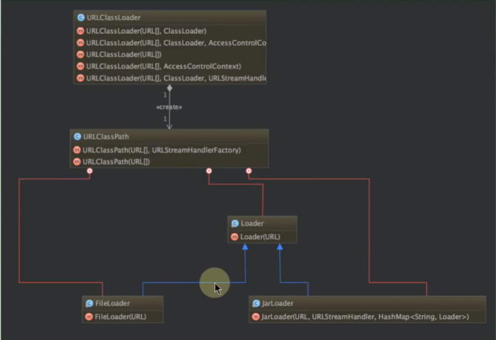

### 4.4.3. ExtClassLoader与AppClassLoader
了解完URLClassLoader后接着看看剩余的两个类加载器，即拓展类加载器ExtClassLoader和系统类加载器AppClassLoader，这两个类都继承自URLClassLoader，是sun.misc.Launcher的静态内部类。
sun.misc.Launcher主要被系统用于启动主应用程序，ExtClassLoader和AppClassLoader都是由sun.misc.Launcher创建的，其类主要类结构如下：
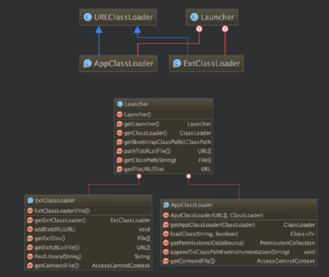
我们发现ExtClassLoader并没有重写loadClass()方法，这足矣说明其遵循双亲委派模式，而AppClassLoader重载了loadClass()方法，但最终调用的还是父类loadClass()方法，因此依然遵守双亲委派模式。
### 4.4.4. Class.forName()与ClassLoader.loadClass()
**Class.forName()**

-  Class.forName()：是一个静态方法，最常用的是Class.forName(String className); 
-  根据传入的类的全限定名返回一个Class对象。该方法在将Class文件加载到内存的同时，会执行类的初始化。 
```java
Class.forName("com.atguigu.java.Helloworld");
```

**ClassLoader.loadClass()**

-  ClassLoader.loadClass()：这是一个实例方法，需要一个ClassLoader对象来调用该方法。 
-  该方法将Class文件加载到内存时，并不会执行类的初始化，直到这个类第一次使用时才进行初始化。该方法因为需要得到一个ClassLoader对象，所以可以根据需要指定使用哪个类加载器。 
```java
Classloader cl = ......; cl.loadClass("com.atguigu.java.Helloworld");
```

## 4.5. 双亲委派模型
### 4.5.1. 定义与本质
类加载器用来把类加载到Java虚拟机中。从JDK1.2版本开始，类的加载过程采用双亲委派机制，这种机制能更好地保证Java平台的安全。
**定义**
如果一个类加载器在接到加载类的请求时，它首先不会自己尝试去加载这个类，而是把这个请求任务委托给父类加载器去完成，依次递归，如果父类加载器可以完成类加载任务，就成功返回。只有父类加载器无法完成此加载任务时，才自己去加载。
**本质**
规定了类加载的顺序是：引导类加载器先加载，若加载不到，由扩展类加载器加载，若还加载不到，才会由系统类加载器或自定义的类加载器进行加载。
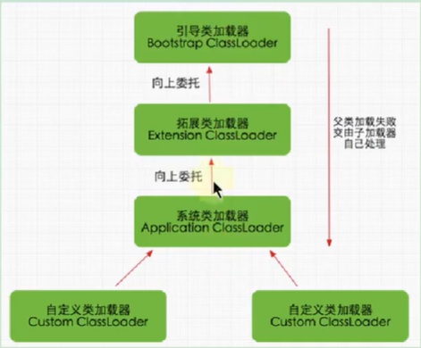
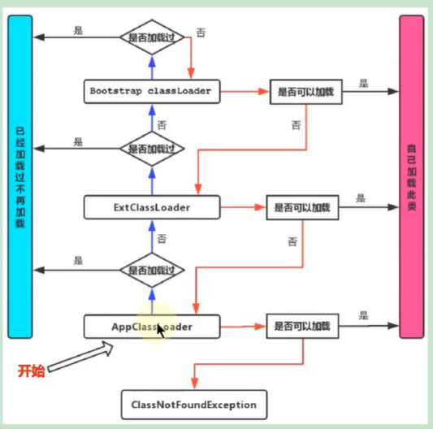

### 4.5.2. 优势与劣势
**双亲委派机制优势**

-  避免类的重复加载，确保一个类的全局唯一性
- Java类随着它的类加载器一起具备了一种带有优先级的层次关系，通过这种层级关可以避免类的重复加载，当父亲已经加载了该类时，就没有必要子ClassLoader再加载一次。
-  保护程序安全，防止核心API被随意篡改 

**代码支持**
双亲委派机制在java.lang.ClassLoader.loadClass(String，boolean)接口中体现。该接口的逻辑如下：
（1）先在当前加载器的缓存中查找有无目标类，如果有，直接返回。
（2）判断当前加载器的父加载器是否为空，如果不为空，则调用parent.loadClass(name，false)接口进行加载。
（3）反之，如果当前加载器的父类加载器为空，则调用findBootstrapClassorNull(name)接口，让引导类加载器进行加载。
（4）如果通过以上3条路径都没能成功加载，则调用findClass(name)接口进行加载。该接口最终会调用java.lang.ClassLoader接口的defineClass系列的native接口加载目标Java类。
双亲委派的模型就隐藏在这第2和第3步中。
**举例**
假设当前加载的是java.lang.Object这个类，很显然，该类属于JDK中核心得不能再核心的一个类，因此一定只能由引导类加载器进行加载。当]VM准备加载javaJang.Object时，JVM默认会使用系统类加载器去加载，按照上面4步加载的逻辑，在第1步从系统类的缓存中肯定查找不到该类，于是进入第2步。由于从系统类加载器的父加载器是扩展类加载器，于是扩展类加载器继续从第1步开始重复。由于扩展类加载器的缓存中也一定查找不到该类，因此进入第2步。扩展类的父加载器是null，因此系统调用findClass（String），最终通过引导类加载器进行加载。
**思考**
如果在自定义的类加载器中重写java.lang.ClassLoader.loadClass(String)或java.lang.ClassLoader.loadclass(String，boolean)方法，抹去其中的双亲委派机制，仅保留上面这4步中的第l步与第4步，那么是不是就能够加载核心类库了呢？
这也不行！因为JDK还为核心类库提供了一层保护机制。不管是自定义的类加载器，还是系统类加载器抑或扩展类加载器，最终都必须调用 java.lang.ClassLoader.defineclass(String，byte[]，int，int，ProtectionDomain)方法，而该方法会执行preDefineClass()接口，该接口中提供了对JDK核心类库的保护。
**弊端**
检查类是否加载的委托过程是单向的，这个方式虽然从结构上说比较清晰，使各个ClassLoader的职责非常明确，但是同时会带来一个问题，即顶层的ClassLoader无法访问底层的ClassLoader所加载的类。
通常情况下，启动类加载器中的类为系统核心类，包括一些重要的系统接口，而在应用类加载器中，为应用类。按照这种模式，应用类访问系统类自然是没有问题，但是系统类访问应用类就会出现问题。比如在系统类中提供了一个接口，该接口需要在应用类中得以实现，该接口还绑定一个工厂方法，用于创建该接口的实例，而接口和工厂方法都在启动类加载器中。这时，就会出现该工厂方法无法创建由应用类加载器加载的应用实例的问题。
**结论**
**由于Java虚拟机规范并没有明确要求类加载器的加载机制一定要使用双亲委派模型，只是建议采用这种方式而已。**比如在Tomcat中，类加载器所采用的加载机制就和传统的双亲委派模型有一定区别，当缺省的类加载器接收到一个类的加载任务时，首先会由它自行加载，当它加载失败时，才会将类的加载任务委派给它的超类加载器去执行，这同时也是Serylet规范推荐的一种做法。
### 4.5.3. 破坏双亲委派机制
双亲委派模型并不是一个具有强制性约束的模型，而是Java设计者推荐给开发者们的类加载器实现方式。
在Java的世界中大部分的类加载器都遵循这个模型，但也有例外的情况，直到Java模块化出现为止，双亲委派模型主要出现过3次较大规模“被破坏”的情况。
**第一次破坏双亲委派机制**
双亲委派模型的第一次“被破坏”其实发生在双亲委派模型出现之前一—即JDK1.2面世以前的“远古”时代。
由于双亲委派模型在JDK 1.2之后才被引入，但是类加载器的概念和抽象类java.lang.ClassLoader则在Java的第一个版本中就已经存在，面对经存在的用户自定义类加载器的代码，Java设计者们引入双亲委派模型时不得不做出一些妥协，**为了兼容这些已有代码，无法再以技术手段避免loadClass()被子类覆盖的可能性**，只能在JDK1.2之后的java.lang.ClassLoader中添加一个新的protected方法findClass()，并引导用户编写的类加载逻辑时尽可能去重写这个方法，而不是在loadClass()中编写代码。上节我们已经分析过loadClass()方法，双亲委派的具体逻辑就实现在这里面，按照loadClass()方法的逻辑，如果父类加载失败，会自动调用自己的findClass()方法来完成加载，这样既不影响用户按照自己的意愿去加载类，又可以保证新写出来的类加载器是符合双亲委派规则的。

**第二次破坏双亲委派机制：线程上下文类加载器**
双亲委派模型的第二次“被破坏”是由这个模型自身的缺陷导致的，双亲委派很好地解决了各个类加载器协作时基础类型的一致性问题（**越基础的类由越上层的加载器进行加载**），基础类型之所以被称为“基础”，是因为它们总是作为被用户代码继承、调用的API存在，但程序设计往往没有绝对不变的完美规则，如果有基础类型又要调用回用户的代码，那该怎么办呢？
这并非是不可能出现的事情，一个典型的例子便是JNDI服务，JNDI现在已经是Java的标准服务，它的代码由启动类加载器来完成加载（在JDK 1.3时加入到rt.jar的），肯定属于Java中很基础的类型了。但JNDI存在的目的就是对资源进行查找和集中管理，它需要调用由其他厂商实现并部署在应用程序的ClassPath下的JNDI服务提供者接口（Service Provider Interface，SPI）的代码，现在问题来了，启动类加载器是绝不可能认识、加载这些代码的，那该怎么办？（SPI：在Java平台中，通常把核心类rt.jar中提供外部服务、可由应用层自行实现的接口称为SPI）
为了解决这个困境，Java的设计团队只好引入了一个不太优雅的设计：**线程上下文类加载器（Thread Context ClassLoader）**。这个类加载器可以通过java.lang.Thread类的setContextClassLoader()方法进行设置，如果创建线程时还未设置，它将会从父线程中继承一个，如果在应用程序的全局范围内都没有设置过的话，那这个类加载器默认就是应用程序类加载器。
有了线程上下文类加载器，程序就可以做一些“舞弊”的事情了。JNDI服务使用这个线程上下文类加载器去加载所需的SPI服务代码，**这是一种父类加载器去请求子类加载器完成类加载的行为，这种行为实际上是打通了双亲委派模型的层次结构来逆向使用类加载器，已经违背了双亲委派模型的一般性原则**，但也是无可奈何的事情。 ，例如JNDI、JDBC、JCE、JAXB和JBI等。不过，当SPI的服务提供者多于一个的时候，代码就只能根据具体提供者的类型来硬编码判断，为了消除这种极不优雅的实现方式，在JDK6时，JDK提供了java.util.ServiceLoader类，以META-INF/services中的配置信息，辅以责任链模式，这才算是给SPI的加载提供了一种相对合理的解决方案。
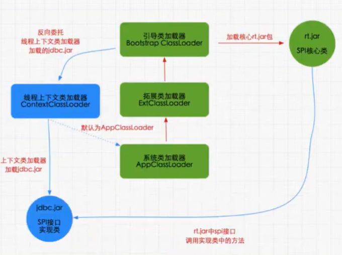

默认上下文加载器就是应用类加载器，这样以上下文加载器为中介，使得启动类加载器中的代码也可以访问应用类加载器中的类。

**第三次破坏双亲委派机制**
双亲委派模型的第三次“被破坏”是由于用户对程序动态性的追求而导致的。如：**代码热替换(Hot Swap)、模块热部署(Hot Deployment)**等
IBM公司主导的JSR-291(即OSGiR4.2)实现模块化热部署的关键是它自定义的类加载器机制的实现，每一个程序模块(osGi中称为Bundle)都有一个自己的类加载器，当需要更换一个Bundle时，就把Bund1e连同类加载器一起换掉以实现代码的热替换。在oSGi环境下，类加载器不再双亲委派模型推荐的树状结构，而是进一步发展为更加复杂的网状结构。
当收到类加载请求时，OSGi将按照下面的顺序进行类搜索：
1）**将以java.*开头的类，委派给父类加载器加载。**
2）**否则，将委派列表名单内的类，委派给父类加载器加载。**
3）否则，将Import列表中的类，委派给Export这个类的Bundle的类加载器加载。
4）否则，查找当前Bundle的ClassPath，使用自己的类加载器加载。
5）否则，查找类是否在自己的Fragment Bundle中，如果在，则委派给Fragment Bundle的类加载器加载。
6）否则，查找Dynamic Import列表的Bundle，委派给对应Bund1e的类加载器加载。
7）否则，类查找失败。
说明：只有开头两点仍然符合双亲委派模型的原则，其余的类查找都是在平级的类加载器中进行的
小结：这里，我们使用了“被破坏”这个词来形容上述不符合双亲委派模型原则的行为，但这里“被破坏”并不一定是带有贬义的。只要有明确的目的和充分的理由，突破旧有原则无疑是一种创新。
正如：OSGi中的类加载器的设计不符合传统的双亲委派的类加载器架构，且业界对其为了实现热部署而带来的额外的高复杂度还存在不少争议，但对这方面有了解的技术人员基本还是能达成一个共识，认为**OSGi中对类加载器的运用是值得学习的，完全弄懂了OSGi的实现，就算是掌握了类加载器的精粹。**

### 4.5.4. 热替换的实现
热替换是指在程序的运行过程中，不停止服务，只通过替换程序文件来修改程序的行为。热替换的关键需求在于服务不能中断，修改必须立即表现正在运行的系统之中。基本上大部分脚本语言都是天生支持热替换的，比如：PHP，只要替换了PHP源文件，这种改动就会立即生效，而无需重启Web服务器。
但对Java来说，热替换并非天生就支持，如果一个类已经加载到系统中，通过修改类文件，并无法让系统再来加载并重定义这个类。因此，在Java中实现这一功能的一个可行的方法就是灵活运用ClassLoader。
注意：由不同ClassLoader加载的同名类属于不同的类型，不能相互转换和兼容。即两个不同的ClassLoader加载同一个类，在虚拟机内部，会认为这2个类是完全不同的。
根据这个特点，可以用来模拟热替换的实现，基本思路如下图所示：
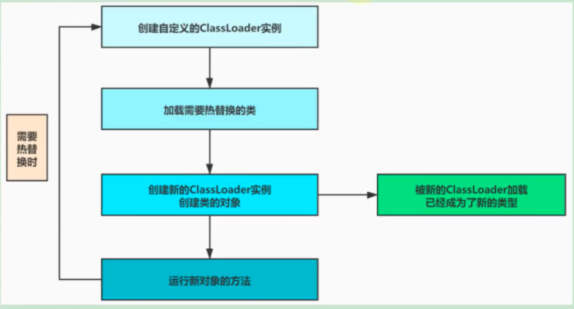

---

## 4.6. 沙箱安全机制
沙箱安全机制

- 保证程序安全
- 保护Java原生的JDK代码

**Java安全模型的核心就是Java沙箱（sandbox）**。什么是沙箱？沙箱是一个限制程序运行的环境。
沙箱机制就是将Java代码**限定在虚拟机（JVM）特定的运行范围中，并且严格限制代码对本地系统资源访问**。通过这样的措施来保证对代码的有限隔离，防止对本地系统造成破坏。
沙箱主要限制系统资源访问，那系统资源包括什么？CPU、内存、文件系统、网络。不同级别的沙箱对这些资源访问的限制也可以不一样。
所有的Java程序运行都可以指定沙箱，可以定制安全策略。
### 4.6.1. JDK1.0时期
在Java中将执行程序分成本地代码和远程代码两种，本地代码默认视为可信任的，而远程代码则被看作是不受信的。对于授信的本地代码，可以访问一切本地资源。而对于非授信的远程代码在早期的Java实现中，安全依赖于**沙箱（Sandbox）机制**。如下图所示JDK1.0安全模型

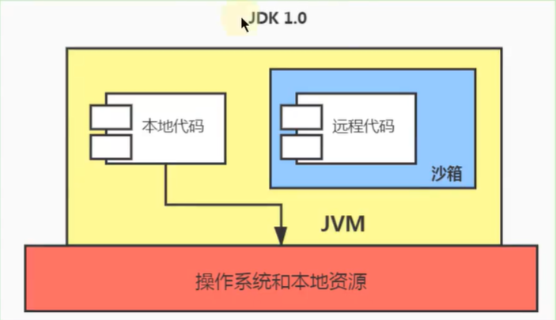
### 4.6.2. JDK1.1时期
JDK1.0中如此严格的安全机制也给程序的功能扩展带来障碍，比如当用户希望远程代码访问本地系统的文件时候，就无法实现。
因此在后续的Java1.1版本中，针对安全机制做了改进，增加了**安全策略**。允许用户指定代码对本地资源的访问权限。
如下图所示JDK1.1安全模型
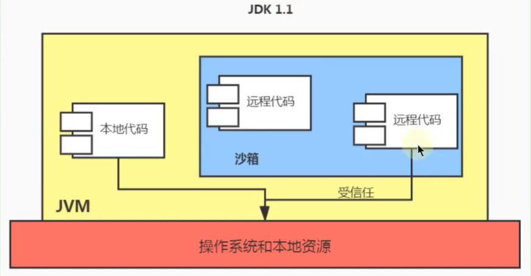
### 4.6.3. JDK1.2时期
在Java1.2版本中，再次改进了安全机制，增加了**代码签名**。不论本地代码或是远程代码，都会按照用户的安全策略设定，由类加载器加载到虚拟机中权限不同的运行空间，来实现差异化的代码执行权限控制。如下图所示JDK1.2安全模型：
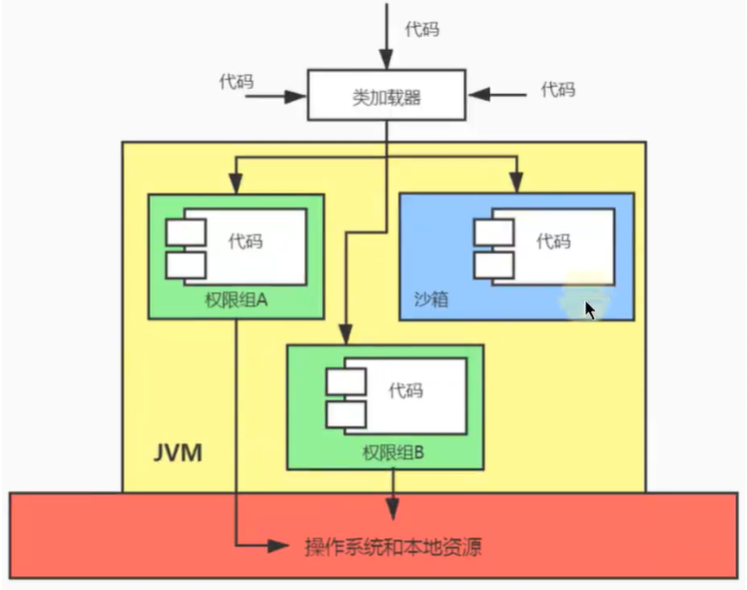

### 4.6.4. JDK1.6时期
当前最新的安全机制实现，则引入了**域（Domain）**的概念。
虚拟机会把所有代码加载到不同的系统域和应用域。**系统域部分专门负责与关键资源进行交互**，而各个应用域部分则通过系统域的部分代理来对各种需要的资源进行访问。虚拟机中不同的受保护域（Protected Domain），对应不一样的权限（Permission）。存在于不同域中的类文件就具有了当前域的全部权限，如下图所示，最新的安全模型（jdk1.6）

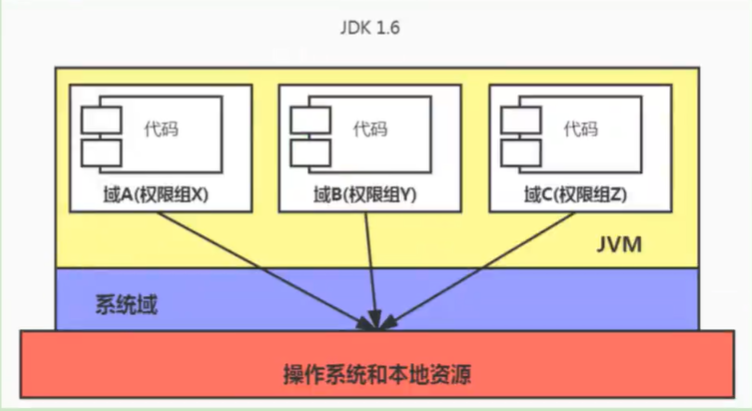

---

## 4.7. 自定义类的加载器
### 4.7.1. 为什么要自定义类加载器？

- ** 隔离加载类**
在某些框架内进行中间件与应用的模块隔离，把类加载到不同的环境。比如:阿里内某容器框架通过自定义类加载器确保应用中依赖的jar包不会影响到中间件运行时使用的jar包。再比如:Tomcat这类Web应用服务器，内部自定义了好几种类加载器，用于隔离同一个Web应用服务器上的不同应用程序。 
-  **修改类加载的方式**
类的加载模型并非强制，除Bootstrap外，其他的加载并非一定要引入，或者根据实际情况在某个时间点进行按需进行动态加载 
-  **扩展加载源**
比如从数据库、网络、甚至是电视机机顶盒进行加载 
-  **防止源码泄漏**
Java代码容易被编译和篡改，可以进行编译加密。那么类加载也需要自定义，还原加密的字节码。 

**常见的场景**

- 实现类似进程内隔离，类加载器实际上用作不同的命名空间，以提供类似容器、模块化的效果。例如，两个模块依赖于某个类库的不同版本，如果分别被不同的容器加载，就可以互不干扰。这个方面的集大成者是JavaEE和OSGI、JPMS等框架。
- 应用需要从不同的数据源获取类定义信息，例如网络数据源，而不是本地文件系统。或者是需要自己操纵字节码，动态修改或者生成类型。

**注意**
在一般情况下，使用不同的类加载器去加载不同的功能模块，会提高应用程序的安全性。但是，如果涉及Java类型转换，则加载器反而容易产生不美好的事情。在做Java类型转换时，只有两个类型都是由同一个加载器所加载，才能进行类型转换，否则转换时会发生异常。

### 4.7.2. 实现方式
Java提供了抽象类java.lang.ClassLoader，所有用户自定义的类加载器都应该继承ClassLoader类。
在自定义ClassLoader的子类时候，我们常见的会有两种做法:

- 方式一:重写loadClass()方法
- 方式二:重写findclass()方法

**对比**

- 这两种方法本质上差不多，毕竟loadClass()也会调用findClass()，但是从逻辑上讲我们最好不要直接修改loadClass()的内部逻辑。建议的做法是只在findClass()里重写自定义类的加载方法，根据参数指定类的名字，返回对应的Class对象的引用。
- loadclass()这个方法是实现双亲委派模型逻辑的地方，擅自修改这个方法会导致模型被破坏，容易造成问题。**因此我们最好是在双亲委派模型框架内进行小范围的改动，不破坏原有的稳定结构。**同时，也避免了自己重写loadClass()方法的过程中必须写双亲委托的重复代码，从代码的复用性来看，不直接修改这个方法始终是比较好的选择。
- 当编写好自定义类加载器后，便可以在程序中调用loadClass()方法来实现类加载操作。

**说明**

- 其父类加载器是系统类加载器
- JVM中的所有类加载都会使用java.lang.ClassLoader.loadClass(String)接口(自定义类加载器并重写java.lang.ClassLoader.loadClass(String)接口的除外)，连JDK的核心类库也不能例外。
## 4.8. Java9新特性
为了保证兼容性，JDK9没有从根本上改变三层类加载器架构和双亲委派模型，但为了模块化系统的顺利运行，仍然发生了一些值得被注意的变动。

1.  扩展机制被移除，扩展类加载器由于向后兼容性的原因被保留，不过被重命名为平台类加载器(platform class loader)。可以通过classLoader的新方法getPlatformClassLoader()来获取。
JDK9时基于模块化进行构建(原来的rt.jar和tools.jar被拆分成数十个JMOD文件)，其中的Java类库就已天然地满足了可扩展的需求，那自然无须再保留<JAVA_HOME>\lib\ext目录，此前使用这个目录或者java.ext.dirs系统变量来扩展JDK功能的机制已经没有继续存在的价值了。 
2.  平台类加载器和应用程序类加载器都不再继承自java.net.URLClassLoader。
现在启动类加载器、平台类加载器、应用程序类加载器全都继承于jdk.internal.loader.BuiltinClassLoader。 

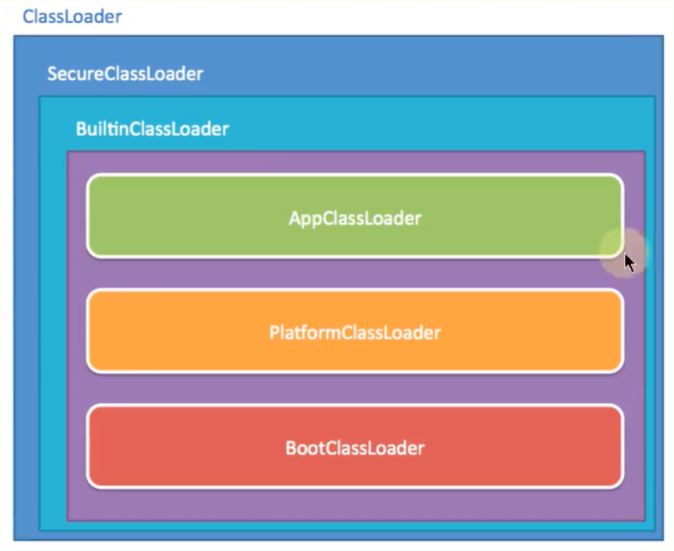
```
	如果有程序直接依赖了这种继承关系，或者依赖了URLClassLoader类的特定方法，那代码很可能会在JDK9及更高版本的JDK中崩溃。
```

3. 在Java9中，类加载器有了名称。该名称在构造方法中指定，可以通过getName()方法来获取。平台类加载器的名称是platform，应用类加载器的名称是app。类加载器的名称在调试与类加载器相关的问题时会非常有用。
4. 启动类加载器现在是在jvm内部和java类库共同协作实现的类加载器（以前是C++实现），但为了与之前代码兼容，在获取启动类加载器的场景中仍然会返回null，而不会得到BootClassLoader实例。
5. 类加载的委派关系也发生了变动。当平台及应用程序类加载器收到类加载请求，在委派给父加载器加载前，要先判断该类是否能够归属到某一个系统模块中，如果可以找到这样的归属关系，就要优先委派给负责那个模块的加载器完成加载。

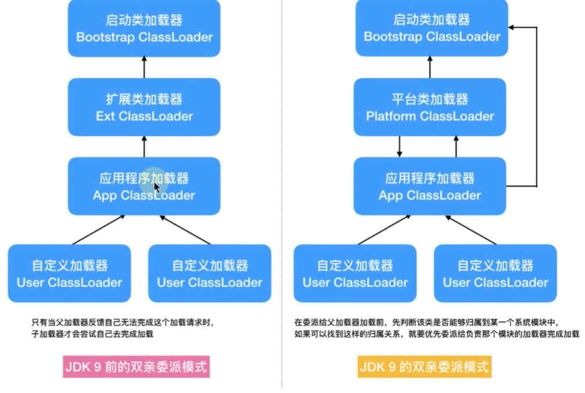

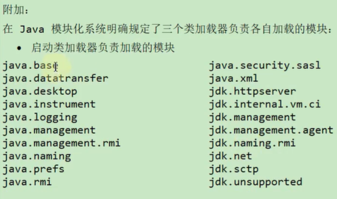

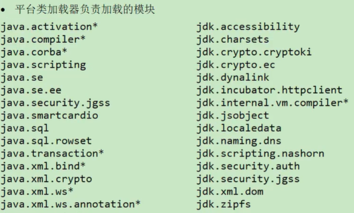

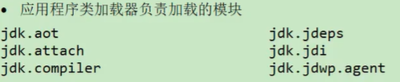

**代码：**
```java
public class ClassLoaderTest {
    public static void main(String[] args) {
        System.out.println(ClassLoaderTest.class.getClassLoader());
        System.out.println(ClassLoaderTest.class.getClassLoader().getParent());
        System.out.println(ClassLoaderTest.class.getClassLoader().getParent().getParent());

        //获取系统类加载器
        System.out.println(ClassLoader.getSystemClassLoader());
        //获取平台类加载器
        System.out.println(ClassLoader.getPlatformClassLoader());
        //获取类的加载器的名称
        System.out.println(ClassLoaderTest.class.getClassLoader().getName());
    }
}
```