# 一、 概述
## 1.1. 大厂面试题
> 支付宝：
> 支付宝三面：JVM性能调优都做了什么？
>
> 小米：
> 有做过JVM内存优化吗？
> 从SQL、JVM、架构、数据库四个方面讲讲优化思路
>
> 蚂蚁金服：
> JVM的编译优化
> jvm性能调优都做了什么
> JVM诊断调优工具用过哪些？
> 二面：jvm怎样调优，堆内存、栈空间设置多少合适
> 三面：JVM相关的分析工具使用过的有哪些？具体的性能调优步骤如何
>
> 阿里：
> 如何进行JVM调优？有哪些方法？
> 如何理解内存泄漏问题？有哪些情况会导致内存泄漏？如何解决？
>
> 字节跳动：
> 三面：JVM如何调优、参数怎么调？
>
> 拼多多：
> 从SQL、JVM、架构、数据库四个方面讲讲优化思路
>
> 京东：
> JVM诊断调优工具用过哪些？
> 每秒几十万并发的秒杀系统为什么会频繁发生GC？
> 日均百万级交易系统如何优化JVM？
> 线上生产系统OOM如何监控及定位与解决？
> 高并发系统如何基于G1垃圾回收器优化性能？


## 1.2. 背景说明
**生产环境中的问题**

- 生产环境发生了内存溢出该如何处理？
- 生产环境应该给服务器分配多少内存合适？
- 如何对垃圾回收器的性能进行调优？
- 生产环境CPU负载飙高该如何处理？
- 生产环境应该给应用分配多少线程合适？
- 不加log，如何确定请求是否执行了某一行代码？
- 不加log，如何实时查看某个方法的入参与返回值？

**为什么要调优**

- 防止出现OOM
- 解决OOM
- 减少Full GC出现的频率

**不同阶段的考虑**

- 上线前
- 项目运行阶段
- 线上出现OOM

## 1.3. 调优概述
**监控的依据**

- 运行日志
- 异常堆栈
- GC日志
- 线程快照
- 堆转储快照

**调优的大方向**

- 合理地编写代码
- 充分并合理的使用硬件资源
- 合理地进行JVM调优

## 1.4. 性能优化的步骤
**第1步：性能监控**

- GC频繁
- cpu load过高
- OOM
- 内存泄露
- 死锁
- 程序响应时间较长

**第2步：性能分析**

- 打印GC日志，通过GCviewer或者 [http://gceasy.io](http://gceasy.io) 来分析异常信息
- 灵活运用命令行工具、jstack、jmap、jinfo等
- dump出堆文件，使用内存分析工具分析文件
- 使用阿里Arthas、jconsole、JVisualVM来实时查看JVM状态
- jstack查看堆栈信息

**第3步：性能调优**

- 适当增加内存，根据业务背景选择垃圾回收器
- 优化代码，控制内存使用
- 增加机器，分散节点压力
- 合理设置线程池线程数量
- 使用中间件提高程序效率，比如缓存、消息队列等
- 其他……

## 1.5. 性能评价/测试指标
**停顿时间（或响应时间）**
提交请求和返回该请求的响应之间使用的时间，一般比较关注平均响应时间。常用操作的响应时间列表：

| 操作                               | 响应时间 |
| ---------------------------------- | -------- |
| 打开一个站点                       | 几秒     |
| 数据库查询一条记录（有索引）       | 十几毫秒 |
| 机械磁盘一次寻址定位               | 4毫秒    |
| 从机械磁盘顺序读取1M数据           | 2毫秒    |
| 从SSD磁盘顺序读取1M数据            | 0.3毫秒  |
| 从远程分布式换成Redis 读取一个数据 | 0.5毫秒  |
| 从内存读取 1M数据                  | 十几微妙 |
| Java程序本地方法调用               | 几微妙   |
| 网络传输2Kb数据                    | 1 微妙   |


在垃圾回收环节中：

- 暂停时间：执行垃圾收集时，程序的工作线程被暂停的时间。
- -XX:MaxGCPauseMillis

**吞吐量**

- 对单位时间内完成的工作量（请求）的量度
- 在GC中：运行用户代码的事件占总运行时间的比例（总运行时间：程序的运行时间+内存回收的时间）
- 吞吐量为1-1/(1+n)，其中-XX::GCTimeRatio=n

**并发数**

- 同一时刻，对服务器有实际交互的请求数

**内存占用**

- Java堆区所占的内存大小

**相互间的关系**
以高速公路通行状况为例

- 吞吐量：每天通过高速公路收费站的车辆的数据
- 并发数：高速公路上正在行驶的车辆的数目
- 响应时间：车速

# 二、 JVM监控及诊断工具-命令行篇
## 2.1. 概述
性能诊断是软件工程师在日常工作中需要经常面对和解决的问题，在用户体验至上的今天，解决好应用的性能问题能带来非常大的收益。
Java 作为最流行的编程语言之一，其应用性能诊断一直受到业界广泛关注。可能造成 Java 应用出现性能问题的因素非常多，例如线程控制、磁盘读写、数据库访问、网络I/O、垃圾收集等。想要定位这些问题，一款优秀的性能诊断工具必不可少。
**体会1：使用数据说明问题，使用知识分析问题，使用工具处理问题。**
**体会2：无监控、不调优！**
**简单命令行工具**
在我们刚接触java学习的时候，大家肯定最先了解的两个命令就是javac，java，那么除此之外，还有没有其他的命令可以供我们使用呢？
我们进入到安装jdk的bin目录，发现还有一系列辅助工具。这些辅助工具用来获取目标 JVM 不同方面、不同层次的信息，帮助开发人员很好地解决Java应用程序的一些疑难杂症。

官方源码地址：[http://hg.openjdk.java.net/jdk/jdk11/file/1ddf9a99e4ad/src/jdk.jcmd/share/classes/sun/tools](http://hg.openjdk.java.net/jdk/jdk11/file/1ddf9a99e4ad/src/jdk.jcmd/share/classes/sun/tools)

## 2.2. jps：查看Java进程
jps(Java Process Status)：显示指定系统内所有的HotSpot虚拟机进程（查看虚拟机进程信息），可用于查询正在运行的虚拟机进程。
说明：对于本地虚拟机进程来说，进程的本地虚拟机ID与操作系统的进程ID是一致的，是唯一的。
基本使用语法为：jps [options] [hostid]
我们还可以通过追加参数，来打印额外的信息。

**options参数**

- -q：仅仅显示LVMID（local virtual machine id），即本地虚拟机唯一id。不显示主类的名称等
- -l：输出应用程序主类的全类名 或 如果进程执行的是jar包，则输出jar完整路径
- -m：输出虚拟机进程启动时传递给主类main()的参数
- -v：列出虚拟机进程启动时的JVM参数。比如：-Xms20m -Xmx50m是启动程序指定的jvm参数。

说明：以上参数可以综合使用。
补充：如果某 Java 进程关闭了默认开启的UsePerfData参数（即使用参数-XX：-UsePerfData），那么jps命令（以及下面介绍的jstat）将无法探知该Java 进程。

**hostid参数**
RMI注册表中注册的主机名。如果想要远程监控主机上的 java 程序，需要安装 jstatd。
对于具有更严格的安全实践的网络场所而言，可能使用一个自定义的策略文件来显示对特定的可信主机或网络的访问，尽管这种技术容易受到IP地址欺诈攻击。
如果安全问题无法使用一个定制的策略文件来处理，那么最安全的操作是不运行jstatd服务器，而是在本地使用jstat和jps工具。

## 2.3. jstat：查看JVM统计信息
jstat（JVM Statistics Monitoring Tool）：用于监视虚拟机各种运行状态信息的命令行工具。它可以显示本地或者远程虚拟机进程中的类装载、内存、垃圾收集、JIT编译等运行数据。在没有GUI图形界面，只提供了纯文本控制台环境的服务器上，它将是运行期定位虚拟机性能问题的首选工具。常用于检测垃圾回收问题以及内存泄漏问题。
官方文档：[https://docs.oracle.com/javase/8/docs/technotes/tools/unix/jstat.html](https://docs.oracle.com/javase/8/docs/technotes/tools/unix/jstat.html)
基本使用语法为：jstat -<option> [-t] [-h<lines>] <vmid> [<interval> [<count>]]
查看命令相关参数：jstat-h 或 jstat-help
其中vmid是进程id号，也就是jps之后看到的前面的号码。

**option参数**
选项option可以由以下值构成。
类装载相关的：

- -class：显示ClassLoader的相关信息：类的装载、卸载数量、总空间、类装载所消耗的时间等

垃圾回收相关的：

- -gc：显示与GC相关的堆信息。包括Eden区、两个Survivor区、老年代、永久代等的容量、已用空间、GC时间合计等信息。
- -gccapacity：显示内容与-gc基本相同，但输出主要关注Java堆各个区域使用到的最大、最小空间。
- -gcutil：显示内容与-gc基本相同，但输出主要关注已使用空间占总空间的百分比。
- -gccause：与-gcutil功能一样，但是会额外输出导致最后一次或当前正在发生的GC产生的原因。
- -gcnew：显示新生代GC状况
- -gcnewcapacity：显示内容与-gcnew基本相同，输出主要关注使用到的最大、最小空间
- -geold：显示老年代GC状况
- -gcoldcapacity：显示内容与-gcold基本相同，输出主要关注使用到的最大、最小空间
- -gcpermcapacity：显示永久代使用到的最大、最小空间。

JIT相关的：

- -compiler：显示JIT编译器编译过的方法、耗时等信息
- -printcompilation：输出已经被JIT编译的方法

**jstat -class** - 类装载情况


> 加载的类数量，类字节数，卸载的类数量，卸载的类字节数，使用的时间(毫秒)


**jstat -compiler**


> 已编译,失败,无效的,时间,失败的类型,失败的方法


**jstat -printcompilation**
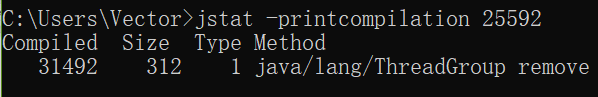

> 已编译,大小,类型,方法


**jstat -gc**


**jstat -gccapacity**


**jstat -gcutil**


**jstat -gccause**


**jstat -gcnew**


**jstat -gcnewcapacity**


**jstat -gcold**


**jstat -gcoldcapacity**


**jstat -t**


**jstat -t -h**


| 表头 | 含义（字节）                                    |
| ---- | ----------------------------------------------- |
| EC   | Eden区的大小                                    |
| EU   | Eden区已使用的大小                              |
| S0C  | 幸存者0区的大小                                 |
| S1C  | 幸存者1区的大小                                 |
| S0U  | 幸存者0区已使用的大小                           |
| S1U  | 幸存者1区已使用的大小                           |
| MC   | 元空间的大小                                    |
| MU   | 元空间已使用的大小                              |
| OC   | 老年代的大小                                    |
| OU   | 老年代已使用的大小                              |
| CCSC | 压缩类空间的大小                                |
| CCSU | 压缩类空间已使用的大小                          |
| YGC  | 从应用程序启动到采样时young gc的次数            |
| YGCT | 从应用程序启动到采样时young gc消耗时间（秒）    |
| FGC  | 从应用程序启动到采样时full gc的次数             |
| FGCT | 从应用程序启动到采样时的full gc的消耗时间（秒） |
| GCT  | 从应用程序启动到采样时gc的总时间                |


**interval参数：** 用于指定输出统计数据的周期，单位为毫秒。即：查询间隔
**count参数：** 用于指定查询的总次数
**-t参数：** 可以在输出信息前加上一个Timestamp列，显示程序的运行时间。单位：秒
**-h参数：** 可以在周期性数据输出时，输出多少行数据后输出一个表头信息
**补充：** jstat还可以用来判断是否出现内存泄漏。

第1步：在长时间运行的 Java 程序中，我们可以运行jstat命令连续获取多行性能数据，并取这几行数据中 OU 列（即已占用的老年代内存）的最小值。
第2步：然后，我们每隔一段较长的时间重复一次上述操作，来获得多组 OU 最小值。如果这些值呈上涨趋势，则说明该 Java 程序的老年代内存已使用量在不断上涨，这意味着无法回收的对象在不断增加，因此很有可能存在内存泄漏。

## 2.4. jinfo：查看和修改JVM参数
jinfo(Configuration Info for Java)：查看虚拟机配置参数信息，也可用于调整虚拟机的配置参数。在很多情况卡，Java应用程序不会指定所有的Java虚拟机参数。而此时，开发人员可能不知道某一个具体的Java虚拟机参数的默认值。在这种情况下，可能需要通过查找文档获取某个参数的默认值。这个查找过程可能是非常艰难的。但有了jinfo工具，开发人员可以很方便地找到Java虚拟机参数的当前值。

基本使用语法为：jinfo [options] pid

说明：java 进程ID必须要加上

| **选项**         | **选项说明**                                                 |
| ---------------- | ------------------------------------------------------------ |
| no option        | 输出全部的参数和系统属性                                     |
| -flag name       | 输出对应名称的参数                                           |
| -flag [+-]name   | 开启或者关闭对应名称的参数 只有被标记为manageable的参数才可以被动态修改 |
| -flag name=value | 设定对应名称的参数                                           |
| -flags           | 输出全部的参数                                               |
| -sysprops        | 输出系统属性                                                 |


**jinfo -sysprops**
```properties
> jinfo -sysprops
jboss.modules.system.pkgs = com.intellij.rt
java.vendor = Oracle Corporation
sun.java.launcher = SUN_STANDARD
sun.management.compiler = HotSpot 64-Bit Tiered Compilers
catalina.useNaming = true
os.name = Windows 10
...
```

**jinfo -flags**
```shell
> jinfo -flags 25592
Non-default VM flags: -XX:CICompilerCount=4 -XX:InitialHeapSize=333447168 -XX:MaxHeapSize=5324668928 -XX:MaxNewSize=1774714880 -XX:MinHeapDeltaBytes=524288 -XX:NewSize=111149056 -XX:OldSize=222298112 -XX:+UseCompressedClassPointers -XX:+UseCompressedOops -XX:+UseFastUnorderedTimeStamps -XX:-UseLargePagesIndividualAllocation -XX:+UseParallelGC
Command line:  -agentlib:jdwp=transport=dt_socket,address=127.0.0.1:8040,suspend=y,server=n -Drebel.base=C:\Users\Vector\.jrebel -Drebel.env.ide.plugin.version=2021.1.2 -Drebel.env.ide.version=2020.3.3 -Drebel.env.ide.product=IU -Drebel.env.ide=intellij -Drebel.notification.url=http://localhost:7976 -agentpath:C:\Users\Vector\AppData\Roaming\JetBrains\IntelliJIdea2020.3\plugins\jr-ide-idea\lib\jrebel6\lib\jrebel64.dll -Dmaven.home=D:\eclipse\env\maven -Didea.modules.paths.file=C:\Users\Vector\AppData\Local\JetBrains\IntelliJIdea2020.3\Maven\idea-projects-state-596682c7.properties -Dclassworlds.conf=C:\Users\Vector\AppData\Local\Temp\idea-6755-mvn.conf -Dmaven.ext.class.path=D:\IDEA\plugins\maven\lib\maven-event-listener.jar -javaagent:D:\IDEA\plugins\java\lib\rt\debugger-agent.jar -Dfile.encoding=UTF-8
```

**jinfo -flag**
```shell
> jinfo -flag UseParallelGC 25592
-XX:+UseParallelGC

> jinfo -flag UseG1GC 25592
-XX:-UseG1GC
```

**jinfo -flag name**
```shell
> jinfo -flag UseParallelGC 25592
-XX:+UseParallelGC

> jinfo -flag UseG1GC 25592
-XX:-UseG1GC
```

**jinfo -flag [+-]name**
```shell
> jinfo -flag +PrintGCDetails 25592
> jinfo -flag PrintGCDetails 25592
-XX:+PrintGCDetails

> jinfo -flag -PrintGCDetails 25592
> jinfo -flag PrintGCDetails 25592
-XX:-PrintGCDetails
```

拓展：

- java -XX:+PrintFlagsInitial 查看所有JVM参数启动的初始值
```shell
[Global flags]
     intx ActiveProcessorCount                      = -1                                  {product}
    uintx AdaptiveSizeDecrementScaleFactor          = 4                                   {product}
    uintx AdaptiveSizeMajorGCDecayTimeScale         = 10                                  {product}
    uintx AdaptiveSizePausePolicy                   = 0                                   {product}
...
```

- java -XX:+PrintFlagsFinal 查看所有JVM参数的最终值
```shell
[Global flags]
     intx ActiveProcessorCount                      = -1                                  {product}
...
     intx CICompilerCount                          := 4                                   {product}
    uintx InitialHeapSize                          := 333447168                           {product}
    uintx MaxHeapSize                              := 1029701632                          {product}
    uintx MaxNewSize                               := 1774714880                          {product}
```

- java -XX:+PrintCommandLineFlags 查看哪些已经被用户或者JVM设置过的详细的XX参数的名称和值
```shell
-XX:InitialHeapSize=332790016 -XX:MaxHeapSize=5324640256 -XX:+PrintCommandLineFlags -XX:+UseCompressedClassPointers -XX:+UseCompressedOops -XX:-UseLargePagesIndividualAllocation -XX:+UseParallelGC
```

## 2.5. jmap：查看和导出堆映像文件
jmap（JVM Memory Map）：作用一方面是获取dump文件（堆转储快照文件，二进制文件），它还可以获取目标Java进程的内存相关信息，包括Java堆各区域的使用情况、堆中对象的统计信息、类加载信息等。开发人员可以在控制台中输入命令“jmap -help”查阅jmap工具的具体使用方式和一些标准选项配置。
官方帮助文档：[https://docs.oracle.com/en/java/javase/11/tools/jmap.html](https://docs.oracle.com/en/java/javase/11/tools/jmap.html)
基本使用语法为：

- jmap [option] <pid>
- jmap [option] <executable <core>
- jmap [option] [server_id@] <remote server IP or hostname>
| 选项           | 作用                                                         |
| -------------- | ------------------------------------------------------------ |
| -dump          | 生成dump文件（Java堆转储快照），-dump:live只保存堆中的存活对象 |
| -heap          | 输出整个堆空间的详细信息，包括GC的使用、堆配置信息，以及内存的使用信息等 |
| -histo         | 输出堆空间中对象的统计信息，包括类、实例数量和合计容量，-histo:live只统计堆中的存活对象 |
| -J <flag>      | 传递参数给jmap启动的jvm                                      |
| -finalizerinfo | 显示在F-Queue中等待Finalizer线程执行finalize方法的对象，仅linux/solaris平台有效 |
| -permstat      | 以ClassLoader为统计口径输出永久代的内存状态信息，仅linux/solaris平台有效 |
| -F             | 当虚拟机进程对-dump选项没有任何响应时，强制执行生成dump文件，仅linux/solaris平台有效 |

说明：这些参数和linux下输入显示的命令多少会有不同，包括也受jdk版本的影响。
```shell
> jmap -dump:format=b,file=<filename.hprof> <pid>
> jmap -dump:live,format=b,file=<filename.hprof> <pid>
```
由于jmap将访问堆中的所有对象，为了保证在此过程中不被应用线程干扰，jmap需要借助安全点机制，让所有线程停留在不改变堆中数据的状态。也就是说，由jmap导出的堆快照必定是安全点位置的。这可能导致基于该堆快照的分析结果存在偏差。
举个例子，假设在编译生成的机器码中，某些对象的生命周期在两个安全点之间，那么:live选项将无法探知到这些对象。
另外，如果某个线程长时间无法跑到安全点，jmap将一直等下去。与前面讲的jstat则不同，垃圾回收器会主动将jstat所需要的摘要数据保存至固定位置之中，而jstat只需直接读取即可。

## 2.6. jhat：dump分析工具
jhat(JVM Heap Analysis Tool)：Sun JDK提供的jhat命令与jmap命令搭配使用，用于分析jmap生成的heap dump文件（堆转储快照）。jhat内置了一个微型的HTTP/HTML服务器，生成dump文件的分析结果后，用户可以在浏览器中查看分析结果（分析虚拟机转储快照信息）。
使用了jhat命令，就启动了一个http服务，端口是7000，即http://localhost:7000/，就可以在浏览器里分析。
说明：jhat命令在JDK9、JDK10中已经被删除，官方建议用VisualVM代替。
基本适用语法：jhat <option> <dumpfile>

| **option参数**         | **作用**                               |
| ---------------------- | -------------------------------------- |
| -stack false｜true     | 关闭｜打开对象分配调用栈跟踪           |
| -refs false｜true      | 关闭｜打开对象引用跟踪                 |
| -port port-number      | 设置jhat HTTP Server的端口号，默认7000 |
| -exclude exclude-file  | 执行对象查询时需要排除的数据成员       |
| -baseline exclude-file | 指定一个基准堆转储                     |
| -debug int             | 设置debug级别                          |
| -version               | 启动后显示版本信息就退出               |
| -J <flag>              | 传入启动参数，比如-J-Xmx512m           |


## 2.7. jstack：打印线程快照
jstack（JVM Stack Trace）：用于生成虚拟机指定进程当前时刻的线程快照（虚拟机堆栈跟踪）。线程快照就是当前虚拟机内指定进程的每一条线程正在执行的方法堆栈的集合。
生成线程快照的作用：可用于定位线程出现长时间停顿的原因，如线程间死锁、死循环、请求外部资源导致的长时间等待等问题。这些都是导致线程长时间停顿的常见原因。当线程出现停顿时，就可以用jstack显示各个线程调用的堆栈情况。
官方帮助文档：[https://docs.oracle.com/en/java/javase/11/tools/jstack.html](https://docs.oracle.com/en/java/javase/11/tools/jstack.html)
在thread dump中，要留意下面几种状态

- 死锁，Deadlock（重点关注）
- 等待资源，Waiting on condition（重点关注）
- 等待获取监视器，Waiting on monitor entry（重点关注）
- 阻塞，Blocked（重点关注）
- 执行中，Runnable
- 暂停，Suspended
- 对象等待中，Object.wait() 或 TIMED＿WAITING
- 停止，Parked
| option参数 | 作用                                         |
| ---------- | -------------------------------------------- |
| -F         | 当正常输出的请求不被响应时，强制输出线程堆栈 |
| -l         | 除堆栈外，显示关于锁的附加信息               |
| -m         | 如果调用本地方法的话，可以显示C/C++的堆栈    |


## 2.8. jcmd：多功能命令行
在JDK 1.7以后，新增了一个命令行工具jcmd。它是一个多功能的工具，可以用来实现前面除了jstat之外所有命令的功能。比如：用它来导出堆、内存使用、查看Java进程、导出线程信息、执行GC、JVM运行时间等。
官方帮助文档：[https://docs.oracle.com/en/java/javase/11/tools/jcmd.html](https://docs.oracle.com/en/java/javase/11/tools/jcmd.html)
jcmd拥有jmap的大部分功能，并且在Oracle的官方网站上也推荐使用jcmd命令代jmap命令
**jcmd -l：**列出所有的JVM进程
**jcmd 进程号 help：**针对指定的进程，列出支持的所有具体命令

**jcmd 进程号 具体命令：**显示指定进程的指令命令的数据

- Thread.print 可以替换 jstack指令
- GC.class_histogram 可以替换 jmap中的-histo操作
- GC.heap_dump 可以替换 jmap中的-dump操作
- GC.run 可以查看GC的执行情况
- VM.uptime 可以查看程序的总执行时间，可以替换jstat指令中的-t操作
- VM.system_properties 可以替换 jinfo -sysprops 进程id
- VM.flags 可以获取JVM的配置参数信息

## 2.9. jstatd：远程主机信息收集
之前的指令只涉及到监控本机的Java应用程序，而在这些工具中，一些监控工具也支持对远程计算机的监控（如jps、jstat）。为了启用远程监控，则需要配合使用jstatd 工具。命令jstatd是一个RMI服务端程序，它的作用相当于代理服务器，建立本地计算机与远程监控工具的通信。jstatd服务器将本机的Java应用程序信息传递到远程计算机。

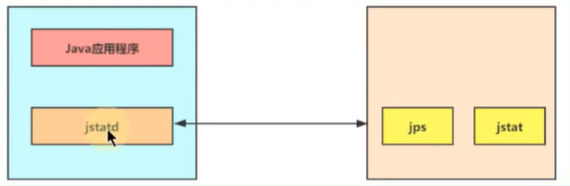


# 三、 JVM监控及诊断工具-GUI篇
## 3.1. 概述
使用上一章命令行工具或组合能帮您获取目标Java应用性能相关的基础信息，但它们存在下列局限：

- 无法获取方法级别的分析数据，如方法间的调用关系、各方法的调用次数和调用时间等（这对定位应用性能瓶颈至关重要）。
- 要求用户登录到目标 Java 应用所在的宿主机上，使用起来不是很方便。
- 分析数据通过终端输出，结果展示不够直观。

为此，JDK提供了一些内存泄漏的分析工具，如jconsole，jvisualvm等，用于辅助开发人员定位问题，但是这些工具很多时候并不足以满足快速定位的需求。所以这里我们介绍的工具相对多一些、丰富一些。
**JDK自带的工具**

-  jconsole：JDK自带的可视化监控工具。查看Java应用程序的运行概况、监控堆信息、永久区（或元空间）使用情况、类加载情况等 
-  Visual VM：Visual VM是一个工具，它提供了一个可视界面，用于查看Java虚拟机上运行的基于Java技术的应用程序的详细信息。 
-  JMC：Java Mission Control，内置Java Flight Recorder。能够以极低的性能开销收集Java虚拟机的性能数据。 

**第三方工具**

-  MAT：MAT（Memory Analyzer Tool）是基于Eclipse的内存分析工具，是一个快速、功能丰富的Java heap分析工具，它可以帮助我们查找内存泄漏和减少内存消耗 
-  JProfiler：商业软件，需要付费。功能强大。 
## 3.2. JConsole
jconsole：从Java5开始，在JDK中自带的java监控和管理控制台。用于对JVM中内存、线程和类等的监控，是一个基于JMX（java management extensions）的GUI性能监控工具。
官方地址：[https://docs.oracle.com/javase/7/docs/technotes/guides/management/jconsole.html](https://docs.oracle.com/javase/7/docs/technotes/guides/management/jconsole.html)
## 3.3. Visual VM
Visual VM是一个功能强大的多合一故障诊断和性能监控的可视化工具。它集成了多个JDK命令行工具，使用Visual VM可用于显示虚拟机进程及进程的配置和环境信息（jps，jinfo），监视应用程序的CPU、GC、堆、方法区及线程的信息（jstat、jstack）等，甚至代替JConsole。在JDK 6 Update 7以后，Visual VM便作为JDK的一部分发布（VisualVM 在JDK／bin目录下）即：它完全免费。
**主要功能：**

- 生成/读取堆内存/线程快照
- 查看JVM参数和系统属性
- 查看运行中的虚拟机进程
- 程序资源的实时监控
- JMX代理连接、远程环境监控、CPU分析和内存分析

官方地址：[https://visualvm.github.io/index.html](https://visualvm.github.io/index.html)
## 3.4. Eclipse MAT
MAT（Memory Analyzer Tool）工具是一款功能强大的Java堆内存分析器。可以用于查找内存泄漏以及查看内存消耗情况。MAT是基于Eclipse开发的，不仅可以单独使用，还可以作为插件的形式嵌入在Eclipse中使用。是一款免费的性能分析工具，使用起来非常方便。
MAT可以分析heap dump文件。在进行内存分析时，只要获得了反映当前设备内存映像的hprof文件，通过MAT打开就可以直观地看到当前的内存信息。一般说来，这些内存信息包含：

- 所有的对象信息，包括对象实例、成员变量、存储于栈中的基本类型值和存储于堆中的其他对象的引用值。
- 所有的类信息，包括classloader、类名称、父类、静态变量等
- GCRoot到所有的这些对象的引用路径
- 线程信息，包括线程的调用栈及此线程的线程局部变量（TLS）

MAT 不是一个万能工具，它并不能处理所有类型的堆存储文件。但是比较主流的厂家和格式，例如Sun，HP，SAP 所采用的 HPROF 二进制堆存储文件，以及 IBM的 PHD 堆存储文件等都能被很好的解析。
最吸引人的还是能够快速为开发人员生成内存泄漏报表，方便定位问题和分析问题。虽然MAT有如此强大的功能，但是内存分析也没有简单到一键完成的程度，很多内存问题还是需要我们从MAT展现给我们的信息当中通过经验和直觉来判断才能发现。
官方地址： [https://www.eclipse.org/mat/downloads.php](https://www.eclipse.org/mat/downloads.php)
## 3.5. JProfiler
在运行Java的时候有时候想测试运行时占用内存情况，这时候就需要使用测试工具查看了。在eclipse里面有 Eclipse Memory Analyzer tool（MAT）插件可以测试，而在IDEA中也有这么一个插件，就是JProfiler。JProfiler 是由 ej-technologies 公司开发的一款 Java 应用性能诊断工具。功能强大，但是收费。
**特点：**

- 使用方便、界面操作友好（简单且强大）
- 对被分析的应用影响小（提供模板）
- CPU，Thread，Memory分析功能尤其强大
- 支持对jdbc，noSql，jsp，servlet，socket等进行分析
- 支持多种模式（离线，在线）的分析
- 支持监控本地、远程的JVM
- 跨平台，拥有多种操作系统的安装版本

**主要功能：**

- 方法调用：对方法调用的分析可以帮助您了解应用程序正在做什么，并找到提高其性能的方法
- 内存分配：通过分析堆上对象、引用链和垃圾收集能帮您修复内存泄露问题，优化内存使用
- 线程和锁：JProfiler提供多种针对线程和锁的分析视图助您发现多线程问题
- 高级子系统：许多性能问题都发生在更高的语义级别上。例如，对于JDBC调用，您可能希望找出执行最慢的SQL语句。JProfiler支持对这些子系统进行集成分析

官网地址：[https://www.ej-technologies.com/products/jprofiler/overview.html](https://www.ej-technologies.com/products/jprofiler/overview.html)
**数据采集方式：**
JProfier数据采集方式分为两种：Sampling（样本采集）和Instrumentation（重构模式）
**Instrumentation**：这是JProfiler全功能模式。在class加载之前，JProfier把相关功能代码写入到需要分析的class的bytecode中，对正在运行的jvm有一定影响。

- 优点：功能强大。在此设置中，调用堆栈信息是准确的。
- 缺点：若要分析的class较多，则对应用的性能影响较大，CPU开销可能很高（取决于Filter的控制）。因此使用此模式一般配合Filter使用，只对特定的类或包进行分析

**Sampling**：类似于样本统计，每隔一定时间（5ms）将每个线程栈中方法栈中的信息统计出来。

- 优点：对CPU的开销非常低，对应用影响小（即使你不配置任何Filter）
- 缺点：一些数据／特性不能提供（例如：方法的调用次数、执行时间）

注：JProfiler本身没有指出数据的采集类型，这里的采集类型是针对方法调用的采集类型。因为JProfiler的绝大多数核心功能都依赖方法调用采集的数据，所以可以直接认为是JProfiler的数据采集类型。
**遥感监测 Telemetries**
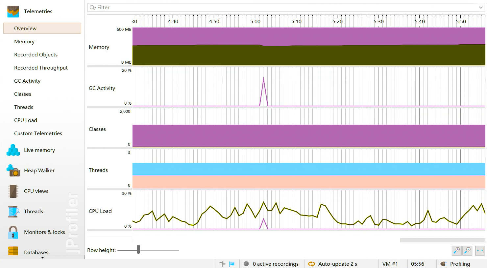

**内存视图 Live Memory**
Live memory 内存剖析：class／class instance的相关信息。例如对象的个数，大小，对象创建的方法执行栈，对象创建的热点。

- **所有对象 All Objects**：显示所有加载的类的列表和在堆上分配的实例数。只有Java 1.5（JVMTI）才会显示此视图。
- **记录对象 Record Objects**：查看特定时间段对象的分配，并记录分配的调用堆栈。
- **分配访问树 Allocation Call Tree**：显示一棵请求树或者方法、类、包或对已选择类有带注释的分配信息的J2EE组件。
- **分配热点 Allocation Hot Spots**：显示一个列表，包括方法、类、包或分配已选类的J2EE组件。你可以标注当前值并且显示差异值。对于每个热点都可以显示它的跟踪记录树。
- **类追踪器 Class Tracker**：类跟踪视图可以包含任意数量的图表，显示选定的类和包的实例与时间。

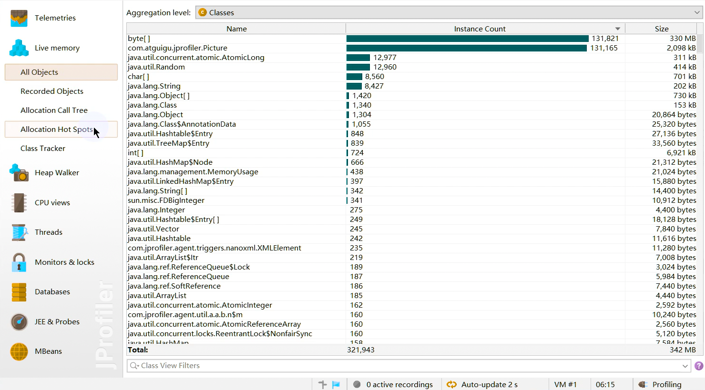


**堆遍历 heap walker**
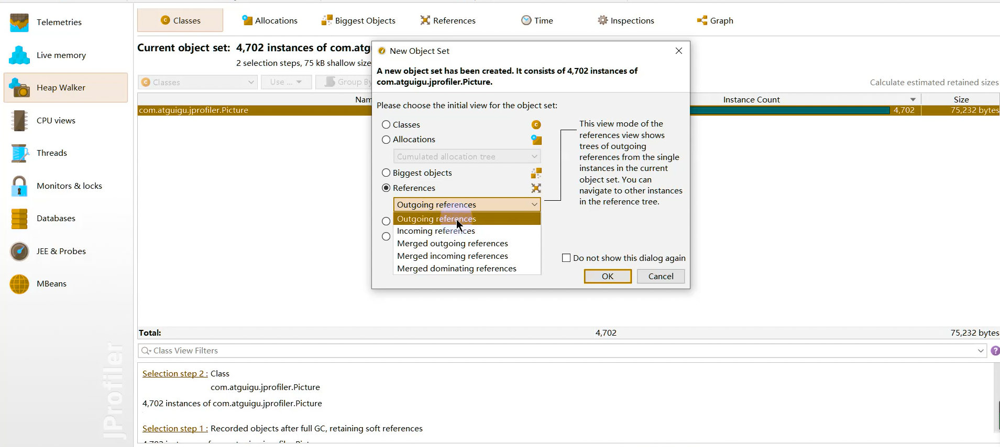

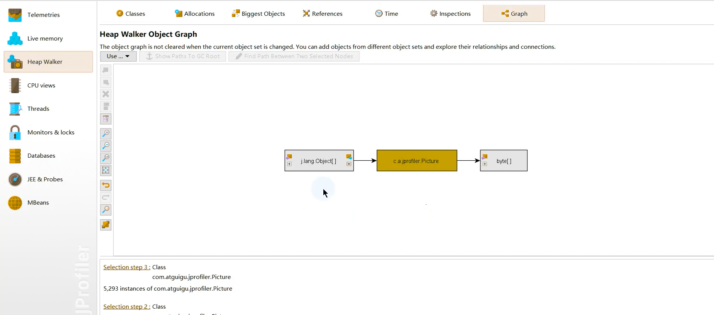

**cpu视图 cpu views**
JProfiler 提供不同的方法来记录访问树以优化性能和细节。线程或者线程组以及线程状况可以被所有的视图选择。所有的视图都可以聚集到方法、类、包或J2EE组件等不同层上。

- **访问树 Call Tree**：显示一个积累的自顶向下的树，树中包含所有在JVM中已记录的访问队列。JDBC，JMS和JNDI服务请求都被注释在请求树中。请求树可以根据Servlet和JSP对URL的不同需要进行拆分。
- **热点 Hot Spots**：显示消耗时间最多的方法的列表。对每个热点都能够显示回溯树。该热点可以按照方法请求，JDBC，JMS和JNDI服务请求以及按照URL请求来进行计算。
- **访问图 Call Graph**：显示一个从已选方法、类、包或J2EE组件开始的访问队列的图。
- **方法统计 Method Statistis**：显示一段时间内记录的方法的调用时间细节。

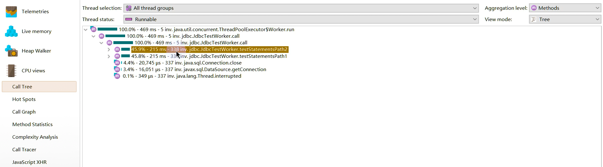

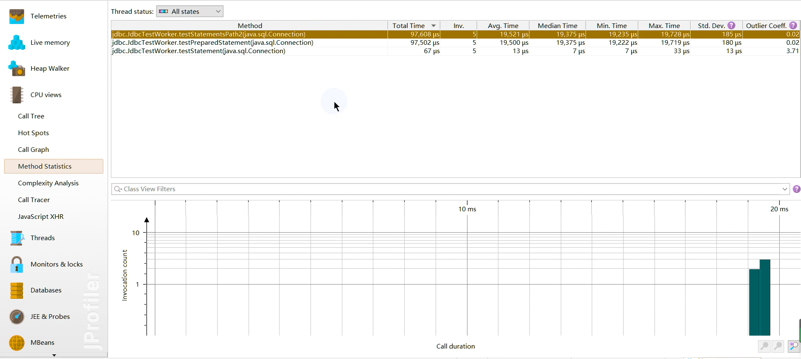

**线程视图 threads**
JProfiler通过对线程历史的监控判断其运行状态，并监控是否有线程阻塞产生，还能将一个线程所管理的方法以树状形式呈现。对线程剖析。

- **线程历史 Thread History**：显示一个与线程活动和线程状态在一起的活动时间表。
- **线程监控 Thread Monitor**：显示一个列表，包括所有的活动线程以及它们目前的活动状况。
- **线程转储 Thread Dumps**：显示所有线程的堆栈跟踪。

线程分析主要关心三个方面：

- web容器的线程最大数。比如：Tomcat的线程容量应该略大于最大并发数。
- 线程阻塞
- 线程死锁

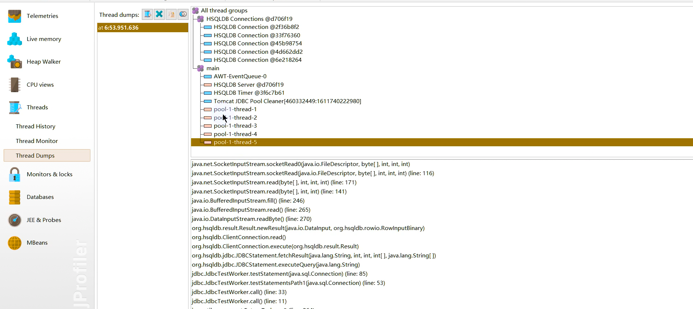

**监控和锁 Monitors ＆Locks**
所有线程持有锁的情况以及锁的信息。观察JVM的内部线程并查看状态：

- **死锁探测图表 Current Locking Graph**：显示JVM中的当前死锁图表。
- **目前使用的监测器 Current Monitors**：显示目前使用的监测器并且包括它们的关联线程。
- **锁定历史图表 Locking History Graph**：显示记录在JVM中的锁定历史。
- **历史检测记录 Monitor History**：显示重大的等待事件和阻塞事件的历史记录。
- **监控器使用统计 Monitor Usage Statistics**：显示分组监测，线程和监测类的统计监测数据

## 3.6. Arthas

上述工具都必须在服务端项目进程中配置相关的监控参数，然后工具通过远程连接到项目进程，获取相关的数据。这样就会带来一些不便，比如线上环境的网络是隔离的，本地的监控工具根本连不上线上环境。并且类似于Jprofiler这样的商业工具，是需要付费的。
那么有没有一款工具不需要远程连接，也不需要配置监控参数，同时也提供了丰富的性能监控数据呢？
阿里巴巴开源的性能分析神器Arthas应运而生。
Arthas是Alibaba开源的Java诊断工具，深受开发者喜爱。在线排查问题，无需重启；动态跟踪Java代码；实时监控JVM状态。Arthas 支持JDK 6＋，支持Linux／Mac／Windows，采用命令行交互模式，同时提供丰富的 Tab 自动补全功能，进一步方便进行问题的定位和诊断。当你遇到以下类似问题而束手无策时，Arthas可以帮助你解决：

- 这个类从哪个 jar 包加载的？为什么会报各种类相关的 Exception？
- 我改的代码为什么没有执行到？难道是我没 commit？分支搞错了？
- 遇到问题无法在线上 debug，难道只能通过加日志再重新发布吗？
- 线上遇到某个用户的数据处理有问题，但线上同样无法 debug，线下无法重现！
- 是否有一个全局视角来查看系统的运行状况？
- 有什么办法可以监控到JVM的实时运行状态？
- 怎么快速定位应用的热点，生成火焰图？

官方地址：[https://arthas.aliyun.com/doc/quick-start.html](https://arthas.aliyun.com/doc/quick-start.html)

命令列表：[命令列表 | arthas (aliyun.com)](https://arthas.aliyun.com/doc/commands.html)

下面是常用命令

### dashboard

使用`dashboard`命令可以显示当前系统的实时数据面板，包括线程信息、JVM内存信息及JVM运行时参数。

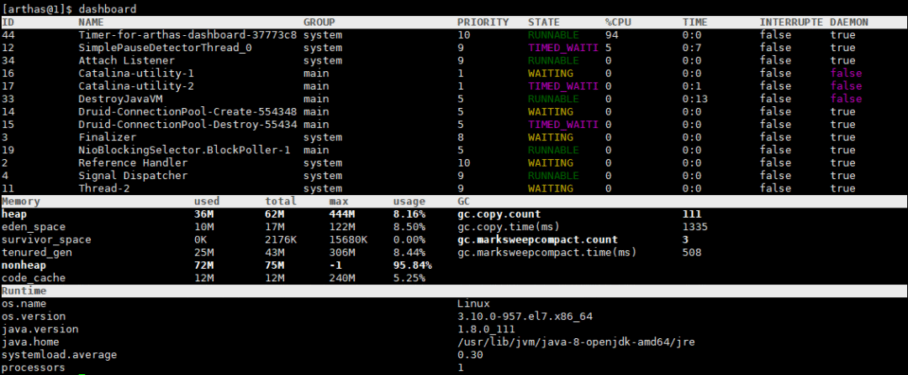

### thread

查看当前线程信息，查看线程的堆栈，可以找出当前最占CPU的线程。

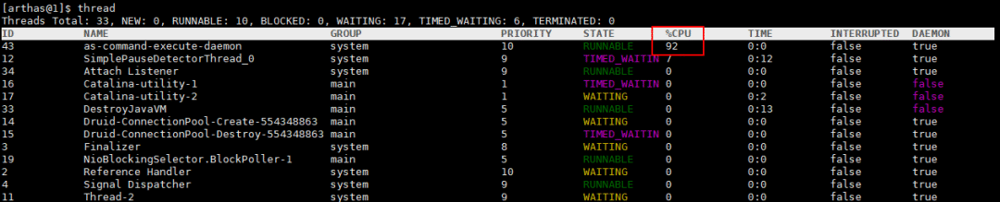

常用命令：

```bash
# 打印当前最忙的3个线程的堆栈信息
thread -n 3
# 查看ID为1都线程的堆栈信息
thread 1
# 找出当前阻塞其他线程的线程
thread -b
# 查看指定状态的线程
thread -state WAITING
```

### logger

使用`logger`命令可以查看日志信息，并改变日志级别，这个命令非常有用。

比如我们在生产环境上一般是不会打印`DEBUG`级别的日志的，当我们在线上排查问题时可以临时开启`DEBUG`级别的日志，帮助我们排查问题，下面介绍下如何操作。

- 我们的应用默认使用的是`INFO`级别的日志，使用`logger`命令可以查看；

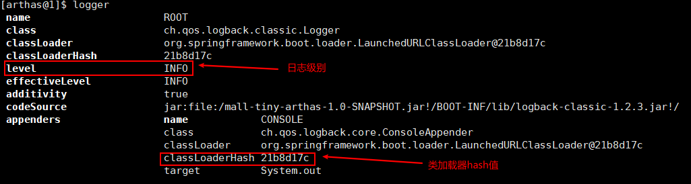

- 使用如下命令改变日志级别为`DEBUG`，需要使用`-c`参数指定类加载器的HASH值；

```bash
logger -c 21b8d17c --name ROOT --level debug
```

- 再使用`logger`命令查看，发现`ROOT`级别日志已经更改；

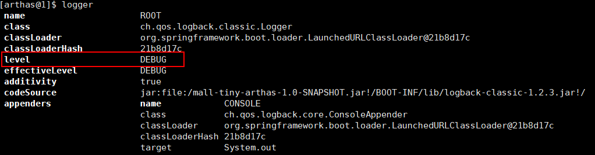

- 使用`docker logs -f mall-tiny-arthas`命令查看容器日志，发现已经打印了DEBUG级别的日志；

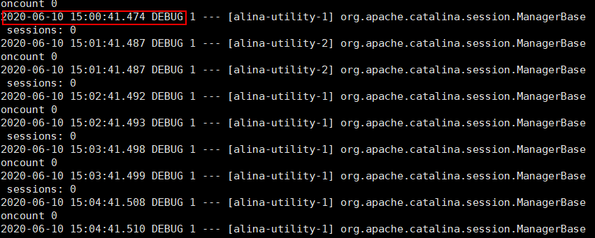

- 查看完日志以后记得要把日志级别再调回`INFO`级别。

```
logger -c 21b8d17c --name ROOT --level info
```


### jad

反编译已加载类的源码，觉得线上代码和预期不一致，可以反编译看看。

查看启动类的相关信息，默认会带有`ClassLoader`信息；

```
jad com.macro.mall.tiny.MallTinyApplication
```

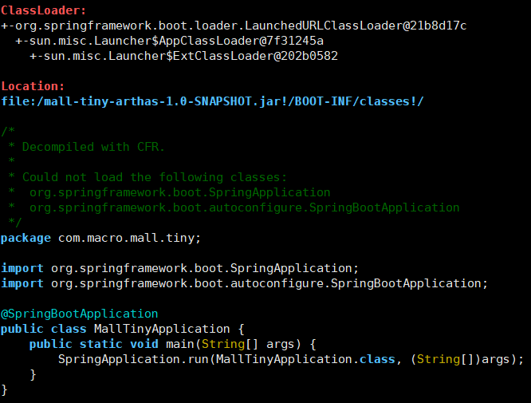

- 使用`--source-only`参数可以只打印类信息。

```
jad --source-only com.macro.mall.tiny.MallTinyApplication
```

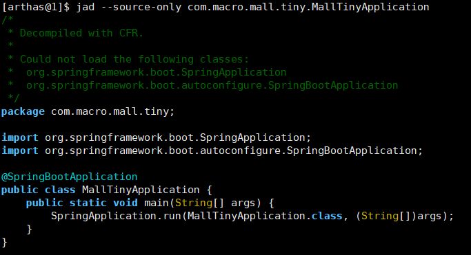

### mc

内存编译器，`Memory Compiler`的缩写，编译`.java`文件生成`.class`。

### redefine

加载外部的`.class`文件，覆盖掉 JVM中已经加载的类。

### monitor

实时监控方法执行信息，可以查看方法执行成功此时、失败次数、平均耗时等信息。

```
monitor -c 5 com.macro.mall.tiny.controller.PmsBrandController listBrand
```

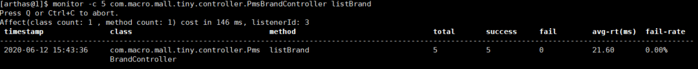

### watch

方法执行数据观测，可以观察方法执行过程中的参数和返回值。

使用如下命令观察方法执行参数和返回值，`-x`表示结果属性遍历深度。

```
watch com.macro.mall.tiny.service.impl.PmsBrandServiceImpl listBrand "{params,returnObj}" -x 2
```

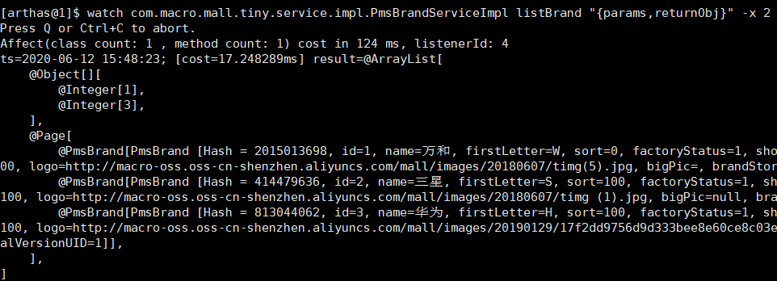

### 热更新

我们需要查看该类的类加载器的Hash值；

```
sc -d *PmsBrandController | grep classLoaderHash
```

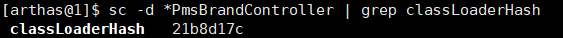

之后使用内存编译器把改`.java`文件编译成`.class`文件，注意需要使用`-c`指定类加载器；

```
mc -c 21b8d17c /tmp/PmsBrandController.java -d /tmp
```

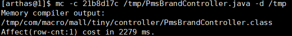

最后使用`redefine`命令加载`.class`文件，将原来加载的类覆盖掉；

```
redefine -c 21b8d17c /tmp/com/macro/mall/tiny/controller/PmsBrandController.class
```

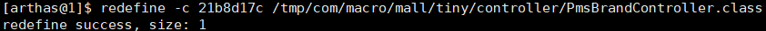

我们再次调用接口进行测试，发现已经返回了预期的结果


## 3.7. Java Misssion Control

在Oracle收购Sun之前，Oracle的JRockit虚拟机提供了一款叫做 JRockit Mission Control 的虚拟机诊断工具。
在Oracle收购sun之后，Oracle公司同时拥有了Hotspot和 JRockit 两款虚拟机。根据Oracle对于Java的战略，在今后的发展中，会将JRokit的优秀特性移植到Hotspot上。其中一个重要的改进就是在Sun的JDK中加入了JRockit的支持。
在Oracle JDK 7u40之后，Mission Control这款工具己经绑定在Oracle JDK中发布。
自Java11开始，本节介绍的JFR己经开源。但在之前的Java版本，JFR属于Commercial Feature通过Java虚拟机参数-XX:+UnlockCommercialFeatures 开启。
Java Mission Control（简称JMC) ， Java官方提供的性能强劲的工具，是一个用于对 Java应用程序进行管理、监视、概要分析和故障排除的工具套件。它包含一个GUI客户端以及众多用来收集Java虚拟机性能数据的插件如 JMX Console（能够访问用来存放虚拟机齐个于系统运行数据的MXBeans）以及虚拟机内置的高效 profiling 工具 Java Flight Recorder（JFR）。
JMC的另一个优点就是：采用取样，而不是传统的代码植入技术，对应用性能的影响非常非常小，完全可以开着JMC来做压测（唯一影响可能是 full gc 多了）。
官方地址：[https://github.com/JDKMissionControl/jmc](https://github.com/JDKMissionControl/jmc)


**Java Flight Recorder**
Java Flight Recorder是JMC的其中一个组件，能够以极低的性能开销收集Java虚拟机的性能数据。与其他工具相比，JFR的性能开销很小，在默认配置下平均低于1%。JFR能够直接访问虚拟机内的敌据并且不会影响虚拟机的优化。因此它非常适用于生产环境下满负荷运行的Java程序。
Java Flight Recorder 和 JDK Mission Control共同创建了一个完整的工具链。JDK Mission Control 可对 Java Flight Recorder 连续收集低水平和详细的运行时信息进行高效、详细的分析。
当启用时 JFR将记录运行过程中发生的一系列事件。其中包括Java层面的事件如线程事件、锁事件，以及Java虚拟机内部的事件，如新建对象，垃圾回收和即时编译事件。按照发生时机以及持续时间来划分，JFR的事件共有四种类型，它们分别为以下四种：

-  瞬时事件（Instant Event) ，用户关心的是它们发生与否，例如异常、线程启动事件。 
-  持续事件(Duration Event) ，用户关心的是它们的持续时间，例如垃圾回收事件。 
-  计时事件(Timed Event) ，是时长超出指定阈值的持续事件。 
-  取样事件（Sample Event)，是周期性取样的事件。 

取样事件的其中一个常见例子便是方法抽样（Method Sampling），即每隔一段时问统计各个线程的栈轨迹。如果在这些抽样取得的栈轨迹中存在一个反复出现的方法，那么我们可以推测该方法是热点方法

## 3.8. 其他工具
**Flame Graphs（火焰图）**
在追求极致性能的场景下，了解你的程序运行过程中cpu在干什么很重要，火焰图就是一种非常直观的展示CPU在程序整个生命周期过程中时间分配的工具。火焰图对于现代的程序员不应该陌生，这个工具可以非常直观的显示出调用找中的CPU消耗瓶颈。
网上的关于Java火焰图的讲解大部分来自于Brenden Gregg的博客 [http://new.brendangregg.com/flamegraphs.html ](http://new.brendangregg.com/flamegraphs.html)
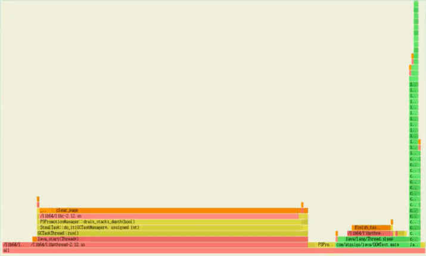
火焰图，简单通过x轴横条宽度来度量时间指标，y轴代表线程栈的层次。
**Tprofiler**
案例： 使用JDK自身提供的工具进行JVM调优可以将下 TPS 由2.5提升到20（提升了7倍），并准确 定位系统瓶颈。
系统瓶颈有：应用里释态对象不是太多、有大量的业务线程在频繁创建一些生命周期很长的临时对象，代码里有问题。
那么，如何在海量业务代码里边准确定位这些性能代码？这里使用阿里开源工具 Tprofiler 来定位 这些性能代码，成功解决掉了GC 过于频繁的性能瓶预，并最终在上次优化的基础上将 TPS 再提升了4倍，即提升到100。

- Tprofiler配置部署、远程操作、 日志阅谈都不太复杂，操作还是很简单的。但是其却是能够 起到一针见血、立竿见影的效果，帮我们解决了GC过于频繁的性能瓶预。
- Tprofiler最重要的特性就是能够统汁出你指定时间段内 JVM 的 top method 这些 top method 极有可能就是造成你 JVM 性能瓶颈的元凶。这是其他大多数 JVM 调优工具所不具备的，包括 JRockit Mission Control。JRokit 首席开发者 Marcus Hirt 在其私人博客《 Lom Overhead Method Profiling cith Java Mission Control》下的评论中曾明确指出  JRMC 井不支持 TOP 方法的统计。

官方地址：[http://github.com/alibaba/Tprofiler](http://github.com/alibaba/Tprofiler)
**Btrace**
常见的动态追踪工具有BTrace、HouseHD（该项目己经停止开发）、Greys-Anatomy（国人开发 个人开发者）、Byteman（JBoss出品），注意Java运行时追踪工具井不限干这几种，但是这几个是相对比较常用的。
BTrace是SUN Kenai 云计算开发平台下的一个开源项目，旨在为java提供安全可靠的动态跟踪分析工具。先看一卜日Trace的官方定义：

大概意思是一个 Java 平台的安全的动态追踪工具，可以用来动态地追踪一个运行的 Java 程序。BTrace动态调整目标应用程序的类以注入跟踪代码（“字节码跟踪“）。
**YourKit**
**JProbe**
**Spring Insight**

# 四、 JVM运行时参数
## 4.1. 参数分类
官网地址：[https://docs.oracle.com/javase/8/docs/technotes/tools/windows/java.html](https://docs.oracle.com/javase/8/docs/technotes/tools/windows/java.html)
### 4.1.1. 类型一：标准参数选项
```shell
> java -help
用法: java [-options] class [args...]
           (执行类)
   或  java [-options] -jar jarfile [args...]
           (执行 jar 文件)
其中选项包括:
    -d32          使用 32 位数据模型 (如果可用)
    -d64          使用 64 位数据模型 (如果可用)
    -server       选择 "server" VM
                  默认 VM 是 server.

    -cp <目录和 zip/jar 文件的类搜索路径>
    -classpath <目录和 zip/jar 文件的类搜索路径>
                  用 ; 分隔的目录, JAR 档案
                  和 ZIP 档案列表, 用于搜索类文件。
    -D<名称>=<值>
                  设置系统属性
    -verbose:[class|gc|jni]
                  启用详细输出
    -version      输出产品版本并退出
    -version:<值>
                  警告: 此功能已过时, 将在
                  未来发行版中删除。
                  需要指定的版本才能运行
    -showversion  输出产品版本并继续
    -jre-restrict-search | -no-jre-restrict-search
                  警告: 此功能已过时, 将在
                  未来发行版中删除。
                  在版本搜索中包括/排除用户专用 JRE
    -? -help      输出此帮助消息
    -X            输出非标准选项的帮助
    -ea[:<packagename>...|:<classname>]
    -enableassertions[:<packagename>...|:<classname>]
                  按指定的粒度启用断言
    -da[:<packagename>...|:<classname>]
    -disableassertions[:<packagename>...|:<classname>]
                  禁用具有指定粒度的断言
    -esa | -enablesystemassertions
                  启用系统断言
    -dsa | -disablesystemassertions
                  禁用系统断言
    -agentlib:<libname>[=<选项>]
                  加载本机代理库 <libname>, 例如 -agentlib:hprof
                  另请参阅 -agentlib:jdwp=help 和 -agentlib:hprof=help
    -agentpath:<pathname>[=<选项>]
                  按完整路径名加载本机代理库
    -javaagent:<jarpath>[=<选项>]
                  加载 Java 编程语言代理, 请参阅 java.lang.instrument
    -splash:<imagepath>
                  使用指定的图像显示启动屏幕
有关详细信息, 请参阅 http://www.oracle.com/technetwork/java/javase/documentation/index.html。
```

**Server模式和Client模式**
Hotspot JVM有两种模式，分别是server和client，分别通过-server和-client模式设置

- 32位系统上，默认使用Client类型的JVM。要想使用Server模式，机器配置至少有2个以上的CPU和2G以上的物理内存。client模式适用于对内存要求较小的桌面应用程序，默认使用Serial串行垃圾收集器
- 64位系统上，只支持server模式的JVM，适用于需要大内存的应用程序，默认使用并行垃圾收集器

官网地址：[https://docs.oracle.com/javase/8/docs/technotes/guides/vm/server-class.html](https://docs.oracle.com/javase/8/docs/technotes/guides/vm/server-class.html)
如何知道系统默认使用的是那种模式呢？
通过java -version命令：可以看到Server VM字样，代表当前系统使用是Server模式
```shell
> java -version
java version "1.8.0_201"
Java(TM) SE Runtime Environment (build 1.8.0_201-b09)
Java HotSpot(TM) 64-Bit Server VM (build 25.201-b09, mixed mode)
```

### 4.1.2. 类型二：-X参数选项
```shell
> java -X
    -Xmixed           混合模式执行 (默认)
    -Xint             仅解释模式执行
    -Xbootclasspath:<用 ; 分隔的目录和 zip/jar 文件>
                      设置搜索路径以引导类和资源
    -Xbootclasspath/a:<用 ; 分隔的目录和 zip/jar 文件>
                      附加在引导类路径末尾
    -Xbootclasspath/p:<用 ; 分隔的目录和 zip/jar 文件>
                      置于引导类路径之前
    -Xdiag            显示附加诊断消息
    -Xnoclassgc       禁用类垃圾收集
    -Xincgc           启用增量垃圾收集
    -Xloggc:<file>    将 GC 状态记录在文件中 (带时间戳)
    -Xbatch           禁用后台编译
    -Xms<size>        设置初始 Java 堆大小
    -Xmx<size>        设置最大 Java 堆大小
    -Xss<size>        设置 Java 线程堆栈大小
    -Xprof            输出 cpu 配置文件数据
    -Xfuture          启用最严格的检查, 预期将来的默认值
    -Xrs              减少 Java/VM 对操作系统信号的使用 (请参阅文档)
    -Xcheck:jni       对 JNI 函数执行其他检查
    -Xshare:off       不尝试使用共享类数据
    -Xshare:auto      在可能的情况下使用共享类数据 (默认)
    -Xshare:on        要求使用共享类数据, 否则将失败。
    -XshowSettings    显示所有设置并继续
    -XshowSettings:all
                      显示所有设置并继续
    -XshowSettings:vm 显示所有与 vm 相关的设置并继续
    -XshowSettings:properties
                      显示所有属性设置并继续
    -XshowSettings:locale
                      显示所有与区域设置相关的设置并继续

-X 选项是非标准选项, 如有更改, 恕不另行通知。
```

如何知道JVM默认使用的是混合模式呢？
同样地，通过java -version命令：可以看到 mixed mode 字样，代表当前系统使用的是混合模式

### 4.1.3. 类型三：-XX参数选项
**Boolean类型格式**
```shell
-XX:+<option>  启用option属性
-XX:-<option>  禁用option属性
```

**非Boolean类型格式**
```shell
-XX:<option>=<number>  设置option数值，可以带单位如k/K/m/M/g/G
-XX:<option>=<string>  设置option字符值
```

## 4.2. 添加方法
eclipse和idea中配置不必多说，在Run Configurations中VM Options中配置即可，大同小异
**运行jar包**
```shell
java -Xms100m -Xmx100m -XX:+PrintGCDetails -XX:+PrintGCDateStamps -XX:+PrintGCTimeStamps -jar demo.jar
```

**Tomcat运行war包**
```shell
# linux下catalina.sh添加
JAVA_OPTS="-Xms512M -Xmx1024M"
# windows下catalina.bat添加
set "JAVA_OPTS=-Xms512M -Xmx1024M"
```

**程序运行中**
```shell
# 设置Boolean类型参数
jinfo -flag [+|-]<name> <pid>
# 设置非Boolean类型参数
jinfo -flag <name>=<value> <pid>
```

## 4.3. 常用参数
### 4.3.1. 打印XX参数
```shell
-XX:+PrintCommandLineFlags 程序运行时JVM默认设置或用户手动设置的XX选项
-XX:+PrintFlagsInitial 打印所有XX选项的默认值
-XX:+PrintFlagsFinal 打印所有XX选项的实际值
-XX:+PrintVMOptions 打印JVM的参数
```

### 4.3.2. 堆、栈、方法区
```bash
# 栈
-Xss128k <==> -XX:ThreadStackSize=128k 设置线程栈的大小为128K

# 堆
-Xms2048m <==> -XX:InitialHeapSize=2048m 设置JVM初始堆内存为2048M
-Xmx2048m <==> -XX:MaxHeapSize=2048m 设置JVM最大堆内存为2048M
-Xmn2g <==> -XX:NewSize=2g -XX:MaxNewSize=2g 设置年轻代大小为2G，官方推荐设置整个堆大小的3/8
-XX:SurvivorRatio=8 设置Eden区与Survivor区的比值，默认为8
-XX:NewRatio=2 设置老年代与年轻代的比例，默认为2
-XX:+UseAdaptiveSizePolicy 设置大小比例自适应，默认开启
-XX:PretenureSizeThreadshold=1024 设置让大于此阈值的对象直接分配在老年代，只对Serial、ParNew收集器有效
-XX:MaxTenuringThreshold=15 设置新生代晋升老年代的年龄限制，默认为15
-XX:TargetSurvivorRatio 设置MinorGC结束后Survivor区占用空间的期望比例

# 方法区
-XX:MetaspaceSize / -XX:PermSize=256m 设置元空间/永久代初始值为256M
-XX:MaxMetaspaceSize / -XX:MaxPermSize=256m 设置元空间/永久代最大值为256M
-XX:+UseCompressedOops 使用压缩对象
-XX:+UseCompressedClassPointers 使用压缩类指针
-XX:CompressedClassSpaceSize 设置class Metaspace的大小，默认1G

# 直接内存
-XX:MaxDirectMemorySize 指定DirectMemory容量，默认等于Java堆最大值
```

### 4.3.3. OutOfMemory
```shell
-XX:+HeapDumpOnOutMemoryError 内存出现OOM时生成Heap转储文件，两者互斥
-XX:+HeapDumpBeforeFullGC 出现FullGC时生成Heap转储文件，两者互斥
-XX:HeapDumpPath=<path> 指定heap转储文件的存储路径，默认当前目录
-XX:OnOutOfMemoryError=<path> 指定可行性程序或脚本的路径，当发生OOM时执行脚本
```

### 4.3.4. 垃圾收集器
首先需了解垃圾收集器之间的搭配使用关系

- 红色虚线表示在jdk8时被Deprecate，jdk9时被删除
- 绿色虚线表示在jdk14时被Deprecate
- 绿色虚框表示在jdk9时被Deprecate，jdk14时被删除

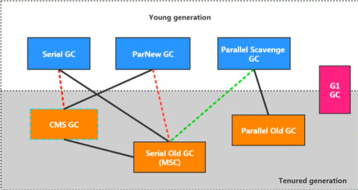
```shell
# Serial回收器
-XX:+UseSerialGC  年轻代使用Serial GC， 老年代使用Serial Old GC
# ParNew回收器
-XX:+UseParNewGC  年轻代使用ParNew GC
-XX:ParallelGCThreads  设置年轻代并行收集器的线程数。
	一般地，最好与CPU数量相等，以避免过多的线程数影响垃圾收集性能。
```
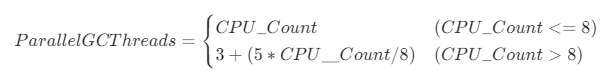
```shell
# Parallel回收器
-XX:+UseParallelGC  年轻代使用 Parallel Scavenge GC，互相激活
-XX:+UseParallelOldGC  老年代使用 Parallel Old GC，互相激活
-XX:ParallelGCThreads 参考ParNew
-XX:MaxGCPauseMillis  设置垃圾收集器最大停顿时间（即STW的时间），单位是毫秒。
	为了尽可能地把停顿时间控制在MaxGCPauseMills以内，收集器在工作时会调整Java堆大小或者其他一些参数。
	对于用户来讲，停顿时间越短体验越好；但是服务器端注重高并发，整体的吞吐量。
	所以服务器端适合Parallel，进行控制。该参数使用需谨慎。
-XX:GCTimeRatio  垃圾收集时间占总时间的比例（1 / (N＋1)），用于衡量吞吐量的大小
	取值范围（0,100），默认值99，也就是垃圾回收时间不超过1％。
	与前一个-XX：MaxGCPauseMillis参数有一定矛盾性。暂停时间越长，Radio参数就容易超过设定的比例。
-XX:+UseAdaptiveSizePolicy  设置Parallel Scavenge收集器具有自适应调节策略。
	在这种模式下，年轻代的大小、Eden和Survivor的比例、晋升老年代的对象年龄等参数会被自动调整，以达到在堆大小、吞吐量和停顿时间之间的平衡点。
	在手动调优比较困难的场合，可以直接使用这种自适应的方式，仅指定虚拟机的最大堆、目标的吞吐量（GCTimeRatio）和停顿时间（MaxGCPauseMills），让虚拟机自己完成调优工作。
```

```shell
# CMS回收器
-XX:+UseConcMarkSweepGC  年轻代使用CMS GC。
	开启该参数后会自动将-XX：＋UseParNewGC打开。即：ParNew（Young区）+ CMS（Old区）+ Serial Old的组合
-XX:CMSInitiatingOccupanyFraction  设置堆内存使用率的阈值，一旦达到该阈值，便开始进行回收。JDK5及以前版本的默认值为68，DK6及以上版本默认值为92％。
	如果内存增长缓慢，则可以设置一个稍大的值，大的阈值可以有效降低CMS的触发频率，减少老年代回收的次数可以较为明显地改善应用程序性能。
	反之，如果应用程序内存使用率增长很快，则应该降低这个阈值，以避免频繁触发老年代串行收集器。
	因此通过该选项便可以有效降低Fu1l GC的执行次数。
-XX:+UseCMSInitiatingOccupancyOnly  是否动态可调，使CMS一直按CMSInitiatingOccupancyFraction设定的值启动
-XX:+UseCMSCompactAtFullCollection  用于指定在执行完Full GC后对内存空间进行压缩整理
	以此避免内存碎片的产生。不过由于内存压缩整理过程无法并发执行，所带来的问题就是停顿时间变得更长了。
-XX:CMSFullGCsBeforeCompaction  设置在执行多少次Full GC后对内存空间进行压缩整理。
-XX:ParallelCMSThreads  设置CMS的线程数量。
	CMS 默认启动的线程数是(ParallelGCThreads＋3)/4，ParallelGCThreads 是年轻代并行收集器的线程数。
	当CPU 资源比较紧张时，受到CMS收集器线程的影响，应用程序的性能在垃圾回收阶段可能会非常糟糕。
-XX:ConcGCThreads  设置并发垃圾收集的线程数，默认该值是基于ParallelGCThreads计算出来的
-XX:+CMSScavengeBeforeRemark  强制hotspot在cms remark阶段之前做一次minor gc，用于提高remark阶段的速度
-XX:+CMSClassUnloadingEnable  如果有的话，启用回收Perm 区（JDK8之前）
-XX:+CMSParallelInitialEnabled  用于开启CMS initial-mark阶段采用多线程的方式进行标记
	用于提高标记速度，在Java8开始已经默认开启
-XX:+CMSParallelRemarkEnabled  用户开启CMS remark阶段采用多线程的方式进行重新标记，默认开启
-XX:+ExplicitGCInvokesConcurrent
-XX:+ExplicitGCInvokesConcurrentAndUnloadsClasses
	这两个参数用户指定hotspot虚拟在执行System.gc()时使用CMS周期
-XX:+CMSPrecleaningEnabled  指定CMS是否需要进行Pre cleaning阶段
```

```shell
# G1回收器
-XX:+UseG1GC 手动指定使用G1收集器执行内存回收任务。
-XX:G1HeapRegionSize 设置每个Region的大小。
	值是2的幂，范围是1MB到32MB之间，目标是根据最小的Java堆大小划分出约2048个区域。默认是堆内存的1/2000。
-XX:MaxGCPauseMillis  设置期望达到的最大GC停顿时间指标（JVM会尽力实现，但不保证达到）。默认值是200ms
-XX:ParallelGCThread  设置STW时GC线程数的值。最多设置为8
-XX:ConcGCThreads  设置并发标记的线程数。将n设置为并行垃圾回收线程数（ParallelGCThreads）的1/4左右。
-XX:InitiatingHeapOccupancyPercent 设置触发并发GC周期的Java堆占用率阈值。超过此值，就触发GC。默认值是45。
-XX:G1NewSizePercent  新生代占用整个堆内存的最小百分比（默认5％）
-XX:G1MaxNewSizePercent  新生代占用整个堆内存的最大百分比（默认60％）
-XX:G1ReservePercent=10  保留内存区域，防止 to space（Survivor中的to区）溢出
```

怎么选择垃圾回收器？

- 优先让JVM自适应，调整堆的大小
- 串行收集器：内存小于100M；单核、单机程序，并且没有停顿时间的要求
- 并行收集器：多CPU、高吞吐量、允许停顿时间超过1秒
- 并发收集器：多CPU、追求低停顿时间、快速响应（比如延迟不能超过1秒，如互联网应用）
- 官方推荐G1，性能高。现在互联网的项目，基本都是使用G1

特别说明：

- 没有最好的收集器，更没有万能的收集器
- 调优永远是针对特定场景、特定需求，不存在一劳永逸的收集器

### 4.3.5. GC日志
```shell
-XX:+PrintGC    打印简要日志信息 jdk11弃用，建议使用：-Xlog:gc 或者 -verbose:gc
-XX:+PrintGCDetails            打印详细日志信息
-XX:+PrintGCTimeStamps  打印程序启动到GC发生的时间，搭配-XX:+PrintGCDetails使用
-XX:+PrintGCDateStamps  打印GC发生时的时间戳，搭配-XX:+PrintGCDetails使用
-XX:+PrintHeapAtGC  打印GC前后的堆信息，如下图
-Xloggc:<file> 输出GC导指定路径下的文件中
```

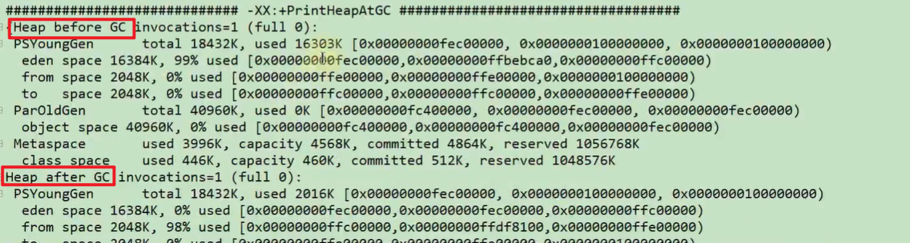

```shell
-XX:+TraceClassLoading  监控类的加载
-XX:+PrintGCApplicationStoppedTime  打印GC时线程的停顿时间
-XX:+PrintGCApplicationConcurrentTime  打印垃圾收集之前应用未中断的执行时间
-XX:+PrintReferenceGC 打印回收了多少种不同引用类型的引用
-XX:+PrintTenuringDistribution  打印JVM在每次MinorGC后当前使用的Survivor中对象的年龄分布
-XX:+UseGCLogFileRotation 启用GC日志文件的自动转储
-XX:NumberOfGCLogFiles=1  设置GC日志文件的循环数目
-XX:GCLogFileSize=1M  设置GC日志文件的大小
```

### 4.3.6. 其他参数
```shell
-XX:+DisableExplicitGC  禁用hotspot执行System.gc()，默认禁用
-XX:ReservedCodeCacheSize=<n>[g|m|k]、-XX:InitialCodeCacheSize=<n>[g|m|k]  指定代码缓存的大小
-XX:+UseCodeCacheFlushing  放弃一些被编译的代码，避免代码缓存被占满时JVM切换到interpreted-only的情况
-XX:+DoEscapeAnalysis  开启逃逸分析
-XX:+UseBiasedLocking  开启偏向锁
-XX:+UseLargePages  开启使用大页面
-XX:+PrintTLAB  打印TLAB的使用情况
-XX:TLABSize  设置TLAB大小
```

## 4.4. 通过Java代码获取JVM参数
Java提供了java.lang.management包用于监视和管理Java虚拟机和Java运行时中的其他组件，它允许本地或远程监控和管理运行的Java虚拟机。其中ManagementFactory类较为常用，另外Runtime类可获取内存、CPU核数等相关的数据。通过使用这些api，可以监控应用服务器的堆内存使用情况，设置一些阈值进行报警等处理。
```java
public class MemoryMonitor {
    public static void main(String[] args) {
        MemoryMXBean memorymbean = ManagementFactory.getMemoryMXBean();
        MemoryUsage usage = memorymbean.getHeapMemoryUsage();
        System.out.println("INIT HEAP: " + usage.getInit() / 1024 / 1024 + "m");
        System.out.println("MAX HEAP: " + usage.getMax() / 1024 / 1024 + "m");
        System.out.println("USE HEAP: " + usage.getUsed() / 1024 / 1024 + "m");
        System.out.println("\nFull Information:");
        System.out.println("Heap Memory Usage: " + memorymbean.getHeapMemoryUsage());
        System.out.println("Non-Heap Memory Usage: " + memorymbean.getNonHeapMemoryUsage());

        System.out.println("=======================通过java来获取相关系统状态============================ ");
        System.out.println("当前堆内存大小totalMemory " + (int) Runtime.getRuntime().totalMemory() / 1024 / 1024 + "m");// 当前堆内存大小
        System.out.println("空闲堆内存大小freeMemory " + (int) Runtime.getRuntime().freeMemory() / 1024 / 1024 + "m");// 空闲堆内存大小
        System.out.println("最大可用总堆内存maxMemory " + Runtime.getRuntime().maxMemory() / 1024 / 1024 + "m");// 最大可用总堆内存大小

    }
}
```


# 五、 分析GC日志
## 5.1. GC分类
针对HotSpot VM的实现，它里面的GC按照回收区域又分为两大种类型：一种是部分收集（Partial GC），一种是整堆收集（Full GC）

-  部分收集（Partial GC）：不是完整收集整个Java堆的垃圾收集。其中又分为： 
   - 新生代收集（Minor GC / Young GC）：只是新生代（Eden / S0, S1）的垃圾收集
   - 老年代收集（Major GC / Old GC）：只是老年代的垃圾收集。目前，只有CMS GC会有单独收集老年代的行为。注意，很多时候Major GC会和Full GC混淆使用，需要具体分辨是老年代回收还是整堆回收。
-  混合收集（Mixed GC）：收集整个新生代以及部分老年代的垃圾收集。目前，只有G1 GC会有这种行为 
-  整堆收集（Full GC）：收集整个java堆和方法区的垃圾收集。 
## 5.2. GC日志分类
**MinorGC**
MinorGC（或young GC或YGC）日志：
```java
[GC (Allocation Failure) [PSYoungGen: 31744K->2192K (36864K) ] 31744K->2200K (121856K), 0.0139308 secs] [Times: user=0.05 sys=0.01, real=0.01 secs]
```
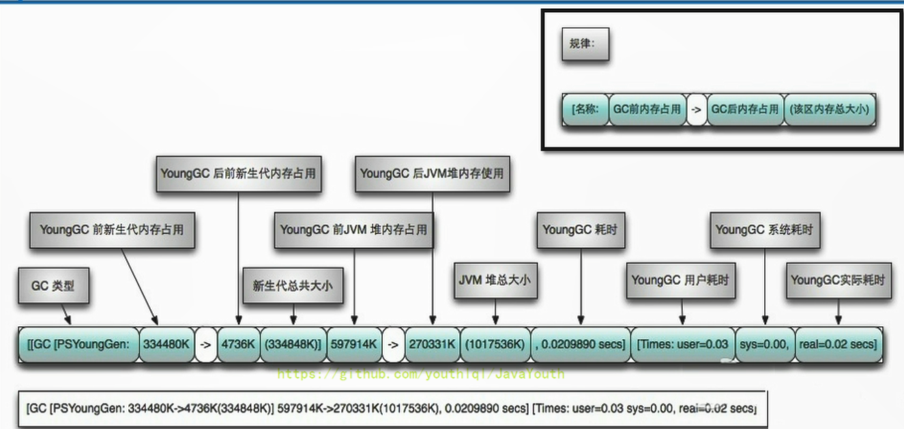

**FullGC**
```java
[Full GC (Metadata GC Threshold) [PSYoungGen: 5104K->0K (132096K) ] [Par01dGen: 416K->5453K (50176K) ]5520K->5453K (182272K), [Metaspace: 20637K->20637K (1067008K) ], 0.0245883 secs] [Times: user=0.06 sys=0.00, real=0.02 secs]
```

## 5.3. GC日志结构剖析
**透过日志看垃圾收集器**

-  Serial收集器：新生代显示 "[DefNew"，即 Default New Generation 
-  ParNew收集器：新生代显示 "[ParNew"，即 Parallel New Generation 
-  Parallel Scavenge收集器：新生代显示"[PSYoungGen"，JDK1.7使用的即PSYoungGen 
-  Parallel Old收集器：老年代显示"[ParoldGen" 
-  G1收集器：显示”garbage-first heap“ 

**透过日志看GC原因**

- Allocation Failure：表明本次引起GC的原因是因为新生代中没有足够的区域存放需要分配的数据
- Metadata GCThreshold：Metaspace区不够用了
- FErgonomics：JVM自适应调整导致的GC
- System：调用了System.gc()方法

**透过日志看GC前后情况**
通过图示，我们可以发现GC日志格式的规律一般都是：GC前内存占用-＞GC后内存占用（该区域内存总大小）
```java
[PSYoungGen: 5986K->696K (8704K) ] 5986K->704K (9216K)
```

-  中括号内：GC回收前年轻代堆大小，回收后大小，（年轻代堆总大小） 
-  括号外：GC回收前年轻代和老年代大小，回收后大小，（年轻代和老年代总大小） 
> 注意：Minor GC堆内存总容量 = 9/10 年轻代 + 老年代。原因是Survivor区只计算from部分，而JVM默认年轻代中Eden区和Survivor区的比例关系，Eden:S0:S1=8:1:1。


**透过日志看GC时间**
GC日志中有三个时间：user，sys和real

- user：进程执行用户态代码（核心之外）所使用的时间。这是执行此进程所使用的实际CPU 时间，其他进程和此进程阻塞的时间并不包括在内。在垃圾收集的情况下，表示GC线程执行所使用的 CPU 总时间。
- sys：进程在内核态消耗的 CPU 时间，即在内核执行系统调用或等待系统事件所使用的CPU 时间
- real：程序从开始到结束所用的时钟时间。这个时间包括其他进程使用的时间片和进程阻塞的时间（比如等待 I/O 完成）。对于并行gc，这个数字应该接近（用户时间＋系统时间）除以垃圾收集器使用的线程数。

由于多核的原因，一般的GC事件中，real time是小于sys time＋user time的，因为一般是多个线程并发的去做GC，所以real time是要小于sys＋user time的。如果real＞sys＋user的话，则你的应用可能存在下列问题：IO负载非常重或CPU不够用。

## 5.4. GC日志分析工具
**GCEasy**
GCEasy是一款在线的GC日志分析器，可以通过GC日志分析进行内存泄露检测、GC暂停原因分析、JVM配置建议优化等功能，大多数功能是免费的。
官网地址：[https://gceasy.io/](https://gceasy.io/)

**GCViewer**
GCViewer是一款离线的GC日志分析器，用于可视化Java VM选项 -verbose:gc 和 .NET生成的数据 -Xloggc:<file>。还可以计算与垃圾回收相关的性能指标（吞吐量、累积的暂停、最长的暂停等）。当通过更改世代大小或设置初始堆大小来调整特定应用程序的垃圾回收时，此功能非常有用。
源码下载：[https://github.com/chewiebug/GCViewer](https://github.com/chewiebug/GCViewer)
运行版本下载：[https://github.com/chewiebug/GCViewer/wiki/Changelog](https://github.com/chewiebug/GCViewer/wiki/Changelog)

**GChisto**

- 官网上没有下载的地方，需要自己从SVN上拉下来编译
- 不过这个工具似乎没怎么维护了，存在不少bug

**HPjmeter**

- 工具很强大，但是只能打开由以下参数生成的GC log，-verbose:gc  -Xloggc:gc.log。添加其他参数生成的gc.log无法打开
- HPjmeter集成了以前的HPjtune功能，可以分析在HP机器上产生的垃圾回收日志文件

# 补充：浅堆深堆与内存泄露
## 1. 浅堆（Shallow Heap）
浅堆是指一个对象所消耗的内存。在32位系统中，一个对象引用会占据4个字节，一个int类型会占据4个字节，long型变量会占据8个字节，每个对象头需要占用8个字节。根据堆快照格式不同，对象的大小可能会同8字节进行对齐。
以String为例：2个int值共占8字节，对象引用占用4字节，对象头8字节，合计20字节，向8字节对齐，故占24字节。（jdk7中）

| int     | hash32    | 0                          |
| ------- | --------- | -------------------------- |
| **int** | **hash**  | **0**                      |
| **ref** | **value** | **C:\\Users\\Administrat** |

这24字节为String对象的浅堆大小。它与String的value实际取值无关，无论字符串长度如何，浅堆大小始终是24字节。

## 2. 保留集（Retained Set）
对象A的保留集指当对象A被垃圾回收后，可以被释放的所有的对象集合（包括对象A本身），即对象A的保留集可以被认为是只能通过对象A被直接或间接访问到的所有对象的集合。通俗地说，就是指仅被对象A所持有的对象的集合。

## 3. 深堆（Retained Heap）
深堆是指对象的保留集中所有的对象的浅堆大小之和。
注意：浅堆指对象本身占用的内存，不包括其内部引用对象的大小。一个对象的深堆指只能通过该对象访问到的（直接或间接）所有对象的浅堆之和，即对象被回收后，可以释放的真实空间。

## 4. 对象的实际大小
这里，对象的实际大小定义为一个对象所能触及的所有对象的浅堆大小之和，也就是通常意义上我们说的对象大小。与深堆相比，似乎这个在日常开发中更为直观和被人接受，但实际上，这个概念和垃圾回收无关。
下图显示了一个简单的对象引用关系图，对象A引用了C和D，对象B引用了C和E。那么对象A的浅堆大小只是A本身，不含C和D，而A的实际大小为A、C、D三者之和。而A的深堆大小为A与D之和，由于对象C还可以通过对象B访问到，因此不在对象A的深堆范围内。


## 5. 支配树（Dominator Tree）
支配树的概念源自图论。MAT提供了一个称为支配树（Dominator Tree）的对象图。支配树体现了对象实例间的支配关系。在对象引用图中，所有指向对象B的路径都经过对象A，则认为对象A支配对象B。如果对象A是离对象B最近的一个支配对象，则认为对象A为对象B的直接支配者。支配树是基于对象间的引用图所建立的，它有以下基本性质：

- 对象A的子树（所有被对象A支配的对象集合）表示对象A的保留集（retained set），即深堆。
- 如果对象A支配对象B，那么对象A的直接支配者也支配对象B。
- 支配树的边与对象引用图的边不直接对应。

如下图所示：左图表示对象引用图，右图表示左图所对应的支配树。对象A和B由根对象直接支配，由于在到对象C的路径中，可以经过A，也可以经过B，因此对象C的直接支配者也是根对象。对象F与对象D相互引用，因为到对象F的所有路径必然经过对象D，因此，对象D是对象F的直接支配者。而到对象D的所有路径中，必然经过对象C，即使是从对象F到对象D的引用，从根节点出发，也是经过对象C的，所以，对象D的直接支配者为对象C。同理，对象E支配对象G。到达对象H的可以通过对象D，也可以通过对象E，因此对象D和E都不能支配对象H，而经过对象C既可以到达D也可以到达E，因此对象C为对象H的直接支配者。

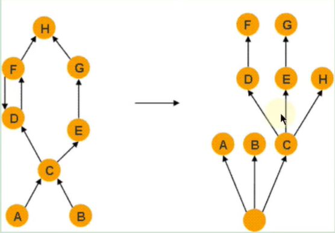

## 6. 内存泄漏（memory leak）
可达性分析算法来判断对象是否是不再使用的对象，本质都是判断一个对象是否还被引用。那么对于这种情况下，由于代码的实现不同就会出现很多种内存泄漏问题（让JVM误以为此对象还在引用中，无法回收，造成内存泄漏）。
＞ 是否还被使用？是
＞ 是否还被需要？否
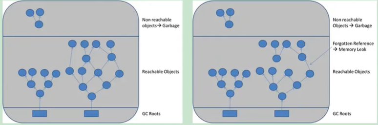

严格来说，只有对象不会再被程序用到了，但是GC又不能回收他们的情况，才叫内存泄漏。但实际情况很多时候一些不太好的实践（或疏忽）会导致对象的生命周期变得很长甚至导致00M，也可以叫做宽泛意义上的“内存泄漏”。
如下图，当Y生命周期结束的时候，X依然引用着Y，这时候，垃圾回收期是不会回收对象Y的；如果对象X还引用着生命周期比较短的A、B、C，对象A又引用着对象 a、b、c，这样就可能造成大量无用的对象不能被回收，进而占据了内存资源，造成内存泄漏，直到内存溢出。
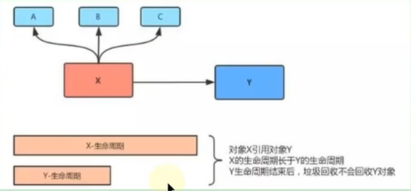

申请了内存用完了不释放，比如一共有1024M的内存，分配了512M的内存一直不回收，那么可以用的内存只有512M了，仿佛泄露掉了一部分；通俗一点讲的话，内存泄漏就是【占着茅坑不拉shi】

## 7. 内存溢出（out of memory）
申请内存时，没有足够的内存可以使用；通俗一点儿讲，一个厕所就三个坑，有两个站着茅坑不走的（内存泄漏），剩下最后一个坑，厕所表示接待压力很大，这时候一下子来了两个人，坑位（内存）就不够了，内存泄漏变成内存溢出了。可见，内存泄漏和内存溢出的关系：内存泄漏的增多，最终会导致内存溢出。
泄漏的分类

- 经常发生：发生内存泄露的代码会被多次执行，每次执行，泄露一块内存；
- 偶然发生：在某些特定情况下才会发生
- 一次性：发生内存泄露的方法只会执行一次；
- 隐式泄漏：一直占着内存不释放，直到执行结束；严格的说这个不算内存泄漏，因为最终释放掉了，但是如果执行时间特别长，也可能会导致内存耗尽。

## 8. Java中内存泄露的8种情况
### 8.1. 静态集合类
静态集合类，如HashMap、LinkedList等等。如果这些容器为静态的，那么它们的生命周期与JVM程序一致，则容器中的对象在程序结束之前将不能被释放，从而造成内存泄漏。简单而言，长生命周期的对象持有短生命周期对象的引用，尽管短生命周期的对象不再使用，但是因为长生命周期对象持有它的引用而导致不能被回收。
```java
public class MemoryLeak {
    static List list = new ArrayList();
    public void oomTests(){
        Object obj＝new Object();//局部变量
        list.add(obj);
    }
}
```

### 8.2. 单例模式
单例模式，和静态集合导致内存泄露的原因类似，因为单例的静态特性，它的生命周期和 JVM 的生命周期一样长，所以如果单例对象如果持有外部对象的引用，那么这个外部对象也不会被回收，那么就会造成内存泄漏。

### 8.3. 内部类持有外部类
内部类持有外部类，如果一个外部类的实例对象的方法返回了一个内部类的实例对象。这个内部类对象被长期引用了，即使那个外部类实例对象不再被使用，但由于内部类持有外部类的实例对象，这个外部类对象将不会被垃圾回收，这也会造成内存泄漏。

### 8.4. 各种连接，如数据库连接、网络连接和IO连接等
在对数据库进行操作的过程中，首先需要建立与数据库的连接，当不再使用时，需要调用close方法来释放与数据库的连接。只有连接被关闭后，垃圾回收器才会回收对应的对象。否则，如果在访问数据库的过程中，对Connection、Statement或ResultSet不显性地关闭，将会造成大量的对象无法被回收，从而引起内存泄漏。
```java
public static void main(String[] args) {
    try{
        Connection conn =null;
        Class.forName("com.mysql.jdbc.Driver");
        conn =DriverManager.getConnection("url","","");
        Statement stmt =conn.createStatement();
        ResultSet rs =stmt.executeQuery("....");
    } catch（Exception e）{//异常日志
    } finally {
        // 1．关闭结果集 Statement
        // 2．关闭声明的对象 ResultSet
        // 3．关闭连接 Connection
    }
}
```

### 8.5. 变量不合理的作用域
变量不合理的作用域。一般而言，一个变量的定义的作用范围大于其使用范围，很有可能会造成内存泄漏。另一方面，如果没有及时地把对象设置为null，很有可能导致内存泄漏的发生。
```java
public class UsingRandom {
    private String msg;
    public void receiveMsg(){
        readFromNet();//从网络中接受数据保存到msg中
        saveDB();//把msg保存到数据库中
    }
}
```

如上面这个伪代码，通过readFromNet方法把接受的消息保存在变量msg中，然后调用saveDB方法把msg的内容保存到数据库中，此时msg已经就没用了，由于msg的生命周期与对象的生命周期相同，此时msg还不能回收，因此造成了内存泄漏。实际上这个msg变量可以放在receiveMsg方法内部，当方法使用完，那么msg的生命周期也就结束，此时就可以回收了。还有一种方法，在使用完msg后，把msg设置为null，这样垃圾回收器也会回收msg的内存空间。

### 8.6. 改变哈希值
改变哈希值，当一个对象被存储进HashSet集合中以后，就不能修改这个对象中的那些参与计算哈希值的字段了。
否则，对象修改后的哈希值与最初存储进HashSet集合中时的哈希值就不同了，在这种情况下，即使在contains方法使用该对象的当前引用作为的参数去HashSet集合中检索对象，也将返回找不到对象的结果，这也会导致无法从HashSet集合中单独删除当前对象，造成内存泄漏。
这也是 String 为什么被设置成了不可变类型，我们可以放心地把 String 存入 HashSet，或者把String 当做 HashMap 的 key 值；
当我们想把自己定义的类保存到散列表的时候，需要保证对象的 hashCode 不可变。
```java
/**
 * 例1
 */
public class ChangeHashCode {
    public static void main(String[] args) {
        HashSet set = new HashSet();
        Person p1 = new Person(1001, "AA");
        Person p2 = new Person(1002, "BB");

        set.add(p1);
        set.add(p2);

        p1.name = "CC";//导致了内存的泄漏
        set.remove(p1); //删除失败

        System.out.println(set);

        set.add(new Person(1001, "CC"));
        System.out.println(set);

        set.add(new Person(1001, "AA"));
        System.out.println(set);

    }
}

class Person {
    int id;
    String name;

    public Person(int id, String name) {
        this.id = id;
        this.name = name;
    }

    @Override
    public boolean equals(Object o) {
        if (this == o) return true;
        if (!(o instanceof Person)) return false;

        Person person = (Person) o;

        if (id != person.id) return false;
        return name != null ? name.equals(person.name) : person.name == null;
    }

    @Override
    public int hashCode() {
        int result = id;
        result = 31 * result + (name != null ? name.hashCode() : 0);
        return result;
    }

    @Override
    public String toString() {
        return "Person{" +
                "id=" + id +
                ", name='" + name + '\'' +
                '}';
    }
}
```

```java
/**
 * 例2
 */
public class ChangeHashCode1 {
    public static void main(String[] args) {
        HashSet<Point> hs = new HashSet<Point>();
        Point cc = new Point();
        cc.setX(10);//hashCode = 41
        hs.add(cc);

        cc.setX(20);//hashCode = 51  此行为导致了内存的泄漏

        System.out.println("hs.remove = " + hs.remove(cc));//false
        hs.add(cc);
        System.out.println("hs.size = " + hs.size());//size = 2

        System.out.println(hs);
    }

}

class Point {
    int x;

    public int getX() {
        return x;
    }

    public void setX(int x) {
        this.x = x;
    }

    @Override
    public int hashCode() {
        final int prime = 31;
        int result = 1;
        result = prime * result + x;
        return result;
    }

    @Override
    public boolean equals(Object obj) {
        if (this == obj) return true;
        if (obj == null) return false;
        if (getClass() != obj.getClass()) return false;
        Point other = (Point) obj;
        if (x != other.x) return false;
        return true;
    }

    @Override
    public String toString() {
        return "Point{" +
                "x=" + x +
                '}';
    }
}
```

### 8.7. 缓存泄露
内存泄漏的另一个常见来源是缓存，一旦你把对象引用放入到缓存中，他就很容易遗忘。比如：之前项目在一次上线的时候，应用启动奇慢直到夯死，就是因为代码中会加载一个表中的数据到缓存（内存）中，测试环境只有几百条数据，但是生产环境有几百万的数据。
对于这个问题，可以使用WeakHashMap代表缓存，此种Map的特点是，当除了自身有对key的引用外，此key没有其他引用那么此map会自动丢弃此值。
```java
public class MapTest {
    static Map wMap = new WeakHashMap();
    static Map map = new HashMap();

    public static void main(String[] args) {
        init();
        testWeakHashMap();
        testHashMap();
    }

    public static void init() {
        String ref1 = new String("obejct1");
        String ref2 = new String("obejct2");
        String ref3 = new String("obejct3");
        String ref4 = new String("obejct4");
        wMap.put(ref1, "cacheObject1");
        wMap.put(ref2, "cacheObject2");
        map.put(ref3, "cacheObject3");
        map.put(ref4, "cacheObject4");
        System.out.println("String引用ref1，ref2，ref3，ref4 消失");

    }

    public static void testWeakHashMap() {
        System.out.println("WeakHashMap GC之前");
        for (Object o : wMap.entrySet()) {
            System.out.println(o);
        }
        try {
            System.gc();
            TimeUnit.SECONDS.sleep(5);
        } catch (InterruptedException e) {
            e.printStackTrace();
        }
        System.out.println("WeakHashMap GC之后");
        for (Object o : wMap.entrySet()) {
            System.out.println(o);
        }
    }

    public static void testHashMap() {
        System.out.println("HashMap GC之前");
        for (Object o : map.entrySet()) {
            System.out.println(o);
        }
        try {
            System.gc();
            TimeUnit.SECONDS.sleep(5);
        } catch (InterruptedException e) {
            e.printStackTrace();
        }
        System.out.println("HashMap GC之后");
        for (Object o : map.entrySet()) {
            System.out.println(o);
        }
    }

}
```

上面代码和图示主演演示WeakHashMap如何自动释放缓存对象，当init函数执行完成后，局部变量字符串引用weakd1，weakd2，d1，d2都会消失，此时只有静态map中保存中对字符串对象的引用，可以看到，调用gc之后，HashMap的没有被回收，而WeakHashMap里面的缓存被回收了。

### 8.8. 监听器和其他回调
内存泄漏第三个常见来源是监听器和其他回调，如果客户端在你实现的API中注册回调，却没有显示的取消，那么就会积聚。
需要确保回调立即被当作垃圾回收的最佳方法是只保存它的弱引用，例如将他们保存成为WeakHashMap中的键。

## 9. 内存泄露案例分析
```java
public class Stack {
    private Object[] elements;
    private int size = 0;
    private static final int DEFAULT_INITIAL_CAPACITY = 16;

    public Stack() {
        elements = new Object[DEFAULT_INITIAL_CAPACITY];
    }

    public void push(Object e) { //入栈
        ensureCapacity();
        elements[size++] = e;
    }

    public Object pop() { //出栈
        if (size == 0)
            throw new EmptyStackException();
        return elements[--size];
    }

    private void ensureCapacity() {
        if (elements.length == size)
            elements = Arrays.copyOf(elements, 2 * size + 1);
    }
}
```

上述程序并没有明显的错误，但是这段程序有一个内存泄漏，随着GC活动的增加，或者内存占用的不断增加，程序性能的降低就会表现出来，严重时可导致内存泄漏，但是这种失败情况相对较少。
代码的主要问题在pop函数，下面通过这张图示展现。假设这个栈一直增长，增长后如下图所示
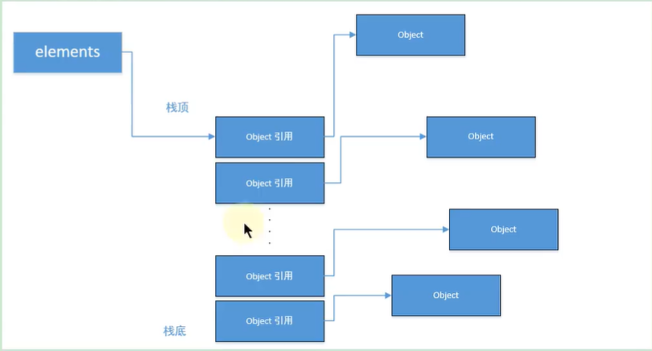

当进行大量的pop操作时，由于引用未进行置空，gc是不会释放的，如下图所示


从上图中看以看出，如果栈先增长，再收缩，那么从栈中弹出的对象将不会被当作垃圾回收，即使程序不再使用栈中的这些队象，他们也不会回收，因为栈中仍然保存这对象的引用，俗称过期引用，这个内存泄露很隐蔽。
将代码中的pop()方法变成如下方法：
```java
public Object pop() {
    if (size == 0)
        throw new EmptyStackException();
    Object result = elements[--size];
    elements[size] = null;
    return result;
}
```

一旦引用过期，清空这些引用，将引用置空。
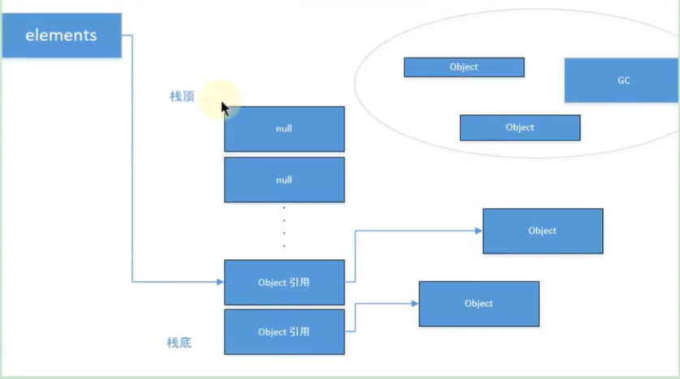

# 补充：使用OQL语言查询对象信息
MAT支持一种类似于SQL的查询语言OQL（Object Query Language）。OQL使用类SQL语法，可以在堆中进行对象的查找和筛选。

## 1. SELECT子句
在MAT中，Select子句的格式与SQL基本一致，用于指定要显示的列。Select子句中可以使用“＊”，查看结果对象的引用实例（相当于outgoing references）。
```sql
SELECT * FROM java.util.Vector v
```

使用“OBJECTS”关键字，可以将返回结果集中的项以对象的形式显示。
```sql
SELECT objects v.elementData FROM java.util.Vector v

SELECT OBJECTS s.value FROM java.lang.String s
```

在Select子句中，使用“AS RETAINED SET”关键字可以得到所得对象的保留集。
```sql
SELECT AS RETAINED SET *FROM com.atguigu.mat.Student
```

“DISTINCT”关键字用于在结果集中去除重复对象。
```sql
SELECT DISTINCT OBJECTS classof(s) FROM java.lang.String s
```

## 2. FROM子句
From子句用于指定查询范围，它可以指定类名、正则表达式或者对象地址。
```sql
SELECT * FROM java.lang.String s
```

使用正则表达式，限定搜索范围，输出所有com.atguigu包下所有类的实例
```sql
SELECT * FROM "com\.atguigu\..*"
```

使用类的地址进行搜索。使用类的地址的好处是可以区分被不同ClassLoader加载的同一种类型。
```sql
select * from 0x37a0b4d
```

## 3. WHERE子句
Where子句用于指定OQL的查询条件。OQL查询将只返回满足Where子句指定条件的对象。Where子句的格式与传统SQL极为相似。
返回长度大于10的char数组。
```sql
SELECT *FROM Ichar[] s WHERE s.@length>10
```

返回包含“java”子字符串的所有字符串，使用“LIKE”操作符，“LIKE”操作符的操作参数为正则表达式。
```sql
SELECT * FROM java.lang.String s WHERE toString(s) LIKE ".*java.*"
```

返回所有value域不为null的字符串，使用“＝”操作符。
```sql
SELECT * FROM java.lang.String s where s.value!=null
```

返回数组长度大于15，并且深堆大于1000字节的所有Vector对象。
```sql
SELECT * FROM java.util.Vector v WHERE v.elementData.@length>15 AND v.@retainedHeapSize>1000
```

## 4. 内置对象与方法
OQL中可以访问堆内对象的属性，也可以访问堆内代理对象的属性。访问堆内对象的属性时，格式如下，其中alias为对象名称：
[ <alias>. ] <field> . <field>. <field>
访问java.io.File对象的path属性，并进一步访问path的value属性：
```sql
SELECT toString(f.path.value) FROM java.io.File f
```

显示String对象的内容、objectid和objectAddress。
```sql
SELECT s.toString(),s.@objectId, s.@objectAddress FROM java.lang.String s
```

显示java.util.Vector内部数组的长度。
```sql
SELECT v.elementData.@length FROM java.util.Vector v
```
显示所有的java.util.Vector对象及其子类型
```sql
select * from INSTANCEOF java.util.Vector
```