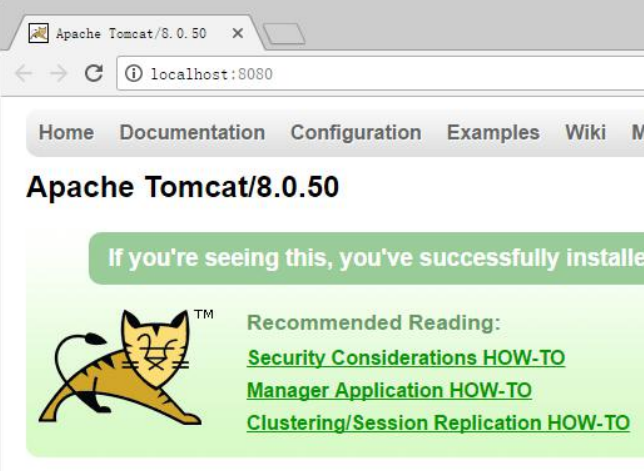
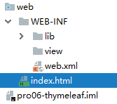

# 第一章 HTML 和 CSS
[https://www.w3school.com.cn/html/index.asp](https://www.w3school.com.cn/html/index.asp)
## 1、B/S 软件的结构

- JavaSE C/S Client Server
- B/S Browser Serve

## 2、前端的开发流程

## 3、网页的组成部分
页面由三部分内容组成！
分别是内容（结构）、表现、行为。

- **内容（结构）**，是我们在页面中可以看到的数据。我们称之为内容。一般内容 我们使用html 技术来展示。
- **表现**，指的是这些内容在页面上的展示形式。比如说。布局，颜色，大小等等。一般使用CSS 技术实现。
- **行为**，指的是页面中元素与输入设备交互的响应。一般使用 javascript 技术实现。
## 4、HTML 简介
**Hyper Text Markup Language** （超文本标记语言） 简写：HTML
HTML 通过标签来标记要显示的网页中的各个部分。网页文件本身是一种文本文件，通过在文本文件中添加标记符，可以告诉浏览器如何显示其中的内容（如：文字如何处理，画面如何安排，图片如何显示等）
## 5、HTML 文件的书写规范
```html
<!DOCTYPE html> <!--约束，声明-->
<html lang="en">    <!--表示html开始，lang表示语言-->
<head>  <!--头部信息，一般包括三部分，title标签，css样式，js代码-->
    <meta charset="UTF-8">  <!--当前页面字符集-->
    <title>标题</title>   <!--标题-->
</head>
<body bgcolor="#faebd7">  <!--整个html页面主体内容-->
页面主体内容
</body>
</html> <!--表示整个 html 页面的结束-->
```
## 6、HTML 标签介绍

1. 标签的格式:
`<标签名>封装的数据</标签名>`
1. 标签名大小写不敏感。
1. 标签拥有自己的属性。
   - 基本属性：`bgcolor="red"`可以修改简单的样式效果
   - 事件属性： `onclick="alert('你好！');"` 可以直接设置事件响应后的代码。
4. 标签又分为，单标签和双标签。
   - 单标签格式： `<标签名 />`  如br 换行 hr 水平线
   - 双标签格式: `<标签名> ...封装的数据...</标签名>`
## 8、常用标签介绍 
文档：w3cschool.CHM
[https://www.w3cschool.cn/html/](https://www.w3cschool.cn/html/)
### 8.1、font 字体标签
```html
<body>
<!-- 字体标签
font 标签是字体标签,它可以用来修改文本的字体,颜色,大小(尺寸)
color 属性修改颜色
face 属性修改字体
size 属性修改文本大小 -->
<font color="red" face="宋体" size="7">我是字体标签</font>
</body>
```
### 8.2、特殊字符
[网页特殊符号(HTML字符实体)大全_前端向朔的博客-CSDN博客_html实体字符大全](https://blog.csdn.net/u013778905/article/details/53177042)
### 8.3、标题标签
标题标签是 h1 到 h6
```html
<body>
  <!-- 标题标签
  需求 1：演示标题 1 到 标题 6 的
  h1 - h6 都是标题标签
  h1 最大
  h6 最小
  align 属性是对齐属性
    left 左对齐(默认)
    center 剧中
    right 右对齐
  -->
  <h1 align="left">标题 1</h1>
  <h2 align="center">标题 2</h2>
  <h3 align="right">标题 3</h3>
  <h4>标题 4</h4>
  <h5>标题 5</h5>
  <h6>标题 6</h6>
  <h7>标题 7</h7>
</body>
```
### 8.4、超链接（重点）
```html
<body>
  <!-- a 标签是 超链接
  href 属性设置连接的地址
  target 属性设置哪个目标进行跳转
    _self 表示当前页面(默认值)
    _blank 表示打开新页面来进行跳转 -->
  <a href="http://localhost:8080">百度</a><br/>
  <a href="http://localhost:8080" target="_self">百度_self</a><br/>
  <a href="http://localhost:8080" target="_blank">百度_blank</a><br/>
</body>
```
### 8.5、列表标签
```html
<body>
  <!--需求 1：使用无序，列表方式，把东北 F4，赵四，刘能，小沈阳，宋小宝，展示出来
  ul 是无序列表 ol 是有序列表
    type 属性可以修改列表项前面的符号
    li 是列表项
  -->
  <ul type="none">
    <li>赵四</li>
    <li>刘能</li>
    <li>小沈阳</li>
    <li>宋小宝</li>
  </ul>
</body>
```
### 8.6、img 标签
img 标签可以在 html 页面上显示图片。
```html
<body>
  <!--需求 1：使用 img 标签显示一张美女的照片。并修改宽高，和边框属性
  img 标签是图片标签,用来显示图片
  src 属性可以设置图片的路径
  width 属性设置图片的宽度
  height 属性设置图片的高度
  border 属性设置图片边框大小
  alt 属性设置当指定路径找不到图片时,用来代替显示的文本内容
  在 JavaSE 中路径也分为相对路径和绝对路径. 相对路径:从工程名开始算
  绝对路径:盘符:/目录/文件名
  在 web 中路径分为相对路径和绝对路径两种
  相对路径:
  . 表示当前文件所在的目录
  .. 表示当前文件所在的上一级目录
  文件名 表示当前文件所在目录的文件,相当于 ./文件名 ./ 可以省略
  绝对路径:
  正确格式是: http://ip:port/工程名/资源路径
  错误格式是: 盘符:/目录/文件名
  -->
  
  
  
  
  
  
</body>
```
### 8.7、表格标签（重点）
```html
<body bgcolor="#faebd7">
  <!--需求 1：做一个 带表头的 ，三行，三列的表格，并显示边框
  需求 2：修改表格的宽度，高度，表格的对齐方式，单元格间距。
  table 标签是表格标签
  border 设置表格标签
  width 设置表格宽度
  height 设置表格高度
  align 设置表格相对于页面的对齐方式
  cellspacing 设置单元格间距
  tr 是行标签
  th 是表头标签
  td 是单元格标签
  align 设置单元格文本对齐方式
  b 是加粗标签
  -->
  <table align="center" border="1" width="300" cellspacing="0">
      <tr>
          <th>1.1</th>
          <th>1.2</th>
          <th>1.3</th>
      </tr>
      <tr>
          <td>2.1</td>
          <td>2.2</td>
          <td>2.3</td>
      </tr>
      <tr>
          <td>3.1</td>
          <td>3.2</td>
          <td>3.3</td>
      </tr>
  </table>
</body>
```
### 8.8、跨行跨列表格 （次重点）
```html
<!-- 需求 1：
新建一个五行，五列的表格，
第一行，第一列的单元格要跨两列，
第二行第一列的单元格跨两行，
第四行第四列的单元格跨两行两列。
colspan 属性设置跨列
rowspan 属性设置跨行
-->
<table width="500" cellspacing="0" border="1">
    <tr>
        <td colspan="2">1.1</td>
        <td>1.3</td>
        <td>1.4</td>
        <td>1.5</td>
    </tr>
    <tr>
        <td rowspan="2">2.1</td>
        <td>2.2</td>
        <td>2.3</td>
        <td>2.4</td>
        <td>2.5</td>
    </tr>
    <tr>
        <td>3.2</td>
        <td>3.3</td>
        <td>3.4</td>
        <td>3.5</td>
    </tr>
    <tr>
        <td>4.1</td>
        <td>4.2</td>
        <td>4.3</td>
        <td colspan="2" rowspan="2">4.4</td>
    </tr>
    <tr>
        <td>5.1</td>
        <td>5.2</td>
        <td>5.3</td>
    </tr>
</table>
```
### 8.9、iframe 框架标签 (内嵌窗口)
ifarme 标签它可以在一个 html 页面上,打开一个小窗口,去加载一个单独的页面。
### 8.10、表单标签 （重点）
表单就是 html 页面中,用来收集用户信息的所有元素集合.然后把这些信息发送给服务器。


-  表单的显示:  
```html
<!--需求 1:创建一个个人信息注册的表单界面。包含用户名，密码，确认密码。性别（单选），兴趣爱好（多选），国籍（下拉列表）。
隐藏域，自我评价（多行文本域）。重置，提交。
form 标签就是表单
input type=text 是文件输入框 value 设置默认显示内容
input type=password 是密码输入框 value 设置默认显示内容
input type=radio 是单选框 name 属性可以对其进行分组 checked="checked"表示默认选中
input type=checkbox 是复选框 checked="checked"表示默认选中
input type=reset 是重置按钮 value 属性修改按钮上的文本
input type=submit 是提交按钮 value 属性修改按钮上的文本
input type=button 是按钮 value 属性修改按钮上的文本
input type=file 是文件上传域
input type=hidden 是隐藏域 当我们要发送某些信息，而这些信息，不需要用户参与，就可以使用隐藏域（提交的
时候同时发送给服务器）
select 标签是下拉列表框
option 标签是下拉列表框中的选项 selected="selected"设置默认选中
textarea 表示多行文本输入框 （起始标签和结束标签中的内容是默认值）
rows 属性设置可以显示几行的高度
cols 属性设置每行可以显示几个字符宽度
-->
<form>
    用户名称：<input type="text" value="默认值"/><br/>
    用户密码：<input type="password" value="abc"/><br/>
    确认密码：<input type="password" value="abc"/><br/>
    性别：<input type="radio" name="sex"/>男<input type="radio" name="sex" checked="checked" />女<br/>
    兴趣爱好：<input type="checkbox" checked="checked" />Java<input type="checkbox" />JavaScript<input
        type="checkbox" />C++<br/>
    国籍：<select>
    <option>--请选择国籍--</option>
    <option selected="selected">中国</option>
    <option>美国</option>
    <option>小日本</option>
</select><br/>
    自我评价：<textarea rows="10" cols="20">我才是默认值</textarea><br/>
    <input type="reset" value="abc" />
    <input type="submit"/>
</form>
```

-  表单格式化:  
```html
<form>
    <h1 align="center">用户注册</h1>
    <table align="center">
        <tr>
            <td> 用户名称：</td>
            <td>
                <input type="text" value="默认值"/>
            </td>
        </tr>
        <tr>
            <td> 用户密码：</td>
            <td><input type="password" value="abc"/></td>
        </tr>
        <tr>
            <td>确认密码：</td>
            <td><input type="password" value="abc"/></td>
        </tr>
        <tr>
            <td>性别：</td>
            <td>
                <input type="radio" name="sex"/>男
                <input type="radio" name="sex" checked="checked" />女
            </td>
        </tr>
        <tr>
            <td> 兴趣爱好：</td>
            <td>
                <input type="checkbox" checked="checked" />Java
                <input type="checkbox" />JavaScript
                <input type="checkbox" />C++
            </td>
        </tr>
        <tr>
            <td>国籍：</td>
            <td>
                <select>
                    <option>--请选择国籍--</option>
                    <option selected="selected">中国</option>
                    <option>美国</option>
                    <option>小日本</option>
                </select>
            </td>
        </tr>
        <tr>
            <td>自我评价：</td>
            <td><textarea rows="10" cols="20">我才是默认值</textarea></td>
        </tr>
        <tr>
            <td><input type="reset" /></td>
            <td align="center"><input type="submit"/></td>
        </tr>
    </table>
</form>
```

-  表单提交细节:  
```html
form 标签是表单标签
action 属性设置提交的服务器地址
method 属性设置提交的方式 GET(默认值)或 POST
表单提交的时候，数据没有发送给服务器的三种情况：
  1、表单项没有 name 属性值
  2、单选、复选（下拉列表中的 option 标签）都需要添加 value 属性，以便发送给服务器
  3、表单项不在提交的 form 标签中
GET 请求的特点是：
  1、浏览器地址栏中的地址是：action 属性[+?+请求参数]
请求参数的格式是：name=value&name=value
  2、不安全
  3、它有数据长度的限制
POST 请求的特点是：
  1、浏览器地址栏中只有 action 属性值
  2、相对于 GET 请求要安全
  3、理论上没有数据长度的限制
```
### 8.11 其他标签
```html
<!--需求 1：div、span、p 标签的演示
div 标签 默认独占一行
span 标签 它的长度是封装数据的长度
p 段落标签 默认会在段落的上方或下方各空出一行来（如果已有就不再空）
-->
<div>div 标签 1</div>
<div>div 标签 2</div>
<span>span 标签 1</span>
<span>span 标签 2</span>
<p>p 段落标签 1</p>
<p>p 段落标签 2</p>
```
## 9、CSS 技术
文档:
[CSS 教程 (w3school.com.cn)](https://www.w3school.com.cn/css/index.asp)
### 9.1、CSS 技术介绍
CSS 是「层叠样式表单」。是用于(增强)控制网页样式并允许将样式信息与网页内容分离的一种标记性语言。
### 9.2、CSS 语法规则


- **选择器：**浏览器根据“选择器”决定受 CSS 样式影响的 HTML 元素（标签）。
- **属性 (property)：**是你要改变的样式名，并且每个属性都有一个值。属性和值被冒号分开，并由花括号包围，这样就组成了一个完整的样式声明（declaration），例如：p {color: blue}。
- **多个声明：**如果要定义不止一个声明，则需要用分号将每个声明分开。虽然最后一条声明的最后可以不加分号(但尽量在每条声明的末尾都加上分号)。
```css
p{
  color:red;
  font-size:30px;
}
/*注释内容*/
```
注：一般每行只描述一个属性
### 9.3、CSS 和 HTML 的结合方式
#### 9.3.1、style 属性上修改标签样式。
```css
<body>
<!--需求 1：分别定义两个 div、span 标签，分别修改每个 div 标签的样式为：边框 1 个像素，实线，红色。-->
<div style="border: 1px solid red;">div 标签 1</div>
<div style="border: 1px solid red;">div 标签 2</div>
<span style="border: 1px solid red;">span 标签 1</span>
<span style="border: 1px solid red;">span 标签 2</span>
</body>
```
> 问题：
> 1. 如果标签多了。样式多了。代码量非常庞大。
> 1. 可读性非常差。
> 1. CSS 代码没什么复用性。  

#### 9.3.2、head 标签中定义 css 样式
```css
<!DOCTYPE html>
<html lang="en">
<head>
    <meta charset="UTF-8">
    <title>Title</title>
    <!--style 标签专门用来定义 css 样式代码-->
    <style type="text/css">
        /* 需求 1：分别定义两个 div、span 标签，分别修改每个 div 标签的样式为：边框 1 个像素，实线，红色。*/
        div{
            border: 1px solid red;
        }
        span{
            border: 1px solid red;
        }
    </style>
</head>
<body>
  <div>div 标签 1</div>
  <div>div 标签 2</div>
  <span>span 标签 1</span>
  <span>span 标签 2</span>
</body>
</html>
```
>  问题：
>  1. 只能在同一页面内复用代码，不能在多个页面中复用 css 代码。
>  1. 维护起来不方便，实际的项目中会有成千上万的页面，要到每个页面中去修改。工作量太大了。  

#### 9.3.3、把 css 样式写成单独文件
```css
div{
  border: 1px solid yellow;
}
span{
  border: 1px solid red;
}
```
```html
<!DOCTYPE html>
<html lang="en">
  <head>
    <meta charset="UTF-8">
    <title>Title</title>
    <!--link 标签专门用来引入 css 样式代码-->
    <link rel="stylesheet" type="text/css" href="1.css"/>
  </head>
  <body>
    <div>div 标签 1</div>
    <div>div 标签 2</div>
    <span>span 标签 1</span>
    <span>span 标签 2</span>
  </body>
</html>
```
### 9.4、CSS 选择器
#### 9.4.1、标签名选择器
```css
div{
  border: 1px solid yellow;
  color: blue;
  font-size: 30px;
}
span{
  border: 5px dashed blue;
  color: yellow;
  font-size: 20px;
}
```
#### 9.4.2、id 选择器
```html
<!DOCTYPE html>
<html>
  <head>
    <meta charset="UTF-8">
    <title>ID 选择器</title>
    <style type="text/css">
      #id001{
        color: blue;
        font-size: 30px;
        border: 1px yellow solid;
      }
      #id002{
        color: red;
        font-size: 20px;
        border: 5px blue dotted ;
      }
    </style>
  </head>
  <body>
    <div id="id002">div 标签 1</div>
    <div id="id001">div 标签 2</div>
  </body>
</html>
```
#### 9.4.3、class 选择器（类选择器）
```html
<!DOCTYPE html>
<html>
  <head>
    <meta charset="UTF-8">
    <title>class 类型选择器</title>
    <style type="text/css">
      .class01{
        color: blue;
        font-size: 30px;
        border: 1px solid yellow;
      }
      .class02{
        color: grey;
        font-size: 26px;
        border: 1px solid red;
      }
    </style>
  </head>
  <body>
    <div class="class01">div 标签 class01</div>
    <div class="class02">div 标签</div>
    <span class="class02">span 标签 class01</span>
    <span>span 标签 2</span>
  </body>
</html>
```
#### 9.4.4、组合选择器
```html
<!DOCTYPE html>
<html>
  <head>
    <meta charset="UTF-8">
    <title>class 类型选择器</title>
    <style type="text/css">
      .class01 , #id01{
        color: blue;
        font-size: 20px;
        border: 1px yellow solid;
      }
    </style>
  </head>
  <body>
    <div id="id01">div 标签 id01</div> 

    <span class="class01">span 标签</span> 

  </body>
</html>
```
### 9.5、常用样式：
#### 9.5.1、字体颜色
color：red；
颜色可以写颜色名如：black, blue, red, green 等
颜色也可以写 rgb 值和十六进制表示值：如 rgb(255,0,0)，#00F6DE，如果写十六进制值必须加#
#### 9.5.2、宽度
width:19px;
宽度可以写像素值：19px；
也可以写百分比值：20%；
#### 9.5.3、高度
height:20px;
高度可以写像素值：19px；
也可以写百分比值：20%；
#### 9.5.4、背景颜色
background-color:#0F2D4C
#### 9.5.5、字体样式：
color：#FF0000；字体颜色红色
font-size：20px; 字体大小
#### 9.5.6、红色 1 像素实线边框
border：1px solid red;
#### 9.5.7、DIV 居中
margin-left: auto;
margin-right: auto;
#### 9.5.8、文本居中：
text-align: center;
#### 9.5.9、超连接去下划线
text-decoration: none;
#### 9.5.10、表格细线
table {
border: 1px solid black; /*设置边框*/
border-collapse: collapse; /*将边框合并*/
}
td,th {
border: 1px solid black; /*设置边框*/
}
#### 9.5.11、列表去除修饰
ul {
list-style: none;
}
# 第二章 JavaScript
## 1、JavaScript 介绍
Javascript 语言诞生主要是完成页面的数据验证。因此它运行在客户端，需要运行浏览器来解析执行 JavaScript 代码。
JS 是 Netscape 网景公司的产品，最早取名为 LiveScript;为了吸引更多 java 程序员。更名为 JavaScript。
**JS 是弱类型，Java 是强类型。**
特点：

1. 交互性（它可以做的就是信息的动态交互）
1. 安全性（不允许直接访问本地硬盘）
1. 跨平台性（只要是可以解释 JS 的浏览器都可以执行，和平台无关）
## 2、JavaScript 和 html 结合方式
### 2.1、第一种方式
只需要在 head 标签中，或者在 body 标签中， 使用 script 标签 来书写 JavaScript 代码。
```html
<!DOCTYPE html>
<html lang="en">
  <head>
    <meta charset="UTF-8">
    <title>Title</title>
    <script type="text/javascript">
      // alert 是 JavaScript 语言提供的一个警告框函数。
      // 它可以接收任意类型的参数，这个参数就是警告框的提示信息
      alert("hello javaScript!");
    </script>
  </head>
  <body>
  </body>
</html>
```
### 2.2、第二种方式
使用 script 标签引入 单独的 JavaScript 代码文件。
```html
<!DOCTYPE html>
<html lang="en">
  <head>
    <meta charset="UTF-8">
    <title>Title</title>
    <!--现在需要使用 script 引入外部的 js 文件来执行
  src 属性专门用来引入 js 文件路径（可以是相对路径，也可以是绝对路径）
  script 标签可以用来定义 js 代码，也可以用来引入 js 文件
  但是，两个功能二选一使用。不能同时使用两个功能
  -->
    <script type="text/javascript" src="1.js"></script>
    <script type="text/javascript">
      alert("国哥现在可以帅了");
    </script>
  </head>
  <body>
  </body>
</html>
```
## 3、变量
变量是可以存放某些值的内存的命名。

- **JavaScript 的变量类型：**
   - 数值类型： number
   - 字符串类型： string
   - 对象类型： object
   - 布尔类型： boolean
   - 函数类型： function
- **JavaScript 里特殊的值：**
   - undefined 未定义，所有 js 变量未赋于初始值的时候，默认值都是 undefined.
   - null 空值
   - NaN 全称是：Not a Number。非数字。非数值。
- **JS 中的定义变量格式：**
   - var 变量名;
   - var 变量名 = 值;
```html
<!DOCTYPE html>
<html lang="en">
  <head>
    <meta charset="UTF-8">
    <title>Title</title>
    <script type="text/javascript">
      var i;
      // alert(i); // undefined
      i = 12;
      // typeof()是 JavaScript 语言提供的一个函数。
      // alert( typeof(i) ); // number
      i = "abc";
      // 它可以取变量的数据类型返回
      // alert( typeof(i) ); // String
      var a = 12;
      var b = "abc";
      alert( a * b ); // NaN 是非数字，非数值。
    </script>
  </head>
  <body>
  </body>
</html>
```
## 4、关系（比较）运算

- **等于：** 
== 等于是简单的做字面值的比较
- **全等于： **
=== 除了做字面值的比较之外，还会比较两个变量的数据类型
```html
<!DOCTYPE html>
<html lang="en">
  <head>
    <meta charset="UTF-8">
    <title>Title</title>
    <script type="text/javascript">
      var a = "12";
      var b = 12;
      alert( a == b ); // true
      alert( a === b ); // false
    </script>
  </head>
  <body>
  </body>
</html>
```
## 5、逻辑运算

- 且运算： &&
- 或运算： ||
- 取反运算： !

在 JavaScript 语言中，所有的变量，都可以做为一个 boolean 类型的变量去使用。
**0 、null、 undefined、””(空串) 都认为是 false**
## 6、数组（重点）
var 数组名 = []; // 空数组
var 数组名 = [1 , ’abc’ , true]; // 定义数组同时赋值元素
```html
<!DOCTYPE html>
<html lang="en">
  <head>
    <meta charset="UTF-8">
    <title>Title</title>
    <script type="text/javascript">
      var arr = []; // 定义一个空数组
      arr[0] = 12;
      // javaScript 语言中的数组，只要我们通过数组下标赋值，那么最大的下标值，就会自动的给数组做扩容操作。
      arr[2] = "abc";
      alert(arr.length); //3
      // alert(arr[1]);// undefined
      // 数组的遍历
      for (var i = 0; i < arr.length; i++){
        alert(arr[i]);
      }
    </script>
  </head>
  <body>
  </body>
</html>
```
## 7、函数(重点)
### 7.1、二种定义方式
第一种，可以使用 function 关键字来定义函数。
使用的格式如下:
function 函数名(形参列表){
函数体
}
在 JavaScript 语言中，如何定义带有返回值的函数？
只需要在函数体内直接使用 return 语句返回值即可
```javascript
<script type="text/javascript">
    var fun = function () {
        alert("无参函数");
    }
    // fun();
    var fun2 = function (a,b) {
        alert("有参函数 a=" + a + ",b=" + b);
    }
    // fun2(1,2);
    var fun3 = function (num1,num2) {
        return num1 + num2;
    }
    alert( fun3(100,200) );
</script>
```
在 Java 中函数允许重载。但是在 JS 中函数的重载会直接覆盖掉上一次的定义
```javascript
<script type="text/javascript">
    function fun() { //被覆盖,不会执行
        alert("无参函数 fun()");
    }
    function fun(a,b) {
        alert("有参函数 fun(a,b)");
    }
    fun();
</script>
```
### 8.2、arguments 隐形参数（只在 function 函数内）
就是在 function 函数中不需要定义，但却可以直接用来获取所有参数的变量。我们管它叫隐形参数。
隐形参数特别像 java 基础的可变长参数一样。
public void fun( Object ... args );
可变长参数其他是一个数组。
那么 js 中的隐形参数也跟 
```javascript
<script type="text/javascript">
    function fun(a) {
        alert( arguments.length );//可看参数个数
        alert( arguments[0] );
        alert( arguments[1] );
        alert( arguments[2] );
        alert("a = " + a);
        for (var i = 0; i < arguments.length; i++){
            alert( arguments[i] );
        }
        alert("无参函数 fun()");
    }
    // fun(1,"ad",true);
    // 需求：要求 编写 一个函数。用于计算所有参数相加的和并返回
    function sum(num1,num2) {
        var result = 0;
        for (var i = 0; i < arguments.length; i++) {
            if (typeof(arguments[i]) == "number") {
                result += arguments[i];
            }
        }
        return result;
    }
    alert( sum(1,2,3,4,"abc",5,6,7,8,9) );
    fun(1,2,3,4,"abc",5,6,7,8,9);
</script>
```
## 8、自定义对象（扩展内容）
```javascript
<script type="text/javascript">
    // 对象的定义：
    // var 变量名 = new Object(); // 对象实例（空对象）
    // 变量名.属性名 = 值; // 定义一个属性
    // 变量名.函数名 = function(){} // 定义一个函数
    var obj = new Object();
    obj.name = "华仔";
    obj.age = 18;
    obj.fun = function () {
        alert("姓名：" + this.name + " , 年龄：" + this.age);
    }
    // 对象的访问：
    // 变量名.属性 / 函数名();
    // alert( obj.age );
    obj.fun();
</script>
```
**{}花括号形式的自定义对象**
```javascript
<script type="text/javascript">
    var obj = {
        name:"国哥",
        age:18,
        fun : function () {
            alert("姓名：" + this.name + " , 年龄：" + this.age);
        }
    };
    // 对象的访问：
    // 变量名.属性 / 函数名();
    alert(obj.name);
    obj.fun();
</script>
```
## 9、事件
### 9.1、基本介绍
什么是事件？
事件是电脑输入设备与页面进行交互的响应。我们称之为事件。

- **常用的事件：**
   - onload 加载完成事件： 页面加载完成之后，常用于做页面 js 代码初始化操作
   - onclick 单击事件： 常用于按钮的点击响应操作。
   - onblur 失去焦点事件： 常用用于输入框失去焦点后验证其输入内容是否合法。
   - onchange 内容发生改变事件： 常用于下拉列表和输入框内容发生改变后操作
   - onsubmit 表单提交事件： 常用于表单提交前，验证所有表单项是否合法。 
- **事件的注册：**
什么是事件的注册（绑定）？
其实就是告诉浏览器，当事件响应后要执行哪些操作代码，叫事件注册或事件绑定。 
   - 静态注册事件：
通过 html 标签的事件属性直接赋于事件响应后的代码，这种方式我们叫静态注册。 
   - 动态注册事件：
是指先通过 js 代码得到标签的 dom 对象，然后再通过 `dom 对象.事件名 = function(){}` 这种形式赋于事件响应后的代码，叫动态注册。
- 动态注册基本步骤：
   1. 获取标签对象
   1. 标签对象.事件名 = fucntion(){}
### 9.2、onload 加载完成事件
```html
<!DOCTYPE html>
<html lang="en">
  <head>
    <meta charset="UTF-8">
    <title>Title</title>
    <script type="text/javascript">
      // onload 事件是浏览器解析完页面之后就会自动触发的事件
      function onloadFun() {
        alert('静态注册 onload 事件，所有代码');
      }
      //动态注册 onload 事件。是固定写法
      window.onload = function () {
        alert("动态注册的 onload 事件");
      }
    </script>
  </head>
  <!--静态注册 onload 事件
<body onload="onloadFun();">
-->
  <body>
  </body>
</html>
```
### 9.3、onclick 单击事件
```html
<!DOCTYPE html>
<html lang="en">
  <head>
    <meta charset="UTF-8">
    <title>Title</title>
    <script type="text/javascript">
      function onclickFun() {
        alert("静态注册 onclick 事件");
      }
      // 动态注册 onclick 事件
      window.onload = function () {
        /* 1 获取标签对象
        * document 是 JavaScript 语言提供的一个对象（文档）
        * get 获取
        * Element 元素（就是标签）
        * By 通过。。 由。。经。。。
        * Id id 属性
        * getElementById 通过 id 属性获取标签对象
        **/
        var btnObj = document.getElementById("btn01");
        alert( btnObj );
        // 2 通过标签对象.事件名 = function(){}
        btnObj.onclick = function () {
          alert("动态注册的 onclick 事件");
        }
      }
    </script>
  </head>
  <body>
    <!--静态注册 onClick 事件-->
    <button onclick="onclickFun();">静态onClick事件</button>
    <button id="btn01">动态onClick事件</button>
  </body>
</html>
```
### 9.4、onblur 失去焦点事件
```html
<!DOCTYPE html>
<html lang="en">
  <head>
    <meta charset="UTF-8">
    <title>Title</title>
    <script type="text/javascript">
      // 静态注册失去焦点事件
      function onblurFun() {
        // console 是控制台对象，是由 JavaScript 语言提供，专门用来向浏览器的控制器打印输出， 用于测试使用
        // log() 是打印的方法
        console.log("静态注册失去焦点事件");
      }
      // 动态注册 onblur 事件
      window.onload = function () {
        //1 获取标签对象
        var passwordObj = document.getElementById("password");
        // alert(passwordObj);
        //2 通过标签对象.事件名 = function(){};
        passwordObj.onblur = function () {
          console.log("动态注册失去焦点事件");
        }
      }
    </script>
  </head>
  <body>
    用户名:<input type="text" onblur="onblurFun();"><br/>
    密码:<input id="password" type="text" ><br/>
  </body>
</html>
```
### 9.5、onchange 内容发生改变事件
```html
<!DOCTYPE html>
<html lang="en">
  <head>
    <meta charset="UTF-8">
    <title>Title</title>
    <script type="text/javascript">
      function onchangeFun() {
        alert("女神已经改变了");
      }
      window.onload = function () {
        //1 获取标签对象
        var selObj = document.getElementById("sel01");
        // alert( selObj );
        //2 通过标签对象.事件名 = function(){}
        selObj.onchange = function () {
          alert("男神已经改变了");
        }
      }
    </script>
  </head>
  <body>
    请选择你心中的女神：
    <!--静态注册 onchange 事件-->
    <select onchange="onchangeFun();">
      <option>--女神--</option>
      <option>芳芳</option>
      <option>佳佳</option>
      <option>娘娘</option>
    </select>
    请选择你心中的男神：
    <select id="sel01">
      <option>--男神--</option>
      <option>国哥</option>
      <option>华仔</option>
      <option>富城</option>
    </select>
  </body>
</html>
```
### 9.6、onsubmit 表单提交事件
```html
<!DOCTYPE html>
<html lang="en">
<head>
    <meta charset="UTF-8">
    <title>Title</title>
    <script type="text/javascript" >
        // 静态注册表单提交事务
        function onsubmitFun(){
            // 要验证所有表单项是否合法，如果，有一个不合法就阻止表单提交
            alert("静态注册表单提交事件----发现不合法");
            return flase;
        }
        
        window.onload = function () {
            //1 获取标签对象
            var formObj = document.getElementById("form01");
            //2 通过标签对象.事件名 = function(){}
            formObj.onsubmit = function () {
                // 要验证所有表单项是否合法，如果，有一个不合法就阻止表单提交
                alert("动态注册表单提交事件----发现不合法");
                return false;
            }
        }
    </script>
</head>
<body>
<!--return false 可以阻止 表单提交 -->
<form action="http://localhost:8080" method="get" onsubmit="return onsubmitFun();">
    <input type="submit" value="静态注册"/>
</form>

<form action="http://localhost:8080" id="form01">
    <input type="submit" value="动态注册"/>
</form>
</body>
</html>
```
## 10、DOM 模型
DOM 全称是 Document Object Model 文档对象模型
就是把文档中的标签，属性，文本，转换成为对象来管理。
### 10.1、Document 对象（重点）

- Document 对象的理解：
   - 它管理了**所有的 HTML 文档内容**。
   - 它是一种**树结构的文档，有层级关系。**
   - 它让我们把所有的标签都**对象化。**
   - 我们可以通过 document** 访问所有的标签对象。**
- html 标签对象化实例

模拟对象化，相当于：
```java
class Dom{
    private String id; // id 属性
    private String tagName; //表示标签名
    private Dom parentNode; //父亲
    private List<Dom> children; // 孩子结点
    private String innerHTML; // 起始标签和结束标签中间的内容
}
```
### 10.4、Document 方法介绍（重点）
#### 10.4.1、getElementById
通过标签的 id 属性查找标签 dom 对象，elementId 是标签的 id 属性值
```html
<!DOCTYPE html>
<html lang="en">
  <head>
    <meta charset="UTF-8">
    <title>Title</title>
    <script type="text/javascript" >
      /*
      * 需求：当用户点击了较验按钮，要获取输出框中的内容。然后验证其是否合法。<br/>
      * 验证的规则是：必须由字母，数字。下划线组成。并且长度是 5 到 12 位。
      * */
      function onclickFun() {
        // 1 当我们要操作一个标签的时候，一定要先获取这个标签对象。
        var usernameObj = document.getElementById("username");
        var usernameText = usernameObj.value;
        // 如何 验证 字符串，符合某个规则 ，需要使用正则表达式技术
        var patt = /^\w{5,12}$/;
        
        var usernameSpanObj = document.getElementById("usernameSpan");
        
        //test()方法用于测试某个字符串，是不是匹配我的规则，匹配就返回 true。否则 false.
        if (patt.test(usernameText)) {
          // innerHTML 表示起始标签和结束标签中的内容，这个属性可读，可写
          usernameSpanObj.innerHTML = "用户名合法！";
        } else {
          usernameSpanObj.innerHTML = "用户名不合法！";
        }
      }
    </script>
  </head>
  <body>
    用户名：<input type="text" id="username" value="wzg"/>
    <span id="usernameSpan" style="color:red;">
    </span>
    <button onclick="onclickFun()">较验</button>
  </body>
</html>
```
#### 10.4.2、getElementsByName
通过标签的 name 属性查找标签 dom 对象，elementName 标签的 name 属性值
```html
<!DOCTYPE html>
<html lang="en">
<head>
    <meta charset="UTF-8">
    <title>Title</title>
    <script type="text/javascript">
        // 全选
        function checkAll() {
            // 让所有复选框都选中
            // document.getElementsByName();是根据 指定的 name 属性查询返回多个标签对象集合
            // 这个集合的操作跟数组 一样
            // 集合中每个元素都是 dom 对象
            // 这个集合中的元素顺序是他们在 html 页面中从上到下的顺序
            var hobbies = document.getElementsByName("hobby");
            // checked 表示复选框的选中状态。如果选中是 true，不选中是 false
            // checked 这个属性可读，可写
            for (var i = 0; i < hobbies.length; i++) {
                hobbies[i].checked = true;
            }
        }

        //全不选
        function checkNo() {
            var hobbies = document.getElementsByName("hobby");
            // checked 表示复选框的选中状态。如果选中是 true，不选中是 false
            // checked 这个属性可读，可写
            for (var i = 0; i < hobbies.length; i++) {
                hobbies[i].checked = false;
            }
        }

        // 反选
        function checkReverse() {
            var hobbies = document.getElementsByName("hobby");
            for (var i = 0; i < hobbies.length; i++) {
                hobbies[i].checked = !hobbies[i].checked;
            }
        }
    </script>
</head>
<body>
兴趣爱好：
<input type="checkbox" name="hobby" value="cpp" checked="checked">C++
<input type="checkbox" name="hobby" value="java">Java
<input type="checkbox" name="hobby" value="js">JavaScript
<br/>
<button onclick="checkAll()">全选</button>
<button onclick="checkNo()">全不选</button>
<button onclick="checkReverse()">反选</button>
</body>
</html>
```
#### 10.4.3、getElementsByTagName
通过标签名查找标签 dom 对象。tagname 是标签名
```html
<!DOCTYPE html>
<html lang="en">
<head>
    <meta charset="UTF-8">
    <title>Title</title>
    <script type="text/javascript">
        // 全选
        function checkAll() {
            // document.getElementsByTagName("input");
            // 是按照指定标签名来进行查询并返回集合
            // 这个集合的操作跟数组 一样
            // 集合中都是 dom 对象
            // 集合中元素顺序 是他们在 html 页面中从上到下的顺序。
            var inputs = document.getElementsByTagName("input");
            for (var i = 0; i < inputs.length; i++){
                inputs[i].checked = true;
            }
        }
    </script>
</head>
<body>
兴趣爱好：
<input type="checkbox" value="cpp" checked="checked">C++
<input type="checkbox" value="java">Java
<input type="checkbox" value="js">JavaScript
<br/>
<button onclick="checkAll()">全选</button>
</body>
</html>
```
#### 10.4.4、createElement
通过给定的标签名，创建一个标签对象。tagName 是要创建的标签名
```html
<!DOCTYPE html>
<html lang="en">
<head>
    <meta charset="UTF-8">
    <title>Title</title>
    <script type="text/javascript">
        window.onload = function () {
            // 现在需要我们使用 js 代码来创建 html 标签，并显示在页面上
            // 标签的内容就是：<div>Hello，我爱你</div>
            var divObj = document.createElement("div"); // 在内存中 <div></div>
            var textNodeObj = document.createTextNode("Hello，我爱你"); // 有一个文本节点对象 #Hello，我爱你
            divObj.appendChild(textNodeObj); // <div>Hello，我爱你</div>
            // divObj.innerHTML = "Hello，我爱你"; // <div>Hello，我爱你</div>,但，还只是在内存中
            // 添加子元素
            document.body.appendChild(divObj);
        }
    </script>
</head>
<body>
</body>
</html>
```
> 注：
> document 对象的三个查询方法
> 如果有 id 属性，优先使用 getElementById 方法来进行查询
> 如果没有 id 属性，则优先使用 getElementsByName 方法来进行查询
> 如果 id 属性和 name 属性都没有最后再按标签名查 getElementsByTagName
> 以上三个方法，**一定要在页面加载完成之后执行，才能查询到标签对象。**

### 10.5、节点的常用属性和方法
节点就是标签对象
#### 10.5.1、方法：

- `getElementsByTagName()`
获取当前节点的指定标签名孩子节点
- `appendChild( oChildNode )`
可以添加一个子节点，`oChildNode` 是要添加的孩子节点
#### 10.5.2、属性：

1. `childNodes`
获取当前节点的所有子节点
1. `firstChild`
获取当前节点的第一个子节点
1. `lastChild`
获取当前节点的最后一个子节点
1. `parentNode`
获取当前节点的父节点
1. `nextSibling`
获取当前节点的下一个节点
1. `previousSibling`
获取当前节点的上一个节点
1. `className`
用于获取或设置标签的 class 属性值
1. `innerHTML`
表示获取/设置起始标签和结束标签中的内容
1. `innerText`
获取/设置起始标签和结束标签中的文本
### 10.6 DOM 查询练习
```html
<!DOCTYPE html>
<html>
<head>
    <meta charset="UTF-8">
    <title>dom 查询</title>
    <link rel="stylesheet" type="text/css" href="style/css.css"/>
    <script type="text/javascript">
        window.onload = function () {
            //1.查找#bj 节点
            document.getElementById("btn01").onclick = function () {
                var bjObj = document.getElementById("bj");
                alert(bjObj.innerHTML);
            }
            //2.查找所有 li 节点
            document.getElementById("btn02").onclick = function () {
                var lis = document.getElementsByTagName("li");
                alert(lis.length)
            };
            //3.查找 name=gender 的所有节点
            document.getElementById("btn03").onclick = function () {
                var genders = document.getElementsByName("gender");
                alert(genders.length)
            };

            //4.查找#city 下所有 li 节点
            var btn04Ele = document.getElementById("btn04");
            btn04Ele.onclick = function () {
                //1 获取 id 为 city 的节点
                //2 通过 city 节点.getElementsByTagName 按标签名查子节点
                var lis = document.getElementById("city").getElementsByTagName("li");
                alert(lis.length)
            };
            //5.返回#city 的所有子节点
            var btn05Ele = document.getElementById("btn05");
            btn05Ele.onclick = function () {
                //1 获取 id 为 city 的节点
                //2 通过 city 获取所有子节点
                alert(document.getElementById("city").childNodes.length);
            };
            //6.返回#phone 的第一个子节点
            var btn06Ele = document.getElementById("btn06");
            btn06Ele.onclick = function () {
                // 查询 id 为 phone 的节点
                alert(document.getElementById("phone").firstChild.innerHTML);
            };
            //7.返回#bj 的父节点
            var btn07Ele = document.getElementById("btn07");
            btn07Ele.onclick = function () {
                //1 查询 id 为 bj 的节点
                var bjObj = document.getElementById("bj");
                //2 bj 节点获取父节点
                alert(bjObj.parentNode.innerHTML);
            };
            //8.返回#android 的前一个兄弟节点
            var btn08Ele = document.getElementById("btn08");
            btn08Ele.onclick = function () {
                // 获取 id 为 android 的节点
                // 通过 android 节点获取前面兄弟节点
                alert(document.getElementById("android").previousSibling.innerHTML);
            };
            //9.读取#username 的 value 属性值
            var btn09Ele = document.getElementById("btn09");
            btn09Ele.onclick = function () {
                alert(document.getElementById("username").value);
            };
            //10.设置#username 的 value 属性值
            var btn10Ele = document.getElementById("btn10");
            btn10Ele.onclick = function () {
                document.getElementById("username").value = "国哥你真牛逼";
            };
            //11.返回#bj 的文本值
            var btn11Ele = document.getElementById("btn11");
            btn11Ele.onclick = function () {
                alert(document.getElementById("city").innerHTML);
                // alert(document.getElementById("city").innerText);
            };
        };
    </script>
</head>
<body>
<div id="total">
    <div class="inner">
        <p>
            你喜欢哪个城市?
        </p>
        <ul id="city">
            <li id="bj">北京</li>
            <li>上海</li>
            <li>东京</li>
            <li>首尔</li>
        </ul>
        <br>
        <br>
        <p>
            你喜欢哪款单机游戏?
        </p>
        <ul id="game">
            <li id="rl">红警</li>
            <li>实况</li>
            <li>极品飞车</li>
            <li>魔兽</li>
        </ul>
        <br/>
        <br/>
        <p>
            你手机的操作系统是?
        </p>
        <ul id="phone">
            <li>IOS</li>
            <li id="android">Android</li>
            <li>Windows Phone</li>
        </ul>
    </div>
    <div class="inner">
        gender:
        <input type="radio" name="gender" value="male"/>
        Male
        <input type="radio" name="gender" value="female"/>
        Female
        <br>
        <br>
        name:
        <input type="text" name="name" id="username" value="abcde"/>
    </div>
</div>
<div id="btnList">
    <div>
        <button id="btn01">查找#bj 节点</button>
    </div>
    <div>
        <button id="btn02">查找所有 li 节点</button>
    </div>
    <div>
        <button id="btn03">查找 name=gender 的所有节点</button>
    </div>
    <div>
        <button id="btn04">查找#city 下所有 li 节点</button>
    </div>
    <div>
        <button id="btn05">返回#city 的所有子节点</button>
    </div>
    <div>
        <button id="btn06">返回#phone 的第一个子节点</button>
    </div>
    <div>
        <button id="btn07">返回#bj 的父节点</button>
    </div>
    <div>
        <button id="btn08">返回#android 的前一个兄弟节点</button>
    </div>
    <div>
        <button id="btn09">返回#username 的 value 属性值</button>
    </div>
    <div>
        <button id="btn10">设置#username 的 value 属性值</button>
    </div>
    <div>
        <button id="btn11">返回#bj 的文本值</button>
    </div>
</div>
</body>
</html>
```
## 11、浏览器调试方法
控制台打印函数：`console.log();`

# 第三章 jQuery
详细使用手册：
[https://www.runoob.com/jquery/jquery-tutorial.html](https://www.runoob.com/jquery/jquery-tutorial.html)
## 1、介绍

- **什么是 jQuery ?**
jQuery，顾名思义，也就是 JavaScript 和查询（Query），它就是辅助 JavaScript 开发的 js 类库。
- **jQuery 核心思想！！！**
它的核心思想是 write less,do more(**写得更少,做得更多**)，所以它实现了很多浏览器的兼容问题。
- **jQuery 流行程度**
jQuery 现在已经成为最流行的 JavaScript 库，在世界前 10000 个访问最多的网站中，有超过 55%在使用jQuery。
- **jQuery 好处！！！**
jQuery 是免费、开源的，jQuery 的语法设计可以使开发更加便捷，例如操作文档对象、选择 DOM 元素、制作动画效果、事件处理、使用 Ajax 以及其他功能。
## 2、初体验
```html
<!DOCTYPE html PUBLIC "-//W3C//DTD HTML 4.01 Transitional//EN" "http://www.w3.org/TR/html4/loose.dtd">
<html>
<head>
	<meta http-equiv="Content-Type" content="text/html; charset=UTF-8">
	<title>Insert title here</title>
	<script type="text/javascript" src="../script/jquery-1.7.2.js"></script>
	<script type="text/javascript">
		$(function () { // 表示页面加载完成之后，相当 window.onload = function () {}
			var $btnObj = $("#btnId"); // 表示按 id 查询标签对象
			$btnObj.click(function () { // 绑定单击事件
				alert("jQuery 的单击事件");
			});
		});
	</script>
</head>
<body>
<button id="btnId">SayHello</button>
</body>
</html>
```
常见问题？

1. 使用 jQuery 一定要引入 jQuery 库
1. jQuery 中的$是一个函数
1. 为按钮添加点击响应函数方法
   1. 使用 jQuery 查询到标签对象
   1. 使用`标签对象.click(function(){});`
## 3、核心函数
`$` 是 jQuery 的核心函数，能完成 jQuery 的很多功能。`$()`就是调用$这个函数
### 3.1、$(函数)
表示页面加载完成之后。相当于 window.onload = function(){}
### 3.2、$(HTML 字符串)
创建这个 html 标签对象
### 3.3、$(选择器字符串)
`$("#id 属性值");` id 选择器，根据 id 查询标签对象
`$("标签名");` 标签名选择器，根据指定的标签名查询标签对象
`$(".class 属性值");` 类型选择器，可以根据 class 属性查询标签对象
### 3.4、$(DOM 对象)
会把这个 dom 对象转换为 jQuery 对象
## 4、jQuery VS dom
### 4.1、Dom 对象

1. 通过下面标签获取的对象是 Dom 对象
   - `getElementById()`查询
   - `getElementsByName()`查询
   - `getElementsByTagName()`查询
   - `createElement()`创建
2. DOM 对象 Alert 出来的效果是：`[object HTML 标签名 Element]`
### 4.2、jQuery 对象

1. 通过下面方式获取的对象是 JQuery 对象
   - JQuery API 创建的对象
   - JQuery 包装的 Dom 对象
   - JQuery API 查询到的对象
2. jQuery 对象 Alert 出来的效果是：[object Object]
### 4.3、jQuery 对象的本质
jQuery 对象是 dom 对象的数组 + jQuery 提供的一系列功能函数。
### 4.4、两者使用区别

- jQuery 对象不能使用 DOM 对象的属性和方法
- DOM 对象也不能使用 jQuery 对象的属性和方法
### 4.5、对象互转
#### 4.5.1、dom 转 jQuery（重点）
`$(DOM对象)` 就可以转换成为 jQuery 对象
#### 4.5.2、jQuery 转 dom（重点）
`jQuery对象[下标]`取出相应的 DOM 对象

## 5、选择器（重点）
### 5.1、基本选择器（重点）
| **选择器**       | **功能**                                           |
| ---------------- | -------------------------------------------------- |
| `#ID`选择器      | 根据 id 查找标签对象                               |
| `.class`选择器   | 根据 class 查找标签对象                            |
| `element` 选择器 | 根据标签名查找标签对象                             |
| `*` 选择器       | 表示任意的，所有的元素                             |
| `p.myClass`      | 标签名必须是 p 标签，而且 class 类型还要是 myClass |
| 组合选择器       | 合并选择器 1，选择器 2 的结果并返回                |

```html
<!DOCTYPE HTML PUBLIC "-//W3C//DTD HTML 4.01//EN" "http://www.w3.org/TR/html4/strict.dtd">
<html>
	<head>
		<meta http-equiv="Content-Type" content="text/html; charset=UTF-8">
		<title>Untitled Document</title>
		<style type="text/css">
			div, span, p {
			    width: 140px;
			    height: 140px;
			    margin: 5px;
			    background: #aaa;
			    border: #000 1px solid;
			    float: left;
			    font-size: 17px;
			    font-family: Verdana;
			}
			
			div.mini {
			    width: 55px;
			    height: 55px;
			    background-color: #aaa;
			    font-size: 12px;
			}
			
			div.hide {
			    display: none;
			}
		</style>
		<script type="text/javascript" src="../script/jquery-1.7.2.js"></script>
		<script type="text/javascript">

				$(function () {
					//1.选择 id 为 one 的元素 "background-color","#bbffaa"
					$("#btn1").click(function () {
						$("#one").css("background-color", "#bbffaa");
					});

					//2.选择 class 为 mini 的所有元素
					$("#btn2").click(function () {
						$(".mini").css("background-color", "#bbffaa");
					});

					//3.选择 元素名是 div 的所有元素
					$("#btn3").click(function () {
						$("div").css("background-color", "#bbffaa");
					});

					//4.选择所有的元素
					$("#btn4").click(function () {
						$("*").css("background-color", "#bbffaa");
					});

					//5.选择所有的 span 元素和id为two的元素
					$("#btn5").click(function () {
						$("span,#two").css("background-color", "#bbffaa");
					});

					//5.选择所有的 span 元素 及class为 one 的元素
					$("#btn6").click(function () {
						$("span.one").css("background-color", "#bbffaa");
					});
				});
		</script>
	</head>
	<body>
<!-- 	<div>
		<h1>基本选择器</h1>
	</div>	 -->	
		<input type="button" value="选择 id 为 one 的元素" id="btn1" />
		<input type="button" value="选择 class 为 mini 的所有元素" id="btn2" />
		<input type="button" value="选择 元素名是 div 的所有元素" id="btn3" />
		<input type="button" value="选择 所有的元素" id="btn4" />
		<input type="button" value="选择 所有的 span 元素和id为two的元素" id="btn5" />
		<input type="button" value="选择 标签是div class 为 one 的元素" id="btn6" />

		<br>
		<div class="one" id="one">
			id 为 one,class 为 one 的div
			<div class="mini">class为mini</div>
		</div>
		<div class="one" id="two" title="test">
			id为two,class为one,title为test的div
			<div class="mini" title="other">class为mini,title为other</div>
			<div class="mini" title="test">class为mini,title为test</div>
		</div>
		<div class="one">
			<div class="mini">class为mini</div>
			<div class="mini">class为mini</div>
			<div class="mini">class为mini</div>
			<div class="mini"></div>
		</div>
		<div class="one">
			<div class="mini">class为mini</div>
			<div class="mini">class为mini</div>
			<div class="mini">class为mini</div>
			<div class="mini" title="tesst">class为mini,title为tesst</div>
		</div>
		<div style="display:none;" class="none">style的display为"none"的div</div>
		<div class="hide">class为"hide"的div</div>
		<div>
			包含input的type为"hidden"的div<input type="hidden" size="8">
		</div>
		<span class="one" id="span">^^span元素^^</span>
	</body>
</html>
```
### 5.2、层级选择器（重点）
| **选择器**                    | **功能**                               |
| ----------------------------- | -------------------------------------- |
| ancestor descendant 后代      | 在给定的祖先元素下匹配所有的后代元素   |
| parent > child 子元素         | 在给定的父元素下匹配所有的子元素       |
| prev + next 相邻元素          | 匹配所有紧接在 prev 元素后的 next 元素 |
| prev ~ sibings 之后的兄弟元素 | 匹配 prev 元素之后的所有 siblings 元素 |

```html
<!DOCTYPE HTML PUBLIC "-//W3C//DTD HTML 4.01//EN" "http://www.w3.org/TR/html4/strict.dtd">
<html>
	<head>
		<meta http-equiv="Content-Type" content="text/html; charset=UTF-8">
		<title>Untitled Document</title>
		<style type="text/css">
			div, span, p {
			    width: 140px;
			    height: 140px;
			    margin: 5px;
			    background: #aaa;
			    border: #000 1px solid;
			    float: left;
			    font-size: 17px;
			    font-family: Verdana;
			}
			
			div.mini {
			    width: 55px;
			    height: 55px;
			    background-color: #aaa;
			    font-size: 12px;
			}
			
			div.hide {
			    display: none;
			}			
		</style>
		<script type="text/javascript" src="../script/jquery-1.7.2.js"></script>
		<script type="text/javascript">
			$(document).ready(function(){
				//1.选择 body 内的所有 div 元素 
				$("#btn1").click(function(){
					$("body div").css("background", "#bbffaa");
				});

				//2.在 body 内, 选择标签是 div 的子元素
				$("#btn2").click(function(){
					$("body > div").css("background", "#bbffaa");
				});

				//3.选择 id 为 one 的下一个 div 元素 
				$("#btn3").click(function(){
					$("#one + div").css("background", "#bbffaa");
				});

				//4.选择 id 为 two 的元素后面的所有 div 兄弟元素
				$("#btn4").click(function(){
					$("#two ~ div").css("background", "#bbffaa");
				});
			});
		</script>
	</head>
	<body>
		<input type="button" value="选择 body 内的所有 div 元素" id="btn1" />
		<input type="button" value="在 body 内, 选择div子元素" id="btn2" />
		<input type="button" value="选择 id 为 one 的下一个 div 元素" id="btn3" />
		<input type="button" value="选择 id 为 two 的元素后面的所有 div 兄弟元素" id="btn4" />
		<br><br>
		<div class="one" id="one">
			id 为 one,class 为 one 的div
			<div class="mini">class为mini</div>
		</div>
		<div class="one" id="two" title="test">
			id为two,class为one,title为test的div
			<div class="mini" title="other">class为mini,title为other</div>
			<div class="mini" title="test">class为mini,title为test</div>
		</div>
		<div class="one">
			<div class="mini">class为mini</div>
			<div class="mini">class为mini</div>
			<div class="mini">class为mini</div>
			<div class="mini"></div>
		</div>
		<div class="one">
			<div class="mini">class为mini</div>
			<div class="mini">class为mini</div>
			<div class="mini">class为mini</div>
			<div class="mini" title="tesst">class为mini,title为tesst</div>
		</div>
		<div style="display:none;" class="none">style的display为"none"的div</div>
		<div class="hide">class为"hide"的div</div>
		<div>
			包含input的type为"hidden"的div<input type="hidden" size="8">
		</div>
		<span id="span">^^span元素^^</span>
	</body>
</html>
```
### 5.3、过滤选择器
#### 5.3.1、基本过滤选择器：
| **选择器**       | **功能**                                  |
| ---------------- | ----------------------------------------- |
| `:first`         | 获取第一个元素                            |
| `:last`          | 获取最后个元素                            |
| `:not(selector)` | 去除所有与给定选择器匹配的元素            |
| `:even`          | 匹配所有索引值为偶数的元素，从 0 开始计数 |
| `:odd`           | 匹配所有索引值为奇数的元素，从 0 开始计数 |
| `:eq(index)`     | 匹配一个给定索引值的元素                  |
| `:gt(index)`     | 匹配所有大于给定索引值的元素              |
| `:lt(index)`     | 匹配所有小于给定索引值的元素              |
| `:header`        | 匹配如 h1, h2, h3 之类的标题元素          |
| `:animated`      | 匹配所有正在执行动画效果的元素            |

```html
<!DOCTYPE HTML PUBLIC "-//W3C//DTD HTML 4.01//EN" "http://www.w3.org/TR/html4/strict.dtd">
<html>
	<head>
		<meta http-equiv="Content-Type" content="text/html; charset=UTF-8">
		<title>Untitled Document</title>
		<style type="text/css">
			div, span, p {
			    width: 140px;
			    height: 140px;
			    margin: 5px;
			    background: #aaa;
			    border: #000 1px solid;
			    float: left;
			    font-size: 17px;
			    font-family: Verdana;
			}
			
			div.mini {
			    width: 55px;
			    height: 55px;
			    background-color: #aaa;
			    font-size: 12px;
			}
			
			div.hide {
			    display: none;
			}			
		</style>
		<script type="text/javascript" src="../script/jquery-1.7.2.js"></script>
		<script type="text/javascript">
			$(document).ready(function(){
				function anmateIt(){
					$("#mover").slideToggle("slow", anmateIt);
				}
				anmateIt();
			});
			
			$(document).ready(function(){
				//1.选择第一个 div 元素  
				$("#btn1").click(function(){
					$("div:first").css("background", "#bbffaa");
				});

				//2.选择最后一个 div 元素
				$("#btn2").click(function(){
					$("div:last").css("background", "#bbffaa");
				});

				//3.选择class不为 one 的所有 div 元素
				$("#btn3").click(function(){
					$("div:not(.one)").css("background", "#bbffaa");
				});

				//4.选择索引值为偶数的 div 元素
				$("#btn4").click(function(){
					$("div:even").css("background", "#bbffaa");
				});

				//5.选择索引值为奇数的 div 元素
				$("#btn5").click(function(){
					$("div:odd").css("background", "#bbffaa");
				});

				//6.选择索引值为大于 3 的 div 元素
				$("#btn6").click(function(){
					$("div:gt(3)").css("background", "#bbffaa");
				});

				//7.选择索引值为等于 3 的 div 元素
				$("#btn7").click(function(){
					$("div:eq(3)").css("background", "#bbffaa");
				});

				//8.选择索引值为小于 3 的 div 元素
				$("#btn8").click(function(){
					$("div:lt(3)").css("background", "#bbffaa");
				});

				//9.选择所有的标题元素
				$("#btn9").click(function(){
					$(":header").css("background", "#bbffaa");
				});

				//10.选择当前正在执行动画的所有元素
				$("#btn10").click(function(){
					$(":animated").css("background", "#bbffaa");
				});

				//10.选择当前没有执行动画的最后一个div
				$("#btn11").click(function(){
					$("div:not(:animated):last").css("background", "#bbffaa");
				});
			});
		</script>
	</head>
	<body>
		<input type="button" value="选择第一个 div 元素" id="btn1" />
		<input type="button" value="选择最后一个 div 元素" id="btn2" />
		<input type="button" value="选择class不为 one 的所有 div 元素" id="btn3" />
		<input type="button" value="选择索引值为偶数的 div 元素" id="btn4" />
		<input type="button" value="选择索引值为奇数的 div 元素" id="btn5" />
		<input type="button" value="选择索引值为大于 3 的 div 元素" id="btn6" />
		<input type="button" value="选择索引值为等于 3 的 div 元素" id="btn7" />
		<input type="button" value="选择索引值为小于 3 的 div 元素" id="btn8" />
		<input type="button" value="选择所有的标题元素" id="btn9" />
		<input type="button" value="选择当前正在执行动画的所有元素" id="btn10" />		
		<input type="button" value="选择没有执行动画的最后一个div" id="btn11" />
		
		<h3>基本选择器.</h3>
		<br><br>
		<div class="one" id="one">
			id 为 one,class 为 one 的div
			<div class="mini">class为mini</div>
		</div>
		<div class="one" id="two" title="test">
			id为two,class为one,title为test的div
			<div class="mini" title="other">class为mini,title为other</div>
			<div class="mini" title="test">class为mini,title为test</div>
		</div>
		<div class="one">
			<div class="mini">class为mini</div>
			<div class="mini">class为mini</div>
			<div class="mini">class为mini</div>
			<div class="mini"></div>
		</div>
		<div class="one">
			<div class="mini">class为mini</div>
			<div class="mini">class为mini</div>
			<div class="mini">class为mini</div>
			<div class="mini" title="tesst">class为mini,title为tesst</div>
		</div>
		<div style="display:none;" class="none">style的display为"none"的div</div>
		<div class="hide">class为"hide"的div</div>
		<div>
			包含input的type为"hidden"的div<input type="hidden" size="8">
		</div>
		<div id="mover">正在执行动画的div元素.</div>
	</body>
</html>


```
#### 5.3.2、内容过滤选择器
| 选择器            | 功能                                 |
| ----------------- | ------------------------------------ |
| `:contains(text)` | 匹配包含给定文本的元素               |
| `:empty`          | 匹配所有不包含子元素或者文本的空元素 |
| `:parent`         | 匹配含有子元素或者文本的元素         |
| `:has(selector)`  | 匹配含有选择器所匹配的元素的元素     |

```html
<!DOCTYPE HTML PUBLIC "-//W3C//DTD HTML 4.01//EN" "http://www.w3.org/TR/html4/strict.dtd">
<html>
	<head>
		<meta http-equiv="Content-Type" content="text/html; charset=UTF-8">
		<title>Untitled Document</title>
		<style type="text/css">
			div, span, p {
			    width: 140px;
			    height: 140px;
			    margin: 5px;
			    background: #aaa;
			    border: #000 1px solid;
			    float: left;
			    font-size: 17px;
			    font-family: Verdana;
			}
			
			div.mini {
			    width: 55px;
			    height: 55px;
			    background-color: #aaa;
			    font-size: 12px;
			}
			
			div.hide {
			    display: none;
			}			
		</style>
		<script type="text/javascript" src="../script/jquery-1.7.2.js"></script>
		<script type="text/javascript">
			$(document).ready(function(){
				function anmateIt(){
					$("#mover").slideToggle("slow", anmateIt);
				}

				anmateIt();
			});

			$(document).ready(function(){
				//1.选择 含有文本 'di' 的 div 元素
				$("#btn1").click(function(){
					$("div:contains('di')").css("background", "#bbffaa");
				});

				//2.选择不包含子元素(或者文本元素) 的 div 空元素
				$("#btn2").click(function(){
					$("div:empty").css("background", "#bbffaa");
				});

				//3.选择含有 class 为 mini 元素的 div 元素
				$("#btn3").click(function(){
					$("div:has(.mini)").css("background", "#bbffaa");
				});

				//4.选择含有子元素(或者文本元素)的div元素
				$("#btn4").click(function(){
					$("div:parent").css("background", "#bbffaa");
				});
			});
		</script>
	</head>
	<body>		
		<input type="button" value="选择 含有文本 'di' 的 div 元素" id="btn1" />
		<input type="button" value="选择不包含子元素(或者文本元素) 的 div 空元素" id="btn2" />
		<input type="button" value="选择含有 class 为 mini 元素的 div 元素" id="btn3" />
		<input type="button" value="选择含有子元素(或者文本元素)的div元素" id="btn4" />
		
		<br><br>
		<div class="one" id="one">
			id 为 one,class 为 one 的div
			<div class="mini">class为mini</div>
		</div>
		<div class="one" id="two" title="test">
			id为two,class为one,title为test的div
			<div class="mini" title="other">class为mini,title为other</div>
			<div class="mini" title="test">class为mini,title为test</div>
		</div>
		<div class="one">
			<div class="mini">class为mini</div>
			<div class="mini">class为mini</div>
			<div class="mini">class为mini</div>
			<div class="mini"></div>
		</div>
		<div class="one">
			<div class="mini">class为mini</div>
			<div class="mini">class为mini</div>
			<div class="mini">class为mini</div>
			<div class="mini" title="tesst">class为mini,title为tesst</div>
		</div>
		<div style="display:none;" class="none">style的display为"none"的div</div>
		<div class="hide">class为"hide"的div</div>
		<div>
			包含input的type为"hidden"的div<input type="hidden" size="8">
		</div>
		<div id="mover">正在执行动画的div元素.</div>
	</body>
</html>
```
#### 5.3.3、属性过滤选择器：
| **选择器**                       | **功能**                                               |
| -------------------------------- | ------------------------------------------------------ |
| `[attribute]`                    | 匹配包含给定属性的元素。                               |
| `[attribute=value]`              | 匹配给定的属性是某个特定值的元素                       |
| `[attribute!=value]`             | 匹配所有不含有指定的属性，或者属性不等于特定值的元素。 |
| `[attribute^=value]`             | 匹配给定的属性是以某些值开始的元素                     |
| `[attribute$=value]`             | 匹配给定的属性是以某些值结尾的元素                     |
| `[attribute*=value]`             | 匹配给定的属性是以包含某些值的元素                     |
| `[attrSel1][attrSel2][attrSelN]` | 复合属性选择器，需要同时满足多个条件时使用。           |

```html
<!DOCTYPE HTML PUBLIC "-//W3C//DTD HTML 4.01//EN" "http://www.w3.org/TR/html4/strict.dtd">
<html>
<head>
<meta http-equiv="Content-Type" content="text/html; charset=UTF-8">
<title>Untitled Document</title>
<style type="text/css">
div,span,p {
	width: 140px;
	height: 140px;
	margin: 5px;
	background: #aaa;
	border: #000 1px solid;
	float: left;
	font-size: 17px;
	font-family: Verdana;
}

div.mini {
	width: 55px;
	height: 55px;
	background-color: #aaa;
	font-size: 12px;
}

div.hide {
	display: none;
}
</style>
<script type="text/javascript" src="../script/jquery-1.7.2.js"></script>
<script type="text/javascript">
	$(function() {
		//1.选取含有 属性title 的div元素
		$("#btn1").click(function() {
			$("div[title]").css("background", "#bbffaa");
		});
		//2.选取 属性title值等于'test'的div元素
		$("#btn2").click(function() {
			$("div[title='test']").css("background", "#bbffaa");
		});
		//3.选取 属性title值不等于'test'的div元素(*没有属性title的也将被选中)
		$("#btn3").click(function() {
			$("div[title!='test']").css("background", "#bbffaa");
		});
		//4.选取 属性title值 以'te'开始 的div元素
		$("#btn4").click(function() {
			$("div[title^='te']").css("background", "#bbffaa");
		});
		//5.选取 属性title值 以'est'结束 的div元素
		$("#btn5").click(function() {
			$("div[title$='est']").css("background", "#bbffaa");
		});
		//6.选取 属性title值 含有'es'的div元素
		$("#btn6").click(function() {
			$("div[title*='es']").css("background", "#bbffaa");
		});
		
		//7.首先选取有属性id的div元素，然后在结果中 选取属性title值 含有'es'的 div 元素
		$("#btn7").click(function() {
			$("div[id][title*='es']").css("background", "#bbffaa");
		});
		//8.选取 含有 title 属性值, 且title 属性值不等于 test 的 div 元素
		$("#btn8").click(function() {
			$("div[title][title!='test']").css("background", "#bbffaa");
		});
	});
</script>
</head>
<body>
	<input type="button" value="选取含有 属性title 的div元素." id="btn1" />
	<input type="button" value="选取 属性title值等于'test'的div元素." id="btn2" />
	<input type="button"
		value="选取 属性title值不等于'test'的div元素(没有属性title的也将被选中)." id="btn3" />
	<input type="button" value="选取 属性title值 以'te'开始 的div元素." id="btn4" />
	<input type="button" value="选取 属性title值 以'est'结束 的div元素." id="btn5" />
	<input type="button" value="选取 属性title值 含有'es'的div元素." id="btn6" />
	<input type="button"
		value="组合属性选择器,首先选取有属性id的div元素，然后在结果中 选取属性title值 含有'es'的 div 元素."
		id="btn7" />
	<input type="button"
		value="选取 含有 title 属性值, 且title 属性值不等于 test 的 div 元素." id="btn8" />

	<br>
	<br>
	<div class="one" id="one">
		id 为 one,class 为 one 的div
		<div class="mini">class为mini</div>
	</div>
	<div class="one" id="two" title="test">
		id为two,class为one,title为test的div
		<div class="mini" title="other">class为mini,title为other</div>
		<div class="mini" title="test">class为mini,title为test</div>
	</div>
	<div class="one">
		<div class="mini">class为mini</div>
		<div class="mini">class为mini</div>
		<div class="mini">class为mini</div>
		<div class="mini"></div>
	</div>
	<div class="one">
		<div class="mini">class为mini</div>
		<div class="mini">class为mini</div>
		<div class="mini">class为mini</div>
		<div class="mini" title="tesst">class为mini,title为tesst</div>
	</div>
	<div style="display: none;" class="none">style的display为"none"的div</div>
	<div class="hide">class为"hide"的div</div>
	<div>
		包含input的type为"hidden"的div<input type="hidden" value="123456789"
			size="8">
	</div>
	<div id="mover">正在执行动画的div元素.</div>
</body>
</html>


```
#### 5.3.4、表单过滤选择器
| **选择器** | **功能**                                        |
| ---------- | ----------------------------------------------- |
| :input     | 匹配所有 input, textarea, select 和 button 元素 |
| :text      | 匹配所有 文本输入框                             |
| :password  | 匹配所有的密码输入框                            |
| :radio     | 匹配所有的单选框                                |
| :checkbox  | 匹配所有的复选框                                |
| :submit    | 匹配所有提交按钮                                |
| :image     | 匹配所有 img 标签                               |
| :reset     | 匹配所有重置按钮                                |
| :button    | 匹配所有 input type=button <button>按钮         |
| :file      | 匹配所有 input type=file 文件上传               |
| :hidden    | 匹配所有不可见元素 display:none                 |

| **表单对象属性：** |                                                              |
| ------------------ | ------------------------------------------------------------ |
| **选择器**         | **功能**                                                     |
| :enabled           | 匹配所有可用元素                                             |
| :disabled          | 匹配所有不可用元素                                           |
| :checked           | 匹配所有选中的单选，复选，和下拉列表中选中的 option 标签对象 |
| :selected          | 匹配所有选中的 option                                        |

```html
<!DOCTYPE HTML PUBLIC "-//W3C//DTD HTML 4.01//EN" "http://www.w3.org/TR/html4/strict.dtd">
<html>
	<head>
		<meta http-equiv="Content-Type" content="text/html; charset=UTF-8">
		<title>Untitled Document</title>
		<script type="text/javascript" src="../script/jquery-1.7.2.js"></script>
		<script type="text/javascript">
			$(function(){
				//1.对表单内 可用input 赋值操作
				$("#btn1").click(function(){
					$(":text:enabled").val("New Value");
				});
				//2.对表单内 不可用input 赋值操作
				$("#btn2").click(function(){
					$(":text:disabled").val("New Value Too");
				});
				//3.获取多选框选中的个数  使用size()方法获取选取到的元素集合的元素个数
				$("#btn3").click(function(){
					alert($(":checkbox:checked").size())
				});
				//4.获取多选框，每个选中的value值
				$("#btn4").click(function(){
					var str = ":checkbox:checked";
					var eles = $(str);
					eles.each(function () {
						alert(this.value)
				//5.获取下拉框选中的内容  
				$("#btn5").click(function(){
					var str = "option:selected";
					//注意这个选择器的特殊，因为select里面的option是真正的被选择项，
					//所以 :selected 选择器和 select[name='test']选择器的关系是子父关系
					//必须按照基本选择器选择后代的方法选
					var els = $(str);
					alert(els.length);
					console.log(els);
					for(var i=0;i<els.size();i++){
						str += "【"+$(els[i]).val()+"】";
					}
					alert(str)
				});
			})	
		</script>
	</head>
	<body>
		<h3>表单对象属性过滤选择器</h3>
		 <button id="btn1">对表单内 可用input 赋值操作.</button>
  		 <button id="btn2">对表单内 不可用input 赋值操作.</button>


		 <button id="btn3">获取多选框选中的个数.</button>
		 <button id="btn4">获取多选框选中的内容.</button>


         <button id="btn5">获取下拉框选中的内容.</button>


		 
		<form id="form1" action="#">			
			可用元素: <input name="add" value="可用文本框1"/><br>
			不可用元素: <input name="email" disabled="disabled" value="不可用文本框"/><br>
			可用元素: <input name="che" value="可用文本框2"/><br>
			不可用元素: <input name="name" disabled="disabled" value="不可用文本框"/><br>
			<br>
			
			多选框: <br>
			<input type="checkbox" name="newsletter" checked="checked" value="test1" />test1
			<input type="checkbox" name="newsletter" value="test2" />test2
			<input type="checkbox" name="newsletter" value="test3" />test3
			<input type="checkbox" name="newsletter" checked="checked" value="test4" />test4
			<input type="checkbox" name="newsletter" value="test5" />test5
			
			<br><br>
			下拉列表1: <br>
			<select name="test" multiple="multiple" style="height: 100px" id="sele1">
				<option>浙江</option>
				<option selected="selected">辽宁</option>
				<option>北京</option>
				<option selected="selected">天津</option>
				<option>广州</option>
				<option>湖北</option>
			</select>
			
			<br><br>
			下拉列表2: <br>
			<select name="test2">
				<option>浙江</option>
				<option>辽宁</option>
				<option selected="selected">北京</option>
				<option>天津</option>
				<option>广州</option>
				<option>湖北</option>
			</select>
		</form>		
	</body>
</html>
```
#### 5.3.5、可见性过滤选择器
| **选择器** | **描述**                                     |
| ---------- | -------------------------------------------- |
| :hidden    | 选取所有的不可见元素，或者ytpe为hidden的元素 |
| :visible   | 选取所有的可见元素                           |

> 其中，:hidden选择器用于选取所有不可见元素
> 包括`< input type="hidden" />`、`< div style="display:none"; >`等形式的不可见元素。

```html
<!DOCTYPE HTML PUBLIC "-//W3C//DTD HTML 4.01//EN" "http://www.w3.org/TR/html4/strict.dtd">
<html>
	<head>
		<meta http-equiv="Content-Type" content="text/html; charset=UTF-8">
		<title>Untitled Document</title>
		<style type="text/css">
			div, span, p {
			    width: 140px;
			    height: 140px;
			    margin: 5px;
			    background: #aaa;
			    border: #000 1px solid;
			    float: left;
			    font-size: 17px;
			    font-family: Verdana;
			}
			
			div.mini {
			    width: 55px;
			    height: 55px;
			    background-color: #aaa;
			    font-size: 12px;
			}
			
			div.hide {
			    display: none;
			}			
		</style>
		<script type="text/javascript" src="../script/jquery-1.7.2.js"></script>
		<script type="text/javascript">
			$(document).ready(function(){
				function anmateIt(){
					$("#mover").slideToggle("slow", anmateIt);
				}
				anmateIt();	
			});
			/**
				:hidden   选择所有不可见的元素
				:visible  选取所有可见的元素
			*/
			$(document).ready(function(){
				//1.选取所有可见的  div 元素
				$("#btn1").click(function(){
					$("div:visible").css("background", "#bbffaa");
				});

				//2.选择所有不可见的 div 元素
				//不可见：display属性设置为none，或visible设置为hidden
				$("#btn2").click(function(){
					$("div:hidden").show("slow").css("background", "#bbffaa");
				});

				//3.选择所有不可见的 input 元素
				$("#btn3").click(function(){
					alert($("input:hidden").attr("value"));
				});	
			});
		</script>
	</head>
	<body>		
		<input type="button" value="选取所有可见的  div 元素" id="btn1">
		<input type="button" value="选择所有不可见的 div 元素" id="btn2" />
		<input type="button" value="选择所有不可见的 input 元素" id="btn3" />
		
		<br>
		<div class="one" id="one">
			id 为 one,class 为 one 的div
			<div class="mini">class为mini</div>
		</div>
		<div class="one" id="two" title="test">
			id为two,class为one,title为test的div
			<div class="mini" title="other">class为mini,title为other</div>
			<div class="mini" title="test">class为mini,title为test</div>
		</div>
		<div class="one">
			<div class="mini">class为mini</div>
			<div class="mini">class为mini</div>
			<div class="mini">class为mini</div>
			<div class="mini"></div>
		</div>
		<div class="one">
			<div class="mini">class为mini</div>
			<div class="mini">class为mini</div>
			<div class="mini">class为mini</div>
			<div class="mini" title="tesst">class为mini,title为tesst</div>
		</div>
		<div style="display:none;" class="none">style的display为"none"的div</div>
		<div class="hide">class为"hide"的div</div>
		<div>
			包含input的type为"hidden"的div<input type="hidden" value="123456789" size="8">
		</div>
		<div id="mover">正在执行动画的div元素.</div>
	</body>
</html>
```
## 6、元素筛选
| **选择器**    | **功能**                                             | **相同功能**                    |
| ------------- | ---------------------------------------------------- | ------------------------------- |
| **过滤**      |                                                      |                                 |
| eq()          | 获取给定索引的元素                                   | 功能跟 :eq() 一样               |
| first()       | 获取第一个元素                                       | 功能跟 :first 一样              |
| last()        | 获取最后一个元素                                     | 功能跟 :last 一样               |
| filter(exp)   | 留下匹配的元素                                       |                                 |
| is(exp)       | 判断是否匹配给定的选择器，只要有一个匹配就返回，true |                                 |
| has(exp)      | 返回包含有匹配选择器的元素的元素                     | 功能跟 :has 一样                |
| not(exp)      | 删除匹配选择器的元素                                 | 功能跟 :not 一样                |
| **查找**      |                                                      |                                 |
| children(exp) | 返回匹配给定选择器的子元素                           | 功能跟 parent>child 一样        |
| find(exp)     | 返回匹配给定选择器的后代元素                         | 功能跟 ancestor descendant 一样 |
| next()        | 返回当前元素的下一个兄弟元素                         | 功能跟 prev + next 功能一样     |
| nextAll()     | 返回当前元素后面所有的兄弟元素                       | 功能跟 prev ~ siblings 功能一样 |
| nextUntil()   | 返回当前元素到指定匹配的元素为止的后面元素           |                                 |
| parent()      | 返回父元素                                           |                                 |
| prev(exp)     | 返回当前元素的上一个兄弟元素                         |                                 |
| prevAll()     | 返回当前元素前面所有的兄弟元素                       |                                 |
| prevUnit(exp) | 返回当前元素到指定匹配的元素为止的前面元素           |                                 |
| siblings(exp) | 返回所有兄弟元素                                     |                                 |
| **串联**      |                                                      |                                 |
| add()         | 把 add 匹配的选择器的元素添加到当前 jquery 对象      |                                 |

```html
<!DOCTYPE HTML PUBLIC "-//W3C//DTD HTML 4.01//EN" "http://www.w3.org/TR/html4/strict.dtd">
<html>
<head>
    <meta http-equiv="Content-Type" content="text/html; charset=UTF-8">
    <title>DOM查询</title>
    <style type="text/css">
        div, span, p {
            width: 140px;
            height: 140px;
            margin: 5px;
            background: #aaa;
            border: #000 1px solid;
            float: left;
            font-size: 17px;
            font-family: Verdana;
        }

        div.mini {
            width: 55px;
            height: 55px;
            background-color: #aaa;
            font-size: 12px;
        }

        div.hide {
            display: none;
        }
    </style>
    <script type="text/javascript" src="../script/jquery-1.7.2.js"></script>
    <script type="text/javascript">
        $(document).ready(function () {
            function anmateIt() {
                $("#mover").slideToggle("slow", anmateIt);
            }

            anmateIt();

            //(1)eq()  选择索引值为等于 3 的 div 元素
            $("#btn1").click(function () {
                $("div").eq(3).css("background-color", "#bfa");
            });
            //(2)first()选择第一个 div 元素
            $("#btn2").click(function () {
                //first()   选取第一个元素
                $("div").first().css("background-color", "#bfa");
            });
            //(3)last()选择最后一个 div 元素
            $("#btn3").click(function () {
                //last()  选取最后一个元素
                $("div").last().css("background-color", "#bfa");
            });
            //(4)filter()在div中选择索引为偶数的
            $("#btn4").click(function () {
                //filter()  过滤   传入的是选择器字符串
                $("div").filter(":even").css("background-color", "#bfa");
            });
            //(5)is()判断#one是否为:empty或:parent
            //is用来检测jq对象是否符合指定的选择器
            $("#btn5").click(function () {
                alert($("#one").is(":empty"));
                alert($("#one").is(":parent"));
            });

            //(6)has()选择div中包含.mini的
            $("#btn6").click(function () {
                //has(selector)  选择器字符串    是否包含selector
                $("div").has('.mini').css("background-color", "#bfa");
            });
            //(7)not()选择div中class不为one的
            $("#btn7").click(function () {
                //not(selector)  选择不是selector的元素
                $("div").not('.one').css("background-color", "#bfa");
            });
            //(8)children()在body中选择所有class为one的div子元素
            $("#btn8").click(function () {
                //children()  选出所有的子元素
                $("body").children('div.one').css("background-color", "#bfa");
            });


            //(9)find()在body中选择所有class为mini的div元素
            $("#btn9").click(function () {
                //find()  选出所有的后代元素
                $('body').find('div.mini').css("background-color", "#bfa");
            });
            //(10)next() #one的下一个div
            $("#btn10").click(function () {
                //next()  选择下一个兄弟元素
                $("#one").next().css("background-color", "#bfa");
            });
            //(11)nextAll() #one后面所有的span元素
            $("#btn11").click(function () {
                //nextAll()   选出后面所有的元素
                $("#one").nextAll('span').css("background-color", "#bfa");
            });
            //(12)nextUntil() #one和span之间的元素
            $("#btn12").click(function () {
                //
                $("#one").nextUntil('span').css("background-color", "#bfa")
            });
            //(13)parent() .mini的父元素
            $("#btn13").click(function () {
                $(".mini").parent().css("background-color", "#bfa");
            });
            //(14)prev() #two的上一个div
            $("#btn14").click(function () {
                //prev()
                $("#two").prev('div').css("background-color", "#bfa")
            });
            //(15)prevAll() span前面所有的div
            $("#btn15").click(function () {
                //prevAll()   选出前面所有的元素
                $("span").prevAll('div').css("background-color", "#bfa")
            });
            //(16)prevUntil() span向前直到#one的元素
            $("#btn16").click(function () {
                //prevUntil(exp)   找到之前所有的兄弟元素直到找到exp停止
                $("span").prevUntil('#one').css("background-color", "#bfa")
            });
            //(17)siblings() #two的所有兄弟元素
            $("#btn17").click(function () {
                //siblings()    找到所有的兄弟元素，包括前面的和后面的
                $("#two").siblings().css("background-color", "#bfa")
            });

            //(18)add()选择所有的 span 元素和id为two的元素
            $("#btn18").click(function () {

                //   $("span,#two,.mini,#one")
                $("span").add("#two")
                    .add(".mini").add("#one").css("background-color", "#bfa");
            });
        });
    </script>
</head>
<body>
<input type="button" value="eq()选择索引值为等于 3 的 div 元素" id="btn1"/>
<input type="button" value="first()选择第一个 div 元素" id="btn2"/>
<input type="button" value="last()选择最后一个 div 元素" id="btn3"/>
<input type="button" value="filter()在div中选择索引为偶数的" id="btn4"/>
<input type="button" value="is()判断#one是否为:empty或:parent" id="btn5"/>
<input type="button" value="has()选择div中包含.mini的" id="btn6"/>
<input type="button" value="not()选择div中class不为one的" id="btn7"/>
<input type="button" value="children()在body中选择所有class为one的div子元素" id="btn8"/>
<input type="button" value="find()在body中选择所有class为mini的div后代元素" id="btn9"/>
<input type="button" value="next()#one的下一个div" id="btn10"/>
<input type="button" value="nextAll()#one后面所有的span元素" id="btn11"/>
<input type="button" value="nextUntil()#one和span之间的元素" id="btn12"/>
<input type="button" value="parent().mini的父元素" id="btn13"/>
<input type="button" value="prev()#two的上一个div" id="btn14"/>
<input type="button" value="prevAll()span前面所有的div" id="btn15"/>
<input type="button" value="prevUntil()span向前直到#one的元素" id="btn16"/>
<input type="button" value="siblings()#two的所有兄弟元素" id="btn17"/>
<input type="button" value="add()选择所有的 span 元素和id为two的元素" id="btn18"/>


<h3>基本选择器.</h3>
<br/><br/>
文本框<input type="text" name="account" disabled="disabled"/>
<br><br>
<div class="one" id="one">
    id 为 one,class 为 one 的div
    <div class="mini">class为mini</div>
</div>
<div class="one" id="two" title="test">
    id为two,class为one,title为test的div
    <div class="mini" title="other"><b>class为mini,title为other</b></div>
    <div class="mini" title="test">class为mini,title为test</div>
</div>

<div class="one">
    <div class="mini">class为mini</div>
    <div class="mini">class为mini</div>
    <div class="mini">class为mini</div>
    <div class="mini"></div>
</div>
<div class="one">
    <div class="mini">class为mini</div>
    <div class="mini">class为mini</div>
    <div class="mini">class为mini</div>
    <div class="mini" title="tesst">class为mini,title为tesst</div>
</div>
<div style="display:none;" class="none">style的display为"none"的div</div>
<div class="hide">class为"hide"的div</div>
<span id="span1">^^span元素 111^^</span>
<div>
    包含input的type为"hidden"的div<input type="hidden" size="8">
</div>
<span id="span2">^^span元素 222^^</span>
<div id="mover">正在执行动画的div元素.</div>
</body>
</html>
```
## 7、属性操作
| **方法** | **功能**                                                     | **相同功能**                 |
| -------- | ------------------------------------------------------------ | ---------------------------- |
| html()   | 设置和获取起始标签和结束标签中的内容。                       | 跟 dom 属性 innerHTML 一样。 |
| text()   | 设置和获取起始标签和结束标签中的文本。                       | 跟 dom 属性 innerText 一样。 |
| val()    | 设置和获取表单项的 value 属性值。                            | 跟 dom 属性 value 一样       |
| attr()   | 可以设置和获取属性的值，不推荐操作 checked、readOnly、selected、disabled 等。还可以操作非标准的属性。比如自定义属性：abc,bbj |                              |
| prop()   | 可以设置和获取属性的值，只推荐操作 checked、readOnly、selected、disabled 等 |                              |

> 去重文本前后空格：
> `$.trim($("#btn1").val());`

```html
<!DOCTYPE html PUBLIC "-//W3C//DTD HTML 4.01 Transitional//EN" "http://www.w3.org/TR/html4/loose.dtd">
<html>
<head>
<meta http-equiv="Content-Type" content="text/html; charset=UTF-8">
<title>Insert title here</title>
<script type="text/javascript" src="../script/jquery-1.7.2.js"></script>
<script type="text/javascript">
/**
HTML代码/文本/值
html([val|fn])    a.html()取出a的html值    a.html(val)  让a的html值变为val
text([val|fn]) 	  a.text()取出a的text值    a.text(val)  让a的文本值变为val
val([val|fn|arr]) a.val()  取出a的val值（input）   a.val(v)  设置a的value值为v 

属性
attr(name|pro|key,val|fn)  
 1、a.attr('name')取出a的name值   2、a.attr("name","username")把a的name值设置为username
 
removeAttr(name) 
a.removeAttr('class')    移除a的class属性


prop(name|pro|key,val|fn)1.6+ 
1、a.prop('id')  取出a的id值   2、a.prop('id',"bj")  设置a的id值为bj
removeProp(name)1.6+
a.removeProp('class') 移除a的class属性
 */

</script>
<script type="text/javascript">
$(function(){
	//获取文本框的name值
	$("#btn1").click(function(){
		var a = $("input:first");
		alert(a.attr("name"));
		a.attr("name","chao")
	})
})
</script>

</head>
<body>
<button id="btn1">获取文本框的name值</button>
<form action="#" id="form1">
	文本框:<input  name="a" value="abc" type="text"/><br/>
	多选框:<input type="checkbox" name="interest" value="篮球">
	<input type="checkbox" name="interest" value="zuqiu">
	<input type="checkbox" name="interest" value="乒乓">
	<input type="checkbox" name="interest" value="御马">
</form>

<div id="btn2">任超您好</div>
<div id="btn3">
	<h1>王道月</h1>
</div>
</body>
</html>
```
## 8、增删改
| **内部插入：** |                   |                                              |
| -------------- | ----------------- | -------------------------------------------- |
| appendTo()     | a.appendTo(b)     | 把 a 插入到 b 子元素末尾，成为最后一个子元素 |
| prependTo()    | a.prependTo(b)    | 把 a 插到 b 所有子元素前面，成为第一个子元素 |
| **外部插入：** |                   |                                              |
| insertAfter()  | a.insertAfter(b)  | 得到 ba                                      |
| insertBefore() | a.insertBefore(b) | 得到 ab                                      |
| **替换:**      |                   |                                              |
| replaceWith()  | a.replaceWith(b)  | 用 b 替换掉 a                                |
| replaceAll()   | a.replaceAll(b)   | 用 a 替换掉所有 b                            |
| **删除：**     |                   |                                              |
| remove()       | a.remove();       | 删除 a 标签                                  |
| empty()        | a.empty();        | 清空 a 标签里的内容                          |

```html
<!DOCTYPE HTML PUBLIC "-//W3C//DTD HTML 4.01//EN" "http://www.w3.org/TR/html4/strict.dtd">
<html>
<head>
    <meta http-equiv="Content-Type" content="text/html; charset=UTF-8">
    <title>DOM增删改</title>
    <link rel="stylesheet" type="text/css" href="style/css.css"/>
    <script type="text/javascript" src="../script/jquery-1.7.2.js"></script>
    <script type="text/javascript">
        /**
         文档处理
         内部插入
         appendTo(content)       a.appendTo(b);  把a加到b里面                  添加到最后面
         prependTo(content)       a.prependTo(b); 把a添加到b里面                  添加到最前面

         外部插入
         insertAfter(content)    a.insertAfter(b);  把a插入到b的后面
         insertBefore(content)    a.insertBefore(b); 把a插入到b的前面


         替换
         replaceWith(content|fn) a.replaceWith(b)  把a用b替换
         replaceAll(selector)    a.replaceAll(b)      用a替换所有的b

         删除
         empty()                a.empty()   把a掏空，把a里面的所有元素都删除
         remove([expr])            a.remove(b)  所有的a，是b的话就会删除    a.remove()删除a


         */
        $(function () {
            //创建一个"广州"节点,添加到#city下[appendTo()]
            $("#btn01").click(function () {
                var gz = $("<li>广州</li>");
                gz.appendTo($("#city"))
            });

            //创建一个"广州"节点,添加到#city下[prependTo()]
            $("#btn02").click(function () {
                $("<li>广州</li>").prependTo($("#city"));
            });

            //将"广州"节点插入到#bj前面[insertBefore()]
            $("#btn03").click(function () {
                $("<li>广州</li>").insertBefore($("#bj"));
            });

            //将"广州"节点插入到#bj后面[insertAfter()]
            $("#btn04").click(function () {
                $("<li>广州</li>").insertAfter($("#bj"));
            });
            //使用"广州"节点替换#bj节点[replaceWith()]
            $("#btn05").click(function () {
                $("#bj").replaceWith($("<li>广州</li>"));
            });
            //使用"广州"节点替换#bj节点[replaceAll()]
            $("#btn06").click(function () {
                $("<li>广州</li>").replaceAll($("#bj"));
            });
            //删除#rl节点[remove()]
            $("#btn07").click(function () {
                $("#rl").remove();
            });

            //掏空#city节点[empty()]
            $("#btn08").click(function () {
                $("#city").empty();
            });

            //读取#city内的HTML代码
            $("#btn09").click(function () {
                alert($("#city").html());
            });

            //设置#bj内的HTML代码
            $("#btn10").click(function () {
                $("#city").html("任超您好！！")
            });
        });
    </script>

</head>
<body>
<div id="total">
    <div class="inner">
        <p>
            你喜欢哪个城市?
        </p>

        <ul id="city">
            <li id="bj">北京</li>
            <li>上海</li>
            <li>东京</li>
            <li>首尔</li>
        </ul>

        <br>
        <br>

        <p>
            你喜欢哪款单机游戏?
        </p>

        <ul id="game">
            <li id="rl">红警</li>
            <li>实况</li>
            <li>极品飞车</li>
            <li>魔兽</li>
        </ul>

        <br/>
        <br/>

        <p>
            你手机的操作系统是?
        </p>

        <ul id="phone">
            <li>IOS</li>
            <li id="android">Android</li>
            <li>Windows Phone</li>
        </ul>
    </div>

    <div class="inner">
        gender:
        <input type="radio" name="gender" value="male"/>
        Male
        <input type="radio" name="gender" value="female"/>
        Female
        <br>
        <br>
        name:
        <input type="text" name="name" id="username" value="abcde"/>
    </div>
</div>
<div id="btnList">
    <div>
        <button id="btn01">创建一个"广州"节点,添加到#city下[appendTo()]</button>
    </div>
    <div>
        <button id="btn02">创建一个"广州"节点,添加到#city下[prependTo()]</button>
    </div>
    <div>
        <button id="btn03">将"广州"节点插入到#bj前面[insertBefore()]</button>
    </div>
    <div>
        <button id="btn04">将"广州"节点插入到#bj后面[insertAfter()]</button>
    </div>
    <div>
        <button id="btn05">使用"广州"节点替换#bj节点[replaceWith()]</button>
    </div>
    <div>
        <button id="btn06">使用"广州"节点替换#bj节点[replaceAll()]</button>
    </div>
    <div>
        <button id="btn07">删除#rl节点[remove()]</button>
    </div>
    <div>
        <button id="btn08">掏空#city节点[empty()]</button>
    </div>
    <div>
        <button id="btn09">读取#city内的HTML代码</button>
    </div>
    <div>
        <button id="btn10">设置#bj内的HTML代码</button>
    </div>

</div>
</body>
</html>

```
## 9、CSS 样式操作
| **方法**      | **功能**                   |
| ------------- | -------------------------- |
| addClass()    | 添加样式                   |
| removeClass() | 删除样式                   |
| toggleClass() | 有就删除，没有就添加样式。 |
| offset()      | 获取和设置元素的坐标。     |

```html
<!DOCTYPE html PUBLIC "-//W3C//DTD HTML 4.01 Transitional//EN" "http://www.w3.org/TR/html4/loose.dtd">
<html>
<head>
<meta http-equiv="Content-Type" content="text/html; charset=UTF-8">
<title>Insert title here</title>
<style type="text/css">
	div{
		width:100px;
		height:260px;
	}
	div.border{
		border: 2px white solid;
	}
	div.redDiv{
		background-color: red;
	}
	div.blackDiv{
		border: 5px blue solid;
	}
</style>
<script type="text/javascript" src="script/jquery-1.7.2.js"></script>
<script type="text/javascript">
	$(function(){
		var $divEle = $('div:first');
		
		$('#btn01').click(function(){
			//addClass() - 向被选元素添加一个或多个类
			$divEle.addClass("redDiv blackDiv");
		});
		
		$('#btn02').click(function(){
			//removeClass() - 从被选元素删除一个或多个类 
			$divEle.removeClass()
		});

		
		$('#btn03').click(function(){
			//toggleClass() - 对被选元素进行添加/删除类的切换操作 
			//切换就是如果具有该类那么删除，如果没有那么添加上
			$divEle.toggleClass("redDiv");
		});
		
		$('#btn04').click(function(){
			//offset() - 返回第一个匹配元素相对于文档的位置。
			var os = $divEle.offset();
			//注意通过offset获取到的是一个对象，这个对象有两个属性top表示顶边距，left表示左边距
			alert("顶边距："+os.top+" 左边距："+os.left);
			
			//调用offset设置元素位置时，也需要传递一个js对象，对象有两个属性top和left
			//offset({ top: 10, left: 30 });
			 $divEle.offset({
				 top:50,
				 left:60
			 });
		});
	})
</script>
</head>
<body>

	<table align="center">
		<tr>
			<td>
				<div class="border">
				</div>
			</td>
			
			<td>
				<div class="btn">
					<input type="button" value="addClass()" id="btn01"/>
					<input type="button" value="removeClass()" id="btn02"/>
					<input type="button" value="toggleClass()" id="btn03"/>
					<input type="button" value="offset()" id="btn04"/>
				</div>
			</td>
		</tr>
	</table>
</body>
</html>
```
## 10、jQuery 动画
| **基本动画** |                            |
| ------------ | -------------------------- |
| show()       | 将隐藏的元素显示           |
| hide()       | 将可见的元素隐藏。         |
| toggle()     | 可见就隐藏，不可见就显示。 |

> 以上动画方法都可以添加参数
> 1、第一个参数是动画 执行的时长，以毫秒为单位
> 2、第二个参数是动画的回调函数 (动画完成后自动调用的函数)

| **淡入淡出动画** |                                                              |
| ---------------- | ------------------------------------------------------------ |
| fadeIn()         | 淡入（慢慢可见）                                             |
| fadeOut()        | 淡出（慢慢消失）                                             |
| fadeTo()         | 在指定时长内慢慢的将透明度修改到指定的值。0 透明，1 完成可见，0.5 半透明 |
| fadeToggle()     | 淡入/淡出 切换                                               |

```html
<!DOCTYPE HTML PUBLIC "-//W3C//DTD HTML 4.01//EN" "http://www.w3.org/TR/html4/strict.dtd">
<html>
	<head>
		<meta http-equiv="Content-Type" content="text/html; charset=UTF-8">
		<title>Untitled Document</title>
		<link href="css/style.css" type="text/css" rel="stylesheet" />
		<script type="text/javascript" src="script/jquery-1.7.2.js"></script>
	
<script type="text/javascript">
		$(function(){
			//显示   show()
			$("#btn1").click(function(){
				$("#div1").show(1000);
			});		
			//隐藏  hide()
			$("#btn2").click(function(){
				$("#div1").hide(1000);
			});	
			//切换   toggle()
			$("#btn3").click(function(){
				$("#div1").toggle(1000);
			});	
			
			
			//淡入   fadeIn()
			$("#btn4").click(function(){
				$("#div1").fadeIn(500);
			});	
			//淡出  fadeOut()
			$("#btn5").click(function(){
				$("#div1").fadeOut(500);
			});	
			
			//淡化到  fadeTo()
			$("#btn6").click(function(){
				$("#div1").fadeTo("slow",Math.random());
			});	
			//淡化切换  fadeToggle()
			$("#btn7").click(function(){
				$("#div1").fadeToggle("slow","linear");
			});	
		})
</script>
	
	</head>
	<body>
		<table style="float: left;">
			<tr>
				<td><button id="btn1">显示show()</button></td>
			</tr>
			<tr>
				<td><button id="btn2">隐藏hide()</button></td>
			</tr>
			<tr>
				<td><button id="btn3">显示/隐藏切换 toggle()</button></td>
			</tr>
			<tr>
				<td><button id="btn4">淡入fadeIn()</button></td>
			</tr>
			<tr>
				<td><button id="btn5">淡出fadeOut()</button></td>
			</tr>
			<tr>
				<td><button id="btn6">淡化到fadeTo()</button></td>
			</tr>
			<tr>
				<td><button id="btn7">淡化切换fadeToggle()</button></td>
			</tr>
		</table>
		
		<div id="div1" style="float:left;border: 1px solid;background-color: blue;width: 300px;height: 200px;">
			jquery动画定义了很多种动画效果，可以很方便的使用这些动画效果
		</div>
	</body>
</html>

```
## 11、事件操作
### 11.1、加载完成事件
`$(function(){});` 和 `window.onload = function(){}` 的区别？
#### 11.1.1、触发时间
1、jQuery 的页面加载完成之后是浏览器的内核解析完页面的标签创建好 DOM 对象之后就会马上执行。
2、原生 js 的页面加载完成之后，除了要等浏览器内核解析完标签创建好 DOM 对象，还要等标签显示时需要的内容加载完成。
#### 11.1.2、执行次数
1、原生 js 的页面加载完成之后，只会执行最后一次的赋值函数。
2、jQuery 的页面加载完成之后是全部把注册的 function 函数，依次顺序全部执行。
### 11.2、其他事件处理
| **函数**    | **功能**                                                  |
| ----------- | --------------------------------------------------------- |
| click()     | 它可以绑定单击事件，以及触发单击事件                      |
| mouseover() | 鼠标移入事件                                              |
| mouseout()  | 鼠标移出事件                                              |
| bind()      | 可以给元素一次性绑定一个或多个事件。                      |
| one()       | 使用上跟 bind 一样。但是 one 方法绑定的事件只会响应一次。 |
| unbind()    | 跟 bind 方法相反的操作，解除事件的绑定                    |
| on()        | 使用上跟 bind 类似。但是后面动态创建出来的也有效。        |

```html
<!DOCTYPE HTML PUBLIC "-//W3C//DTD HTML 4.01//EN" "http://www.w3.org/TR/html4/strict.dtd">
<html>
	<head>
		<meta http-equiv="Content-Type" content="text/html; charset=UTF-8">
		<title>Untitled Document</title>
		<link href="css/style.css" type="text/css" rel="stylesheet" />
		<script type="text/javascript" src="../../script/jquery-1.7.2.js"></script>
		<script type="text/javascript">
		
			$(function(){
				//*1.通常绑定事件的方式
				//给元素绑定事件  
				//jquery对象.事件方法(回调函数(){ 触发事件执行的代码 }).事件方法(回调函数(){ 触发事件执行的代码 }).事件方法(回调函数(){ 触发事件执行的代码 })
				//绑定事件可以链式操作
				var fun = function () {
					$(".content").toggle();
				};
				//分别绑定单件，移入，移除
				$(".head").click(fun).mouseover(fun).mouseout(fun);

				//事件触发
				$("button").click(function () {
					$(".head").click();	//触发".head"的点击事件
				});

				//bind() 给元素一次性绑定一个或多个事件。click mouseover mouseout
				$(".head").bind("click mouseover mouseout", function () {
					console.log("事件绑定。。。");
				});

				//one()使用上跟 bind 一样。但是 one 方法绑定的每个事件只会响应一次。

				//unbind() 跟 bind 方法相反的操作，解除事件的绑定
				//如果指定参数，解除指定绑定，如果没有参数，接触所有绑定
				$(".head").unbind("click");
        

				//live() 使用上跟 bind 一样。但是后面动态创建出来的也有效。
				//这种写法在有些情况下window发生改变或者document被重写时会失效
				$(".head").on("click", function () {
					console.log("live()事件绑定。。。");
				});
				//所以一般使用下面这种方法
				$("#panel").on("click", ".head", function () {
					console.log("live()事件绑定。。。");
				});
        
        
			});
		</script>
	</head>
	<body>
	<div>
		<button>按钮</button>
	</div>
	<br>
	<br>
		<div id="panel">
			<h5 class="head">什么是jQuery?</h5>
			<div class="content">
				jQuery是继Prototype之后又一个优秀的JavaScript库，它是一个由 John Resig 
				创建于2006年1月的开源项目。 jQuery凭借简洁的语法和跨平台的兼容性，
				极大地简化了JavaScript开发人员遍历HTML文档、操作DOM、处理事件、执行动画和开发Ajax。
				它独特而又优雅的代码风格改变了JavaScript程序员的设计思路和编写程序的方式。
			</div>
		</div>
	</body>
</html>
```
### 11.3、事件的冒泡
事件的冒泡是指，父子元素同时监听同一个事件。当触发子元素的事件的时候，同一个事件也被传递到了父元素的事件里去响应。
在子元素事件函数体内，`return false;` 可以阻止事件的冒泡传递。
```html
<!DOCTYPE HTML PUBLIC "-//W3C//DTD HTML 4.01//EN" "http://www.w3.org/TR/html4/strict.dtd">
<html>
	<head>
		<meta http-equiv="Content-Type" content="text/html; charset=UTF-8">
		<title>Untitled Document</title>
		<style type="text/css">
			*{
				margin: 0;
				padding: 0;
			}
			body{
				font-size: 13px;
				line-height: 130%;
				padding: 60px;
			}
			#content{
				width: 220px;
				border: 1px solid #0050D0;
				background: #96E555;
			}
			span{
				width: 200px;
				margin: 10px;
				background: #666666;
				cursor: pointer;
				color: white;
				display: block;
			}
			p{
				width: 200px;
				background: #888;
				color: white;
				height: 16px;
			}
		</style>
		<script type="text/javascript" src="jquery-1.7.2.js"></script>
		<script type="text/javascript">
			$(function(){
				//冒泡就是事件的向上传导，子元素的事件被触发，父元素的响应事件也会触发
				//解决冒泡问题：return false;
				
				//给span绑定一个单击响应函数
				$("span").click(function(){
					alert("我是span的单击响应函数");
					// return false;
				});
				
				//给id为content的div绑定一个单击响应函数
				$("#content").click(function(){
					alert("我是div的单击响应函数");
					// return false;
				});
				
				//给body绑定一个单击响应函数
				$("body").click(function(){
					alert("我是body的单击响应函数");
				});
				
				//取消默认行为,或者标签属性添加 onclick="return false;"
				$("a").click(function () {
					return false;
				});
			})
		</script>
	</head>
	<body>
		<div id="content">
			外层div元素
			<span>内层span元素</span>
			外层div元素
		</div>
		<div id="msg"></div>
		<br>
		<div>
		<a href="https://www.hao123.com">WWW.HAO123.COM</a>
		</div>
	</body>
</html>
```
### 11.4、事件对象
事件对象，是封装有触发的事件信息的一个 javascript 对象。
在给元素绑定事件的时候，在事件的 function( event ) 参数列表中添加一个参数，这个参数名，我们习惯取名为 event。
这个 event 就是 javascript 传递参事件处理函数的事件对象。

- **原生 javascript 获取**
```javascript
window.onload = function () {
  document.getElementById("areaDiv").onclick = function (event) {
    console.log(event);
  }
}
```

- **jQuery 代码获取**
```javascript
$(function () {
  $("#areaDiv").click(function (event) {
    console.log(event);
  });
});
```

- **使用 bind 同时对多个事件绑定同一个函数。获取当前操作是什么事件。**
```javascript
$("#areaDiv").bind("mouseover mouseout",function (event) {
  if (event.type == "mouseover") {
    console.log("鼠标移入");
  } else if (event.type == "mouseout") {
    console.log("鼠标移出");
  }
});
```
## 12、a 标签请求POST

- 定义一`<a>`标签，href属性定义请求地址；
- 定义一个`<form>`，用于转换为 post/delete/put 等请求；
- 通过 js (jQuery)动态获取`<a>`标签，动态绑定点击事件，将`<a>`标签的href请求地址赋给动态获取的 `<form>`的"action"属性上，并动态提交表单；

【注】：动态绑定的`<a>`的点击事件需返回 false，以阻止`<a>`的默认点击事件。
```html
<script type="text/javascript" src="scripts/jquery-1.9.1.min.js"></script>
<script type="text/javascript">
        $(function(){
            $(".delete").click(function(){
                var href = $(this).attr("href");
                $("form").attr("action", href).submit();
                return false;
            });
        })
</script>

<form action="" method="POST">
    <input type="hidden" name="_method" value="DELETE"/>
</form>

<a class="delete" href="emp/${emp.id}">Delete</a>
```
# 第四章 XML
## 1、XML 简介
xml 是可扩展的标记性语言。
xml 的主要作用有：

- 用来保存数据，而且这些数据具有自我描述性
- 它还可以做为项目或者模块的配置文件
- 还可以做为网络传输数据的格式（现在 JSON 为主）。
## 2、xml 语法
### 2.1、文档声明
```xml
<?xml version="1.0" encoding="UTF-8"?>
<!-- xml声明
version 版本
encoding 编码 -->
<books> <!-- 这是 xml 注释 -->
    <book id="SN123123413241"> <!-- book 标签描述一本图书 id 属性描述 的是图书 的编号 -->
        <name>java 编程思想</name> <!-- name 标签描述 的是图书 的信息 -->
        <author>华仔</author> <!-- author 单词是作者的意思 ，描述图书作者 -->
        <price>9.9</price> <!-- price 单词是价格，描述的是图书 的价格 -->
    </book>
    <book id="SN12341235123"> <!-- book 标签描述一本图书 id 属性描述 的是图书 的编号 -->
        <name>葵花宝典</name> <!-- name 标签描述 的是图书 的信息 -->
        <author>班长</author> <!-- author 单词是作者的意思 ，描述图书作者 -->
        <price>5.5</price><!-- price 单词是价格，描述的是图书 的价格 -->
    </book>
</books>
```
### 2.2、xml 注释
html 和 XML 注释 一样 : `<!-- html 注释 -->`
### 2.3、元素 和 标签
#### 2.3.1、xml标签

- 格式
   - 单标签：`<标签名/>`
   - 双标签：`<标签名>封装的数据</标签名>`
- 标签名大小写不敏感
- 标签有属性
   - 基本属性
   - 事件属性
- 标签要闭合
#### 2.3.2、xml 元素
元素是指从(且包含)开始标签到(且包含)结束标签的内容。
#### 2.3.3、命名规则

- 名称可以含字母、数字以及其他的字符
- 名称不能以数字或者标点符号开始
- 名称不能包含空格
#### 2.3.4、元素也分单双标签

- 单标签
格式： `<标签名 属性="值" 属性="值".../>`
- 双标签
格式：`<标签名 属性="值" 属性="值"...>文本数据或子标签</标签名>`
### 2.4、xml 属性

- **属性可以提供元素的额外信息。**
- 在标签上可以书写属性。
- 一个标签上可以书写多个属性。
- **每个属性的值必须使用引号引起来。**
### 2.5、语法规则

1. 所有 XML 元素都须有关闭标签（也就是闭合）
1. XML 标签对大小写敏感
1. XML 必须正确地嵌套
1. XML 文档必须有根元素
   1. 根元素就是顶级元素，
   1. 没有父标签的元素，叫顶级元素。
   1. 根元素是没有父标签的顶级元素，而且是唯一才行。
5. XML 的属性值须加引号
5. XML 中的特殊字符
5. 文本区域（CDATA 区）
   - CDATA 语法可以告诉 xml 解析器，我 CDATA 里的文本内容，只是纯文本，不需要 xml 语法解析
   - CDATA 格式：
   `<![CDATA[不需要解析的文本]]>`
## 3、xml 解析技术介绍
xml 可扩展的标记语言。
不管是 html 文件还是 xml 文件它们都是标记型文档，都可以使用 w3c 组织制定的 dom 技术来解析。

> Document 对象表示的是整个文档（可以是 html 文档，也可以是 xml 文档）

**早期 JDK 为我们提供了两种 xml 解析技术**

- DOM
- Sax （已经过时，但我们需要知道这两种技术）

dom 解析技术是 W3C 组织制定的，而所有的编程语言都对这个解析技术使用了自己语言的特点进行实现。
Java 对 dom 技术解析标记也做了实现。
sun 公司在 JDK5 版本对 dom 解析技术进行升级：SAX（ Simple API for XML ）
SAX 解析，它跟 W3C 制定的解析不太一样。它是以类似事件机制通过回调告诉用户当前正在解析的内容。
它是一行一行的读取 xml 文件进行解析的。不会创建大量的 dom 对象。
所以它在解析 xml 的时候，在内存的使用上。和性能上。都优于 Dom 解析。
**第三方的解析：**

- **jdom** 在 dom 基础上进行了封装。
- **dom4j** 又对 jdom 进行了封装。
- **pull** 主要用在 Android 手机开发，是在跟 sax 非常类似都是事件机制解析 xml 文件。
> Dom4j 它是第三方的解析技术。我们需要使用第三方给我们提供好的类库才可以解析 xml 文件。

## 4、dom4j 解析技术（重点）
由于 dom4j 它不是 sun 公司的技术，而属于第三方公司的技术，我们需要使用 dom4j 就需要到 dom4j 官网下载 dom4j 的 jar 包。
### 4.1、dom4j 官网
[https://dom4j.github.io/](https://dom4j.github.io/)
### 4.2、dom4j 编程步骤
第一步：先加载 xml 文件创建 Document 对象
第二步：通过 Document 对象拿到根元素对象
第三步：通过根元素.elelemts(标签名); 可以返回一个集合，这个集合里放着。所有你指定的标签名的元素对象
第四步：找到你想要修改、删除的子元素，进行相应在的操作
第五步，保存到硬盘上
### 4.3、获取 document 对象

- 创建一个 lib 目录，并添加 dom4j 的 jar 包。并添加到类路径。
- 准备需要解析的 books.xml 文件。
```xml
<?xml version="1.0" encoding="UTF-8"?>
<books>
    <book sn="SN12341232">
        <name>辟邪剑谱</name>
        <price>9.9</price>
        <author>班主任</author>
    </book>
    <book sn="SN12341231">
        <name>葵花宝典</name>
        <price>99.99</price>
        <author>班长</author>
    </book>
</books>
```

- 创建 SaxReader 对象。通过 SaxReader 对象读取 xml 文件，并创建 Document 对象。
```java
@Test
public void testDom4j() throws DocumentException {
    SAXReader saxReader = new SAXReader();
    Document document = saxReader.read("src/books.xml");
    System.out.println(document);
}
```
### 3.5、获取所有元素（重点）
[Dom4j完整教程详解](https://blog.csdn.net/qq_41860497/article/details/84339091)
第一步，通过创建 SAXReader 对象。来读取 xml 文件，获取 Document 对象
第二步，通过 Document 对象。拿到 XML 的根元素对象
第三步，通过根元素对象。获取所有的 book 标签对象
第四步，遍历每个 book 标签对象。然后获取到 book 标签对象内的每一个元素，再通过 getText() 方法拿到起始标签和结束标签之间的文本内容
```java
@Test
public void testDom4j() throws DocumentException {
    SAXReader saxReader = new SAXReader();
    Document document = saxReader.read("src/books.xml");
    Element root = document.getRootElement();
    List<Element> books = root.elements();
    for (Element book : books) {
        String name = book.element("name").getText();
        String price = book.element("price").getText();
        String author = book.element("author").getText();
        String sn = book.attributeValue("sn");
        Book b = new Book(sn, name, new BigDecimal(price), author);
        System.out.println(b);
    }
}
```
# 第五章 Tomcat
## 1、JavaWeb 概念
### 1.1、JavaWeb
JavaWeb 是指，所有通过 Java 语言编写可以通过浏览器访问的程序的总称，叫 JavaWeb。
JavaWeb 是基于请求和响应来开发的。
### 1.2、请求
请求是指客户端给服务器发送数据，叫请求 Request。
### 1.3、响应
响应是指服务器给客户端回传数据，叫响应 Response。
### 1.4、请求和响应的关系
请求和响应是成对出现的，有请求就有响应。

## 2、Web 资源的分类
web 资源按实现的技术和呈现的效果的不同，又分为静态资源和动态资源两种。

- 静态资源
html、css、js、txt、mp4 视频 , jpg 图片
- 动态资源
 jsp 页面、Servlet 程序
## 3、常用的 Web 服务器

- **Tomcat：**由 Apache 组织提供的一种 Web 服务器，提供对 jsp 和 Servlet 的支持。它是一种轻量级的 javaWeb 容器（服务器），也是当前应用最广的 JavaWeb 服务器（免费）。
- **Jboss：**是一个遵从 JavaEE 规范的、开放源代码的、纯 Java 的 EJB 服务器，它支持所有的 JavaEE 规范（免费）。
- **GlassFish：**由 Oracle 公司开发的一款 JavaWeb 服务器，是一款强健的商业服务器，达到产品级质量（应用很少）。
- **Resin：**是 CAUCHO 公司的产品，是一个非常流行的服务器，对 servlet 和 JSP 提供了良好的支持，性能也比较优良，resin 自身采用 JAVA 语言开发（收费，应用比较多）。
- **WebLogic：**是 Oracle 公司的产品，支持 JavaEE 规范，而且不断的完善以适应新的开发要求，适合大型项目（收费，用的不多，适合大公司）。
## 4、Tomcat 和 Servlet 版本
当前企业常用的版本 7.*、8.*
[https://tomcat.apache.org/whichversion.html](https://tomcat.apache.org/whichversion.html)

| **Servlet** | **JSP** | **EL** | **WebSocket** | **Tomcat Version** | **Java Versions** |
| ----------- | ------- | ------ | ------------- | ------------------ | ----------------- |
| 6           | 3.1     | 5      | 2.1           | 10.1.x             | 11 and later      |
| 5           | 3       | 4      | 2             | 10.0.x             | 8 and later       |
| 4           | 2.3     | 3      | 1.1           | 9.0.x              | 8 and later       |
| 3.1         | 2.3     | 3      | 1.1           | 8.5.x              | 7 and later       |
| 3.1         | 2.3     | 3      | 1.1           | 8.0.x (superseded) | 7 and later       |
| 3           | 2.2     | 2.2    | 1.1           | 7.0.x (archived)   | 7 and later       |
| 2.5         | 2.1     | 2.1    | N/A           | 6.0.x (archived)   | 5 and later       |
| 2.4         | 2       | N/A    | N/A           | 5.5.x (archived)   | 1.4 and later     |
| 2.3         | 1.2     | N/A    | N/A           | 4.1.x (archived)   | 1.3 and later     |
| 2.2         | 1.1     | N/A    | N/A           | 3.3.x (archived)   | 1.1 and later     |

> Servlet 程序从 2.5 版本是现在世面使用最多的版本（xml 配置）
> 到了 Servlet3.0 之后。就是注解版本的 Servlet 使用

## 5、Tomcat 的使用
### 5.1、安装
找到你需要用的 Tomcat 版本对应的 zip 压缩包，解压到需要安装的目录即可。
### 5.2、目录介绍
| **目录** | **说明**                                                     |
| -------- | ------------------------------------------------------------ |
| bin      | 专门用来存放 Tomcat 服务器的可执行程序                       |
| conf     | 专门用来存放 Tocmat 服务器的配置文件                         |
| lib      | 专门用来存放 Tomcat 服务器的 jar 包                          |
| logs     | 专门用来存放 Tomcat 服务器运行时输出的日记信息               |
| temp     | 专门用来存放 Tomcdat 运行时产生的临时数据                    |
| webapps  | 专门用来存放部署的 Web 工程。                                |
| work     | 是 Tomcat 工作时的目录，用来存放 Tomcat 运行时 jsp 翻译为 Servlet 的源码，和 Session 钝化的目录。 |

### 5.3、启动 Tomcat

- 找到 Tomcat 目录下的 bin 目录下的 startup.bat 文件，双击，就可以启动 Tomcat 服务器。
- 打开浏览器，在浏览器地址栏中输入以下地址测试：
   - [http://localhost:8080](http://localhost:8080)
   - [http://127.0.0.1:8080](http://127.0.0.1:8080)
   - http://真实 ip:8080
- 当出现如下界面，说明 Tomcat 服务器启动成功！！！


> 常见的启动失败的情况有，双击 startup.bat 文件，就会出现一个小黑窗口一闪而来。
> 这个时候，失败的原因基本上都是因为没有配置好 JAVA_HOME 环境变量。

- 另一种启动 tomcat 服务器的方式
   - 打开命令行
   - cd 到 你的 Tomcat 的 bin 目录下
   - 启动命令： catalina run
### 5.4、Tomcat 的停止

- 点击 tomcat 服务器窗口的 x 关闭按钮
- 把 Tomcat 服务器窗口置为当前窗口，然后按快捷键 Ctrl+C
- 找到 Tomcat 的 bin 目录下的 shutdown.bat 双击，就可以停止 Tomcat 服务器
### 5.5、修改 Tomcat 端口号
Tomcat 默认的端口号是：8080
在 Tomcat 的 conf 目录，找到 server.xml 配置文件。

### 5.6、部暑工程到 Tomcat

- **第一种部署方法：**
只需要把 web 工程的目录拷贝到 Tomcat 的 webapps 目录下即可。
访问地址格式如下：`http://ip:port/工程名/`
- 第二种部署方法：
找到 Tomcat 下的 conf 目录\Catalina\localhost\ 下,创建如下的配置文件：abc.xml
```xml
<!-- Context 表示一个工程上下文
path 表示工程的访问路径:/abc
docBase 表示你的工程目录在哪里
访问这个工程的路径:http://ip:port/abc/
-->
<Context path="/abc" docBase="E:\book"/>
```
## 6、IDEA 整合 Tomcat
操作的菜单如下：File | Settings | Build, Execution, Deployment | Application Servers
# 第六章 Servlet
## 1、Servlet 技术
### 1.1、Servlet 介绍

- Servlet 是 JavaEE 规范之一。规范就是接口
- Servlet 就 JavaWeb 三大组件之一。三大组件分别是：**Servlet 程序、Filter 过滤器、Listener 监听器**。
- Servlet 是运行在服务器上的一个 java 小程序，它可以接收客户端发送过来的请求，并响应数据给客户端。
### 1.2、手动实现 Servlet 程序

1. 编写一个类去实现 Servlet 接口
1. 实现 service 方法，处理请求，并响应数据
1. 到 web.xml 中去配置 servlet 程序的访问地址
```java
public class HelloServlet implements Servlet {
    /**
     * service 方法是专门用来处理请求和响应的
     */
    @Override
    public void service(ServletRequest servletRequest, ServletResponse servletResponse) throws ServletException, IOException {
        System.out.println("Hello Servlet 被访问了。。");
    }
}
```
```xml
<?xml version="1.0" encoding="UTF-8"?>
<web-app xmlns="http://xmlns.jcp.org/xml/ns/javaee"
         xmlns:xsi="http://www.w3.org/2001/XMLSchema-instance"
         xsi:schemaLocation="http://xmlns.jcp.org/xml/ns/javaee http://xmlns.jcp.org/xml/ns/javaee/web-app_4_0.xsd"
         version="4.0">
    <!-- servlet 标签给 Tomcat 配置 Servlet 程序 -->
    <servlet>
        <!--servlet-name 标签 Servlet 程序起一个别名（一般是类名） -->
        <servlet-name>HelloServlet</servlet-name>
        <!--servlet-class 是 Servlet 程序的全类名-->
        <servlet-class>com.renChao.servlet.HelloServlet</servlet-class>
    </servlet>
    <!--servlet-mapping 标签给 servlet 程序配置访问地址-->
    <servlet-mapping>
        <!--servlet-name 标签的作用是告诉服务器，我当前配置的地址给哪个 Servlet 程序使用-->
        <servlet-name>HelloServlet</servlet-name>
        <!--
        url-pattern 标签配置访问地址
        / 斜杠在服务器解析的时候，表示地址为：http://ip:port/工程路径
        /hello 表示地址为：http://ip:port/工程路径/hello
        -->
        <url-pattern>/hello</url-pattern>
    </servlet-mapping>
</web-app>
```
### 1.3、常见错误

- 错误 1：url-pattern 中配置的路径没有以斜杠打头。

- 错误 2：servlet-name 配置的值不存在：

- 错误 3：servlet-class 标签的全类名配置错误：
Servlet 依赖导入的版本不对也可能有下面的错误。

### 1.4、URL 访问 Servlet 程序

### 1.5、Servlet 的生命周期
**第一步：**执行 Servlet 构造器方法
**第二步：**执行 init 初始化方法
> 上面第1、2步是在第一次访问，的时候创建 Servlet 程序会调用。

**第三步：**执行 service 方法
> 这步，每次访问都会调用。

**第四步：**执行 destroy 销毁方法
> 这步，在 web 工程停止的时候调用。

### 1.6、GET 和 POST 分发处理
```java
public class HelloServlet implements Servlet {
    /**
     * service 方法是专门用来处理请求和响应的
     */
    @Override
    public void service(ServletRequest servletRequest, ServletResponse servletResponse) throws
            ServletException, IOException {
        System.out.println("3 service === Hello Servlet 被访问了");
        // 类型转换（因为它有 getMethod()方法）
        HttpServletRequest httpServletRequest = (HttpServletRequest) servletRequest;
        // 获取请求的方式
        String method = httpServletRequest.getMethod();
        if ("GET".equals(method)) {
            doGet();
        } else if ("POST".equals(method)) {
            doPost();
        }
    }
    /**
     * 做 get 请求的操作
     */
    public void doGet(){
        System.out.println("get 请求");
        System.out.println("get 请求");
    }
    /**
     * 做 post 请求的操作
     */
    public void doPost(){
        System.out.println("post 请求");
        System.out.println("post 请求");
    }
}
```
### 1.7、继承 HttpServlet
一般在实际项目开发中，都是使用继承 HttpServlet 类的方式去实现 Servlet 程序。
### 1.8、Servlet 类的继承体系

## 2、ServletConfig 类

- 是 Servlet 程序的**配置信息类。**
- Servlet 程序和 ServletConfig 对象都是由 Tomcat 负责创建，**我们负责使用**。
- Servlet 程序默认是第一次访问的时候创建，ServletConfig 是每个 Servlet 程序创建时，就创建一个对应的 ServletConfig 对象。
### 2.1、三大作用

1. 可以获取 Servlet 程序的别名 servlet-name 的值
1. 获取初始化参数 init-param
1. 获取 ServletContext 对象
```xml
<?xml version="1.0" encoding="UTF-8"?>
<web-app xmlns="http://xmlns.jcp.org/xml/ns/javaee"
         xmlns:xsi="http://www.w3.org/2001/XMLSchema-instance"
         xsi:schemaLocation="http://xmlns.jcp.org/xml/ns/javaee http://xmlns.jcp.org/xml/ns/javaee/web-app_4_0.xsd"
         version="4.0">

    <servlet>
        <servlet-name>HelloServlet</servlet-name>
        <servlet-class>com.renChao.servlet.HelloServlet</servlet-class>

        <init-param>
            <param-name>user</param-name>
            <param-value>root</param-value>
        </init-param>
        <init-param>
            <param-name>password</param-name>
            <param-value>123456</param-value>
        </init-param>

        <load-on-startup>1</load-on-startup>
    </servlet>

    <servlet-mapping>
        <servlet-name>HelloServlet</servlet-name>
        <url-pattern>/hello</url-pattern>
    </servlet-mapping>
</web-app>
```
```java
@Override
public void init(ServletConfig config) throws ServletException {
    super.init(config);
    System.out.println("Servlet 初始化。。。");
    //1、获取 Servlet 别名 servlet-name 的值
    System.out.println(config.getServletName());
    // 2、获取初始化参数 init-param
    System.out.println(config.getInitParameter("user"));
    System.out.println(config.getInitParameter("password"));
    // 3、获取 ServletContext 对象
    System.out.println(config.getServletContext());
}
```
> **注意：**
> 如果重写init方法，一定要调用父类 的init(ServletConfig) 

## 3、ServletContext 类
### 3.1、介绍

1. ServletContext 是一个接口，它表示 Servlet 上下文对象。
1. 一个 web 工程，只有一个 ServletContext 对象实例。
1. ServletContext 对象是一个域对象。
1. ServletContext 是在 web 工程部署启动的时候创建。在 web 工程停止的时候销毁。
### 3.2、获取方法

- 初始化方法中：
`getServletConfig().getServletContext()`
- 服务方法中：
   - 通过request对象获取 `request.getServletContext()`
   - 通过session获取 `session.getServletContext()`
### 3.3、域对象

- 域对象，是可以像 Map 一样存取数据的对象，叫域对象。
- 域指的是存取数据的操作范围，ServletContext是整个 web 工程。

| **对象** | **存数据**     | **取数据**     | **删除数据**       |
| -------- | -------------- | -------------- | ------------------ |
| Map      | put()          | get()          | remove()           |
| 域对象   | setAttribute() | getAttribute() | removeAttribute(); |

### 3.4、四个作用

1. 获取 web.xml 中配置的上下文参数 context-param
1. 获取当前的工程路径，格式: /工程路径
1. 获取工程部署后在服务器硬盘上的绝对路径
1. 像 Map 一样存取数据
```xml
<context-param>
    <param-name>username</param-name>
    <param-value>context</param-value>
</context-param>
<context-param>
    <param-name>password</param-name>
    <param-value>root</param-value>
</context-param>
```
```java
@Override
protected void doGet(HttpServletRequest req, HttpServletResponse resp) throws ServletException, IOException {
    
    ServletContext context = getServletConfig().getServletContext();

    //1、获取 web.xml 中配置的上下文参数 context-param
    System.out.println("context-param 参数 username 的值是:" + context.getInitParameter("username"));
    System.out.println("context-param 参数 password 的值是:" + context.getInitParameter("password"));

    //2、获取当前的工程路径，格式: /工程路径
    System.out.println("当前工程路径:" + context.getContextPath());

    //3、获取工程部署后在服务器硬盘上的绝对路径
    System.out.println("当前工程在服务器硬盘实际路径:" + context.getRealPath("/"));
    System.out.println("工程下 css 目录的绝对路径是:" + context.getRealPath("/css/"));
    System.out.println("工程下 img 目录 1.jpg 的绝对路径是:" + context.getRealPath("/img/1.jpg"));

    //4、像 Map 一样存取数据,整个工程都可以访问
    context.setAttribute("key","value");
}
```
```java
//其他Servlet
protected void doGet(HttpServletRequest req, HttpServletResponse resp) throws ServletException, IOException {
    System.out.println("保存的key:" + getServletConfig().getServletContext().getAttribute("key"));
}
```
## 4、HTTP 协议
### 4.1、介绍
协议是指双方，或多方，相互约定好，大家都需要遵守的规则，叫协议。
所谓 HTTP 协议，就是指，客户端和服务器之间通信时，发送的数据，需要遵守的规则，叫 HTTP 协议。
HTTP 协议中的数据又叫报文。
### 4.2、请求格式
#### 4.2.1、GET 请求

- 请求行
   - 请求的方式 GET
   - 请求的资源路径[+?+请求参数]
   - 请求的协议的版本号 HTTP/1.1
- 请求头
   - key : value 组成 不同的键值对，表示不同的含义。


#### 4.2.2、POST 请求

- 请求行
   - 请求的方式 POST
   - 请求的资源路径[+?+请求参数]
   - 请求的协议的版本号 HTTP/1.1
- 请求头
   - key : value 不同的请求头，有不同的含义
- 空行
- 请求体
   - 发送给服务器的数据


#### 4.2.3、常用请求头
| **请求头**       | **说明**                     |
| ---------------- | ---------------------------- |
| Accept:          | 表示客户端可以接收的数据类型 |
| Accpet-Languege: | 表示客户端可以接收的语言类型 |
| User-Agent:      | 表示客户端浏览器的信息       |
| Host：           | 表示请求时的服务器ip和端口号 |

4.2.4、GET or POST

- GET 请求有哪些：
   - form 标签 method=get
   - a 标签
   - link 标签引入 css
   - Script 标签引入 js 文件
   - img 标签引入图片
   - iframe 引入 html 页面
   - 在浏览器地址栏中输入地址后敲回车
- POST 请求有哪些：
   - form 标签 method=post
### 4.3、响应格式

- 响应行
   - 响应的协议和版本号
   - 响应状态码
   - 响应状态描述符
- 响应头
   - key : value 不同的响应头，有其不同含义
- 空行
- 响应体
   - 回传给客户端的数据


### 4.4、常用的响应码说明
| **响应码** | **说明**                                                     |
| ---------- | ------------------------------------------------------------ |
| 200        | 表示请求成功                                                 |
| 302        | 表示请求重定向（明天讲）                                     |
| 404        | 表示请求服务器已经收到了，但是你要的数据不存在（请求地址错误） |
| 500        | 表示服务器已经收到请求，但是服务器内部错误（代码错误）       |

### 4.5、MIME 类型说明
MIME 是 HTTP 协议中数据类型。
MIME 的英文全称是"Multipurpose Internet Mail Extensions" 多功能 Internet 邮件扩充服务。
MIME 类型的格式是“大类型/小类型”，并与某一种文件的扩展名相对应。
**常见的 MIME 类型：**

| **文件**           | **扩展名**   | **MIME 类型**           |
| ------------------ | ------------ | ----------------------- |
| 超文本标记语言文本 | .html , .htm | text/html               |
| 普通文本           | .txt         | text/plain              |
| RTF 文本           | .rtf         | application/rtf         |
| GIF 图形           | .gif         | image/gif               |
| JPEG 图形          | .jpeg,.jpg   | image/jpeg              |
| au 声音文件        | .au          | audio/basic             |
| MIDI 音乐文件      | mid,.midi    | audio/midi,audio/x-midi |
| RealAudio 音乐文件 | .ra, .ram    | audio/x-pn-realaudio    |
| MPEG 文件          | .mpg,.mpeg   | video/mpeg              |
| AVI 文件           | .avi         | video/x-msvideo         |
| GZIP 文件          | .gz          | application/x-gzip      |
| TAR 文件           | .tar         | application/x-tar       |

## 5、HttpServletRequest 类
### 5.1、作用
每次有请求进入 Tomcat 服务器，Tomcat 服务器就会把请求过来的 HTTP 协议信息解析好封装到 Request 对象中。
然后传递到 service 方法（doGet 和 doPost）中。
我们可以通过 HttpServletRequest 对象，获取到所有请求的信息。
### 5.2、常用方法
| **方法**                 | **说明**                             |
| ------------------------ | ------------------------------------ |
| getRequestURI()          | 获取请求的资源路径                   |
| getRequestURL()          | 获取请求的统一资源定位符（绝对路径） |
| getRemoteHost()          | 获取客户端的 ip 地址                 |
| getHeader()              | 获取请求头                           |
| getParameter()           | 获取请求的参数                       |
| getParameterValues()     | 获取请求的参数（多个值的时候使用）   |
| getMethod()              | 获取请求的方式 GET 或 POST           |
| setAttribute(key, value) | 设置域数据                           |
| getAttribute(key)        | 获取域数据                           |
| getRequestDispatcher()   | 获取请求转发对象                     |

```java
@Override
protected void doGet(HttpServletRequest req, HttpServletResponse resp) throws ServletException, IOException {
    // 1、getRequestURI() 获取请求的资源路径，如 /servlet/hello3
    System.out.println("URI => " + req.getRequestURI());

    // 2、getRequestURL() 获取请求的统一资源定位符（绝对路径）
    //      如 http://127.0.0.1:8080/servlet/hello3
    System.out.println("URL => " + req.getRequestURL());

    // 3、getRemoteHost() 获取客户端的 ip 地址
    System.out.println("客户端 ip 地址 => " + req.getRemoteHost());

    // 4、getHeader() 获取请求头
    System.out.println("请求头 User-Agent ==>> " + req.getHeader("User-Agent"));

    // 5、getMethod() 获取请求的方式 GET 或 POST
    System.out.println( "请求的方式 ==>> " + req.getMethod() );
}
```
### 5.3、获取请求参数
```html
<body>
  <form action="http://localhost:8080/07_servlet/parameterServlet" method="get">
    用户名：<input type="text" name="username"><br/>
    密码：<input type="password" name="password"><br/>
    兴趣爱好：<input type="checkbox" name="hobby" value="cpp">C++
    <input type="checkbox" name="hobby" value="java">Java
    <input type="checkbox" name="hobby" value="js">JavaScript<br/>
    <input type="submit">
  </form>
</body>
```
```java
public class ParameterServlet extends HttpServlet {
    @Override
    protected void doGet(HttpServletRequest req, HttpServletResponse resp) throws ServletException,IOException {
        // 获取请求参数
        String username = req.getParameter("username");
        String password = req.getParameter("password");
        String[] hobby = req.getParameterValues("hobby");
        System.out.println("用户名：" + username);
        System.out.println("密码：" + password);
        System.out.println("兴趣爱好：" + Arrays.asList(hobby));
    }
}
```
### 5.4、中文乱码问题

- GET 请求
   - 修改 tomcat 的 server.xml ，添加 `URIEncoding="utf-8"`
```html
<Connector port="8080" URIEncoding="utf-8" protocol="HTTP/1.1"
           connectionTimeout="20000"
           redirectPort="8443" />
```

   - 对参数重新编码
```java
// 获取请求参数
String username = req.getParameter("username");
//1 先以 iso8859-1 进行编码
//2 再以 utf-8 进行解码
username = new String(username.getBytes("iso-8859-1"), "UTF-8");
```
> 高版本tomcat不需要设置，也不会乱码。

- POST 请求
```java
@Override
protected void doPost(HttpServletRequest req, HttpServletResponse resp) throws ServletException, IOException {
    //设置请求体的字符集为 UTF-8，解决中文乱码
    //必须在没有读取数据之前设置
    req.setCharacterEncoding("utf-8");
    System.out.println("==========POST============");
    System.out.println("用户名：" + req.getParameter("username"));
    System.out.println("密码：" + req.getParameter("password"));
}
```
### 5.5、请求的转发
服务器收到请求后，从一次资源跳转到另一个资源的操作叫请求转发。

Servlet1 代码：
```java
public class Servlet1 extends HttpServlet {
    @Override
    protected void doGet(HttpServletRequest req, HttpServletResponse resp) throws ServletException, IOException {
        System.out.println("在柜台1查看：" +req.getParameter("name"));
        req.setAttribute("key1", "Servlet1盖的章。。。");
        RequestDispatcher requestDispatcher = req.getRequestDispatcher("servlet2");
        requestDispatcher.forward(req,resp);
    }
}
```
Servlet2 代码：
```java
public class Servlet2 extends HttpServlet {
    @Override
    protected void doGet(HttpServletRequest req, HttpServletResponse resp) throws ServletException, IOException {
        System.out.println("在柜台2打印：" + req.getParameter("name"));
        System.out.println("柜台1的章：" + req.getAttribute("key1"));
        System.out.println("Servlet2处理自己的业务");
    }
}
```
### 5.6、base 标签的作用
```html
<!DOCTYPE html>
<html lang="zh_CN">
  <head>
    <meta charset="UTF-8">
    <title>Title</title>
    <!--base 标签设置页面相对路径工作时参照的地址
href 属性就是参数的地址值
-->
    <base href="http://localhost:8080/07_servlet/a/b/">
  </head>
  <body>
    这是 a 下的 b 下的 c.html 页面<br/>
    <a href="../../index.html">跳回首页</a><br/>
  </body>
</html>
```
### 5.7、Web 路径
在 javaWeb 中，路径分为相对路径和绝对路径两种：

- **相对路径**

| **路径** | **说明**            |
| -------- | ------------------- |
| .        | 表示当前目录        |
| ..       | 表示上一级目录      |
| 资源名   | 表示当前目录/资源名 |

- **绝对路径
**http://ip:port/工程路径/资源路径
> 在实际开发中，路径都使用绝对路径，而不简单的使用相对路径。
> 1、绝对路径
> 2、base+相对

### 5.8、web 中 / 斜杠意义
在 web 中 / 斜杠 是一种绝对路径。

- 如果被浏览器解析，得到的地址是：`http://ip:port/`
   - `<a href="/">斜杠</a>`
- 如果被服务器解析，得到的地址是：`http://ip:port/工程路径`
   - `<url-pattern>/servlet</url-pattern>`
   - `servletContext.getRealPath("/");`
   - `request.getRequestDispatcher("/");`
> 特殊情况：
> response.sendRediect("/"); 把斜杠发送给浏览器解析。得到 http://ip:port/

## 6、HttpServletResponse 类
### 6.1、作用
HttpServletResponse 类和 HttpServletRequest 类一样。每次请求进来，Tomcat 服务器都会创建一个 Response 对象传递给 Servlet 程序去使用。HttpServletRequest 表示请求过来的信息，HttpServletResponse 表示所有响应的信息，我们如果需要设置返回给客户端的信息，都可以通过 HttpServletResponse 对象来进行设置。
### 6.2、两个输出流的说明。
| **输出流**        | **说明**                     |
| ----------------- | ---------------------------- |
| getOutputStream() | 常用于下载（传递二进制数据） |
| getWriter()       | 常用于回传字符串（常用）     |

> 两个流同时只能使用一个。
> 使用了字节流，就不能再使用字符流，反之亦然，否则就会报错。


### 6.3、往客户端回传数据
```java
public class ResponseIOServlet extends HttpServlet {
    @Override
    protected void doGet(HttpServletRequest req, HttpServletResponse resp) throws ServletException,
    IOException {
        //往客户端回传字符串数据。
        PrintWriter writer = resp.getWriter();
        writer.write("response's content!!!");
    }
}
```
### 6.4、解决响应中文乱码
#### 6.4.1、方案一（不推荐）：
```java
// 设置服务器字符集为 UTF-8
resp.setCharacterEncoding("UTF-8");
// 通过响应头，设置浏览器也使用 UTF-8 字符集
resp.setHeader("Content-Type", "text/html; charset=UTF-8");
```
#### 6.4.2、方案二（推荐）：
```java
// 它会同时设置服务器和客户端都使用 UTF-8 字符集，还设置了响应头
// 此方法一定要在获取流对象之前调用才有效
resp.setContentType("text/html; charset=UTF-8");
```
### 6.5、请求重定向
请求重定向，是指客户端给服务器发请求，然后服务器告诉客户端说：我给你一些地址，你去新地址访问。
因为之前的地址可能已经被废弃。

#### 6.5.1、第一种方案：
```java
// 设置响应状态码 302 ，表示重定向，（已搬迁）
resp.setStatus(302);
// 设置响应头，说明新的地址在哪里
resp.setHeader("Location", "http://localhost:8080");
```
#### 6.5.2、第二种方案（推荐使用）
```java
resp.sendRedirect("http://localhost:8080");
```
# 第七章 监听器Listener
## 1、介绍

1. Listener 监听器它是 JavaWeb 的三大组件之一。
1. Listener 它是 JavaEE 的规范，就是接口。
1. 监听器的作用是，监听某种事物的变化。然后通过回调函数，反馈给客户（程序）去做一些相应的处理。

| **序号** | **监听器**                      | **说明**                                                 |
| -------- | ------------------------------- | -------------------------------------------------------- |
| 1        | **ServletContextListener**      | 监听ServletContext对象的创建和销毁的过程                 |
| 2        | HttpSessionListener             | 监听HttpSession对象的创建和销毁的过程                    |
| 3        | ServletRequestListener          | 监听ServletRequest对象的创建和销毁的过程                 |
| 4        | ServletContextAttributeListener | 监听ServletContext的保存作用域的改动(add,remove,replace) |
| 5        | HttpSessionAttributeListener    | 监听HttpSession的保存作用域的改动(add,remove,replace)    |
| 6        | ServletRequestAttributeListener | 监听ServletRequest的保存作用域的改动(add,remove,replace) |
| 7        | HttpSessionBindingListener      | 监听某个对象在Session域中的创建与移除                    |
| 8        | HttpSessionActivationListener   | 监听某个对象在Session域中的序列化和反序列化              |

## 2、ServletContextListener
### 2.1、说明
ServletContextListener 它可以监听 ServletContext 对象的创建和销毁。
ServletContext 对象在 web 工程启动的时候创建，在 web 工程停止的时候销毁。
监听到创建和销毁之后都会分别调用 ServletContextListener 监听器的方法反馈。
### 2.2、使用
如何使用 ServletContextListener 监听器监听 ServletContext 对象。
使用步骤如下：

1. 编写一个类去实现 ServletContextListener
1. 实现其两个回调方法
1. 到 web.xml 中去配置监听器
```java
public class MyServletContextListenerImpl implements ServletContextListener {
    @Override
    public void contextInitialized(ServletContextEvent sce) {
        System.out.println("ServletContext 对象被创建了");
    }
    @Override
    public void contextDestroyed(ServletContextEvent sce) {
        System.out.println("ServletContext 对象被销毁了");
    }
}
```
```xml
<!--配置监听器-->
<listener>
  <listener-class>com.atguigu.listener.MyServletContextListenerImpl</listener-class>
</listener>
```
# 第八章 Filter 过滤器
## 1、介绍
JavaWeb 的三大组件之一。三大组件分别是：Servlet 程序、Listener 监听器、Filter 过滤器
JavaEE 的规范。也就是接口
作用是：**拦截请求，过滤响应。**
拦截请求常见的应用场景有：

- 权限检查
- 日记操作
- 事务管理
- ……等等
## 2、Filter 使用步骤
web 工程下，有一个 admin 目录。这个 admin 目录下的所有资源（html 页面、jpg 图片、jsp 文件、等等）都必
须是用户登录之后才允许访问。


1. 编写一个类去实现 Filter 接口
1. 实现过滤方法 doFilter()
1. 到 web.xml 中去配置 Filter 的拦截路径  
```java
public class AdminFilter implements Filter {
    /**
    * doFilter 方法，专门用于拦截请求。可以做权限检查
    */
    @Override
    public void doFilter(ServletRequest servletRequest, ServletResponse servletResponse, FilterChain
                         filterChain) throws IOException, ServletException {
        HttpServletRequest httpServletRequest = (HttpServletRequest) servletRequest;
        HttpSession session = httpServletRequest.getSession();
        
        Object user = session.getAttribute("user");
        // 如果等于 null，说明还没有登录
        if (user == null) {
            servletRequest.getRequestDispatcher("/login.jsp").forward(servletRequest,servletResponse);
            return;
        } else {
            // 让程序继续往下访问用户的目标资源
            filterChain.doFilter(servletRequest,servletResponse);
        }
    }
}
```
```xml
<!--filter 标签用于配置一个 Filter 过滤器-->
<filter>
  <!--给 filter 起一个别名-->
  <filter-name>AdminFilter</filter-name>
  <!--配置 filter 的全类名-->
  <filter-class>com.atguigu.filter.AdminFilter</filter-class>
</filter>

<!--filter-mapping 配置 Filter 过滤器的拦截路径-->
<filter-mapping>
  <!--filter-name 表示当前的拦截路径给哪个 filter 使用-->
  <filter-name>AdminFilter</filter-name>
  <!--url-pattern 配置拦截路径
  /admin/* 表示请求地址为：http://ip:port/工程路径/admin/*
  -->
  <url-pattern>/admin/*</url-pattern>
</filter-mapping>
```
## 3、Filter 生命周期
**第一步** 执行构造器方法
**第二步** 执行init 初始化方法
> 第 1，2 步，在 web 工程启动的时候执行（Filter 已经创建）

**第三步** 执行doFilter 过滤方法
> 第 3 步，每次拦截到请求，就会执行

**第四步** destroy 销毁
> 第 4 步，停止 web 工程的时候，就会执行（停止 web 工程，也会销毁 Filter 过滤器）

## 4、FilterConfig 类
FilterConfig 类见名知义，它是 Filter 过滤器的配置文件类。
Tomcat 每次创建 Filter 的时候，也会同时创建一个 FilterConfig 类，这里包含了 Filter 配置文件的配置信息。
FilterConfig 类的作用：

1. 获取 Filter 的名称 filter-name 的内容
1. 获取在 Filter 中配置的 init-param 初始化参数
1. 获取 ServletContext 对象
```xml
<!--filter 标签用于配置一个 Filter 过滤器-->
<filter>
  <!--给 filter 起一个别名-->
  <filter-name>AdminFilter</filter-name>
  <!--配置 filter 的全类名-->
  <filter-class>com.atguigu.filter.AdminFilter</filter-class>
  <init-param>
    <param-name>username</param-name>
    <param-value>root</param-value>
  </init-param>
  <init-param>
    <param-name>url</param-name>
    <param-value>jdbc:mysql://localhost3306/test</param-value>
  </init-param>
</filter>
```
```java
@Override
public void init(FilterConfig filterConfig) throws ServletException {
    System.out.println("2.Filter 的 init(FilterConfig filterConfig)初始化");
    // 1、获取 Filter 的名称 filter-name 的内容
    System.out.println("filter-name 的值是：" + filterConfig.getFilterName());
    // 2、获取在 web.xml 中配置的 init-param 初始化参数
    System.out.println("初始化参数 username 的值是：" + filterConfig.getInitParameter("username"));
    System.out.println("初始化参数 url 的值是：" + filterConfig.getInitParameter("url"));
    // 3、获取 ServletContext 对象
    System.out.println(filterConfig.getServletContext());
}
```
## 5、FilterChain 过滤器链
Filter 过滤器
Chain 链，链条
FilterChain 就是过滤器链（多个过滤器如何一起工作）

## 6、Filter 的拦截路径

- **精确匹配**
   - `<url-pattern>/target.jsp</url-pattern>`
   - 以上配置的路径，表示请求地址必须为：`http://ip:port/工程路径/target.jsp`
- **目录匹配**
   - `<url-pattern>/admin/*</url-pattern>`
   - 以上配置的路径，表示请求地址必须为：`http://ip:port/工程路径/admin/*`
- **后缀名匹配**
   - `<url-pattern>*.html</url-pattern>`
   - 以上配置的路径，表示请求地址必须以`.html` 结尾才会拦截到
   - `<url-pattern>*.do</url-pattern>`
   - 以上配置的路径，表示请求地址必须以`.do` 结尾才会拦截到
   - `<url-pattern>*.action</url-pattern>`
   - 以上配置的路径，表示请求地址必须以`.action`结尾才会拦截到
- Filter 过滤器它只关心请求的地址是否匹配，不关心请求的资源是否存在！！！
# 第九章 jsp
## 1、介绍
jsp 是 java server pages。Java 的服务器页面。
jsp 的主要作用是代替 Servlet 程序回传 html 页面的数据。
因为 Servlet 程序回传 html 页面数据是一件非常繁锁的事情。开发成本和维护成本都极高。
## 2、jsp 的本质
jsp 页面本质上**是一个 Servlet 程序。**
当我们第一次访问 jsp 页面的时候。Tomcat 服务器会帮我们把 jsp 页面翻译成为一个 java 源文件。
并且对它进行编译成为.class 字节码程序。

我们跟踪原代码发现 aa_jsp 继承了 HttpJspBase 类。HttpJspBase 又继承了 HttpServlet 。
也就是说。jsp 翻译出来的 java 类，它间接了继承了 HttpServlet 类。
## 3、三种语法
### 3.1、头部的 page 指令
jsp 的 page 指令可以修改 jsp 页面中一些重要的属性，或者行为。
`<%@ page contentType="text/html;charset=UTF-8" language="java" %>`

| **属性**                             | **说明**                                                     |
| ------------------------------------ | ------------------------------------------------------------ |
| language                             | 表示 jsp 翻译后是什么语言文件。暂时只支持 java。             |
| contentType                          | 表示 jsp 返回的数据类型是什么。也是源码中 response.setContentType()参数值 |
| pageEncoding                         | 表示当前 jsp 页面文件本身的字符集。                          |
| import                               | 跟 java 源代码中一样。用于导包，导类。                       |
| errorPage                            | 设置当 jsp 页面运行时出错，自动跳转去的错误页面路径。        |
| isErrorPage                          | 设置当前 jsp 页面是否是错误信息页面。默认是 false。如果是 true 可以获取异常信息。 |
| session                              | 设置访问当前 jsp 页面，是否会创建 HttpSession 对象。默认是 true。 |
| extends                              | 设置 jsp 翻译出来的 java 类默认继承谁。                      |
| **下面两个给 out 输出流使用↓↓↓↓↓↓↓** |                                                              |
| autoFlush                            | 设置当 out 输出流缓冲区满了之后，是否自动刷新冲级区。默认值是 true。 |
| buffer                               | 设置 out 缓冲区的大小。默认是 8kb                            |

缓冲区溢出错误：

```java
<%@ page import="java.util.HashMap" %>
<%@ page errorPage="error500.jsp" %>
<%@ page contentType="text/html;charset=UTF-8" language="java" %>
```
### 3.2、常用脚本
#### 3.2.1、声明脚本(极少使用)

- 格式： 
`<%! 声明 java 代码 %>`
- 作用：
可以给 jsp 翻译出来的 java 类定义属性和方法甚至是静态代码块。内部类等。
```java
<%-- 1、声明类属性 --%>
<%!
    private Integer id;
    private String name;
    private static Map<String,Object> map;
%>

<%--2、声明static静态代码块--%>
<%!
    static {
        map = new HashMap<String,Object>();
        map.put("key1", "value1");
        map.put("key2", "value2");
        map.put("key3", "value3");
    }
%>

<%--3、声明类方法--%>
<%!
    public int abc(){
        return 12;
    }
%>

<%--4、声明内部类--%>
<%!
    public static class A {
        private Integer id = 12;
        private String abc = "abc";
    }
%>
```

- 翻译对照

#### 3.2.2、表达式脚本（常用）

- 格式：
`<%= 表达式 %>`
- 作用：
jsp 页面上输出数据。
- 特点：
   - 所有的表达式脚本都会被翻译到_jspService() 方法中
   - 表达式脚本都会被翻译成为 out.print()输出到页面上
   - 由于表达式脚本翻译的内容都在_jspService() 方法中,所以_jspService()方法中的对象都可以直接使用。
   - 表达式脚本中的表达式不能以分号结束。
```java
<%--练习：
1.输出整型
2.输出浮点型
3.输出字符串
4.输出对象
--%>

<%=12 %> <br>
<%=12.12 %> <br>
<%="我是字符串" %> <br>
<%=map%> <br>
<%=request.getParameter("username")%>
```

#### 3.2.3、代码脚本

- 格式：
`<% java语句 %>`
- 作用：
在 jsp 页面中编写需要的功能（写的是 java 语句）。
- 特点：
   - 代码脚本翻译之后都在_jspService 方法中
   - 代码脚本由于翻译到_jspService()方法中，所以在_jspService()方法中的现有对象都可以直接使用。
   - 还可以由多个代码脚本块组合完成一个完整的 java 语句。
   - 代码脚本还可以和表达式脚本一起组合使用，在 jsp 页面上输出数据。
```java
<%--1.代码脚本----if 语句--%>
<%
    if (map == null) {
%>
    <h1>map是空的！！</h1>
<%
    } else {
%>
    <h1>map不是空的！！</h1>
<%
    }
%>
<br>

<%--2.代码脚本----for 循环语句--%>
<table border="1" cellspacing="0">
<%
    for (int j = 0; j < 10; j++) {
%>
    <tr>
        <td>第 <%=j + 1%>行</td>
    </tr>
<%
    }
%>
</table>

<%--3.翻译后java文件中_jspService方法内的代码都可以写--%>
<%
    String username = request.getParameter("username");
    System.out.println("用户名的请求参数值是：" + username);
%>
```

### 3.3、三种注释
#### 3.3.1、html 注释
`<!-- 这是html注释 -->`
> html 注释会被翻译到 java 源代码中。
> 在_jspService 方法里，以 out.writer 输出到客户端。


#### 3.3.2、java 注释
`<%`
`// 单行 java 注释`
`/* 多行 java 注释 */`
`%>`
> java 注释会被翻译到 java 源代码中。


#### 3.3.3、jsp 注释
`<%-- 这是jsp注释 --%>`
> jsp 注释可以注掉jsp 页面中所有代码。

## 4、九大内置对象
Tomcat 在翻译 jsp 页面成为 Servlet 源代码后，内部提供的九大对象，叫内置对象。

开启 `isErrorPage="true"` 后才有异常对象 exception

| **对象**    | **说明**           |
| ----------- | ------------------ |
| request     | 请求对象           |
| response    | 响应对象           |
| pageContext | jsp的上下文对象    |
| session     | 会话对象           |
| application | ServletContext对象 |
| config      | ServletConfig对象  |
| out         | jsp输出流对象      |
| page        | 指向当前jsp的对象  |
| exception   | 异常对象           |

##  5、四大域对象
| **对象**    | **类**             | **说明**                                                   |
| ----------- | ------------------ | ---------------------------------------------------------- |
| pageContext | PageContextImpl    | 当前 jsp 页面范围内有效                                    |
| request     | HttpServletRequest | 一次请求内有效                                             |
| session     | HttpSession        | 一个会话范围内有效（打开浏览器访问服务器，直到关闭浏览器） |
| application | ServletContext     | 整个 web 工程范围内都有效（只要 web 工程不停止，数据都在） |

- 域对象是可以像 Map 一样存取数据的对象。
- 四个域对象功能一样。不同的是它们对数据的存取范围。
- 虽然四个域对象都可以存取数据，在使用上它们是有优先顺序的。
- 优先顺序分别是，他们从小到大的范围的顺序。
   - pageContext
   - request
   - session
   - application
## 6、输出方式区别
jsp 中的 out 输出和 response.getWriter 输出的区别

- response 表示响应，我们经常用于设置返回给客户端的内容（输出）
- out 也是给用户做输出使用的。


由于 jsp 翻译之后，底层源代码都是使用 out 来进行输出。
所以一般情况下在 jsp 页面中**统一使用 out 来进行输出**，避免打乱页面输出内容的顺序。
> out还有两种输出方式：
> out.write() 输出字符串没有问题。
> out.print() 输出任意数据都没有问题（都转换成为字符串后调用的 write 输出）。
> 结论：**在 jsp 页面中，可以统一使用 out.print()来进行输出。**

## 7、常用标签
### 7.1、静态包含
```java
<%--
<%@ include file=""%> 就是静态包含
file 属性指定你要包含的 jsp 页面的路径
静态包含的特点：
1、静态包含不会翻译被包含的 jsp 页面。
2、静态包含其实是把被包含的 jsp 页面的代码拷贝到包含的位置直接输出。
--%>
<%@ include file="/include/footer.jsp" %>
```
### 7.2、动态包含
```java
<%--
<jsp:include page=""></jsp:include>
page 属性是指定你要包含的 jsp 页面的路径
动态包含也可以像静态包含一样。把被包含的内容执行输出到包含位置
动态包含的特点：
1、动态包含会把包含的 jsp 页面也翻译成为 java 代码
2、动态包含底层代码使用如下代码去调用被包含的 jsp 页面执行输出。
    JspRuntimeLibrary.include(request, response, "/include/footer.jsp", out, false);
3、动态包含，还可以传递参数
    参数通过：request.getParameter获取
--%>
<jsp:include page="/include/footer.jsp">
    <jsp:param name="username" value="bbj"/>
    <jsp:param name="password" value="root"/>
</jsp:include>
```
### 7.3、请求转发
```java
<%--
<jsp:forward page=""></jsp:forward>
    page 属性设置请求转发的路径
--%>
<jsp:forward page="/scope2.jsp"></jsp:forward>
```
```java
<%--
还可以传递参数
参数通过：request.getParameter获取
--%>
<jsp:forward page="/scope2.jsp">
    <jsp:param name="username" value="bbj"/>
    <jsp:param name="password" value="root"/>
</jsp:forward>
```
# 第十章 EL & JSTL
## 1、EL表达式
### 1.1、介绍
EL 表达式的全称是：Expression Language。是表达式语言。
EL 表达式主要是代替 jsp 页面中的表达式脚本在 jsp 页面中进行数据的输出。
```java
<body>
<%
request.setAttribute("key","值");
%>
jsp 脚本输出 key 的值是：
<%=request.getAttribute("key1")==null?"":request.getAttribute("key1")%><br/>

EL 表达式输出 key 的值是：
${key1}
</body>
```
> EL 表达式的格式是：`${表达式}`
> EL 表达式在输出 null 值的时候，输出的是空串。jsp 表达式脚本输出 null 值的时候，输出的是 null 

### 1.2、搜索域数据顺序
EL 表达式主要是在 jsp 页面中**输出域对象中的数据**。
当四个域中都有相同的 key 的数据的时候，**EL 表达式会按照四个域的从小到大的顺序去进行搜索**，找到就输出。
### 1.3、输出属性
EL 表达式输出 Bean 的普通属性，数组属性。List 集合属性，map 集合属性。
输出 Person 类中普通属性，数组属性。list 集合属性和 map 集合属性。
```java
public class Person {
    // i.需求——输出 Person 类中普通属性，数组属性。list 集合属性和 map 集合属性。
    private String name;
    private String[] phones;
    private List<String> cities;
    private Map<String,Object> map;
    
    public int getAge() {
        return 18;
    }
}
```
```java
<body>

<%
    Person person = new Person();
    person.setName("任超");
    person.setPhones(new String[]{"18610541354","18688886666","18699998888"});
    List<String> cities = new ArrayList<String>();
    cities.add("北京");
    cities.add("上海");
    cities.add("深圳");
    person.setCities(cities);
    Map<String,Object> map = new HashMap<>();
    map.put("key1","value1");
    map.put("key2","value2");
    map.put("key3","value3");
    person.setMap(map);
    pageContext.setAttribute("p", person);
%>

输出 Person：${ p }<br/>
输出 Person 的 name 属性：${p.name} <br>
输出 Person 的 phones 数组属性值：${p.phones[2]} <br>
输出 Person 的 cities 集合中的元素值：${p.cities} <br>
输出 Person 的 List 集合中个别元素值：${p.cities[2]} <br>
输出 Person 的 Map 集合: ${p.map} <br>
输出 Person 的 Map 集合中某个 key 的值: ${p.map.key3} <br>
输出 Person 的 age 属性：${p.age} <br>

</body>
```
> 属性是通过对象的get方法读取的，比如上面的age属性。

### 1.4、运算
语法：`${运算表达式}`， EL 表达式支持如下运算符：
#### 1.4.1、关系运算
| **关系运算符** | **说明** | **范例**                     | **结果** |
| -------------- | -------- | ---------------------------- | -------- |
| == 或 eq       | 等于     | ${ 5 == 5 } 或 ${ 5 eq 5 }   | TRUE     |
| != 或 ne       | 不等于   | ${ 5 !=5 } 或 ${ 5 ne 5 }    | FALSE    |
| < 或 lt        | 小于     | ${ 3 < 5 } 或 ${ 3 lt 5 }    | TRUE     |
| > 或 gt        | 大于     | ${ 2 > 10 } 或 ${ 2 gt 10 }  | FALSE    |
| <= 或 le       | 小于等于 | ${ 5 <= 12 } 或 ${ 5 le 12 } | TRUE     |
| >= 或 ge       | 大于等于 | ${ 3 >= 5 } 或 ${ 3 ge 5 }   | FALSE    |

#### 1.4.2、逻辑运算
| **逻辑运算符**     | **说明** | **范例**                                                     | **结果** |
| ------------------ | -------- | ------------------------------------------------------------ | -------- |
| && 或 and          | 与运算   | ${ 12 == 12 && 12 < 11 } 或 ${ 12 == 12 and 12 < 11 }        | FALSE    |
| &#124;&#124; 或 or | 或运算   | ${ 12 == 12 &#124;&#124; 12 < 11 } 或 ${ 12 == 12 or 12 < 11 } | TRUE     |
| ! 或 not           | 取反运算 | ${ !true } 或 ${not true }                                   | FALSE    |

#### 1.4.3、算数运算
| **算数运算符** | **说明** | **范例**                         | **结果** |
| -------------- | -------- | -------------------------------- | -------- |
| +              | 加法     | ${ 12 + 18 }                     | 30       |
| -              | 减法     | ${ 18 - 8 }                      | 10       |
| *              | 乘法     | ${ 12 * 12 }                     | 144      |
| / 或 div       | 除法     | ${ 144 / 12 } 或 ${ 144 div 12 } | 12       |
| % 或 mod       | 取模     | ${ 144 % 10 } 或 ${ 144 mod 10 } | 4        |

#### 1.4.4、empty 运算
empty 运算可以判断一个数据是否为空，如果为空，则输出 true,不为空输出 false。
以下几种情况为空：

1. 值为 null 值的时候
1. 值为空串的时候
1. 值是 Object 类型数组，长度为零的时候
1. list 集合，元素个数为零
1. map 集合，元素个数为零
#### 1.4.5、三元运算
`表达式1?表达式2:表达式3`
如果表达式1为真，返回表达式2的值，如果表达式1为假，返回表达式3的值。
#### 1.4.5、`.` 和 `[]` 运算符
`.`点运算，可以输出 Bean 对象中某个属性的值。
`[]`中括号运算，可以输出有序集合中某个元素的值。
并且[]中括号运算，还可以输出 map 集合中 key 里含有特殊字符的 key 的值。
```java
<body>
<%
    Map<String, Object> map = new HashMap<String, Object>();
    map.put("a.a.a", "aaaValue");
    map.put("b+b+b", "bbbValue");
    map.put("c-c-c", "cccValue");
    request.setAttribute("map", map);
%>
${ map['a.a.a'] } <br>
${ map["b+b+b"] } <br>
${ map['c-c-c'] } <br>
</body>
```
### 1.5、11个隐含对象
EL 个达式中 11 个隐含对象，是 EL 表达式中自己定义的，可以直接使用。

|      | **变量**    | **类型**        | **作用**                  |
| ---- | ----------- | --------------- | ------------------------- |
|      | pageContext | PageContextImpl | 获取 jsp 中的九大内置对象 |
| 域对象| pageScope | Map<String,Object> | 获取 pageContext 域中的数据 |
|  | requestScope | Map<String,Object> | 获取 Request 域中的数据 |
|  | sessionScope | Map<String,Object> | 获取 Session 域中的数据 |
|  | applicationScope | Map<String,Object> | 获取 ServletContext 域中的数据 |
| 请求参数 | param | Map<String,String> | 获取请求参数的值 |
|  | paramValues | Map<String,String[]> | 它也可以获取请求参数的值，获取多个值的时候使用。 |
| 请求头 | header | Map<String,String> | 获取请求头的信息 |
|  | headerValues | Map<String,String[]> | 获取请求头的信息，获取多个值的情况 |
|  | cookie | Map<String,Cookie> | 获取当前请求的 Cookie 信息 |
|  | initParam | Map<String,String> | 获取在 web.xml 中配置的`<context-param>`上下文参数 |

#### 1.5.1、获取四个域对象属性
```java
<body>

<%
    pageContext.setAttribute("key", "pageContext");
    request.setAttribute("key", "request");
    session.setAttribute("key", "session");
    application.setAttribute("key", "application");
%>
${pageScope.key}<br>
${requestScope.key}<br>
${sessionScope.key}<br>
${applicationScope.key}<br>

</body>
```
#### 1.5.2、pageContext 使用
```java
<%--
获取的时候，去掉get
request.getScheme() 它可以获取请求的协议
request.getServerName() 获取请求的服务器 ip 或域名
request.getServerPort() 获取请求的服务器端口号
getContextPath() 获取当前工程路径
request.getMethod() 获取请求的方式（GET 或 POST）
request.getRemoteHost() 获取客户端的 ip 地址
session.getId() 获取会话的唯一标识
--%>

<%
    pageContext.setAttribute("req", request);
%>
1.协议： ${ req.scheme }<br>
2.服务器 ip：${ pageContext.request.serverName }<br>
3.服务器端口：${ pageContext.request.serverPort }<br>
4.获取工程路径：${ pageContext.request.contextPath }<br>
5.获取请求方法：${ pageContext.request.method }<br>
6.获取客户端 ip 地址：${ pageContext.request.remoteHost }<br>
7.获取会话的 id 编号：${ pageContext.session.id }<br
```
> 开发技巧：
> 可以先`pageContext.setAttribute("req", request);`
> 后面直接使用`${req}`获取就可以，如：`${req.scheme}`

#### 1.5.3、其他隐含对象的使用
```java
输出请求参数 username 的值：${ param.username } <br>
输出请求参数 password 的值：${ param.password } <br>
输出请求参数 username 的值：${ paramValues.username[0] } <br>
输出请求参数 hobby 的值：${ paramValues.hobby[0] } <br>
输出请求参数 hobby 的值：${ paramValues.hobby[1] } <br>

输出请求头【User-Agent】的值：${ header['User-Agent'] } <br>
输出请求头【Connection】的值：${ header.Connection } <br>
输出请求头【User-Agent】的值：${ headerValues['User-Agent'][0] } <br>

获取 Cookie 的名称：${ cookie.JSESSIONID.name } <br>
获取 Cookie 的值：${ cookie.JSESSIONID.value } <br>

输出 Context-param - username 的值：${ initParam.username } <br>
输出 Context-param - url 的值：${ initParam.url } <br>
```
```xml
<?xml version="1.0" encoding="UTF-8"?>
<web-app xmlns="http://xmlns.jcp.org/xml/ns/javaee"
         xmlns:xsi="http://www.w3.org/2001/XMLSchema-instance"
         xsi:schemaLocation="http://xmlns.jcp.org/xml/ns/javaee http://xmlns.jcp.org/xml/ns/javaee/web-app_4_0.xsd"
         version="4.0">

    <context-param>
        <param-name>username</param-name>
        <param-value>root</param-value>
    </context-param>
    <context-param>
        <param-name>url</param-name>
        <param-value>jdbc:mysql:///test</param-value>
    </context-param>

</web-app>
```
## 2、JSTL 标签库(次重点)
### 2.1、介绍
JSTL 标签库全称是指 **J**SP **S**tandard **T**ag **L**ibrary，JSP 标准标签库。
是一个不断完善的开放源代码的 JSP 标签库。
EL 表达式主要是为了替换 jsp 中的**表达式脚本**，而标签库则是为了替换**代码脚本**。
这样使得整个 jsp 页面变得更佳简洁。

### 2.2、标签库组成
**JSTL 由五个不同功能的标签库组成：**

| **功能范围**         | **URI**                                                      | **前缀** |
| -------------------- | ------------------------------------------------------------ | -------- |
| **核心标签库--重点** | [**http://java.sun.com/jsp/jstl/core**](http://java.sun.com/jsp/jstl/core) | **c**    |
| 格式化               | [http://java.sun.com/jsp/jstl/fmt](http://java.sun.com/jsp/jstl/fmt) | fmt      |
| 函数                 | [http://java.sun.com/jsp/jstl/functions](http://java.sun.com/jsp/jstl/functions) | fn       |
| 数据库(不使用)       | [http://java.sun.com/jsp/jstl/sql](http://java.sun.com/jsp/jstl/sql) | sql      |
| XML(不使用)          | [http://java.sun.com/jsp/jstl/xml](http://java.sun.com/jsp/jstl/xml) | x        |

### 2.3、使用步骤

1. 先导入 jstl 标签库的 jar 包。
   1. taglibs-standard-impl-1.2.1.jar
   1. taglibs-standard-spec-1.2.1.jar
2. 使用 taglib 指令引入标签库。
`<%@ taglib prefix="c" uri="[http://java.sun.com/jsp/jstl/core"](http://java.sun.com/jsp/jstl/core") %>`
### 2.4、core 核心库使用
#### 2.4.1、set
`<c:set />`（使用很少）
作用：set 标签可以往域中保存数据
```html
<body>
  保存之前：${ sessionScope.abc } <br>
  <c:set scope="session" var="abc" value="abcValue"/>
  保存之后：${ sessionScope.abc } <br>
</body>
```
#### 2.4.2、if
`<c:if />`
作用：if 标签用来做 if 判断
```html
<body>
<c:set scope="page" var="i" value="8"/>
<c:set scope="page" var="k" value="8"/>

<c:if test="${ i == k }">
    <h1>i 等于 k</h1>
</c:if>
<c:if test="${ i != k }">
    <h1>i 不等于 k</h1>
</c:if>
</body>
```
#### 2.4.3、choose
`<c:choose> <c:when> <c:otherwise>`标签
作用：多路判断。跟 switch ... case .... default
```html
<body>
<c:set scope="request" var="height" value="180"/>
<c:choose>
    <%-- 这是 html 注释 --%>
    <c:when test="${ height > 190 }">
        <h2>小巨人</h2>
    </c:when>
    <c:when test="${ height > 180 }">
        <h2>很高</h2>
    </c:when>
    <c:when test="${ height > 170 }">
        <h2>还可以</h2>
    </c:when>
    <c:otherwise>
        <c:choose>
            <c:when test="${height > 160}">
                <h3>大于 160</h3>
            </c:when>
            <c:when test="${height > 150}">
                <h3>大于 150</h3>
            </c:when>
            <c:when test="${height > 140}">
                <h3>大于 140</h3>
            </c:when>
            <c:otherwise>
                其他小于 140
            </c:otherwise>
        </c:choose>
    </c:otherwise>
</c:choose>
</body>
```
> choose 标签开始选择判断
> when 标签表示每一种判断情况
> test 属性表示当前这种判断情况的值
> otherwise 标签表示剩下的情况
> <c:choose> <c:when> <c:otherwise>标签使用时需要注意的点：
> 1、标签里不能使用 html 注释，要使用 jsp 注释
> 2、when 标签的父标签一定要是 choose 标签

#### 2.4.4、forEach
`<c:forEach />`
作用：遍历输出使用。

1. 遍历 1 到 10，输出
```html
<body>
<%-- 遍历 1 到 10，输出
begin 属性设置开始的索引
end 属性设置结束的索引
var 属性表示循环的变量(也是当前正在遍历到的数据)
--%>
<table border="1">
    <c:forEach begin="1" end="10" var="i">
        <tr>
            <td>第${i}行</td>
        </tr>
    </c:forEach>
</table>
</body>
```

2. 遍历 Object 数组
```html
<%-- 2.遍历 Object 数组
for (Object item: arr)
items 表示遍历的数据源（遍历的集合）
var 表示当前遍历到的数据
--%>
<%
    request.setAttribute("arr", new String[]{"18610541354","18688886666","18699998888"});
%>
<c:forEach items="${ requestScope.arr }" var="item">
    ${ item } <br>
</c:forEach>
```

3. 遍历 Map 集合
```java
<%
    Map<String,Object> map = new HashMap<String, Object>();
    map.put("key1", "value1");
    map.put("key2", "value2");
    map.put("key3", "value3");
    request.setAttribute("map", map);
%>
<c:forEach items="${ requestScope.map }" var="entry">
    <h1>${entry.key} => ${entry.value}</h1>
</c:forEach>
```

4. 遍历 List 集合
```java
<body>
<%--遍历 List 集合---list 中存放 Student 类，有属性：编号，用户名，密码，年龄，电话信息--%>
<%
    List<Student> studentList = new ArrayList<Student>();
    for (int i = 1; i <= 10; i++) {
        studentList.add(new Student(i,"username"+i ,"pass"+i,18+i,"phone"+i));
    }
    request.setAttribute("sts", studentList);
%>
<table border="1">
    <tr>
        <th>编号</th>
        <th>用户名</th>
        <th>密码</th>
        <th>年龄</th>
        <th>电话</th>
        <th>操作</th>
    </tr>
    <%--
    items 表示遍历的集合
    var 表示遍历到的数据
    begin 表示遍历的开始索引值
    end 表示结束的索引值
    step 属性表示遍历的步长值
    varStatus 属性表示当前遍历到的数据的状态
    for（int i = 1; i < 10; i+=2）
    --%>
    <c:forEach begin="2" end="7" step="2" varStatus="status" items="${requestScope.sts}" var="stu">
    <tr>
        <td>${stu.id}</td>
        <td>${stu.username}</td>
        <td>${stu.password}</td>
        <td>${stu.age}</td>
        <td>${stu.phone}</td>
        <td>${status.begin}</td>
    </tr>
    </c:forEach>
</body>
```
# 第十一章 Cookie
## 1、介绍

1. Cookie 翻译过来是饼干的意思。
1. Cookie 是服务器通知客户端保存**键值对**的一种技术。
1. 客户端有了 Cookie 后，每次请求都发送给服务器。
1. 每个 Cookie 的大小不能超过 4kb
## 2、创建 Cookie

```java
protected void createCookie(HttpServletRequest req, HttpServletResponse resp) throws ServletException,IOException {
    //1 创建 Cookie 对象
    Cookie cookie = new Cookie("key4", "value4");
    //2 通知客户端保存 Cookie
    resp.addCookie(cookie);
    //1 创建 Cookie 对象
    Cookie cookie1 = new Cookie("key5", "value5");
    //2 通知客户端保存 Cookie
    resp.addCookie(cookie1);
    resp.getWriter().write("Cookie 创建成功");
}

```
## 3、服务器获取 Cookie
服务器获取客户端的 Cookie 只需要一行代码：`req.getCookies()`

Cookie 的工具类
```java
public class CookieUtils {
    /**
    * 查找指定名称的 Cookie 对象
    * @param name
    * @param cookies
    * @return
    */
    public static Cookie findCookie(String name , Cookie[] cookies){
        if (name == null || cookies == null || cookies.length == 0) {
            return null;
        }
        for (Cookie cookie : cookies) {
            if (name.equals(cookie.getName())) {
                return cookie;
            }
        }
        return null;
    }
}
```
Servlet 程序中的代码：
```java
protected void getCookie(HttpServletRequest req, HttpServletResponse resp) throws ServletException,IOException {
    Cookie[] cookies = req.getCookies();
    for (Cookie cookie : cookies) {
        // getName 方法返回 Cookie 的 key（名）
        // getValue 方法返回 Cookie 的 value 值
        resp.getWriter().write("Cookie[" + cookie.getName() + "=" + cookie.getValue() + "] <br/>");
    }
    Cookie iWantCookie = CookieUtils.findCookie("key1", cookies);

    // 如果不等于 null，说明赋过值，也就是找到了需要的 Cookie
    if (iWantCookie != null) {
        resp.getWriter().write("找到了需要的 Cookie");
    }
}
```
## 4、Cookie 值修改
方案一：

- 先创建一个要修改的同名（指的就是 key）的 Cookie 对象
- 在构造器，同时赋于新的 Cookie 值。
- 调用 response.addCookie( Cookie )
```java
Cookie cookie = new Cookie("key1","newValue1");
resp.addCookie(cookie);
```
方案二：

- 先查找到需要修改的 Cookie 对象
- 调用 setValue()方法赋于新的 Cookie 值。
- 调用 response.addCookie()通知客户端保存修改
```java
//通过工具类查找到要修改的Cookie对象
Cookie cookie = CookieUtils.findCookie("key2", req.getCookies());
if (cookie != null) {
    cookie.setValue("newValue2");
    resp.addCookie(cookie);
}
```
## 5、浏览器查看 Cookie：

- 谷歌浏览器查看 Cookie：

- 火狐浏览器查看 Cookie

## 6、Cookie 生命控制
Cookie 的生命控制指的是如何管理 Cookie 什么时候被销毁（删除）
`setMaxAge()`
**正数**，表示在指定的**秒数**后过期
**负数**，表示浏览器一关，Cookie 就会被删除（默认值是-1）
**零**，表示马上删除 Cookie
```java
/**
* 设置存活 1 个小时
*/
protected void life3600(HttpServletRequest req, HttpServletResponse resp) throws ServletException,
IOException {
    Cookie cookie = new Cookie("life3600", "life3600");
    cookie.setMaxAge(60 * 60); // 设置 Cookie 一小时之后被删除。无效
    resp.addCookie(cookie);
    resp.getWriter().write("已经创建了一个存活一小时的 Cookie");
}

/**
* 马上删除一个 Cookie
*/
protected void deleteNow(HttpServletRequest req, HttpServletResponse resp) throws ServletException,
IOException {
    // 先找到你要删除的 Cookie 对象
    Cookie cookie = CookieUtils.findCookie("key4", req.getCookies());
    if (cookie != null) {
        // 调用 setMaxAge(0);
        cookie.setMaxAge(0); // 表示马上删除，都不需要等待浏览器关闭
        // 调用 response.addCookie(cookie);
        resp.addCookie(cookie);
        resp.getWriter().write("key4 的 Cookie 已经被删除");
    }
}

/**
* 默认的会话级别,浏览器关闭，Cookie删除
*/
protected void defaultLife(HttpServletRequest req, HttpServletResponse resp) throws ServletException,
IOException {
    Cookie cookie = new Cookie("defalutLife","defaultLife");
    cookie.setMaxAge(-1);//设置存活时间，默认就是这个
    resp.addCookie(cookie);
}
```
## 7、Cookie 有效路径 Path
Cookie 的 path 属性可以有效的过滤哪些 Cookie 可以发送给服务器。哪些不发。
path 属性是通过请求的地址来进行有效的过滤。
> CookieA path=/工程路径
> CookieB path=/工程路径/abc

请求地址如下：

- `http://ip:port/工程路径/a.html`
   - CookieA 发送
   - CookieB 不发送
- `http://ip:port/工程路径/abc/a.html`
   - CookieA 发送
   - CookieB 发送
```java
protected void testPath(HttpServletRequest req, HttpServletResponse resp) throws ServletException,IOException {
    Cookie cookie = new Cookie("path1", "path1");
    // getContextPath() ===>>>> 得到工程路径
    cookie.setPath( req.getContextPath() + "/abc" ); // ===>>>> /工程路径/abc
    resp.addCookie(cookie);
    resp.getWriter().write("创建了一个带有 Path 路径的 Cookie");
}
```
## 8、免输入用户名登录

```html
<form action="http://localhost:8080/13_cookie_session/loginServlet" method="get">
  用户名：<input type="text" name="username" value="${cookie.username.value}"> <br>
  密码：<input type="password" name="password"> <br>
  <input type="submit" value="登录">
</form>
```
```java
@Override
protected void doGet(HttpServletRequest req, HttpServletResponse resp) throws ServletException,IOException {
    String username = req.getParameter("username");
    String password = req.getParameter("password");
    if ("wzg168".equals(username) && "123456".equals(password)) {
        //登录 成功
        Cookie cookie = new Cookie("username", username);
        cookie.setMaxAge(60 * 60 * 24 * 7);//当前 Cookie 一周内有效
        resp.addCookie(cookie);
        System.out.println("登录 成功");
    } else {
        // 登录 失败
        System.out.println("登录 失败");
    }
}
```
# 第十二章 Session 会话
## 1、介绍

1. Session 就一个接口（HttpSession）。
1. Session 就是会话。它是用来维护一个**客户端和服务器之间关联**的一种技术。
1. 每个客户端都有自己的一个 Session 会话。
1. Session 会话中，我们经常用来保存用户登录之后的信息。
## 2、创建和获取

- `request.getSession()`
   - **第一次调用**：创建 Session 会话
   - **之后调用**：获取前面创建好的 Session 会话对象。
- `isNew()` 判断是不是刚创建出来的（新的）
   - true 表示刚创建
   - false 表示获取之前创建
- 每个会话都有一个 ID 。这个 ID 是唯一的。
- `getId()` 得到 Session 的会话 id 值。
## 3、域数据存取
```java
/**
* 往 Session 中保存数据
*/
protected void setAttribute(HttpServletRequest req, HttpServletResponse resp) throws ServletException,IOException {
    req.getSession().setAttribute("key1", "value1");
    resp.getWriter().write("已经往 Session 中保存了数据");
}

/**
* 获取 Session 域中的数据
*/
protected void getAttribute(HttpServletRequest req, HttpServletResponse resp) throws ServletException,
IOException {
    Object attribute = req.getSession().getAttribute("key1");
    resp.getWriter().write("从 Session 中获取出 key1 的数据是：" + attribute);
}
```
## 4、生命周期控制

- `setMaxInactiveInterval(int interval)` 
   - 设置 Session 的超时时间（以秒为单位），超过指定的时长，Session 就会被销毁。
   - 值为正数的时候，设定 Session 的超时时长。
   - 负数表示永不超时（极少使用）
- `getMaxInactiveInterval()`
   - 获取 Session 的超时时间
- `invalidate()`
   - 让当前 Session 会话马上超时无效。
- Session 默认的超时时间长为 30 分钟。
   - 因为在 Tomcat 服务器的配置文件 web.xml中默认有以下的配置，它就表示配置了当前 Tomcat 服务器下所有的 Session 超时配置默认时长为：30 分钟。
   
   - 如果希望当前 web 工程默认的 Session 的超时时长为其他时长。可以在当前工程的 web.xml 配置文件中做以上相同的配置。
   - 只修改个别 Session 的超时时长。可以使用`session.setMaxInactiveInterval(int interval)`进行单独的设置。
   - session 超时指的是，客户端**两次请求的最大间隔时长**。
## 5、浏览器和 Session 关联技术
Session 技术，底层其实是基于 Cookie 进行关联的。

- 是通过 Cookie 中的 JSESSIONID 进行关联的。
- **JSESSIONID 的值就是 Session 的ID。**
> 默认 Session 会话无论在不在给定的超时时长内，浏览器关闭后都会失效，是因为 Cookie 的 JSESSIONID 的超时时长是Session级别的。
> 可以通过修改 Cookie 的 JSESSIONID 的超时时长，让 Session 会话浏览器关闭后也不会失效。


# 第十三章 JSON
## 1、介绍
JSON (**J**avaScript **O**bject **N**otation) 是一种轻量级的数据交换格式，易于人阅读和编写，同时也易于机器解析和生成。JSON采用完全独立于语言的文本格式，而且很多语言都提供了对 json 的支持（包括 C, C++, C#, Java, JavaScript, Perl, Python等）。 这样就使得 JSON 成为理想的数据交换格式。
json 是一种**轻量级的数据交换格式：**

- 轻量级指的是跟 xml 做比较。
- 数据交换指的是客户端和服务器之间业务数据的传递格式。
## 2、在 JavaScript 中使用
### 2.1、json 的定义
json 是由键值对组成，并且由花括号（大括号）包围。每个键由引号引起来，键和值之间使用冒号进行分隔，多组键值对之间进行逗号进行分隔。
```javascript
var jsonObj = {
  "key1":12,
  "key2":"abc",
  "key3":true,
  "key4":[11,"arr",false],
  "key5":{
    "key5_1" : 551,
    "key5_2" : "key5_2_value"
  },
  "key6":[{
    "key6_1_1":6611,
    "key6_1_2":"key6_1_2_value"
  },{
    "key6_2_1":6621,
    "key6_2_2":"key6_2_2_value"
  }]
};
```
### 2.2、json 访问
json 本身是一个对象。
json 中的 key 我们可以理解为是对象中的一个属性。
json 中的 key 访问就跟访问对象的属性一样： `json 对象.key`
```javascript
alert(typeof(jsonObj));// object json 就是一个对象
alert(jsonObj.key1); //12
alert(jsonObj.key2); // abc
alert(jsonObj.key3); // true
alert(jsonObj.key4);// 得到数组[11,"arr",false]
// json 中 数组值的遍历
for(var i = 0; i < jsonObj.key4.length; i++) {
  alert(jsonObj.key4[i]);
}
alert(jsonObj.key5.key5_1);//551
alert(jsonObj.key5.key5_2);//key5_2_value
alert( jsonObj.key6 );// 得到 json 数组
// 取出来每一个元素都是 json 对象
var jsonItem = jsonObj.key6[0];
// alert( jsonItem.key6_1_1 ); //6611
alert( jsonItem.key6_1_2 ); //key6_1_2_value
```
### 2.3、json 两个常用方法

- json 的存在有两种形式：
   - 对象的形式，叫它 json 对象。
   - 字符串的形式，叫它 json 字符串。
- 操作 json 中的数据的时候，需要 json 对象的格式。
- 客户端和服务器之间进行数据交换的时候，使用 json 字符串。
- 相互转换的两个方法：
   - `JSON.stringify()`  对象 ==> 字符串
   - `JSON.parse()` 字符串 ==> 对象
```javascript
// 把 json 对象转换成为 json 字符串
var jsonObjString = JSON.stringify(jsonObj); // 特别像 Java 中对象的 toString
alert(jsonObjString)
// 把 json 字符串。转换成为 json 对象
var jsonObj2 = JSON.parse(jsonObjString);
alert(jsonObj2.key1);// 12
alert(jsonObj2.key2);// abc
```
## 3、JSON 在 java 中的使用
下面的需要导入谷歌的`gson-2.2.4.jar`包。
[https://github.com/google/gson](https://github.com/google/gson)
### 3.1、javaBean 和 json 互转
```javascript
@Test
public void testBean() {
    Person person = new Person(1, "任超", new Wife(2, "王道月"));
    Gson gson = new Gson();
    //Bean => json
    String jsonString = gson.toJson(person);
    System.out.println(jsonString);
    //json =>  Bean
    Person p1 = gson.fromJson(jsonString, Person.class);
    System.out.println(p1.getWife());
}
```
### 3.2、List 和 json 互转
```javascript
@Test
void testList() {
    ArrayList<Person> peoples = new ArrayList<>();
    peoples.add(new Person(1, "任超", new Wife(2, "王道月")));
    peoples.add(new Person(2, "任超2", new Wife(2, "王道月2")));
    Gson gson = new Gson();
    //list => json
    String jsonStr = gson.toJson(peoples);
    System.out.println(jsonStr);
    //json =>  list
    List<Person> list = gson.fromJson(jsonStr, new TypeToken<List<Person>>(){}.getType());
    System.out.println(list);
}
```
### 3.3、map 和 json 的互转
```javascript
@Test
void testMap() {
    HashMap<Integer, Person> map = new HashMap<>();
    map.put(1, new Person(1, "任超", new Wife(2, "王道月")));
    map.put(2, new Person(2, "任超2", new Wife(2, "王道月2")));
    Gson gson = new Gson();
    //list => json
    String jsonStr = gson.toJson(map);
    System.out.println(jsonStr);
    //json =>  list
    Map<Integer, Person> map2 = gson.fromJson(jsonStr,new TypeToken<Map<Integer, Person>>(){}.getType());
    System.out.println(map2.get(1).getWife());
}
```
### 3.4、SerializedName 注解
主要解决 json 字段与 Bean 属性的对应关系。
注解标注在 Bean 的属性上面。
该注解有两个属性：

- value：属性重命名
- alternate：备选属性名
```javascript
@SerializedName(value = "emailAddress", alternate = {"email", "email_address"})
public String emailAddress;
```
> 上面标注代表 json 中出现 email_address、email、emailAddress 三个中的任何一个都可以解析到 Bean 的属性 emailAddress 。
> 但 Bean 转到 json 时，是根据 value 的值决定的。


# 第十四章 AJAX
## 1、AJAX 请求
AJAX 即“**A**synchronous **J**avascript **A**nd **X**ML”（异步 JavaScript 和 XML），是指一种创建交互式网页应用的网页开发技术。

- ajax 是一种浏览器通过 js 异步发起请求，局部更新页面的技术。
- 浏览器地址栏不会发生变化。
- 不会舍弃原来页面的内容。
## 2、原生 AJAX 请求
```html
<!DOCTYPE html PUBLIC "-//W3C//DTD HTML 4.01 Transitional//EN" "http://www.w3.org/TR/html4/loose.dtd">
<html>
  <head>
    <meta http-equiv="pragma" content="no-cache" />
    <meta http-equiv="cache-control" content="no-cache" />
    <meta http-equiv="Expires" content="0" />
    <meta http-equiv="Content-Type" content="text/html; charset=UTF-8">
    <title>Insert title here</title>
    <script type="text/javascript">
      function ajaxRequest() {
        //1、首先要创建XMLHttpRequest
        var ajax = new XMLHttpRequest;
        //2、调用open方法设置请求参数
        ajax.open("GET", "http://localhost:8080/16_json/ajaxServlet?action=javaScriptAjax", true);
        //4、在send方法前绑定onreadystatechange事件，处理请求完成后的操作。
        ajax.onreadystatechange = function () {
          if (ajax.readyState === 4 && ajax.status === 200) {
            var responseText = ajax.responseText;
            var parse = JSON.parse(responseText);
            alert(parse.wife.name);
            document.getElementById('div01').innerHTML = 'id:' + parse.id + '姓名:' + parse.name + "<br>";
          }
        };
        //3、调用send方法发送请求
        ajax.send();
      }
    </script>
  </head>
  <body>	
    <button onclick="ajaxRequest()">ajax request</button>
    <div id="div01">
    </div>
  </body>
</html>
```
## 3、jQuery 中 AJAX 请求
### 3.1、$.ajax 方法

- `url` 表示请求的地址
- `type` 表示请求的类型 GET 或 POST 请求
- `data` 表示发送给服务器的数据，格式有两种：
   - `name=value&name=value`
   - `{key:value}`
- `success` 请求成功，响应的回调函数
- `dataType` 响应的数据类型，常用的数据类型：
   - `text` 纯文本
   - `xml` xml 数据
   - `json` json 对象
```javascript
// ajax请求
$("#ajaxBtn").click(function(){
  $.ajax({
    url:"http://localhost:8080/16_json/ajaxServlet",
    data:"action=jQueryAjax",
    type:"GET",
    success: function (data) {
      var parse = JSON.parse(data);
      $('#div01').html(parse.name)
      alert(parse.person.name);
    },
    dataType: "text"
  });
});
```
### 3.2、$.get 和 $.post 方法

- `url` 请求的 url 地址
- `data` 发送的数据
- `callback` 成功的回调函数
- `type` 返回的数据类型
```javascript
// ajax--get请求
$("#getBtn").click(function(){
  $.get("http://localhost:8080/16_json/ajaxServlet","action=jQueryGet",function (data) {
    alert(data.name);
  },"json")
});
```
> `$.post` 的用法与 `$.get` 的一样。

### 3.3、$.getJSON 方法

- `url` 请求的 url 地址
- `data` 发送的数据
- `callback` 成功的回调函数
```javascript
// ajax--getJson请求
$("#getJSONBtn").click(function(){
  $.getJSON("http://localhost:8080/16_json/ajaxServlet","action=getJSON",function (data) {
    alert(data.name);
  })
});
```
### 3.4、表单序列化 serialize()
serialize()可以把表单中所有表单项的内容都获取到，并以 `name=value&name=value` 的形式进行拼接。
```javascript
// ajax请求
$("#submit").click(function(){
  // 把参数序列化
  var data = $("#form01").serialize();
  alert(data);
  $.getJSON("http://localhost:8080/16_json/ajaxServlet","action=serialize&" + data,function (data) {
    alert(data.name);
  })
});
```
# 第十五章 Thymeleaf
## 1、MVC
### 1.1、从三层结构到MVC
#### ①MVC概念
**M**：Model模型
**V**：View视图
**C**：Controller控制器
MVC是在表述层开发中运用的一种设计理念。
主张把**封装数据的『模型』**、**显示用户界面的『视图』**、**协调调度的『控制器』**分开。
好处：

- 进一步实现各个组件之间的解耦
- 让各个组件可以单独维护
- 将视图分离出来以后，我们后端工程师和前端工程师的对接更方便
#### ②MVC和三层架构之间关系

### 1.2、前后端工程师对接方式

- 服务器端渲染：前端工程师把前端页面一整套做好交给后端工程师
- 前后端分离：开会商量JSON格式，然后分头开发。在后端程序尚不可用时，前端工程师会使用Mock.js生成假数据使用，在后端程序可用后再连接实际后端程序获取真实数据。

[查看详细内容(opens new window)](http://heavy_code_industry.gitee.io/code_heavy_industry/pro000-dev-story/chapter05/content.html)

## 2、Thymeleaf简介
### 2.1、Thymeleaf的同行
JSP、Freemarker、Velocity等等，它们有一个共同的名字：**服务器端模板技术**。
### 2.2、Thymeleaf官网
[官网地址(opens new window)](https://www.thymeleaf.org/)
### 2.3、Thymeleaf优势

- SpringBoot官方推荐使用的视图模板技术，和SpringBoot完美整合。
- 不经过服务器运算仍然可以直接查看原始值，对前端工程师更友好。
### 2.4、物理视图和逻辑视图
#### ①物理视图
在Servlet中，将请求转发到一个HTML页面文件时，使用的完整的转发路径就是**物理视图**。

> /pages/user/login_success.html

如果我们把所有的HTML页面都放在某个统一的目录下，那么转发地址就会呈现出明显的规律：
> /pages/user/login.html /pages/user/login_success.html
> /pages/user/regist.html /pages/user/regist_success.html
> ……


路径的开头都是：/pages/user/
路径的结尾都是：.html
所以，路径开头的部分称之为**视图前缀**，路径结尾的部分称之为**视图后缀**。
#### ②逻辑视图
物理视图=视图前缀+逻辑视图+视图后缀
上面的例子中：

| 视图前缀     | 逻辑视图      | 视图后缀 | 物理视图                       |
| ------------ | ------------- | -------- | ------------------------------ |
| /pages/user/ | login         | .html    | /pages/user/login.html         |
| /pages/user/ | login_success | .html    | /pages/user/login_success.html |

## 3、引入Thymeleaf环境
### 3.1、加入jar包

### 3.2、配置上下文参数


物理视图=视图前缀+逻辑视图+视图后缀
```xml
<!-- 在上下文参数中配置视图前缀和视图后缀 -->
<context-param>
    <param-name>view-prefix</param-name>
    <param-value>/WEB-INF/view/</param-value>
</context-param>
<context-param>
    <param-name>view-suffix</param-name>
    <param-value>.html</param-value>
</context-param>
```
### 3.3、创建Servlet基类
```java
import org.thymeleaf.TemplateEngine;
import org.thymeleaf.context.WebContext;
import org.thymeleaf.templatemode.TemplateMode;
import org.thymeleaf.templateresolver.ServletContextTemplateResolver;

import javax.servlet.ServletContext;
import javax.servlet.ServletException;
import javax.servlet.http.HttpServlet;
import javax.servlet.http.HttpServletRequest;
import javax.servlet.http.HttpServletResponse;
import java.io.IOException;

public class ViewBaseServlet extends HttpServlet {

    private TemplateEngine templateEngine;

    @Override
    public void init() throws ServletException {

        // 1.获取ServletContext对象
        ServletContext servletContext = this.getServletContext();

        // 2.创建Thymeleaf解析器对象
        ServletContextTemplateResolver templateResolver = new ServletContextTemplateResolver(servletContext);

        // 3.给解析器对象设置参数
        // ①HTML是默认模式，明确设置是为了代码更容易理解
        templateResolver.setTemplateMode(TemplateMode.HTML);

        // ②设置前缀
        String viewPrefix = servletContext.getInitParameter("view-prefix");

        templateResolver.setPrefix(viewPrefix);

        // ③设置后缀
        String viewSuffix = servletContext.getInitParameter("view-suffix");

        templateResolver.setSuffix(viewSuffix);

        // ④设置缓存过期时间（毫秒）
        templateResolver.setCacheTTLMs(60000L);

        // ⑤设置是否缓存
        templateResolver.setCacheable(true);

        // ⑥设置服务器端编码方式
        templateResolver.setCharacterEncoding("utf-8");

        // 4.创建模板引擎对象
        templateEngine = new TemplateEngine();

        // 5.给模板引擎对象设置模板解析器
        templateEngine.setTemplateResolver(templateResolver);

    }

    protected void processTemplate(String templateName, HttpServletRequest req, HttpServletResponse resp) throws IOException {
        // 1.设置响应体内容类型和字符集
        resp.setContentType("text/html;charset=UTF-8");

        // 2.创建WebContext对象
        WebContext webContext = new WebContext(req, resp, getServletContext());

        // 3.处理模板数据
        templateEngine.process(templateName, webContext, resp.getWriter());
    }
}
```
### 3.4、HelloWorld
#### ①创建index.html

#### ②在index.html编写超链接
`<a href="/view/TestThymeleafServlet">初步测试Thymeleaf</a>`
#### ③创建Servlet 继承基类
```java
@WebServlet("/TestServlet")
public class TestServlet extends ViewBaseServlet {
    @Override
    protected void doGet(HttpServletRequest req, HttpServletResponse resp) throws ServletException, IOException {
        // 1.声明当前请求要前往的视图名称
        String viewName = "target";

        // 2.调用ViewBaseServlet父类中的解析视图模板的方法
        super.processTemplate(viewName, req, resp);
    }
}
```
#### ④创建Thymeleaf页面

```html
<!DOCTYPE html>

<!-- 在html标签内加入Thymeleaf名称空间的声明 -->
<html lang="en" xmlns:th="http://www.thymeleaf.org">
  <head>
    <meta charset="UTF-8">
    <title>Title</title>
  </head>
  <body>
    
    <!-- 在p标签的基础上，使用Thymeleaf的表达式，解析了一个URL地址 -->
    <p th:text="@{'/aaa/bbb/ccc'}">Thymeleaf将在这里显示一个解析出来的URL地址</p>
    
  </body>
</html>
```
## 4、th名称空间

## 5、表达式语法
### 5.1、修改标签文本值
```html
<p th:text="标签体新值">标签体原始值</p>
```
#### ①th:text作用

- 不经过服务器解析，直接用浏览器打开HTML文件，看到的是『标签体原始值』
- 经过服务器解析，Thymeleaf引擎根据th:text属性指定的『标签体新值』去**替换**『标签体原始值』
#### ②字面量
『字面量』是一个经常会遇到的概念，我们可以对照『变量』来理解它的含义。
```java
// a是变量，100是字面量
int a = 100;
System.out.println("a = " + a);
```

- 变量：变量名字符串本身不是它的值，它指向的才是它的值
- 字面量：它就是字面上的含义，我们从『字面』上看到的直接就是它的值

现在我们在th:text属性中使用的就是『字面量』，它**不指代任何其他值**。
### 5.2、修改指定属性值
```html
<input type="text" name="username" th:value="文本框新值" value="文本框旧值" />
```
语法：任何HTML标签原有的属性，前面加上『th:』就都可以通过Thymeleaf来设定新值。
### 5.3、解析URL地址
#### ①基本语法
```html
<p th:text="@{/aaa/bbb/ccc}">标签体原始值</p>
```
经过解析后得到：
> /工程名/aaa/bbb/ccc

所以@{}的作用是**在字符串前附加『上下文路径』**
> 这个语法的好处是：实际开发过程中，项目在不同环境部署时，Web应用的名字有可能发生变化。
> 所以上下文路径不能写死。

#### ②首页使用URL地址解析

如果我们直接访问index.html本身，那么index.html是不需要通过Servlet，当然也不经过模板引擎，所以index.html上的Thymeleaf的任何表达式都不会被解析。
解决办法：通过Servlet访问index.html，这样就可以让模板引擎渲染页面了：

> 所有和业务功能相关的请求都能够确保它们通过Servlet来处理，这样就方便我们统一对这些请求进行特定规则的限定。


#### ③URL拼接请求参数
参照官方文档说明：

#### ④字符串拼接
th:action字符串拼接
若`user.userId=1`，解析结果为：`<form action="/user/1"></form>`
```html
<form th:action="@{'/user/'+${user.userId}}"></form>
<form th:action="@{/user/{userId}(userId=${user.userId})}"></form>
```
### 5.4、直接执行表达式
Servlet代码：
```java
req.setAttribute("spanHTML", "<span>hello-value</span>");
```
页面代码：
```html
<p>有转义效果：[[${spanHTML}]]</p>
<p>无转义效果：[(${spanHTML})]</p>
```
执行后效果：

> 如果无转义，就直接翻译成 html 代码了。

## 6、访问域对象
### 6.1、域对象
#### ①请求域 request
在请求转发的场景下，我们可以借助HttpServletRequest对象内部给我们提供的存储空间，帮助我们携带数据，把数据发送给转发的目标资源。
请求域：HttpServletRequest对象内部给我们提供的存储空间

#### ②会话域 session

#### ③应用域 application

> PS：在JSP的时候，域对象有4个
> - pageContext
> - request：请求域
> - session：会话域
> - application：应用域
>
> 所以在JSP的使用背景下，可以说域对象有4个，现在使用Thymeleaf了，没有pageContext。

### 6.2、操作域数据
#### ①操作请求域
Servlet中代码：
```java
request.setAttribute("key", "VALUE");
```
Thymeleaf表达式：
```html
<p th:text="${key}">request field value</p>
```
#### ②操作会话域
Servlet中代码：
```java
// ①通过request对象获取session对象
HttpSession session = request.getSession();

// ②存入数据
session.setAttribute("key", "VALUE");
```
Thymeleaf表达式：
```html
<p th:text="${session.key}">这里显示会话域数据</p>
```
#### ③操作应用域
Servlet中代码：
```java
// ①通过调用父类的方法获取ServletContext对象
ServletContext servletContext = getServletContext();

// ②存入数据
servletContext.setAttribute("key", "VALUE");
```
Thymeleaf表达式：
```html
<p th:text="${application.key}">这里显示应用域数据</p>
```
## 7、获取请求参数
具体来说，我们这里探讨的是在页面上（模板页面）获取请求参数。底层机制是：

### 7.1、单个值
页面代码：
```html
<p th:text="${param.username}">这里替换为请求参数的值</p>
```
页面显示效果：

### 7.2、多个值
页面代码：
```html
<p th:text="${param.team}">这里替换为请求参数的值</p>
```
页面显示效果：

### 7.3、多个值精确获取
多个值精确获取某一个值，使用数组下标获取。
```html
<p th:text="${param.team[0]}">这里替换为请求参数的值</p>
<p th:text="${param.team[1]}">这里替换为请求参数的值</p>
```
页面显示效果：

## 8、内置对象
### 8.1、概念
所谓内置对象其实就是在表达式中**可以直接使用**的对象。
### 8.2、基本内置对象

用法举例：
```html
<h3>表达式的基本内置对象</h3>
<p th:text="${#request.getClass().getName()}">这里显示#request对象的全类名</p>
<p th:text="${#request.getContextPath()}">调用#request对象的getContextPath()方法</p>
<p th:text="${#request.getAttribute('helloRequestAttr')}">调用#request对象的getAttribute()方法，读取属性域</p>
```
基本思路：

- 如果不清楚这个对象有哪些方法可以使用，那么就通过getClass().getName()获取全类名，再回到Java环境查看这个对象有哪些方法
- 内置对象的方法可以直接调用
- 调用方法时需要传参的也可以直接传入参数
### 8.3、公共内置对象

Servlet中将List集合数据存入请求域：
```java
request.setAttribute("aNotEmptyList", Arrays.asList("aaa","bbb","ccc"));
request.setAttribute("anEmptyList", new ArrayList<>());
```
页面代码：
```html
<p>#list对象isEmpty方法判断集合整体是否为空aNotEmptyList：<span th:text="${#lists.isEmpty(aNotEmptyList)}">测试#lists</span></p>
<p>#list对象isEmpty方法判断集合整体是否为空anEmptyList：<span th:text="${#lists.isEmpty(anEmptyList)}">测试#lists</span></p>
```
## 9、${}中的表达式本质是OGNL
### 9.1、OGNL
OGNL：Object-Graph Navigation Language对象-图 导航语言
### 9.2、对象图
从根对象触发，通过特定的语法，逐层访问对象的各种属性。

### 9.3、OGNL语法
#### ①起点
在Thymeleaf环境下，${}中的表达式可以从下列元素开始：

- 访问属性域的起点
   - 请求域属性名
   - session
   - application
- param
- 内置对象
   - `#request`
   - `#session`
   - `#lists`
   - `#strings`
#### ②属性访问语法

- 访问对象属性：使用getXxx()、setXxx()方法定义的属性
   - 对象.属性名
- 访问List集合或数组
   - 集合或数组[下标]
- 访问Map集合
   - Map集合.key
   - Map集合['key']
## 10、分支与迭代
### 10.1、分支
#### ①if和unless
让标记了`th:if、th:unless`的标签根据条件决定是否显示。
Servlet代码：
```java
protected void doGet(HttpServletRequest request, HttpServletResponse response) throws ServletException, IOException {

    // 1.创建ArrayList对象并填充
    List<Employee> employeeList = new ArrayList<>();

    employeeList.add(new Employee(1, "tom", 500.00));
    employeeList.add(new Employee(2, "jerry", 600.00));
    employeeList.add(new Employee(3, "harry", 700.00));

    // 2.将集合数据存入请求域
    request.setAttribute("employeeList", employeeList);

    // 3.调用父类方法渲染视图
    super.processTemplate("list", request, response);
}
```
HTML代码：
```html
<table>
    <tr>
        <th>员工编号</th>
        <th>员工姓名</th>
        <th>员工工资</th>
    </tr>
    <tr th:if="${#lists.isEmpty(employeeList)}">
        <td colspan="3">抱歉！没有查询到你搜索的数据！</td>
    </tr>
    <tr th:if="${not #lists.isEmpty(employeeList)}">
        <td colspan="3">有数据！</td>
    </tr>
    <tr th:unless="${#lists.isEmpty(employeeList)}">
        <td colspan="3">有数据！</td>
    </tr>
</table>
```
> if配合not关键词和unless配合原表达式效果是一样的，看自己的喜好。

#### ②switch
```html
<h3>测试switch</h3>
<div th:switch="${memberLevel}">
    <p th:case="level-1">银牌会员</p>
    <p th:case="level-2">金牌会员</p>
    <p th:case="level-3">白金会员</p>
    <p th:case="level-4">钻石会员</p>
</div>
```
### 10.2、迭代
```html
<h3>测试each</h3>
<table>
    <thead>
        <tr>
            <th>员工编号</th>
            <th>员工姓名</th>
            <th>员工工资</th>
        </tr>
    </thead>
    <tbody th:if="${#lists.isEmpty(employeeList)}">
        <tr>
            <td colspan="3">抱歉！没有查询到你搜索的数据！</td>
        </tr>
    </tbody>
    <tbody th:if="${not #lists.isEmpty(employeeList)}">
        <!-- 遍历出来的每一个元素的名字 : ${要遍历的集合} -->
        <tr th:each="employee : ${employeeList}">
            <td th:text="${employee.empId}">empId</td>
            <td th:text="${employee.empName}">empName</td>
            <td th:text="${employee.empSalary}">empSalary</td>
        </tr>
    </tbody>
</table>
```
在迭代过程中，可以参考下表说明使用迭代状态：

| **属性** | **说明**                                       |
| -------- | ---------------------------------------------- |
| index    | 当前迭代索引，从0开始                          |
| count    | 当前迭代索引，从1开始                          |
| size     | 迭代变量中的元素总数                           |
| current  | 每个迭代的iter变量                             |
| even/odd | 目前的迭代是偶数还是奇数even(偶数)   odd(奇数) |
| first    | 目前的迭代是否是第一个                         |
| last     | 目前的迭代是否是最后一个                       |

```html
<h3>测试each</h3>
<table>
    <thead>
        <tr>
            <th>员工编号</th>
            <th>员工姓名</th>
            <th>员工工资</th>
            <th>迭代状态</th>
        </tr>
    </thead>
    <tbody th:if="${#lists.isEmpty(employeeList)}">
        <tr>
            <td colspan="3">抱歉！没有查询到你搜索的数据！</td>
        </tr>
    </tbody>
    <tbody th:if="${not #lists.isEmpty(employeeList)}">
        <!-- 遍历出来的每一个元素的名字 : ${要遍历的集合} -->
        <tr th:each="employee,empStatus : ${employeeList}">
            <td th:text="${employee.empId}">empId</td>
            <td th:text="${employee.empName}">empName</td>
            <td th:text="${employee.empSalary}">empSalary</td>
            <td th:text="${empStatus.count}">count</td>
        </tr>
    </tbody>
</table>
```
## 11、包含其他模板文件
### 11.1、应用场景
抽取各个页面的公共部分：


### 11.2、创建页面的代码片段
使用th:fragment来给这个片段命名：
```html
<div th:fragment="header">
    <p>被抽取出来的头部内容</p>
</div>
```
3、包含到有需要的页面

| **语法**   | **效果**                                                 |
| ---------- | -------------------------------------------------------- |
| th:insert  | 把目标的代码片段整个插入到当前标签内部                   |
| th:replace | 用目标的代码替换当前标签                                 |
| th:include | 把目标的代码片段去除最外层标签，然后再插入到当前标签内部 |

页面代码举例：
```html
<!-- 代码片段所在页面的 逻辑视图 :: 代码片段的名称 -->
<div id="badBoy" th:insert="segment :: header">
    div标签的原始内容
</div>

<div id="worseBoy" th:replace="segment :: header">
    div标签的原始内容
</div>

<div id="worstBoy" th:include="segment :: header">
    div标签的原始内容
</div>
```