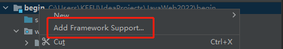

课程视频链接

[尚硅谷丨2022版JavaWeb教程(全新技术栈,全程实战)_哔哩哔哩_bilibili](https://www.bilibili.com/video/BV1AS4y177xJ)

[JavaWeb | 代码重工 (gitee.io)](http://heavy_code_industry.gitee.io/code_heavy_industry/pro001-javaweb/)

# HTML

## 第一个网页

```html
<html>
	<head>
		<title>这是我的第一个网页</title>
		<meta charset="UTF-8">
	</head>
	<body>
		HELLO WORLD!<br/>你好，HTML！
		<p>这里是一个段落</p>
		<p>这里是第二个段落</p>
		
		<h1>标题一</h1>
		<h2>标题一</h2>
		<h3>标题一</h3>
		<h4>标题一</h4>
		<h5>标题一</h5>
		<h6>标题一</h6>

		武林高手排行榜:
		<ol type="i" start="3">
			<li>扫地僧</li>
			<li>萧远山</li>
			<li>慕容博</li>
			<li>虚竹</li>
			<li>阿紫</li>
		</ol>
		武林大会人员名单：
		<ul type="circle">
			<li>乔峰</li>
			<li>阿朱</li>
			<li>马夫人</li>
			<li>白世镜</li>
		</ul>

		你是<b><i><u>喜欢</u></i></b>是<b>甜</b>月饼还是<i>咸</i><u>月饼</u>？
		<br/>

		水分子的化学式： H<sub>2</sub>O <br/>
		氧气的化学式： O<sup>2</sup><br/>

		5&lt;10
		10&gt;5
		5&le;10
		10&ge;5
		注册商标 &reg;
		版权符号 &copy;

		<span>赵又廷</span>，夺妻之仇。

		<a href="http://www.baidu.com" target="_self">百度一下</a>
	</body>
</html>

<!--
1)
html语言是解释型语言，不是编译型
浏览器是容错的
2)
html页面中由一对标签组成：<html></html>
<html> 称之为 开始标签
</html>称之为 结束标签
3)
title 表示网页的标题
4)
可以在meta标签中设置编码方式
5)
<br/>表示换行 。br标签是一个单标签。单标签：开始标签和结束标签是同一个，斜杠放在单词后面
6)
p 表示段落标签
7)
img 标签图片标签
	src属性表示图片文件的路径
	width和height表示图片的大小
	alt表示图片的提示
8)
路径的问题：
	1. 相对路径
	2. 绝对路径
9)
h1~h6 : 标题标签
10)
列表标签:
- ol 有序列表
	start 表示从*开始，type 显示的类型：A a I i 1(deafult)
- ul 无序列表
	type disc(default) , circle , square
11) u 下划线 b 粗体  i 斜体

12) 上标 sup   下标 sub

13) HTML中的实体： 小于号 &lt; 大于等于号 &ge; 版权 &copy;

14) span 不换行的块标记

15) a 表示超链接
		href 链接的地址
		target:
			_self 在本窗口打开
			_blank 在一个新窗口打开
			_parent 在父窗口打开
			_top  在顶层窗口打开

16) div 层
-->
```

## 表格标签的学习

```html
<html>
	<head>
		<title>表格标签的学习</title>
		<meta charset="UTF-8">
		
	</head>
	<body>
		<table border="1" width="600" cellspacing="0" cellpadding="4">
			<tr align="center">
				<th>姓名</th>
				<th>门派</th>
				<th>成名绝技</th>
				<th>内功值</th>
			</tr>
			<tr align="center">
				<td>乔峰</td>
				<td>丐帮</td>
				<td>少林长拳</td>
				<td>5000</td>
			</tr>
			<tr align="center">
				<td>虚竹</td>
				<td>灵鹫宫</td>
				<td>北冥神功</td>
				<td>15000</td>
			</tr>
			<tr align="center">
				<td>扫地僧</td>
				<td>少林寺</td>
				<td>七十二绝技</td>
				<td>未知</td>
			</tr>
		</table>
		<hr/>
		<table border="1" cellspacing="0" cellpadding="4" width="600">
			<tr>
				<th>名称</th>
				<th>单价</th>
				<th>数量</th>
				<th>小计</th>
				<th>操作</th>
			</tr>
			<tr align="center">
				<td>苹果</td>
				<td rowspan="2">5</td>
				<td>20</td>
				<td>100</td>
				<td></td>
			</tr>
			<tr align="center">
				<td>菠萝</td>
				<td>15</td>
				<td>45</td>
				<td></td>
			</tr>
			<tr align="center">
				<td>西瓜</td>
				<td>6</td>
				<td>6</td>
				<td>36</td>
				<td></td>
			</tr>
			<tr align="center">
				<td>总计</td>
				<td colspan="4">181</td>
			</tr>
		</table>
	</body>
</html>
<!--
17) 表格	table
	行		tr
	列		td
	表头列	th

	table中有如下属性（虽然已经淘汰，但是最好了解一下）
	- border：表格边框的粗细
	- width:表格的宽度
	- cellspacing：单元格间距
	- cellpadding：单元格填充

	tr中有一个属性： align -> center , left , right 

	rowspan : 行合并
	colspan : 列合并

-->
```

## 表单标签的学习

```html
<html>
	<head>
		<title>表单标签的学习</title>
		<meta charset="UTF-8">
		
	</head>
	<body>
		<form action="demo04.html" method="post">
			昵称：<input type="text" value="请输入你的昵称"/><br/>
			密码：<input type="password" name="pwd"/><br/>
			性别：<input type="radio" name="gender" value="male"/>男
	  			  <input type="radio" name="gender" value="female" checked/>女<br/>
			爱好：<input type="checkbox" name="hobby" value="basketball"/>篮球
				  <input type="checkbox" name="hobby" value="football" checked/>足球
				  <input type="checkbox" name="hobby" value="earth" checked/>地球<br/>
			星座：<select name="star">
					<option value="1">白羊座</option>
					<option value="2" selected>金牛座</option>
					<option value="3">双子座</option>
					<option value="4">天蝎座</option>
					<option value="5">天秤座</option>
				  </select><br/>
			备注：<textarea name="remark" rows="4" cols="50"></textarea><br/>
			<input type="submit" value=" 注 册 "/>
			<input type="reset" value="重置"/>
			<input type="button" value="这是一个普通按钮"/>
		</form>
	</body>
</html>
<!--
18) 表单	form

19) input type="text" 表示文本框 ， 其中 name属性必须要指定，否则这个文本框的数据将来是不会发送给服务器的
	input type="password" 表示密码框
	input type="radio" 表示单选按钮。需要注意的是，name属性值保持一致，这样才会有互斥的效果;可以通过checked属性设置默认选中的项
	input type="checkbox" 表示复选框。name属性值建议保持一致，这样将来我们服务器端获取值的时候获取的是一个数组
	select 表示下拉列表。每一个选项是option，其中value属性是发送给服务器的值 , selected表示默认选中的项
	textarea 表示多行文本框（或者称之为文本域）,它的value值就是开始结束标签之间的内容
	input type="submit" 表示提交按钮
	input type="reset" 表示重置按钮
	input type="button" 表示普通按钮
-->
```

```html
<!--
demo04.html
-->
<html>
	<head>
		<title>表单标签的学习</title>
		<meta charset="UTF-8">
		
	</head>
	<body>
		<h1><font color='red'>注册成功</font></h1>
	</body>
</html>
```

## frameset页面框架

```html
<html>
	<head></head>
	<frameset rows="20%,*" > <!-- frameborder="no" -->
		<frame src="frames/top.html"/>
		<frameset cols="15%,*">
			<frame src="frames/left.html"/>
			<frameset rows="80%,*">
				<frame src="frames/main.html"/>
				<frame src="frames/bottom.html"/>
			</frameset>
		</frameset>
	</frameset>
</html>

<!--
frameset 表示页面框架 ， 这个标签已经淘汰，了解，不需要掌握
frame表示框架中的具体页面引用
iframe
-->
```

```html
<html>
	<head>
		<meta charset="utf-8">
	</head>
	<body>
		这里是demo06页面的内容！！
		<iframe src="frames/top.html"/>
	</body>
</html>
<!--
frameset 表示页面框架 ， 这个标签已经淘汰，了解，不需要掌握
frame表示框架中的具体页面引用
iframe 在一个页面嵌入一个子页面
```

## 总结

```html
<!--
1.HTML是解释型的文本标记语言，不区分大小写
2.html,head,title,meta,body,br,p,hr,div,table,form,u,i,b,sup,sub,&nbsp;,span,ul,ol,li,tr,td,th,h1-h6,a,input,select,textarea,img
2-1. html , head , title , meta , body , br , ul , ol , h1-h6 , a , img , &nbsp;, p , div , span
2-2. table tr , th , td 
2-3. form(action='' , method='post') input type='text,pasword,radio,checkbox,submit,button,reset"   <select> , <textarea>
-->
```

# CSS

## CSS语法介绍

```html
<html>
	<head>
		<meta charset="utf-8">
		<!-- 内部样式表 -->
		<style type="text/css">
			/* 被style标签包围的范围是CSS环境，可以写CSS代码 */

			/* 标签样式表 */
			p{
				color:red;
			}

			/* 类样式 */
			.f20{
				font-size:20px;
			}
		</style>
		<!-- 引用外部的CSS样式表文件 -->
		<link rel="stylesheet" href="css/demo01.css">
	</head>
	<body>
		<!--
		<p><font color="red">这里是段落一</font></p>
		<p><font color="red">这里是段落二</font></p>
		-->
		<p>这里是段落一</p>
		<p>这里是段落二</p>
		<p class="f20">这里是段落三</p>
		<p id="p4">这里是段落四</p>	<!-- id属性在整个HTML文档中，尽量保持唯一（虽然重复也不会报错） -->

		<div>
			<p><span style="font-size:60px;font-weight:bolder;color:yellow;">HELLO</span></p>
			<span class="f32">World</span>
			<p class="f32">!!!</p>
		</div>

	</body>
</html>

<!--
1. 为什么需要CSS
2. CSS的最基本的分类: 标签样式表、类样式表、ID样式表
3. CSS从位置上的分类：嵌入式样式表、内部样式表、外部样式表
-->
```

## CSS盒子模型

```html
<html>
	<head>
		<meta charset="utf-8">
		<style type="text/css">
			#div1{
				width:400px;
				height:400px;
				background-color:greenyellow;

				/* 1. border 边框样式 */
				border-width:1px;			/*边框粗细*/
				border-style:solid;		/*边框样式：solid(实线) , dotted(点状线) ... */
				border-color:blue;			/*边框颜色*/

				/* border:4px double blue;*/

				/* border-top : 4px dotted blue;*/
			}

			#div2{
				width:150px;
				height:150px;
				background-color:darkorange;
				
				margin-top:100px;
				margin-left:100px;
				
				/*margin:100px 100px 50px 150px;*/ /* 一个值，四个方向统一；两个值：上下、左右；三个值：上、左右、下；四个值：上右下左 */
			
				/* padding : 填充 */
				padding-top:50px;
				padding-left:50px;
			}

			#div3{
				width:100px;
				height:100px;
				background-color:aquamarine;
				/*
				margin-top:50px;
				margin-left:50px;
				*/
			}
			#div4{
				width:200px;
				height:200px;
				margin-left:100px;
				background-color:greenyellow;
			}
			body{
				margin:0;
				padding:0;
			}
		</style>
	</head>
	<body>
		<div id="div1">
			<div id="div2">
				<div id="div3">&nbsp;</div>
			</div>
		</div>
		<div id="div4">&nbsp;</div>

	</body>
</html>

<!-- 
IE浏览器：实际尺寸 = width
chrome浏览器：实际尺寸= width+左右borderwidth+padding

CSS盒子模型：
1.border 边框
2.margin 间距
3.padding 填充
-->
```

## CSS布局

```html
<html>
	<head>
		<meta charset="utf-8">
		<style type="text/css">
			body{
				margin:0;
				padding:0;
			}
			#div1{

				width:200px;
				height:50px;
				background-color:greenyellow;

				/* 绝对定位 */
				position:absolute;
				left:100px;
				top:100px;


			}

			#div2{
				width:200px;
				height:50px;
				background-color:pink;

				position:relative;
				float:left;
				margin-left:20px;
			}

			#div3{
				height:50px;
				background-color:darkorange;
			}

			#div4{
				width:200px;
				height:50px;
				background-color:aqua;

				float:left;
			}
			#div5{
				width:200px;
				height:50px;
				background-color:olivedrab;

				float:left;
			}
			div{
				position:relative;
			}
		</style>
	</head>
	<body>
		<!--
		<div id="div1">&nbsp;</div>
		<div id="div2">&nbsp;</div>
		-->
		<div id="div3">
			<div id="div4">&nbsp;</div>
			<div id="div5">&nbsp;</div>
		</div>
	</body>
</html>
<!--
position: absolute -- 绝对定位 , 需要配合使用 left , top
		  relative -- 相对定位 , 一般会和 float , margin , padding .... 一起使用
float 
-->
```

## 布局案例

```html
<html>
	<head>
		<meta charset="utf-8">
		<style type="text/css">
			body{
				margin:0;
				padding:0;
				background-color:#808080;
			}
			div{
				position:relative;
			}
			#div_top{
				background-color: orange;
				height:20%;
			}
			#div_left{
				background-color: greenyellow;
				height:80%;
				width:15%;
				float:left;
			}
			#div_main{
				background-color: whitesmoke;
				height:70%;
				float:left;
				width:85%;
			}
			#div_bottom{
				background-color: sandybrown;
				height:10%;
				width:85%;
				float:left;
			}
			#div_container{
				width:80%;
				height:100%;
				border:0px solid blue;
				margin-left:10%;
				float:left;
			}
		</style>
	</head>
	<body>
		<div id="div_container">
			<div id="div_top">div_top</div>
			<div id="div_left">div_left</div>
			<div id="div_main">div_main</div>
			<div id="div_bottom">div_bottom</div>
		</div>
	</body>
</html>
```

## 水果库存静态页面

```html
<html>
	<head>
		<meta charset="utf-8">
		<link rel="stylesheet" href="css/demo05.css">
	</head>
	<body>
		<div id="div_container">
			<div id="div_fruit_list">
				<table id="tbl_fruit">
					<tr>
						<th class="w20">名称</th>
						<th class="w20">单价</th>
						<th class="w20">数量</th>
						<th class="w20">小计</th>
						<th>操作</th>
					</tr>
					<tr>
						<td>苹果</td>
						<td>5</td>
						<td>20</td>
						<td>100</td>
						<td></td>
					</tr>
					<tr>
						<td>西瓜</td>
						<td>3</td>
						<td>20</td>
						<td>60</td>
						<td></td>
					</tr>
					<tr>
						<td>菠萝</td>
						<td>4</td>
						<td>25</td>
						<td>100</td>
						<td></td>
					</tr>
					<tr>
						<td>榴莲</td>
						<td>3</td>
						<td>30</td>
						<td>90</td>
						<td></td>
					</tr>
					<tr>
						<td>总计</td>
						<td colspan="4">999</td>
					</tr>
				</table>
			</div>
		</div>
	</body>
</html>
```

```css
/*
demo05.css
*/
*{
	color: threeddarkshadow;
}
body{
	margin:0;
	padding:0;
	background-color:#808080;
}
div{
	position:relative;
	float:left;
}

#div_container{
	width:80%;
	height:100%;
	border:0px solid blue;
	margin-left:10%;
	float:left;
	background-color: honeydew;
	border-radius:8px;
}
#div_fruit_list{
	width:100%;
	border:0px solid red;
}
#tbl_fruit{
	width:60%;
	line-height:28px;
	margin-top:120px;
	margin-left:20%;
}
#tbl_fruit , #tbl_fruit tr , #tbl_fruit th , #tbl_fruit td{
	border:1px solid gray;
	border-collapse:collapse;
	text-align:center;
	font-size:16px;
	font-family:"黑体";
	font-weight:lighter;
	
}
.w20{
	width:20%;
}
.delImg{
	width:24px;
	height:24px;
}
.btn{
	border:1px solid lightgray;
	width:80px;
	height:24px;
}
```

## 总结

  1) CSS的角色：页面显示的美观风格
  2) CSS的基础语法：标签样式；类样式；ID样式；组合样式；嵌入式样式表；内部样式表；外部样式表
  3) 盒子模型：border、margin、padding
  4) 定位和浮动：position、float、DIV+CSS布局

# js

## js介绍

## js语法


# Web

## CS和BS的优缺点


## Tomcat-安装和部署


在Tomcat目录webapps下新建项目，

如：baidu/WEB-INF，页面放在baidu目录下

## 常见错误代码

- 400：一般是请求参数错误
- 404：资源不存在
- 405：方法不允许
- 500：服务器内部错误，比如代码错误。
- 302：表示重定向

# Servlet

## 1、入门

1. 新建JavaWeb项目

   先新建普通java项目

   再添加Web框架

   - 方法1：

     

   - 方法2：

     

2. 添加Tomcat依赖

     

## 2、Servlet执行流程


**web.xml**

```xml
<?xml version="1.0" encoding="UTF-8"?>
<web-app xmlns="http://xmlns.jcp.org/xml/ns/javaee"
         xmlns:xsi="http://www.w3.org/2001/XMLSchema-instance"
         xsi:schemaLocation="http://xmlns.jcp.org/xml/ns/javaee http://xmlns.jcp.org/xml/ns/javaee/web-app_4_0.xsd"
         version="4.0">
    <servlet>
        <servlet-name>AddServlet</servlet-name>
        <servlet-class>com.atguigu.servlets.AddServlet</servlet-class>
    </servlet>
    <servlet-mapping>
        <servlet-name>AddServlet</servlet-name>
        <url-pattern>/add</url-pattern>
    </servlet-mapping>
    <!--
    1. 用户发请求，action=add
    2. 项目中，web.xml中找到url-pattern = /add   -> 第12行
    3. 找第11行的servlet-name = AddServlet
    4. 找和servlet-mapping中servlet-name一致的servlet ， 找到第7行
    5. 找第8行的servlet-class -> com.atguigu.servlets.AddServlet
    6. 用户发送的是post请求（method=post） ， 因此 tomcat会执行AddServlet中的doPost方法
    -->
</web-app>
```

## 3、基于注解注册Servlet

```java
@WebServlet("/test1")
public class TestServlet extends HttpServlet {
}
```

## 4、新建项目注意事项

1. 新建项目 - 新建模块
2. 在模块中添加web
3. 创建artifact - 部署包
4. lib - artifact
   先有artifact，后来才添加的mysql.jar。此时，这个jar包并没有添加到部署包中
   那么在projectSettings中有一个Problems中会有提示的,我们点击fix选择add to...
   另外，我们也可以直接把lib文件夹直接新建在WEB-INF下。
   这样不好的地方是这个lib只能是当前这个moudle独享。如果有第二个moudle我们需要再次重复的新建lib。
5. 在部署的时候，修改application Context。然后再回到server选项卡，检查URL的值。
   URL的值指的是tomcat启动完成后自动打开你指定的浏览器，然后默认访问的网址。
   启动后，报错404.404意味着找不到指定的资源。
   如果我们的网址是：http://localhost:8080/pro01/ , 那么表明我们访问的是index.html.
   我们可以通过<welcome-file-list>标签进行设置欢迎页(在tomcat的web.xml中设置，或者在自己项目的web.xml中设置)
6. 405问题。当前请求的方法不支持。比如，我们表单method=post , 那么Servlet必须对应doPost。否则报405错误。
7. 空指针或者是NumberFormatException 。因为有价格和库存。如果价格取不到，结果你想对null进行Integer.parseInt()就会报错。错误的原因大部分是因为 name="price"此处写错了，结果在Servlet端还是使用request.getParameter("price")去获取。
8. `<url-pattern>`中以斜杠开头

## 5、Servlet请求参数中午乱码

1. GET请求

   get方式目前不需要设置编码（基于tomcat8及以后）
   （tomcat8之前）如果是get请求发送的中文数据，转码稍微有点麻烦

   ```java
   String name = request.getParameter("name");
   //1.将字符串打散成字节数组
   byte[] bytes = name.getBytes("ISO-8859-1");
   //2.将字节数组按照设定的编码重新组装成字符串
   name = new String(bytes,"UTF-8");
   ```

2. POST请求

   ```ZA24java
   //需要注意的是，设置编码这一句代码必须在所有的获取参数动作之前
   equest.setCharacterEncoding("UTF-8");
   ```

## 6、Servlet的继承关系

1. **0承关系**

    

   - javax.servlet.Servlet接口
     - javax.servlet.GenericServlet抽象类
       - javax.servlet.http.HttpServlet抽象子类

2. **核心方法**

     **javax.servlet.Servlet接口:**
     
     - void init(config) - 初始化方法
     - void service(request,response) - 服务方法
     - void destory() - 销毁方法
     
     **javax.servlet.GenericServlet抽象类：**
     
     - void service(request,response) - 仍然是抽象的
     
     **javax.servlet.http.HttpServlet 抽象子类：**
     
     - void service(request,response) - 不是抽象的

## 7、Servlet服务方法service

- 当有请求过来时，service方法会自动响应（其实是tomcat容器调用的）
- 在HttpServlet中我们会去分析请求的方式：到底是get、post、head还是delete等等
- 然后再决定调用的是哪个do开头的方法
- 那么在HttpServlet中这些do方法默认都是405的实现风格-要我们子类去实现对应的方法，否则默认会报405错误
- 因此，我们在新建Servlet时，我们才会去考虑请求方法，从而决定重写哪个do方法

```java
protected void service(HttpServletRequest req, HttpServletResponse resp) throws ServletException, IOException {
    String method = req.getMethod();
    long lastModified;
    if (method.equals("GET")) {
        lastModified = this.getLastModified(req);
        if (lastModified == -1L) {
            this.doGet(req, resp);
        } else {
            long ifModifiedSince;
            try {
                ifModifiedSince = req.getDateHeader("If-Modified-Since");
            } catch (IllegalArgumentException var9) {
                ifModifiedSince = -1L;
            }

            if (ifModifiedSince < lastModified / 1000L * 1000L) {
                this.maybeSetLastModified(resp, lastModified);
                this.doGet(req, resp);
            } else {
                resp.setStatus(304);
            }
        }
    } else if (method.equals("HEAD")) {
        lastModified = this.getLastModified(req);
        this.maybeSetLastModified(resp, lastModified);
        this.doHead(req, resp);
    } else if (method.equals("POST")) {
        this.doPost(req, resp);
    } else if (method.equals("PUT")) {
        this.doPut(req, resp);
    } else if (method.equals("DELETE")) {
        this.doDelete(req, resp);
    } else if (method.equals("OPTIONS")) {
        this.doOptions(req, resp);
    } else if (method.equals("TRACE")) {
        this.doTrace(req, resp);
    } else {
        String errMsg = lStrings.getString("http.method_not_implemented");
        Object[] errArgs = new Object[]{method};
        errMsg = MessageFormat.format(errMsg, errArgs);
        resp.sendError(501, errMsg);
    }

}
```

## 8、Servlet的生命周期

1. 生命周期：从出生到死亡的过程就是生命周期。对应Servlet中的三个方法：init(),service(),destroy()

2. 默认情况下：

   - 第一次接收请求时，这个Servlet会进行实例化(调用构造方法)、初始化(调用init())、然后服务(调用service())

   - 从第二次请求开始，每一次都是服务

   - 当容器关闭时，其中的所有的servlet实例会被销毁，调用销毁方法

3. 通过案例我们发现：

   - Servlet实例tomcat只会创建一个，所有的请求都是这个实例去响应。

   - 默认情况下，第一次请求时，tomcat才会去实例化，初始化，然后再服务.这样的好处是什么？
   - 提高系统的启动速度 。 这样的缺点是什么？ 第一次请求时，耗时较长。

   - 因此得出结论： 如果需要提高系统的启动速度，当前默认情况就是这样。
   - 如果需要提高响应速度，我们应该设置Servlet的初始化时机。

4. Servlet的初始化时机：

   - 默认是第一次接收请求时，实例化，初始化

   - 我们可以通过<load-on-startup>来设置servlet启动的先后顺序,数字越小，启动越靠前，最小值0

5. Servlet在容器中是：单例的、线程不安全的

   - 单例：所有的请求都是同一个实例去响应

   - 线程不安全：一个线程需要根据这个实例中的某个成员变量值去做逻辑判断。但是在中间某个时机，另一个线程改变了这个成员变量的值，从而导致第一个线程的执行路径发生了变化

   - 我们已经知道了servlet是线程不安全的，给我们的启发是： 尽量的不要在servlet中定义成员变量。如果不得不定义成员变量，那么不要去：①不要去修改成员变量的值 ②不要去根据成员变量的值做一些逻辑判断

## 9、Http协议

1. Http 称之为 超文本传输协议
2. Http是无状态的
3. Http请求响应包含两个部分：请求和响应

- 请求request：

  请求包含三个部分： 1.请求行 ； 2.请求消息头 ； 3.请求主体。

  1)请求行包含是三个信息： 1. 请求的方式 ； 2.请求的URL ； 3.请求的协议（一般都是HTTP1.1）。

  2)请求消息头中包含了很多客户端需要告诉服务器的信息，比如：浏览器型号、版本，接收的内容的类型，发送内容的类型、长度等。

  3)请求体，三种情况

  - get方式，没有请求体，但是有一个queryString
  - post方式，有请求体，form data 
  - json格式，有请求体，request payload

- 响应response：
  响应也包含三本： 1. 响应行 ； 2.响应头 ； 3.响应体
  1)响应行包含三个信息：1.协议 2.响应状态码(200) 3.响应状态(ok)
  2)响应头：包含了服务器的信息；服务器发送给浏览器的信息（内容的媒体类型、编码、内容长度等）
  3)响应体：响应的实际内容（比如请求add.html页面时，响应的就是html内容）

## 10、会话session
1. Http是无状态的

   - HTTP 无状态 ：服务器无法判断这两次请求是同一个客户端发过来的，还是不同的客户端发过来的
   - 无状态带来的现实问题：第一次请求是添加商品到购物车，第二次请求是结账；如果这两次请求服务器无法区分是同一个用户的，那么就会导致混乱
   - 通过会话跟踪技术来解决无状态的问题。

2. 会话跟踪技术

   - 客户端第一次发请求给服务器，服务器获取session，获取不到，则创建新的，然后响应给客户端

   - 下次客户端给服务器发请求时，会把sessionID带给服务器，那么服务器就能获取到了，那么服务器就判断这一次请求和上次某次请求是同一个客户端，从而能够区分开客户端

   - 常用的API：

       ```java
       request.getSession() -> 获取当前的会话，没有则创建一个新的会话
       request.getSession(true) -> 效果和不带参数相同
       request.getSession(false) -> 获取当前会话，没有则返回null，不会创建新的
       
       session.getId() -> 获取sessionID
       session.isNew() -> 判断当前session是否是新的
       session.getMaxInactiveInterval() -> session的非激活间隔时长，默认1800秒
       session.setMaxInactiveInterval()
       session.invalidate() -> 强制性让会话立即失效
       ....
       ```

3. session保存作用域

   - session保存作用域是和具体的某一个session对应的

   - 常用的API：

     ```java
     void session.setAttribute(k,v)
     Object session.getAttribute(k)
     void removeAttribute(k)
     ```

## 11、转发和重定向

**服务器内部转发**

**客户端重定向**

1. 服务器内部转发 : request.getRequestDispatcher("...").forward(request,response);
   - 一次请求响应的过程，对于客户端而言，内部经过了多少次转发，客户端是不知道的
   - 地址栏没有变化
2. 客户端重定向： response.sendRedirect("....");
   - 两次请求响应的过程。客户端肯定知道请求URL有变化
   - 地址栏有变化

## 域对象

原始情况下，域对象有四个：

1. page（页面级别，现在几乎不用）
2. 请求域request（一次请求响应范围）
3. 会话域session（一次会话范围）
4. 应用域application（整个应用程序范围）

[代码重工 (gitee.io)](http://heavy_code_industry.gitee.io/code_heavy_industry/pro001-javaweb/lecture/chapter08/verse06.html)

## 路径问题

1. 相对路径
2. 绝对路径

# Thymeleaf-视图模板

[第八章 Thymeleaf | 代码重工 (gitee.io)](http://heavy_code_industry.gitee.io/code_heavy_industry/pro001-javaweb/lecture/chapter08/)

## 1、加入jar包


## 2、配置上下文参数

![./images](data:image/png;base64,iVBORw0KGgoAAAANSUhEUgAAAKgAAACUCAIAAACIkfU1AAANHklEQVR42u2dbWwUxxnH5443+wIuxMZQ4hcwvvgccahJ2qomVDgCI/EixVUxpaoqV5Xw1dBQcPnqCsX9CLZpBMRGquQPVVI7UmkFtuSCAhWCD2mIyqFycCZgIAiDXVzAB1wdrrs7+zIzO3svvre9m+evKOzOzs7uzm+eZ2ZvH884IpEIAoknB4AXUwBeUAF4QcUH/5fhc/q2q2BeTVXl8rJvZ/tW41Owa83rbRfrOq9f2OdO91VQy2CkZ1OCpw75HJt7pX9ncm4KFRs81hvuFTUrKtJ7L2ptKiLIaTWFrGpLOQ+pJ9gbPPGIOQLeSj/auC5Fd4L5ytWBlC3Mjq7hYDDodru5Z9blBHjjIbPIXFHqwGs1Ptg0sFlp1Grl4/SWwUG0eXMvfmSeDZP0tKKuXfAcIphGqUqjsP0BFXx74HXlgHI2opuDeoFDw02fbiQzKxlG1BK5Toe6Q4OgKQPPfVG3mu6mmWnw1EGyzuvqLl6UaupUpPGvxOPr7KvV5kG0Ainzdc/vZSeutSWepViAx5djy2faIiczdSLOTl2BKg6Z27GWYROTaHgyquxM4zaUcvAqnCHdXW89qaRrDzpE+HFirw81c8APoi2cRsJlz1gayYy1eaQ3MpKf1nDJHQMXvq4+mlAfikDMZCCYkreXz66e7WpxHWnPGuT6XC54ydW3B2qMetJag+EzyNrk9/GmStfNnODLg6Lv4Nxs41NTicbDtk4mOcfBRxvKURZP7NBOnHl0ZkTHd8UsC7bS4gSvku/s9LdpZcYNnnXMpudjMpCWnw8WL4F/d2iUSfxsUyVRF6QIqzKele0REdVTyhXkOajXDus4YnTzJlAUeGXPL3fi3Hc/Pnhub70pGKWP57qBvAdf19npbWsjB8UseGT5Zs5Ntni5p6TniQFeu4K5p4kGnmnTZvC8DPrDqBUiAPjsDlajKxfuMUNK+Lf6XAafA7eYMYkCnhoHZN3P2kCpA29vsb278ILPsoIKwAsqAC+oALygAvCCCsALKgAvqFIP/tCVCX17wRznDxYXrn61INuPCWKVXvBY7yxxSfiz/aQgSpkAb6XfrirO9uOLKwAvqOwC3hRwLicE2pXQXFOQKvzinrzsAR5Tpr6aBc0RW37gnTrZAzwTeyuLbgvS8Q4PYE+hbAIei/ykD+DTK3uAD3Z1jezbp0WvKbwZ7y+7BKSF5nZ1Ve+DNpCc7AGeEyFj6vaN4R/E0KRAdgEPyrDgt3pBBeAFFYAXVABeUAF4QQXgBRWAF1QAXlABeEEF4AVV6sFnZFZMzgd8UEJKL3isNMyKCeCTVSbAWymJWTEBfLLig9+7d+/ChQtbW1uXLFmCU8bGxo4dOzY5Odnd3R29RBJ8wby5UvEvwmFuTgCfRfHBHzhwQGLscrl8Pl9lZeXo6GhPT08oFJJag3QoeokY/Cyn801v7eVwgcOBvLOfXboSePnyJZNTB0/E1xABF0Yqf8JQNRRTSYdP9ImKD16ifvTo0QcPHsydO3fDhg2nT58Oh8OlpaW7du2S2EcvEYN3Ly8fmFrwj/shaXvdUte2Vx4Hb91lcurgDfsd8q3p8KOmPjwrpcJ9hIi6ouJz6PkQEaBPSJZ9vGTfEvu7d1VaZWVlEnXJB8QsEYP/3upan/9FaFq2ctdsZ4933ueXrzI56VkxZaDItyawvz3QHNgvz2vXjPqMKYV16bOSEq4ePH/Cija4k6z8+PHjeKrwnTt3StYfT4maxZd9OlV0TrH4+qWuH0e1eIWchJlA3t400IFIw6dD7IIAPknFGNVLHfOZM2fWr1/vdDrjLBGDl/K/tcrjn5b/ZM475/kl/9UofTzC5AfQRa/qx6Vt7PAZPz7k86EebS5SLzm9oBdcfUJK7+vcPNlJRF6E/8fNSY3qSXry9kCTbuacZR0UE/e29PbC2G6GytH3eFCygt/qBRWAF1QAXlABeEEF4AUVgBdUAF5QAXhBBeAFFYAXVPYCn8PLl+ea7AseK2agJhOEwfm+M9B07cLWU9Q6cNQaY6qs51AjvgzzFt4xDtNL79l7Uja7g7eS8YGH+mDPgtEOIu4He/LUKFE8DHj5q6CfCBGgwedKWEDqwacqUDO66Ogd3cYlCCdQSy9q1L/eKmE87mBM8FGgseDbr3s6CLcC4LGSD9SMR3T0jlbdMvdGGQveN47EBB+NGSdbNRE9AOCxkg/UjEdM9A6ub4W7QqVZC9s60WheJJRZ0lhV3H280ZQweos+3t5dfHr6+CQDNeMRG70jk9biM93qvudgDIOmhgdGJ6+3B2MSXV45GvrGE2DxhpIJ1IxHdPSO5uIxd/N+POCtZ8+07BEw+hZ9rAfgFc04UDMeMWFbeFDn9+w3zJfaT8jiWUUZCqjOnVj3HsDPRDOP11PcM7skubHPLG5vmghdlmXEZtQxoFIyAvDJCQI1MyZ7gQdlTABeUAF4QQXgBRWAF1QAXlABeEEF4AUVgBdUAF5Q5Q/4GQVqal/sjTCeXPq9PRnZDjyO3ML/T+jEGc2oCeBtIxy5VVpaKrGPJ3ZD14w+8BgxOpoAfJY0NjZ2+PDhUChUVla2Z8+eOCM4EIBPULYDL2l0dPTIkSPhcNjtdre2tsYZx5EUeDYsM//nzLQjeEnDw8ODg4PSxpYtWxoaGuI5JYXgRZgz047gbWDx+T91ou3AZ6ePB/BZV3ZG9bx4eZTXc2baDnwK3+OtFNviBZgz03bgZywI1ExI+QMelJAAvKAC8IIKwAsqAC+oHMvaz2f7HkBZEIAXVABeUAF4QZW34N9e9PyLRwUtVZNkYu9Xif0MnMfKT/ASdek/CXNqwUcihb97/62VZ8//4oojVbcaiRT3dZScag8MOFJWZjzKQ/CYOlIwA3gr5Rt4nToC8FGVb+AZAXgr5Rt4hjQjBnzTjnf2PLz0wzPPlNr3oH6ZaGRVzb360KYPb/8LlUiJON7vq3M4GwYfQNvV9L/3U41g9frvDK17tlehKBXejQLLPkZ9HeU3+ic2bq+oUvI3I8+97SVEmQA+FUoIvMxp8Z3XPpmQYJ+vL0RXr0kkcGtYe9olAzvyZceYQzf0Zr9L2vhV6ThGKzeR7WgvzUw9fayCaj0PbsvbXgX5vwPyFZeUn9/t+kN7oF/OAOAzK7320U/f9Hx2Z2WTq/PD8ffer0EDX36wWLVLXZKBrj2NSFfP9fzYeTSgqY/URlNMNCDO9gf3AXxy+uhRpzkxjGZ3L9g2a2FJ/eLQ4nnfPHwx6+xDV/CpGsCpkJMwE8jPTmysR7uxdSome9lBQi0E8LaTDj40/c3F0Yn1K0ul7ZOFdddK3v5ZxWNp++tnsyXqngXhwJO5OnvJ2x+pRVXjssPH29jhk70+kh14DfpYcsuKqx+XfTUievT+pRXndxcPK0Sxq9+NaoZqJzRXD+DTKQz+5n+efv71o+8uW1RVPF/abf/WLxtXotcKp++E5vz5btHTaYfTEflJ+ZOPbxfhsxRvX3EDD+vkbZWffqhKyYYHcaqJj483vIF7Aa2z104MvLu2u0TpzrUmog7uAHz6hMH/8Z833qstL35FNehfL/rNtvKpqWln+KXjxUvHzak5o6E5O8off3KnKNv3m2XlG3izxTdUOvvvFjWVPa5ZEL40WXDq/vwdZY//dBvA5xd4xOvja4vCXzwq+HnlfwuckSfTzr/dm6/38cIqD8GT0kf133/1+bLC6cmwkxzVi6z8AQ9KSABeUEGUraAC8IIKwAsqAC+o0g7+6o1btSuXM3/DDH+onHWlF7xEPXBjVMKcC+At151LUeHMvGrxSF08i15Ni1gsO4krphE8po4UzOkHzy4PySbHntvCduA58+/YH7xOHWUCPFEf5ARlsVGSdWs78MndUPYsnlR6wVOmoe/oa4jHeSaAT4Wiz0hjAm81nySRzlkdkpiGkHhGtb6UJYabvG1tnA5Az6gVVdd57YLnkHRep3aCXHY15ViVctVsg00Dm+WVK+VcSC2GuIRRspZI3qL5KLUUZgu9sjHVSRkNVbmbaLeRO+B580nS6coBfye7Gmw13Req4D0HjUVGLbtGxuK1E/T8I4bRaRWpZMO1i+EYpxBIrjOLGesYuEeDXb6TW3uUNKKr4lg8dZWYt5Ej4HnTCtLpbE1oRxHP4olFxIlTR+gxoJWrDxJL0ONELjne9gi1YK12pRGy2ZiOaq2AsvmY4KPehts24KP26zMGr+AZIdO1U6qpLt6iv4wJXt3qQ81avjjAc65E+AvzUYuFifMHfPXyFUziyK2bxqNz5pMMmrw47eo7PNa1Rfj3eF09B7yyGfAiv6cvSi0zNW5MfDzk86Ee0vHyjjLLVWsVwXkUlI/gefNJml9leYM7RDpK8n099lu8vgC8Omozg7dubpbbZq9N9rico0ZSXUsL6kXtYoG361zBaX3Py5YAfCzZ+NaSUabBnzl3Fu+uX1ePbA+efFHKM2X0s6y1xYMyLfgeL6gAvKAC8IIKwAuq/wOAlCh/9ppoWQAAAABJRU5ErkJggg==)

![./images](data:image/png;base64,iVBORw0KGgoAAAANSUhEUgAAALUAAACqCAIAAABksZmwAAAOO0lEQVR42u2db3CUxR3HNxFIctUWBRJKI0HImaPlGKGDStRCB8QS6BSnvU77opNOZ8g1UhnAvE3Hadp3ErQWmMRXeVWHOFNtNZlGGMGmoZUpDh7THCYoUUCCUBitsZ5M0n2eff7sPs8+e3fJPXdP7r6fceS559ln7273c7/du+eXfcqmpqYIAB6UwQ+gAH4AFfADqIAfQIXEjz8NnLC2Q5UVDcvrltV+vdCvMzNGDjTeu+/k+s53h/aG/X4W0tI31bU1y1P742VN3fTf6ZxbENL4wfhm+J6Ge5b6+0KMRtfhOthsUA1po+rnEeOEYPvBvcXi8sOLx7dsyNHLYBporUb0LdbFYkeMjIyEw2HpmetnhR/2m5wVaujkyA+zY/pivU36R8ToI7a/pa+PNDV1s5aRRQS+k82qzg1F9nNdr2hxu7K2pOFHe/Je/YB+NhGtMZ5g/0DspS18Yb3AqFGjNIQJr9DuaFcBWTAUXqrfBueOnPohHOS7Zv36kydpg742teMVrpV0tFauNyziZKGF3438Vhs5TOVknzsPP9jTOet3KCspLJzIigvPIFRH3LqbBbY6dtpxUai7AN2dNbn1w+jDfmuM2P6qvt9sj35u8OAe9ZBmiR99ZJvEJakijs8t37XOCEIsF/luNv3mH9i9yp7XmukYb4ozwVGA63r+5WF8cU0DWFOaTTIiDfRSP+j40p5ssJvTlMaOQHyjy+cfrr6xggangazvrAestPCe7b2cY44Czt2l4YdqNirED+6BOHI4WsgxKZXHf2eXOds2Qz8MQTo7E/vMOjP2wzkauN6fowAfR0ooflA/vts/5tj5xtY6rsl4uM+o3STO0ZoIo7jWjpFnrEZ0hqE0UxBXfwp+6I8S2gRD+mVY7od0JrF1RDH/kAYV+GG2dWd03z5++u/0g3j+oiHd7fGjiIBVJo0f5jO4hzeVHw713X7IClhvxmgQ+JGfHx5mxmx4jYEju+svs9mPWfASA0hJ+CHMUWZRcA8AOfIj2DhnHiBjcH0fqIAfQAX8ACrgB1ABP4AK+AFUwA+gIsd+7D973dq+Y275g4uqVt9VWej3CKaPj34wHqoJUUsK/TbBNPHdDy+eWrWg0O8dpAd+ABWB8MP1hyHajmS7nvTuSv/GVZR8EgA/mAzCddURd1piAloUggD44chq1xCVocc7IrCjIATBDwafQgI/gkIA/Bg5cGB0714zk1PXwjHkaAGGmEnvBw7U74Uq+SIAfkjyu1xTEnsGiwywvBIIP0BgwfUXoAJ+ABXwA6iAH0AF/AAq4AdQAT+ACvgBVMAPoAJ+ABU59iMvay9LEkaAT/joB8OHtZfhR/7w3Q8vZrD2MvzIHxI/9uzZM3/+/NbW1pqaGrZnfHz88OHDN2/efPbZZ9XV8X5UVsyjdX+RSklLwo9ZgcSPp59+mqoQCoXi8XhdXd3Y2FhXV9fExASVhh5SV8f8uK28fE105TupyrIyEp3z+emzycnJSUdJyw8uO4zLA7L3ylevNrKX9f1ICfEPiR9UjkOHDl29enXevHmbN28+evRoKpWqrq5+4oknqCLq6pgf4WV39352x5tXJuj2hsWhH33lk5ELFx0lLT/saNAfb+xIkFgPW/tY12OUSy0UssvE5XQJDPEJ+fyDRguqyMWLRqfW1tZSOWhESVsd82Pd6pXxxBcTt7SYEZpT3hWtOPXOsKOkuPay1u8k3phsa082J9u09U6bSY+9Wr6FtUQ2N75guPERz/kpjRkvvPACu6fGzp07aSzJpDozftS+9NlXT+jxY+Pi0A+V8UPvYGoDZ0Z7rLeD8GFETDcdgR95Q/X9hU4ajh07tmnTpvLy8gyrY37Q8mtXRRK3tD+7jc793+nEsGL+QZggveRk1Bg86DYbZRyDR388TrrMhbGj/Oq0UYwvPuHj99sKLeRMfZH6UlpS+P7Cd7K23Ruzgobkpkt6wIi2dHdjeuo7s/H3D5A/cP0FqIAfQAX8ACrgB1ABP4AK+AFUwA+gAn4AFfADqIAfQEWA/MhLbjPIjoD6wUib2+zIDZJc2uuNnRva/ppwP1rhJqYG3otmcikGspvs2YfFWwAXyyqcgfbDC/vanpAg4uw/8yCRJojwpypy0Bx+aNeNE1xKiuhH8aWh5NiPXOU2qxFzz6yIQfvqZdLSTXZYaQB6Elp4JK0fir51+tH+bqSDC1LwIytmntucCWLumdkrmh47tN5jj+0jaf1Qda2kWD2XrQI/smLmuc2Z4Mg9Y92i66F3XrOZm/jyDvcd0gmf15z9/MM2jhniMf8olumHD/OPGeY2Z4Iz90wTwkxpDhuPI8+kCQ/C1MWegFja2Au/y+oxDdnxMuJH1swktzkTxNwzc1xhergfZ+KH9xrNnsMQM6TFmq7Cj2yYdm5zJjhyE9m8NBFps4OB8Dir+OFEMU0xRhQj0MAPn5l+7qo+JnBpyo7H4vyDuO4YouGZ5Kycxuo1E/iRF5DbHEAC5AcIIPADqIAfQAX8ACrgB1ABP4AK+AFUwA+gAn4AFfADqCgSP6aV22xmiNhJaMV5DWUmBMsPlp7I/p/VidNatxl+pCdYfrD0xOrqaqpIJilFFtO6tmdnmJnADyfB8mN8fPy5556bmJiora3dvXt3holFBH74RrD8oIyNjR08eDCVSoXD4dbW1gzTi2bkhzOTGSsz2wTOD8rAwEBfXx/d2LZt26OPPprJKTn0Aysz8wTOjwDED6y8axMsPwoz/4Af3gTLj8J8f5H9XQvBysw6wfIjh79/eJE+fmBlZo5g+TFtkNvsE0XiB/AJ+AFUwA+gAn4AFfADqChb0j5Y6NcAggv8ACrgB1ABP4AK+AFUFIkfLctvWtuf3So/faNy+NNMr/1aTNXcPbhrwcDBtzvGywr9hoJCEfrBOHWj6u0bFVlVAj/cFK0fXnS/l92V4RIHfgAVJerH1FTVr59cu2X49CPHPqcPV2+6r3/l9e8dIYd+Ffp9e7K3rGxqakFPR4Tlvr53QisW+8lDuz/WNtghcmTw52fLplY1XN44sfX5D94pK84hqUT9oFhde4aEqCsrjg82f7x0cJfmxxGysKfj7vP6RISZRI921qzpX/ThN168Tk8c3FhFhs/x0hS6AfyihP3QwoAmwW+IqcVicyMaufzjhfxZNIQ8fHYhO0p+uibyxocrYqHO56/94MkG0lvM89nS9YPCPv27SMNBogUD/fuL6Ydr1NADCbWBM+P49S0bya7iHVxIifuhCRELnSdV5/UYYPuhjS/GDINoGjWQP2qTEjpNObiSLL+mjTJsm40yhX73PlLafuhzi19eS9L+JsbvH+b8VNteulwv9ropCtt5ns1MS+PHkpL2A6SlSPwAPgE/gAr4AVTAD6ACfgAVyF8HKuAHUAE/gAr4AVQUpx/D5y+sXLHMsegDVnaYBkXoB5UjeX6M2pBrP/xYbsq9xmawKDY/mBxEtwF+zJyi8sOSg8CPHFFUfjiAHzOnqPxQr0Lmviu7eWNsbiFce699f23jhtvpVlfm1zs0ayRadX2x3ibt/t0tbId+tlkn/MgjWflhR4P+eGNHgsR6aIeZeoza8tgF06+ubJweeUaQjLnAfGNn888NPwKK2Ukk3phsa082J9uGtr/a2Ex6dD2MGGGgdzHJYPVcZoEZHfggJd+GH3nh8z/slOy9bW7F409dnLz99NnkzU/+e+fX7ljzrYalS2rMw7SDqQ2cGe2x3g7Ch5GwUF0mqyvDj0Bi+fFp6lbvmUu/WFdHt+fc//2Pah/465v/oNvVC+6kcnxw+crSJYstRTRBesnJqDF40G02yjgGj/54nHR5r65s317I6PYe0izugB+Fhvnx9qUbfxke3x6pWVt7J31Y+bPf/fmt5NXrN2oW3rX54ftDlRWTk5Ov//3UY488YJzG9zjXzdahk/pmC6eEZHVl80Q662hKsMBh1UvgRyBgfux55Uzbhntr51exnVWthweG/hWqqpw7Zw79b0nNwsWLFgz87Z9bLD9AOorKD3f8GDjz/uaH1h0bOjV26UpkRV3jt1cfHXzrse88WOjXO2soKj+IbP5x4eJHK+uX9R0fSqW+pLHkkXX3cVNUkIZi80PA/P7y79H3r/3n5u2hqrWrIpAjK4rED+AT8AOogB9ABfwAKuAHUAE/gAp//UCe8GzHRz98yxP2A/kV29xVPo2LLMYVIDsLyXGFKPfPKMEvP/zME5Y2B8vXsC6si7vT36k0cH5IsgeKxg+f84QdiNfXrcvy6Xuc74LA+TGzFxRsPxz464fwQeNzAfVMsHCGZ8IPOb74kVUeqHfeL7ffGDf6ubw/Lg+UawqjWfV0sFh03z7JqGMVNKta33luKLKfntdpnqDVXS9Ec71eo5gq31ioWZaE7D4qyTXhXhw3MgpZq3lKew6KH7K8X3G/fiDRyXWYXqxeHKftDOGm7hZp4o/4vFz8ME+wyo8KGe56e2eSb+xObLZ6q1+e9hx/dXuXmTbkTqSXvN78pT0HxQ9ZXqe439lgdnqxJH7YGeT8qaPiNNZrfLHGJneWV7p8QXli8yhvl+uoKYuYrZbOjzylpeXJD+WcY9p+mLnm9n7zlHph+uExlqf1w9jS8kmNchn4IXkmLvq4j+pqEDsvUfJMJeFH/bJ7HDtHL7xvt5A779fpjWt8MZpF2qjcoJLp+CLxQ99MRkki0pN5Pro7sZkPP66jXDWOv7ByvhVSwn5I8n4lPwHI5qeEj8787xzpf/0wzrPmp24/vK303JYkNnO95ZH2zHatb2kh3aQdfkj8yPHfteYMX7/4Bh/4oSTALy0/5NWPYyeOs4ebNmwkgfeD/+ZYsuTv+r53/ADBBfkfQAX8ACrgB1ABP4CK/wPp6RFi8bplsgAAAABJRU5ErkJggg==)

物理视图=视图前缀+逻辑视图+视图后缀

```xml
<!-- 在上下文参数中配置视图前缀和视图后缀 -->
<context-param>
    <param-name>view-prefix</param-name>
    <param-value>/WEB-INF/view/</param-value>
</context-param>
<context-param>
    <param-name>view-suffix</param-name>
    <param-value>.html</param-value>
</context-param>
```

说明：param-value中设置的前缀、后缀的值不是必须叫这个名字，可以根据实际情况和需求进行修改。

> 为什么要放在WEB-INF目录下？
>
> 原因：WEB-INF目录不允许浏览器直接访问，所以我们的视图模板文件放在这个目录下，是一种保护。以免外界可以随意访问视图模板文件。
>
> 访问WEB-INF目录下的页面，都必须通过Servlet转发过来，简单说就是：不经过Servlet访问不了。
>
> 这样就方便我们在Servlet中检查当前用户是否有权限访问。
>
> 那放在WEB-INF目录下之后，重定向进不去怎么办？
>
> 重定向到Servlet，再通过Servlet转发到WEB-INF下。

## 3、创建Servlet基类

这个类大家直接**复制粘贴**即可，将来使用框架后，这些代码都将被取代。

```java
import org.thymeleaf.TemplateEngine;
import org.thymeleaf.context.WebContext;
import org.thymeleaf.templatemode.TemplateMode;
import org.thymeleaf.templateresolver.ServletContextTemplateResolver;

import javax.servlet.ServletContext;
import javax.servlet.ServletException;
import javax.servlet.http.HttpServlet;
import javax.servlet.http.HttpServletRequest;
import javax.servlet.http.HttpServletResponse;
import java.io.IOException;

public class ViewBaseServlet extends HttpServlet {

    private TemplateEngine templateEngine;

    @Override
    public void init() throws ServletException {

        // 1.获取ServletContext对象
        ServletContext servletContext = this.getServletContext();

        // 2.创建Thymeleaf解析器对象
        ServletContextTemplateResolver templateResolver = new ServletContextTemplateResolver(servletContext);

        // 3.给解析器对象设置参数
        // ①HTML是默认模式，明确设置是为了代码更容易理解
        templateResolver.setTemplateMode(TemplateMode.HTML);

        // ②设置前缀
        String viewPrefix = servletContext.getInitParameter("view-prefix");

        templateResolver.setPrefix(viewPrefix);

        // ③设置后缀
        String viewSuffix = servletContext.getInitParameter("view-suffix");

        templateResolver.setSuffix(viewSuffix);

        // ④设置缓存过期时间（毫秒）
        templateResolver.setCacheTTLMs(60000L);

        // ⑤设置是否缓存
        templateResolver.setCacheable(true);

        // ⑥设置服务器端编码方式
        templateResolver.setCharacterEncoding("utf-8");

        // 4.创建模板引擎对象
        templateEngine = new TemplateEngine();

        // 5.给模板引擎对象设置模板解析器
        templateEngine.setTemplateResolver(templateResolver);

    }

    protected void processTemplate(String templateName, HttpServletRequest req, HttpServletResponse resp) throws IOException {
        // 1.设置响应体内容类型和字符集
        resp.setContentType("text/html;charset=UTF-8");

        // 2.创建WebContext对象
        WebContext webContext = new WebContext(req, resp, getServletContext());

        // 3.处理模板数据
        templateEngine.process(templateName, webContext, resp.getWriter());
    }
}
```

## 4、HelloWorld

### ①创建index.html

![./images](data:image/png;base64,iVBORw0KGgoAAAANSUhEUgAAAKcAAACUCAIAAAB5mq64AAALt0lEQVR42u2dbWwUxxmAx47xxyVpoHZs1z1sA7743HIoAZEUEmokG9IYVyJqHVWqIkeVuMNERS7xX1cobv+1FNICsfllVVUiXKm0IbbqYBWnrtMGYWSM4IhNwJYh2A3FSms7XNBdZ79nd2c/7mPv1jfvI4T2dmfnzvvszOzdvHonJxaLIYAxcsA6g4B1FgHrLEK3/qfBYXnbU1hQu76q2vuNVL/15G+2PxXujHW/lOlrwB7W1gW+5VtXu64ypW8N1jOGXetGvLy7PtG3BusZw9p6YUE+LvIgEqGeD9ZXImbWH8nNfSZQdzlSmJODAnnLY1fC0WhUU1K2PhDK6fJ/MvozH7/ZhPp5ncpebmcPX3LbEaGYYL0fNYn7g/1wB6QJM+u+6rV9i49/eHcJb9eXe3746BeTt2Y1JWXrSssdCG3vmkAtvVitJH1KuSWUgtzGoY8k18StAjiNmfWtm+pCEw+WHnLt25OX2x0ouHD5mqak0sNLNlFoe7ijM9wa7hhtPru9FfXy0sX2LMI3d6Tu4aHDTx/mbd37x8WvDfNtfWe55wembZ3Xhh0Tvjtb+roQ2eR9qlMnwXqmMLOem5u7eaN/4mER3g6s+nJs4prJuI4E7X3oo4DYfeNtoZ/XdN8DoRDqxpt8Dx8Q96peAA5j/QxfkJ+PUOxB5Cvq+apneFIdt93XIjdwYRDnN4OE6HAg2NMDD3PpJoPf14GMAb/DswhYZxGwziJgnUXAOouAdRYB6ywC1lkErLMIWGeR1FtPS6QlkBTOWhewjLTURFRQJm76Wq6PNr8vT+BwBOVoHWXuXgrTob6FNNkrTASpiyqHiWki0wpXNOmwboQyc6OagNdakQ4i6gQ8eapJPI7GOjfXN0FM+autZ/00P916e3v76tWr29raysrKhD1zc3MnT55cWFg4evSoeY2JWFe1bmzgDAr2oL3yhCwfkOObtLRuYkxrvfMTfxfRoYB1zOHDh7Fgj8cTCoWqqqqmp6e7u7uXlpbwrYAPmdeY0Cwtca056Xs5J8Jr5YildTNhlGI1RDQAWMdg5SdOnJifn8/Pz29sbDx37lwkEiktLT1w4AAWb15jYnPz8sXmpfNKWqXoqzN75TgNZcQloyzjH9eV+0jwbjCuZ+mwbjyu45aNxc/OioFyXq8XK8et37LGBCMyxI5cCrD0ia/9v7JoyqpHAmVgl28GUZxBlyB533sG2roIbt+nTp2anJz0+Xz79u3L50KprEk0Dkfq2QXp+td2rCN6XCYyGQgE70H54Y5565hoNDo0NNTQ0JCbm2uzxoSjr4SnuAl/h9JwVa/jautaTIZ/sU8XOwWwnhCJx9zxvTIRNKl5rR7Xia6biLU3DLk0fejja0ZgPQkg0tL9wO/wLALWWQSsswhYZxGwziJgnUXAOouAdRYB6ywC1lnEXdYTirSUZuCVgBwmfktPBkesCwFYwv9xnZhQTkuwHjeOWBcCsEpLS7F4O4EYMgnN3CjRNhJg3QJHrM/NzR07dmxpacnr9R48eNBmOAYC6+nCqXF9enr6+PHjkUjE5/O1tbXZDMpIyro2rhKyVhri4NPc4OBgf38/3tizZ8+uXbvsnJJC65C10oQsbuuQv9CQLBrXwbptsugZnhbnjiBrJQ23f183wrqtQ9ZKY9z725w5EGmZDO6yDqQHsM4iYJ1FwDqLgHUWAessAtZZBKyzCFhnEbDOIu6ynpq8lJoshYAO91oXSGQFcLBuhdutGwGzL8kA1llkpVtX9eZinuFe9JoSO6NdAdxqxXAmWOnWaclAa4hFwXVJZjvCJiuGMyI9C6zrc0qT2Un1K4A3nzVcMZwV6dlgXdTei1pFdaR1+grgBiuGZ/rPTxvZYJ33GA6gCX+vJo0gdQVwkxXDWSErrGviYHXpgdUrgJuuGM4G2WEdiA93WQfSA1hnEbDOImCdRcA6i4B1FgHrLALWWQSss4irrV+7catuQ7XmBzv4VS553GsdKw/fmMaOU23diYQl+uxnrsal1gXliHcM1lOOG63LyhFYdwY3WtcA1lOOG62bz7fq1/k0jX7URksiq8yT5OS7VCPiqutv6WvipuqDwg7+bKlOsJ40cVknA2d00Y9T+mhJIazOPPOkeLqyHjR/68gxtti3cLYqaAespxPp0lOiH6do0ZJKVKX6fJUxwa28/DoZgEfdButJsPy7fZS9j6wqePmN2ehjY1fCC1/8b80Tjz/z7drKijLpsHH0o2G0JFh3pfX/Rh72jd/+ydYqvJ337Pc/8z731w//ibdLi9dg5TN37lZWlMvijaMfqdGSBpkniQA6OehWvQOsO4Ng/dLt++9dm2v2l232rsEvC1/95V8+Ds/fu19W8vXGF571FBZEo9EP/nHhxR3PiaeZRD9SoiUNMk9KJ+LRvGlCWZWbrxeBdQcRrLf/ebyj/inv6iJhZ1HbycHRi56iwlV5efhfRVlJ+ZPFg3//127ZOhAnbrSub+uD4zcbn986NHph+vZd/4aq7Vs2nRv5+MXvfifTn3el4kbriDau35r9rK6muv/8aCTyFW73O7Y+TTzQAfHhUusqpGf4q1M3P//PwmOeos0b/aA8GdxlHUgPYJ1Fcio6RzL9GYB0A9ZZBKyzCFhnEcetb1nz5cX7hcH1C+TOnk/jWwUISC3OWsfK8T/s2Nx6rGztyOvFg8cvdc3lWNYZ21h7Z+fSS7+duZxjXVh1Yqy4t2vtDXvvYlxDyfud4b4439ptOGhdUI54x2DdVThlXVaObFiPi9Raj8WKfv7TzRvOj7x2xcYNB9bjAqy7CqesazRroPXwnrc6w6dRCSdmeHl/fQne/+nw2I6hZSRebr+yrPP8jGCd3C8U3tTw9ED9cjsvpuVHzx9F4W++e098F8G6VDm6Gq54BynVzs98763FN35ReeP0vd2vVK5H6IPTI63If+cV5ZOAdQuSsO7fdZVTJQ/2b97ldqLTYnPkXJZw1seFW4Rvu2STxQUO/nvshblKTZcg3iLayj3yiWIB/pYaD/C+lcLyxwPrKULb1hWRtajv0ptP+kl/cg8viiEgWiRuwYtvazvzYkrlWutyAco2f/+BdRpbav9gv/DF6z9GyVinDfBg3RKnrM/8/mLlq1vIDSq2rBM9vNCT70dyD0/2/LXoHXE4xz3866h2oO4eV6y8khgpwDrHCrDObeP2LXbmi2/jx7E6sYnzJ3JPXoh/+BIGdWnU53Tu/zxc8TePiXW8zT8APqo8zYH1BJCty3ssrQNpxhVtHUgzYJ1FXPEMD6QZV3xfB9IMWGcRiJFlEbDOImCdRcA6i9iyDjkeswxr647leHQCRxdhTCw1gZg3Qb3ClM1VpZxKhmBh3ckcj9Q/UsgeJCeEUe/WJgmj1uAu65SsNy637nCOR8r1UdLAyOlkrD2SF9Z11pP7QBlq6yTOWlc1CjI3nOUKqmA9bsysx5XtzzhnI7Ff7LnJVXOJbH/EHyheLD6RWEvg0CFKvy8XlKraduT6qP/X+Lwj0glc3TWq/pSvVyxmlisSIUpSSvIj6o9SMh8RH44YmybVS0ZnImVliq3Tcjaq9/MHJo4QGvhiNerxT8nu2NQTtFhaU9PWpRPk8lOqnKP8VbSTK1KflFJ2MEBPWRk629wtpaYyWdhdvYxsRlJWpryt629p9X7tZVBSQ1LaupLTkzx1Sv3QZ9TDy6ODPj+YVf44elLKKfKe0R2VbgF1njMr65lJaBafddOxPGHrUvZPZb90So1qWDcYIy2ti1tc1kCxnA3rlHciegr9UV44UvLUUd5pBVuvqV6n2Tl166byd+tzNmrvBl0PL/6x1EtFdOt2e3iKde1S3bYutz4pJdlV6I4S1WiyTmv/FJR11ik5GylfWWlPc4jsH8nv5dbf1sXz5Kc5vXXje81wm5KUknBgkLJS2LUtGEQ9qJMh6ynOtp8yHP1Kt+Jgw7qLP1pGSMT60PB54WVD/U7keuvkdyJAIO6ZVuO2DqwYYH6dRcA6i4B1FgHrLPJ/+FDqYQGyq7IAAAAASUVORK5CYII=)

### ②在index.html编写超链接

```html
<a href="/view/TestThymeleafServlet">初步测试Thymeleaf</a>
```

### ③创建Servlet

![./images](data:image/png;base64,iVBORw0KGgoAAAANSUhEUgAAAVQAAAD4CAIAAAA8WYnDAAAiPklEQVR42u2dfXgVxb3H59gKyksSRBDxgpA3AzEWRFJAq4AkQLTPA72gFq00VZI+4akJ3CsSfHt8I5aredFLHhO8TfGFVqGF3isgCQ9EW4JCr0EjL+YNKopIpJAAKnr13N3Zt9nd2XP2nJw9Z5P9fv7Qc2ZnZmfnzGfmN3OS4Bv2xEECAPAePkH+4+di3QoAQHQZ1h/yA+BJID8AHgXyA+BRID8AHgXyA+BRgsh/iW9ESNX903801k8EALBFcPnT/zbbZl37b9gK+QHoKQSXf8zbM23WdfDGbZAfgJ5CcPlTd84QXtTX1wv/feedd5YvXy5dmjFjxkMPPTR16lQ1c/O07T1T/rgtJQM3FX9aHet2ABAqe389/Pl3ul7ad9aQfve4Ab+ZFDfxhWMBygaXP7FuqvBi4cKFixYtuuOOOz755BPpUlZW1qOPPnrDDTeomduz6k3y9y1fOrpwyPmKisNFx5W0cVf4p39zfWlHQ3cfXJB2uLQn2fraoZx93akH8oMeiSD5i3MuvXfTF6z/3EQzweUfuVXUe+bMmY899tikSZPUS+aUj2f/jSt/6okzs4cytkdGftF8Ijsv3OXSA6Vh2xtYfvoIO7ozuQDgIAbVbZpP7Mg//H9EvWfNmvXkk09ed9116qWcnJzHH3+cTTn203f48u843Dx99C0fHk6pPS+mRUT+YUNaFpCFEQgfCOQHPR1VeOG1TfOJHfmH/HmC8OK+++675557brvttubm5oKCgqampltvvXXChAk333yzmrnjZ/9rIf+hnONDWgoHt0gLtU5+LXRv3SnODnl3pd1/QpommLWdM1+wKz+LsUKlDcfI7cNnd5zZSgamKNPQlOzRu64+e33p+Yc0+Q3F+6pvScdJX2lHrD9lAPhI/gsvbJpP7Mg/6PUfCS92794t/HfXrl0PPvjgI488kp2dffbs2ZKSktraWjXzqdvet5R/HzVt2jf5gmOayYJpg5vl4wA555NDR+8aetL3SpcgfMv0PuTDY/oZgUGo5/aBhJzJ1xZtToU5+6RzByWbdnc1g7ryWxbHyg9cjiPyD3h1rM3bn73zQAD55cO/E8d8Hw6U9ZPt1RAX2w/iWgr7/Efxp+Su0WO3n0xd0PfJ0q7blg4n65gjQwY6p/Ql+49J8wWnwlqit1cxnAyRblSthv22igPgOpwK+y/8XZLNFnz7q7aA8tONuhD871fO//ibf6GIoDqj/Y6zt0wPvL1XtgDEqkKdvVIcsZAMX0uOKfsLRX4bxQFwFQ4e+PlfsPsTvr5fHw0iv7pQd5xUwn5t35531xXkFTEyF/KsvZoknxCDf+m1FPzrGz6kZcb5FGG1F1HDdW6FJnvFw8I+LaRPsxxNsGG/jeIAuAZnv+r75vlhwosvvvjCcOnSSy81pPT5zfGg8svBPzkpL7A0FkimF7Tv6ocxp4Pi6wGbKzgxvzyP8MrqK7Rowwm6UxBhTvt57VEnLBz4Abfh7A/5nCsdbLMd/Zee7Jk/4QeAFwkuf+eqeJt1xS/rhPwA9BTwK70AeBT8MQ8APArkB8CjQH4APArkB8CjQH4APArkB8CjQH4APArkB8CjyPI3F14R65YAAKJKasWnkB8ALwL5AfAokB8AjwL5AfAokB8AjwL5AfAokB8AjwL5AfAoPVv+vXv3xroJALiOiRMn2snW4+WfPn16rFsBgIvYsWMH5AfAi0B+ADwK5AfAo0B+ADwK5HeCrfm+J9KaG5akOFT5pjn+qtmhlWopm5K6dDfJ2xJyyUi3BLgFR+T3+9sqs8YX78ksaaxbnOSTE2sL41elNtYVJPl80X9Og/zCsM2p1ucISwuLeojb5BfVP/SwUkhrdffmAsjfs3FQ/ub03Jr9mu2ukl8h/FVUU4lTj+tWfqZBovlEdl54kGfSGsK2N3BLzL0E3IWT8i9rTF01fuPcxu2Lkwjkjxjdk19o+0KyNjJNg/w9G0fl7yxPEsP/9A2dFdk+Vn5/22pxW0Az50pX/bVFwuUNczfOE9OFxHJSFD+vRsggbB7k6UPMQ5OURFqPML1omwsrbMuvhcSTS2V95e2ySN5m/5y/qJG+moMrf2nG0qU0oxhbJwt1rJ/PZH8i7aOGtGeF/22Zvz5HrF3eLtC6tYo57WHvxWmtrrl0hWf2JnL7CSfaN1cl2buF5ORUTyou9pXUz2c6ZP182n6rlrTmc3oJuAtn5Resbls9g+pfnlVXJMmfSNori96cVU5nAWFGmEfEq6ROFFs8JShIpC+FCaCrIpvqLU4jNINYXvBcP7lEUH52xVYWrmTzAmZn5c+plsxrUaxv1UXeNDfNJrkhuaMVkarntWe2ei/u1Zay/DduraJpTICvC0VkT9n9vkVV4iyiZNMFD/ZagpXf3Tguv3z4J+h/y2Y27KeTgrr2G9yuNb8uaFNXfRk1IrCDLflNx3fMIsauXyGF/WqcrSZyneG9brVqjzZ1mK4aQxWO/OozqKf//KqI/jGVOgg7NwVoCYH8Lsdx+cW3NMhPz5XP/xLbxdmAaHG7eWG3kL8bRwZ25bfcqkuySH6FJ7/8ai1ZqBS2IT+nPYxy5qu0maRUv0JbPpkSG/C/nTA+plSJ0H7l0CBgS7Dndz3RkJ+o67wa1Ssaa5uCoPLTzQDZINdZW1hIysuz2iMe9mv74a35+aRKjF7LWpcskc/GrQJaW/LTl4cySFPaWmvhda957SFs4GC6ylRD54EM48qvO+APfCPTY3Lab90SyO96oiS/HPyTEnnPrxz3ZebmkhpiZ+UXX5uPCSN+4GeOmHlfi8u5Ah/4meWXqmoq1Z37NQecCDjtYe7FuaolTc7LI9XEvPIzhZh9v0VVenvZ+SRoS8y9BNwFfsIvqjj6HSAAIeGI/HFxcQGudnV1Rf85XSE/AmHgJrDyRwn2uzwA3ADkB8CjQH4APArkB8CjeEj+WDcBANfhCfkBAGED+QHwKJAfAI8C+QHwKJAf9Cr8+w/Hb+/beN/lkfrTUn7/V5XPHVzxufr7LAkbVo7KIl+bE7OZO0qlio9fVLJkzOKhSrZIt62beE5+v39XydQV28jMp1668vd375z28po7R0byk6D111wZerVqw1bWF08hDY420nZ73rqpvvj6boxU9qG6U08Id3RG/uYZ4yvSfYETOaUuG1TzudYYyB9jPn713sfJIy/eOdKh+sOWn22Y041UmvrxukW/+Edu/YrrfbyrEZA/Og+ia7ar5J8xJnX7wY0ZY7ZPv9iJtnUTz8m/a+VNgpoulJ9tmNONVJrquPzReRBdsxnB/CeOZZUd30vb/8s7x5WPFWN1VcW2HQfGNyUIORM7PmOzGXzunvzjy4eIlaffJeYM0Dbxqv9U0YrPUu9K2PiKmC42mBxJePW0kGHijDR5+hDzHP49LaUmCg9y7fbzhLf7CEwPll8enSvJgw/WCm+TF70kDDL/x68K4zlx5rZt22j83FAyjV71Jy96ec2CoyVTH6z1SW9fqh716jRxcBMhMG3PE66O9PmEwbqCrHxrxfXMLVbUSjFb9lNCOvem4tVdK+UbZWfP3NbOyi85tqZVfJv91M7iEZJxolSqYIRp2JLR1eV13WtkwE4YKeVkWiWUku7AeVJ1DzJTvKP2mLSqEeIlTm9ICO3Uevth8sTdTJOOCjevbvXJfSLMPlKbp+W1r1nT6vdnr6y/6S3aHqkxIYwKRbBEYVv+2qlZt1PThMRXiLhXP3BEuyrJOZaTzbx717b314zqumMQN1E/OLXZQZxl6i423t3cNnJaELtm2DAxwwFRe/le4jRxfpmc4bNUeoign1zEq/adV+np8iuDkr4mwrAS1apOXFkvjych6KTDXY0/1bWIXdmERNmwt27iDjV1PV8wgjGBjtdceSjLO3NBD0lTTX4hhalWLcXKL7XBvPKH2UgSpBOU/JyVX/+kwg3vOqLkMVdFp1Njb7CRgvYg4lWmSWp3Ka+lNpO8l6XPaMU29ewjtDDKEFobVkXVnwKicybA4tnNlZ8u6fTw77LRnRmn7bSNun3K/LqgQw4EVITFv27a1+KUQXQnizbp6fJrcak0ztb85K/qEBQG6N1rWrX8dA3hehXgXMq4bk9pYEoJlxQFFCHNYb807ltS5HU7bPlDaCQTXHA7gS2lys970pr2lBYy7WX1JMJQlTwV6XuDFVUvv/LU+tlQntT0bRZe0jk90MaEi7jMnrhcWTCPkywxyFcXT8Hq2j++t2romCpyOJ+MVi5xsjF92135xbf0Luk/ks//pI2G4aZ25Lc6MuB+uRCUXi6/NIbYUiF5pS7jC0YclccmT37pnlbyq1UJAbNV2N8d+TmN5InE60BNLYsnFeVvSZS3GOaq9M2LvfySA9Kung0B1MA7W9ps/+F8Ovkq9edULYtshjq7KT9R1nn/ZZdJUb35psHlHyLuC8hdcp21fzxMbh+V1fFZZcfli9N9QZtkpqfLL4b6bCRJo0dlkLHh5a5X141YILwIEFFLAS47uLVRqESt/JWfaGG/WESMXtmwf1fDlCnX60JleXagmRNXhhL222rkiCCdoHSgppb1k4o3rE5UA3tdVcrWIET5LcP+bskvLOnzP/Cp2292Wz7xmgTyPpGWdDUID5yNGWaG7/n7logefm1OZJdcs4ryfckw9cTBcNOg8ouvTceE6oMT3tFDYHq6/G+Rmdtqa43nRurOU41U1XDX7BWhU4g61KoTOWdp/uTsmWQbsVj5JY2VG5kP/JRKxHMsXSievGhRYvU/7Kz8oTWSkZ/bCSrSJfbAz/ykU8hReTtODWWrCm/lJ+z5qD85T5sFIhD2A/v0ePm7+V0UAJ4F8gPgUXqw/ACA7gD5AfAokB8AjwL5AfAokB8AjwL5AfAokB8AjwL5AfAokB8AjwL5AfAoUZLf72+rzBrfvKyzIhs/iguAKwhBfkng4j3y29wNIZgM+QFwG6HKn0+q6hYn+fxtq7PGb5zbKL62cxvID4DbCFN+4W1tYdyq1Mbti5Ps3AbyA+A2IiA/jQLk3YC6F/D7a4vi59XQxMySxroCosov58/d0FWRHaxsZklJevHGVKG8+HdO9XUqtw4hAAEAqHQ37C9IbK8senNWOZWztjB+HtnQWZ5F6gRL95docYG68pcT6QqtREi0KEvoRCCfMhBx8kgU04XZRiko1ZZUCfkBCI+wD/wySxjl2lbPYNbv8izZ0wL1z4zKuqbn1tSIhrN/Iy1wWXFSoG8T69RVn6gtsLnpAACYCT/slxNp3E60IFxcj63kLyaZmXuIulDbKauTX18nAKA7dFt+RU7xjxCLa3i6KXSvraxMKlD2/DRQFzOJl4KXNYT9cjoRTxwKSXl5VjvCfgDCpNvyM3uBzNxcUkOW0aieOcmjwTxp1w785HO73PWnf9OafW3AsvoDP9PpIA78AAgbt/94LxsdxLotAPQqQpA/Li7OnNjV1RXZBtFQ4rmUOhoC0BhhPw72AHAAN678bHiPI30AHMKN8gMAogDkB8CjQH4APArkB8CjQH4APArkB8CjQH4APEpo8u/duzfWDQYABGHixIl2soUs//Tp02P9aAAAS3bs2AH5AfAikB8AjwL5AfAokF+hpWxK6vr5zQ1LUrpf19Z83xNpkamKW/mmOf6q2aE/3tLdJG9LyCWdaQ+IPZBfoVfLLz7coYedMRTyx5j6hnfZt+OuHpPA+516M71PfifHud37uk5+JxsUuD2x+jg8hEF+wXzBfzsFIb8T94X83G4BjmCQ34qpU35sSImm/MIoyammryaXSgNRSyHabpQO1C3z1+cIW1SaSuRcSikGeSerlmcqlHOrKZNLSzOWrqcGsANSfa0bpbZLmR5NKPFRQ9qzwiMIBZdWKy1L1m0q6CPK2YI8KbfTVNnMV819wjZOt+U3ZeRWKD3qFpKTUz2puNhXUq88hbRPok9h1Z5W08cBIo/75ReHRZNuAOhTxHdEG6vSWJHGkjQyOUtIS1n+G7dW0fJaccMKLKfKQ52U2pA/lFJsY/T3rdaaTa1v1RZfRd+gT8ou2GqqKj/3KrdPeCs/5xEsKhSnCGV20LLYbg9WfoeR5B9/9dj4uIEhFYyW/ObRZ0xhB5N6weq1hmn5YkaboYT6NrD8IZXSN4QX9gvpC8layW8pkWsL7zWzcEooy6k2dZiupvD6hNt3UnlukMFWSPSPqtRE2BkqQHsI5HcaQf5BCfHJo678+/tNfr8/QM6E+Lhx6dpxgKvkN0hCgsjPrMqMeq6VX361lizktc9Cfs50x8hmvsrvkwB7fmmiUGYVi9nVsMMRcglPIT9V4PZgz+88gvzXZqQfPfZZx8l/Bs45PmNs/EAtOohq2K/E0lvLypKX0HVNF/bLQyeYEoQTSNMhnBFK2C9vwLWCtsJ+bikpMbj89OWhDNKUtjbw1MbGCGpLhNR8UsWstIR3dSu3TwzROm0wKStrXbJEN5Nxb2eyl/MU1u2B/M7TdLB51Igr3mvaH3jZv2RQwjVjrmJTonjgpwWjnOMl44GfHflTtBon5+WRaiKNMTl1cqkhi3Z0x7RFK2hc2O2XYmeE3dqBn1l+zjlHsBiHcyjHHPhxrvL7hCM/cxaq9b1FhXp72VklaHv0H0eEhz0QOXP23JGjn548dSpAHp/PN+Ga9AH9+7OJve+rPmvC+74rot+SOfodIPAmnWfONDYdCJxnyOBL0q8yjrreLb+w6jyT1qBFGU22lp/wStlrDkJgEGn27T94ujPIv4gzcVxG/379DIm9W35dIBpC4BleqYCw3+UB4AZ6u/wAAAsgPwAeBfID4FEclD/WjwYACIIj8gMAeg2QHwCPAvkB8CiQHwCPAvkB8CiQHwCPAvkB8CiQHwCPAvkB8CgRkN/vry2K33xLZ3m2zxfrxwEA2CVk+anq82qkN7kbuiqyIT8APZHQ5PfXFgri527orMj2SW+zWu6rK2iD/AD0OEKQX1rziWK+Ph3yA9DDCEV+YdlfldpYV5Dks5Tf37Y6a3zxHpquBghtq2cwaWI2Q0pWe2XW+I1zG+sWJ2H6ACBKRFL+LNJeWfTmrHIxA90gEEXs5mVMXEAnCHMK5AcgqkR45SemdT6L1NEDwswSxW3lyFBLAQBEn1D3/KL9BmO1lV9c5ItJSeP2xUmG5d3vbxOv7WGnAGMKACCahHbaT1d1ogmsP+3PqitSQwOaM10K+yvbChZn+yTbxfkgiZOCsB+AKBP69/z02z75jf57fnHPrxz3Zebmkhoirfy1hXFyCZpf+L8hBXt+AKIPfrwXAI8SgvxxcXHc9K6urqBlAQBuAys/AB4F8gPgUSA/AB4F8gPgUSA/AB4F8gPgUSA/AB4F8gPgUfCv9ALQ23Dqn+iePn16rB8NAGDJjh07ID8AXgTyA+BRID8AHqWXyt9SNiV1/fzmhiUp3a9ra77vibTIVMWtfNMcf9Xs0B9v6W6StyXkks60xzk80vmx6XbIHxTXjT/x4Q497MxQCbk9QoGcan1SWFpY1EPc3flaq7s3F3RL/vqGd9m3464ek2DxO/UGXC6/k+Pc7n1dJ7+TDQrcngAfR/irqL5CQz1u7nzRfCI7LzzIM2kNYY/TsLtdxCC/YL7gv527Qv6g93Xz+ItyeyA/0yCh7QvJ2sg0LZLyWzF1yo8NKVGSf4rPt1uN42igNLnU9JHKmykRGkQxkaCcW02ZXFqasXQ9/RDYnlFf67rLdintk9Du+1FD2rPCxy0UXFqttCxZt6mgw0HOtmX++pyl1k+q1awksp+6+aq5T9jG6SJNU0ZuhdKjbiE5OdWTiot9JfXKU0j7JPoUVu1pNX0cLObhy3kctpGb/XP+wqmQJ78rO19qP+FE+9HsdhG3y99CSIr0UFIvcuaylrL8N26tos+mxVOGFZiNslKXklIb8odSim2M/r7VWrPpwGvVBX/0c6PZpI+H/6TsIqamquOPe5XbJ7zVkPMIFhWKw1mZHXSrmL322F35ecWTA/ezVT0u7nzZU3YWjnK3a/KPv3psfNxAO25GW35Tv/DDOdNUyzy2oYT6NrD8IZWylJ/9PKRQT03kfmy8163GEy1lXtdGr+lqCq9PuH0nleeuc2yFRP+oSk2ElSRAe4hd+bdaPay+kaGF/S7tfN3pf7S7XUSQf1BCfPKoK//+fpPf7yfWJMTHjUvXjgNcIz+zKjNDwrXyy6/WkoW89lmMP850x3zq5qv8PgmwD5bGoTKwLWZXww5HyCU8hbJ7Ddge+3v+QFt1ppEp4cnvws5XYgMS5W4XEeS/NiP96LHPOk7+kwRkfMbY+IFadBBr+QknlqPdnhFK2C/vAbWCtsJ+bikpMbj89OWhDNKUttZ6zOlesy0RUvNJFTPlE97Vrdw+MYSNtMGkrKx1yRLdTMa9nWkYcZ7Cuj1sceOXqZxw3Vi8xdzIMOV3S+drB/yBbxS5bufRdLB51Igr3mvaH3jZv2RQwjVjrmJTXCN/ihZhTc7LI9VEG2NCqrZOyFm0ozsmNtMKGhd2+6XYGWG3duBnHn/SAG9iT6oCjz/uoRwz1jlX+X3CkZ85C9V2oBYV6ocRO7CDtofplrXkl4HkD3YCaXjCwAd+7ux8XSFm3+9kt3ODqTNnzx05+unJU6cC+Ojz+SZckz6gf/9YyR9RwvsOKKLfHDn6NRQIDDpfpfPMmcamA4HzDBl8SfpVxr7qQfKzYZZ+3o98KXvNicmPIACCztexb//B051B/jmcieMy+vfrZ0jsQfLrIqLJ9h0Or1RA2K+TQJRB50eKHiU/ACByQH4APArkB8CjOCh/rB8NABAER+QHAPQaID8AHgXyA+BRID8AHgXyA+BRID8AHgXyA+BRID8AHgXyA+BRQpM/buWndrJ1rcBUAoDbCVl+f0la4Dy+4kOQv3fjry2MX5XaWFeQ5PMFyuavLYrffEtneXbAbCBWREl+Og7m1Uhvcjd0VWRH8yFtDtYQKvS3VWaNL96jJuRu6CzPIu3mRPO4Fxsj9wQ/g/uB/L2DaMgvDXdhpFdk+6S3WS33bV+cFF6LJfGal8m12SrijPyGNthpWMRbEpEeC7VLIX/vwHH5pTWfbAjB1cD0XPlphnxSVbc4KaoyQH7AxXn5LQaKMuA2kHnzajJLhAyJpE7dGggJUmjgb1uthtI0ttbyEOtSBtg2mCoUY/WNc+WCbatniG+EapkQPtc0c4Upv3DrfDI3vbi4xrK1huYJVVGFVqWWyMWkUtxEYtheyZsRU4/pH81ml+prlnOaPtNatmBdQZsqv/m55N5mGiJkM6fYGZYgPGIsf/Ee+TOWR3OjuCqqFolmFr05q5xKK+4diLq1lhzjljK7p7YhkfAqrCvSrlrflx2Ixj0/PcXgJhqboWx/qAziNMNGAWINnOelKkq3UEoVJFom7ld15fdYWxhdKk0QavhWWxgn3kb/mUrm72dmNHXlz+J2u9LZasfSB9GlAEeJ+cqvHQSw6wph1hzDaqAbqdaldPfSt8FUoWI/0Q3HAKtQmCu/vhmCQsI7c2utmqfYKG4cqOemxLYitn7dHKpvWKhdWpfynK5m3mdqTjSE/bznEu4kVi/NgErgoKUAR4nOnl8epmw2jvzm8URjRSIFusqyYBypNjaf4rBrXqYsksYKhaEpeVhFxH9LRbnEyWbV+ACJukemYX+VtfwWz9sd+aXMTI+F1aWGxFDlp5MPvz+VcImdAowpwCGicdpPp3yifbr0tF9dZ2X59eeCtYWFpFwLyJPk3WA6L0Y1lsrmhRjSrp4doGqF8o40vzmd7E+lp3FW2Qx1hnXgp7SEG/bz7huC/OawX7+dMbhtv0ulVZpsUDYOksq8sF/JU1tZmVSg7Pn5n2N7ZWVbweJsZnORZEyJ1CEx4BKt7/nZYJLZIbMfMO+sS9tFZ+bmkhqyjD0W4h1fGYaLuDut0bbfVhXK6elBsmmPY/ye39QUJdEU72hHYlbniIb72pefvjYe+OlC7syS92pnbsu+NowuZT7BzJKS9OKNvK2c9gmqgb2y5+f1p/zpEO0DMqcA58BP+AHgUfCz/QB4FPxWHwAeBfID4FEgPwAeBfID4FEgPwAeBfID4FEgPwAeBfID4FEgPwAeBfID4FEgPwAeBfID4FEgP9AY8twXsW6CI3Tcdyk3va6uLtZNc4SsrCw72SA/0PCg/JmZmbFuXYTZs2cP5AchI8nfuvDCWDckYiSv/ZZAfgsgP9CA/L2AaMjf+bV/3Xtdr+8+cvq8+HbQRRdMGH7hv+ckXRbXe4aO14D8vQDH5a9+t+vRPx06930fMmAoUf+Q2/ffDfjm84XXDSz519RY9wAIB8jvHvz+nctHvjnr46enhfivGDgrf9Gmz39Xf5gMGkkIr1nffnnLyC//kJcRy54DYeGQ/P7Da+be+Pj/yu8mPPL2xkWj5ZGz84ERwgD/7TSflm3BS0d/Oy1St3ZIfmrm3eukNxFtsP4WLpN/zbtn/u0P+8mgK6W3z80Z+rOMAQkXX7Cj9atfvXb8i3Pfialfn7n/+r4P33plxHsEOIoT8vt3PjDy7o9U4SXDr3pJFl6VX9KJKOmRwgn56ROtW6A0VXg7t/XXmxaNjmCziQvlF/b5Yx79+9l+V6hrfsWcoVW7T3/S+X8vzr+s49x3i/98Qkof8OUnBx+7Lv4i/N31nkTE5ecqTeUR0sRhLcn/9NT65XSGiLhCEZffoUnK4kZukn/1304XbzpCBl5mvjRl1MXP/HTIlOc/lt+fP7v8J/1WzMaXCD2JyMsveF6R/PbGe0fr/tUDYViLqUIsQOV/O7nixs23RN584oT8vCeSLzG7GykukJ/0kasef1zcIkxQZjd21yAlWqS4Sf6ssqZ3OwcTXmsemzm434UX3P9Gh5qSOfDE9qU/CqndILZES/7DL869sbVQ1EOQXxzy4jkAR6fuEzX5xYdavn3G02K6GtpMJWJEs44eCtCpQZjiNt47yhjmsLOh2jk0GnKT/OOe3Nf+HWfZz5sUnzsx/uYXjn75rV9NTPzB5/seGhfihwViSRTlX0LK1JX/41lvSscCkfc/miu/wOE1c5i1X5KftVp86nuPLDfUIB0isPXQyfBID5D/zmvjin6ScHPVJ11ff8+mQ/4eR+z2/EdepMeAET82d2bPL/usS6cxP5EidvE1Xbzty8/fHLlJ/qzyD97tHGJIfP0Xl7/+/tkNH5wxpP84vqOu6JqQ2g1iixOn/XQxJDZP+9dF+mszJ077jU9ET/s3Jr+gCkwzXGW58tOwnyiHAi++OOpecT7QpsidDzxAnpbKukn++187VHVgALngB2zif//qiup3Tr9x4Jwh86LU08/+fEy4nxqIATH+nl/yP6L7f6e+52cDdWlLT/fq0kNOWLCArCNWK7/4WuuQBVIEZHFY6Cb5P+/6dnzJB2cvGh40Z9z3nW/eM+zqkQlh9CyIFfgJv16Agz/ks+JPLf/ZeAG5sJ+awl35F47ueP5uxPw9DMjfC3D2x3t/Xt20+XBfctFAqwzZg4//V+7Y+P59Y90PIDQgfy/A8V/seeKNf1T+9fNzPxxE+gxg04Vof27SN0/NS4vr1yfWnQBCBvL3AqL0K72V9Z9t+/DEqa+++2GfvgMu+Oa6f7k49/rLsc/vuUD+XgD+mAcIB/wZr14A5Afh4EH5Y900R4D8AIBAQH4APArkB8CjQH4APArkB8CjQH4APArkB8CjQH4APArkB8CjyPLHuhkAgBjw/1rssRscjPtpAAAAAElFTkSuQmCC)

```xml
<servlet>
    <servlet-name>TestThymeleafServlet</servlet-name>
    <servlet-class>com.atguigu.thymeleaf.servlet.TestThymeleafServlet</servlet-class>
</servlet>
<servlet-mapping>
    <servlet-name>TestThymeleafServlet</servlet-name>
    <url-pattern>/TestThymeleafServlet</url-pattern>
</servlet-mapping>
```

### ④修改Servlet继承的父类

![./images](data:image/png;base64,iVBORw0KGgoAAAANSUhEUgAAAnEAAADXCAIAAAD6NZC1AAAdVklEQVR42u3dO2zcRuLHca7TpEhxV1hJZwQ4Kzr8LRhXrgoDeTQWUhwQC75OHYW4k+BWuAPUGlIVBNpOnQE7QIpAW50NuPB2BxvyAQvpXKTJw8bhDCS1/V8uXzPkvLic3SV3v5/i4tMuyRmSMz8OH8vOu3fvAgAAUFuHTAUAwAsyFcBS+OKLL/71r3/NuxTw7C9/+cs///nPeZciR6YCWAp/+MMfLl269ObNm3kXBJ69fft23kXIkakAlsIoUEf/+7///W/eBYE3f/zjHwMyFQBmL87URvW/qKmB25RMBbAUGtj/oqYGblMyFcBSaGD/i5oauE3JVABLoYH9L2pq4DYlUwEshQb2v6ipgduUTAWwFBrY/6KmBm5TMhXAUmhg/4uaGrhN/Wdqf+cfm71OePr345vKj7/rbL7I/p/2azPWzFI10sXRxure+um7ma+h8YIH8b+7h+dPd6/6X0Z/p7PZS/9POIdKzri+rRU32O6n509vuK+WyfvfZFvMeY9ot+nsz1W2aVaC6W7HRmbqxXBn+35v8GF4+vWMduFlzNQoP86q79tzy9Sa5Xabca953eak9Z3aerJ43T96cvDg1dbJ11NcMpnaWn73Z/dtOrPmPfNMTbw+2vhmb9BpSqa6lGrGxMM6ia9jPM2+bVvuwmaqYb7yOplxz9q2TB3udO73gg8Pz5ufqfF2LW/PWXS/0imRyAzPRSzQ/uycqbNrDo3M1LlpZqnGLSDwvjtYdzL1chc1U7X1Gnd+YofX39kY3p1dVJGpqsp5Gqcq03MmI5rCQkp72XQXvDD7c6VMDWbSbakzdZyLo1ZxK7j3cK/3avSXbvjpyXG8+xaD5+Lo29W9V0F4+93xWpBn6p2/fv9wszhtRp1eyaxSymy76H+3fXA2GHQ0czaxTavJVPnMcNBdCbduHe9eFmb75N7Bv3uDccm71w73b+zedP3UpdT6TDVfoxAPhfNPdQPRrjI9tZl6d5jOJp9Q1THkcwlG/3qwdb4/XI1KFWazkCawX3XRt0njtLZjc02muhzQ6Jd7EVf56Zc/ZN9Iv6CasXJhVevrvH31ohNFj9M9diXcv3Uc77EXTzZWHw0CoYEkf4kS9MsfpMabS3sG05zVfc7tk+O1q8pSJVXKM9Wllan6X0V+Sn+y74/qb2i2Wv7n4oLL296yx6pbt7lUi7c/tytTO8W/Jm3DKVM102YmzNTyzLuHd57uOkWUw7RumVoom+LTa6fvvroZOHzqRNcMFG1faHil4+DiwWidcapwob9cCmkS4eNxgwy6wdbJSbA9nkeaq2mUmWtkLrdtbQjVl0pZOgeX7Rz5qe6BYdBiXG5xZYlL1nSipRU+UX1dtq9usyfBKa+MpKWkLTTeh5P2En9aaLy5rO0b56zsN/IWqmqDeaa6tTJl/1sKVfUotepW0ByiWTJ13WWPVRSy0LoN+8ai7c+ty9SV8DQ6kBwN71ajXXZlfD7HMVOV02ZLMJ9ltWRb3sJHB6fDPx+7ZKrTtE7nfvs730bj70J9s+Z9MTy692rt+Ea6s5s+deN4Dlb+g/0Uba1MLYR3Np/iNGJLEabMB7RBXk5LjYzldpzWMA/zud/oH6qOyGUrDHQ9Z6EU1m64Wn0nzNTkPNPhneOkmYzbrzAiTHbp8Pb52uOo4RdPwGrP/ZrnnGVqeHon6jekXiVpmMUQLUxra2Xq/ld1EtbxSM60FYQJ8u688Hm+HOvwUV6+ce+27BuLtT+7ZuoML1mZMlWIFjFsHM/9KqfNljBJpmaNWR7yOnGbVlsq8aRxIp1VfnjevXa49X9f7q7J+4rpUzfK9qbYR+SdLmk6+iNSX9dTFX1SNtty3hY7nPyP1hoZ/ug6reFDezelO5NmWK6lJTt9d9L6TpapcSKWzjNJx8Tid8rDQV2mWuYct9DiwDSOSeEMc3qsJmWqYyvT9L/SDqy7llp5K6SnSZMRadwQ8z9WvUepsHxD63bZNxZnf3bM1FneBdKiTJVONFWspuO0TmekE0I894++Pdj7NTupVbhSa/7UgfaqhOqUZVg81jNebZ1CphYP0JUH16pMdamRrtz2actXZboVMlX60iCf1rZc20yFuhjHydXrO2Gmqk7PjknZmbUIVYPSZKptzsV+Q0zN5CRT6ZKKOHp2aGW6/lfYg7UrrfpWSEenwU7n+7XDs73h/vjf6QlIVbPplfLNsMfqWrdrOxLn0d792ZqpcRVn+YC3Y6Ymx5gTZao4bbaEFo1Tk/IXLymVZnVxMfzh3uP49oqqnxq5jlNNtVcc1U4rU/MZ/0e+hFF9nKqtjMNxbqkm2vPVFVdo6RqSYSLrTLOBS5CPYOrX1237KrnctZt8pxv8OtCOR93/nhW3VqYm68XYyrT9b7YLB9p1Vn0rJJv2JNjeDsZ3EAz3z9cOso1cHhCLi3DZY6XSu+eeqpzt3Z9bOk593d/5ZnypQzqiTG5MSC6XBppMLU6bmiRThaPj2yfj0zvu11PdpjVlanKZJ7q98FFv0BHq++33f7119+Zl8aZox0/dVLrUr1P+ulP7mCRT06+cBpvSXQGWTHWtkfMJYUNFfGWqrcz2meY9r6YLmqC+FSskya9cnp7cuHlV+4VRG7k7/FZ/PTW/buo4Z1Omyse10YWYzbNoSJpfT3VqZfr+N9mHoz3WEFwVt8J4oHp4ePYgOBlnzHawv/VgMxquqk8yFwd5tj1WV5CKPUO79+eWXU8t/DEOlcB2LtR8/576ruCkbaSNoSjLY8UXnE8Fm6adpFTG+mZdg/lTN5r7F8x38Ml3AupPH3ctDWiSTNX8CJgtU+33JGbLO6u2NqSaFs936eqlWo/lU0nmMju05HEntB4GvTN1FzRJfd22r24yxR22xZM0haYhpVepvWSfGudszFRzC3VtZYb+Nzv5qFtfE2yFZEfr5tdBekHeJJTnfrP/b9ljza3bVKpF259bd99votu9tiU97zUafQrPnt4dHZM8GoR/S+7ZiW7neTVIHyMrTFsvU5NFH/SSCycVr01qpzW32OjQe+N+L32qdf+vwcFmXt/g4nX/njDbwroyf+rEcE9g8TqE/nqMsq+QvlLx+VTzswfCfRmqKdWZaqyR8jE1ucyGtVG4+KQ4jNZ2F8UFm58Dlr/hcnSs+d27evV12b6GIhWfBE2SLwnFleK9QoUAuxgebT/eyybXPZ8qztmWqeo+p/tZeqOvUysz9b/JuuyqTkpOuBUKGzb+XlccTUqXEAs7gGWPtbVuyz65MPtzyzK1YT8nhBaZ14/4AFoNfIcJaiJTsRTm/vuFQBmZunjIVCyB2f10KVABmbp4nLfplH41XYFMhTczej8hMBEydfEsxftTAaCByNTF08BtSqYCWAoN7H9RUwO3KZkKYCnE/S8WD5kKALP2+eefP378eN6lgGerq6vD4XDepciRqQAA+EGmNonml8HbXKr2/fjDqMQHa20qsGfmtxkBMFqqTH3dP3py8ODV1snXvvsJT3OecaZGPxR3vzf4MDz92vhCiMXIVKeSTPRsbYXfN2+RScvd1vouU42aWd8FaUdLlaku77Ga65yXO1PLL1H0+hyZQ0kUP13s8gabqfUF8m+kzvipX++ZWvrF17aMglvTmze4vkvUjjrPnj3L/s/169enuKj5I1NnX6qqmVp8i7i/ftdaEu3LAObTF5SGzMVXikzZdDI1X2/t+bktMnUq81zUdpSPU58/fz73TB3/ftMomW4F9x7uZe+gyN48M+7cxy+y+G/yopjutcOTr7K1k7/cNJpyJdy6dbyrfzldoH9jxmja/VvH8nstxu/bORsMpHfaeJhz6U0dLumVvEhH/qb4XlvD2iivEMUPZk1Uqmxi45svpOFoaHzBjfJ158ppS5/q38OhLpX+XW/6vuBPxjlbl5u+v3ntXlrs4ot0LD+lpr/ymc76yx+yb0gvDgsUNVK9ClDdh6mX61RfcQ0rlmq+lqvdr1zf6audc609x7h9NFthIetrskTtqIGZqn1TaZap+8NvhK+lb4JTvp0xvP30eM2efBdPNlYfxS+KErZZ/mbWcsGS1yPXnLOqzE7plcxWHBnLY2X92gismTpxqYLyria3JfnTwjsTNZmq3olL71ssTF0+GDUf5+p+9n+Kx9fFn0qT5mt9n6RU3+K3lbMOdO+7rvTSe+Ny7fU1ZKq9Rrr9ypYx5jLX3HP0TFthEetrskTtqJmZuhKeRoO50dBwVXxfY3IScqU7WNk/H+Xok53VR2mKxIkSvR75/HjtanTT0MPNKDZWtKlTWm54eCcZ18bLzVIkzRhpCDj883H+LvTJ5py+L7awIKf0SqbVvG/SZW2oZiL8caJSlXd88Q+K3BI/LmVqaQ/WT+vwKhxji9Uezk69Lwh1M8rGEqoOoVQG+Q+lWUsfF0rkPkK3LtdeX20RzXM27leWjHFZV5PvOQbGrbCA9TVZonbUxEwVuni50y9lmzBl/JH49vIkV4S56ZIvTaCiJIGSpBdP5xZNNOegNNasdOUy/nJaKmnVOa2NQJ2pF3VKVd7vhb/YzjAqr6eqD/EVS0uajv6I1NhilddSg0BokQWhp75A6tzULVxxVqrmEYbTd1Xlti3XXl/hJF5orHpp19DuV5aMsZa53p5jYNoKi1hfkyVqR8k9SqM0bU+milGRTVnu98uBoUk+1enZsXhByXwUQZ6baM7l6lS7Gyhe6Pp4cvHfjmtD88dapbJnanEHLWaqODfd8aFuafZrSMZMVX447ePrdUuwyDXrikN6xbK0QxV9mbRfVZW7Vs8oLklx44hpznUyxqXMNfYcA9NWWMT6mixRO2r4OFUeXRk6dw/jVO1du7XHqZo5181UYXUF0pi11jh1yplquDtGO1YMAuu05WKUjsQnH6fOrC9wPj1ta+vW83vpzRe7QfqP0iIdx6mT1reQquY5ex63mQtfbc8xqDhObX19bQtaknbU5Ex93d+J70W6ph9+ZZLM6Ia3T6QriKpcSa9upvIriKcnN24qbnNM7ujpHt4+2V27qr2eWnXOaZnj2536321vnkWDWvc7bONxcPi30+D++H7pwpVj89oINIPXOqVS3oYykO4yqnA91TTnwCEk5Q+N7aPW9VRzyzMfNFecTyCsK0O3Z+9Xk87gJNjWRKp6EQ7drWt9C6Fq7we1+5Xm43RXqhgRFfccA+N0ba5vnMSVnvNconaUZOrvv//+8uXL9fX1+b66QXnfb3h6J3n4xDhgUt6CK5+wTRMun3VhYKebtjShpzmr73Ou8NSKsFx5KuPaUFRnLEncOqUqHgQ+WA+D3tmW2HH25K5Bcx9kmXHawt2L2suv2gci69z3a56z9lNVxgg3Qct3Yxaf1jXfz+iQAoqtY625dblV6luclXHOpcFFdOJSPcotv3naXOa6e46eQ9/eyvqmZ0yrrJElakdRpo4C9ccff1xZWbl8+XIwV4XevNu9trV/Yzd7mtN2ElJ8hDR6dFWcNvnG8Gj78V722KXuKdJ46XJq9nceHvR+jS+OSk/N1ppzNNvN7Encu6OjnUeD7mfuv64gjKGLl3v1a8OSqTVLlV+jCJNnz6SBkP4RU0umGqcNirfAdLVniQbqb2hGqk59gXnOuk/Nj/HaPi6ujkDX5+ok8zevRuWy9cu119fch5rmnH8W/TV6GFFzLX1Uo7tD5aI0c66555jXsPUO2xbWN/20wkh1idpR57fffhsF6pUrVz744AO3tTNFpeupwMzYM92vSU8pIpjONb8ma1Z9Hc5WzLgwDWpHnRcvXjQkUAMyFXM1456iaX1BqzQrY5asvs36WcmmtaNonNqQQA3IVMzbLHuLpvUFrdKojFme+iYnOhuTp1mZGtSOmvVeGjIV83ZxpHu4ZBpLalJf0CoNyRjqO39Na0fNylQAANqLTAUAwA8yFQAAP8hUAAD8IFMBAPCDTAUAwA8yFQAAP8hUAAD8IFMBAPCDTAUAwA8yFQAAP8hUAAD8IFMBAPCDTAUAwA8yFQAAP8hUAAD8IFMBAPCDTAUAwA8yFQAAP8hUAAD8IFMBAPCDTAUAwA8yFQAAP8hUAAD8IFMBAPCDTAUAwA8yFQAAP5qWqf2dzmZv9N/u4fnT3avzLg0AAO46P/3000cffdTpdOZdEtE4WcPTd8c3510SAABcdV6+fDn6z5UrV9577715FyZ3cbSxurdOqAIAWqTz9u3bX3755c2bNx9//PH7778/7/KkopFqQKYCAFokuZ46ytSff/75k08+uXTp0ryLNEamAgDaJr9H6fnz59evX593eVJkKgCgbZqcqWfc+wsAaJGmZiqhCgBom86zZ89G/xmlacMyNTK++3fAo6oAgFZo6jh1HKcBaQoAaI+mZir3KAEA2oZMBQDADzIVAAA/knuUYmQqAAATa9p7aRL83i8AoHWamalEKgCgfZqWqbw/FQDQVk3LVAAA2opMBQDADzIVAAA/yFQAAPwgUwEA8INMBQDADzIVAAA/yFQAAPwgUwEA8INMBQDADzIVAAA/yFQAAPwgUwEA8INMBQDADzIVAAA/yFQAAPwgUwEA8INMBQDADzIVAAA/yFQAAPwgUwEA8INMBQDADzIVAAA/yFQAAPwgUwEA8INMBQDADzIVAAA/yNQm6X/X2XwRdD89f3rj6rzL4qlU/Z3O5tnh+dPdJlVop3Ow1qwizdTF0cbq3iD+d7dh2wZoC007WqpMfd0/enLw4NXWyde+exFPc55xpl4Md7bv9wYfhqdfH9+cUqlmmalOy4q+1KuaJOY5N/G4wdv6WqD6LlONmlnfpWhHS5Wpw53O/V7w4eG590z1NGcyVT74qziMcljWOFHD03dCfRVTjcuwLnxran2BXFu5YFPnPVPl2gTtGQW3tTdvUn1pR2mmPnv2LPvs+vXrsyvIHJCpsy9VpXYyTjypI+7vbAzvujYy67IUiTrPvqA0ZK5U2/qmk6n5epvolMBckKlTmedytqN8nPr8+fO5Z2p/5x+bvVEy3QruPdzrvRr9pRt+enKcduXjzr17eOfp7n93NkYDrE7QvXZ48lW27i76T+4dPIr+Hk25Em7dOt69HP396NvVvVeK5YW33x2vpROPBm2Pe4NXybT7t45vXha/e9H/bvvgbDCeeVYqD3MWP405pNd4RXUK34z/OF4/lw1ro7xCwtO/Fw/rJipVNnFhuCJ3q3FwZouWG5ylC1ZfwSgNj5TLLbfwfLG6vuBPxjlblxt94cHW+dO1e2mVhSKNpw7MXYj+ymc66y9/yL6RfkE1Y+XC9H3YhOu5uIYVSzVfy9XuOcreWT48Ms9Z3Osq7znG7aPZCgtZXxPaUXMztVP8a5ZPaabuD78Rvnbt9N1XN9NPi1slvP30eM2efBdPNlYfDQJp0Vk4KQsWf1p3zqoyO6VXMltxZCyPlfVrI7Bm6sSlCso7nby/yZ/Ge3rSUUj/R0nqVlRfNx/naiJ1msfXWVMW67huqIF7fZWzTtZsueGr+x1NuSdfz7ZMtddIt+fYMsZc5tKXi8OYSUdIpq2wiPU1oR01OlNXwtNoMDcaGq5GnfuKlBPdle5gZf98lKNPdlYfpSkSJ0pnFGbnx2tXo5uGHm5GsbGiTZ3ScsPDO8m4Nl5uliJpxkhDwOGfs2HfpHN+fbTxzd6gU1yQU3ol0+ZxKE3rsjZUMxH+OFGpys1C/IMi1fKPledlBaWJy3Mztljt4ezU+4JQN6NsLKGqtqW+pVlLHxdK5D5Cr7eezUU0z9m451gyxmVdrRuO1mpmqmYrLGB9TWhHDc5UoYuXO/1StglTxh+lY9ZIkivC3HTJlyZQUZJASdKLp3OLJppzUBprVrpyGX85LZW06pzWRqDO1Is6pSq3CuEvxvMm8bmXUNiX0zNX8d+MeaxdeqFoysyWzkULQk99gVRodQtXnJWy1dfSbzp9V1XuWuu5eBIvNFZdmpFxz7FkjLXMySYO3VZXBaatsIj1NaEdyfcojdK0PZkqRkU2ZbnfLweGJvlUp2fH4gUl81EEeW6iOZerU+1uoHih6+PJxX87rg3NH2uVyp6pxV0y+/w/iswTOpLaLVb74bSPr9ctwSJ8MMj7A1t9bWMR23rXlbvWehaXpLhxxDTnOhnjUmb71UffmbqI9TWhHbVjnCqPrgydu4dxqvau3drjVM2c62aqsLoCacxaa5w65UzVXvMPFJ8KHYn9fFadcerM+gLn09O2+lrXR3rzxXjFjv9RWqTjOHXS+hZS1Txnz+M2c+FLY7gZjVNbX1/bgmhHQbMz9XV/J74X6Zp++JVJMqMb3j6RriCqciW9upnKryCenty4qbgJMrmjp3t4+2R37ar2emrVOadljm936n+3vXkWDWrd77CNx8Hh306D++P7pQtXjs1rI9AMXuuUSnmTykC6kU57HkZxr0Hx4NzSDRjbR63rqeaWZz5orjifQDjANtTX3q8mncFJsK3pCtSLqLOezc/S2PtB7Z6j+Vi8VFAhIspfr5RSrluhzfWNk7jSc560IzlTf//995cvX66vr1+6dMl1HU6B8r7f8PRO8vCJccCkvAVXPmGbJlw+68LATjdtaUJPc1bf51zhqRVhufJUxrWhqM5Ykrh1SlU8RHywHga9sy2xW+3JHYcQc8l5G9e7G8uMT+PUue/XPGftp6qMCfNhnHw3ZqFXtdTXIQUU699a83rr2ZwE5jmXBhfRiUv1KLd4r6atzPKa1l7Wn+BRWoe+vZX1Tc+YVlkjtCMhU0eB+uOPP66srFy+fDmYq0Jv3u1e29q/sZs9zWk7CSk+Qho9uipOm3xjeLT9eC977FL3FGm8dDk1+zsPD3q/xhdHpadma805mu1m9iTu3dGx0KNB9zP3X1cQxtDFy736tWHJ1Jqlyq9ghMmTadLhnfbx1LRChWfVygNX4cNS+5MmVz0qWB6pOvUF5jnrPjU/qGv72Fhfl5FV6RhFs4rLy55wPTv0oaY5559Ff40eRhS3i7DIUY3uDpWL0sxZrrKyTzdvX9Matt5h28L6pp9WGKnSjpI5d3777bdRoF65cuWDDz5wW3dTVLqeCnhke17Ht0lPKSKYzjW/JmtWfR3OVsy4MK1pR50XL140JFADMhVTNuOeol19QcM0K2OWrL7N+lnJdrWjaJzakEANyFRM3yx7i3b1BQ3TqIxZnvomZzQbk6dZmVrTjpr1XhoyFdN3caS7KX4aS2pPX9AwDckY6jt/7WpHzcpUAADai0wFAMAPMhUAAD/IVAAA/CBTAQDwg0wFAMAPMhUAAD/IVAAA/CBTAQDwg0wFAMAPMhUAAD/IVAAA/CBTAQDwg0wFAMAPMhUAAD/IVAAA/CBTAQDwg0wFAMAPMhUAAD/IVAAA/CBTAQDwg0wFAMAPMhUAAD/IVAAA/CBTAQDwg0wFAMAPMhUAAD+alqn9nc5mb/Tf7uH5092r8y4NAADuOj/99NNHH33U6XTmXRLROFnD03fHN+ddEgAAXHVevnw5+s+VK1fee++9eRcmd3G0sbq3TqgCAFqk8/bt219++eXNmzcff/zx+++/P+/ypKKRakCmAgBaJLmeOsrUn3/++ZNPPrl06dK8izRGpgIA2ia/R+n58+fXr1+fd3lSZCoAoG2anKln3PsLAGiRpmYqoQoAaJvOs2fPRv8ZpWnDMjUyvvt3wKOqAIBWaOo4dRynAWkKAGiPpmYq9ygBANqGTAUAwA8yFQAAP5J7lGJkKgAAE2vae2kS/N4vAKB1mpmpRCoAoH2alqm8PxUA0FZNy1QAANqKTAUAwA8yFQAAP8hUAAD8IFMBAPBDl6ncfwsAQDXmceo4WUOeEwUAwM5y7pcfXwAAwJHteiq/uwsAgBsyFQAAP8hUAAD8cMnUM+79BQDAyvp8KqEKAIATp998GN/9O+BRVQAADGyZOo7TgDQFAMCGe5QAAPCDTAUAwA8yFQAAP8hUAAD84Pd+AQDww5ypRCoAAK54fyoAAH44/eYDAACwIlMBAPCDTAUAwA8yFQAAP8hUAAD8IFMBAPCDTAUAwA8yFQAAP8hUAAD8IFMBAPDj/wFoO9bPo2kd9QAAAABJRU5ErkJggg==)

### ⑤在doGet()方法中跳转到Thymeleaf页面

```java
protected void doGet(HttpServletRequest request, HttpServletResponse response) throws ServletException, IOException {
    
    // 1.声明当前请求要前往的视图名称
    String viewName = "target";
    
    // 2.调用ViewBaseServlet父类中的解析视图模板的方法
    super.processTemplate(viewName, request, response);
    
}
```

### ⑥Thymeleaf页面

```html
<!DOCTYPE html>

<!-- 在html标签内加入Thymeleaf名称空间的声明 -->
<html lang="en" xmlns:th="http://www.thymeleaf.org">
<head>
    <meta charset="UTF-8">
    <title>Title</title>
</head>
<body>

    <!-- 在p标签的基础上，使用Thymeleaf的表达式，解析了一个URL地址 -->
    <p th:text="@{'/aaa/bbb/ccc'}">Thymeleaf将在这里显示一个解析出来的URL地址</p>

</body>
</html>
```

# DispatcherServlet

## 演化

1. 最初的做法是： 一个请求对应一个Servlet，这样存在的问题是servlet太多了

2. 把一些列的请求都对应一个Servlet, IndexServlet/AddServlet/EditServlet/DelServlet/UpdateServlet -> 合并成FruitServlet
   通过一个operate的值来决定调用FruitServlet中的哪一个方法
   使用的是switch-case
   
3. 在上一个版本中，Servlet中充斥着大量的switch-case，试想一下，随着我们的项目的业务规模扩大，那么会有很多的Servlet，也就意味着会有很多的switch-case，这是一种代码冗余
   因此，我们在servlet中使用了反射技术，我们规定operate的值和方法名一致，那么接收到operate的值是什么就表明我们需要调用对应的方法进行响应，如果找不到对应的方法，则抛异常
   
4. 在上一个版本中我们使用了反射技术，但是其实还是存在一定的问题：每一个servlet中都有类似的反射技术的代码。因此继续抽取，设计了中央控制器类：DispatcherServlet

   DispatcherServlet这个类的工作分为两大部分：

   - 根据url定位到能够处理这个请求的controller组件：

     1)从url中提取servletPath : /fruit.do -> fruit
     2)根据fruit找到对应的组件:FruitController ， 这个对应的依据我们存储在applicationContext.xml中
     	`<bean id="fruit" class="com.atguigu.fruit.controllers.FruitController/>`
     	通过DOM技术我们去解析XML文件，把所有的Controller组件都放入一个map集合中。
     3)根据获取到的operate的值定位到我们FruitController中需要调用的方法

   - 调用Controller组件中的方法：

     1)获取参数
     	获取即将要调用的方法的参数签名信息: `Parameter[] parameters = method.getParameters();`
     	通过`parameter.getName()`获取参数的名称；
     	准备了`Object[] parameterValues`这个数组用来存放对应参数的参数值
     	另外，我们需要考虑参数的类型问题，需要做类型转化的工作。通过parameter.getType()获取参数的类型
     2)执行方法

     ​	`Object returnObj = method.invoke(controllerBean , parameterValues);`

     3)视图处理

     ```java
     String returnStr = (String)returnObj;
     if(returnStr.startWith("redirect:")){
         ....
     }else if....
     ```

## 进化图

1. 版本一

   

2. 版本二

   

3. 版本三 - DispatcherServlet

   

   


# Servlet - MVC

## Servlet初始化方法

1. Servlet生命周期：实例化、初始化、服务、销毁

 2. Servlet中的初始化方法有两个：init() , init(config)

    ```java
    //其中带参数的方法代码如下：
    public void init(ServletConfig config) throws ServletException {
    this.config = config ;
    init();
    }
    //另外一个无参的init方法如下：
    public void init() throws ServletException{
    }
    ```

    如果我们想要在Servlet初始化时做一些准备工作，那么我们可以重写init方法
    我们可以通过如下步骤去获取初始化设置的数据

    - 获取config对象：ServletConfig config = getServletConfig();
    - 获取初始化参数值： config.getInitParameter(key);

 3. 在web.xml文件中配置Servlet初始化参数

    ```xml
    <servlet>
        <servlet-name>Demo01Servlet</servlet-name>
        <servlet-class>com.atguigu.servlet.Demo01Servlet</servlet-class>
        <init-param>
            <param-name>hello</param-name>
            <param-value>world</param-value>
        </init-param>
        <init-param>
            <param-name>uname</param-name>
            <param-value>jim</param-value>
        </init-param>
    </servlet>
    <servlet-mapping>
        <servlet-name>Demo01Servlet</servlet-name>
        <url-pattern>/demo01</url-pattern>
    </servlet-mapping>
    ```

 4. 通过注解方式配置Servlet初始化参数

    ```java
    @WebServlet(urlPatterns = {"/demo01"} ,
            initParams = {
                @WebInitParam(name="hello",value="world"),
                @WebInitParam(name="uname",value="jim")
            })
    public class Demo01Servlet extends HttpServlet {}
    ```

## ServletContext

1. 获取ServletContext，有很多方法

   在初始化方法中：`ServletContxt servletContext = getServletContext();`

   在服务方法中也可以通过request对象获取，也可以通过session获取：

   `request.getServletContext(); `

   `session.getServletContext()`

2. 获取初始化值：

   `servletContext.getInitParameter();`

3. 在web.xml中配置全局参数

   ```xml
   <!-- 全局配置参数，因为不属于任何一个servlet，但是所有的servlet都可以通过servletContext读取这个数据 -->
   <context-param>
       <param-name>param1</param-name>
       <param-value>value1</param-value>
   </context-param>
   
   <context-param>
       <param-name>param2</param-name>
       <param-value>value2</param-value>
   </context-param>
   ```

## 什么是业务层

1. MVC : 

   - Model（模型）
   - View（视图）
   - Controller（控制器）

   视图层：用于做数据展示以及和用户交互的一个界面
   控制层：能够接受客户端的请求，具体的业务功能还是需要借助于模型组件来完成
   模型层：模型分为很多种：数据访问模型（DAO）；业务逻辑模型（BO）；值对象模型（POJO）；数据传输对象（DTO）

   1）pojo/vo : 值对象

   2）DAO ： 数据访问对象

   3）BO ： 业务对象

2. 区分业务对象和数据访问对象：

   DAO中的方法都是单精度方法或者称之为细粒度方法。什么叫单精度？一个方法只考虑一个操作，比如添加，那就是insert操作、查询那就是select操作....

   BO中的方法属于业务方法，也实际的业务是比较复杂的，因此业务方法的粒度是比较粗的
   注册这个功能属于业务功能，也就是说注册这个方法属于业务方法。
   那么这个业务方法中包含了多个DAO方法。也就是说注册这个业务功能需要通过多个DAO方法的组合调用，从而完成注册功能的开发。

   例如注册：

   ```xml
   1. 检查用户名是否已经被注册 - DAO中的select操作
   2. 向用户表新增一条新用户记录 - DAO中的insert操作
   3. 向用户积分表新增一条记录（新用户默认初始化积分100分） - DAO中的insert操作
   4. 向系统消息表新增一条记录（某某某新用户注册了，需要根据通讯录信息向他的联系人推送消息） - DAO中的insert操作
   5. 向系统日志表新增一条记录（某用户在某IP在某年某月某日某时某分某秒某毫秒注册） - DAO中的insert操作
   6. ....
   ```

   

## IOC

- IOC - 控制反转
- DI - 依赖注入

控制反转：

1. 之前在Servlet中，我们创建service对象 ，`FruitService fruitService = new FruitServiceImpl();`

   这句话如果出现在servlet中的某个方法内部，那么这个fruitService的作用域（生命周期）应该就是这个方法级别；

   如果这句话出现在servlet的类中，也就是说fruitService是一个成员变量，那么这个fruitService的作用域（生命周期）应该就是这个servlet实例级别

2. 之后我们在applicationContext.xml中定义了这个fruitService。然后通过解析XML，产生fruitService实例，存放在beanMap中，这个beanMap在一个BeanFactory中

   因此，我们转移（改变）了之前的service实例、dao实例等等他们的生命周期。控制权从程序员转移到BeanFactory。这个现象我们称之为控制反转

依赖注入：

1. 之前我们在控制层出现代码：`FruitService fruitService = new FruitServiceImpl()；`

   那么，控制层和service层存在耦合。

2. 之后，我们将代码修改成`FruitService fruitService = null ;`

   然后，在配置文件中配置:

   ```xml
   <bean id="fruit" class="FruitController">
       <property name="fruitService" ref="fruitService"/>
   </bean>
   ```

   

# 过滤器和监听器

## 过滤器Filter

1. Filter也属于Servlet规范

2. Filter开发步骤：新建类实现Filter接口，然后实现其中的三个方法：init、doFilter、destroy
   配置Filter，可以用注解@WebFilter，也可以使用xml文件 `<filter> <filter-mapping>`

   ```xml
   <filter>
       <filter-name>Demo01Filter</filter-name>
       <filter-class>com.atguigu.filters.Demo01Filter</filter-class>
   </filter>
   <filter-mapping>
       <filter-name>Demo01Filter</filter-name>
       <url-pattern>/demo01.do</url-pattern>
   </filter-mapping>
   ```

   ```java
   @WebFilter("*.do")
   public class Filter01 implements Filter {...}
   ```

3. Filter在配置时，和servlet一样，也可以配置通配符，例如 @WebFilter("*.do")表示拦截所有以.do结尾的请求

4. 过滤器链

   - 执行的顺序依次是： A B C demo03 C2 B2 A2
   - 如果采取的是注解的方式进行配置，那么过滤器链的拦截顺序是按照全类名的先后顺序排序的
   - 如果采取的是xml的方式进行配置，那么按照配置的先后顺序进行排序

   

## 监听器Listener

1. 观察者模式

   

   - 观察者：监控『被观察者』的行为，一旦发现『被观察者』触发了事件，就会调用事先准备好的方法执行操作。
   - 被观察者：『被观察者』一旦触发了被监控的事件，就会被『观察者』发现。

2. 监听器列表

   ```xml
   1) ServletContextListener - 监听ServletContext对象的创建和销毁的过程
   2) HttpSessionListener - 监听HttpSession对象的创建和销毁的过程
   3) ServletRequestListener - 监听ServletRequest对象的创建和销毁的过程
   
   4) ServletContextAttributeListener - 监听ServletContext的保存作用域的改动(add,remove,replace)
   5) HttpSessionAttributeListener - 监听HttpSession的保存作用域的改动(add,remove,replace)
   6) ServletRequestAttributeListener - 监听ServletRequest的保存作用域的改动(add,remove,replace)
   
   7) HttpSessionBindingListener - 监听某个对象在Session域中的创建与移除
   8) HttpSessionActivationListener - 监听某个对象在Session域中的序列化和反序列化
   ```

3. 实用性

   将来学习SpringMVC的时候，会用到一个ContextLoaderListener，这个监听器就实现了ServletContextListener接口，表示对ServletContext对象本身的生命周期进行监控。

4. 具体用法

    ①创建监听器类

   ```java
   @WebListener
   public class AtguiguListener implements ServletContextListener {
       @Override
       public void contextInitialized(
               // Event对象代表本次事件，通过这个对象可以获取ServletContext对象本身
               ServletContextEvent sce) {
           System.out.println("Hello，我是ServletContext，我出生了！");
   
           ServletContext servletContext = sce.getServletContext();
           System.out.println("servletContext = " + servletContext);
       }
   
       @Override
       public void contextDestroyed(ServletContextEvent sce) {
           System.out.println("Hello，我是ServletContext，我打算去休息一会儿！");
       }
   }
   ```

   ②注册监听器

   可以注解@WebListener，也可以使用xml文件

   ```xml
   <!-- 每一个listener标签对应一个监听器配置，若有多个监听器，则配置多个listener标签即可 -->
   <listener>
       <!-- 配置监听器指定全类名即可 -->
       <listener-class>com.atguigu.listener.AtguiguListener</listener-class>
   </listener>
   ```

# ThreadLocal事务管理

## ThreadLocal

- get() , set(obj)

- ThreadLocal称之为本地线程 。 我们可以通过set方法在当前线程上存储数据、通过get方法在当前线程上获取数据

- 模拟ThreadLocal的简单功能，帮助理解。

     ```java
     class MyThread {
         private final Map<Thread, Map<MyThread, String>> threadMap = new HashMap<>();
     
         public String get() {
             Thread t = Thread.currentThread();//获取当前的线程
             Map<MyThread, String> map = getMap(t);//获取和这个线程相关的Map集合
             return map == null ? null : map.get(this);
         }
     
         public void set(String str) {
             Thread t = Thread.currentThread();//获取当前的线程
             Map<MyThread, String> map = getMap(t);//每一个线程都维护各自的一个Map集合
             if (map != null) {
                 map.put(this, str);
             } else {
                 createMap(t, str);
             }
         }
     
         public void remove() {
             Thread t = Thread.currentThread();//获取当前的线程
             threadMap.remove(t);//删除和这个线程相关的Map集合
         }
     
         public Map<MyThread, String> getMap(Thread t) {
             return threadMap.get(t);
         }
     
         public void createMap(Thread t, String str) {
             HashMap<MyThread, String> map = new HashMap<>();
             map.put(this, str);
             this.threadMap.put(t, map);
         }
     }
     ```

## 事务管理原理图


# 项目 - QQZone【未看】

# 项目 - 书城【未看】

## Cookie

1. 什么是 Cookie

   - Cookie 翻译过来是饼干的意思。
   - Cookie 是服务器通知客户端保存键值对的一种技术。
   - 客户端有了 Cookie 后，每次请求都发送给服务器。
   - 每个 Cookie 的大小不能超过 4k

2. 如何创建 Cookie

   

   ```java
   protected void createCookie(HttpServletRequest req, HttpServletResponse resp) throws ServletException,IOException {
       //1 创建 Cookie 对象
       Cookie cookie = new Cookie("key4", "value4");
       //2 通知客户端保存 Cookie
       resp.addCookie(cookie);
       //1 创建 Cookie 对象
       Cookie cookie1 = new Cookie("key5", "value5");
       //2 通知客户端保存 Cookie
       resp.addCookie(cookie1);
       resp.getWriter().write("Cookie 创建成功");
   }
   ```

3. 服务器如何获取 Cookie

   服务器获取客户端的 Cookie 只需要一行代码：`Cookie[] cookies = req.getCookies();`

   ```java
   protected void getCookie(HttpServletRequest req, HttpServletResponse resp) throws ServletException,
   IOException {
       Cookie[] cookies = req.getCookies();
       for (Cookie cookie : cookies) {
           // getName 方法返回 Cookie 的 key（名）
           // getValue 方法返回 Cookie 的 value 值
           resp.getWriter().write("Cookie[" + cookie.getName() + "=" + cookie.getValue() + "] <br/>");
       }
       for (Cookie cookie : cookies) {
           if ("key2".equals(cookie.getName())) {
               iWantCookie = cookie;
               break;
           }
       }
       // 如果不等于 null，说明赋过值，也就是找到了需要的 Cookie
       if (iWantCookie != null) {
           resp.getWriter().write("找到了需要的 Cookie");
       }
   }
   ```

4. Cookie 值的修改

   方案一：

   ```java
   // 1、先创建一个要修改的同名的 Cookie 对象
   // 2、在构造器，同时赋于新的 Cookie 值。
   Cookie cookie = new Cookie("key1", "newValue1");
   // 3、调用 response.addCookie( Cookie ); 通知 客户端 保存修改
   resp.addCookie(cookie);
   ```

   方案二：

   ```java
   // 1、先查找到需要修改的 Cookie 对象
   for (Cookie cookie2 : cookies) {
       if ("key1".equals(cookie2.getName())) {
           cookie = cookie2;
           break;
       }
   }
   if (cookie != null) {
       // 2、调用 setValue()方法赋于新的 Cookie 值。
       cookie.setValue("newValue1");
       // 3、调用 response.addCookie()通知客户端保存修改
       resp.addCookie(cookie);
   }
   ```

5. 浏览器查看 Cookie

   谷歌浏览器

   

   火狐浏览器

   

6. Cookie 生命控制

   Cookie 的生命控制指的是如何管理 Cookie 什么时候被销毁（删除）

   **setMaxAge()**

   - 正数，表示在指定的秒数后过期
   - 负数，表示浏览器一关，Cookie 就会被删除（默认值是-1）
   - 零，表示马上删除 Cookie

   ```java
   /**
    * 设置存活 1 个小时的 Cooie
    * @param req
    * @param resp
    * @throws ServletException
    * @throws IOException
    */
   protected void life3600 (HttpServletRequest req, HttpServletResponse resp) throws ServletException,
   		IOException {
       Cookie cookie = new Cookie("life3600", "life3600");
       cookie.setMaxAge(60 * 60); // 设置 Cookie 一小时之后被删除。无效
       resp.addCookie(cookie);
       resp.getWriter().write("已经创建了一个存活一小时的 Cookie");
   }
   ```

7. Cookie 有效路径 Path 的设置

   Cookie 的 path 属性可以有效的过滤哪些 Cookie 可以发送给服务器。哪些不发。

   path 属性是通过请求的地址来进行有效的过滤。

8. Cookie 练习---免输入用户名登录

   

   ogin.jsp 页面

   ```html
   <form action="http://localhost:8080/13_cookie_session/loginServlet" method="get">
       用户名：<input type="text" name="username" value="${cookie.username.value}"> <br>
       密码：<input type="password" name="password"> <br>
       <input type="submit" value="登录">
   </form>
   ```

   LoginServlet 程序：

   ```java
   protected void doGet(HttpServletRequest req, HttpServletResponse resp) throws ServletException,
   		IOException {
       String username = req.getParameter("username");
       String password = req.getParameter("password");
       if ("wzg168".equals(username) && "123456".equals(password)) {
           //登录 成功
           Cookie cookie = new Cookie("username", username);
           cookie.setMaxAge(60 * 60 * 24 * 7);//当前 Cookie 一周内有效
           resp.addCookie(cookie);
           System.out.println("登录 成功");
       } else {
           // 登录 失败
           System.out.println("登录 失败");
       }
   }
   ```

## kaptcha 图片验证码

谷歌验证码 kaptcha 使用步骤如下：

1. 导入谷歌验证码的 jar 包

   `kaptcha-2.3.2.jar`

2. 在 web.xml 中去配置用于生成验证码的 Servlet

   ```xml
   <servlet>
       <servlet-name>KaptchaServlet</servlet-name>
       <servlet-class>com.google.code.kaptcha.servlet.KaptchaServlet</servlet-class>
   </servlet>
   <servlet-mapping>
       <servlet-name>KaptchaServlet</servlet-name>
       <url-pattern>/kaptcha.jpg</url-pattern>
   </servlet-mapping>
   ```

3. 在表单中使用 img 标签去显示验证码图片并使用它

   ```html
   <form action="http://localhost:8080/tmp/registServlet" method="get">
       用户名：<input type="text" name="username" > <br>
       验证码：<input type="text" style="width: 80px;" name="code">
        <br>
       <input type="submit" value="登录">
   </form>
   ```

4. 在服务器获取谷歌生成的验证码和客户端发送过来的验证码比较使用。

   ```java
   protected void doGet(HttpServletRequest req, HttpServletResponse resp) throws ServletException,
           IOException {
       // 获取 Session 中的验证码
       String token = (String) req.getSession().getAttribute(KAPTCHA_SESSION_KEY);
       // 删除 Session 中的验证码
       req.getSession().removeAttribute(KAPTCHA_SESSION_KEY);
       String code = req.getParameter("code");
       // 获取用户名
       String username = req.getParameter("username");
       if (token != null && token.equalsIgnoreCase(code)) {
           System.out.println("保存到数据库：" + username);
           resp.sendRedirect(req.getContextPath() + "/ok.jsp");
       } else {
           System.out.println("请不要重复提交表单");
       }
   }
   ```

# Vue

## 定义js对象

html代码

```html
<div id="app">
    <span>HELLO</span>
    <input type="button" value="打招呼" onclick="hello()">
</div>
```

Js代码

```javascript
function hello() {
    person.sayHello();
}
//方式一
var person = new Object();
person.id = "001";
person.name = "任超";
person.sayHello = function () {
    alert("Hello,我是" + this.name);
};
//方式二
var person = {
    id: "001",
    name: "任超",
    sayHello: function () {
        alert("Hello,我的姓名是" + this.name);
    }
};
```

## Hello Vue !

html代码

```html
<div id="app">
    <span>{{message}}</span>
</div>
```

Vue代码

```javascript
window.onload = function () {
    // 1.创建一个JSON对象，作为new Vue时要使用的参数
    var argumentJson = {
        el: "#app",
        data: {
            message: "任超，你好！！"
        }
    };
    // 2.创建Vue对象，传入上面准备好的参数
    var vue = new Vue(argumentJson);
};
```


## 绑定元素属性

HTML代码

```html
<div id="app">
    <!--v-bind:可以简写成 “:”-->
    <input type="text" v-bind:value="vueValue">
    <p>{{message}}</p>
</div>
```

Vue代码

```javascript
window.onload = function () {
    var vue = new Vue({
        el: "#app",
        data: {
            message: "hello,任超==",
            vueValue: "任超，你好！！"
        }
    });
};
```

## 双向数据绑定

HTML代码

```html
<div id="app">
    <input type="text" v-model:value="vueValue">
    <p>{{vueValue}}</p>
</div>
```

Vue代码

```javascript
window.onload = function () {
    var vue = new Vue({
        el: "#app",
        data: {
            message: "hello,任超==",
            vueValue: "任超，你好！！"
        }
    });
};
```

去除前后空格

- :value可以省略

  ```html
  <input type="text" v-model="vueValue" />
  ```

- .trim修饰符

  实际开发中，要考虑到用户在输入数据时，有可能会包含前后空格。而这些前后的空格对我们程序运行来说都是干扰因素，要去掉。在v-model后面加上.trim修饰符即可实现。

  ```html
  <input type="text" v-model.trim="vueValue" />
  ```

## 条件渲染

###  1、v-if

HTML代码

```html
<div id="app">
    <input type="text" v-model="num">
    <!--条件成立，div显示，否则不显示-->
    <div v-if="num%2==0" style="width: 200px;height: 200px;background-color: red"></div>
</div>
```

Vue代码

```javascript
window.onload = function () {
    var vue = new Vue({
        el: "#app",
        data: {
            num:2
        }
    });
};
```

### 2、v-if和v-else

HTML代码

```html
<div id="app">
    <input type="text" v-model="num">
    <!--v-if和v-else之间不能插入其他节点-->
    <div v-if="num%2==0" style="width: 200px;height: 200px;background-color: red"></div>
    <div v-else="num%2==0"  style="width: 200px;height: 200px;background-color: aquamarine"></div>
</div>
```

### 3、v-show

HTML代码

标签始终都在，是通过display标签控制

```html
<div id="app">
    <input type="text" v-model="num">
    <div v-show="num%2==0" style="width: 200px;height: 200px;background-color: red"></div>
</div>
```

## 列表渲染(迭代)

### 1、迭代简单的数组

HTML代码

```html
<div id="app01">
	<ul>
		<!-- 使用v-for语法遍历数组 -->
		<!-- v-for的值是语法格式是：引用数组元素的变量名 in Vue对象中的数组属性名 -->
		<!-- 在文本标签体中使用{{引用数组元素的变量名}}渲染每一个数组元素 -->
		<li v-for="fruit in fruitList">{{fruit}}</li>
	</ul>
</div>
```

Vue代码

```javascript
var app01 = new Vue({
	"el":"#app01",
	"data":{
		"fruitList": [
			"apple",
			"banana",
			"orange",
			"grape",
			"dragonfruit"
		]
	}
});
```

### 2、迭代对象数组

HTML代码

```html
<div id="app">
    <table border="1" width="400" cellpadding="4" cellspacing="0">
        <tr>
            <th>名称</th>
            <th>单价</th>
            <th>库存</th>
            <th>备注</th>
        </tr>
        <tr align="center" v-for="fruit in fruitList">
            <th>{{fruit.name}}</th>
            <th>{{fruit.price}}</th>
            <th>{{fruit.count}}</th>
            <th>{{fruit.remark}}</th>
        </tr>
    </table>
</div>
```

Vue代码

```javascript
window.onload = function () {
    var vue = new Vue({
        el: "#app",
        data: {
            fruitList:[
                {name:"苹果",price:5,count:50,remark:"好吃"},
                {name:"香蕉",price:4,count:78,remark:"挺不错的"},
                {name:"橘子",price:2,count:54,remark:"新鲜"},
                {name:"火龙果",price:8,count:67,remark:"红红火火"},
                {name:"大黄瓜",price:3,count:98,remark:"好呀"}
            ]
        }
    });
};
```

## 事件驱动

### 点击事件 字符反转

HTML代码

```html
<div id="app">
    <span>{{str}}</span>
    <!-- v-on:click 表示绑定点击事件 -->
    <!-- v-on可以省略，变成 @click -->
    <!--<input type="button" value="反转文字" v-on:click="myReverse">-->
    <input type="button" value="反转文字" @click="myReverse">
</div>
```

Vue代码

```javascript
window.onload = function () {
    var vue = new Vue({
        el: "#app",
        data: {
            str:"Hello 任超！！"
        },
        methods:{
            myReverse: function () {
                this.str = this.str.split("").reverse().join("");
            }
        }
    });
};
```

### 获取鼠标移动时的坐标信息

HTML代码

```html
<div id="app">
    <span>{{position}}</span>
    <div style="width: 300px;height: 300px;background-color: red" v-on:mousemove="recordPosition"></div>
</div>
```

Vue代码

```javascript
window.onload = function () {
    var vue = new Vue({
        el: "#app",
        data: {
            "position":"暂时没有获取到鼠标的位置信息"
        },
        methods:{
            "recordPosition":function(event){
                this.position = event.clientX + " " + event.clientY;
            }
        }
    });
};
```

## 侦听属性


HTML代码

```html
<div id="app">
    <input type="text" v-model="num1" size="2">
    +
    <input type="text" v-model="num2" size="2">
    =
    <span>{{num3}}</span>
</div>
```

具体来说，所谓**『侦听』**就是对message属性进行监控，当num1或num2属性的值发生变化时，调用我们准备好的函数。

Vue代码

```javascript
window.onload = function () {
    var vue = new Vue({
        el: "#app",
        data: {
            num1:0,
            num2:0,
            num3:0
        },
        watch:{
            num1: function (newValue) {
                this.num3 = parseInt(newValue) + parseInt(this.num2);
            },
            num2: function (newValue) {
                this.num3 = parseInt(this.num1) + parseInt(newValue);
            }
        }
    });
};
```

## 简化写法

### v-bind的简化写法

```html
<!-- 正常写法 -->
<input type="text" v-bind:value="message" />

<!-- 简化以后 -->
<input type="text" :value="message" />
```

### v-on的简化写法

```html
<!-- 正常写法 -->
<button v-on:click="sayHello">SayHello</button>

<!-- 简化以后 -->
<button @click="sayHello">SayHello</button>
```

## 生命周期钩子函数

Vue允许我们在特定的生命周期环节中通过钩子函数来加入我们的代码。

```html
<div id="app">
	<p id="content">{{message}}</p>
	<button @click="changeValue">点我</button>
</div>
```

```javascript
new Vue({
	"el":"#app",
	"data":{
		"message":"hello"
	},
	"methods":{
		"changeValue":function(){
			this.message = "new hello";
		}
	},
	
	// 1.实例创建之前
	"beforeCreate":function(){
		console.log("beforeCreate:"+this.message);
	},
	
	// 2.实例创建完成
	"created":function(){
		console.log("created:"+this.message);
	},
	
	// 3.数据挂载前
	"beforeMount":function(){
		console.log("beforeMount:"+document.getElementById("content").innerText);
	},
	
	// 4.数据已经挂载
	"mounted":function(){
		console.log("mounted:"+document.getElementById("content").innerText);
	},
	
	// 5.数据更新前
	"beforeUpdate":function(){
		console.log("beforeUpdate:"+document.getElementById("content").innerText);
	},
	
	// 6.数据更新之后
	"updated":function(){
		console.log("updated:"+document.getElementById("content").innerText);
	}
});
```

## 总结

1. ### 基础概念

   #### ①框架

   原生API开发→积累经验→提炼最佳实践→封装整合→框架

   #### ②程序包

   - JavaScript程序包：外部xxx.js文件
   - Java程序包：jar包

   #### ③配置文件

   框架=程序包+配置文件

   #### ④声明式

   - 编程式：自己写代码实现功能
   - 声明式：通过配置等方式告诉框架，由框架实现功能

   #### ⑤渲染

   

   程序中的表达式→转换为程序代码→执行、运算→得到具体值

   - 浏览器端渲染：在浏览器端完成计算，例如：Vue
   - 服务器端渲染：在服务器端完成计算，例如：Thymeleaf

   > 渲染对应的英文单词是render

2. ### Vue框架的使用

   #### ①准备环境

   ```html
   <script src="script/vue.js" type="text/javascript" charset="utf-8"></script>
   ```

   ②Vue的基本语法：嵌入HTML标签

   | 语法         | 功能         |
   | ------------ | ------------ |
   |              | 声明式渲染   |
   | v-bind       | 绑定元素属性 |
   | v-model      | 双向绑定     |
   | v-model.trim | 去除前后空格 |
   | v-on         | 事件绑定     |
   | v-if/v-eles  | 条件渲染     |
   | v-show       | 根据条件显示 |
   | v-for        | 列表渲染     |

   #### ③Vue的基本语法：Vue对象的属性

   | 属性名  | 作用                          |
   | ------- | ----------------------------- |
   | el      | 指定Vue对象关联的HTML元素的id |
   | data    | 指定Vue对象中的数据           |
   | methods | 配合v-on声明事件响应函数      |
   | watch   | 实现侦听属性                  |

   #### ④简化写法

   | 完整写法      | 简化写法                          |
   | ------------- | --------------------------------- |
   | v-bind:value  | :value                            |
   | v-on:click    | @click                            |
   | v-model:value | v-model 说明：如果是value可以省略 |
   
   #### ⑤事件修饰符
   
   | 修饰符         | 作用               |
   | -------------- | ------------------ |
   | @click.prevent | 取消控件的默认行为 |
   | @click.stop    | 阻止事件冒泡       |
   
   注意：上面的取消和阻止都是彻底封死的模式。


# Axios基本用法

[Axios起步_w3cschool](https://www.w3cschool.cn/jquti/jquti-kb3a35x1.html)

## 前端页面引入开发环境

```html
<script type="text/javascript" src="/demo/static/vue.js"></script>
<script type="text/javascript" src="/demo/static/axios.min.js"></script>
```

## 发送普通请求参数

1. ### 前端代码

   ```html
   <div id="app">
       <input type="button" value="普通请求参数" @click="commonParam">
   </div>
   ```

   ```javascript
   window.onload = function () {
       //定义Vue对象
       var vue = new Vue({
           "el": "#app",  //对应的节点标签ID
           //Vue对象的属性
           data: {
               name: "renchao",
               password: "123456"
           },
           //Vue对象的方法（函数）
           methods: {
               //Vue方法
               commonParam:function () {
                   //axios对象
                   axios({ //请求信息
                       method: "post",
                       url:"testVue",
                       params:{
                           username:vue.name,
                           userPwd:vue.password
                       }
                   }).then(function (res) {    //响应对象,回调函数
                       alert(res.data);
                       console.log(res);
                   }).catch(function (error) { //封装了服务器端处理请求失败后相应的错误信息
                       alert(error);
                       console.log(error);
                   });
               }
           }
       });
   };
   ```

   效果：所有请求参数都被放到URL地址后面了，哪怕我们现在用的是POST请求方式。

    

2. ### 后端代码

   ```java
   @WebServlet("/testVue")
   public class AxiosServlet extends HttpServlet {
       @Override
       protected void service(HttpServletRequest req, HttpServletResponse resp) throws ServletException, IOException {
           String username = req.getParameter("username");
           String userPwd = req.getParameter("userPwd");
           System.out.println(username);
           System.out.println(userPwd);
   
           resp.setContentType("text/html;charset=UTF-8");
           resp.getWriter().write("服务器收到消息：" + username + "+" + userPwd);
       }
   }
   ```

3. ### axios程序接收到的响应对象结构

   

   | config     | 调用axios(config对象)方法时传入的JSON对象        |
   | ---------- | ------------------------------------------------ |
   | data       | 服务器端返回的响应体数据                         |
   | headers    | 响应消息头                                       |
   | request    | 原生JavaScript执行Ajax操作时使用的XMLHttpRequest |
   | status     | 响应状态码                                       |
   | statusText | 响应状态码的说明文本                             |

4. ### 服务器端处理请求失败后

   ```javascript
   catch(function (error) {     // catch()服务器端处理请求出错后，会调用
       
       console.log(error);         // error就是出错时服务器端返回的响应数据
       console.log(error.response);        // 在服务器端处理请求失败后，获取axios封装的JSON格式的响应数据对象
       console.log(error.response.status); // 在服务器端处理请求失败后，获取响应状态码
       console.log(error.response.statusText); // 在服务器端处理请求失败后，获取响应状态说明文本
       console.log(error.response.data);   // 在服务器端处理请求失败后，获取响应体数据
   });
   ```

   在给catch()函数传入的回调函数中，error对象封装了服务器端处理请求失败后相应的错误信息。

   其中，axios封装的响应数据对象，是error对象的response属性。

   response属性对象的结构如下图所示：

## 发送JSON请求体和返回JSON

1. ### 前端代码

   ```html
   <div id="app">
       <input type="button" value="请求体JSON" @click="requestBodyJSON">
   </div>
   ```

   ```javascript
   window.onload = function () {
       //定义Vue对象
       var vue = new Vue({
           "el": "#app",  //对应的节点标签ID
           //Vue对象的属性
           data: {
               name: "renchao",
               password: "123456"
           },
           //Vue对象的方法（函数）
           methods: {
               //方法
               requestBodyJSON:function () {
                   //axios
                   axios({ //请求信息
                       method: "post",
                       url:"testJSON",
                       data:{
                           fid:555,
                           name:"苹果",
                           price:6,
                           count:88,
                           remark:"非常好吃"
                       }
                   }).then(function (response) {    //响应对象
                       alert(response.data);
                       console.log(response);
                   }).catch(function (error) { //封装了服务器端处理请求失败后相应的错误信息
                       alert(error);
                       console.log(error);
                   });
               }
           }
       });
   };
   ```

2. ### 后端代码

   ```java
   @Override
   protected void service(HttpServletRequest req, HttpServletResponse resp) throws ServletException, IOException {
       //接收Json
       req.setCharacterEncoding("UTF-8");
       BufferedReader reader = req.getReader();
       StringBuilder builder = new StringBuilder();
       String str;
       while ((str = reader.readLine()) != null) {
           builder.append(str);
       }
       reader.close();
       String requestBody = builder.toString();
       Gson gson = new Gson();
       Fruit fruit = gson.fromJson(requestBody, Fruit.class);
       System.out.println(fruit);
   
       //返回Json
       fruit = new Fruit(66, "香蕉", 5, 45, "新鲜的");
       String json = gson.toJson(fruit);
       //设置响应体的内容类型为json
       resp.setContentType("application/json;charset=UTF-8");
       resp.getWriter().write(json);
   }
   ```
