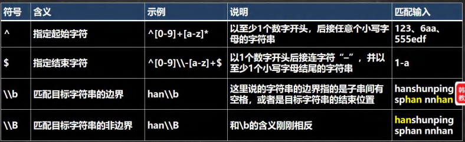
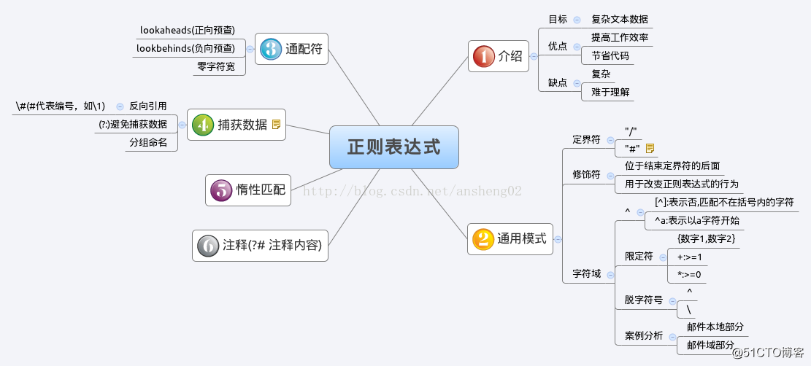

# 27.1 正则表达式底层实现
找出所有四个数字连在一起的子串， 比如：应该找到 1998 1999 3443 9889
```java
@Test
public void test01() {
	String content = "1998 年 12 月 8 日，第二代 Java 平台的企业版 J2EE 发布。1999 年 6 月，Sun 公司发布了" +
			"第二代 Java 平台（简称为 Java2）的 3 个版本：J2ME（Java2 Micro Edition，Java2 平台的微型" +
			"版），应用于移动、无线及有限资源的环境；J2SE（Java 2 Standard Edition，Java 2 平台的" +
			"标准版），应用于桌面环境；J2EE（Java 2Enterprise Edition，Java 2 平台的企业版），应" +
			"用 3443 于基于 Java 的应用服务器。Java 2 平台的发布，是 Java 发展过程中最重要的一个" +
			"里程碑，标志着 Java 的应用开始普及 9889 ";

	//1. 正则表达式
	String regStr = "(\\d\\d)(\\d\\d)";
	//2. 创建模式对象[即正则表达式对象]
	Pattern pattern = Pattern.compile(regStr);
	//3. 创建匹配器
	Matcher matcher = pattern.matcher(content);

	while (matcher.find()) {
		System.out.println("找到: " + matcher.group(0));
		System.out.println("第 1 组()匹配到的值=" + matcher.group(1));
		System.out.println("第 2 组()匹配到的值=" + matcher.group(2));
	}
}
```
> **小结 **
> 1. 如果正则表达式有() 即分组。
> 1. 取出匹配的字符串规则如下。
> 1. group(0) 表示匹配到的子字符串。
> 1. group(1) 表示匹配到的子字符串的第一组字串。
> 1. group(2) 表示匹配到的子字符串的第 2 组字串。
> 1. 但是分组的数不能越界。

# 27.2 正则表达式语法
## 27.2.1 转义号
符号说明:在我们使用正则表达式去检索某些特殊字符的时候，需要用到转义符号，否则检索不到结果，甚至会报错的。
**提示:**
在Java的正则表达式中，两个`\`代表其他语言中的一个`\`。
需要用到转义符号的字符有：`. + * ( ) $ / \ ? [ ] ^ { }`。
## 27.2.2 基本书写符号
| **符号** | **含义**                       | **示例**   | **解释**                                             | **匹配输入** |
| -------- | ------------------------------ | ---------- | ---------------------------------------------------- | ------------ |
| `\`      | 转义符                         | *          | 符号“*”                                              | *            |
| `[ ]`    | 可接收的字符列表               | [efgh]     | e、f、g、h中的任意1个字符                            | e、f、g、h   |
| `[^ ]`   | 不接收的字符列表               | [^abc]     | 除a、b、c之外的任意1个字符，包括汉字、数字和特殊符号 | m、q、5、*   |
| `&#124;` | 匹配“&#124;”之前或之后的表达式 | ab&#124;cd | ab或者cd                                             | ab、cd       |
| `( )`    | 将子表达式分组                 | (abc)      | 将字符串abc作为一组                                  | abc          |
| `-`      | 连字符                         | A-Z        | 任意单个大写英文字母                                 | 大写字母     |

## 27.2.3 限定符
**限定符将可选数量的数据添加到正则表达式，下表为常用限定符：**

| **符号** | **含义**                       | **示例**       | **解释**                                                    | **匹配输入**            | **不匹配输入** |
| -------- | ------------------------------ | -------------- | ----------------------------------------------------------- | ----------------------- | -------------- |
| `* `     | 指定字符重复0次或n次           | (abc)*         | 仅包含任意个abc的字符串                                     | abc、abcabcabc          | a、abca        |
| `+`      | 指定字符重复1次或n次           | m+(abc)*       | 以至少1个m开头，后接任意个abc的字符串                       | m、mabc、mabcabc        | ma、abc        |
| `？`     | 指定字符重复0次或1次           | m+abc?         | 以至少1个m开头，后接ab或abc的字符串                         | mab、mabc、mmmab、mmabc | ab、abc、mabcc |
| `{n}`    | 只能输入n个字符                | [abcd]{3}      | 由abcd中字母组成的任意长度为3的字符串                       | abc、dbc、adc           | a、aa、dcbd    |
| `{n,}`   | 指定至少 n 个匹配              | [abcd]{3,}     | 由abcd中字母组成的任意长度不小于3的字符串                   | aab、dbc、aaabdc        | a、cd、bb      |
| `{n,m}`  | 指定至少 n 个但不多于 m 个匹配 | [abcd]{3,5}    | 由abcd中字母组成的任意长度不小于3，不大于5的字符串          | abc、abcd、aaaaa、bcdab | ab、ababab、a  |
| `^`      | 指定起始字符                   | ^[0-9]+[a-z]*  | 以至少1个数字开头，后接任意个小写字母的字符串               | 123、6aa、555edf        | abc、aaa、a33  |
| `$`      | 指定结束字符                   | ^[0-9]-[a-z]+$ | 以1个数字开头后接连字符“–”，并以至少1个小写字母结尾的字符串 | 2-a、3-ddd、5-efg       | 33a、8-、7-Ab  |

## 27.2.4 匹配字符集

- **匹配字符集是预定义的用于正则表达式中的符号集。**
- **如果字符串与字符集中的任何一个字符相匹配，它就会找到这个匹配项。**
- **部分匹配字符集：**

| **符号** | **含义**                                 | **示例**     | **解释**                                                     | **匹配输入**           | **不匹配输入**  |
| -------- | ---------------------------------------- | ------------ | ------------------------------------------------------------ | ---------------------- | --------------- |
| `.`      | 匹配除 \\n以外的任何字符                 | a..b         | 以a开头，b结尾，中间包括2个任意字符的长度为4的字符串         | aaab、aefb、a35b、a#*b | ab、aaaa、a347b |
| `\d`     | 匹配单个数字字符，相当于[0-9]            | \\d{3}(\\d)? | 包含3个或4个数字的字符串                                     | 123、9876              | 12、01023       |
| `\D`     | 匹配单个非数字字符，相当于0-9            | \\D(\\d)*    | 以单个非数字字符开头，后接任意个数字字符串                   | a、A342                | aa、AA78、1234  |
| `\w`     | 匹配单个数字、大小写字母和汉字字符       | \\d{3}\\w{4} | 以3个数字字符开头的长度为7的字符串                           | 234abcd、12345Pe       | 58a、Ra46       |
| `\W`     | 匹配单个除汉字、字母、数字以外的其他字符 | \\W+\\d{2}   | 以至少1个非数字、字母和汉字的字符开头，2个数字字符结尾的字符串 | #29、#?@10             | 23、#?@100      |

## 27.2.5 分组、捕获

- **分组**
我们可以用圆括号组成一个比较复杂的匹配模式，那么一个圆括号的部分我们可以看作是一个子表达式/一个分组。
- **捕获**
把正则表达式中子表达式/分组匹配的内容，保存到内存中以数字编号或显式命名的组里，方便后面引用，从左向右，以分组的左括号为标志，第一个出现的分组的组号为1,第二个为2,以此类推。组0代表的是整个正则式。

| **分组构造**       | **说明**                                                     |
| ------------------ | ------------------------------------------------------------ |
| `(pattern)`        | 非命名捕获。捕获匹配的子字符串（或非捕获组）。编号为零的第一个捕获是由整个正则表达式模式匹配的文本，其它捕获结果则根据左括号的顺序从1开始自动编号。 |
| `(?<name>pattern)` | 命名捕获。将匹配的子字符串捕获到一个组名称或编号名称中。也可以用单引号替代尖括号，例如 (?'name') |
| `(?:pattern)`      | 匹配 pattern 但不捕获该匹配的子表达式，即它是一个非捕获匹配， 不存储供以后使用的匹配。这对于用"or"字符()组合模式部件的情况很有用。例如，'`industr(?:y&#124;ies)` 是比`industry&#124;industries`'更经济的表达式。 |
| `(?=pattern)`      | 它是一个非捕获匹配。例如，'Windows (? =95&#124;98&#124;NT]2000)'四配"Windows 2000"中的"Windows"，但不匹配"Windows 3.1"中的"Windows"。 |
| `(?!pattern)`      | 该表达式匹配不处于匹配pattern的字符串的起始点的搜索字符串。它是一个非捕获匹配。例如，Windows (?I95&#124;98&#124;NT&#124;2000)匹配"Windows 3.1"中的"Windows"，但不匹配"Windows 2000"中的"Windows"。 |

## 27.2.6 反向引用
圆括号的内容被捕获后，可以在这个括号后被使用，从而写出一个比较实用的匹配模式，这个我们称为反向引用，这种引用既可以是在正则表达式内部，也可以是在正则表达式外部，内部反向引用`\`分组号，外部反向引用`$`分组号。
> - 匹配两个连续的相同数字: 
> `(\d)\1`
> - 匹配五个连续的相同数字: 
> `(\d)\1{4} `
> - 匹配个位与干位相同，十位与百位相同的数5225, 1551
> `(\d)(\d)\2\1`

## 27.2.7 定位符
规定要匹配的字符串出现的位置，比如在字符串的开始还是在结束的位置，这个也是相当有用的

## 27.2.8 元字符-详细说明
| **字符**          | **说明**                                                     |
| ----------------- | ------------------------------------------------------------ |
| **\\**            | **将下一字符标记为特殊字符、文本、反向引用或八进制转义符。例如，"n"匹配字符"n"。"\\n"匹配换行符。序列"\\\\\\\\"匹配"\\\\"，"\\\\("匹配"("。** |
| **^**             | **匹配输入字符串开始的位置。如果设置了 RegExp 对象的 Multiline 属性，^ 还会与"\\n"或"\\r"之后的位置匹配。** |
| **$**             | **匹配输入字符串结尾的位置。如果设置了 RegExp 对象的 Multiline 属性，$ 还会与"\\n"或"\\r"之前的位置匹配。** |
| *****             | **零次或多次匹配前面的字符或子表达式。例如，zo* 匹配"z"和"zoo"。* 等效于 {0,}。** |
| **+**             | **一次或多次匹配前面的字符或子表达式。例如，"zo+"与"zo"和"zoo"匹配，但与"z"不匹配。+ 等效于 {1,}。** |
| **?**             | **零次或一次匹配前面的字符或子表达式。例如，"do(es)?"匹配"do"或"does"中的"do"。? 等效于 {0,1}。** |
| **{_n_}**         | **_n _是非负整数。正好匹配 _n_ 次。例如，"o{2}"与"Bob"中的"o"不匹配，但与"food"中的两个"o"匹配。** |
| **{_n_,}**        | **_n _是非负整数。至少匹配 _n _次。例如，"o{2,}"不匹配"Bob"中的"o"，而匹配"foooood"中的所有 o。"o{1,}"等效于"o+"。"o{0,}"等效于"o*"。** |
| **{_n_,_m_}**     | **_m_ 和 _n_ 是非负整数，其中 _n_ <= _m_。匹配至少 _n_ 次，至多 _m_ 次。例如，"o{1,3}"匹配"fooooood"中的头三个 o。'o{0,1}' 等效于 'o?'。注意：您不能将空格插入逗号和数字之间。** |
| **?**             | **当此字符紧随任何其他限定符（*、+、?、{_n_}、{_n_,}、{_n_,_m_}）之后时，匹配模式是"非贪心的"。"非贪心的"模式匹配搜索到的、尽可能短的字符串，而默认的"贪心的"模式匹配搜索到的、尽可能长的字符串。例如，在字符串"oooo"中，"o+?"只匹配单个"o"，而"o+"匹配所有"o"。** |
| **.**             | **匹配除"\\r\\n"之外的任何单个字符。若要匹配包括"\\r\\n"在内的任意字符，请使用诸如"[\\s\\S]"之类的模式。** |
| **(_pattern_)**   | **匹配 _pattern_ 并捕获该匹配的子表达式。可以使用 $0…$9 属性从结果"匹配"集合中检索捕获的匹配。若要匹配括号字符 ( )，请使用"\\("或者"\\)"。** |
| **(?:_pattern_)** | **匹配 _pattern_ 但不捕获该匹配的子表达式，即它是一个非捕获匹配，不存储供以后使用的匹配。这对于用"or"字符 (&#124;) 组合模式部件的情况很有用。例如，'industr(?:y&#124;ies) 是比 'industry&#124;industries' 更经济的表达式。** |
| **(?=_pattern_)** | **执行正向预测先行搜索的子表达式，该表达式匹配处于匹配 _pattern_ 的字符串的起始点的字符串。它是一个非捕获匹配，即不能捕获供以后使用的匹配。例如，'Windows (?=95&#124;98&#124;NT&#124;2000)' 匹配"Windows 2000"中的"Windows"，但不匹配"Windows 3.1"中的"Windows"。预测先行不占用字符，即发生匹配后，下一匹配的搜索紧随上一匹配之后，而不是在组成预测先行的字符后。** |
| **(?!_pattern_)** | **执行反向预测先行搜索的子表达式，该表达式匹配不处于匹配 _pattern_ 的字符串的起始点的搜索字符串。它是一个非捕获匹配，即不能捕获供以后使用的匹配。例如，'Windows (?!95&#124;98&#124;NT&#124;2000)' 匹配"Windows 3.1"中的 "Windows"，但不匹配"Windows 2000"中的"Windows"。预测先行不占用字符，即发生匹配后，下一匹配的搜索紧随上一匹配之后，而不是在组成预测先行的字符后。** |
| **_x_&#124;_y_**  | **匹配 _x_ 或 _y_。例如，'z&#124;food' 匹配"z"或"food"。'(z&#124;f)ood' 匹配"zood"或"food"。** |
| **[_xyz_]**       | **字符集。匹配包含的任一字符。例如，"[abc]"匹配"plain"中的"a"。** |
| **[^_xyz_]**      | **反向字符集。匹配未包含的任何字符。例如，"[^abc]"匹配"plain"中"p"，"l"，"i"，"n"。** |
| **[_a-z_]**       | **字符范围。匹配指定范围内的任何字符。例如，"[a-z]"匹配"a"到"z"范围内的任何小写字母。** |
| **[^_a-z_]**      | **反向范围字符。匹配不在指定的范围内的任何字符。例如，"[^a-z]"匹配任何不在"a"到"z"范围内的任何字符。** |
| **\\b**           | **匹配一个字边界，即字与空格间的位置。例如，"er\\b"匹配"never"中的"er"，但不匹配"verb"中的"er"。** |
| **\\B**           | **非字边界匹配。"er\\B"匹配"verb"中的"er"，但不匹配"never"中的"er"。** |
| **\\c_x_**        | **匹配 _x_ 指示的控制字符。例如，\\cM 匹配 Control-M 或回车符。_x_ 的值必须在 A-Z 或 a-z 之间。如果不是这样，则假定 c 就是"c"字符本身。** |
| **\\d**           | **数字字符匹配。等效于 [0-9]。**                             |
| **\\D**           | **非数字字符匹配。等效于 [^0-9]。**                          |
| **\\f**           | **换页符匹配。等效于 \\x0c 和 \\cL。**                       |
| **\\n**           | **换行符匹配。等效于 \\x0a 和 \\cJ。**                       |
| **\\r**           | **匹配一个回车符。等效于 \\x0d 和 \\cM。**                   |
| **\\s**           | **匹配任何空白字符，包括空格、制表符、换页符等。与 [ \\f\\n\\r\\t\\v] 等效。** |
| **\\S**           | **匹配任何非空白字符。与 [^ \\f\\n\\r\\t\\v] 等效。**        |
| **\\t**           | **制表符匹配。与 \\x09 和 \\cI 等效。**                      |
| **\\v**           | **垂直制表符匹配。与 \\x0b 和 \\cK 等效。**                  |
| **\\w**           | **匹配任何字类字符，包括下划线。与"[A-Za-z0-9_]"等效。**     |
| **\\W**           | **与任何非单词字符匹配。与"[^A-Za-z0-9_]"等效。**            |
| **\\x_n_**        | **匹配 _n_，此处的 _n_ 是一个十六进制转义码。十六进制转义码必须正好是两位数长。例如，"\\x41"匹配"A"。"\\x041"与"\\x04"&"1"等效。允许在正则表达式中使用 ASCII 代码。** |
| **\\_num_**       | **匹配 _num_，此处的 _num_ 是一个正整数。到捕获匹配的反向引用。例如，"(.)\\1"匹配两个连续的相同字符。** |
| **\\_n_**         | **标识一个八进制转义码或反向引用。如果 \\_n_ 前面至少有 _n_ 个捕获子表达式，那么 _n_ 是反向引用。否则，如果 _n_ 是八进制数 (0-7)，那么 _n_ 是八进制转义码。** |
| **\\_nm_**        | **标识一个八进制转义码或反向引用。如果 \\_nm_ 前面至少有 _nm_ 个捕获子表达式，那么 _nm_ 是反向引用。如果 \\_nm_ 前面至少有 _n_ 个捕获，则 _n_ 是反向引用，后面跟有字符 _m_。如果两种前面的情况都不存在，则 \\_nm_ 匹配八进制值 _nm_，其中 _n _和 _m_ 是八进制数字 (0-7)。** |
| **\\nml**         | **当 _n_ 是八进制数 (0-3)，_m_ 和 _l_ 是八进制数 (0-7) 时，匹配八进制转义码 _nml_。** |
| **\\u_n_**        | **匹配 _n_，其中 _n_ 是以四位十六进制数表示的 Unicode 字符。例如，\\u00A9 匹配版权符号 (©)。** |

# 27.3 Java 三个常用类

- **Pattern**
- **Matcher**
- **PatternSyntaxException**
## 27.3.1 Pattern

- 方法

| **Modifier and Type** | **Method and Description**                                   |
| --------------------- | ------------------------------------------------------------ |
| Predicate<String>     | asPredicate() 创建可用于匹配字符串的谓词。                   |
| static Pattern        | compile(String regex) 将给定的正则表达式编译为模式。         |
| static Pattern        | compile(String regex, int flags) 将给定的正则表达式编译为带有给定标志的模式。 |
| int                   | flags() 返回此模式的匹配标志。                               |
| Matcher               | matcher(CharSequence input) 创建一个匹配器，匹配给定的输入与此模式。 |
| static boolean        | matches(String regex, CharSequence input) 编译给定的正则表达式，并尝试匹配给定的输入。 |
| String                | pattern() 返回编译此模式的正则表达式。                       |
| static String         | quote(String s) 返回指定的 String的文字模式 String 。        |
| String[]              | split(CharSequence input) 将给定的输入序列分成这个模式的匹配。 |
| String[]              | split(CharSequence input, int limit) 将给定的输入序列分成这个模式的匹配。 |
| Stream<String>        | splitAsStream(CharSequence input) 根据给定的输入序列创建一个流，该流与该模式匹配。 |
| String                | toString() 返回此模式的字符串表示形式。                      |

- 示例
```java
import java.util.regex.Pattern;

/**
 * 用于整体匹配, 在验证输入的字符串是否满足条件使用
 */
public class PatternMethod {
    public static void main(String[] args) {
        String content = "hello abc hello, 任超";
        //String regStr = "hello";
        String regStr = "hello.*";
        boolean b = Pattern.matches(regStr, content);
        System.out.println("整体匹配= " + b);
    }
}
```
## 27.3.2 Matcher

- 方法

| **Modifier and Type** | **Method and Description**                                   |
| --------------------- | ------------------------------------------------------------ |
| Matcher               | appendReplacement(StringBuffer sb, String replacement) 实施非终端附加和替换步骤。 |
| StringBuffer          | appendTail(StringBuffer sb) 实施终端附加和替换步骤。         |
| int                   | end() 返回最后一个字符匹配后的偏移量。                       |
| int                   | end(int group) 返回在上次匹配操作期间由给定组捕获的子序列的最后一个字符之后的偏移量。 |
| int                   | end(String name) 返回给定捕获子序列的最后一个字符之后的偏移量 named-capturing group以前的匹配操作期间。 |
| boolean               | find() 尝试找到匹配模式的输入序列的下一个子序列。            |
| boolean               | find(int start) 重新设置该匹配器，然后尝试从指定的索引开始找到匹配模式的输入序列的下一个子序列。 |
| String                | group() 返回与上一个匹配匹配的输入子序列。                   |
| String                | group(int group) 返回在上一次匹配操作期间由给定组捕获的输入子序列。 |
| String                | group(String name) 返回给定捕获的输入子序列 named-capturing  group以前的匹配操作期间。 |
| int                   | groupCount() 返回此匹配器模式中捕获组的数量。                |
| boolean               | hasAnchoringBounds() 查询该匹配器的区域边界的锚定。          |
| boolean               | hasTransparentBounds() 查询此匹配器的区域边界的透明度。      |
| boolean               | hitEnd() 如果在匹配器执行的最后一次匹配操作中输入的结尾被搜索引擎命中，则返回true。 |
| boolean               | lookingAt() 尝试将输入序列从区域开头开始与模式相匹配。       |
| boolean               | matches() 尝试将整个区域与模式进行匹配。                     |
| Pattern               | pattern() 返回该匹配器解释的模式。                           |
| static String         | quoteReplacement(String s) 返回一个文字替换 String为指定的 String 。 |
| Matcher               | region(int start, int end) 设置该匹配器区域的限制。          |
| int                   | regionEnd() 报告该匹配器区域的最终索引（排他）。             |
| int                   | regionStart() 报告该匹配器区域的开始索引。                   |
| String                | replaceAll(String replacement) 将与模式匹配的输入序列的每个子序列替换为给定的替换字符串。 |
| String                | replaceFirst(String replacement) 将与模式匹配的输入序列的第一个子序列替换为给定的替换字符串。 |
| boolean               | requireEnd() 如果更多输入可以将正匹配更改为否定，则返回true。 |
| Matcher               | reset() 重设此匹配器。                                       |
| Matcher               | reset(CharSequence input) 使用新的输入序列重置此匹配器。     |
| int                   | start() 返回上一个匹配的起始索引。                           |
| int                   | start(int group) 返回给定组在上一个匹配操作期间捕获的子序列的开始索引。 |
| int                   | start(String name) 返回给定捕获的子序列的初始索引 [named-capturing group](Pattern.html#groupname)以前的匹配操作期间。 |
| MatchResult           | toMatchResult() 返回此匹配器的匹配状态为[MatchResult](../../../java/util/regex/MatchResult.html)。 |
| String                | toString() 返回此匹配器的字符串表示形式。                    |
| Matcher               | useAnchoringBounds(boolean b) 设置该匹配器的区域边界的锚定。 |
| Matcher               | usePattern(Pattern newPattern) 更改，这 Matcher用于查找与匹配的 Pattern。 |
| Matcher               | useTransparentBounds(boolean b) 设置此匹配器的区域边界的透明度。 |

- 示例
```java
import java.util.regex.Matcher;
import java.util.regex.Pattern;

public class MatcherMethod {
    public static void main(String[] args) {
        String content = "hello edu jack hspedutom hello smith hello hspedu hspedu";
        String regStr = "hello";
        Pattern pattern = Pattern.compile(regStr);
        Matcher matcher = pattern.matcher(content);
        while (matcher.find()) {
            System.out.println("=================");
            System.out.println(matcher.start());
            System.out.println(matcher.end());
            System.out.println("找到: " + content.substring(matcher.start(), matcher.end()));
        }
        //整体匹配方法，常用于，去校验某个字符串是否满足某个规则
        System.out.println("整体匹配=" + matcher.matches());
        //完成如果 content 有 hspedu 替换成 韩顺平教育
        regStr = "hspedu";
        pattern = Pattern.compile(regStr);
        matcher = pattern.matcher(content);
        //注意：返回的字符串才是替换后的字符串 原来的 content 不变化
        String newContent = matcher.replaceAll("韩顺平教育");
        System.out.println("newContent=" + newContent);
        System.out.println("content=" + content);
        }
}
```
# 27.4 String 使用正则表达式
## 27.4.1 替换功能
```java
String str = "2000 年 5 月，JDK1.3、JDK1.4 和 J2SE1.3 相继发布，几周后其" +
        "获得了 Apple 公司 Mac OS X 的工业标准的支持。2001 年 9 月 24 日，J2EE1.3 发" +
        "布。2002 年 2 月 26 日，J2SE1.4 发布。自此 Java 的计算能力有了大幅提升";
//使用正则表达式方式，将 JDK1.3 和 JDK1.4 替换成 JDK
str = str.replaceAll("JDK1\\.3|JDK1\\.4", "JDK");
System.out.println(str);
```
## 27.4.2 判断功能
```java
//要求验证一个手机号， 要求必须是以 138 139 开头的
String str = "13888889999";
if (str.matches("1(38|39)\\d{8}")) {
    System.out.println("验证成功");
} else {
    System.out.println("验证失败");
}
```
## 27.4.3 分割功能
```java
//要求按照 # 或者 - 或者 ~ 或者 数字 来分割
String str = "hello#abc-jack12smith~北京";
String[] split = str.split("#|-|~|\\d+");
for (String s : split) {
    System.out.println(s);
}
```
# 27.5 总结
