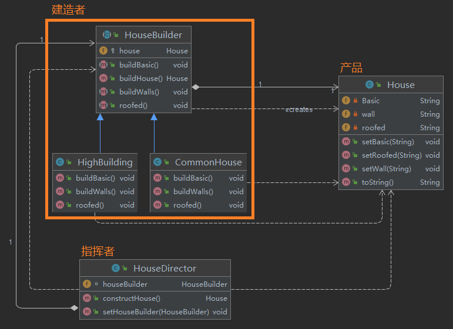
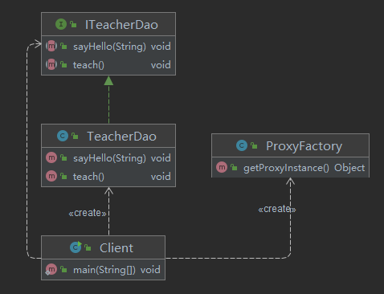
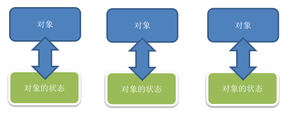

[尚硅谷Java设计模式（图解+框架源码剖析）_哔哩哔哩_bilibili](https://www.bilibili.com/video/BV1G4411c7N4)
[设计模式 - ShuSheng007](https://github.com/shusheng007/design-patterns)
[设计模式_Yeqiu1024的博客-CSDN博客](https://blog.csdn.net/h_xiao_x/category_6782631.html)
# 第 1 章 内容介绍

1. 软件工程中，设计模式（design pattern）是对软件设计中普遍存在（反复出现）的各种问题，所提出的解决方案。这个术语是由埃里希·伽玛（Erich Gamma）等人在 1990 年代从建筑设计领域引入到计算机科学的
1. 大厦 VS 简易房

1. 拿实际工作经历来说, 当一个项目开发完后，如果客户提出增新功能，怎么办?
（可扩展性,使用设计模式，软件具有很好的扩展性）
1. 如果项目开发完后，原来程序员离职，你接手维护该项目怎么办?
 (维护性[可读性、规范性])
1. 目前程序员门槛越来越高，一线 IT 公司(大厂)，都会问你在实际项目中使用过什么设计模式，怎样使用的，解决了什么问题。
1. 设计模式在软件中哪里？
面向对象(oo)=>功能模块[设计模式+算法(数据结构)]=>框架[使用到多种设计模式]=>架构 [服务器集群]。
1. 如果想成为合格软件工程师，那就花时间来研究下设计模式是非常必要的。
# 第 2 章 设计模式七大原则
## 2.1 设计模式的目的
编写软件过程中，程序员面临着来自 **耦合性，内聚性以及可维护性，可扩展性，重用性，灵活性 **等多方面的挑战，设计模式是为了让程序(软件)，具有更好：
> 1. 代码重用性 (即：相同功能的代码，不用多次编写)
> 1. 可读性 (即：编程规范性, 便于其他程序员的阅读和理解)
> 1. 可扩展性 (即：当需要增加新的功能时，非常的方便，称为可维护)
> 1. 可靠性 (即：当我们增加新的功能后，对原来的功能没有影响)
> 1. 使程序呈现高内聚，低耦合的特性
> 1. 分享金句：
> a. 设计模式包含了面向对象的精髓，“懂了设计模式，你就懂了面向对象分析和设计（OOA/D）的精要”
> b. Scott Mayers 在其巨著《Effective C++》就曾经说过：C老手和 C新手的区别就是前者手背上有很多伤疤

## 2.2 设计模式七大原则
设计模式原则，其实就是程序员在编程时，应当遵守的原则，也是各种设计模式的基础(即：设计模式为什么这样设计的依据)
**设计模式常用的七大原则有:**
> 1. 单一职责原则
> 1. 接口隔离原则
> 1. 依赖倒转(倒置)原则
> 1. 里氏替换原则
> 1. 开闭原则
> 1. 迪米特法则
> 1. **合成复用原则**

## 2.3 单一职责原则
### 2.3.1基本介绍
对类来说的，即一个类应该只负责一项职责。如类 A 负责两个不同职责：职责 1，职责 2。当职责 1 需求变更而改变 A 时，可能造成职责 2 执行错误，所以需要将类 A 的粒度分解为 A1，A2
### 2.3.2应用实例
```java
public class Demo1 {
    public static void main(String[] args) {
        Vehicle vehicle = new Vehicle();
        vehicle.run("摩托车");
        vehicle.run("汽车");
        vehicle.run("飞机");
    }
}

/**
* 交通工具类
* 方案 1 的分析
* 1. 在方式 1 的 run 方法中，违反了单一职责原则
* 2. 解决的方案非常的简单，根据交通工具运行方法不同，分解成不同类即可
*/
class Vehicle {
    public void run(String vehicle) {
        System.out.println(vehicle + " 在公路上运行....");
    }
}
```
```java
public class Demo2 {
    public static void main(String[] args) {
        RoadVehicle roadVehicle = new RoadVehicle();
        roadVehicle.run("摩托车");
        roadVehicle.run("汽车");
        AirVehicle airVehicle = new AirVehicle();
        airVehicle.run("飞机");
    }
}

/**
 * 方案 2 的分析
 * 1. 遵守单一职责原则
 * 2. 但是这样做的改动很大，即将类分解，同时修改客户端
 * 3. 改进：直接修改 Vehicle 类，改动的代码会比较少=>方案 3
 */
class RoadVehicle {
    public void run(String vehicle) {
        System.out.println(vehicle + "公路运行");
    }
}

class AirVehicle {
    public void run(String vehicle) {
        System.out.println(vehicle + "天空运行");
    }
}
```
```java
public class Demo3 {
    public static void main(String[] args) {
        Vehicle2 vehicle2 = new Vehicle2();
        vehicle2.run("汽车");
        vehicle2.runWater("轮船");
        vehicle2.runAir("飞机");
    }
}

/**
 * 交通工具类
 * 方案 3 的分析
 * 1. 这种修改方法没有对原来的类做大的修改，只是增加方法
 * 2. 这里虽然没有在类这个级别上遵守单一职责原则，但是在方法级别上，仍然是遵守单一职责
 */
class Vehicle2 {

    public void run(String vehicle) {
        System.out.println(vehicle + " 在公路上运行....");
    }

    public void runAir(String vehicle) {
        System.out.println(vehicle + " 在天空上运行....");
    }

    public void runWater(String vehicle) {
        System.out.println(vehicle + " 在水中行....");
    }
}
```
### 2.3.3注意事项和细节
> 1. 降低类的复杂度，一个类只负责一项职责。
> 1. 提高类的可读性，可维护性。
> 1. 降低变更引起的风险。
> 1. 通常情况下，我们应当遵守单一职责原则，只有逻辑足够简单，才可以在代码级违反单一职责原则；
> 只有类中方法数量足够少，可以在方法级别保持单一职责原则。

## 2.4 接口隔离原则
接口隔离原则(Interface Segregation Principle)
### 2.4.1基本介绍

1. 客户端不应该依赖它不需要的接口，即一个类对另一个类的依赖应该建立在最小的接口上
1. 先看一张图

类 A 通过接口 Interface1 依赖类 B，类 C 通过接口 Interface1 依赖类 D，如果接口 Interface1 对于类 A 和类 C 来说不是最小接口，那么类 B 和类 D 必须去实现他们不需要的方法。
1. 按隔离原则应当这样处理：
将接口 Interface1 拆分为独立的几个接口(这里我们拆分成 3 个接口)，类 A 和类 C 分别与他们需要的接口建立依赖关系。也就是采用接口隔离原则。
### 2.4.2没有使用接口隔离情况  
```java
public class Demo1 {
    public static void main(String[] args) {
        A a = new A();
        a.depend1(new B()); // A 类通过接口去依赖 B 类
        a.depend2(new B());
        a.depend3(new B());

        C c = new C();
        c.depend1(new D()); // C 类通过接口去依赖(使用)D 类
        c.depend4(new D());
        c.depend5(new D());
    }
}


interface Interface1 {
    void operation1();
    void operation2();
    void operation3();
    void operation4();
    void operation5();
}

class B implements Interface1 {
    public void operation1() {
        System.out.println("B 实现了 operation1");
    }

    public void operation2() {
        System.out.println("B 实现了 operation2");
    }

    public void operation3() {
        System.out.println("B 实现了 operation3");
    }

    public void operation4() {
        System.out.println("B 实现了 operation4");
    }

    public void operation5() {
        System.out.println("B 实现了 operation5");
    }
}

class D implements Interface1 {
    public void operation1() {
        System.out.println("D 实现了 operation1");
    }

    public void operation2() {
        System.out.println("D 实现了 operation2");
    }

    public void operation3() {
        System.out.println("D 实现了 operation3");
    }

    public void operation4() {
        System.out.println("D 实现了 operation4");
    }

    public void operation5() {
        System.out.println("D 实现了 operation5");
    }
}

class A { //A 类通过接口 Interface1 依赖(使用) B 类，但是只会用到 1,2,3 方法
    public void depend1(Interface1 i) {
        i.operation1();
    }

    public void depend2(Interface1 i) {
        i.operation2();
    }

    public void depend3(Interface1 i) {
        i.operation3();
    }
}

class C { //C 类通过接口 Interface1 依赖(使用) D 类，但是只会用到 1,4,5 方法
    public void depend1(Interface1 i) {
        i.operation1();
    }

    public void depend4(Interface1 i) {
        i.operation4();
    }

    public void depend5(Interface1 i) {
        i.operation5();
    }
}
```
### 2.4.3使用接口隔离原则改进

- **问题：**
上面的类 A 通过接口 Interface1 依赖类 B，类 C 通过接口 Interface1 依赖类 D，如果接口 Interface1 对于类 A 和类 C来说不是最小接口，那么类 B 和类 D 必须去实现他们不需要的方法
- **改进：**
   - 将接口 Interface1 拆分为独立的几个接口，类 A 和类 C 分别与他们需要的接口建立依赖关系。
   也就是采用接口隔离原则。
   - 接口 Interface1 中出现的方法，根据实际情况拆分为三个接口
   
- **代码实现**
```java
public class Demo2 {
    public static void main(String[] args) {
        A a = new A();
        a.depend1(new B()); // A 类通过接口去依赖 B 类
        a.depend2(new B());
        a.depend3(new B());

        C c = new C();
        c.depend1(new D()); // C 类通过接口去依赖(使用)D 类
        c.depend4(new D());
        c.depend5(new D());
    }
}

// 接口 1
interface Interface1 {
    void operation1();
}
// 接口 2
interface Interface2 {
    void operation2();
    void operation3();
}
// 接口 3
interface Interface3 {
    void operation4();
    void operation5();
}

class B implements Interface1, Interface2 {
    public void operation1() {
        System.out.println("B 实现了 operation1");
    }
    public void operation2() {
        System.out.println("B 实现了 operation2");
    }
    public void operation3() {
        System.out.println("B 实现了 operation3");
    }
}
class D implements Interface1, Interface3 {
    public void operation1() {
        System.out.println("D 实现了 operation1");
    }
    public void operation4() {
        System.out.println("D 实现了 operation4");
    }
    public void operation5() {
        System.out.println("D 实现了 operation5");
    }
}
class A { // A 类通过接口 Interface1,Interface2 依赖(使用) B 类，但是只会用到 1,2,3 方法
    public void depend1(Interface1 i) {
        i.operation1();
    }
    public void depend2(Interface2 i) {
        i.operation2();
    }
    public void depend3(Interface2 i) {
        i.operation3();
    }
}
class C { // C 类通过接口 Interface1,Interface3 依赖(使用) D 类，但是只会用到 1,4,5 方法
    public void depend1(Interface1 i) {
        i.operation1();
    }
    public void depend4(Interface3 i) {
        i.operation4();
    }
    public void depend5(Interface3 i) {
        i.operation5();
    }
}
```
## 2.5 依赖倒转原则
### 2.5.1基本介绍
依赖倒转原则(Dependence Inversion Principle)是指：
> 1. 高层模块不应该依赖低层模块，二者都应该依赖其抽象。
>    - 高层模块指的是相对抽象和通用的模块，而低层模块指的是相对具体和特定的模块。
> 2. 抽象不应该依赖细节，细节应该依赖抽象。
> 3. 依赖倒转(倒置)的中心思想是**面向接口编程**。
> 4. 依赖倒转原则是基于这样的设计理念：
>    1. 相对于细节的多变性，抽象的东西要稳定的多。
>    1. 以抽象为基础搭建的架构比以细节为基础的架构要稳定的多。
>    1. 在 java 中，抽象指的是接口或抽象类，细节就是具体的实现类。
> 5. 使用接口或抽象类的目的是制定好规范，而不涉及任何具体的操作，把展现细节的任务交给他们的实现类去完成。

### 2.5.2应用实例
请编程完成 Person 接收消息的功能。
```java
public class Demo1 {
    public static void main(String[] args) {
        Person person = new Person();
        person.receive(new Email());
    }
}

class Email {
    public String getInfo() {
        return "电子邮件信息: hello,world";
    }
}

/**
 * 完成 Person 接收消息的功能
 * 方案 1 分析
 * 1. 简单，比较容易想到
 * 2. 如果我们获取的对象是 微信，短信等等，则新增类，同时 Person 也要增加相应的接收方法
 * 3. 解决思路：引入一个抽象的接口 IReceiver, 表示接收者, 这样 Person 类与接口 IReceiver 发生依赖
 * 	  因为 Email, WeiXin 等等属于接收的范围，他们各自实现 IReceiver 接口就 ok, 这样我们就符合依赖倒转原则
 */
class Person {
    public void receive(Email email ) {
        System.out.println(email.getInfo());
    }
}
```
```java
public class Demo2 {
    public static void main(String[] args) {
        //客户端无需改变
        Person person = new Person();
        
        person.receive(new Email());
        person.receive(new WeiXin());
    }
}


//定义接口
interface IReceiver {
    public String getInfo();
}

//方式 2
class Person {
    //这里我们是对接口的依赖
    public void receive(IReceiver receiver ) {
        System.out.println(receiver.getInfo());
    }
}

class Email implements IReceiver {
    public String getInfo() {
        return "电子邮件信息: hello,world";
    }
}

//增加微信
class WeiXin implements IReceiver {
    public String getInfo() {
        return "微信信息: hello,ok";
    }
}
```
### 2.5.3三种传递方式

- **接口传递**
- **构造方法传递**
- **setter 方式传递**
```java
public class DependencyPass {
    public static void main(String[] args) {
        ChangHong changHong = new ChangHong();
        OpenAndClose openAndClose = new OpenAndClose();
        openAndClose.open(changHong);
    }
}

// 通过接口传递实现依赖
// 开关的接口
interface IOpenAndClose {
    public void open(ITV tv); //抽象方法,接收接口
}

interface ITV { //ITV 接口
    public void play();
}

class ChangHong implements ITV {
    @Override
    public void play() {
        System.out.println("长虹电视机，打开");
    }
}

// 实现接口
class OpenAndClose implements IOpenAndClose {
    public void open(ITV tv) {	//通过接口传递实现依赖
        tv.play();
    }
}
```
```java
public class DependencyPass {
    public static void main(String[] args) {

        ChangHong changHong = new ChangHong();
        //通过构造器进行依赖传递
        OpenAndClose openAndClose = new OpenAndClose(changHong);
        openAndClose.open();

    }
}


// 方式 2: 通过构造方法依赖传递
interface IOpenAndClose {
    public void open(); //抽象方法
}

interface ITV { //ITV 接口
    public void play();
}

class ChangHong implements ITV {
    @Override
    public void play() {
        System.out.println("长虹电视机，打开");
    }
}

class OpenAndClose implements IOpenAndClose {
    public ITV tv; //成员

    public OpenAndClose(ITV tv) { //通过构造器进行依赖传递
        this.tv = tv;
    }

    public void open() {
        this.tv.play();
    }
}
```
```java
public class DependencyPass {
    public static void main(String[] args) {

        ChangHong changHong = new ChangHong();
        //通过 set 方法进行依赖传递
        OpenAndClose openAndClose = new OpenAndClose();
        openAndClose.setTv(changHong);
        openAndClose.open();
    }
}

// 方式 3 , 通过 set 方法传递
interface IOpenAndClose {
    public void open(); // 抽象方法
    public void setTv(ITV tv);
}

interface ITV { // ITV 接口
    public void play();
}

class OpenAndClose implements IOpenAndClose {
    private ITV tv;
    public void setTv(ITV tv) {//通过 set 方法进行依赖传递
        this.tv = tv;
    }
    public void open() {
        this.tv.play();
    }
}

class ChangHong implements ITV {
    @Override
    public void play() {
        System.out.println("长虹电视机，打开");
    }
}
```
### 2.5.4注意事项和细节
> 1. 低层模块尽量都要有抽象类或接口，或者两者都有，程序稳定性更好。
> 1. 变量的声明类型尽量是抽象类或接口, 这样我们的变量引用和实际对象间，就存在一个缓冲层，利于程序扩展和优化。
> 1. 继承时遵循里氏替换原则。

## 2.6 里氏替换原则
### 2.6.1关于 OO 中的继承性

1. 继承包含这样一层含义：父类中凡是已经实现好的方法，实际上是在设定规范和契约，虽然它不强制要求所有的子类必须遵循这些契约，但是如果子类对这些已经实现的方法任意修改，就会对整个继承体系造成破坏。
1. 继承在给程序设计带来便利的同时，也带来了弊端。比如使用继承会给程序带来侵入性，程序的可移植性降低，增加对象间的耦合性，如果一个类被其他的类所继承，则当这个类需要修改时，必须考虑到所有的子类，并且父类修改后，所有涉及到子类的功能都有可能产生故障。
1. 问题提出：
在编程中，如何正确的使用继承? => 里氏替换原则。
### 2.6.2基本介绍

1. 里氏替换原则(Liskov Substitution Principle)在 1988 年，由麻省理工学院的以为姓里的女士提出的。
1. 如果对每个类型为 T1 的对象 o1，都有类型为 T2 的对象 o2，使得以 T1 定义的所有程序 P 在所有的对象 o1 都代换成 o2 时，程序 P 的行为没有发生变化，那么类型 T2 是类型 T1 的子类型。换句话说，所有引用基类的地方必须能透明地使用其子类的对象。
1. 在使用继承时，遵循里氏替换原则，**在子类中尽量不要重写父类的方法。**
1. 里氏替换原则告诉我们，继承实际上让两个类耦合性增强了，在适当的情况下，可以通过**聚合，组合，依赖**来解决问题。
### 2.6.3一个程序引出的问题
```java
public class Liskov {
    public static void main(String[] args) {
        A a = new A();
        System.out.println("11-3=" + a.func1(11, 3));
        System.out.println("1-8=" + a.func1(1, 8));
        System.out.println("-----------------------");
        B b = new B();
        System.out.println("11-3=" + b.func1(11, 3));//这里本意是求出 11-3
        System.out.println("1-8=" + b.func1(1, 8));// 1-8
        System.out.println("11+3+9=" + b.func2(11, 3));
    }
}

// A 类
class A {
    // 返回两个数的差
    public int func1(int num1, int num2) {
        return num1 - num2;
    }
}

// B 类继承了 A
// 增加了一个新功能：完成两个数相加,然后和 9 求和
class B extends A {
    //这里，重写了 A 类的方法, 可能是无意识
    public int func1(int a, int b) {
        return a + b;
    }

    public int func2(int a, int b) {
        return func1(a, b) + 9;
    }
}
```
### 2.6.4解决方法

1. 我们发现原来运行正常的相减功能发生了错误。原因就是类 B 无意中重写了父类的方法，造成原有功能出现错误。在实际编程中，我们常常会通过重写父类的方法完成新的功能，这样写起来虽然简单，但整个继承体系的复用性会比较差。特别是运行多态比较频繁的时候。
1. 通用的做法是：原来的父类和子类都继承一个更通俗的基类，原有的继承关系去掉，采用**依赖，聚合，组合**等关系代替。
```java
public class Liskov {
    public static void main(String[] args) {
        A a = new A();
        System.out.println("11-3=" + a.func1(11, 3));
        System.out.println("1-8=" + a.func1(1, 8));
        System.out.println("-----------------------");
        B b = new B();
        //因为 B 类不再继承 A 类，因此调用者，不会再 func1 是求减法
        //调用完成的功能就会很明确
        System.out.println("11+3=" + b.func1(11, 3));//这里本意是求出 11+3
        System.out.println("1+8=" + b.func1(1, 8));// 1+8
        System.out.println("11+3+9=" + b.func2(11, 3));

        //使用组合仍然可以使用到 A 类相关方法
        System.out.println("11-3=" + b.func3(11, 3));// 这里本意是求出 11-3
    }
}


//创建一个更加基础的基类
class Base {
//把更加基础的方法和成员写到 Base 类
}

// A 类
class A extends Base {
    // 返回两个数的差
    public int func1(int num1, int num2) {
        return num1 - num2;
    }
}

// B 类继承了 A
// 增加了一个新功能：完成两个数相加,然后和 9 求和
class B extends Base {
    //如果 B 需要使用 A 类的方法,使用组合关系
    private A a = new A();

    //这里，重写了 A 类的方法, 可能是无意识
    public int func1(int a, int b) {
        return a + b;
    }

    public int func2(int a, int b) {
        return func1(a, b) + 9;
    }

    //我们仍然想使用 A 的方法
    public int func3(int a, int b) {
        return this.a.func1(a, b);
    }
}
```
## 2.7 开闭原则
### 2.7.1基本介绍
> 1. 开闭原则（Open Closed Principle）是编程中最基础、最重要的设计原则。
> 1. 一个软件实体如类，**模块和函数应该对扩展开放**(对提供方)，**对修改关闭**(对使用方)。
> **用抽象构建框架，用实现扩展细节。**
> 1. 当软件需要变化时，尽量通过扩展软件实体的行为来实现变化，而不是通过修改已有的代码来实现变化。
> 1. 编程中遵循其它原则，以及使用设计模式的目的就是遵循开闭原则。

### 2.7.2看一段代码
```java
public class Ocp {

    public static void main(String[] args) {
        //使用看看存在的问题
        GraphicEditor graphicEditor = new GraphicEditor();
        graphicEditor.drawShape(new Rectangle());
        graphicEditor.drawShape(new Circle());
        graphicEditor.drawShape(new Triangle());
    }

}

//这是一个用于绘图的类 [使用方]
class GraphicEditor {
    //接收Shape对象，然后根据type，来绘制不同的图形
    public void drawShape(Shape s) {
        if (s.m_type == 1)
            drawRectangle(s);
        else if (s.m_type == 2)
            drawCircle(s);
        else if (s.m_type == 3)
            drawTriangle(s);
    }

    //绘制矩形
    public void drawRectangle(Shape r) {
        System.out.println(" 绘制矩形 ");
    }

    //绘制圆形
    public void drawCircle(Shape r) {
        System.out.println(" 绘制圆形 ");
    }

    //绘制三角形
    public void drawTriangle(Shape r) {
        System.out.println(" 绘制三角形 ");
    }
}

//Shape类，基类
class Shape {
    int m_type;
}

class Rectangle extends Shape {
    Rectangle() {
        super.m_type = 1;
    }
}

class Circle extends Shape {
    Circle() {
        super.m_type = 2;
    }
}

//新增画三角形
class Triangle extends Shape {
    Triangle() {
        super.m_type = 3;
    }
}
```
### 2.7.3改进的思路分析
**思路：**
把创建 Shape 类做成抽象类，并提供一个抽象的 draw 方法，让子类去实现即可，这样我们有新的图形种类时，只需要让新的图形类继承 Shape，并实现 draw 方法即可，使用方的代码就不需要修 -> 满足了开闭原则。
```java
public class Ocp {
    public static void main(String[] args) {
        //使用看看存在的问题
        GraphicEditor graphicEditor = new GraphicEditor();
        graphicEditor.drawShape(new Rectangle());
        graphicEditor.drawShape(new Circle());
        graphicEditor.drawShape(new Triangle());
        graphicEditor.drawShape(new OtherGraphic());
    }
}

//这是一个用于绘图的类 [使用方]
class GraphicEditor {
    //接收Shape对象，调用draw方法
    public void drawShape(Shape s) {
        s.draw();
    }
}

//Shape类，基类
abstract class Shape {
    int m_type;
    public abstract void draw();//抽象方法
}

class Rectangle extends Shape {
    Rectangle() {
        super.m_type = 1;
    }

    @Override
    public void draw() {
        System.out.println(" 绘制矩形 ");
    }
}

class Circle extends Shape {
    Circle() {
        super.m_type = 2;
    }
    @Override
    public void draw() {
        System.out.println(" 绘制圆形 ");
    }
}

//新增画三角形
class Triangle extends Shape {
    Triangle() {
        super.m_type = 3;
    }
    @Override
    public void draw() {
        System.out.println(" 绘制三角形 ");
    }
}

//新增一个图形
class OtherGraphic extends Shape {
    OtherGraphic() {
        super.m_type = 4;
    }

    @Override
    public void draw() {
        System.out.println(" 绘制其它图形 ");
    }
}
```
## 2.8 迪米特法则
### 2.8.1基本介绍
> 1. 一个对象应该对其他对象保持最少的了解。
> 1. 类与类关系越密切，耦合度越大。
> 1. 迪米特法则(Demeter Principle)又叫**最少知道原则**，即**一个类对自己依赖的类知道的越少越好**。也就是说，对于被依赖的类不管多么复杂，都尽量将逻辑封装在类的内部。对外除了提供的 public 方法，不对外泄露任何信息。
> 1. 迪米特法则还有个更简单的定义：**只与直接的朋友通信**。
> 1. **直接的朋友**：每个对象都会与其他对象有耦合关系，只要两个对象之间有耦合关系，我们就说这两个对象之间是朋友关系。耦合的方式很多，依赖，关联，组合，聚合等。其中，我们称出现成员变量，方法参数，方法返回值中的类为直接的朋友，而出现在局部变量中的类不是直接的朋友。也就是说，陌生的类最好不要以局部变量的形式出现在类的内部。

### 2.8.2应用实例
有一个学校，下属有各个学院和总部，现要求打印出学校总部员工 ID 和学院员工的 id
```java
public class demo1 {
    public static void main(String[] args) {
        //创建了一个 SchoolManager 对象
        SchoolManager schoolManager = new SchoolManager();
        //输出学院的员工id 和  学校总部的员工信息
        schoolManager.printAllEmployee(new CollegeManager());
        
    }
}


//学校总部员工类
class Employee {
    private String id;
    
    public void setId(String id) {
        this.id = id;
    }
    
    public String getId() {
        return id;
    }
}


//学院的员工类
class CollegeEmployee {
    private String id;
    
    public void setId(String id) {
        this.id = id;
    }
    
    public String getId() {
        return id;
    }
}


//管理学院员工的管理类
class CollegeManager {
    //返回学院的所有员工
    public List<CollegeEmployee> getAllEmployee() {
        List<CollegeEmployee> list = new ArrayList<CollegeEmployee>();
        for (int i = 0; i < 10; i++) { //这里我们增加了10个员工到 list
            CollegeEmployee emp = new CollegeEmployee();
            emp.setId("学院员工id= " + i);
            list.add(emp);
        }
        return list;
    }
}

//学校管理类

//分析 SchoolManager 类的直接朋友类有哪些 Employee、CollegeManager
//CollegeEmployee 不是 直接朋友 而是一个陌生类，这样违背了 迪米特法则
class SchoolManager {
    //返回学校总部的员工
    public List<Employee> getAllEmployee() {
        List<Employee> list = new ArrayList<Employee>();
        
        for (int i = 0; i < 5; i++) { //这里我们增加了5个员工到 list
            Employee emp = new Employee();
            emp.setId("学校总部员工id= " + i);
            list.add(emp);
        }
        return list;
    }
    
    //该方法完成输出学校总部和学院员工信息(id)
    void printAllEmployee(CollegeManager sub) {
        
        //分析问题
        //1. 这里的 CollegeEmployee 不是  SchoolManager的直接朋友
        //2. CollegeEmployee 是以局部变量方式出现在 SchoolManager
        //3. 违反了 迪米特法则
        
        //获取到学院员工
        List<CollegeEmployee> list1 = sub.getAllEmployee();
        System.out.println("------------学院员工------------");
        for (CollegeEmployee e : list1) {
            System.out.println(e.getId());
        }
        //获取到学校总部员工
        List<Employee> list2 = this.getAllEmployee();
        System.out.println("------------学校总部员工------------");
        for (Employee e : list2) {
            System.out.println(e.getId());
        }
    }
}
```
### 2.8.3应用实例改进
前面设计的问题在于 SchoolManager 中，CollegeEmployee 类并不是 SchoolManager 类的直接朋友 (分析)。
按照迪米特法则，应该避免类中出现这样非直接朋友关系的耦合。
```java
public class Demo2 {
    public static void main(String[] args) {
        System.out.println("~~~使用迪米特法则的改进~~~");
        //创建了一个 SchoolManager 对象
        SchoolManager schoolManager = new SchoolManager();
        //输出学院的员工id 和  学校总部的员工信息
        schoolManager.printAllEmployee(new CollegeManager());
        
    }
}


//学校总部员工类
class Employee {
    private String id;
    
    public void setId(String id) {
        this.id = id;
    }
    
    public String getId() {
        return id;
    }
}


//学院的员工类
class CollegeEmployee {
    private String id;
    
    public void setId(String id) {
        this.id = id;
    }
    
    public String getId() {
        return id;
    }
}


//管理学院员工的管理类
class CollegeManager {
    //返回学院的所有员工
    public List<CollegeEmployee> getAllEmployee() {
        List<CollegeEmployee> list = new ArrayList<CollegeEmployee>();
        for (int i = 0; i < 10; i++) { //这里我们增加了10个员工到 list
            CollegeEmployee emp = new CollegeEmployee();
            emp.setId("学院员工id= " + i);
            list.add(emp);
        }
        return list;
    }
    
    //输出学院员工的信息
    public void printEmployee() {
        //获取到学院员工
        List<CollegeEmployee> list1 = getAllEmployee();
        System.out.println("------------学院员工------------");
        for (CollegeEmployee e : list1) {
            System.out.println(e.getId());
        }
    }
}

//学校管理类

//分析 SchoolManager 类的直接朋友类有哪些 Employee、CollegeManager
//CollegeEmployee 不是 直接朋友 而是一个陌生类，这样违背了 迪米特法则
class SchoolManager {
    //返回学校总部的员工
    public List<Employee> getAllEmployee() {
        List<Employee> list = new ArrayList<Employee>();
        
        for (int i = 0; i < 5; i++) { //这里我们增加了5个员工到 list
            Employee emp = new Employee();
            emp.setId("学校总部员工id= " + i);
            list.add(emp);
        }
        return list;
    }
    
    //该方法完成输出学校总部和学院员工信息(id)
    void printAllEmployee(CollegeManager sub) {
        
        //分析问题
        //1. 将输出学院的员工方法，封装到CollegeManager
        sub.printEmployee();
        
        //获取到学校总部员工
        List<Employee> list2 = this.getAllEmployee();
        System.out.println("------------学校总部员工------------");
        for (Employee e : list2) {
            System.out.println(e.getId());
        }
    }
}
```
### 2.8.4注意事项和细节
迪米特法则的核心是降低类之间的耦合。
但是注意：由于每个类都减少了不必要的依赖，因此迪米特法则只是要求降低类间(对象间)耦合关系， 并不是要求完全没有依赖关系。
## 2.9 合成复用原则（Composite Reuse Principle）
合成复用原则（Composite Reuse Principle）
原则是**尽量使用合成/聚合的方式，而不是使用继承**

## 2.10 设计原则核心思想
找出应用中可能需要变化之处，把它们独立出来，不要和那些不需要变化的代码混在一起。
针对接口编程，而不是针对实现编程。
为了交互对象之间的松耦合设计而努力。
# 第 3 章 UML 类图
## 3.1 UML 基本介绍

1. UML——Unified modeling language UML (统一建模语言)，是一种用于软件系统分析和设计的语言工具，它用于帮助软件开发人员进行思考和记录思路的结果。

2. UML 本身是一套符号的规定，就像数学符号和化学符号一样，这些符号用于描述软件模型中的各个元素和他们之间的关系，比如类、接口、实现、泛化、依赖、组合、聚合等，如右图:
    

  
1. 使用 UML 来建模，常用的工具有 Rational Rose , 也可以使用 Visio 或者一些插件来建模。
IDEA 插件：
IDEA 自带类图工具【只能根据源码生成】
PlantUML


## 3.2 UML 图
画 UML 图与写文章差不多，都是把自己的思想描述给别人看，关键在于思路和条理，UML 图分类：

1. 用例图(use case)
1. 静态结构图：类图、对象图、包图、组件图、部署图
1. 动态行为图：交互图（时序图与协作图）、状态图、活动图

说明：

1. 类图是描述类与类之间的关系的，是 UML 图中最核心的
1. 在讲解设计模式时，我们必然会使用类图。
## 3.3 UML 类图
### 3.3.1介绍

1. 用于描述系统中的类(对象)本身的组成和类(对象)之间的各种静态关系。
1. 类之间的关系：依赖、泛化（继承）、实现、关联、聚合与组合。
1. 类图简单举例。
```java
public class Person { //代码形式->类图
    private Integer id;
    private String name;
    
    public void setName(String name) {
        this.name = name;
    }
    
    public String getName() {
        return name;
    }
}
```

### 3.3.2 IDEA类图工具介绍
关于类图，有很多画图软件，比如ProcessOn，powerDesigner，StarUML....
代码写好了也可以逆向生成类图，下面介绍的是IDEA逆向生成类图的过程：
**操作步骤：**

- 选中需要生成类图的类，右键选择Diagrams，或者选中类之后快捷键Ctrl+Alt+Shift+U。

- Show Diagrams:展示示意图（以页面的方式）
- Show Diagrams Popup：以弹出的方式展示示意图（在需要生成类下以弹出方式显示）
- 类图页面任意位置右击，选择Show Dependencies（展示依赖）

- **工具栏**

| **num** | **按钮**                | **功能**             |
| ------- | ----------------------- | -------------------- |
| 1       | Fields                  | 属性                 |
| 2       | Constructors            | 构造器               |
| 3       | Method                  | 方法                 |
| 4       | Properties              | 属性【get和set方法】 |
| 5       | Inner Class             | 内部类               |
| 6       | Change Visibility Level | 更改可见性级别       |
| 7       | Change Scope            | 改变范围             |
| 8       | Edge Creation Mode      | 边缘创建模式         |
| 9       | Show Dependencies       | 显示依赖关系         |
| 10      | Zoom In                 | 放大                 |
| 11      | Zoom Out                | 缩小                 |
| 12      | Actual Size             | 实际尺寸             |
| 13      | Fit Content             | 调整内容             |
| 14      | Apply Current Layout    | 应用当前布局         |
| 15      | Save diagram            | 保存示意图           |
| 16      | Export to file          | 导出文件             |
| 17      | Print                   | 打印                 |

- **其他包下的类也显示到现在已有的类图中**
   - 选中该类直接拖拽进来。
   - 右键 Add Class to Diagram 或者 空格，输入类名。
- **类图中各个小图标的含义**
   - **一、类的访问修饰符**
      - public：一把绿色的打开状态的小锁 
      - protectrd：一把灰色的钥匙 
      - default：一个灰色的圆环 
      - private：一把橙色的上了锁的锁  
   - **二、抽象（左右两边像是被各切了一刀变成灰色）**
      - 抽象类：
      - 抽象方法：
   - **三、静态（左下角有一个旋转了45度的正方体，中间有一个空心的圆）**
      - 静态内部类：
      - 静态方法：
      - 静态属性：
   - **四、final（左上角像顶着小雨伞）**
      - final类：
      - final方法：
      - final属性：
- **UML几种关系表示**
   - **泛化（继承关系）**实线三角形箭头，指向父类
   
   - **接口实现（Realization）**箭头指向接口
   
   - **依赖(Dependency)**
   灰色虚心箭头 代码定义 `局部变量`、`方法的参数`或者对 `静态方法` 的调用
   箭头指向被调用者，其中带有create的虚线是指创建（new）被调用者。
   
   - **关联（Association)、聚合（Aggregation）、组合(Composition)**
   代码定义 成员变量
   三种类型IDEA均以 `实线+菱形箭头+普通箭头` 表示，菱形箭头指向整体，普通箭头指向部分，箭头两端的数字表示实例的个数。
   
   - **详细**
   [UML类图的几种关系及对应java代码](https://blog.csdn.net/hejingfang123/article/details/111871668)
## 3.4 依赖关系（Dependence）
只要是在**类中用到了对方，那么他们之间就存在依赖关系**。如果没有对方，连编绎都通过不了。
```java
public class PersonServiceBean {
    private PersonDao personDao;

    public void save(Person person) {
    }

    public IDCard getIDCard(Integer personid) {
        return null;
    }

    public void modify() {
        Department department = new Department();
    }

}

public class PersonDao{}
public class IDCard{}
public class Person{}
public class Department{}
```
 	
**小结：**

1. 类中用到了对方
1. 如果是**类的成员属性**
1. 如果是**方法的返回类型**
1. 是方法**接收的参数类型**
1. 方法中使用到
## 3.5 关联关系（Association）
一个类的对象作为另一个类的成员变量传入或者返回值。
```java
//企鹅类引用气候对象
public class Penguin {
    private Climate climate;
}

class Climate {}
```

**小结：**

1. 发生关联关系的两个类，其中的一个类成为另一个类的属性，而属性是一种更为紧密的耦合，更为长久的持有关系。
1. 关联关系是当类实例化的时候即产生，当类销毁的时候，关系结束。相比依赖讲，关联关系的生存期更长。
## 3.6泛化关系(generalization）
泛化关系实际上就是继承关系，他是依赖关系的特例。
```java
public abstract class DaoSupport{
	public void save(Object entity){
	}
	public void delete(Object id){
	}
}

public class PersonServiceBean extends Daosupport{
}
```

## 3.7 实现关系（Implementation）
实现关系实际上就是 A 类实现 B 接口，他是依赖关系的特例。
```java
public interface PersonService {
    public void delete(Interger id);
}

public class PersonServiceBean implements PersonService {
    public void delete(Interger id) {
    }
}
```

## 3.8 聚合关系（Aggregation）
聚合关系（Aggregation）表示的是整体和部分的关系，整体与部分可以分开。聚合关系是关联关系的特例，所以他具有关联的导航性与多重性。
如：一台电脑由键盘(keyboard)、显示器(monitor)，鼠标等组成；组成电脑的各个配件是可以从电脑上分离出来的，使用带空心菱形的实线来表示：
```java
public class Computer {
    private Mouse mouse;
    private Moniter moniter;

    public void setMouse(Mouse mouse) {
        this.mouse = mouse;
    }

    public void setMoniter(Moniter moniter) {
        this.moniter = moniter;
    }
}

public class Mouse {}
public class Moniter {}
```

> 应该是空心菱形，但在 IDEA 里**聚合、组合均以实心菱形表示**。

## 3.9 组合关系（Composition）
也是整体与部分的关系，但是整体与部分不可以分开。
```java
public class Person {
    private IDCard card;
    private Head head = new Head();
}

public class IDCard {}

public class Head {}
```

在程序中我们定义实体：Person 与 IDCard、Head, 那么 Head 和 Person 就是 组合，IDCard 和 Person 就是聚合。
但是如果在程序中 Person 实体中定义了对 IDCard 进行级联删除，即删除 Person 时连同 IDCard 一起删除，那么 IDCard 和 Person 就是组合了。
# 第 4 章 设计模式概述
## 4.1 掌握设计模式的层次
第 1 层：刚开始学编程不久，听说过什么是设计模式
第 2 层：有很长时间的编程经验，自己写了很多代码，其中用到了设计模式，但是自己却不知道
第 3 层：学习过了设计模式，发现自己已经在使用了，并且发现了一些新的模式挺好用的
第 4 层：阅读了很多别人写的源码和框架，在其中看到别人设计模式，并且能够领会设计模式的精妙和带来的好处。
第 5 层：代码写着写着，自己都没有意识到使用了设计模式，并且熟练的写了出来。
## 4.2 设计模式介绍
设计模式是程序员在面对同类软件工程设计问题所总结出来的有用的经验，模式不是代码，而是某类问题的通用解决方案，设计模式（Design pattern）代表了最佳的实践。这些解决方案是众多软件开发人员经过相当长的一段时间的试验和错误总结出来的。
设计模式的本质提高 软件的维护性，通用性和扩展性，并降低软件的复杂度。
<<设计模式>> 是经典的书，作者是 Erich Gamma、Richard Helm、Ralph Johnson 和 John Vlissides Design（俗称 “四人组 GOF”）
设计模式并不局限于某种语言，java，php，c++ 都有设计模式。
## 4.3 设计模式类型
设计模式分为**三种类型**，共 **23 种**

1. **创建型**模式：顾名思义，主要解决**如何灵活创建对象或者类**的问题，共5个。
   - 单例模式
   - 工厂方法模式
   - 抽象工厂模式
   - 原型模式
   - 建造者模式
2. **结构型**模式：结构型设计模式主要用于**将类或对象进行组合从而构建灵活而高效的结构**，共7个。
   - 适配器模式
   - 桥接模式
   - 装饰模式
   - 组合模式
   - 外观模式
   - 享元模式
   - 代理模式。
3. **行为型**模式：行为型设计模式主要解决**类或者对象之间互相通信的问题**，共11个
   - 模版方法模式
   - 命令模式
   - 访问者模式
   - 迭代器模式
   - 观察者模式
   - 中介者模式
   - 备忘录模式
   - 解释器模式（Interpreter 模式）
   - 状态模式
   - 策略模式
   - 职责链模式(责任链模式)。
# 第 5 章 单例模式 - Singleton
## 5.1 单例设计模式介绍
所谓类的单例设计模式，就是采取一定的方法保证在整个的软件系统中，对某个类只能存在一个对象实例，并且该类只提供一个取得其对象实例的方法(静态方法)。
比如 Hibernate 的 SessionFactory，它充当数据存储源的代理，并负责创建 Session 对象。SessionFactory 并不是轻量级的，一般情况下，一个项目通常只需要一个 SessionFactory 就够，这是就会使用到单例模式。
## 5.2 单例设计模式八种方式
单例模式有八种方式：

- 饿汉式(静态常量)
- 饿汉式（静态代码块）
- 懒汉式(线程不安全)
- 懒汉式(线程安全，同步方法)
- 懒汉式(线程安全，同步代码块)
- 双重检查
- 静态内部类
- 枚举

## 5.3 饿汉式（静态常量）
饿汉式（静态常量）应用实例
**步骤如下：**

1. 构造器私有化 (防止 new )
1. 类的内部创建对象
1. 向外暴露一个静态的公共方法。getInstance
```java
public class Singleton {
    private static final Singleton singleton = new Singleton();
    private Singleton() {}  //构造器私有化
    public static Singleton getSingleton() {
        return singleton;
    }
}
```
**优缺点说明：**

1. 优点：这种写法比较简单，就是在类装载的时候就完成实例化。避免了线程同步问题。
1. 缺点：在类装载的时候就完成实例化，没有达到 Lazy Loading 的效果。如果从始至终从未使用过这个实例，则会造成内存的浪费。
1. 这种方式基于 classloder 机制避免了多线程的同步问题，不过，instance 在类装载时就实例化，在单例模式中大多数都是调用 getInstance 方法，但是导致类装载的原因有很多种，因此不能确定有其他的方式（或者其他的静态方法）导致类装载，这时候初始化 instance 就没有达到 lazy loading 的效果。
1. 结论：这种单例模式可用，可能造成内存浪费。
## 5.4 饿汉式（静态代码块）
```java
public class Singleton02 {
    private static final Singleton02 singleton;
    static {
        singleton = new Singleton02();
    }
    private Singleton02() {}  //构造器私有化
    public static Singleton02 getSingleton() {
        return singleton;
    }
}
```
> 特点与静态常量类似。

## 5.5 懒汉式(线程不安全) 
```java
public class Singleton {
    private static Singleton instance;

    private Singleton() {}

    //提供一个静态的公有方法，当使用到该方法时，才去创建 instance
    //即懒汉式
    public static Singleton getInstance() {
        if (instance == null) {
            instance = new Singleton();
        }
        return instance;
    }
}
```
**优缺点说明：**

1. 起到了 Lazy Loading 的效果，但是只能在单线程下使用。
1. 如果在多线程下，一个线程进入了 if (singleton == null)判断语句块，还未来得及往下执行，另一个线程也通过了这个判断语句，这时便会产生多个实例。所以在多线程环境下不可使用这种方式
1. 结论：在实际开发中，**不要使用**这种方式。
## 5.6 懒汉式(线程安全，同步方法)
```java
public class Singleton {
    private static Singleton instance;
    private Singleton() {}
    //提供一个静态的公有方法，加入同步处理的代码，解决线程安全问题
    //即懒汉式
    public static synchronized Singleton getInstance() {
        if(instance == null) {
            instance = new Singleton();
        }
        return instance;
    }
}
```
优缺点说明：

1.  解决了线程安全问题
1. 效率太低了，每个线程在想获得类的实例时候，执行 getInstance()方法都要进行同步。而其实这个方法只执行一次实例化代码就够了，后面的想获得该类实例，直接 return 就行了。方法进行同步效率太低。
1. 结论：在实际开发中，**不推荐使用**这种方式
## 5.7 懒汉式(错误写法)
```java
public class Singleton {
    private static Singleton instance;

    private Singleton() {}

    public static Singleton getInstance() {
        if (instance == null) {
            synchronized (Singleton.class) {//这里上锁没有用
                instance = new Singleton();
            }
        }
        return instance;
    }
}
```
## 5.8 懒汉式(双重检查)
```java
public class Singleton {
    private static volatile Singleton instance;
    private Singleton() {}
    public static Singleton getInstance() {
        if (instance == null) {	//第一次验证
            synchronized (Singleton.class) {
                if (instance == null) {		//第二次验证
                    instance = new Singleton();
                }
            }
        }
        return instance;
    }
}
```
**优缺点说明：**

1. Double-Check 概念是多线程开发中常使用到的，如代码中所示，我们进行了两次 if (singleton == null)检查，这样就可以保证线程安全了。
1. 这样，实例化代码只用执行一次，后面再次访问时，判断 if (singleton == null)，直接 return 实例化对象，也避免的反复进行方法同步。
1. 线程安全；延迟加载；效率较高。
1. 结论：在实际开发中，**推荐使用这种单例设计模式。**
## 5.9 懒汉式(静态内部类)
```java
public class Singleton {
    private Singleton() {}

    private static class SingletonInstance {
        private static final Singleton INSTANCE = new Singleton();
    }
    public static Singleton getInstance() {
        return SingletonInstance.INSTANCE;
    }
}
```
**优缺点说明：**

1. 这种方式采用了类装载的机制来保证初始化实例时只有一个线程。
1. 静态内部类方式在 Singleton 类被装载时并不会立即实例化，而是在需要实例化时，调用 getInstance 方法，才会装载 SingletonInstance 类，从而完成 Singleton 的实例化。
1. 类的静态属性只会在第一次加载类的时候初始化，所以在这里，JVM 帮助我们保证了线程的安全性，在类进行初始化时，别的线程是无法进入的。
1. 优点：避免了线程不安全，利用静态内部类特点实现延迟加载，效率高。
1. 结论：**推荐使用。**
## 5.10 枚举
```java
enum Singleton {
    INSTANCE;
}
```
**优缺点说明：**

1. 这借助 JDK1.5 中添加的枚举来实现单例模式。不仅能避免多线程同步问题，而且还能防止反序列化重新创建新的对象。
1. 这种方式是 Effective Java 作者 Josh Bloch 提倡的方式
1. 结论：**推荐使用**
## 5.11 单例模式 JDK 应用
在 JDK 中，java.lang.Runtime 就是经典的单例模式(饿汉式)  。
## 5.12 注意事项和细节说明
单例模式保证了 系统内存中该类只存在一个对象，节省了系统资源，对于一些需要频繁创建销毁的对象，使用单例模式可以提高系统性能。
当想实例化一个单例类的时候，必须要记住使用相应的获取对象的方法，而不是使用 new 。
**单例模式使用的场景：**需要**频繁的进行创建和销毁的对象**、创建对象时耗时过多或耗费资源过多(即：重量级对象)，但又经常用到的对象、工具类对象、频繁访问数据库或文件的对象(比如数据源、session 工厂等)。

# 第 6 章 工厂模式 - Factory
## 6.1 简单工厂模式
### 6.1.1具体案例
一个披萨的项目：要便于披萨种类的扩展，要便于维护

1. 披萨的种类很多(比如 GreekPizz、CheesePizz 等)
1. 披萨的制作有 prepare，bake, cut, box
1. 完成披萨店订购功能。
### 6.1.2使用传统的方式来完成
**思路分析(类图)**

### 6.1.3传统的方式的优缺点
**优点：**
是比较好理解，简单易操作。
**缺点：**
是违反了设计模式的 ocp 原则，即对扩展开放，对修改关闭。即当我们给类增加新功能的时候，尽量不修改代码，或者尽可能少修改代码。
如果要新增加一个 Pizza 的种类，就需要对所有客户端进行修改。
**改进分析：**
把创建 Pizza 对象封装到一个类中，这样我们有新的 Pizza 种类时，只需要修改该类就可，其它有创建到 Pizza 对象的代码就不需要修改了 -> 简单工厂模式
### 6.1.4基本介绍

1. 简单工厂模式是属于创建型模式，是工厂模式的一种。简单工厂模式是由一个工厂对象决定创建出哪一种产品类的实例。简单工厂模式是工厂模式家族中最简单实用的模式。
1. 简单工厂模式：定义了一个创建对象的类，由这个类来封装实例化对象的行为(代码)。
1. 在软件开发中，当我们会用到大量的创建某种、某类或者某批对象时，就会使用到工厂模式。
### 6.1.5使用简单工厂模式
简单工厂模式的设计方案: 

定义一个可以实例化 Pizaa 对象的类 `SimpleFactory`，封装创建对象的代码。

代码示例：

```java
//Pizza 抽象类
public abstract class Pizza {
	protected String name; //名字

	//准备原材料, 不同的披萨不一样，因此，我们做成抽象方法
	public abstract void prepare();

	public void bake() {
		System.out.println(name + " baking;");
	}

	public void cut() {
		System.out.println(name + " cutting;");
	}

	//打包
	public void box() {
		System.out.println(name + " boxing;");
	}

	public void setName(String name) {
		this.name = name;
	}
}
```
```java
/**
 * 胡椒披萨
 */
public class PepperPizza extends Pizza {
	@Override
	public void prepare() {
		System.out.println(" 给胡椒披萨准备原材料 ");
	}
}


/**
 * 希腊披萨
 */
public class GreekPizza extends Pizza {
	@Override
	public void prepare() {
		System.out.println(" 给希腊披萨 准备原材料 ");
	}
}

/**
 * 奶酪披萨
 */
public class CheesePizza extends Pizza {
	@Override
	public void prepare() {
		System.out.println(" 给制作奶酪披萨 准备原材料 ");
	}
}
```
```java
//简单工厂类，根据 orderType 创建不同的披萨
public class SimpleFactory {
	//简单工厂模式 也叫 静态工厂模式
	public static Pizza createPizza(String orderType) {
		Pizza pizza = null;
		switch (orderType) {
			case "greek":
				pizza = new GreekPizza();
				pizza.setName(" 希腊披萨 ");
				break;
			case "cheese":
				pizza = new CheesePizza();
				pizza.setName(" 奶酪披萨 ");
				break;
			case "pepper":
				pizza = new PepperPizza();
				pizza.setName("胡椒披萨");
				break;
		}
		return pizza;
	}
}
```
```java
public class PizzaStore {
	public static void main(String[] args) {
		//希腊披萨
		Pizza greek = SimpleFactory.createPizza("greek");
		
		//奶酪披萨
		Pizza cheese = SimpleFactory.createPizza("cheese");
		
		//胡椒披萨
		Pizza pepper = SimpleFactory.createPizza("pepper");
	}
}
```
## 6.2 工厂方法模式
**工厂方法模式：定义一个用来创建对象的接口，让子类决定实例化哪一个类，让子类决定实例化延迟到子类。**

**工厂方法模式是针对每个产品提供一个工厂类，在客户端中判断使用哪个工厂类去创建对象。**


对比简单工厂模式和工厂方法模式：

> 对于简单工厂模式而言，创建对象的逻辑判断放在了工厂类中，客户不感知具体的类，但是其违背了开闭原则，如果要增加新的具体类，就必须修改工厂类。
>
> 对于工厂方法模式而言，是通过扩展来新增具体类的，符合开闭原则，但是在客户端就必须要感知到具体的工厂类，也就是将判断逻辑由简单工厂的工厂类挪到客户端。

代码示例：

- 披萨类与上面简单工厂一样，不变。
- 主要是工厂类的变化。
```java
//抽象工厂类
public abstract class Factory {
	//定义一个抽象方法，createPizza , 让各个工厂子类自己实现
	abstract Pizza createPizza(String orderType);
}

//北京口味披萨
public class BJFactory extends Factory {
	@Override
	Pizza createPizza(String orderType) {
		Pizza pizza = null;
		if(orderType.equals("cheese")) {
			pizza = new BJCheesePizza();
		} else if (orderType.equals("pepper")) {
			pizza = new BJPepperPizza();
		}
		return pizza;
	}
}

//伦敦口味披萨
public class LDFactory extends Factory {
	@Override
	Pizza createPizza(String orderType) {
		Pizza pizza = null;
		if(orderType.equals("cheese")) {
			pizza = new LDCheesePizza();
		} else if (orderType.equals("pepper")) {
			pizza = new LDPepperPizza();
		}
		return pizza;
	}
}
```
```java
public class PizzaStore {
    public static void main(String[] args) {
        //创建北京口味的各种Pizza
        BJFactory bjFactory = new BJFactory();
        //北京口味奶酪披萨
        Pizza bjCheese = bjFactory.createPizza("cheese");
        //北京口味胡椒披萨
        Pizza bjPepper = bjFactory.createPizza("pepper");
        
        //创建伦敦口味的各种Pizza
        LDFactory ldFactory = new LDFactory();
        //伦敦口味奶酪披萨
        Pizza ldCheese = ldFactory.createPizza("cheese");
        //伦敦口味胡椒披萨
        Pizza ldPepper = ldFactory.createPizza("pepper");
    }
}
```
## 6.3 抽象工厂模式
**如果一个工厂生产的产品来自同一个接口，那么属于工厂方法；**

**如果一个工厂生产的产品来自不同的接口，那么属于抽象工厂。**


代码示例：
[https://github.com/renchao05/DesignPattern/tree/master/src/com/renchao/factory/absfactory](https://github.com/renchao05/DesignPattern/tree/master/src/com/renchao/factory/absfactory)

## 6.4 JDK-Calendar 源码分析
JDK 中的 Calendar 类中，就使用了简单工厂模式。

## 6.5 工厂模式小结
**工厂模式的意义**
将实例化对象的代码提取出来，放到一个类中统一管理和维护，达到和主项目的依赖关系的解耦。从而提高项目的扩展和维护性。

**三种工厂模式**

1. 简单工厂模式
1. 工厂方法模式
1. 抽象工厂模式

**设计模式的依赖抽象原则**

- 创建对象实例时，**不要直接 new 类, 而是把这个 new 类的动作放在一个工厂的方法中**，并返回。有的书上说，变量**不要直接持有具体类的引用**。
- 不要让类继承具体类，而是继承抽象类或者是实现 interface(接口)。
- 不要覆盖基类中已经实现的方法。

# 第 7 章 原型模式 - Prototype
## 7.1 基本介绍

- **原型模式**：
  - 用原型实例指定创建对象的种类，并且通过拷贝这些原型，创建新的对象。
  - 原型模式是一种创建型设计模式，允许一个对象再创建另外一个可定制的对象，无需知道如何创建的细节。
- 工作原理是：
  - 通过将一个原型对象传给那个要发动创建的对象，这个要发动创建的对象通过请求原型对象拷贝它们自己来实施创建，即 `对象.clone()`
- **形象的理解：**
  - 孙大圣拔出猴毛， 变出其它孙大圣。
```java
@AllArgsConstructor
@Getter
@Setter
@ToString
//实现 Cloneable ，Object.clone() 方法才可以合法地克隆。
public class Sheep implements Cloneable {
    private String name;
    private int age;
    private String color;

    //克隆该实例，使用默认的clone方法来完成
    @Override
    protected Object clone() throws CloneNotSupportedException {
        return super.clone();
    }
}
```
```java
public class Client {
	public static void main(String[] args) {
		Sheep sheep = new Sheep("tom", 1, "白色");

		List<Sheep> list = new ArrayList<>();
		try {
			list.add((Sheep) sheep.clone());
			list.add((Sheep) sheep.clone());
			list.add((Sheep) sheep.clone());
			list.add((Sheep) sheep.clone());
			list.add((Sheep) sheep.clone());
		} catch (CloneNotSupportedException e) {
			e.printStackTrace();
		}
		System.out.println(list);
	}
}
```
## 7.2 Spring 框架中原型模式
```xml
<!-- scope="prototype" 表示原型模式，singleton表示单列模式 -->
<bean id="user" class="com.chaoRen.spring5.User" scope="prototype" />
```
```java
@Test
public void test01() {
    ApplicationContext context = new ClassPathXmlApplicationContext("bean1.xml");
    User user1 = context.getBean("user", User.class);
    User user2 = context.getBean("user", User.class);
    System.out.println(user1 == user2);	//false,,,singleton模式时true
}
```
## 7.3 浅拷贝

- 对于数据类型是基本数据类型的成员变量，浅拷贝会直接进行值传递，也就是将该属性值复制一份给新的对象。
- 对于数据类型是引用数据类型的成员变量，比如说成员变量是某个数组、某个类的对象等，那么**浅拷贝会进行引用传递**。
- 浅拷贝是使用默认的 clone() 方法来实现 `super.clone()`。
## 7.4 深拷贝

- 复制对象的所有基本数据类型的成员变量值。
- 为所有引用数据类型的成员变量申请存储空间，并复制每个引用数据类型成员变量所引用的对象，直到该对象可达的所有对象。也就是说，对象进行深拷贝要对整个对象(包括对象的引用类型)进行拷贝。
- 深拷贝实现方式 1：
重写 clone 方法来实现深拷贝。
- 深拷贝实现方式 2：
通过对象序列化实现深拷贝(推荐)。
### 7.4.1重写 clone 方法来实现深拷贝
```java
@AllArgsConstructor
@Getter
@Setter
@ToString
//实现 Cloneable ，Object.clone() 方法才可以合法地克隆。
public class Sheep implements Cloneable {
    private String name;
    private int age;
    private String color;
    private Sheep friend;

    //克隆该实例，使用默认的clone方法来完成
    @Override
    protected Object clone() throws CloneNotSupportedException {
        Sheep sheep = (Sheep) super.clone();
        if (sheep.getFriend() != null) {    //深拷贝
            sheep.setFriend((Sheep) sheep.getFriend().clone());
        }
        return sheep;
    }
}
```
### 7.4.2通过对象序列化实现深拷贝(推荐)
```java
public class Sheep implements Serializable {
    private String name;
    private int age;
    private String color;
    private Sheep friend;
    private static final long serialVersionUID = 4663089470380193050L;

    //克隆该实例，使用默认的clone方法来完成
    protected Sheep deepClone() {
        ObjectOutputStream oos = null;
        ObjectInputStream ois = null;
        Object o = null;
        try {
            ByteArrayOutputStream bos = new ByteArrayOutputStream();
            oos = new ObjectOutputStream(bos);
            oos.writeObject(this);
            ByteArrayInputStream bis = new ByteArrayInputStream(bos.toByteArray());
            ois = new ObjectInputStream(bis);
            return (Sheep) ois.readObject();
        } catch (IOException | ClassNotFoundException e) {
            e.printStackTrace();
            return null;
        } finally {
            try {
                assert ois != null;
                ois.close();
                oos.close();
            } catch (IOException e) {
                e.printStackTrace();
            }
        }
    }
//get、set、toString 省略
}
```
> 需要实现 Serializable 接口。
> 添加serialVersionUID 属性。

# 第 8 章 建造者模式 - Builder
[秒懂设计模式之建造者模式（Builder pattern） - 知乎 (zhihu.com)](https://zhuanlan.zhihu.com/p/58093669)
## 8.1 盖房项目需求

1. 需要建房子：这一过程为打桩、砌墙、封顶。
1. 房子有各种各样的，比如普通房，高楼，别墅，各种房子的过程虽然一样，但是要求不相同的。
## 8.2 传统方式解决盖房需求

## 8.3 传统方式的问题分析

1. 优点是比较好理解，简单易操作。
1. 设计的程序结构，过于简单，没有设计缓存层对象，程序的扩展和维护不好. 也就是说，这种设计方案，把产品(即：房子) 和 创建产品的过程(即：建房子流程) 封装在一起，耦合性增强了。
1. 解决方案：将产品和产品建造过程解耦 => 建造者模式。
## 8.4 建造者模式基本介绍

1. 建造者模式（Builder Pattern） 又叫**生成器模式**，是一种对象构建模式。它可以将复杂对象的建造过程抽象出来（抽象类别），使这个抽象过程的不同实现方法可以构造出不同表现（属性）的对象。
1. 建造者模式 是一步一步创建一个复杂的对象，它允许用户只通过指定复杂对象的类型和内容就可以构建它们，用户不需要知道内部的具体构建细节。
## 8.5 建造者模式的四个角色

1. **Product（产品角色）**： 一个具体的产品对象。
1. **Builder（抽象建造者）**： 创建一个 Product 对象的各个部件指定的 接口/抽象类。
1. **ConcreteBuilder（具体建造者）**： 实现接口，构建和装配各个部件。
1. **Director（指挥者）**： 构建一个使用 Builder 接口的对象。它主要是用于创建一个复杂的对象。
   它主要有两个作用：
   - 隔离了客户与对象的生产过程。
   - 负责控制产品对象的生产过程。


## 8.6 建造者模式原理类图
这一过程为打桩、砌墙、封顶。不管是普通房子也好，别墅也好都需要经历这些过程，下面我们使用建造者模式(Builder Pattern)来完成。


代码实现：
[https://github.com/renchao05/DesignPattern/tree/master/src/com/renchao/builder/improve](https://github.com/renchao05/DesignPattern/tree/master/src/com/renchao/builder/improve)

## 8.8 JDK 的应用和源码分析

- `java.lang.StringBuilder` 中的建造者模式。
- 源码中建造者模式角色分析
   - Appendable 接口定义了多个 append 方法(抽象方法), 即 Appendable 为抽象建造者, 定义了抽象方法。
   - AbstractStringBuilder实现了Appendable接口方法，这里的AbstractStringBuilder已经是建造者，只是不能实例化。
   - StringBuilder 即充当了指挥者角色，同时充当了具体的建造者，建造方法的实现是由AbstractStringBuilder 完成, 而 StringBuilder 继承了 AbstractStringBuilder。
## 8.9 注意事项和细节

1. 客户端(使用程序)不必知道产品内部组成的细节，将产品本身与产品的创建过程解耦，使得相同的创建过程可以创建不同的产品对象。
1. 每一个具体建造者都相对独立，而与其他的具体建造者无关，因此可以很方便地替换具体建造者或增加新的具体建造者， 用户使用不同的具体建造者即可得到不同的产品对象。
1. 可以更加精细地控制产品的创建过程 。将复杂产品的创建步骤分解在不同的方法中，使得创建过程更加清晰，也更方便使用程序来控制创建过程。
1. 增加新的具体建造者无须修改原有类库的代码，指挥者类针对抽象建造者类编程，系统扩展方便，符合“开闭原则”。
1. 建造者模式所创建的产品一般具有较多的共同点，其组成部分相似，如果产品之间的差异性很大，则不适合使用建造者模式，因此其使用范围受到一定的限制。
1. 如果产品的内部变化复杂，可能会导致需要定义很多具体建造者类来实现这种变化，导致系统变得很庞大，因此在这种情况下，要考虑是否选择建造者模式。
1. 抽象工厂模式 VS 建造者模式
抽象工厂模式实现对产品家族的创建，一个产品家族是这样的一系列产品：具有不同分类维度的产品组合，采用抽象工厂模式不需要关心构建过程，只关心什么产品由什么工厂生产即可。而建造者模式则是**要求按照指定的蓝图建造产品**，它的主要目的是**通过组装零配件而产生一个新产品。**
# 第 9 章 适配器模式 - Adapter
## 9.1 现实生活中的适配器
泰国插座用的是两孔的（欧标），可以买个多功能转换插头 (适配器) ，这样就可以使用了。

**三个角色：**

1. **Target：**是一个接口，它是我们客户端使用的目标接口
1. **Adaptee：**我们想要使用的接口与Target不兼容的类，它可以是一个接口，也可以是一个类。
1. **Adapter：**适配器类，此模式的核心。
它需要实现目标接口Target，而且必须要引用Adaptee，因为我们要在此类中包装Adaptee的功能。
## 9.2 基本介绍

1. 适配器模式(Adapter Pattern)将某个类的接口转换成客户端期望的另一个接口表示，主的目的是兼容性，让原本因接口不匹配不能一起工作的两个类可以协同工作。其别名为包装器(Wrapper)。
1. 适配器模式属于**结构型模式**。
1. 主要分为三类：
   - 类适配器模式
   - 对象适配器模式
   - 接口适配器模式
## 9.3 工作原理

1. 适配器模式：将一个类的接口转换成另一种接口.让原本接口不兼容的类可以兼容。
1. 从用户的角度看不到被适配者，是解耦的。
1. 用户调用适配器转化出来的目标接口方法，适配器再调用被适配者的相关接口方法。
1. 用户收到反馈结果，感觉只是和目标接口交互，如图：


## 9.4 类适配器模式
### 9.4.1类适配器模式介绍
Adapter 类，**通过继承 src 类**，**实现 dst 类接口**，完成 src->dst 的适配。
### 9.4.2类适配器模式应用实例
应用实例说明：
以生活中充电器的例子来讲解适配器，充电器本身相当于 Adapter，220V 交流电相当于 src (即被适配者)，我们的目 dst(即 目标)是 5V 直流电。

代码：
[https://github.com/renchao05/DesignPattern/tree/master/src/com/renchao/adapter/classadapter](https://github.com/renchao05/DesignPattern/tree/master/src/com/renchao/adapter/classadapter)
### 9.4.3注意事项和细节

1. Java 是单继承机制，所以类适配器需要继承 src 类这一点算是一个缺点, 因为这要求 dst 必须是接口，有一定局限性。
1. src 类的方法在 Adapter 中都会暴露出来，也增加了使用的成本。
1. 由于其继承了 src 类，所以它可以根据需求重写 src 类的方法，使得 Adapter 的灵活性增强了。
## 9.5 对象适配器模式
### 9.5.1对象适配器模式介绍

1. 基本思路和类适配器模式相同，只是将 Adapter 类作修改，不是继承 src 类，而是持有 src 类的实例，以解决兼容性的问题。 
即：**持有 src 类，实现 dst 类接口**，完成 src->dst 的适配。
1. 根据“合成复用原则”，在系统中尽量使用关联关系（聚合）来替代继承关系。
1. 对象适配器模式是适配器模式常用的一种。
### 9.5.2对象适配器模式应用实例
应用实例说明：
以生活中充电器的例子来讲解适配器，充电器本身相当于 Adapter，220V 交流电相当于 src (即被适配者)，我们的目 dst(即目标)是 5V 直流电，使用对象适配器模式完成。

代码：
[https://github.com/renchao05/DesignPattern/tree/master/src/com/renchao/adapter/objectadapter](https://github.com/renchao05/DesignPattern/tree/master/src/com/renchao/adapter/objectadapter)

### 9.5.3注意事项和细节

1. 对象适配器和类适配器其实算是同一种思想，只不过实现方式不同。
根据合成复用原则，使用组合替代继承， 所以它解决了类适配器必须继承 src 的局限性问题，也不再要求 dst 必须是接口。
1. 使用成本更低，更灵活。
## 9.6 接口适配器模式
### 9.6.1接口适配器模式介绍

1. 一些书籍称为：适配器模式(Default Adapter Pattern)或缺省适配器模式。
1. 核心思路：当不需要全部实现接口提供的方法时，可先设计一个抽象类实现接口，并为该接口中每个方法提供一个默认实现（空方法），那么该抽象类的子类可有选择地覆盖父类的某些方法来实现需求。
1. 适用于一个接口不想使用其所有的方法的情况。
### 9.6.2接口适配器模式应用实例
```java
public interface Interface4 {
	public void m1();
	public void m2();
	public void m3();
	public void m4();
}
```
```java
//在AbsAdapter 我们将 Interface4 的方法进行默认实现
public abstract class AbsAdapter implements Interface4 {
	//默认实现
	public void m1() {}
	public void m2() {}
	public void m3() {}
	public void m4() {}
}
```
```java
public class Client {
	public static void main(String[] args) {
		AbsAdapter absAdapter = new AbsAdapter() {
			//只需要去覆盖我们 需要使用 接口方法
			@Override
			public void m1() {
				System.out.println("使用了m1的方法");
			}
		};
		absAdapter.m1();
	}
}
```
##  9.7 适配器模式 SpringMVC 源码剖析  

1. SpringMvc 中的 **HandlerAdapter**, 就使用了适配器模式。
1. SpringMVC 处理请求的流程查看。
1. 使用 HandlerAdapter 的原因分析：
可以看到处理器的类型不同，有多重实现方式，那么调用方式就不是确定的，如果需要直接调用 Controller 方法，需要调用的时候就得不断是使用 if else 来进行判断是哪一种子类然后执行。那么如果后面要扩展 Controller， 就得修改原来的代码，这样违背了 OCP 原则。


**动手写 SpringMVC 通过适配器设计模式获取到对应的 Controller 的源码**
[https://github.com/renchao05/DesignPattern/tree/master/src/com/renchao/springmvc](https://github.com/renchao05/DesignPattern/tree/master/src/com/renchao/springmvc)


## 9.8 注意事项和细节

1. 三种命名方式，是根据 src 是以怎样的形式给到 Adapter（在 Adapter 里的形式）来命名的。
   - 类适配器：以类给到，在 Adapter 里，就是将 src 当做类，继承。
   - 对象适配器：以对象给到，在 Adapter 里，将 src 作为一个对象，持有。
   - 接口适配器：以接口给到，在 Adapter 里，将 src 作为一个接口，实现。
2. Adapter 模式最大的作用还是将原本不兼容的接口融合在一起工作。
2. 实际开发中，实现起来不拘泥于我们讲解的三种经典形式。

# 第 10 章 桥接模式 - Bridge
## 10.1 手机操作问题
现在对不同手机类型的不同品牌实现操作编程(比如:开机、关机、上网，打电话等)，如图:

## 10.2 传统方案解决手机操作问题

## 10.3 传统方案问题分析

1. 扩展性问题(类爆炸)，如果我们再增加手机的样式(旋转式)，就需要增加各个品牌手机的类，同样如果我们增加一个手机品牌，也要在各个手机样式类下增加。
1. 违反了单一职责原则，当我们增加手机样式时，要同时增加所有品牌的手机，这样增加了代码维护成本。
1. 解决方案-使用桥接模式
## 10.4 桥接模式(Bridge)-基本介绍

1. 桥接模式(Bridge 模式)是指：将实现与抽象放在两个不同的类层次中，使两个层次可以独立改变。
1. 是一种结构型设计模式。
1. Bridge 模式基于类的最小设计原则，通过使用封装、聚合及继承等行为让不同的类承担不同的职责。它的主要特点是把抽象(Abstraction)与行为实现(Implementation)分离开来，从而可以保持各部分的独立性以及应对他们的功能扩展
## 10.5 桥接模式(Bridge)-原理类图


1. **Client 类：**桥接模式的调用者。
1. **抽象类(Abstraction)：**维护了 Implementor ，二者是聚合关系, Abstraction 充当桥接类。
1. **RefinedAbstraction ：**是 Abstraction 的子类。扩展抽象化角色，改变和修正父类对抽象化的定义。
1. **Implementor ：**行为实现类的接口。
1. **ConcreteImplementorA /B ：**Implementor 的具体实现类。
1. UML 图：这里的抽象类 **Abstraction **和接口 **Implementor **是聚合的关系，是调用和被调用关系。
## 10.6 桥接模式解决手机操作问题
使用桥接模式改进传统方式，让程序具有更好的扩展性，利用程序维护。

代码示例：
[https://github.com/renchao05/DesignPattern/tree/master/src/com/renchao/bridge](https://github.com/renchao05/DesignPattern/tree/master/src/com/renchao/bridge)
## 10.7 JDBC 的源码剖析
Jdbc 的 Driver 接口，如果从桥接模式来看，Driver 就是一个接口，下面可以有 MySQL 的 Driver，Oracle 的 Driver，这些就可以当做实现接口类。

## 10.8 注意事项和细节

1. 实现了抽象和实现部分的分离，从而极大的提供了系统的灵活性，让抽象部分和实现部分独立开来，这有助于系统进行分层设计，从而产生更好的结构化系统。
1. 对于系统的高层部分，只需要知道抽象部分和实现部分的接口就可以了，其它的部分由具体业务来完成。
1. 桥接模式替代多层继承方案，可以减少子类的个数，降低系统的管理和维护成本。
1. 桥接模式的引入增加了系统的理解和设计难度，由于聚合关联关系建立在抽象层，要求开发者针对抽象进行设计和编程。
1. 桥接模式要求正确识别出系统中两个独立变化的维度(抽象、和实现)，因此其使用范围有一定的局限性，即需要有这样的应用场景。
## 10.9 常见的应用场景
对于那些不希望使用继承或因为多层次继承导致系统类的个数急剧增加的系统，桥接模式尤为适用。

- **JDBC 驱动程序**
- **银行转账系统**
   - 转账分类: 网上转账，柜台转账，AMT 转账。
   - 转账用户类型：普通用户，银卡用户，金卡用户。。。
- **消息管理**
   - 消息类型：即时消息，延时消息
   - 消息分类：手机短信，邮件消息，QQ 消息...
# 第 11 章 装饰者模式 - Decorator
## 11.1 星巴克咖啡订单项目（咖啡馆）：

1. 咖啡种类/单品咖啡：Espresso(意大利浓咖啡)、ShortBlack、LongBlack(美式咖啡)、Decaf(无因咖啡)。
1. 调料：Milk、Soy(豆浆)、Chocolate。
1. 要求在扩展新的咖啡种类时，具有良好的扩展性、改动方便、维护方便。
1. 使用 OO 的来计算不同种类咖啡的费用: 客户可以点单品咖啡，也可以单品咖啡+调料组合。
## 11.2 装饰者模式定义

1. 装饰者模式：**动态的将新功能附加到对象上**。在对象功能扩展方面，它比继承更有弹性，装饰者模式也体现了开闭原则(ocp)。
1. 这里提到的动态的将新功能附加到对象和 ocp 原则，在后面的应用实例上会以代码的形式体现，请同学们注意体会。
## 11.3 装饰者模式原理


1. 装饰者模式就像打包一个快递：
   - 主体(Component)：比如：陶瓷、衣服
   - 包装(Decorator)：比如：报纸填充、塑料泡沫、纸板、木板
2. Component 主体：比如类似前面的 Drink 。
2. ConcreteComponent：具体的主体，比如前面的各个单品咖啡。
2. Decorator: 装饰者，比如各调料。
> 在如图的 Component 与 ConcreteComponent 之间，如果ConcreteComponent 类很多,还可以设计一个缓冲层，将共有的部分提取出来，抽象层一个类。

## 11.4 装饰者模式解决

## 11.5 装饰者模式下的订单：
**2 份巧克力+一份牛奶的 LongBlack**

> **说明:**
> 1. Milk包含了LongBlack
> 1. 一份Chocolate包含了(Milk+LongBlack)
> 1. 一份Chocolate包含了(Chocolate+Milk+LongBlack)
> 1. 这样不管是什么形式的单品咖啡+调料组合，通过递归方式可以方便的组合和维护。

**代码示例：**
[https://github.com/renchao05/DesignPattern/tree/master/src/com/renchao/decorator](https://github.com/renchao05/DesignPattern/tree/master/src/com/renchao/decorator)
## 11.6装饰者模式 JDK 应用
Java 的 IO 结构，FilterInputStream 就是一个装饰者。


1. InputStream 是抽象类, 类似我们前面讲的 Drink 。
1. FileInputStream 是 InputStream 子类，类似我们前面的 DeCaf, LongBlack 。
1. FilterInputStream 是 InputStream 子类：类似我们前面 的 Decorator 修饰者。
1. DataInputStream 是 FilterInputStream 子类，具体的修饰者，类似前面的 Milk, Soy 等。
1. FilterInputStream 类 有 protected volatile InputStream in; 即含被装饰者。
1. 分析得出在 jdk 的 io 体系中，就是使用装饰者模式。
# 第 12 章 组合模式 - Composite
## 12.1 一个学校院系展示需求
编写程序展示一个学校院系结构：需求是这样，要在一个页面中展示出学校的院系组成，一个学校有多个学院，一个学院有多个系。如图：

## 12.2 组合模式基本介绍

1. 组合模式（Composite Pattern），又叫部分整体模式，它创建了对象组的树形结构，将对象组合成树状结构以表示“整体-部分”的层次关系。
1. 组合模式依据树形结构来组合对象，用来表示部分以及整体层次。
1. 这种类型的设计模式属于结构型模式。
1. 组合模式使得用户对单个对象和组合对象的访问具有一致性，即：组合能让客户以一致的方式处理个别对象以及组合对象
## 12.3 组合模式原理类图


1. **Component :**这是组合中对象声明接口，在适当情况下，实现所有类共有的接口默认行为,用于访问和管理Component 子部件, Component 可以是抽象类或者接口。
1. **Leaf : **在组合中表示叶子节点，叶子节点没有子节点。
1. **Composite :**非叶子节点， 用于存储子部件， 在 Component 接口中实现子部件的相关操作，如增、删除。
## 12.6 应用实例
编写程序展示一个学校院系结构：在一个页面中展示出学校的院系组成，一个学校有多个学院，一个学院有多个系。

代码示例：
[https://github.com/renchao05/DesignPattern/tree/master/src/com/renchao/composite](https://github.com/renchao05/DesignPattern/tree/master/src/com/renchao/composite)
## 12.7 JDK 集合的源码分析
Java 的集合类-HashMap 就使用了组合模式。


## 12.8 注意事项和细节

1. 简化客户端操作。客户端只需要面对一致的对象而不用考虑整体部分或者节点叶子的问题。
1. 具有较强的扩展性。当我们要更改组合对象时，我们只需要调整内部的层次关系，客户端不用做出任何改动。
1. 方便创建出复杂的层次结构。客户端不用理会组合里面的组成细节，容易添加节点或者叶子从而创建出复杂的树形结构。
1. **需要遍历组织机构，或者处理的对象具有树形结构时, 非常适合使用组合模式。**
1. 要求较高的抽象性，如果节点和叶子有很多差异性的话，比如很多方法和属性都不一样，不适合使用组合模式。
# 第 13 章 外观模式 - Facade
## 13.1 影院管理项目
组建一个家庭影院：
DVD 播放器、投影仪、自动屏幕、环绕立体声、爆米花机,要求完成使用家庭影院的功能。
其过程为直接用遥控器：统筹各设备开关

   - 开爆米花机
   - 放下屏幕
   - 开投影仪
   - 开音响
   - 开 DVD，选 dvd
   - 去拿爆米花
   - 调暗灯光
   - 播放
   - 观影结束后，关闭各种设备
## 13.2 传统方式解决影院管理

## 13.3 传统方式问题分析

1. 在 ClientTest 的 main 方法中，创建各个子系统的对象，并直接去调用子系统(对象)相关方法，**会造成调用过程混乱，没有清晰的过程。**
1. 不利于在 ClientTest 中，去维护对子系统的操作。
1. 解决思路：**定义一个高层接口，给子系统中的一组接口提供一个一致的界面**(比如在高层接口提供四个方法ready, play, pause, end )，用来访问子系统中的一群接口。
1. 也就是说 就是通过定义一个一致的接口(界面类)，用以屏蔽内部子系统的细节，使得调用端只需跟这个接口发生调用，而无需关心这个子系统的内部细节 => 外观模式
## 13.4 外观模式基本介绍

1. 外观模式（Facade），也叫“过程模式：外观模式为子系统中的一组接口提供一个一致的界面，此模式定义了一个高层接口，这个接口使得这一子系统更加容易使用。
1. 外观模式通过定义一个一致的接口，用以屏蔽内部子系统的细节，使得调用端只需跟这个接口发生调用，而无需关心这个子系统的内部细节。
## 13.5 外观模式原理类图


1. **外观类(Facade): **为调用端提供统一的调用接口, 外观类知道哪些子系统负责处理请求,从而将调用端的请求代理给适当子系统对象。
1. **调用者(Client): **外观接口的调用者。
1. **子系统的集合：**指模块或者子系统，处理 Facade 对象指派的任务，他是功能的实际提供者。
## 13.6 外观模式解决影院管理

1. 外观模式可以理解为转换一群接口，客户只要调用一个接口，而不用调用多个接口才能达到目的。比如：在 pc上安装软件的时候经常有一键安装选项（省去选择安装目录、安装的组件等等），还有就是手机的重启功能（把关机和启动合为一个操作）。
1. 外观模式就是解决多个复杂接口带来的使用困难，起到简化用户操作的作用。
1. 示意图说明

1.  图解(类图)  

1. 代码示例

[https://github.com/renchao05/DesignPattern/tree/master/src/com/renchao/facade](https://github.com/renchao05/DesignPattern/tree/master/src/com/renchao/facade)
## 13.7 在 MyBatis 框架应用
MyBatis 中的 Configuration 去创建 MetaObject 对象使用到外观模式


## 13.8 注意事项和细节

1. **外观模式对外屏蔽了子系统的细节，**因此外观模式降低了客户端对子系统使用的复杂性。
1. 外观模式对客户端与子系统的耦合关系 - 解耦，让子系统内部的模块更易维护和扩展。
1. 通过合理的使用外观模式，可以帮我们更好的**划分访问的层次。**
1. 当系统**需要进行分层设计时，可以考虑使用 Facade 模式。**
1. 在维护一个遗留的大型系统时，可能这个系统已经变得非常难以维护和扩展，此时可以考虑为新系统开发一个Facade 类，来提供遗留系统的比较清晰简单的接口，让新系统与 Facade 类交互，提高复用性。
1. 不能过多的或者不合理的使用外观模式，使用外观模式好，还是直接调用模块好。要以让系统有层次，利于维护为目的。

# 第 14 章 享元模式 - **Flyweight**
## 14.1 展示网站项目需求
小型的外包项目，给客户 A 做一个产品展示网站，客户 A 的朋友感觉效果不错，也希望做这样的产品展示网
站，但是要求都有些不同：

1. 有客户要求以新闻的形式发布。
1. 有客户人要求以博客的形式发布。
1. 有客户希望以微信公众号的形式发布
## 14.2 传统方案解决

1. 直接复制粘贴一份，然后根据客户不同要求，进行定制修改。
1. 给每个网站租用一个空间。
1. 方案设计示意图

## 14.3 传统方案 - 问题分析

1. 需要的网站结构相似度很高，而且都不是高访问量网站，如果分成多个虚拟空间来处理，相当于一个相同网站的实例对象很多，造成服务器的资源浪费。
1. 解决思路：整合到一个网站中，共享其相关的代码和数据，对于硬盘、内存、CPU、数据库空间等服务器资源都可以达成共享，减少服务器资源。
1. 对于代码来说，由于是一份实例，维护和扩展都更加容易。
1. 上面的解决思路就可以使用** 享元模式 **来解决。
## 14.4 享元模式基本介绍

1. **享元模式（Flyweight Pattern） 也叫 蝇量模式: **运用共享技术有效地支持大量细粒度的对象。
1. 常用于系统底层开发，解决系统的性能问题。像数据库连接池，里面都是创建好的连接对象，在这些连接对象中有我们需要的则直接拿来用，避免重新创建，如果没有我们需要的，则创建一个。
1. 享元模式能够解决重复对象的内存浪费的问题，当系统中有大量相似对象，需要缓冲池时。不需总是创建新对象，可以从缓冲池里拿。这样可以降低系统内存，同时提高效率。
1. 享元模式经典的应用场景就是池技术了，String 常量池、数据库连接池、缓冲池等等都是享元模式的应用，享元模式是池技术的重要实现方式。

## 14.5 享元模式的原理类图


1. **Flyweight： **是抽象的享元角色, 他是产品的抽象类, 同时定义出对象的外部状态和内部状态的接口或实现。
1. **ConcreteFlyweight： **是具体的享元角色，是具体的产品类，实现抽象角色定义相关业务。
1. **UnSharedConcreteFlyweight：** 是不可共享的角色，一般不会出现在享元工厂。
1. **FlyweightFactory： **享元工厂类，用于构建一个池容器(集合)， 同时提供从池中获取对象方法。
## 14.6 内部状态和外部状态
比如围棋、五子棋、跳棋，它们都有大量的棋子对象，围棋和五子棋只有黑白两色，跳棋颜色多一点，所以棋子颜色就是棋子的内部状态；而各个棋子之间的差别就是位置的不同，当我们落子后，落子颜色是定的，但位置是变化的，所以棋子坐标就是棋子的外部状态。

1. 享元模式提出了两个要求：细粒度和共享对象。这里就涉及到内部状态和外部状态了，即将对象的信息分为两个部分：**内部状态和外部状态**。
1. 内部状态指对象共享出来的信息，存储在享元对象内部且不会随环境的改变而改变。
1. 外部状态指对象得以依赖的一个标记，是随环境改变而改变的、不可共享的状态。
1. 举个例子：围棋理论上有 361 个空位可以放棋子，每盘棋都有可能有两三百个棋子对象产生，因为内存空间有限，一台服务器很难支持更多的玩家玩围棋游戏，如果用享元模式来处理棋子，那么棋子对象就可以减少到只有两个实例，这样就很好的解决了对象的开销问题。
## 14.7 享元模式解决网站展现项目
使用享元模式完成，前面提出的网站外包问题。

代码示例：

- 定义一个共享对象通用的接口
```java
public abstract class WebSite {
	public abstract void use(User user);//抽象方法
}
```

- 实现需要共享的对象类
```java
//具体网站
public class ConcreteWebSite extends WebSite {
	//共享的部分，内部状态
	private final String type; //网站发布的形式(类型)
	//构造器
	public ConcreteWebSite(String type) {
		this.type = type;
	}

	@Override
	public void use(User user) {
		System.out.println("网站的发布形式为:" + type + " 在使用中 .. 使用者是" + user.getName());
	}
}
```

- 共享对象工厂
```java
// 网站工厂类，根据需要返回一个网站
public class WebSiteFactory {
	private final HashMap<String, WebSite> pool = new HashMap<>();
	
	//根据网站的类型，返回一个网站, 如果没有就创建一个网站，并放入到池中,并返回
	public WebSite getWebSite(String type) {
		if(!pool.containsKey(type)) {
			//就创建一个网站，并放入到池中
			pool.put(type, new ConcreteWebSite(type));
		}
		return pool.get(type);
	}
	//获取网站分类的总数 (池中有多少个网站类型)
	public int getWebSiteCount() {
		return pool.size();
	}
}
```

- 客户端使用
```java
public class Client {
	public static void main(String[] args) {
		// 创建一个工厂类
		WebSiteFactory factory = new WebSiteFactory();

		// 客户要一个以新闻形式发布的网站
		WebSite webSite1 = factory.getWebSite("新闻");
		webSite1.use(new User("tom"));

		// 客户要一个以博客形式发布的网站
		WebSite webSite2 = factory.getWebSite("博客");
		webSite2.use(new User("jack"));

		// 客户要一个以博客形式发布的网站
		WebSite webSite3 = factory.getWebSite("博客");
		webSite3.use(new User("smith"));

		// 客户要一个以博客形式发布的网站
		WebSite webSite4 = factory.getWebSite("博客");
		webSite4.use(new User("king"));
		
		System.out.println("网站的分类共=" + factory.getWebSiteCount());
	}
}
```
## 14.8 技术要点总结

1. 首先一定要区分出内部状态与外部状态，共享对象只持有内部状态，**内部状态不可以从客户端设置，而外部状态必须从客户端设置。**
1. 合理设计共享对象分类，大部分情况下会设计成一组，而不是一个共享对象。
1. 共享对象要求是不可变对象，从FlyWeightFactory获取到的对象都是一个原始的对象，而不是一个状态不确定的对象。
## 14.9 在 JDK-Interger 的应用

**小结:**

1. 在 valueOf 方法中，先判断值是否在 IntegerCache 中，如果不在，就创建新的 Integer(new), 否则，就直接从 缓存池返回。
1. valueOf 方法，就使用到享元模式。
1. 如果使用 valueOf 方法得到一个 Integer 实例，范围在 -128 - 127 ，执行速度比 new 快。
## 14.10 注意事项和细节

1. 在享元模式这样理解，“享”就表示共享，“元”表示对象。
1. 系统中有大量对象，这些对象消耗大量内存，并且对象的状态大部分可以外部化时，我们就可以考虑选用享元模式。
1. 用唯一标识码判断，如果在内存中有，则返回这个唯一标识码所标识的对象，用 HashMap/HashTable 存储。
1. 享元模式大大减少了对象的创建，降低了程序内存的占用，提高效率。
1. **享元模式提高了系统的复杂度。需要分离出内部状态和外部状态，**而外部状态具有固化特性，不应该随着内部状态的改变而改变，这是我们使用享元模式需要注意的地方。
1. 使用享元模式时，注意划分内部状态和外部状态，并且需要有一个工厂类加以控制。
1. 享元模式经典的应用场景是需要缓冲池的场景，比如 String 常量池、数据库连接池。

# 第 15 章 代理模式 - Proxy
## 15.1 基本介绍

1. 代理模式：为一个对象提供一个替身，以控制对这个对象的访问。即通过代理对象访问目标对象。
这样做的好处是：可以在目标对象实现的基础上,增强额外的功能操作,即扩展目标对象的功能。
1. 被代理的对象可以是远程对象、创建开销大的对象或需要安全控制的对象。
1. 代理模式有不同的形式, 主要有三种 **静态代理、动态代理** (JDK 代理、接口代理)和 **Cglib 代理** (可以在内存动态的创建对象，而不需要实现接口， 他是属于动态代理的范畴) 。
1. 代理模式示意图

## 15.2 静态代理
### 15.2.1 静态代码介绍
静态代理在使用时，需要定义接口或者父类，**被代理对象**(即目标对象)与**代理对象**一起实现相同的接口或者是继承相同父类。
### 15.2.2 应用实例

1. 定义一个接口：ITeacherDao。
1. 目标对象 TeacherDAO 实现接口 ITeacherDAO。
1. 使用静态代理方式,就需要在代理对象 TeacherDAOProxy 中也实现 ITeacherDAO。
1. 调用的时候通过调用代理对象的方法来调用目标对象. 5) 特别提醒：代理对象与目标对象要实现相同的接口,然后通过调用相同的方法来调用目标对象的方法


```java
public interface ITeacherDao {
	void teach(); // 授课的方法
}
```
```java
public class TeacherDao implements ITeacherDao {
	@Override
	public void teach() {
		System.out.println(" 老师授课中  。。。。。");
	}
}
```
```java
//代理对象,静态代理
public class TeacherDaoProxy implements ITeacherDao{
	
	private ITeacherDao target; // 目标对象，通过接口来聚合

	//构造器
	public TeacherDaoProxy(ITeacherDao target) {
		this.target = target;
	}

	@Override
	public void teach() {
		System.out.println("开始上课了。。。。。 ");//方法
		target.teach();
		System.out.println("下课了。。。。。");//方法
	}
}
```
```java
public class Client {

	public static void main(String[] args) {
		//创建目标对象(被代理对象)
		TeacherDao teacherDao = new TeacherDao();
		
		//创建代理对象, 同时将被代理对象传递给代理对象
		TeacherDaoProxy teacherDaoProxy = new TeacherDaoProxy(teacherDao);
		
		//通过代理对象，调用到被代理对象的方法
		//即：执行的是代理对象的方法，代理对象再去调用目标对象的方法 
		teacherDaoProxy.teach();
	}
}
```
### 15.2.3 静态代理优缺点

1. 优点：
   - 在不修改目标对象的功能前提下, 能通过代理对象对目标功能扩展。
2. 缺点：
   - 因为代理对象需要与目标对象实现一样的接口,所以会有很多代理类。
   - 一旦接口增加方法,目标对象与代理对象都要维护。
## 15.3 动态代理
### 15.3.1 动态代理基本介绍

1. 代理对象不需要实现接口，但是目标对象要实现接口，否则不能用动态代理。
1. 代理对象的生成，是利用 JDK 的 API，动态的在内存中构建代理对象。
1. 动态代理也叫做：**JDK 代理、接口代理。**
### 15.3.2 JDK 中生成代理对象的 API

1. 代理类所在包:java.lang.reflect.Proxy
1. JDK 实现代理只需要使用 `newProxyInstance` 方法，但是该方法需要接收三个参数，完整的写法是：
```java
static Object newProxyInstance(ClassLoader loader, Class<?>[] interfaces,InvocationHandler h)
```
### 15.3.3 动态代理应用实例
将前面的静态代理改进成动态代理模式(即：JDK 代理模式)

接口和被代理对象没有变化。
```java
public class ProxyFactory {

	//维护一个目标对象 , Object
	private Object target;

	//构造器 ， 对target 进行初始化
	public ProxyFactory(Object target) {
		this.target = target;
	}

	/**
	 * 给目标对象 生成一个代理对象
	 * ClassLoader loader ： 指定当前目标对象使用的类加载器, 获取加载器的方法固定
	 * Class<?>[] interfaces: 目标对象实现的接口类型，使用泛型方法确认类型
	 * InvocationHandler h : 事情处理，执行目标对象的方法时，会触发事情处理器方法, 会把当前执行的目标对象方法作为参数传入
	 */
	public Object getProxyInstance() {
		return Proxy.newProxyInstance(target.getClass().getClassLoader(),
				target.getClass().getInterfaces(),
				(proxy, method, args) -> {
					System.out.println("开始上课。。。");
					//反射机制调用目标对象的方法
					Object returnVal = method.invoke(target, args);
					System.out.println("下课了。。。");
					return returnVal;
				});
	}
}
```
```java
public class Client {
	public static void main(String[] args) {
		//创建目标对象
		ITeacherDao target = new TeacherDao();
		
		//创建代理对象, 可以转成 ITeacherDao
		ITeacherDao proxyInstance = (ITeacherDao)new ProxyFactory(target).getProxyInstance();
		
		//通过代理对象，调用目标对象的方法
		proxyInstance.teach();
	}
}
```
## 15.4 Cglib 代理
### 15.4.1 Cglib 代理模式介绍

1. 静态代理和 JDK 代理模式都要求目标对象是实现一个接口，但是有时候目标对象只是一个单独的对象，并没有实现任何的接口，这个时候可使用目标对象子类来实现代理-这就是 Cglib 代理。
1. Cglib代理也叫作子类代理,它是在内存中构建一个子类对象从而实现对目标对象功能扩展，有些书也将Cglib代理归属到动态代理。
1. Cglib 是一个强大的高性能的代码生成包，它可以在运行期扩展 java 类与实现 java 接口。它广泛的被许多 AOP 的框架使用,例如 Spring AOP，实现方法拦截。
1. 在 AOP 编程中如何选择代理模式：
   1. 目标对象需要实现接口，用 JDK 代理。
   1. 目标对象不需要实现接口，用 Cglib 代理。
5. Cglib 包的底层是通过使用字节码处理框架 ASM 来转换字节码并生成新的类。
### 15.4.2 Cglib 代理模式实现步骤

1. 需要引入 cglib 的 jar 文件。
[cglib-nodep-3.2.6.jar](https://github.com/cglib/cglib/releases/tag/RELEASE_3_2_6)：使用nodep包不需要关联asm的jar包，jar包内部包含asm的类。
1. 在内存中动态构建子类，注意代理的类不能为 final，否则报错。
`java.lang.IllegalArgumentException:`
1. 目标对象的方法如果为 final/static,那么就不会被拦截,即不会执行目标对象额外的业务方法。
### 15.4.3 Cglib 代理模式应用实例
将前面的案例用 Cglib 代理模式实现。

```java
public class TeacherDao {
	public String teach() {
		System.out.println(" 老师授课中  ， 我是cglib代理，不需要实现接口 ");
		return "hello";
	}
}
```
```java
public class ProxyFactory implements MethodInterceptor {

	//维护一个目标对象
	private Object target;
	
	//构造器，传入一个被代理的对象
	public ProxyFactory(Object target) {
		this.target = target;
	}

	//返回一个代理对象:  是 target 对象的代理对象
	public Object getProxyInstance() {
		//1. 创建一个工具类
		Enhancer enhancer = new Enhancer();
		//2. 设置父类
		enhancer.setSuperclass(target.getClass());
		//3. 设置回调函数
		enhancer.setCallback(this);
		//4. 创建子类对象，即代理对象
		return enhancer.create();
	}
	

	//重写  intercept 方法，会调用目标对象的方法
	@Override
	public Object intercept(Object arg0, Method method, Object[] args, MethodProxy arg3) throws Throwable {
		System.out.println("Cglib代理模式 ~~ 开始");
		Object returnVal = method.invoke(target, args);
		System.out.println("Cglib代理模式 ~~ 提交");
		return returnVal;
	}
}
```
```java
public class Client {

	public static void main(String[] args) {
		//创建目标对象
		TeacherDao target = new TeacherDao();
		//获取到代理对象，并且将目标对象传递给代理对象
		TeacherDao proxyInstance = (TeacherDao)new ProxyFactory(target).getProxyInstance();

		//执行代理对象的方法，触发 intercept 方法，从而实现 对目标对象的调用
		String res = proxyInstance.teach();
		System.out.println("res=" + res);
	}
}
```
## 15.5 几种常见代理模式 - 变体

1. 防火墙代理
内网通过代理穿透防火墙，实现对公网的访问。
1. 缓存代理
比如：当请求图片文件等资源时，先到缓存代理取，如果取到资源则 ok,如果取不到资源，再到公网或者数据库取，然后缓存。
1. 远程代理
远程对象的本地代表，通过它可以把远程对象当本地对象来调用。远程代理通过网络和真正的远程对象沟通信息。
1. 同步代理
主要使用在多线程编程中，完成多线程间同步工作。

# 第 16 章 模板方法模式 - Template
## 16.1 豆浆制作问题
编写制作豆浆的程序，说明如下:

1. 制作豆浆的流程：选材--->添加配料--->浸泡--->放到豆浆机打碎。
1. 通过添加不同的配料，可以制作出不同口味的豆浆。
1. 选材、浸泡和放到豆浆机打碎这几个步骤对于制作每种口味的豆浆都是一样的。(红豆、花生豆浆。。。)
1. 请使用 **模板方法模式** 完成 (说明：因为模板方法模式，比较简单，很容易就想到这个方案，因此就直接使用，不再使用传统的方案来引出模板方法模式 )
## 16.2 模板方法模式基本介绍

1. 模板方法模式（Template Method Pattern），又叫模板模式(Template Pattern)，在一个抽象类公开定义了执行它的方法的模板。它的子类可以按需要重写方法实现，但调用将以抽象类中定义的方式进行。
1. 简单说，模板方法模式 定义一个操作中的算法的骨架，而将一些步骤延迟到子类中，使得子类可以不改变一个算法的结构，就可以重定义该算法的某些特定步骤。
1. 这种类型的设计模式属于行为型模式。
## 16.3 模板方法模式原理类图
### 16.3.1 模板方法模式的原理类图


1. **AbstractClass 抽象类**：类中实现了模板方法(template)，定义了算法的骨架，具体子类需要去实现 其它的抽象 方法 operationr2,3,4。
1. **ConcreteClass**：实现抽象方法 operationr2,3,4, 以完成算法中特点子类的步骤。
## 16.4 解决豆浆制作问题

代码示例：

- 定义一个模板类
```java
public abstract class SoyMilk {
	//模板方法, make , 模板方法可以做成final , 不让子类去覆盖.
	final void make() {
		select(); 
		if(customerWantCondiments()) {
			addCondiments();
		}
		soak();
		beat();
	}
	
	//选材料
	void select() {
		System.out.println("第一步：选择好的新鲜黄豆  ");
	}
	
	//添加不同的配料， 抽象方法, 子类具体实现
	abstract void addCondiments();
	
	//浸泡
	void soak() {
		System.out.println("第三步， 黄豆和配料开始浸泡， 需要3小时 ");
	}
	 
	void beat() {
		System.out.println("第四步：黄豆和配料放到豆浆机去打碎  ");
	}
	
	//钩子方法，决定是否需要添加配料
	boolean customerWantCondiments() {
		return true;
	}
}
```

- 定义具体的实体类
```java
/**
 * 红豆豆浆
 */
public class RedBeanSoyMilk extends SoyMilk {
	@Override
	void addCondiments() {
		System.out.println(" 加入上好的红豆 ");
	}
}

/**
 * 花生豆浆
 */
public class PeanutSoyMilk extends SoyMilk {
	@Override
	void addCondiments() {
		System.out.println(" 加入上好的花生 ");
	}
}

/**
 * 纯豆浆
 */
public class PureSoyMilk extends SoyMilk {
	@Override
	void addCondiments() {
		//空实现
	}
    
	@Override
	boolean customerWantCondiments() {
		return false;
	}
}
```

- 客户端调用
```java
public class Client {
	public static void main(String[] args) {
		System.out.println("----制作红豆豆浆----");
		SoyMilk redBeanSoyMilk = new RedBeanSoyMilk();
		redBeanSoyMilk.make();
		
		System.out.println("----制作花生豆浆----");
		SoyMilk peanutSoyMilk = new PeanutSoyMilk();
		peanutSoyMilk.make();
		
		System.out.println("----制作纯豆浆----");
		SoyMilk pureSoyMilk = new PureSoyMilk();
		pureSoyMilk.make();
	}
}
```
[https://github.com/renchao05/DesignPattern/tree/master/src/com/renchao/template](https://github.com/renchao05/DesignPattern/tree/master/src/com/renchao/template)
## 16.5 钩子方法
在模板方法模式的父类中，我们可以定义一个方法，它默认不做任何事，子类可以视情况要不要覆盖它，该方法称为“钩子”。
## 16.6 在 Spring 框架的应用
Spring IOC 容器初始化时运用到的模板方法模式。


## 16.7 注意事项和细节

1. 基本思想是：
   - **算法只存在于一个地方，也就是在父类中，容易修改**。
   - 需要修改算法时，只要修改父类的模板方法或者已经实现的某些步骤，子类就会继承这些修改。
2. 实现了最大化代码复用。父类的模板方法和已实现的某些步骤会被子类继承而直接使用。
2. 既统一了算法，也提供了很大的灵活性。父类的模板方法确保了算法的结构保持不变，同时由子类提供部分步骤的实现。
2. 该模式的不足之处：**每一个不同的实现都需要一个子类实现**，导致类的个数增加，使得系统更加庞大。
2. 一般模板方法都加上 final 关键字， 防止子类重写模板方法。
2. 模板方法模式**使用场景**：
当要完成在某个过程，该过程要执行一系列步骤 ，这一系列的步骤基本相同，但其个别步骤在实现时可能不同，通常考虑用模板方法模式来处理。
# 第 17 章 命令模式 - Command
## 17.1 智能生活项目需求
一个具体的需求

1. 我们买了一套智能家电，有照明灯、风扇、冰箱、洗衣机，我们只要在手机上安装 app 就可以控制对这些家电工作。
1. 这些智能家电来自不同的厂家，我们不想针对每一种家电都安装一个 App，分别控制，我们希望只要一个 app就可以控制全部智能家电。
1. 要实现一个 app 控制所有智能家电的需要，则每个智能家电厂家都要提供一个统一的接口给 app 调用，这时就可以考虑使用命令模式。
1. 命令模式可将“动作的请求者”从“动作的执行者”对象中解耦出来。
1. 在我们的例子中，动作的请求者是手机 app，动作的执行者是每个厂商的一个家电产品。
## 17.2 命令模式基本介绍

1. 命令模式（Command Pattern）：在软件设计中，我们经常需要向某些对象发送请求，但是并不知道请求的接收者是谁，也不知道被请求的操作是哪个，我们只需在程序运行时指定具体的请求接收者即可，此时，可以使用命令模式来进行设计。
1. 命名模式使得请求发送者与请求接收者消除彼此之间的耦合，让对象之间的调用关系更加灵活，实现解耦。
1. 在命名模式中，会将一个请求封装为一个对象，以便使用不同参数来表示不同的请求(即命名)，同时命令模式也支持可撤销的操作。
1. 通俗易懂的理解：将军发布命令，士兵去执行。其中有几个角色：将军（命令发布者）、士兵（命令的具体执行者）、命令(连接将军和士兵)。
Invoker 是调用者（将军），Receiver 是被调用者（士兵），MyCommand 是命令，实现了 Command 接口，持有接收对象
## 17.3 命令模式的原理类图


1. **Invoker：**是调用者角色。
1. **Command：**是命令角色，需要执行的所有命令都在这里，可以是接口或抽象类。
1. **Receiver：**接受者角色，知道如何实施和执行一个请求相关的操作。
1. **ConcreteCommand：**将一个接受者对象与一个动作绑定，调用接受者相应的操作，实现 execute。
## 17.4 命令模式解决智能生活项目
思路分析：


代码示例：
[https://github.com/renchao05/DesignPattern/tree/master/src/com/renchao/command](https://github.com/renchao05/DesignPattern/tree/master/src/com/renchao/command)
## 17.5 命令模式在 Spring 框架应用
命令模式在 Spring 框架 JdbcTemplate 应用的源码分析


- `StatementCallback` 接口，类似命令接口(Command)。
- `QueryStatementCallback` 匿名内部类，实现了命令接口，同时也充当命令接收者。
- 命令调用者是 `JdbcTemplate` , 其中 `execute(StatementCallback<T> action)` 方法中，调用 action.doInStatement 方法。不同的 实现 StatementCallback 接口的对象，对应不同的 `doInStatemnt` 实现逻辑。
- 另外实现 **StatementCallback** 命令接口的子类还有：

## 17.6 注意事项和细节

1. 将发起请求的对象与执行请求的对象解耦。发起请求的对象是调用者，调用者只要调用命令对象的 execute()方法就可以让接收者工作，而不必知道具体的接收者对象是谁、是如何实现的，命令对象会负责让接收者执行请求的动作，也就是说：”请求发起者”和“请求执行者”之间的解耦是通过命令对象实现的，命令对象起到了纽带桥梁的作用。
1. 容易设计一个命令队列。只要把命令对象放到列队，就可以多线程的执行命令。
1. 容易实现对请求的撤销和重做。
1. 命令模式不足：可能导致某些系统有过多的具体命令类，增加了系统的复杂度。这个要注意。
1. 空命令也是一种设计模式，它为我们省去了判空的操作。
1. 命令模式经典的应用场景：界面的一个按钮都是一条命令、模拟 CMD（DOS 命令）订单的撤销/恢复、触发- 反馈机制。
# 第 18 章 访问者模式 - Visitor
原文链接：[https://blog.csdn.net/h_xiao_x/article/details/110749395](https://blog.csdn.net/h_xiao_x/article/details/110749395)
> 访问者模式是23种设计模式当中比较少见少用的一种，相比于其他常见的，如单例、工厂、观察者、代理等模式，理解起来要稍微费劲一点。但，如果从访问者模式的产生由来去思考和理解，或许会更容易，那为什么会出现访问者这一种设计模式呢？首先先要理解什么是单分派和双分派。

## 18.1 双分派
分派是什么样的概念呢？分派即Dispatch，在面向对象编程语言中，我们可以把方法调用理解为一种消息传递（Dispatch）。一个对象调用另一个对象的方法，相当于给被调用对象发送一个消息，这个消息包括对象名、方法名、方法参数等信息。

- **单分派**
执行**哪个对象**的方法，根据对象的运行时类型决定；
执行对象的**哪个方法**，根据方法参数的**编译时**类型决定。
- **双分派**
执行**哪个对象**的方法，根据对象的运行时类型来决定；
执行对象的**哪个方法**，根据方法参数的**运行时**类型决定。

- 分派机制如果在是在编程语言中，单分派和双分派就是跟多态和函数重载直接相关。那Java是属于单分派还是双分派呢？直接用代码示例验证:
```java
public class Parent {
    public void call() {
        System.out.println("I'm Parent.");
    }
}

public class Child extends Parent {
    public void call() {
        System.out.println("I'm Child.");
    }
}
```
```java
public class App {

    public void call(Parent parent) {
        parent.call();
    }

    public void sayName(Parent parent) {
        System.out.println("saveName重载，参数类型： Parent");
    }

    public void sayName(Child child) {
        System.out.println("saveName重载，参数类型： Child");
    }

    public static void main(String[] args) {
        App app = new App();
        Parent obj = new Child();
        app.call(obj);

        app.sayName(obj);
    }
}
```

- 上面代码的执行结果输出是什么呢？如下：

- 简单分析下：
   - new对象时，我们new的是Child对象，通过call方法的调用结果可知，最终打印出的是I'm Child.，即App类的call方法中，到底调用Parent的call还是会调用Child的call，由我们创建的对象实例类型决定，是运行时决定的，正所谓多态；而通过saveName方法的调用结果可知，尽管我们new的是Child对象，结果调用的却是形参类型是Parent的那个重载，由此可知，**这里决定调用那个saveName重载，在编译时就决定了**。所以，很明显了，**Java支持单分派，不支持多分派**。
   - 也因此得知，Java语言中的函数重载，并不是在运行时，根据传递给函数的参数的实际类型，来决定调用哪个重载函数，而是在编译时，根据传递给函数的参数的声明类型，来决定调用哪个重载函数。即Java语言中，**多态是一种动态绑定，函数重载是一种静态绑定**。
## 18.2 访问者模式的由来
正因为在某些编程语言中，如Java不支持双分派，所以访问者设计模式诞生了。
假设有一个图像视频存储服务器，这个服务器需要针对用户上传的图像、视频进行合法性校验，如不能涉及黄色内容，也是鉴黄拦截处理。而图像视频有多种封装格式，如有图片jpg、png，动图gif，视频mp4、avi、flv等，然后不同类型的文件，提取内容的方式也不一样，下面是针对这个功能场景的一个代码设计。
```java
/**
 * 媒体文件基类
 */
public abstract class MediaFile {
    protected String filePath;
    public MediaFile(String filePath) {
        this.filePath = filePath;
    }
}

/**
 * 假设这个Image类是从不同媒体文件中提取出来的对象，
 * 里面存储图像鉴别的相关内容和信息，此处省略相关变量和方法
 */
public class Image {
}

/**
 * 该类代表静态图片，如jpg、png
 */
public class Picture extends MediaFile {
    public Picture(String filePath) {
        super(filePath);
    }
}

/**
 * 此类表示动态图，如gif
 */
public class Gif extends MediaFile {
    public Gif(String filePath) {
        super(filePath);
    }
}

/**
 * 此类代表视频媒体文件，如MP4、AVI等
 */
public class Video extends MediaFile {
    public Video(String filePath) {
        super(filePath);
    }
}
```
```java
/**
 * 为了以后更好的扩展，如针对媒体文件可能还会有其他操作，而不仅仅是提取图像内容
 * 因此，我们把提取图像内容单独分离出来，弄成一个提取器
 */
public class Extractor {

    public void extract(Picture picture) {
        Image image = new Image();
        System.out.println("提取静态图片[" + picture.filePath + "]中的图像信息");
       // 省略:image对象数据填充操作，图像鉴别操作
    }

    public void extract(Gif gif) {
        Image image = new Image();
        System.out.println("提取动态图片[" + gif.filePath + "]中的图像信息");
        // 省略:image对象数据填充操作，图像鉴别操作
    }

    public void extract(Video video) {
        Image image = new Image();
        System.out.println("提取视频[" + video.filePath + "]中的图像信息");
        // 省略:image对象数据填充操作，图像鉴别操作
    }
}
```
```java
public class App {
    public static void main(String[] args) {
        Extractor extractor = new Extractor();
        List<MediaFile> mediaFiles = Arrays.asList(
                new Picture("a.jpg"),
                new Picture("b.png"),
                new Gif("c.gif"),
                new Video("d.mp4"),
                new Video("e.avi")
        );

        for (MediaFile media : mediaFiles) {
            extractor.extract(media);
        }
    }
}
```
代码写到这里，看起来应该没有什么问题，整体的设计也比较符合开闭原则，唯一一点不太优雅的就是Extractor提取器，如果日后新增一种媒体类型文件，就得增加一个重载方法，但这问题不大，整体设计也相当灵活了。
但是，如果你没自己去在IDEA写这个代码的话，第一眼很难看出，其实上面的代码有一处地方是编译不通过的。就是主函数入口中，for循环里的这句代码：
`Image image = extractor.extract(media);`
在这个for循环中，media是MediaFile基类的引用类型，而在Extractor中，并没有针对MediaFile基类的重载方法，而又由于Java是不支持双分派的，因此这里是编译不通过的。
有点可惜，挺好架构设计，却行不通，那该如何解决这个问题呢？其实，懂的自然懂，不懂的，也不容易想到这种设计，就是MediaFile基类中新增一个抽象方法，该方法接收Extractor作为形参，表示提取操作，然后子类重写该方法，执行相应的Extractor的重载即可，重新设计架构后的代码如下：
```java
public abstract class MediaFile {
    protected String filePath;
    public MediaFile(String filePath) {
        this.filePath = filePath;
    }
    
    public abstract void accept(Extractor extractor);
}

public class Image {}

public class Picture extends MediaFile {
    public Picture(String filePath) {
        super(filePath);
    }
    
    @Override
    public void accept(Extractor extractor) {
        extractor.extract(this);
    }
}

public class Gif extends MediaFile {
    public Gif(String filePath) {
        super(filePath);
    }
    
    @Override
    public void accept(Extractor extractor) {
        extractor.extract(this);
    }
}

public class Video extends MediaFile {
    public Video(String filePath) {
        super(filePath);
    }
    
    @Override
    public void accept(Extractor extractor) {
        extractor.extract(this);
    }
}
```
Extractor保持原有设计不变，主函数调用如下：
```java
public class App {
    public static void main(String[] args) {
      	// 此处省略，跟第一种设计里的代码一样
        for (MediaFile media : mediaFiles) {
            media.accept(extractor);
        }
    }
}
```
到这里，编译通过， 看一下程序运行结果：

其实，到这里，你就已经知道了什么是访问者模式了，上述的第二种设计思路，就是访问者模式的设计思路，只不过不是完整版的访问者模式，只能算是简版的。为什么这么说呢？我们都知道，每一个设计模式的诞生，都是有某一种业务功能场景需求作为背景的，而设计模式则是为了更好的对代码结构进行优化，使其变得更加解耦、易维护、可扩展。上述的简版访问者模式代码设计中，有一个很严重的弊端：
如果日后需要对媒体文件新增一种功能操作，如给媒体文件添加水印，那么MediaFile基类，就得新增一个抽象方法，如：
```java
public abstract class MediaFile {

    protected String filePath;

    public MediaFile(String filePath) {
        this.filePath = filePath;
    }

    // 提取图像内容
    public abstract void accept(Extractor extractor);
    // 添加水印
    public abstract void accept(Watermarker watermarker);
}
```
同时它的所有子类都得重写多这个方法，违反了开闭原则。
接下来是该完整版的访问者模式登场了。
## 18.3 完整版访问者模式
### 18.3.1 原理类图


1. **Visitor：**是抽象访问者，为该对象结构中的 ConcreteElement 的每一个类声明一个 visit 操作。
1. **ConcreteVisitor：**是一个具体的访问值 实现每个有 Visitor 声明的操作，是每个操作实现的部分。
1. **ObjectStructure：**能枚举它的元素， 可以提供一个高层的接口，用来允许访问者访问元素。
1. **Element：**定义一个 accept 方法，接收一个访问者对象。
1. **ConcreteElement：**为具体元素，实现了 accept 方法。


```java
/**
 * 访问者接口，具体如何访问，由其实现类定义
 */
public interface Visitor {
    void visit(Picture picture);
    void visit(Gif gif);
    void visit(Video video);
}
```
```java
/**
 * 媒体文件基类
 */
public abstract class MediaFile {
    protected String filePath;
    public MediaFile(String filePath) {
        this.filePath = filePath;
    }
    public abstract void accept(Visitor visitor);
}

/**
 * 该类代表静态图片，如jpg、png
 */
class Picture extends MediaFile {
    public Picture(String filePath) {
        super(filePath);
    }

    @Override
    public void accept(Visitor visitor) {
        visitor.visit(this);
    }
}

/**
 * 此类表示动态图，如gif
 */
class Gif extends MediaFile {
    public Gif(String filePath) {
        super(filePath);
    }

    @Override
    public void accept(Visitor visitor) {
        visitor.visit(this);
    }
}

/**
 * 此类代表视频媒体文件，如MP4、AVI等
 */
class Video extends MediaFile {
    public Video(String filePath) {
        super(filePath);
    }

    @Override
    public void accept(Visitor visitor) {
        visitor.visit(this);
    }
}
```
```java
/**
 * 为了以后更好的扩展，如针对媒体文件可能还会有其他操作，而不仅仅是提取图像内容
 * 因此，我们把提取图像内容单独分离出来，弄成一个提取器
 */
public class Extractor implements Visitor {

    @Override
    public void visit(Picture picture) {
        Image image = new Image();
        System.out.println("提取静态图片[" + picture.filePath + "]中的图像信息");
        // 省略:image对象数据填充操作，图像鉴别操作
    }
    @Override
    public void visit(Gif gif) {
        Image image = new Image();
        System.out.println("提取动态图片[" + gif.filePath + "]中的图像信息");
        // 省略:image对象数据填充操作，图像鉴别操作
    }
    @Override
    public void visit(Video video) {
        Image image = new Image();
        System.out.println("提取视频[" + video.filePath + "]中的图像信息");
        // 省略:image对象数据填充操作，图像鉴别操作
    }
}
```
```java
/**
 * 添加水印访问者
 */
public class Watermark implements Visitor{
    @Override
    public void visit(Picture picture) {
        System.out.println("给静态图片[" + picture.filePath + "]添加水印");
    }

    @Override
    public void visit(Gif gif) {
        System.out.println("给动态图片[" + gif.filePath + "]添加水印");
    }

    @Override
    public void visit(Video video) {
        System.out.println("给视频[" + video.filePath + "]添加水印");
    }
}
```
```java
public class App {
    static List<MediaFile> mediaFiles = Arrays.asList(
            new Picture("a.jpg"),
            new Picture("b.png"),
            new Gif("c.gif"),
            new Video("d.mp4"),
            new Video("e.avi")
    );

    public static void main(String[] args) {


        Visitor extractor = new Extractor();
        for (MediaFile media : mediaFiles) {
            media.accept(extractor);
        }

        Watermark watermark = new Watermark();
        for (MediaFile media : mediaFiles) {
            media.accept(watermark);
        }
    }
}
```
**程序执行结果**

可见，完整版的访问者模式，大大提高代码的可扩展性，使其更解耦、更易维护，假如日后需要新增一种媒体文件操作，直接新增一个访问者，在这个访问者类里实现相关逻辑操作即可。
访问者模式也并不是没有缺点，比如，**如果要处理的媒体类型文件不止三种，那么每一个访问者都得相应增加对应的媒体类型文件的操作方法**。是的，这是不可避免的，事实上，也不存在一种十全十美的设计模式，每一种设计模式都必然存在着缺点和优点，就像一把双刃剑。我们需要明白的是，在代码架构设计中，设计模式只是一种工具，一种辅助性的东西，而真正帮助我们设计更好的代码架构，是设计模式中背后的那些设计思想、设计原理，知道这个设计模式怎么来，可能会比如何使用这个设计模式更加重要，正所谓授人以鱼不如授人以渔，同时我们也该知道，每一种设计模式，都是在某一种业务场景需求下诞生的，是因为产生了问题，才会有解决问题的办法。
## 18.4 总结
这里总结一下，**如果某一种编程语言支持双分派，也就不需要访问者模式了**，访问者模式，相比于上述编译不通过的代码，还更复杂些。
**而访问者模式，它的本质是针对相同的内容或信息，不同的访问者可以做不同的处理，**对于上述的业务场景，当然也可以有其他的设计方案，如策略模式，但在这里，访问者模式可能更适合一些，策略模式更偏向于同样的操作，不同的算法。
不过，如果你已经掌握访问者模式背后的设计思想，在实际应用中，不论你的设计是不是真正的访问者模式，能应用上其背后的设计思想，就已经达到目的了。
# 第 19 章 迭代器模式 - Iterator
[秒懂设计模式之迭代器模式（Iterator Pattern) - 知乎 (zhihu.com)](https://zhuanlan.zhihu.com/p/382360388)
## 19.1 基本介绍

1. 迭代器模式（Iterator Pattern）是常用的设计模式，属于行为型模式。
1. 如果我们的**集合元素是用不同的方式实现的**，有数组，还有 java 的集合类，或者还有其他方式，当客户端要遍历这些集合元素的时候就要使用多种遍历方式，而且还会暴露元素的内部结构，可以考虑使用迭代器模式解决。
1. 迭代器模式，提供一种遍历集合元素的统一接口，用一致的方法遍历集合元素，不需要知道集合对象的底层表示，即：不暴露其内部的结构。
## 19.2 迭代器模式的原理类图


1. **Iterator：**迭代器接口，是系统提供
   - hasNext：是否有下一个元素
   - next：返回下一个元素
   - remove：
2. **ConcreteIterator：**具体的迭代器类，管理迭代。
2. **Aggregate：**一个统一的聚合接口， 将客户端和具体聚合解耦。
2. **ConcreteAggreage：**具体的聚合持有对象集合， 并提供一个方法，返回一个迭代器， 该迭代器可以正确遍历集合。
2. **Client：**客户端， 通过 Iterator 和 Aggregate 依赖子类。


## 19.3 迭代器模式应用实例

- 应用实例要求
编写程序展示一个学校院系结构：要在一个页面中展示出学校的院系组成，一个学校有多个学院，一个学院有多个系。如图：

- 设计思路分析

- 代码示例
[https://github.com/renchao05/DesignPattern/tree/master/src/com/renchao/iterator](https://github.com/renchao05/DesignPattern/tree/master/src/com/renchao/iterator)
## 19.4 迭代器模式在 JDK 的应用
JDK 的 ArrayList 集合中就使用了迭代器模式


1. 内部类 Itr 充当具体实现迭代器 Iterator 的类， 作为 ArrayList 内部类。
1. List 就是充当了聚合接口，含有一个 iterator() 方法，返回一个迭代器对象。
1. ArrayList 是实现聚合接口 List 的子类，实现了 iterator()。
1. Iterator 接口系统提供。
1. 迭代器模式解决了 不同集合(ArrayList ,LinkedList) 统一遍历问题。
## 19.5 注意事项和细节

- 优点
   1. 提供一个统一的方法遍历对象，客户不用再考虑聚合的类型，使用一种方法就可以遍历对象了。
   1. 隐藏了聚合的内部结构，客户端要遍历聚合的时候只能取到迭代器，而不会知道聚合的具体组成。
   1. 提供了一种**设计思想**，就是一个类应该只有一个引起变化的原因（叫做**单一责任原则**）。在聚合类中，我们把迭代器分开，就是要**把管理对象集合和遍历对象集合的责任分开**，这样一来集合改变的话，只影响到聚合对象。而如果遍历方式改变的话，只影响到了迭代器。
   1. 当要展示一组相似对象，或者遍历一组相同对象时使用, 适合使用迭代器模式。
- 缺点
   - 每个聚合对象都要一个迭代器，会生成多个迭代器不好管理类。
# 第 20 章 观察者模式 - Observer
## 20.1 观察者模式原理

- Subject：登记注册、移除和通知
   - registerObserver：注册
   - removeObserver：移除
   - notifyObservers：通知所有的注册的用户更新或者推送数据，看具体需求定。
- Observer：接收输入。

## 20.2 天气预报案例
### 20.2.1 类图说明

### 20.2.2 代码示例：
[https://github.com/renchao05/DesignPattern/tree/master/src/com/renchao/observer](https://github.com/renchao05/DesignPattern/tree/master/src/com/renchao/observer)
### 20.2.3 观察者模式的好处

1. 观察者模式设计后，会以集合的方式来管理用户(Observer)，包括注册，移除和通知。
1. 这样，我们增加观察者(这里可以理解成一个新的公告板)，就不需要去修改核心类 WeatherData 不会修改代码，遵守了 ocp 原则。
## 20.3 观察者模式在 Jdk 应用

- Jdk 的 Observable 类就使用了观察者模式。


- 模式角色分析
   - Observable 的作用和地位等价于 我们前面讲过 Subject
   - Observable 是类，不是接口，类中已经实现了核心的方法 ,即管理 Observer 的方法 add.. delete .. notify...
   - Observer 的作用和地位等价于我们前面讲过的 Observer, 有 update
   - Observable 和 Observer 的使用方法和前面讲过的一样，只是 Observable 是类，通过继承来实现观察者模式
# 第 21 章 中介者模式 - Mediator
## 21.1 基本介绍

1. 中介者模式（Mediator Pattern），用一个中介对象来封装一系列的对象交互。中介者使各个对象不需要显式地相互引用，从而使其耦合松散，而且可以独立地改变它们之间的交互。

1. 中介者模式属于行为型模式，使代码易于维护。
## 21.2 原理类图


- **Mediator：**就是抽象中介者,定义了同事对象到中介者对象的接口
- **ConcreteMediator：**具体的中介者对象, 实现抽象方法, 以一个HashMap集合来管理所有的具体的同事类,并接受某个同事对象消息，完成相应的任务。
- **Colleague：**是抽象同事类。
- **ConcreteColleague：**具体的同事类，会有很多, 每个同事只知道自己的行为，而不了解其他同事类的行为(方法)，但是他们都依赖中介者对象。
## 21.3 应用实例-智能家庭管理

-  思路分析和图解(类图)  

- 代码示例
[https://github.com/renchao05/DesignPattern/tree/master/src/com/renchao/mediator](https://github.com/renchao05/DesignPattern/tree/master/src/com/renchao/mediator)
## 21.4 注意事项和细节

1. 多个类相互耦合，会形成网状结构, 使用中介者模式将网状结构分离为星型结构，进行解耦。
1. 减少类间依赖，降低了耦合，符合迪米特原则。
1. **中介者承担了较多的责任，一旦中介者出现了问题，整个系统就会受到影响。**
1. 如果设计不当，中介者对象本身变得过于复杂，这点在实际使用时，要特别注意。
# 第 22 章 备忘录模式 - Memento
## 22.1 游戏角色状态恢复问题
游戏角色有攻击力和防御力，在大战 Boss 前保存自身的状态(攻击力和防御力)，当大战 Boss 后攻击力和防御力下降，从备忘录对象恢复到大战前的状态
## 22.2 传统方案

## 22.3 传统的方式的问题分析

1. 一个对象，就对应一个保存对象状态的对象， 这样当我们游戏的对象很多时，不利于管理，开销也很大。
1. 传统的方式是简单地做备份，new 出另外一个对象出来，再把需要备份的数据放到这个新对象，但这就暴露了对象内部的细节。
1. 解决方案： => 备忘录模式
## 22.4 备忘录模式基本介绍

1. 备忘录模式（Memento Pattern）在不破坏封装性的前提下，捕获一个对象的内部状态，并在该对象之外保存这个状态。这样以后就可将该对象恢复到原先保存的状态。
1. 可以这里理解备忘录模式：现实生活中的备忘录是用来记录某些要去做的事情，或者是记录已经达成的共同意见的事情，以防忘记了。而在软件层面，备忘录模式有着相同的含义，备忘录对象主要用来记录一个对象的某种状态，或者某些数据，当要做回退时，可以从备忘录对象里获取原来的数据进行恢复操作。
1. 备忘录模式属于行为型模式。
## 22.5 备忘录模式的原理类图


1. **Originator：**对象(需要保存状态的对象)。
1. **Memento：**备忘录对象,负责保存好记录，即 Originator 内部状态。
1. **CareTaker：**守护者对象,负责保存多个备忘录对象， 使用集合管理，提高效率。
1. 说明：如果希望保存多个 Originator 对象的不同时间的状态，也可以使用 HashMap <String, 集合>。

**代码：**
```java
/**
 * 对象(需要保存状态的对象)
 */
public class Originator {

	private String state;//状态信息

	public String getState() {
		return state;
	}

	public void setState(String state) {
		this.state = state;
	}
	
	//保存一个状态对象 Memento
	public Memento saveState() {
		return new Memento(state);
	}
	
	//通过 Memento 备忘录对象，恢复状态
	public void restoreState(Memento memento) {
		state = memento.getState();
	}
}
```
```java
/**
 * 存储状态的类，里面没有业务逻辑，一般是一个POJO。
 */
public class Memento {
	private final String state;

	//构造器
	public Memento(String state) {
		this.state = state;
	}

	public String getState() {
		return state;
	}
}
```
```java
/**
 * 负责保存和恢复Originator的状态，状态是保存在这类里面的。
 */
public class CareTaker {
	
	//在List 集合中会有很多的备忘录对象
	private final List<Memento> mementoList = new ArrayList<>();
	
	public void add(Memento memento) {
		mementoList.add(memento);
	}
	
	//获取到第index个Originator 的 备忘录对象(即保存状态)
	public Memento get(int index) {
		return mementoList.get(index);
	}
}
```
```java
public class Client {
	public static void main(String[] args) {
		Originator originator = new Originator();
		CareTaker caretaker = new CareTaker();
		originator.setState(" 状态#1 攻击力 100 ");
		
		//保存了当前的状态
		caretaker.add(originator.saveState());
		
		originator.setState(" 状态#2 攻击力 80 ");
		caretaker.add(originator.saveState());
		
		originator.setState(" 状态#3 攻击力 50 ");
		caretaker.add(originator.saveState());

		System.out.println("当前的状态是 =" + originator.getState());
		
		//希望恢复到状态 1, 将 originator 恢复到状态1
		originator.restoreState(caretaker.get(0));
		System.out.println("当前的状态是 =" + originator.getState());
	}
}
```
**技术要点**

- 首先识别出Originator需要保存的状态，然后构建一个备忘录类Memento。
- Originator需要提供两个方法，一个用于对外提供包含内部状态的备忘录，一个用于使用外部传递进来的备忘录恢复内部状态。
- CareTaker 负责保存备忘录，并提供访问方法。
## 22.6 游戏角色恢复状态实例
游戏角色有攻击力和防御力，在大战 Boss 前保存自身的状态(攻击力和防御力)，当大战 Boss 后攻击力和防御力下降，从备忘录对象恢复到大战前的状态。

代码示例：
[https://github.com/renchao05/DesignPattern/tree/master/src/com/renchao/memento/game](https://github.com/renchao05/DesignPattern/tree/master/src/com/renchao/memento/game)
## 22.7 注意事项和细节

1. 给用户提供了一种可以恢复状态的机制，可以使用户能够比较方便地回到某个历史的状态。
1. 实现了信息的封装，使得用户不需要关心状态的保存细节。
1. 如果类的成员变量过多，势必会占用比较大的资源，而且每一次保存都会消耗一定的内存, 这个需要注意。
1. 适用的应用场景：
   1. 后悔药。 
   1. 打游戏时的存档。
   1. Windows 里的 ctri + z。
   1. IE 中的后退。
   1. 数据库的事务管理。
5. 为了节约内存，备忘录模式可以和原型模式配合使用。
# 第 23 章 解释器模式 - Interpreter
## 23.1 四则运算问题
通过解释器模式来实现四则运算，如计算 a+b-c 的值，具体要求

1. 先输入表达式的形式，比如 a+b+c-d+e, 要求表达式的字母不能重复。
1. 在分别输入 a ,b, c, d, e 的值。
1. 最后求出结果：如图

## 23.2 传统方案解决问题分析

1. 编写一个方法，接收表达式的形式，然后根据用户输入的数值进行解析，得到结果。
1. 问题分析：如果加入新的运算符，比如 * / ( 等等，不利于扩展，另外让一个方法来解析会造成程序结构混乱，不够清晰。
1. 解决方案：可以考虑使用解释器模式， 即： 表达式 -> 解释器(可以有多种) -> 结果。
## 23.3 解释器模式基本介绍

1. 在编译原理中，一个算术表达式通过词法分析器形成词法单元，而后这些词法单元再通过语法分析器构建语法分析树，最终形成一颗抽象的语法分析树。这里的词法分析器和语法分析器都可以看做是解释器。
1. 解释器模式（Interpreter Pattern）：是指给定一个语言(表达式)，定义它的文法的一种表示，并定义一个解释器，使用该解释器来解释语言中的句子(表达式)。
1. 应用场景
   - 应用可以将一个需要解释执行的语言中的句子表示为一个抽象语法树
   - 一些重复出现的问题可以用一种简单的语言来表达
   - 一个简单语法需要解释的场景
4. 这样的例子还有，比如编译器、运算表达式计算、正则表达式、机器人等。
## 23.4 解释器模式的原理类图


1. **Context：**是环境角色,含有解释器之外的全局信息。
1. **AbstractExpression：**抽象表达式， 声明一个抽象的解释操作,这个方法为抽象语法树中所有的节点所共享。
1. **TerminalExpression：**为终结符表达式, 实现与文法中的终结符相关的解释操作。
1. **NonTermialExpression：**为非终结符表达式，为文法中的非终结符实现解释操作。
## 23.5 解释器模式来实现四则
通过解释器模式来实现四则运算，如计算 a+b-c 的值。


代码示例：
[https://github.com/renchao05/DesignPattern/tree/master/src/com/renchao/interpreter](https://github.com/renchao05/DesignPattern/tree/master/src/com/renchao/interpreter)
## 23.6 在 Spring 框架应用
Spring 框架中 SpelExpressionParser 就使用到解释器模。


## 23.7 注意事项和细节

1. 当有一个语言需要解释执行，可将该语言中的句子表示为一个抽象语法树，就可以考虑使用解释器模式，让程序具有良好的扩展性。
1. 应用场景：编译器、运算表达式计算、正则表达式、机器人等。
1. 使用解释器可能带来的问题：解释器模式会引起类膨胀、解释器模式采用递归调用方法，将会导致调试非常复杂、效率可能降低。
# 第 24 章 状态模式 - State
## 24.1 APP 抽奖活动问题
请编写程序完成 APP 抽奖活动 具体要求如下:

1. 假如每参加一次这个活动要扣除用户 50 积分，中奖概率是 10%
1. 奖品数量固定，抽完就不能抽奖
1. 活动有四个状态: 可以抽奖、不能抽奖、发放奖品和奖品领完
1. 活动的四个状态转换关系图

## 24.2 状态模式基本介绍

1. 状态模式（State Pattern）：它主要用来解决对象在多种状态转换时，需要对外输出不同的行为的问题。状态和行为是一一对应的，状态之间可以相互转换。
1. 当一个对象的内在状态改变时，允许改变其行为，这个对象看起来像是改变了其类。

## 24.3 状态模式的原理类图


1. Context 类为环境角色, 用于维护 State 实例,这个实例定义当前状态。
1. State 是抽象状态角色,定义一个接口封装与 Context 的一个特点接口相关行为。
1. ConcreteState 具体的状态角色，每个子类实现一个与 Context 的一个状态相关行为。
## 24.4 状态模式解决 APP 抽奖
思路分析和图解：

- 定义出一个接口叫状态接口，每个状态都实现它。
- 接口有扣除积分方法、抽奖方法、发放奖品方法。


代码示例：
[https://github.com/renchao05/DesignPattern/tree/master/src/com/renchao/state](https://github.com/renchao05/DesignPattern/tree/master/src/com/renchao/state)
## 24.5 注意事项和细节

1. 代码有很强的**可读性**。状态模式将每个状态的行为封装到对应的一个类中。
1. **方便维护**。将容易产生问题的 if-else 语句删除了，如果把每个状态的行为都放到一个类中，每次调用方法时都要判断当前是什么状态，不但会产出很多 if-else 语句，而且容易出错。
1. 符合“开闭原则”。容易增删状态。
1. 会产生很多类。每个状态都要一个对应的类，当状态过多时会产生很多类，加大维护难度。
1. 应用场景：当一个事件或者对象有很多种状态，状态之间会相互转换，对不同的状态要求有不同的行为的时候，可以考虑使用状态模式。
# 第 25 章 策略模式 - Strategy
## 25.1 基本介绍
策略模式定义了一系列的算法，并将每一个算法封装起来，使他们可以相互替换。
> **使用场景:**
> 当你写代码的时候发现一个操作有好多种实现方法，而你需要根据不同的情况使用if-else等分支结构来确定使用哪种实现方式的时候，想一想这个模式。

## 25.2 业务场景
王二狗和牛翠花约好在天津之眼约定终身，二狗打扮一番后准备出发，此时问题来了：是坐公交去呢，还是打滴滴快车呢？天气看起来也不错，要不骑共享单车吧，省钱还锻炼身体。
对应到编程领域就是：目前有三种策略可以实现一个特定的目的，使用何种策略取决于调用者（客户端）。
## 25.3 普通实现
如果我们正常写代码，平时也应该这样，首先保证把功能正确的实现了，然后慢慢重构，设计模式都是在不断的重构当中应用的。 王二狗会调用会调用goToTianJinEye()方法，根据自己的实际情况，选择某一种出行方式。
```java
public class TrafficFeeCalculator {
    public int goToTianJinEye(String way, int distance) {
        int trafficFee = 0;
        switch (way) {
            case "bus":
                if (distance < 10)
                    trafficFee = 4;
                else
                    trafficFee = 6;
                break;
            case "didi":
                if (distance < 3)
                    trafficFee = 8;
                else
                    trafficFee = 8 + (distance - 3) * 3;
                break;
            case "sharedBicyle":
                trafficFee = 2;
                break;
            default:
                break;
        }
        return trafficFee;
    }
}
```
## 25.4 使用策略模式
以上的场景非常适合使用策略模式，将多种不同的实现算法封装，然后客户端根据不同策略分别调用相应的算法。


- 第一步：定义一个策略接口，规定算法的同一操作
```java
/**
 * 策略接口，规定算法的同一操作
 */
public interface CalculateStrategy {
    int calculateTrafficFee(int distance);
}
```

- 第二步：封装各个算法
```java
//骑共享单车算法
public class BySharedBicycle implements CalculateStrategy {
    @Override
    public int calculateTrafficFee(int distance) {
        return 2;
    }
}

//乘坐滴滴快车算法
public class ByDiDiExpress implements CalculateStrategy {
    @Override
    public int calculateTrafficFee(int distance) {
        return distance<3?8:(8+(distance-3)*3);
    }
}

//乘坐公交车算法
public class ByBus implements CalculateStrategy {
    @Override
    public int calculateTrafficFee(int distance) {
        return distance<10?4:6;
    }
}
```

- 第三步：使用算法
```java
public class TrafficFeeCalculator {
    public int goToTianJinEye(CalculateStrategy strategy,int distance){
        return strategy.calculateTrafficFee(distance);
    }
}
```

- 第四步：客户端调用
根据情况，构建相应的算法类实例，传入计算器计算即可。
```java
public class Client {
    public static void main(String[] args) {
        TrafficFeeCalculator calculator = new TrafficFeeCalculator();

        System.out.printf("乘坐公交车到天津之眼的花费为：%d块人民币%n",
                calculator.goToTianJinEye(new ByBus(), 10));

        System.out.printf("乘坐滴滴快车到天津之眼的花费为：%d块人民币%n",
                calculator.goToTianJinEye(new ByDiDiExpress(), 10));

        System.out.printf("骑共享单车到天津之眼的花费为：%d块人民币%n",
                calculator.goToTianJinEye(new BySharedBicycle(), 10));
    }
}
```

- 输出为：

## 25.5 在 JDK-Arrays 应用

## 25.6 注意事项和细节

1. 策略模式的关键是：**分析项目中变化部分与不变部分。**
1. 策略模式的核心思想是：**多用组合/聚合 少用继承；用行为类组合，而不是行为的继承。更有弹性。**
1. 体现了“对修改关闭，对扩展开放”原则，客户端增加行为不用修改原有代码，只要添加一种策略（或者行为）即可，避免了使用多重转移语句（if..else if..else）。
1. 提供了可以替换继承关系的办法： 策略模式将算法封装在独立的 Strategy 类中使得你可以独立于其 Context 改变它，使它易于切换、易于理解、易于扩展。
1. 需要注意的是：每添加一个策略就要增加一个类，当策略过多是会导致类数目庞。
# 第 26 章 职责链模式 - Chain of Responsibility
## 26.1 学校 OA 系统的采购审批项目
采购员采购教学器材

1. 如果金额 小于等于 5000, 由教学主任审批 （0<=x<=5000）
1. 如果金额 小于等于 10000, 由院长审批 (5000<x<=10000)
1. 如果金额 小于等于 30000, 由副校长审批 (10000<x<=30000)
1. 如果金额 超过 30000 以上，有校长审批 ( 30000<x)
## 26.2 基本介绍

1. 职责链模式（Chain of Responsibility Pattern）, 又叫 责任链模式，为请求创建了一个接收者对象的链(简单示意图)。这种模式对请求的发送者和接收者进行解耦。
1. 职责链模式通常每个接收者都包含对另一个接收者的引用。如果一个对象不能处理该请求，那么它会把相同的请求传给下一个接收者，依此类推。
1. 这种类型的设计模式属于行为型模式
## 26.3 原理类图


1. Handler：抽象的处理者, 定义了一个处理请求的接口, 同时含义另外 Handler。
1. ConcreteHandlerA , B：是具体的处理者, 处理它自己负责的请求， 可以访问它的后继者(即下一个处理者), 如果可以处理当前请求，则处理，否则就将该请求交个 后继者去处理，从而形成一个职责链。
1. Request：含有很多属性。表示一个请求。
## 26.4 解决 OA 系统采购审批

-  思路分析和图解(类图)  

- 代码示例
[https://github.com/renchao05/DesignPattern/tree/master/src/com/renchao/responsibilitychain](https://github.com/renchao05/DesignPattern/tree/master/src/com/renchao/responsibilitychain)
## 26.5 在 SpringMVC 框架应用
职责链模式在SpringMVC框架应用的源码分析
SpringMVC-HandlerExecutionChain 类就使用到职责链模式

**说明**

- springmvc 请求的流程图中，执行了 拦截器相关方法 interceptor.preHandler 等等。
- 在处理SpringMvc请求时，使用到职责链模式还使用到适配器模式。
- HandlerExecutionChain 主要负责的是请求拦截器的执行和请求处理,但是他本身不处理请求，只是将请求分配给链上注册处理器执行，这是职责链实现方式,减少职责链本身与处理逻辑之间的耦合,规范了处理流程。
- HandlerExecutionChain 维护了 HandlerInterceptor 的集合， 可以向其中注册相应的拦截器。
## 26.6 职责链模式的注意事项和细节

1. 将请求和处理分开，实现解耦，提高系统的灵活性。
1. 简化了对象，使对象不需要知道链的结构。
1. **性能会受到影响，特别是在链比较长的时候**，因此需控制链中最大节点数量，一般通过在Handler中设置一个最大节点数量，在setNext()方法中判断是否已经超过阀值，超过则不允许该链建立，避免出现超长链无意识地破坏系统性能。
1. 调试不方便。采用了类似递归的方式，调试时逻辑可能比较复杂。
1. 最佳应用场景：有多个对象可以处理同一个请求时，比如：多级请求、请假/加薪等审批流程、Java Web中Tomcat对Encoding的处理、拦截器。