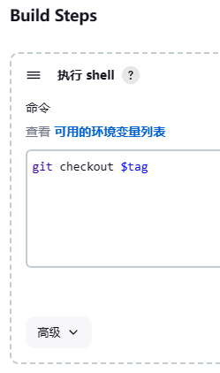

https://www.bilibili.com/video/BV1gB4y1p7Ny

# 一、介绍

## 1、DevOps


## 2、CI - CD

持续集成 - 持续交付


# 二、安装Jenkins

[Jenkins](https://www.jenkins.io/)

## 1、Docker安装

```bash
docker run -p 8080:8080 -p 50000:50000 --name jenkins \
-v /mydata/jenkins/:/var/jenkins_home/ \
-d jenkins/jenkins:2.414.1-lts
--restart=always
```

登录密码在启动日志里面可以找到。

## 2、其他安装

参考官网

[Jenkins download and deployment](https://www.jenkins.io/download/)


## 3、常用插件安装

Git Parameter

Publish Over SSH


## 4、配置Jenkins

### 4.1、配置jdk

系统管理 - 全局配置


### 4.2、配置Maven

系统管理 - 全局配置


### 4.3、远程服务器SSH

系统管理 - 系统配置


> 远程服务器的目录需要存在，不然连接的时候会报错。


# 三、基本操作

## 1、CI操作

### 1.1、新建项目


### 1.2、源码管理

选择git


> 公开仓库不需要凭证，如果是私有的，需要添加凭证
>
> 添加完了，可以直接构建，构建完成后，源码会拉取到Jenkins目录的workspace


### 1.3、构建时操作

Build Steps -> 增加构建步骤 -> 调用顶层Maven目标


### 1.4、构建后操作

增加步骤 -> Send build artifacts over SSH


> 结果测试，在目标服务器没法直接运行jar包，比如 java -jar xx.jar
>
> 好像与环境变量有关系。


## 2、CD操作

### 2.1、参数化构建

General -> 参数化构建过程

添加git参数


> 也可以添加其他参数，供项目配置中使用


### 2.1、切换git版本

在maven构建前切换git版本

Build Steps -> 执行 shell



> 然后在git仓库添加标签，
>
> 再次构建的时候就可以使用标签选择版本了


# 四、集成SonarQube

[Download | SonarQube | Sonar (sonarsource.com)](https://www.sonarsource.com/products/sonarqube/downloads/)

## 1、SonarQube安装

使用docker-compose安装

```yaml
version: '3.1'
services:
  db:
    image: postgres
    container_name: db
    ports:
      - 5432:5432
    networks:
      - sonarnet
    environment:
      POSTGRES_USER: sonar
      POSTGRES_PASSWORD: sonar

  sonarqueb:
    image: sonarqube:9.9.2-community
    container_name: sonarqube
    depends_on:
      - db
    ports:
      - 9000:9000
    networks:
      - sonarnet
    environment:
      SONAR_JDBC_URL: jdbc:postgresql://db:5432/sonar
      SONAR_JDBC_USERNAME: sonar
      SONAR_JDBC_PASSWORD: sonar

networks:
  sonarnet:
    driver: bridge

```

> 启动会报错，Linux需要修改一下配置
>
> vi /etc/sysctl.conf
>
> 在最后一行添加：
>
> vm.max_map_count=262144
>
> 然后让配置生效：
>
> sysctl -p

默认用户名/密码都是admin


## 2、SonarQube基本使用

### 2.1、maven方式

①在maven的 settings.xml 中进行配置


②然后在项目根目录执行下面命令

mvn sonar:sonar


### 2.2、使用sonar-scanner

下载：[SonarSource Downloads-CDN](https://binaries.sonarsource.com/?prefix=Distribution/sonar-scanner-cli/)

①下载到Linux，并解压

②配置conf/sonar-scanner.properties

```properties
#----- Default SonarQube server
sonar.host.url=http://192.168.1.13:9000

#----- Default source code encoding
sonar.sourceEncoding=UTF-8
```

③执行命令

```bash
sonar-scanner/bin/sonar-scanner \
-Dsoanr.sources=./ \
-Dsonar.projectname=chao-test \
-Dsonar.login=e7bb3dc90f46a060434bde58bb059af49e5c7c82 \
-Dsonar.projectKey=chao-test \
-Dsonar.java.binaries=./target/
```


## 3、Jenkins整合

### 3.1、安装插件

在 Jenkins 中安装 SonarQube Scanner 插件


### 3.2、配置SonarQube servers

在 系统管理 - 系统配置


> 添加凭证的的时候如果使用token，类型选择Secret text
>
> 然后从SonarQube获取token


### 3.3、配置sonar-scanner路径

系统管理 - 全局配置


### 3.4、项目配置

在构建步骤中，maven打包完成后，添加一个步骤 Execute SonarQube Scanner


> 然后使用其他其他方式扫描过项目，项目下可能会有一个.scannarwork目录
>
> 需要删除，不然扫描可能会报权限错误


# 五、推送镜像到仓库

## 1、容器内部使用Docker

在Jenkins容器内部使用Docker【使用宿主机的docker】

> 每次重启都需要设置，因为每次重启后，组和权限都会恢复为默认值

①修改 /run 下的docker.sock组置为root
chown root:root docker.sock

②然后赋予docker.sock读写权限
chmod o+rw docker.sock

③如何把Docker的相关文件映射到Jenkins的容器内部

```bash
docker run -p 8080:8080 -p 50000:50000 --name jenkins \
-v /mydata/jenkins/:/var/jenkins_home/ \
-v /var/run/docker.sock:/var/run/docker.sock \
-v /usr/bin/docker:/usr/bin/docker \
-v /etc/docker/daemon.json:/etc/docker/daemon.json \
-d jenkins/jenkins:2.414.1-lts
```


## 2、制作镜像并推送

在项目配置中，项目构建中，在代码扫描完成再添加一个步骤 执行 shell

```shell
mv target/*.jar docker/
docker build -t registry.cn-qingdao.aliyuncs.com/renchao_student/mytest:$tag docker/
docker login -u 542607047@qq.com -p **** registry.cn-qingdao.aliyuncs.com
docker push registry.cn-qingdao.aliyuncs.com/renchao_student/mytest:$tag
```


# 六、目标服务器拉取

## 1、目标服务器脚本

```bash

url=$1
repo=$2
project=$3
version=$4
port=$5
imageName=$url/$repo/$project:$version
echo $imageName

containerId=`docker ps -a | grep ${project} | awk '{print $1}'`
echo $containerId

if [ "$containerId" != "" ] ; then
  docker stop $containerId
  docker rm $containerId
fi

tag=`docker images | grep ${project} | awk '{print $2}'`
echo $tag

if [[ "$tag" =~ "$version" ]] ; then
  docker rmi $imageName
fi

docker login -u 542607047@qq.com -p chao199005 registry.cn-qingdao.aliyuncs.com
docker run -d -p $port:$port --name $project $imageName

echo "SUCCESS"
```


## 2、目标服务器执行脚本

在项目配置中，构建后操作 添加步骤 **Send build artifacts over SSH**


# 七、流水线pipeline

## 1、新建pipeline

在项目根目录新建Jenkinsfile文件，里面编写流水线代码

流水线定义选择：Pipeline script from SCM

然后通过GIT拉取Jenkinsfile文件


## 2、流水线语法

可以通过流水线语法工具自动生成每个任务的脚本

其中拉取代码使用：checkout: Check out from version control

maven构建、SonarQube、Docker制作、镜像推送等使用的都是：sh:Shell Script

执行目标服务器脚本使用的：sshPublisher: Send build artifacts over SSH


## 3、Jenkinsfile文件

```json
pipeline {
	// 指定任务在哪个集群节点中执行
    agent any

	// 声明全局变量，方便后面使用
	environment {
		aliUser = '542607047@qq.com'
		aliPwd = 'chao199005'
		aliNamespace = 'renchao_student'
	}

    stages {
        stage('拉取git仓库代码') {
            steps {
                checkout scmGit(branches: [[name: '${tag}']], extensions: [], userRemoteConfigs: [[credentialsId: '379e9954-53b2-4f21-8bdf-8ea16ad681b9', url: 'https://gitee.com/renchao05/jenkins-demo.git']])
            }
        }

        stage('通过maven构建项目') {
            steps {
                sh '/var/jenkins_home/tools/apache-maven-3.9.4/bin/mvn clean package -DskipTests'
            }
        }

        stage('通过SonarQube做代码质量检测') {
            steps {
                sh '''/var/jenkins_home/tools/sonar-scanner/bin/sonar-scanner \\
                -Dsoanr.sources=./ \\
                -Dsonar.projectname=${JOB_NAME} \\
                -Dsonar.login=e7bb3dc90f46a060434bde58bb059af49e5c7c82 \\
                -Dsonar.projectKey=${JOB_NAME} \\
                -Dsonar.java.binaries=./target/'''
            }
        }

        stage('通过Docker制作自定义镜像') {
            steps {
                sh '''mv target/*.jar docker/
                docker build -t registry.cn-qingdao.aliyuncs.com/renchao_student/${JOB_NAME}:$tag docker/
                docker image prune -f'''
            }
        }

        stage('将自定义镜像推送到Harbor') {
            steps {
                sh '''docker login -u ${aliUser} -p ${aliPwd} registry.cn-qingdao.aliyuncs.com
                docker push registry.cn-qingdao.aliyuncs.com/${aliNamespace}/${JOB_NAME}:$tag'''
            }
        }

        stage('通过Publish Over SSH通知目标服务器') {
            steps {
                sshPublisher(publishers: [sshPublisherDesc(configName: 'test', transfers: [sshTransfer(cleanRemote: false, excludes: '', execCommand: "/root/deploy.sh registry.cn-qingdao.aliyuncs.com renchao_student $JOB_NAME $tag $port", execTimeout: 120000, flatten: false, makeEmptyDirs: false, noDefaultExcludes: false, patternSeparator: '[, ]+', remoteDirectory: '', remoteDirectorySDF: false, removePrefix: '', sourceFiles: '')], usePromotionTimestamp: false, useWorkspaceInPromotion: false, verbose: false)])
            }
        }

    }
}


```


# 八、脚本

Jenkins 提供了 **脚本控制台**（`Manage Jenkins → Script Console`）

```bash
# 删除构建记录
# 用 Groovy 删除，比如删除某个 Job 的第 15 次构建
Jenkins.instance.getItemByFullName("job-name").getBuildByNumber(15).delete()

# 删除某个 Job 的所有构建
Jenkins.instance.getItemByFullName("job-name").getBuilds().each { it.delete() }


# 其他用法
。。。。


```