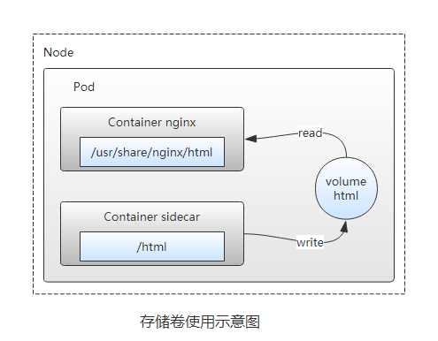

# 一、介绍
## 1、什么是Kubernetes
Kubernetes是容器集群管理系统，是一个开源的平台，可以实现容器集群的自动化部署、自动扩缩容、维护等功能。
使用Kubernetes可以：

- 自动化容器的部署和复制
- 随时扩展或收缩容器规模
- 将容器组织成组，并且提供容器间的负载均衡
- 很容易地升级应用程序容器的新版本
- 节省资源，优化硬件资源的使用
- 提供容器弹性，如果容器失效就替换它，等等...

### 1.1、Kubernetes特点

- 便携性：支持公有云、私有云、混合云、多重云(multi-cloud)
- 可扩展：模块化、插件化、可组合、可挂载
- 自修复：自动部署，自动重启，自动复制，自动伸缩扩展

### 1.2、Kubernetes特性

Kubernetes是一种用于在一组主机上运行和协同容器化应用程序的系统，旨在提供可预测性、可扩展性与高可用的性的方法来完全管理容器化应用程序和服务的生命周期的平台。
它具有以下几个重要的特性：

1. 自动装箱：构建于容器之上，基于资源依赖及其他约束自动完成容器部署且不影响其可用性，并通过调度机制混合关键型应用和非关键型应用的工作负载于同一节点以提升资源利用率。
2. 自我修复：支持容器故障后自动重启、节点故障候重行调度容器，以及其他可用节点、健康状态检查失败后关闭容器并重新创建等自我修复机制。
3. 水平扩展：支持通过简单命令或UI手动水平扩展，以及基于CPU等资源负载率的自动水平扩展机制。
4. 服务器发现和负载均衡：Kubernetes通过其附加组件之一的KubeDNS（或CoreDNS）为系统内置了服务发现功能，它会为每个Service配置DNS名称，并允许集群内的客户端直接使用此名称发出访问请求，而Service则通过iptables或ipvs内建了负载均衡机制。
5. 自动发布和回滚：Kubernetes支持“灰度”更新应用程序或其配置信息，它会监控更新过程中应用程序的健康状态，以确保它不会在同一时刻杀掉所有的实例，而此过程中一旦有故障发生，就会立即自动执行回滚操作。
6. 秘钥和配置管理：Kubernetes允许存储和管理敏感信息，例如密码，Oauth令牌和ssh秘钥。可以部署和更新密码和应用程序配置，而无需重建容器，也不会再堆栈配置中暴露机密。
7. 存储编排：Kubernetes支持Pod对象按需自动挂载不同类型的存储系统，这包括节点本地存储、公有云服务商的云存储（如AWS和GCP等），以及网络存储系统（例如，NFS、ISCSI、GlusterFS、Ceph、Cinder和Flocker等）
8. 批量处理执行：除了服务型应用，Kubernetes还支持批处理作业及CI（持续集成），如果需要，一样可以实现容器故障后修复。

## 2、概述和术语
Kubernetes使用共享网络将多个物理机或虚拟机汇集到一个集群中，在各服务器之间进行通信，该集群是配置Kubernetes的所有组件、功能和工作负载的物理平台。集群中一台服务器（或高可用部署中的一组服务器）用作Master，负责管理整个集群，余下的其他机器用作Worker Node,它们是使用本地和外部资源接收和运行工作负载的服务器。集群中的这些主机可以是物理服务器，也可以是虚拟机（包括IaaS云端的VPS）


**Master**

Master是集群的网关和中枢，负责诸如为用户和客户端暴露API、跟踪其它服务器的健康状态、以最优方式调度工作负载，以及编排其他组件之间的通信等任务，它是用户或客户端与集群之间的核心联络点，并负责Kubernetes系统的大多数集中式管控逻辑。单个Master节点即可完成其所有的功能，但出于冗余及负载均衡等目的，生产环境中通常需要协同部署多个此类主机。Master节点类似于蜂群中的蜂王。

**Node**

Node是Kubernetes集群的工作节点，负责接收来自Master的工作指令并根据指令相应的创建或删除Pod对象，以及调整网络规则以合理地路由和转发流量等。理论上讲，Node可以是任何形式的计算设备，不过Master会统一将其抽象为Node对象进行管理。Node类似于蜂群中的工蜂，生产环境中，它们通常数量众多。
Kubernetes将所有Node的资源集结于一处形成一台更强大的“服务器”，如下图，在用户将应用部署于其上时，Master会使用调度算法将其自动指派某个特定的Node运行，在Node加入集群或从集群中移除时，Master也会按需重行编排影响到的Pod（容器）。于是，用户无需关心其应用究竟运行于何处。


从抽象的角度来讲，Kubernetes还有着众多的组件来支撑其内部的业务逻辑，包括运行应用、应用编排、服务暴露、应用恢复等，它们在Kubernetes中被抽象为Pod、Service、Controller等资源类型。

**2.1 常用的资源对象**

[十分钟带你理解Kubernetes核心概念](http://www.dockone.io/article/932)

（1）Pod

Kubernetes并不直接运行容器，而是使用一个抽象的资源对象来封装一个或者多个容器，这个抽象即为Pod，它是Kubernetes的最小调度单元。同一Pod中的容器共享网络名称空间和存储资源，这些容器可经由本地回环接口lo直接通信，但彼此之间又在Mount、User及PID等名称空间上保持了隔离。尽管Pod中可以包含多个容器，但是作为最小调度单元，它应该尽可能地保持“小”，即通常只应该包含一个主容器，以及必要的辅助型容器（sidecar）


（2）资源标签

标签（Label）是将资源进行分类的标识符，资源标签其实就是一个键值型（key/values）数据。标签旨在指定对象（如Pod等）辨识性的属性，这些属性仅对用户存在特定的意义，对Kubernetes集群来说并不直接表达核心系统语意。标签可以在对象创建时附加其上，并能够在创建后的任意时间进行添加和修改。一个对象可以拥有多个标签，一个标签也可以附加于多个对象（通常是同一类对象）之上。


（3）标签选择器

标签选择器（Selector）全称为”Label Selector“，它是一种根据Label来过滤符合条件的资源对象的机制。例如，将附有标签”role：backend“的所有Pod对象挑选出来归为一组就是标签选择器的一种应用，如下图所示，通常使用标签对资源对象进行分类，而后使用标签选择器挑选出它们，例如将其创建未某Service的端点。


（4）Pod控制器

尽管Pod是kubernetes的最小调度单元，但用户通常并不会直接部署及管理Pod对象，而是要借助于另一类抽象——控制器（Controller）对其进行管理。用于工作负载的控制器是一种管理Pod生命周期的资源抽象，它们是kubernetes上的一类对象，而非单个资源对象，包括ReplicationController，ReplicaSet、Deployment、StatefulSet、Job等。已下图所示的Deployment控制器为例，它负责确保指定的Pod对象的副本数量精确符合定义，否则“多退少补”。使用控制器之后就不再需要手动管理Pod对象了，只需要声明应用的期望状态，控制器就会自动对其进行进程管理。


（5）服务资源（Service）

Service是建立在一组Pod对象之上的资源抽象，它通过标签选择器选定一组Pod对象，并为这组Pod对象定义一个统一的固定访问入口（通常是一个IP地址），若Kubernetes集群存在DNS附件，它就会在Service创建时为其自动配置一个DNS名称以便客户端进行服务发现。到达Service IP的请求将被负载均衡至其后的端点——各个Pod对象之上，因此Service从本质上来讲是一个四层代理服务。另外，service还可以将集群外部流量引入到集群中来。

（6）存储卷

存储卷（Volume）是独立于容器文件系统之外的存储空间，常用于扩展容器的存储空间并为它提供持久存储能力。Kubernetes集群上的存储卷大体可以分为临时卷、本地卷和网络卷。临时卷和本地卷都位于Node本地，一旦Pod被调度至其他Node，此种类型的存储卷将无法访问到，因此临时卷和本地卷通常用于数据缓存，持久化的数据则需要放置于持久卷（persistent volume）之上。

（7）Name和Namespace

名称（Name）是Kubernetes集群中资源对象的标识符，它们的作用域通常是名称空间（Namespace），因此名称空间是名称的额外的限定机制。在同一名称空间中，同一类型资源对象的名称必须具有唯一性。名称空间通常用于实现租户或项目的资源隔离，从而形成逻辑分组，如下图所示，创建的Pod和Service等资源对象都属于名称空间级别，未指定时，他们都属于默认的名称空间“default”。


（8）Annotation

Annotation（注释）是另一种附加在对象之上的键值类型的数据，但它拥有更大的数据容量。Annotation常用于将各种非标识型元数据（metadata）附加到对象上，但它不能用于标识和选择对象，通常也不会被Kubernetes直接使用，其主要目的是方便工具或用户的阅读和查找等。

（9）Ingress

Kubernetes将Pod对象和外部网络环境进行了隔离，Pod和Service等对象间的通信都使用其内部专用地址进行，如若需要开放某些Pod对象提供给外部用户访问，则需要为其请求流量打开一个通往Kubernetes集群内部的通道，除了Service之外，Ingress也是这类通道的实现方式之一。

## 
3、Kubernetes集群组件


**3.1 Master组件**

Kubernetes的集群控制平面由多个组件组成，这些组件可统一运行于单一Master节点，也可以以多副本的方式同时运行于多个节点，以为Master提供高可用功能，甚至还可以运行于Kubernetes集群自身之上。Master主要包括以下几个组件。

（1）API Server

Api Server负责输出RESTful风格的Kubernetes API，它是发往集群的所有REST操作命令的接入点，并负责接收、校验并响应所有的REST请求，结果状态被持久存储于etcd中。因此，API Server是整个集群的网关。

（2）ETCD

Kubernetes集群的所有状态信息都需要持久存储于存储系统etcd中，不过，etcd是由CoreOS基于Raft协议开发的分布式键值存储，可用于服务发现、共享配置以及一致性保障（例如数据库主节点选择、分布式锁等）。因此，etcd是独立的服务组件，并不隶属于Kubernetes集群自身。生产环境中应该以etcd集群的方式运行以确保其服务可用性。
etcd不仅能够提供键值数据存储，而且还为其提供了监听（watch）机制，用于监听和推送变更。Kubernetes集群系统中，etcd中的键值发生变化时会通知到API Server，并由其通过watch API向客户端输出。基于watch机制，Kubernetes集群的各组件实现了高效协同。

（3）Controller Manager

Kubernetes中，集群级别的大多数功能都是由几个被称为控制器的进程执行实现的，这几个进程被集成与kube-controller-manager守护进程中。由控制器完成的功能主要包括生命周期功能和API业务逻辑，具体如下
●生命周期功能：包括Namespace创建和生命周期、Event垃圾回收、Pod终止相关的垃圾回收、级联垃圾回收及Node垃圾回收等。
●API业务逻辑：例如，由ReplicaSet执行的Pod扩展等。

（4）Scheduler

Kubernetes是用于部署和管理大规模容器应用的平台，根据集群规模的不同，其托管运行的容器很可能会数以千计甚至更多。API Server确认Pod对象的创建请求之后，便需要由Scheduler根据集群内各节点的可用资源状态，以及要运行的容器的资源需求做出调度决策，如下图所示。另外，Kubernetes还支持用户自定义调度器。


**3.2 Node组件**

Node负责提供运行容器的各种依赖环境，并接收Master的管理。每个Node主要由以下几个组件构成。

（1）kubelet

kubelet是运行于工作节点之上的守护进程，它从API Server接收关于Pod对象的配置信息并确保它们处于期望的状态（desired state，也可以说目标状态）kubelet会在API Server上注册当前工作节点，定期向Master汇报节点资源使用情况，并通过cAdvisor监控容器和节点的资源占用情况。

（2）kube-proxy

每个工作节点都需要运行一个kube-proxy守护进程，它能够按需为Service资源对象生成iptables或ipvs规则，从而捕获访问当前Service的ClusterIP的流量并将其转发至正确的后端Pod对象。

（3）docker

docker用于运行容器

**3.3 核心附件**

Kubernetes集群还依赖于一组称为"附件"(add-ons)的组件以提供完整的功能，它们通常是由第三方提供的特定应用程序，且托管运行于Kubernetes集群之上，如上图所示。

●KubeDNS 
在Kubernetes集群中调度运行提供DNS服务的Pod，同一集群中的其他pod可使用此DNS服务解决主机名。Kubernetes从1.11版本开始默认使用CoreDNS项目为集群提供服务注册和服务发现的动态名称解析服务，之前的版本中用到的是kube-dns项目，而SKyDNS则是更早一代的项目。
●Kubernetes Dashboard 
Kubernetes集群的全部功能都要基于Web的UI，来管理集群中应用甚至是集群自身。
●Heapster 
容器和节点的性能监控与分析系统，它收集并解析多种指标数据，如资源利用率、生命周期事件等。新版本的Kubernetes中，其功能会逐渐由Prometheus结合其他组件所取代。
●Ingress Controller 
Service是一种工作于传输层的负载均衡器，而Ingress是在应用层实现的HTTP(s)负载均衡机制。不过，Ingress资源自身不能进行“流量穿透”，它仅是一组路由规则的集合，这些规则需要通过Ingress控制器（Ingress Controller）发挥作用。目前，此类的可用项目有Nginx、Traefik、Envoy及HAProxy等。

# 二、kubeadm初始化集群
## 1、kubeadm介绍
`kubeadm`是`Kubernetes`项目自带的及集群构建工具，负责执行构建一个最小化的可用集群以及将其启动等的必要基本步骤，`kubeadm`是`Kubernetes`集群全生命周期的管理工具，可用于实现集群的部署、升级、降级及拆除。`kubeadm`部署`Kubernetes`集群是将大部分资源以`pod`的方式运行，例如（`kube-proxy`、`kube-controller-manager`、`kube-scheduler`、`kube-apiserver`、`flannel`)都是以`pod`方式运行。
`Kubeadm`仅关心如何初始化并启动集群，余下的其他操作，例如安装`Kubernetes Dashboard`、监控系统、日志系统等必要的附加组件则不在其考虑范围之内，需要管理员自行部署。
`Kubeadm`集成了`Kubeadm init`和`kubeadm join`等工具程序，其中`kubeadm init`用于集群的快速初始化，其核心功能是部署Master节点的各个组件，而`kubeadm join`则用于将节点快速加入到指定集群中，它们是创建`Kubernetes`集群最佳实践的“快速路径”。另外，`kubeadm token`可于集群构建后管理用于加入集群时使用的认证令牌（t`oken`)，而`kubeadm reset`命令的功能则是删除集群构建过程中生成的文件以重置回初始状态。
[kubeadm项目地址](https://github.com/kubernetes/kubeadm)
[kubeadm官方文档](https://kubernetes.io/docs/reference/setup-tools/kubeadm/)

## 2、部署Kubernetes集群
### 2.1、架构图


### 2.2、环境规划
| 操作系统         | IP           | CPU/Mem | 主机名     | 角色   |
| ---------------- | ------------ | ------- | ---------- | ------ |
| CentOS7.4-86_x64 | 192.168.1.31 | 2/2G    | k8s-master | Master |
| CentOS7.4-86_x64 | 192.168.1.32 | 2/2G    | k8s-node1  | Node   |
| CentOS7.4-86_x64 | 192.168.1.33 | 2/2G    | k8s-node2  | Node   |

| name    | version |
| ------- | ------- |
| Docker  | 18.09.7 |
| kubeadm | 1.15.2  |
| kubelet | 1.15.2  |
| kubectl | 1.15.2  |


**说明：下面初始化环境工作master节点和node节点都需要执行**
1）关闭防火墙
```shell
# systemctl stop firewalld
# systemctl disable firewalld
```

**2）关闭**`**selinux**`
```shell
# sed -i 's/enforcing/disabled/' /etc/selinux/config
# setenforce 0
```

**3）如需要关闭**`**swap**`**，（由于服务器本来配置就低，这里就不关闭swap，在后面部署过程中忽略swap报错即可）**

```shell
# swapoff -a  #临时
# vim /etc/fstab    #永久
```

**4）时间同步**

```shell
# ntpdate 0.rhel.pool.ntp.org
```

**5）**`**host**`**绑定**

```shell
# vim /etc/hosts
192.168.1.31	k8s-master
192.168.1.32	k8s-node1
192.168.1.33	k8s-node2
```

### 2.3、安装docker
**master节点和所有node节点都需要执行**
**1）配置**`**docker**`**的**`**yum**`**仓库（这里使用阿里云仓库）**
```shell
# yum -y install yum-utils device-mapper-persistent-data lvm2
# yum-config-manager --add-repo https://mirrors.aliyun.com/docker-ce/linux/centos/docker-ce.repo
```

**2）安装**`**docker**`

```shell
# yum -y install docker-ce-18.09.7 docker-ce-cli-18.09.7 containerd.io
```

**3）修改docker cgroup driver为systemd**
> **根据文档**[**CRI installation**](https://kubernetes.io/docs/setup/cri/)**中的内容，对于使用systemd作为init system的Linux的发行版，使用systemd作为docker的cgroup driver可以确保服务器节点在资源紧张的情况更加稳定，因此这里修改各个节点上docker的cgroup driver为systemd。**

```shell
# mkdir /etc/docker    #没启动docker之前没有该目录
# vim /etc/docker/daemon.json    #如果不存在则创建
{
  "exec-opts": ["native.cgroupdriver=systemd"]
}
```

**4）启动**`**docker**`
```shell
# systemctl restart docker    #启动docker
# systemctl enable docker    #开机自启动

# docker info |grep Cgroup
Cgroup Driver: systemd
```

### 2.4、安装kubeadm
**master节点和所有node节点都需要执行**
**1）配置**`**kubenetes**`**的**`**yum**`**仓库（这里使用阿里云仓库）**
```shell
# cat <<EOF > /etc/yum.repos.d/kubernetes.repo
[kubernetes]
name=Kubernetes
baseurl=https://mirrors.aliyun.com/kubernetes/yum/repos/kubernetes-el7-x86_64/
enabled=1
gpgcheck=1
repo_gpgcheck=1
gpgkey=https://mirrors.aliyun.com/kubernetes/yum/doc/yum-key.gpg
        https://mirrors.aliyun.com/kubernetes/yum/doc/rpm-package-key.gpg
EOF

# yum makecache
```

2）安装`kubelat`、`kubectl`、`kubeadm`
```shell
# yum -y install kubelet-1.15.2 kubeadm-1.15.2 kubectl-1.15.2

# rpm -aq kubelet kubectl kubeadm
kubectl-1.15.2-0.x86_64
kubelet-1.15.2-0.x86_64
kubeadm-1.15.2-0.x86_64
```

3）将`kubelet`加入开机启动，这里刚安装完成不能直接启动。（因为目前还没有集群还没有建立）
```shell
# systemctl enable kubelet
```

### 2.5、初始化Master
**注意：在master节点执行**
> 通过`kubeadm --help`帮助手册可以看到可以通过`kubeadm init`初始化一个`master`节点，然后再通过`kubeadm join`将一个`node`节点加入到集群中。


```shell
[root@k8s-master ~]# kubeadm --help
Usage:
  kubeadm [command]

Available Commands:
  alpha       Kubeadm experimental sub-commands
  completion  Output shell completion code for the specified shell (bash or zsh)
  config      Manage configuration for a kubeadm cluster persisted in a ConfigMap in the cluster
  help        Help about any command
  init        Run this command in order to set up the Kubernetes control plane
  join        Run this on any machine you wish to join an existing cluster
  reset       Run this to revert any changes made to this host by 'kubeadm init' or 'kubeadm join'
  token       Manage bootstrap tokens
  upgrade     Upgrade your cluster smoothly to a newer version with this command
  version     Print the version of kubeadm

Flags:
  -h, --help                     help for kubeadm
      --log-file string          If non-empty, use this log file
      --log-file-max-size uint   Defines the maximum size a log file can grow to. Unit is megabytes. If the value is 0, the maximum file size is unlimited. (default 1800)
      --rootfs string            [EXPERIMENTAL] The path to the 'real' host root filesystem.
      --skip-headers             If true, avoid header prefixes in the log messages
      --skip-log-headers         If true, avoid headers when opening log files
  -v, --v Level                  number for the log level verbosity

Use "kubeadm [command] --help" for more information about a command.
```

1）配置忽略swap报错
```shell
[root@k8s-master ~]# vim /etc/sysconfig/kubelet
KUBELET_EXTRA_ARGS="--fail-swap-on=false"
```

2）初始化master
```
--kubernetes-version    #指定Kubernetes版本
--image-repository   #由于kubeadm默认是从官网k8s.grc.io下载所需镜像，国内无法访问，所以这里通过--image-repository指定为阿里云镜像仓库地址
--pod-network-cidr    #指定pod网络段
--service-cidr    #指定service网络段
--ignore-preflight-errors=Swap    #忽略swap报错信息
```

```shell
[root@k8s-master ~]# kubeadm init --kubernetes-version=v1.15.2 --image-repository registry.aliyuncs.com/google_containers --pod-network-cidr=10.244.0.0/16 --service-cidr=10.96.0.0/12 --ignore-preflight-errors=Swap

......
Your Kubernetes control-plane has initialized successfully!

To start using your cluster, you need to run the following as a regular user:

  mkdir -p $HOME/.kube
  sudo cp -i /etc/kubernetes/admin.conf $HOME/.kube/config
  sudo chown $(id -u):$(id -g) $HOME/.kube/config

You should now deploy a pod network to the cluster.
Run "kubectl apply -f [podnetwork].yaml" with one of the options listed at:
  https://kubernetes.io/docs/concepts/cluster-administration/addons/

Then you can join any number of worker nodes by running the following on each as root:

kubeadm join 192.168.1.31:6443 --token a4pjca.ubxvfcsry1je626j \
    --discovery-token-ca-cert-hash sha256:784922b9100d1ecbba01800e7493f4cba7ae5c414df68234c5da7bca4ef0c581
```

3）按照上面初始化成功提示创建配置文件
```shell
[root@k8s-master ~]# mkdir -p $HOME/.kube
[root@k8s-master ~]# cp -i /etc/kubernetes/admin.conf $HOME/.kube/config
[root@k8s-master ~]# chown $(id -u):$(id -g) $HOME/.kube/config
```

```shell
[root@k8s-master ~]# docker image ls   #初始化完成后可以看到所需镜像也拉取下来了
REPOSITORY                                                        TAG                 IMAGE ID            CREATED             SIZE
registry.aliyuncs.com/google_containers/kube-scheduler            v1.15.2             88fa9cb27bd2        2 weeks ago         81.1MB
registry.aliyuncs.com/google_containers/kube-proxy                v1.15.2             167bbf6c9338        2 weeks ago         82.4MB
registry.aliyuncs.com/google_containers/kube-apiserver            v1.15.2             34a53be6c9a7        2 weeks ago         207MB
registry.aliyuncs.com/google_containers/kube-controller-manager   v1.15.2             9f5df470155d        2 weeks ago         159MB
registry.aliyuncs.com/google_containers/coredns                   1.3.1               eb516548c180        7 months ago        40.3MB
registry.aliyuncs.com/google_containers/etcd                      3.3.10              2c4adeb21b4f        8 months ago        258MB
registry.aliyuncs.com/google_containers/pause                     3.1                 da86e6ba6ca1        20 months ago       742kB
```

4）添加flannel网络组件 [flannel项目地址](https://github.com/coreos/flannel)
```shell
方法一
[root@k8s-master ~]# kubectl apply -f https://raw.githubusercontent.com/coreos/flannel/master/Documentation/kube-flannel.yml
[root@k8s-master ~]# kubectl get pods -n kube-system |grep flannel    #验证flannel网络插件是否部署成功（Running即为成功）

# 由于flannel默认是从国外拉取镜像，所以经常拉取不到，故使用下面方法二进行安装

方法二
[root@k8s-master ~]# wget https://raw.githubusercontent.com/coreos/flannel/master/Documentation/kube-flannel.yml
[root@k8s-master ~]# sed -i 's#quay.io#quay-mirror.qiniu.com#g' kube-flannel.yml    #替换仓库地址
[root@k8s-master ~]# kubectl apply -f kube-flannel.yml
```

### 2.6、加入Node节点
> 向集群中添加新节点，执行在kubeadm init 输出的kubeadm join命令，再在后面同样添加忽略swap报错参数。


1）配置忽略swap报错
```shell
[root@k8s-node1 ~]# vim /etc/sysconfig/kubelet
KUBELET_EXTRA_ARGS="--fail-swap-on=false"

[root@k8s-node2 ~]# vim /etc/sysconfig/kubelet
KUBELET_EXTRA_ARGS="--fail-swap-on=false"
```

2）加入node1节点
```shell
[root@k8s-node1 ~]# kubeadm join 192.168.1.31:6443 --token a4pjca.ubxvfcsry1je626j --discovery-token-ca-cert-hash sha256:784922b9100d1ecbba01800e7493f4cba7ae5c414df68234c5da7bca4ef0c581 --ignore-preflight-errors=Swap
[preflight] Running pre-flight checks
	[WARNING Swap]: running with swap on is not supported. Please disable swap
[preflight] Reading configuration from the cluster...
[preflight] FYI: You can look at this config file with 'kubectl -n kube-system get cm kubeadm-config -oyaml'
[kubelet-start] Downloading configuration for the kubelet from the "kubelet-config-1.15" ConfigMap in the kube-system namespace
[kubelet-start] Writing kubelet configuration to file "/var/lib/kubelet/config.yaml"
[kubelet-start] Writing kubelet environment file with flags to file "/var/lib/kubelet/kubeadm-flags.env"
[kubelet-start] Activating the kubelet service
[kubelet-start] Waiting for the kubelet to perform the TLS Bootstrap...

This node has joined the cluster:
* Certificate signing request was sent to apiserver and a response was received.
* The Kubelet was informed of the new secure connection details.

Run 'kubectl get nodes' on the control-plane to see this node join the cluster.
```

3）加入node2节点
```shell
[root@k8s-node2 ~]# kubeadm join 192.168.1.31:6443 --token a4pjca.ubxvfcsry1je626j --discovery-token-ca-cert-hash sha256:784922b9100d1ecbba01800e7493f4cba7ae5c414df68234c5da7bca4ef0c581 --ignore-preflight-errors=Swap
[preflight] Running pre-flight checks
	[WARNING Swap]: running with swap on is not supported. Please disable swap
[preflight] Reading configuration from the cluster...
[preflight] FYI: You can look at this config file with 'kubectl -n kube-system get cm kubeadm-config -oyaml'
[kubelet-start] Downloading configuration for the kubelet from the "kubelet-config-1.15" ConfigMap in the kube-system namespace
[kubelet-start] Writing kubelet configuration to file "/var/lib/kubelet/config.yaml"
[kubelet-start] Writing kubelet environment file with flags to file "/var/lib/kubelet/kubeadm-flags.env"
[kubelet-start] Activating the kubelet service
[kubelet-start] Waiting for the kubelet to perform the TLS Bootstrap...

This node has joined the cluster:
* Certificate signing request was sent to apiserver and a response was received.
* The Kubelet was informed of the new secure connection details.

Run 'kubectl get nodes' on the control-plane to see this node join the cluster.
```

### 2.7、检查集群状态
1）在master节点输入命令检查集群状态，返回如下结果则集群状态正常
```shell
[root@k8s-master ~]# kubectl get nodes
NAME         STATUS     ROLES    AGE     VERSION
k8s-master   Ready      master   9m40s   v1.15.2
k8s-node1    NotReady   <none>   28s     v1.15.2
k8s-node2    NotReady   <none>   13s     v1.15.2
```

重点查看STATUS内容为Ready时，则说明集群状态正常。

2）查看集群客户端和服务端程序版本信息
```shell
[root@k8s-master ~]# kubectl version --short=true
Client Version: v1.15.2
Server Version: v1.15.2
```

3）查看集群信息
```shell
[root@k8s-master ~]# kubectl cluster-info
Kubernetes master is running at https://192.168.1.31:6443
KubeDNS is running at https://192.168.1.31:6443/api/v1/namespaces/kube-system/services/kube-dns:dns/proxy

To further debug and diagnose cluster problems, use 'kubectl cluster-info dump'.
```

4）查看每个节点下载的镜像
```shell
master节点：
[root@k8s-master ~]# docker images
REPOSITORY                                                        TAG                 IMAGE ID            CREATED             SIZE
registry.aliyuncs.com/google_containers/kube-apiserver            v1.15.2             34a53be6c9a7        2 weeks ago         207MB
registry.aliyuncs.com/google_containers/kube-controller-manager   v1.15.2             9f5df470155d        2 weeks ago         159MB
registry.aliyuncs.com/google_containers/kube-scheduler            v1.15.2             88fa9cb27bd2        2 weeks ago         81.1MB
registry.aliyuncs.com/google_containers/kube-proxy                v1.15.2             167bbf6c9338        2 weeks ago         82.4MB
quay-mirror.qiniu.com/coreos/flannel                              v0.11.0-amd64       ff281650a721        6 months ago        52.6MB
registry.aliyuncs.com/google_containers/coredns                   1.3.1               eb516548c180        7 months ago        40.3MB
registry.aliyuncs.com/google_containers/etcd                      3.3.10              2c4adeb21b4f        8 months ago        258MB
registry.aliyuncs.com/google_containers/pause                     3.1                 da86e6ba6ca1        20 months ago       742kB

node1节点
[root@k8s-node1 ~]# docker images
REPOSITORY                                           TAG                 IMAGE ID            CREATED             SIZE
registry.aliyuncs.com/google_containers/kube-proxy   v1.15.2             167bbf6c9338        2 weeks ago         82.4MB
quay-mirror.qiniu.com/coreos/flannel                 v0.11.0-amd64       ff281650a721        6 months ago        52.6MB
registry.aliyuncs.com/google_containers/coredns      1.3.1               eb516548c180        7 months ago        40.3MB
registry.aliyuncs.com/google_containers/pause        3.1                 da86e6ba6ca1        20 months ago       742kB

node2
[root@k8s-node2 ~]# docker images
REPOSITORY                                           TAG                 IMAGE ID            CREATED             SIZE
registry.aliyuncs.com/google_containers/kube-proxy   v1.15.2             167bbf6c9338        2 weeks ago         82.4MB
quay-mirror.qiniu.com/coreos/flannel                 v0.11.0-amd64       ff281650a721        6 months ago        52.6MB
registry.aliyuncs.com/google_containers/pause        3.1                 da86e6ba6ca1        20 months ago       742kB
```

### 2.8、删除节点
有时节点出现故障，需要删除节点，方法如下
1）在master节点上执行
```shell
# kubectl drain <NODE-NAME> --delete-local-data --force --ignore-daemonsets
# kubectl delete node <NODE-NAME>
```

2）在需要移除的节点上执行
```shell
# kubeadm reset
```

# 三、Kubernetes快速入门
## 1、核心对象
API Server提供了RESTful风格的编程接口，其管理的资源是Kubernetes API中的端点，用于存储某种API对象的集合，例如，内置Pod资源是包含了所有Pod对象的集合。资源对象是用于表现集群状态的实体，常用于描述应于哪个节点进行容器化应用、需要为其配置什么资源以及应用程序的管理策略等，例如，重启、升级及容错机制。另外，一个对象也是一种“意向记录“——一旦创建，Kubernetes就需要一直确保对象始终存在。Pod、Deployment和Service等都是最常用的核心对象。
### 1.1、Pod资源对象
> `Pod`资源对象是一种集合了一到多个应用容器、存储资源、专用`IP`及支撑容器运行的其他选项的逻辑组件，如图所示。`Pod`代表着`Kubernetes`的部署单元及原子运行单元，即一个应用程序的单一运行实例，它通常由共享资源且关系紧密的一个或多个应用容器组成。
>
> `Kubernetes`的网络模型要求其各`Pod`对象的`IP`地址位于同一网络平面内（同一`IP`网段），各`Pod`之间可使用其`IP`地址直接进行通信，无论它们运行于集群内的哪个工作节点上，这些`Pod`对象都像运行于同一局域网中的多个主机。
>
> 不过，`Pod`对象中的各进程均运行于彼此隔离的容器中，并于容器间共享两种关键资源：**网络**和**存储卷**。
> - **网络**：每个`Pod`对象都会被分配一个集群内专用的`IP`地址，也称为`Pod IP`，同一`Pod`内部的所有容器共享`Pod`对象的`Network`和`UTS`名称空间，其中包括主机名、`IP`地址和端口等。因此，这些容器间的通信可以基于本地回环接口`lo`进行，而与`Pod`外的其他组件的通信则需要使用`Service`资源对象的`ClusterIP`及相应的端口完成。
> - **存储卷**：用户可以为`Pod`对象配置一组“存储卷”资源，这些资源可以共享给其内部的所有容器使用，从而完成容器间数据的共享。存储卷还可以确保在容器终止后重启，甚至是被删除后也能确保数据不会丢失，从而保证了生命周期内的`Pod`对象数据的持久化存储。


> 一个`Pod`对象代表某个应用程序的一个特定实例，如果需要扩展应用程序，则意味着为此应用程序同时创建多个`Pod`实例，每个实例均代表应用程序的一个运行的“副本”(`replica`)。这些副本化的`Pod`对象的创建和管理通常由另一组称为“控制器”(`Controller`)的对象实现，例如，`Deployment`控制器对象。
>
> 创建`Pod`时，还可以使用`Pod Preset`对象为`Pod`注入特定的信息，如`ConfigMap`、`Secret`、存储卷、挂载卷和环境变量等。有了`Pod Preset`对象，`Pod`模板的创建者就无须为每个模板显示提供所有信息，因此，也就无须事先了解需要配置的每个应用的细节即可完成模板定义。
>
> 基于期望的目标状态和各节点的资源可用性，`Master`会将`Pod`对象调度至某选定的工作节点运行，工作节点于指向的镜像仓库（`image register`）下载镜像，并于本地的容器运行时环境中启动容器。`Master`会将整个集群的状态保存于`etcd`中，并通过`API Server`共享给集群的各组件及客户端。


### 1.2、Controller
> `Kubernetes`集群的设计中，`Pod`是有生命周期的对象。通过手动创建或由`Controller`（控制器）直接创建的`Pod`对象会被“调度器”（`Scheduler`）调度至集群中的某工作节点运行，待到容器应用进程运行结束之后正常终止，随后就会被删除。另外，节点资源耗尽或故障也会导致`Pod`对象被回收。
>
> 但`Pod`对象本身并不具有“自愈”功能，若是因为工作节点甚至是调度器自身导致了运行失败，那么它将会被删除；同样，资源耗尽或节点故障导致的回收操作也会删除相关的`Pod`对象。在设计上，`Kubernetes`使用”控制器“实现对一次性的（用后即弃）`Pod`对象的管理操作，例如，要确保部署的应用程序的Pod副本数量严格反映用户期望的数目，以及基于`Pod`模板来创建`Pod`对象等，从而实现`Pod`对象的扩缩容、滚动更新和自愈能力等。例如，某节点发生故障时，相关的控制器会将此节点上运行的`Pod`对象重新调度到其他节点进行重建。
>
> 控制器本身也是一种资源类型，它有着多种实现，其中与工作负载相关的实现如`Replication Controller`、`Deployment`、`StatefulSet`、`DaemonSet`和`Jobs`等，也可统称它们为`Pod`控制器。
>
> `Pod`控制器的定义通常由期望的副本数量、`Pod`模板和标签选择器（`Label Selector`）组成。`Pod`控制器会根据标签选择器对`Pod`对象的标签进行匹配检查，所有满足选择条件的`Pod`对象都将受控于当前控制器并计入其副本总数，并确保此数目能够精确反映期望的副本数。


### 1.3、Service
> 尽管`Pod`对象可以拥有`IP`地址，但此地址无法确保在`Pod`对象重启或被重建后保持不变，这会为集群中的`Pod`应用间依赖关系的维护带来麻烦：前端`Pod`应用（依赖方）无法基于固定地址持续跟踪后端`Pod`应用（被依赖方）。于是，`Service`资源被用于在被访问的`Pod`对象中添加一个有这固定`IP`地址的中间层，客户端向此地址发起访问请求后由相关的`Service`资源调度并代理至后端的`Pod`对象。
>
> 换言之，`Service`是“微服务”的一种实现，事实上它是一种抽象：通过规则定义出由多个`Pod`对象组合而成的逻辑集合，并附带访问这组`Pod`对象的策略。`Service`对象挑选、关联`Pod`对象的方式同`Pod`控制器一样，都是要基于`Label Selector`进行定义，其示意图如下


> `Service IP`是一种虚拟`IP`，也称为`Cluster IP`，它专用于集群内通信，通常使用专用的地址段，如`“10.96.0.0/12”`网络，各`Service`对象的`IP`地址在此范围内由系统动态分配。
>
> 集群内的`Pod`对象可直接请求此类的`Cluster IP`，例如，图中来自`Pod client`的访问请求即可以`Service`的`Cluster IP`作为目标地址，但集群网络属于私有网络地址，它们仅在集群内部可达。将集群外部的访问流量引入集群内部的常用方法是通过节点网络进行，实现方法是通过工作节点的`IP`地址和某端口（`NodePort`）接入请求并将其代理至相应的`Service`对象的`Cluster IP`上的服务端口，而后由`Service`对象将请求代理至后端的`Pod`对象的`Pod IP`及应用程序监听的端口。因此，图中的`External Clients`这种来自集群外部的客户端无法直接请求此`Service`提供的服务，而是需要事先经由某一个工作节点（如`NodeY`）的`IP`地址进行，这类请求需要两次转发才能到达目标`Pod`对象，因此在通信效率上必然存在负面影响。
>
> 事实上，`NodePort`会部署于集群中的每一个节点，这就意味着，集群外部的客户端通过任何一个工作节点的`IP`地址来访问定义好的`NodePort`都可以到达相应的`Service`对象。此种场景下，如果存在集群外部的一个负载均衡器，即可将用户请求负载均衡至集群中的部分或者所有节点。这是一种称为`“LoadBalancer”`类型的`Service`，它通常是由`Cloud Provider`自动创建并提供的软件负载均衡器，不过，也可以是有管理员手工配置的诸如`F5`一类的硬件设备。
>
> 简单来说，`Service`主要有三种常用类型：第一种是仅用于集群内部通信的`ClusterIP`类型；第二种是接入集群外部请求的`NodePort`类型，它工作与每个节点的主机`IP`之上；第三种是`LoadBalancer`类型，它可以把外部请求负载均衡至多个`Node`的主机`IP`的`NodePort`之上。此三种类型中，每一种都以其前一种为基础才能实现，而且第三种类型中的`LoadBalancer`需要协同集群外部的组件才能实现，并且此外部组件并不接受`Kubernetes`的管理。


## 2、命令式容器应用编排
### 2.1、部署应用Pod
> 在`Kubernetes`集群上自主运行的`Pod`对象在非计划内终止后，其生命周期即告结束，用户需要再次手动创建类似的`Pod`对象才能确保其容器中的依然可得。对于`Pod`数量众多的场景，尤其是对微服务业务来说，用户必将疲于应付此类需求。`Kubernetes`的工作负载（`workload`）类型的控制器能够自动确保由其管控的`Pod`对象按用户期望的方式运行，因此，Pod的创建和管理大多会通过这种类型的控制器来进行，包括`Deployment`、`ReplicasSet`、`ReplicationController`等。


**1）创建Deployment控制器对象**
> `**kubectl run**`**命令可用于命令行直接创建**`**Deploymen**`**t控制器，并以 **`**--image**`**选项指定的镜像运行**`**Pod**`**中的容器，**`**--dry-run**`**选项可以用于命令的测试，但并不真正执行资源对象的创建过程。**

```shell
# 创建一个名字叫做nginx的deployment控制器，并指定pod镜像使用nginx:1.12版本，并暴露容器内的80端口，并指定副本数量为1个，并先通过--dry-run测试命令是否错误。
[root@k8s-master ~]# kubectl run nginx --image=nginx:1.12 --port=80 --replicas=1 --dry-run=true
[root@k8s-master ~]# kubectl run nginx --image=nginx:1.12 --port=80 --replicas=1
deployment.apps/nginx created

[root@k8s-master ~]# kubectl get pods    #查看所有pod对象
NAME                     READY   STATUS    RESTARTS   AGE
nginx-685cc95cd4-9z4f4   1/1     Running   0          89s


###参数说明：
--image      指定需要使用到的镜像。
--port       指定容器需要暴露的端口。
--replicas   指定目标控制器对象要自动创建Pod对象的副本数量。
```

**2）打印资源对象的相关信息**
> `**kubectl get**`** 命令可用来获取各种资源对象的相关信息，它既能显示对象类型特有格式的简要信息，也能按照指定格式为**`**YAML**`**或**`**JSON**`**的详细信息，或者使用**`**Go**`**模板自定义要显示的属性及信息等。**

```shell

[root@k8s-master ~]# kubectl get deployment    #查看所有deployment控制器对象
NAME    READY   UP-TO-DATE   AVAILABLE   AGE
nginx   1/1     1            1           66s

###字段说明：
NAME    资源对象名称
READY   期望由当前控制器管理的Pod对象副本数及当前已有的Pod对象副本数
UP-TO-DATE   更新到最新版本定义的Pod对象的副本数量，在控制器的滚动更新模式下，表示已经完成版本更新的Pod对象的副本数量
AVAILABLE    当前处于可用状态的Pod对象的副本数量，即可正常提供服务的副本数。
AGE    Pod的存在时长

说明：Deployment资源对象通过ReplicaSet控制器实例完成对Pod对象的控制，而非直接控制。另外，通过控制器创建的Pod对象都会被自动附加一个标签。格式为“run=<Controller_Name>”。
[root@k8s-master ~]# kubectl get deployment -o wide    #查看deployment控制器对象的详细信息
NAME    READY   UP-TO-DATE   AVAILABLE   AGE   CONTAINERS   IMAGES       SELECTOR
nginx   1/1     1            1           69m   nginx        nginx:1.12   run=nginx


[root@k8s-master ~]# kubectl get pods     #查看pod资源
NAME                     READY   STATUS    RESTARTS   AGE
nginx-685cc95cd4-9z4f4   1/1     Running   0          72m

[root@k8s-master ~]# kubectl get pods -o wide
NAME                     READY   STATUS    RESTARTS   AGE   IP            NODE        NOMINATED NODE   READINESS GATES
nginx-685cc95cd4-9z4f4   1/1     Running   0          73m   10.244.1.12   k8s-node1   <none>           <none>

###字段说明：
NAME       pode资源对象名称
READY      pod中容器进程初始化完成并能够正常提供服务时即为就绪状态，此字段用于记录处于就绪状态的容器数量
STATUS     pod的当前状态，其值有Pending、Running、Succeeded、Failed和Unknown等其中之一
RESTARTS   Pod重启的次数
IP         pod的IP地址，通常由网络插件自动分配
NODE       pod被分配的节点。
```

**3）访问Pod对象**
> **这里部署的是**`**pod**`**是运行的为**`**nginx**`**程序，所以我们可以访问是否**`**ok**`**，在**`**kubernetes**`**集群中的任意一个节点上都可以直接访问**`**Pod**`**的**`**IP**`**地址。**

```shell
[root@k8s-master ~]# kubectl get pods -o wide    #查看pod详细信息
NAME                     READY   STATUS    RESTARTS   AGE   IP            NODE        NOMINATED NODE   READINESS GATES
nginx-685cc95cd4-9z4f4   1/1     Running   0          88m   10.244.1.12   k8s-node1   <none>           <none>

[root@k8s-master ~]# curl 10.244.1.12    #kubernetes集群的master节点上访问

[root@k8s-node2 ~]# curl 10.244.1.12    #kubernetes集群的node节点上访问

```

**上面访问是基于一个**`**pod**`**的情况下，但是，当这个**`**pod**`**由于某种原因意外挂掉了，或者所在的节点挂掉了，那么**`**deployment**`**控制器会立即创建一个新的**`**pod**`**，这时候再去访问这个**`**IP**`**就访问不到了，而我们不可能每次去到节点上看到**`**IP**`**再进行访问。测试如下：**
```shell
[root@k8s-master ~]# kubectl get pods -o wide
NAME                     READY   STATUS    RESTARTS   AGE   IP            NODE        NOMINATED NODE   READINESS GATES
nginx-685cc95cd4-9z4f4   1/1     Running   0          99m   10.244.1.12   k8s-node1   <none>           <none>

[root@k8s-master ~]# kubectl delete pods nginx-685cc95cd4-9z4f4    #删除上面的pod
pod "nginx-685cc95cd4-9z4f4" deleted

[root@k8s-master ~]# kubectl get pods -o wide    #可以看出，当上面pod刚删除，接着deployment控制器又马上创建了一个新的pod，且这次分配在k8s-node2节点上了。
NAME                     READY   STATUS    RESTARTS   AGE   IP            NODE        NOMINATED NODE   READINESS GATES
nginx-685cc95cd4-z5z9p   1/1     Running   0          89s   10.244.2.14   k8s-node2   <none>           <none>


[root@k8s-master ~]# curl 10.244.1.12    #访问之前的pod，可以看到已经不能访问
curl: (7) Failed connect to 10.244.1.12:80; 没有到主机的路由
[root@k8s-master ~]# 
[root@k8s-master ~]# curl 10.244.2.14    #访问新的pod，可以正常访问

```

### 2.2、部署Service对象
> **简单来说，一个**`**Service**`**对象可视作通过其标签选择器过滤出的一组**`**Pod**`**对象，并能够为此组**`**Pod**`**对象监听的套接字提供端口代理及调度服务。就好比上面做的测试，如果没有**`**Service**`**，那么每次都得去访问**`**pod**`**对象自己的地址等。且那还只是创建了一个**`**pod**`**对象，如果是多个。那么该如何是好？故使用**`**Service**`**解决此问题。**


**1）创建Service对象(将Service端口代理至Pod端口示例)**
> `**"kubectl expose"**`**命令可用于创建**`**Service**`**对象以将应用程序“暴露”（**`**expose**`**）于网络中。**

```shell
#方法一
[root@k8s-master ~]# kubectl expose deployment nginx --name=nginx-svc --port=80 --target-port=80 --protocol=TCP    #为deployment的nginx创建service，取名叫nginx-svc，并通过service的80端口转发至容器的80端口上。
service/nginx-svc exposed
#方法二
[root@k8s-master ~]# kubectl expose deployment/nginx --name=nginx-svc --port=80 --target-port=80 --protocol=TCP
service/nginx-svc exposed

###参数说明：
--name    指定service对象的名称
--port    指定service对象的端口
--target-port    指定pod对象容器的端口
--protocol    指定协议

[root@k8s-master ~]# kubectl get svc     #查看service对象。或者kubectl get service
NAME         TYPE        CLUSTER-IP      EXTERNAL-IP   PORT(S)   AGE
kubernetes   ClusterIP   10.96.0.1       <none>        443/TCP   25h
nginx-svc    ClusterIP   10.109.54.136   <none>        80/TCP    41s
```

**这时候可以在**`**kubernetes**`**集群上所有节点上直接访问**`**nginx-svc**`**的**`**cluster-ip**`**及可访问到名为**`**deployment**`**控制器下**`**nginx**`**的**`**pod**`**。并且，集群中的别的新建的**`**pod**`**都可以直接访问这个**`**IP**`**或者这个**`**service**`**名称即可访问到名为**`**deployment**`**控制器下**`**nginx**`**的**`**pod**`**。示例：**
```shell
# master节点上通过ServiceIP进行访问
[root@k8s-master ~]# curl 10.109.54.136 


#新建一个客户端pod进行访问，这里这个客户端使用busybox镜像，且pod副本数量为1个，-it表示进入终端模式。--restart=Never，表示从不重启。
[root@k8s-master ~]# kubectl run client --image=busybox --replicas=1 -it --restart=Never
If you don't see a command prompt, try pressing enter.
/ # wget -O - -q 10.109.54.136    #访问上面创建的（service）nginx-svc的IP
......
/ # 
/ # wget -O - -q nginx-svc    #访问上面创建的（service）名称nginx-svc

```

**2）创建Service对象(将创建的Pod对象使用“NodePort”类型的服务暴露到集群外部)**
```shell
[root@k8s-master ~]# kubectl run mynginx --image=nginx:1.12 --port=80 --replicas=2    #创建一个deployments控制器并使用nginx镜像作为容器运行的应用。
[root@k8s-master ~]# kubectl get pods    #查看创建的pod
NAME                     READY   STATUS    RESTARTS   AGE
client                   1/1     Running   0          15h
mynginx-68676f64-28fm7   1/1     Running   0          24s
mynginx-68676f64-9q8dj   1/1     Running   0          24s
nginx-685cc95cd4-z5z9p   1/1     Running   0          16h
[root@k8s-master ~]# 
[root@k8s-master ~]# kubectl expose deployments/mynginx --type="NodePort" --port=80 --name=mynginx-svc    #创建一个service对象，并将mynginx创建的pod对象使用NodePort类型暴露到集群外部。
service/mynginx-svc exposed
[root@k8s-master ~]# 
[root@k8s-master ~]# kubectl get svc    #查看service
NAME          TYPE        CLUSTER-IP      EXTERNAL-IP   PORT(S)        AGE
kubernetes    ClusterIP   10.96.0.1       <none>        443/TCP        41h
mynginx-svc   NodePort    10.111.89.58    <none>        80:30884/TCP   10s
nginx-svc     ClusterIP   10.109.54.136   <none>        80/TCP         15h

###字段说明：
PORT(S)     这里的mynginx-svc对象可以看出，集群中各工作节点会捕获发往本地的目标端口为30884的流量，并将其代理至当前service对象的80端口。于是集群外部的用户可以使用当前集群中任一节点的此端口来请求Service对象上的服务。

[root@k8s-master ~]# 
[root@k8s-master ~]# netstat -nlutp |grep 30884    #查看master节点上是否有监听上面的30884端口
tcp6       0      0 :::30884                :::*                    LISTEN      7340/kube-proxy
[root@k8s-node1 ~]# 
[root@k8s-node1 ~]# netstat -nlutp |grep 30884    #查看node节点是否有监听上面的30884端口
tcp6       0      0 :::30884                :::*                    LISTEN      2537/kube-proxy
```

**客户端访问**`**kubernetes**`**集群的**`**30884**`**端口**


**3）Service资源对象的描述**
> `**“kuberctl describe services”**`**命令用于打印**`**Service**`**对象的详细信息，它通常包括**`**Service**`**对象的**`**Cluster IP**`**，关联**`**Pod**`**对象使用的标签选择器及关联到的**`**Pod**`**资源的端点等。示例**

```shell
[root@k8s-master ~]# kubectl describe service mynginx-svc
Name:                     mynginx-svc
Namespace:                default
Labels:                   run=mynginx
Annotations:              <none>
Selector:                 run=mynginx
Type:                     NodePort
IP:                       10.111.89.58
Port:                     <unset>  80/TCP
TargetPort:               80/TCP
NodePort:                 <unset>  30884/TCP
Endpoints:                10.244.1.14:80,10.244.2.15:80
Session Affinity:         None
External Traffic Policy:  Cluster
Events:                   <none>

###字段说明：
Selector      当前Service对象使用的标签选择器，用于选择关联的Pod对象
Type          即Service的类型，其值可以是ClusterIP、NodePort和LoadBalancer等其中之一
IP            当前Service对象的ClusterIP
Port          暴露的端口，即当前Service用于接收并响应的端口
TargetPort    容器中的用于暴露的目标端口，由Service Port路由请求至此端口
NodePort      当前Service的NodePort，它是否存在有效值与Type字段中的类型相关
Endpoints     后端端点，即被当前Service的Selector挑中的所有Pod的IP及其端口
Session Affinity    是否启用会话粘性
External Traffic Policy    外部流量的调度策略
```

### 2.3、扩容和缩容
> **所谓的“伸缩（**`**Scaling**`**）”就是指改变特定控制器上**`**Pod**`**副本数量的操作，“扩容（**`**scaling up**`**）”即为增加副本数量，而“缩容（**`**scaling down**`**）"则指缩减副本数量。不过，不论是扩容还是缩容，其数量都需要由用户明确给出。**
>
> `**Service**`**对象内建的负载均衡机制可在其后端副本数量不止一个时自动进行流量分发，它还会自动监控关联到的**`**Pod**`**的健康状态，以确保将请求流量分发至可用的后端**`**Pod**`**对象。若某**`**Deployment**`**控制器管理包含多个**`**Pod**`**实例，则必要时用户还可以为其使用“滚动更新”机制将其容器镜像升级到新的版本或变更那些支持动态修改的**`**Pod**`**属性。**
>
> **使用**`**kubect run**`**命令创建**`**Deployment**`**对象时，**`**“--replicas=”**`**选项能够指定由该对象创建或管理的**`**Pod**`**对象副本的数量，且其数量支持运行时进行修改，并立即生效。**`**“kubectl scale”**`**命令就是专用于变动控制器应用规模的命令，它支持对**`**Deployment**`**资源对象的扩容和缩容操作。**


**上面示例中创建的**`**Deployment**`**对象**`**nginx**`**仅创建了一个**`**Pod**`**对象，其所能够承载的访问请求数量即受限于这单个**`**Pod**`**对象的服务容量。请求流量上升到接近或超出其容量之前，可以通过**`**kubernetes**`**的“扩容机制”来扩招**`**Pod**`**的副本数量，从而提升其服务容量。**

**扩容示例**
```shell
[root@k8s-master ~]# kubectl get pods -l run=nginx    #查看标签run=nginx的pod
NAME                     READY   STATUS    RESTARTS   AGE
nginx-685cc95cd4-z5z9p   1/1     Running   0          17h
[root@k8s-master ~]# 
[root@k8s-master ~]# kubectl scale deployments/nginx --replicas=3    #将其扩容到3个
deployment.extensions/nginx scaled
[root@k8s-master ~]# 
[root@k8s-master ~]# kubectl get pods -l run=nginx    #再次查看
NAME                     READY   STATUS    RESTARTS   AGE
nginx-685cc95cd4-f2cwb   1/1     Running   0          5s
nginx-685cc95cd4-pz9dk   1/1     Running   0          5s
nginx-685cc95cd4-z5z9p   1/1     Running   0          17h
[root@k8s-master ~]# 
[root@k8s-master ~]# kubectl describe deployments/nginx    #查看Deployment对象nginx详细信息
Name:                   nginx
Namespace:              default
CreationTimestamp:      Thu, 29 Aug 2019 15:29:31 +0800
Labels:                 run=nginx
Annotations:            deployment.kubernetes.io/revision: 1
Selector:               run=nginx
Replicas:               3 desired | 3 updated | 3 total | 3 available | 0 unavailable
StrategyType:           RollingUpdate
...

#由nginx自动创建的pod资源全部拥有同一个标签选择器“run=nginx”，因此，前面创建的Service资源对象nginx-svc的后端端点也已经通过标签选择器自动扩展到了这3个Pod对象相关的端点
[root@k8s-master ~]# kubectl describe service/nginx-svc
Name:              nginx-svc
Namespace:         default
Labels:            run=nginx
Annotations:       <none>
Selector:          run=nginx
Type:              ClusterIP
IP:                10.109.54.136
Port:              <unset>  80/TCP
TargetPort:        80/TCP
Endpoints:         10.244.1.15:80,10.244.2.14:80,10.244.2.16:80
Session Affinity:  None
Events:            <none>
```

**缩容示例**
> **缩容的方式和扩容相似，只不过是将**`**Pod**`**副本的数量调至比原来小的数字即可。例如将**`**nginx**`**的**`**pod**`**副本缩减至2个**

```shell
[root@k8s-master ~]# kubectl scale deployments/nginx --replicas=2
deployment.extensions/nginx scaled
[root@k8s-master ~]# 
[root@k8s-master ~]# kubectl get pods -l run=nginx
NAME                     READY   STATUS    RESTARTS   AGE
nginx-685cc95cd4-pz9dk   1/1     Running   0          10m
nginx-685cc95cd4-z5z9p   1/1     Running   0          17h
```

### 2.4 删除对象
> **有一些不再有价值的活动对象可使用**`**“kubectl delete”**`**命令予以删除，需要删除**`**Service**`**对象**`**nginx-svc**`**时，即可使用下面命令完成：**

```shell
[root@k8s-master ~]# kubectl get services     #查看当前所有的service对象
NAME          TYPE        CLUSTER-IP      EXTERNAL-IP   PORT(S)        AGE
kubernetes    ClusterIP   10.96.0.1       <none>        443/TCP        43h
mynginx-svc   NodePort    10.111.89.58    <none>        80:30884/TCP   96m
nginx-svc     ClusterIP   10.109.54.136   <none>        80/TCP         17h
[root@k8s-master ~]# kubectl delete service nginx-svc    #删除service对象nginx-svc
```

> **有时候要清空某一类型下的所有对象，只需要将上面的命令对象的名称缓存**`**“--all”**`**选项便能实现。例如，删除默认名称空间中所有的**`**Deployment**`**控制器的命令如下：**

```shell
[root@k8s-master ~]# kubectl delete deployment --all
deployment.extensions "mynginx" deleted
```
**注意：受控于控制器的**`**Pod**`**对象在删除后会被重建，删除此类对象需要直接删除其控制器对象。不过，删除控制器时若不想删除其**`**Pod**`**对象，可在删除命令上使用**`**“--cascade=false“**`**选项**
> **虽然直接命令式管理的相关功能强大且适合用于操纵**`**Kubernetes**`**资源对象，但其明显的缺点是缺乏操作行为以及待运行对象的可信源。另外，直接命令式管理资源对象存在较大的局限性，它们在设置资源对象属性方面提供的配置能力相当有限，而且还有不少资源并不支持命令操作进行创建，例如，用户无法创建带有多个容器的**`**Pod**`**对象，也无法为**`**Pod**`**对象创建存储卷。因此，管理资源对象更有效的方式是基于保存有对象配置信息的配置清单来进行。**


# 四、资源清单
## 1、常用资源对象
> 依据资源的主要功能作为分类标准，`Kubernetes`的`API`对象大体可分为五个类别，如下：

| 类型                       | 名称                                                         |
| -------------------------- | ------------------------------------------------------------ |
| 工作负载(Workload)         | Pod、ReplicaSet、Deployment、StatefulSet、DaemonSet、Job、Cronjob |
| 负载均衡(Discovery &LB)    | Service、Ingress                                             |
| 配置和存储(Config&Storage) | Volume、CSI、ConfigMap、Secret、DownwardAPI                  |
| 集群(Cluster)              | Namespace、Node、Role、ClusterRole、RoleBinding、ClusterRoleBinding |
| 元数据(metadata)           | HPA、PodTemplate、LimitRange                                 |

## 2、对象资源格式
> `Kubernetes API` 仅接受及响应`JSON`格式的数据（`JSON`对象），同时，为了便于使用，它也允许用户提供`YAML`格式的`POST`对象，但`API Server`需要实现自行将其转换为`JSON`格式后方能提交。`API Server`接受和返回的所有`JSON`对象都遵循同一个模式，它们都具有`kind`和`apiVersion`字段，用于标识对象所属的资源类型、`API`群组及相关的版本。
> 大多数的对象或列表类型的资源提供元数据信息，如名称、隶属的名称空间和标签等；`spec`则用于定义用户期望的状态，不同的资源类型，其状态的意义也各有不同，例如`Pod`资源最为核心的功能在于运行容器；而`status`则记录着活动对象的当前状态信息，它由`Kubernetes`系统自行维护，对用户来说为只读字段。

获取对象的`JSON`格式的配置清单可以通过"`kubectl get TYPE/NAME -o yaml`"命令来获取。
```shell
[root@k8s-master ~]# kubectl get pod nginx-67685f79b5-8rjk7 -o yaml    #获取该pod的配置清单
apiVersion: v1
kind: Pod
metadata:
  creationTimestamp: "2019-08-30T07:00:30Z"
  generateName: nginx-67685f79b5-
  labels:
    pod-template-hash: 67685f79b5
    run: nginx
  name: nginx-67685f79b5-8rjk7
  namespace: default
  ownerReferences:
  - apiVersion: apps/v1
    blockOwnerDeletion: true
    controller: true
    kind: ReplicaSet
    name: nginx-67685f79b5
    uid: 6de479a9-52f6-4581-8e06-884a84dab593
  resourceVersion: "244953"
  selfLink: /api/v1/namespaces/default/pods/nginx-67685f79b5-8rjk7
  uid: 0b6f5a87-4129-4b61-897a-6020270a846e
spec:
  containers:
  - image: nginx:1.12
    imagePullPolicy: IfNotPresent
    name: nginx
    resources: {}
    terminationMessagePath: /dev/termination-log
    terminationMessagePolicy: File
    volumeMounts:
    - mountPath: /var/run/secrets/kubernetes.io/serviceaccount
      name: default-token-s8mbf
      readOnly: true
  dnsPolicy: ClusterFirst
  enableServiceLinks: true
  nodeName: k8s-node1
  priority: 0
  restartPolicy: Always
  schedulerName: default-scheduler
  securityContext: {}
  serviceAccount: default
  serviceAccountName: default
  terminationGracePeriodSeconds: 30
  tolerations:
  - effect: NoExecute
    key: node.kubernetes.io/not-ready
    operator: Exists
    tolerationSeconds: 300
  - effect: NoExecute
    key: node.kubernetes.io/unreachable
    operator: Exists
    tolerationSeconds: 300
  volumes:
  - name: default-token-s8mbf
    secret:
      defaultMode: 420
      secretName: default-token-s8mbf
status:
  conditions:
  - lastProbeTime: null
    lastTransitionTime: "2019-08-30T07:00:30Z"
```

**创建资源的方法**

- `apiserver`仅接受`JSON`格式的资源定义
- `yaml`格式提供资源配置清单，`apiserver`可自动将其转为`json`格式，而后再提交

**大部分资源的配置清单由以下5个字段组成**

```shell
apiVersion: 指明api资源属于哪个群组和版本，同一个组可以有多个版本 group/version
	# kubectl api-versions  命令可以获取

kind:       资源类别，标记创建的资源类型，k8s主要支持以下资源类别
    Pod、ReplicaSet、Deployment、StatefulSet、DaemonSet、Job、Cronjob

metadata:   用于描述对象的属性信息，主要提供以下字段：
  name:          指定当前对象的名称，其所属的名称空间的同一类型中必须唯一
  namespace:     指定当前对象隶属的名称空间，默认值为default
  labels:        设定用于标识当前对象的标签，键值数据，常被用作挑选条件
  annotations:   非标识型键值数据，用来作为挑选条件，用于labels的补充

spec:       用于描述所期望的对象应该具有的状态（disired state），资源对象中最重要的字段。

status:     用于记录对象在系统上的当前状态（current state），本字段由kubernetes自行维护
```

`kubernetes`存在内嵌的格式说明，定义资源配置清单时，可以使用`kubectl explain`命令进行查看，如查看`Pod`这个资源的定义：

```shell
[root@k8s-master ~]# kubectl explain pods
KIND:     Pod
VERSION:  v1

DESCRIPTION:
     Pod is a collection of containers that can run on a host. This resource is
     created by clients and scheduled onto hosts.

FIELDS:
   apiVersion	<string>
     APIVersion defines the versioned schema of this representation of an
     object. Servers should convert recognized schemas to the latest internal
     value, and may reject unrecognized values. More info:
     https://git.k8s.io/community/contributors/devel/api-conventions.md#resources

   kind	<string>
     Kind is a string value representing the REST resource this object
     represents. Servers may infer this from the endpoint the client submits
     requests to. Cannot be updated. In CamelCase. More info:
     https://git.k8s.io/community/contributors/devel/api-conventions.md#types-kinds

   metadata	<Object>
     Standard object's metadata. More info:
     https://git.k8s.io/community/contributors/devel/api-conventions.md#metadata

   spec	<Object>
     Specification of the desired behavior of the pod. More info:
     https://git.k8s.io/community/contributors/devel/api-conventions.md#spec-and-status

   status	<Object>
     Most recently observed status of the pod. This data may not be up to date.
     Populated by the system. Read-only. More info:
     https://git.k8s.io/community/contributors/devel/api-conventions.md#spec-and-status
```

如果需要了解某一级字段表示的对象之下的二级对象字段时，只需要指定其二级字段的对象名称即可，三级和四级字段对象等的查看方式依次类推。例如查看`Pod`资源的`Spec`对象支持嵌套使用的二级字段:

```shell
[root@k8s-master ~]# kubectl explain pods.spec
RESOURCE: spec <Object>

DESCRIPTION:
     Specification of the desired behavior of the pod. More info:
     https://git.k8s.io/community/contributors/devel/api-conventions.md#spec-and-status

     PodSpec is a description of a pod.

FIELDS:
   activeDeadlineSeconds	<integer>
     Optional duration in seconds the pod may be active on the node relative to
     StartTime before the system will actively try to mark it failed and kill
     associated containers. Value must be a positive integer.

   affinity	<Object>
     If specified, the pod's scheduling constraints

   automountServiceAccountToken	<boolean>
     AutomountServiceAccountToken indicates whether a service account token
     should be automatically mounted.
 .....
```

**spec常用字段说明：**
```shell
spec
    containers  <[]Object> -required-   # 必选参数
        name    <string> -required-     # 指定容器名称，不可更新
        image   <string> -required-     # 指定镜像
        imagePullPolicy <string>        # 指定镜像拉取方式
            # Always: 始终从registory拉取镜像。如果镜像标签为latest，则默认值为Always
            # Never: 仅使用本地镜像
            # IfNotPresent: 本地不存在镜像时才去registory拉取。默认值
        env     <[]Object>              # 指定环境变量，使用 $(var) 引用,参考: configmap中模板
        command <[]string>              # 以数组方式指定容器运行指令，替代docker的ENTRYPOINT指令
        args    <[]string>              # 以数组方式指定容器运行参数，替代docker的CMD指令
        ports   <[]Object>              # 指定容器暴露的端口
            containerPort <integer> -required-  # 容器的监听端口
            name    <string>            # 为端口取名，该名称可以在service种被引用
            protocol  <string>          # 指定协议，默认TCP
            hostIP    <string>          # 绑定到宿主机的某个IP
            hostPort  <integer>         # 绑定到宿主机的端口
        readinessProbe <Object>         # 就绪性探测，确认就绪后提供服务
            initialDelaySeconds <integer>   # 容器启动后到开始就绪性探测中间的等待秒数
            periodSeconds <integer>     # 两次探测的间隔多少秒，默认值为10
            successThreshold <integer>  # 连续多少次检测成功认为容器正常，默认值为1。不支持修改
            failureThreshold <integer>  # 连续多少次检测成功认为容器异常，默认值为3
            timeoutSeconds   <integer>  # 探测请求超时时间
            exec    <Object>            # 通过执行特定命令来探测容器健康状态
                command <[]string>      # 执行命令，返回值为0表示健康，不自持shell模式
            tcpSocket <Object>          # 检测TCP套接字
                host <string>           # 指定检测地址，默认pod的IP
                port <string> -required-# 指定检测端口
            httpGet <Object>            # 以HTTP请求方式检测
                host    <string>        # 指定检测地址，默认pod的IP
                httpHeaders <[]Object>  # 设置请求头
                path    <string>        # 设置请求的location
                port <string> -required-# 指定检测端口
                scheme <string>         # 指定协议，默认HTTP
        livenessProbe   <Object>        # 存活性探测，确认pod是否具备对外服务的能力
            # 该对象中字段和readinessProbe一致
        lifecycle       <Object>        # 生命周期
            postStart   <Object>        # pod启动后钩子，执行指令或者检测失败则退出容器或者重启容器
                exec    <Object>        # 执行指令，参考readinessProbe.exec
                httpGet <Object>        # 执行HTTP，参考readinessProbe.httpGet
                tcpSocket <Object>      # 检测TCP套接字，参考readinessProbe.tcpSocket
            preStop     <Object>        # pod停止前钩子，停止前执行清理工作
                # 该对象中字段和postStart一致
    hostname    <string>                # 指定pod主机名
    nodeName    <string>                # 调度到指定的node节点
    nodeSelector    <map[string]string> # 指定预选的node节点
    hostIPC <boolean>                   # 使用宿主机的IPC名称空间，默认false
    hostNetwork <boolean>               # 使用宿主机的网络名称空间，默认false
    serviceAccountName  <string>        # Pod运行时的服务账号
    imagePullSecrets    <[]Object>      # 当拉取私密仓库镜像时，需要指定的密码密钥信息
        name            <string>        # secrets 对象名
```

## 3、配置清单模式创建Pod
```shell
[root@k8s-master ~]# mkdir manfests 
[root@k8s-master ~]# cd manfests/
[root@k8s-master manfests]# vim pod-demo.yaml
apiVersion: v1
kind: Pod
metadata:
  name: pod-demo
  namespace: default
  labels:
    app: myapp
    tier: frontend
spec:
  containers:
  - name: myapp
    image: ikubernetes/myapp:v1
  - name: busybox
    image: busybox:latest
    command:
    - "/bin/sh"
    - "-c"
    - "sleep 3600"

[root@k8s-master manfests]# kubectl create -f pod-demo.yaml 
pod/pod-demo created
[root@k8s-master manfests]#
[root@k8s-master manfests]# kubectl get pods 
NAME       READY   STATUS    RESTARTS   AGE
pod-demo   2/2     Running   0          15s
[root@k8s-master manfests]# kubectl describe pods pod-demo   #查看pod详细信息
[root@k8s-master manfests]# kubectl get pods -o wide 
NAME       READY   STATUS    RESTARTS   AGE    IP            NODE        NOMINATED NODE   READINESS GATES
pod-demo   2/2     Running   0          102s   10.244.1.17   k8s-node1   <none>           <none>
[root@k8s-master manfests]# 
[root@k8s-master manfests]# curl 10.244.1.17
Hello MyApp | Version: v1 | <a href="hostname.html">Pod Name</a>
[root@k8s-master manfests]# 
[root@k8s-master manfests]# kubectl logs pod-demo myapp   #查看pod-demo下myapp的日志
10.244.0.0 - - [03/Sep/2019:02:32:52 +0000] "GET / HTTP/1.1" 200 65 "-" "curl/7.29.0" "-"
[root@k8s-master manfests]# 
[root@k8s-master manfests]# kubectl exec -it pod-demo -c myapp -- /bin/sh   #进入myapp容器
/ #
```

### 3.1、Pod资源spec的containers字段解析
```shell
[root@k8s-master ~]# kubectl explain pods.spec.containers
name	<string>    指定容器名称

image	<string>    指定容器所需镜像仓库及镜像名，例如ikubernetes/myapp:v1

imagePullPolicy	<string>  （可取以下三个值Always,Never,IfNotpresent）
    Always：镜像标签为“latest”时，总是去指定的仓库中获取镜像
    Never：禁止去仓库中下载镜像，即仅使用本地镜像
    IfNotpresent：如果本地没有该镜像，则去镜像仓库中下载镜像
    
ports	<[]Object>  值是一个列表，由一到多个端口对象组成。例如：(名称(可后期调用) 端口号 协议 暴露在的地址上) 暴露端口只是提供额外信息的，不能限制系统是否真的暴露
	containerPort  <integer>  指定暴露的容器端口
	name	<string>  当前端口的名称
	hostIP	<string>   主机端口要绑定的主机IP
	hostPort	<integer>   主机端口，它将接收到请求通过NAT转发至containerPort字段指定的端口
	protocol	<string>    端口的协议，默认是TCP

args	<[]string>  传递参数给command 相当于docker中的CMD

command	<[]string>  相当于docker中的ENTRYPOINT
```

**镜像中的命令和pod中定义的命令关系说明：**

- 如果`pod`中没有提供`command`或者`args`，则使用`docker`中的`CMD`和`ENTRYPOINT`。
- 如果`pod`中提供了`command`但不提供`args`，则使用提供的`command`，忽略`docker`中的`Cmd`和`Entrypoint`。
- 如果`pod`中只提供了`args`，则`args`将作为参数提供给`docker`中的`Entrypoint`使用。
- 如果`pod`中同时提供了`command`和`args`，则`docker`中的`cmd`和`Entrypoint`将会被忽略，`pod`中的`args`将最为参数给`cmd`使用。

## 4、标签和标签选择器
### 4.1、标签
> 标签是`Kubernetes`极具特色的功能之一，它能够附加于`Kubernetes`的任何资源对象之上。简单来说，标签就是“键值”类型的数据，可以在资源创建时直接指定，也可以随时按需添加到活动对象中。而后即可由标签选择器进行匹配度检查从而完成资源挑选。一个对象可拥有不止一个标签，而同一个标签也可以被添加到至多个资源之上。

```shell
key=value
    key：字母、数字、_、-、.  只能以字母或者数字开头
    value：可以为空，只能以字母或者数字开头及结尾，中间可以使用字母、数字、_、-、.
    在实际环境中，尽量做到见名知意，且尽可能保持简单
```

```shell
[root@k8s-master ~]# kubectl get pods --show-labels     #查看pod信息时，并显示对象的标签信息
NAME       READY   STATUS    RESTARTS   AGE     LABELS
pod-demo   2/2     Running   5          5h13m   app=myapp,tier=frontend

[root@k8s-master ~]# kubectl get pods -l app   #过滤包含app标签的pod
NAME       READY   STATUS    RESTARTS   AGE
pod-demo   2/2     Running   5          5h20m

[root@k8s-master ~]# kubectl get pods -l app,tier    #过滤同时包含app，tier标签的pod
NAME       READY   STATUS    RESTARTS   AGE
pod-demo   2/2     Running   5          5h20m

[root@k8s-master ~]# kubectl get pods -L app   #显示有app键的标签信息
NAME       READY   STATUS    RESTARTS   AGE     APP
pod-demo   2/2     Running   5          5h21m   myapp

[root@k8s-master ~]# kubectl get pods -L app,tier    #显示有app和tier键的标签信息
NAME       READY   STATUS    RESTARTS   AGE     APP     TIER
pod-demo   2/2     Running   5          5h21m   myapp   frontend
```

1）给已有的`pod`添加标签，通过`kubectl label`命令
```shell
[root@k8s-master ~]# kubectl label --help 
Usage:
  kubectl label [--overwrite] (-f FILENAME | TYPE NAME) KEY_1=VAL_1 ... KEY_N=VAL_N
[--resource-version=version] [options]


[root@k8s-master ~]# kubectl label pods/pod-demo env=production    #给pod资源pod-demo添加env标签值为production
pod/pod-demo labeled
[root@k8s-master ~]# kubectl get pods --show-labels
NAME       READY   STATUS    RESTARTS   AGE     LABELS
pod-demo   2/2     Running   5          5h32m   app=myapp,env=production,tier=frontend
```

2）修改已有的标签的值
```shell
[root@k8s-master ~]# kubectl label pods/pod-demo env=testing --overwrite   #同上面添加标签一样，只是添加--overwrite参数
pod/pod-demo labeled
[root@k8s-master ~]# 
[root@k8s-master ~]# kubectl get pods --show-labels
NAME       READY   STATUS    RESTARTS   AGE     LABELS
pod-demo   2/2     Running   5          5h39m   app=myapp,env=testing,tier=frontend
```

### 4.2、标签选择器
> 标签选择器用于选择标签的查询条件或选择标准，`kubernetes API`目前支持两个选择器：基于等值关系以及基于集合关系。例如，`env=production`和`env!=qa`是基于等值关系的选择器，而`tier in(frontend,backend)`则是基于集合关系的选择器。使用标签选择器时还将遵循以下逻辑：
> 1）同时指定的多个选择器之间的逻辑关系为“与”操作
> 2）使用空值的标签选择器意味着每个资源对象都将被选中
> 3）空的标签选择器将无法选出任何资源。
> - 等值关系标签选择器：
>
>  "="、“==”和“!=”三种，其中前两个意义相同，都表示等值关系；最后一个表示不等关系。
> - 集合关系标签选择器：
>
>  KEY in(VALUE1,VALUE2,...)：指定的健名的值存在于给定的列表中即满足条件
>    KEY notin(VALUE1,VALUE2,...)：指定的键名的值不存在与给定的列表中即满足条件
>    KEY：所有存在此健名标签的资源。
>    !KEY：所有不存在此健名标签的资源。


1）等值关系示例：
```shell
[root@k8s-master ~]# kubectl get pods -l app=myapp    #过滤标签键为app值为myapp的pod
NAME       READY   STATUS    RESTARTS   AGE
pod-demo   2/2     Running   6          6h11m

[root@k8s-master ~]# kubectl get pods -l app=myapp,env=testing    #过滤标签键为app值为myqpp，并且标签键为env值为testing的pod
NAME       READY   STATUS    RESTARTS   AGE
pod-demo   2/2     Running   6          6h11m

[root@k8s-master ~]# kubectl get pods -l app!=my    #过滤标签键为app值不为my的所有pod
NAME       READY   STATUS    RESTARTS   AGE
pod-demo   2/2     Running   6          6h17m
```

2）集合关系示例：
```shell
[root@k8s-master ~]# kubectl get pods -l "app in (myapp)"    #过滤键为app值有myapp的pod
NAME       READY   STATUS    RESTARTS   AGE
pod-demo   2/2     Running   6          6h51m

[root@k8s-master ~]# kubectl get pods -l "app notin (my)"    #过滤键为app值没有my的pod
NAME       READY   STATUS    RESTARTS   AGE
pod-demo   2/2     Running   6          6h59m
```

> 处此之外，`kubernetes`的诸多资源对象必须以标签选择器的方式关联到`pod`资源对象，例如`Service`、`Deployment`和`ReplicaSet`类型的资源等，它们在`spec`字段中嵌套使用嵌套的`“selector”`字段，通过`“matchlabels”`来指定标签选择器，有的甚至还支持使用`“matchExpressions”`构建复杂的标签选择器机制。
> - matchLabels：通过直接给定键值对来指定标签选择器
> - matchExpressions：基于表达式指定的标签选择器列表，每个选择器都形如“{key:KEY_NAME, operator:OPERATOR, values:[VALUE1,VALUE2,...]}”


### 4.3、节点选择器
> `pod`节点选择器是标签及标签选择器的一种应用，它能够让`pod`对象基于集群中工作节点的标签来挑选倾向运行的目标节点。

```shell
#在定义pod资源清单时，可以通过nodeName来指定pod运行的节点，或者通过nodeSelector来挑选倾向的节点
[root@k8s-master ~]# kubectl explain pods.spec
   nodeName	<string>
     NodeName is a request to schedule this pod onto a specific node. If it is
     non-empty, the scheduler simply schedules this pod onto that node, assuming
     that it fits resource requirements.

   nodeSelector	<map[string]string>
     NodeSelector is a selector which must be true for the pod to fit on a node.
     Selector which must match a node's labels for the pod to be scheduled on
     that node. More info:
     https://kubernetes.io/docs/concepts/configuration/assign-pod-node/
```

查看节点默认的标签
```shell
[root@k8s-master ~]# kubectl get nodes --show-labels
NAME         STATUS   ROLES    AGE    VERSION   LABELS
k8s-master   Ready    master   6d2h   v1.15.2   beta.kubernetes.io/arch=amd64,beta.kubernetes.io/os=linux,kubernetes.io/arch=amd64,kubernetes.io/hostname=k8s-master,kubernetes.io/os=linux,node-role.kubernetes.io/master=
k8s-node1    Ready    <none>   6d1h   v1.15.2   beta.kubernetes.io/arch=amd64,beta.kubernetes.io/os=linux,kubernetes.io/arch=amd64,kubernetes.io/hostname=k8s-node1,kubernetes.io/os=linux
k8s-node2    Ready    <none>   6d1h   v1.15.2   beta.kubernetes.io/arch=amd64,beta.kubernetes.io/os=linux,kubernetes.io/arch=amd64,kubernetes.io/hostname=k8s-node2,kubernetes.io/os=linux
```

给节点添加标签
```shell
[root@k8s-master ~]# kubectl label nodes/k8s-node1 disktype=ssd
node/k8s-node1 labeled
[root@k8s-master ~]# kubectl get nodes --show-labels
NAME         STATUS   ROLES    AGE    VERSION   LABELS
k8s-master   Ready    master   6d2h   v1.15.2   beta.kubernetes.io/arch=amd64,beta.kubernetes.io/os=linux,kubernetes.io/arch=amd64,kubernetes.io/hostname=k8s-master,kubernetes.io/os=linux,node-role.kubernetes.io/master=
k8s-node1    Ready    <none>   6d2h   v1.15.2   beta.kubernetes.io/arch=amd64,beta.kubernetes.io/os=linux,disktype=ssd,kubernetes.io/arch=amd64,kubernetes.io/hostname=k8s-node1,kubernetes.io/os=linux
k8s-node2    Ready    <none>   6d2h   v1.15.2   beta.kubernetes.io/arch=amd64,beta.kubernetes.io/os=linux,kubernetes.io/arch=amd64,kubernetes.io/hostname=k8s-node2,kubernetes.io/os=linux
```

修改`yaml`文件，添加节点选择器`nodeSelector`，然后重新创建`pod`
```yaml
[root@k8s-master ~]# vim manfests/pod-demo.yaml
apiVersion: v1
kind: Pod
metadata:
  name: pod-demo
  namespace: default
  labels:
    app: myapp
    tier: frontend
spec:
  containers:
  - name: myapp
    image: ikubernetes/myapp:v1
    ports:
    - name: http
      containerPort: 80
  - name: busybox
    image: busybox:latest
    command:
    - "/bin/sh"
    - "-c"
    - "sleep 3600"
  nodeSelector:
    disktype: ssd
    
[root@k8s-master ~]# kubectl delete -f manfests/pod-demo.yaml    #删除上面创建的pod资源
pod "pod-demo" deleted
[root@k8s-master ~]# kubectl create -f manfests/pod-demo.yaml     #重新创建pod-demo资源
pod/pod-demo created
[root@k8s-master ~]# kubectl get pods -o wide     #查看pod，可以看到分配到了k8s-node1节点（也就是上面打上disktype标签的节点）
NAME       READY   STATUS    RESTARTS   AGE   IP            NODE        NOMINATED NODE   READINESS GATES
pod-demo   2/2     Running   0          16s   10.244.1.19   k8s-node1   <none>           <none>

[root@k8s-master ~]# kubectl describe pods pod-demo
......
Events:
  Type    Reason     Age   From                Message
  ----    ------     ----  ----                -------
  Normal  Scheduled  58s   default-scheduler   Successfully assigned default/pod-demo to k8s-node1
......
```

### 4.4、资源注解
> 除了标签（label）之外，Pod与其他各种资源还能使用资源注解（annotation）。与标签类似，注解也是“键值”类型的数据，不过它不能用于标签及挑选Kubernetes对象，仅可用于资源提供“元数据”信息。另外，注解中的元数据不受字符数量的限制，它可大可小，可以为结构化或非结构化形式，也支持使用在标签中禁止使用的其他字符。


# 五、pod状态和生命周期
## 1、什么是Pod
> `Pod`是`kubernetes`中你可以创建和部署的最小也是最简的单位。`Pod`代表着集群中运行的进程。
> `Pod`中封装着应用的容器（有的情况下是好几个容器），存储、独立的网络`IP`，管理容器如何运行的策略选项。`Pod`代表着部署的一个单位：`kubernetes`中应用的一个实例，可能由一个或者多个容器组合在一起共享资源。
> 在`Kubernetes`集群中`Pod`有如下两种方式：
> - **一个Pod中运行一个容器**。“每个`Pod`中一个容器”的模式是最常见的用法；在这种使用方式中，你可以把`Pod`想象成单个容器的封装，`Kubernetes`管理的是`Pod`而不是直接管理容器。
> - **在一个Pod中同时运行多个容器**。一个`Pod`也可以同时封装几个需要紧密耦合互相协作的容器，它们之间共享资源。这些在同一个`Pod`中的容器可以互相协作成为一个`service`单位——一个容器共享文件，另一个`“sidecar”`容器来更新这些文件。`Pod`将这些容器的存储资源作为一个实体来管理。
>
> `Pod`中共享的环境包括`Linux`的`namespace`、`cgroup`和其他可能的隔绝环境，这一点跟`Docker`容器一致。在`Pod`的环境中，每个容器可能还有更小的子隔离环境。
>
> `Pod`中的容器共享`IP`地址和端口号，它们之间可以通过`localhost`互相发现。它们之间可以通过进程间通信，例如`SystemV`信号或者`POSIX`共享内存。不同`Pod`之间的容器具有不同的`IP`地址，不能直接通过`IPC`通信。
>
> `Pod`中的容器也有访问共享`volume`的权限，这些`volume`会被定义成`pod`的一部分并挂载到应用容器的文件系统中。
>
> 就像每个应用容器，`pod`被认为是临时（非持久的）实体。在`Pod`的生命周期中讨论过，`pod`被创建后，被分配一个唯一的`ID（UID）`，调度到节点上，并一致维持期望的状态直到被终结（根据重启策略）或者被删除。如果`node`死掉了，分配到了这个`node`上的`pod`，在经过一个超时时间后会被重新调度到其他`node`节点上。一个给定的`pod`（如`UID`定义的）不会被“重新调度”到新的节点上，而是被一个同样的`pod`取代，如果期望的话甚至可以是相同的名字，但是会有一个新的`UID`。

> `Docker`是`kubernetes`中最常用的容器运行时，但是`Pod`也支持其他容器运行时。


## 2、Pod中如何管理多个容器
> `Pod`中可以同时运行多个进程（作为容器运行）协同工作。同一个`Pod`中的容器会自动的分配到同一个`node`上。同一个`Pod`中的容器共享资源、网络环境和依赖，它们总是被同时调度。
> 注意在一个`Pod`中同时运行多个容器是一种比较高级的用法。只有当你的容器需要紧密配合协作的时候才考虑用这种模式。例如，你有一个容器作为`web`服务器运行，需要用到共享的`volume`，有另一个`“sidecar”`容器来从远端获取资源更新这些文件，如下图所示：
> 
> `Pod`中可以共享两种资源：网络和存储
> **网络**：每个`pod`都会被分配一个唯一的`IP`地址。`Pod`中的所有容器共享网络空间，包括`IP`地址和端口。`Pod`内部的容器可以使用`localhost`互相通信。`Pod`中的容器与外界通信时，必须分配共享网络资源（例如使用宿主机的端口映射）。
> **存储**：可以为一个`Pod`指定多个共享的`Volume`。`Pod`中的所有容器都可以访问共享的`volume`。`Volume`也可以用来持久化`Pod`中的存储资源，以防容器重启后文件丢失。


## 3、使用Pod
> 你很少会直接在`kubernetes`中创建单个`Pod`。因为`Pod`的生命周期是短暂的，用后即焚的实体。当`Pod`被创建后（不论是由你直接创建还是被其它`Controller`），都会被`Kubernetes`调度到集群的`Node`上。直到`Pod`的进程终止、被删掉、因为缺少资源而被驱逐、或者`Node`故障之前这个`Pod`都会一直保持在那个`Node`上。
>
> `Pod`不会自愈。如果`Pod`运行的`Node`故障，或者是调度器本身故障，这个`Pod`就会被删除。同样的，如果`Pod`所在`Node`缺少资源或者`Pod`处于维护状态，`Pod`也会被驱逐。`Kubernetes`使用更高级的称为`Controller`的抽象层，来管理`Pod`实例。虽然可以直接使用`Pod`，但是在`Kubernetes`中通常是使用`Controller`来管理`Pod`的。
>
> `Controller`可以创建和管理多个`Pod`，提供副本管理、滚动升级和集群级别的自愈能力。例如，如果一个`Node`故障，`Controller`就能自动将该节点上的`Pod`调度到其他健康的`Node`上。

> 注意：重启`Pod`中的容器跟重启`Pod`不是一回事。`Pod`只提供容器的运行环境并保持容器的运行状态，重启容器不会造成`Pod`重启。


## 4、Pod对象的生命周期
[官方文档](https://kubernetes.io/zh/docs/concepts/workloads/pods/pod-lifecycle/)
[中文文档](https://jimmysong.io/kubernetes-handbook/concepts/pod-state-and-lifecycle.html)

> `Pod`对象自从其创建开始至其终止退出的时间范围称为其生命周期。在这段时间中，`Pod`会处于多种不同的状态，并执行一些操作；其中，创建主容器（`main container`）为必需的操作，其他可选的操作还包括运行初始化容器（`init container`）、容器启动后钩子（`post start hook`）、容器的存活性探测（`liveness probe`）、就绪性探测（`readiness probe`）以及容器终止前钩子（`pre stop hook`）等，这些操作是否执行则取决于`Pod`的定义。如下图所示：


### 4.1、Pod phase

> `Pod`的`status`字段是一个`PodStatus`的对象，`PodStatus`中有一个`phase`字段。
> 无论是手动创建还是通过`Deployment`等控制器创建，`Pod`对象总是应该处于其生命进程中以下几个相位（`phase`）之一。
> - 挂起（`Pending`）：`API Server`创建了`pod`资源对象已存入`etcd`中，但它尚未被调度完成，或者仍处于从仓库下载镜像的过程中。
> - 运行中（`Running`）：`Pod`已经被调度至某节点，并且所有容器都已经被`kubelet`创建完成。
> - 成功（`Succeeded`）：`Pod`中的所有容器都已经成功终止并且不会被重启
> - 失败（`Failed`）：`Pod`中的所有容器都已终止了，并且至少有一个容器是因为失败终止。即容器以`非0`状态退出或者被系统禁止。
> - 未知（`Unknown`）：`Api Server`无法正常获取到`Pod`对象的状态信息，通常是由于无法与所在工作节点的`kubelet`通信所致。


### 4.2、Pod的创建过程
> `Pod`是`kubernetes`的基础单元，理解它的创建过程对于了解系统运作大有裨益。如下图描述了一个`Pod`资源对象的典型创建过程。
> 
>
> 1. 用户通过`kubectl`或其他`API`客户端提交了`Pod Spec`给`API Server`。
> 2. `API Server`尝试着将`Pod`对象的相关信息存入`etcd`中，待写入操作执行完成，`API Server`即会返回确认信息至客户端。
> 3. `API Server`开始反映`etcd`中的状态变化。
> 4. 所有的`kubernetes`组件均使用`“watch”`机制来跟踪检查`API Server`上的相关的变动。
> 5. `kube-scheduler`（调度器）通过其`“watcher”`觉察到`API Server`创建了新的`Pod`对象但尚未绑定至任何工作节点。
> 6. `kube-scheduler`为`Pod`对象挑选一个工作节点并将结果信息更新至`API Server`。
> 7. 调度结果信息由`API Server`更新至`etcd`存储系统，而且`API Server`也开始反映此`Pod`对象的调度结果。
> 8. `Pod`被调度到的目标工作节点上的`kubelet`尝试在当前节点上调用`Docker`启动容器，并将容器的结果状态返回送至`API Server`。
> 9. `API Server`将`Pod`状态信息存入`etcd`系统中。
> 10. 在`etcd`确认写入操作成功完成后，`API Server`将确认信息发送至相关的`kubelet`，事件将通过它被接受。


### 4.3、Pod生命周期中的重要行为
**1）初始化容器**
> 初始化容器（`init container`）即应用程序的主容器启动之前要运行的容器，常用于为主容器执行一些预置操作，它们具有两种典型特征。
> 1）初始化容器必须运行完成直至结束，若某初始化容器运行失败，那么`kubernetes`需要重启它直到成功完成。（注意：如果`pod`的`spec.restartPolicy`字段值为“`Never`”，那么运行失败的初始化容器不会被重启。）
> 2）每个初始化容器都必须按定义的顺序串行运行。


**2）容器探测**
> 容器探测（`container probe`）是`Pod`对象生命周期中的一项重要的日常任务，它是`kubelet`对容器周期性执行的健康状态诊断，诊断操作由容器的处理器（`handler`）进行定义。`Kubernetes`支持三种处理器用于`Pod`探测：
> - `ExecAction`：在容器内执行指定命令，并根据其返回的状态码进行诊断的操作称为`Exec`探测，状态码为`0`表示成功，否则即为不健康状态。
> - `TCPSocketAction`：通过与容器的某`TCP`端口尝试建立连接进行诊断，端口能够成功打开即为正常，否则为不健康状态。
> - `HTTPGetAction`：通过向容器`IP`地址的某指定端口的指定`path`发起`HTTP GET`请求进行诊断，响应码为`2xx`或`3xx`时即为成功，否则为失败。
>
> 任何一种探测方式都可能存在三种结果：`“Success”（成功）`、`“Failure”（失败）`、`“Unknown”（未知）`，只有`success`表示成功通过检测。


> 容器探测分为两种类型：
> - **存活性探测（livenessProbe）**：用于判定容器是否处于“运行”（`Running`）状态；一旦此类检测未通过，`kubelet`将杀死容器并根据重启策略（`restartPolicy`）决定是否将其重启；未定义存活检测的容器的默认状态为“`Success`”。
> - **就绪性探测（readinessProbe）**：用于判断容器是否准备就绪并可对外提供服务；未通过检测的容器意味着其尚未准备就绪，端点控制器（如`Service`对象）会将其`IP`从所有匹配到此`Pod`对象的`Service`对象的端点列表中移除；检测通过之后，会再将其`IP`添加至端点列表中。


**什么时候使用存活（liveness）和就绪（readiness）探针？**
> 如果容器中的进程能够在遇到问题或不健康的情况下自行崩溃，则不一定需要存活探针，`kubelet`将根据`Pod`的`restartPolicy`自动执行正确的操作。
>
> 如果希望容器在探测失败时被杀死并重新启动，那么请指定一个存活探针，并指定`restartPolicy`为`Always`或`OnFailure`。
>
> 如果要仅在探测成功时才开始向`Pod`发送流量，请指定就绪探针。在这种情况下，就绪探针可能与存活探针相同，但是`spec`中的就绪探针的存在意味着`Pod`将在没有接收到任何流量的情况下启动，并且只有在探针探测成功才开始接收流量。
>
> 如果希望容器能够自行维护，可以指定一个就绪探针，该探针检查与存活探针不同的端点。
>
> 注意：如果只想在`Pod`被删除时能够排除请求，则不一定需要使用就绪探针；在删除`Pod`时，`Pod`会自动将自身置于未完成状态，无论就绪探针是否存在。当等待`Pod`中的容器停止时，`Pod`仍处于未完成状态。


### 4.4、容器的重启策略
> `PodSpec`中有一个`restartPolicy`字段，可能的值为`Always`、`OnFailure`和`Never`。默认为`Always`。`restartPolicy`适用于`Pod`中的所有容器。而且它仅用于控制在同一节点上重新启动`Pod`对象的相关容器。首次需要重启的容器，将在其需要时立即进行重启，随后再次需要重启的操作将由`kubelet`延迟一段时间后进行，且反复的重启操作的延迟时长依次为`10秒、20秒、40秒... 300秒`是最大延迟时长。事实上，一旦绑定到一个节点，`Pod`对象将永远不会被重新绑定到另一个节点，它要么被重启，要么终止，直到节点发生故障或被删除。
>
> - Always：但凡`Pod`对象终止就将其重启，默认值
> - OnFailure：仅在`Pod`对象出现错误时方才将其重启
> - Never：从不重启


### 4.5、initContainers 示例
#### 4.5.1 编写yaml文件
```yaml
[root@k8s-master ~]# vim manfests/init-pod-demo.yaml
apiVersion: v1
kind: Pod
metadata:
  name: myapp-pod
  labels:
    app: myapp
spec:
  containers:
  - name: myapp
    image: busybox
    command: ['sh', '-c', 'echo The app is running! && sleep 3600']
  initContainers:
  - name: init-myservice
    image: busybox
    command: ['sh', '-c', 'until nslookup myservice; do echo waiting for myservice; sleep 2; done;']
  - name: init-mydb
    image: busybox
    command: ['sh', '-c', 'until nslookup mydb; do echo waiting for mydb; sleep 2; done;']
```

#### 4.5.2 创建myapp-pod
```shell
[root@k8s-master ~]# kubectl create -f manfests/init-pod-demo.yaml
pod/myapp-pod created
[root@k8s-master ~]# kubectl get pods
NAME        READY   STATUS     RESTARTS   AGE
myapp-pod   0/1     Init:0/2   0          3s
[root@k8s-master ~]# kubectl describe pod myapp-pod
......
Events:
  Type    Reason     Age    From                   Message
  ----    ------     ----   ----                   -------
  Normal  Scheduled  2m12s  default-scheduler      Successfully assigned default/myapp-pod to 192.168.3.27
  Normal  Pulling    2m11s  kubelet, 192.168.3.27  Pulling image "busybox"
  Normal  Pulled     2m5s   kubelet, 192.168.3.27  Successfully pulled image "busybox"
  Normal  Created    2m5s   kubelet, 192.168.3.27  Created container init-myservice
  Normal  Started    2m5s   kubelet, 192.168.3.27  Started container init-myservice
```
通过上面创建和查看状态，`pod`一直处于`init`阶段，因为还没有创建`myservice`和`mydb`，里面的`initContainers`容器中命令还未探测成功

#### 4.5.3 创建myservice
```yaml
[root@k8s-master ~]# vim manfests/init-myservice.yaml
apiVersion: v1
kind: Service
metadata:
  name: myservice
spec:
  ports:
  - protocol: TCP
    port: 80
    targetPort: 80
    
[root@k8s-master ~]# kubectl create -f manfests/init-myservice.yaml
service/myservice created

[root@k8s-master ~]# kubectl get pods
NAME        READY   STATUS     RESTARTS   AGE
myapp-pod   0/1     Init:1/2   0          8m58s
```
myservice资源对象创建完成后，等待一会查看pod的状态，可以看到pod的状态中已经完成了一个init初始化。

#### 4.5.4 创建mydb
```yaml
[root@k8s-master ~]# vim manfests/init-mydb.yaml
apiVersion: v1
kind: Service
metadata:
  name: mydb
spec:
  ports:
  - protocol: TCP
    port: 3306
    targetPort: 3306
    
[root@k8s-master ~]# kubectl create -f init-mydb.yaml
service/mydb created

[root@k8s-master ~]# kubectl get pods
NAME        READY   STATUS    RESTARTS   AGE
myapp-pod   1/1     Running   0          13m

[root@k8s-master ~]# kubectl describe pod myapp-pod 
......
Events:
  Type    Reason     Age    From                   Message
  ----    ------     ----   ----                   -------
  Normal  Scheduled  13m    default-scheduler      Successfully assigned default/myapp-pod to 192.168.3.27
  Normal  Pulling    13m    kubelet, 192.168.3.27  Pulling image "busybox"
  Normal  Pulled     13m    kubelet, 192.168.3.27  Successfully pulled image "busybox"
  Normal  Created    13m    kubelet, 192.168.3.27  Created container init-myservice
  Normal  Started    13m    kubelet, 192.168.3.27  Started container init-myservice
  Normal  Pulling    4m26s  kubelet, 192.168.3.27  Pulling image "busybox"
  Normal  Pulled     4m19s  kubelet, 192.168.3.27  Successfully pulled image "busybox"
  Normal  Created    4m19s  kubelet, 192.168.3.27  Created container init-mydb
  Normal  Started    4m19s  kubelet, 192.168.3.27  Started container init-mydb
  Normal  Pulling    43s    kubelet, 192.168.3.27  Pulling image "busybox"
  Normal  Pulled     28s    kubelet, 192.168.3.27  Successfully pulled image "busybox"
  Normal  Created    28s    kubelet, 192.168.3.27  Created container myapp
  Normal  Started    27s    kubelet, 192.168.3.27  Started container myapp
```

### 4.6、Pod存活性探测示例
#### 4.6.1 exec探针示例
```yaml
[root@k8s-master ~]# vim manfests/liveness-exec.yaml
apiVersion: v1
kind: Pod
metadata:
  name: liveness-exec-pod
  namespace: default
  labels:
    test: liveness-exec
spec:
  containers:
  - name: liveness-exec-container
    image: busybox:latest
    imagePullPolicy: IfNotPresent
    command: ["/bin/sh","-c","touch /tmp/healthy; sleep 30; rm -f /tmp/healthy; sleep 3600"]
    livenessProbe:
      exec:
        command: ["test","-e","/tmp/healthy"]
      initialDelaySeconds: 1
      periodSeconds: 3

[root@k8s-master ~]# kubectl create -f manfests/liveness-exec.yaml    #创建pod
pod/liveness-exec-pod created
[root@k8s-master ~]# kubectl get pods   #查看pod
NAME                READY   STATUS    RESTARTS   AGE
liveness-exec-pod   1/1     Running   0          6s

#等待一段时间后再次查看其状态
[root@k8s-master ~]# kubectl get pods
NAME                READY   STATUS    RESTARTS   AGE
liveness-exec-pod   1/1     Running   2          2m46s
```
上面的资源清单中定义了一个`pod`对象，基于`busybox`镜像启动一个运行`“touch /tmp/healthy; sleep 30; rm -rf /tmp/healthy; sleep 3600"`命令的容器，此命令在容器启动时创建了`/tmp/healthy`文件，并于`60`秒之后将其删除。存活性探针运行`”test -e /tmp/healthy"`命令检查`/tmp/healthy`文件的存在性，若文件存在则返回状态码`0`，表示成功通过测试。在60秒内使用`“kubectl describe pods/liveness-exec-pod”`查看其详细信息，其存活性探测不会出现错误。而超过`60`秒之后，再执行该命令查看详细信息，可以发现存活性探测出现了故障，并且还可通过`“kubectl get pods"`查看该`pod`的重启的相关信息。

---

#### 4.6.2 HTTP探针示例
> 基于`HTTP`的探测（`HTTPGetAction`）向目标容器发起一个`HTTP`请求，根据其响应码进行结果判定，响应码如`2xx`或`3xx`时表示测试通过。通过该命令”`# kubectl explain pod.spec.containers.livenessProbe.httpGet`“查看`httpGet`定义的字段

```shell
host	<string>：请求的主机地址，默认为Pod IP，也可以在httpHeaders中使用“Host:”来定义。
httpHeaders	<[]Object>：自定义的请求报文首部。
port	<string>：请求的端口，必选字段。
path	<string>：请求的HTTP资源路径，即URL path。
scheme	<string>：建立连接使用的协议，仅可为HTTP或HTTPS，默认为HTTP。
```

```shell
[root@k8s-master ~]# vim manfests/liveness-httpget.yaml
apiVersion: v1
kind: Pod
metadata:
  name: liveness-http
  namespace: default
  labels:
    test: liveness
spec:
  containers:
    - name: liveness-http-demo
      image: nginx:1.12
      imagePullPolicy: IfNotPresent
      ports:
      - name: http
        containerPort: 80
      lifecycle:
        postStart:
          exec:
            command: ["/bin/sh", "-c", "echo Healthz > /usr/share/nginx/html/healthz"]
      livenessProbe:
        httpGet:
          path: /healthz
          port: http
          scheme: HTTP
[root@k8s-master ~]# kubectl create -f manfests/liveness-httpget.yaml    #创建pod
pod/liveness-http created
[root@k8s-master ~]# kubectl get pods    #查看pod
NAME            READY   STATUS    RESTARTS   AGE
liveness-http   1/1     Running   0          7s

[root@k8s-master ~]# kubectl describe pods/liveness-http    #查看liveness-http详细信息
......
Containers:
  liveness-http-demo:
......
    Port:           80/TCP
    Host Port:      0/TCP
    State:          Running
      Started:      Mon, 09 Sep 2019 15:43:29 +0800
    Ready:          True
    Restart Count:  0
......
```

上面清单中定义的`httpGet`测试中，通过`lifecycle`中的`postStart hook`创建了一个专用于`httpGet`测试的页面文件`healthz`，请求的资源路径为`"/healthz"`，地址默认为`Pod IP`，端口使用了容器中顶一个端口名称`http`，这也是明确了为容器指明要暴露的端口的用途之一。并查看健康状态检测相关的信息，健康状态检测正常时，容器也将正常运行。下面通过`“kubectl exec”`命令进入容器删除由`postStart hook`创建的测试页面`healthz`。再次查看容器状态

```shell
[root@k8s-master ~]# kubectl exec pods/liveness-http -it -- /bin/sh    #进入到上面创建的pod中
# rm -rf /usr/share/nginx/html/healthz   #删除healthz测试页面
# 

[root@k8s-master ~]# kubectl get pods 
NAME            READY   STATUS    RESTARTS   AGE
liveness-http   1/1     Running   1          10m

[root@k8s-master ~]# kubectl describe pods/liveness-http
......
Containers:
  liveness-http-demo:
......
    Port:           80/TCP
    Host Port:      0/TCP
    State:          Running
      Started:      Mon, 09 Sep 2019 15:53:04 +0800
    Last State:     Terminated
      Reason:       Completed
      Exit Code:    0
      Started:      Mon, 09 Sep 2019 15:43:29 +0800
      Finished:     Mon, 09 Sep 2019 15:53:03 +0800
    Ready:          True
    Restart Count:  1
......
```

通过上面测试可以看出，当发起`http`请求失败后，容器将被杀掉后进行了重新构建。

---

#### 4.6.3 TCP探针
> 基于`TCP`的存活性探测（`TCPSocketAction`）用于向容器的特定端口发起`TCP`请求并建立连接进行结果判定，连接建立成功即为通过检测。相比较来说，它比基于`HTTP`的探测要更高效、更节约资源，但精确度略低，毕竟连接建立成功未必意味着页面资源可用。通过该命令`”# kubectl explain pod.spec.containers.livenessProbe.tcpSocket“`查看`tcpSocket`定义的字段

```shell
host	<string>：请求连接的目标IP地址，默认为Pod IP
port	<string>：请求连接的目标端口，必选字段
```

```yaml
[root@k8s-master ~]# vim manfests/liveness-tcp.yaml
apiVersion: v1
kind: Pod
metadata:
  name: liveness-tcp-pod
  namespace: default
  labels:
    test: liveness-tcp
spec:
  containers:
  - name: liveness-tcp-demo
    image: nginx:1.12
    imagePullPolicy: IfNotPresent
    ports:
    - name: http
      containerPort: 80
    livenessProbe:
      tcpSocket:
        port: http
```
上面清单中定义的`tcpSocket`测试中，通过向容器的`80`端口发起请求，如果端口正常，则表明正常运行。

#### 4.6.4 livenessProbe行为属性
```shell
[root@k8s-master ~]# kubectl explain pods.spec.containers.livenessProbe
KIND:     Pod
VERSION:  v1

RESOURCE: livenessProbe <Object>

exec   command 的方式探测，例如 ps 一个进程是否存在

failureThreshold    探测几次失败 才算失败， 默认是连续三次

initialDelaySeconds  初始化延迟探测，即容器启动多久之后再开始探测，默认为0秒

periodSeconds  每隔多久探测一次，默认是10秒

successThreshold  处于失败状态时，探测操作至少连续多少次的成功才算通过检测，默认为1秒

timeoutSeconds  存活性探测的超时时长，默认为1秒

httpGet   http请求探测

tcpSocket    端口探测
```

### 4.7、Pod就绪性探测示例
> `Pod`对象启动后，容器应用通常需要一段时间才能完成其初始化过程，例如加载配置或数据，甚至有些程序需要运行某类的预热过程，若在这个阶段完成之前即接入客户端的请求，势必会等待太久。因此，这时候就用到了就绪性探测（`readinessProbe`）。
>
> 与存活性探测机制类似，就绪性探测是用来判断容器就绪与否的周期性（默认周期为10秒钟）操作，它用于探测容器是否已经初始化完成并可服务于客户端请求，探测操作返回`”success“`状态时，即为传递容器已经”就绪“的信号。
>
> 就绪性探测也支持`Exec`、`HTTPGet`和`TCPSocket`三种探测方式，且各自的定义机制也都相同。但与存活性探测触发的操作不同的是，探测失败时，就绪探测不会杀死或重启容器以保证其健康性，而是通知其尚未就绪，并触发依赖于其就绪状态的操作（例如，从`Service`对象中移除此`Pod`对象）以确保不会有客户端请求接入此`Pod`对象。


这里只是示例`http`探针示例，不论是`httpGet`还是`exec`还是`tcpSocket`和存活性探针类似。

#### 4.7.1 HTTP探针示例
```shell
#终端1：
[root@k8s-master ~]# vim manfests/readiness-httpget.yaml  #编辑readiness-httpget测试pod的yaml文件
apiVersion: v1
kind: Pod
metadata:
  name: readiness-http
  namespace: default
  labels:
    test: readiness-http
spec:
  containers:
  - name: readiness-http-demo
    image: nginx:1.12
    imagePullPolicy: IfNotPresent
    ports:
    - name: http
      containerPort: 80
    readinessProbe:
      httpGet:
        path: /index.html
        port: http
        scheme: HTTP
[root@k8s-master ~]# kubectl create -f manfests/readiness-httpget.yaml    #创建pod
pod/readiness-http created
[root@k8s-master ~]# kubectl get pods      查看pod状态
NAME               READY   STATUS    RESTARTS   AGE
liveness-tcp-pod   1/1     Running   1          7d18h
readiness-http     1/1     Running   0          7s


#新打开一个终端2进入到容器里面
[root@k8s-master ~]# kubectl exec pods/readiness-http -it -- /bin/sh    #进入上面创建的pod
# rm -f /usr/share/nginx/html/index.html     #删除nginx的主页面文件
# ls /usr/share/nginx/html
50x.html
# 


#回到终端1上面查看pod状态
[root@k8s-master ~]# kubectl get pods     #查看pod状态
NAME               READY   STATUS    RESTARTS   AGE
liveness-tcp-pod   1/1     Running   1          7d18h
readiness-http     0/1     Running   0          2m44s
```

通过上面测试可以看出，当我们删除了`nginx`主页文件后，`readinessProbe`发起的测试就会失败，此时我们再查看`pod`的状态会发现并不会将`pod`删除重新启动，只是在`READY字段`可以看出，当前的`Pod`处于未就绪状态


# 六、Pod控制器
## 1、控制器介绍
### 1.1、控制器的必要性
> 自主式`Pod`对象由调度器调度到目标工作节点后即由相应节点上的`kubelet`负责监控其容器的存活状态，容器主进程崩溃后，`kubelet`能够自动重启相应的容器。但对出现非主进程崩溃类的容器错误却无从感知，这便依赖于`pod`资源对象定义的存活探测，以便`kubelet`能够探知到此类故障。但若`pod`被删除或者工作节点自身发生故障（工作节点上都有`kubelet`，`kubelet`不可用，因此其健康状态便无法保证），则便需要控制器来处理相应的容器重启和配置。

### 1.2、常见工作负载控制器
> `Pod`控制器由`master`的`kube-controller-manager`组件提供，常见的此类控制器有：
> **ReplicationController**
> **ReplicaSet：**代用户创建指定数量的`pod`副本数量，确保`pod`副本数量符合预期状态，并且支持滚动式自动扩容和缩容功能
> **Deployment：**工作在`ReplicaSet`之上，用于管理无状态应用，目前来说最好的控制器。支持滚动更新和回滚功能，还提供声明式配置。
> **DaemonSet：**用于确保集群中的每一个节点只运行特定的`pod`副本，常用于实现系统级**后台任务。比如`ELK`服务
> **StatefulSet：**管理有状态应用
> **Job：**只要完成就立即退出，不需要重启或重建
> **CronJob：**周期性任务控制，不需要持续后台运行


### 1.3、Pod控制器概述
> `Kubernetes`的核心功能之一还在于要确保各资源对象的当前状态（`status`）以匹配用户期望的状态（`spec`），使当前状态不断地向期望状态“和解”（`reconciliation`）来完成容器应用管理。而这些则是`kube-controller-manager`的任务。
>
> 创建为具体的控制器对象之后，每个控制器均通过`API Server`提供的接口持续监控相关资源对象的当前状态，并在因故障、更新或其他原因导致系统状态发生变化时，尝试让资源的当前状态想期望状态迁移和逼近。
> `List-Watch`是`kubernetes`实现的核心机制之一，在资源对象的状态发生变动时，由`API Server`负责写入`etcd`并通过水平触发（`level-triggered`）机制主动通知给相关的客户端程序以确保其不会错过任何一个事件。控制器通过`API Server`的`watch`接口实时监控目标资源对象的变动并执行和解操作，但并不会与其他控制器进行任何交互。


### 1.4、Pod和Pod控制器
> `Pod`控制器资源通过持续性地监控集群中运行着的`Pod`资源对象来确保受其管控的资源严格符合用户期望的状态，例如资源副本的数量要精确符合期望等。通常，一个`Pod`控制器资源至少应该包含三个基本的组成部分：
>
> 标签选择器：匹配并关联`Pod`资源对象，并据此完成受其管控的`Pod`资源计数。
> 期望的副本数：期望在集群中精确运行着的`Pod`资源的对象数量。
> Pod模板：用于新建`Pod`资源对象的`Pod`模板资源。


## 2、ReplicaSet控制器
### 2.1、ReplicaSet概述
> `ReplicaSe`t是取代早期版本中的`ReplicationController`控制器，其功能基本上与`ReplicationController`相同


> `ReplicaSet`（简称RS）是`Pod`控制器类型的一种实现，用于确保由其管控的`Pod`对象副本数在任意时刻都能精确满足期望的数量。`ReplicaSet`控制器资源启动后会查找集群中匹配器标签选择器的`Pod`资源对象，当前活动对象的数量与期望的数量不吻合时，多则删除，少则通过`Pod`模板创建以补足。


> `ReplicaSet`能够实现以下功能：
> - **确保Pod资源对象的数量精确反映期望值：**`ReplicaSet`需要确保由其控制运行的Pod副本数量精确吻合配置中定义的期望值，否则就会自动补足所缺或终止所余。
> - **确保Pod健康运行：**探测到由其管控的`Pod`对象因其所在的工作节点故障而不可用时，自动请求由调度器于其他工作节点创建缺失的`Pod`副本。
> - **弹性伸缩：**可通过`ReplicaSet`控制器动态扩容或者缩容`Pod`资源对象的数量。必要时还可以通过`HPA`控制器实现`Pod`资源规模的自动伸缩。


### 2.2、创建ReplicaSet
#### 2.2.1 核心字段
> spec字段一般嵌套使用以下几个属性字段：

```shell
replicas	<integer>：指定期望的Pod对象副本数量
selector	<Object>：当前控制器匹配Pod对象副本的标签选择器，支持matchLabels和matchExpressions两种匹配机制
template	<Object>：用于定义Pod时的Pod资源信息
minReadySeconds	<integer>：用于定义Pod启动后多长时间为可用状态，默认为0秒
```

#### 2.2.2 ReplicaSet示例
```yaml
#(1)命令行查看ReplicaSet清单定义规则
[root@k8s-master ~]# kubectl explain rs
[root@k8s-master ~]# kubectl explain rs.spec
[root@k8s-master ~]# kubectl explain rs.spec.template


#(2)创建ReplicaSet示例
[root@k8s-master ~]# vim manfests/rs-demo.yaml
apiVersion: apps/v1  #api版本定义
kind: ReplicaSet  #定义资源类型为ReplicaSet
metadata:  #元数据定义
  name: myapp
  namespace: default
spec:  #ReplicaSet的规格定义
  replicas: 2  #定义副本数量为2个
  selector:  #标签选择器，定义匹配Pod的标签
    matchLabels:
      app: myapp
      release: canary
  template:  #Pod的模板定义
    metadata:  #Pod的元数据定义
      name: myapp-pod  #自定义Pod的名称
      labels:  #定义Pod的标签，需要和上面的标签选择器内匹配规则中定义的标签一致，可以多出其他标签
        app: myapp
        release: canary
    spec:  #Pod的规格定义
      containers:  #容器定义
      - name: myapp-containers  #容器名称
        image: ikubernetes/myapp:v1  #容器镜像
        imagePullPolicy: IfNotPresent  #拉取镜像的规则
        ports:  #暴露端口
        - name: http  #端口名称
          containerPort: 80
 

#(3)创建ReplicaSet定义的Pod
[root@k8s-master ~]# kubectl apply -f manfests/rs-demo.yaml
replicaset.apps/myapp created
[root@k8s-master ~]# kubectl get rs    #查看创建的ReplicaSet控制器
NAME    DESIRED   CURRENT   READY   AGE
myapp   4         4         4       3m23s
[root@k8s-master ~]# kubectl get pods   #通过查看pod可以看出pod命令是规则是前面是replicaset控制器的名称加随机生成的字符串
NAME          READY   STATUS    RESTARTS   AGE
myapp-bln4v   1/1     Running   0          6s
myapp-bxpzt   1/1     Running   0          6s


#(4)修改Pod的副本数量
[root@k8s-master ~]# kubectl edit rs myapp
  replicas: 4
[root@k8s-master ~]# kubectl get rs -o wide 
NAME    DESIRED   CURRENT   READY   AGE    CONTAINERS         IMAGES                 SELECTOR
myapp   4         4         4       2m50s   myapp-containers   ikubernetes/myapp:v2   app=myapp,release=canary
[root@k8s-master ~]# kubectl get pods --show-labels
NAME          READY   STATUS    RESTARTS   AGE     LABELS
myapp-8hkcr   1/1     Running   0          2m2s    app=myapp,release=canary
myapp-bln4v   1/1     Running   0          3m40s   app=myapp,release=canary
myapp-bxpzt   1/1     Running   0          3m40s   app=myapp,release=canary
myapp-ql2wk   1/1     Running   0          2m2s    app=myapp,release=canary
```

#### 2.2.3 更新ReplicaSet控制器
**修改Pod模板：升级应用**
修改上面创建的`replicaset`示例文件，将镜像`ikubernetes/myapp:v1`改为`v2`版本
```shell
[root@k8s-master ~]# vim manfests/rs-demo.yaml
    spec:  #Pod的规格定义
      containers:  #容器定义
      - name: myapp-containers  #容器名称
        image: ikubernetes/myapp:v2  #容器镜像
        imagePullPolicy: IfNotPresent  #拉取镜像的规则
        ports:  #暴露端口
        - name: http  #端口名称
          containerPort: 80
[root@k8s-master ~]# kubectl apply -f manfests/rs-demo.yaml  #执行apply让其重载
[root@k8s-master ~]# kubectl get pods -o custom-columns=Name:metadata.name,Image:spec.containers[0].image
Name          Image
myapp-bln4v   ikubernetes/myapp:v1
myapp-bxpzt   ikubernetes/myapp:v1

#说明：这里虽然重载了，但是已有的pod所使用的镜像仍然是v1版本的，只是新建pod时才会使用v2版本，这里测试先手动删除已有的pod。
[root@k8s-master ~]# kubectl delete pods -l app=myapp  #删除标签app=myapp的pod资源
pod "myapp-bln4v" deleted
pod "myapp-bxpzt" deleted
[root@k8s-master ~]# kubectl get pods -o custom-columns=Name:metadata.name,Image:spec.containers[0].image   #再次查看通过ReplicaSet新建的pod资源对象。镜像已使用v2版本
Name          Image
myapp-mdn8j   ikubernetes/myapp:v2
myapp-v5bgr   ikubernetes/myapp:v2
```

**扩容和缩容**
> 可以直接通过`vim` 编辑清单文件修改`replicas`字段，也可以通过`kubect edit` 命令去编辑。`kubectl`还提供了一个专用的子命令`scale`用于实现应用规模的伸缩，支持从资源清单文件中获取新的目标副本数量，也可以直接在命令行通过`“--replicas”`选项进行读取。

```shell
[root@k8s-master ~]# kubectl get rs    #查看ReplicaSet
NAME    DESIRED   CURRENT   READY   AGE
myapp   2         2         2       154m
[root@k8s-master ~]# kubectl get pods    #查看Pod
NAME          READY   STATUS    RESTARTS   AGE
myapp-mdn8j   1/1     Running   0          5m26s
myapp-v5bgr   1/1     Running   0          5m26s

#扩容
[root@k8s-master ~]# kubectl scale replicasets myapp --replicas=5    #将上面的Deployments控制器myapp的Pod副本数量提升为5个
replicaset.extensions/myapp scaled
[root@k8s-master ~]# kubectl get rs    #查看ReplicaSet
NAME    DESIRED   CURRENT   READY   AGE
myapp   5         5         5       156m
[root@k8s-master ~]# kubectl get pods    #查看Pod
NAME          READY   STATUS    RESTARTS   AGE
myapp-lrrp8   1/1     Running   0          8s
myapp-mbqf8   1/1     Running   0          8s
myapp-mdn8j   1/1     Running   0          6m48s
myapp-ttmf5   1/1     Running   0          8s
myapp-v5bgr   1/1     Running   0          6m48s

#收缩
[root@k8s-master ~]# kubectl scale replicasets myapp --replicas=3
replicaset.extensions/myapp scaled
[root@k8s-master ~]# kubectl get rs
NAME    DESIRED   CURRENT   READY   AGE
myapp   3         3         3       159m
[root@k8s-master ~]# kubectl get pods 
NAME          READY   STATUS    RESTARTS   AGE
myapp-mdn8j   1/1     Running   0          10m
myapp-ttmf5   1/1     Running   0          3m48s
myapp-v5bgr   1/1     Running   0          10m
```

#### 2.2.4 删除ReplicaSet控制器资源
> 使用`Kubectl delete`命令删除`ReplicaSet`对象时默认会一并删除其管控的各`Pod`对象，有时，考虑到这些`Pod`资源未必由其创建，或者即便由其创建也并非自身的组成部分，这时候可以添加`“--cascade=false”`选项，取消级联关系。

```shell
[root@k8s-master ~]# kubectl get rs
NAME    DESIRED   CURRENT   READY   AGE
myapp   3         3         3       162m
[root@k8s-master ~]# kubectl get pods 
NAME          READY   STATUS    RESTARTS   AGE
myapp-mdn8j   1/1     Running   0          12m
myapp-ttmf5   1/1     Running   0          6m18s
myapp-v5bgr   1/1     Running   0          12m
[root@k8s-master ~]# kubectl delete replicasets myapp --cascade=false
replicaset.extensions "myapp" deleted
[root@k8s-master ~]# kubectl get rs
No resources found.
[root@k8s-master ~]# kubectl get pods 
NAME          READY   STATUS    RESTARTS   AGE
myapp-mdn8j   1/1     Running   0          13m
myapp-ttmf5   1/1     Running   0          7m
myapp-v5bgr   1/1     Running   0          13m

#通过上面的示例可以看出，添加--cascade=false参数后再删除ReplicaSet资源对象时并没有将其管控的Pod资源对象一并删除。
```

## 3、Deployment控制器
### 3.1、Deployment概述
> `Deployment`(简写为`deploy`)是`kubernetes`控制器的又一种实现，它构建于`ReplicaSet`控制器之上，可为`Pod`和`ReplicaSet`资源提供声明式更新。


> `Deployment`控制器资源的主要职责是为了保证`Pod`资源的健康运行，其大部分功能均可通过调用`ReplicaSet`实现，同时还增添部分特性。
> - 事件和状态查看：必要时可以查看`Deployment`对象升级的详细进度和状态。
> - 回滚：升级操作完成后发现问题时，支持使用回滚机制将应用返回到前一个或由用户指定的历史记录中的版本上。
> - 版本记录：对`Deployment`对象的每一个操作都予以保存，以供后续可能执行的回滚操作使用。
> - 暂停和启动：对于每一次升级，都能够随时暂停和启动。
> - 多种自动更新方案：一是`Recreate`，即重建更新机制，全面停止、删除旧有的`Pod`后用新版本替代；另一个是`RollingUpdate`，即滚动升级机制，逐步替换旧有的`Pod`至新的版本。


### 3.2、创建Deployment
> Deployment其核心资源和ReplicaSet相似

```yaml
#(1)命令行查看ReplicaSet清单定义规则
[root@k8s-master ~]# kubectl explain deployment
[root@k8s-master ~]# kubectl explain deployment.spec
[root@k8s-master ~]# kubectl explain deployment.spec.template


#(2)创建Deployment示例
[root@k8s-master ~]# vim manfests/deploy-demo.yaml
apiVersion: apps/v1  #api版本定义
kind: Deployment  #定义资源类型为Deploymant
metadata:  #元数据定义
  name: deploy-demo  #deployment控制器名称
  namespace: default  #名称空间
spec:  #deployment控制器的规格定义
  replicas: 2  #定义副本数量为2个
  selector:  #标签选择器，定义匹配Pod的标签
    matchLabels:
      app: deploy-app
      release: canary
  template:  #Pod的模板定义
    metadata:  #Pod的元数据定义
      labels:  #定义Pod的标签，需要和上面的标签选择器内匹配规则中定义的标签一致，可以多出其他标签
        app: deploy-app
        release: canary
    spec:  #Pod的规格定义
      containers:  #容器定义
      - name: myapp  #容器名称
        image: ikubernetes/myapp:v1  #容器镜像
        ports:  #暴露端口
        - name: http  #端口名称
          containerPort: 80


#(3)创建Deployment对象
[root@k8s-master ~]# kubectl apply -f manfests/deploy-demo.yaml 
deployment.apps/deploy-demo created


#(4)查看资源对象
[root@k8s-master ~]# kubectl get deployment    #查看Deployment资源对象
NAME          READY   UP-TO-DATE   AVAILABLE   AGE
deploy-demo   2/2     2            2           10s
[root@k8s-master ~]# kubectl get replicaset    #查看ReplicaSet资源对象
NAME                     DESIRED   CURRENT   READY   AGE
deploy-demo-78c84d4449   2         2         2       20s
[root@k8s-master ~]# kubectl get pods    #查看Pod资源对象
NAME                           READY   STATUS    RESTARTS   AGE
deploy-demo-78c84d4449-22btc   1/1     Running   0          23s
deploy-demo-78c84d4449-5fn2k   1/1     Running   0          23s
---
说明：
通过查看资源对象可以看出，Deployment会自动创建相关的ReplicaSet控制器资源，并以"[DEPLOYMENT-name]-[POD-TEMPLATE-HASH-VALUE]"格式为其命名，其中的hash值由Deployment自动生成。而Pod名则是以ReplicaSet控制器的名称为前缀，后跟5位随机字符。
```

### 3.3、更新策略
> ReplicaSet控制器的应用更新需要手动分成多步并以特定的次序进行，过程繁杂且容易出错，而Deployment却只需要由用户指定在Pod模板中要改动的内容，（如镜像文件的版本），余下的步骤便会由其自动完成。Pod副本数量也是一样。


> Deployment控制器支持两种更新策略：滚动更新（rollingUpdate）和重建创新（Recreate），默认为滚动更新
>
> - 滚动更新（rollingUpdate）：即在删除一部分旧版本Pod资源的同时，补充创建一部分新版本的Pod对象进行应用升级，其优势是升级期间，容器中应用提供的服务不会中断，但更新期间，不同客户端得到的相应内容可能会来自不同版本的应用。
> - 重新创建（Recreate）：即首先删除现有的Pod对象，而后由控制器基于新模板重行创建出新版本的资源对象。


> Deployment控制器的滚动更新操作并非在同一个ReplicaSet控制器对象下删除并创建Pod资源，新控制器的Pod对象数量不断增加，直到旧控制器不再拥有Pod对象，而新控制器的副本数量变得完全符合期望值为止。如图所示


> 滚动更新时，应用还要确保可用的Pod对象数量不低于某阀值以确保可以持续处理客户端的服务请求，变动的方式和Pod对象的数量范围将通过`kubectl explain deployment.spec.strategy.rollingUpdate.maxSurge`和`kubectl explain deployment.spec.strategy.rollingUpdate.maxUnavailable`两个属性同时进行定义。其功能如下：
>
> - maxSurge：指定升级期间存在的总`Pod`对象数量最多可超出期望值的个数，其值可以是`0`或正整数，也可以是一个期望值的百分比；例如，如果期望值为`3`，当前的属性值为`1`，则表示`Pod`对象的总数不能超过`4`个。
> - maxUnavailable：升级期间正常可用的`Pod`副本数（包括新旧版本）最多不能低于期望值的个数，其值可以是`0`或正整数，也可以是期望值的百分比；默认值为`1`，该值意味着如果期望值是`3`，则升级期间至少要有两个`Pod`对象处于正常提供服务的状态。


> `maxSurge`和`maxUnavailable`属性的值不可同时为`0`，否则`Pod`对象的副本数量在符合用户期望的数量后无法做出合理变动以进行滚动更新操作。


> Deployment控制器可以保留其更新历史中的旧ReplicaSet对象版本，所保存的历史版本数量由`kubectl explain deployment.spec.revisionHistoryLimit`参数指定。只有保存于`revision`历史中的`ReplicaSet`版本可用于回滚。
> 注：为了保存版本升级的历史，需要在创建`Deployment`对象时于命令中使用`“--record”`选项。


### 3.4、Deployment更新升级
> 修改`Pod`模板相关的配置参数便能完成`Deployment`控制器资源的更新。由于是声明式配置，因此对`Deployment`控制器资源的修改尤其适合使用`apply`和`patch`命令来进行；如果仅只是修改容器镜像，`“set image”`命令更为易用。


1）首先通过`set image`命令将上面创建的`Deployment`对象的镜像版本改为`v2`版本
```shell
#打开1个终端进行升级
[root@k8s-master ~]# kubectl set image deployment/deploy-demo myapp=ikubernetes/myapp:v2 
deployment.extensions/deploy-demo image updated

#同时打开终端2进行查看pod资源对象升级过程
[root@k8s-master ~]# kubectl get pods -l app=deploy-app -w
NAME                           READY   STATUS    RESTARTS   AGE
deploy-demo-78c84d4449-2rvxr   1/1     Running   0          33s
deploy-demo-78c84d4449-nd7rr   1/1     Running   0          33s
deploy-demo-7c66dbf45b-7k4xz   0/1     Pending   0          0s
deploy-demo-7c66dbf45b-7k4xz   0/1     Pending   0          0s
deploy-demo-7c66dbf45b-7k4xz   0/1     ContainerCreating   0          0s
deploy-demo-7c66dbf45b-7k4xz   1/1     Running             0          2s
deploy-demo-78c84d4449-2rvxr   1/1     Terminating         0          49s
deploy-demo-7c66dbf45b-r88qr   0/1     Pending             0          0s
deploy-demo-7c66dbf45b-r88qr   0/1     Pending             0          0s
deploy-demo-7c66dbf45b-r88qr   0/1     ContainerCreating   0          0s
deploy-demo-7c66dbf45b-r88qr   1/1     Running             0          1s
deploy-demo-78c84d4449-2rvxr   0/1     Terminating         0          50s
deploy-demo-78c84d4449-nd7rr   1/1     Terminating         0          51s
deploy-demo-78c84d4449-nd7rr   0/1     Terminating         0          51s
deploy-demo-78c84d4449-nd7rr   0/1     Terminating         0          57s
deploy-demo-78c84d4449-nd7rr   0/1     Terminating         0          57s
deploy-demo-78c84d4449-2rvxr   0/1     Terminating         0          60s
deploy-demo-78c84d4449-2rvxr   0/1     Terminating         0          60s


#同时打开终端3进行查看pod资源对象变更过程
[root@k8s-master ~]# kubectl get deployment deploy-demo -w 
NAME          READY   UP-TO-DATE   AVAILABLE   AGE
deploy-demo   2/2     2            2           37s
deploy-demo   2/2     2            2           47s
deploy-demo   2/2     2            2           47s
deploy-demo   2/2     0            2           47s
deploy-demo   2/2     1            2           47s
deploy-demo   3/2     1            3           49s
deploy-demo   2/2     1            2           49s
deploy-demo   2/2     2            2           49s
deploy-demo   3/2     2            3           50s
deploy-demo   2/2     2            2           51s


# 升级完成再次查看rs的情况，以下可以看到原的rs作为备份，而现在启动的是新的rs
[root@k8s-master ~]# kubectl get rs 
NAME                     DESIRED   CURRENT   READY   AGE
deploy-demo-78c84d4449   0         0         0       4m41s
deploy-demo-7c66dbf45b   2         2         2       3m54s
```

2）`Deployment`扩容
```shell
#1、使用kubectl scale命令扩容
[root@k8s-master ~]# kubectl scale deployment deploy-demo --replicas=3
deployment.extensions/deploy-demo scaled
[root@k8s-master ~]# kubectl get pods 
NAME                           READY   STATUS    RESTARTS   AGE
deploy-demo-7c66dbf45b-7k4xz   1/1     Running   0          10m
deploy-demo-7c66dbf45b-gq2tw   1/1     Running   0          3s
deploy-demo-7c66dbf45b-r88qr   1/1     Running   0          10m

#2、使用直接修改配置清单方式进行扩容
[root@k8s-master ~]# vim manfests/deploy-demo.yaml 
spec:  #deployment控制器的规格定义
  replicas: 4  #定义副本数量为2个
[root@k8s-master ~]# kubectl apply -f manfests/deploy-demo.yaml 
deployment.apps/deploy-demo configured
[root@k8s-master ~]# kubectl get pods 
NAME                           READY   STATUS    RESTARTS   AGE
deploy-demo-78c84d4449-6rmnm   1/1     Running   0          61s
deploy-demo-78c84d4449-9xfp9   1/1     Running   0          58s
deploy-demo-78c84d4449-c2m6h   1/1     Running   0          61s
deploy-demo-78c84d4449-sfxps   1/1     Running   0          57s

#3、使用kubectl patch打补丁的方式进行扩容
[root@k8s-master ~]# kubectl patch deployment deploy-demo -p '{"spec":{"replicas":5}}'
deployment.extensions/deploy-demo patched
[root@k8s-master ~]# 
[root@k8s-master ~]# kubectl get pods 
NAME                           READY   STATUS    RESTARTS   AGE
deploy-demo-78c84d4449-6rmnm   1/1     Running   0          3m44s
deploy-demo-78c84d4449-9xfp9   1/1     Running   0          3m41s
deploy-demo-78c84d4449-c2m6h   1/1     Running   0          3m44s
deploy-demo-78c84d4449-sfxps   1/1     Running   0          3m40s
deploy-demo-78c84d4449-t7jxb   1/1     Running   0          3s
```

### 3.5、金丝雀发布
采用先添加再删除的方式，且可用`Pod`资源对象总数不低于期望值的方式进行，配置如下：
1）添加其总数多余期望值一个
```shell
[root@k8s-master ~]# kubectl patch deployment deploy-demo -p '{"spec":{"strategy":{"rollingUpdate":{"maxSurge":1,"maxUnavailable":0}}}}'
deployment.extensions/deploy-demo patched
```

2）启动更新过程，在修改相应容器的镜像版本后立即暂停更新进度。
```shell
[root@k8s-master ~]# kubectl set image deployment/deploy-demo myapp=ikubernetes/myapp:v3 && kubectl rollout pause deployment deploy-demo 
deployment.extensions/deploy-demo image updated
deployment.extensions/deploy-demo paused


#查看
[root@k8s-master ~]# kubectl get deployment    #查看deployment资源对象
NAME          READY   UP-TO-DATE   AVAILABLE   AGE
deploy-demo   6/5     1            6           37m
[root@k8s-master ~]# kubectl get pods -o custom-columns=Name:metadata.name,Image:spec.containers[0].image    #查看pod资源对象的name和image
Name                           Image
deploy-demo-6bf8dbdc9f-fjnzn   ikubernetes/myapp:v3
deploy-demo-78c84d4449-6rmnm   ikubernetes/myapp:v1
deploy-demo-78c84d4449-9xfp9   ikubernetes/myapp:v1
deploy-demo-78c84d4449-c2m6h   ikubernetes/myapp:v1
deploy-demo-78c84d4449-sfxps   ikubernetes/myapp:v1
deploy-demo-78c84d4449-t7jxb   ikubernetes/myapp:v1
[root@k8s-master ~]# kubectl rollout status deployment/deploy-demo    #查看更新情况
Waiting for deployment "deploy-demo" rollout to finish: 1 out of 5 new replicas have been updated...
---
#通过上面查看可以看出，当前的pod数量为6个，因为此前我们定义的期望值为5个，这里多出了一个，且这个镜像版本为v3版本。


#全部更新
[root@k8s-master ~]# kubectl rollout resume deployment deploy-demo
deployment.extensions/deploy-demo resumed
#再次查看
[root@k8s-master ~]# kubectl get deployment     #查看deployment资源对象
NAME          READY   UP-TO-DATE   AVAILABLE   AGE
deploy-demo   5/5     5            5           43m
[root@k8s-master ~]# kubectl get pods -o custom-columns=Name:metadata.name,Image:spec.containers[0].image    #查看pod资源对象的name和image
Name                           Image
deploy-demo-6bf8dbdc9f-2z6gt   ikubernetes/myapp:v3
deploy-demo-6bf8dbdc9f-f79q2   ikubernetes/myapp:v3
deploy-demo-6bf8dbdc9f-fjnzn   ikubernetes/myapp:v3
deploy-demo-6bf8dbdc9f-pjf4z   ikubernetes/myapp:v3
deploy-demo-6bf8dbdc9f-x7fnk   ikubernetes/myapp:v3
[root@k8s-master ~]# kubectl rollout status deployment/deploy-demo     #查看更新情况
Waiting for deployment "deploy-demo" rollout to finish: 1 out of 5 new replicas have been updated...
Waiting for deployment "deploy-demo" rollout to finish: 1 out of 5 new replicas have been updated...
Waiting for deployment spec update to be observed...
Waiting for deployment spec update to be observed...
Waiting for deployment "deploy-demo" rollout to finish: 1 out of 5 new replicas have been updated...
Waiting for deployment "deploy-demo" rollout to finish: 1 out of 5 new replicas have been updated...
Waiting for deployment "deploy-demo" rollout to finish: 2 out of 5 new replicas have been updated...
Waiting for deployment "deploy-demo" rollout to finish: 2 out of 5 new replicas have been updated...
Waiting for deployment "deploy-demo" rollout to finish: 2 out of 5 new replicas have been updated...
Waiting for deployment "deploy-demo" rollout to finish: 3 out of 5 new replicas have been updated...
Waiting for deployment "deploy-demo" rollout to finish: 3 out of 5 new replicas have been updated...
Waiting for deployment "deploy-demo" rollout to finish: 3 out of 5 new replicas have been updated...
Waiting for deployment "deploy-demo" rollout to finish: 4 out of 5 new replicas have been updated...
Waiting for deployment "deploy-demo" rollout to finish: 4 out of 5 new replicas have been updated...
Waiting for deployment "deploy-demo" rollout to finish: 4 out of 5 new replicas have been updated...
Waiting for deployment "deploy-demo" rollout to finish: 1 old replicas are pending termination...
Waiting for deployment "deploy-demo" rollout to finish: 1 old replicas are pending termination...
deployment "deploy-demo" successfully rolled out
```

### 3.6、回滚
> 若因各种原因导致滚动更新无法正常进行，如镜像文件获取失败，等等；则应该将应用回滚到之前的版本，或者回滚到指定的历史记录中的版本。则通过`kubectl rollout undo`命令完成。如果回滚到指定版本则需要添加`--to-revision`选项


1）回到上一个版本

```shell
[root@k8s-master ~]# kubectl rollout undo deployment/deploy-demo
deployment.extensions/deploy-demo rolled back
[root@k8s-master ~]# kubectl get pods -o custom-columns=Name:metadata.name,Image:spec.containers[0].image
Name                           Image
deploy-demo-78c84d4449-2xspz   ikubernetes/myapp:v1
deploy-demo-78c84d4449-f8p46   ikubernetes/myapp:v1
deploy-demo-78c84d4449-mnmvc   ikubernetes/myapp:v1
deploy-demo-78c84d4449-tsl7r   ikubernetes/myapp:v1
deploy-demo-78c84d4449-xdt8j   ikubernetes/myapp:v1
```

2）回滚到指定版本
```shell
#通过该命令查看更新历史记录
[root@k8s-master ~]# kubectl rollout history deployment/deploy-demo
deployment.extensions/deploy-demo 
REVISION  CHANGE-CAUSE
2         <none>
4         <none>
5         <none>

#回滚到版本2
[root@k8s-master ~]# kubectl rollout undo deployment/deploy-demo --to-revision=2
deployment.extensions/deploy-demo rolled back
[root@k8s-master ~]# kubectl get pods -o custom-columns=Name:metadata.name,Image:spec.containers[0].image
Name                           Image
deploy-demo-7c66dbf45b-42nj4   ikubernetes/myapp:v2
deploy-demo-7c66dbf45b-8zhf5   ikubernetes/myapp:v2
deploy-demo-7c66dbf45b-bxw7x   ikubernetes/myapp:v2
deploy-demo-7c66dbf45b-gmq8x   ikubernetes/myapp:v2
deploy-demo-7c66dbf45b-mrfdb   ikubernetes/myapp:v2
```

## 4、DaemonSet控制器
### 4.1、DaemonSet概述
> `DaemonSet`用于在集群中的全部节点上同时运行一份指定`Pod`资源副本，后续新加入集群的工作节点也会自动创建一个相关的`Pod`对象，当从集群移除借点时，此类`Pod`对象也将被自动回收而无需重建。管理员也可以使用节点选择器及节点标签指定仅在具有特定特征的节点上运行指定的`Pod`对象。


**应用场景**
> - 运行集群存储的守护进程，如在各个节点上运行`glusterd`或`ceph`。
> - 在各个节点上运行日志收集守护进程，如`fluentd`和`logstash`。
> - 在各个节点上运行监控系统的代理守护进程，如`Prometheus Node Exporter`、`collectd`、`Datadog agent`、`New Relic agent`和`Ganglia gmond`等。


### 4.2、创建DaemonSet
> `DaemonSet`控制器的`spec`字段中嵌套使用的相同字段`selector`、`template`和`minReadySeconds`，并且功能和用法基本相同，但它不支持`replicas`，因为毕竟不能通过期望值来确定`Pod`资源的数量，而是基于节点数量。


这里使用`nginx`来示例，生产环境就比如使用上面提到的`logstash`等。
```yaml
#(1) 定义清单文件
[root@k8s-master ~]# vim manfests/daemonset-demo.yaml
apiVersion: apps/v1    #api版本定义
kind: DaemonSet    #定义资源类型为DaemonSet
metadata:    #元数据定义
  name: daemset-nginx    #daemonset控制器名称
  namespace: default    #名称空间
  labels:    #设置daemonset的标签
    app: daem-nginx    
spec:    #DaemonSet控制器的规格定义
  selector:    #指定匹配pod的标签
    matchLabels:    #指定匹配pod的标签
      app: daem-nginx    #注意：这里需要和template中定义的标签一样
  template:    #Pod的模板定义
    metadata:    #Pod的元数据定义
      name: nginx  
      labels:    #定义Pod的标签，需要和上面的标签选择器内匹配规则中定义的标签一致，可以多出其他标签
        app: daem-nginx
    spec:    #Pod的规格定义
      containers:    #容器定义
      - name: nginx-pod    #容器名字
        image: nginx:1.12    #容器镜像
        ports:    #暴露端口
        - name: http    #端口名称
          containerPort: 80    #暴露的端口


#(2)创建上面定义的daemonset控制器
[root@k8s-master ~]# kubectl apply -f manfests/daemonset-demo.yaml 
daemonset.apps/daemset-nginx created


#(3)查看验证
[root@k8s-master ~]# kubectl get pods -o wide 
NAME                  READY   STATUS    RESTARTS   AGE   IP            NODE        NOMINATED NODE   READINESS GATES
daemset-nginx-7s474   1/1     Running   0          80s   10.244.1.61   k8s-node1   <none>           <none>
daemset-nginx-kxpl2   1/1     Running   0          94s   10.244.2.58   k8s-node2   <none>           <none>
[root@k8s-master ~]# kubectl describe daemonset/daemset-nginx
......
Name:           daemset-nginx
Selector:       app=daem-nginx
Node-Selector:  <none>
......
Desired Number of Nodes Scheduled: 2
Current Number of Nodes Scheduled: 2
Number of Nodes Scheduled with Up-to-date Pods: 2
Number of Nodes Scheduled with Available Pods: 2
Number of Nodes Misscheduled: 0
Pods Status:  2 Running / 0 Waiting / 0 Succeeded / 0 Failed
......
```

通过上面验证查看，`Node-Selector`字段的值为空，表示它需要运行在集群中的每个节点之上。而当前的节点数是`2`个，所以其期望的`Pod`副本数（`Desired Number of Nodes Scheduled`）为`2`，而当前也已经创建了`2`个相关的`Pod`对象。

**注意**
> 对于特殊的硬件的节点来说，可能有的运行程序只需要在某一些节点上运行，那么通过`Pod`模板的`spec`字段中嵌套使用`nodeSelector`字段，并确保其值定义的标签选择器与部分特定工作节点的标签匹配即可。


### 4.3、更新DaemonSet对象
> `DaemonSet`自`Kubernetes1.6`版本起也开始支持更新机制，相关配置嵌套在`kubectl explain daemonset.spec.updateStrategy`字段中。其支持`RollingUpdate（滚动更新）`和`OnDelete（删除时更新）`两种策略，滚动更新为默认的更新策略。

```shell
#(1)查看镜像版本
[root@k8s-master ~]# kubectl get pods -l app=daem-nginx -o custom-columns=NAME:metadata.name,NODE:spec.nodeName,Image:spec.containers[0].image
NAME                  NODE        Image
daemset-nginx-7s474   k8s-node1   nginx:1.12
daemset-nginx-kxpl2   k8s-node2   nginx:1.12


#(2)更新
[root@k8s-master ~]# kubectl set image daemonset/daemset-nginx nginx-pod=nginx:1.14
[root@k8s-master ~]# kubectl get pods -l app=daem-nginx -o custom-columns=NAME:metadata.name,NODE:spec.nodeName,Image:spec.containers[0].image    #再次查看
NAME                  NODE        Image
daemset-nginx-74c95   k8s-node2   nginx:1.14
daemset-nginx-nz6n9   k8s-node1   nginx:1.14

#(3)查坎详细信息
[root@k8s-master ~]# kubectl describe daemonset daemset-nginx
......
Events:
  Type    Reason            Age   From                  Message
  ----    ------            ----  ----                  -------
  Normal  SuccessfulCreate  49m   daemonset-controller  Created pod: daemset-nginx-6kzg6
  Normal  SuccessfulCreate  49m   daemonset-controller  Created pod: daemset-nginx-jjnc2
  Normal  SuccessfulDelete  40m   daemonset-controller  Deleted pod: daemset-nginx-jjnc2
  Normal  SuccessfulCreate  40m   daemonset-controller  Created pod: daemset-nginx-kxpl2
  Normal  SuccessfulDelete  40m   daemonset-controller  Deleted pod: daemset-nginx-6kzg6
  Normal  SuccessfulCreate  40m   daemonset-controller  Created pod: daemset-nginx-7s474
  Normal  SuccessfulDelete  15s   daemonset-controller  Deleted pod: daemset-nginx-7s474
  Normal  SuccessfulCreate  8s    daemonset-controller  Created pod: daemset-nginx-nz6n9
  Normal  SuccessfulDelete  5s    daemonset-controller  Deleted pod: daemset-nginx-kxpl2
```

> 通过上面查看可以看出，默认的滚动更新策略是一次删除一个工作节点上的`Pod`资源，待其最新版本`Pod`重建完成后再开始操作另一个工作节点上的`Pod`资源。
>
> `DaemonSet`控制器的滚动更新机制也可以借助于`minReadySeconds`字段控制滚动节奏；必要时也可以执行暂停和继续操作。其也可以进行回滚操作。


## 5、StatefulSet控制器
> 前面使用`Deployment`创建的`Pod`是无状态的，当挂载了`volume`之后，如果该`Pod`挂了，`Replication Controller`会再启动一个`Pod`来保证可用性，但是由于`Pod`是无状态的，`pod`挂了就会和之前的`Volume`的关系断开，新创建的`Pod`无法找到之前的`Pod`。但是对于用户来说，他们对底层的`Pod`挂了是没有感知的，但是当`Pod`挂了之后就无法再使用之前挂载的存储卷。为了解决这一问题，就引入了`StatefulSet`用于保留Pod的状态信息。


> `StatefulSet`是`Pod`资源控制器的一种实现，用于部署和扩展有状态应用的`Pod`资源，确保它们的运行顺序及每个`Pod`资源的唯一性。其应用场景包括：
> - 稳定的持久化存储，即`Pod`重新调度后还是能访问到相同的持久化数据，基于`PVC`来实现。
> - 稳定的网络标识，即`Pod`重新调度后其`PodName`和`HostName`不变，基于`Headless Service`（即没有`Cluster IP`的`Service`）来实现
> - 有序部署，有序扩展，即`Pod`是有顺序的，在部署或者扩展的时候要依据定义的顺序依次进行（即从0到N-1，在下一个`Pod`运行之前的所有之前的`Pod`必须都是`Running`和`Ready`状态），基于`init Containers`来实现
> - 有序收缩，有序删除（即从N-1到0）


> `StatefulSet`由以下几个部分组成：
> - 用于定义网络标志（`DNS domain`）和`Headless Service`
> - 用于创建`PersistentVolumes`和`VolumeClaimTemplates`
> - 定义具体应用的`StatefulSet`


> `StatefulSet`中的每个`Pod`的`DNS`格式为`statefulSetName-{0..N-1}.serviceName.namespace.svc.cluster.local`，其中
> - serviceName：为`Headless Service`的名字
> - 0..N-1：为Pod所在的序号，从0开始到N-1
> - statefulSetName：为`StatefulSet`的名字
> - namespace：为服务所在的`namaspace`，`Headless Service`和`StatefulSet`必须在相同的`namespace`
> - .cluster.local：为`Cluster Domain`


### 5.1、为什么要有headless？
> 在`Deployment`中，每一个`pod`是没有名称，是随机字符串，是无序的。而`statefulSet`中是要求有序的，每一个`Pod`的名称必须是固定的。当节点挂了，重建之后的标识符是不变的，每一个节点的节点名称是不会改变的。`Pod`名称是作为`Pod`识别的唯一标识符，必须保证其标识符的稳定并且唯一。
>
> 为了实现标识符的稳定，这时候就需要一个`headless service`解析直达到`Pod`，还需要给`Pod`配置一个唯一的名称。


### 5.2、为什么要有volumeClainTemplate？
> 大部分有状态副本集都会用到持久存储，比如分布式系统来说，由于数据是不一样的，每个节点都需要自己专用的存储节点。而在`Deployment`中`Pod`模板中创建的存储卷是一个共享的存储卷，多个`Pod`使用同一个存储卷，而`statefulSet`定义中的每一个`Pod`都不能使用同一个存储卷，由此基于`Pod`模板创建`Pod`是不适应的，这就需要引入`volumeClainTemplate`，当在使用`StatefulSet`创建`Pod`时，会自动生成一个`PVC`，从而请求绑定一个`PV`，从而有自己专用的存储卷。`Pod`名称、`PVC`和`PV`的关系图如下：


### 5.3、StatefulSet 定义
> 在创建`StatefulSet`之前需要准备的东西，创建顺序非常关键，如下
> 1、Volume
> 2、Persistent Volume
> 3、Persistent Volume Clain
> 4、Service
> 5、StatefulSet
> Volume可以有很多中类型，比如nfs、gluster等，下面使用nfs


**statefulSet字段说明：**
```yaml
[root@k8s-master ~]# kubectl explain statefulset
KIND:     StatefulSet
VERSION:  apps/v1

DESCRIPTION:
     StatefulSet represents a set of pods with consistent identities. Identities
     are defined as: - Network: A single stable DNS and hostname. - Storage: As
     many VolumeClaims as requested. The StatefulSet guarantees that a given
     network identity will always map to the same storage identity.
FIELDS:
   apiVersion	<string>
   kind	<string>
   metadata	<Object>
   spec	<Object>
   status	<Object>

[root@k8s-master ~]# kubectl explain statefulset.spec
podManagementPolicy	<string>    #Pod管理策略
replicas	<integer>    #Pod副本数量
revisionHistoryLimit	<integer>    #历史版本限制
selector	<Object> -required-    #标签选择器，根据标签选择管理的Pod资源；必选字段
serviceName	<string> -required-    #服务名称，必选字段
template	<Object> -required-    #模板，定义pod资源，必选字段
updateStrategy	<Object>    #更新策略
volumeClaimTemplates	<[]Object>    #存储卷申请模板，列表对象形式
```
#### 5.3.1 清单定义StatefulSet
通过上面的描述，下面示例定义`StatefulSet`资源，在定义之前首先得准备`PV`资源对象。这里同样使用NFS作为后端存储。
1）准备`NFS`（安装软件省略，[参考](https://www.cnblogs.com/yanjieli/p/11338268.html)）
```shell
(1)创建存储卷对应的目录
[root@storage ~]# mkdir /data/volumes/v{1..5} -p

(2)修改nfs的配置文件
[root@storage ~]# vim /etc/exports
/data/volumes/v1  192.168.1.0/24(rw,no_root_squash)
/data/volumes/v2  192.168.1.0/24(rw,no_root_squash)
/data/volumes/v3  192.168.1.0/24(rw,no_root_squash)
/data/volumes/v4  192.168.1.0/24(rw,no_root_squash)
/data/volumes/v5  192.168.1.0/24(rw,no_root_squash)

(3)查看nfs的配置
[root@storage ~]# exportfs -arv
exporting 192.168.1.0/24:/data/volumes/v5
exporting 192.168.1.0/24:/data/volumes/v4
exporting 192.168.1.0/24:/data/volumes/v3
exporting 192.168.1.0/24:/data/volumes/v2
exporting 192.168.1.0/24:/data/volumes/v1

(4)使配置生效
[root@storage ~]# showmount -e
Export list for storage:
/data/volumes/v5 192.168.1.0/24
/data/volumes/v4 192.168.1.0/24
/data/volumes/v3 192.168.1.0/24
/data/volumes/v2 192.168.1.0/24
/data/volumes/v1 192.168.1.0/24
```
2）创建`PV`；这里创建`5`个`PV`，存储大小各不相等，是否可读也不相同，这里新创建一个目录用于存放`statefulset`所有的资源清单文件等
```yaml
[root@k8s-master ~]# mkdir statefulset && cd statefulset

(1)编写创建pv的资源清单
[root@k8s-master statefulset]# vim pv-nfs.yaml
apiVersion: v1
kind: PersistentVolume
metadata:
  name: pv-nfs-001
  labels:
    name: pv001
spec:
  nfs:
    path: /data/volumes/v1
    server: 192.168.1.34
    readOnly: false 
  accessModes: ["ReadWriteOnce","ReadWriteMany"]
  capacity:
    storage: 5Gi
  persistentVolumeReclaimPolicy: Retain
---
apiVersion: v1
kind: PersistentVolume
metadata:
  name: pv-nfs-002
  labels:
    name: pv002
spec:
  nfs:
    path: /data/volumes/v2
    server: 192.168.1.34
    readOnly: false 
  accessModes: ["ReadWriteOnce"]
  capacity:
    storage: 5Gi
  persistentVolumeReclaimPolicy: Retain
---
apiVersion: v1
kind: PersistentVolume
metadata:
  name: pv-nfs-003
  labels:
    name: pv003
spec:
  nfs:
    path: /data/volumes/v3
    server: 192.168.1.34
    readOnly: false 
  accessModes: ["ReadWriteOnce","ReadWriteMany"]
  capacity:
    storage: 5Gi
  persistentVolumeReclaimPolicy: Retain
---
apiVersion: v1
kind: PersistentVolume
metadata:
  name: pv-nfs-004
  labels:
    name: pv004
spec:
  nfs:
    path: /data/volumes/v4
    server: 192.168.1.34
    readOnly: false 
  accessModes: ["ReadWriteOnce","ReadWriteMany"]
  capacity:
    storage: 5Gi
  persistentVolumeReclaimPolicy: Retain
---
apiVersion: v1
kind: PersistentVolume
metadata:
  name: pv-nfs-005
  labels:
    name: pv005
spec:
  nfs:
    path: /data/volumes/v5
    server: 192.168.1.34
    readOnly: false 
  accessModes: ["ReadWriteOnce","ReadWriteMany"]
  capacity:
    storage: 5Gi
  persistentVolumeReclaimPolicy: Retain

(2)创建PV
[root@k8s-master statefulset]# kubectl apply -f pv-nfs.yaml  
persistentvolume/pv-nfs-001 created
persistentvolume/pv-nfs-002 created
persistentvolume/pv-nfs-003 created
persistentvolume/pv-nfs-004 created
persistentvolume/pv-nfs-005 created

(3)查看PV
[root@k8s-master statefulset]# kubectl get pv 
NAME         CAPACITY   ACCESS MODES   RECLAIM POLICY   STATUS      CLAIM   STORAGECLASS   REASON   AGE
pv-nfs-001   2Gi        RWO,RWX        Retain           Available                                   3s
pv-nfs-002   5Gi        RWO            Retain           Available                                   3s
pv-nfs-003   5Gi        RWO,RWX        Retain           Available                                   3s
pv-nfs-004   5Gi        RWO,RWX        Retain           Available                                   3s
pv-nfs-005   5Gi        RWO,RWX        Retain           Available                                   3s
```
3）编写定义`StatefulSet`的资源清单，首先我们要定义一个`Headless Service`，这里`headless Service`和`StatefulSet`写在一个文件。
```yaml
[root@k8s-master statefulset]# vim statefulset-demo.yaml
#定义一个Headless Service
apiVersion: v1
kind: Service
metadata:
  name: nginx-svc
  labels:
    app: nginx-svc
spec:
  ports:
  - name: http
    port: 80
  clusterIP: None
  selector:
    app: nginx-pod
---
#定义StatefulSet
apiVersion: apps/v1
kind: StatefulSet
metadata:
  name: nginx-statefulset
spec:
  serviceName: nginx-svc    #指定service，和上面定义的service对应
  replicas: 5    #指定副本数量
  selector:    #指定标签选择器，和后面的pod的标签对应
    matchLabels:
      app: nginx-pod
  template:    #定义后端Pod的模板
    metadata:
      labels:
        app: nginx-pod
    spec:
      containers:
      - name: nginx
        image: nginx:1.12
        imagePullPolicy: IfNotPresent
        ports:
        - name: http
          containerPort: 80
        volumeMounts:
        - name: nginxdata
          mountPath: /usr/share/nginx/html
  volumeClaimTemplates:    #定义存储卷申请模板
  - metadata: 
      name: nginxdata
    spec:
      accessModes: ["ReadWriteOnce"]
      resources:
        requests:
          storage: 5Gi

```
解析上面的资源清单：由于StatefulSet资源依赖于一个事先存在的Service资源，所以需要先定义一个名为nginx-svc的Headless Service资源，用于关联到每个Pod资源创建DNS资源记录。接着定义了一个名为nginx-statefulset的StatefulSet资源，它通过Pod模板创建了5个Pod资源副本，并基于volumeClaiTemplate向前面创建的PV进行了请求大小为5Gi的专用存储卷。

4）创建`StatefulSet`资源，这里打开另外一个窗口实时查看`pod`
```powershell
[root@k8s-master statefulset]# kubectl apply -f statefulset-demo.yaml 
service/nginx-svc created
statefulset.apps/nginx-statefulset created

[root@k8s-master statefulset]# kubectl get svc   #查看创建的无头服务nginx-svc
NAME         TYPE        CLUSTER-IP   EXTERNAL-IP   PORT(S)   AGE
kubernetes   ClusterIP   10.96.0.1    <none>        443/TCP   5d19h
nginx-svc    ClusterIP   None         <none>        80/TCP    29s

[root@k8s-master statefulset]# kubectl get pv     #查看PV绑定
NAME         CAPACITY   ACCESS MODES   RECLAIM POLICY   STATUS      CLAIM                                   STORAGECLASS   REASON   AGE
pv-nfs-001   2Gi        RWO,RWX        Retain           Available                                                                   3m49s
pv-nfs-002   5Gi        RWO            Retain           Bound       default/nginxdata-nginx-statefulset-0                           3m49s
pv-nfs-003   5Gi        RWO,RWX        Retain           Bound       default/nginxdata-nginx-statefulset-1                           3m49s
pv-nfs-004   5Gi        RWO,RWX        Retain           Bound       default/nginxdata-nginx-statefulset-2                           3m49s
pv-nfs-005   5Gi        RWO,RWX        Retain           Available                                                                   3m48s
[root@k8s-master statefulset]# kubectl get pvc     #查看PVC绑定
NAME                            STATUS   VOLUME       CAPACITY   ACCESS MODES   STORAGECLASS   AGE
nginxdata-nginx-statefulset-0   Bound    pv-nfs-002   5Gi        RWO                           21s
nginxdata-nginx-statefulset-1   Bound    pv-nfs-003   5Gi        RWO,RWX                       18s
nginxdata-nginx-statefulset-2   Bound    pv-nfs-004   5Gi        RWO,RWX                       15s
[root@k8s-master statefulset]# kubectl get statefulset    #查看StatefulSet
NAME                READY   AGE
nginx-statefulset   3/3     58s

[root@k8s-master statefulset]# kubectl get pods    #查看Pod信息
NAME                  READY   STATUS    RESTARTS   AGE
nginx-statefulset-0   1/1     Running   0          78s
nginx-statefulset-1   1/1     Running   0          75s
nginx-statefulset-2   1/1     Running   0          72s


[root@k8s-master ~]# kubectl get pods -w    #动态查看pod创建过程，可以发现它是按照顺序从0-(n-1)的顺序创建
nginx-statefulset-0   0/1   Pending   0     0s
nginx-statefulset-0   0/1   Pending   0     0s
nginx-statefulset-0   0/1   Pending   0     1s
nginx-statefulset-0   0/1   ContainerCreating   0     1s
nginx-statefulset-0   1/1   Running             0     3s
nginx-statefulset-1   0/1   Pending             0     0s
nginx-statefulset-1   0/1   Pending             0     0s
nginx-statefulset-1   0/1   Pending             0     1s
nginx-statefulset-1   0/1   ContainerCreating   0     1s
nginx-statefulset-1   1/1   Running             0     3s
nginx-statefulset-2   0/1   Pending             0     0s
nginx-statefulset-2   0/1   Pending             0     0s
nginx-statefulset-2   0/1   Pending             0     2s
nginx-statefulset-2   0/1   ContainerCreating   0     2s
nginx-statefulset-2   1/1   Running             0     4s
```
5）删除测试，同样在另外一个窗口动态查看`pod`
```shell
[root@k8s-master statefulset]# kubectl delete -f statefulset-demo.yaml 
service "nginx-svc" deleted
statefulset.apps "nginx-statefulset" deleted

[root@k8s-master ~]# kubectl get pods -w     #动态查看删除过程，可以也是按照顺序删除，逆向关闭。
NAME                  READY   STATUS    RESTARTS   AGE
nginx-statefulset-0   1/1     Running   0          18m
nginx-statefulset-1   1/1     Running   0          18m
nginx-statefulset-2   1/1     Running   0          18m
nginx-statefulset-2   1/1     Terminating   0          18m
nginx-statefulset-0   1/1     Terminating   0          18m
nginx-statefulset-1   1/1     Terminating   0          18m
nginx-statefulset-2   0/1     Terminating   0          18m
nginx-statefulset-0   0/1     Terminating   0          18m
nginx-statefulset-1   0/1     Terminating   0          18m
nginx-statefulset-2   0/1     Terminating   0          18m
nginx-statefulset-2   0/1     Terminating   0          18m
nginx-statefulset-2   0/1     Terminating   0          18m
nginx-statefulset-1   0/1     Terminating   0          18m
nginx-statefulset-1   0/1     Terminating   0          18m
nginx-statefulset-0   0/1     Terminating   0          18m
nginx-statefulset-0   0/1     Terminating   0          18m


此时PVC依旧存在的，再重新创建pod时，依旧会重新去绑定原来的PVC
[root@k8s-master statefulset]# kubectl apply -f statefulset-demo.yaml 
service/nginx-svc created
statefulset.apps/nginx-statefulset created

[root@k8s-master statefulset]# kubectl get pvc     #查看PVC绑定
NAME                            STATUS   VOLUME       CAPACITY   ACCESS MODES   STORAGECLASS   AGE
nginxdata-nginx-statefulset-0   Bound    pv-nfs-002   5Gi        RWO                           30m
nginxdata-nginx-statefulset-1   Bound    pv-nfs-003   5Gi        RWO,RWX                       30m
nginxdata-nginx-statefulset-2   Bound    pv-nfs-004   5Gi        RWO,RWX                       30m
```
6）名称解析，在创建的每一个`Pod`中，每一个`Pod`自己的名称都是可以被解析的，如下：
```shell
[root@k8s-master statefulset]# kubectl get pods -o wide 
NAME                  READY   STATUS    RESTARTS   AGE   IP            NODE        NOMINATED NODE   READINESS GATES
nginx-statefulset-0   1/1     Running   0          12m   10.244.2.96   k8s-node2   <none>           <none>
nginx-statefulset-1   1/1     Running   0          12m   10.244.1.96   k8s-node1   <none>           <none>
nginx-statefulset-2   1/1     Running   0          12m   10.244.2.97   k8s-node2   <none>           <none>

# 使用dig 命令需要安装 yum install -y bind-utils
[root@k8s-master statefulset]# dig -t A nginx-statefulset-0.nginx-svc.default.svc.cluster.local @10.96.0.10
......
;; ANSWER SECTION:
nginx-statefulset-0.nginx-svc.default.svc.cluster.local. 30 IN A 10.244.2.96

[root@k8s-master statefulset]# dig -t A nginx-statefulset-1.nginx-svc.default.svc.cluster.local @10.96.0.10
......
;; ANSWER SECTION:
nginx-statefulset-1.nginx-svc.default.svc.cluster.local. 30 IN A 10.244.1.96

[root@k8s-master statefulset]# dig -t A nginx-statefulset-2.nginx-svc.default.svc.cluster.local @10.96.0.10
......
;; ANSWER SECTION:
nginx-statefulset-2.nginx-svc.default.svc.cluster.local. 30 IN A 10.244.2.97

也可以进入到容器中进行解析，通过对Pod的名称解析得到IP
# pod_name.service_name.ns_name.svc.cluster.local
eg: nginx-statefulset-0.nginx-svc.default.svc.cluster.local
```

#### 5.3.2 StatefulSet资源扩缩容
> `StatefulSet`资源的扩缩容与`Deployment`资源相似，即通过修改资源的副本数来改动其目标`Pod`资源数量。对`StatefulSet`资源来说，`kubectl scale`和`kubectl patch`命令均可以实现此功能，也可以使用`kubectl edit`命令直接修改其副本数，或者修改资源清单文件，由`kubectl apply`命令重新声明。


1）通过`scale`将`nginx-statefulset`资源副本数量扩容为4个
```shell
[root@k8s-master statefulset]# kubectl scale statefulset/nginx-statefulset --replicas=4   #扩容副本增加到4个
statefulset.apps/nginx-statefulset scaled
[root@k8s-master statefulset]# kubectl get pods     #查看pv信息
NAME                  READY   STATUS    RESTARTS   AGE
nginx-statefulset-0   1/1     Running   0          16m
nginx-statefulset-1   1/1     Running   0          16m
nginx-statefulset-2   1/1     Running   0          16m
nginx-statefulset-3   1/1     Running   0          3s

[root@k8s-master statefulset]# kubectl get pv   #查看pv绑定
NAME         CAPACITY   ACCESS MODES   RECLAIM POLICY   STATUS      CLAIM                                   STORAGECLASS   REASON   AGE
pv-nfs-001   2Gi        RWO,RWX        Retain           Available                                                                   21m
pv-nfs-002   5Gi        RWO            Retain           Bound       default/nginxdata-nginx-statefulset-0                           21m
pv-nfs-003   5Gi        RWO,RWX        Retain           Bound       default/nginxdata-nginx-statefulset-1                           21m
pv-nfs-004   5Gi        RWO,RWX        Retain           Bound       default/nginxdata-nginx-statefulset-2                           21m
pv-nfs-005   5Gi        RWO,RWX        Retain           Bound       default/nginxdata-nginx-statefulset-3                           21m
```
2）通过`patch`将`nginx-statefulset`资源副本数量缩容为3个
```shell
[root@k8s-master statefulset]# kubectl patch sts/nginx-statefulset -p '{"spec":{"replicas":2}}'    #通过patch打补丁方式缩容
statefulset.apps/nginx-statefulset patched

[root@k8s-master ~]# kubectl get pods -w    #动态查看缩容过程
NAME                  READY   STATUS    RESTARTS   AGE
nginx-statefulset-0   1/1     Running   0          17m
nginx-statefulset-1   1/1     Running   0          17m
nginx-statefulset-2   1/1     Running   0          17m
nginx-statefulset-3   1/1     Running   0          1m
nginx-statefulset-3   1/1     Terminating   0          20s
nginx-statefulset-3   0/1     Terminating   0          20s
nginx-statefulset-3   0/1     Terminating   0          22s
nginx-statefulset-3   0/1     Terminating   0          22s
nginx-statefulset-2   1/1     Terminating   0          24s
nginx-statefulset-2   0/1     Terminating   0          24s
nginx-statefulset-2   0/1     Terminating   0          36s
nginx-statefulset-2   0/1     Terminating   0          36s
```

#### 5.3.3 更新策略
> `StatefulSet`的默认更新策略为滚动更新，也可以暂停更新

5.3.3.1 滚动更新示例
```shell
[root@k8s-master statefulset]# kubectl patch sts/nginx-statefulset -p '{"spec":{"replicas":4}}'    #这里先将副本扩容到4个。方便测试

[root@k8s-master ~]# kubectl set image statefulset nginx-statefulset nginx=nginx:1.14    #更新镜像版本
statefulset.apps/nginx-statefulset image updated

[root@k8s-master ~]# kubectl get pods -w    #动态查看更新
NAME                  READY   STATUS    RESTARTS   AGE
nginx-statefulset-0   1/1     Running   0          18m
nginx-statefulset-1   1/1     Running   0          18m
nginx-statefulset-2   1/1     Running   0          13m
nginx-statefulset-3   1/1     Running   0          13m
nginx-statefulset-3   1/1     Terminating   0          13m
nginx-statefulset-3   0/1     Terminating   0          13m
nginx-statefulset-3   0/1     Terminating   0          13m
nginx-statefulset-3   0/1     Terminating   0          13m
nginx-statefulset-3   0/1     Pending       0          0s
nginx-statefulset-3   0/1     Pending       0          0s
nginx-statefulset-3   0/1     ContainerCreating   0          0s
nginx-statefulset-3   1/1     Running             0          2s
nginx-statefulset-2   1/1     Terminating         0          13m
nginx-statefulset-2   0/1     Terminating         0          13m
nginx-statefulset-2   0/1     Terminating         0          14m
nginx-statefulset-2   0/1     Terminating         0          14m
nginx-statefulset-2   0/1     Pending             0          0s
nginx-statefulset-2   0/1     Pending             0          0s
nginx-statefulset-2   0/1     ContainerCreating   0          0s
nginx-statefulset-2   1/1     Running             0          1s
nginx-statefulset-1   1/1     Terminating         0          18m
nginx-statefulset-1   0/1     Terminating         0          18m
nginx-statefulset-1   0/1     Terminating         0          18m
nginx-statefulset-1   0/1     Terminating         0          18m
nginx-statefulset-1   0/1     Pending             0          0s
nginx-statefulset-1   0/1     Pending             0          0s
nginx-statefulset-1   0/1     ContainerCreating   0          0s
nginx-statefulset-1   1/1     Running             0          2s
nginx-statefulset-0   1/1     Terminating         0          18m
nginx-statefulset-0   0/1     Terminating         0          18m
nginx-statefulset-0   0/1     Terminating         0          18m
nginx-statefulset-0   0/1     Terminating         0          18m
nginx-statefulset-0   0/1     Pending             0          0s
nginx-statefulset-0   0/1     Pending             0          0s
nginx-statefulset-0   0/1     ContainerCreating   0          0s
nginx-statefulset-0   1/1     Running             0          2s

[root@k8s-master statefulset]# kubectl get pods -l app=nginx-pod -o custom-columns=NAME:metadata.name,IMAGE:spec.containers[0].image    #查看更新完成后的镜像版本
NAME                  IMAGE
nginx-statefulset-0   nginx:1.14
nginx-statefulset-1   nginx:1.14
nginx-statefulset-2   nginx:1.14
nginx-statefulset-3   nginx:1.14   
```
通过上面示例可以看出，默认为滚动更新，倒序更新，更新完成一个接着更新下一个。

5.3.3.2 暂停更新示例
> 有时候设定了一个更新操作，但是又不希望一次性全部更新完成，想先更新几个，观察其是否稳定，然后再更新所有的。这时候只需要将`.spec.spec.updateStrategy.rollingUpdate.partition`字段的值进行修改即可。（默认值为`0`，所以我们看到了更新效果为上面那样，全部更新）。该字段表示如果设置为`2`，那么只有当编号大于等于`2`的才会进行更新。类似于金丝雀的发布方式。示例如下：

```shell
[root@k8s-master ~]# kubectl patch sts/nginx-statefulset -p '{"spec":{"updateStrategy":{"rollingUpdate":{"partition":2}}}}}'     #将更新值partition设置为2
statefulset.apps/nginx-statefulset patched

[root@k8s-master ~]# kubectl set image statefulset nginx-statefulset nginx=nginx:1.12    #更新镜像版本
statefulset.apps/nginx-statefulset image updated

[root@k8s-master ~]# kubectl get pods -w     #动态查看更新
NAME                  READY   STATUS    RESTARTS   AGE
nginx-statefulset-0   1/1     Running   0          11m
nginx-statefulset-1   1/1     Running   0          11m
nginx-statefulset-2   1/1     Running   0          11m
nginx-statefulset-3   1/1     Running   0          11m
nginx-statefulset-3   1/1     Terminating   0          12m
nginx-statefulset-3   0/1     Terminating   0          12m
nginx-statefulset-3   0/1     Terminating   0          12m
nginx-statefulset-3   0/1     Terminating   0          12m
nginx-statefulset-3   0/1     Pending       0          0s
nginx-statefulset-3   0/1     Pending       0          0s
nginx-statefulset-3   0/1     ContainerCreating   0          0s
nginx-statefulset-3   1/1     Running             0          2s
nginx-statefulset-2   1/1     Terminating         0          11m
nginx-statefulset-2   0/1     Terminating         0          11m
nginx-statefulset-2   0/1     Terminating         0          12m
nginx-statefulset-2   0/1     Terminating         0          12m
nginx-statefulset-2   0/1     Pending             0          0s
nginx-statefulset-2   0/1     Pending             0          0s
nginx-statefulset-2   0/1     ContainerCreating   0          0s
nginx-statefulset-2   1/1     Running             0          2s

[root@k8s-master statefulset]# kubectl get pods -l app=nginx-pod -o custom-columns=NAME:metadata.name,IMAGE:spec.containers[0].image    #查看更新完成后的镜像版本，可以发现只有当编号大于等于2的进行了更新。
NAME                  IMAGE
nginx-statefulset-0   nginx:1.14
nginx-statefulset-1   nginx:1.14
nginx-statefulset-2   nginx:1.12
nginx-statefulset-3   nginx:1.12


将剩余的也全部更新，只需要将更新策略的partition的值改为0即可，如下：
[root@k8s-master ~]# kubectl patch sts/nginx-statefulset -p '{"spec":{"updateStrategy":{"rollingUpdate":{"partition":0}}}}}'    #将更新值partition设置为0
statefulset.apps/nginx-statefulset patche
[root@k8s-master ~]# kubectl get pods -w    #动态查看更新
NAME                  READY   STATUS    RESTARTS   AGE
nginx-statefulset-0   1/1     Running   0          18m
nginx-statefulset-1   1/1     Running   0          18m
nginx-statefulset-2   1/1     Running   0          6m44s
nginx-statefulset-3   1/1     Running   0          6m59s
nginx-statefulset-1   1/1     Terminating   0          19m
nginx-statefulset-1   0/1     Terminating   0          19m
nginx-statefulset-1   0/1     Terminating   0          19m
nginx-statefulset-1   0/1     Terminating   0          19m
nginx-statefulset-1   0/1     Pending       0          0s
nginx-statefulset-1   0/1     Pending       0          0s
nginx-statefulset-1   0/1     ContainerCreating   0          0s
nginx-statefulset-1   1/1     Running             0          2s
nginx-statefulset-0   1/1     Terminating         0          19m
nginx-statefulset-0   0/1     Terminating         0          19m
nginx-statefulset-0   0/1     Terminating         0          19m
nginx-statefulset-0   0/1     Terminating         0          19m
nginx-statefulset-0   0/1     Pending             0          0s
nginx-statefulset-0   0/1     Pending             0          0s
nginx-statefulset-0   0/1     ContainerCreating   0          0s
nginx-statefulset-0   1/1     Running             0          2s
```

# 七、服务发现-Service
## 1、Service 概述
### 1.1、为什么要使用Service
> `Kubernetes Pod`是平凡的，由`Deployment`等控制器管理的`Pod`对象都是有生命周期的，它们会被创建，也会意外挂掉。虽然它们可以由控制器自动重建或者滚动更新，但是重建或更新之后的`Pod`对象的IP地址等都会发生新的变化。这样就会导致一个问题，如果一组`Pod`（称为`backend`）为其它`Pod`（称为 `frontend`）提供服务，那么那些`frontend`该如何发现，并连接到这组`Pod`中的哪些`backend`呢？  这时候就用到了：`Service`


**示例说明为什么要使用Service**
如下图所示，当`Nginx Pod`作为客户端访问`Tomcat Pod`中的应用时，`IP`的变动或应用规模的缩减会导致客户端访问错误。而`Pod`规模的扩容又会使得客户端无法有效的使用新增的`Pod`对象，从而影响达成规模扩展之目的。为此，`Kubernetes`特地设计了`Service`资源来解决此类问题。


### 1.2、Service实现原理
> `Service`资源基于标签选择器将一组`Pod`定义成一个逻辑组合，并通过自己的`IP`地址和端口调度代理请求至组内的`Pod`对象之上，如下图所示，它向客户端隐藏了真实的、处理用户请求的`Pod`资源，使得客户端的请求看上去就像是由`Service`直接处理并响应一样。
> 


> `Service`对象的`IP`地址也称为`Cluster IP`，它位于`Kubernetes`集群配置指定专用`IP`地址的范围之内，是一种虚拟`IP`地址，它在`Service`对象创建后既保持不变，并且能够被同一集群中的`Pod`资源所访问。
>
> `Service`端口用于接收客户端请求并将其转发至其后端的`Pod`中的相应端口之上，因此，这种代理机构也称为“端口代理”(`port proxy`)或四层代理，工作于`TCP/IP`协议栈的传输层。


> `Service`资源会通过`API Server`持续监视着（`watch`）标签选择器匹配到的后端`Pod`对象，并实时跟踪各对象的变动，例如，`IP`地址变动、对象增加或减少等。`Service`并不直接链接至`Pod`对象，它们之间还有一个中间层——`Endpoints`资源对象，它是一个由`IP`地址和端口组成的列表，这些`IP`地址和端口则来自由`Service`的标签选择器匹配到的`Pod`资源。当创建`service`对象时，其关联的`Endpoints`对象会自动创建。


### 1.3、虚拟IP和服务代理
> 一个`Service`对象就是工作节点上的一些`iptables`或`ipvs`规则，用于将到达`Service`对象`IP`地址的流量调度转发至相应的`Endpoints`对象指定的`IP`地址和端口之上。`kube-proxy`组件通过`API Server`持续监控着各`Service`及其关联的`Pod`对象，并将其创建或变动实时反映到当前工作节点上的`iptables`规则或`ipvs`规则上。


> `ipvs`是借助于`Netfilter`实现的网络请求报文调度框架，支持`rr`、`wrr`、`lc`、`wlc`、`sh`、`sed`和`nq`等十余种调度算法，用户空间的命令行工具是`ipvsadm`，用于管理工作与`ipvs`之上的调度规则。


> `Service IP`事实上是用于生成`iptables`或`ipvs`规则时使用的`IP`地址，仅用于实现`Kubernetes`集群网络的内部通信，并且能够将规则中定义的转发服务的请求作为目标地址予以相应，这也是将其称为虚拟`IP`的原因之一。


`kube-proxy`将请求代理至相应端点的方式有三种：**userspace（用户空间）**、**iptables**和**ipvs**。
#### 1.3.1、userspace代理模式
> `userspace`是`Linux`操作系统的用户空间。这种模式下，`kube-proxy`负责跟踪`API Server`上`Service`和`Endpoints`对象的变动（创建或移除），并据此调整`Service`资源的定义。对于每个`Service`对象，它会随机打开一个本地端口（运行于用户控件的`kube-proxy`进程负责监听），任何到达此端口的连接请求都将代理至当前`Service`资源后端的各`Pod`对象上，至于会挑选中哪个`Pod`对象则取决于当前`Service`资源的调度方式（通过`Service`的`SessionAffinity`来确定），默认的调度算法是轮循（`round-robin`）。
>
> 其代理的过程是：请求到达`service`后，其被转发至内核空间，经由套接字送往用户空间的`kube-proxy`，而后再由它送回内核空间，并调度至后端`Pod`。其传输效率太低，在`1.1`版本前是默认的转发策略。
> 


#### 1.3.2、iptables代理模式
> `iptables`代理模式中，`kube-proxy`负责跟踪`API Server`上`Service`和`Endpoints`对象的变动（创建或移除），并据此作出`Service`资源定义的变动。同时，对于每个`Service`对象，它都会创建`iptables`规则直接捕获到达`Cluster IP`（虚拟IP）和`Port`的流量，并将其重定向至当前`Service`的后端。对于每个`Endpoints`对象，`Service`资源会为其创建`iptables`规则并关联至挑选的后端`Pod`资源，默认的调度算法是随机调度（`random`）。实现基于客户端`IP`的会话亲和性（来自同一个用户的请求始终调度到后端固定的一个`Pod`），可将`service.spec.sessionAffinity`的值设置为`“ClientIP”`（默认值为`“None”`）。
>
> 其代理过程是：请求到达`service`后，其请求被相关`service`上的`iptables`规则进行调度和目标地址转换（`DNAT`）后再转发至集群内的`Pod`对象之上。
>
> 相对`userspace`模式来说，`iptables`模式无须将流量在用户空间和内核空间来回切换，因而更加高效和可靠。其缺点是`iptables`代理模型不会在被挑中的`Pod`资源无响应时自动进行重定向；而`userspace`模式则可以。
> 


#### 1.3.3、ipvs代理模式
> `kube-proxy`跟踪`API Server`上`Service`的`Endpoints`对象的变动，据此来调用`netlink`接口创建`ipvs`规则，并确保与`API Server`中的变动保持同步，其请求流量的调度功能由`ipvs`实现，其余的功能由`iptables`实现。`ipvs`支持众多调度算法，如`rr`、`lc`、`dh`、`sh`、`sed`和`nq`等。
> 


## 2、Service资源的基础应用
> 创建`Service`对象的常用方法有两种，一是直接使用命令`“kubectl expose”`命令，二是使用资源清单配置文件。定义`Service`资源清单文件时，`spec`的两个较为常用的内嵌字段分别是`selector`和`port`，分别用于定义使用的标签选择器和要暴露的端口。

**一、命令方式定义**
1）首先创建一组`pod`资源
```shell
[root@k8s-master ~]# kubectl run nginx --image=nginx:1.12 --replicas=3    #创建pod资源指定副本数量为3个
[root@k8s-master ~]# kubectl get pods -o wide
NAME                     READY   STATUS    RESTARTS   AGE     IP            NODE        NOMINATED NODE   READINESS GATES
nginx-67685f79b5-688s7   1/1     Running   0          5s   10.244.2.61   k8s-node2   <none>           <none>
nginx-67685f79b5-gpc2f   1/1     Running   0          5s   10.244.1.63   k8s-node1   <none>           <none>
nginx-67685f79b5-grlrz   1/1     Running   0          5s   10.244.2.60   k8s-node2   <none>           <none>
[root@k8s-master ~]# kubectl get deployment    #查看deployment控制器资源
NAME    READY   UP-TO-DATE   AVAILABLE   AGE
nginx   3/3     3            3           35s
```

2）为其创建对应的`service`资源
```shell
#下面这条命令表示为deployment控制器资源nginx创建一个service对象，并取名为nginx、端口为80、pod内暴露端口80、协议为TCP协议。
[root@k8s-master ~]# kubectl expose deployment nginx --name=nginx --port=80 --target-port=80 --protocol=TCP
service/nginx exposed
[root@k8s-master ~]# kubectl get service    #查看创建的service资源
NAME         TYPE        CLUSTER-IP       EXTERNAL-IP   PORT(S)   AGE
kubernetes   ClusterIP   10.96.0.1        <none>        443/TCP   27d
nginx        ClusterIP   10.104.116.156   <none>        80/TCP    9s
```

3）查看生成的`endpoints`对应关系
```shell
[root@k8s-master ~]# kubectl get endpoints
NAME         ENDPOINTS                                      AGE
kubernetes   192.168.1.31:6443                              27d
nginx        10.244.1.63:80,10.244.2.60:80,10.244.2.61:80   29s
```

**二、资源清单定义**
1）编写资源清单文件(这里先定义一个`Deployment`控制器资源对象，然后定义`Service`进行关联)。注：同一个文件编写多个资源对象时，通过---进行分割。
```yaml
[root@k8s-master ~]# vim manfests/service-demo.yaml
apiVersion: apps/v1
kind: Deployment
metadata:
  name: service-deploy
  namespace: default
spec:
  replicas: 3
  selector:
    matchLabels:
      app: service-deploy-demo
  template:
    metadata:
      name: svc-deploy
      labels:
        app: service-deploy-demo
    spec:
      containers:
      - name: svc-pod
        image: ikubernetes/myapp:v1
        imagePullPolicy: IfNotPresent
        ports: 
        - name: http
          containerPort: 80

---
#定义service
apiVersion: v1
kind: Service
metadata:
  name: service-demo    #service名称
spec:
  selector:    #用于匹配后端的Pod资源对象，需和上面定义pod的标签一致
    app: service-deploy-demo
  ports:
  - port: 80    #service端口号
    targetPort: 80    #后端Pod端口号
    protocol: TCP    #使用的协议
```

2）创建并查看
```shell
[root@k8s-master ~]# kubectl apply -f manfests/service-demo.yaml    #创建资源对象
deployment.apps/service-deploy created
service/service-demo created
[root@k8s-master ~]# kubectl get svc    #查看service资源对象，"kubectl get svc"等于"kubectl get service"
NAME           TYPE        CLUSTER-IP       EXTERNAL-IP   PORT(S)   AGE
kubernetes     ClusterIP   10.96.0.1        <none>        443/TCP   27d
nginx          ClusterIP   10.104.116.156   <none>        80/TCP    80m
service-demo   ClusterIP   10.98.31.157     <none>        80/TCP    7s
[root@k8s-master ~]# kubectl get pods -o wide -l app=service-deploy-demo    #查看pod资源对象
NAME                              READY   STATUS    RESTARTS   AGE     IP            NODE        NOMINATED NODE   READINESS GATES
service-deploy-66548cc57f-982cd   1/1     Running   0          15s   10.244.2.63   k8s-node2   <none>           <none>
service-deploy-66548cc57f-blnvg   1/1     Running   0          15s   10.244.1.67   k8s-node1   <none>           <none>
service-deploy-66548cc57f-vcmxb   1/1     Running   0          15s   10.244.2.62   k8s-node2   <none>           <none>
[root@k8s-master ~]# kubectl get endpoints service-demo    查看生成的endpoints对应关系
NAME           ENDPOINTS                                      AGE
service-demo   10.244.1.67:80,10.244.2.62:80,10.244.2.63:80   43s
```

3）节点访问测试（这里使用创建一个新的pod资源模拟客户端进行访问）
> `Service`资源的默认类型为`ClusterIP`，仅能接收`kubernetes`集群节点访问、或集群内部的`pod`对象中的客户端程序访问。

```shell

[root@k8s-master ~]# kubectl run busybox --image=busybox --rm -it -- /bin/sh    #使用busybox创建一个临时pod客户端
/ # wget -O - -q http://10.98.31.157/    #访问上面创建的service对象的Cluster IP
Hello MyApp | Version: v1 | <a href="hostname.html">Pod Name</a>
/ # for i in 1 2 3 4; do wget -O - -q http://10.98.31.157/hostname.html; done    #循环访问测试站点下的hostname.html页面，可以看出是轮循的分配给后端的pod资源。
service-deploy-66548cc57f-982cd
service-deploy-66548cc57f-blnvg
service-deploy-66548cc57f-982cd
service-deploy-66548cc57f-982cd

#说明：myapp容器中的“/hostname.html"页面能够输出当前容器的主机名。
```

### 2.1、Service会话粘性
> `Service`资源支持`Session affinity`（粘性会话或会话粘性）机制，能够将来自同一个客户端的请求始终转发至同一个后端的`Pod`对象。这意味着会影响调度算法的流量分发功能，进而降低其负载均衡的效果。所以，当客户端访问`pod`中的应用程序时，如果有基于客户端身份保存某些私有信息，并基于这些私有信息追踪用户的活动等一类的需求时，就可以启用`session affinity`机制。


> `Session affinity`的效果仅在一段时间期限内生效，默认值为`10800`秒，超出此时长之后，客户端的再次访问会被调度算法重新调度。`Service`资源的`Session affinity`机制仅能基于客户端的`IP`地址识别客户端身份，把经由同一个`NAT`服务器进行源地址转换的所有客户端识别为同一个客户端，便导致调度效果不佳，所以，这种方法并不常用。


> `Service`资源通过`service.spec.sessionAffinity`和`service.spec.sessionAffinityConfig`两个字段配置粘性会话。`sessionAffinity`字段用于定义要使用的粘性会话的类型，仅支持使用`“None”`和`“ClientIp”`两种属性值。
> - None：不使用`sessionAffinity`，默认值。
> - ClientIP：基于客户端`IP`地址识别客户端身份，把来自同一个源`IP`地址的请求始终调度至同一个`Pod`对象。


**示例**
这里将上面创建的`service-demo`资源对象进行修改
```yaml
[root@k8s-master ~]# vim manfests/service-demo.yaml
......
spec:
  selector:
    app: service-deploy-demo
  ports:
  - port: 80
    targetPort: 80
    protocol: TCP
  sessionAffinity: ClientIP    #指定使用ClientIP
  sessionAffinityConfig:
    clientIP:
      timeoutSeconds: 10    #配置session超时时间，这里为了看效果设置的比较短
[root@k8s-master ~]# kubectl apply -f manfests/service-demo.yaml 
deployment.apps/service-deploy unchanged

#同样使用pod客户端访问测试
/ # for i in 1 2 3 4; do wget -O - -q http://10.98.31.157/hostname.html; done
service-deploy-66548cc57f-blnvg
service-deploy-66548cc57f-blnvg
service-deploy-66548cc57f-blnvg
service-deploy-66548cc57f-blnvg
#等待10秒过后再次访问
/ # for i in 1 2 3 4; do wget -O - -q http://10.98.31.157/hostname.html; done
service-deploy-66548cc57f-vcmxb
service-deploy-66548cc57f-vcmxb
service-deploy-66548cc57f-vcmxb
service-deploy-66548cc57f-vcmxb
```

### 2.2、类型
> `Service`的`IP`地址只能够在集群内部可访问，对一些应用（如`frontend`）的某些部分，可能希望通过外部（`kubernetes`集群外部）`IP`地址暴露`Service`，这时候就需要使用到`NodePort`。`kubernetes `
> `ServiceTypes`支持四种类型：`ClusterIP`、`NodePort`、`LoadBalancer`、`ExternalName`，其默认是`Cluster IP`类型。
>
> - **ClusterIP**：通过集群内部`IP`地址暴露服务，此地址仅在集群内部可进行通行，无法被集群外部的客户端访问。
> - **NodePort**：通过每个`Node`上的`IP`和静态端口（`NodePort`）暴露服务，会自动为`Service`分配集群`IP`地址，并将此作为`NodePort`的路有目标。通过请求`<NodePort>:<NodePort> --> <ClusterIP>:<ClusterPort> --> <PodIP>:<ContainerPort>`访问到一个`NodePort`服务。
> - **LoadBalancer**：构建在`NodePort`之上，并创建一个外部负载均衡器，路由到`ClusterIP`。因此`LoadBalancer`一样具有`NodePort`和`ClusterIP`。
> - **EXternalName**：通过返回`CNAME`和它的值，可以将服务映射到`externalName`字段的内容。换言之，此种类型并非定义由`Kubernetes`集群提供的服务，而是把集群外部的某服务以`DNS CNAME`记录的方式映射到集群内，从而让集群内的`Pod`资源能够访问外部的`Service`的一种实现方式。这种类型的`Service`没有`ClusterIP`和`NodePort`，也没有标签选择器用于选择`Pod`资源，因此也不会有`Endpoints`存在。


#### 2.2.1、ClusterIP示例
1）编写配置清单文件（这里使用`redis`作为示例）；先创建一个`deployment`，启动`redis pod`；再使用`service`绑定这个`deployment`下的`pod`资源。
```yaml
[root@k8s-master ~]# vim manfests/redis-svc.yaml    #编写yaml格式的清单文件
apiVersion: apps/v1
kind: Deployment
metadata:
  name: redis-deploy
  namespace: default
spec:
  replicas: 2
  selector:
    matchLabels:
      app: redis
  template:
    metadata:
      labels:
        app: redis
    spec:
      containers:
      - name: redis-pod
        image: redis
        ports:
        - name: redis
          containerPort: 6379
---
apiVersion: v1
kind: Service
metadata:
  name: redis-svc    #service对象名
spec:
  type: ClusterIP    #这里指定使用ClusterIP，默认也是ClusterIP，这里可有可无
  selector:
    app: redis    #匹配上面定义的pod资源
  ports:
  - port: 6379    #service端口
    targetPort: 6379    #后端pod端口
    protocol: TCP    #协议
    
[root@k8s-master ~]# kubectl apply -f manfests/redis-svc.yaml     #创建资源对象
deployment.apps/redis-deploy created
service/redis-svc created
```

2）查看创建的资源对象
```shell
[root@k8s-master ~]# kubectl get svc    #查看service资源
NAME           TYPE        CLUSTER-IP       EXTERNAL-IP   PORT(S)    AGE
kubernetes     ClusterIP   10.96.0.1        <none>        443/TCP    27d
nginx          ClusterIP   10.104.116.156   <none>        80/TCP     17h
redis-svc      ClusterIP   10.102.44.127    <none>        6379/TCP   8s
service-demo   ClusterIP   10.98.31.157     <none>        80/TCP     16h

[root@k8s-master ~]# kubectl get pods -l app=redis -o wide     #查看标签app=redis的pod资源
NAME                            READY   STATUS    RESTARTS   AGE   IP            NODE        NOMINATED NODE   READINESS GATES
redis-deploy-6559cc4c4c-5v7kx   1/1     Running   0          33s   10.244.2.65   k8s-node2   <none>           <none>
redis-deploy-6559cc4c4c-npdtf   1/1     Running   0          33s   10.244.1.69   k8s-node1   <none>           <none>

[root@k8s-master ~]# kubectl describe svc redis-svc    #查看redis-svc资源对象详细信息
Name:              redis-svc
Namespace:         default
Labels:            <none>
Annotations:       kubectl.kubernetes.io/last-applied-configuration:
                     {"apiVersion":"v1","kind":"Service","metadata":{"annotations":{},"name":"redis-svc","namespace":"default"},"spec":{"ports":[{"port":6379,"...
Selector:          app=redis
Type:              ClusterIP
IP:                10.102.44.127
Port:              <unset>  6379/TCP
TargetPort:        6379/TCP
Endpoints:         10.244.1.69:6379,10.244.2.65:6379    #可以看出这里已经和上面的pod资源绑定
Session Affinity:  None
Events:            <none>
```

3）集群内部进行测试
```shell
#(1)集群内部的节点上面测试
[root@k8s-master ~]# redis-cli -h 10.102.44.127
10.102.44.127:6379> ping
PON

#(2)在后端pod上面进行测试
[root@k8s-master ~]# kubectl exec redis-deploy-6559cc4c4c-5v7kx -it -- /bin/sh
# redis-cli -h 10.102.44.127
10.102.44.127:6379> ping
PONG
```

#### 2.2.2、NodePort示例
> `NodePort`即节点`Port`，通常在安装部署`Kubernetes`集群系统时会预留一个端口范围用于`NodePort`，默认为`30000~32767`之间的端口。定义`NodePort`类型的`Service`资源时，需要使用`.spec.type`明确指定类型为`NodePort`。


1）编写配置清单文件（这里使用`nginx`作为示例）；先创建一个`deployment`，启动`nginx pod`；再使用`service`绑定这个`deployment`下的`pod`资源。

```shell
[root@k8s-master ~]# vim manfests/nginx-svc.yaml    #编写yaml格式的清单文件
apiVersion: apps/v1
kind: Deployment
metadata:
  name: nginx-deploy
  namespace: default
spec:
  replicas: 2
  selector:
    matchLabels:
      app: nginx 
  template:
    metadata:
      labels:
        app: nginx 
    spec:
      containers:
      - name: nginx-pod
        image: nginx:1.12 
        ports:
        - name: nginx 
          containerPort: 6379
---
apiVersion: v1
kind: Service
metadata:
  name: nginx-svc    #service对象名
spec:
  type: NodePort
  selector:
    app: nginx    #匹配上面定义的pod资源
  ports:
  - port: 80    #service端口
    targetPort: 80    #后端pod端口
    nodePort: 30080    #节点端口
    protocol: TCP    #协议
    
[root@k8s-master ~]# kubectl apply -f manfests/nginx-svc.yaml    #创建资源对象
deployment.apps/nginx-deploy created
service/nginx-svc created
```

2）查看创建的资源对象
```shell
[root@k8s-master ~]# kubectl get svc    #查看service资源
NAME           TYPE        CLUSTER-IP      EXTERNAL-IP   PORT(S)        AGE
kubernetes     ClusterIP   10.96.0.1       <none>        443/TCP        27d
nginx-svc      NodePort    10.105.21.137   <none>        80:30080/TCP   4s
redis-svc      ClusterIP   10.102.44.127   <none>        6379/TCP       55m
service-demo   ClusterIP   10.98.31.157    <none>        80/TCP         16h

[root@k8s-master ~]# kubectl get pods -l app=nginx -o wide    #查看标签app=nginx的pod资源
NAME                           READY   STATUS    RESTARTS   AGE   IP            NODE        NOMINATED NODE   READINESS GATES
nginx-deploy-b6f876447-nlv6h   1/1     Running   0          33s   10.244.1.71   k8s-node1   <none>           <none>
nginx-deploy-b6f876447-xmn2t   1/1     Running   0          33s   10.244.2.66   k8s-node2   <none>           <none>

[root@k8s-master ~]# kubectl describe svc nginx-svc    #查看nginx-svc资源对象详细信息
Name:                     nginx-svc
Namespace:                default
Labels:                   <none>
Annotations:              kubectl.kubernetes.io/last-applied-configuration:
                            {"apiVersion":"v1","kind":"Service","metadata":{"annotations":{},"name":"nginx-svc","namespace":"default"},"spec":{"ports":[{"nodePort":30...
Selector:                 app=nginx
Type:                     NodePort
IP:                       10.105.21.137
Port:                     <unset>  80/TCP
TargetPort:               80/TCP
NodePort:                 <unset>  30080/TCP    #这里可以看到多了NodePort且端口为30080
Endpoints:                10.244.1.71:80,10.244.2.66:80
Session Affinity:         None
External Traffic Policy:  Cluster
Events:                   <none>
```

3）集群外部进行测试
```shell
[root@courtoap ~]# curl 192.168.1.31:30080    #访问集群master节点的30080端口
<!DOCTYPE html>
<html>
<head>
<title>Welcome to nginx!</title>
<style>
    body {
        width: 35em;
        margin: 0 auto;
        font-family: Tahoma, Verdana, Arial, sans-serif;
    }
</style>
[root@courtoap ~]# curl 192.168.1.32:30080    #访问集群node节点的30080端口
<!DOCTYPE html>
<html>
<head>
<title>Welcome to nginx!</title>
<style>
    body {
        width: 35em;
        margin: 0 auto;
        font-family: Tahoma, Verdana, Arial, sans-serif;
    }
</style>
```

通过上面的测试可以看到通过`NodePort`的方式实现了从集群外部端口进行访问，实践中并不建议自定义使用的节点端口，因为容易产生冲突。建议让其自动生成即可。
### 2.3、Headless类型
> `Service`对象隐藏了各`Pod`资源，并负责将客户端请求流量调度至该组`Pod`对象之上，但也可能存在客户端直接访问`Service`资源后端的所有`Pod`资源，这时就应该向客户端暴露每个`Pod`资源的`IP`地址，而不是中间层`Service`对象的`ClusterIP`，这种类型的`Service`资源便称为`Headless Service`（无头服务）。


> `Headless Service`对象没有`ClusterIP`，因此便没有相关负载均衡或代理问题，其如何为此类`Service`配置`IP`地址，其取决于标签选择器的定义。
>
> - 具有标签选择器：端点控制器（`Endpoints Controller`）会在`API`中为其创建`Endpoints`记录，并将`ClusterDNS`服务中的`A`记录直接解析到此`Service`后端的各`Pod`对象的`IP`地址上。
> - 没有标签选择器：端点控制器（`Endpoints Controller`）不会再`API`中为其创建`Endpoints`记录，`ClusterDNS`的配置分为两种情形，对`ExternalName`类型的服务创建`CNAME`记录，对其他三种类型来说，为那些与当前`Service`共享名称的所有`Endpoints`对象创建一条记录。


#### 2.3.1 Headless示例
> 配置`Service`资源配置清单时，只需要将`ClusterIP`字段的值设置为`“None”`即为其定义为`Headless`类型。


1）编写配置清单文件（这里使用`apache`作为示例）；先创建一个`deployment`，启动`apache pod`；再使用`service`绑定这个`deployment`下的`pod`资源。
```yaml
[root@k8s-master ~]# vim manfests/httpd-svc-headless.yaml
apiVersion: apps/v1
kind: Deployment
metadata:
  name: httpd-deploy
  namespace: default
spec:
  replicas: 3 
  selector:
    matchLabels:
      app: httpd 
  template:
    metadata:
      labels:
        app: httpd
    spec:
      containers:
      - name: httpd-pod
        image: httpd
        ports:
        - name: httpd
          containerPort: 80
---
apiVersion: v1
kind: Service
metadata:
  name: httpd-svc    #service对象名
spec:
  clusterIP: None    #将ClusterIP字段设置为None即表示为headless类型的service资源对象
  selector:
    app: httpd    #匹配上面定义的pod资源
  ports:
  - port: 80    #service端口
    targetPort: 80    #后端pod端口
    protocol: TCP    #协议
    
[root@k8s-master ~]# kubectl apply -f manfests/httpd-svc-headless.yaml 
deployment.apps/httpd-deploy created
service/httpd-svc created
```

2）查看创建的资源对象
```shell
[root@k8s-master ~]# kubectl get svc    #查看service资源
NAME           TYPE        CLUSTER-IP      EXTERNAL-IP   PORT(S)        AGE
httpd-svc      ClusterIP   None            <none>        80/TCP         4s
kubernetes     ClusterIP   10.96.0.1       <none>        443/TCP        27d
nginx-svc      NodePort    10.105.21.137   <none>        80:30080/TCP   112m
redis-svc      ClusterIP   10.102.44.127   <none>        6379/TCP       168m
service-demo   ClusterIP   10.98.31.157    <none>        80/TCP         18h

[root@k8s-master ~]# kubectl get pods -l app=httpd -o wide     #查看标签app=httpd的pod资源
NAME                            READY   STATUS    RESTARTS   AGE   IP            NODE        NOMINATED NODE   READINESS GATES
httpd-deploy-5494485b74-4vx64   1/1     Running   0          27s   10.244.2.72   k8s-node2   <none>           <none>
httpd-deploy-5494485b74-j6hwm   1/1     Running   0          27s   10.244.2.71   k8s-node2   <none>           <none>
httpd-deploy-5494485b74-jn48q   1/1     Running   0          27s   10.244.1.74   k8s-node1   <none>           <none>

[root@k8s-master ~]# kubectl describe svc/httpd-svc    #查看httpd-svc资源对象详细信息
Name:              httpd-svc
Namespace:         default
Labels:            <none>
Annotations:       kubectl.kubernetes.io/last-applied-configuration:
                     {"apiVersion":"v1","kind":"Service","metadata":{"annotations":{},"name":"httpd-svc","namespace":"default"},"spec":{"clusterIP":"None","por...
Selector:          app=httpd
Type:              ClusterIP
IP:                None
Port:              <unset>  80/TCP
TargetPort:        80/TCP
Endpoints:         10.244.1.74:80,10.244.2.71:80,10.244.2.72:80
Session Affinity:  None
Events:            <none>
```

3）测试资源发现
> 由`Headless Service`工作特性可知，它记录于`ClusterDNS`的`A`记录的相关解析结果是后端`Pod`资源的`IP`地址。意味着客户端通过`Service`资源的名称发现的是各`Pod`资源。

```shell
#(1)通过创建一个专用的测试Pod资源对象，而后通过其交互式接口进行测试
[root@k8s-master ~]# kubectl run cirror-$RANDOM --rm -it --image=cirros -- /bin/sh
/ # nslookup httpd-svc
Server:    10.96.0.10
Address 1: 10.96.0.10 kube-dns.kube-system.svc.cluster.local

Name:      httpd-svc
Address 1: 10.244.2.71 10-244-2-71.httpd-svc.default.svc.cluster.local
Address 2: 10.244.1.74 10-244-1-74.httpd-svc.default.svc.cluster.local
Address 3: 10.244.2.72 10-244-2-72.httpd-svc.default.svc.cluster.local

#(2)直接在kubernetes集群上解析
# 使用dig需要安装 yum install -y bind-utils
[root@k8s-master ~]# dig -t A  httpd-svc.default.svc.cluster.local. @10.96.0.10
......
;; ANSWER SECTION:
httpd-svc.default.svc.cluster.local. 26	IN A	10.244.2.72
httpd-svc.default.svc.cluster.local. 26	IN A	10.244.2.71
httpd-svc.default.svc.cluster.local. 26	IN A	10.244.1.74
......
```

## 3、Ingress
> `Kubernetes`提供了两种内建的云端负载均衡机制（`cloud load balancing`）用于发布公共应用，一种是工作于传输层的`Service`资源，它实现的是`“TCP负载均衡器”`，另一种是`Ingress`资源，它实现的是`“HTTP(S)负载均衡器”`。
> - **TCP负载均衡器** 
> - **HTTP(S)负载均衡器** 

> 无论是`iptables`还是`ipvs`模型的`Service`资源都配置于`Linux`内核中的`Netfilter`之上进行四层调度，是一种类型更为通用的调度器，支持调度`HTTP`、`MySQL`等应用层服务。不过，也正是由于工作于传输层从而使得它无法做到类似卸载`HTTPS`中的`SSL`会话等一类操作，也不支持基于`URL`的请求调度机制，而且，`Kubernetes`也不支持为此类负载均衡器配置任何类型的健康状态检查机制。


> `HTTP(S)`负载均衡器是应用层负载均衡机制的一种，支持根据环境做出更好的调度决策。与传输层调度器相比，它提供了诸如可自定义`URL`映射和`TLS`卸载等功能，并支持多种类型的后端服务器健康状态检查机制。

### 3.1、什么是Ingress
> 通常情况下，`service`和`pod`仅可在集群内部网络中通过`IP`地址访问。所有到达边界路由器的流量或被丢弃或被转发到其他地方。从概念上讲，可能像下面这样：
> Ingress是授权入站连接到达集群服务的规则集合。
> 你可以给`Ingress`配置提供外部可访问的`URL`、负载均衡、`SSL`、基于名称的虚拟主机等。用户通过`POST Ingress`资源到`API Server`的方式来请求`Ingress`。`Ingress controller`负责实现`Ingress`，通常使用负载平衡器，它还可以配置边界路由和其他前端，这有助于以`HA`方式处理流量。

```shell
 internet
     |
------------
[ Services ]
```
```shell
 internet
     |
[ Ingress ]
--|-----|--
[ Services ]
```

### 3.2、Ingress和Ingress Controller
> `Ingress`是`Kubernetes API`的标准资源类型之一，它其实就是一组基于`DNS`名称（`host`）或`URL`路径把请求转发至指定的`Service`资源的规则，用于将集群外部的请求流量转发至集群内部完成服务发布。然而，`Ingress`资源自身并不能进行“流量穿透”，它仅是一组路由规则的集合，这些规则要想真正发挥作用还需要其他功能的辅助，如监听某套接字，然后根据这些规则的匹配机制路由请求流量。这种能够为`Ingress`资源监听套接字并转发流量的组件称为`Ingress`控制器（`Ingress Controller`）。


> `Ingress`控制器并不直接运行为`kube-controller-manager`的一部分，它是`Kubernetes`集群的一个重要组件，类似`CoreDNS`，需要在集群上单独部署。


### 3.3、Ingress工作流程
> 如下图所示，流量到达外部负载均衡器（`externalLB`）后，首先转发至`Service`资源`Ingres-nginx`上，然后通过`Ingress`控制器基于`Ingress`资源定义的规则将客户端请求流量直接转发至与`Service`对应的后端`Pod`资源之上。这种转发机制会绕过`Service`资源(`app Service`；`api Service`)，从而省去了由`kube-proxy`实现的端口代理开销。`Ingress`规则需要由一个`Service`资源对象辅助识别相关的所有`Pod`资源。如下`Ingress`通过`app service`资源去匹配后端的`pod1`和`pod2`；这个`app service`只是起到一个辅助识别功能。


### 3.4、先决条件
> 在使用`Ingress resource`之前，必须先了解下面几件事情。`Ingress`是`beta`版本的`resource`，在`kubernetes1.1`之前还没有。你需要一个`Ingress Controller`来实现`Ingress`，单纯的创建一个`Ingress`没有任何意义。
>
> `GCE/GKE`会在`master`节点上部署一个`Ingress Controller`。你可以在一个`Pod`中部署任意个自定义的`Ingress Controller`。你必须正确的`annotate`每个`Ingress`，比如运行多个`Ingress Controller`和关闭`glbc`。


### 3.5、Ingress清单字段说明
> `Ingress`资源是基于`HTTP`虚拟主机或`URL`的转发规则，`spec`字段中嵌套了`rules`、`backend`、`tls`等字段进行定义。下面这个示例中，它包含了一个转发规则，把发往`www.ilinux.io`的请求代理给名为`myapp-svc`的`Service`资源。

```shell
apiVersion: extensions/v1beta1
kind: Ingress
metadata:
  name: ingress-demo
  namespace: default
  annotations:
    kubernetes.io/ingress.class: "nginx"
spec:
  rules:
  - host: www.ilinux.io
    http:
      paths:
      - backend:
          serviceName: myapp-svc
          servicePort: 80

#说明：上面资源清单文件中的annotations用于识别其所属的Ingress控制器的类别，这一点在集群上部署多个Ingress控制器时尤为重要。
```

> `Ingress Spec`（`# kubectl explain ingress.spec`）中的字段是定义`Ingress`资源的核心组成部分，主要嵌套如下三个字段：
> - **rules	<[]Object>：**用于定义当前`Ingress`资源的转发规则列表；未由`rules`定义规则，或者没有匹配到任何规则时，所有流量都会转发到由`backend`定义的默认后端。
> - **backend	<Object>：**默认的后端用于服务那些没有匹配到任何规则的请求；定义`Ingress`资源时，至少应该定义`backend`或`rules`两者之一；此字段用于让负载均衡器指定一个全局默认的后端。
> - **tls	<[]Object>：**`TLS`配置，目前仅支持通过默认端口`443`提供服务；如果要配置指定的列表成员指向了不同的主机，则必须通过`SNI TLS`扩展机制来支持此功能。
>
> `ingress.spec.rules.http.paths.backend`对象的定义由两个必须的内嵌字段组成：`serviceName`和`servicePort`，分别用于指定流量转发的后端目标`Service`资源的名称和端口。


## 4、部署Ingress Controller（Nginx）
### 4.1、描述
> `Ingress` 控制器自身是运行于`Pod`中的容器应用，一般是`Nginx`或`Envoy`一类的具有代理及负载均衡功能的守护进程，它监视着来自`API Server`的`Ingress`对象状态，并根据规则生成相应的应用程序专有格式的配置文件并通过重载或重启守护进程而使新配置生效。
>
> `Ingress`控制器其实就是托管于`Kubernetes`系统之上的用于实现在应用层发布服务的`Pod`资源，跟踪`Ingress`资源并实时生成配置规则。


> 运行为`Pod`资源的`Ingress`控制器进程通过下面两种方式接入外部请求流量：
> 1. 以`Deployment`控制器管理`Ingress`控制器的`Pod`资源，通过`NodePort`或`LoadBalancer`类型的`Service`对象为其接入集群外部的请求流量，这就意味着，定义一个`Ingress`控制器时，必须在其前端定义一个专用的`Service`资源。
>
> 
>
> 2. 借助于`DaemonSet`控制器，将`Ingress`控制器的`Pod`资源各自以单一实例的方式运行于集群的所有或部分工作节点之上，并配置这类`Pod`对象以`HostPort`（如下图中的a）或`HostNetwork`（如下图中的b）的方式在当前节点接入外部流量。
>
> 


### 4.2 部署
[Ingress-nginx官网](https://kubernetes.github.io/ingress-nginx/)
[Ingress-nginx GitHub仓库地址](https://github.com/kubernetes/ingress-nginx)
[Ingress安装文档](https://kubernetes.github.io/ingress-nginx/deploy/)

1）在`github`上下载配置清单`yaml`文件，并创建部署
```shell
[root@k8s-master ~]# mkdir ingress-nginx   #这里创建一个目录专门用于ingress-nginx(可省略)
[root@k8s-master ~]# cd ingress-nginx/
[root@k8s-master ingress-nginx]# wget  https://raw.githubusercontent.com/kubernetes/ingress-nginx/master/deploy/static/mandatory.yaml    #下载配置清单yaml文件
[root@k8s-master ingress-nginx]# ls    #查看下载的文件
mandatory.yaml

[root@k8s-master ingress-nginx]# kubectl apply -f mandatory.yaml    #创建Ingress
namespace/ingress-nginx created
configmap/nginx-configuration created
configmap/tcp-services created
configmap/udp-services created
serviceaccount/nginx-ingress-serviceaccount created
clusterrole.rbac.authorization.k8s.io/nginx-ingress-clusterrole created
role.rbac.authorization.k8s.io/nginx-ingress-role created
rolebinding.rbac.authorization.k8s.io/nginx-ingress-role-nisa-binding created
clusterrolebinding.rbac.authorization.k8s.io/nginx-ingress-clusterrole-nisa-binding created
deployment.apps/nginx-ingress-controller created
```

2）验证
```shell
[root@k8s-master ingress-nginx]# kubectl get pods -n ingress-nginx    #查看生成的pod，注意这里在ingress-nginx名称空间
NAME                                        READY   STATUS    RESTARTS   AGE
nginx-ingress-controller-79f6884cf6-5fb6v   1/1     Running   0          18m
[root@k8s-master ingress-nginx]# kubectl describe pod nginx-ingress-controller-79f6884cf6-5fb6v -n ingress-nginx    查看该pod的详细信息
Name:           nginx-ingress-controller-79f6884cf6-5fb6v
Namespace:      ingress-nginx
Priority:       0
Node:           k8s-node2/192.168.1.33
Start Time:     Fri, 27 Sep 2019 17:53:07 +0800
Labels:         app.kubernetes.io/name=ingress-nginx
                app.kubernetes.io/part-of=ingress-nginx
                pod-template-hash=79f6884cf6
Annotations:    prometheus.io/port: 10254
                prometheus.io/scrape: true
Status:         Running
IP:             10.244.2.73
......
```

3）如果是裸机部署，还需要安装`service`。（比如`VMware`虚拟机、硬件服务器等）
```shell
---同样去官网下载配置清单文件，也可以自定义创建。
[root@k8s-master ingress-nginx]# wget https://raw.githubusercontent.com/kubernetes/ingress-nginx/master/deploy/static/provider/baremetal/service-nodeport.yaml
[root@k8s-master ingress-nginx]# kubectl apply -f service-nodeport.yaml    #创建service资源
service/ingress-nginx created
[root@k8s-master ingress-nginx]# kubectl get svc -n ingress-nginx    #查看service资源
NAME            TYPE       CLUSTER-IP       EXTERNAL-IP   PORT(S)                      AGE
ingress-nginx   NodePort   10.107.40.182   <none>        80:32699/TCP,443:30842/TCP   9s
[root@k8s-master ingress-nginx]# kubectl describe svc/ingress-nginx -n ingress-nginx    #查看该service的详细信息
Name:                     ingress-nginx
Namespace:                ingress-nginx
Labels:                   app.kubernetes.io/name=ingress-nginx
                          app.kubernetes.io/part-of=ingress-nginx
Annotations:              kubectl.kubernetes.io/last-applied-configuration:
                            {"apiVersion":"v1","kind":"Service","metadata":{"annotations":{},"labels":{"app.kubernetes.io/name":"ingress-nginx","app.kubernetes.io/par...
Selector:                 app.kubernetes.io/name=ingress-nginx,app.kubernetes.io/part-of=ingress-nginx
Type:                     NodePort
IP:                       10.107.40.182
Port:                     http  80/TCP
TargetPort:               80/TCP
NodePort:                 http  32699/TCP
Endpoints:                10.244.2.73:80
Port:                     https  443/TCP
TargetPort:               443/TCP
NodePort:                 https  30842/TCP
Endpoints:                10.244.2.73:443
Session Affinity:         None
External Traffic Policy:  Cluster
Events:                   <none>
```

通过上面创建的`service`资源对象可以看出，随机分配的`http`的`NodePort`为`32668`，`https`的`NodePort`的为`30606`。该端口也可以自定义，在前面的`service`章节说过。单一般不建议自定义。

## 5、示例1：使用Ingress发布Nginx

> 该示例中创建的所有资源都位于新建的`testing`名称空间中。与其他的资源在逻辑上进行隔离，以方便管理。


首先创建一个单独的目录为了方便管理
```shell
[root@k8s-master ~]# mkdir ingress-nginx/ingress
[root@k8s-master ~]# cd ingress-nginx/ingress/
```

**（1）、**创建`testing`名称空间(也可以使用命令直接创建`# kubectl create namespace my-namespace`，不过这里使用资源清单格式创建)
```shell
[root@k8s-master ingress]# vim namespace-testing.yaml    #编写namespace清单文件
apiVersion: v1
kind: Namespace
metadata:
  name: testing
  labels:
    env: testing
[root@k8s-master ingress]#
[root@k8s-master ingress]# kubectl apply -f namespace-testing.yaml    #创建namespace
namespace/testing created
[root@k8s-master ingress]#
[root@k8s-master ingress]# kubectl get namespace testing    #验证
NAME      STATUS   AGE
testing   Active   12s
```

**（2）、**部署`nginx`实例，这里使用`Deployment`控制器于`testing`中部署`nginx`相关的`Pod`对象。
```shell
[root@k8s-master ingress]# vim deployment-nginx.yaml
apiVersion: apps/v1
kind: Deployment
metadata:
  name: deploy-nginx
  namespace: testing
spec:
  replicas: 3
  selector:
    matchLabels:
      app: nginx
  template:
    metadata:
      labels:
        app: nginx
    spec:
      containers:
      - name: nginx
        image: nginx:1.12
        ports:
        - name: http
          containerPort: 80
[root@k8s-master ingress]# 
[root@k8s-master ingress]# kubectl apply -f deployment-nginx.yaml 
deployment.apps/deploy-nginx created
[root@k8s-master ingress]# 
[root@k8s-master ingress]# kubectl get deploy -n testing
NAME           READY   UP-TO-DATE   AVAILABLE   AGE
deploy-nginx   3/3     3            3           5s
[root@k8s-master ingress]# 
[root@k8s-master ingress]# kubectl get pods -n testing
NAME                            READY   STATUS    RESTARTS   AGE
deploy-nginx-686bddcb56-9g7pq   1/1     Running   0          6s
deploy-nginx-686bddcb56-gqpm2   1/1     Running   0          6s
deploy-nginx-686bddcb56-vtwkq   1/1     Running   0          6s
```

**（3）、**创建`Service`资源，关联后端的`Pod`资源。这里通过`service`资源`svc-nginx`的`80`端口去暴露容器的`80`端口。
```shell
[root@k8s-master ingress]# vim service-nginx.yaml
apiVersion: v1
kind: Service
metadata:
  name: svc-nginx
  namespace: testing
  labels:
    app: svc-nginx
spec:
  selector:
    app: nginx
  ports:
  - name: http
    port: 80
    targetPort: 80
    protocol: TCP
[root@k8s-master ingress]# 
[root@k8s-master ingress]# kubectl apply -f service-nginx.yaml 
service/svc-nginx created
[root@k8s-master ingress]# 
[root@k8s-master ingress]# kubectl get svc -n testing
NAME        TYPE        CLUSTER-IP     EXTERNAL-IP   PORT(S)          AGE
svc-nginx   ClusterIP   10.99.233.90   <none>        80/TCP           6s
[root@k8s-master ingress]# 
[root@k8s-master ingress]# kubectl describe svc/svc-nginx -n testing
Name:              svc-nginx
Namespace:         testing
Labels:            app=svc-nginx
Annotations:       kubectl.kubernetes.io/last-applied-configuration:
                     {"apiVersion":"v1","kind":"Service","metadata":{"annotations":{},"labels":{"app":"svc-nginx"},"name":"svc-nginx","namespace":"testing"},"s...
Selector:          app=nginx
Type:              ClusterIP
IP:                10.99.233.90
Port:              http  80/TCP
TargetPort:        80/TCP
Endpoints:         10.244.1.76:80,10.244.1.77:80,10.244.2.74:80
Session Affinity:  None
Events:            <none>
```

**（4）、**创建`Ingress`资源，匹配`Service`资源`svc-nginx`，并将`svc-nginx`的80端口暴露。
```shell
[root@k8s-master ingress]# vim ingress-nginx.yaml
apiVersion: extensions/v1beta1
kind: Ingress
metadata:
  name: nginx
  namespace: testing
  annotations:
    kubernetes.io/ingress.class: "nginx"
spec:
  rules:
  - host: nginx.ilinux.io
    http:
      paths:
      - path:
        backend:
          serviceName: svc-nginx
          servicePort: 80
[root@k8s-master ingress]# 
[root@k8s-master ingress]# kubectl apply -f ingress-nginx.yaml 
ingress.extensions/nginx created
[root@k8s-master ingress]# 
[root@k8s-master ingress]# kubectl get ingress -n testing
NAME    HOSTS              ADDRESS   PORTS   AGE
nginx   nginx.ilinux.io             80      16s
[root@k8s-master ingress]# 
[root@k8s-master ingress]# kubectl describe ingress -n testing
Name:             nginx
Namespace:        testing
Address:          
Default backend:  default-http-backend:80 (<none>)
Rules:
  Host              Path  Backends
  ----              ----  --------
  tomcat.ilinux.io  
                       svc-nginx:80 (10.244.1.76:80,10.244.1.77:80,10.244.2.74:80)
Annotations:
  kubectl.kubernetes.io/last-applied-configuration:  {"apiVersion":"extensions/v1beta1","kind":"Ingress","metadata":{"annotations":{"kubernetes.io/ingress.class":"nginx"},"name":"nginx","namespace":"testing"},"spec":{"rules":[{"host":"nginx.ilinux.io","http":{"paths":[{"backend":{"serviceName":"svc-nginx","servicePort":80},"path":null}]}}]}}

  kubernetes.io/ingress.class:  nginx
Events:                         <none>
```

**（5）、**测试，通过`Ingress`控制器的前端的`Service`资源的`NodePort`来访问此服务，
```shell
#首先查看前面部署Ingress控制器的前端的Service资源的映射端口
[root@k8s-master ingress-nginx]# kubectl get svc -n ingress-nginx
NAME            TYPE       CLUSTER-IP      EXTERNAL-IP   PORT(S)                      AGE
ingress-nginx   NodePort   10.107.40.182   <none>        80:32699/TCP,443:30842/TCP   3m59s

#终端测试，添加hosts
[root@k8s-master ~]# cat /etc/hosts
192.168.1.31	k8s-master nginx.ilinux.io
192.168.1.32	k8s-node1 nginx.ilinux.io
192.168.1.33	k8s-node2 nginx.ilinux.io
#访问测试
[root@k8s-master ~]# curl nginx.ilinux.io:32699
<!DOCTYPE html>
<html>
<head>
<title>Welcome to nginx!</title>
<style>
......
```


验证是否调度到后端的`Pod`资源，查看日志
```shell
[root@k8s-master ~]# kubectl get pods -n testing
NAME                            READY   STATUS    RESTARTS   AGE
deploy-nginx-686bddcb56-9g7pq   1/1     Running   0          56m
deploy-nginx-686bddcb56-gqpm2   1/1     Running   0          56m
deploy-nginx-686bddcb56-vtwkq   1/1     Running   0          56m
[root@k8s-master ~]# kubectl logs deploy-nginx-686bddcb56-9g7pq -n testing
10.244.2.75 - - [28/Sep/2019:02:33:45 +0000] "GET / HTTP/1.1" 200 612 "-" "curl/7.29.0" "10.244.0.0"
10.244.2.75 - - [28/Sep/2019:02:44:02 +0000] "GET / HTTP/1.1" 200 612 "-" "Mozilla/5.0 (Windows NT 10.0; Win64; x64) AppleWebKit/537.36 (KHTML, like Gecko) Chrome/76.0.3809.100 Safari/537.36" "10.244.0.0"
```

**（6）、**配置`TLS Ingress`资源（这里使用自签证书）
```shell
1)生成key
[root@k8s-master ingress]# openssl genrsa -out tls.key 2048
2)生成证书
[root@k8s-master ingress]# openssl req -new -x509 -key tls.key -out tls.crt -subj /C=CN/ST=ShenZhen/L=ShenZhen/O=DevOps/CN=nginx.ilinux.io -days 3650

3)创建secret资源
[root@k8s-master ingress]# kubectl create secret tls nginx-ingress-secret --cert=tls.crt --key=tls.key -n testing
secret/nginx-ingress-secret created
[root@k8s-master ingress]# kubectl get secret -n testing
NAME                   TYPE                                  DATA   AGE
default-token-lfzrt    kubernetes.io/service-account-token   3      116m
nginx-ingress-secret   kubernetes.io/tls                     2      16s

4)编写Ingress资源清单文件
[root@k8s-master ingress]# vim ingress-nginx-https.yaml
apiVersion: extensions/v1beta1
kind: Ingress
metadata:
  name: nginx-ingress-tls
  namespace: testing
  annotations:
    kubernetes.io/ingress.class: "nginx"
spec:
  tls:
  - hosts:
    - nginx.ilinux.io
    secretName: nginx-ingress-secret
  rules:
  - host: nginx.ilinux.io
    http:
      paths:
      - path: /
        backend:
          serviceName: svc-nginx
          servicePort: 80

5)查看Ingress资源信息
[root@k8s-master ingress]# kubectl get ingress -n testing
NAME                HOSTS             ADDRESS   PORTS     AGE
nginx               nginx.ilinux.io             80        66m
nginx-ingress-tls   nginx.ilinux.io             80, 443   15s
[root@k8s-master ingress]# kubectl describe ingress/nginx-ingress-tls -n testing
Name:             nginx-ingress-tls
Namespace:        testing
Address:          
Default backend:  default-http-backend:80 (<none>)
TLS:
  nginx-ingress-secret terminates nginx.ilinux.io
Rules:
  Host             Path  Backends
  ----             ----  --------
  nginx.ilinux.io  
                   /   svc-nginx:80 (10.244.1.76:80,10.244.1.77:80,10.244.2.74:80)
Annotations:
  kubectl.kubernetes.io/last-applied-configuration:  {"apiVersion":"extensions/v1beta1","kind":"Ingress","metadata":{"annotations":{"kubernetes.io/ingress.class":"nginx"},"name":"nginx-ingress-tls","namespace":"testing"},"spec":{"rules":[{"host":"nginx.ilinux.io","http":{"paths":[{"backend":{"serviceName":"svc-nginx","servicePort":80},"path":"/"}]}}],"tls":[{"hosts":["nginx.ilinux.io"],"secretName":"nginx-ingress-secret"}]}}

  kubernetes.io/ingress.class:  nginx
Events:
  Type    Reason  Age   From                      Message
  ----    ------  ----  ----                      -------
  Normal  CREATE  64s   nginx-ingress-controller  Ingress testing/nginx-ingress-tls
```

**（7）、**测试`https`（这里由于是自签，所以上面提示不安全）
```shell
#首先查看前面部署Ingress控制器的前端的Service资源的映射端口
[root@k8s-master ingress-nginx]# kubectl get svc -n ingress-nginx
NAME            TYPE       CLUSTER-IP      EXTERNAL-IP   PORT(S)                      AGE
ingress-nginx   NodePort   10.107.40.182   <none>        80:32699/TCP,443:30842/TCP   3m59s
```


## 6、示例2：使用Ingress发布多个服务
### 6.1、将不同的服务映射不同的主机上


**准备工作：**这里创建一个目录保存本示例的所有资源配置清单
```shell
[root@k8s-master ~]# mkdir ingress-nginx/multi_svc
[root@k8s-master ~]# cd !$
```

#### 6.1.1 创建名称空间
创建一个名称空间保存本示例的所有对象（方便管理）
```shell
[root@k8s-master multi_svc]# vim namespace-ms.yaml    #编写配置清单文件
apiVersion: v1
kind: Namespace
metadata:
  name: multisvc 
  labels:
    env: multisvc

[root@k8s-master multi_svc]# kubectl apply -f namespace-ms.yaml     #创建上面定义的名称空间
namespace/multisvc created

[root@k8s-master multi_svc]# kubectl get namespace multisvc    #查看名称空间
NAME       STATUS   AGE
multisvc   Active   9s
```

#### 6.1.2、创建后端应用和Service
这里后端应用创建为一组`nginx`应用和一组`tomcat`应用
1）编写资源清单文件，这里将`service`资源对象和`deployment`控制器写在这一个文件里
```shell
[root@k8s-master multi_svc]# vim deploy_service-ms.yaml
#tomcat应用的Deployment控制器
apiVersion: apps/v1
kind: Deployment
metadata:
  name: tomcat-deploy
  namespace: multisvc
spec:
  replicas: 3
  selector:
    matchLabels:
      app: tomcat
  template:
    metadata:
      labels: 
        app: tomcat
    spec:
      containers:
      - name: tomcat
        image: tomcat:jdk8
        imagePullPolicy: IfNotPresent
        ports:
        - name: httpport 
          containerPort: 8080
        - name: ajpport
          containerPort: 8009
---
#tomcat应用的Service资源
apiVersion: v1
kind: Service
metadata:
  name: tomcat-svc
  namespace: multisvc
  labels:
    app: tomcat-svc
spec:
  selector:
    app: tomcat
  ports:
  - name: httpport
    port: 8080
    targetPort: 8080
    protocol: TCP
  - name: ajpport
    port: 8009
    targetPort: 8009
    protocol: TCP

---
#nginx应用的Deployment控制器
apiVersion: apps/v1
kind: Deployment
metadata:
  name: nginx-deploy
  namespace: multisvc
spec:
  replicas: 3
  selector:
    matchLabels:
      app: nginx
  template:
    metadata:
      labels: 
        app: nginx
    spec:
      containers:
      - name: nginx
        image: nginx:1.12
        imagePullPolicy: IfNotPresent
        ports:
        - name: http
          containerPort: 80
---
#nginx应用的Service资源
apiVersion: v1
kind: Service
metadata:
  name: nginx-svc
  namespace: multisvc
  labels:
    app: nginx-svc
spec:
  selector:
    app: nginx
  ports:
  - name: http
    port: 80
    targetPort: 80
    protocol: TCP
```

2）创建上面定义资源对象并查看验证
```shell
[root@k8s-master multi_svc]# kubectl apply -f deploy_service-ms.yaml 
deployment.apps/tomcat-deploy created
service/tomcat-svc created
deployment.apps/nginx-deploy created
service/nginx-svc created
[root@k8s-master multi_svc]# kubectl get pods -n multisvc -o wide    #查看pod资源
NAME                             READY   STATUS    RESTARTS   AGE   IP            NODE        NOMINATED NODE   READINESS GATES
nginx-deploy-86c667ff66-hl6rx    1/1     Running   0          13s   10.244.2.78   k8s-node2   <none>           <none>
nginx-deploy-86c667ff66-hx4j8    1/1     Running   0          13s   10.244.2.77   k8s-node2   <none>           <none>
nginx-deploy-86c667ff66-tl9mm    1/1     Running   0          13s   10.244.1.79   k8s-node1   <none>           <none>
tomcat-deploy-6484688ddc-n25hn   1/1     Running   0          13s   10.244.1.78   k8s-node1   <none>           <none>
tomcat-deploy-6484688ddc-s8dts   1/1     Running   0          13s   10.244.1.80   k8s-node1   <none>           <none>
tomcat-deploy-6484688ddc-snszk   1/1     Running   0          13s   10.244.2.76   k8s-node2   <none>           <none>
[root@k8s-master multi_svc]# kubectl get svc -n multisvc    #查看service资源对象
NAME         TYPE        CLUSTER-IP       EXTERNAL-IP   PORT(S)             AGE
nginx-svc    ClusterIP   10.104.213.237   <none>        80/TCP              26s
tomcat-svc   ClusterIP   10.103.75.161    <none>        8080/TCP,8009/TCP   26s

[root@k8s-master multi_svc]# kubectl describe svc/nginx-svc -n multisvc    #查看service对象nginx-svc的详细信息
Name:              nginx-svc
Namespace:         multisvc
Labels:            app=nginx-svc
Annotations:       kubectl.kubernetes.io/last-applied-configuration:
                     {"apiVersion":"v1","kind":"Service","metadata":{"annotations":{},"labels":{"app":"nginx-svc"},"name":"nginx-svc","namespace":"multisvc"},"...
Selector:          app=nginx
Type:              ClusterIP
IP:                10.104.213.237
Port:              http  80/TCP
TargetPort:        80/TCP
Endpoints:         10.244.1.79:80,10.244.2.77:80,10.244.2.78:80
Session Affinity:  None
Events:            <none>

[root@k8s-master multi_svc]# kubectl describe svc/tomcat-svc -n multisvc    #查看service对象tomcat-svc的详细信息
Name:              tomcat-svc
Namespace:         multisvc
Labels:            app=tomcat-svc
Annotations:       kubectl.kubernetes.io/last-applied-configuration:
                     {"apiVersion":"v1","kind":"Service","metadata":{"annotations":{},"labels":{"app":"tomcat-svc"},"name":"tomcat-svc","namespace":"multisvc"}...
Selector:          app=tomcat
Type:              ClusterIP
IP:                10.103.75.161
Port:              httpport  8080/TCP
TargetPort:        8080/TCP
Endpoints:         10.244.1.78:8080,10.244.1.80:8080,10.244.2.76:8080
Port:              ajpport  8009/TCP
TargetPort:        8009/TCP
Endpoints:         10.244.1.78:8009,10.244.1.80:8009,10.244.2.76:8009
Session Affinity:  None
Events:            <none>
```

#### 6.1.3、创建Ingress资源对象
1）编写资源清单文件
```yaml
[root@k8s-master multi_svc]# vim ingress_host-ms.yaml
apiVersion: extensions/v1beta1
kind: Ingress
metadata:
  name: multi-ingress
  namespace: multisvc
spec:
  rules:
  - host: nginx.imyapp.com
    http:
      paths: 
      - path: /
        backend:
          serviceName: nginx-svc
          servicePort: 80
  - host: tomcat.imyapp.com
    http:
      paths:
      - path: /
        backend:
          serviceName: tomcat-svc
          servicePort: 8080
```

2）创建上面定义资源对象并查看验证
```shell
[root@k8s-master multi_svc]# kubectl apply -f ingress_host-ms.yaml 
ingress.extensions/multi-ingress created
[root@k8s-master multi_svc]# kubectl get ingress -n multisvc    #查看ingress资源对象
NAME            HOSTS                                ADDRESS   PORTS   AGE
multi-ingress   nginx.imyapp.com,tomcat.imyapp.com             80      18s

[root@k8s-master multi_svc]# kubectl describe ingress/multi-ingress -n multisvc    #查看ingress资源multi-ingrsss的详细信息
Name:             multi-ingress
Namespace:        multisvc
Address:          
Default backend:  default-http-backend:80 (<none>)
Rules:
  Host               Path  Backends
  ----               ----  --------
  nginx.imyapp.com   
                     /   nginx-svc:80 (10.244.1.79:80,10.244.2.77:80,10.244.2.78:80)
  tomcat.imyapp.com  
                     /   tomcat-svc:8080 (10.244.1.78:8080,10.244.1.80:8080,10.244.2.76:8080)
Annotations:
  kubectl.kubernetes.io/last-applied-configuration:  {"apiVersion":"extensions/v1beta1","kind":"Ingress","metadata":{"annotations":{},"name":"multi-ingress","namespace":"multisvc"},"spec":{"rules":[{"host":"nginx.imyapp.com","http":{"paths":[{"backend":{"serviceName":"nginx-svc","servicePort":80},"path":"/"}]}},{"host":"tomcat.imyapp.com","http":{"paths":[{"backend":{"serviceName":"tomcat-svc","servicePort":8080},"path":"/"}]}}]}}

Events:
  Type    Reason  Age   From                      Message
  ----    ------  ----  ----                      -------
  Normal  CREATE  39s   nginx-ingress-controller  Ingress multisvc/multi-ingress
```

#### 6.1.4、测试访问
这是测试自定义的域名，故需要配置`host`
```shell
192.168.1.31	 nginx.imyapp.com tomcat.imyapp.com
192.168.1.32	 nginx.imyapp.com tomcat.imyapp.com
192.168.1.33	 nginx.imyapp.com tomcat.imyapp.com
```

查看部署的`Ingress`的`Service`对象的端口
```shell
[root@k8s-master multi_svc]# kubectl get svc -n ingress-nginx
NAME            TYPE       CLUSTER-IP      EXTERNAL-IP   PORT(S)                      AGE
ingress-nginx   NodePort   10.107.40.182   <none>        80:32699/TCP,443:30842/TCP   6h39m
```

访问`nginx.imyapp.com:32699`


访问`tomcat.imyapp.com:32699`


#### 6.1.5、配置Ingress处理TLS传输
这里使用自签证书，通过`OpenSSL`进行创建

1）创建证书

```shell
#创建nginx.imyapp.com域名的证书
[root@k8s-master multi_svc]# openssl genrsa -out nginx.imyapp.com.key 2048
[root@k8s-master multi_svc]# openssl req -new -x509 -key nginx.imyapp.com.key -out nginx.imyapp.com.crt -subj /C=CN/ST=ShenZhen/L=ShenZhen/O=DevOps/CN=nginx.imyapp.com -days 3650

#创建tomcat.imyapp.com域名的证书
[root@k8s-master multi_svc]# openssl genrsa -out tomcat.imyapp.com.key 2048
[root@k8s-master multi_svc]# openssl req -new -x509 -key tomcat.imyapp.com.key -out tomcat.imyapp.com.crt -subj /C=CN/ST=ShenZhen/L=ShenZhen/O=DevOps/CN=tomcat.imyapp.com -days 3650

#查看生成的证书
[root@k8s-master multi_svc]# ll *.com.*
-rw-r--r-- 1 root root 1298 9月  28 17:23 nginx.imyapp.com.crt
-rw-r--r-- 1 root root 1675 9月  28 17:22 nginx.imyapp.com.key
-rw-r--r-- 1 root root 1302 9月  28 17:24 tomcat.imyapp.com.crt
-rw-r--r-- 1 root root 1679 9月  28 17:24 tomcat.imyapp.com.key
```

2）创建`secrte`
```shell
#创建nginx域名的secret
[root@k8s-master multi_svc]# kubectl create secret tls nginx-ingress-secret --cert=nginx.imyapp.com.crt --key=nginx.imyapp.com.key -n multisvc
secret/nginx-ingress-secret created

#创建tomcat域名的secret
[root@k8s-master multi_svc]# kubectl create secret tls tomcat-ingress-secret --cert=tomcat.imyapp.com.crt --key=tomcat.imyapp.com.key -n multisvc
secret/tomcat-ingress-secret created

#查看secret
[root@k8s-master multi_svc]# kubectl get secret -n multisvc
NAME                    TYPE                                  DATA   AGE
default-token-mf5wd     kubernetes.io/service-account-token   3      5h12m
nginx-ingress-secret    kubernetes.io/tls                     2      53s
tomcat-ingress-secret   kubernetes.io/tls                     2      27s
```

3）编写带`TLS`的`Ingress`资源清单（这里通过复制，没有删除上面创建的`ingress`）

```shell
[root@k8s-master multi_svc]# cp ingress_host-ms.yaml ingress_host_https-ms.yaml
[root@k8s-master multi_svc]# vim ingress_host_https-ms.yaml
apiVersion: extensions/v1beta1
kind: Ingress
metadata:
  name: multi-ingress-https
  namespace: multisvc
  annotations:
    kubernetes.io/ingress.class: "nginx"
spec:
  tls:
  - hosts:
    - nginx.imyapp.com
    secretName: nginx-ingress-secret
  - hosts: 
    - tomcat.imyapp.com
    secretName: tomcat-ingress-secret
  rules:
  - host: nginx.imyapp.com
    http:
      paths: 
      - path: /
        backend:
          serviceName: nginx-svc
          servicePort: 80
  - host: tomcat.imyapp.com
    http:
      paths:
      - path: /
        backend:
          serviceName: tomcat-svc
          servicePort: 8080
```

4）创建`ingress`资源

```shell
[root@k8s-master multi_svc]# kubectl apply -f ingress_host_https-ms.yaml
ingress.extensions/multi-ingress-https created
[root@k8s-master multi_svc]# kubectl get ingress -n multisvc
NAME                  HOSTS                                ADDRESS   PORTS     AGE
multi-ingress         nginx.imyapp.com,tomcat.imyapp.com             80        44m
multi-ingress-https   nginx.imyapp.com,tomcat.imyapp.com             80, 443   3s
```

5）测试，通过`Ingress`控制器的前端的`Service`资源的`NodePort`来访问此服务，上面看到`ingress`控制器的`service`资源的`443`端口对应的节点的`30842`端口。

访问`nginx`


访问`tomcat`


### 6.2、将不同的服务映射到相同主机的不同路径


> 在这种情况下，根据请求的`URL`中的路径，请求将发送到两个不同的服务。因此，客户端可以通过一个`IP`地址（`Ingress` 控制器的`IP`地址）访问两种不同的服务。
>
> **注意**：这里`Ingress`中`path`的定义，需要与后端真实`Service`提供的`Path`一致，否则将被转发到一个不存在的`path`上，引发错误。


**Ingress定义示例**
```shell
apiVersion: extensions/v1beta1
kind: Ingress
metadata:
  name: tomcat-ingress
  namespace: multisvc
spec:
  rules:
  - host: www.imyapp.com
    http:
      paths: 
      - path: /nginx
        backend:
          serviceName: nginx-svc
          servicePort: 80
      - path: /tomcat
        backend:
          serviceName: tomcat-svc
          servicePort: 8080
```

# 八、存储卷概述
## 1、存储卷概述
> `Pod`本身具有生命周期，这就带了一系列的问题，第一，当一个容器损坏之后，`kubelet`会重启这个容器，但是文件会丢失-这个容器会是一个全新的状态；第二，当很多容器在同一`Pod`中运行的时候，很多时候需要数据文件的共享。`Docker`支持配置容器使用存储卷将数据持久存储于容器自身文件系统之外的存储空间之中，它们可以是节点文件系统或网络文件系统之上的存储空间。相应的，`kubernetes`也支持类似的存储卷功能，不过，其存储卷是与`Pod`资源绑定而非容器。
>
> 简单来说，存储卷是定义在`Pod`资源之上、可被其内部的所有容器挂载的共享目录，它关联至某外部的存储设备之上的存储空间，从而独立于容器自身的文件系统，而数据是否具有持久能力取决于存储卷自身是否支持持久机制。`Pod`、容器与存储卷的关系图如下。
> 


## 2、支持的存储卷类型
> `Kubernetes`支持非常丰富的存储卷类型，包括本地存储（节点）和网络存储系统中的诸多存储机制，还支持`Secret`和`ConfigMap`这样的特殊存储资源。例如，关联节点本地的存储目录与关联`GlusterFS`存储系统所需要的配置参数差异巨大，因此指定存储卷类型时也就限定了其关联到的后端存储设备。通过命令`# kubectl explain pod.spec`可以查看当前`kubernetes`版本支持的存储卷类型。常用类型如下：
> - 非持久性存储
> - emptyDir
> - hostPath
> - 网络连接性存储
> - SAN：iscsi
> - NFS：nfs、cfs
> - 分布式存储
> - glusterfs、cephfs、rbd
> - 云端存储
> - awsElasticBlockStore、azureDisk、gitRepo


## 3、存储卷的使用方式
> 在Pod中定义使用存储卷的配置由两部分组成：一是通过`.spec.volumes`字段定义在`Pod`之上的存储卷列表，其支持使用多种不同类型的存储卷且配置参数差别很大；另一个是通过`.spce.containers.volumeMounts`字段在容器上定义的存储卷挂载列表，它只能挂载当前`Pod`资源中定义的具体存储卷，当然，也可以不挂载任何存储卷。


在Pod级别定义存储卷时，`.spec.volumes`字段的值为对象列表格式，每个对象为一个存储卷的定义，由存储卷名称（`.spec.volumes.name <string>`）或存储卷对象（`.spec.volumes.VOL_TYPE <Object>`）组成，其中VOL_TYPE是使用的存储卷类型名称，它的内嵌字段随类型的不同而不同。下面示例定义了由两个存储卷组成的卷列表，一个为`emptyDir`类型，一个是`gitRepo`类型。
```yaml
......
volumes:
- name: data
  emptyDir: {}
- name: example
  gitRepo:
    repository: https://github.com/ikubernetes/k8s_book.git
    revision: master
    directory:
```

无论何种类型的存储卷，挂载格式基本上都是相同的，通过命令`# kubectl explain pod.spec.containers.volumeMounts` 可以进行查看。在容器中顶一个挂载卷时的通用语法形式如下：
```yaml
......
volumeMounts:
- name	<string> -required-      #指定要挂载的存储卷的名称，必选字段
  mountPath	<string> -required-  #挂载点路径，容器文件系统的路径，必选字段
  readOnly	<boolean>            #是否挂载为只读卷
  subPath	<string>             #挂载存储卷时使用的子路径，及mountPath指定的路径下使用一个子路径作为其挂载点。
```

示例，容器`myapp`将上面定义的`data`存储卷挂载于`/var/log/myapp`，将`examply`挂载到`/webdata/example`目录。
```yaml
spec:
  containers:
  - name: myapp
    image: ikubernetes/myapp:v1
    volumeMounts:
    - name: data
      mountPath: /var/log/myapp/
    - name: example
      mountPath: /webdata/example/
```

## 4、存储卷使用示例
下面的所有示例的资源清单文件都放在新建的`storage`目录中。
```shell
[root@k8s-master ~]# mkdir storage
[root@k8s-master ~]# cd storage/
```

### 4.1、emptyDir 存储卷
> `emptyDir`存储卷是`Pod`对象生命周期中的一个临时目录，类似于`Docker`上的`“docker 挂载卷”`，在`Pod`对象启动时即被创建，而在`Pod`对象被移除时会被一并删除（永久删除）。`Pod`中的容器都可以读写这个目录，这个目录可以被挂载到各个容器相同或者不相同的路径下。注意：一个容器崩溃了不会导致数据的丢失，因为容器的崩溃并不移除`Pod`。
> **emptyDir的作用：**
> 1. 普通空间，基于磁盘的数据存储
> 2. 作为从崩溃中恢复的备份点
> 3. 存储那些需要长久保存的数据，例如`web`服务中的数据


**emptyDir字段说明：**

```shell
[root@k8s-master ~]# kubectl explain pod.spec.volumes.emptyDir
medium	<string>：    #此目录所在的存储介质的类型，可取值为“default”或“Memory”，默认为default，表示使用节点的的默认存储介质；Memory表示使用基于RAM的临时的文件系统temfs，空间受限于内存，但性能非常好，通常用于为容器中的应用提供缓存空间。
sizeLimit	<string>    #当前存储卷的空间限额，默认值为nil，表示不限制；不过，在medium字段值为“Memory”时建议务必定义此限额。
```

**emptyDir示例：**

这里定义了一个`Pod`资源对象（`vol-emptydir-pod`），在其内部定义了两个容器，其中一个容器是辅助容器`sidecar`，每隔10秒生成一行信息追加到`index.html`文件中；另一个是`nginx`容器，将存储卷挂载到站点家目录。然后访问`nginx`的`html`页面验证两个容器之间挂载的`emptyDir`实现共享。


1）编辑资源清单文件

```shell
[root@k8s-master storage]# vim vol-emptydir.yaml
apiVersion: v1
kind: Pod
metadata:
  name: vol-emptydir-pod
spec:
  volumes:    #定义存储卷
  - name: html    #定义存储卷的名称
    emptyDir: {}    #定义存储卷的类型
  containers:
  - name: nginx
    image: nginx:1.12
    volumeMounts:    #在容器中定义挂载存储卷的名和路径
    - name: html
      mountPath: /usr/share/nginx/html
  - name: sidecar
    image: alpine
    volumeMounts:    #在容器中定义挂载存储卷的名和路径
    - name: html
      mountPath: /html
    command: ["/bin/sh", "-c"]
    args:
    - while true; do
        echo $(hostname) $(date) >> /html/index.html;
      sleep 10;
      done
```

2）创建并查看状态

```shell
[root@k8s-master storage]# kubectl apply -f vol-emptydir.yaml 
pod/vol-emptydir-pod created
[root@k8s-master storage]# kubectl get pods -o wide 
NAME               READY   STATUS    RESTARTS   AGE   IP            NODE        NOMINATED NODE   READINESS GATES
vol-emptydir-pod   2/2     Running   0          63s   10.244.2.79   k8s-node2   <none>           <none>
```

3）访问测试

```shell
[root@k8s-master storage]# curl 10.244.2.79
vol-emptydir-pod Wed Oct 9 03:32:43 UTC 2019
vol-emptydir-pod Wed Oct 9 03:32:53 UTC 2019
vol-emptydir-pod Wed Oct 9 03:33:03 UTC 2019
vol-emptydir-pod Wed Oct 9 03:33:13 UTC 2019
vol-emptydir-pod Wed Oct 9 03:33:23 UTC 2019
......

#进入vol-emptydir-pod中的sidecar容器中查看挂载目录下的index.html文件
[root@k8s-master storage]# kubectl exec vol-emptydir-pod -c sidecar -it -- /bin/sh
/ # ls 
bin    etc    html   media  opt    root   sbin   sys    usr
dev    home   lib    mnt    proc   run    srv    tmp    var
/ # ls /html
index.html
/ # cat /html/index.html 
vol-emptydir-pod Wed Oct 9 03:32:43 UTC 2019
vol-emptydir-pod Wed Oct 9 03:32:53 UTC 2019
vol-emptydir-pod Wed Oct 9 03:33:03 UTC 2019
......

#进入vol-emptydir-pod中的nginx容器中查看挂载目录下的index.html文件
[root@k8s-master storage]# kubectl exec vol-emptydir-pod -c nginx -it -- /bin/sh
# cat /usr/share/nginx/html/index.html
vol-emptydir-pod Wed Oct 9 03:32:43 UTC 2019
vol-emptydir-pod Wed Oct 9 03:32:53 UTC 2019
vol-emptydir-pod Wed Oct 9 03:33:03 UTC 2019
......
```

---

### 4.2、hostPath 存储卷
> `hostPath`类型的存储卷是指将工作节点上的某文件系统的目录或文件挂载于`Pod`中的一种存储卷，独立于`Pod`资源的生命周期，具有持久性。在`Pod`删除时，数据不会丢失。
> 


**hostPath字段说明：**
```shell
[root@k8s-master storage]# kubectl explain pod.spec.volumes.hostPath
path	<string> -required-    #指定工作节点上的目录路径
type	<string>    #指定存储卷类型

type类型如下：
DirectoryOrCreate    指定的路径不存在时自动创建其权限为0755的空目录,属主和属组为kubelet
Directory            必须存在的目录路径
FileOrCreate         指定的路径不存在时自动创建其权限为0644的空文件，属主和属组为kubelet
File                 必须存在的文件路径
Socket               必须存在的Socket文件路径
CharDevice           必须存在的字符设备文件路径
BlockDevice          必须存在的块设备文件路径
```

**hostPath示例：**
1）编辑资源清单文件
```yaml
[root@k8s-master storage]# vim vol-hostpath.yaml
apiVersion: v1
kind: Pod
metadata:
  name: pod-vol-hostpath
  namespace: default
spec:
  containers:
  - name: myapp
    image: nginx:1.15
    imagePullPolicy: IfNotPresent
    volumeMounts:
    - name: html
      mountPath: /usr/share/nginx/html
  volumes:
  - name: html
    hostPath:
      path: /data/pod/volume1
      type: DirectoryOrCreate
```

2）创建并查看状态
```shell
[root@k8s-master storage]# kubectl apply -f vol-hostpath.yaml 
pod/vol-hostpath-pod created
[root@k8s-master storage]# kubectl get pods -o wide 
NAME               READY   STATUS    RESTARTS   AGE   IP            NODE        NOMINATED NODE   READINESS GATES
vol-hostpath-pod   1/1     Running   0          7s    10.244.1.83   k8s-node1   <none>           <none>
```

3）通过上面查看pod被调度到节点1上面，查看节点1的目录并创建测试文件
```shell
[root@k8s-node1 ~]# ll /data/pod/volume1/
总用量 0
[root@k8s-node1 ~]# echo "<h1>kubernetes hostPath test</h1>" >> /data/pod/volume1/index.html
```

4）访问测试，及删除测试
```shell
[root@k8s-master storage]# curl 10.244.1.83
<h1>kubernetes hostPath test</h1>

#删除pod资源再次查看节点1上面的文件
[root@k8s-master storage]# kubectl delete -f vol-hostpath.yaml 
pod "vol-hostpath-pod" deleted
[root@k8s-node1 ~]# ll /data/pod/volume1/
总用量 4
-rw-r--r-- 1 root root 34 10月  9 16:09 index.html
```

---

### 4.3、nfs 存储卷
> `nfs`存储卷用于将事先存在的`NFS`服务器上导出的存储空间挂载到`Pod`中供容器使用。与`emptyDir`不同的是，当`pod`资源删除时`emptyDir`也会被删除，而`NFS`在`Pod`对象删除时仅是被卸载而非删除。这就意味`NFS`能够允许我们提前对数据进行处理，而且这些数据可以在`Pod`之间相互传递，并且`NFS`可以同时被多个`Pod`挂载并进行读写。


**nfs字段说明：**
```shell
[root@k8s-master ~]# kubectl explain pod.spec.volumes.nfs
server	<string> -required-    #NFS服务器的IP地址或主机名，必选字段
path	<string> -required-    #NFS服务器导出（共享）的文件系统路径，必选字段
readOnly	<boolean>          #是否以只读方式挂载，默认为false
```

**nfs示例：**
1）首先准备一个nfs服务器
```shell
[root@storage ~]# yum -y install nfs-utils    #安装软件
[root@storage ~]# mkdir -p /data/k8s/v1    #创建共享目录
[root@storage ~]# vim /etc/exports    #编辑配置文件配置共享目录
/data/k8s/v1  192.168.1.0/24(rw,no_root_squash)
[root@storage ~]# systemctl start rpcbind    #启动rpcbind服务（nfs依赖服务）
[root@storage ~]# systemctl start nfs    #启动nfs

[root@k8s-node1 ~]# showmount -e 192.168.1.34    #k8s节点测试能否正常访问到nfs服务器
Export list for 192.168.1.34:
/data/k8s/v1 192.168.1.0/24
```

2）编辑资源清单文件
```shell
[root@k8s-master storage]# vim vol-nfs.yaml
```

3）创建并查看状态
```shell
[root@k8s-master storage]# kubectl apply -f vol-nfs.yaml 
pod/vol-nfs-pod created
[root@k8s-master storage]# kubectl get pods 
NAME          READY   STATUS    RESTARTS   AGE
vol-nfs-pod   1/1     Running   0          45s
[root@k8s-master storage]# kubectl get pods -o wide
NAME          READY   STATUS    RESTARTS   AGE   IP            NODE        NOMINATED NODE   READINESS GATES
vol-nfs-pod   1/1     Running   0          51s   10.244.2.80   k8s-node2   <none>           <none>
```

4）测试验证
```shell
[root@k8s-master storage]# kubectl exec -it vol-nfs-pod redis-cli
127.0.0.1:6379> set mykey "hello test"
OK
127.0.0.1:6379> get mykey
"hello test
127.0.0.1:6379> bgsave 
Background saving started
127.0.0.1:6379> exit

#为了测试其数据持久化效果，下面删除Pod资源vol-nfs-pod，并于再次重新创建后检测数据是否依然能够访问
[root@k8s-master storage]# kubectl delete -f vol-nfs.yaml 
pod "vol-nfs-pod" deleted
[root@k8s-master storage]# kubectl apply -f vol-nfs.yaml 
pod/vol-nfs-pod created
[root@k8s-master storage]# kubectl get pods -o wide
NAME          READY   STATUS    RESTARTS   AGE   IP            NODE        NOMINATED NODE   READINESS GATES
vol-nfs-pod   1/1     Running   0          47s   10.244.1.84   k8s-node1   <none>           <none>
[root@k8s-master storage]# kubectl exec -it vol-nfs-pod redis-cli
127.0.0.1:6379> get mykey
"hello test"
127.0.0.1:6379>
```
通过上面测试可以看出，此前创建的`mykey`及其数据在`Pod`资源重建后依然存在，且不论`pod`资源调度到哪个节点。这表明在删除`Pod`资源时，其关联的外部存储卷并不会被一同删除。如果需要删除此类的数据，需要用户通过存储系统的管理接口手动进行。

## 5、PVC与PV
### 5.1、介绍
> 前面提到`Kubernetes`提供那么多存储接口，但是首先`Kubernetes`的各个`Node`节点能管理这些存储，但是各种存储参数也需要专业的存储工程师才能了解，由此我们的`Kubernetes`管理变的更加复杂。由此`kubernetes`提出了`PV`和`PVC`的概念，这样开发人员和使用者就不需要关注后端存储是什么，使用什么参数等问题。如下图：
> 


**PV：**
> `PersistentVolume`（`PV`）是集群中已由管理员配置的一段网络存储。集群中的资源就像一个节点是一个集群资源。`PV`是诸如卷之类的卷插件，但是具有独立于使用`PV`的任何单个`Pod`的生命周期。该`API`对象捕获存储的实现细节，即`NFS`，`ISCSI`或云提供商特定的存储系统。


**PVC：**
> `PersistentVolumeClaim`（`PVC`）是用户存储的请求。它类似于`Pod`。`Pod`消耗节点资源，`PVC`消耗存储资源。`Pod`可以请求特定级别的资源（`CPU`和内存）。权限要求可以请求特定的大小和访问模式。


> 虽然`PersistentVolumeClaims`允许用户使用抽象存储资源，但是常见的是，用户需要具有不同属性（如性能）的`PersistentVolumes`，用于不同的问题。集群管理员需要能够提供多种不同于`PersistentVolumes`的`PersistentVolumes`，而不仅仅是大小和访问模式，而不会使用户了解这些卷的实现细节。对于这些需求，存在`StorageClass`资源。


> `StorageClass`为管理员提供了一种描述他们提供的存储的“类”的方法。不同的类可能映射到服务质量级别，或备份策略，或者由集群管理员确定的任意策略。`Kubernetes`本身对于什么类别代表是不言而喻的。这个概念有时在其它存储系统中称为“配置文件”


### 5.2、生命周期
> `PV`是集群中的资源。`PVC`是对这些资源的请求，也是对资源的索赔检查。`PV`和`PVC`之间的相互作用遵循这个生命周期：
> `Provisioning—>Binding—>Using—>Releasing—>Recycling`


**供应准备Provisioning**
> `PV`有两种提供方式：静态或者动态
> - Static：集群管理员创建多个`PV`。它们携带可供集群用户使用的真实存储的详细信息。它们存在于`Kubernetes API`中，可用于消费。
> - Dynamic：当管理员创建的静态`PV`都不匹配用户的`PersistentVolumesClaim`时，集群可能会尝试为`PVC`动态配置卷。此配置基于`StorageClasses：PVC`必须请求一个类，并且管理员必须已经创建并配置该类才能进行动态配置。要求该类的声明有效地位自己禁用动态配置。


**绑定Binding**
> 用户创建`PVC`并指定需要的资源和访问模式。在找到可用`PV`之前，`PVC`会保持未绑定状态。


**使用Using**
> 用户可在`Pod`中像`volume`一样使用`PVC`。


**释放Releasing**
> 用户删除`PVC`来回收存储资源，`PV`将变成`“released”`状态。由于还保留着之前的数据，这些数据要根据不同的策略来处理，否则这些存储资源无法被其它`PVC`使用


**回收Recycling**
> `PV`可以设置三种回收策略：保留（`Retain`）、回收（`Recycle`）和删除（`Delete`）。


### 5.3、创建PV
**字段说明：**
`PersistentVolume Spec`主要支持以下几个通用字段，用于定义`PV`的容量、访问模式、和回收策略
```shell
[root@k8s-master ~]# kubectl explain pv.spec
capacity	<map[string]string>    #当前PV的容量；目前，capacity仅支持空间设定，将来应该还可以指定IOPS和throughput。

accessModes	<[]string>    #访问模式；尽管在PV层看起来并无差异，但存储设备支持及启用的功能特性却可能不尽相同。例如NFS存储支持多客户端同时挂载及读写操作，但也可能是在共享时仅启用了只读操作，其他存储系统也存在类似的可配置特性。因此，PV底层的设备或许存在其特有的访问模式，用户使用时必须在其特性范围内设定其功能。参考：https://kubernetes.io/docs/concepts/storage/persistent-volumes/#access-modes
    - ReadWriteOnce：仅可被单个节点读写挂载；命令行中简写为RWO。
    - ReadOnlyMany：可被多个节点同时只读挂载；命令行中简写为ROX。
    - ReadWriteMany：可被多个节点同时读写挂载；命令行中简写为RWX。
    
persistentVolumeReclaimPolicy	<string>    #PV空间被释放时的处理机制；可用类型仅为Retain（默认）、Recycle或Delete，具体说明如下。
    - Retain：保持不动，由管理员随后手动回收。
    - Recycle：空间回收，即删除存储卷目录下的所有文件（包括子目录和隐藏文件），目前仅NFS和hostPath支持此操作。
    - Delete：删除存储卷，仅部分云端存储系统支持，如AWS EBS、GCE PD、Azure Disk和Cinder

volumeMode	<string>    #卷模型，用于指定此卷可被用作文件系统还是裸格式的块设备；默认为Filesystem。

storageClassName	<string>    #当前PV所属的StorageClass的名称；默认为空值，即不属于任何StorageClass。

mountOptions	<[]string>    #挂载选项组成的列表，如ro、soft和hard等。
```

### 5.4、创建PVC
**字段说明：**
`PersistentVolumeClaim`是存储卷类型的资源，它通过申请占用某个`PersistentVolume`而创建，它与`PV`是一对一的关系，用户无须关系其底层实现细节。申请时，用户只需要指定目标空间的大小、访问模式、`PV`标签选择器和`StorageClass`等相关信息即可。`PVC`的`Spec`字段的可嵌套字段具体如下：
```shell
[root@k8s-master ~]# kubectl explain pvc.spec
accessModes	<[]string>    #当前PVC的访问模式，其可用模式与PV相同

resources	<Object>    #当前PVC存储卷需要占用的资源量最小值；目前，PVC的资源限定仅指其空间大小

selector	<Object>    #绑定时对PV应用的标签选择器（matchLabels）或匹配条件表达式（matchEx-pressions），用于挑选要绑定的PV；如果同时指定了两种挑选机制，则必须同时满足两种选择机制的PV才能被选出

storageClassName	<string>    #所依赖的存储卷的名称

volumeMode	<string>    #卷模型，用于指定此卷可被用作于文件系统还是裸格式的块设备；默认为“Filesystem”

volumeName	<string>    #用于直接指定要绑定的PV的卷名
```

### 5.5、在Pod中使用PVC
在`Pod`资源中调用`PVC`资源，只需要在定义`volumes`时使用`persistentVolumeClaims`字段嵌套指定两个字段即可。具体如下：
```shell
[root@k8s-master ~]# kubectl explain pod.spec.volumes.persistentVolumeClaim
claimName	<string> -required-    #要调用的PVC存储卷的名称，PVC卷要与Pod在同一名称空间中
readOnly	<boolean>    #是否将存储卷挂载为只读模式，默认为false。
```

### 5.6、示例使用PVC和PV
说明：下面示例中，准备了一台`NFS Server`创建了几个共享目录提供给`Kubernetes`作为`PV`使用。在创建`PV`的同时指定了不同的大小和不同的访问权限，然后在创建`PVC`时候指定了大小为`6Gi`，故满足条件的`PV`只有`pv003~pv005`，这里通过标签选择器选择了`pv003`。Pod中的容器使用了`MySQL`，并将`MySQL`的数据目录挂载到`PV`上。示例图如下：


1）准备`NFS`服务
```shell
(1)创建存储卷对应的目录
[root@storage ~]# mkdir /data/volumes/v{1..5} -p

(2)修改nfs的配置文件
[root@storage ~]# vim /etc/exports
/data/volumes/v1  192.168.1.0/24(rw,no_root_squash)
/data/volumes/v2  192.168.1.0/24(rw,no_root_squash)
/data/volumes/v3  192.168.1.0/24(rw,no_root_squash)
/data/volumes/v4  192.168.1.0/24(rw,no_root_squash)
/data/volumes/v5  192.168.1.0/24(rw,no_root_squash)

(3)查看nfs的配置
[root@storage ~]# exportfs -arv
exporting 192.168.1.0/24:/data/volumes/v5
exporting 192.168.1.0/24:/data/volumes/v4
exporting 192.168.1.0/24:/data/volumes/v3
exporting 192.168.1.0/24:/data/volumes/v2
exporting 192.168.1.0/24:/data/volumes/v1

(4)使配置生效
[root@storage ~]# showmount -e
Export list for storage:
/data/volumes/v5 192.168.1.0/24
/data/volumes/v4 192.168.1.0/24
/data/volumes/v3 192.168.1.0/24
/data/volumes/v2 192.168.1.0/24
/data/volumes/v1 192.168.1.0/24
```

2）创建`PV`；这里创建`5`个`PV`，存储大小各不相等，是否可读也不相同
```shell
(1)编写资源清单文件
[root@k8s-master storage]# vim pv-nfs-demo.yaml
apiVersion: v1
kind: PersistentVolume
metadata:
  name: pv-nfs-001
  labels:
    name: pv001
spec:
  nfs:
    path: /data/volumes/v1
    server: 192.168.1.34
    readOnly: false 
  accessModes: ["ReadWriteOnce","ReadWriteMany"]
  capacity:
    storage: 2Gi
  persistentVolumeReclaimPolicy: Retain
---
apiVersion: v1
kind: PersistentVolume
metadata:
  name: pv-nfs-002
  labels:
    name: pv002
spec:
  nfs:
    path: /data/volumes/v2
    server: 192.168.1.34
    readOnly: false 
  accessModes: ["ReadWriteOnce"]
  capacity:
    storage: 5Gi
  persistentVolumeReclaimPolicy: Retain
---
apiVersion: v1
kind: PersistentVolume
metadata:
  name: pv-nfs-003
  labels:
    name: pv003
spec:
  nfs:
    path: /data/volumes/v3
    server: 192.168.1.34
    readOnly: false 
  accessModes: ["ReadWriteOnce","ReadWriteMany"]
  capacity:
    storage: 10Gi
  persistentVolumeReclaimPolicy: Retain
---
apiVersion: v1
kind: PersistentVolume
metadata:
  name: pv-nfs-004
  labels:
    name: pv004
spec:
  nfs:
    path: /data/volumes/v4
    server: 192.168.1.34
    readOnly: false 
  accessModes: ["ReadWriteOnce","ReadWriteMany"]
  capacity:
    storage: 15Gi
  persistentVolumeReclaimPolicy: Retain
---
apiVersion: v1
kind: PersistentVolume
metadata:
  name: pv-nfs-005
  labels:
    name: pv005
spec:
  nfs:
    path: /data/volumes/v5
    server: 192.168.1.34
    readOnly: false 
  accessModes: ["ReadWriteOnce","ReadWriteMany"]
  capacity:
    storage: 20Gi
  persistentVolumeReclaimPolicy: Retain
  
(2)创建PV
[root@k8s-master storage]# kubectl apply -f pv-nfs-demo.yaml 
persistentvolume/pv-nfs-001 created
persistentvolume/pv-nfs-002 created
persistentvolume/pv-nfs-003 created
persistentvolume/pv-nfs-004 created
persistentvolume/pv-nfs-005 created

(3)查看PV
[root@k8s-master storage]# kubectl get pv
NAME         CAPACITY   ACCESS MODES   RECLAIM POLICY   STATUS      CLAIM   STORAGECLASS   REASON   AGE
pv-nfs-001   2Gi        RWO,RWX        Retain           Available                                   2s
pv-nfs-002   5Gi        RWO            Retain           Available                                   2s
pv-nfs-003   10Gi       RWO,RWX        Retain           Available                                   2s
pv-nfs-004   15Gi       RWO,RWX        Retain           Available                                   2s
pv-nfs-005   20Gi       RWO,RWX        Retain           Available                                   2s
```

3）创建`PVC`，绑定`PV`
```shell
(1)编写资源清单文件
[root@k8s-master storage]# vim vol-nfs-pvc.yaml
#创建PVC
apiVersion: v1
kind: PersistentVolumeClaim
metadata:
  name: nfs-pvc
spec:
  accessModes: ["ReadWriteMany"]
  resources:
    requests:
      storage: 6Gi    #指定PVC大小为6Gi
  selector:    #这里通过标签选择器指定了所使用的pv卷为key为name，value为pv003的pv资源
    matchLabels:
      name: pv003
---
#创建Pod
apiVersion: v1
kind: Pod
metadata:
  name: pvc-mysql
  labels:
    app: mysql
spec:
  containers:
  - name: pvc-mysql-pod
    image: mysql:latest
    imagePullPolicy: IfNotPresent
    ports:
    - name: mysqlport
      containerPort: 3306
    volumeMounts: 
    - name: mysqldata
      mountPath: /var/lib/mysql
    env:
    - name: MYSQL_ROOT_PASSWORD
      value: "mysql"
  volumes:
  - name: mysqldata
    persistentVolumeClaim:  #通过该字段定义使用pvc
      claimName: nfs-pvc    #指定pvc的名称
      readOnly: false       #关闭只读

(2)创建PVC和Pod
[root@k8s-master storage]# kubectl apply -f vol-nfs-pvc.yaml 
persistentvolumeclaim/nfs-pvc created
pod/pvc-mysql created
```

4）查询验证`pv`和`pvc`
```shell
[root@k8s-master storage]# kubectl get pvc    #查看pvc，可以看到该pvc使用的是pv-nfs-003资源
NAME      STATUS   VOLUME       CAPACITY   ACCESS MODES   STORAGECLASS   AGE
nfs-pvc   Bound    pv-nfs-003   10Gi       RWO,RWX                       12s

[root@k8s-master storage]# kubectl get pv    #查看pv，可以看出pv-nfs-003资源的状态从Availabel变成了Bound
NAME         CAPACITY   ACCESS MODES   RECLAIM POLICY   STATUS      CLAIM             STORAGECLASS   REASON   AGE
pv-nfs-001   2Gi        RWO,RWX        Retain           Available                                             64m
pv-nfs-002   5Gi        RWO            Retain           Available                                             64m
pv-nfs-003   10Gi       RWO,RWX        Retain           Bound       default/nfs-pvc                           64m
pv-nfs-004   15Gi       RWO,RWX        Retain           Available                                             64m
pv-nfs-005   20Gi       RWO,RWX        Retain           Available                                             64m

[root@k8s-master storage]# kubectl get pods -o wide 
NAME                    READY   STATUS    RESTARTS   AGE   IP            NODE        NOMINATED NODE   READINESS GATES
pvc-mysql               1/1     Running   0          31s   10.244.2.84   k8s-node2   <none>           <none>

[root@storage ~]# ls /data/volumes/v3/    #查看nfs服务器的pv3对应的共享目录，里面生成了mysql的数据。
auto.cnf       ca-key.pem       ib_buffer_pool  ibtmp1        performance_schema  server-key.pem
binlog.000001  ca.pem           ibdata1         #innodb_temp  private_key.pem     sys
binlog.000002  client-cert.pem  ib_logfile0     mysql         public_key.pem      undo_001
binlog.index   client-key.pem   ib_logfile1     mysql.ibd     server-cert.pem     undo_002
```

5）测试验证
```shell
#(1)进入到pod连接容器mysql并创建一个数据库
[root@k8s-master ~]# kubectl exec -it pvc-mysql -- mysql -u root -pmysql
......
mysql> 
mysql> show databases;
+--------------------+
| Database           |
+--------------------+
| information_schema |
| mysql              |
| performance_schema |
| sys                |
+--------------------+
4 rows in set (0.01 sec)

mysql> create database volumes;
Query OK, 1 row affected (0.00 sec)

mysql> show databases;
+--------------------+
| Database           |
+--------------------+
| information_schema |
| mysql              |
| performance_schema |
| sys                |
| volumes            |
+--------------------+
5 rows in set (0.00 sec)

mysql> exit
Bye


#(2)删除pvc和pod和pv
[root@k8s-master storage]# kubectl delete -f vol-nfs-pvc.yaml    #删除pvc
persistentvolumeclaim "nfs-pvc" deleted
pod "pvc-mysql" deleted
[root@k8s-master storage]# kubectl delete -f pv-nfs-demo.yaml    #删除pv（如果有pv在被使用的状态，需要先删除pvc方可删除pv）
persistentvolume "pv-nfs-001" deleted
persistentvolume "pv-nfs-002" deleted
persistentvolume "pv-nfs-003" deleted
persistentvolume "pv-nfs-004" deleted
persistentvolume "pv-nfs-005" deleted
[root@storage ~]# ls /data/volumes/v3/    #上面删除了pv和pvc，可以看出存储服务器上面的数据还是存在
auto.cnf       ca-key.pem       ib_buffer_pool  ibtmp1        performance_schema  server-key.pem  volumes
binlog.000001  ca.pem           ibdata1         #innodb_temp  private_key.pem     sys
binlog.000002  client-cert.pem  ib_logfile0     mysql         public_key.pem      undo_001
binlog.index   client-key.pem   ib_logfile1     mysql.ibd     server-cert.pem     undo_002

#(3)重新创建pv和pvc和pod验证数据
[root@k8s-master storage]# kubectl apply -f pv-nfs-demo.yaml  
persistentvolume/pv-nfs-001 created
persistentvolume/pv-nfs-002 created
persistentvolume/pv-nfs-003 created
persistentvolume/pv-nfs-004 created
persistentvolume/pv-nfs-005 created
[root@k8s-master storage]# kubectl apply -f vol-nfs-pvc.yaml 
persistentvolumeclaim/nfs-pvc created
pod/pvc-mysql created
[root@k8s-master ~]# kubectl exec -it pvc-mysql -- mysql -u root -pmysql
mysql> show databases;
+--------------------+
| Database           |
+--------------------+
| information_schema |
| mysql              |
| performance_schema |
| sys                |
| volumes            |
+--------------------+
5 rows in set (0.00 sec)


###
测试说明：
如果删除pvc不删除pv，重新创建同样的pvc，那么pvc状态会处于Pending状态，因为pv的当前状态为Released。这也和上面定义的回收策略息息相关。
```


### 5.7、其他pv

#### HostPath

- **描述**：使用节点上的本地文件系统。
- **适用场景**：适用于测试和开发环境，不适合生产环境。

```yaml
apiVersion: v1
kind: PersistentVolume
metadata:
  name: example-pv
spec:
  capacity:
    storage: 1Gi
  accessModes:
    - ReadWriteOnce
  hostPath:
    path: /path/on/host
```

#### Local Volume

- **描述**：类似于 HostPath，但是具有更好的性能和可扩展性。
- **适用场景**：适用于需要本地存储的应用。

```yaml
apiVersion: v1
kind: PersistentVolume
metadata:
  name: example-local-pv
spec:
  capacity:
    storage: 1Gi
  accessModes:
    - ReadWriteOnce
  local:
    path: /path/on/host
```


### 5.8、pvc指定pv进行绑定

PVC 与 PV 之间的绑定通常是通过 PVC 的 spec 中的 selector 字段完成的。

selector 字段用于指定一组标签，这些标签必须与 PV 的标签匹配，以便 PVC 可以绑定到 PV。

以下是一个简单的 PVC 示例，其中 selector 字段用于选择 PV：

```yaml
apiVersion: v1
kind: PersistentVolumeClaim
metadata:
  name: example-pvc
spec:
  accessModes:
    - ReadWriteOnce
  resources:
    requests:
      storage: 1Gi
  selector:
    matchLabels:
      type: example-pv
---
apiVersion: v1
kind: PersistentVolume
metadata:
  name: example-pv
  labels:
    type: example-pv
spec:
  capacity:
    storage: 1Gi
  accessModes:
    - ReadWriteOnce
  hostPath:
    path: /path/on/host

```


## 6、ConfigMap

```yaml
apiVersion: v1
kind: ConfigMap
metadata:
  name: mysql-config
data:
  my.cnf: |
    [client]
    default_character_set = utf8
    [mysqld]
    collation_server = utf8_general_ci
    character_set_server = utf8

```

查看 kubectl get cm

详情 kubectl describe cm mysql-config

编辑 kubectl edit cm mysql-config 或 通过yaml文件修改，然后apply


# 九、常用命令

[Kubectl Reference Docs (kubernetes.io)](https://kubernetes.io/docs/reference/generated/kubectl/kubectl-commands#create)


## 0、资源缩写

### 控制器

Deployment（部署）：deploy
ReplicaSet（副本集）：rs
StatefulSet（有状态副本集）：sts
DaemonSet（守护进程集）：ds
Job：job
CronJob：cronjob

### 其他

Pod（Pod）：pod
Service（服务）：svc
ConfigMap（配置映射）：cm
Secret（机密）：secret
Namespace（命名空间）：ns
PersistentVolume（持久卷）：pv
PersistentVolumeClaim（持久卷声明）：pvc
ServiceAccount（服务账户）：sa
Ingress（入口）：ing
NetworkPolicy（网络策略）：netpol
LimitRange（限制范围）：limits
ResourceQuota（资源配额）：quota
HorizontalPodAutoscaler（水平自动伸缩）：hpa
Endpoints（端点）：endpoints
Node（节点）：node
Volume（卷）：vol

## 1、集群管理

`kubectl cluster-info`: 显示集群的基本信息。

`kubectl config use-context <context_name>`: 切换到指定的上下文。

`kubectl get nodes`: 列出集群中的节点。

`kubectl describe node <node_name>`: 显示节点的详细信息。

## 2、命名空间管理

`kubectl get namespaces`: 列出所有命名空间。

`kubectl create namespace <namespace_name>`: 创建一个命名空间。

`kubectl delete namespace <namespace_name>`: 删除一个命名空间及其下的所有资源。

`kubectl config set-context --current --namespace=<namespace_name>`: 设置当前上下文的命名空间。

## 3、资源查看和操作

`kubectl get <resource_type>`: 列出指定类型的资源。

`kubectl describe <resource_type> <resource_name>`: 显示指定资源的详细信息。

`kubectl create -f <yaml_file>`: 根据 YAML 文件创建资源。

`kubectl apply -f <yaml_file>`: 根据 YAML 文件创建或更新资源。

`kubectl delete <resource_type> <resource_name>`: 删除指定的资源。

## 4、Pod 相关

`kubectl get pods`: 列出所有 Pod。

`kubectl describe pod <pod_name>`: 显示 Pod 的详细信息。

`kubectl logs <pod_name>`: 查看 Pod 的日志。

`kubectl log <pod名称> -c <容器名称>` 查看pod内指定容器log

`kubectl exec -it <pod_name> -- <command>`: 在 Pod 内部执行命令。

## 5、服务相关

`kubectl get services`: 列出所有服务。

`kubectl describe service <service_name>`: 显示服务的详细信息。

`kubectl port-forward <pod_name> <host_port>:<container_port>`: 将本地端口转发到 Pod 的端口。

## 6、部署相关

`kubectl get deployments`: 列出所有部署。

`kubectl describe deployment <deployment_name>`: 显示部署的详细信息。

`kubectl scale deployment <deployment_name> --replicas=<replica_count>`: 扩展或缩减部署的副本数量。

## 7、配置和密钥相关

`kubectl create configmap <configmap_name> --from-file=<file_path>`: 创建配置映射。

`kubectl create secret <secret_type> <secret_name> --from-literal=<key>=<value>`: 创建密钥。

可以通过在命令后面添加 `--help` 选项来获取更多关于每个命令的详细帮助信息。例如：`kubectl get pods --help`。


## 8、创建模板

kubectl create deploy web1 --image=nginx --dry-run -o yaml > nginx.yaml


------

## 9、更多

### 水平自动扩展

`kubectl autoscale deployment <deployment_name> --min=<min_replicas> --max=<max_replicas> --cpu-percent=<cpu_percentage>`: 创建水平自动扩展。

`kubectl get hpa`: 列出所有水平自动扩展。

`kubectl describe hpa <hpa_name>`: 显示水平自动扩展的详细信息。

### 集群节点管理

`kubectl cordon <node_name>`: 标记节点为不可调度状态。

`kubectl uncordon <node_name>`: 取消标记节点的不可调度状态。

`kubectl drain <node_name>`: 逐渐驱逐节点上的 Pod 并将其删除。

### 配置文件操作

`kubectl apply -f <directory>`: 从目录中递归地创建或更新所有资源。

`kubectl diff -f <yaml_file>`: 比较文件中的配置与集群中的当前配置的差异。

`kubectl get -o yaml <resource_type> <resource_name>`: 获取资源的 YAML 配置。

`kubectl edit <resource_type> <resource_name>`: 编辑资源的配置。

### 高级资源查询和筛选

`kubectl get <resource_type> --all-namespaces`: 列出所有命名空间中的指定类型的资源。

`kubectl get <resource_type> -l <label_key>=<label_value>`: 根据标签筛选指定类型的资源。

### 持久化存储

`kubectl get pv`: 列出所有持久卷。

`kubectl get pvc`: 列出所有持久卷声明。

`kubectl describe pv <pv_name>`: 显示持久卷的详细信息。

`kubectl describe pvc <pvc_name>`: 显示持久卷声明的详细信息。

### 集群状态和健康检查

`kubectl get componentstatuses`: 显示集群组件的状态。

`kubectl get cs`: 显示集群组件的状态的简写形式。

`kubectl get nodes --watch`: 实时监视节点的状态变化。

### 状态和调试

`kubectl get events`: 列出集群中的事件。

`kubectl describe event <event_name>`: 显示指定事件的详细信息。

`kubectl top nodes`: 显示集群节点的资源使用情况。

`kubectl top pods`: 显示集群中 Pod 的资源使用情况。

### 执行命令和调试容器内部

`kubectl exec -it <pod_name> -- <command>`: 在 Pod 内部执行命令。

`kubectl logs <pod_name>`: 查看 Pod 的日志。

`kubectl logs -f <pod_name>`: 实时跟踪 Pod 的日志输出。

### 集群网络相关

`kubectl get services`: 列出所有服务。

`kubectl describe service <service_name>`: 显示服务的详细信息。

`kubectl expose deployment <deployment_name> --port=<port> --target-port=<target_port>`: 暴露部署的端口。

### 升级和回滚应用程序

`kubectl set image deployment/<deployment_name> <container_name>=<new_image>`: 更新部署中容器的镜像。

`kubectl rollout status deployment/<deployment_name>`: 检查部署的滚动更新状态。

`kubectl rollout history deployment/<deployment_name>`: 查看部署的历史版本。

`kubectl rollout undo deployment/<deployment_name>`: 回滚部署到先前的版本。

### 节点调度和亲和性

`kubectl label nodes <node_name> <label_key>=<label_value>`: 为节点添加标签。

`kubectl label nodes <node_name> <label_key>-`: 删除节点上的标签。

`kubectl taint nodes <node_name> <taint_key>=<taint_value>:<taint_effect>`: 在节点上设置容忍性。


```bash
#试着运行，检查语法
kubectl apply --dry-run=client -f my-deployment.yaml


#查看ConfigMap
kubectl describe cm mysql-config
```

