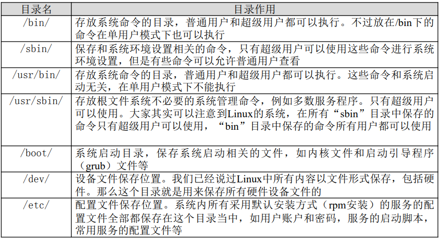
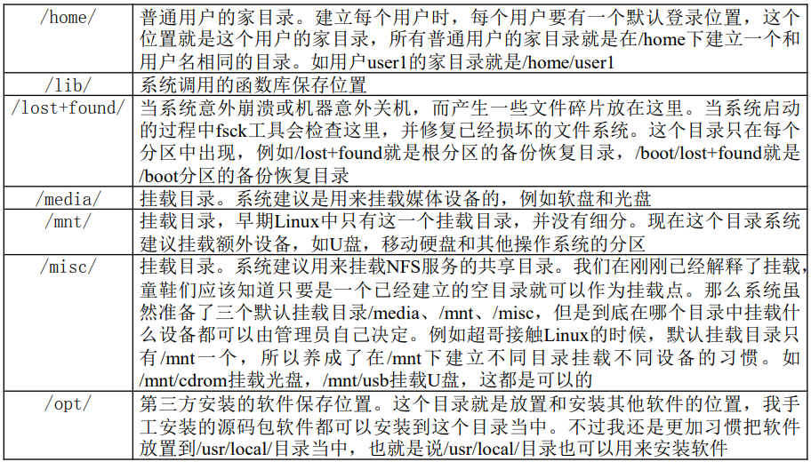
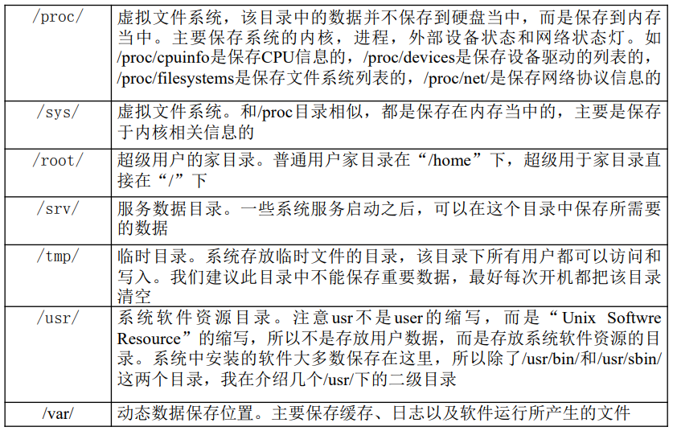
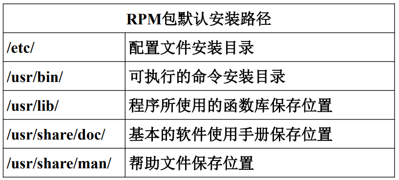

# 网络文章

[史上最牛的Linux视频教程—兄弟连_哔哩哔哩_bilibili](https://www.bilibili.com/video/BV1mW411i7Qf)

[从零开始学习Linux笔记](https://blog.csdn.net/yy150122/article/details/106146414)

# 目录结构

## 系统目录结构及作用







## RPM包安装位置



# 指令

## du 查看文件夹大小

`du -sh 文件夹`

## cut 字符切割

**语法**

```
cut [-bn] [file]
cut [-c] [file]
cut [-df] [file]
```

**参数:**

```sh
-b ：以字节为单位进行分割。这些字节位置将忽略多字节字符边界，除非也指定了 -n 标志。
-c ：以字符为单位进行分割。
-d ：自定义分隔符，默认为制表符。
-f ：与-d一起使用，指定显示哪个区域。
-n ：取消分割多字节字符。仅和 -b 标志一起使用。如果字符的最后一个字节落在由 -b 标志的 List 参数指示的
  范围之内，该字符将被写出；否则，该字符将被排除
```

## awk 字符切割【多空格】

**语法**

```sh
awk ‘条件1{动作1} 条件2{动作2}…’ 文件名
```

`df -h |  awk '{print $1"\t" $5}'`

或者`df -h |  awk -F " " '{print $1"\t" $5}'`  其中`-F " "`可以省略

所有awk按列分割，$1代表第一列，$5代表第五列。

> awk默认分隔符是空格


## sed 轻量级流编辑器

**语法**

`sed [选项] ‘[动作]’ 文件名`

**选项**：

```sh
-n: 一般sed命令会把所有数据都输出到屏幕 ， 如果加入此选择，则只会把经过sed命令处理的行输出到屏幕。
-e: 允许对输入数据应用多条sed命令编辑
-i: 用sed的修改结果直接修改读取数据的文件， 而不是由屏幕输出
```

动作:

```sh
a : 追加，在当前行后添加一行或多行。添加多行时，除最后 一行外，每行末尾需要用“\”代表数据未完结。
c : 行替换，用c后面的字符串替换原数据行，替换多行时，除最后一行外，每行末尾需用“\”代表数据未完结。
i : 插入，在当期行前插入一行或多行。插入多行时，除最后 一行外，每行末尾需要用“\”代表数据未完结。
d : 删除，删除指定的行。
p : 打印，输出指定的行。
s : 字串替换，用一个字符串替换另外一个字符串。格式为“行范 围s/旧字串/新字串/g”(和vim中的替换格式类似)。
```

**例子：**

`sed ‘2p’ student.txt` 第二行多了一行，其余的正常显示，所以要配合`-n`

`sed -n ‘2p’ student.txt`  输入-n后就没有多余的了

`sed ‘2,4d’ student.txt`  删除第二行到第四行的数据，但不修改文件本身

`sed ‘2a hello’ student.txt`  在第二行后追加hello

`sed ‘2i hello \ world’ student.txt`  在第二行前插入两行数据

`sed '2c No such person‘ student.txt`  替换第二行

字符串替换

`sed ‘s/旧字串/新字串/g’ 文件名`

`sed ‘3s/74/99/g’ student.txt`  在第三行中，把74换成99

`sed -i ‘3s/74/99/g’ student.txt`   sed操作的数据直接写入文件

`sed -e ‘s/Liming//g ; s/Gao//g’ student.txt`   同时把“Liming”和“Gao”替换为空

## sort 排序

**参数说明**：

```sh
-b 忽略每行前面开始出的空格字符。
-c 检查文件是否已经按照顺序排序。
-d 排序时，处理英文字母、数字及空格字符外，忽略其他的字符。
-f 排序时，将小写字母视为大写字母。
-i 排序时，除了040至176之间的ASCII字符外，忽略其他的字符。
-m 将几个排序好的文件进行合并。
-M 将前面3个字母依照月份的缩写进行排序。
-n 依照数值的大小排序。
-u 意味着是唯一的(unique)，输出的结果是去完重了的。
-o<输出文件> 将排序后的结果存入指定的文件。
-r 以相反的顺序来排序。
-t<分隔字符> 指定排序时所用的栏位分隔字符。
+<起始栏位>-<结束栏位> 以指定的栏位来排序，范围由起始栏位到结束栏位的前一栏位。
--help 显示帮助。
--version 显示版本信息。
[-k field1[,field2]] 按指定的列进行排序。
```

## uniq 去重

**语法**:

`uniq [-cdu][-f<栏位>][-s<字符位置>][-w<字符位置>][--help][--version][输入文件][输出文件]`

**参数**：

```sh
-c或--count 在每列旁边显示该行重复出现的次数。
-d或--repeated 仅显示重复出现的行列。
-f<栏位>或--skip-fields=<栏位> 忽略比较指定的栏位。
-s<字符位置>或--skip-chars=<字符位置> 忽略比较指定的字符。
-u或--unique 仅显示出一次的行列。
-w<字符位置>或--check-chars=<字符位置> 指定要比较的字符。
--help 显示帮助。
--version 显示版本信息。
[输入文件] 指定已排序好的文本文件。如果不指定此项，则从标准读取数据；
[输出文件] 指定输出的文件。如果不指定此选项，则将内容显示到标准输出设备（显示终端）。
```

## wc 统计命令

`-l`: 只统计行数

`-w`: 只统计单词数

`-m`: 只统计字符数

## netstat 查看网络状态

[Linux netstat命令详解 - ggjucheng - 博客园 (cnblogs.com)](https://www.cnblogs.com/ggjucheng/archive/2012/01/08/2316661.html)

**常用参数**：

```sh
-t TCP协议
-u UDP协议
-l 监听
-r 路由
-n 显示IP和端口号
```

**范例**：

`netstat -tlun`   查看本机监听的端口

`netstat -an`    查看本机所有的网络连接

`netstat -rn`   查看本机路由表

可以在上面命令的基础上加 `p` 显示**进程名称**


# root用户密码登陆

```sh
vim /etc/ssh/sshd_config
#PasswordAuthentication yes
#PermitRootLogin yes

systemctl restart sshd.service
```

# Ubuntu系统开放端口

[网站端口扫描 (chinaz.com)](https://tool.chinaz.com/port/)

```sh
开放所有端口
iptables -P INPUT ACCEPT
iptables -P FORWARD ACCEPT
iptables -P OUTPUT ACCEPT
iptables -F

#只设置上面应该就可以，如果不行再试一下面的方法。
Ubuntu镜像默认设置了Iptable规则，关闭它
apt-get purge netfilter-persistent
reboot
或者强制删除
rm -rf /etc/iptables && reboot
```

# WinSCP切换root

- 查看sftp路径
  - cat /etc/ssh/sshd_config  | grep sftp
- WinSCP高级设置 SFTP里设置SFTP服务器 
  - sudo /usr/lib/openssh/sftp-server
