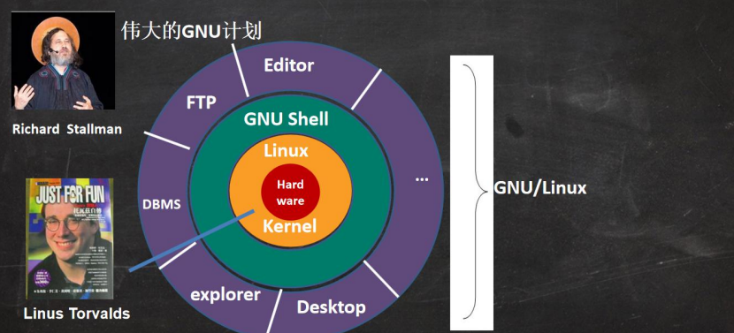

[【小白入门 通俗易懂】2021韩顺平 一周学会Linux_哔哩哔哩_bilibili](https://www.bilibili.com/video/BV1Sv411r7vd)

# 一、 内容介绍

## 1.1 本套 Linux 课程内容


 

## 1.2 Linux 使用在那些地方

 

## 1.3 Linux 的应用领域

### 1.3.1 个人桌面领域

此领域是传统 linux 应用薄弱的环节，近些年来随着 ubuntu、fedora [fɪˈdɔ:rə] 等优秀桌面环境的兴起，linux 在个人桌面领域的占有率在逐渐的提高。

### 1.3.2 服务器领域

- linux 在**服务器领域**的应用是最强的。
- linux **免费、稳定、高效**等特点在这里得到了很好的体现，尤其在一些高端领域尤为广泛（c/c++/php/java/python/go）

### 1.3.3 嵌入式领域

linux 运行稳定、对网络的良好支持性、低成本，且可以根据需要进行**软件裁剪**，内核最小可以达到几百 KB 等特点， 使其近些年来在**嵌入式领域**的应用得到非常大的提高

主要应用：机顶盒、数字电视、网络电话、程控交换机、手机、PDA、智能家居、智能硬件等都是其应用领域。以 后在**物联网中应用会更加广泛**。


# ++++++++++++++++
# ++++++基础篇++++++
# ++++++++++++++++

# 二、 入门

## 2.1 Linux 介绍

- linux 怎么读， 不下 10 种
- linux 是一个开源、免费的操作系统，其稳定性、安全性、处理多并发已经得到业界的认可，目前很多企业级的项目 (c/c++/php/python/java/go)都会部署到 Linux/unix 系统上。
- 常见的操作系统(windows、IOS、Android、MacOS, Linux, Unix
- Linux 吉祥物 - 企鹅Tux
  
- Linux 之父 - Linus Torvalds
  - Git 创作者
  - 世界著名黑客
  - linux0.01 版源码(不到 1w 行)
  - 后面老韩给大家演示如何下载 最新版本 linux 内核源码
- Linux 主要的发行版:
  - Ubuntu(乌班图)
  - RedHat(红帽)
  - CentOS
  - Debain[蝶变]、Fedora、SuSE、OpenSUSE 等。

## 2.2 Linux 和 Unix 的关系

### 2.2.1 unix 是怎么来的

 

### 2.2.2 Linux 是怎么来

 

### 2.2.3 Linux、Unix 关系

 


# 三、 安装

## 3.1 VM 安装的步骤

- 去 BIOS 里修改设置开启虚拟化设备支持（f2, f10）
- 安装虚拟机软件（vm15.5）, 演示一把，1. 在 BIOS 开启 CPU 虚拟化支持
- https://jingyan.baidu.com/article/ab0b56305f2882c15afa7dda.html

## 3.2 Centos 下载地址

> CentOS-7-x86_64-DVD-1810.iso CentOS 7.6 DVD 版 4G (目前主流的生产环境)
>
> http://mirrors.163.com/centos/7.6.1810/isos/x86_64/CentOS-7-x86_64-DVD-1810.iso
>
> CentOS-8.1.1911-x86_64-dvd1.iso CentOS 8.1 DVD 版 8G (未来的主流.) 
>
> https://mirrors.aliyun.com/centos/8.1.1911/isos/x86_64/CentOS-8.1.1911-x86_64-dvd1.iso
>
> 上面镜像的下载链接失效了，可以从官网下载

- 官网下载页面
  [Download (centos.org)](https://www.centos.org/download/)
- 点击右侧Older Versions
  
- 会进入到[下载 - CentOS 维基](https://wiki.centos.org/Download)这个页面。
- 然后根据版本号找到需要的版本进行下载就可以了。
- CentOS8.0 VS CentOS7.0 比较 (了解)
  


## 3.3 CentOS 安装的步骤

- 创建虚拟机
  典型 - 稍后安装操作系统 - Linux - 版本根据镜像下载

  最后一步设置硬件信息，然后完成。

- 安装系统(CentOS7.6)
  [生成随机密码 - 密码生成器 - 密码批量生成器 (bmcx.com)](https://suijimimashengcheng.bmcx.com/)

  CentOS安装注意的地方：

  - 软件选择

    > 实际工作中，可以选择最小安装，根据需要选择。
    >
    > 选择完后要等一段时间，不用乱点。不然会卡死。

     

  - 安装位置

    > 自定义分区：我要配置分区  -  点完成
    >
    > 然后设置三个分区：
    >
    > - Boot分区【引导】 
    >   一般1g
    > - swap交换分区
    >   一般与内存大小一样
    > - 根分区
    >   一般剩余大小

    

    

    

  - Kdump

    > 一个内核崩溃转存储机制
    > 生成环境 选择
    > 学习环境可以取消

  - 网络和主机名

    > 开口网络，修改主机名

  - 安全策略

    > 关闭，暂时不管

  - 重启

    > root登陆
    > 语言 - 汉语 - 汉语（Pinyin）
    > 隐私 - 关闭
    > 网络账号 - 跳过


## 3.4 虚拟机克隆

> 如果你已经安装了一台 linux 操作系统，你还想再更多的，老韩提示大家：没有必要再重新安装，你只需要克隆就可 以

- 方式 1，直接拷贝一份安装好的虚拟机文件
- 方式 2，使用 vmware 的克隆操作，注意， 克隆时，需要先关闭 linux 系

## 3.5 虚拟机快照

> 如果你在使用虚拟机系统的时候(比如 linux)，你想回到原先的某一个状态，也就是说你担心可能有些误操作造成系 统异常，需要回到原先某个正常运行的状态，vmware 也提供了这样的功能，就叫快照管理 

## 3.6 虚拟机迁移和删除

> 我在前面讲过，虚拟系统安装好了，它的本质就是文件(放在文件夹的)。因此虚拟系统的迁移很方便，你可以把安 装好的虚拟系统这个文件夹整体拷贝或者剪切到另外位置使用。
>
> 删除也很简单，用 vmware 进行移除，再点击菜单->从磁盘删除即可，或者直接手动删除虚拟系统对应的文件夹即可。

## 3.7 安装 vmtools

### 3.10.1 介绍

- vmtools 安装后，可以让我们在 windows 下更好的管理 vm 虚拟机
- 可以设置 windows 和 centos 的共享文件夹

### 3.10.2 vmtools

> - 进入 centos
> - 点击 vm 菜单的->install vmware tools
> - centos 会出现一个 vm 的安装包, xx.tar.gz
> - 拷贝到 /opt
> - 使用解压命令 tar, 得到一个安装文件
>   - cd /opt [进入到 opt 目录]
>   - tar -zxvf xx.tar.gz
> - 进入该 vm 解压的目录 , /opt 目录下
>   - cd vmware..
> - 安装 ./vmware-install.pl
> - 全部使用默认设置即可, 就可以安装成功
> - **注意：**安装 vmtools 需要有 gcc
>   - gcc -v
> - 

### 3.10.3 设置共享文件夹

> 为了方便，可以设置一个共享文件夹，比如 d:/myshare

具体步骤：

- 菜单 -> 虚拟机 -> 设置，如图设置即可。
  

- 共享文件夹在 CentOS 的 `/mnt/hgfs/` 下。

- 注意

  > 实际开发中，文件的上传下载是需要使用远程方式完成的


# 四、 目录结构

## 4.1 Linux 目录结构

- linux 的文件系统是采用级层式的树状目录结构，在此结构中的最上层是根目录“/”，然后在此目录下再创建其他的目录。
- 深刻理解 linux 树状文件目录是非常重要的，这里我给大家说明一下。
- 记住一句经典的话：**在 Linux 世界里，一切皆文件!!**
  

## 4.2 具体的目录结构

1) **/bin** 【常用】 (/usr/bin 、 /usr/local/bin) 
   是 Binary 的缩写, 这个目录存放着最经常使用的命令
2) **/sbin** (/usr/sbin 、 /usr/local/sbin)
   是 Super User 的意思，这里存放的是系统管理员使用的系统管理程序。
3) **/home** 【常用】
   存放普通用户的主目录，在 Linux 中每个用户都有一个自己的目录，一般该目录名是以用户的账号命名
4) **/root** 【常用】
   该目录为系统管理员，也称作超级权限者的用户主目录
5) **/lib**
   系统开机所需要最基本的动态连接共享库，其作用类似于 Windows 里的 DLL 文件。几乎所有的应用程序都需要 用到这些共享库
6) **/lost+found**
   这个目录一般情况下是空的，当系统非法关机后，这里就存放了一些文件
7) **/etc** 【常用】
   所有的系统管理所需要的配置文件和子目录, 比如安装 mysql 数据库 my.conf
8) **/usr** 【常用】
   这是一个非常重要的目录，用户的很多应用程序和文件都放在这个目录下，类似与 windows 下的 program files 目录。
9) **/boot** 【常用】
   存放的是启动 Linux 时使用的一些核心文件，包括一些连接文件以及镜像文件
10) **/proc** 【不能动】
    这个目录是一个虚拟的目录，它是系统内存的映射，访问这个目录来获取系统信息
11) **/srv** 【不能动】
    service 缩写，该目录存放一些服务启动之后需要提取的数据
12) **/sys** 【不能动】
    这是 linux2.6 内核的一个很大的变化。该目录下安装了 2.6 内核中新出现的一个文件系统 sysfs =》【别 动】
13) **/tmp**
    这个目录是用来存放一些临时文件的
14) **/dev**
    类似于 windows 的设备管理器，把所有的硬件用文件的形式存储
15) **/media** 【常用】
    linux 系统会自动识别一些设备，例如 U 盘、光驱等等，当识别后，linux 会把识别的设备挂载到这个目录下
16) **/mnt** 【常用】
    系统提供该目录是为了让用户临时挂载别的文件系统的，我们可以将外部的存储挂载在/mnt/上，然后进入该目录就可以查看里的内容了。如 d:/myshare
17) **/opt**
    这是给主机额外安装软件所存放的目录。如安装 ORACLE 数据库就可放到该目录下。默认为空
18) **/usr/local** 【常用】
    这是另一个给主机额外安装软件所安装的目录。一般是通过编译源码方式安装的程序
19) **/var** 【常用】
    这个目录中存放着在不断扩充着的东西，习惯将经常被修改的目录放在这个目录下。包括各种日志文件
20) **/selinux** 【security-enhanced linux】
    SELinux 是一种安全子系统,它能控制程序只能访问特定文件, 有三种工作模式，可以自行设置.

# ++++++++++++++++
# ++++++实操篇++++++
# ++++++++++++++++

# 五、 远程登录

## 5.1 为什么

- linux 服务器是开发小组共享
- 正式上线的项目是运行在公网
- 因此程序员需要远程登录到 Linux 进行项目管理或者开发
- 远程登录客户端有 Xshell6， Xftp6 , 我们学习使用 Xshell 和 Xftp6 , 其它的远程工具大同小异

## 5.2 Xshell6

> - 说明: Xshell 是目前最好的远程登录到 Linux 操作的软件，流畅的速度并且完美解决了中文乱码的问题， 是目前程序员首选的软件。
> - Xshell 是一个强大的安全终端模拟软件，它支持 SSH1, SSH2, 以及 Microsoft Windows 平台的 TELNET 协议。
> - Xshell 可以在 Windows 界面下用来访问远端不同系统下的服务器，从而比较好的达到远程控制终端的目的

## 5.3 下载-安装-配置和使用:

> 下载 free-for-home-school 版本
>
> 地址: https://www.netsarang.com/en/free-for-home-school/


## 5.4 MobaXterm

[MobaXterm free Xserver and tabbed SSH client for Windows (mobatek.net)](https://mobaxterm.mobatek.net/)


## 5.5 服务器开启root登录

- sudo su切换到root权限

- 编辑 /etc/ssh/sshd_config

```bash
# 找到下面两个配置，去掉注释
PermitRootLogin yes
PasswordAuthentication yes
```

- 设置root密码：
  sudo passwd root

- 重启ssh
  systemctl restart sshd


## 5.6 SSH无密登录配置

```bash
# 生成公钥和私钥，（三个回车），两个文件id_rsa（私钥）、id_rsa.pub（公钥）
ssh-keygen -t rsa

# 将公钥拷贝到要免密登录的目标机器上
ssh-copy-id <目标机器>

# 或者将公钥复制到目标机器的 ~/.ssh/authorized_keys
```

## 5.7 ssh自动重连

ssh自动重连实现端口转发

1.设置免密登陆

```bash
ssh-keygen
# 一路回车，默认路径保存（通常是 C:\Users\你的用户名\.ssh\id_rsa）

ssh-copy-id username@linux_ip
# 如果没有 ssh-copy-id，可以手动：
scp C:\Users\你的用户名\.ssh\id_rsa.pub username@linux_ip:~/.ssh/authorized_keys
```

2.创建 auto_reconnect.ps1 文件

```bash
$server = "renchao@x.x.x.x"
$remotePort = 3389
$localPort = 3389

while ($true) {
    Write-Host "Establishing reverse tunnel $remotePort -> localhost:$localPort ..."
    ssh -R $remotePort:localhost:$localPort $server `
        -o ServerAliveInterval=60 `
        -o ServerAliveCountMax=2 `
        -o ExitOnForwardFailure=yes
    Write-Host "SSH tunnel lost. Reconnecting in 5 seconds..."
    Start-Sleep -Seconds 5
}
```

3.打开PowerShell执行脚本

```bash
powershell -ExecutionPolicy Bypass -File .\Desktop\auto_reconnect.ps1
```


# 六、 Vi 和 Vim

## 6.1 基本介绍

Linux 系统会内置 vi 文本编辑器

Vim 具有程序编辑的能力，可以看做是 Vi 的增强版本，可以主动的以字体颜色辨别语法的正确性，方便程序设计。 代码补完、编译及错误跳转等方便编程的功能特别丰富，在程序员中被广泛使用。

## 6.2 常用的三种模式

- 正常模式

  > 以 vim 打开一个档案就直接进入一般模式了(这是默认的模式)。在这个模式中， 你可以使用『上下左右』按键来移动光标，你可以使用『删除字符』或『删除整行』来处理档案内容， 也可以使用『复制、粘贴』来处理你的文件数据。

- 插入模式

  > 按下 i, I, o, O, a, A, r, R 等任何一个字母之后才会进入编辑模式, 一般来说按 i 即可。

- 命令行模式

  > 输入 esc 再输入：在这个模式当中， 可以提供你相关指令，完成读取、存盘、替换、离开 vim 、显 示行号等的动作则是在此模式中达成的！


## 6.3 模式切换

 

## 6.4 常用快捷键

```bash
# 移动光标(命令模式)
h  # 向左
j  # 向下 
k  # 向上
l  # 向右

空格键      # 向右
Backspace  # 向左
Enter      # 移动到下一行首
-          # 移动到上一行首。

:set  nu   # 显示行号
:set nonu  # 取消显示行号
n+         # 向下跳n行
n-         # 向上跳n行
nG         # 跳到行号为n的行
G          # 跳至文件的底部
g          # 跳转到文件头部

# 跳转到当前行的指定列
0 或 |     # 行首
$          # 行尾
n|         # 跳转到当前行的第 n 列
nl         # 向后跳n列

# 查看当前光标的位置（所在的行列）
Ctrl+g


# 编辑模式(插入模式)
a  # 在当前光标位置的右边添加文本
i  # 在当前光标位置的左边添加文本
A  # 在当前行的末尾位置添加文本
I  # 在当前行的开始处添加文本(非空字符的行首)
O  # 在当前行的上面新建一行
o  # 在当前行的下面新建一行
R  # 替换(覆盖)当前光标位置及后面的若干文本
J  # 合并光标所在行及下一行为一行(依然在命令模式)


# 删除和复制(命令模式)
x    # 删除当前字符
nx   # 删除从光标开始的n个字符
dd   # 删除当前行
ndd  # 向下删除当前行在内的n行
u    # 撤销上一步操作
U    # 撤销对当前行的所有操作
yy   # 将当前行复制到缓存区，也可以用 "ayy 复制，"a 为缓冲区，a也可以替换为a到z的任意字母，可以完成多个复制任务。
nyy  # 将当前行向下n行复制到缓冲区，也可以用 "anyy 复制，"a 为缓冲区，a也可以替换为a到z的任意字母，可以完成多个复制任务。
yw   # 复制从光标开始到词尾的字符。
nyw  # 复制从光标开始的n个单词。
y^   # 复制从光标到行首的内容。  VPS侦探
y$   # 复制从光标到行尾的内容。
p    # 粘贴剪切板里的内容在光标后，如果使用了前面的自定义缓冲区，建议使用"ap 进行粘贴。
P    # 粘贴剪切板里的内容在光标前，如果使用了前面的自定义缓冲区，建议使用"aP 进行粘贴。


# 搜索和替换(命令模式)
/keyword     # 向光标下搜索keyword字符串，keyword可以是正则表达式
?keyword     # 向光标上搜索keyword字符串
n            # 向下搜索前一个搜素动作
N            # 向上搜索前一个搜索动作

*(#)         # 当光标停留在某个单词上时, 输入这条命令表示查找与该单词匹配的下(上)一个单词. 同样, 再输入 n 查找下一个匹配处, 输入 N 反方向查找.

g*(g#)       # 此命令与上条命令相似, 只不过它不完全匹配光标所在处的单词, 而是匹配包含该单词的所有字符串.

:s/old/new        # 用new替换行中首次出现的old
:s/old/new/g      # 用new替换行中所有的old
:n,m s/old/new/g  # 用new替换从n到m行里所有的old
:%s/old/new/g     # 用new替换当前文件里所有的old

```

快捷键的键盘对应图
   


## 6.5 vim纯文本模式

> vim有自动格式化功能

**纯文本粘贴模式**：在 Vim 中，按下 `:` 进入命令模式，然后输入 `set paste`，然后按下 `Enter` 进入粘贴模式。这将禁用自动缩进和格式化功能，允许你以原始格式粘贴文本。粘贴完成后，再次按下 `:` 进入命令模式，输入 `set nopaste` 并按下 `Enter` 恢复正常模式。

## 6.6 批量删除

```bash
# 删除当前行以下的所有内容:
dG

# 删除当前行以上的所有内容:
dgg

# 删除整个文档的所有内容:
:%d

# 删除指定范围的内容,例如删除10行到20行:
:10,20d

# 删除匹配某个模式的所有行,例如删除包含test的所有行:
:g/test/d

# 删除非空白字符行:
:g/^\s*$/d

# 删除连续空白行,只保留一行:
:g/^\s*$/.,/[^ \t]/-j

# 删除文件中的所有行:
:1,$d
```


# 七、 开机、重启和登录注销

## 7.1 关机&重启

1. `shutdown –h now` 
   立该进行关机
2. `shudown -h 1 "1分钟后会关机"`
   定时关机，后面字符串是广播
3. `shutdown –r now` 
   现在重新启动计算机
4. `halt` 
   关机，作用和上面一样.
5. `reboot` 
   现在重新启动计算机
6. `sync` 
   把内存的数据同步到磁盘.

注意细节：

> - 不管是重启系统还是关闭系统，首先要运行 sync 命令，把内存中的数据写到磁盘中
> - 目前的 `shutdown/reboot/halt` 等命令均其实已经在关机前执行了 `sync` 命令
> - 提醒: 小心驶得万年船


## 7.2 登录和注销

> - 登录时尽量少用 root 帐号登录，因为它是系统管理员，最大的权限，避免操作失误。
> - 可以利用普通用户登录，登录 后再用 `su - 用户名` 命令来切换成系统管理员身份。
> - 在提示符下输入 logout 即可注销用户
> - 使用细节
>   - logout 注销指令在图形运行级别无效，在运行级别 3 下有效.


# 八、 用户管理

## 8.1 基本介绍

Linux 系统是一个多用户多任务的操作系统，任何一个要使用系统资源的用户，都必须首先向系统管理员申请一个账号，然后以这个账号的身份进入系统。

 

## 8.2 添加用户

### 8.2.1 基本语法

`useradd 用户名`

细节说明

> - 当创建用户成功后，会自动的创建和用户同名的家目录
> - 也可以通过 `useradd -d 指定目录` 新的用户名，给新创建的用户指定家目录

### 8.2.2 ssh密钥登录

1. **创建.ssh目录：**

   ```
   mkdir ~/.ssh
   ```

2. **设置.ssh目录权限：**

   ```
   chmod 700 ~/.ssh
   ```

3. **创建authorized_keys文件：**

   ```
   touch ~/.ssh/authorized_keys
   ```

4. **设置authorized_keys文件权限：**

   ```
   chmod 600 ~/.ssh/authorized_keys
   ```

5. **在本地生成SSH密钥：**

   如果你还没有SSH密钥对，可以使用以下命令在本地生成：

   ```
   ssh-keygen -t rsa -b 2048
   ```

   按照提示设置密钥的保存路径和密码。

6. **将本地公钥复制到新用户的authorized_keys文件中：**

   ```
   cat ~/.ssh/id_rsa.pub >> ~/.ssh/authorized_keys
   ```

   如果你在本地使用了不同的密钥文件名，替换 `id_rsa.pub` 为你的公钥文件名。

7. **设置authorized_keys文件权限：**

   ```
   chmod 600 ~/.ssh/authorized_keys
   ```

8. **编辑SSH配置文件允许密钥登录：**

   编辑SSH服务器配置文件 `/etc/ssh/sshd_config`，确保以下行的设置：

   ```bash
   # PasswordAuthentication no
   PubkeyAuthentication yes
   ```

   然后，重启SSH服务：

   ```
   sudo service ssh restart
   ```

### 8.2.3 使用sudo命令

需要将该用户添加到 `/etc/sudoers` 文件中。可以使用 `visudo` 命令来编辑该文件：

```bash
sudo visudo
```

然后，将以下行添加到文件末尾（替换 `username` 为实际用户名）：

```bash
username ALL=(ALL:ALL) ALL
```

> 一般在/etc/sudoers.d中添加
>
> 在该目录新建一个文件，回自动导入
>
> ```bash
> # User rules for opc
> opc ALL=(ALL) NOPASSWD:ALL
> renchao ALL=(ALL) NOPASSWD:ALL
> # ALL=(ALL:ALL) ALL 允许用户在执行 sudo 命令时，必须输入其自己的密码。
> # ALL=(ALL) NOPASSWD:ALL 允许用户在执行 sudo 命令时，无需输入密码。
> ```


## 8.3 指定/修改密码

- 基本语法
  `passwd 用户名`

  > 显示当前用户所在的目录 pwd


## 8.4 删除用户

- 基本语法

  - `userdel 用户名`
    删除用户，保留家目录。
  - `userdel -r 用户名`
    删除用户以及用户主目录

- 细节说明

  > 一般情况下，建议保留家目录

## 8.5 查询用户信息

- 基本语法
  `id 用户名`


## 8.6 切换用户

- 基本语法
  `su - 切换用户名`

- 细节说明

  > 从权限高的用户切换到权限低的用户，不需要输入密码，反之需要。
  >
  > 当需要返回到原来用户时，使用 `exit/logout` 指

## 8.7 查看当前登录用户

- 基本语法
  `who am i` 或 `whoami`

## 8.8 用户组

- 介绍

  > 类似于角色，系统可以对有共性/权限的多个用户进行统一的管理。

- 新增组
  `groupadd 组名`

- 删除组
  `groupdel 组名`

- 新增用户指定组
  `useradd –g 用户组 用户名`

- 修改用户的组
  `usermod –g 用户组 用户名`


## 8.9 用户和组相关文件

### 8.9.1 /etc/passwd

- 用户（user）的配置文件，记录用户的各种信息
- 每行的含义：
  `用户名:口令:用户标识号:组标识号:注释性描述:主目录:登录Shell`

### 8.9.2 /etc/shadow

- 口令的配置文件
- 每行的含义：
  `登录名:加密口令:最后一次修改时间:最小时间间隔:最大时间间隔:警告时间:不活动时间:失效时间:标志`

### 8.9.3 /etc/group

- 组(group)的配置文件，记录 Linux 包含的组的信息
- 每行含义：
  `组名:口令:组标识号:组内用户列表`


## 8.10 修改用户uid和组gid

[Linux中修改用户UID和组GID的方法_二进制怎么算-CSDN博客](https://blog.csdn.net/train006l/article/details/79007483)

[How to Change a USER and GROUP ID on Linux For All Owned Files - nixCraft (cyberciti.biz)](https://www.cyberciti.biz/faq/linux-change-user-group-uid-gid-for-all-owned-files/)

- 修改opc用户的uid为2005
  usermod -u 2005 opc
- 修改opc组的gid为2005
  groupmod -g 2005 opc


# 九、 指令

## 9.1 运行级别

- 基本介绍

  > - 0 ：关机
  > - 1 ：单用户【找回丢失密码】
  > - 2 ：多用户状态没有网络服务
  > - **3 ：多用户状态有网络服务**
  > - 4 ：系统未使用保留给用户
  > - **5 ：图形界面**
  > - 6 ：系统重启

  常用运行级别是 3 和 5 ，也可以指定默认运行级别
  
- 运行级别切换
  `init 级别号`

- 默认运行级别设置

  - 在 centos7 以前， 在/etc/inittab 文件中

  - centos7 及以后进行了简化

    - multi-user.target
      类似于3
    - graphical.target
      类似于5

    查看当前运行级别 `systemctl get-default`

    设置默认运行级别 `systemctl set-default TARGET.target`

    比如设置级别3：`systemctl set-default multi-user.target`

## 9.2 找回 root 密码

1. 首先，启动系统，进入开机界面，按键盘 `e` 进入编辑界面。如图
   

2. 进入编辑界面，找到以 Linux16 开头内容所在的行数。
   在该最后面输入：`init=/bin/sh`。如图
   

3. 输入完成后，直接按快捷键：`Ctrl+x` 进入**单用户模式**。

4. 在光标位置输入：`mount -o remount,rw /`。按回车。如图
   

5. 输入：`passwd`， 按回车。输入2次密码，成功后，会显示passwd.....的样式。
   

6. 输入：`touch /.autorelabel` ，完成后按回车键。

7. 继续输入：`exec /sbin/init` ，最后按回车键。
   等待系统自动修改密码(**这个过程时间可能有点长，耐心等待**)。
   完成后，系统会自动重启, **新的密码生效**了。

   

## 9.3 帮助指令

### 9.3.1 man

- man手册的格式

  > **NAME**     　　  命令名称及功能简要说明
  >
  > **SYNOPSIS**   　  用法说明，包括可用的选项
  >
  > **DESCRIPTION**   命令功能的详细说明，可能包括每一个选项的意义
  >
  > **OPTIONS**       说明每一项的意义
  >
  > **FILES**          此命令相关的配置文件    
  >
  > **BUGS**     
  >
  > **EXAMPLES**     使用示例
  >
  > **SEE ALSO**      另外参照

- man手册的使用方法

  - 例如查看 ls 命令：`man ls` 

  - 翻屏查看

    > 向后翻一屏：space(空格键)  　　向前翻一屏：b
    >
    > 向后翻一行：Enter(回车键)  　　 向前翻一行：k

  - 查找

    > /关键词   向后查找   n：下一个
    >
    > ?关键词   向前查找   N：前一个

  - 退出

    > q


### 9.3.2 whatis

- 基本语法：

  > whatis 命令

- 功能描述：

  > 用于查询一个命令执行什么功能，并将查询结果打印到终端上。

### 9.3.3 help

- 基本语法：
  `help 命令` 

- 功能描述：

  > 获得 shell 内置命令的帮助信息

### 9.3.4 百度帮助更直接

- > 英语不太好的，也可以直接百度靠谱。


## 9.4 文件目录类

### 9.4.1 pwd - 显示绝对路径

- 基本语法 ：
  `pwd`

- 功能描述：

  > 显示当前工作目录的绝对路径

### 9.4.2 ls

- 基本语法：
  `ls [选项] [目录或是文件]`

- 颜色含义
  
  - 白色：普通文件
  - 蓝色：目录
  - 绿色：可执行文件
  - 红色：压缩文件
  - 浅蓝色：链接文件
  - 红色闪烁：链接文件有问题
  - 黄色：设备文件
  - 灰色：其他文件
  
- 常用选项

  > -a ：显示当前目录所有的文件和目录，包括隐藏的。 
  >
  > -l ：以列表的方式显示信息

### 9.4.3 cd

- 基本语法：
  `cd [参数]`

- 功能描述：

  > 切换到指定目录

### 9.4.4 mkdir - 创建目录

- 基本语法：
  `mkdir [选项] 要创建的目录`

- 常用选项

  > -p ：创建多级目录

### 9.4.5 rmdir - 删除空目录

- 基本语法
  `rmdir [选项] 要删除的空目录`

- 常用选项

  > -p : 循环依次删除
  >
  > - `rmdir a/b/c` 删除的是c
  > - `rmdir -p a/b/c` abc三个目录都删除【三个目录是空的情况下】

- 使用细节

  > rmdir 删除的是空目录，如果目录下有内容时无法删除的。 
  >
  > 提示：如果需要删除非空目录，需要使用 rm -rf 要删除的目录
  >
  > 比如： `rm -rf /home/anima`

### 9.4.6 touch - 创建空文件

- 基本语法
  `touch 文件名称`

- 使用细节

  > 实际功能是修改文件的时间戳
  >
  > 详细使用方法使用 `man touch` 查看或者百度

### 9.4.7 cp - 拷贝

- 基本语法
  `cp [选项] source dest`

- 常用选项

  > -r ：递归复制整个文件夹

### 9.4.8 rm - 删除文件或目录

- 基本语法
  `rm [选项] 要删除的文件或目录`

- 常用选项

  > -r ：递归删除整个文件夹
  >
  > -f ：强制删除不提示

### 9.4.9 mv - 移动或重命名

> 移动文件与目录或重命名

- 基本语法
  - `mv oldNameFile newNameFile` (重命名) 
  - `mv /temp/movefile /targetFolder` (移动文件)

### 9.4.10 cat - 查看文件内容

- 基本语法
  `cat [选项] 要查看的文件`

- 常用选项

  > -n ：显示行号

- 使用细节

  > cat 只能浏览不能修改，为了浏览方便，一般会带上管道命令 | more
  > `cat -n /etc/profile | more`

### 9.4.11 more - 交互显示

> more 指令是一个基于 VI 编辑器的文本过滤器，它以全屏幕的方式按页显示文本文件的内容。
>
> more 指令中内置了若 干快捷键(交互的指令)

- 基本语法
  `more 要查看的文件`
- 操作说明
  

### 9.4.12 less - 查看文件内容

> less 指令用来分屏查看文件内容，它的功能与 more 指令类似，但是比 more 指令更加强大，支持各种显示终端。
>
> less 指令在显示文件内容时，并不是一次将整个文件加载之后才显示，而是根据显示需要加载内容，对于显示大型文件具有 较高的效率。

- 基本语法
  `less 要查看的文`
- 操作说明
  

### 9.4.13 echo - 输出内容到控制台

- 基本语法
  `echo [选项] [输出内容]`

- 应用实例

  > - 案例: 使用 echo 指令输出环境变量, 比如输出 $PATH $HOSTNAME
  >   `echo $HOSTNAME`
  > - 案例: 使用 echo 指令输出 hello,world
  >   `echo "hello,world"`

### 9.4.14 head - 显示文件开头内容

- 基本语法
  `head 文件`  (默认查看文件头 10 行内容) 
  `head -n 5 文件`  (查看文件头 5 行内容，5 可以是任意行数) 

### 9.4.15 tail - 输出文件中尾部内容

- 基本语法
  `tail 文件` （默认文件尾 10 行内容）
- `tail -n 5 文件` （查看文件尾 5 行内容，5 可以是任意行数）
- `tail -f 文件` **（实时追踪该文档的所有更新）**

### 9.4.16 > 和 >> - 输出重定向

- 基本语法
  `ls -l >文件` （列表的内容写入文件 a.txt 中（覆盖写））
- `ls -al >>文件` （列表的内容追加到文件 aa.txt 的末尾）
- `cat 文件 1 > 文件 2` （将文件 1 的内容覆盖到文件 2）
- `echo "内容">> 文件` (追加

### 9.4.17 ln 软链接

> 软链接也称为符号链接，类似于 windows 里的快捷方式，主要存放了链接其他文件的路径

- 基本语法
  `ln -s [原文件或目录] [软链接名]` （给原文件创建一个软链接）

- 应用实例

  - 案例 1: 在/home 目录下创建一个软连接 myroot，连接到 /root 目录
    `ln -s /root /home/myroot`
  - 案例 2: 删除软连接
    `myroot rm /home/myroot`

- 使用细节

  > 当我们使用 pwd 指令查看目录时，仍然看到的是软链接所在目录。

### 9.4.18 history - 历史命令

- 基本语法
  `history` （查看已经执行过历史命令）
- 应用实例
  案例 1: 显示所有的历史命令 
  `history`
  案例 2: 显示最近使用过的 10 个指令。
   `history 10`
  案例 3：执行历史编号为 5 的指令 
  `!5`


## 9.5 时间日期类

### 9.5.1 日期时间

```bash
# 查看当前时间和时区
date

# 查看详细时间信息
timedatectl

# 设置系统时间
sudo date -s "2025-08-07 16:30:00"

# 设置硬件时间（RTC）
sudo hwclock --systohc  # 同步到硬件时钟
sudo hwclock --hctosys  # 硬件时间写到系统

# 设置时区
timedatectl list-timezones # 列出所有可用时区
sudo timedatectl set-timezone Asia/Shanghai  # 设置时区


# date 命令常用格式化选项
date +"格式字符串"
date +"%Y-%m-%d %H:%M:%S"
# 选项	含义	示例值
# %Y	年（4位）	2025
# %m	月（01-12）	08
# %d	日（01-31）	07
# %H	小时（00-23）	16
# %M	分（00-59）	10
# %S	秒（00-59）	30
# %Z	时区缩写	CST
# %z	时区偏移	+0800


```


### 9.5.2 cal - 查看日历

- 基本语法
  `cal [选项]` (不加选项，显示本月日历)

- 常用选项

  > -m : 显示周一为第一天(默认为周日)
  > -j : 显示儒略历的(Julian)日期 (1-356) .
  > -y : 当前全年日历

### 9.5.3 设置日期时间

> 在Windwos中，系统时间的设置很简单，界面操作，通俗易懂，而且设置后，重启，关机都没关系。系统时间会自动保存在BIOS时钟里面，启动计算机的时候，系统会自动在BIOS里面取硬件时间，以保证时间的不间断。
>
> 但在Linux下，默认情况下，系统时间和硬件时间并不会自动同步。在Linux运行过程中，**系统时间和硬件时间以异步的方式运行，互不干扰**。硬件时间的运行，是靠BIOS电池来维持，而系统时间，是用CPU Tick来维持的。在**系统开机的时候，会自动从BIOS中取得硬件时间，设置为系统时间。**

- **date 设置系统时间**
  `date -s 字符串时间`

  > 例如设置系统时间为 2020-11-03 20:02:10
  >
  > - `date -s "2020-11-03 20:02:10"`
  >
  > **重启后时间恢复为BIOS时间。**

- **hwclock 或 clock 设置BIOS时间。**
  `hwclock --set --date "20210225 20:23:00"`

- **系统和硬件时间同步**

  - 以系统时间为基准，修改硬件时间
    `hwclock --systohc` 或者 `hwclock -w`
  - 以硬件时间为基准，修改系统时间
    `hwclock --hctosys` 或者 `hwclock -s`

- **系统同步NTP时间**【阿里云】

  `ntpdate ntp.aliyun.com`

  > 只同步系统时间
  >
  > 定时与NTP同步：[NTP镜像-NTP下载地址-NTP安装教程-阿里巴巴开源镜像站 (aliyun.com)](https://developer.aliyun.com/mirror/NTP?spm=a2c6h.13651102.0.0.bda21b11Ijoi12)


## 9.6 搜索查找类

### 9.6.1 find

- 基本语法
  `find [搜索范围] [选项]`

- 常用选项

  > -name : 按文件名查找
  >
  > -user : 按文件的所有者查找
  >
  > -size : 按照文件大小查找
  >
  > 其他选项使用man查看或者百度

- 应用实例

  > - 案例 1: 按文件名：根据名称查找/home 目录下的 hello.txt 文件
  >   `find /home -name hello.txt `
  > - 案例 2：按拥有者：查找/opt 目录下，用户名称为 nobody 的文件
  >   `find /opt -user nobody `
  > - 案例 3：查找整个 linux 系统下大于 200M 的文件（+n 大于 -n 小于 n 等于, 单位有 k,M,G）
  >   `find / -size +200M`

  

### 9.6.2 locate - 快速定位文件路径

> locate 指令可以快速定位文件路径。
>
> locate 指令利用事先建立的系统中所有文件名称及路径的 locate 数据库实现快速定位给定的文件。
>
> Locate 指令无需遍历整个文件系统，查询速度较快。
>
> 为了保证查询结果的准确度，管理员必须定期更新 locate

- 基本语法
  `locate 搜索文件`

- 特别说明

  > 由于 locate 指令基于数据库进行查询，所以第一次运行前，必须使用 updatedb 指令创建 locate 数据库。

- 应用实例
  使用 locate 指令快速定位 Hello.java 文件所在目录。
  `locate Hello.java`

### 9.6.3 which - 查看某指令所在目录

- 基本语法
  which 查看的指令

### 9.6.4 grep 和 | - 过滤查找和管道

> grep 过滤查找 ， 管道符，“|”，表示将前一个命令的处理结果输出传递给后面的命令处理。


```bash
# 基本语法
grep [选项] 查找内容 源文件

# 常用选项
-n : 显示匹配行和行号
-i : 忽略字母大小写
-C 100：显示前后各 100 行（C = context）
-A 100：只显示匹配行 后面 100 行（A = after）
-B 100：只显示匹配行 前面 100 行（B = before）

# 应用实例
# 输出所有包含 `Exception` 的行及其上下文 100 行
grep -C 100 "Exception" /var/log/app.log

```


## 9.7 压缩和解压

### 9.7.1 gzip/gunzip

> gzip 用于压缩文件， gunzip 用于解压的
>
> gzip**只能压缩文件，不能压缩文件夹，压缩后原文件会被删除**

- 基本语法
  `gzip 文件` （压缩文件，只能将文件压缩为*.gz 文件）

  `gunzip 文件.gz` （解压缩文件命令）

### 9.7.2 zip/unzip

> zip 用于压缩文件， unzip 用于解压的，这个在项目打包发布中很有用的

- 基本语法
  `zip [选项] XXX.zip 将要压缩的内容`（压缩文件和目录的命令）

  `unzip [选项] XXX.zip` （解压缩文件）

- zip 常用选项

  > -r：递归压缩，即压缩目录

- unzip 的常用选项

  > -d<目录> ：指定解压后文件的存放目录

- 应用实例

  > - 案例 1: 将 /home 下的 所有文件/文件夹进行压缩成 myhome.zip
  >   `zip -r myhome.zip /home/` 【包含的文件夹和子文件夹】
  >
  > - 案例 2: 将 myhome.zip 解压到 /opt/tmp 目录下
  >   `unzip -d /opt/tmp /home/myhome.zip`


### 9.7.3 tar

> tar 是打包指令，打包后是 .tar.gz 文件。

- 基本语法
  `tar [选项] XXX.tar.gz 打包的内容` (打包目录，压缩后的文件格式.tar.gz)

- 常用选项

  > -c : 建立新的存档
  > -v : 详细显示信息
  > -f : 指定压缩后的名称
  > -z : 用 gzip 对存档压缩或解压
  > -x : 解压缩.tar文件

- 应用实例

  > - 案例 1: 压缩多个文件，将 /home/pig.txt 和 /home/cat.txt 压缩成 pc.tar.gz
  >   `tar -zcvf pc.tar.gz /home/pig.txt /home/cat.txt`
  > - 案例 2: 将/home 的文件夹 压缩成 myhome.tar.gz
  >   `tar -zcvf myhome.tar.gz /home/`
  > - 案例 3: 将 pc.tar.gz 解压到当前目录
  >   `tar -zxvf pc.tar.gz`
  > - 案例4: 将myhome.tar.gz 解压到 /opt/tmp2目录下
  >   `tar -zxvf /home/myhome.tar.gz -C /opt/tmp2`


## 9.8、tmux 窗口复用

### 9.8.1、常用命令

- 新建会话
  - tmux 按编号
  - `tmux new -s <session-name>` 指定名称
  
- 分离会话
  - tmux detach
  
- 查看所有会话
  - tmux ls
  
- 接入会话
  - `tmux att -t <编号或者名称>`
  - `tmux attach -t <编号或者名称>`
  
- 杀死会话
  - `tmux kill-session -t <编号或者名称>`
  
- 切换会话
  - `tmux switch -t <编号或者名称>`
  
- 翻页

  - 进入翻页模式：

    prefix + [ 

  - 翻页：
    PageUp, PageDown

  - 退出翻页模式：
    q


### 9.8.2、快捷键


## 9.9、cpu和内存查看

查看CPU使用情况：mpstat
查看内存使用情况：free

> free
>
> -b：Byte为单位。
> -k：KB为单位。
> -m：MB为单位。
> -h：自动。

查看物理CPU个数、核数、逻辑CPU个数，及其他信息

```bash
# 总核数 = 物理CPU个数 X 每颗物理CPU的核数 
# 总逻辑CPU数 = 物理CPU个数 X 每颗物理CPU的核数 X 超线程数

# 查看物理CPU个数
cat /proc/cpuinfo| grep "physical id"| sort| uniq| wc -l

# 查看每个物理CPU中core的个数(即核数)
cat /proc/cpuinfo| grep "cpu cores"| uniq

# 查看逻辑CPU的个数
cat /proc/cpuinfo| grep "processor"| wc -l

# 查看CPU信息（型号）
cat /proc/cpuinfo | grep name | cut -f2 -d: | uniq -c

# 如何查看Linux 内核  
uname -a  
cat /proc/version

# 查看机器型号（机器硬件型号）
dmidecode | grep "Product Name"  
dmidecode

# 如何查看linux 系统版本  
cat /etc/redhat-release  
lsb_release -a  
cat  /etc/issue  
   
# 如何查看linux系统和CPU型号，类型和大小  
cat /proc/cpuinfo  
  
# 如何查看linux 系统内存大小的信息，可以查看总内存，剩余内存，可使用内存等信息    
cat /proc/meminfo
```


## 9.10、curl 使用

### 9.10.1、发送POST请求

```bash
# 常规使用
curl -X POST \
     -H "Content-Type: application/json" \
     -H "Your-Additional-Header: Header-Value" \
     -d '{"key1":"value1","key2":"value2"}' \
     "https://example.com/api/endpoint"

# 也可以使用-d选项并通过@符号指定包含请求体的文件路径。
curl -X POST \
     -H "Content-Type: application/json" \
     -H "Your-Additional-Header: Header-Value" \
     -d @path/to/request-body.json \
     "https://example.com/api/endpoint"
```


## 9.11、lsof

https://mp.weixin.qq.com/s/sj7t0mRJ5_awx0TRhj3wUg


## 9.12、rsync远程同步工具

```bash
# 基本语法。 SRC：源文件或目录；DEST：目标文件或目录
rsync [OPTION]... SRC DEST

# -a：归档模式，表示递归传输文件并保持文件的权限、时间戳等属性。
# -v：详细模式，显示详细信息。
# -z：在传输过程中压缩文件，适合网络传输。
# -r：递归传输目录下所有文件。
# -P：显示传输进度，并在传输中断时继续传输。
# --delete：在目标中删除源中已不存在的文件，以保持完全一致。
# -e ssh：通过 SSH 协议进行传输，适合远程传输。

# -t 显式声明保留时间戳，可以保证目录的时间戳也不变
# --info=progress2 仅显示整体进度


# 本地同步目录
rsync -av /source/directory/ /destination/directory/

# 远程同步
rsync -av -e ssh /local/directory/ user@remote_host:/remote/directory/

# 保留符号链接、权限、时间戳等属性
rsync -a /source/ /destination/

# 显示进度并压缩传输
rsync -azP /source/ user@remote_host:/destination/

# 删除目标中不存在的文件
rsync -av --delete /source/ user@remote_host:/destination/

# 保留时间戳（包括目录），仅显示整体进度
rsync -at --info=progress2 /aa /bb/

```

> `rsync` 可以结合 `cron` 定时任务进行自动化，方便高效地实现持续同步和备份

同步脚本

```bash
#!/bin/bash

#1. 判断参数个数
if [ $# -lt 1 ]
then
    echo Not Enough Arguement!
    exit;
fi

#2. 遍历集群所有机器
for host in a b c
do
    echo ====================  $host  ====================
    #3. 遍历所有目录，挨个发送

    for file in $@
    do
        #4. 判断文件是否存在
        if [ -e $file ]
            then
                #5. 获取父目录
                pdir=$(cd -P $(dirname $file); pwd)

                #6. 获取当前文件的名称
                fname=$(basename $file)
                ssh $host "mkdir -p $pdir"
                rsync -av --delete $pdir/$fname $host:$pdir
            else
                echo $file does not exists!
        fi
    done
done


```


## 9.13、netcat

netcat可以模拟 TCP服务端和客户端、UDP服务端和客户端、UNIX socket服务端和客户端、端口扫描、传输文件、将服务器bash暴露给远程客户端、内网穿透，反向获取防火墙后的机器的bash

```bash
# 1、模拟TCP服务端
nc -lk 9090

# 2、模拟TCP客户端
printf "GET / HTTP/1.1\r\nHost: example.com\r\n\r\n" | nc example.com 80

# 3、模拟UDP服务端
nc -lk -u 9090

# 4、模拟UDP客户端
nc -u 202.118.69.40 9090

# 5、模拟UNIX socket服务端
nc -Ul /tmp/mync.sock

# 6、模拟UNIX socket客户端
nc -U /tmp/mync.sock

```

9.14、watch
能够定期执行指定的命令，并将输出结果全屏显示。这个命令特别适合用于监控系统状态、文件变化或任何需要持续观察的命令输出。

```bash
# -n 设置刷新间隔时间（秒），默认2秒	watch -n 5 date
# -d 高亮显示两次刷新之间的差异	watch -d ls -l
# -t 不显示顶部的时间、命令和间隔信息	watch -t free -h
# -b 当命令退出码非零时发出蜂鸣声	watch -b ping example.com
# -e 命令执行错误时停止更新并退出	watch -e ./check_status.sh
# -g 当命令输出变化时退出	watch -g ls -l
# -c 解释 ANSI 颜色和样式序列	watch -c 'ls --color=always'

watch -n 1 -d find .  # 每隔1秒刷新显示当前目录的文件情况


```

# 十、 组和权限

## 10.1 Linux 组基本介绍

> 在 linux 中的每个用户必须属于一个组，不能独立于组外。在 linux 中每个文件有**所有者、所在组、其它组**的概念。

 


## 10.2 所有者

> 一般为文件的创建者,谁创建了该文件，就自然的成为该文件的所有者。

- **查看所有者**
  `ls –l` 

  > 第三列位置为所有者

- **修改所有者**

  `chown 新所有者 文件名`

  > 使用 root 创建一个文件 apple.txt ，然后将其所有者修改成 tom
  >
  > `chown tom apple.txt`

- **同时修改所有者和所在组**
  `chown 新所有者:新所在组 文件名`

  > 使用 root 创建一个文件 apple.txt ，然后将其所有者修改成 tom ，所在组为 ren
  >
  >  `chown tom:ren apple.txt`

## 10.3 创建组

- 基本指令
  `groupadd 组名`

- 应用实例

  > - 创建一个组monster
  >   `groupadd monster`
  >
  > - 创建一个用户 fox ，并放入到 monster 组中
  >   `useradd -g monster fox`

## 10.4 所在组

> 当某个用户创建了一个文件后，这个文件的所在组就是该用户所在的组(默认)。

- 查看所在组

  `ls –l` 

  > 第四列位置为所有者

- 修改所在组
  `chgrp 组名 文件名`

## 10.5 其它组

> 除文件的所有者和所在组的用户外，系统的其它用户都是文件的其它组

## 10.6 改变用户所在组

> 在添加用户时，可以指定将该用户添加到哪个组中，同样的用 root 的管理权限可以改变某个用户所在的组

- 改变用户所在组

  `usermod –g 新组名 用户名`

- 改变用户登陆默认目录

  `usermod –d 目录名 用户名` 

  > 特别说明：用户需要有进入到新目录的权限。


## 10.7 权限介绍

> `ls -l` 中显示的内容如下：
>
> `-rwxrw-r-- 1 root root 1213 Feb 2 09:39 abc`

- **第一列 0-9 位说明**
  - 第 0 位确定文件类型(d, - , l , c , b)
    - l 是链接，相当于 windows 的快捷方式
    - d 是目录，相当于 windows 的文件夹
    - c 是字符设备文件，鼠标，键盘
    - b 是块设备，比如硬盘
  - 第 1-3 位确定**所有者**（该文件的所有者）拥有该文件的权限。---User
  - 第 4-6 位确定**所属组**（同用户组的）拥有该文件的权限，---Group
  - 第 7-9 位确定**其他用户**拥有该文件的权限 ---Other

- **权限使用数字代替**
  可用数字表示为: r=4,w=2,x=1 因此 rwx=4+2+1=7 , 数字可以进行组合
- **其它说明**
  - 第二列，目录/链接个数
  - 第三列 ：所有者
  - 第四列 ：所在组
  - 第五列 ：文件大小
  - 第六列 ：文件最后修改时间
  - 第七列 ：文件名称
  - 字体颜色
    
    - 灰白色表示普通文件；
    - 亮绿色表示可执行文件；
    - 亮红色表示压缩文件；
    - 灰蓝色表示目录；
    - 亮蓝色表示链接文件；
    - 亮黄色表示设备文件；


## 10.8 rwx 权限详解

- rwx 作用到**文件**
  - r : 代表可读(read): 可以读取,查看。
  - w : 代表可写(write): 可以修改,不一定可以删除，删除需要所在目录的写权限。
  - x : 代表可执行(execute):可以被执行。
- rwx 作用到**目录**
  - r : 代表可读(read): 可以读取，ls 查看目录内容
  - w : 代表可写(write): 可以修改, 对目录内创建+删除+重命名目录
  - x : 代表可执行(execute):**可以进入该目录，并且对有权限的已有文件进行操作。**

## 10.9 修改权限-chmod

- **第一种方式：**+ 、-、= 变更权限

  > u:所有者 g:所有组 o:其他人 a:所有人(u、g、o 的总和)

  - `chmod u=rwx,g=rx,o=x 文件/目录名`
  - `chmod o+w 文件/目录名`
  - `chmod a-x 文件/目录名`

- **第二种方式：**通过数字变更权限

  - r=4 w=2 x=1 rwx=4+2+1=7
  - `chmod u=rwx,g=rx,o=x 文件目录名` 相当于 `chmod 751 文件/目录名`


# 十一、 定时任务调度

## 11.1 crond 任务调度

> crontab 进行 定时任务的设置

### 11.1.1 概述

- 任务调度：是指系统在某个时间执行的特定的命令或程序。 
- 任务调度分类：
  - 系统工作：有些重要的工作必须周而复始地执行。如病毒扫描等
  - 用户工作：个别用户可能希望执行某些程序，比如对 mysql 数据库的备份
- 示意图：
  

### 11.1.2 基本语法

`crontab [选项] `

### 11.1.3 常用选项

> -e ：编辑 crontab 定时任务。
>
> -l ：查询 crontab 任务
>
> -r ：删除当前用户所有的 crontab 任务

### 11.1.4 快速入门

- 执行 `crontab -e` 命令。 

- 输入任务到调度文件，如：`*/1 * * * * ls –l /etc/ > /home/to.txt` 

  > 意思说每小时的每分钟执行 ls –l /etc/ > /home/to.txt 命令

- 保存退出。【与vim操作一致】

- 参数细节说明
  

  **特殊时间执行案例**

   

### 11.1.5 应用实例

- 案例 1：每隔 1 分钟，就将当前的日期信息，追加到 /tmp/mydate 文件中

- 步骤：

  - `crontab -e`
  - `*/1 * * * * date >> /tmp/mydate`

- 案例 2：每隔 1 分钟， 将当前日期和日历都追加到 /home/mycal 文件中

  步骤:

  - `vim /home/my.sh` 写入内容 `date >> /home/mycal` 和 `cal >> /home/mycal` 
  - 给 `my.sh` 增加执行权限，`chmod u+x /home/my.sh`
  - `crontab -e` 增加 `*/1 * * * * /home/my.sh`

- 案例 3: 每天凌晨 2:00 将 mysql 数据库 testdb ，备份到文件中。
  提示: 指令为 `mysqldump -u root -p 密码 数据库 > /home/db.bak`

  步骤：

  - `crontab -e`
  - `0 2 * * * mysqldump -u root -proot testdb > /home/db.ba`

### 11.1.6 crond 相关指令

> - `conrtab –r` ：终止任务调度。
> - `crontab –l` ：列出当前有那些任务调度
> - `service crond restart` [重启任务调度]


## 11.2 at 定时任务

### 11.2.1 介绍

> 1. at 命令是一次性定时计划任务，at 的守护进程 atd 会以后台模式运行，检查作业队列来运行。
> 2. 默认情况下，atd 守护进程每 60 秒检查作业队列，有作业时，会检查作业运行时间，如果时间与当前时间匹配，则运行此作业。
> 3. at 命令是一次性定时计划任务，执行完一个任务后不再执行此任务了
> 4. 在使用 at 命令的时候，一定要保证 atd 进程的启动 , 可以使用相关指令来查看
>    `ps -ef | grep atd`  可以检测 atd 是否在运行
> 5. 示意图
>    

### 11.2.2 命令格式

- `at [选项] [时间]`
- Ctrl + D 结束 at 命令的输入， 输出两次
- `atq` 查看系统中没有执行的工作任务
- `atrm [编号]` 删除已经设置的任务

### 11.2.3 选项

 

### 11.2.4 时间定义

> - 接受在当天的 `hh:mm`（小时:分钟）式的时间指定。假如该时间已过去，那么就放在第二天执行。 例如：04:00
> - 使用 `midnight`（深夜），`noon`（中午），`teatime`（饮茶时间，一般是下午 4 点）等比较模糊的词语来指定时间。
> - 采用 12 小时计时制，即在时间后面加上 AM（上午）或 PM（下午）来说明是上午还是下午。 例如：`12pm`
> - 指定命令执行的具体日期，指定格式为 `month day`（月 日）或 `mm/dd/yy`（月/日/年）或 `dd.mm.yy`（日.月.年），指定的日期必须跟在指定时间的后面。 例如：`04:00 2021-03-1`
> - 使用相对计时法。指定格式为：`now + count time-units` ，now 就是当前时间，time-units 是时间单位，这里能够是 minutes （分钟）、hours（小时）、days（天）、weeks（星期）。count 是时间的数量，几天，几小时。 例如：`now + 5 minutes`
> - 直接使用 `today`（今天）、`tomorrow`（明天）来指定完成命令的时间。

### 11.2.5 应用实例

- 案例1：2 天后的下午 5 

  ```shell
  [root@renchao ~]# at 5pm + 2days
  at> /bin/ls /home
  输入完成，两次Ctrl + D
  ```

- 案例2：atq 命令来查看系统中没有执行的工作任务
  `atq`

- 案例3：明天 17 点钟，输出时间到指定文件内 比如 /root/date100.log

  ```shell
  [root@renchao ~]# at 5pm tomorrow
  at> date > /root/date100.log
  输入完成，两次Ctrl + D
  ```

- 案例4：2 分钟后，输出时间到指定文件内比如 /root/date200.log

  ```shell
  [root@renchao ~]# at now + 2minutes
  at> date > /root/date200.log
  ```

- 案例5：删除已经设置的任务 , atrm 编号
  `atrm 4`  表示将 job 队列中编号为 4 的任务删除。


# 十二、 磁盘

## 12.1 分区

### 12.1.1 原理介绍

- 对 Linux 来说无论有几个分区，分给哪一目录使用，它归根结底就只有一个根目录，一个独立且唯一的文件结构 , Linux 中每个分区都是用来组成整个文件系统的一部分。
- Linux 采用了一种叫 “载入” 的处理方法，它的整个文件系统中包含了一整套的文件和目录，且将一个分区和一个目录联系起来。这时要载入的一个分区将使它的存储空间在一个目录下获得。
- 示意图
  

### 12.1.2 硬盘说明

- Linux 硬盘分 IDE 硬盘和 SCSI 硬盘，目前服务器基本上是 SCSI 硬盘

- 对于 IDE 硬盘，驱动器标识符为“hdx~”,其中“hd”表明分区所在设备的类型，这里是指 IDE 硬盘了。“x”为盘号（a 为 基本盘，b 为基本从属盘，c 为辅助主盘，d 为辅助从属盘）,“~”代表分区，前四个分区用数字 1 到 4 表示，它们是主分区或扩展分区，从 5 开始就是逻辑分区。例如：

  - hda3 表示为第一个 IDE 硬盘上的第三个主分区或扩展分区
  - hdb2 表示为第二个 IDE 硬盘上的第二个主分区或扩展分区。

- 对于 SCSI 硬盘则标识为“sdx~”，SCSI 硬盘是用“sd”来表示分区所在设备的类型的，其余则和 IDE 硬盘的表示方法一样。

- ```shell
  [root@renchao ~]# lsblk
  NAME   MAJ:MIN RM  SIZE RO TYPE MOUNTPOINT
  sda      8:0    0   20G  0 disk
  ├─sda1   8:1    0    1G  0 part /boot
  ├─sda2   8:2    0    2G  0 part [SWAP]
  └─sda3   8:3    0   17G  0 part /
  sr0     11:0    1 1024M  0 rom
  ```


### 12.1.3 查看挂载情况

- `lsblk`

  ```shell
  [root@renchao ~]# lsblk
  NAME   MAJ:MIN RM  SIZE RO TYPE MOUNTPOINT
  sda      8:0    0   20G  0 disk
  ├─sda1   8:1    0    1G  0 part /boot
  ├─sda2   8:2    0    2G  0 part [SWAP]
  └─sda3   8:3    0   17G  0 part /
  sr0     11:0    1 1024M  0 rom
  ```

- `lsblk -f`

  ```shell
  [root@renchao ~]# lsblk -f
  NAME   FSTYPE LABEL UUID                                 MOUNTPOINT
  sda
  ├─sda1 ext4         03f5fc2e-731e-49d1-bcf2-e5808f44e5cf /boot
  ├─sda2 swap         c265081b-f96b-49c0-ab77-f159ce298853 [SWAP]
  └─sda3 ext4         52c4d380-a45b-4124-b885-55962dfbbe2d /
  sr0
  ```

  

## 12.2 挂载步骤

### 12.2.1 添加硬盘

> 这里是在虚拟机里模拟添加一块硬盘。

### 12.2.2 分区

- 使用 `lsblk` 查看待分区的硬盘
  

- 使用 `fdisk /dev/sdb` 对硬盘进行分区【这里硬盘是 sdb】

  > - m 显示命令列表 
  >
  > - p 显示磁盘分区 同 fdisk –l 
  >
  > - n 新增分区 
  >
  > - d 删除分区 
  >
  > - w 写入并退
  >
  > - 说明： 
  >   开始分区后输入 n，新增分区，然后选择 p ，分区类型为主分区。
  >
  >   两次回车默认剩余全部空间。最后输入 w 写入分区并退出，若不保存退出输入 q

### 12.2.3 格式化磁盘

- 使用 `lsblk -f` 查看待格式化的分区。
  
- 使用 `mkfs -t ext4 /dev/sdb1` 进行格式化。【这里 ext4 是分区类型】


### 12.2.4 命令挂载 、卸载

> - 用命令行挂载,**重启后会失效**
> - 如果挂载的目录挂载前有文件，挂载后，之前的文件会被暂时隐藏，卸载后恢复。

- 挂载
  `mount 设备名称 挂载目录`

  > 例如： `mount /dev/sdb1 /newdisk`

- 卸载
  `umount 设备名称 或者 挂载目录`

  > 例如： `umount /dev/sdb1` 或者 `umount /newdisk`

### 12.2.5 永久挂载

> 通过修改/etc/fstab 实现挂载
>
> 添加完成后执行 mount -a 即刻生效，或者重启后也会生效。

- 说明：

  ```shell
  # 文件系统的唯一标识符                        分区的挂载位置        文件系统类型   挂载选项    dump备份选项 和 fsck检查选项
  UUID=fe895090-0fcc-4220-8a09-f57649ac0de9 /newdisk                ext4    defaults        0 0
  UUID=52c4d380-a45b-4124-b885-55962dfbbe2d /                       ext4    defaults        1 1
  UUID=03f5fc2e-731e-49d1-bcf2-e5808f44e5cf /boot                   ext4    defaults        1 2
  UUID=c265081b-f96b-49c0-ab77-f159ce298853 swap                    swap    defaults        0 0
  ```
  
  UUID 是分区的唯一标识符。可以使用 `lsblk -f` 进行查看。
  
  这一列也可以直接填分区名称。比如：
  
  ```shell
  /dev/sdb1                                 /newdisk                ext4    defaults        0 0
  UUID=52c4d380-a45b-4124-b885-55962dfbbe2d /                       ext4    defaults        1 1
  
  # 挂载选项 
  #   defaults通用； 
  #   nofail 即使设备不可用，也不要阻止启动过程； 
  #   x-systemd.automount 自动挂载配置，延迟挂载到首次访问时
  UUID=b0680832-712c-489f-a26d-ef18e05085ac   /mnt/Cn77   ext4   defaults,nofail,x-systemd.automount  0  2
  ```
  
  

## 12.3 磁盘情况查询

- 查询系统整体磁盘使用情况
  `df -h`

- 查看当前目录：`du -sh .`
  
- 查看指定目录：`du -sh /home`
  
- 显示指定大小的目录：`du -h --threshold=1G`
  
- 限制 `du` 命令的深度：`du -d 1`
  
- 查询指定目录的磁盘占用情况

  - 基本语法
    `du -h 目录`

  - 查询指定目录的磁盘占用情况，默认为当前目录

    > -s 指定目录占用大小汇总
    >
    > -h 带计量单位
    >
    > -a 含文件
    >
    > --max-depth=1 子目录深度
    >
    > -c 列出明细的同时，增加汇总值

  - 应用实例

    > 查询 /opt 目录的磁盘占用情况，深度为 1
    >
    > `du -hac --max-depth=1 /opt`

  

## 12.4 磁盘情况-工作实用指令

- 统计/opt 文件夹下文件的个数
  `ls -l /opt | grep "^-" | wc -l`

  > grep ：筛选
  >
  > ^- ：以 "-" 开始的行
  >
  > wc -l ：统计行数

- 统计/opt 文件夹下目录的个数
  `ls -l /opt | grep "^d" | wc -l`

- 统计/opt 文件夹下文件的个数，包括子文件夹里的

  `ls -lR /opt | grep "^-" | wc -l`

- 统计/opt 文件夹下目录的个数，包括子文件夹里的
  `ls -lR /opt | grep "^d" | wc -l`

- 以树状显示目录结构 tree 目录

  > 注意，如果没有 tree ,则使用 `yum install tree` 安装

  `tree 目录`

## 12.5 磁盘性能测试

```bash
time dd if=/dev/zero of=./test bs=1M count=1000 conv=fdatasync
# 从/dev/zero中读取数据，然后写入到./test文件中。
# bs=1M 指定了块大小为1MB，count=1000指定了写入的块数，即总共写入1000MB的数据。
# conv=fdatasync 会使dd命令等待数据被写入磁盘并同步。

time dd if=./test of=/dev/null bs=1M
# 从/tmp/testfile文件中读取数据，并将其丢弃到/dev/null中，即不保存数据。
# bs=1M指定了读取的块大小为1MB。
```


## 12.6 swap配置

```bash
# 添加，一般Centos使用fallocate文件名，Ubuntu使用swap.img
sudo swapoff -a
sudo rm /swapfile
sudo fallocate -l 16G /swapfile
sudo chmod 600 /swapfile
sudo mkswap /swapfile
sudo swapon /swapfile

# 永久生效
vim /etc/fstab  # 最后添加一行
/swapfile none swap sw 0 0


# swap配置完后，vm.swappiness 还需要配置一下，默认值是60
# vm.swappiness 取值范围 0~100，数值越大，内核越愿意把不常用的内存页换到 swap。
# 0 → 除非内存真的快用光了，否则绝不会用 swap
# 10 → 尽量用物理内存，只在快满时用一点点 swap
# 60（默认） → 平衡使用内存和 swap
# 80~100 → 很积极地用 swap（通常不建议）
cat /proc/sys/vm/swappiness  # 查看
# 临时修改
sysctl vm.swappiness=10 

# 永久修改
vim /etc/sysctl.conf # 末尾加一行，如果已有，直接修改
vm.swappiness=10

sysctl -p # 生效

```


# 十三、 网络

## 13.1 网络配置

### 13.6.1 自动获取

> - `vi /etc/sysconfig/network-scripts/ifcfg-ens33`
> - 把ONBOOT设为yes

### 13.6.2 指定 ip

修改网卡配置文件：`vi /etc/sysconfig/network-scripts/ifcfg-ens33`

  > 文件名可能不一样，也有可能是`ifcfg-eth0`

  ```sh
  #系统启动的时候网络接口是否有效（yes/no）
  ONBOOT=yes
  # IP 的配置方法[none|static|bootp|dhcp]（引导时不使用协议|静态分配 IP|BOOTP 协议|DHCP 协议）
  BOOTPROTO=static
  #IP地址
  IPADDR=192.168.123.130
  #网关
  GATEWAY=192.168.123.1
  #域名解析器
  DNS1=192.168.123.1
  ```

- 重启网络服务或者重启系统生效

  - `service network restart` 
  - `reboot`

## 13.2 主机名和 hosts

### 13.7.1 主机名

- 指令 `hostname` ： 查看主机名
- 修改文件在 `/etc/hostname` 指定
- 修改后，重启生效

### 13.7.2 hosts

- Windows
  `C:\Windows\System32\drivers\etc\hosts`
- Linux
  `/etc/hosts`
- DNS解析流程
  

## 13.3 防火墙

> 防火墙内核是Netfilter，底层是通过 iptables 或 nftables 管理，上层还有firewall 和 ufw

### 13.3.1  iptables

```bash
# 基础结构
# -t：指定操作的表（可选，默认是 filter 表）
# 命令：如 -A（添加）、-D（删除）、-I（插入）、-L（列出）等
# 链名：如 INPUT, OUTPUT, FORWARD, PREROUTING, POSTROUTING
# 条件：如 -s（源地址）、-p（协议）、--dport（目标端口）等
# -j：指定动作，如 ACCEPT, DROP, REJECT, LOG, DNAT, SNAT, MASQUERADE
iptables [-t 表名] 命令 链名 条件 -j 动作


# 查看规则
iptables -L -n -v      # -n 禁用 DNS，-v 显示包/字节计数
iptables -t nat -L     # 查看 nat 表规则

# 添加规则
iptables -A INPUT -p tcp --dport 22 -j ACCEPT      # 允许 SSH 流量进入
iptables -A INPUT -s 192.168.1.100 -j DROP         # 丢弃来自该 IP 的流量
iptables -A FORWARD -i eth0 -o eth1 -j ACCEPT      # 允许 eth0 转发到 eth1

# 删除规则
iptables -D INPUT 1             # 删除 INPUT 链中的第1条规则 
iptables -D INPUT -p tcp --dport 22 -j ACCEPT  # 删除指定规则


# 插入规则
iptables -I INPUT 1 -p icmp -j ACCEPT  # 插入到 INPUT 链第1行

# 设置默认策略
iptables -P INPUT DROP
iptables -P FORWARD DROP
iptables -P OUTPUT ACCEPT

# 清空规则 / 重置
iptables -F             # 清空所有规则
iptables -X             # 删除所有自定义链
iptables -Z             # 将计数器归零
iptables -t nat -F      # 清空 nat 表规则


# 持久化配置
iptables-save > /etc/iptables/rules.v4
# 加载配置
iptables-restore < /etc/iptables/rules.v4

# 上面配置都是针对ipv4，如果配置ipv6需要使用ip6tables

```

### 13.3.2 firewall

```bash
# 查看已经开放的端口号
firewall-cmd --zone=public --list-ports
firewall-cmd --list-all
firewall-cmd --query-port=端口/协议   # 查询端口是否开放

firewall-cmd --permanent --add-port=端口号/协议  # 打开端口
firewall-cmd --permanent --remove-port=端口号/协议 # 关闭端口

# 设置好后，需要重新载入,才能生效
firewall-cmd --reload

# 关闭防火墙
systemctl stop firewalld
systemctl disable firewalld

```


### 13.3.3 ufw

```bash
# 1、查看 ufw 状态
ufw status
ufw status verbose

# 2、启用和禁用 ufw
ufw enable
ufw disable

# 3. 允许和拒绝流量
ufw allow OpenSSH  # 允许服务（如 SSH）通过防火墙
ufw allow 8080     # 允许特定端口（如 8080）
ufw allow 8080/tcp # 允许TCP协议
ufw allow 8080/udp # 允许udp协议

ufw deny 8080      # 拒绝特定服务或端口
ufw deny 8080/tcp  # 拒绝端口TCP
ufw deny 8080/udp  # 拒绝端口udp

# 删除规则
ufw delete allow 8080
ufw delete deny 8080

# 4. 基于IP地址控制流量
ufw allow from 192.168.1.100                    # 允许某个 IP 地址通过防火墙
ufw allow from 192.168.1.100 to any port 8080   # 允许来自特定 IP 的流量到达某个端口

ufw deny from 192.168.1.100                     # 拒绝某个 IP 地址的流量

ufw allow from 192.168.1.0/24      # 允许某个子网的访问，可以使用 CIDR 表示法


# 6. 管理 ufw 应用配置
ufw app list                     # 查看可用的应用程序
ufw allow <application_name>     # 允许某个应用

ufw app info <application_name>  # 查看某个应用的详细信息


# 7. 限制连接数
ufw limit ssh

# 8、日志查看
tail -f /var/log/ufw.log         # rsyslog日志服务管理的情况下
journalctl | grep UFW            # 精简系统，没有安装rsyslog情况下，使用systemd-journald查看

```


### 13.3.4 netstat 和 ss

```bash
# 显示正在监听TCP，UDP的端口
ss -tuln

# 查看某个监听端口对应的进程信息
ss -tulnp | grep <本地端口>

# 显示已经建立连接的端口
ss -tuln state established

# 查看某个连接的详细信息
lsof -i :<本地端口>


-h, --help          显示此帮助信息
-V, --version       显示版本信息
-n, --numeric       不解析服务名称
-r, --resolve       解析主机名
-a, --all           显示所有套接字
-l, --listening     显示监听套接字
-o, --options       显示计时器信息
-e, --extended      显示详细的套接字信息
-m, --memory        显示套接字内存使用情况
-p, --processes     显示使用套接字的进程
-i, --info          显示内部TCP信息
-s, --summary       显示套接字使用摘要
-b, --bpf           显示bpf过滤器套接字信息
-E, --events        持续显示销毁的套接字
-Z, --context       显示进程SELinux安全上下文
-z, --contexts      显示进程和套接字SELinux安全上下文
-N, --net           切换到指定的网络命名空间名称

-4, --ipv4          仅显示IP版本4的套接字
-6, --ipv6          仅显示IP版本6的套接字
-0, --packet        显示PACKET套接字
-t, --tcp           仅显示TCP套接字
-S, --sctp          仅显示SCTP套接字
-u, --udp           仅显示UDP套接字
-d, --dccp          仅显示DCCP套接字
-w, --raw           仅显示RAW套接字
-x, --unix          仅显示Unix域套接字
   --vsock         仅显示vsock套接字

# 通过nc 127.0.0.1 80 或者 telnet 127.0.0.1 80 查看端口能否连通
```


## 13.4 SSH隧道

[彻底搞懂SSH端口转发命令 - 知乎 (zhihu.com)](https://zhuanlan.zhihu.com/p/148825449)

### 13.4.1 本地转发


> ssh -L 本地a端口:C:c端口 user@B
> 此时"本地a端口" 可以通过与B的隧道访问C的"c端口"


### 13.4.2 远程端口转发


> ssh -R c端口:C:c端口 user@B
> 此时远程服务器B可以通过自己的b端口经过A的转发，访问C的c端口


### 13.4.3 动态端口转发

动态端口转发可以把本地主机A上运行的SSH客户端转变成一个SOCKS代理服务器；

> SOCKS 可以使用浏览器插件Proxy SwitchyOmega

`ssh -D local_port user@remote_host`


## 13.5 网络代理

### 13.5.1、当前会话代理

```bash
export http_proxy="http://localhost:12345"
export https_proxy="http://localhost:12345"
#非必须
export socks_proxy="http://localhost:12345"

#验证是否成功
echo $http_proxy
echo $https_proxy
echo $socks_proxy
```

> 上面设置只在当前的 Shell 会话中生效


### 13.5.2、yum配置代理

方式一：

- 编辑 /etc/yum.conf 最后一行加入

```bash
proxy=http://<proxy_host>:<proxy_port>
# 用户验证
proxy=http://<username>:<password>@<proxy_host>:<proxy_port>
```


方式二：

在执行 yum 命令时，可以使用 -x 参数指定代理。例如：

```bash
sudo yum -x http://<proxy_host>:<proxy_port> install <package-name>
# 用户验证
sudo yum -x http://<username>:<password>@<proxy_host>:<proxy_port> install <package-name>
```


### 13.5.3、透明代理

>通过 `curl -x socks5://127.0.0.1:1080 google.com` 测试代理连通情况

方式一：redsocks

```bash
# 在 A 上使用 SSH 建立 SOCKS5 代理连接到 B ,B是代理服务器
ssh -N -D 1080 user@B公网IP

# 客户端上安装并配置 redsocks
apt install redsocks
# /etc/redsocks.conf 可以默认
base {
    log_debug = off;
    log_info = on;
    daemon = on;
    redirector = iptables;
}

redsocks {
    local_ip = 127.0.0.1;
    local_port = 12345;
    ip = 127.0.0.1;
    port = 1080;
    type = socks5;
}


# 启用IP转发
sudo sysctl -w net.ipv4.ip_forward=1
# 创建新的 chain
sudo iptables -t nat -N REDSOCKS
# 允许本地回环流量
sudo iptables -t nat -A REDSOCKS -d 127.0.0.0/8 -j RETURN
# 可选：白名单，跳过内网地址
sudo iptables -t nat -A REDSOCKS -d 192.168.0.0/16 -j RETURN
sudo iptables -t nat -A REDSOCKS -d 10.0.0.0/8 -j RETURN
# 其他流量转发到 redsocks
sudo iptables -t nat -A REDSOCKS -p tcp -j REDIRECT --to-ports 12345
# 应用到 OUTPUT chain
sudo iptables -t nat -A OUTPUT -p tcp -j REDSOCKS

systemctl restart redsocks

# 注意：只会代理 TCP 流量，UDP 无法代理。
```


方式二：v2ray

[透明代理 | 新 V2Ray 白话文指南](https://guide.v2fly.org/app/transparent_proxy.html)

客户端添加 dokodemo door 协议的入站配置 ，并开启 sniffing；还要在所有 outbound 的 streamSettins 添加 SO_MARK。（每个outbound 都要添加 streamSettins，主要是给流量添加mark标记。）

```json
{
  "inbounds": [
    {
      "port": 1080,
      "protocol": "socks",
      "sniffing": {
        "enabled": true,
        "destOverride": ["http", "tls"]
      },
      "settings": {
        "auth": "noauth",
        "udp": true
      }
    },
    {
      "port": 12345,
      "protocol": "dokodemo-door",
      "settings": {
        "network": "tcp,udp",
        "followRedirect": true
      },
      "sniffing": {
        "enabled": true,
        "destOverride": ["http", "tls"]
      }
    }
  ],
  "outbounds": [
    {
      "protocol": "vmess",
      "settings": {
        "vnext": [
          {
            "address": "129.146.16.104",
            "port": 26823,  
            "users": [
              {
                "id": "119f9761-a598-4044-b3f0-837fcf98ff47",
                "alterId": 0
              }
            ]
          }
        ]
      },
      "streamSettings": {
        "sockopt": {
          "mark": 255
        }
      }
    },
    {
      "protocol": "freedom",
      "settings": {},
      "tag": "direct",
      "streamSettings": {
        "sockopt": {
          "mark": 255
        }
      }
    }
  ],
  "routing": {
    "domainStrategy": "IPOnDemand",
    "rules": [
      {
        "type": "field",
        "outboundTag": "direct",
        "domain": ["geosite:cn"]
      },
      {
        "type": "field",
        "outboundTag": "direct",
        "ip": [
          "geoip:cn",
          "geoip:private"
        ]
      }
    ]
  }
}
```

> v2ray如果是普通用户直接运行二进制文件，要添加CAP_NET_ADMIN权限，不然流量标记打不上
> 或者直接root用户运行也可以
> `sudo setcap cap_net_admin=eip /home/renchao/v2ray-linux-64/v2ray`

iptables 配置
```bash
# 开启IP转发。在/etc/sysctl.conf添加一行 net.ipv4.ip_forward=1 ，执行下列命令生效：
sysctl -p

iptables -t nat -N V2RAY # 新建一个名为 V2RAY 的链
iptables -t nat -A V2RAY -d 192.168.0.0/16 -j RETURN # 直连 192.168.0.0/16 
iptables -t nat -A V2RAY -p tcp -j RETURN -m mark --mark 0xff # 直连 SO_MARK 为 0xff 的流量(0xff 是 16 进制数，数值上等同与上面配置的 255)，此规则目的是避免代理本机(网关)流量出现回环问题
iptables -t nat -A V2RAY -p tcp -j REDIRECT --to-ports 12345 # 其余流量转发到 12345 端口（即 V2Ray）
iptables -t nat -A PREROUTING -p tcp -j V2RAY # 对局域网其他设备进行透明代理
iptables -t nat -A OUTPUT -p tcp -j V2RAY # 对本机进行透明代理
```


# 十四、 进程(重点)

## 14.1 基本介绍

- 在 LINUX 中，每个执行的程序都称为一个进程。每一个进程都分配一个 ID 号(pid,进程号)。
- 每个进程都可能以两种方式存在的。**前台**与**后台**。
  **前台**进程就是用户目前的屏幕上可以进行操作的。
  **后台**进程 则是实际在操作，但由于屏幕上无法看到的进程，通常使用后台方式执行。
- 一般系统的服务都是以后台进程的方式存在，而且都会常驻在系统中。直到关机才才结束。

## 14.2 显示进程ps

### 14.2.1 基本介绍

`ps` 命令是用来查看目前系统中，有哪些正在执行，以及它们执行的状况。可以不加任何参数。

- `ps -a` ：显示当前终端的所有进程信息
- `ps -u` ：以用户的格式显示进程信息
- `ps -x` ：显示后台进程运行的参数

### 14.2.2 ps - SystemV 风格

- 指令：`ps –aux|grep xxx` ，
  
- 比如我看看有没有 sshd 服务 `ps -aux | grep sshd`
  
- 指令说明

  > - USER：用户名称
  >- PID：进程号
  > - %CPU：进程占用 CPU 的百分比
  > - %MEM：进程占用物理内存的百分比
  > - VSZ：进程占用的虚拟内存大小（单位：KB）
  > - RSS：进程占用的物理内存大小（单位：KB）
  > - TT：终端名称,缩写
  > - STAT：进程状态
  >   - S-睡眠
  >   - s-表示该进程是会话的先导进程
  >   - N-表示进程拥有比普通优先级更低的优先级
  >   - R- 正在运行
  >   - D-短期等待
  >   - Z-僵死进程
  >   - T-被跟踪或者被停止等等
  > - STARTED：进程的启动时间
  > - TIME：CPU 时间，即进程使用 CPU 的总时间
  > - COMMAND：启动进程所用的命令和参数，如果过长会被截断显示

### 14.2.3 ps - BSD 风格

> 要求：以全格式显示当前所有的进程，查看进程的父进程。 查看 sshd 的父进程信息

- `ps -ef` 是以全格式显示当前所有的进程

  - -e 显示所有进程。
  - -f 全格式

- `ps -ef|grep sshd`

  > - UID：用户 ID
  > - PID：进程 ID
  > - PPID：父进程 ID
  > - C：CPU 用于计算执行优先级的因子。
  >   - 数值越大，表明进程是 CPU 密集型运算，执行优先级会降低；
  >   - 数值越小，表明进程是 I/O 密集型运算，执行优先级会提高
  > - STIME：进程启动的时间
  > - TTY：完整的终端名称
  > - TIME：CPU 时间
  > - CMD：启动进程所用的命令和参数

### 14.2.4 进程详细信息

Linux在启动一个进程时，系统会在/proc下创建一个以PID命名的文件夹，在该文件夹下会有详细的进程的信息。

```bash
[root@iZuf65noqer6cppog604ckZ bin]# ll /proc/7248
total 0
dr-xr-xr-x 2 root root 0 Aug 27 10:51 attr
-rw-r--r-- 1 root root 0 Aug 27 10:51 autogroup
-r-------- 1 root root 0 Aug 27 10:51 auxv
-r--r--r-- 1 root root 0 Mar 15 15:44 cgroup
--w------- 1 root root 0 Aug 27 10:51 clear_refs
-r--r--r-- 1 root root 0 Mar 15 15:45 cmdline
-rw-r--r-- 1 root root 0 Mar 15 15:44 comm
-rw-r--r-- 1 root root 0 Aug 27 10:51 coredump_filter
-r--r--r-- 1 root root 0 Aug 27 10:51 cpuset
lrwxrwxrwx 1 root root 0 Mar 15 15:44 cwd -> /usr/local/bin
-r-------- 1 root root 0 Jul 11 06:48 environ
lrwxrwxrwx 1 root root 0 Mar 15 15:45 exe -> /usr/local/bin/redis-server
dr-x------ 2 root root 0 Mar 15 15:45 fd
dr-x------ 2 root root 0 Aug 27 10:51 fdinfo
...........
...........
```

- cwd符号链接的是进程运行目录；
- exe符号连接就是执行程序的绝对路径；
- cmdline就是程序运行时输入的命令行命令；
- environ记录了进程运行时的环境变量；
- fd目录下是进程打开或使用的文件的符号连接。

## 14.3 终止进程 kill 和 killall

### 14.3.1 介绍

若是某个进程执行一半需要停止时，或是已消了很大的系统资源时，此时可以考虑停止该进程。

使用 kill 命令来完成此项任务。

### 14.3.2 基本语法

- `kill [选项] 进程号`（通过进程号杀死/终止进程）
- `killall` 进程名称 （通过进程名称杀死进程，也支持通配符，这在系统因负载过大而变得很慢时很有用）

### 14.3.3 常用选项

- -9 :表示强迫进程立即停止

### 14.3.4 最佳实践

- 案例1：踢掉某个非法登录用户
  - 先使用 `ps -ef | grep sshd` 查找到对应的进程号
  - 然后使用 `kill 进程号` , 比如 `kill 11421`
- 案例2: 终止远程登录服务 sshd, 在适当时候再次重启 sshd 服务
  - 终止：`kill sshd 对应的进程号`
  - 重启：`/bin/systemctl start sshd.service`
- 案例3: 终止多个 gedit 【文本编辑器】
  - `killall gedit`
- 案例4：强制杀掉一个终端
  - `ps -aux | grep bash` 查看进程号
  - `kill -9 对应的进程号`

## 14.4 查看进程树 pstree

- 基本语法
  `pstree [选项]` ,可以更加直观的来看进程信息

- 常用选项

  - -p : 显示进程的 PID

  - -u : 显示进程的所属用户

  - > 一般-up一起使用

  

## 14.5 服务管理

### 14.5.1 介绍

服务(service) 本质就是进程，但是是运行在后台的，**通常都会监听某个端口，等待其它程序的请求**，比如(mysqld , sshd 防火墙等)，因此我们又称为**守护进程**，是 Linux 中非常重要的知识点。

### 14.5.2 service 管理

- `service 服务名 [start | stop | restart | reload | status]`
  【开始|停止|重新启动|重新加载|状态】

- service 指令管理的服务在 `/etc/init.d` 查看。

  ```sh
  [root@renchao init.d]# ll
  -rw-r--r--. 1 root root 18281 8月  24 2018 functions
  -rwxr-xr-x. 1 root root  4569 8月  24 2018 netconsole
  -rwxr-xr-x. 1 root root  7923 8月  24 2018 network
  -rw-r--r--. 1 root root  1160 10月 31 2018 README
  ```

- 服务的运行级别

  - 运行级别
    看 9.1 运行级别 章节
  - 开机的流程说明
    

- chkconfig 自启动设置

  - 通过 chkconfig 命令可以给服务的各个运行级别设置自启动/关闭

  - 基本语法

    - `chkconfig --list` 或者 `chkconfig 服务名 --list` 查看服务
    - `chkconfig --level 运行级别 服务名 on/off` 开启或关闭自启动

  - 案例演示 : 
    对 network 服务进行各种操作, 把 network 在 3 运行级别,关闭自启动
    `chkconfig --level 3 network off`

    `chkconfig --level 3 network on`

  - 删除network
    chkconfig --del network
    
  - 使用细节

    > chkconfig 重新设置服务后自启动或关闭，需要重启机器 reboot 生效。

- 说明：

  > 注意: Centos7.0 后，很多服务使用 systemctl 管理

### 14.5.3 查看服务名

- 方式一：

  - 使用 `setup` -> 系统服务，就可以看到全部。
    

    > 上面三个是 service 指令管理的服务，其余都是 systemctl 指令管理的服务

- 方式二: 

  - `/etc/init.d` 看到 service 指令管理的服务
  - `/usr/lib/systemd/system` 查看 systemctl 指令管理的服务

### 14.5.4 systemctl 管理

- 基本语法
  `systemctl [start | stop | restart | status] 服务名`

- systemctl 指令管理的服务在 `/usr/lib/systemd/system` 查看

- 设置自启动

  - `systemctl list-unit-files [ | grep 服务名]` (查看服务开机启动状态, grep 可以进行过滤)
  - `systemctl enable 服务名` (设置服务开机启动)
  - `systemctl disable 服务名` (关闭服务开机启动)
  - `systemctl is-enabled 服务名` (查询某个服务是否是自启动的)

- 应用案例

  > 查看当前防火墙的状况，关闭防火墙和重启防火墙。=> firewalld.service

  - `ll /usr/lib/systemd/system | grep fire` 可以模糊查询防火墙的服务名

  - `systemctl status firewalld` 查看防火墙状态

  - `systemctl stop firewalld` 关闭防火墙

  - `systemctl start firewalld` 开启防火墙

  - 细节说明：

    > 关闭或者启用防火墙后，立即生效。[telnet 测试 某个端口即可]
    >
    > 这种方式只是临时生效，当重启系统后，还是回归以前对服务的设置。
    >
    > 如果希望设置某个服务自启动或关闭永久生效，要使用 `systemctl [enable|disable] 服务名`

### 14.5.5 自定义服务（service文件）

[Linux添加自定义服务（service文件）_博客-CSDN博客_linux service](https://blog.csdn.net/yanhanhui1/article/details/117196904)

第一步 **新建服务文件**

- 每一个服务在Linux有它自己的对应的配置文件，这个文件可以通过文本编辑器编辑，扩展名为xxx.service（xxx为服务名称）。

- 这些文件位于 `/usr/lib/systemd/system` 目录下。

- 在这个目录下新建service文件即可创建我们的服务。文件的内容结构如下：

  ```shell
  [Unit]
  Description=服务描述
  After=服务依赖（再这些服务后启动本服务）
   
  [Service]
  Type=服务类型
  ExecStart=启动命令
  ExecStop=终止命令
  ExecReload=重启命令
   
  [Install]
  WantedBy=服务安装设置
  ```

- 服务配置文件分为[Unit]、[Service]和[Install]三大部分。

  - [Unit]中After的值一般是：`network.target remote-fs.target nss-lookup.target`。
  - [Install]的WantedBy一般是：`multi-user.target`。
  - [Service]主要内容Type的值有simple(前台)和forking（**后台/守护**）

  然后就是启动/停止/重启命令，注意这个命令里面调用的程序必须全部使用绝对路径。

  例如，我的服务器上的redis的Service配置：

  ```shell
  [Unit]
  Description=Redis-Server
  After=network.target remote-fs.target nss-lookup.target
   
  [Service]
  Type=forking
  ExecStart=/opt/Redis-6.2.1/redis-server /root/RedisData/redis-conf.conf
  ExecStop=kill -9 $(pidof redis-server)
  ExecReload=kill -9 $(pidof redis-server) && /opt/Redis-6.2.1/redis-server /root/RedisData/redis-conf.conf
   
  [Install]
  WantedBy=multi-user.target
  ```

> 因为redis一般作为后台程序运行所以Type填forking。
>
> kill -9 $(pidof redis-server)命令的意思是：先用pidof命令获取指定名称进程的pid再把这个结果传给kill命令终止对应进程。
>
> 其实除此之外，service文件还有很多配置项。

第二步 **启动/停止/重启服务**

- 系统重新读取所有服务文件：`systemctl daemon-reload`

- 然后通过以下命令操控服务：

  ```shell
  # 启动服务
  service 服务名 start
  # 终止服务
  service 服务名 stop
  # 重启服务
  service 服务名 restart
  ```

第三步 **启用/禁用开机自启**

```shell
# 启用开机自启
systemctl enable 服务名

# 禁用开机自启
systemctl disable 服务名
```


## 14.6 动态监控进程

### 14.6.1 介绍

> top 与 ps 命令很相似。它们都用来显示正在执行的进程。
>
> Top 与 ps 最大的不同之处，在于 top 在执行一段时间可以更新正在运行的的进程。


**进程信息**

|  列名   | 含义                                                         |
| :-----: | ------------------------------------------------------------ |
|   PID   | 进程id                                                       |
|  PPID   | 父进程id                                                     |
|  RUSER  | Real user name                                               |
|   UID   | 进程所有者的用户id                                           |
|  USER   | 进程所有者的用户名                                           |
|  GROUP  | 进程所有者的组名                                             |
|   TTY   | 启动进程的终端名。不是从终端启动的进程则显示为 ?             |
|   PR    | 优先级                                                       |
|   NI    | nice值。负值表示高优先级，正值表示低优先级                   |
|    P    | 最后使用的CPU，仅在多CPU环境下有意义                         |
|  %CPU   | 上次更新到现在的CPU时间占用百分比                            |
|  TIME   | 进程使用的CPU时间总计，单位秒                                |
|  TIME+  | 进程使用的CPU时间总计，单位1/100秒                           |
|  %MEM   | 进程使用的物理内存百分比                                     |
|  VIRT   | 进程使用的虚拟内存总量，单位kb。VIRT=SWAP+RES                |
|  SWAP   | 进程使用的虚拟内存中，被换出的大小，单位kb                   |
|   RES   | 进程使用的、未被换出的物理内存大小，单位kb。RES=CODE+DATA    |
|  CODE   | 可执行代码占用的物理内存大小，单位kb                         |
|  DATA   | 可执行代码以外的部分(数据段+栈)占用的物理内存大小，单位kb    |
|   SHR   | 共享内存大小，单位kb                                         |
|  nFLT   | 页面错误次数                                                 |
|  nDRT   | 最后一次写入到现在，被修改过的页面数。                       |
|    S    | 进程状态。D=不可中断的睡眠状态 R=运行 S=睡眠 T=跟踪/停止 Z=僵尸进程 |
| COMMAND | 命令名/命令行                                                |
|  WCHAN  | 若该进程在睡眠，则显示睡眠中的系统函数名                     |
|  Flags  | 任务标志                                                     |

### 14.6.2 基本语法

`top [选项]`

### 14.6.3 选项说明

- `top -d 秒数` 指定 top 命令每隔几秒更新，默认是3秒
- `top -i` 不显示任何闲置或者僵尸进程
- `top -p` 通过指定进程ID来监控某个进程状态

### 14.6.4 交互操作

> 监控期间操作

- P ：以CPU使用率进行排序。默认就是此项。
- M ：以内存使用率进行排序。
- N ：以PID排序。
- u ：监视指定用户。
- k ：结束指定进程。
- q ：退出top。

### 14.6.5 应用实例

- 案例1 ：监视特定用户, 比如我们监控 tom 用户
  - top：输入此命令，按回车键，查看执行的进程。
  - u：然后输入 `u` 回车，再输入用户名，即可。
- 案例2 ：终止指定的进程, 比如我们要结束 tom 登录
  - top：输入此命令，按回车键，查看执行的进程。
  - k：然后输入 `k` 回车，再输入要结束的进程 ID 号。
- 案例3 ：指定系统状态更新的时间(每隔 10 秒自动更新), 默认是 3 秒。
  - `top -d 10`


## 14.7 监控网络状态

- 基本语法
  `netstat [选项]`

- 选项说明

  - -an 按一定顺序排列输出
  - -p 显示哪个进程在调用

- 应用案例

  查看服务名为 sshd 的服务的信息。 
  `netstat -anp | grep sshd`


# 十五、 RPM 与 YUM

## 15.1 rpm 包管理

### 15.1.1 介绍

rpm 用于互联网下载包的打包及安装工具，它包含在某些 Linux 分发版中。

它生成具有 `.RPM` 扩展名的文件。RPM 是 RedHat Package Manager（RedHat 软件包管理工具）的缩写，类似 Windows 的 setup.exe，这一文件格式名称虽然打上 了 RedHat 的标志，但理念是通用的。 

Linux 的分发版本都有采用（suse,redhat, centos 等等），可以算是公认的行业标准了。

### 15.1.2 rpm 包格式

rpm 包名：firefox-60.2.2-1.el7.centos.x86_64

- 名称:firefox
- 版本号：60.2.2-1
- 适用操作系统: el7.centos.x86_64
- 表示 centos7.x 的 64 位系统
- 如果是 i686、i386 表示 32 位系统，noarch 表示通用


### 15.1.3 rpm 包查询指令

- `rpm -qa` :查询所有已安装的 rpm 包。

  > `rpm -qa | more`
  >
  > `rpm -qa | grep X`  例如：`rpm -qa | grep firefox`

- `rpm -q 软件包名`  查询软件包是否安装

  > 例：`rpm -q firefox`

- `rpm -qi 软件包名`  查询软件包信息

  > 例: `rpm -qi firefox`

- `rpm -ql 软件包名`  查询软件包中的文件

  > 例: `rpm -ql firefox`

- `rpm -qf 文件全路径名`  查询文件所属的软件包

  > `rpm -qf /etc/passwd`
  >
  > `rpm -qf /root/install.log`


### 15.1.5 卸载 rpm 包

- 基本语法
  `rpm -e RPM 包的名称`

- 应用案例
  删除 firefox

  `rpm -e firefox`

- 细节说明

  > - 如果其它软件包依赖于您要卸载的软件包，卸载时则会产生错误信息。 如：
  >   $ `rpm -e foo`
  >
  >   removing these packages would break dependencies:foo is needed by bar-1.0-1
  >
  > - 如果我们就是要删除 foo 这个 rpm 包，可以增加参数 --nodeps ,就可以强制删除，但是一般不推荐这样做，因为依赖于该软件包的程序可能无法运行，如：
  >   $ `rpm -e --nodeps foo`

### 15.1.6 安装 rpm 包

- 基本语法

  `rpm -ivh RPM包全路径名称`

- 参数说明

  - i=install 安装
  - v=verbose 提示
  - h=hash 进度条

- 应用实例
  演示卸载和安装 firefox 浏览器

  - rpm -e firefox
  - rpm -ivh firefox

## 15.2 yum

### 15.2.1 介绍

Yum 是一个 Shell 前端软件包管理器。

基于 RPM 包管理，能够从指定的服务器自动 下载 RPM 包并且安装，可以自动处理依赖性关系，并且一次安装所有依赖的软件包。

### 15.2.2 基本指令

查询 yum 服务器是否有需要安装的软件

`yum list|grep xx`  软件列表


### 15.2.3 安装指定 yum 包

`yum install xxx`  下载按照


### 15.2.4 yum 应用实例

使用 yum 的方式来安装 firefox

`rpm -e firefox` 卸载firefox

`yum list | grep firefox` 查看服务器有没有firefox

`yum install firefox` 安装


### 15.2.4 光盘yum源搭建

- 第一步：挂载光盘
  `mount /dev/sr0 /mnt/cdrom`
- 第二步：让网络yum源失效
  把`/etc/yum.repos.d/`文件里除了CentOS-Media.repo文件的其他文件全部改名，把repo后缀改了，随便改一个，比如.bak
  还可以让每个文件里面的enabled=0
- 第三步：修改光盘yum源文件
  `vim CentOS-Media.repo`
  `baseurl=file:///mnt/cdrom` 地址为自己的光盘挂载地址 file:// 为固定格式不能省略 /mnt/cdrom为光盘挂载地址
  把下面两个多余地址用#注释了
  然后把enabled=0改为`enabled=1` 让源配置文件生效

### 15.2.5 代理

vi /etc/yum.conf

在 `yum.conf` 文件中添加以下行，替换 `<proxy-url>` 和 `<proxy-port>` 为你的代理服务器的地址和端口号：

```php
proxy=http://<proxy-url>:<proxy-port>
```


## 15.3 make编译安装

参考nginx笔记的安装过程。这里记录一下没有root权限情况下的安装过程，以lrzsz为例。

```bash
# 软件下载
cd /tmp
wget http://www.ohse.de/uwe/releases/lrzsz-0.12.20.tar.gz
tar zxvf lrzsz-0.12.20.tar.gz && cd lrzsz-0.12.20

# 配置安装路径
./configure --prefix=/home/ccic/lrzsz

# 编译并安装
make && make install

# 配置当前用户下的系统命令
cd /home/ccic/lrzsz/ && mkdir bash-command && cd bash-command
ln -s /home/ccic/lrzsz/bin/lrz rz 
ln -s /home/ccic/lrzsz/bin/lsz sz

# 配置当前用户的环境变量
# 在 ~/.bash_profile文件中，在PATH目录后面追加字符串“:/disk/zhang/bash-command/”
source .bash_profile
```


# ++++++++++++++++
# ++++++定制篇++++++
# ++++++++++++++++


# 十六、 搭建 JavaEE 环境

## 16.1 安装 JDK

> 1. `mkdir /opt/jdk`
>
> 2. 通过 xftp6 上传到 /opt/jdk 下
>
> 3. `cd /opt/jdk`
>
> 4. 解压 `tar -zxvf jdk-8u261-linux-x64.tar.gz`
>
> 5. `mkdir /usr/local/java`
>
> 6. `mv /opt/jdk/jdk1.8.0_261 /usr/local/java`
>
> 7. 配置环境变量的配置文件 `vim /etc/profile`
>    在最下边添加：
>
>    ```sh
>    export JAVA_HOME=/usr/local/java/jdk1.8.0_261
>    export PATH=$JAVA_HOME/bin:$PATH
>    ```
>
> 8. `source /etc/profile` [让新的环境变量生效]

编写一个简单的 Hello.java 测试是否安装成功。

`javac Hello.java`

`java Hello`


## 16.3 tomcat 安装

> 1. `mkdir /opt/tomcat`
> 2. `cd /opt/tomcat`
> 3. `wget https://dlcdn.apache.org/tomcat/tomcat-9/v9.0.62/bin/apache-tomcat-9.0.62.tar.gz`
> 4. `tar -zxvf apache-tomcat-9.0.62.tar.gz`
> 5. 启动 tomcat，进入解压目录/bin,  `./startup.sh`
> 6. 开放端口 8080 , 回顾 13.3 章节
> 7. 测试是否安装成功： 在 windows、Linux 下访问 http://linuxip:8080

## 16.4 idea2020 安装

> - 下载地址: https://www.jetbrains.com/idea/download/#section=windows
> - 解压缩到/opt/idea
> - 启动 idea bin 目录下 ./idea.sh，配置 jdk
> - 编写 Hello world

## 16.5 mysql5.7 的安装

mysql8安装仓库宋红康MySQL高级部分

> 1. 新建文件夹/opt/mysql，并cd进去
>
> 2. 运行wget http://dev.mysql.com/get/mysql-5.7.26-1.el7.x86_64.rpm-bundle.tar，下载mysql安装包
>
>    > PS：centos7.6自带的类mysql数据库是mariadb，会跟mysql冲突，要先删除。
>
> 3. 运行tar -xvf mysql-5.7.26-1.el7.x86_64.rpm-bundle.tar 
>
> 4. 运行rpm -qa|grep mari，查询mariadb相关安装包
>    
>
> 5. 运行rpm -e --nodeps mariadb-libs，卸载
>
> 6. 然后开始真正安装mysql，依次运行以下几条
>
>    ```sh
>    rpm -ivh mysql-community-common-5.7.26-1.el7.x86_64.rpm
>    rpm -ivh mysql-community-libs-5.7.26-1.el7.x86_64.rpm
>    rpm -ivh mysql-community-client-5.7.26-1.el7.x86_64.rpm
>    rpm -ivh mysql-community-server-5.7.26-1.el7.x86_64.rpm
>    ```
>
> 7. 运行systemctl start mysqld.service，启动mysql
>
> 8. 然后开始设置root用户密码
>    Mysql自动给root用户设置随机密码，运行grep "password" /var/log/mysqld.log可看到当前密码
>    
>
> 9. 运行mysql -u root -p，用root用户登录，提示输入密码可用上述的，可以成功登陆进入mysql命令行
>
> 10. 设置root密码，对于个人开发环境，如果要设比较简单的密码（**生产环境服务器要设复杂密码**），可以运行
>     set global validate_password_policy=0; 提示密码设置策略
>     （validate_password_policy默认值1，）
>     
>
> 11. set password for 'root'@'localhost' =password('hspedu100');
>
> 12. 运行flush privileges;使密码设置生效

MySQL默认远程是没法链接的，如果需要链接。

```sh
select host,user from user;	#查看user表

#将host字段的值改为%就表示在任何客户端机器上能以root用户登录到mysql服务器
update user set host = '%' where user='root';

#由于这里是直接修改权限表信息，还需要刷新权限信息使用权限更新到缓存：
flush privileges;
```

## 16.6 Oracle安装

[Linux上的ORACLE 19C 数据库应用实践_哔哩哔哩_bilibili](https://www.bilibili.com/video/BV1ju411e78P/?vd_source=c54c78bc01ba0d1126a1a5c0702d8597)

[Linux下安装Oracle数据库#2022全网最详细讲解_哔哩哔哩_bilibili](https://www.bilibili.com/video/BV1Ke4y147Dr/?vd_source=c54c78bc01ba0d1126a1a5c0702d8597)


# 十七、 Shell 编程

## 17.1 Shell 是什么

Shell 是一个命令行解释器，它为用户提供了一个向 Linux 内核发送请求以便运行程序的界面系统级程序，用户可以 用 Shell 来启动、挂起、停止甚至是编写一些程序。

## 17.2 脚本执行方式

- #### 格式要求

  - 脚本以#!/bin/bash 开头
  - 脚本需要有可执行权限
  - 如果脚本需要开机启动，里面又需要一些环境变量，比如Java。
    - 则脚本开头需要引入环境变量 `source /etc/profile`

- #### 第一个 Shell 脚本

  ```sh
  #!/bin/bash
  echo "Hello,任超！"
  ```

- #### 常用执行方式

  - 方式一：输入脚本的绝对路径或相对路径

    > 首先要`chmod u+x hello.sh`赋予 hello.sh 脚本的 +x 权限， 再执行脚本
    >
    > 比如 `./hello.sh` 或者使用绝对路径 `/root/shell/hello.sh`

  - 方式二：sh+脚本

    > 不用赋予脚本+x 权限，直接执行即可。 
    >
    > 比如 `sh hello.sh` , 也可以使用绝对路径

## 17.3 Shell 变量

- #### 变量介绍

  Linux Shell 中的变量分为，系统变量和用户自定义变量。

  系统变量：$HOME、$PWD、$SHELL、$USER 等等，比如： echo $HOME 等等.. 

  显示当前 shell 中所有变量：set

- #### 变量的定义

  - 定义变量：变量名=值
  - 撤销变量：unset 变量
  - 声明静态变量：readonly 变量，注意：不能 unset

- #### 快速入门

  ```sh
  #!/bin/bash
  echo "Hello,任超！"
  
  #变量赋值
  A=chao
  echo "撤销前：$A"
  
  #撤销变量
  unset A
  
  #声明静态变量，静态变量不能再次赋值
  readonly B=ren
  echo "变量B的值：$B"
  
  #将指令返回的结果赋给变量
  C=date #赋值的是字符串
  D=`date` #是指令结果，反引号
  E=$(date) #是指令结果
  echo $C
  echo $D
  echo $E
  
  ```

- #### 细节说明

  - 变量名称可以由字母、数字和下划线组成，但是不能以数字开头。5A=200(×) 
  - 等号两侧不能有空格
  - 变量名称一般习惯为大写， 这是一个规范，我们遵守即可

## 17.4 设置环境变量

- #### 基本流程

  - 在/etc/profile 文件中定义环境变量
    添加 `export 变量名=变量值` （将 shell 变量输出为环境变量/全局变量）
  - source 配置文件 （让修改后的配置信息立即生效）
  - 脚本文件调用
    `echo $变量名`

- #### 案例：定义 tomcat 的安装路径

  profile添加环境变量

  ```sh
  export TOMCAT_HOME=/opt/tomcat
  ```

  sh脚本文件调用

  ```sh
  echo "tomcat的路径为：$TOMCAT_HOME"
  ```


## 17.5 位置参数变量

- #### 介绍

  当我们执行一个 shell 脚本时，如果希望获取到命令行的参数信息，就可以使用到位置参数变量

  比如 ： `./myshell.sh 100 200` , 这个就是一个执行 shell 的命令行，可以在 myshell 脚本中获取到参数信息

- #### 基本语法

  - $n （功能描述：n 为数字，$0 代表命令本身，$1-$9 代表第一到第九个参数，十以上的参数，十以上的参数需要用 大括号包含，如${10}）
  - $* （功能描述：这个变量代表命令行中所有的参数，$*把所有的参数看成一个整体）
  - $@（功能描述：这个变量也代表命令行中所有的参数，不过$@把每个参数区分对待）
  - $#（功能描述：这个变量代表命令行中所有参数的个数）

- #### 案例

  ```sh
  #!/bin/bash
  
  echo "第一个参数：$1"
  echo "第二个参数：$2"
  echo "整体：$*"
  echo "参数个数：$#"
  
  echo "下面是循环输出的："
  for i in $@
  do
  echo $i
  done
  ```

## 17.6 预定义变量

- #### 介绍

  就是 shell 设计者事先已经定义好的变量，可以直接在 shell 脚本中使用

- #### 基本语法

  - `$$` （当前进程的进程号（PID））
  - `$!` （后台运行的最后一个进程的进程号（PID））
  - `$?`（最后一次执行的命令的返回状态。如果这个变量的值为 0，证明上一个命令正确执行；如果这个变量的值为非 0（具体是哪个数，由命令自己来决定），则证明上一个命令执行不正确了。）

- 应用实例

  ```sh
  #!/bin/bash
  echo "当前执行的进程 id=$$"
  #以后台的方式运行一个脚本，并获取他的进程号
  /root/shell/hello.sh &
  echo "最后一个后台方式运行的进程 id=$!"
  echo "执行的结果是=$?"
  ```


## 17.7 运算符

- #### 基本语法

  - `$((运算式))` 或 `$[运算式]` 或者 `expr m + n`  expression 表达式
  - 注意 expr 运算符间要有空格, 如果希望将 expr 的结果赋给某个变量，使用 ``
  - expr m - n
  - expr `\*`, `/`, `%`     乘，除，取余

- #### 案例

  ```sh
  #!/bin/bash
  #案例1:计数(2+3)*4的值
  RES1=$(((2+3)*4))
  echo "计数结果：$RES1"
  RES2=$[(2+3)*4]
  echo "RES2的结果：$RES2"
  TEMP=`expr 2 + 3`
  RES3=`expr $TEMP \* 4`
  echo "res3=$RES3"
  
  #案例2：求出命令行的两个参数的和
  SUM=$[$1+$2]
  echo "sum=$SUM"
  ```


## 17.8 条件判断

- #### 基本语法

  - `[ 条件 ]`（注意 condition 前后要有空格）

  - `[ hspEdu ]` 返回 true 

  - `[ ]` 返回 false

  - `[ 条件 ] && echo Ok || echo NotOk`

    > 条件成立打印Ok，不成立打印NotOk

- #### 判断语句

  - 字符串比较
    `=`

  - 两个整数的比较
    `-lt` 小于 

    `-le` 小于等于 little equal 
    `-eq` 等于 
    `-gt` 大于 
    `-ge` 大于等于 
    `-ne` 不等于

  - 按照文件权限进行判断
    `-r` 有读的权限

    `-w` 有写的权限
    `-x` 有执行的权限

  - 按照文件类型进行判断
    `-f` 文件存在并且是一个常规的文件

    `-e` 文件存在
    `-d` 文件存在并是一个目录

- #### 案例

  ```sh
  #!/bin/bash
  #案例1：判断"OK"是否等于"OK"
  [ "OK" = "OK" ] && echo Ok || echo NotOk
  #23是否大于22
  [ 23 -ge 22 ] && echo Ok || echo NotOk
  #/root/shell/aa.txt是否存在
  [ -f /root/shell/aa.txt ] && echo Ok || echo NotOk
  #中括号不是空
  [ renchao ] && echo Ok || echo NotOk
  #中括号是空
  [ ] && echo Ok || echo NotOk
  ```

  

## 17.9 流程控制

### 17.9.1 if 判断

- 单分支

  ```sh
  if [ "OK" = "OK" ]
  then
          echo if判断OK
  fi
  ```

- 多分支

  ```sh
  if [ $1 -ge 60 ]
  then
          echo 及格了
  elif [ $1 -lt 60 ]
  then
          echo 不及格
  fi
  ```

  

### 17.9.2 case 语句

```sh
#!/bin/bash
#当命令行参数是1，输出星期一，2输出星期二，否则输出其他
case $1 in
"1")
echo 周一
;;
"2")
echo 周二
;;
*)
echo 其他
;;
esac
```

### 17.9.3 for 循环

- 语法1

  ```sh
  #!/bin/bash
  #从命令行输入若干个参数，然后输出打印
  for i in $@
  do
          echo $i
  done
  ```

- 语法2

  ```sh
  #!/bin/bash
  #从1加到100，打印输出，参数从命令行输入
  SUM=0
  for(( i=1; i<=$1; i++))
  do
          SUM=$[$SUM+$i]
  done
  echo "总和SUM为：$SUM"
  ```

  

### 17.9.4 while 循环

```sh
#!/bin/bash
#从命令行输入一个数n,统计1+..+n的值
SUM=0
i=0
while [ $i -le $1 ]
do
        SUM=$[$SUM+$i]
        i=$[$i+1]
done
echo "sum=$SUM"
```

### 17.9.5 read 读取控制台输入

- #### 基本语法

  `read(选项)(参数)`

  **选项：**

  -p：指定读取值时的提示符；

  -t：指定读取值时等待的时间（秒），如果没有在指定的时间内输入，就不再等待了。。 

  **参数**

  变量：指定读取值的变量名

- #### 实例

  ```sh
  #!/bin/bash
  #读取控制台输入一个NUM值
  read -p "请输入一个数：" NUM
  echo "您输入的数是：$NUM"
  
  read -t 10 -p "请在10秒内输入一个数：" NUM
  echo "您输入的数是：$NUM"
  ```

  

### 17.9.6 函数

- #### 介绍

  shell 编程和其它编程语言一样，有系统函数，也可以自定义函数。

- #### 系统函数

  - basename 获取文件名

    > 返回完整路径最后 / 的部分，常用于获取文件名
    >
    > suffix 为后缀，可以不加，如果 suffix 被指定了，basename 会将 pathname 或 string 中的 suffix 去掉。

    `basename [pathname] [suffix]`

    ```sh
    basename /root/shell/hello.sh #结果是hello.sh
    basename /root/shell/hello.sh .sh	#结果是hello
    ```

  - dirname 获取路径

    ```sh
    dirname /root/shell/hello.sh	#结果是/root/shell
    ```

- #### 自定义函数

  - 基本语法

    ```sh
    [ function ] funname[()]
    {
    Action;
    [return int;]
    }
    ```

    调用直接写函数名：funname [值]

  - 应用实例
    计算输入两个参数的和(动态的获取)， getSum

    ```sh
    #!/bin/bash
    
    #定义函数 getSum
    function getSum(){
            SUM=$[$n1+$n2]
            echo "和是：$SUM"
            return $SUM
    }
    
    #输入两个数
    read -p "请输入n1:" n1
    read -p "请输入n2:" n2
    
    #调用自定义函数
    getSum $n1 $n2
    echo $? #获取返回值,返回值不能大于255
    ```

    

## 17.10 Shell 综合案例

### 17.10.1 备份数据库

> 每天凌晨 2:30 备份 数据库 hspedu 到 /data/backup/db
>
> 备份开始和备份结束能够给出相应的提示信息
>
> 备份后的文件要求以备份时间为文件名，并打包成 .tar.gz 的形式，比如：2021-03-12_230201.tar.gz
>
> 在备份的同时，检查是否有 10 天前备份的数据库文件，如果有就将其删除。

```sh
#备份目录
BACKUP=/data/backup/db
#当前时间
DATETIME=$(date +%Y-%m-%d_%H%M%S)
echo $DATETIME
#数据库的地址
HOST=localhost
#数据库用户名
DB_USER=root
#数据库密码
DB_PW=qq123456
#备份的数据库名
DATABASE=centos
#创建备份目录, 如果不存在，就创建
[ ! -d "${BACKUP}/${DATETIME}" ] && mkdir -p "${BACKUP}/${DATETIME}"
#备份数据库
mysqldump -u${DB_USER} -p${DB_PW} --host=${HOST} -q -R --databases ${DATABASE} | gzip > ${BACKUP}/${DATETIME}/$DATETIME.sql.gz
#将文件处理成 tar.gz
cd ${BACKUP}
tar -zcvf $DATETIME.tar.gz ${DATETIME}
#删除对应的备份目录
rm -rf ${BACKUP}/${DATETIME}
#删除 10 天前的备份文件
find ${BACKUP} -atime +10 -name "*.tar.gz" -exec rm -rf {} \;
echo "备份数据库${DATABASE} 成功~"
```


### 17.10.2 文件批量重命名

```bash
# 根据正则表达式批量重命名当前目录的文件，包括子目录
find . -type f -name "*.zip" | while read -r file; do
    new_name=$(echo "$file" | sed 's/-\([0-9]\{4\}-[0-9]\{2\}-[0-9]\{2\}\)/_\1/')
    if [ "$file" != "$new_name" ]; then
        mv "$file" "$new_name"
    fi
done
```

# 十八、 Ubuntu与Python

## 18.1 Ubuntu 介绍

Ubuntu（友帮拓、优般图、乌班图）是一个以桌面应用为主的开源 GNU/Linux 操作系统，Ubuntu 是基于 GNU/Linux， 支持 x86、amd64（即 x64）和 ppc 架构，由全球化的专业开发团队（Canonical Ltd）打造的。

专业的 Python 开发者一般会选择 Ubuntu 这款 Linux 系统作为生产平台。

**温馨提示：**

Ubuntu 和 Centos 都是基于 GNU/Linux 内核的，因此基本使用和 Centos 是几乎一样的，它们的各种指令可以通用，同学们在学习和使用 Ubuntu 的过程中，会发现各种操作指令在前面学习 CentOS 都使用过。只是界面和预安装的软 件有所差别。

Ubuntu 下载地址：http://cn.ubuntu.com/download/

## 18.2 给 root 用户设置密码并使用

> 输入 `sudo passwd` 命令，设定 root 用户密码。
>
> 设定 root 密码成功后，输入 `su` 命令，并输入刚才设定的 root 密码，就可以切换成 root 了。提示符$代表一般用户， 提示符#代表 root 用户。
>
> 以后就可以使用 root 用户了 
>
> 输入 `exit` 命令，退出 root 并返回一般用户

## 18.3 Ubuntu 下开发 Python

> 安装好 Ubuntu 后，默认就已经安装好 Python 的开发环境


# 十九、 APT 和远程登录

## 19.1 apt 介绍

apt 是 Advanced Packaging Tool 的简称，是一款安装包管理工具。

在 Ubuntu 下，我们可以使用 apt 命令进行软件包 的安装、删除、清理等，类似于 Windows 中的软件管理工具。

## 19.2 Ubuntu 软件操作的相关命令

```sh
sudo apt-get upgrade	更新源【重要】【重要】【重要】
sudo apt-get install package	安装包【重要】【重要】【重要】
sudo apt-get remove package	删除包【重要】【重要】【重要】
sudo apt-cache search package	搜索软件包
sudo apt-cache show package	显示安装细节【重要】【重要】【重要】
sudo apt-get install package --reinstall	重新安装包
sudo apt-get -f install 修复安装
sudo apt-get remove package --purge	删除包，包括配置文件等
sudo apt-get build-dep package	安装相关的编译环境
sudo apt-get upgrade	更新已安装的包
sudo apt-get dist-upgrade	升级系统
sudo apt-cache depends package	了解使用该包依赖那些包
sudo apt-cache rdepends package	查看该包被哪些包依赖
sudo apt-get source package	下载该包的源代码【重要】【重要】【重要】
```

## 19.3 更新 Ubuntu 软件下载地址

- 国内镜像源
  [清华大学开源软件镜像站 | Tsinghua Open Source Mirror](https://mirrors.tuna.tsinghua.edu.cn/)
  
  

- 备份 Ubuntu 默认的源地址
  `sudo cp /etc/apt/sources.list /etc/apt/sources.list.backup`

- 更新源服务器列表
  `echo '' > sources.list` 先清空

  复制镜像网站的地址， 拷贝到 sources.list 文件

- 更新源
  `sudo apt-get update`


## 19.4 Ubuntu 软件安装，卸载

案例说明：使用 apt 完成安装和卸载 vim 软件，并查询 vim 软件的信息：

`sudo apt-get remove vim` //删除 

`sudo apt-get install vim` //安装 

`sudo apt-cache show vim` //获取软件信息


## 19.5 远程登录 Ubuntu

> 和 CentOS 不一样，Ubuntu 默认没有安装 SSHD 服务(使用 netstat 指令查看: apt install net-tools)，因此，我们不能进行远程登录。

### 19.5.1 安装 SSH 和启用

`sudo apt-get install openssh-server`

执行上面指令后，在当前这台 Linux 上就安装了 SSH 服务端和客户端。

`service sshd restart`

执行上面的指令，就启动了 sshd 服务。会监听端口 22

> 注意：使用 普通 用户登录，需要的时候再 su - 切换成 root 用户

### 19.5.5 从一台 linux 系统远程登陆另外一台 linux 系统

在创建服务器集群时，会使用到该技术

基本语法：

`ssh 用户名@IP`

例如：`ssh root@192.168.200.130`

登出命令：`exit` 或者 `logout`


# ++++++++++++++++
# ++++++高级篇++++++
# ++++++++++++++++

# 二十、 日志管理

## 20.1 基本介绍

日志文件是重要的系统信息文件，其中记录了许多重要的系统事件，包括用户的登录信息、系统的启动信息、系统 的安全信息、邮件相关信息、各种服务相关信息等。

日志对于安全来说也很重要，它记录了系统每天发生的各种事情，通过日志来检查错误发生的原因，或者受到攻击 时攻击者留下的痕迹。

可以这样理解 日志是用来记录重大事件的工具。

 

## 20.2 系统常用的日志

- `/var/log/` 目录就是系统日志文件的保存位置。
- 系统常用的日志
  

## 20.3 日志管理服务 rsyslogd

CentOS7.6 日志服务是 rsyslogd ， CentOS6.x 日志服务是 syslogd 。

rsyslogd 功能更强大。rsyslogd 的使用、日志文件的格式，和 syslogd 服务兼容的。

- 查询 Linux 中的 rsyslogd 服务是否启动
  `ps aux | grep rsyslog | grep -v grep`

- 查询 rsyslogd 服务的自启动状态
  `systemctl list-unit-files | grep rsyslog`

- 配置文件：/etc/rsyslog.conf
  编辑文件时的格式为：
  `*.*       日志文件`

  > 其中第一个代表日志类型，第二个代表日志级别

  - 日志类型分为：

    ```sh
    auth        #pam产生的日志
    authpriv    #ssh,ftp等登录信息的验证信息
    cron        #时间任务相关
    kern        #内核
    lpr         #打印
    mail        #邮件
    mark(syslog)#rsyslog服务内部的信息,时间标识
    news        #新闻组
    user        #用户程序产生的相关信息
    uucp        #unix to unix copy, unix主机之间相关的通讯
    local 1~7   #自定义的日志设备
    ```

  - 日志级别分为：

    ```sh
    debug       #有调式信息的，日志信息最多
    info        #一般信息的日志，最常用
    notice      #最具有重要性的普通条件的信息
    warning     #警告级别
    err         #错误级别，阻止某个功能或者模块不能正常工作的信息
    crit        #严重级别，阻止整个系统或者整个软件不能正常工作的信息
    alert       #需要立刻修改的信息
    emerg       #内核崩溃等严重信息
    none        #什么都不记录
    #从上到下，级别从低到高，记录的信息越来越少
    ```

- 由日志服务 rsyslogd 记录的日志文件，日志文件的格式包含以下 4 列：

  - 事件产生的时间
  - 产生事件的服务器的主机名
  - 产生事件的服务名或程序名
  - 事件的具体信息

- 日志如何查看实例
  查看一下 /var/log/secure 日志，这个日志中记录的是用户验证和授权方面的信息
  

- 日志管理服务应用实例
  在`/etc/rsyslog.conf` 中添加一个日志文件/var/log/renchao.log。

  ```sh
  #自定义的日志文件
  *.*                                                     /var/log/renchao.log
  ```

  当有事件发送时(比如 sshd 服务相关事件)，该文件会接收到信息并保存。
  然后重启，看看是否有日志保存。

## 20.4 日志轮替 logrotate

### 20.4.1 基本介绍

日志轮替就是把旧的日志文件移动并改名，同时建立新的空日志文件，当旧日志文件超出保存的范围之后，就会进行删除。

### 20.4.2 日志轮替文件命名

centos7 使用 logrotate 进行日志轮替管理，要想改变日志轮替文件名字，通过 `/etc/logrotate.conf` 配置文件中“dateext” 参数：

如果配置文件中有“dateext”参数，那么日志会用日期来作为日志文件的后缀，例如 “secure-20201010”。这样日志文件名不会重叠，也就不需要日志文件的改名， 只需要指定保存日志个数，删除多余的日志文件即可。

如果配置文件中没有“dateext”参数，日志文件就需要进行改名了。当第一次进行日志轮替时，当前的“secure”日志会自动改名为“secure.1”，然后新建“secure”日志， 用来保存新的日志。当第二次进行日志轮替时，“secure.1” 会自动改名为“secure.2”， 当前的“secure”日志会自动改名为“secure.1”，然后也会新建“secure”日志，用来 保存新的日志，以此类推。

### 20.4.3 logrotate 配置文件

- `/etc/logrotate.conf` 为 logrotate 的全局配置文件

  ```sh
  # rotate log files weekly, 每周对日志文件进行一次轮替
  weekly
  
  # keep 4 weeks worth of backlogs, 共保存 4 份日志文件，当建立新的日志文件时，旧的将会被删除
  rotate 4
  
  # create new (empty) log files after rotating old ones, 创建新的空的日志文件，在日志轮替后
  create
  
  # use date as a suffix of the rotated file, 使用日期作为日志轮替文件的后缀
  dateext
  
  # uncomment this if you want your log files compressed, 日志文件是否压缩。如果取消注释，则日志会在转储的同时进行压缩
  #compress
  
  #RPM packages drop log rotation information into this directory
  include /etc/logrotate.d
  # 包含 /etc/logrotate.d/ 目录中所有的子配置文件。也就是说会把这个目录中所有子配置文件读取进来，
  
  #下面是单独设置，优先级更高。
  # no packages own wtmp and btmp -- we'll rotate them here
  /var/log/wtmp {
  	monthly # 每月对日志文件进行一次轮替
  	create 0664 root utmp # 建立的新日志文件，权限是 0664 ，所有者是 root ，所属组是 utmp 组
  		minsize 1M # 日志文件最小轮替大小是 1MB 。也就是日志一定要超过 1MB 才会轮替，否则就算时间达到一个月，也不进行日志转储
  	rotate 1 # 仅保留一个日志备份。也就是只有 wtmp 和 wtmp.1 日志保留而已
  }
  /var/log/btmp {
  	missingok # 如果日志不存在，则忽略该日志的警告信息
  	monthly
  	create 0600 root utmp
  	rotate 1
  }
  ```

- 参数说明
  [日志切割之Logrotate - 惨绿少年 - 博客园 (cnblogs.com)](https://www.cnblogs.com/clsn/p/8428257.html)
  
  | 参数                    | 参数说明                                                     |
  | ----------------------- | ------------------------------------------------------------ |
  | daily                   | 日志的轮替周期是每天                                         |
  | weekly                  | 日志的轮替周期是每周                                         |
  | monthly                 | 日志的轮替周期是每月                                         |
  | rotate 数字             | 保留的日志文件的个数。0 指没有备份                           |
  | compress                | 日志轮替时，旧的日志进行压缩                                 |
  | create mode owner group | 建立新日志，同时指定新日志的权限与所有者和所属组。           |
  | mail address            | 当日志轮替时，输出内容通过邮件发送到指定的邮件地址。         |
  | missingok               | 如果日志不存在，则忽略该日志的警告信息                       |
  | notifempty              | 如果日志为空文件，则不进行日志轮替                           |
  | minsize 大小            | 日志轮替的最小值。也就是日志一定要达到这个最小值才会轮替，否则就算时间达到也不轮替 |
  | size 大小               | 日志只有大于指定大小才进行日志轮替，而不是按照时间轮替。     |
  | dateext                 | 使用日期作为日志轮替文件的后缀。                             |
  | sharedscripts           | 在此关键字之后的脚本只执行一次。                             |
  | prerotate/endscript     | 在日志轮替之前执行脚本命令。                                 |
  | postrotate/endscript    | 在日志轮替之后执行脚本命令。                                 |


### 20.4.4 把自己的日志加入日志轮替

- 第一种方法是直接在/etc/logrotate.conf 配置文件中写入该日志的轮替策略

- 第二种方法是在/etc/logrotate.d/目录中新建立该日志的轮替文件，在该轮替文件中写入正确的轮替策略，因为该目录 中的文件都会被“include”到主配置文件中，所以也可以把日志加入轮替。

- **推荐使用第二种方法**，因为系统中需要轮替的日志非常多，如果全都直接写 入/etc/logrotate.conf 配置文件，那么这 个文件的可管理性就会非常差，不利于此文件的维护。

- 设置方法：

  > 在 `/etc/logrotate.conf` 进行配置, 或者直接在 `/etc/logrotate.d/` 下创建文件 renchaolog 编写如下内容。
  >
  > 具体 轮替的效果可以参考 /var/log 下的 boot.log 情况。

  ```sh
  /var/log/renchao.log
  {
      missingok
      daily
      copytruncate
      rotate 7
      notifempty
  }
  ```

  

## 20.5 日志轮替机制原理

日志轮替之所以可以在指定的时间备份日志，是依赖系统定时任务。在 `/etc/cron.daily/`目录，就会发现这个目录中是有 `logrotate` 文件(可执行)，logrotate 通过这个文件依赖定时任务执行的。

## 20.6 Systemd日志 journalctl

`journalctl`  查看全部

`journalctl -n 3`   查看最新 3 条

`journalctl --since 19:00 --until 19:10:10`  查看起始时间到结束时间的日志可加日期

`journalctl -p err`  报错日志

`journalctl -o verbose`  日志详细内容

`journalctl _PID=1245 _COMM=sshd`  查看包含这些参数的日志（在详细日志查看） 或者 `journalctl | grep sshd`

> 注意: 
>
> `journalctl` 查看的是内存日志, 重启清空。
>
> 如果永久保存，需要通过 `/etc/systemd/journald.conf` 修改。
>
> 其他用法：[Linux系统查看日志命令journalctl的一些用法 - 知乎 (zhihu.com)](https://zhuanlan.zhihu.com/p/410995772)


# 二十一、 定制 Linux

## 21.1 基本介绍

通过裁剪现有 Linux 系统(CentOS7.6)，创建属于自己的 min Linux 小系统，可以加深我们对 linux 的理解。

## 21.2 基本原理

**制作 Linux 小系统之前，再了解一下 Linux 的启动流程：**

1. 首先 Linux 要通过自检，检查硬件设备有没有故障
2. 如果有多块启动盘的话，需要在 BIOS 中选择启动磁盘
3. 启动 MBR 中的 bootloader 引导程序
4. 加载内核文件
5. 执行所有进程的父进程、老祖宗 systemd
6. 欢迎界面

**在 Linux 的启动流程中，加载内核文件时关键文件：**

- kernel 文件: `vmlinuz-3.10.0-957.el7.x86_64`
- initrd 文件: `initramfs-3.10.0-957.el7.x86_64.img`

## 21.3 制作 min linux 思路分析

在现有的 Linux 系统(centos7.6)上加一块硬盘/dev/sdb，在硬盘上分两个分区，一个是/boot，一个是/，并将其格式化。 需要明确的是，现在加的这个硬盘在现有的 Linux 系统中是/dev/sdb，但是，当我们把东西全部设置好时，要把这个 硬盘拔除，放在新系统上，此时，就是/dev/sda

在/dev/sdb 硬盘上，将其打造成独立的 Linux 系统，里面的所有文件是需要拷贝进去的

作为能独立运行的 Linux 系统，内核是一定不能少，要把内核文件和 initramfs 文件也一起拷到/dev/sdb 上

以上步骤完成，我们的自制 Linux 就完成, 创建一个新的 linux 虚拟机，将其硬盘指向我们创建的硬盘，启动即可。

 

## 21.4 操作步骤

[【小白入门 通俗易懂】2021韩顺平 一周学会Linux_哔哩哔哩_bilibili](https://www.bilibili.com/video/BV1Sv411r7vd?p=127)

[私人订制——属于你自己的Linux - 珂儿吖 - 博客园 (cnblogs.com)](https://www.cnblogs.com/keerya/p/7553491.html)

制作自己的_mini_linux.docx


# 二十二、 内核源码&升级

## 22.1 为什么要阅读 linux 内核?

爱好，就是喜欢 linux(黑客精神)

想深入理解 linux 底层运行机制，对操作系统有深入理解

阅读 Linux 内核，你会对整个计算机体系有一个更深刻的认识。作为开发者，不管你从事的是驱动开发，应用开发 还是后台开发，你都需要了解操作系统内核的运行机制，这样才能写出更好的代码。

作为开发人员不应该只局限在自己的领域，你设计的模块看起来小，但是你不了解进程的调用机制，你不知道进程 为什么会阻塞、就绪、执行几个状态。那么很难写出优质的代码。

找工作面试的需要

作为有追求的程序员，还是应该深入的了解一个操作系统的底层机制,(比如 linux/unix) 最好是源码级别 的，这样你写多线程高并发程序，包括架构，优化，算法等，高度不一样的，当然也不是要把一个非常庞大的 Linux 内核每一行都读懂。你至少能看几个核心的模块。

## 22.2 linux0.01 内核源码

### 22.2.1 基本介绍

Linux 的内核源代码可以从网上下载, 解压缩后文件一般也都位于 linux 目录下。内核源代码有很多版本，可以从 linux0.01 内核入手，总共的代码 1w 行左右， 最新版本 5.9.8 总共代码超过 700w 行，非常庞大。

内核地址：https://www.kernel.org/

很多人害怕读 Linux 内核，Linux 内核这样大而复杂的系统代码，阅读起来确实有很多困难，但是也不象想象的那 么高不可攀。建议可以从 linux0.01 入手。

### 22.2.2 linux0.01 内核源码目录&阅读

linux0.01 的阅读需要懂 c 语言

阅读源码前，应知道 Linux 内核源码的整体分布情况。现代的操作系统一般由进程管理、内存管理、文件系统、驱 动程序和网络等组成。Linux 内核源码的各个目录大致与此相对应。

在阅读方法或顺序上，有纵向与横向之分。所谓纵向就是顺着程序的执行顺序逐步进行；所谓横向，就是按模块进 行。它们经常结合在一起进行。

对于 Linux 启动的代码可顺着 Linux 的启动顺序一步步来阅读；对于像内存管理部分，可以单独拿出来进行阅读分 析。实际上这是一个反复的过程，不可能读一遍就理解。

linux 内核源码阅读&目录介绍&main.c 说明

 

 


## 22.3 linux 内核升级

### 22.3.1 内核地址：

### https://www.kernel.org/

### 22.3.2 具体步骤

`uname -a`   查看当前的内核版本

`yum info kernel -q`   检测内核版本，显示可以升级的内核

`yum update kernel`   升级内核

`yum list kernel -q`   查看已经安装的内核


# 二十三、 备份与恢复

## 23.1 基本介绍

实体机无法做快照，如果系统出现异常或者数据损坏，后果严重， 要重做系统，还会造成数据丢失。所以我们可 以使用备份和恢复技术

linux 的备份和恢复很简单，有两种方式：

- 把需要的文件(或者分区)用 TAR 打包就行，下次需要恢复的时候，再解压开覆盖即可
- 使用 dump 和 restore 命令

## 23.2 安装 dump 和 restore

如果 linux 上没有 dump 和 restore 指令，需要先安装

`rpm -q dump`  查看有没有安装dump服务包

`yum -y install dump`

## 23.3 使用 dump 完成备份

### 23.3.1 基本介绍

dump 支持分卷和增量备份（所谓增量备份是指备份上次备份后 修改/增加过的文件，也称差异备份）。

### 23.3.2 dump 语法说明

- `dump [ -cu] [-123456789] [ -f <备份后文件名>] [-T <日期>] [ 目录或文件系统]`
- `dump []-wW`
- `-c` ： 创建新的归档文件，并将由一个或多个文件参数所指定的内容写入归档文件的开头。
- `-0123456789`： 备份的层级。0 为最完整备份，会备份所有文件。若指定 0 以上的层级，则备份至上一次备份以来修改或新增的文件, 到 9 后，可以再次轮替. -f <备份后文件名>： 指定备份后文件名
- `-j` : 调用 bzlib 库压缩备份文件，也就是将备份后的文件压缩成 bz2 格式，让文件更小
- `-T <日期>`： 指定开始备份的时间与日期
- `-u` ： 备份完毕后，在/etc/dumpdares 中记录备份的文件系统，层级，日期与时间等。
- `-t` ： 指定文件名，若该文件已存在备份文件中，则列出名称
- `-W` ：显示需要备份的文件及其最后一次备份的层级，时间 ，日期。
- `-w` ：与-W 类似，但仅显示需要备份的文件

### 23.3.3 dump 应用

- 案例1
  将/boot 分区所有内容备份到/opt/boot.bak0.bz2 文件中，备份层级为“0” 
  `dump -0uj -f /opt/boot.bak0.bz2 /boot`

- 案例2
  在/boot 目录下增加新文件，备份层级为“1”
  `dump -1uj -f /opt/boot.bak1.bz2 /boot`

  > 通过 dump 命令在配合 crontab 可以实现无人值守备份

### 23.3.4 查看备份状态

- 显示需要备份的文件及其最后一次备份的层级，时间 ，日期
  `dump -W`
- 查看备份时间文件
  `cat /etc/dumpdates`

### 23.3.5 dump 备份文件或者目录

如果备份文件或者目录，不再支持增量备份, 即只能使用 0 级别备份

案例， 使用 dump 备份 /etc 整个目录

`dump -0j -f /opt/etc.bak.bz2 /etc/`

## 23.4 使用 restore 恢复

### 23.4.1 介绍

restore 命令用来恢复已备份的文件，可以从 dump 生成的备份文件中恢复原文件。

### 23.4.2 语法

`restore [模式选项] [选项]`

**模式**

下面四个模式， 不能混用，在一次命令中， 只能指定一种。

 `-C` ：使用对比模式，将备份的文件与已存在的文件相互对比。 

`-i`：使用交互模式，在进行还原操作时，restors 指令将依序询问用户 

`-r`：进行还原模式

`-t` : 查看模式，看备份文件有哪些文件

**选项**

`-f <备份设备>`：从指定的文件中读取备份数据，进行还原操作

### 23.4.3 应用

- 案例1：【比较】

  > restore 命令比较模式，比较备份文件和原文件的区别
  > 测试
  > `mv /boot/hello.java /boot/hello100.java`
  > `restore -C -f boot.bak1.bz2`
  > 
  > `mv /boot/hello100.java /boot/hello.java` 
  > `restore -C -f boot.bak1.bz2`
  > 

- 案例2：【查看】

  > restore 命令查看模式，看备份文件有哪些数据/文件
  > `restore -t -f boot.bak0.bz2`

- 案例3：【还原】

  > restore 命令还原模式
  >
  > 注意细节： 如果你有增量备份，需要把增量备份文件也进行恢复， 有几个增量备份文件， 就要恢复几个，按顺序来恢复即可。
  >
  > `mkdir /opt/boottmp`
  >
  > `cd /opt/boottmp`
  >
  > `restore -r -f /opt/boot.bak0.bz2`   恢复到第 1 次完全备份状态
  >
  > `restore -r -f /opt/boot.bak1.bz2`   恢复到第 2 次增量备份状态

# 二十四、 可视化管理

## 24.1 webmin

Webmin 是功能强大的基于 Web 的 Unix/linux 系统管理工具。管理员通过浏览器访问 Webmin 的各种管理功能并完成相应的管理操作。除了各版本的 linux 以外还可用于：AIX、HPUX、Solaris、Unixware、Irix 和 FreeBSD 等系统

### 24.1.2 安装&配置

1. 下载地址 : http://download.webmin.com/download/yum/ , 用下载工具下载即可 
   也可以使用 wget http://download.webmin.com/download/yum/webmin-1.990-1.noarch.rpm

2. 安装： `rpm -ivh webmin-1.990-1.noarch.rpm`

   > 需要 SSLeay，Detect 依赖，需要先安装。
   >
   > `yum -y install perl perl-Net-SSLeay openssl perl-IO-Tty`
   >
   > `yum install perl-Encode-Detect`

3. 重置密码 `/usr/libexec/webmin/changepass.pl /etc/webmin root test`
   root 是 webmin 的用户名，不是 OS 的 , 这里就是把 webmin 的 root 用户密码改成了 test

4. 修改 webmin 服务的端口号（默认是 10000 出于安全目的）
   `vim /etc/webmin/miniserv.conf` # 修改端口

5. 将 `port=10000` 和 `listen=10000` 都修改为其他端口号，如 `port=10099` `listen=10099`

6. 重启 webmin
   `/etc/webmin/restart`  重启
   `/etc/webmin/start`  启动
   `/etc/webmin/stop`  停止

7. 防火墙放开 6666 端口
   `firewall-cmd --zone=public --add-port=10099/tcp --permanent`   配置防火墙开放 6666 端口
   `firewall-cmd --reload`  更新防火墙配置
   `firewall-cmd --zone=public --list-ports`  查看已经开放的端口号


## 24.2 bt(宝塔)

按照官网教程安装使用就可以了。


# 二十五、 面试题

## 26.1 分析日志 t.log(访问量)

将各个 ip 地址截取，并统计出现次数,并按从大到小排序(腾讯)

```sh
http://192.168.200.10/index1.html
http://192.168.200.10/index2.html
http://192.168.200.20/index1.html
http://192.168.200.30/index1.html
http://192.168.200.40/index1.html
http://192.168.200.30/order.html
http://192.168.200.10/order.html
```

`cat t.txt | cut -d '/' -f 3 | sort | uniq -c | sort -nr`

## 26.2 统计 ip 连接数并排序 

统计连接到服务器的各个 ip 情况，并按连接数从大到小排序 (腾讯)

 

`netstat -an | grep ESTABLISHED | awk -F " " '{print $5}' | cut -d ":" -f 1 | sort | uniq -c| sort -nr`

## 26.3 找回MySql密码

问题：如忘记了 mysql5.7 数据库的 ROOT 用户的密码，如何找回? (滴滴)

1. 编辑 `vim /etc/my.cnf`
   在最后一行，添加 `skip-grant-tables` 

   > 跳过密码验证

2. `service mysqld restart`  重启MySql

3. `mysql -u root -p`  空密码登陆

4. 登陆成功后重新设置密码。

   ```sql
   use mysql;
   update user set authentication_string=password("chao123456") where user="root";
   flush privileges;
   ```

5. 退出MySql重新修改 `vim /etc/my.cnf` 文件
   把 `skip-grant-tables`  删除或者注释掉。

6. `service mysqld restart`  重启MySql

## 26.4 统计 ip 访问情况

写出指令：统计 ip 访问情况，要求分析 nginx 访问日志(access.log)，找出访问页面数 量在前 2 位的 ip(美团)

`cat access.log | awk -F " " '{print $1}' | sort | uniq -c| sort -nr | head -2`


## 26.5 使用 tcpdump 监听本机

使用 tcpdump 监听本机, 将来自 ip 192.168.200.1，tcp 端口为 22 的数据，保存输出到 tcpdump.log , 用做将来数据分析(美团)

`tcpdump -i ens33 host 192.168.200.1 and port 22 >> /home/tcpdump.log`

## 26.6 Nginx 模块，用来做什么(头条)

rewrite 模块，实现重写功能

access 模块：来源控制

ssl 模块：安全加密

ngx_http_gzip_module：网络传输压缩模块

ngx_http_proxy_module 模块实现代理

ngx_http_upstream_module 模块实现定义后端服务器列表

ngx_cache_purge 实现缓存清除功能

## 26.7 权限划分时,应考虑哪些因素?（腾讯）

如果你是系统管理员，在进行 Linux 系统权限划分时,应考虑哪些因素?（腾讯）

