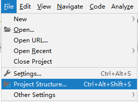
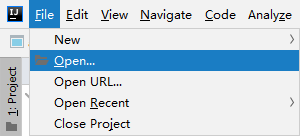
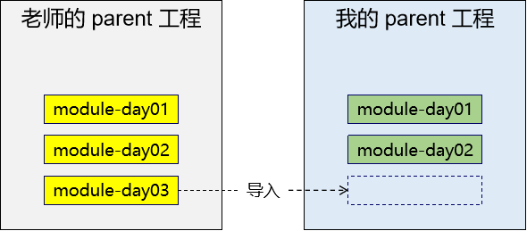

[代码重工 (gitee.io)](http://heavy_code_industry.gitee.io/code_heavy_industry/pro002-maven/)
# 第一章 Maven概述
## 第一节 为什么要学习 Maven？

- **管理规模庞大的 jar 包，需要专门工具。**
- **脱离 IDE 环境执行构建操作，需要专门工具。**
## 第二节 什么是 Maven？
Maven 是 Apache 软件基金会组织维护的一款专门为 Java 项目提供**构建**和**依赖**管理支持的工具。

### 1、构建
Java 项目开发过程中，构建指的是使用**『原材料生产产品』**的过程。

- 原材料
   - Java 源代码
   - 基于 HTML 的 Thymeleaf 文件
   - 图片
   - 配置文件
- 产品
   - 一个可以在服务器上运行的项目

构建过程包含的主要的环节：

- 清理：删除上一次构建的结果，为下一次构建做好准备
- 编译：Java 源程序编译成 *.class 字节码文件
- 测试：运行提前准备好的测试程序
- 报告：针对刚才测试的结果生成一个全面的信息
- 打包
   - Java工程：jar包
   - Web工程：war包
- 安装：把一个 Maven 工程经过打包操作生成的 jar 包或 war 包存入 Maven 仓库
- 部署
   - 部署 jar 包：把一个 jar 包部署到 Nexus 私服服务器上
   - 部署 war 包：借助相关 Maven 插件（例如 cargo），将 war 包部署到 Tomcat 服务器上
### 2、依赖
如果 A 工程里面用到了 B 工程的类、接口、配置文件等等这样的资源，那么我们就可以说 A 依赖 B。
依赖管理中要解决的具体问题：

- jar 包的下载：使用 Maven 之后，jar 包会从规范的远程仓库下载到本地
- jar 包之间的依赖：通过依赖的传递性自动完成
- jar 包之间的冲突：通过对依赖的配置进行调整，让某些jar包不会被导入
### 3、Maven 的工作机制

# 第二章 Maven 核心程序解压和配置
## 第一节 Maven核心程序解压与配置
### 1、Maven 官网地址
首页：
[Maven – Welcome to Apache Maven(opens new window)](https://maven.apache.org/)
下载页面：
[Maven – Download Apache Maven](https://maven.apache.org/download.cgi)

### 2、解压Maven核心程序
核心程序压缩包：apache-maven-3.8.4-bin.zip，解压到**非中文、没有空格**的目录。
在解压目录中，我们需要着重关注 Maven 的核心配置文件：`**conf/settings.xml**`
### 3、指定本地仓库
本地仓库默认值：用户家目录/.m2/repository。
```xml
<!-- localRepository
| The path to the local repository maven will use to store artifacts.
|
| Default: ${user.home}/.m2/repository
<localRepository>/path/to/local/repo</localRepository>
-->
<localRepository>D:\maven-repository</localRepository>
```
本地仓库这个目录，我们手动创建一个空的目录即可。
**记住**：一定要把 localRepository 标签**从注释中拿出来**。
**注意**：本地仓库本身也需要使用一个**非中文、没有空格**的目录。
### 4、配置阿里云镜像仓库
将下面 mirror 标签整体复制到 settings.xml 文件的 mirrors 标签的内部。
```xml
<mirror>
  <id>nexus-aliyun</id>
  <mirrorOf>central</mirrorOf>
  <name>Nexus aliyun</name>
  <url>http://maven.aliyun.com/nexus/content/groups/public</url>
</mirror>
```
### 5、配置 JDK 版本
如果按照默认配置运行，Java 工程使用的默认 JDK 版本是 1.5，而我们熟悉和常用的是 JDK 1.8 版本。
修改配置的方式是：将 profile 标签整个复制到 settings.xml 文件的 profiles 标签内。
```xml
<profile>
    <id>jdk-1.8</id>
    <activation>
        <activeByDefault>true</activeByDefault>
        <jdk>1.8</jdk>
    </activation>
    <properties>
        <maven.compiler.source>1.8</maven.compiler.source>
        <maven.compiler.target>1.8</maven.compiler.target>
        <maven.compiler.compilerVersion>1.8</maven.compiler.compilerVersion>
    </properties>
</profile>
```
## 第二节 配置环境变量
### 1、检查 JAVA_HOME 配置是否正确
Maven 是一个用 Java 语言开发的程序，它必须基于 JDK 来运行，需要通过 JAVA_HOME 来找到 JDK 的安装位置。

可以使用下面的命令验证：
```shell
C:\Users\KEFU>echo %JAVA_HOME%
C:\Program Files\Java\jdk1.8.0_301

C:\Users\KEFU>java -version
java version "1.8.0_301"
Java(TM) SE Runtime Environment (build 1.8.0_301-b09)
Java HotSpot(TM) 64-Bit Server VM (build 25.301-b09, mixed mode)
```
### 2、配置 MAVEN_HOME

> 配置环境变量的规律：
> XXX_HOME 通常指向的是 bin 目录的上一级
> PATH 指向的是 bin 目录

### 3、配置PATH

### 4、验证
```shell
C:\Users\KEFU>mvn -v
Apache Maven 3.8.4 (9b656c72d54e5bacbed989b64718c159fe39b537)
Maven home: D:\KEFU\apache-maven-3.8.4
Java version: 1.8.0_301, vendor: Oracle Corporation, runtime: C:\Program Files\Java\jdk1.8.0_301\jre
Default locale: zh_CN, platform encoding: GBK
OS name: "windows 10", version: "10.0", arch: "amd64", family: "windows"
```
# 第三章 使用 Maven：命令行环境
## 第一节 根据坐标创建 Maven 工程
### 1、Maven 核心概念：坐标
#### ①Maven中的坐标
**[1]向量说明:**
使用三个**『向量』**在**『Maven的仓库』**中**唯一**的定位到一个**『jar』**包。

- **groupId**：公司或组织的 id
- **artifactId**：一个项目或者是项目中的一个模块的 id
- **version**：版本号

**[2]三个向量的取值方式**

- groupId：公司或组织域名的倒序，通常也会加上项目名称
   - 例如：com.atguigu.maven
- artifactId：模块的名称，将来作为 Maven 工程的工程名
- version：模块的版本号，根据自己的需要设定
   - 例如：SNAPSHOT 表示快照版本，正在迭代过程中，不稳定的版本
   - 例如：RELEASE 表示正式版本
#### ②坐标和仓库 jar 包对应关系
坐标：
```xml
<groupId>javax.servlet</groupId>
<artifactId>servlet-api</artifactId>
<version>2.5</version>
```
上面坐标对应的 jar 包在 Maven 本地仓库中的位置：
`Maven本地仓库根目录\javax\servlet\servlet-api\2.5\servlet-api-2.5.jar`
### 2、实验操作
#### ①创建工作空间
例如：D:\maven-workspace\space201026
> 此时我们已经有了三个目录，分别是：
> - Maven 核心程序：中军大帐
> - Maven 本地仓库：兵营
> - 本地工作空间：战场

#### ②工作空间目录下打开命令行窗口
#### ③使用命令生成Maven工程

运行 `**mvn archetype:generate**` 命令
根据提示操作：
```shell
Choose a number or apply filter (format: [groupId:]artifactId, case sensitive contains): 7:	#【直接回车，使用默认值】
Define value for property 'groupId': com.atguigu.maven
Define value for property 'artifactId': pro01-maven-java
Define value for property 'version' 1.0-SNAPSHOT: :【直接回车，使用默认值】
Define value for property 'package' com.atguigu.maven: :【直接回车，使用默认值】
Confirm properties configuration:
groupId: com.atguigu.maven
artifactId: pro01-maven-java
version: 1.0-SNAPSHOT
package: com.atguigu.maven 
Y: :【直接回车，表示确认。如果前面有输入错误，想要重新输入，则输入 N 再回车。】
```
#### ④调整
Maven 默认生成的工程，对 junit 依赖的是较低的 3.8.1 版本，我们可以改成较适合的 4.12 版本。
自动生成的 App.java 和 AppTest.java 可以删除。
#### ⑤自动生成的 pom.xml 解读
```xml
<!-- 当前Maven工程的坐标 -->
<groupId>com.atguigu.maven</groupId>
<artifactId>pro01-maven-java</artifactId>
<version>1.0-SNAPSHOT</version>

<!-- 当前Maven工程的打包方式，可选值有下面三种： -->
<!-- jar：表示这个工程是一个Java工程  -->
<!-- war：表示这个工程是一个Web工程 -->
<!-- pom：表示这个工程是“管理其他工程”的工程 -->
<packaging>jar</packaging>

<name>pro01-maven-java</name>
<url>http://maven.apache.org</url>

<properties>
    <!-- 工程构建过程中读取源码时使用的字符集 -->
    <project.build.sourceEncoding>UTF-8</project.build.sourceEncoding>
</properties>

<!-- 当前工程所依赖的jar包 -->
<dependencies>
    <!-- 使用dependency配置一个具体的依赖 -->
    <dependency>

        <!-- 在dependency标签内使用具体的坐标依赖我们需要的一个jar包 -->
        <groupId>junit</groupId>
        <artifactId>junit</artifactId>
        <version>4.12</version>

        <!-- scope标签配置依赖的范围 -->
        <scope>test</scope>
    </dependency>
</dependencies>
```
### 3、Maven核心概念：POM
#### ①含义
POM：**P**roject **O**bject **M**odel，项目对象模型。和 POM 类似的是：DOM（Document Object Model），文档对象模型。它们都是模型化思想的具体体现。
#### ②模型化思想
POM 表示将工程抽象为一个模型，再用程序中的对象来描述这个模型。这样我们就可以用程序来管理项目了。我们在开发过程中，最基本的做法就是将现实生活中的事物抽象为模型，然后封装模型相关的数据作为一个对象，这样就可以在程序中计算与现实事物相关的数据。
#### ③对应的配置文件
POM 理念集中体现在 Maven 工程根目录下 **pom.xml** 这个配置文件中。所以这个 pom.xml 配置文件就是 Maven 工程的核心配置文件。其实学习 Maven 就是学这个文件怎么配置，各个配置有什么用。
### 4、Maven核心概念：约定的目录结构
#### ①各个目录的作用

另外还有一个 target 目录专门存放构建操作输出的结果。
#### ②约定目录结构的意义
Maven 为了让构建过程能够尽可能自动化完成，所以必须约定目录结构的作用。例如：Maven 执行编译操作，必须先去 Java 源程序目录读取 Java 源代码，然后执行编译，最后把编译结果存放在 target 目录。
#### ③约定大于配置
Maven 对于目录结构这个问题，没有采用配置的方式，而是基于约定。这样会让我们在开发过程中非常方便。如果每次创建 Maven 工程后，还需要针对各个目录的位置进行详细的配置，那肯定非常麻烦。
目前开发领域的技术发展趋势就是：**约定大于配置，配置大于编码**。
## 第二节 在 Maven 工程中编写代码
### 1、主体程序
主体程序指的是被测试的程序，同时也是将来在项目中真正要使用的程序。
```java
package com.atguigu.maven;
	
public class Calculator {
	public int sum(int i, int j){
		return i + j;
	}
}
```
### 2、测试程序
```java
package com.atguigu.maven;
    
import org.junit.Test;
import com.atguigu.maven.Calculator;
    
// 静态导入的效果是将Assert类中的静态资源导入当前类
// 这样一来，在当前类中就可以直接使用Assert类中的静态资源，不需要写类名
import static org.junit.Assert.*;
    
public class CalculatorTest{
    
    @Test
    public void testSum(){
        
        // 1.创建Calculator对象
        Calculator calculator = new Calculator();
        
        // 2.调用Calculator对象的方法，获取到程序运行实际的结果
        int actualResult = calculator.sum(5, 3);
        
        // 3.声明一个变量，表示程序运行期待的结果
        int expectedResult = 8;
        
        // 4.使用断言来判断实际结果和期待结果是否一致
        // 如果一致：测试通过，不会抛出异常
        // 如果不一致：抛出异常，测试失败
        assertEquals(expectedResult, actualResult);
        
    }
    
}
```
## 第三节 执行 Maven 的构建命令
### 1、要求
运行 Maven 中和构建操作相关的命令时，**必须进入到 pom.xml 所在的目录**。
> mvn -v 命令和构建操作无关，只要正确配置了 PATH，在任何目录下执行都可以。
> 而构建相关的命令要在 pom.xml 所在目录下运行——操作哪个工程，就进入这个工程的 pom.xml 目录。

### 2、清理操作
`mvn clean`
效果：删除 target 目录
### 3、编译操作
主程序编译：`mvn compile`
测试程序编译：`mvn test-compile`
主体程序编译结果存放的目录：target/classes
测试程序编译结果存放的目录：target/test-classes
### 4、测试操作
`mvn test`
测试的报告存放的目录：target/surefire-reports
### 5、打包操作
`mvn package`
打包的结果——jar 包，存放的目录：target
### 6、安装操作
`mvn install`
安装的效果是将本地构建过程中生成的 jar 包存入 Maven 本地仓库。
这个 jar 包在 Maven 仓库中的路径是根据它的坐标生成的。
安装操作还会将 pom.xml 文件转换为 XXX.pom 文件一起存入本地仓库。
## 第四节 创建 Maven 版的 Web 工程
### 1、说明
使用 mvn archetype:generate 命令生成 Web 工程时，需要使用一个专门的 archetype。
这个专门生成 Web 工程骨架的 archetype 可以参照官网看到它的用法：
[Maven Webapp Archetype – Maven Webapp Archetype (apache.org)](https://maven.apache.org/archetypes/maven-archetype-webapp/index.html)
参数 archetypeGroupId、archetypeArtifactId、archetypeVersion 用来指定现在使用的 maven-archetype-webapp 的坐标。
### 2、操作
注意：不能在 pom 的工程目录下执行 mvn archetype:generate 命令，否则会报错。
命令：
```shell
mvn archetype:generate -DarchetypeGroupId=org.apache.maven.archetypes -DarchetypeArtifactId=maven-archetype-webapp -DarchetypeVersion=1.4
```
### 3、生成的pom.xml
确认打包的方式是war包形式
`<packaging>war</packaging>`
### 4、生成的Web工程的目录结构

webapp 目录下有 index.jsp
WEB-INF 目录下有 web.xml
### 5、创建 Servlet
#### ①在 main 目录下创建 java 目录
#### ②在 java 目录下创建 Servlet 类所在的包的目录
#### ③在包下创建 Servlet 类
```java
package com.renchao.maven;

import javax.servlet.http.HttpServlet;
import javax.servlet.http.HttpServletRequest;
import javax.servlet.http.HttpServletResponse;
import javax.servlet.ServletException;
import java.io.IOException;

public class HelloServlet extends HttpServlet{
    
    protected void doGet(HttpServletRequest request, HttpServletResponse response) throws ServletException, IOException {
        
        response.getWriter().write("hello maven web");
        
    }
}
```
#### ④在 web.xml 中注册 Servlet
```xml
<servlet>
  <servlet-name>helloServlet</servlet-name>
  <servlet-class>com.renchao.maven.HelloServlet</servlet-class>
</servlet>
<servlet-mapping>
  <servlet-name>helloServlet</servlet-name>
  <url-pattern>/helloServlet</url-pattern>
</servlet-mapping>
```
### 6、在 index.jsp 页面编写超链接
```html
<html>
  <body>
    <h2>Hello World!</h2>
    <a href="helloServlet">Access Servlet</a>
  </body>
</html>
```
### 7、编译
此时直接执行 mvn compile 命令出错：
> 程序包 javax.servlet.http 不存在
> 程序包 javax.servlet 不存在
> 找不到符号
> 符号: 类 HttpServlet
> ……

上面的错误信息说明：我们的 Web 工程用到了 HttpServlet 这个类，而 HttpServlet 这个类属于 servlet-api.jar 这个 jar 包。
此时我们说，Web 工程需要依赖 servlet-api.jar 包。
### 8、配置对 servlet-api.jar 包的依赖
对于不知道详细信息的依赖可以到 **https://mvnrepository.com** 网站查询。
使用关键词搜索，然后在搜索结果列表中选择适合的使用。
比如，我们找到的 servlet-api 的依赖信息：
```xml
<dependency>
    <groupId>javax.servlet</groupId>
    <artifactId>javax.servlet-api</artifactId>
    <version>3.1.0</version>
    <scope>provided</scope>
</dependency>
```
这样就可以把上面的信息加入 pom.xml。重新执行 mvn compile 命令。
### 9、将 Web 工程打包为 war 包
运行 mvn package 命令，生成 war 包的位置
> maven工程目录/target

### 10、将 war 包部署到 Tomcat 上运行
将项目 war 包 或者文件夹复制到 Tomcat/webapps 目录下

启动 Tomcat。
然后访问：[http://localhost:8080/pro02-maven-web-1.0-SNAPSHOT/](http://localhost:8080/pro02-maven-web-1.0-SNAPSHOT/)
## 第五节 让 Web 工程依赖 Java 工程
### 1、观念
明确一个意识：
从来**只有 Web 工程依赖 Java 工程**，没有反过来 Java 工程依赖 Web 工程。
本质上来说，Web 工程依赖的 Java 工程其实就是 Web 工程里导入的 jar 包。
最终 Java 工程会变成 jar 包，放在 Web 工程的 WEB-INF/lib 目录下。
### 2、操作
在 pro02-maven-web 工程的 pom.xml 中，找到 dependencies 标签，在 dependencies 标签中做如下配置：
```html
<!-- 配置对Java工程pro01-maven-java的依赖 -->
<!-- 具体的配置方式：在dependency标签内使用坐标实现依赖 -->
<dependency>
  <groupId>com.renchao.maven</groupId>
  <artifactId>pro01-maven-java</artifactId>
  <version>1.0-SNAPSHOT</version>
</dependency>
```
### 3、在 Web 工程中，编写测试代码
#### ①补充创建目录
pro02-maven-web**\src\test\java\com\atguigu\maven**
#### ②确认 Web 工程依赖了 junit
#### ③创建测试类
把 Java 工程的 CalculatorTest.java 类复制到 pro02-maven-wb**\src\test\java\com\atguigu\maven** 目录下
### 4、执行Maven命令
#### ①测试命令
`mvn test`
> 说明：测试操作中会提前自动执行编译操作，测试成功就说明编译也是成功的。

#### ②查看 war 包内的结构
`mvn package`
通过查看 war 包内的结构，我们看到被 Web 工程依赖的 Java 工程确实是会变成 Web 工程的 WEB-INF/lib 目录下的 jar 包。
#### ③查看依赖 jar 包列表
`mvn dependency:list`
```bash
[INFO] The following files have been resolved:
[INFO]    junit:junit:jar:4.11:test
[INFO]    com.renchao.maven:pro01-maven-java:jar:1.0-SNAPSHOT:compile
[INFO]    org.hamcrest:hamcrest-core:jar:1.3:test
[INFO]    javax.servlet:javax.servlet-api:jar:3.1.0:provided
[INFO]    org.apache.logging.log4j:log4j-api:jar:2.17.2:compile
[INFO]    org.apache.logging.log4j:log4j-core:jar:2.17.2:compile
```
说明：
javax.servlet:javax.servlet-api:jar:3.1.0:provided 格式显示的是一个 jar 包的坐标信息。格式是：
> `groupId:artifactId:打包方式:version:依赖的范围`

这样的格式虽然和我们 XML 配置文件中坐标的格式不同，但是本质上还是坐标信息。
将来从 Maven 命令的日志或错误信息中看到这样格式的信息，就能够识别出来这是坐标。
进而根据坐标到Maven 仓库找到对应的jar包，用这样的方式解决我们遇到的报错的情况。
#### ④树形结构查依赖信息
`mvn dependency:tree`
## 第六节 依赖范围
标签的位置：dependencies/dependency/**scope**
标签的可选值：**compile**、**test**、**provided**、system、runtime、**import**
### 1、compile 和 test 对比
|         | main目录（空间） | test目录（空间） | 开发过程（时间） | 部署到服务器（时间） |
| ------- | ---------------- | ---------------- | ---------------- | -------------------- |
| compile | 有效             | 有效             | 有效             | 有效                 |
| test    | 无效             | 有效             | 有效             | 无效                 |

### 2、compile 和 provided 对比
|          | main目录（空间） | test目录（空间） | 开发过程（时间） | 部署到服务器（时间） |
| -------- | ---------------- | ---------------- | ---------------- | -------------------- |
| compile  | 有效             | 有效             | 有效             | 有效                 |
| provided | 有效             | 有效             | 有效             | 无效                 |

### 3、结论

- **compile：**
通常使用的第三方框架的 jar 包这样在项目实际运行时真正要用到的 jar 包都是以 compile 范围进行依赖的。比如 SSM 框架所需jar包。
- **test：**
测试过程中使用的 jar 包，以 test 范围依赖进来。比如 junit。
- **provided：**
在开发过程中需要用到的“服务器上的 jar 包”通常以 provided 范围依赖进来。比如 servlet-api、jsp-api。
## 第七节 依赖的传递性
### 1、概念
A 依赖 B，B 依赖 C，那么在 A 没有配置对 C 的依赖的情况下，A 里面能不能直接使用 C？
### 2、传递的原则
在 A 依赖 B，B 依赖 C 的前提下，C 是否能够传递到 A，取决于 B 依赖 C 时使用的依赖范围。

- B 依赖 C 时使用 compile 范围：可以传递
- B 依赖 C 时使用 test 或 provided 范围：不能传递，所以需要这样的 jar 包时，就必须在需要的地方明确配置依赖才可以。
## 第八节 依赖的排除
### 1、概念
当 A 依赖 B，B 依赖 C 而且 C 可以传递到 A 的时候，A 不想要 C，需要在 A 里面把 C 排除掉。而往往这种情况都是为了避免 jar 包之间的冲突。

所以配置依赖的排除其实就是阻止某些 jar 包的传递。因为这样的 jar 包传递过来会和其他 jar 包冲突。
### 2、配置方式
```xml
<dependency>
    <groupId>com.renchao.maven</groupId>
    <artifactId>pro01-maven-java</artifactId>
    <version>1.0-SNAPSHOT</version>
    <scope>compile</scope>
    <!-- 使用excludes标签配置依赖的排除	-->
    <exclusions>
        <!-- 在exclude标签中配置一个具体的排除 -->
        <exclusion>
            <!-- 指定要排除的依赖的坐标（不需要写version） -->
            <groupId>commons-logging</groupId>
            <artifactId>commons-logging</artifactId>
        </exclusion>
    </exclusions>
</dependency>
```
## 第九节 继承
### 1、概念
Maven工程之间，A 工程继承 B 工程

- B 工程：父工程
- A 工程：子工程

本质上是 A 工程的 pom.xml 中的配置继承了 B 工程中 pom.xml 的配置。
### 2、作用
在父工程中统一管理项目中的依赖信息，具体来说是管理依赖信息的版本。
它的背景是：

- 对一个比较大型的项目进行了模块拆分。
- 一个 project 下面，创建了很多个 module。
- 每一个 module 都需要配置自己的依赖信息。

它背后的需求是：

- 在每一个 module 中各自维护各自的依赖信息很容易发生出入，不易统一管理。
- 使用同一个框架内的不同 jar 包，它们应该是同一个版本，所以整个项目中使用的框架版本需要统一。
- 使用框架时所需要的 jar 包组合（或者说依赖信息组合）需要经过长期摸索和反复调试，最终确定一个可用组合。这个耗费很大精力总结出来的方案不应该在新的项目中重新摸索。

通过在父工程中为整个项目维护依赖信息的组合既**保证了整个项目使用规范、准确的 jar 包**；又能够将**以往的经验沉淀**下来，节约时间和精力。
### 3、举例
在一个工程中依赖多个 Spring 的 jar 包
使用 Spring 时要求所有 Spring 自己的 jar 包版本必须一致。为了能够对这些 jar 包的版本进行统一管理，我们使用继承这个机制，将所有版本信息统一在父工程中进行管理。
### 4、操作
#### ①创建父工程
创建的过程和前面创建 pro01-maven-java 一样。
**mvn archetype:generate**
工程名称：pro03-maven-parent
工程创建好之后，要修改它的打包方式为 pom：
```xml
<groupId>com.renchao.maven</groupId>
<artifactId>pro03-maven-parent</artifactId>
<version>1.0-SNAPSHOT</version>
<!-- 当前工程作为父工程，它要去管理子工程，所以打包方式必须是 pom -->
<packaging>pom</packaging>
```
只有打包方式为 pom 的 Maven 工程能够管理其他 Maven 工程。
打包方式为 pom 的 Maven 工程中不写业务代码，它是专门管理其他 Maven 工程的工程。
#### ②创建模块工程
模块工程类似于 IDEA 中的 module，所以需要**进入 pro03-maven-parent 工程的根目录**，然后运行 **mvn archetype:generate** 命令来创建模块工程。
假设，我们创建三个模块工程：

#### ③父工程 pom.xml
下面 modules 和 module 标签是聚合功能的配置
```xml
<modules> 
  <module>pro04-maven-module</module>
  <module>pro05-maven-module</module>
  <module>pro06-maven-module</module>
</modules>
```
#### ④子工程pom.xml
```xml
<!-- 使用parent标签指定当前工程的父工程 -->
<parent>
	<!-- 父工程的坐标 -->
	<groupId>com.renchao.maven</groupId>
	<artifactId>pro03-maven-parent</artifactId>
	<version>1.0-SNAPSHOT</version>
</parent>

<!-- 子工程的坐标 -->
<!-- 如果子工程坐标中的groupId和version与父工程一致，那么可以省略 -->
<!-- <groupId>com.atguigu.maven</groupId> -->
<artifactId>pro04-maven-module</artifactId>
<!-- <version>1.0-SNAPSHOT</version> -->
```
#### ⑤父工程配置依赖的统一管理
```xml
<!-- 使用dependencyManagement标签配置对依赖的管理 -->
<!-- 被管理的依赖并没有真正被引入到工程 -->
<dependencyManagement>
	<dependencies>
		<dependency>
			<groupId>org.springframework</groupId>
			<artifactId>spring-core</artifactId>
			<version>4.0.0.RELEASE</version>
		</dependency>
		<dependency>
			<groupId>org.springframework</groupId>
			<artifactId>spring-beans</artifactId>
			<version>4.0.0.RELEASE</version>
		</dependency>
		<dependency>
			<groupId>org.springframework</groupId>
			<artifactId>spring-context</artifactId>
			<version>4.0.0.RELEASE</version>
		</dependency>
		<dependency>
			<groupId>org.springframework</groupId>
			<artifactId>spring-expression</artifactId>
			<version>4.0.0.RELEASE</version>
		</dependency>
		<dependency>
			<groupId>org.springframework</groupId>
			<artifactId>spring-aop</artifactId>
			<version>4.0.0.RELEASE</version>
		</dependency>
	</dependencies>
</dependencyManagement>
```
#### ⑥子工程引用父工程管理的依赖
关键点：省略版本号
```xml
<!-- 子工程引用父工程中的依赖信息时，可以把版本号去掉。	-->
<!-- 把版本号去掉就表示子工程中这个依赖的版本由父工程决定。 -->
<!-- 具体来说是由父工程的dependencyManagement来决定。 -->
<dependencies>
	<dependency>
		<groupId>org.springframework</groupId>
		<artifactId>spring-core</artifactId>
	</dependency>
	<dependency>
		<groupId>org.springframework</groupId>
		<artifactId>spring-beans</artifactId>
	</dependency>
	<dependency>
		<groupId>org.springframework</groupId>
		<artifactId>spring-context</artifactId>
	</dependency>
	<dependency>
		<groupId>org.springframework</groupId>
		<artifactId>spring-expression</artifactId>
	</dependency>
	<dependency>
		<groupId>org.springframework</groupId>
		<artifactId>spring-aop</artifactId>
	</dependency>
</dependencies>
```
#### ⑦父工程中声明自定义属性
```xml
<!-- 通过自定义属性，统一指定Spring的版本 -->
<properties>
	<project.build.sourceEncoding>UTF-8</project.build.sourceEncoding>
	
	<!-- 自定义标签，维护Spring版本数据 -->
	<renchao.spring.version>4.3.6.RELEASE</renchao.spring.version>
</properties>
```
在需要的地方使用${}的形式来引用自定义的属性名：
```xml
<dependency>
  <groupId>org.springframework</groupId>
  <artifactId>spring-core</artifactId>
  <version>${renchao.spring.version}</version>
</dependency>
```
真正实现“一处修改，处处生效”。
### 5、实际意义

编写一套符合要求、开发各种功能都能正常工作的依赖组合并不容易。如果公司里已经有人总结了成熟的组合方案，那么再开发新项目时，如果不使用原有的积累，而是重新摸索，会浪费大量的时间。为了提高效率，我们可以使用工程继承的机制，让成熟的依赖组合方案能够保留下来。
如上图所示，公司级的父工程中管理的就是成熟的依赖组合方案，各个新项目、子系统各取所需即可。
## 第十节 聚合
### 1、聚合本身的含义
部分组成整体
### 2、Maven 中的聚合
使用一个“总工程”将各个“模块工程”汇集起来，作为一个整体对应完整的项目。

- 项目：整体
- 模块：部分
> 概念的对应关系：
> 从继承关系角度来看：
> - 父工程
> - 子工程
>
> 从聚合关系角度来看：
> - 总工程
> - 模块工程

### 3、好处

- 一键执行 Maven 命令：很多构建命令都可以在“总工程”中一键执行。以 mvn install 命令为例：Maven 要求有父工程时先安装父工程；有依赖的工程时，先安装被依赖的工程。我们自己考虑这些规则会很麻烦。但是工程聚合之后，在总工程执行 mvn install 可以一键完成安装，而且会自动按照正确的顺序执行。
- 配置聚合之后，各个模块工程会在总工程中展示一个列表，让项目中的各个模块一目了然。
### 4、聚合的配置
在总工程中配置 modules 即可：
```xml
<modules>  
  <module>pro04-maven-module</module>
  <module>pro05-maven-module</module>
  <module>pro06-maven-module</module>
</modules>
```
### 5、依赖循环问题
如果 A 工程依赖 B 工程，B 工程依赖 C 工程，C 工程又反过来依赖 A 工程，那么在执行构建操作时会报下面的错误：
> [ERROR] [ERROR] The projects in the reactor contain a cyclic reference:

这个错误的含义是：循环引用。
# 第四章 使用Maven：IDEA环境
## 第一节 创建父工程
### 1、创建 Project


### 2、开启自动导入
创建 Project 后，IDEA 会自动弹出下面提示，我们选择**『Enable Auto-Import』**，意思是启用自动导入。

这个自动导入**一定要开启**，因为 Project、Module 新创建或 pom.xml 每次修改时都应该让 IDEA 重新加载 Maven 信息。这对 Maven 目录结构认定、Java 源程序编译、依赖 jar 包的导入都有非常关键的影响。
另外也可以通过 IDEA 的 Settings 设置来开启：

## 第二节 配置Maven信息
每次创建 Project 后都需要设置 Maven 家目录位置，否则 IDEA 将使用内置的 Maven 核心程序（不稳定）并使用默认的本地仓库位置。这样一来，我们在命令行操作过程中已下载好的 jar 包就白下载了，默认的本地仓库通常在 C 盘，还影响系统运行。
配置之后，IDEA 会根据我们在这里指定的 Maven 家目录自动识别到我们在 settings.xml 配置文件中指定的本地仓库。

## 第三节 创建Java模块工程


## 第四节 创建Web模块工程
### 1、创建模块
按照前面的同样操作创建模块，**此时**这个模块其实还是一个**Java模块**。
### 2、修改打包方式
Web 模块将来打包当然应该是 **war** 包。
`<packaging>war</packaging>`
### 3、Web 设定
首先打开项目结构菜单：

然后到 Facets 下查看 IDEA 是否已经帮我们自动生成了 Web 设定。正常来说只要我们确实设置了打包方式为 war，那么 IDEA 2019 版就会自动生成 Web 设定。

### 4、借助IDEA生成web.xml


### 5、设置 Web 资源的根目录
结合 Maven 的目录结构，Web 资源的根目录需要设置为 src/main/webapp 目录。

## 第五节 其他操作
### 1、在IDEA中执行Maven命令
#### ①直接执行

#### ②手动输入


如果有需要，还可以给命令后面附加参数：

```shell
# -D 表示后面要附加命令的参数，字母 D 和后面的参数是紧挨着的，中间没有任何其它字符
# maven.test.skip=true 表示在执行命令的过程中跳过测试
mvn clean install -Dmaven.test.skip=true
```
### 2、查看依赖信息

### 3、工程导入
Maven工程除了自己创建的，还有很多情况是别人创建的。而为了参与开发或者是参考学习，我们都需要导入到 IDEA 中。下面我们分几种不同情况来说明：
#### ①来自版本控制系统
目前我们通常使用的都是 Git（本地库） + 码云（远程库）的版本控制系统，结合 IDEA 的相关操作方式请点[这里(opens new window)](http://heavy_code_industry.gitee.io/code_heavy_industry/pro008-Git/lecture/chapter05/verse03.html)查看**克隆远程库**部分。
#### ②来自工程目录
直接使用 IDEA 打开工程目录即可。下面咱们举个例子：

1. 工程压缩包
假设别人发给我们一个 Maven 工程的 zip 压缩包：maven-rest-demo.zip。从码云或GitHub上也可以以 ZIP 压缩格式对项目代码打包下载。
1. 解压
如果你的所有 IDEA 工程有一个专门的目录来存放，而不是散落各处，那么首先我们就把 ZIP 包解压到这个指定目录中。
1. 打开
只要我们确认在解压目录下可以直接看到 pom.xml，那就能证明这个解压目录就是我们的工程目录。那么接下来让 IDEA 打开这个目录就可以了。


1. 设置 Maven 核心程序位置
打开一个新的 Maven 工程，和新创建一个 Maven 工程是一样的，此时 IDEA 的 settings 配置中关于 Maven 仍然是默认值。
所以我们还是需要像新建 Maven 工程那样，指定一下 Maven 核心程序位置。
### 4、模块导入
#### ①情景重现
在实际开发中，通常会忽略模块（也就是module）所在的项目（也就是project）仅仅导入某一个模块本身。这么做很可能是类似这样的情况：比如基于 Maven 学习 SSM 的时候，做练习需要导入老师发给我们的代码参考。

#### ②导入 Java 类型模块

1. 找到老师发的工程目录
  

2. 复制我们想要导入的模块目录
  

3. 粘贴到我们自己工程目录下
  这个工程（project）是我们事先在 IDEA 中创建好的。
  
  

4. 在 IDEA 中执行导入
  
  
  
  

5. 修改 pom.xml
  刚刚导入的 module 的父工程坐标还是以前的，需要改成我们自己的 project。
  

  
1. 最终效果

#### ③导入 Web 类型模块
其它操作和上面演示的都一样，只是多一步：删除多余的、不正确的 web.xml 设置。如下图所示：

# 第五章 其他核心概念
## 第一节 生命周期
### 1、作用
为了让构建过程自动化完成，Maven 设定了三个生命周期，生命周期中的每一个环节对应构建过程中的一个操作。
### 2、三个生命周期
| **生命周期名称**                                             | **作用**     | **各个环节** |
| ------------------------------------------------------------ | ------------ | ------------ |
| Clean                                                        | 清理操作相关 | pre-clean    |
| clean                                                        |              |              |
| post-clean                                                   |              |              |
| Site                                                         | 生成站点相关 | pre-site     |
| site                                                         |              |              |
| post-site                                                    |              |              |
| deploy-site                                                  |              |              |
| Default                                                      | 主要构建过程 | validate     |
| generate-sources                                             |              |              |
| process-sources                                              |              |              |
| generate-resources                                           |              |              |
| process-resources 复制并处理资源文件，至目标目录，准备打包。 |              |              |
| compile 编译项目 main 目录下的源代码。                       |              |              |
| process-classes                                              |              |              |
| generate-test-sources                                        |              |              |
| process-test-sources                                         |              |              |
| generate-test-resources                                      |              |              |
| process-test-resources 复制并处理资源文件，至目标测试目录。  |              |              |
| test-compile 编译测试源代码。                                |              |              |
| process-test-classes                                         |              |              |
| test 使用合适的单元测试框架运行测试。这些测试代码不会被打包或部署。 |              |              |
| prepare-package                                              |              |              |
| package 接受编译好的代码，打包成可发布的格式，如JAR。        |              |              |
| pre-integration-test                                         |              |              |
| integration-test                                             |              |              |
| post-integration-test                                        |              |              |
| verify                                                       |              |              |
| install将包安装至本地仓库，以让其它项目依赖。                |              |              |
| deploy将最终的包复制到远程的仓库，以让其它开发人员共享；或者部署到服务器上运行（需借助插件，例如：cargo）。 |              |              |

### 3、特点

- 前面三个生命周期**彼此是独立**的。
- 在任何一个生命周期内部，执行任何一个具体环节的操作，都是从本周期最初的位置开始执行，直到指定的地方。（本节记住这句话就行了，其他的都不需要记）

Maven 之所以这么设计其实就是为了提高构建过程的自动化程度：让使用者只关心最终要干的即可，过程中的各个环节是自动执行的。
## 第二节 插件和目标
### 1、插件
Maven 的核心程序仅仅负责宏观调度，不做具体工作。具体工作都是由 Maven 插件完成的。
例如：编译就是由 maven-compiler-plugin-3.1.jar 插件来执行的。
### 2、目标
一个插件可以对应多个目标，而每一个目标都和生命周期中的某一个环节对应。
Default 生命周期中有 compile 和 test-compile 两个和编译相关的环节，这两个环节对应 compile 和 test-compile 两个目标，而这两个目标都是由 maven-compiler-plugin-3.1.jar 插件来执行的。
## 第三节 仓库

- 本地仓库：在当前电脑上，为电脑上所有 Maven 工程服务
- 远程仓库：需要联网
   - 局域网：我们自己搭建的 Maven 私服，例如使用 Nexus 技术。
   - Internet
      - 中央仓库
      - 镜像仓库：内容和中央仓库保持一致，但是能够分担中央仓库的负载，同时让用户能够就近访问提高下载速度，例如：Nexus aliyun
> **建议：**不要中央仓库和阿里云镜像混用，否则 jar 包来源不纯，彼此冲突。

专门搜索 Maven 依赖信息的网站：https://mvnrepository.com/