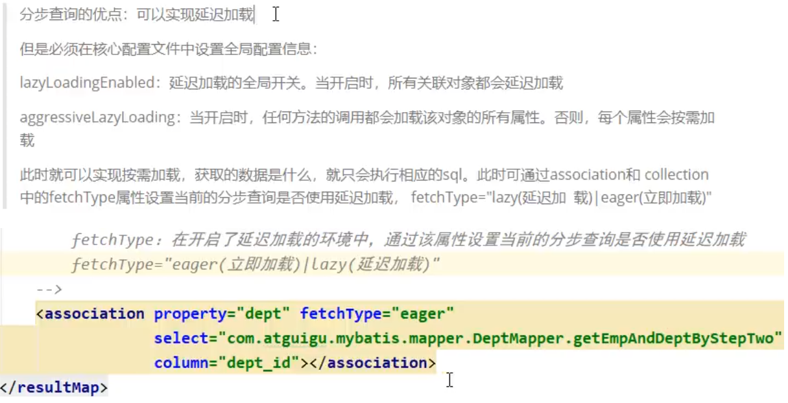
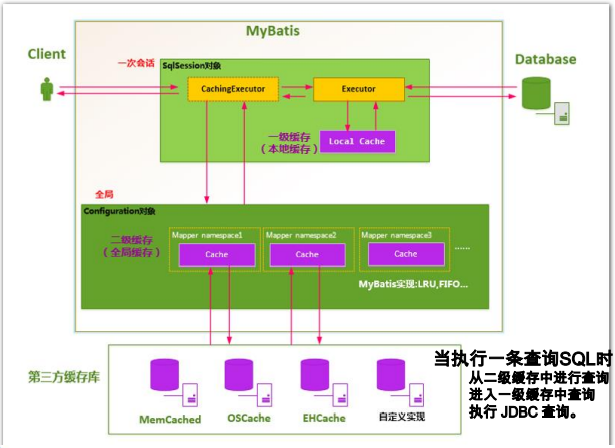
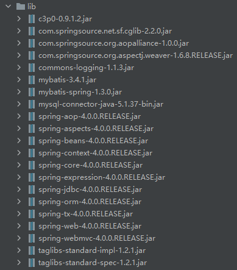

# 一、MyBatis简介

## 1、学习资料

[尚硅谷MyBatis实战教程全套完整版(初学者零基础从入门到精通,好评如潮,资料齐全)_哔哩哔哩_bilibili](https://www.bilibili.com/video/BV1mW411M737)

[【尚硅谷】2022版MyBatis教程（细致全面，快速上手）_哔哩哔哩_bilibili](https://www.bilibili.com/video/BV1VP4y1c7j7)

实例：IdeaProjects\MyBatis03

## 2、去哪里找MyBatis？

[GitHub - mybatis/mybatis-3](https://github.com/mybatis/mybatis-3/)

# 二、MyBatis-HelloWorld

## 1、HelloWorld简单版

- 创建一张测试表 

- 创建对应的javaBean

- 创建mybatis配置文件，sql映射文件

- 测试


1. ##### 创建MyBatis全局配置文件

   ```xml
   <?xml version="1.0" encoding="UTF-8" ?>
   <!DOCTYPE configuration
           PUBLIC "-//mybatis.org//DTD Config 3.0//EN"
           "http://mybatis.org/dtd/mybatis-3-config.dtd">
   <configuration>
       <environments default="development">
           <environment id="development">
               <transactionManager type="JDBC"/>
               <dataSource type="POOLED">
                   <property name="driver" value="com.mysql.jdbc.Driver"/>
                   <property name="url" value="jdbc:mysql://localhost:3306/book"/>
                   <property name="username" value="root"/>
                   <property name="password" value="123"/>
               </dataSource>
           </environment>
       </environments>
       <mappers>
           <mapper resource="UserMapper.xml"/>
           <mapper resource="UserMapper_2.xml"/>
       </mappers>
   </configuration>
   ```

2. ##### 创建SQL映射文件

   ```xml
   <?xml version="1.0" encoding="UTF-8" ?>
   <!DOCTYPE mapper
           PUBLIC "-//mybatis.org//DTD Mapper 3.0//EN"
           "http://mybatis.org/dtd/mybatis-3-mapper.dtd">
   <mapper namespace="com.chaoRen.myBatis.dao.UserMapper">
       <select id="getUserById" resultType="com.chaoRen.myBatis.bean.User">
           select * from t_user where id = #{id}
       </select>
   </mapper>
   ```

3. ##### 配置log4j

   ```xml
   <?xml version="1.0" encoding="UTF-8" ?>
   <!DOCTYPE log4j:configuration SYSTEM "log4j.dtd">
   <log4j:configuration xmlns:log4j="http://jakarta.apache.org/log4j/">
       <appender name="STDOUT" class="org.apache.log4j.ConsoleAppender">
           <param name="Encoding" value="UTF-8"/>
           <layout class="org.apache.log4j.PatternLayout">
               <param name="ConversionPattern" value="%-5p %d{MM-dd HH:mm:ss,SSS} %m  (%F:%L) \n"/>
           </layout>
       </appender>
       <logger name="java.sql">
           <level value="debug"/>
       </logger>
       <logger name="org.apache.ibatis">
           <level value="info"/>
       </logger>
       <root>
           <level value="debug"/>
           <appender-ref ref="STDOUT"/>
       </root>
   </log4j:configuration>
   ```

4. ##### 测试

   ```JAVA
   String resource = "mybatis-config.xml";
   InputStream inputStream = Resources.getResourceAsStream(resource);
   SqlSessionFactory sqlSessionFactory = SqlSessionFactoryBuilder().build(inputStream);
   try (SqlSession sqlSession = sqlSessionFactory.openSession()) {
       User user = sqlSession.selectOne("com.chaoRen.myBatis.selectUser", 5);
       System.out.println(user);
   }
   
   ```

## 2、HelloWorld-接口式编程

- – 创建一个Dao接口 
- – 修改Mapper文件 
- – 测试

```xml
<!--绑定dao接口全类名-->
<mapper namespace="com.chaoRen.myBatis.dao.UserMapper">
    <select id="getUserById" resultType="com.chaoRen.myBatis.bean.User">
        select * from t_user where id = #{id}
    </select>
</mapper>
```

使用SqlSession获取映射器进行操作

```java
String resource = "mybatis-config.xml";
InputStream inputStream = Resources.getResourceAsStream(resource);
SqlSessionFactory sqlSessionFactory = SqlSessionFactoryBuilder().build(inputStream);
try (SqlSession sqlSession = sqlSessionFactory.openSession()) {
    UserMapper userMapper = sqlSession.getMapper(UserMapper.class);
    System.out.println(userMapper.getClass());
    User user = userMapper.getUserById(5);
    System.out.println(user);
}
```

- ### SqlSession

1. SqlSession 的实例<u>**不是线程安全**</u>的，因此是不能 被共享的。
2. SqlSession每次**使用完成后需要正确关闭**，这个 关闭操作是必须的。
3. SqlSession可以直接调用方法的id进行数据库操作，但是我们一般还是推荐使用SqlSession获取 到Dao接口的代理类，执行代理对象的方法，可以更安全的进行类型检查操作

# 三、MyBatis-全局配置文件

MyBatis 的配置文件包含了会深深影响 MyBatis 行为的设置和属性信息。 配置文档的顶层结构如下：

- configuration（配置）

  - [properties（属性）](https://mybatis.org/mybatis-3/zh/configuration.html#properties)
  - [settings（设置）](https://mybatis.org/mybatis-3/zh/configuration.html#settings)
  - [typeAliases（类型别名）](https://mybatis.org/mybatis-3/zh/configuration.html#typeAliases)
  - [typeHandlers（类型处理器）](https://mybatis.org/mybatis-3/zh/configuration.html#typeHandlers)
  - [objectFactory（对象工厂）](https://mybatis.org/mybatis-3/zh/configuration.html#objectFactory)
  - [plugins（插件）](https://mybatis.org/mybatis-3/zh/configuration.html#plugins)
  - [environments（环境配置）](https://mybatis.org/mybatis-3/zh/configuration.html#environments)
    - environment（环境变量）
      - transactionManager（事务管理器）
      - dataSource（数据源）
  - [databaseIdProvider（数据库厂商标识）](https://mybatis.org/mybatis-3/zh/configuration.html#databaseIdProvider)
  - [mappers（映射器）](https://mybatis.org/mybatis-3/zh/configuration.html#mappers)

  

# 四、MyBatis-映射文件

映射文件指导着MyBatis如何进行数据库增删改查， 有着非常重要的意义。

SQL 映射文件只有很少的几个顶级元素（按照应被定义的顺序列出）：

- `cache` – 该命名空间的缓存配置。
- `cache-ref` – 引用其它命名空间的缓存配置。
- `resultMap` – 描述如何从数据库结果集中加载对象，是最复杂也是最强大的元素。
- ~~`parameterMap`~~ – 老式风格的参数映射。此元素已被废弃，并可能在将来被移除！请使用行内参数映射。文档中不会介绍此元素。
- `sql` – 可被其它语句引用的可重用语句块。
- `insert` – 映射插入语句。
- `update` – 映射更新语句。
- `delete` – 映射删除语句。
- `select` – 映射查询语句。

## 1、增删改查

```xml
<?xml version="1.0" encoding="UTF-8" ?>
<!DOCTYPE mapper
        PUBLIC "-//mybatis.org//DTD Mapper 3.0//EN"
        "http://mybatis.org/dtd/mybatis-3-mapper.dtd">
<mapper namespace="com.chaoRen.myBatis.dao.UserMapper">
<!--    User getUserById(Integer id);-->
    <select id="getUserById" resultType="com.chaoRen.myBatis.bean.User">
        select * from t_user where id = #{id}
    </select>
<!--    int deleteUserById(Integer id);-->
    <delete id="deleteUserById">
        delete from t_user where id=#{id}
    </delete>
<!--    List<User> getAllUser();-->
    <select id="getAllUser" resultType="User">
        select * from t_user
    </select>
<!--    int addUser(User user);-->
    <insert id="addUser">
        insert into t_user(user_name,password,email) values (#{userName},#{password},#{email})
    </insert>
<!--    int updateUser(User user);-->
    <update id="updateUser">
        update t_user set user_name=#{userName},password=#{password},email=#{email} where id=#{id}
    </update>
</mapper>
```

## 2、insert获取自增主键的值

```xml
<!--useGeneratedKeys="true" 获取主键值-->
<!--keyProperty="id" 获取到主键，封装给对应的对象属性-->
<insert id="addUser" useGeneratedKeys="true" keyProperty="id">
    insert into t_user(user_name,password,email) values (#{userName},#{password},#{email})
</insert>
```

## 3、主键生成方式(Oracle)

而对于不支持自增型主键的数据库（例如 Oracle），则可以使用 selectKey 子元素：

 selectKey 元素将会首先运行，id 会被设置，然 后插入语句会被调用

 

## 4、参数（Parameters）传递

1. ##### 单个参数

   可以接受基本类型，对象类型，集合类型的值。这种情况
   MyBatis可直接使用这个参数，不需要经过任何处理。

2. ##### 多个参数

   任意多个参数，都会被MyBatis重新包装成一个Map传入。
   Map的key是`param1，param2...`或者`0，1...`，值就是参数的值。

   > **注意**：在mybatis后来的版本（3.4.2之后）中，使用`arg0`来代替`0`。

   ```xml
   <select id="getUserByIdAndName" resultType="com.chaoRen.myBatis.bean.User">
       select * from t_user where id = #{param1} and user_name=#{param2}
   </select>
   ```

3. ##### 命名参数

   为参数使用@Param起一个名字，MyBatis就会将这些参数封
   装进map中，key就是我们自己指定的名字

   ```java
   User getUserByIdAndName(@Param("id") int id,@Param("name") String name);
   ```

   ```xml
   <select id="getUserByIdAndName" resultType="com.chaoRen.myBatis.bean.User">
   	select * from t_user where id = #{id} and user_name=#{name}
   </select>
   ```

4. ##### POJO

   当这些参数属于我们业务POJO时，我们直接传递POJO

   ```java
   public class User {
       private Integer id;
       private String userName;
       private String password;
       private String email;
   }
   ```

   ```java
   public interface UserMapper {
       int addUser(User user);
   }
   ```

   ```xml
   <!--useGeneratedKeys="true" 获取主键值-->
   <!--keyProperty="id" 获取到主键，封装给对应的对象属性-->
   <insert id="addUser" useGeneratedKeys="true" keyProperty="id">
       insert into t_user(user_name,password,email) values (#{userName},#{password},#{email})
   </insert>
   ```

5. ##### Map

   我们也可以封装多个参数为map，直接传递
   
   ```xml
   <!--User getUserByMap(Map<String,Object> map);-->
   <select id="getUserByMap" resultType="com.chaoRen.myBatis.bean.User">
       select * from t_user where id = #{id} and user_name=#{userName}
   </select>
   ```
   
   ```java
   @Test
   public void getUserByMap() throws IOException {
       SqlSessionFactory sessionFactory = getSqlSession();
       Map<String, Object> map = new HashMap<>();
       map.put("id", 11);
       map.put("userName", "任超");
       try (SqlSession sqlSession = sessionFactory.openSession()) {
           UserMapper mapper = sqlSession.getMapper(UserMapper.class);
           User user = mapper.getUserByMap(map);
           System.out.println(user);
       }
   }
   ```

  

## 5、#{key} 和 ${key}

- ##### 参数也可以指定一个特殊的数据类型：

   

  1. javaType 通常可以从参数对象中来去确定 

  2. 如果 null 被当作值来传递，对于所有可能为空的列， jdbcType 需要被设置 

  3. 对于数值类型，还可以设置小数点后保留的位数： 

  4. mode 属性允许指定 IN，OUT 或 INOUT 参数。

     如果参数 为 OUT 或 INOUT，参数对象属性的真实值将会被改变， 就像在获取输出参数时所期望的那样。

- ##### 参数位置支持的属性

  - javaType
  - jdbcType
  - mode
  - numericScale
  - resultMap
  - typeHandler
  - jdbcTypeName
  - expression

- ##### 实际上通常被设置的是：

  - 可能为空的列名指定 jdbcType

- ##### #{key}和${key}的区别

  - **#{key}**：获取参数的值，预编译到SQL中。安全。 

  - **${key}**：获取参数的值，拼接到SQL中。

    有SQL注入问 题。

    ORDER BY ${name}

    注意加引号

## 6、select元素

- Select元素来定义查询操作。 

- Id：唯一标识符。 

  - 用来引用这条语句，需要和接口的方法名一致 

- parameterType：参数类型。 

  - 可以不传，MyBatis会根据TypeHandler自动推断 

- resultType：返回值类型。 

  - 别名或者全类名，如果返回的是集合，定义集合中元 素的类型。不能和resultMap同时使用
  
  **记录封装map**:
  
  ```java
  //告诉MyBatis封装的时候那个属性作为Map的Key值
  @MapKey("id")
  Map<Integer, User> getAllUserMap();
  ```
  
  ```xml
  <select id="getAllUserMap" resultType="map">
      select * from t_user
  </select>
  ```

## 7、自动映射

1. #### 全局setting设置

   - autoMappingBehavior默认是PARTIAL，开启自动映射的功能。唯一的要求是列名和javaBean属性名一致 
   - 如果autoMappingBehavior设置为null则会取消自动映射 
   - 数据库字段命名规范，POJO属性符合驼峰命名法，如 A_COLUMN > aColumn，我们可以开启自动驼峰命名规 则映射功能，mapUnderscoreToCamelCase=true。

2. #### 自定义resultMap。

   **简单映射**

   ```xml
   <!--column:数据库属性。property:Bean属性-->
   <!--如果不指定映射，会自动封装，一般都会指定，全部写上-->
   <resultMap id="MyUser" type="com.chaoRen.myBatis.bean.User">
       <result column="id" property="id"/>
       <result column="user_name" property="userName"/>
       <result column="password" property="password"/>
       <result column="email" property="email"/>
   </resultMap>
   
   <select id="getUserById" resultMap="MyUser">
       select * from t_user where id = #{id}
   </select>
   ```

   

   **多对一关联映射关系**

   方法一：级联属性封装结果

   ```xml
   <resultMap id="student2" type="com.chaoRen.bean.Student">
       <result column="sid" property="id"/>
       <result column="sname" property="name"/>
       <result column="sage" property="age"/>
       <result column="t_id" property="teacher.id"/>
       <result column="tname" property="teacher.name"/>
       <result column="tage" property="teacher.age"/>
   </resultMap>
   
   <select id="getStudent2" resultMap="student2">
       select student.id sid,
       student.name sname,
       student.age sage,
       t_id,
       teacher.name tname,
       teacher.age tage
       from student,teacher
       where t_id=teacher.id
   </select>
   ```

   

   方法二：association关联对象封装结果

   ```xml
   <resultMap id="student2" type="com.chaoRen.bean.Student">
       <result column="sid" property="id"/>
       <result column="sname" property="name"/>
       <result column="sage" property="age"/>
       <association property="teacher" javaType="com.chaoRen.bean.Teacher">
           <result column="t_id" property="id"/>
           <result column="tname" property="name"/>
           <result column="tage" property="age"/>
       </association>
   </resultMap>
   
   <select id="getStudent2" resultMap="student2">
       select student.id sid,
       student.name sname,
       student.age sage,
       t_id,
       teacher.name tname,
       teacher.age tage
       from student,teacher
       where t_id=teacher.id
   </select>
   ```

   

   方法三：association分步查询

   ```xml
   <resultMap id="student" type="com.chaoRen.bean.Student">
       <result column="id" property="id"/>
       <result column="name" property="name"/>
       <result column="age" property="age"/>
       <association property="teacher" column="t_id" javaType="com.chaoRen.bean.Teacher" select="getTeacher"/>
   </resultMap>
   
   <select id="getStudent" resultMap="student">
       select * from student
   </select>
   
   <select id="getTeacher" resultType="com.chaoRen.bean.Teacher">
       select * from teacher where id=#{tId}
   </select>
   ```

   

   **一对多的映射关系**

   方法一：collection关联对象封装结果

   ```xml
   <resultMap id="teacher1" type="com.chaoRen.bean.Teacher">
       <result column="t_id" property="id"/>
       <result column="tname" property="name"/>
       <result column="tage" property="age"/>
       <collection property="students" ofType="com.chaoRen.bean.Student">
           <result column="sid" property="id"/>
           <result column="sname" property="name"/>
           <result column="sage" property="age"/>
       </collection>
   </resultMap>
   
   <select id="getTeacher" resultMap="teacher1">
       select  t_id,
       teacher.name tname,
       teacher.age tage,
       student.id sid,
       student.name sname,
       student.age sage
       from teacher,student
       where teacher.id=#{sId}
   </select>
   ```

   

   方法二：collection分步查询

   ```xml
   <resultMap id="teacher2" type="com.chaoRen.bean.Teacher">
       <result column="id" property="id"/>
       <collection property="students" column="id" javaType="List" 
                   ofType="com.chaoRen.bean.Student" select="getStudents"/>
   </resultMap>
   
   <select id="getTeacher2" resultMap="teacher2">
       select * from teacher where id=#{tId}
   </select>
   
   <select id="getStudents" resultType="com.chaoRen.bean.Student">
       select * from student where t_id=#{tId}
   </select>
   ```

   

   开启延迟加载和属性按需加载

   ```xml
   <settings>
       <setting name="lazyLoadingEnabled" value="true"/>
       <setting name="aggressiveLazyLoading" value="true"/>
   </settings>
   ```

   - association或者collection标签的 fetchType=eager/lazy可以覆盖全局的延迟加载策略， 指定立即加载（eager）或者延迟加载（lazy）

   

3. #### 扩展-多列值封装map传递

   - 分步查询的时候通过column指定，将对应的列的数据 传递过去，我们有时需要传递多列数据。 
   - 使用{key1=column1,key2=column2…}的形式

    

## 8、延迟加载




# 五、MyBatis-动态SQL

1. 动态 SQL是MyBatis强大特性之一。极大的简化我们拼装 SQL的操作。 
2. 动态 SQL 元素和使用 JSTL 或其他类似基于 XML 的文本处 理器相似。
3. MyBatis 采用功能强大的基于 OGNL 的表达式来简化操作。 

## 1、where和if一起使用

```xml
    <select id="getUserByIdAndName" resultType="com.chaoRen.myBatis.bean.User">
        select * from t_user
        <where>
            <if test="id != null">
                id = #{id}
            </if>
            <if test="name != null">
                or user_name = #{name}
            </if>
        </where>
    </select>
```

## 2、trim和if一起使用

```xml
    <!--prefix 前缀，给整个字符串加一个前缀-->
    <!--prefixOverrides 前缀覆盖，去掉整个字符串前面多余的字符-->
    <!--suffix 后缀，给整个字符串加一个后缀-->
    <!--suffixOverrides 后缀覆盖，去掉整个字符串后面多余的字符-->
    <select id="getUserByIdAndName" resultType="com.chaoRen.myBatis.bean.User">
        select * from t_user
        <trim prefix="where" suffixOverrides="and | or">
            <if test="id != null">
                id = #{id} or
            </if>
            <if test="name != null">
                user_name = #{name}
            </if>
        </trim>
    </select>
```

## 3、choose (when, otherwise)

```xml
<select id="getUserByIdAndName" resultType="com.chaoRen.myBatis.bean.User">
    select * from t_user
    <choose>
        <when test="id != null">
            where id = #{id}
        </when>
        <when test="name != null">
            where user_name=#{name}
        </when>
        <otherwise>
            where id=1
        </otherwise>
    </choose>
</select>
```

## 4、set和if一起使用

```xml
<update id="updateUser">
    update t_user
    <set>
        <if test="userName != null">
            user_name=#{userName},
        </if>
        <if test="password != null">
            password=#{password},
        </if>
        <if test="email != null">
            email=#{email}
        </if>
        where id = #{id}
    </set>
</update>
```

**也可以trim和if一起使用达到同样的效果**

## 5、foreach

```xml
    <!--
    collection:指定要遍历的集合,List集合>list。Array数组>array,或者使用@Param指定
    list类型的参数会特殊处理封装在map中，map的key就是list
    item:将当前遍历出的元素赋值给指定的变量
    separator:每个元素之间的分隔符
    open:遍历出所有结果拼接一个开始的字符
    close:遍历出所有结果拼接一个结束的字符
    index：索引。遍历list的时候index就是索引，item就是当前值
    遍历map的时候index表示的就是map的key,item就是map的值。
    -->
    <select id="getUserInId" resultType="com.chaoRen.myBatis.bean.User">
        select * from t_user where id in
        <foreach collection="list" item="id" separator="," open="(" close=")">
            #{id}
        </foreach>
    </select>
```

## 6、foreach批量插入

```xml
<insert id="addUser">
    insert into t_user(user_name, password, email) values
    <foreach collection="list" item="user" separator=",">
        (#{user.userName},#{user.password},#{user.email})
    </foreach>
</insert>
```

## 7、bind

bind 元素可以从 OGNL 表达式中创建一个变量并 将其绑定到上下文。比如：

```xml
    <select id="getUserByName" resultType="com.chaoRen.myBatis.bean.User">
        <bind name="_name" value="'%'+name+'%'"/>
        select * from t_user where user_name like #{_name}
    </select>
```

## 8、sql片段

```xml
    <sql id="mySelect">
        <foreach collection="array" item="id" separator="," open="(" close=")">
            #{id}
        </foreach>
    </sql>
    <select id="getUserInArr" resultType="com.chaoRen.myBatis.bean.User">
        select * from t_user where id in
        <include refid="mySelect"/>
    </select>
```

# 六、MyBatis-缓存机制

## 1、分为一级缓存和二级缓存。

1. SqlSession级别的缓存， 也称为本地缓存。
2. 二级缓存需要手动开启和配置，他是基于namespace级别的缓存。
3. 为了提高扩展性。MyBatis定义了缓存接口Cache。我们 可以通过实现Cache接口来自定义二级缓存。

## 2、一级缓存

- 一级缓存(local cache), 即本地缓存, 作用域默认 为sqlSession。当 Session flush 或 close 后, 该 Session 中的所有 Cache 将被清空。
- 本地缓存不能被关闭, 但可以调用 clearCache()  来清空本地缓存, 或者改变缓存的作用域。
- 在mybatis3.1之后, 可以配置本地缓存的作用域.  在 mybatis.xml 中配。

## 3、一级缓存失效情况

同一次会话期间只要查询过的数据都会保存在当 前SqlSession的一个Map中

> key:hashCode+查询的SqlId+编写的sql查询语句+参数


一级缓存失效的四种情况

1. 不同的SqlSession对应不同的一级缓存 
2. 同一个SqlSession但是查询条件不同 
3. 同一个SqlSession两次查询期间执行了任何一次增 删改操作 

4. 同一个SqlSession两次查询期间手动清空了缓存

## 4、二级缓存

- 二级缓存(second level cache)，全局作用域缓存
- 二级缓存默认开启，为了防止MyBatis升级改变默认值，需要手动配置
- MyBatis提供二级缓存的接口以及实现，缓存实现要求 POJO实现Serializable接口
- 二级缓存在 SqlSession 关闭或提交之后才会生效

### 4.1、使用步骤

1.全局配置文件中开启二级缓存

```xml
   <setting name="cacheEnabled" value="true"/>
```

2.需要使用二级缓存的映射文件处使用cache配置缓存

```xml
<cache/>
```

3.注意：POJO需要实现Serializable接口

### 4.2、cache缓存相关属性

- ##### eviction=“FIFO”：缓存回收策略。

  LRU – 最近最少使用的：移除最长时间不被使用的对象。

  FIFO – 先进先出：按对象进入缓存的顺序来移除它们。

  SOFT – 软引用：移除基于垃圾回收器状态和软引用规则的对象。

  WEAK – 弱引用：更积极地移除基于垃圾收集器状态和弱引用规则的对象。

  默认的是 LRU。

- ##### flushInterval：刷新间隔，单位毫秒。

  默认情况是不设置，也就是没有刷新间隔，缓存仅仅调用语句时刷新。

- ##### size：引用数目，正整数。

  代表缓存最多可以存储多少个对象，太大容易导致内存溢出。

- ##### readOnly：只读，true/false

  **true：只读缓存；**会给所有调用者返回缓存对象的相同实例。因此这些对象 不能被修改。这提供了很重要的性能优势。

  **false：读写缓存；**会返回缓存对象的拷贝（通过序列化）。这会慢一些， 但是安全，因此默认是 false。

### 4.3、有关标签缓存设置

1. ##### 全局setting的cacheEnable：

   – 配置二级缓存的开关。一级缓存一直是打开的。

2. ##### select标签的useCache属性：

   – 配置这个select是否使用二级缓存。一级缓存一直是使用的 

3. ##### sql标签的flushCache属性：

   – 增删改默认flushCache=true。sql执行以后，会同时清空一级和二级缓存。 查询默认flushCache=false。

4. ##### sqlSession.clearCache()：

   – 只是用来清除一级缓存

5. ##### 当在某一个作用域 (一级缓存Session/二级缓存 Namespaces) 进行了 C/U/D 操作后，默认该作用域下所 有 select 中的缓存将被clear。

## 5、第三方缓存整合

- **EhCache 是一个纯Java的进程内缓存框架，具有快速、精 干等特点，是Hibernate中默认的CacheProvider。**

- **MyBatis定义了Cache接口方便我们进行自定义扩展。**

- **步骤：**

  1、导入ehcache包，以及整合包，日志包

  *ehcache-core-2.6.8.jar*

  *mybatis-ehcache-1.0.3.jar*

  *slf4j-api-1.6.1.jar*

  *slf4j-log4j12-1.6.2.jar* 

  2、编写ehcache.xml配置文件 

  3、配置cache标签

  ```xml
  <cache type="org.mybatis.caches.ehcache.EhcacheCache"></cache>
  ```

- 参照缓存：若想在命名空间中共享相同的缓存配置和实例。 

  可以使用 cache-ref 元素来引用另外一个缓存。

  ```xml
  <cache-ref namespace="com.chaoRen.myBatis.dao.UserMapper"/>
  ```

## 6、缓存执行流程



# 七、MyBatis-Spring整合

## 1、相关资源

1. 查看不同MyBatis版本整合Spring时使用的适配包； http://www.mybatis.org/spring/ 
2. 下载整合适配包 https://github.com/mybatis/spring/releases
3. 官方整合示例，jpetstore https://github.com/mybatis/jpetstore-6

## 2、整合关键配置

1. 相关依赖

   

2. web.xml

   ```xml
   <?xml version="1.0" encoding="UTF-8"?>
   <web-app xmlns="http://xmlns.jcp.org/xml/ns/javaee"
            xmlns:xsi="http://www.w3.org/2001/XMLSchema-instance"
            xsi:schemaLocation="http://xmlns.jcp.org/xml/ns/javaee http://xmlns.jcp.org/xml/ns/javaee/web-app_4_0.xsd"
            version="4.0">
       <!--Spring配置-->
       <context-param>
           <param-name>contextConfigLocation</param-name>
           <param-value>classpath:applicationContext.xml</param-value>
       </context-param>
       <listener>
           <listener-class>org.springframework.web.context.ContextLoaderListener</listener-class>
       </listener>
   
       <!--SpringMVC配置-->
       <servlet>
           <servlet-name>spring</servlet-name>
           <servlet-class>org.springframework.web.servlet.DispatcherServlet</servlet-class>
           <load-on-startup>1</load-on-startup>
       </servlet>
       <servlet-mapping>
           <servlet-name>spring</servlet-name>
           <url-pattern>/</url-pattern>
       </servlet-mapping>
   </web-app>
   ```

3. Spring配置spring-servlet.xml

   ```xml
   <?xml version="1.0" encoding="UTF-8"?>
   <beans xmlns="http://www.springframework.org/schema/beans"
          xmlns:xsi="http://www.w3.org/2001/XMLSchema-instance"
          xmlns:context="http://www.springframework.org/schema/context"
          xmlns:mvc="http://www.springframework.org/schema/mvc"
          xsi:schemaLocation="http://www.springframework.org/schema/beans
              http://www.springframework.org/schema/beans/spring-beans.xsd
              http://www.springframework.org/schema/context
              http://www.springframework.org/schema/context/spring-context.xsd
              http://www.springframework.org/schema/mvc
              http://www.springframework.org/schema/mvc/spring-mvc.xsd">
   
       <!--SpringMVC只管控制网站的跳转逻辑-->
       <!--只扫描控制器Controller-->
       <context:component-scan base-package="com.chaoRen.myBatis" use-default-filters="false">
           <context:include-filter type="annotation" expression="org.springframework.stereotype.Controller"/>
       </context:component-scan>
   
   <!--    视图解析器-->
       <bean class="org.springframework.web.servlet.view.InternalResourceViewResolver">
           <property name="prefix" value="/WEB-INF/pages/"/>
           <property name="suffix" value=".jsp"/>
       </bean>
   
       <mvc:annotation-driven/>
       <mvc:default-servlet-handler/>
   </beans>
   ```

4. SpringMVC配置applicationContext.xml

   ```xml
   <?xml version="1.0" encoding="UTF-8"?>
   <beans xmlns="http://www.springframework.org/schema/beans"
          xmlns:xsi="http://www.w3.org/2001/XMLSchema-instance"
          xmlns:context="http://www.springframework.org/schema/context" xmlns:tx="http://www.springframework.org/schema/tx"
          xmlns:mybatis-spring="http://mybatis.org/schema/mybatis-spring"
          xsi:schemaLocation="http://www.springframework.org/schema/beans
              http://www.springframework.org/schema/beans/spring-beans.xsd
              http://www.springframework.org/schema/context
              http://www.springframework.org/schema/context/spring-context.xsd
              http://www.springframework.org/schema/tx
              http://www.springframework.org/schema/tx/spring-tx.xsd
              http://mybatis.org/schema/mybatis-spring
              http://mybatis.org/schema/mybatis-spring.xsd">
   
       <!--Spring管理所有的业务逻辑组件-->
   
       <!--扫描控制器,排除Controller-->
       <context:component-scan base-package="com.chaoRen.myBatis">
           <context:exclude-filter type="annotation" expression="org.springframework.stereotype.Controller"/>
       </context:component-scan>
   
       <!--引入数据库的配置文件-->
       <context:property-placeholder location="classpath:dbConfig.properties"/>
       <!--Spring用来控制业务逻辑。数据源，事务控制，AOP-->
       <bean id="dataSource" class="com.mchange.v2.c3p0.ComboPooledDataSource">
           <property name="driverClass" value="${jdbc.driver}"/>
           <property name="jdbcUrl" value="${jdbc.url}"/>
           <property name="user" value="${jdbc.username}"/>
           <property name="password" value="${jdbc.password}"/>
       </bean>
       <!--Spring事务管理-->
       <bean id="dataSourceTransactionManager" class="org.springframework.jdbc.datasource.DataSourceTransactionManager">
           <property name="dataSource" ref="dataSource"/>
       </bean>
   
       <!--开启基于注解的事务-->
       <tx:annotation-driven transaction-manager="dataSourceTransactionManager"/>
   
       <!--创建SqlSessionFactory对象-->
       <bean id="sessionFactoryBean" class="org.mybatis.spring.SqlSessionFactoryBean">
           <property name="dataSource" ref="dataSource"/>
           <!--指定全局配置文件位置-->
           <property name="configLocation" value="classpath:mybatis-config.xml"/>
           <!--指定mapper位置-->
           <property name="mapperLocations" value="classpath:mapper/*.xml"/>
       </bean>
   
       <!--扫描所有mapper接口的实现，让这些mapper能够自动注入-->
       <mybatis-spring:scan base-package="com.chaoRen.myBatis.dao"/>
   </beans>
   ```

- 遇到的坑=====

```pr
jdbc.driver=com.mysql.jdbc.Driver
jdbc.url=jdbc:mysql://localhost:3306/db03
jdbc.username=root
jdbc.password=123
```

**properties文件的key前面要加jdbc.,不然会读取错误。**

# 八、MyBatis-逆向工程

## 1、pom 配置

```xml
<!-- 依赖MyBatis核心包 -->
<dependencies>
    <dependency>
        <groupId>org.mybatis</groupId>
        <artifactId>mybatis</artifactId>
        <version>3.5.7</version>
    </dependency>

</dependencies>

<!-- 控制Maven在构建过程中相关配置 -->
<build>

    <!-- 构建过程中用到的插件 -->
    <plugins>

        <!-- 具体插件，逆向工程的操作是以构建过程中插件形式出现的 -->
        <plugin>
            <groupId>org.mybatis.generator</groupId>
            <artifactId>mybatis-generator-maven-plugin</artifactId>
            <version>1.3.0</version>

            <!-- 插件的依赖 -->
            <dependencies>

                <!-- 逆向工程的核心依赖 -->
                <dependency>
                    <groupId>org.mybatis.generator</groupId>
                    <artifactId>mybatis-generator-core</artifactId>
                    <version>1.3.2</version>
                </dependency>

                <!-- 数据库连接池 -->
                <dependency>
                    <groupId>com.mchange</groupId>
                    <artifactId>c3p0</artifactId>
                    <version>0.9.2</version>
                </dependency>

                <!-- MySQL驱动 -->
                <dependency>
                    <groupId>mysql</groupId>
                    <artifactId>mysql-connector-java</artifactId>
                    <version>5.1.8</version>
                </dependency>
            </dependencies>
        </plugin>
    </plugins>
</build>
```

## 2、generatorConfig.xml

```xml
<?xml version="1.0" encoding="UTF-8"?>
<!DOCTYPE generatorConfiguration
        PUBLIC "-//mybatis.org//DTD MyBatis Generator Configuration 1.0//EN"
        "http://mybatis.org/dtd/mybatis-generator-config_1_0.dtd">
<generatorConfiguration>
    <!--
            targetRuntime: 执行生成的逆向工程的版本
                    MyBatis3Simple: 生成基本的CRUD（清新简洁版）
                    MyBatis3: 生成带条件的CRUD（奢华尊享版）
     -->
    <context id="DB2Tables" targetRuntime="MyBatis3">
        <!-- 数据库的连接信息 -->
        <jdbcConnection
                driverClass="com.mysql.jdbc.Driver"
                connectionURL="jdbc:mysql://localhost:3306/project_crowd"
                userId="root"
                password="123">
        </jdbcConnection>
        <!-- javaBean的生成策略-->
        <javaModelGenerator targetPackage="com.renchao.fund.entity" targetProject=".\src\main\java">
            <property name="enableSubPackages" value="true" />
            <property name="trimStrings" value="true" />
        </javaModelGenerator>
        <!-- SQL映射文件的生成策略 -->
        <sqlMapGenerator targetPackage="com.renchao.fund.mapper"  targetProject=".\src\main\java">
            <property name="enableSubPackages" value="true" />
        </sqlMapGenerator>
        <!-- Mapper接口的生成策略 -->
        <javaClientGenerator type="XMLMAPPER" targetPackage="com.renchao.fund.mapper"  targetProject=".\src\main\java">
            <property name="enableSubPackages" value="true" />
        </javaClientGenerator>
        <!-- 逆向分析的表 -->
        <!-- tableName设置为*号，可以对应所有表，此时不写domainObjectName -->
        <!-- domainObjectName属性指定生成出来的实体类的类名 -->
        <table tableName="t_admin" domainObjectName="Admin"/>
    </context>
</generatorConfiguration>执行逆向生成操作的 Maven 命令
```

## 3、执行生成命令

执行逆向生成操作的 Maven 命令


## 4、CRUD 操作

### 4.1、添加


> 选择性表示：
>
> 有的属性就修改，没有就不修改。

### 4.2、删除


### 4.3、更新


> 选择性表示：
>
> 有的属性就修改，没有就不修改。

### 4.3、查询


### 4.4、条件 - xxxExample

| 方法                 | 说明                |
| -------------------- | ------------------- |
| Between              | 之间                |
| EqualTo              | 等于                |
| GreaterThan          | 大于                |
| In                   | 在                  |
| IsNull               | 空                  |
| GreaterThanOrEqualTo | 大于或等于          |
| IsNotNull            | 不为空              |
| LessThan             | 小于                |
| LessThanOrEqualTo    | 小于或等于          |
| Like                 | 模糊查询 如：%chao% |
| NotBetween           | 不介于              |
| NotEqualTo           | 不等于              |
| NotIn                | 不在                |
| NotLike              | 与 Like 相反        |
