# 第 1 章 简介

## 1.1 MyBatisPlus 介绍

MyBatis-Plus(简称 MP),是一个 MyBatis 的增强工具包，只做增强不做改变. 为简化开 发工作、提高生产率而生。

我们的愿景是成为 Mybatis最好的搭档，就像魂斗罗 中的 1P、2P，基友搭配，效率翻倍。

## 1.2 代码及文档发布地址

- #### 官方地址:

http://mp.baomidou.com 

- #### 代码发布地址: 

Github: https://github.com/baomidou/mybatis-plus 

Gitee: https://gitee.com/baomidou/mybatis-plus 

文档发布地址: http://mp.baomidou.com/#/?id=%E7%AE%80%E4%BB%8B

## 1.3、框架结构

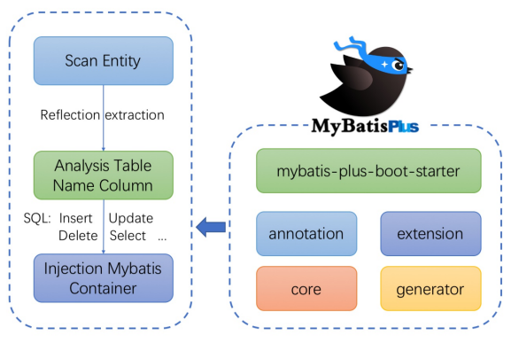


# 第 2 章 入门案例

## 2.1、开发环境

- IDE：idea 2019.2 
- JDK：JDK8+ 
- 构建工具：maven 3.5.4 
- MySQL版本：MySQL 5.7 
- Spring Boot：2.6.3 
- MyBatis-Plus：3.5.1

## 2.2、创建数据库及表

### 2.2.1、创建表

```sql
CREATE DATABASE `mybatis_plus` /*!40100 DEFAULT CHARACTER SET utf8mb4 */;
use `mybatis_plus`;
CREATE TABLE `user` (
`id` bigint(20) NOT NULL COMMENT '主键ID',
`name` varchar(30) DEFAULT NULL COMMENT '姓名',
`age` int(11) DEFAULT NULL COMMENT '年龄',
`email` varchar(50) DEFAULT NULL COMMENT '邮箱',
PRIMARY KEY (`id`)
) ENGINE=InnoDB DEFAULT CHARSET=utf8;
```

### 2.2.2、添加数据

```sql
INSERT INTO user (id, name, age, email) VALUES
(1, 'Jone', 18, 'test1@baomidou.com'),
(2, 'Jack', 20, 'test2@baomidou.com'),
(3, 'Tom', 28, 'test3@baomidou.com'),
(4, 'Sandy', 21, 'test4@baomidou.com'),
(5, 'Billie', 24, 'test5@baomidou.com');
```

## 2.3 创建Spring Boot工程

### 2.3.1、初始化工程

使用 Spring Initializr 快速初始化一个 Spring Boot 工程

 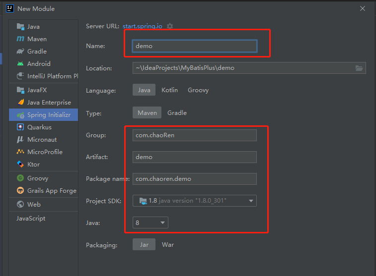

### 2.3.2、引入依赖

```xml
<dependencies>
    <dependency>
        <groupId>org.springframework.boot</groupId>
        <artifactId>spring-boot-starter</artifactId>
    </dependency>
    <dependency>
        <groupId>org.springframework.boot</groupId>
        <artifactId>spring-boot-starter-test</artifactId>
        <scope>test</scope>
    </dependency>
    <dependency>
        <groupId>com.baomidou</groupId>
        <artifactId>mybatis-plus-boot-starter</artifactId>
        <version>3.5.1</version>
    </dependency>
    <dependency>
        <groupId>org.projectlombok</groupId>
        <artifactId>lombok</artifactId>
        <optional>true</optional>
    </dependency>
    <dependency>
        <groupId>mysql</groupId>
        <artifactId>mysql-connector-java</artifactId>
        <scope>runtime</scope>
    </dependency>
</dependencies>
```

### 2.3.3、idea中安装lombok插件

 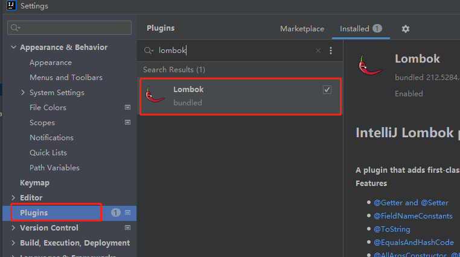


## 2.4 编写代码

### 2.4.1、配置application.yml

```yaml
spring:
#  配置数据源信息
  datasource:
#    配置数据源类型
    type: com.zaxxer.hikari.HikariDataSource
#    配置连接数据库信息
    driver-class-name: com.mysql.jdbc.Driver
    url: jdbc:mysql://localhost:3306/mybatis_plus?characterEncoding=utf-8&useSSL=false
    username: root
    password: 123
```

**注意**：

> 1、驱动类driver-class-name
>
> - spring boot 2.0（内置jdbc5驱动），驱动类使用：
>
>   driver-class-name: com.mysql.jdbc.Driver
>
> - spring boot 2.1及以上（内置jdbc8驱动），驱动类使用：
>
>   driver-class-name: com.mysql.cj.jdbc.Driver 
>
> - 否则运行测试用例的时候会有 WARN 信息
>
> 2、连接地址url
>
> - MySQL5.7版本的url：
>
>   jdbc:mysql://localhost:3306/mybatis_plus?characterEncoding=utf-8&useSSL=false
>
> - MySQL8.0版本的url：
>
>   jdbc:mysql://localhost:3306/mybatis_plus? serverTimezone=GMT%2B8&characterEncoding=utf-8&useSSL=false
>
> - 否则运行测试用例报告如下错误：
>
>   java.sql.SQLException: The server time zone value 'Öйú±ê׼ʱ¼ä' is unrecognized or represents more

### 2.4.2、启动类

在Spring Boot启动类中添加@MapperScan注解，扫描mapper包

```java
@SpringBootApplication
//包必须写详细，否则使用XXXService会报错，比如使用：com.chaoren.demo，使用@Mapper标注也会报错
@MapperScan("com.chaoren.demo.mapper")
public class DemoApplication {
    public static void main(String[] args) {
        SpringApplication.run(DemoApplication.class, args);
    }
}
```

### 2.4.3、添加实体

```java
@Data //lombok注解
public class User {
    private Long id;
    private String name;
    private Integer age;
    private String email;
}
```

### 2.4.4、添加mapper

BaseMapper是MyBatis-Plus提供的模板mapper，其中包含了基本的CRUD方法，泛型为操作的实体类型

```java
public interface UserMapper extends BaseMapper<User> {
}
```

### 2.4.5、测试

```java
@SpringBootTest
public class MyTest {
    @Autowired
    UserMapper userMapper;
    
    @Test
    public void testAllUser() {
        List<User> users = userMapper.selectList(null);
        for (User user : users) {
            System.out.println(user);
        }
    }
}
```

**注意**：

> IDEA在 userMapper 处报错，因为找不到注入的对象，因为类是动态创建的，但是程序可以正确 的执行。
>
> 为了避免报错，可以在mapper接口上添加 @Repository 注解

### 2.4.6、添加日志

在application.yml中配置日志输出

```yaml
# 配置MyBatis日志
mybatis-plus:
  configuration:
    log-impl: org.apache.ibatis.logging.stdout.StdOutImpl
```


# 第 3 章 基本CRUD

## 3.1 BaseMapper

MyBatis-Plus中的基本CRUD在内置的BaseMapper中都已得到了实现，我们可以直接使用。


## 3.2 插入

```java
@Test
public void testInsert() {
    User user = new User(null, "任超2", 23, "5426@qq.com");
    int result = userMapper.insert(user);
    System.out.println(result);
    System.out.println(user.getId());
}
```


## 3.3 删除

### 3.3.1、通过id删除记录

```java
@Test
public void testDeleteById() {
    int i = userMapper.deleteById(1503577240189595649L);
    System.out.println("删除行数：" + i);
}
```


### 3.3.2、通过id批量删除记录

```java
    @Test
    public void testDeleteBatchIds() {
        List<Long> ids = Arrays.asList(1503577654985289729L, 1503580005968191489L, 1503580087492890625L);
        //通过多个id批量删除
		//DELETE FROM user WHERE id IN ( ? , ? , ? )
        int i = userMapper.deleteBatchIds(ids);
        System.out.println("删除行数：" + i);
    }
```


### 3.3.3、通过map条件删除记录

```java
@Test
public void testDeleteByMap() {
    Map<String, Object> map = new HashMap<>();
    map.put("name", "任超3");
    map.put("age", 28);
    //根据map集合中所设置的条件删除记录
	//DELETE FROM user WHERE name = ? AND age = ?
    int i = userMapper.deleteByMap(map);
    System.out.println("删除行数：" + i);
}
```


## 3.4、修改

```java
@Test
public void testUpdateById() {
    User user = new User(1503582937086234625L, "王道月", 32, "782@qq.com");
    //UPDATE user SET name=?, age=? WHERE id=?
    int i = userMapper.updateById(user);
    System.out.println("删除行数：" + i);
}
```


## 3.5、查询

### 3.5.1、根据id查询用户信息

```java

@Test
public void testSelectById() {
    //根据id查询用户信息
	//SELECT id,name,age,email FROM user WHERE id=?
    User user = userMapper.selectById(1503582937086234625L);
    System.out.println(user);
}
```


### 3.5.2、根据多个id查询多个用户信息

```java
@Test
public void testSelectBatchIds() {
    List<Long> ids = Arrays.asList(4L, 3L);
    //SELECT id,name,age,email FROM user WHERE id IN ( ? , ? )
    List<User> users = userMapper.selectBatchIds(ids);
    for (User user : users) {
        System.out.println(user);
    }
}
```


### 3.5.3、通过map条件查询用户信息

```java
@Test
public void testSelectByMap() {
    HashMap<String, Object> map = new HashMap<>();
    map.put("name", "王道月");
    map.put("age", 32);
    List<User> users = userMapper.selectByMap(map);
    for (User user : users) {
        System.out.println(user);
    }
}
```


### 3.5.4、查询所有数据

```java
@Test
public void testAllUser() {
    List<User> users = userMapper.selectList(null);
    for (User user : users) {
        System.out.println(user);
    }
}
```


> 通过观察BaseMapper中的方法，大多方法中都有Wrapper类型的形参
>
> 此为条件构造器，可针对于SQL语句设置不同的条件
>
> 若没有条件，则可以为该形参赋值null，即查询（删除/修改）所 有数据


### 3.5.5、自定义功能

- UserMapper：

  ```java
  @Repository
  public interface UserMapper extends BaseMapper<User> {
      
      Map<String, Object> selectMapById(Long id);
      
  }
  ```

- UserMapper.xml

  > 默认路径：`mapper/**/*.xml`
  > 路径可以通过`mybatis-plus.mapper-locations`进行修改。

  ```xml
  <?xml version="1.0" encoding="UTF-8" ?>
  <!DOCTYPE mapper
          PUBLIC "-//mybatis.org//DTD Mapper 3.0//EN"
          "http://mybatis.org/dtd/mybatis-3-mapper.dtd">
  <mapper namespace="com.chaoren.demo.mapper.UserMapper">
      <select id="selectMapById" resultType="map">
          select * from user where id = #{id}
      </select>
  </mapper>
  ```

  

- 测试：

  ```java
  @Test
  public void testSelectMapById() {
      Map<String, Object> map = userMapper.selectMapById(1L);
      System.out.println(map);
  }
  ```

  

## 3.6、通用Service

**说明**:

> - 通用 Service CRUD 封装IService接口，进一步封装 CRUD，前缀命名方式区分 Mapper 层避免混淆
>   - `get` 查询单行
>   - `remove` 删 除
>   - `list` 查询集合
>   - `page` 分页
> - 泛型 T 为任意实体对象
> - 建议如果存在自定义通用 Service 方法的可能，请创建自己的 IBaseService 继承 Mybatis-Plus 提供的基类
> - 官网：[CRUD 接口 | MyBatis-Plus (baomidou.com)](https://baomidou.com/pages/49cc81/#service-crud-接口)


### 3.6.1、IService

- MyBatis-Plus中有一个接口 IService和其实现类 ServiceImpl，封装了常见的业务层逻辑

- 详情查看源码`IService`和`ServiceImpl`


### 3.6.2、创建Service接口和实现类

- Service接口:

  ```java
  /**
   * UserService继承IService模板提供的基础功能
   */
  public interface UserService extends IService<User> {
  }
  ```

  

- Service实现类:

  ```java
  /**
   * ServiceImpl实现了IService，提供了IService中基础功能的实现
   * 若ServiceImpl无法满足业务需求，则可以使用自定的UserService定义方法，并在实现类中实现
   */
  public class UserServiceImpl
          extends ServiceImpl<UserMapper, User>
          implements UserService {
      
  }
  ```

  

### 3.6.3、测试查询记录数

**注意**：

> `UserService userService`会报错：
>
> org.apache.ibatis.binding.BindingException: Invalid bound statement (not found): com.chaoren.demo.service.UserService.saveBatch
>
> 课程视频里面正常的，自己测试不行，

```java
@SpringBootTest
public class MyServiceTest {

    @Autowired
    private UserServiceImpl userService;

    @Test
    public void testGetCount() {
        long count = userService.count();
        System.out.println("总记录数：" + count);
    }
}
```

### 3.6.4、测试批量插入

```java
@SpringBootTest
public class MyServiceTest {

    @Autowired
    private UserServiceImpl userService;

    @Test
    public void testSaveBatch() {
        ArrayList<User> users = new ArrayList<>();
        for (int i = 0; i < 5; i++) {
            users.add(new User(null, "任超" + i, 21 + i, i + "@qq.com"));
        }
        boolean b = userService.saveBatch(users);
        System.out.println(b ? "保存成功。。" : "保存失败！！");
    }
}
```


# 第 4 章 常用注解

## 4.1、@TableName

### 4.1.1、实体类设置方法

> 在实体类类型上添加@TableName("t_user")，标识实体类对应的表，即可成功执行SQL语句

```java
@TableName("t_user")
public class User {
    。。。。。。
}
```


### 4.1.2、全局配置方法

> - 在开发的过程中，我们经常遇到以上的问题，即实体类所对应的表都有固定的前缀，例如 `t_` 或 `tbl_` 此时。
> - 可以使用MyBatis-Plus提供的全局配置，为实体类所对应的表名设置默认的前缀。
> - 那么就不需要在每个实体类上通过@TableName标识实体类对应的表

```yaml
mybatis-plus:
  global-config:
    db-config:
      table-prefix: t_
```


## 4.2、@TableId

### 4.2.1、识别主键

> - 若实体类和表中表示主键的不是id，而是其他字段。
> - 例如uid，则MyBatis-Plus无法识别uid为主键列。
> - 此时需要在实体类中uid属性上通过@TableId将其标识为主键

```java
public class User {
    @TableId
    private Long uid;
    private String name;
    private Integer age;
    private String email;
}
```

### 4.2.2、value属性

> - 若实体类中主键对应的属性为uid，而表中表示主键的字段为id。
> - 此时若只在属性id上添加注解 @TableId，则抛出异常`Unknown column 'id' in 'field list'`。
> - 即MyBatis-Plus仍然会将uid作为表的主键操作，而表中表示主键的是字段id。
> - 此时需要通过@TableId注解的value属性，指定表中的主键字段，`@TableId("id")` 或 `@TableId(value="id")`

### 4.2.3、type属性

> type属性用来定义主键策略

**常用的主键策略**：

- **IdType.ASSIGN_ID**（默 认）

  基于雪花算法的策略生成数据id，与数据库id是否设置自增无关

- **IdType.AUTO**

  使用数据库的自增策略，注意，该类型请确保数据库设置了id自增， 否则无效


**配置全局主键策略**：

```yaml
mybatis-plus:
  global-config:
    db-config:
      id-type: auto
```


### 4.2.4、雪花算法

- **背景**

  需要选择合适的方案去应对数据规模的增长，以应对逐渐增长的访问压力和数据量。 

  数据库的扩展方式主要包括：业务分库、主从复制，数据库分表。

- **数据库分表**

  将不同业务数据分散存储到不同的数据库服务器，能够支撑百万甚至千万用户规模的业务，

  但如果业务 继续发展，同一业务的单表数据也会达到单台数据库服务器的处理瓶颈。

  例如，淘宝的几亿用户数据， 如果全部存放在一台数据库服务器的一张表中，肯定是无法满足性能要求的，此时就需要对单表数据进 行拆分。

  单表数据拆分有两种方式：垂直分表和水平分表。示意图如下：

   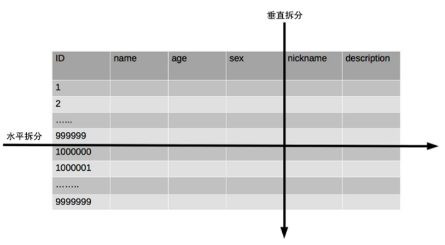

- **雪花算法**

  > 雪花算法是由Twitter公布的分布式主键生成算法
  >
  > 它能够保证不同表的主键的不重复性，以及相同表的 主键的有序性。

  - 核心思想：

    长度共64bit（一个long型）。 

    首先是一个符号位，1bit标识，由于long基本类型在Java中是带符号的，

    最高位是符号位，正数是0，负 数是1，所以id一般是正数，最高位是0。

     41bit时间截(毫秒级)，存储的是时间截的差值（当前时间截 - 开始时间截)，结果约等于69.73年。 

    10bit作为机器的ID（5个bit是数据中心，5个bit的机器ID，可以部署在1024个节点）。

    12bit作为毫秒内的流水号（意味着每个节点在每毫秒可以产生 4096 个 ID）。

    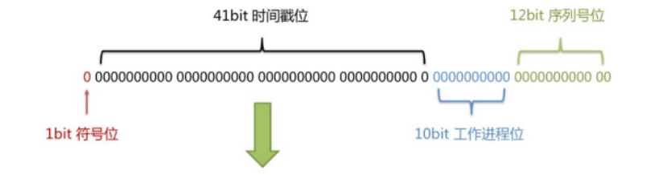

  - 优点：

    整体上按照时间自增排序，并且整个分布式系统内不会产生ID碰撞，并且效率较高。


## 4.3、@TableField

实体类中的属性名和字段名不一致的两种情况

### 4.3.1、驼峰命名风格

若实体类中的属性使用的是驼峰命名风格，而表中的字段使用的是下划线命名风格

例如实体类属性userName，表中字段user_name

此时MyBatis-Plus会自动将下划线命名风格转化为驼峰命名风格

相当于在MyBatis中配置


### 4.3.2、其他情况

若实体类中的属性和表中的字段不满足驼峰命名风格

例如实体类属性name，表中字段username

此时需要在实体类属性上使用@TableField("username")设置属性所对应表的字段名

```java
public class User {
    @TableId("id")
    private Long uid;
    @TableField("username")
    private String name;
    private Integer age;
    private String email;
}
```


## 4.4、@TableLogic

### 4.4.1、逻辑删除

- 物理删除：真实删除，将对应数据从数据库中删除，之后查询不到此条被删除的数据
- 逻辑删除：假删除，将对应数据中代表是否被删除字段的状态修改为“被删除状态”， 之后在数据库 中仍旧能看到此条数据记录
- 使用场景：可以进行数据恢复

### 4.4.2、实现逻辑删除

- step1：

  数据库中创建逻辑删除状态列，设置默认值为0

  

- step2：
  实体类中添加逻辑删除属性

  ```java
  public class User {
      @TableId("id")
      private Long uid;
      @TableField("user_name")
      private String name;
      private Integer age;
      private String email;
      @TableLogic
      private Integer isDeleted;
  }
  ```

- step3：
  测试

  > 测试删除功能，真正执行的是修改 
  >
  > `UPDATE t_user SET is_deleted=1 WHERE id=? AND is_deleted=0`
  >
  >  测试查询功能，被逻辑删除的数据默认不会被查询
  >
  > `SELECT id,username AS name,age,email,is_deleted FROM t_user WHERE is_deleted=0`

  

# 第 5 章 条件构造器和常用接口

[条件构造器 | MyBatis-Plus (baomidou.com)](https://baomidou.com/pages/10c804/)

## 5.1、wapper介绍

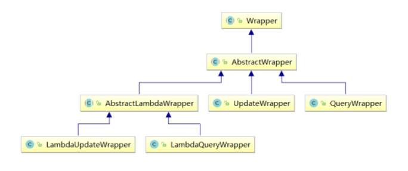

- Wrapper ： 条件构造抽象类，最顶端父类
  - AbstractWrapper ： 用于查询条件封装，生成 sql 的 where 条件
    - QueryWrapper ： 查询条件封装
    - UpdateWrapper ： Update 条件封装
    - AbstractLambdaWrapper ： 使用Lambda 语法
      - LambdaQueryWrapper ：用于Lambda语法使用的查询Wrapper
      - LambdaUpdateWrapper ： Lambda 更新封装Wrapper

## 5.2、QueryWrapper

### 5.2.1、组装查询条件

```java
@Test
public void test01() {
    //查询用户名包含"超"，年龄在20到30之间，并且邮箱不为null的用户信息
    QueryWrapper<User> queryWrapper = new QueryWrapper<User>();
    queryWrapper.like("username", "超")
            .between("age", 20, 30)
            .isNotNull("email");
    List<User> users = userMapper.selectList(queryWrapper);
    System.out.println(users);
}
```


### 5.2.2、组装排序条件

```java
@Test
public void test02() {
    //按年龄降序查询用户，如果年龄相同则按id升序排列
    QueryWrapper<User> queryWrapper = new QueryWrapper<>();
    queryWrapper.orderByDesc("age")
            .orderByAsc("id");
    List<User> users = userMapper.selectList(queryWrapper);
    System.out.println(users);
}
```


### 5.2.3、组装删除条件

```java
@Test
public void test03() {
    //删除email为空的用户
    QueryWrapper<User> queryWrapper = new QueryWrapper<>();
    queryWrapper.isNull("email");
    int delete = userMapper.delete(queryWrapper);
    System.out.println("删除了 " + delete + " 行。");
}
```


### 5.2.4、条件的优先级

```JAVA
@Test
public void test04() {
    //将（年龄大于26并且用户名中包含有"a"）或邮箱为null的用户信息修改
    QueryWrapper<User> queryWrapper = new QueryWrapper<>();
    queryWrapper.gt("age", 26)
            .like("username","a")
            .or()
            .isNull("email");
    User user = new User();
    user.setEmail("888@qq.com");
    int update = userMapper.update(user, queryWrapper);
    System.out.println("修改了 " + update + " 行。");
}
```

```java
@Test
public void test041() {
    //将用户名中包含有a并且（年龄大于26或邮箱为null）的用户信息修改
    QueryWrapper<User> queryWrapper = new QueryWrapper<>();
    queryWrapper.like("username", "a")
            .and(e -> e.gt("age", 26).or().isNull("email"));
    User user = new User();
    user.setEmail("666666@qq.com");
    int update = userMapper.update(user, queryWrapper);
    System.out.println("修改了 " + update + " 行。");
}
```


### 5.2.5、组装select子句

```java
@Test
public void test05() {
    //查询用户信息的username和age字段
    QueryWrapper<User> queryWrapper = new QueryWrapper<>();
    queryWrapper.select("username", "age");
    //selectMaps()返回Map集合列表，通常配合select()使用，避免User对象中没有被查询到的列值为null
    List<Map<String, Object>> maps = userMapper.selectMaps(queryWrapper);
    System.out.println(maps);
}
```


### 5.2.6、实现子查询

```java
@Test
public void test06() {
    //查询id小于等于3的用户信息
    QueryWrapper<User> queryWrapper = new QueryWrapper<>();
    queryWrapper.inSql("id", "select id from t_user where id <= 3");
    List<User> users = userMapper.selectList(queryWrapper);
    System.out.println(users);
}
```


## 5.3、UpdateWrapper

```java
@Test
public void test07() {
    //将（年龄大于20或邮箱为null）并且用户名中包含有a的用户信息修改
    //组装set子句以及修改条件
    UpdateWrapper<User> updateWrapper = new UpdateWrapper<>();
    updateWrapper.set("age", 18)
            .set("email", "520@163.com")
            .like("username", "a")
            .and(f -> f.gt("age", 26).or().isNull("email"));
    int update = userMapper.update(null, updateWrapper);
    System.out.println("修改了 " + update + " 行。");
}
```

## 5.4、condition

> 在真正开发的过程中，组装条件是常见的功能，而这些条件数据来源于用户输入，是可选的，
>
> 因此我们在组装这些条件时，必须先判断用户是否选择了这些条件，
>
> 若选择则需要组装该条件，若没有选择则一定不能组装，以免影响SQL执行的结果

- 思路一：

  ```java
  @Test
  public void test08() {
      //定义查询条件，有可能为null（用户未输入或未选择）
      String username = null;
      Integer ageBegin = 10;
      Integer ageEnd = 24;
      QueryWrapper<User> queryWrapper = new QueryWrapper<>();
      //StringUtils.isNotBlank()判断某字符串是否不为空且长度不为0且不由空白符(whitespace)构成
      if(StringUtils.isNotBlank(username)){
          queryWrapper.like("username",username);
      }
      if(ageBegin != null){
          queryWrapper.ge("age", ageBegin);
      }
      if(ageEnd != null){
          queryWrapper.le("age", ageEnd);
      }
      List<User> users = userMapper.selectList(queryWrapper);
      users.forEach(System.out::println);
  }
  ```

- 思路二：

  > 上面的实现方案没有问题，但是代码比较复杂，我们可以使用带condition参数的重载方法构建查询条件，简化代码的编写

  ```java
  @Test
  public void test081() {
      //定义查询条件，有可能为null（用户未输入或未选择）
      String username = null;
      Integer ageBegin = 10;
      Integer ageEnd = 24;
      QueryWrapper<User> queryWrapper = new QueryWrapper<>();
      //StringUtils.isNotBlank()判断某字符串是否不为空且长度不为0且不由空白符(whitespace)构成
      queryWrapper.like(StringUtils.isNotBlank(username), "username", username)
              .ge(ageBegin != null, "age", ageBegin)
              .le(ageEnd != null, "age", ageEnd);
      List<User> users = userMapper.selectList(queryWrapper);
      users.forEach(System.out::println);
  }
  ```


## 5.5、LambdaQueryWrapper

```java
@Test
public void test09() {
    //定义查询条件，有可能为null（用户未输入）
    String username = "a";
    Integer ageBegin = 10;
    Integer ageEnd = 24;
    LambdaQueryWrapper<User> queryWrapper = new LambdaQueryWrapper<>();
    //避免使用字符串表示字段，防止运行时错误
    queryWrapper
            .like(StringUtils.isNotBlank(username), User::getName, username)
            .ge(ageBegin != null, User::getAge, ageBegin)
            .le(ageEnd != null, User::getAge, ageEnd);
    List<User> users = userMapper.selectList(queryWrapper);
    users.forEach(System.out::println);
}
```


## 5.6、LambdaUpdateWrapper

```java
@Test
public void test10() {
    //组装set子句
    LambdaUpdateWrapper<User> updateWrapper = new LambdaUpdateWrapper<>();
    updateWrapper
            .set(User::getAge, 18)
            .set(User::getEmail, "user@atguigu.com")
            .like(User::getName, "a")
            .and(i -> i.lt(User::getAge, 24).or().isNull(User::getEmail)); //lambda表达式内的逻辑优先运算
    User user = new User();
    int result = userMapper.update(user, updateWrapper);
    System.out.println("受影响的行数：" + result);
}
```


# 第 6 章 插件

## 6.1、分页插件

> MyBatis Plus自带分页插件，只要简单的配置即可实现分页功能。

### 6.1.1、添加配置类

```java
@Configuration
@MapperScan("com.chaoren.demo")
public class MyBatisPlusConfig {

    @Bean
    public MybatisPlusInterceptor mybatisPlusInterceptor() {
        MybatisPlusInterceptor interceptor = new MybatisPlusInterceptor();
        interceptor.addInnerInterceptor(new PaginationInnerInterceptor(DbType.MYSQL));
        return interceptor;
    }
}
```

### 6.1.2、测试

```java
@Test
public void testPage() {
    //设置分页参数
    Page<User> page = new Page<>(1,3);
    userMapper.selectPage(page, null);
    //获取分页数据
    List<User> users = page.getRecords();
    users.forEach(System.out::println);
    System.out.println("当前页："+page.getCurrent());
    System.out.println("每页显示的条数："+page.getSize());
    System.out.println("总记录数："+page.getTotal());
    System.out.println("总页数："+page.getPages());
    System.out.println("是否有上一页："+page.hasPrevious());
    System.out.println("是否有下一页："+page.hasNext());
}
```

## 6.2、自定义分页

### 6.2.1、UserMapper中定义接口方法

```java
/**
 * 根据年龄查询用户列表，分页显示
 * @param page 分页对象,xml中可以从里面进行取值,传递参数 Page 即自动分页,必须放在第一位
 * @param age 年龄
 * @return
 */
IPage<User> selectPageVo(IPage<User> page, @Param("age") Integer age);
```


### 6.2.2、UserMapper.xml中编写SQL

```xml
<select id="selectPageVo" resultType="User">
    select * from t_user where age > #{age}
</select>
```


### 6.2.3、测试

```java
@Test
public void testPageVo() {
    //设置分页参数
    Page<User> page = new Page<>(1,3);
    userMapper.selectPageVo(page, 20);
    //获取分页数据
    List<User> users = page.getRecords();
    users.forEach(System.out::println);
    System.out.println("当前页："+page.getCurrent());
    System.out.println("每页显示的条数："+page.getSize());
    System.out.println("总记录数："+page.getTotal());
    System.out.println("总页数："+page.getPages());
    System.out.println("是否有上一页："+page.hasPrevious());
    System.out.println("是否有下一页："+page.hasNext());
}
```


## 6.3、乐观锁

### 6.3.1、场景

> 一件商品，成本价是80元，售价是100元。老板先是通知小李，说你去把商品价格增加50元。小 李正在玩游戏，耽搁了一个小时。正好一个小时后，老板觉得商品价格增加到150元，价格太 高，可能会影响销量。又通知小王，你把商品价格降低30元。
>
> 此时，小李和小王同时操作商品后台系统。小李操作的时候，系统先取出商品价格100元；小王 也在操作，取出的商品价格也是100元。小李将价格加了50元，并将100+50=150元存入了数据 库；小王将商品减了30元，并将100-30=70元存入了数据库。是的，如果没有锁，小李的操作就 完全被小王的覆盖了。 
>
> 现在商品价格是70元，比成本价低10元。几分钟后，这个商品很快出售了1千多件商品，老板亏1 万多。

### 6.3.2、乐观锁与悲观锁

> 上面的故事，如果是乐观锁，小王保存价格前，会检查下价格是否被人修改过了。如果被修改过 了，则重新取出的被修改后的价格，150元，这样他会将120元存入数据库。 
>
> 如果是悲观锁，小李取出数据后，小王只能等小李操作完之后，才能对价格进行操作，也会保证最终的价格是120元。

### 6.3.3、模拟修改冲突

- 数据库中增加商品表

  ```sql
  CREATE TABLE t_product
  (
  id BIGINT(20) NOT NULL COMMENT '主键ID',
  NAME VARCHAR(30) NULL DEFAULT NULL COMMENT '商品名称',
  price INT(11) DEFAULT 0 COMMENT '价格',
  VERSION INT(11) DEFAULT 0 COMMENT '乐观锁版本号',
  PRIMARY KEY (id)
  );
  ```

- 添加数据

  ```sql
  INSERT INTO t_product (id, NAME, price) VALUES (1, '外星人笔记本', 100);
  ```

- 添加实体

  ```java
  @Data
  public class Product {
      private Long id;
      private String name;
      private Integer price;
      private Integer version;
  }
  ```

- 添加mapper

  ```java
  public interface ProductMapper extends BaseMapper<Product> {
  }
  ```

- 测试

- ```java
  @Test
  public void testConcurrentUpdate() {
      //1、小李
      Product p1 = productMapper.selectById(1L);
      System.out.println("小李取出的价格：" + p1.getPrice());
      //2、小王
      Product p2 = productMapper.selectById(1L);
      System.out.println("小王取出的价格：" + p2.getPrice());
      //3、小李将价格加了50元，存入了数据库
      p1.setPrice(p1.getPrice() + 50);
      int result1 = productMapper.updateById(p1);
      System.out.println("小李修改结果：" + result1);
      //4、小王将商品减了30元，存入了数据库
      p2.setPrice(p2.getPrice() - 30);
      int result2 = productMapper.updateById(p2);
      System.out.println("小王修改结果：" + result2);
      //最后的结果
      Product p3 = productMapper.selectById(1L);
      //价格覆盖，最后的结果：70
      System.out.println("最后的结果：" + p3.getPrice());
  }
  ```


### 6.3.4、乐观锁实现流程

> 数据库中添加version字段
>
> 取出记录时，获取当前version
>
> ```sql
> SELECT id,`name`,price,`version` FROM product WHERE id=1
> ```
>
> 更新时，version + 1，如果where语句中的version版本不对，则更新失败
>
> ```sql
> UPDATE product SET price=price+50, `version`=`version` + 1 WHERE id=1 AND `version`=1
> ```


### 6.3.5、Mybatis-Plus实现乐观锁

- 修改实体类

  ```java
  @Data
  public class Product {
      private Long id;
      private String name;
      private Integer price;
      @Version
      private Integer version;
  }
  ```

- 添加乐观锁插件配置

  ```java
  @Configuration
  @MapperScan("com.chaoren.demo")
  public class MyBatisPlusConfig {
  
      @Bean
      public MybatisPlusInterceptor mybatisPlusInterceptor() {
          MybatisPlusInterceptor interceptor = new MybatisPlusInterceptor();
          //添加分页插件
          interceptor.addInnerInterceptor(new PaginationInnerInterceptor(DbType.MYSQL));
          //添加乐观锁插件
          interceptor.addInnerInterceptor(new OptimisticLockerInnerInterceptor());
          return interceptor;
      }
  }
  ```

- 测试修改冲突

  > 最终，小王修改商品价格，此时version已更新，条件不成立，修改失败
  >
  > 查询价格：150

- 优化流程

  ```java
  @Test
  public void testConcurrentVersionUpdate() {
      //1、小李
      Product p1 = productMapper.selectById(1L);
      System.out.println("小李取出的价格：" + p1.getPrice());
      //2、小王
      Product p2 = productMapper.selectById(1L);
      System.out.println("小王取出的价格：" + p2.getPrice());
      //3、小李将价格加了50元，存入了数据库
      p1.setPrice(p1.getPrice() + 50);
      int result1 = productMapper.updateById(p1);
      System.out.println("小李修改结果：" + result1);
      //4、小王将商品减了30元，存入了数据库
      p2.setPrice(p2.getPrice() - 30);
      int result2 = productMapper.updateById(p2);
      if (result2 == 0) {
          p2 = productMapper.selectById(1L);
          p2.setPrice(p2.getPrice() - 30);
          result2 = productMapper.updateById(p2);
      }
      System.out.println("小王修改结果：" + result2);
      //最后的结果
      Product p3 = productMapper.selectById(1L);
      //价格覆盖，最后的结果：70
      System.out.println("最后的结果：" + p3.getPrice());
  }
  ```

  

# 第 7 章 通用枚举

> 表中的有些字段值是固定的，例如性别（男或女），此时我们可以使用MyBatis-Plus的通用枚举来实现

## 7.1、添加字段sex

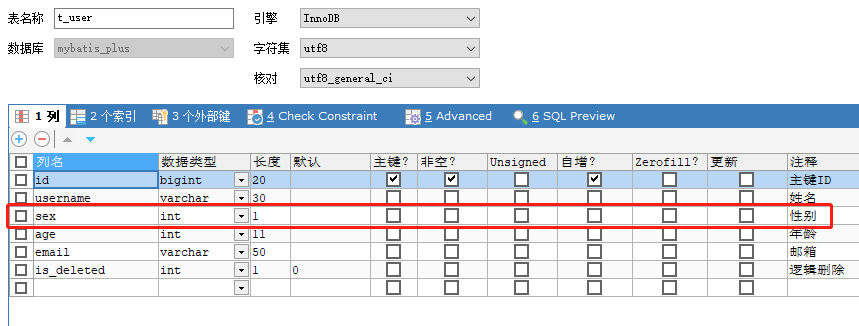

```java
@Data //lombok注解
@NoArgsConstructor
@AllArgsConstructor
@TableName("t_user")
public class User {
    @TableId("id")
    private Long uid;
    @TableField("username")
    private String name;
    private Integer age;
    private Integer sex;//添加sex
    private String email;
    @TableLogic
    private Integer isDeleted;
}
```

## 7.2、创建通用枚举类型

```java
@Getter
public enum SexEnum {
    MALE(1,"男"),
    FEMALE(0,"女");

    @EnumValue  //会将@EnumValue注解所标识的属性值存储到数据库
    private final Integer sex;
    private final String sexName;

    SexEnum(Integer sex, String sexName) {
        this.sex = sex;
        this.sexName = sexName;
    }
}
```

## 7.3、配置扫描通用枚举

```yaml
# 配置MyBatis日志
mybatis-plus:
  configuration:
    # 配置MyBatis日志
    log-impl: org.apache.ibatis.logging.stdout.StdOutImpl
  global-config:
    db-config:
      # 配置MyBatis-Plus操作表的默认前缀
      table-prefix: t_
      # 配置MyBatis-Plus的主键策略
      id-type: auto
  # 让mybatis扫描到自定义的Bean实体类
  type-aliases-package: com.chaoren.demo.bean
  # 配置扫描通用枚举
  type-enums-package: com.chaoren.demo.enums
```

## 7.4、测试

```java
@Test
public void test01() {
    User user = new User(null, "王道月", 32, SexEnum.FEMALE, "666@qq.com", null);
    userMapper.insert(user);
}
```


# 第 8 章 代码生成器

## 8.1、引入依赖

```xml
<dependency>
    <groupId>com.baomidou</groupId>
    <artifactId>mybatis-plus-generator</artifactId>
    <version>3.5.1</version>
</dependency>

<dependency>
    <groupId>org.freemarker</groupId>
    <artifactId>freemarker</artifactId>
    <version>2.3.31</version>
</dependency>
```

## 8.2、快速生成

```java
@SpringBootTest
public class FastAutoGeneratorTest {
    public static void main(String[] args) {
        FastAutoGenerator.create("jdbc:mysql://localhost:3306/mybatis_plus?characterEncoding=utf-8&useSSL=false", "root", "123")
                .globalConfig(builder -> {
                    builder.author("任超") // 设置作者
                            .enableSwagger() // 开启 swagger 模式
                            .fileOverride() // 覆盖已生成文件
                            .outputDir("D://MyBatisPlus"); // 指定输出目录
                })
                .packageConfig(builder -> {
                    builder.parent("com.chaoRen.generator") // 设置父包名
                            .moduleName("mybatis_plus_test") // 设置父包模块名
                            .pathInfo(Collections.singletonMap(OutputFile.mapperXml, "D://MyBatisPlus")); // 设置mapperXml生成路径
                })
                .strategyConfig(builder -> {
                    builder.addInclude("t_user") // 设置需要生成的表名
                            .addTablePrefix("t_", "c_"); // 设置过滤表前缀
                })
                .templateEngine(new FreemarkerTemplateEngine()) // 使用Freemarker引擎模板，默认的是Velocity引擎模板
                .execute();
    }
}
```


# 第 9 章 多数据源

> 适用于多种场景：纯粹多库、 读写分离、 一主多从、 混合模式等
>
> 目前我们就来模拟一个纯粹多库的一个场景，其他场景类似
>
> 场景说明：
>
> 我们创建两个库，分别为：mybatis_plus（以前的库不动）与mybatis_plus_1（新建），将mybatis_plus库的product表移动到mybatis_plus_1库，这样每个库一张表，通过一个测试用例 分别获取用户数据与商品数据，如果获取到说明多库模拟成功。

## 9.1、创建数据库及表

> 创建数据库mybatis_plus_1和表product

```sql
create database `mybatis_plus_1` /*!40100 DEFAULT CHARACTER SET utf8mb4 */;
use `mybatis_plus_1`;
create table product
(
id bigint(20) not null comment '主键ID',
name varchar(30) null default null comment '商品名称',
price int(11) default 0 comment '价格',
version int(11) default 0 comment '乐观锁版本号',
primary key (id)
);
insert into product (id, name, price) values (1, '外星人笔记本', 100);
```

> 删除mybatis_plus库product表

```sql
use mybatis_plus;
DROP TABLE IF EXISTS product;
```

## 9.2、引入依赖

```xml
<dependency>
    <groupId>com.baomidou</groupId>
    <artifactId>dynamic-datasource-spring-boot-starter</artifactId>
    <version>3.5.0</version>
</dependency>
```

## 9.3、配置多数据源

> 说明：注释掉之前的数据库连接，添加新配置

```yaml
spring:
  # 配置数据源信息
  datasource:
    dynamic:
      #设置默认的数据源或者数据源组,默认值即为master
      primary: master
      #严格匹配数据源,默认false. true未匹配到指定数据源时抛异常,false使用默认数据源
      strict: false
      datasource:
        master:
          url: jdbc:mysql://localhost:3306/mybatis_plus?characterEncoding=utf-8&useSSL=false
          username: root
          password: 123
        slave_1:
          url: jdbc:mysql://localhost:3306/mybatis_plus_1?characterEncoding=utf-8&useSSL=false
          username: root
          password: 123
```

## 9.4、创建用户service

```java
public interface UserService extends IService<User> {
}
```

```java
@DS("master")//指定所操作的数据源
@Service
public class UserServiceImpl extends ServiceImpl<UserMapper, User> implements UserService {
}
```

## 9.5、创建商品service

```java
public interface ProductService extends IService<Product> {
}
```

```java
@DS("slave_1")//指定所操作的数据源
@Service
public class ProductServiceImpl extends ServiceImpl<ProductMapper, Product> implements ProductService {
}
```

## 9.6、测试

```java
@SpringBootTest
class DatasourceApplicationTests {

    @Autowired
    private UserService userService;
    @Autowired
    private ProductService productService;
    @Test
    public void testDynamicDataSource(){
        System.out.println(userService.getById(1L));
        System.out.println(productService.getById(1L));
    }
}
```

# 第 10 章 MyBatisX插件

> MyBatis-Plus为我们提供了强大的mapper和service模板，能够大大的提高开发效率
>
> 但是在真正开发过程中，MyBatis-Plus并不能为我们解决所有问题，例如一些复杂的SQL，多表联查，我们就需要自己去编写代码和SQL语句，我们该如何快速的解决这个问题呢，这个时候可以使用MyBatisX插件
>
> MyBatisX一款基于 IDEA 的快速开发插件，为效率而生。

[MybatisX快速开发插件 | MyBatis-Plus (baomidou.com)](https://baomidou.com/pages/ba5b24/)

[【尚硅谷】2022版MyBatisPlus教程（一套玩转mybatis-plus）_哔哩哔哩_bilibili](https://www.bilibili.com/video/BV12R4y157Be?p=54)

## 10.1、安装MyBatisX

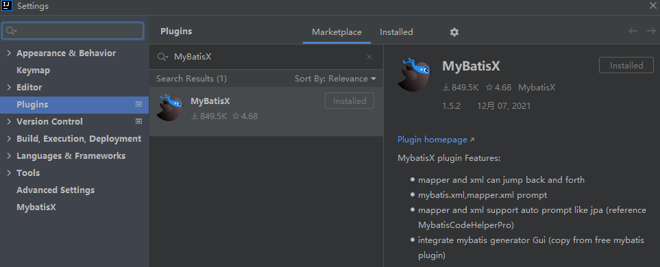

## 10.2、MyBatisX代码快速生成

- 新建工程

- 配置数据库信息

- IDEA连接数据源
  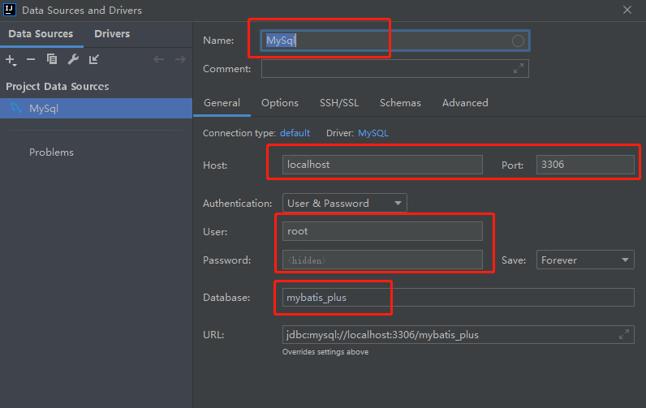

- 代码快速生成
  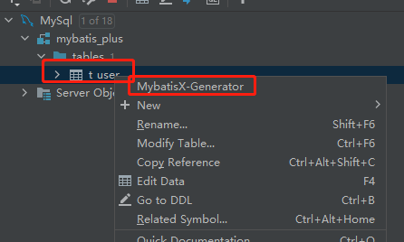

   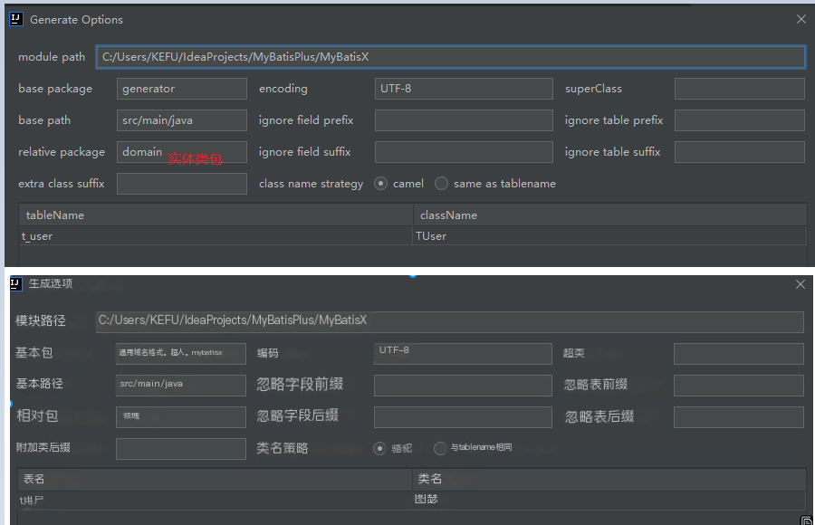

   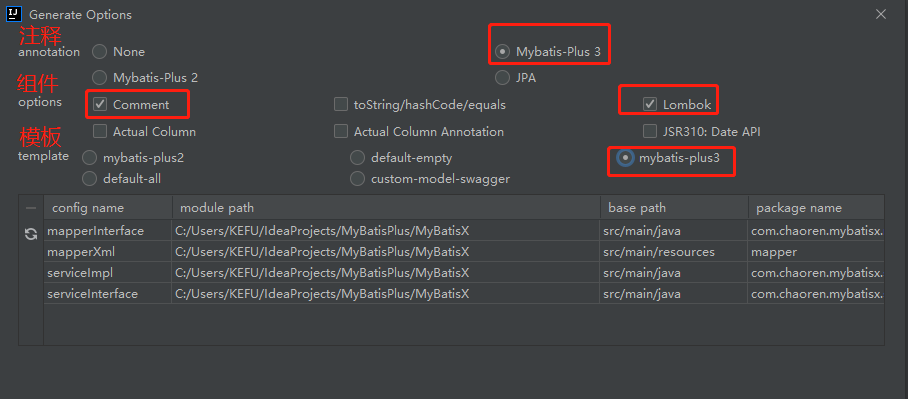

- 配置完成后，点击Finish快速生成代码


## 10.3、快速生成CRUD

- 根据提示选择相应功能，或者输入对应功能
   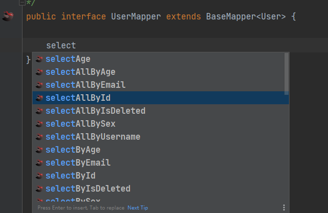

- 然后Alt + Enter
  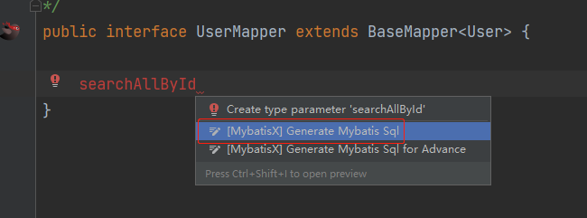

- 常用功能：

  > insertSelective
  > deleteByIdAndUsername
  > updateAgeAndEmailById
  > selectUsernameAndAgeById
  > selectAllOrderByAgeDesc
  > selectAllOrderByAgeAsc

- 
