# 1、准备工作
## 1.1、MySQL 安装和配置
看老师的安装笔记：
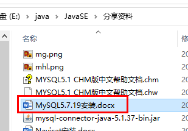
## 1.2、命令行连接 MYSQL
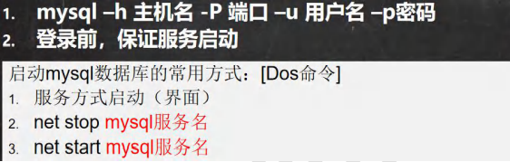
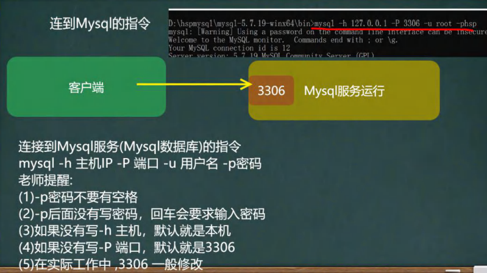
## 1.3、 管理软件
### 1.3.1、Navicat
安装参考韩顺平老师笔记
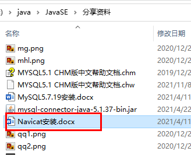

### 1.3.2、SQLyog
社区版下载：
[https://github.com/webyog/sqlyog-community/wiki/Downloads](https://github.com/webyog/sqlyog-community/wiki/Downloads)
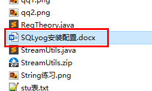
注释的快捷键 shift+ctrl+c , 注销注释 shift+ctrl+r


### 1.3.3、DBeaver

[DBeaver Community | Free Universal Database Tool](https://dbeaver.io/)


# 2、MYSQL 介绍
## 2.1、数据库三层结构
数据库三层结构-破除 MySQL 神秘

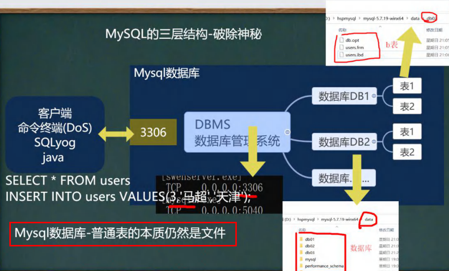

## 2.2、数据存储方式
数据在数据库中的存储方式
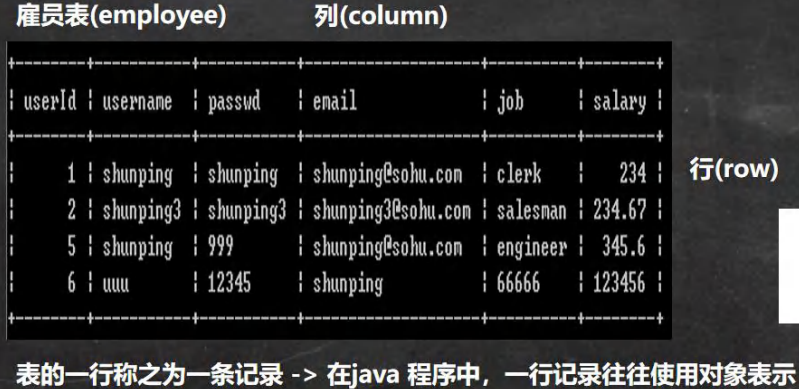
## 2.3、SQL 语句分类

# 3、操作数据库
## 3.1、创建数据库
```sql
#创建一个名称为 hsp_db01 的数据库。

#使用指令创建数据库
create database hsp_db01;

#删除数据库指令
drop database hsp_db01

#创建一个使用 utf8 字符集的 hsp_db02 数据库
create database hsp_db02 character set utf8

#创建一个使用 utf8 字符集，并带校对规则的 hsp_db03 数据库
#校对规则 utf8_bin 区分大小 默认 utf8_general_ci 不区分大小写
create database hsp_db03 character set utf8 collate utf8_bin


#下面是一条查询的 sql , select 查询 * 表示所有字段 FROM 从哪个表
#WHERE 从哪个字段 NAME = 'tom' 查询名字是 tom
select * from t1 where name = 'tom'
```
## 3.2、查看、删除数据库
```sql
#演示删除和查询数据库

#查看当前数据库服务器中的所有数据库
show databases

#查看前面创建的 hsp_db01 数据库的定义信息
show create database `hsp_db01` 

#删除前面创建的 hsp_db01 数据库
drop database hsp_db01
```
## 3.3、指定当前数据库
`use 数据库`
# 4、备份和恢复
## 4.1、备份恢复数据库

## 4.2、备份恢复表
```sql
mysqldump -u 用户名 -p密码 数据库 表1 表2 表n > d:\\文件名.sql
```
# 5、常用数据类型
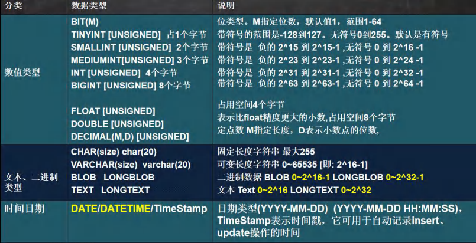
## 5.1、数值型(整数)
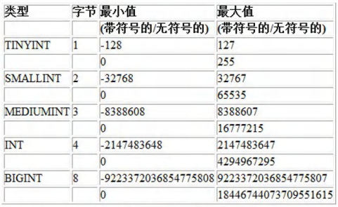
## 5.2、定义无符号整数

## 5.3、数值型(bit)
```sql
#说明
#1. bit(m) m 在 1-64
#2. 添加数据 范围 按照你给的位数来确定，比如 m = 8 表示一个字节 0~255
#3. 显示按照 bit
#4. 查询时，仍然可以按照数来查询
create table t05 (num bit(8));
insert into t05 values(256);
select * from t05;
select * from t05 where num = 255;
```
## 5.4、数值型(小数)
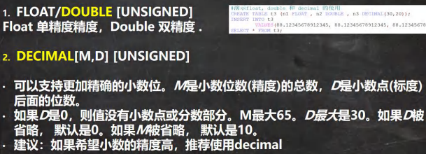
```sql
#演示 decimal 类型、float、double 使用
#创建表
create table t06 (
num1 float,
num2 double,
num3 decimal(30,20));

#添加数据
insert into t06 values(88.12345678912345, 88.12345678912345,88.12345678912345);
select * from t06;

#decimal 可以存放很大的数
create table t07 (
num decimal(65));
insert into t07 values(8999999933338388388383838838383009338388383838383838383);
select * from t07;

create table t08(
num bigint unsigned)
insert into t08 values(8999999933338388388383838838383009338388383838383838383);
select * from t08;
```
## 5.5、字符串
```sql
#演示字符串类型使用 char varchar
-- CHAR(size)
-- 固定长度字符串 最大 255 字符
-- VARCHAR(size) 0~65535 字节
-- 可变长度字符串 最大 65532 字节 【utf8 编码最大 21844 字符 1-3 个字节用于记录大小】
-- 如果表的编码是 utf8 varchar(size) size = (65535-3) / 3 = 21844
-- 如果表的编码是 gbk varchar(size) size = (65535-3) / 2 = 32766
create table t09 (
`name` char(255));

create table t10 (
`name` varchar(32766)) charset gbk;
drop table t10;
```
## 5.6、字符串使用细节
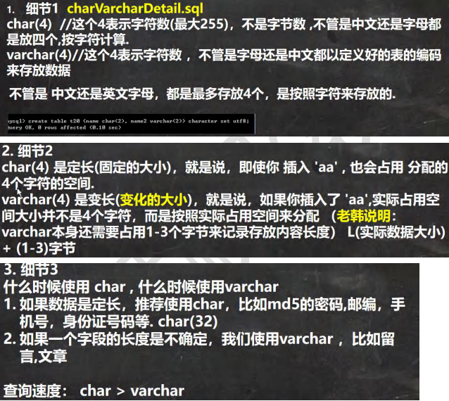

## 5.7、日期类型
```sql
#演示时间相关的类型
#创建一张表, date , datetime , timestamp
create table t14 (
birthday date , -- 生日
job_time datetime, -- 记录年月日 时分秒
login_time timestamp
not null default current_timestamp
on update current_timestamp); -- 登录时间, 如果希望 login_time 列自动更新, 需要配置

select * from t14;

insert into t14(birthday, job_time)
values('2022-11-11','2022-11-11 10:10:10'); 
-- 如果我们更新 t14 表的某条记录，login_time 列会自动的以当前时间进行更新
```
# 6、操作表
## 6.1、创建表
```sql
#创建表的课堂练习
-- 字段属性
-- Id 整形
-- name 字符型
-- sex 字符型
-- brithday 日期型（date）
-- entry_date 日期型 (date)
-- job 字符型
-- Salary 小数型
-- resume 文本型
create table `emp` (
	id int, 
	`name` varchar(32), 
	sex char(1), 
	brithday date,
	entry_date datetime, 
	job varchar(32), 
	salary double, 
	`resume` text) 
	charset utf8 -- 设置数据库字符集
	collate utf8_bin -- 数据库校对规则
	engine innodb; -- 引擎
	
-- 添加一条
insert into `emp` 
	values(
		100,
		'小妖怪',
		'男',
		'2000-11-11',
		'2010-11-10 11:11:11',
		'巡山的', 3000,
		'大王叫我来巡山');

-- 查询
select * from `emp`
```
## 6.2、修改表
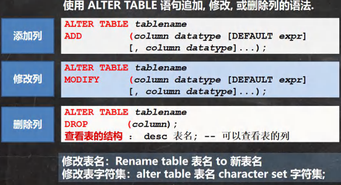
```sql
#修改表的操作练习

-- 员工表 emp 的上增加一个 image 列，varchar 类型(要求在 resume 后面)。
alter table emp add image varchar(32) not null default '' after resume

-- 显示表结构，可以查看表的所有列
desc employee 

-- 修改 job 列，使其长度为 60。
alter table emp modify job varchar(60) not null default ''

-- 删除 sex 列。
alter table emp drop sex

-- 表名改为 employee。
rename table emp to employee

-- 修改表的字符集为 utf8
alter table employee character set utf8

-- 列名 name 修改为 user_name
alter table employee change `name` `user_name` varchar(64) not null default '' desc employee
```
## 6.3、查看表结构

`desc 表名`


## 6.4、修改主键初始值

```
ALTER TABLE 表名 AUTO_INCREMENT = 新的起始值;
```


# 6-1、数据库 CRUD

**C - create，R - read，U - update，D - delete**

## 6-1.1、insert
```sql
-- 创建一张商品表 goods (id int , goods_name varchar(10), price double );
-- 添加 2 条记录
create table `goods` (
id int , goods_name varchar(10), -- 长度 10
price double not null default 100 ); 

-- 添加数据
insert into `goods` (id, goods_name, price)
values(10, '华为手机', 2000);

insert into `goods` (id, goods_name, price)
values(20, '苹果手机', 3000);

select * from goods;
```
> **细节说明:**
> 1. 插入的数据应与字段的数据类型相同。
> 比如：把 'abc' 添加到 int 类型会错误。
> 1. 数据的长度应在列的规定范围内。
> 例如：不能将一个长度为 80 的字符串加入到长度为 40 的列中。
> 1. 字符和日期型数据应包含在单引号中。
> 1. 列可以插入空值[前提是该字段允许为空]，insert into table value(null)
> 1. insert into tab_name (列名..) values (),(),() 形式添加多条记录
> 1. 如果是给表中的所有字段添加数据，可以不写前面的字段名称
> 1. 默认值的使用，当不给某个字段值时，如果有默认值就会添加默认值，否则报错


## 6-1.2、update
```sql
-- 1. 将所有员工薪水修改为 5000 元。
-- [如果没有带 where 条件，会修改所有的记录，因此要小心]
update employee set salary = 5000

-- 2. 将姓名为 小妖怪 的员工薪水修改为 3000 元。
update employee set salary = 3000 where user_name = '小妖怪'

-- 3. 将 老妖怪 的薪水在原有基础上增加 1000 元
update employee set salary = salary + 1000 where user_name = '老妖怪'

-- 可以修改多个列的值
update employee set salary = salary + 1000 , job = '出主意的' where user_name = '老妖怪'

select * from employee;
```
## 6-1.3、delete
```sql
-- 删除表中名称为’老妖怪’的记录。
delete from employee where user_name = '老妖怪';

-- 删除表中所有记录, 老师提醒，一定要小心
delete from employee;

-- Delete 语句不能删除某一列的值（可使用 update 设为 null 或者 ''）

-- 要删除这个表
drop table employee;
```
## 6-1.4、select
### ①基本语法
```sql
-- select 语句【重点 难点】
create table student(
	id int not null default 1,
	name varchar(20) not null default '',
	chinese float not null default 0.0,
	english float not null default 0.0,
	math float not null default 0.0
);

insert into student(id,name,chinese,english,math) values(1,'韩顺平',89,78,90);
insert into student(id,name,chinese,english,math) values(2,'张飞',67,98,56);
insert into student(id,name,chinese,english,math) values(3,'宋江',87,78,77);
insert into student(id,name,chinese,english,math) values(4,'关羽',88,98,90);
insert into student(id,name,chinese,english,math) values(5,'赵云',82,84,67);
insert into student(id,name,chinese,english,math) values(6,'欧阳锋',55,85,45);
insert into student(id,name,chinese,english,math) values(7,'黄蓉',75,65,30);
insert into student(id,name,chinese,english,math) values(8,'韩信',45,65,99);

-- 查询表中所有学生的信息。
select * from student; 

-- 查询表中所有学生的姓名和对应的英语成绩。
select `name`,english from student;

-- 过滤表中重复数据 distinct 。
select distinct english from student;

-- 要查询的记录，每个字段都相同，才会去重
select distinct `name`, english from student;

-- 统计每个学生的总分
select `name`, (chinese + english + math) from student;

-- 在所有学生总分加 10 分的情况
select `name`, (chinese + english + math + 10) from student;

-- 使用别名表示学生分数。
select `name` as '名字', (chinese + english + math + 10) as total_score from student
```
### ②where 运算符
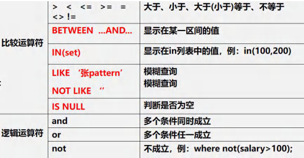
```sql
-- select 语句
-- 查询姓名为赵云的学生成绩
select * from student where `name` = '赵云';

-- 查询英语成绩大于 90 分的同学
select * from student where english > 90

-- 查询总分大于 200 分的所有同学
select * from student where (chinese + english + math) > 200

-- 查询 math 大于 60 并且(and) id 大于 4 的学生成绩
select * from student where math >60 and id > 4

-- 查询英语成绩大于语文成绩的同学
select * from student where english > chinese

-- 查询总分大于 200 分 并且数学成绩小于语文成绩,姓赵的学生. 
-- 赵% 表示 名字以韩开头的就可以
select * from student 
	where (chinese + english + math) > 200 
	and math < chinese 
	and `name` like '赵%';
	
-- 查询英语分数在 80－90 之间的同学。
select * from student where english >= 80 and english <= 90;
select * from student where english between 80 and 90;
-- between .. and .. 是 闭区间


-- 查询数学分数为 89,90,91 的同学。
select * from student where math = 89 or math = 90 or math = 91;
select * from student where math in (89, 90, 91);

-- 查询所有姓韩的学生成绩。
select * from student where `name` like '韩%'
```
### ③order by 排序

- order by 指定排序的列，排序的列既可以是表中的列名，也可以是 select 语句后指定的列名
- Asc升序[默认]、Desc 降序
- ORDER BY 子句应位于 SELECT 语句的结尾。
```sql
-- 对数学成绩排序后输出【升序】。
select * from student order by math;

-- 对总分按从高到低的顺序输出 [降序] -- 使用别名排序
select `name` , (chinese + english + math) as total_score from student
	order by total_score desc;
	
-- 对姓韩的学生成绩[总分]排序输出(升序) where + order by
select `name`, (chinese + english + math) as total_score from student
	where `name` like '韩%'
	order by total_score;
```
### ④group by 分组
```sql
create table dept( /*部门表*/
	deptno mediumint unsigned not null default 0,
	dname varchar(20) not null default "",
	loc varchar(13) not null default ""
	);

insert into dept values
	(10, 'ACCOUNTING', 'NEW YORK'),
	(20, 'RESEARCH', 'DALLAS'),
	(30, 'SALES', 'CHICAGO'),
	(40, 'OPERATIONS', 'BOSTON');

select * from dept;

-- 员工表
create table emp
(empno mediumint unsigned not null default 0, /*编号*/
	ename varchar(20) not null default "", /*名字*/
	job varchar(9) not null default "",/*工作*/
	mgr mediumint unsigned ,/*上级编号*/
	hiredate date not null,/*入职时间*/
	sal decimal(7,2) not null,/*薪水*/
	comm decimal(7,2) ,/*红利 奖金*/
	deptno mediumint unsigned not null default 0 /*部门编号*/
	);

-- 添加测试数据
insert into emp values
	(7369, 'SMITH', 'CLERK', 7902, '1990-12-17', 800.00,null , 20),
	(7499, 'ALLEN', 'SALESMAN', 7698, '1991-2-20', 1600.00, 300.00, 30),
	(7521, 'WARD', 'SALESMAN', 7698, '1991-2-22', 1250.00, 500.00, 30),
	(7566, 'JONES', 'MANAGER', 7839, '1991-4-2', 2975.00,null,20),
	(7654, 'MARTIN', 'SALESMAN', 7698, '1991-9-28',1250.00,1400.00,30),
	(7698, 'BLAKE','MANAGER', 7839,'1991-5-1', 2850.00,null,30),
	(7782, 'CLARK','MANAGER', 7839, '1991-6-9',2450.00,null,10), 
	(7788, 'SCOTT','ANALYST',7566, '1997-4-19',3000.00,null,20),
	(7839, 'KING','PRESIDENT',null,'1991-11-17',5000.00,null,10),
	(7844, 'TURNER', 'SALESMAN',7698, '1991-9-8', 1500.00, null,30),
	(7900, 'JAMES','CLERK',7698, '1991-12-3',950.00,null,30),
	(7902, 'FORD', 'ANALYST',7566,'1991-12-3',3000.00, null,20),
	(7934,'MILLER','CLERK',7782,'1992-1-23', 1300.00, null,10);

select * from emp;

-- 工资级别
#工资级别表
create table salgrade(
	grade mediumint unsigned not null default 0, /*工资级别*/
	losal decimal(17,2) not null, /* 该级别的最低工资 */
	hisal decimal(17,2) not null /* 该级别的最高工资*/
	);
	
insert into salgrade values (1,700,1200);
insert into salgrade values (2,1201,1400);
insert into salgrade values (3,1401,2000);
insert into salgrade values (4,2001,3000);
insert into salgrade values (5,3001,9999);

select * from salgrade;
select * from dept;
select * from emp;

-- GROUP by 用于对查询的结果分组统计
-- having 子句用于限制分组显示结果.
-- 如何显示每个部门的平均工资和最高工资
-- 老韩分析: avg(sal) max(sal)
-- 按照部分来分组查询
select deptno, avg(sal), max(sal) from emp group by deptno;

-- 使用数学方法，对小数点进行处理
select deptno, format(avg(sal),2), max(sal) from emp group by deptno;

-- 显示每个部门的每种岗位的平均工资和最低工资
-- 1. 显示每个部门的平均工资和最低工资
-- 2. 显示每个部门的每种岗位的平均工资和最低工资
select deptno, job, avg(sal), min(sal) from emp group by deptno,job; 
```
### ⑤having 分组后过滤
```sql
-- 显示平均工资低于 2000 的部门号和它的平均工资 // 别名
-- [写 sql 语句的思路是化繁为简,各个击破]
-- 1. 显示各个部门的平均工资和部门号
-- 2. 在 1 的结果基础上，进行过滤，保留 AVG(sal) < 2000
-- 3. 使用别名进行过滤
select avg(sal), deptno
	from emp group by deptno
	having avg(sal) < 2000;

-- 使用别名
select avg(sal) as avg_sal, deptno
	from emp
	group by deptno
	having avg_sal < 2000;
```


# 7、函数
## 7.1、合计/统计函数
### 7.1.1、count
```sql
-- 统计一个班级共有多少学生？
select count(*) from student;

-- 统计数学成绩大于 90 的学生有多少个？
select count(*) from student where math > 90

-- 统计总分大于 250 的人数有多少？
select count(*) from student where (math + english + chinese) > 250

-- count(*) 和 count(列) 的区别
-- 解释 :count(*) 返回满足条件的记录的行数
-- count(列): 统计满足条件的某列有多少个，但是会排除 为 null 的情况
```
### 7.1.2、sum
```sql
-- 统计一个班级数学总成绩？
select sum(math) from student;

-- 统计一个班级语文、英语、数学各科的总成绩
select sum(math) as math_total_score,sum(english),sum(chinese) from student;

-- 统计一个班级语文、英语、数学的成绩总和
select sum(math + english + chinese) from student;

-- 统计一个班级语文成绩平均分
select sum(chinese)/ count(*) from student;
```
### 7.1.3、avg
```sql
-- 求一个班级数学平均分？
select avg(math) from student;

-- 求一个班级总分平均分
select avg(math + english + chinese) from student;
```
### 7.1.4、max/min
```sql
-- 求班级最高分和最低分（数值范围在统计中特别有用）
select max(math + english + chinese), min(math + english + chinese) from student;

-- 求出班级数学最高分和最低分
select max(math) as math_high_socre, min(math) as math_low_socre from student;
```
## 7.2、字符串相关函数
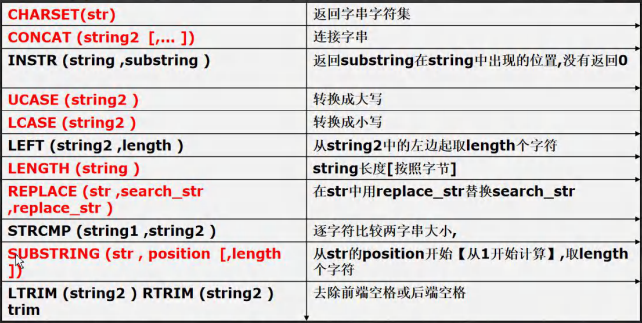
```sql
-- CHARSET(str) 返回字串字符集
select charset(ename) from emp;

-- CONCAT (string2 [,... ]) 连接字串, 将多个列拼接成一列
select concat(ename, ' 工作是 ', job) from emp;

-- INSTR (string ,substring ) 返回 substring 在 string 中出现的位置,没有返回 0
-- dual 亚元表, 系统表 可以作为测试表使用
select instr('hanshunping', 'ping') from dual;

-- UCASE (string2 ) 转换成大写
select ucase(ename) from emp;

-- LCASE (string2 ) 转换成小写
select lcase(ename) from emp;

-- LEFT (string2 ,length )从 string2 中的左边起取 length 个字符
-- RIGHT (string2 ,length ) 从 string2 中的右边起取 length 个字符
select left(ename, 2) from emp;

-- LENGTH (string )string 长度[按照字节]
select length(ename) from emp;

-- REPLACE (str ,search_str ,replace_str )
-- 在 str 中用 replace_str 替换 search_str
-- 如果是 manager 就替换成 经理
select ename, replace(job,'MANAGER', '经理') from emp;

-- STRCMP (string1 ,string2 ) 逐字符比较两字串大小
select strcmp('abc', 'ABD') from dual;

-- SUBSTRING (str , position [,length ])
-- 从 str 的 position 开始【从 1 开始计算】,取 length 个字符
select substring('abcdefg', 2, 3) from dual;

-- LTRIM (string2 ) RTRIM (string2 ) TRIM(string)
-- 去除前端空格或后端空格
select ltrim(' 韩顺平教育') from dual;
select rtrim('韩顺平教育 ') from dual;
select trim(' 韩顺平教育 ') from dual;
```
## 7.3、数学相关函数
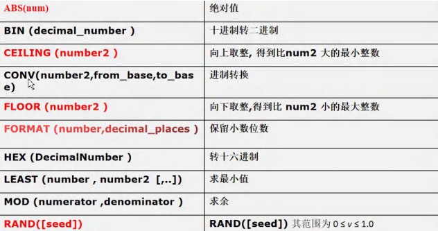
```sql
-- ABS(num) 绝对值
select abs(-10) from dual;

-- BIN (decimal_number )十进制转二进制
select bin(10) from dual;

-- CEILING (number2 ) 向上取整, 得到比 num2 大的最小整数
select ceiling(-1.1) from dual;

-- FLOOR (number2 ) 向下取整,得到比 num2 小的最大整数
select floor(-1.1) from dual;

-- CONV(number2,from_base,to_base) 进制转换
-- 下面的含义是 8 是十进制的 8, 转成 2 进制输出
select conv(8, 10, 2) from dual;

-- 下面的含义是 11 是 16 进制的 11, 转成 10 进制输出
select conv(11, 16, 10) from dual;


-- FORMAT (number,decimal_places ) 保留小数位数(四舍五入)
select format(78.125458,2) from dual;

-- HEX (DecimalNumber ) 转十六进制
-- 二进制转十六进制
select hex(b'11') from dual;
-- 十进制转十六进制
select hex(13) from dual;

-- LEAST (number , number2 [,..]) 求最小值
select least(0,1, -10, 4) from dual;

-- MOD (numerator ,denominator ) 求余
select mod(10, 3) from dual;

-- RAND([seed]) RAND([seed]) 返回随机数 其范围为 0 ≤ v ≤ 1.0
-- 1. 如果使用 rand() 每次返回不同的随机数 ，在 0 ≤ v ≤ 1.0
-- 2. 如果使用 rand(seed) 返回随机数, 范围 0 ≤ v ≤ 1.0, 如果 seed 不变，
-- 该随机数也不变了
select rand() from dual;
```
## 7.4、时间日期相关函数
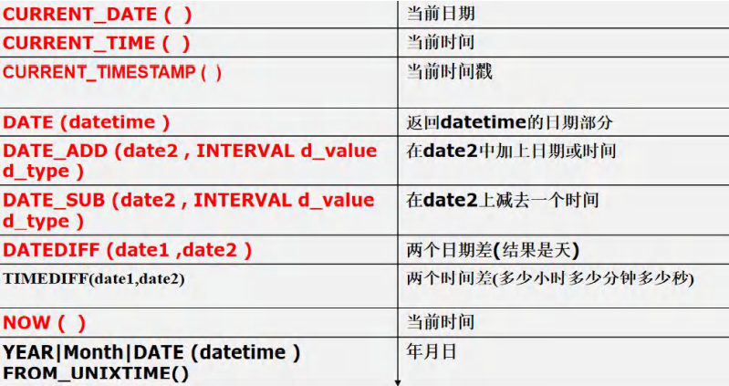
```sql
-- CURRENT_DATE ( ) 当前日期
select current_date() from dual;

-- CURRENT_TIME ( )当前时间
select current_time() from dual;

-- CURRENT_TIMESTAMP ( ) 当前时间戳
select current_timestamp() from dual;

-- 创建测试表 信息表
create table mes(
	id int ,
	content varchar(30),
	send_time datetime);
	
-- 添加一条记录
insert into mes values(1, '北京新闻', current_timestamp());
insert into mes values(2, '上海新闻', now());
insert into mes values(3, '广州新闻', now());

select * from mes;

select now() from dual;

-- 上应用实例
-- 显示所有新闻信息，发布日期只显示 日期，不用显示时间. 
select id, content, date(send_time) from mes; 

-- 请查询在 10 分钟内发布的新闻, 思路一定要梳理一下. 
select * from mes where date_add(send_time, interval 10 minute) >= now()
select * from mes where send_time >= date_sub(now(), interval 10 minute)

-- 请在 mysql 的 sql 语句中求出 2011-11-11 和 1990-1-1 相差多少天
select datediff('2011-11-11', '1990-01-01') from dual;

-- 请用 mysql 的 sql 语句求出你活了多少天? [练习] 1986-11-11 出生
select datediff(now(), '1986-11-11') from dual;

select timediff('10:11:11', '06:10:10') from dual;

-- YEAR|Month|DAY| DATE (datetime )
select year(now()) from dual;
select month(now()) from dual;
select day(now()) from dual;
select month('2013-11-10') from dual;

-- unix_timestamp() : 返回的是 1970-1-1 到现在的秒数
select unix_timestamp() from dual;

-- FROM_UNIXTIME() : 可以把一个 unix_timestamp 秒数[时间戳]，转成指定格式的日期
-- %Y-%m-%d 格式是规定好的，表示年月日
-- 意义：在开发中，可以存放一个整数，然后表示时间，通过 FROM_UNIXTIME 转换
select from_unixtime(1618483484, '%Y-%m-%d') from dual;

select from_unixtime(1618483100, '%Y-%m-%d %H:%i:%s') from dual;
```
## 7.5、加密和系统函数
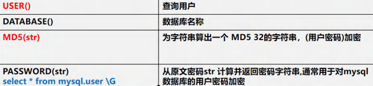
```sql
-- USER() 查询用户
-- 可以查看登录到 mysql 的有哪些用户，以及登录的 IP
select user() from dual;

-- 用户@IP 地址
-- DATABASE()查询当前使用数据库名称
select database();

-- MD5(str) 为字符串算出一个 MD5 32 的字符串，常用(用户密码)加密
-- root 密码是 hsp -> 加密 md5 -> 在数据库中存放的是加密后的密码
select md5('hsp') from dual;

select length(md5('hsp')) from dual;

-- 演示用户表，存放密码时，是 md5
create table hsp_user
	(id int ,
	`name` varchar(32) not null default '',
	pwd char(32) not null default '');
	
insert into hsp_user values(100, '韩顺平', md5('hsp'));
select * from hsp_user;

-- csdn
select * from hsp_user where `name`='韩顺平' and pwd = md5('hsp')

-- SQL 注入问题
-- PASSWORD(str)
-- 加密函数, MySQL 数据库的用户密码就是 PASSWORD 函数加密
select password('hsp') from dual;

-- 数据库的 *81220D972A52D4C51BB1C37518A2613706220DAC
-- select * from mysql.user \G 从原文密码 str 计算并返回密码字符串
-- 通常用于对 mysql 数据库的用户密码加密
-- mysql.user 表示 数据库.表
select * from mysql.user
```
## 7.6、流程控制函数
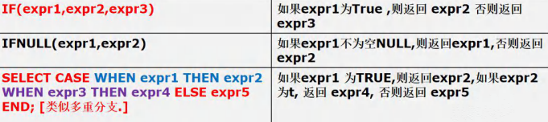
```sql
# IF(expr1,expr2,expr3) 如果 expr1 为 True ,则返回 expr2 否则返回 expr3
select if(true, '北京', '上海') from dual;

# IFNULL(expr1,expr2) 如果 expr1 不为空 NULL,则返回 expr1,否则返回 expr2
select ifnull( null, '韩顺平教育') from dual;

# SELECT CASE WHEN expr1 THEN expr2 WHEN expr3 THEN expr4 ELSE expr5 END; [类似多重分支.]
# 如果 expr1 为 TRUE,则返回 expr2,如果 expr2 为 t, 返回 expr4, 否则返回 expr5
select case 
	when true then 'jack' 
	when false then 'tom' 
	else 'mary' end

-- 1. 查询 emp 表, 如果 comm 是 null , 则显示 0.0
-- 判断是否为 null 要使用 is null, 判断不为空 使用 is not
select ename, if(comm is null , 0.0, comm) from emp;
select ename, ifnull(comm, 0.0) from emp;

-- 2. 如果 emp 表的 job 是 CLERK 则显示 职员， 如果是 MANAGER 则显示经理
-- 如果是 SALESMAN 则显示 销售人员，其它正常显示
select ename, (select case 
		when job = 'CLERK' then '职员'
		when job = 'MANAGER' then '经理'
		when job = 'SALESMAN' then '销售人员'
		else job end) as 'job'
		from emp;
```
# 8、表查询--加强
## 8.1、排序 order by
```sql
-- 使用 where 子句
-- 如何查找 1992.1.1 后入职的员工
-- 老师说明： 在 mysql 中,日期类型可以直接比较, 需要注意格式
select * from emp where hiredate > '1992-01-01'


-- 如何使用 like 操作符(模糊)
-- %: 表示 0 到多个任意字符 
-- _: 表示单个任意字符
-- 如何显示首字符为 S 的员工姓名和工资
select ename, sal from emp where ename like 'S%'

-- 如何显示第三个字符为大写 O 的所有员工的姓名和工资
select ename, sal from emp where ename like '__O%'

-- 如何显示没有上级的雇员的情况
select * from emp where mgr is null;

-- 查询表结构
desc emp

-- 使用 order by 子句
-- 如何按照工资的从低到高的顺序[升序]，显示雇员的信息
select * from emp order by sal

-- 按照部门号升序而雇员的工资降序排列 , 显示雇员信息
select * from emp order by deptno asc , sal desc;
```
## 8.2、分页查询
基本语法: 
`select limit start,rows`
表示从 `start + 1` 行开始取，取出 `rows` 行，start从0开始计算
```sql
-- 按雇员的 id 号升序取出， 每页显示 3 条记录，请分别显示 第 1 页，第 2 页，第 3 页
-- 第 1 页
select * from emp order by empno limit 0, 3;

-- 第 2 页
select * from emp order by empno limit 3, 3;

-- 第 3 页
select * from emp order by empno limit 6, 3;

-- 推导一个公式
select * from emp order by empno limit 每页显示记录数 * (第几页-1) , 每页显示记录数
```
## 8.3、分组 group by
```sql
-- (1) 显示每种岗位的雇员总数、平均工资。
select job, count(*), avg(sal) from emp group by job;

-- (2) 显示雇员总数，以及获得补助的雇员数。
-- 思路: 获得补助的雇员数 就是 comm 列为非 null, 就是 count(列)，如果该列的值为 null, 是
-- 不会统计 , SQL 非常灵活，需要我们动脑筋。
select count(*), count(comm) from emp

-- 统计没有获得补助的雇员数
select count(*), count(if(comm is null, 1, null)) from emp
select count(*), count(*) - count(comm) from emp

-- (3) 显示管理者的总人数。
-- 小技巧:尝试写->修改->尝试[正确的]
select count(distinct mgr) from emp;

-- (4) 显示雇员工资的最大差额。
-- 思路： max(sal) - min(sal)
select max(sal) - min(sal) from emp;

-- 应用案例：请统计各个部门 group by 的平均工资 avg，
-- 并且是大于 1000 的 having，并且按照平均工资从高到低排序， order by
-- 取出前两行记录 limit 0, 2
select deptno, avg(sal) as avg_sal
from emp
group by deptno
having avg_sal > 1000
order by avg_sal desc
limit 0,2
```
## 8.4、合并查询
```sql
-- 合并查询
select ename,sal,job from emp where sal>2500 -- 5
select ename,sal,job from emp where job='MANAGER' -- 3

-- union all 就是将两个查询结果合并，不会去重
select ename,sal,job from emp where sal>2500
union all
select ename,sal,job from emp where job='MANAGER'

-- union  就是将两个查询结果合并，会去重
select ename,sal,job from emp where sal>2500
union 
select ename,sal,job from emp where job='MANAGER'

-- union 与 or, or的查询效率更高
select ename,sal,job from emp where sal>2500 or job='MANAGER'
```
## 8.5、语句顺序
如果select语句同时包含有group by ,having，limit，order by
那么他们的顺序是：

1. group by
1. having 
1. order by
1. limit
# 9、多表查询（重点）
## 9.1、笛卡尔集
```sql
-- 显示雇员名,雇员工资及所在部门的名字 【笛卡尔集】
select ename,sal,dname,emp.deptno
			from emp, dept
			where emp.deptno = dept.deptno

-- 小技巧：多表查询的条件不能少于 表的个数-1, 否则会出现笛卡尔集

-- 如何显示部门号为 10 的部门名、员工名和工资
select ename,sal,dname,emp.deptno
			from emp, dept
			where emp.deptno = dept.deptno
			and emp.deptno = 10

-- 显示各个员工的姓名，工资，及其工资的级别
-- 思路 姓名，工资 来自 emp 13
-- 工资级别 salgrade 5
-- 写 sql , 先写一个简单，然后加入过滤条件... 
select ename, sal, grade
	from emp , salgrade
	where sal between losal and hisal;
```
## 9.2、自连接
自连接是指在同一张表的连接查询，将同一张表看做两张表。
```sql
-- 多表查询的 自连接
-- 思考题: 显示公司员工名字和他的上级的名字
-- 自连接的特点 1. 把同一张表当做两张表使用
-- 2. 需要给表取别名 表名 表别名
-- 3. 列名不明确，可以指定列的别名 列名 as 列的别名
select worker.ename as '职员名' , boss.ename as '上级名' from emp worker, emp boss
		where worker.mgr = boss.empno;
		select * from emp;
```
## 9.3、外连接
**左外连接** (左侧的表完全显示)
**右外连接** (右侧的表完全显示)
```sql
-- 创建 stu
/*
id  name   
1   Jack
2   Tom
3   Kity
4   nono

*/
create table stu (
	id int,
	`name` varchar(32));
insert into stu values(1, 'jack'),(2,'tom'),(3, 'kity'),(4, 'nono');
select * from stu;
-- 创建 exam
/*
id   grade
1    56
2    76
11   8

*/
create table exam(
	id int,
	grade int);
insert into exam values(1, 56),(2,76),(11, 8);
select * from exam;


-- （显示所有人的成绩，如果没有成绩，也要显示该人的姓名和id号,成绩显示为空）
-- 普通多表查询
select `name`, stu.id, grade
	from stu, exam
	where stu.id = exam.id;
	
-- 使用左连接
select `name`, stu.id, grade
	from stu left join exam
	on stu.id = exam.id;
	
	
-- 使用右外连接（显示所有成绩，如果没有名字匹配，显示空)
-- 即：右边的表(exam) 和左表没有匹配的记录，也会把右表的记录显示出来
select `name`, stu.id, grade
	from stu right join exam
	on stu.id = exam.id;

-- 列出部门名称和这些部门的员工信息(名字和工作)，
-- 同时列出那些没有员工的部门名。5min
-- 使用左外连接实现
select dname, ename, job
	from dept left join emp
	on dept.deptno = emp.deptno
	
-- 使用右外连接实现
select dname, ename, job
	from emp right join dept
	on dept.deptno = emp.deptno
```
# 10、子查询
子查询是指嵌入在其它 sql 语句中的 select 语句,也叫嵌套查询
## 10.1、单行子查询
单行子查询是指只返回一行数据的子查询语句
```sql
-- 显示与SMITH同一部门的所有员工
/*
	1. 先查询到 SMITH的部门号得到
	2. 把上面的select 语句当做一个子查询来使用
*/
select deptno 
	from emp 
	where ename = 'SMITH';

-- 下面的答案.	
select * 
	from emp
	where deptno = (
		select deptno 
		from emp 
		where ename = 'SMITH'
	);
```
## 10.2、多行子查询
多行子查询指返回多行数据的子查询 使用关键字 in
```sql
-- 课堂练习:如何查询和部门10的工作相同的雇员的
-- 名字、岗位、工资、部门号, 但是不含10号部门自己的雇员.

/*
	1. 查询到10号部门有哪些工作
	2. 把上面查询的结果当做子查询使用
*/
select distinct job 
	from emp 
	where deptno = 10;
	
--  下面语句完整

select ename, job, sal, deptno
	from emp
	where job in (
		select distinct job 
		from emp 
		where deptno = 10
	) and deptno <> 10
```
## 10.3、子查询做临时表
```sql
-- 子查询练习

-- 请思考：查找每个部门工资高于本部门平均工资的人的资料
-- 这里要用到数据查询的小技巧，把一个子查询当作一个临时表使用

-- 1. 先得到每个部门的 部门号和 对应的平均工资

select deptno, avg(sal) as avg_sal
	from emp group by deptno
	
-- 2. 把上面的结果当做子查询, 和 emp 进行多表查询
--    
select ename, sal, temp.avg_sal, emp.deptno
	from emp, (
		select deptno, avg(sal) as avg_sal
		from emp 
		group by deptno
	) temp 
	where emp.deptno = temp.deptno and emp.sal > temp.avg_sal
	
-- 查找每个部门工资最高的人的详细资料

select ename, sal, temp.max_sal, emp.deptno
	from emp, (
		select deptno, max(sal) as max_sal
		from emp 
		group by deptno
	) temp 
	where emp.deptno = temp.deptno and emp.sal = temp.max_sal
	

-- 查询每个部门的信息(包括：部门名,编号,地址)和人员数量,我们一起完成。

-- 1. 部门名,编号,地址 来自 dept表
-- 2. 各个部门的人员数量 -》 构建一个临时表

select count(*), deptno 
	from emp
	group by deptno;
	

select dname, dept.deptno, loc , tmp.per_num as '人数'
	from dept, (
		select count(*) as per_num, deptno 
		from emp
		group by deptno
	) tmp 
	where tmp.deptno = dept.deptno

-- 还有一种写法 表.* 表示将该表所有列都显示出来, 可以简化sql语句
-- 在多表查询中，当多个表的列不重复时，才可以直接写列名

select tmp.* , dname, loc
	from dept, (
		select count(*) as per_num, deptno 
		from emp
		group by deptno
	) tmp 
	where tmp.deptno = dept.deptno
```
## 10.4、all 和 any
```sql
-- sal:显示工资比部门30的所有员工的工资高的员工的姓名、工资和部门号

select ename, sal, deptno
	from emp
	where sal > all(
		select sal 
			from emp
			where deptno = 30
		) 
-- 可以这样写
select ename, sal, deptno
	from emp
	where sal > (
		select max(sal) 
			from emp
			where deptno = 30
		) 

-- any:如何显示工资比部门30的其中一个员工的工资高的员工的姓名、工资和部门号

select ename, sal, deptno
	from emp
	where sal > any(
		select sal 
			from emp
			where deptno = 30
		)

 select ename, sal, deptno
	from emp
	where sal > (
		select min(sal) 
			from emp
			where deptno = 30
		)


-- 查询ecshop中各个类别中，价格最高的商品

-- 查询 商品表
-- 先得到 各个类别中，价格最高的商品 max + group by cat_id, 当做临时表
-- 把子查询当做一张临时表可以解决很多很多复杂的查询

select cat_id , max(shop_price) 
	from ecs_goods
	group by cat_id
	
	
-- 这个最后答案	
select goods_id, ecs_goods.cat_id, goods_name, shop_price 
	from (
		select cat_id , max(shop_price) as max_price
		from ecs_goods
		group by cat_id
	) temp , ecs_goods
	where  temp.cat_id = ecs_goods.cat_id 
	and temp.max_price = ecs_goods.shop_price
```
## 10.5、多列子查询
多列子查序则是指查询返回多个列数据的子查询语句。
```sql
-- 请思考如何查询与allen的部门和岗位完全相同的所有雇员(并且不含allen本人)
-- (字段1， 字段2 ...) = (select 字段 1，字段2 from 。。。。)

-- 分析: 1. 得到smith的部门和岗位

select deptno , job
	from emp 
	where ename = 'ALLEN';
	
-- 分析: 2  把上面的查询当做子查询来使用，并且使用多列子查询的语法进行匹配
select * 
	from emp
	where (deptno , job) = (
		select deptno , job
		from emp 
		where ename = 'ALLEN'
	) and ename != 'ALLEN';


-- 请查询 和宋江数学，英语，语文   
-- 成绩 完全相同的学生
select * 
	from student
	where (math, english, chinese) = (
		select math, english, chinese
		from student
		where `name` = '宋江'
	);
```
# 11、表复制和去重
## 11.1、复制表结构(列)
```sql
-- 把emp表的结构(列)，复制到my_tab02
create table my_tab01 like emp;
```
## 11.2、复制表数据
```sql
-- 先把emp 表的记录复制到 my_tab01
insert into my_tab01 
	(id, `name`, sal, job,deptno)
	select empno, ename, sal, job, deptno from emp;
```
## 11.3、自我复制
为了对某个sql语句进行效率测试，我们需要海量数据时，可以使用此法为表创建海量数据
```sql
insert into my_tab01
	select * from my_tab01;
```
## 11.4、删除重复记录
```sql
-- 去重 my_tab01的记录
/*
	思路 
	(1) 先创建一张临时表 my_tmp , 该表的结构和 my_tab01一样
	(2) 把my_tmp 的记录 通过 distinct 关键字 处理后 把记录复制到 my_tmp
	(3) 清除掉 my_tab02 记录
	(4) 把 my_tmp 表的记录复制到 my_tab01
	(5) drop 掉 临时表my_tmp
*/
-- (1) 先创建一张临时表 my_tmp , 该表的结构和 my_tab02一样
create table my_tmp like my_tab01

-- (2) 把my_tmp 的记录 通过 distinct 关键字 处理后 把记录复制到 my_tmp
insert into my_tmp 
	select distinct * from my_tab01;

-- (3) 清除掉 my_tab02 记录
delete from my_tab01;

-- (4) 把 my_tmp 表的记录复制到 my_tab02
insert into my_tab01
	select * from my_tmp;
	
-- (5) drop 掉 临时表my_tmp
drop table my_tmp;
```
# 12、约束
## 12.1、介绍
约束用于确保数据库的数据满足特定的商业规则。
在mysq|中有5种约束：

| **约束**    | **说明** |
| ----------- | -------- |
| not null    | 非空     |
| unique      | 唯一     |
| primary key | 主键     |
| foreign key | 外键     |
| check       | 检查校验 |

## 12.2、primary key（主键）
```sql
create table t17
	(id int primary key, -- 表示id列是主键 
	`name` varchar(32),
	email varchar(32));

create table t20
	(id int , 
	`name` varchar(32) , 
	email varchar(32),
	primary key(id) -- 在表定义最后写 primary key(列名)
	);
  
  create table t18
	(id int , 
	`name` varchar(32), 
	email varchar(32),
	primary key (id, `name`) -- 是复合主键
	);
```
> - primary key **不能重复而且不能为 null**。
> - 一张表最多只能有一个主键, 但可以是复合主键(比如 id+name)
> - 主键指定方式有两种
>    - 在字段名后指定：字段名  primakry key
>    - 在表定义最后写 primary key(列名); 

## 12.3、not null（非空）
如果在列上定义了 `not null`,那么当插入数据时，必须为列提供数据。
`字段名 字段类型 not null`
## 12.4、unique（唯一）
当定义了唯一约束后，该列值是不能重复的。
`字段名 字段类型 unique`
> 使用细节：
> - 如果没有指定 not null , 则 unique 字段可以有多个 null
> - 如果一个列(字段)， 是 unique not null 使用效果类似 primary key

## 12.5、foreign key（外键）
用于定义主表和从表之间的关系:

- 外键约束要定义在从表上
- 主表则必须具有主键或unique约束
- 外键列数据必须在主表的主键列存在或是为null（外键字段要允许为null）
- 外键字段的类型要和主键字段的类型要一致(长度可以不同)
> 细节说明：
> 表的类型是 **innodb** ,这样表才支持外键。
> 一旦建立主外键的关系，主表数据就不能随意删除了

```sql
-- 创建 主表 my_class
create table my_class (
	id int primary key , -- 班级编号
	`name` varchar(32) not null default '');

-- 创建 从表 my_stu
create table my_stu (
	id int primary key , -- 学生编号
	`name` varchar(32) not null default '',
	class_id int , -- 学生所在班级的编号
	foreign key (class_id) references my_class(id)); -- 指定外键关系


-- 测试数据
insert into my_class 
	values(100, 'java'), (200, 'web');
insert into my_class 
	values(300, 'php');
	
select * from my_class;
insert into my_stu 
	values(1, 'tom', 100);
insert into my_stu 
	values(2, 'jack', 200);
insert into my_stu 
	values(3, 'hsp', 300);
insert into my_stu 
	values(4, 'mary', 400); -- 这里会失败...因为400班级不存在

insert into my_stu 
	values(5, 'king', null); -- 可以, 外键 没有写 not null
select * from my_class;

-- 一旦建立外键的关系，数据不能随意删除了
delete from my_class
	where id = 100; 
```
## 12.6、check（检查校验）
用于强制数据必须满足的条件,假定在sal列上定义了check约束,并要求sal列值在1000 ~ 2000之间如果不再1000 ~ 2000之间就会提示出错。
> 提示: 
> oracle 和sql server 均支持check ,但是mysql5.7目前还不支持check ,只做语法校验，但不会生效。

```sql
-- mysql5.7目前还不支持check ,只做语法校验，但不会生效
-- 了解 
-- 学习 oracle, sql server, 这两个数据库是真的生效.

-- 测试
create table t23 (
	id int primary key,
	`name` varchar(32) ,
	sex varchar(6) check (sex in('man','woman')),
	sal double check ( sal > 1000 and sal < 2000)
	);
	
-- 添加数据
insert into t23 
	values(1, 'jack', 'mid', 1);
select * from t23;
```
## 12.7、自增长
`字段名 整型 primary key auto_increment`
> 使用细节：
> - 一般来说自增长是和 `primary key` 配合使用的
> - 也可以单独使用，但是需要配合一个 `unique`
> - 修饰的字段为整数型的，虽然小数也可以但是非常非常少这样使用
> - 自增长默认从1开始，也可以通过如下命令修改
>    - `alter table 表名 auto increment = 新的开始值;`
> - 添加数据时，给自增长宇段(列)指定的有值，则以指定的值为准
> - 指定了自增长，一般来说，就按照自增长的规则来添加数据。

# 13、索引
## 13.1、基本介绍
说起提高数据库性能，索引是最物美价廉的东西了。不用加内存，不用改程序，不用调sql,查询速度就可能提高百倍干倍。
> - 较频繁的作为查询条件字段应该创建索引
> - 唯一性太差的字段不适合单独创建索引，即使频繁作为查询条件
> - 更新非常频繁的字段不适合创建索引
> - 不会出现在WHERE中的字段不该创建索引

- 创建海量数据
```sql
-- 创建测试数据库 tmp
create database tmp;

create table dept( /*部门表*/
deptno mediumint   unsigned  not null  default 0,
dname varchar(20)  not null  default "",
loc varchar(13) not null default ""
) ;

#创建表EMP雇员
create table emp
(empno  mediumint unsigned  not null  default 0, /*编号*/
ename varchar(20) not null default "", /*名字*/
job varchar(9) not null default "",/*工作*/
mgr mediumint unsigned not null default 0,/*上级编号*/
hiredate date not null,/*入职时间*/
sal decimal(7,2)  not null,/*薪水*/
comm decimal(7,2) not null,/*红利*/
deptno mediumint unsigned not null default 0 /*部门编号*/
) ;

#工资级别表
create table salgrade
(
grade mediumint unsigned not null default 0,
losal decimal(17,2)  not null,
hisal decimal(17,2)  not null
);

#测试数据
insert into salgrade values (1,700,1200);
insert into salgrade values (2,1201,1400);
insert into salgrade values (3,1401,2000);
insert into salgrade values (4,2001,3000);
insert into salgrade values (5,3001,9999);

delimiter $$

#创建一个函数，名字 rand_string，可以随机返回我指定的个数字符串
create function rand_string(n int)
returns varchar(255) #该函数会返回一个字符串
begin
#定义了一个变量 chars_str， 类型  varchar(100)
#默认给 chars_str 初始值   'abcdefghijklmnopqrstuvwxyzABCDEFJHIJKLMNOPQRSTUVWXYZ'
 declare chars_str varchar(100) default
   'abcdefghijklmnopqrstuvwxyzABCDEFJHIJKLMNOPQRSTUVWXYZ'; 
 declare return_str varchar(255) default '';
 declare i int default 0; 
 while i < n do
    # concat 函数 : 连接函数mysql函数
   set return_str =concat(return_str,substring(chars_str,floor(1+rand()*52),1));
   set i = i + 1;
   end while;
  return return_str;
  end $$


 #这里我们又自定了一个函数,返回一个随机的部门号
create function rand_num( )
returns int(5)
begin
declare i int default 0;
set i = floor(10+rand()*500);
return i;
end $$

 #创建一个存储过程， 可以添加雇员
create procedure insert_emp(in start int(10),in max_num int(10))
begin
declare i int default 0;
#set autocommit =0 把autocommit设置成0
 #autocommit = 0 含义: 不要自动提交
 set autocommit = 0; #默认不提交sql语句
 repeat
 set i = i + 1;
 #通过前面写的函数随机产生字符串和部门编号，然后加入到emp表
 insert into emp values ((start+i) ,rand_string(6),'SALESMAN',0001,curdate(),2000,400,rand_num());
  until i = max_num
 end repeat;
 #commit整体提交所有sql语句，提高效率
   commit;
 end $$

 #添加8000000数据
call insert_emp(100001,8000000)$$

#命令结束符，再重新设置为;
delimiter ;
```

- 测试
```sql
select count(*) from emp;

-- 在没有创建索引时，我们的查询一条记录
select * 
	from emp 
	where empno = 1234567
  
  
-- 使用索引来优化一下， 体验索引的牛
-- 在没有创建索引前 , emp.ibd 文件大小 是 524m
-- 创建索引后 emp.ibd 文件大小 是 655m [索引本身也会占用空间.]
-- 创建ename列索引,emp.ibd 文件大小 是 827m

-- empno_index 索引名称 
-- ON emp (empno) : 表示在 emp表的 empno列创建索引
create index empno_index on emp (empno)

-- 创建索引后， 查询的速度
select * 
	from emp 
	where empno = 1236678 -- 0.003s 原来是4.5s


-- 创建索引后，只对创建了索引的列有效 
select * 
	from emp 
	where ename = 'PjDlwy' -- 没有在ename创建索引时，时间4.7s

create index ename_index on emp (ename) -- 在ename上创建索引
```
## 13.2、索引原理

- 没有索引，每次查询都会全表扫描。
- 索引后，会形成一个索引的数据结构，比如二叉树。
- 索引的代价
   - 磁盘占用
   - 对dml(update delete insert)语句的效率影响
## 13.3、索引类型

- **主键索引**，主键自动为主索引(类型Primary key)
- **唯一索引**(UNIQUE)
- **普通索引**(INDEX)
- **全文索引**(FULLTEXT) [适用于MyISAM]
   - 一般开发，不使用mysql自带的全文索引，而是使用:全文搜索Solr和ElasticSearch (ES)
## 13.4、索引使用
### 13.4.1、添加唯一索引
```sql
create table t25 (
	id int ,
	`name` varchar(32));
	
-- 查询表是否有索引
show indexes from t25;

-- 添加唯一索引 
create unique index id_index on t25 (id);
```
### 13.4.2、添加普通索引
```sql
-- 添加普通索引方式1
create index id_index on t25 (id);

-- 添加普通索引方式2
alter table t25 add index id_index (id)
```
> 如何选择 
> 如果某列的值，是不会重复的，则优先考虑使用unique索引, 否则使用普通索引

### 13.4.3、添加主键索引
```sql
-- 添加主键索引
create table t26 (
	id int ,
	`name` varchar(32));
alter table t26 add primary key (id)
```
### 13.4.4、删除索引
```sql
-- 删除索引
drop index id_index on t25

-- 删除主键索引
alter table t26 drop primary key
```
### 13.4.5、修改索引
先删除，在添加新的索引
### 13.4.6、查询索引
```sql
-- 1. 方式
show index from t25
-- 2. 方式
show indexes from t25
-- 3. 方式
show keys from t25
-- 4 方式
desc t25
```
# 14、事务 Transaction
## 14.1、介绍
事务用于保证数据的一致性,它由一组相关的dm语句组成，该组的dm语句要么全部成功，要么全部失败。
如:转账就要用事务来处理，用以保证数据的一致性。
## 14.2、事务和锁
当执行事务操作时(dml语句) ,mysqI会在表上加锁,防止其它用户改表的数据。
这对用户来讲是非常重要。
## 14.3、事务操作
| **操作**             | **说明**                           |
| -------------------- | ---------------------------------- |
| `start transaction`  | 开始一个事务                       |
| `savepoint 保存点`   | 设置保存点                         |
| `rollback to 保存点` | 回退事务到指定保存点               |
| `rollback`           | 回退全部事务                       |
| `commit`             | 提交事务，所有的操作生效，不能回退 |

```sql
-- 1. 创建一张测试表
create table t27
	( id int,
	  `name` varchar(32));

-- 2. 开始事务
start transaction;

-- 3. 设置保存点
savepoint a

-- 执行dml 操作

insert into t27 values(100, 'tom');
select * from t27;

savepoint b
-- 执行dml操作
insert into t27 values(200, 'jack');

-- 回退到 b
rollback to b

-- 继续回退 a
rollback to a
-- 如果这样, 表示直接回退到事务开始的状态.
rollback 

commit;
```
> 细节说明：
> - 如果不开始事务，默认情况下，dml操作是自动提交的，不能回滚。
> - 如果开始一个事务，没有创建保存点. 可以执行 rollback，默认就是回退到你事务开始的状态。
> - 事务中(还没有提交时)，可以创建多个保存点。
> - 事务没有提交前，可以选择回退到指定保存点。
> - InnoDB 存储引擎支持事务 , MyISAM 不支持。
> - 开始一个事务 start  transaction,    set autocommit=off。

## 14.4、事务特性 ACID

- **原子性（Atomicity）**
   - 事务是一个不可分割的工作单位，事务中的操作要么都发生，要么都不发生。
- **一致性（Consistency）**
   - 事务前后数据的完整性必须保持一致。
- **隔离性（Isolation）**
   - 多个用户并发访问数据库时，数据库为每一个用户开启的事务，不能被其他事务的操作数据所干扰，多个并发事务之间要相互隔离。
- **持久性（Durability）**
   - 一个事务一旦被提交，它对数据库中数据的改变就是永久性的，接下来即使数据库发生故障也不应该对其有任何影响
## 14.5、隔离级别
### 14.5.1、脏读、不可重复读、幻象读

- **脏读：**
一个事务对数据进行了修改，而数据还没有提交，这时，另外一个事务却可以访问这个数据。
- **不可重复读：**
A开启一个事务，需要重复操作一些数据。在A还没有提交事务的情况下，B对该数据进行了修改，并且提交，导致A读取到了B修改的数据。
- **幻读：**
A开启一个事务，需要重复查询一组数据。在A还没有提交事务的情况下，B对该数据进行了插入操作，并且提交，导致A每次读取到了不同的结果。
### 14.5.2、四种级别
| **隔离级别**                     | **脏读** | **不可重复读** | **幻读** | **加锁** |
| -------------------------------- | -------- | -------------- | -------- | -------- |
| Read Uncommitted （ 读未提交 ）  | √        | √              | √        | 不加锁   |
| Read Committed （读已提交）      | ×        | √              | √        | 不加锁   |
| Repeatable Read （可重复读）默认 | ×        | ×              | ×        | 不加锁   |
| Serializable （可串行化）        | ×        | ×              | ×        | **加锁** |

> **隔离级别是对于读取者而言的。**

### 14.5.3、隔离级别设置
```sql
-- 查看当前会话隔离级别 
select @@tx_isolation

-- 查看系统当前隔离级别
select @@global.tx_isolation


-- 设置当前会话隔离级别
set session transaction isolation level repeatable read

-- 设置系统当前隔离级别
set global transaction isolation level [级别]
```
# 15、存储引擎和表类型
## 15.1、基本介绍
MySQL的表类型由存储引擎(Storage Engines)决定，主要包括**MyISAM、innoDB、Memory**等。
MySQL数据表主要支持六种类型，分别是：CSV、Memory, ARCHIVE、MRG MYISAM、MYISAM、InnoBDB。
根据事务安全型又分为两类

- 事务安全型(transaction-safe)，比如:InnoDB；
- 非事务安全型 (non-transaction-safe)，[mysiam和memory]。
## 15.2、引擎特点
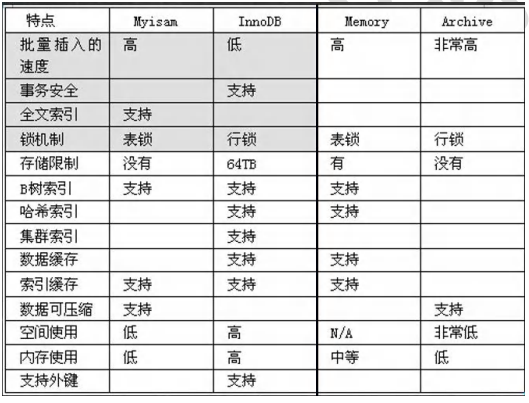
## 15.3、细节说明
重点介绍三种: MyISAM、InnoDB、MEMORY。

- MyISAM
不支持事务、也不支持外键，但其访问速度快。
- InnoDB
存储引擎提供了具有提交、回滚和崩溃恢复能力的事务安全。但是比起MyISAM存储引擎，InnoDB写的处理效率差一些并且会占用更多的磁盘空间以保留数据和索引。
- MEMORY
存储引擎使用存在内存中的内容来创建表。每个MEMORY表只实际对应一个磁盘文件。MEMORY类型的表访问非常得快，因为它的数据是放在内存中的，并且默认使用HASH索引。但是-旦MySQL服务关闭，表中的数据就会丢失掉，表的结构还在。
## 15.4、修改存储引擎
`alter table 表名 engine = 储存引擎;`

# 16、视图(view)
## 16.1、基本概念
视图是一个虚拟表，其内容由查询定义。
同真实的表一样，视图包含列，其数据来自对应的真实表(基表)。
视图和基表关系的示意图：
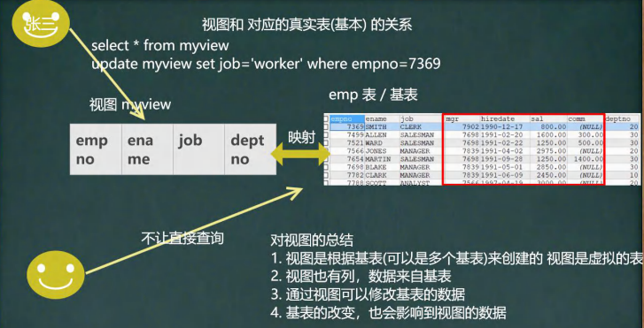
## 16.2、基本使用
```sql
-- 创建一个视图emp_view01，只能查询emp表的(empno、ename, job 和 deptno ) 信息
-- 创建视图
create view emp_view01
	as
	select empno, ename, job, deptno from emp; 

-- 查看视图
desc emp_view01

select * from emp_view01;
select empno, job  from emp_view01;

-- 查看创建视图的指令
show create view emp_view01

-- 删除视图
drop view emp_view01;


-- 视图的细节

-- 1. 创建视图后，到数据库去看，对应视图只有一个视图结构文件(形式: 视图名.frm) 
-- 2. 视图的数据变化会影响到基表，基表的数据变化也会影响到视图[insert update delete ]


-- 3. 视图中可以再使用视图 , 比如从emp_view01 视图中，选出empno,和ename做出新视图
desc emp_view01

create view emp_view02
	as
	select empno, ename from emp_view01
	
select * from emp_view02
```
## 16.3、实际应用

- **安全**
一些数据表有着重要的信息。有些字段是保密的，不能让用户直接看到。这时就可以创建一个视图，在这张视图中只保留一部分字段。这样，用户就可以查询自己需要的字段，不能查看保密的字段。
- **性能**
关系数据库的数据常常会分表存储，使用外键建立这些表的之间关系。这时，数据库查询通常会用到连接JOIN)。这样做不但麻烦，效率相对也比较低。如果建立一个视图，将相关的表和字段组合在一起，就可以避免使用JOIN查询数据。
- **灵活**
如果系统中有一张旧的表，这张表由于设计的问题，即将被废弃。然而，很多应用都是基于这张表，不易修改。这时就可以建立一张视图，视图中的数据直接映射到新建的表。这样，就可以少做很多改动，也达到了升级数据表的目的。
# 17、Mysql 管理
一般使管理软件，更方便快捷。比如：SQLyog
## 17.1、Mysql 用户
mysq|中的用户，都存储在系统数据库mysq|中user表中。
**user表重要字段说明:**

- **host：**允许登录的"位置", localhost表示该用户只允许本机登录，也可以指定ip地址，比如:192.168.1.100
- **user：**用户名
- **authentication string：**密码，是通过mysql的password()函数加密之后的密码。
## 17.2、创建用户
```sql
-- 创建新的用户
create user 'renchao'@'localhost' identified by '12345678'；

-- 查看用户
select `host`, `user`, authentication_string  from mysql.user
```
## 17.3、删除用户
```sql
-- 2. 删除用户
drop user 'renchao'@'localhost'
```
## 17.4、用户修改密码
mysql 密码修改：[https://blog.csdn.net/qq_39344689/article/details/89674079](https://blog.csdn.net/qq_39344689/article/details/89674079)
```sql
-- 修改用户 两种方法都可以
alter user 'renchao'@'localhost' identified by '12345678';
set password for 'renchao'@'localhost' = password('654321')

-- 修改自己的密码
set password = password('654321');
```
## 17.5、mysql 中的权限
| **权 限**                   | **作用范围**         | **作 用**                     |
| --------------------------- | -------------------- | ----------------------------- |
| **all**                     | 服务器               | 所有权限                      |
| **select**                  | 表、列               | 选择行                        |
| **insert**                  | 表、列               | 插入行                        |
| **update**                  | 表、列               | 更新行                        |
| **delete**                  | 表                   | 删除行                        |
| **create**                  | 数据库、表、索引     | 创建                          |
| **drop**                    | 数据库、表、视图     | 删除                          |
| **reload**                  | 服务器               | 允许使用flush语句             |
| **shutdown**                | 服务器               | 关闭服务                      |
| **process**                 | 服务器               | 查看线程信息                  |
| **file**                    | 服务器               | 文件操作                      |
| **grant option**            | 数据库、表、存储过程 | 授权                          |
| **references**              | 数据库、表           | 外键约束的父表                |
| **index**                   | 表                   | 创建/删除索引                 |
| **alter**                   | 表                   | 修改表结构                    |
| **show databases**          | 服务器               | 查看数据库名称                |
| **super**                   | 服务器               | 超级权限                      |
| **create temporary tables** | 表                   | 创建临时表                    |
| **lock tables**             | 数据库               | 锁表                          |
| **execute**                 | 存储过程             | 执行                          |
| **replication client**      | 服务器               | 允许查看主/从/二进制日志状态  |
| **replication slave**       | 服务器               | 主从复制                      |
| **create view**             | 视图                 | 创建视图                      |
| **show view**               | 视图                 | 查看视图                      |
| **create routine**          | 存储过程             | 创建存储过程                  |
| **alter routine**           | 存储过程             | 修改/删除存储过程             |
| **create user**             | 服务器               | 创建用户                      |
| **event**                   | 数据库               | 创建/更改/删除/查看事件       |
| **trigger**                 | 表                   | 触发器                        |
| **create tablespace**       | 服务器               | 创建/更改/删除表空间/日志文件 |
| **proxy**                   | 服务器               | 代理成为其它用户              |
| **usage**                   | 服务器               | 没有权限                      |

## 17.6、给用户授权
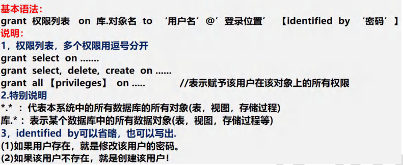
```sql
-- 给 renchao 分配查看 news 表和 添加news的权限
GRANT SELECT , INSERT 
	ON testdb.news
	TO 'renchao'@'localhost'
	
-- 可以增加update权限
GRANT UPDATE  
	ON testdb.news
	TO 'renchao'@'localhost'
```
## 17.7、回收用户授权
```sql
-- 回收 renchao 用户在 testdb.news 表的所有权限
REVOKE SELECT , UPDATE, INSERT ON testdb.news FROM 'renchao'@'localhost'
REVOKE ALL ON testdb.news FROM 'renchao'@'localhost'
```
## 17.8、权限生效指令
`flush privileges;`
## 17.9、细节说明

- 在创建用户的时候，如果不指定Host,则为%，%表示表示所有IP都有连接权限
`create user xxx;`
- 也可以这样指定：`create user 'xxx'@'192.168.1.%';`
表示xxx用户在192.168.1.* 的ip可以登录mysql。
- 在删除用户的时候，如果host不是%，需要明确指定'用户@'host值'。