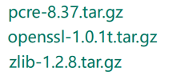
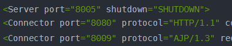
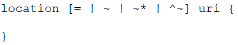
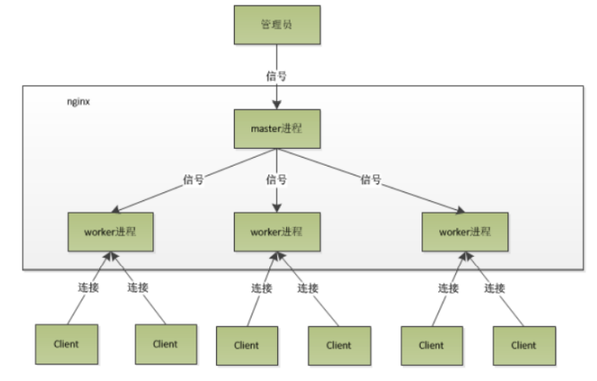
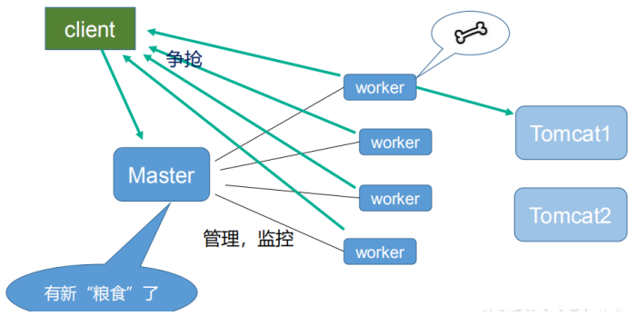
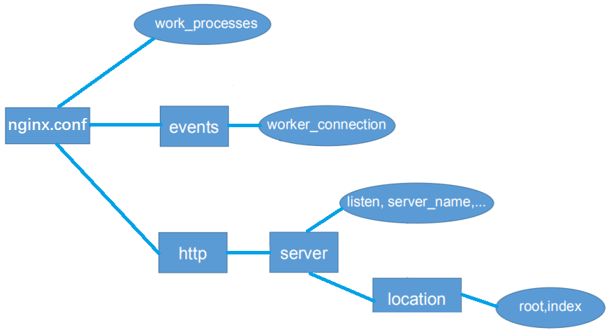
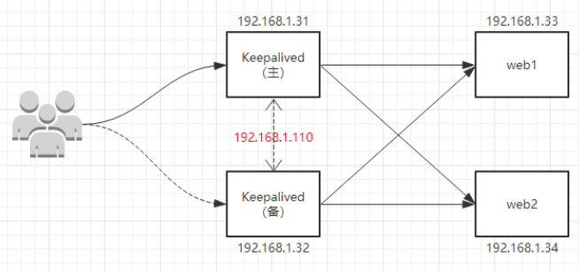

# 第 1 章 Nginx 简介
## 1.1、Nginx 概述
Nginx ("engine x") 是一个高性能的 HTTP 和反向代理服务器,特点是**占有内存少，并发能力强**，事实上 nginx 的并发能力确实在同类型的网页服务器中表现较好，中国大陆使用 nginx 网站用户有：百度、京东、新浪、网易、腾讯、淘宝等。
常用版本分为四大阵营

- Nginx开源版
   - [http://nginx.org/](http://nginx.org/)
- Nginx plus 商业版
   - [https://www.nginx.com](https://www.nginx.com)
- openresty
   - [http://openresty.org/cn/](http://openresty.org/cn/)
- Tengine
   - [http://tengine.taobao.org/](http://tengine.taobao.org/)
## 1.2、web 服务器
Nginx 可以作为静态页面的 web 服务器，同时还支持 CGI 协议的动态语言，比如 perl、php等。但是不支持 java。Java 程序只能通过与 tomcat 配合完成。
Nginx 专为性能优化而开发，性能是其最重要的考量，实现上非常注重效率 ，能经受高负载的考验，有报告表明能支持高达 50,000 个并发连接数。
[https://lnmp.org/nginx.html](https://lnmp.org/nginx.html)
## 1.3、正向代理
Nginx 不仅可以做反向代理，实现负载均衡。还能用作正向代理来进行上网等功能。
正向代理：如果把局域网外的 Internet 想象成一个巨大的资源库，则局域网中的客户端要访问 Internet，则需要通过代理服务器来访问，这种代理服务就称为正向代理。

## 1.4、反向代理
反向代理，其实客户端对代理是无感知的，因为客户端不需要任何配置就可以访问，我们只需要将请求发送到反向代理服务器，由反向代理服务器去选择目标服务器获取数据后，再返回给客户端，此时反向代理服务器和目标服务器对外就是一个服务器，暴露的是代理服务器地址，隐藏了真实服务器 IP 地址。

## 1.5、负载均衡
客户端发送多个请求到服务器，服务器处理请求，有一些可能要与数据库进行交互，服务器处理完毕后，再将结果返回给客户端。
这种架构模式对于早期的系统相对单一，并发请求相对较少的情况下是比较适合的，成本也低。但是随着信息数量的不断增长，访问量和数据量的飞速增长，以及系统业务的复杂度增加，这种架构会造成服务器相应客户端的请求日益缓慢，并发量特别大的时候，还容易造成服务器直接崩溃。很明显这是由于服务器性能的瓶颈造成的问题，那么如何解决这种情况呢？
我们首先想到的可能是升级服务器的配置，比如提高 CPU 执行频率，加大内存等提高机器的物理性能来解决此问题，但是我们知道摩尔定律的日益失效，硬件的性能提升已经不能满足日益提升的需求了。最明显的一个例子，天猫双十一当天，某个热销商品的瞬时访问量是极其庞大的，那么类似上面的系统架构，将机器都增加到现有的顶级物理配置，都是不能够满足需求的。那么怎么办呢？
上面的分析我们去掉了增加服务器物理配置来解决问题的办法，也就是说纵向解决问题的办法行不通了，那么横向增加服务器的数量呢？这时候集群的概念产生了，单个服务器解决不了，我们增加服务器的数量，然后将请求分发到各个服务器上，将原先请求集中到单个服务器上的情况改为将请求分发到多个服务器上，将负载分发到不同的服务器，也就是我们所说的负载均衡。

## 1.6、动静分离
为了加快网站的解析速度，可以把动态页面和静态页面由不同的服务器来解析，加快解析速度。降低原来单个服务器的压力。

# 第 2 章 Nginx 安装
## 2.1、下载
nginx 官网：

- [http://nginx.org/en/download.html](http://nginx.org/en/download.html)

需要的依赖：

## 2.2、安装

- 第一步，安装 pcre
   - `wget http://downloads.sourceforge.net/project/pcre/pcre/8.37/pcre-8.37.tar.gz`
   - 解压文件：`tar -zxvf pcre-8.37.tar.gz`
   - 进入解压后的文件夹 `./configure` 
   - 然后执行 `make && make install`
   - 也可以使用 yum 安装
   
- 第二步，安装 openssl 和 zlib
   - `yum -y install make zlib zlib-devel gcc-c++ libtool openssl openssl-devel`
   
- 第三步，安装 nginx
   - `wget http://nginx.org/download/nginx-1.12.2.tar.gz`
   
   - 解压 `tar -zxvf nginx-1.12.2.tar.gz`
   
   - 进入解压缩目录，执行`./configure`
   
     默认没有安装ssl模块，下面是添加ssl模块
   
     `./configure --prefix=/usr/local/nginx --with-http_ssl_module --with-http_v2_module`
   
   - 安装 `make && make install`
   
- 第四步，端口设置
   - 查看开放的端口号
      - `firewall-cmd --zone=public --list-ports`
   - 设置开放的端口号
      - `firewall-cmd --add-service=http --permanent`
      - `firewall-cmd --add-port=80/tcp --permanent`
   - 重启防火墙
      - `firewall-cmd --reload`

> 1、说明
> linux configure --prefix 的作用是：编译的时候用来指定程序存放路径 。
> ./configure --prefix=/usr/local/nginx
> 如果不指定 --prefix则安装程序
> 可执行文件默认放在 /usr/local/bin ；
> 库文件默认放在 /usr/local/lib ；
> 配置文件默认放在 /usr/local/etc ；
> 其它的资源文件放在 /usr /local/share 。
>
> 2、如果指定 --prefix
> 比如： --prefix=/usr/local/nginx ，则此软件的所有文件都放到 /usr/local/nginx 目录下，很整齐。
>
> 3、其他优点：
> 卸载软件时，只须简单的删除该安装目录，就可以把软件卸载得干干净净；
> 移植软件时，只需拷贝整个目录到另外一个机器即可；
> 当然要卸载程序，也可以在原来的make目录下用一次make uninstall，但前提是make文件指定过uninstall 。

# 第 3 章 常用命令和配置文件
## 3.1、常用的命令
在 `/usr/local/nginx/sbin` 目录下执行。

- 启动命令
   - `./nginx`
- 关闭命令
   - `./nginx -s stop`
- 重新加载命令
   - `./nginx -s reload`
## 3.2、配置文件
### 3.2.1、nginx.conf介绍
nginx 安装目录下，其默认的配置文件都放在这个目录的 conf 目录下，而主配置文件 `nginx.conf` 也在其中，后续对 nginx 的使用基本上都是对此配置文件进行相应的修改
配置文件中有很多#， 开头的表示注释内容，我们去掉所有以 # 开头的段落，精简之后的内容如下：
```bash
worker_processes  1;

events {
    worker_connections  1024;
}


http {
    include       mime.types;
    default_type  application/octet-stream;
    sendfile        on;
    keepalive_timeout  65;

    server {
        listen       80;
        server_name  localhost;

        location / {
            root   html;
            index  index.html index.htm;
        }

        error_page   500 502 503 504  /50x.html;
        location = /50x.html {
            root   html;
        }
    }
}
```
根据上述文件，我们可以很明显的将 nginx.conf 配置文件分为三部分： 

- 全局块
- events 块
- http 块
### 3.2.2、全局块 
从配置文件开始到 events 块之间的内容，主要会设置一些影响 nginx 服务器整体运行的配置指令，主要包括配置运行 Nginx 服务器的用户（组）、允许生成的 worker process 数，进程 PID 存放路径、日志存放路径和类型以及配置文件的引入等。
比如上面第一行配置的：
`worker_processes  1;`
这是 Nginx 服务器并发处理服务的关键配置，worker_processes 值越大，可以支持的并发处理量也越多，但是会受到硬件、软件等设备的制约。
### 3.2.3、events 块 
比如上面的配置：
`events { worker_connections  1024; }`
events 块涉及的指令主要影响 Nginx 服务器与用户的网络连接，常用的设置包括是否开启对多 work process 下的网络连接进行序列化，是否允许同时接收多个网络连接，选取哪种事件驱动模型来处理连接请求，每个 word process 可以同时支持的最大连接数等。
上述例子就表示每个 work process 支持的最大连接数为 1024.
这部分的配置对 Nginx 的性能影响较大，在实际中应该灵活配置。
### 3.2.4、http 块
这算是 Nginx 服务器配置中最频繁的部分，代理、缓存和日志定义等绝大多数功能和第三方模块的配置都在这里。
需要注意的是：http 块也可以包括 **http全局块**、**server块**。
#### ①、http 全局块
 http 全局块配置的指令包括文件引入、MIME-TYPE 定义、日志自定义、连接超时时间、单链接请求数上限等。
#### ②、server 块
这块和虚拟主机有密切关系，虚拟主机从用户角度看，和一台独立的硬件主机是完全一样的，该技术的产生是为了节省互联网服务器硬件成本。
每个 http 块可以包括多个 server 块，而每个 server 块就相当于一个虚拟主机。
每个 server 块也分为：全局 server 块，以及可以同时包含多个 locaton 块。

- 1、**全局 server 块**
   - 最常见的配置是本虚拟机主机的监听配置和本虚拟主机的名称或 IP 配置。
- 2、**location 块**
   - 一个 server 块可以配置多个 location 块。
   - 这块的主要作用是基于 Nginx 服务器接收到的请求字符串（例如 server_name/uri-string），对虚拟主机名称（也可以是 IP 别名）之外的字符串（例如 前面的 /uri-string）进行匹配，对特定的请求进行处理。地址定向、数据缓存和应答控制等功能，还有许多第三方模块的配置也在这里进行。

# 第 4 章 反向代理配置
## 4.1、实例一
实现效果：使用 nginx 反向代理，访问 www.123.com 直接跳转到 192.168.123.167:8080

- 启动一个 tomcat
- 通过修改本地 host 文件，将 www.123.com 映射到 192.168.123.167
- 在 nginx.conf 配置文件中增加如下配置
```bash
    server {
        listen       80;
        server_name  www.123.com;
        location / {
            proxy_pass http://127.0.0.1:8080;
        }
    }
```
## 4.2、实例二
实现效果：使用 nginx 反向代理，根据访问的路径跳转到不同端口的服务。
> 访问 http://www.1234.com/edu/ 直接跳转到 192.168.123.167:8080
> 访问 http://www.1234.com/vod/ 直接跳转到 192.168.123.167:8081

- 准备两个 tomcat，一个 8080 端口，一个 8081 端口，并准备好测试的页面
   - 8081 的 tomcat 需要修改3处端口号
   - 
- 修改 nginx 的配置文件，在 http 块中添加下面代码：
```bash
    server {
        listen       80;
        server_name  www.1234.com;

        location ~ /edu/ {
            proxy_pass http://127.0.0.1:8080;
        }
		
        location ~ /vod/ {
            proxy_pass http://127.0.0.1:8081;
        }
    }
```
location 指令说明：
 该指令用于匹配 URL。
 语法如下：


- `=` ：用于不含正则表达式的 uri 前，要求请求字符串与 uri 严格匹配，如果匹配成功，就停止继续向下搜索并立即处理该请求。
- `~`：用于表示 uri 包含正则表达式，并且区分大小写。
- `~*`：用于表示 uri 包含正则表达式，并且不区分大小写。
- `^~`：用于不含正则表达式的 uri 前，要求 Nginx 服务器找到标识 uri 和请求字符串匹配度最高的 location 后，立即使用此 location 处理请求，而不再使用 location 块中的正则 uri 和请求字符串做匹配。
> 注意：如果 uri 包含正则表达式，则必须要有 ~ 或者 ~* 标识。

## 4.3、请求头配置

通过proxy_set_header可以配置请求头信息。

比如：

```bash
    location / {
		proxy_set_header Host $host;
		proxy_pass http://gulimall;
    }
```

> 注意：
>
> nginx代理给网关的时候，会丢失请求的host信息。如果需要host信息，必须要重新设置

# 第 5 章 负载均衡配置
## 5.1、测试代码
实现效果：配置负载均衡

- 首先准备两个同时启动的 Tomcat 。
   - 在两台 tomcat 的 webapps 目录中，都创建 edu/a.html。
- 在 nginx.conf 中进行配置
```bash
	# 负载均衡列表
	upstream myload {
		server 192.168.123.167:8080;
		server 192.168.123.167:8081;
	}
	
    server {
        listen       80;
        server_name  www.12345.com;

        location / {
            proxy_pass http://myload;
        }
    }
```
> 在 linux 下有 Nginx、LVS、Haproxy 等等服务可以提供负载均衡服务。

## 5.2、分配方式(策略)
### 5.2.1、轮询（默认）
每个请求按时间顺序逐一分配到不同的后端服务器，如果后端服务器 down 掉，能自动剔除。
### 5.2.2、weight（权重）
weight 代表权,重默认为 1,权重越高被分配的客户端越多指定轮询几率，weight 和访问比率成正比，用于后端服务器性能不均的情况。 例如：
```bash
upstream server_pool{ 
  server 192.168.5.21 weight=10; 
  server 192.168.5.22 weight=10; 
}
```
### 5.2.3、ip_hash
每个请求按访问 ip 的 hash 结果分配，这样每个访客固定访问一个后端服务器，可以解决 session 的问题。 如：
```bash
upstream server_pool{ 
  ip_hash; 
  server 192.168.5.21:80;
  server 192.168.5.22:80;
}
```
### 5.2.4、fair（第三方）
按后端服务器的响应时间来分配请求，响应时间短的优先分配。
```bash
upstream server_pool{ 
  server 192.168.5.21:80;
  server 192.168.5.22:80;
  fair;
}
```
# 第 6 章 动静分离配置
## 6.1、介绍
Nginx 动静分离简单来说就是把动态跟静态请求分开，不能理解成只是单纯的把动态页面和静态页面物理分离。严格意义上说应该是动态请求跟静态请求分开，可以理解成使用 Nginx 处理静态页面，Tomcat 处理动态页面。动静分离从目前实现角度来讲大致分为两种，

- 一种是纯粹把静态文件独立成单独的域名，放在独立的服务器上，也是目前主流推崇的方案。
- 另外一种方法就是动态跟静态文件混合在一起发布，通过 nginx 来分开。

通过 location 指定不同的后缀名实现不同的请求转发。
通过 expires 参数设置，可以使浏览器缓存过期时间，减少与服务器之前的请求和流量。具体 expires 定义：是给一个资源设定一个过期时间，也就是说无需去服务端验证，直接通过浏览器自身确认是否过期即可，所以不会产生额外的流量。此种方法非常适合不经常变动的资源。（如果经常更新的文件，不建议使用 expires 来缓存），比如设置 3d，表示在这 3 天之内访问这个 URL，发送一个请求，比对服务器该文件最后更新时间没有变化，则不会从服务器抓取，返回状态码304，如果有修改，则直接从服务器重新下载，返回状态码 200。
```bash
expires 30s;   	#缓存30秒
expires 30m;  	#缓存30分钟   
expires 2h;     #缓存2小时
expires 30d;    #缓存30天
```
## 6.2、测试代码

- 项目资源准备
   - 在 liunx 系统中准备静态资源，用于进行访问
   - 
- 配置 nginx.conf
```bash
    server {
        listen       80;
        server_name  www.123456.com;

        location /www/ {
        	# alias ，root会把location后面的路径添加到data后面，alias不会，直接映射 到文件夹
            root /data/;
        }
		
        location /image/ {
            root /data/;
            # 打开目录浏览功能
            autoindex on;
        }
    }
```

# 第 7 章 原理与优化参数
## 7.1、master-workers


## 7.2、优点
master-workers 的机制的好处
首先，对于每个 worker 进程来说，独立的进程，不需要加锁，所以省掉了锁带来的开销，同时在编程以及问题查找时，也会方便很多。
其次，采用独立的进程，可以让互相之间不会影响，一个进程退出后，其它进程还在工作，服务不会中断，master 进程则很快启动新的 worker 进程。
当然，worker 进程的异常退出，肯定是程序有 bug 了，异常退出，会导致当前 worker 上的所有请求失败，不过不会影响到所有请求，所以降低了风险。

## 7.3、设置 worker 数量
Nginx 同 redis 类似都采用了 io 多路复用机制，每个 worker 都是一个独立的进程，但每个进程里只有一个主线程，通过异步非阻塞的方式来处理请求， 即使是千上万个请求也不在话下。每个 worker 的线程可以把一个 cpu 的性能发挥到极致。所以 worker 数和服务器的 cpu 数相等是最为适宜的。设少了会浪费 cpu，设多了会造成 cpu 频繁切换上下文带来的损耗。
### 7.3.1、2CPU开启2进程
```bash
worker_processes     2;
worker_cpu_affinity 01 10;
```
> 解释：01表示启用第一个CPU内核，10表示启用第二个CPU内核
> worker_cpu_affinity 01 10;表示第一个进程对应着第一个CPU内核，第二个进程对应着第二个CPU内核。

### 7.3.2、2CPU开启4进程
```bash
worker_processes     4;
worker_cpu_affinity 01 10 01 10;
```
> 解释：开启了四个进程，它们分别对应着开启2个CPU内核。

### 7.3.3、4CPU开启4进程
```bash
worker_processes     4;
worker_cpu_affinity 0001 0010 0100 1000;
```
> 解释：0001表示启用第一个CPU内核，0010表示启用第二个CPU内核，依此类推

### 7.3.4、4CPU开启2进程
```bash
worker_processes     2;
worker_cpu_affinity 0101 1010;
```
> 解释：0101表示开启第一个和第三个内核，1010表示开启第二个和第四个内核；2个进程对应着四个内核；worker_cpu_affinity配置是写在/etc/nginx/nginx.conf里面的；2核是 01，四核是0001，8核是00000001，有多少个核，就有几位数，1表示该内核开启，0表示该内核关闭。

### 7.3.5、8CPU开启8进程
```bash
worker_processes     8;
worker_cpu_affinity 00000001 00000010 00000100 00001000 00010000 00100000 01000000 10000000;
```
> 解释：0001表示启用第一个CPU内核，0010表示启用第二个CPU内核。
> 依此类推；worker_processes最多开启8个，8个以上性能提升不会再提升了，而且稳定性变得更低，所以8个进程够用了。

配置完之后可以重启nginx，用ab工具或者wrk工具，可以进行性能测试，在服务器上执行top，然后按1，就可以看到cpu工作情况，如果多个cpu内核的利用率差不多，就证明nginx已经成功利用了多核cpu，测试结束后，cpu内核的负载都同时降低。
## 7.4、连接数 worker_connection
这个值是表示每个 worker 进程所能建立连接的最大值，所以，一个 nginx 能建立的最大连接数，应该是：
`worker_connections * worker_processes`
> worker_connections：worker 最大连接数。
> worker_processes：worker 数量。

 能够支持的最大并发数量是：

- 如果是支持 http1.1 的浏览器每次访问要占两个连接，所以普通的静态访问最大并发数是：
   - `worker_connections * worker_processes /2`
- 而如果是 HTTP 作为反向代理来说，最大并发数量应该是
   - `worker_connections * worker_processes/4`
   - 因为作为反向代理服务器，每个并发会建立与客户端的连接和与后端服务的连接，会占用两个连接。
## 7.5、nginx.conf 结构

> **详情见配置文件 nginx.conf。**


# 第 8 章 搭建高可用集群
Keepalived+Nginx 高可用集群

## 8.1、准备环境

- 两台 nginx 服务器
- 安装keepalived
   - `yum install keepalived –y`
   - 安装之后，配置文件在 `etc/keepalived/keepalived.conf`
- 虚拟 ip
## 8.2、完成高可用配置（主从配置）
### 8.2.1、修改 keepalivec.conf
两台服务器都设置
```bash
global_defs {
	notification_email {
		acassen@firewall.loc
		failover@firewall.loc
		sysadmin@firewall.loc
	}
	notification_email_from Alexandre.Cassen@firewall.loc
	smtp_server 192.168.123.167 #修改为本机ip
	smtp_connect_timeout 30
	router_id LVS_DEVEL
}

# 在 vrrp_instance 部分需要配置 track_script 选项来关联 VRRP script,否则默认脚本不会执行。
vrrp_script chk_http_port {
	script "/usr/local/src/nginx_check.sh"
	interval 2 #（检测脚本执行的间隔）
	weight 2
}
vrrp_instance VI_1 {
	state MASTER # 备份服务器上将 MASTER 改为 BACKUP 
	interface ens33 //网卡
	virtual_router_id 51 # 主、备机的 virtual_router_id 必须相同
	priority 100 # 主、备机取不同的优先级，主机值较大，备份机值较小
	advert_int 1
	
	authentication {
		auth_type PASS
		auth_pass 1111
	}
	virtual_ipaddress {
		192.168.123.50 // VRRP H 虚拟地址
	}
	
	track_script { # 关联上面的 vrrp_script chk_http_port
		chk_http_port
	}
}

```
### 8.2.2、添加检测脚本
两台服务器都在 `/usr/local/src` 添加检测脚本
```bash
#!/bin/bash
A=$(ps -C nginx --no-header | wc -l)
if [ $A -eq 0 ];then
	/usr/local/nginx/sbin/nginx
	sleep 2
	if [ `ps -C nginx --no-header |wc -l` -eq 0 ];then
		killall keepalived
	fi
fi
```
### 8.2.3、测试
把两台服务器上 nginx 和 keepalived 启动

- 启动 nginx：`./nginx`
- 启动 keepalived：`systemctl start keepalived.service`
- 在浏览器地址栏输入 虚拟 ip 地址 192.168.123.50
- 查看服务器的虚拟IP绑定情况。`ip -a`
# 第 9 章 UrlRewrite - 伪静态
## 9.1、语法格式
rewrite是实现URL重写的关键指令，根据regex (正则表达式)部分内容，重定向到replacement，结尾是flag标记。
`rewrite <regex> <replacement> [flag];`
上面分别是：`关键字 <正则> <替代内容> [flag标记]`

- 关键字：其中关键字不能改变
- 正则：兼容正则表达式语句进行规则匹配
- 替代内容：将正则匹配的内容替换成replacement
- flag标记：rewrite支持的flag标记
## 9.2、rewrite参数位置

- server
- location
- if
## 9.3、flag标记说明

- last：本条规则匹配完成后，继续向下匹配新的location URI规则
- break：本条规则匹配完成即终止，不再匹配后面的任何规则
- redirect：返回302临时重定向，浏览器地址会显示跳转后的URL地址
- permanent：返回301永久重定向，浏览器地址栏会显示跳转后的URL地址
## 9.4、实例
`rewrite ^/([0-9]+).html$ /index.jsp?pageNum=$1 break;`

# 第 10 章 防盗链配置
## 10.1、语法
`valid_referers none | blocked | server_names | strings ....;`

- none：检测 Referer 头域不存在的情况。
- blocked：检测 Referer 头域的值被防火墙或者代理服务器删除或伪装的情况。这种情况该头域的值不以“http://” 或 “https://” 开头。
- server_names：设置一个或多个 URL ，检测 Referer 头域的值是否是这些 URL 中的某一个。
## 10.2、配置实例

- 返回页面
```bash
valid_referers 192.168.44.101;
if ($invalid_referer) {
  return 403; # 可以添加403错误页面，返回的就是自定义的403页面
}
```

- 返回图片
```bash
valid_referers 192.168.44.101;
if ($invalid_referer) {
  rewrite ^/ /img/x.png break;
}
```
## 10.3、使用curl测试

- 无引用
   - `curl -I http://192.168.44.101/img/logo.png`
- 带引用
   - `curl -e "http://baidu.com" -I http://192.168.44.101/img/logo.png`


# 第 11 章 prometheus监控

[prometheus监控nginx的两种方式-CSDN博客](https://blog.csdn.net/lvan_test/article/details/123579531)

## 11.1、方式一：tub_status

- 开启nginx_stub_status模块

  `./nginx -V 2>&1 | grep -o with-http_stub_status_module`

  如果在终端输出with-http_stub_status_module，说明nginx已启用tub_status模块；

- 添加nginx_stub_status模块

  `./configure --with-http_stub_status_module`

  `make & make install`

- 指定status页面的URL；

  ```bash
  location /nginx_status {
      stub_status on;
      access_log off;
      allow 127.0.0.1;
      deny all;
  }
  ```

  > location地址需严格命名为nginx_status。
  > allow 127.0.0.1和deny all表示仅允许本地访问。
  > 若需允许Nginx组件访问，则可将这两行代码注释，或者将127.0.0.1设置为Nginx组件的IP地址。

- 启动nginx-prometheus-exporter

- 下载 https://github.com/nginxinc/nginx-prometheus-exporter/releases

  - 解压 tar -zxvf
  - 执行命令启动nginx-prometheus -exporter ；
  - nohup ./nginx-prometheus-exporter -nginx.scrape-uri http://127.0.0.1:80/nginx_status &

- prometheus.yml文件添加被监控的机器节点；

  ```bash
  - job_name: 'nginx_status_module' # 采集nginx的指标
    metrics_path: '/metrics' # 拉取指标的接口路径
    scrape_interval: 10s # 采集指标的间隔周期
    static_configs:
    - targets: ['127.0.0.1:9113'] # nginx-prometheus-exporter服务的ip和端口
  ```

  

## 11.2、方式二：vts工具监控

参考博客