# 一、消息队列MQ
## 1、MQ 的相关概念
### 1.1、什么是 MQ 
**MQ**(**message queue**)，从字面意思上看，本质是个队列，FIFO 先入先出，只不过队列中存放的内容是 message 而已，还是一种跨进程的通信机制，用于上下游传递消息。在互联网架构中，MQ 是一种非常常见的上下游“逻辑解耦+物理解耦”的消息通信服务。使用了 MQ 之后，消息发送上游只需要依赖 MQ，不用依赖其他服务。
### 1.2、为什么要用 MQ 
#### 1.2.1、流量消峰
举个例子，如果订单系统最多能处理一万次订单，这个处理能力应付正常时段的下单时绰绰有余，正常时段我们下单一秒后就能返回结果。但是在高峰期，如果有两万次下单操作系统是处理不了的，只能限制订单超过一万后不允许用户下单。使用消息队列做缓冲，我们可以取消这个限制，把一秒内下的订单分散成一段时间来处理，这时有些用户可能在下单十几秒后才能收到下单成功的操作，但是比不能下单的体验要好。
#### 1.2.2、应用解耦
以电商应用为例，应用中有订单系统、库存系统、物流系统、支付系统。用户创建订单后，如果耦合调用库存系统、物流系统、支付系统，任何一个子系统出了故障，都会造成下单操作异常。当转变成基于消息队列的方式后，系统间调用的问题会减少很多，比如物流系统因为发生故障，需要几分钟来修复。在这几分钟的时间里，物流系统要处理的内存被缓存在消息队列中，用户的下单操作可以正常完成。当物流系统恢复后，继续处理订单信息即可，中单用户感受不到物流系统的故障，提升系统的可用性。
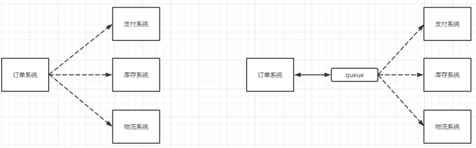
#### 1.2.3、异步处理
有些服务间调用是异步的，例如 A 调用 B，B 需要花费很长时间执行，但是 A 需要知道 B 什么时候可以执行完，以前一般有两种方式，A 过一段时间去调用 B 的查询 api 查询。或者 A 提供一个 callback api，B 执行完之后调用 api 通知 A 服务。这两种方式都不是很优雅，使用消息总线，可以很方便解决这个问题，A 调用 B 服务后，只需要监听 B 处理完成的消息，当 B 处理完成后，会发送一条消息给 MQ，MQ 会将此消息转发给 A 服务。这样 A 服务既不用循环调用 B 的查询 api，也不用提供 callback api。同样 B 服务也不用做这些操作。A 服务还能及时的得到异步处理成功的消息。
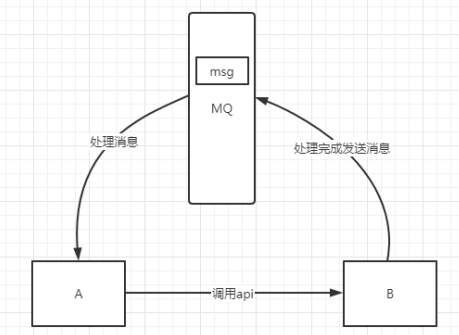
### 1.3、MQ 的分类 
#### 1.3.1、ActiveMQ
优点：单机吞吐量万级，时效性 ms 级，可用性高，基于主从架构实现高可用性，消息可靠性较低的概率丢失数据
缺点：官方社区现在对 ActiveMQ 5.x 维护越来越少，高吞吐量场景较少使用。
#### 1.3.2、Kafka
大数据的杀手锏，谈到大数据领域内的消息传输，则绕不开 Kafka，这款为**大数据而生**的消息中间件，以其百万级 TPS 的吞吐量名声大噪，迅速成为大数据领域的宠儿，在数据采集、传输、存储的过程中发挥着举足轻重的作用。目前已经被 LinkedIn，Uber, Twitter, Netflix 等大公司所采纳。
**优点: **
性能卓越，单机写入 TPS 约在百万条/秒，最大的优点，就是**吞吐量高**。时效性 ms 级可用性非常高，kafka 是分布式的，一个数据多个副本，少数机器宕机，不会丢失数据，不会导致不可用,消费者采用 Pull 方式获取消息, 消息有序, 通过控制能够保证所有消息被消费且仅被消费一次;有优秀的第三方Kafka Web 管理界面 Kafka-Manager；在日志领域比较成熟，被多家公司和多个开源项目使用；功能支持：功能较为简单，主要支持简单的 MQ 功能，在大数据领域的实时计算以及日志采集被大规模使用。
**缺点：**
Kafka 单机超过 64 个队列/分区，Load 会发生明显的飙高现象，队列越多，load 越高，发送消息响应时间变长，使用短轮询方式，实时性取决于轮询间隔时间，消费失败不支持重试；支持消息顺序，但是一台代理宕机后，就会产生消息乱序，**社区更新较慢**。
#### 1.3.3、RocketMQ
RocketMQ 出自阿里巴巴的开源产品，用 Java 语言实现，在设计时参考了 Kafka，并做出了自己的一些改进。被阿里巴巴广泛应用在订单，交易，充值，流计算，消息推送，日志流式处理，binglog 分发等场景。
优点：
**单机吞吐量十万级**，可用性非常高，分布式架构，**消息可以做到 0 丢失**,MQ 功能较为完善，还是分布式的，扩展性好，**支持 10 亿级别的消息堆积**，不会因为堆积导致性能下降,源码是 java 我们可以自己阅读源码，定制自己公司的 MQ 。
缺点：
**支持的客户端语言不多**，目前是 java 及 c++，其中 c++不成熟；社区活跃度一般,没有在 MQ 核心中去实现 JMS 等接口,有些系统要迁移需要修改大量代码
#### 1.3.4、RabbitMQ
2007 年发布，是一个在 AMQP(高级消息队列协议)基础上完成的，可复用的企业消息系统，是当前最主流的消息中间件之一。
优点：
由于 erlang 语言的高并发特性，性能较好；吞吐量到万级，MQ 功能比较完备,健壮、稳定、易用、跨平台、支持多种语言 如：Python、Ruby、.NET、Java、JMS、C、PHP、ActionScript、XMPP、STOMP等，支持 AJAX 文档齐全；开源提供的管理界面非常棒，用起来很好用,社区活跃度高；更新频率相当高[https://www.rabbitmq.com/news.html](https://www.rabbitmq.com/news.html)
缺点：
商业版需要收费,学习成本较高
### 1.4、MQ 选择 
#### 1.4.1、Kafka
Kafka 主要特点是基于 Pull 的模式来处理消息消费，追求高吞吐量，一开始的目的就是用于日志收集和传输，适合产生**大量数据**的互联网服务的数据收集业务。**大型公司**建议可以选用，如果有**日志采集**功能，肯定是首选 kafka 了。
#### 1.4.2、RocketMQ
天生为**金融互联网**领域而生，对于可靠性要求很高的场景，尤其是电商里面的订单扣款，以及业务削峰，在大量交易涌入时，后端可能无法及时处理的情况。RoketMQ 在稳定性上可能更值得信赖，这些业务场景在阿里双 11 已经经历了多次考验，如果你的业务有上述并发场景，建议可以选择 RocketMQ。
#### 1.4.3、RabbitMQ
结合 erlang 语言本身的并发优势，性能好**时效性微秒级，社区活跃度也比较高**，管理界面用起来十分方便，如果你的**数据量没有那么大**，**中小型公司**优先选择功能比较完备的 RabbitMQ。
## 2、RabbitMQ
### 2.1、介绍 
RabbitMQ 是一个消息中间件：它接受并转发消息。你可以把它当做一个快递站点，当你要发送一个包裹时，你把你的包裹放到快递站，快递员最终会把你的快递送到收件人那里，按照这种逻辑 RabbitMQ 是一个快递站，一个快递员帮你传递快件。RabbitMQ 与快递站的主要区别在于，它不处理快件而是接收，存储和转发消息数据。
### 2.2、四大概念
#### 2.2.1、生产者
产生数据发送消息的程序是生产者
#### 2.2.2、交换机
交换机是 RabbitMQ 非常重要的一个部件，一方面它接收来自生产者的消息，另一方面它将消息推送到队列中。交换机必须确切知道如何处理它接收到的消息，是将这些消息推送到特定队列还是推送到多个队列，亦或者是把消息丢弃，这个得有交换机类型决定
#### 2.2.3、队列
队列是 RabbitMQ 内部使用的一种数据结构，尽管消息流经 RabbitMQ 和应用程序，但它们只能存储在队列中。队列仅受主机的内存和磁盘限制的约束，本质上是一个大的消息缓冲区。许多生产者可以将消息发送到一个队列，许多消费者可以尝试从一个队列接收数据。这就是我们使用队列的方式
#### 2.3.4、消费者
消费与接收具有相似的含义。消费者大多时候是一个等待接收消息的程序。请注意生产者，消费者和消息中间件很多时候并不在同一机器上。同一个应用程序既可以是生产者又是可以是消费者。
### 2.3、核心部分 
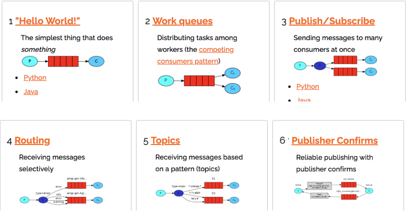
### 2.4、名词介绍
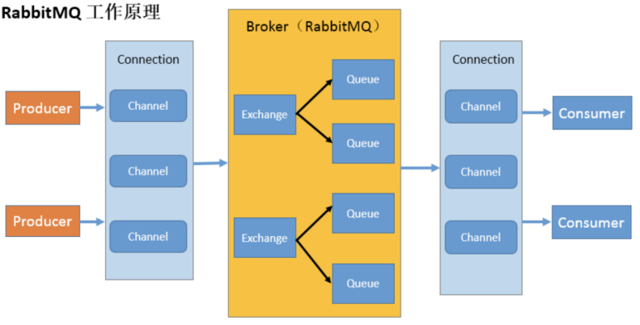

- **Broker：**接收和分发消息的应用，RabbitMQ Server 就是 Message Broker 。
- **Virtual host：**出于多租户和安全因素设计的，把 AMQP 的基本组件划分到一个虚拟的分组中，类似于网络中的 namespace 概念。当多个不同的用户使用同一个 RabbitMQ server 提供的服务时，可以划分出多个 vhost，每个用户在自己的 vhost 创建 exchange／queue 等。
- **Connection：**publisher／consumer 和 broker 之间的 TCP 连接。
- **Channel：**如果每一次访问 RabbitMQ 都建立一个 Connection，在消息量大的时候建立 TCP Connection 的开销将是巨大的，效率也较低。Channel 是在 connection 内部建立的逻辑连接，如果应用程序支持多线程，通常每个 thread 创建单独的 channel 进行通讯，AMQP method 包含了 channel id 帮助客户端和 message broker 识别 channel，所以 channel 之间是完全隔离的。Channel 作为轻量级的Connection 极大减少了操作系统建立 TCP connection 的开销 。
- **Exchange：**message 到达 broker 的第一站，根据分发规则，匹配查询表中的 routing key，分发消息到 queue 中去。常用的类型有：direct (point-to-point), topic (publish-subscribe) and fanout (multicast)。
- **Queue：**消息最终被送到这里等待 consumer 取走。
- **Binding：**exchange 和 queue 之间的虚拟连接，binding 中可以包含 routing key，Binding 信息被保存到 exchange 中的查询表中，用于 message 的分发依据。
## 3、安装 
### 3.1、官网地址
[https://www.rabbitmq.com/download.html](https://www.rabbitmq.com/download.html)
### 3.2、文件上传
`erlang-21.3-1.el7.x86_64.rpm`
`rabbitmq-server-3.8.8-1.el7.noarch.rpm`
> 例如：上传到/opt/rabbitmq 目录下(如果没有 rabbitmq 需要自己创建)

### 3.3、安装文件
照以下顺序安装

- `rpm -ivh erlang-21.3-1.el7.x86_64.rpm`
- `yum install socat -y`
- `rpm -ivh rabbitmq-server-3.8.8-1.el7.noarch.rpm`
### 3.4、常用命令

- 添加开机启动 RabbitMQ 服务
   - `chkconfig rabbitmq-server on`
- 启动服务
   - `/sbin/service rabbitmq-server start`
- 查看服务状态
   - `/sbin/service rabbitmq-server status`
- 停止服务(选择执行)
   - `/sbin/service rabbitmq-server stop`
- 开启 web 管理插件
   - `rabbitmq-plugins enable rabbitmq_management`
   - 然后重启服务
   - 用默认账号密码(guest)访问地址 `http://47.115.185.244:15672` 【出现权限问题】
### 3.5、防火墙设置

- 主要端口说明
   - 4369 -- erlang发现口
   - 5672 --client端通信口
   - 15672 -- 管理界面ui端口
   - 25672 -- server间内部通信口
- 防火墙放行
   - 放行：`firewall-cmd --permanent --add-port=端口/tcp`
   - 重新加载防火墙：`firewall-cmd --reload`
   - 查看是否放行成功：`firewall-cmd --zone=public --list-ports`
### 3.6、添加用户

- 创建账号
   - `rabbitmqctl add_user admin 123`
- 设置用户角色
   - `rabbitmqctl set_user_tags admin administrator`
- 设置用户权限
   - 格式：`set_permissions [-p <vhostpath>] <user> <conf> <write> <read>`
   - 执行命令：`rabbitmqctl set_permissions -p "/" admin ".*" ".*" ".*"`
   - 用户 user_admin 具有/vhost1 这个 virtual host 中所有资源的配置、写、读权限
- 查看用户和角色
   - `rabbitmqctl list_users`
- 然后使用 admin 用户登录
   - `http://47.115.185.244:15672`
### 3.7、重置命令

- 关闭应用的命令为
   - `rabbitmqctl stop_app`
- 清除的命令为
   - `rabbitmqctl reset`
- 启动命令为
   - `rabbitmqctl start_app`
- 重启命令
   - `service rabbitmq-server restart`

## 4、docker安装

```bash
docker run -d --name rabbitmq -p 5671:5671 -p 5672:5672 -p 4369:4369 -p 25672:25672 -p 15671:15671 -p 15672:15672 rabbitmq:management
```


# 二、Hello World

用 Java 编写两个程序。发送单个消息的生产者和接收消息并打印出来的消费者。
在下图中，“ P”是生产者，“ C”是消费者。中间的框是一个队列-RabbitMQ 代表使用者保留的消息缓冲区。
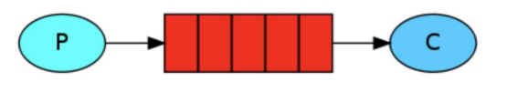
## 1、依赖
```xml
<!--rabbitmq 依赖客户端-->
<dependency>
  <groupId>com.rabbitmq</groupId>
  <artifactId>amqp-client</artifactId>
  <version>5.8.0</version>
</dependency>
<!--操作文件流的一个依赖-->
<dependency>
  <groupId>commons-io</groupId>
  <artifactId>commons-io</artifactId>
  <version>2.6</version>
</dependency>
```
## 2、消息生产者
```java
public class Producer {
    private final static String QUEUE_NAME = "hello";

    public static void main(String[] args) throws IOException, TimeoutException {
        // 一、创建连接工厂
        ConnectionFactory factory = new ConnectionFactory();
        factory.setHost("192.168.123.89");
        factory.setUsername("admin");
        factory.setPassword("123");

        // 二、创建连接
        Connection connection = factory.newConnection();

        // 三、获取信道
        Channel channel = connection.createChannel();

        /*
           四、生成一个队列
               1.队列名称
               2.队列里面的消息是否持久化 默认消息存储在内存中
               3.该队列是否只供一个消费者进行消费 是否进行共享 true 可以多个消费者消费
               4.是否自动删除 最后一个消费者端开连接以后 该队列是否自动删除 true 自动删除
               5.其他参数
         */
        channel.queueDeclare(QUEUE_NAME, false, false, false, null);
        /*
            五、发送一个消息
                1.发送到那个交换机
                2.路由的 key 是哪个
                3.其他的参数信息
                4.发送消息的消息体
         */
        String message = "hello world!!!";
        channel.basicPublish("", QUEUE_NAME, null, message.getBytes());
        System.out.println("消息发送完毕！");
    }
}
```
## 3、消息消费者
```java
public class Consumer {
    private final static String QUEUE_NAME = "hello";

    public static void main(String[] args) throws IOException, TimeoutException {
        // 一、创建连接工厂
        ConnectionFactory factory = new ConnectionFactory();
        factory.setHost("192.168.123.89");
        factory.setUsername("admin");
        factory.setPassword("123");

        // 二、创建连接
        Connection connection = factory.newConnection();
        Channel channel = connection.createChannel();
        System.out.println("等待接受消息。。。。");

        // 推送的消息如何进行消费的接口回调
        DeliverCallback deliverCallback = (consumerTag, delivery) -> System.out.println(new String(delivery.getBody()));
        //取消消费的一个回调接口 如在消费的时候队列被删除掉了
        CancelCallback cancelCallback = consumerTag -> System.out.println("消息消费被中断了");
        
        /*
             消费者消费消息
             1.消费哪个队列
             2.消费成功之后是否要自动应答 true 代表自动应答 false 手动应答
             3.消费者未成功消费的回调
         */
        channel.basicConsume(QUEUE_NAME, true, deliverCallback, cancelCallback);
    }
}
```
# 三、Work Queues
工作队列(Work Queues)又称任务队列，主要思想是避免立即执行资源密集型任务，而不得不等待它完成。相反我们安排任务在之后执行。我们把任务封装为消息并将其发送到队列。在后台运行的工作进程将弹出任务并最终执行作业。当有多个工作线程时，这些工作线程将一起处理这些任务。
## 1、轮训分发消息
启动两个工作线程，一个消息发送线程，测试两个工作线程是如何工作的。
### 1.1、抽取工具类
```java
public class RabbitMqUtils {
    //得到一个连接的 channel
    public static Channel getChannel() throws Exception{
        //创建一个连接工厂
        ConnectionFactory factory = new ConnectionFactory();
        factory.setHost("192.168.123.89");
        factory.setUsername("admin");
        factory.setPassword("123");
        Connection connection = factory.newConnection();
        return connection.createChannel();
    }
}
```
### 1.2、启动两个工作线程
```java
public class Worker01 {
    private final static String QUEUE_NAME = "hello";
    public static void main(String[] args) throws Exception {
        Channel channel = RabbitMqUtils.getChannel();
        System.out.println("C1等待接受消息。。。。");
        // 推送的消息如何进行消费的接口回调
        DeliverCallback deliverCallback = (consumerTag, delivery) -> System.out.println(new String(delivery.getBody()));
        //取消消费的一个回调接口 如在消费的时候队列被删除掉了
        CancelCallback cancelCallback = consumerTag -> System.out.println("消息消费被中断了");

        channel.basicConsume(QUEUE_NAME, true, deliverCallback, cancelCallback);
    }
}
```
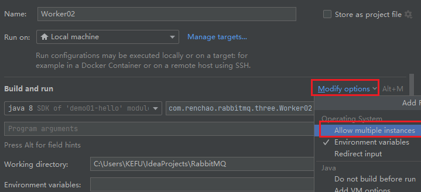
### 1.3、启动一个发送线程
```java
public class Task01 {
    private final static String QUEUE_NAME = "hello";
    public static void main(String[] args) throws Exception {
        Channel channel = RabbitMqUtils.getChannel();
        channel.queueDeclare(QUEUE_NAME, false, false, false, null);
        Scanner scanner = new Scanner(System.in);
        while (scanner.hasNext()) {
            String message = scanner.next();
            channel.basicPublish("", QUEUE_NAME, null, message.getBytes());
            System.out.println(message + " 发送完毕！");
        }
    }
}
```
### 1.4、结果展示 
通过程序执行发现生产者总共发送 4 个消息，消费者 1 和消费者 2 分别分得两个消息，并且是按照有序的一个接收一次消息
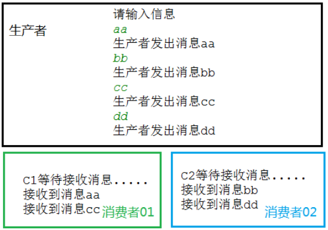
## 2、消息应答
### 2.1、概念 
消费者完成一个任务可能需要一段时间，如果其中一个消费者处理一个长的任务并仅只完成了部分突然它挂掉了，会发生什么情况。RabbitMQ 一旦向消费者传递了一条消息，便立即将该消息标记为删除。在这种情况下，突然有个消费者挂掉了，我们将丢失正在处理的消息。以及后续发送给该消费这的消息，因为它无法接收到。
为了保证消息在发送过程中不丢失，rabbitmq 引入消息应答机制，消息应答就是:**消费者在接收到消息并且处理该消息之后，告诉 rabbitmq 它已经处理了，rabbitmq 可以把该消息删除了。 **
### 2.2、自动应答 
消息发送后立即被认为已经传送成功，这种模式需要在高吞吐量和数据传输安全性方面做权衡，因为这种模式如果消息在接收到之前，消费者那边出现连接或者 channel 关闭，那么消息就丢失了，当然另一方面这种模式消费者那边可以传递过载的消息，没有对传递的消息数量进行限制，当然这样有可能使得消费者这边由于接收太多还来不及处理的消息，导致这些消息的积压，最终使得内存耗尽，最终这些消费者线程被操作系统杀死，所以这种模式仅适用在消费者可以高效并以某种速率能够处理这些消息的情况下使用。
### 2.3、消息应答的方法 

- `Channel.basicAck`(用于肯定确认)
   - RabbitMQ 已知道该消息并且成功的处理消息，可以将其丢弃了
- `Channel.basicNack`(用于否定确认)
- `Channel.basicReject`(用于否定确认)
   - 与 `Channel.basicNack` 相比少一个参数
   - 不处理该消息了直接拒绝，可以将其丢弃了
### 2.4、Multiple 解释 
手动应答的好处是可以批量应答并且减少网络拥堵
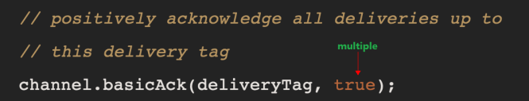
multiple 的 true 和 false 代表不同意思

- true 代表批量应答 channel 上未应答的消息
   - 比如说 channel 上有传送 tag 的消息 5,6,7,8 当前 tag 是 8 那么此时
   - 5-8 的这些还未应答的消息都会被确认收到消息应答
- false 同上面相比
   - 只会应答 tag=8 的消息 5,6,7 这三个消息依然不会被确认收到消息应答
### 2.5、自动重新入队
如果消费者由于某些原因失去连接(其通道已关闭，连接已关闭或 TCP 连接丢失)，导致消息未发送 ACK 确认，RabbitMQ 将了解到消息未完全处理，并将对其重新排队。如果此时其他消费者可以处理，它将很快将其重新分发给另一个消费者。这样，即使某个消费者偶尔死亡，也可以确保不会丢失任何消息。
### 2.6、手动应答代码
默认消息采用的是自动应答，所以我们要想实现消息消费过程中不丢失，需要把自动应答改为手动应答，消费者在上面代码的基础上增加下面画红色部分代码。
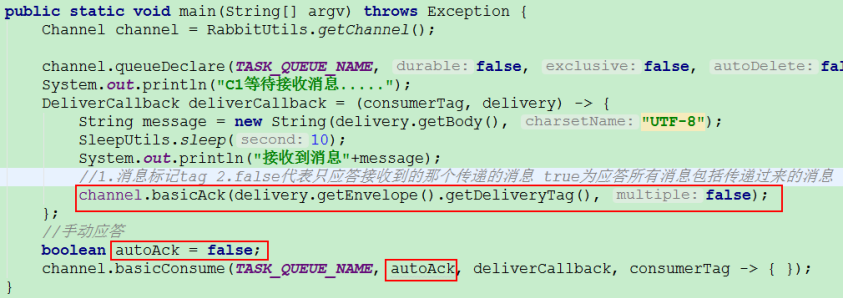
### 2.7、手动应答效果演示
正常情况下消息发送方发送两个消息 C1 和 C2 分别接收到消息并进行处理
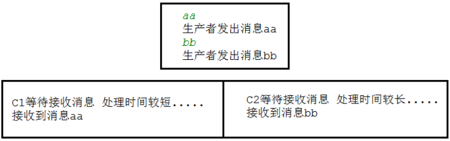
在发送者发送消息 dd，发出消息之后的把 C2 消费者停掉，按理说该 C2 来处理该消息，但是由于它处理时间较长，在还未处理完，也就是说 C2 还没有执行 ack 代码的时候，C2 被停掉了，此时会看到消息被 C1 接收到了，说明消息 dd 被重新入队，然后分配给能处理消息的 C1 处理了。
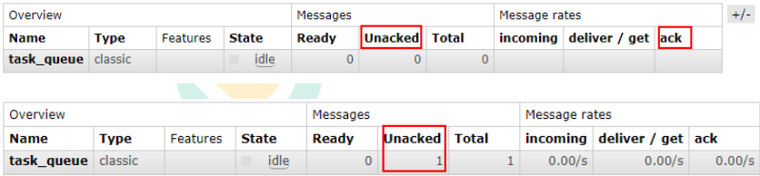
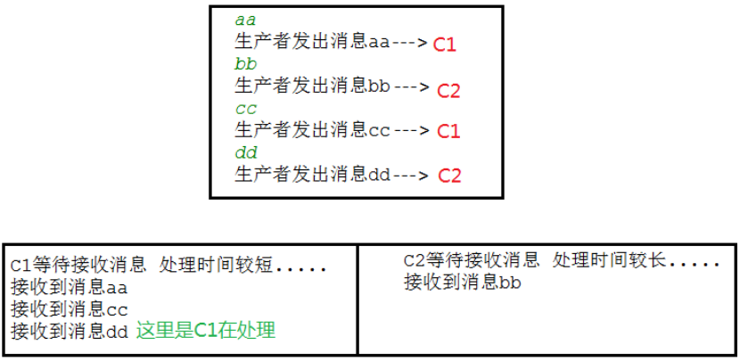
## 3、RabbitMQ 持久化
### 3.1、概念 
默认情况下 RabbitMQ 退出或由于某种原因崩溃时，它忽视队列和消息，除非告知它不要这样做。确保消息不会丢失需要做两件事：我们需要将队列和消息都标记为持久化。
### 3.2、队列持久化 
队列实现持久化，需要在声明队列的时候把 durable 参数设置为持久化
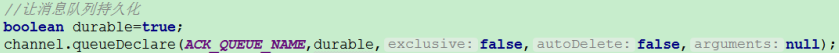
但是需要注意的就是如果之前声明的队列不是持久化的，需要把原先队列先删除，或者重新创建一个持久化的队列，不然就会出现错误
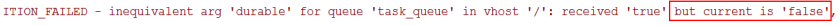
以下为控制台中持久化与非持久化队列的 UI 显示区
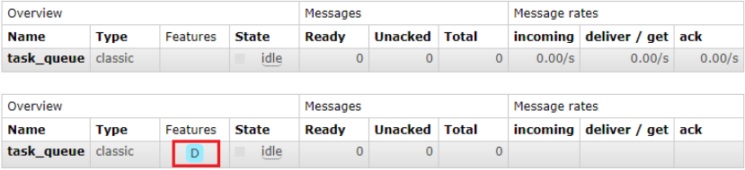
这个时候即使重启 rabbitmq 队列也依然存在
### 3.3、消息持久化 
要想让消息实现持久化需要在消息生产者修改代码，`MessageProperties.PERSISTENT_TEXT_PLAIN` 添加这个属性。
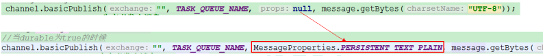
将消息标记为持久化并不能完全保证不会丢失消息。尽管它告诉 RabbitMQ 将消息保存到磁盘，但是这里依然存在当消息刚准备存储在磁盘的时候 但是还没有存储完，消息还在缓存的一个间隔点。此时并没有真正写入磁盘。持久性保证并不强，但是对于我们的简单任务队列而言，这已经绰绰有余了。如果需要更强有力的持久化策略，参考发布确认章节。
### 3.4、不公平分发 
在最开始的时候我们学习到 RabbitMQ 分发消息采用的轮训分发，但是在某种场景下这种策略并不是很好，比方说有两个消费者在处理任务，其中有个消费者 1 处理任务的速度非常快，而另外一个消费者 2 处理速度却很慢，这个时候我们还是采用轮训分发的化就会到这处理速度快的这个消费者很大一部分时间处于空闲状态，而处理慢的那个消费者一直在干活，这种分配方式在这种情况下其实就不太好，但是RabbitMQ 并不知道这种情况它依然很公平的进行分发。
为了避免这种情况，我们可以设置参数 `channel.basicQos(1)`;
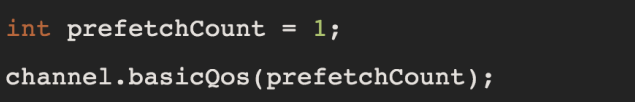
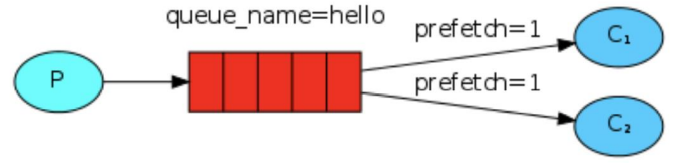
意思就是如果这个任务我还没有处理完或者我还没有应答你，你先别分配给我，我目前只能处理一个任务，然后 rabbitmq 就会把该任务分配给没有那么忙的那个空闲消费者，当然如果所有的消费者都没有完成手上任务，队列还在不停的添加新任务，队列有可能就会遇到队列被撑满的情况，这个时候就只能添加新的 worker 或者改变其他存储任务的策略。
### 3.5、预取值 
本身消息的发送就是异步发送的，所以在任何时候，channel 上肯定不止只有一个消息另外来自消费者的手动确认本质上也是异步的。因此这里就存在一个未确认的消息缓冲区，因此希望开发人员能限制此缓冲区的大小，以避免缓冲区里面无限制的未确认消息问题。这个时候就可以通过使用 basic.qos 方法设置“预取计数”值来完成的。该值定义通道上允许的未确认消息的最大数量。一旦数量达到配置的数量，RabbitMQ 将停止在通道上传递更多消息，除非至少有一个未处理的消息被确认，例如，假设在通道上有未确认的消息 5、6、7，8，并且通道的预取计数设置为 4，此时 RabbitMQ 将不会在该通道上再传递任何消息，除非至少有一个未应答的消息被 ack。比方说 tag=6 这个消息刚刚被确认 ACK，RabbitMQ 将会感知这个情况到并再发送一条消息。消息应答和 QoS 预取值对用户吞吐量有重大影响。通常，增加预取将提高向消费者传递消息的速度。虽然自动应答传输消息速率是最佳的，但是，在这种情况下已传递但尚未处理的消息的数量也会增加，从而增加了消费者的 RAM 消耗(随机存取存储器)应该小心使用具有无限预处理的自动确认模式或手动确认模式，消费者消费了大量的消息如果没有确认的话，会导致消费者连接节点的内存消耗变大，所以找到合适的预取值是一个反复试验的过程，不同的负载该值取值也不同 100 到 300 范围内的值通常可提供最佳的吞吐量，并且不会给消费者带来太大的风险。预取值为 1 是最保守的。当然这将使吞吐量变得很低，特别是消费者连接延迟很严重的情况下，特别是在消费者连接等待时间较长的环境中。对于大多数应用来说，稍微高一点的值将是最佳的。
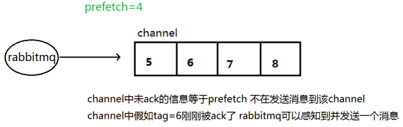
# 四、发布确认
## 1、发布确认原理

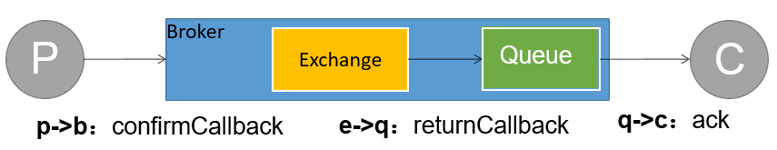

生产者将信道设置成 confirm 模式，一旦信道进入 confirm 模式，所有在该信道上面发布的消息都将会被指派一个唯一的 ID(从 1 开始)，一旦消息被投递到所有匹配的队列之后，broker 就会发送一个确认给生产者(包含消息的唯一 ID)，这就使得生产者知道消息已经正确到达目的队列了，如果消息和队列是可持久化的，那么确认消息会在将消息写入磁盘之后发出，broker 回传给生产者的确认消息中 delivery-tag 域包含了确认消息的序列号，此外 broker 也可以设置basic.ack 的 multiple 域，表示到这个序列号之前的所有消息都已经得到了处理。
confirm 模式最大的好处在于他是异步的，一旦发布一条消息，生产者应用程序就可以在等信道返回确认的同时继续发送下一条消息，当消息最终得到确认之后，生产者应用便可以通过回调方法来处理该确认消息，如果 RabbitMQ 因为自身内部错误导致消息丢失，就会发送一条 nack 消息，生产者应用程序同样可以在回调方法中处理该 nack 消息。

## 2、发布确认的策略
### 2.1、 开启发布确认
发布确认默认是没有开启的，如果要开启需要调用方法 confirmSelect，每当你要想使用发布确认，都需要在 channel 上调用该方法
```java
Channel channel = RabbitMqUtils.getChannel();
// 开启发布确认
channel.confirmSelect();
```
### 2.2、单个确认发布 
这是一种简单的确认方式，它是一种**同步确认发布**的方式，也就是发布一个消息之后只有它被确认发布，后续的消息才能继续发布,waitForConfirmsOrDie(long)这个方法只有在消息被确认的时候才返回，如果在指定时间范围内这个消息没有被确认那么它将抛出异常。
这种确认方式有一个最大的缺点就是：**发布速度特别的慢**，因为如果没有确认发布的消息就会阻塞所有后续消息的发布，这种方式最多提供每秒不超过数百条发布消息的吞吐量。当然对于某些应用程序来说这可能已经足够了。
```java
public class Task03 {
    private final static String QUEUE_NAME = "hello";

    public static void main(String[] args) throws Exception {
        Channel channel = RabbitMqUtils.getChannel();
        channel.queueDeclare(QUEUE_NAME, true, false, false, null);

        // 开启发布确认
        channel.confirmSelect();

        long start = System.currentTimeMillis();
        for (int i = 0; i < 10000; i++) {
            String message = i + "";
            channel.basicPublish("", QUEUE_NAME, MessageProperties.MINIMAL_PERSISTENT_BASIC, message.getBytes());
            // 确认是否成功
            boolean flag = channel.waitForConfirms();
            if (flag) {
                System.out.println("消息发送成功。。");
            }
        }
        long end = System.currentTimeMillis();
        System.out.println("用时：" + (end - start)); //10000 用时：12557
    }
}
```
### 2.3、批量确认发布 
上面那种方式非常慢，与单个等待确认消息相比，先发布一批消息然后一起确认可以极大地提高吞吐量，当然这种方式的缺点就是:当发生故障导致发布出现问题时，不知道是哪个消息出现问题了，我们必须将整个批处理保存在内存中，以记录重要的信息而后重新发布消息。当然这种方案仍然是同步的，也一样阻塞消息的发布。
```java
public class Task04 {
    private final static String QUEUE_NAME = "hello";
    public static void main(String[] args) throws Exception {
        Channel channel = RabbitMqUtils.getChannel();
        // 开启发布确认
        channel.confirmSelect();
        channel.queueDeclare(QUEUE_NAME, true, false, false, null);
        long start = System.currentTimeMillis();
        for (int i = 0; i < 10000; i++) {
            String message = i + "";
            channel.basicPublish("", QUEUE_NAME, MessageProperties.MINIMAL_PERSISTENT_BASIC, message.getBytes());
            // 批量确认是否成功
            if (i % 100 == 0) {
                boolean flag = channel.waitForConfirms();
            }
        }
        long end = System.currentTimeMillis();
        System.out.println("用时：" + (end - start)); //10000 用时1949
    }
}
```
### 2.4、异步确认发布 
异步确认虽然编程逻辑比上两个要复杂，但是性价比最高，无论是可靠性还是效率都没得说，他是利用回调函数来达到消息可靠性传递的，这个中间件也是通过函数回调来保证是否投递成功，下面就让我们来详细讲解异步确认是怎么实现的。
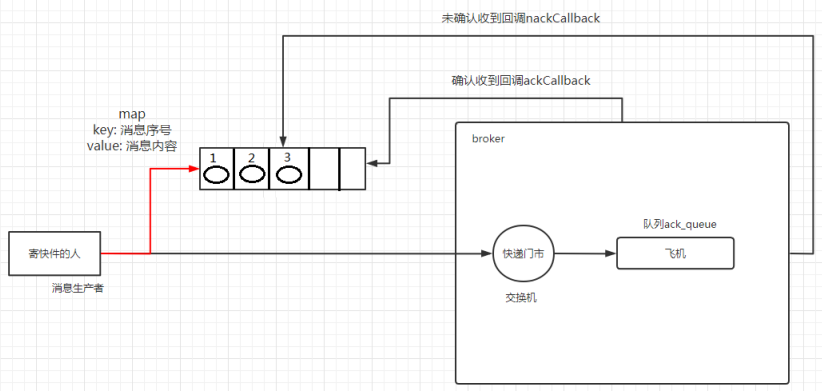
```java
public class Task05 {
    private final static String QUEUE_NAME = "hello";

    public static void main(String[] args) throws Exception {
        Channel channel = RabbitMqUtils.getChannel();
        // 开启发布确认
        channel.confirmSelect();

        channel.queueDeclare(QUEUE_NAME, true, false, false, null);

        // 线程安全有序的一个哈希表，适用于高并发的情况
        ConcurrentSkipListMap<Long, String> outstandingConfirms = new ConcurrentSkipListMap<>();

        // 确认收到消息的一个回调。1.消息编号，2.是否是批量
        ConfirmCallback ackCallback = (sequenceNumber, multiple) -> {
            // 好像是多余的操作，应该在未收到消息的回调里面直接处理，而且这里的批量处理还不精准。
            if (multiple) {
                //返回的是小于等于当前序列号的未确认消息 是一个 map
                ConcurrentNavigableMap<Long, String> confirmed = outstandingConfirms.headMap(sequenceNumber, true);
                //清除该部分未确认消息
                confirmed.clear();
            }else{
                //只清除当前序列号的消息
                outstandingConfirms.remove(sequenceNumber);
            }
        };

        // 确认未收到消息的一个回调
        ConfirmCallback nackCallback = (sequenceNumber, multiple) -> {
            String message = outstandingConfirms.get(sequenceNumber);
            System.out.println("发布的消息"+message+"未被确认，序列号"+sequenceNumber);
        };

        // 添加一个异步确认的监听器
        channel.addConfirmListener(ackCallback, nackCallback);

        long start = System.currentTimeMillis();
        for (int i = 0; i < 1000; i++) {
            String message = i + "";
            /*
             * channel.getNextPublishSeqNo()获取下一个消息的序列号
             * 通过序列号与消息体进行一个关联
             * 全部都是未确认的消息体
             */
            outstandingConfirms.put(channel.getNextPublishSeqNo(), message);
            channel.basicPublish("", QUEUE_NAME, null, message.getBytes());
        }

        long end = System.currentTimeMillis();
        System.out.println("用时：" + (end - start)); //10000 用时769
    }
}
```
### 2.5、处理异步未确认消息 
最好的解决方案就是把未确认的消息放到一个基于内存的能被发布线程访问的队列，比如说用 ConcurrentLinkedQueue 这个队列在 confirm callbacks 与发布线程之间进行消息的传递。
### 2.6、速度对比 

- 单独发布消息
   - 同步等待确认，简单，但吞吐量非常有限。
- 批量发布消息
   - 批量同步等待确认，简单，合理的吞吐量，一旦出现问题但很难推断出是那条消息出现了问题。
- 异步处理：
   - 最佳性能和资源使用，在出现错误的情况下可以很好地控制，但是实现起来稍微难些

# 五、Exchanges
将消息传达给多个消费者。这种模式称为 ”发布/订阅”.
构建一个简单的日志系统。由两个程序组成：第一个程序将发出日志消息，第二个程序是消费者。其中我们会启动两个消费者，其中一个消费者接收到消息后把日志存储在磁盘，另外一个消费者接收到消息后把消息打印在屏幕上，事实上第一个程序发出的日志消息将广播给所有消费者。
## 1、介绍
### 1.1、概念 
RabbitMQ 消息传递模型的核心思想是：生产者生产的消息从不会直接发送到队列。实际上，通常生产者甚至都不知道这些消息传递传递到了哪些队列中。
相反，生产者只能将消息发送到交换机(exchange)，交换机工作的内容非常简单，一方面它接收来自生产者的消息，另一方面将它们推入队列。交换机必须确切知道如何处理收到的消息。是应该把这些消息放到特定队列还是说把他们到许多队列中还是说应该丢弃它们。这就的由交换机的类型来决定。
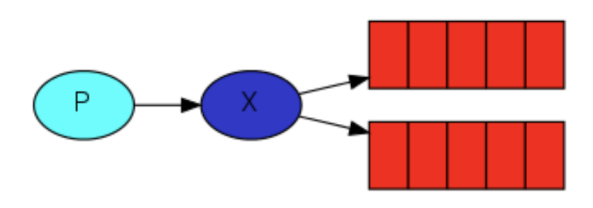
### 1.2、Exchanges 类型 
总共有以下类型：

- 直接(direct)
- 主题(topic)
- 标题(headers)
- 扇出(fanout)
### 1.3、无名 exchange 
空字符串表示默认或无名称交换机：消息能路由发送到队列中其实是由 `routingKey(bindingkey)` 绑定 key 指定的，如果它存在的话。
### 1.4、临时队列
每当我们连接到 Rabbit 时，我们都需要一个全新的空队列，为此我们可以创建一个具有随机名称的队列，一旦我们断开了消费者的连接，队列将被自动删除。
创建临时队列的方式如下：
`String queueName = channel.queueDeclare().getQueue();`
创建出来之后长成这样：
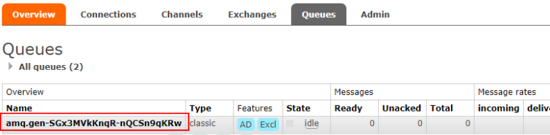
### 1.5、绑定(bindings)
什么是 bingding 呢，binding 其实是 exchange 和 queue 之间的桥梁，它告诉我们 exchange 和那个队列进行了绑定关系。
比如说下面这张图告诉我们的就是 X 与 Q1 和 Q2 进行了绑定。
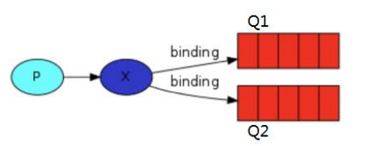
## 2、Fanout
### 2.1、介绍 
Fanout 这种类型非常简单。它是将接收到的所有消息广播到它知道的所有队列中。系统中默认有这些 exchange 类型
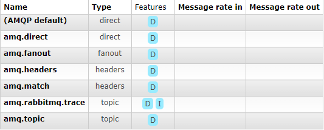
### 2.2、Fanout 实战 
Logs 和临时队列的绑定关系如下图
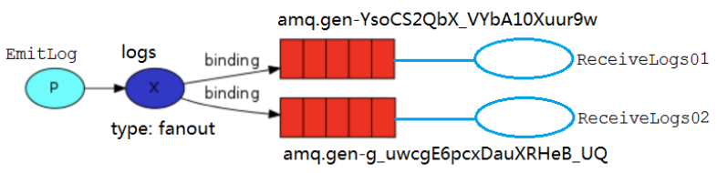
ReceiveLogs01 将接收到的消息打印在控制台。
```java
public class ReceiveLogs01 {
    private static final String EXCHANGE_NAME = "logs";
    public static void main(String[] args) throws Exception {
        Channel channel = RabbitMqUtils.getChannel();
        // 声明交换机
        channel.exchangeDeclare(EXCHANGE_NAME, BuiltinExchangeType.FANOUT);
        // 生成临时队列
        String queueName = channel.queueDeclare().getQueue();
        // 把临时队列绑定到 exchange 其中 bindingKey 为空字符串
        channel.queueBind(queueName, EXCHANGE_NAME, "");
        System.out.println("等待接收消息，把消息打印到屏幕。。。。。。");
        // 处理接收到的消息
        DeliverCallback deliverCallback = (consumerTag, message) -> {
            System.out.println(new String(message.getBody()));
        };
        channel.basicConsume(queueName,true,deliverCallback,consumerTag -> {});
    }
}
```
ReceiveLogs02 将接收到的消息存储在磁盘。
```java
public class ReceiveLogs02 {
    private static final String EXCHANGE_NAME = "logs";

    public static void main(String[] args) throws Exception {
        Channel channel = RabbitMqUtils.getChannel();
        channel.exchangeDeclare(EXCHANGE_NAME, BuiltinExchangeType.FANOUT);

        String queue = channel.queueDeclare().getQueue();
        channel.queueBind(queue, EXCHANGE_NAME, "");

        System.out.println("等待接收消息，把消息写入磁盘。。。。。。");
        DeliverCallback deliverCallback = (consumerTag, message) -> {
            System.out.println("数据写入磁盘成功：：" + new String(message.getBody()));
        };
        channel.basicConsume(queue, true, deliverCallback, consumerTag -> {});
    }
}
```
EmitLog 发送消息给两个消费者接收
```java
public class EmitLog {
    private static final String EXCHANGE_NAME = "logs";

    public static void main(String[] args) throws Exception {
        Channel channel = RabbitMqUtils.getChannel();
        
        Scanner scanner = new Scanner(System.in);
        while (true) {
            System.out.print("请输入信息：");
            String message = scanner.nextLine();
            channel.basicPublish(EXCHANGE_NAME, "", null, message.getBytes(StandardCharsets.UTF_8));
            System.out.println("生产者发出消息：" + message);
        }
    }
}
```
## 3、Direct
### 3.1、介绍 
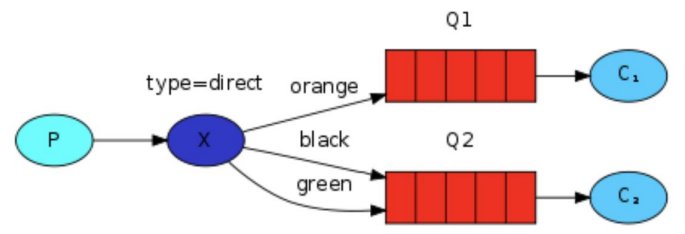
在上面这张图中，我们可以看到 X 绑定了两个队列，绑定类型是 direct。队列 Q1 绑定键为 orange，队列 Q2 绑定键有两个，一个绑定键为 black，另一个绑定键为 green。
在这种绑定情况下，生产者发布消息到 exchange 上，绑定键为 orange 的消息会被发布到队列Q1。绑定键为 blackgreen 和的消息会被发布到队列 Q2，其他消息类型的消息将被丢弃。
### 3.2、多重绑定 
如果 exchange 的绑定类型是 direct，但是它绑定的多个队列的 key 如果都相同，在这种情况下虽然绑定类型是 direct 但是它表现的就和 fanout 有点类似了，就跟广播差不多。
### 3.3、实战
Q1：
```java
public class ReceiveLogsDirect01 {
    private static final String EXCHANGE_NAME = "logs";

    public static void main(String[] args) throws Exception {
        Channel channel = RabbitMqUtils.getChannel();

        // 生成临时队列，然后绑定
        String queueName = channel.queueDeclare().getQueue();
        channel.queueBind(queueName, EXCHANGE_NAME, "orange");

        System.out.println("Q1等待消息中。。。");
        DeliverCallback deliverCallback = (consumerTag, message) -> {
            System.out.println("接收到的消息：" + new String(message.getBody()));
        };
        channel.basicConsume(queueName, true, deliverCallback, consumerTag -> {});
    }
}
```
Q2：
```java
public class ReceiveLogsDirect02 {
    private static final String EXCHANGE_NAME = "logs";

    public static void main(String[] args) throws Exception {
        Channel channel = RabbitMqUtils.getChannel();

        String queueName = channel.queueDeclare().getQueue();
        channel.queueBind(queueName, EXCHANGE_NAME, "black");
        channel.queueBind(queueName, EXCHANGE_NAME, "green");

        System.out.println("Q2等待消息中。。。");
        DeliverCallback deliverCallback = (consumerTag, message) -> {
            System.out.println("接收到的消息：" + new String(message.getBody()));
        };

        channel.basicConsume(queueName, true, deliverCallback, consumerTag -> {});

    }
}
```
生成者：
```java
public class EmitLogDirect {
    private static final String EXCHANGE_NAME = "logs";

    public static void main(String[] args) throws Exception {
        Channel channel = RabbitMqUtils.getChannel();
        Scanner scanner = new Scanner(System.in);
        while (true) {
            System.out.print("请输入消息：");
            String message = scanner.nextLine();
            System.out.print("请输入绑定类型：");
            String binding = scanner.nextLine();
            channel.basicPublish(EXCHANGE_NAME, binding, null, message.getBytes(StandardCharsets.UTF_8));
        }
    }
}
```
## 4、Topics
### 4.1、说明 
发送到类型是 topic 交换机的消息的 routing_key 不能随意写，必须满足一定的要求，它**必须是一个单词列表，以点号分隔开**。这些单词可以是任意单词，比如说："stock.usd.nyse", "nyse.vmw", "quick.orange.rabbit" 这种类型的。这个单词列表最多不能超过 255 个字节。
规则列表中，有两个替换符需要注意：

- `*` 可以代替**一个**单词
- `#` 可以替代**零个或多个**单词
### 4.2、Topic 匹配案例 
下图绑定关系如下
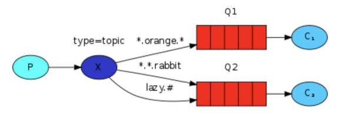

- Q1-->绑定的是
   -  中间带 orange 带 3 个单词的字符串 `*.orange.*`
- Q2-->绑定的是
   - 最后一个单词是 rabbit 的 3 个单词 `*.*.rabbit`
   - 第一个单词是 lazy 的多个单词 `lazy.#`

上图是一个队列绑定关系图，他们之间数据接收情况：

- `quick.orange.rabbit` 被队列 Q1Q2 接收到
- `lazy.orange.elephant` 被队列 Q1Q2 接收到
- `quick.orange.fox` 被队列 Q1 接收到
- `lazy.brown.fox` 被队列 Q2 接收到
- `lazy.pink.rabbit` 虽然满足两个绑定但只被队列 Q2 接收一次
- `quick.brown.fox` 不匹配任何绑定不会被任何队列接收到会被丢弃
- `quick.orange.male.rabbit` 是四个单词不匹配任何绑定会被丢弃

`lazy.orange.male.rabbit` 是四个单词但匹配 Q2
当队列绑定关系是下列这种情况时需要引起注意

- 当一个队列绑定键是 `#` ,那么这个队列将接收所有数据，就有点像 fanout 了
- 如果队列绑定键当中没有 `#` 和 `*` 出现，那么该队列绑定类型就是 direct 了
### 4.3、实战
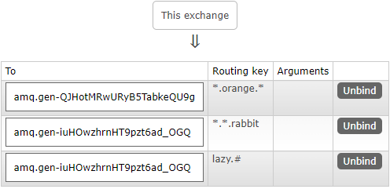
C1：
```java
public class ReceiveLogsTopic01 {
    private static final String EXCHANGE_NAME = "logs";

    public static void main(String[] args) throws Exception {
        Channel channel = RabbitMqUtils.getChannel();
        channel.exchangeDeclare(EXCHANGE_NAME, BuiltinExchangeType.TOPIC);

        String queueName = channel.queueDeclare().getQueue();
        channel.queueBind(queueName, EXCHANGE_NAME, "*.orange.*");

        System.out.println("C1 准备接收消息。。。");
        DeliverCallback deliverCallback = (consumerTag, message) -> {
            System.out.println(new String(message.getBody()));
        };
        channel.basicConsume(queueName,true,deliverCallback,consumerTag -> {});
    }
}
```
C2：
```java
public class ReceiveLogsTopic02 {
    private static final String EXCHANGE_NAME = "logs";

    public static void main(String[] args) throws Exception {
        Channel channel = RabbitMqUtils.getChannel();
        channel.exchangeDeclare(EXCHANGE_NAME, BuiltinExchangeType.TOPIC);

        String queueName = channel.queueDeclare().getQueue();
        channel.queueBind(queueName, EXCHANGE_NAME, "*.*.rabbit");
        channel.queueBind(queueName, EXCHANGE_NAME, "lazy.#");

        System.out.println("C2 准备接收消息。。。");
        DeliverCallback deliverCallback = (consumerTag, message) -> {
            System.out.println(new String(message.getBody()));
        };
        channel.basicConsume(queueName,true,deliverCallback,consumerTag -> {});
    }
}
```
生产者：
```java
public class EmitLogTopic {
    private static final String EXCHANGE_NAME = "logs";

    public static void main(String[] args) throws Exception {
        Channel channel = RabbitMqUtils.getChannel();
        Map<String, String> map = new HashMap<>();
        map.put("quick.orange.rabbit", "被队列 Q1Q2 接收到");
        map.put("lazy.orange.elephant", "被队列 Q1Q2 接收到");
        map.put("quick.orange.fox", "被队列 Q1 接收到");
        map.put("lazy.brown.fox", "被队列 Q2 接收到");
        map.put("lazy.pink.rabbit", "虽然满足两个绑定但只被队列 Q2 接收一次");
        map.put("quick.brown.fox", "不匹配任何绑定不会被任何队列接收到会被丢弃");
        map.put("quick.orange.male.rabbit", "是四个单词不匹配任何绑定会被丢弃");
        map.put("lazy.orange.male.rabbit", "是四个单词但匹配 Q2");
        map.forEach((k,v) -> {
            try {
                channel.basicPublish(EXCHANGE_NAME,k,null,v.getBytes(StandardCharsets.UTF_8));
            } catch (IOException e) {
                e.printStackTrace();
            }
        });
    }
}
```
# 六、死信队列
## 1、死信的概念
死信，顾名思义就是无法被消费的消息，字面意思可以这样理解，一般来说，producer 将消息投递到 broker 或者直接到 queue 里了，consumer 从 queue 取出消息进行消费，但某些时候由于特定的原因导致 queue 中的某些消息无法被消费，这样的消息如果没有后续的处理，就变成了死信，有死信自然就有了死信队列。
应用场景:为了保证订单业务的消息数据不丢失，需要使用到 RabbitMQ 的死信队列机制，当消息消费发生异常时，将消息投入死信队列中。还有比如说：用户在商城下单成功并点击去支付后在指定时间未支付时自动失效。

## 2、死信来源

- 消息 TTL 过期
- 队列达到最大长度(队列满了，无法再添加数据到 mq 中)。【自己测试，必须要C1关闭才可以。从已满的队列前面开始进死信】
- 消息被拒绝( `basic.reject` 或` basic.nack` )并且 `requeue=false`。
> TTL 过期 和 队列达到最大长度 还要满足没有消费者连接该消费者。比如下图中的C1必须关闭状态。

## 3、死信实战
### 3.1、代码架构图
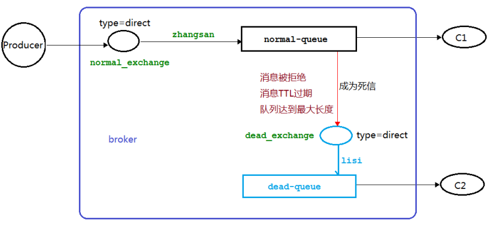
### 3.2、消息 TTL 过期
#### 3.2.1、配置Rabbit
```java
public class DeadLetterConfigTTL {
    public static void main(String[] args) throws Exception {
        Channel channel = RabbitMqUtils.getChannel();

        // 声明死信和普通交换机 类型为 direct
        channel.exchangeDeclare(NORMAL_EXCHANGE, BuiltinExchangeType.DIRECT);
        channel.exchangeDeclare(DEAD_EXCHANGE, BuiltinExchangeType.DIRECT);

        // 声明死信队列
        channel.queueDeclare(DEAD_QUEUE, false, false, false, null);
        channel.queueBind(DEAD_QUEUE, DEAD_EXCHANGE, "lisi");

        // 正常队列绑定死信队列信息
        Map<String, Object> params = new HashMap<>();
        params.put("x-dead-letter-exchange", DEAD_EXCHANGE);
        params.put("x-dead-letter-routing-key", "lisi");
        // 声明正常队列
        channel.queueDeclare(NORMAL_QUEUE, false, false, false, params);
        channel.queueBind(NORMAL_QUEUE, NORMAL_EXCHANGE, "zhangsan");
    }
}
```
#### 2.2.2、生产者代码
```java
public class ProducerTTL {
    public static void main(String[] args) throws Exception {
        Channel channel = RabbitMqUtils.getChannel();
        // 过期时间
        AMQP.BasicProperties properties = new AMQP.BasicProperties().builder().expiration("10000").build();
        Scanner scanner = new Scanner(System.in);
        while (true) {
            System.out.print("请输入消息：");
            String message = scanner.next();
            channel.basicPublish(NORMAL_EXCHANGE,"zhangsan",properties,message.getBytes(StandardCharsets.UTF_8));
        }
    }
}
```
#### 3.2.3、正常消费者C1
 必须要关闭该消费者 模拟其接收不到消息
```java
public class NormalConsumer {
    public static void main(String[] args) throws Exception {
        Channel channel = RabbitMqUtils.getChannel();
        System.out.println("等待接收消息。。。。");
        DeliverCallback deliverCallback = (consumerTag, message) -> {
            String m = new String(message.getBody());
            channel.basicAck(message.getEnvelope().getDeliveryTag(), false);
            System.out.println(m);
            SleepUtils.sleep(60);
        };
        channel.basicConsume(NORMAL_QUEUE, false, deliverCallback, consumerTag -> {});
    }
}
```
#### 2.2.4、死信消费者C2
```java
public class DeadConsumer {
    public static void main(String[] args) throws Exception {
        Channel channel = RabbitMqUtils.getChannel();
        System.out.println("准备接收死信消息。。。。");
        DeliverCallback deliverCallback = (consumerTag, message) -> System.out.println(new String(message.getBody()));
        channel.basicConsume(RabbitInfo.DEAD_QUEUE,true,deliverCallback, consumerTag -> {});
    }
}
```
### 3.3、队列达到最大长度
#### 3.3.1、配置Rabbit
在上面 3.2.1 的配置基础上加一条 `params.put("x-max-length", 6);`
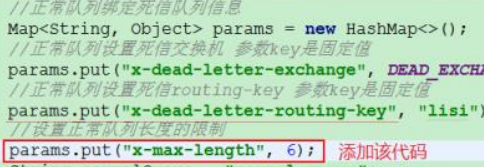
#### 2.3.2、生产者代码
```java
public class ProducerMaxLen {
    public static void main(String[] args) throws Exception {
        Channel channel = RabbitMqUtils.getChannel();
        Scanner scanner = new Scanner(System.in);
        while (true) {
            System.out.print("请输入消息：");
            String message = scanner.next();
            channel.basicPublish(NORMAL_EXCHANGE,"zhangsan",null,message.getBytes(StandardCharsets.UTF_8));
        }
    }
}
```
#### 2.3.3、正常消费者C1
与 3.2.3 的代码类似。
必须要关闭该消费者 模拟其接收不到消息
#### 2.3.4、死信消费者C2
与 3.2.4 的代码一样，不变。

### 3.4、消息被拒
#### 3.4.1、配置Rabbit
与 3.2.1 的配置一样
#### 2.4.2、生产者代码
与 2.3.2 的代码一样。
#### 2.4.3、正常消费者C1
```java
public class NormalConsumer {
    public static void main(String[] args) throws Exception {
        Channel channel = RabbitMqUtils.getChannel();

        System.out.println("等待接收消息。。。。");
        DeliverCallback deliverCallback = (consumerTag, message) -> {
            String m = new String(message.getBody());
            if (m.contains("5")) {
                System.out.println("不符合要求，已经拒绝处理。。");
                channel.basicReject(message.getEnvelope().getDeliveryTag(), false);
            } else {
                System.out.println(m);
                channel.basicAck(message.getEnvelope().getDeliveryTag(), false);
            }
            System.out.println(m);
            SleepUtils.sleep(60);
        };
        channel.basicConsume(NORMAL_QUEUE, false, deliverCallback, consumerTag -> {});
    }
}
```
#### 2.3.4、死信消费者C2
与 3.2.4 的代码一样，不变。


# 七、整合 SpringBoot

## 1、添加依赖

```xml
<dependency>
  <groupId>org.springframework.boot</groupId>
  <artifactId>spring-boot-starter-web</artifactId>
</dependency>

<dependency>
  <groupId>org.springframework.boot</groupId>
  <artifactId>spring-boot-starter-test</artifactId>
  <scope>test</scope>
</dependency>

<!--RabbitMQ 依赖-->
<dependency>
  <groupId>org.springframework.boot</groupId>
  <artifactId>spring-boot-starter-amqp</artifactId>
</dependency>

<dependency>
  <groupId>com.alibaba</groupId>
  <artifactId>fastjson</artifactId>
  <version>1.2.47</version>
</dependency>
<dependency>
  <groupId>org.projectlombok</groupId>
  <artifactId>lombok</artifactId>
</dependency>

<!--RabbitMQ 测试依赖-->
<dependency>
  <groupId>org.springframework.amqp</groupId>
  <artifactId>spring-rabbit-test</artifactId>
  <scope>test</scope>
</dependency>
```

## 2、修改配置文件

```properties
spring.rabbitmq.host=192.168.123.89
spring.rabbitmq.port=5672
spring.rabbitmq.username=admin
spring.rabbitmq.password=123
```


## 3、AmqpAdmin

### 3.1、创建交换机

```java
@Test
public void createExchange() {
    DirectExchange exchange = new DirectExchange("hello-exchange",true,false,null);
    amqpAdmin.declareExchange(exchange);
    log.info("Exchange[{}]创建成功！","hello-exchange");
}
```


### 3.2、创建队列

```java
@Test
public void createQueue() {
    Queue queue = new Queue("hello-queue", true,false,false,null);
    amqpAdmin.declareQueue(queue);
    log.info("=========Queue[{}]创建成功！=============","hello-queue");
}
```


### 3.3、绑定

```java
@Test
public void createBinding() {
    Binding binding = new Binding("hello-queue", Binding.DestinationType.QUEUE, "hello-exchange", "hello.binding", null);
    amqpAdmin.declareBinding(binding);
    log.info("=========Binding[{}]创建成功！=============","hello.binding");
}
```


## 4、发送消息

### 4.1、序列化配置

> 可以不配置，如果不配置，java对象是以 x-java-serialized-object 方式进行发送的，需要发送的实体类需要实现 Serializable 接口

```java
import org.springframework.amqp.support.converter.Jackson2JsonMessageConverter;
import org.springframework.amqp.support.converter.MessageConverter;
import org.springframework.context.annotation.Bean;
import org.springframework.context.annotation.Configuration;

@Configuration
public class MyRabbitMQConfig {
    @Bean
    public MessageConverter messageConverter() {
        return new Jackson2JsonMessageConverter();
    }
}
```


### 4.2、消息发送

```java
@RestController
public class RabbitMQController {

    @Autowired
    private RabbitTemplate rabbitTemplate;

    @RequestMapping("/send")
    public String SendMessage() {
        OrderReturnReasonEntity orderReturn = new OrderReturnReasonEntity();
        orderReturn.setId(22L);
        orderReturn.setName("测试");
        orderReturn.setCreateTime(new Date());
        rabbitTemplate.convertAndSend("hello-exchange","hello.binding",orderReturn);
        return "OK!!";
    }
}
```


## 5、接收消息

### 5.1、开启Rabbit

```java
@EnableRabbit // 开启RabbitMQ
@SpringBootApplication
@MapperScan("com.renchao.gulimall.order.dao")
public class OrderApplication {
    public static void main(String[] args) {
        SpringApplication.run(OrderApplication.class, args);
    }
}
```

### 5.2、@RabbitListener

```java
import com.rabbitmq.client.Channel;

@Service
public class RabbitService {

    @RabbitListener(queues = {"hello-queue"})
    public void receiveMessage(Message message,
                               OrderReturnReasonEntity orderReturn,
                               Channel channel) {
        System.out.println(message);
        System.out.println(orderReturn);
    }
}
```


### 5.3、@RabbitHandler

> @RabbitHandler标注在方法上，@RabbitListener可以标注在方法和类上
>
> 与@RabbitListener配合，可以分别接收不同类型的消息

```java
@Service
@RabbitListener(queues = {"hello-queue"})
public class RabbitService {

    @RabbitHandler
    public void receiveMessage(OrderReturnReasonEntity orderReturn) {
        System.out.println("OrderReturnReasonEntity::::" + orderReturn);
    }

    @RabbitHandler
    public void receiveMessage(String mgs) {
        System.out.println("字符串类型::::" + mgs);
    }
}
```


### 5.4、消息应答

`spring.rabbitmq.listener.simple.acknowledge-mode=manual`

- auto
  - 自动确认
- manual
  - 手动确认
- none
  - 不确认

```java
@Service
@RabbitListener(queues = {"hello-queue"})
public class RabbitService {

    @RabbitHandler
    public void receiveMessage(OrderReturnReasonEntity orderReturn,Message message,Channel channel) throws IOException {
        System.out.println("OrderReturnReasonEntity::::" + orderReturn);
        channel.basicNack(message.getMessageProperties().getDeliveryTag(),false,false);
    }

    @RabbitHandler
    public void receiveMessage(String mgs,Message message,Channel channel) throws IOException {
        System.out.println("字符串类型::::" + mgs);
        channel.basicAck(message.getMessageProperties().getDeliveryTag(),false);
    }
}
```


# 八、延迟队列

## 1、概念
延时队列，队列内部是有序的，最重要的特性就体现在它的延时属性上，延时队列中的元素是希望在指定时间到了以后或之前取出和处理，简单来说，延时队列就是用来存放需要在指定时间被处理的元素的队列。
## 2、使用场景

- 订单在十分钟之内未支付则自动取消。
- 新创建的店铺，如果在十天内都没有上传过商品，则自动发送消息提醒。
- 用户注册成功后，如果三天内没有登陆则进行短信提醒。
- 用户发起退款，如果三天内没有得到处理则通知相关运营人员。
- 预定会议后，需要在预定的时间点前十分钟通知各个与会人员参加会议。

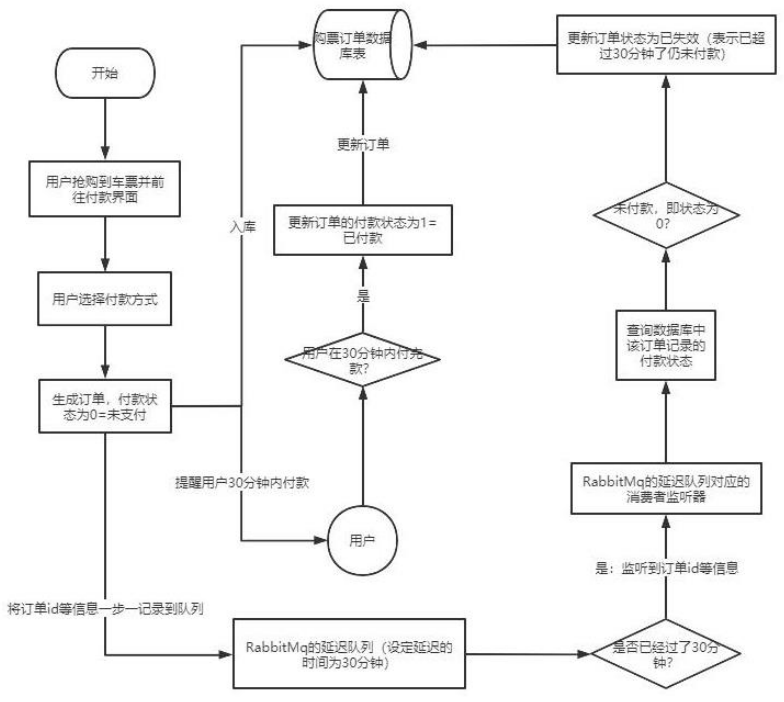
## 3、TTL
TTL 是 RabbitMQ 中一个消息或者队列的属性，表明一条消息或者该队列中的所有消息的最大存活时间，单位是毫秒。也就是说，如果一条消息设置了 TTL 属性或者进入了设置 TTL 属性的队列，那么这条消息如果在 TTL 设置的时间内没有被消费，则会成为"死信"。如果同时配置了队列的 TTL 和消息的 TTL，那么较小的那个值将会被使用，有两种方式设置 TTL。
### 3.1、队列设置 TTL 
第一种是在创建队列的时候设置队列的 `x-message-ttl` 属性。
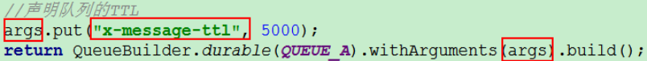
### 3.2、消息设置 TTL 
另一种方式便是针对每条消息设置 TTL。
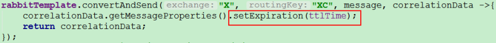
### 3.3、两者的区别 
如果设置了队列的 TTL 属性，那么一旦消息过期，就会被队列丢弃(如果配置了死信队列被丢到死信队列中)，而第二种方式，消息即使过期，也不一定会被马上丢弃，因为消息是否过期是在即将投递到消费者之前判定的，**如果当前队列有严重的消息积压情况，则已过期的消息也许还能存活较长时间**；另外，还需要注意的一点是，如果不设置 TTL，表示消息永远不会过期，如果将 TTL 设置为 0，则表示除非此时可以直接投递该消息到消费者，否则该消息将会被丢弃。
## 5、延时队列 TTL
### 5.1、代码架构图
创建两个队列 QA 和 QB，两者队列 TTL 分别设置为 10S 和 40S，然后在创建一个交换机 X 和死信交换机 Y，它们的类型都是 direct，创建一个死信队列 QD，它们的绑定关系如下：
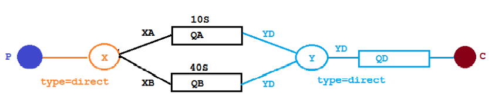
### 5.2、配置文件类代码
```java
@Configuration
public class TtlQueueConfig {
    /**
     * 声明 X 交换机
     */
    @Bean
    public DirectExchange xExchange() {
        return new DirectExchange(X_EXCHANGE);
    }

    /**
     * 声明 Y 交换机
     */
    @Bean
    public DirectExchange yExchange() {
        return new DirectExchange(Y_EXCHANGE);
    }

    /**
     * 声明死信队列 D
     */
    @Bean
    public Queue queueD() {
        return new Queue(D_QUEUE);
    }

    /**
     * 死信队列 D 绑定到 Y 交换机
     */
    @Bean
    public Binding deadLetter(Queue queueD,DirectExchange yExchange) {
        return BindingBuilder.bind(queueD).to(yExchange).with("YD");
    }

    /**
     * 声明队列 A
     */
    @Bean
    public Queue queueA() {
        HashMap<String, Object> args = new HashMap<>();
        args.put("x-dead-letter-exchange", Y_EXCHANGE);
        args.put("x-dead-letter-routing-key", "YD");
        args.put("x-message-ttl", 10000);
        return QueueBuilder.durable(A_QUEUE).withArguments(args).build();
    }

    /**
     * 声明队列 B
     */
    @Bean
    public Queue queueB() {
        HashMap<String, Object> args = new HashMap<>();
        args.put("x-dead-letter-exchange", Y_EXCHANGE);
        args.put("x-dead-letter-routing-key", "YD");
        args.put("x-message-ttl", 40000);
        return QueueBuilder.durable(B_QUEUE).withArguments(args).build();
    }

    /**
     * 队列 A 绑定到 X 交换机
     */
    @Bean
    public Binding queueABindingX(Queue queueA, DirectExchange xExchange) {
        return BindingBuilder.bind(queueA).to(xExchange).with("XA");
    }

    /**
     * 队列 B 绑定到 X 交换机
     */
    @Bean
    public Binding queueBBindingX(Queue queueB, DirectExchange xExchange) {
        return BindingBuilder.bind(queueB).to(xExchange).with("XB");
    }
}
```
### 5.3、消息生产者代码
```java
@Autowired
private RabbitTemplate rabbitTemplate;

@RequestMapping("/sendMsg/{message}")
public void sendMsg(@PathVariable("message") String message) {
    log.info("当前时间：{},发送一条信息给两个TTL队列：{}", new Date(), message);
    rabbitTemplate.convertAndSend(RabbitInfo.X_EXCHANGE, "XB", "消息来自ttl为30s的队列：" + message);
    rabbitTemplate.convertAndSend(RabbitInfo.X_EXCHANGE, "XA", "消息来自ttl为10s的队列：" + message);
}
```
### 5.4、消息消费者代码
```java
@Slf4j
@Component
public class DeadLetterQueueConsumer {
    @RabbitListener(queues = RabbitInfo.D_QUEUE)
    public void receiveD(Message message) {
        log.info("当前时间{}，收到的死信队列消息：{}", new Date(), new String(message.getBody()));
    }
}
```
> 发起一个请求 http://localhost:8080/sendMsg/嘻嘻嘻 

第一条消息在 10S 后变成了死信消息，然后被消费者消费掉，第二条消息在 40S 之后变成了死信消息，然后被消费掉，这样一个延时队列就打造完成了。
不过，如果这样使用的话，岂不是每增加一个新的时间需求，就要新增一个队列，这里只有 10S 和 40S 两个时间选项，如果需要一个小时后处理，那么就需要增加 TTL 为一个小时的队列。
## 6、延时队列优化
### 6.1、代码架构图
在这里新增了一个队列 QC,绑定关系如下,该队列不设置 TTL 时间
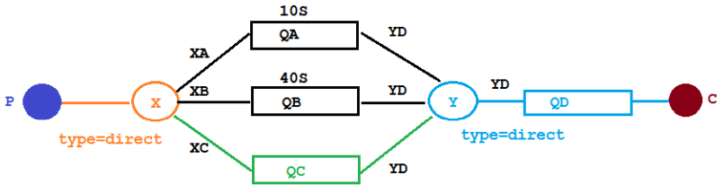
### 6.2、配置文件类代码
```java
/**
 * 声明队列 C
 */
@Bean
public Queue queueC() {
    HashMap<String, Object> args = new HashMap<>();
    args.put("x-dead-letter-exchange", Y_EXCHANGE);
    args.put("x-dead-letter-routing-key", "YD");
    return QueueBuilder.durable(C_QUEUE).withArguments(args).build();
}

/**
 * 队列 C 绑定到 X 交换机
 */
@Bean
public Binding queueCBindingX(Queue queueC, DirectExchange xExchange) {
    return BindingBuilder.bind(queueC).to(xExchange).with("XC");
}
```
### 6.3、消息生产者代码
```java
@RequestMapping("/sendMsg/{message}/{ttlTime}")
public void sendMsgTTL(@PathVariable("message") String message,
                       @PathVariable("ttlTime") String ttlTime) {
    log.info("当前时间：{},发送一条时长 {} 的信息给TTL队列：{}", new Date(), ttlTime, message);
    rabbitTemplate.convertAndSend(RabbitInfo.X_EXCHANGE, "XC", message, correlationData -> {
        correlationData.getMessageProperties().setExpiration(ttlTime);
        return correlationData;
    });
}
```
> 发起请求
> http://localhost:8080/sendMsg/你好1/20000
> http://localhost:8080/sendMsg/你好2/2000

看起来似乎没什么问题，但是在最开始的时候，就介绍过如果使用在消息属性上设置 TTL 的方式，消息可能并不会按时“死亡“，因为 RabbitMQ 先进先出原则，如果第一个消息的延时时长很长，而第二个消息的延时时长很短，第二个消息并不会优先得到执行。
## 7、插件实现延迟队列
如果不能实现在消息粒度上的 TTL，并使其在设置的 TTL 时间及时死亡，就无法设计成一个通用的延时队列。
### 7.1、安装插件 
官网上下载 [https://www.rabbitmq.com/community-plugins.html](https://www.rabbitmq.com/community-plugins.html)
下载 `rabbitmq_delayed_message_exchange` 插件，解压后放置到 RabbitMQ 的插件目录。

- 进入 RabbitMQ 的插件目录
   - `cd /usr/lib/rabbitmq/lib/rabbitmq_server-3.8.8/plugins`
- 执行下面命令让该插件生效
   - `rabbitmq-plugins enable rabbitmq_delayed_message_exchange`
- 重启 RabbitMQ
   - `service rabbitmq-server restart`

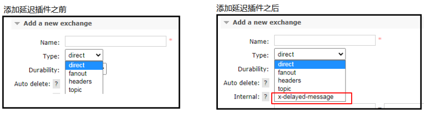
### 7.2、代码架构图
在这里新增了一个队列 delayed.queue,一个自定义交换机 delayed.exchange，绑定关系如下:
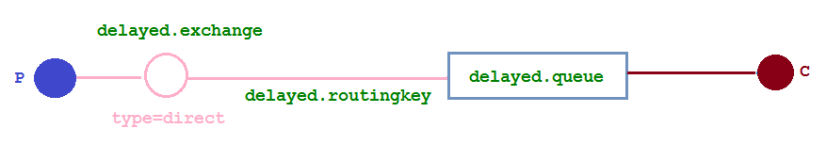
### 7.3、配置文件类代码 
在我们自定义的交换机中，这是一种新的交换类型，该类型消息支持延迟投递机制 消息传递后并不会立即投递到目标队列中，而是存储在 mnesia (一个分布式数据系统)表中，当达到投递时间时，才投递到目标队列中。
```java
@Configuration
public class DelayedQueueConfig {
    /**
     * 自定义延迟交换机
     */
    @Bean
    public CustomExchange delayedExchange() {
        Map<String, Object> args = new HashMap<>();
        args.put("x-delayed-type", "direct");
        return new CustomExchange(DELAYED_EXCHANGE_NAME, "x-delayed-message", true, false, args);
    }

    /**
     * 声明延时队列
     */
    @Bean
    public Queue delayedQueue() {
        return new Queue(DELAYED_QUEUE_NAME);
    }

    /**
     * 队列绑定
     */
    @Bean
    public Binding bindingDelayedQueue(Queue delayedQueue, CustomExchange delayedExchange) {
        return BindingBuilder.bind(delayedQueue).to(delayedExchange).with(DELAYED_ROUTING_KEY).noargs();
    }
}
```
### 7.4、消息生产者代码
```java
@RequestMapping("/sendMsgPlugin/{message}/{ttlTime}")
public void sendMsgTTLPlugin(@PathVariable("message") String message,
                             @PathVariable("ttlTime") Integer ttlTime) {
    log.info("当前时间：{},发送一条时长 {} 的信息给TTL队列：{}", new Date(), ttlTime, message);

    rabbitTemplate.convertAndSend(RabbitInfo.DELAYED_EXCHANGE_NAME, DELAYED_ROUTING_KEY, message, correlationData -> {
        correlationData.getMessageProperties().setDelay(ttlTime);
        return correlationData;
    });
}
```
### 7.5、消息消费者代码
```java
@RabbitListener(queues = RabbitInfo.DELAYED_QUEUE_NAME)
public void receiveDelayedQueue(Message message) {
    log.info("当前时间{}，收到的死信队列消息：{}", new Date(), new String(message.getBody()));
}
```
> 发起请求：
> http://localhost:8080/sendMsgPlugin/come on baby1/20000
> http://localhost:8080/sendMsgPlugin/come on baby2/2000

## 8、总结
延时队列在需要延时处理的场景下非常有用，使用 RabbitMQ 来实现延时队列可以很好的利用 RabbitMQ 的特性，如：消息可靠发送、消息可靠投递、死信队列来保障消息至少被消费一次以及未被正确处理的消息不会被丢弃。另外，通过 RabbitMQ 集群的特性，可以很好的解决单点故障问题，不会因为单个节点挂掉导致延时队列不可用或者消息丢失。
当然，延时队列还有很多其它选择，比如利用 Java 的 DelayQueue，利用 Redis 的 zset，利用 Quartz 或者利用 kafka 的时间轮，这些方式各有特点，看需要适用的场景。

# 九、发布确认高级


## 1、交换机故障
### 1.1、确认机制方案 
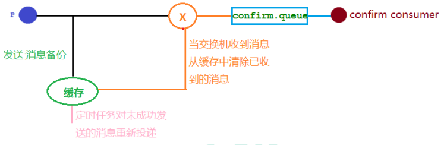
### 1.2、代码架构图
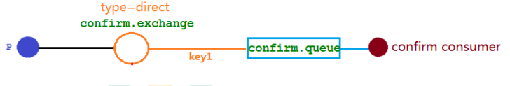
### 1.3、配置文件
在配置文件当中需要添加
`spring.rabbitmq.publisher-confirm-type=correlated`

- NONE
   - 禁用发布确认模式，是默认值
- CORRELATED
   - 发布消息成功到交换器后会触发回调方法
- SIMPLE
   - 经测试有两种效果，其一效果和 CORRELATED 值一样会触发回调方法，其二在发布消息成功后使用 rabbitTemplate 调用 waitForConfirms 或 waitForConfirmsOrDie 方法等待 broker 节点返回发送结果，根据返回结果来判定下一步的逻辑，**要注意的点是 waitForConfirmsOrDie 方法如果返回 false 则会关闭 channel**，则接下来无法发送消息到 broker。
### 1.4、添加配置类
```java
@Configuration
public class ConfirmConfig {
    public static final String CONFIRM_QUEUE = "confirm_queue";
    public static final String CONFIRM_EXCHANGE = "confirm_exchange";

    // 声明交换机
    @Bean
    public DirectExchange confirmExchange() {
        return new DirectExchange(CONFIRM_EXCHANGE);
    }

    // 声明队列
    @Bean
    public Queue confirmQueue() {
        return QueueBuilder.durable(CONFIRM_QUEUE).build();
    }

    // 绑定队列到交换机
    @Bean
    public Binding confirmQueueBinding(Queue confirmQueue, DirectExchange confirmExchange) {
        return BindingBuilder.bind(confirmQueue).to(confirmExchange).with("key1");
    }
}
```
### 1.5、回调接口
```java
@Component
@Slf4j
public class MyCallBack implements RabbitTemplate.ConfirmCallback {
    @Override
    public void confirm(CorrelationData correlationData, boolean b, String s) {
        String id = "";
        String message = "";
        if (correlationData != null) {
            id = correlationData.getId();
            message = new String(Objects.requireNonNull(correlationData.getReturnedMessage()).getBody());
        }
        if (b) {
            log.info("交换机收到id为{}的消息:{}", id,message);
        } else {
            log.info("交换机还未收到id为{}的消息:{}，原因是：{}",id,message,s);
        }
    }
}
```
### 1.6、消息生产者
```java
@Slf4j
@RestController
public class Producer {

    private final RabbitTemplate rabbitTemplate;

    public Producer(RabbitTemplate rabbitTemplate,MyCallBack myCallBack) {
        this.rabbitTemplate = rabbitTemplate;
        // 需要手动注入回调接口
        this.rabbitTemplate.setConfirmCallback(myCallBack);
    }

    @GetMapping("/sendMessage/{message}")
    public void sendMessage(@PathVariable String message) {
        CorrelationData correlationData1 = new CorrelationData("11");
        Message message1 = new Message(message.getBytes(StandardCharsets.UTF_8), null);
        correlationData1.setReturnedMessage(message1);
        rabbitTemplate.convertAndSend(ConfirmConfig.CONFIRM_EXCHANGE, "key1", message.getBytes(StandardCharsets.UTF_8),correlationData1);
        CorrelationData correlationData2 = new CorrelationData("22");
        correlationData2.setReturnedMessage(message1);
        // 发送时交换机加上123后缀，模拟交换机出现问题
        rabbitTemplate.convertAndSend(ConfirmConfig.CONFIRM_EXCHANGE + "123", "key1", message.getBytes(StandardCharsets.UTF_8),correlationData2);
    }
}
```
> 也可以使用下面的方法注入回调接口
>
> ```java
> @Configuration
> public class MyRabbitMQConfig {
> 
>     @Autowired
>     private RabbitTemplate rabbitTemplate;
>     @Autowired
>     private MyCallBack myCallBack;
> 
>     @Bean
>     public MessageConverter messageConverter() {
>         return new Jackson2JsonMessageConverter();
>     }
> 
>     /**
>      * 注入 ConfirmCallback 回调接口
>      */
>     @PostConstruct
>     public void initRabbitTemplate() {
>         rabbitTemplate.setConfirmCallback(myCallBack);
>     }
> }
> ```
>
> 


### 1.7、消息消费者

```java
@Component
@Slf4j
public class ConfirmConsumer {
    @RabbitListener(queues = ConfirmConfig.CONFIRM_QUEUE)
    public void receiveMsg(Message message) {
        log.info("接收到队列 confirm.queue 的消息：{}", new String(message.getBody()));
    }
}
```
### 1.8、结果分析
发送 `http://localhost:8080/sendMessage/测试发布确认`
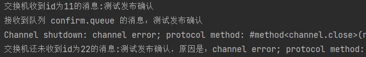
> 交换机还未收到id为22的消息:测试发布确认，原因是：channel error; protocol method: #method<channel.close>(reply-code=404, reply-text=NOT_FOUND - no exchange 'confirm_exchange123' in vhost '/', class-id=60, method-id=40)

因为 id 为 22 的消息发送的交换机是 confirm_exchange123 但没有这个交换机，所以发送失败。
## 2、无法路由故障
### 2.1、Mandatory 参数 
在仅开启了生产者确认机制的情况下，交换机接收到消息后，会直接给消息生产者发送确认消息，如果发现该消息不可路由，那么消息会被直接丢弃，此时生产者是不知道消息被丢弃这个事件的。
通过设置 mandatory 参数可以在当消息传递过程中不可达目的地时将消息返回给生产者。
有两种设置方法，选择其一就可以了。

### 2.2、配置文件

- 在配置文件中设置 `spring.rabbitmq.publisher-returns=true`
- 设置只要抵达队列，以异步发送优先回调   ：`spring.rabbitmq.template.mandatory=true`
  - 也可以  `rabbitTemplate.setMandatory(true)` 配置
### 2.3、回调函数
```java
@Component
@Slf4j
public class MyCallBack implements RabbitTemplate.ReturnsCallback {
    @Override
    public void returnedMessage(ReturnedMessage returnedMessage) {
        log.error("消息【{}】,被交换机【{}】退回，退回原因:【{}】,路由key:【{}】",
                new String(returnedMessage.getMessage().getBody()),
                returnedMessage.getExchange(),
                returnedMessage.getReplyText(),
                returnedMessage.getRoutingKey());
    }
}
```
### 2.4、消息生产者
```java
@Slf4j
@RestController
public class Producer {
    
    private final RabbitTemplate rabbitTemplate;
    
    public Producer(RabbitTemplate rabbitTemplate,MyCallBack myCallBack) {
        this.rabbitTemplate = rabbitTemplate;
        // 注入 Mandatory 功能的回调接口
        this.rabbitTemplate.setReturnsCallback(myCallBack);
    }
    
    @GetMapping("/sendMessage/{message}")
    public void sendMessage(@PathVariable String message) {
        CorrelationData correlationData1 = new CorrelationData("11");
        Message message1 = new Message(message.getBytes(StandardCharsets.UTF_8), null);
        correlationData1.setReturnedMessage(message1);
        rabbitTemplate.convertAndSend(ConfirmConfig.CONFIRM_EXCHANGE, "key1", message.getBytes(StandardCharsets.UTF_8),correlationData1);
        CorrelationData correlationData2 = new CorrelationData("22");
        correlationData2.setReturnedMessage(message1);
        // 发送时 routingKey 修改为 key2 ，模拟无法路由
        rabbitTemplate.convertAndSend(ConfirmConfig.CONFIRM_EXCHANGE, "key2", message.getBytes(StandardCharsets.UTF_8),correlationData2);
    }
}
```
> 也可以使用下面方法注入回调接口
>
> ```java
> @Configuration
> public class MyRabbitMQConfig {
> 
>     @Autowired
>     private MyReturnsCallback myReturnsCallback;
>     @Autowired
>     private RabbitTemplate rabbitTemplate;
> 
>     @Bean
>     public MessageConverter messageConverter() {
>         return new Jackson2JsonMessageConverter();
>     }
> 
>     /**
>      * 注入 ConfirmCallback 回调接口
>      */
>     @PostConstruct
>     public void initRabbitTemplate() {
>         rabbitTemplate.setReturnCallback(myReturnsCallback);
>     }
> }
> ```


### 2.5、消息消费者

与 1.7 的一样，代码不变。
### 2.6、结果分析
发送 `http://localhost:8080/sendMessage/测试发布确认`
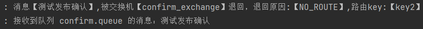
因为绑定 confirm_exchange 交换机的 routingKey 没有 key2 。所以无法路由，消息会被退回。
## 3、备份交换机
当交换机接收到一条不可路由消息时，将会把这条消息转发到备份交换机中，由备份交换机来进行转发和处理，通常备份交换机的类型为 Fanout ，这样就能把所有消息都投递到与其绑定的队列中，然后我们在备份交换机下绑定一个队列，这样所有那些原交换机无法被路由的消息，就会都进入这个队列了。还可以建立一个报警队列，用独立的消费者来进行监测和报警。
### 3.1、代码架构图
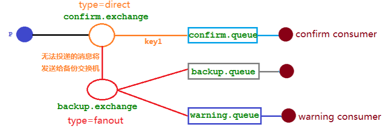
### 3.2、修改配置类
```java
@Configuration
public class ConfirmConfig {
    public static final String CONFIRM_QUEUE = "confirm.queue";
    public static final String CONFIRM_EXCHANGE = "confirm.exchange";
    public static final String BACKUP_EXCHANGE = "backup.exchange";
    public static final String BACKUP_QUEUE = "backup.queue";
    public static final String WARNING_QUEUE = "warning.queue";
    
    // 声明交换机====添加备份交换机==============
    @Bean
    public DirectExchange confirmExchange() {
        Map<String, Object> arguments = new HashMap<>();
        arguments.put("alternate-exchange", BACKUP_EXCHANGE);
        return new DirectExchange(CONFIRM_EXCHANGE,false,false,arguments);
    }

    // 声明队列
    @Bean
    public Queue confirmQueue() {
        return QueueBuilder.durable(CONFIRM_QUEUE).build();
    }

    // 绑定队列到交换机
    @Bean
    public Binding confirmQueueBinding(Queue confirmQueue, DirectExchange confirmExchange) {
        return BindingBuilder.bind(confirmQueue).to(confirmExchange).with("key1");
    }

    // 下面是备份交换机配置===================================================
    // 声明备份交换机
    @Bean
    public FanoutExchange backupExchange() {
        return new FanoutExchange(BACKUP_EXCHANGE);
    }

    // 声明备份队列
    @Bean
    public Queue backupQueue() {
        return new Queue(BACKUP_QUEUE);
    }

    // 绑定备份队列到备份交换机
    @Bean
    public Binding backupQueueToBackupExchange(Queue backupQueue, FanoutExchange backupExchange) {
        return BindingBuilder.bind(backupQueue).to(backupExchange);
    }

    // 声明警告队列
    @Bean
    public Queue warningQueue() {
        return new Queue(WARNING_QUEUE);
    }

    // 绑定警告队列到备份交换机
    @Bean
    public Binding warningQueueToBackupExchange(Queue warningQueue, FanoutExchange backupExchange) {
        return BindingBuilder.bind(warningQueue).to(backupExchange);
    }
}
```
> 重新启动项目的时候需要把原来的 confirm.exchange 删除因为我们修改了其绑定属性，不然报错。

### 3.3、消息生产者
```java
@GetMapping("/sendMessage")
public void sendMessage() {
    rabbitTemplate.convertAndSend(ConfirmConfig.CONFIRM_EXCHANGE, "key1", "message1".getBytes());
    rabbitTemplate.convertAndSend(ConfirmConfig.CONFIRM_EXCHANGE, "key2", "message2".getBytes());
}
```
### 3.4、备份和报警消费者
```java
@RabbitListener(queues = ConfirmConfig.WARNING_QUEUE)
public void warningReceiveMsg(Message message) {
    log.info("接收到【警告】队列的消息：{}", new String(message.getBody()));
}

@RabbitListener(queues = ConfirmConfig.BACKUP_QUEUE)
public void backupReceiveMsg(Message message) {
    log.info("接收到【备份】队列的消息：{}", new String(message.getBody()));
}
```
### 3.5、结果分析
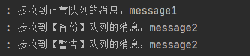
备份交换机解决的也是无法路由故障。
如果** mandatory 参数与备份交换机同时开启**，经过上面结果显示**备份交换机优先级高**。  
# 十、其他知识点
## 1、幂等性
### 1.1、概念 
用户对于同一操作发起的一次请求或者多次请求的结果是一致的，不会因为多次点击而产生了副作用。比如用户购买商品后支付扣款成功，但是返回结果的时候网络异常，此时钱已经扣了，用户再次点击按钮，此时会进行第二次扣款，返回结果成功，用户查询余额发现多扣钱了，流水记录也变成了两条。在以前的单应用系统中，我们只需要把数据操作放入事务中即可，发生错误立即回滚。
### 1.2、消息重复消费 
消费者在消费 MQ 中的消息时，MQ 已把消息发送给消费者，消费者在给 MQ 返回 ack 时网络中断，故 MQ 未收到确认信息，该条消息会重新发给其他的消费者，或者在网络重连后再次发送给该消费者，但实际上该消费者已成功消费了该条消息，造成消费者消费了重复的消息。
### 1.3、解决思路 
MQ 消费者的幂等性的解决一般使用**全局 ID** 或者写个**唯一标识，**比如：**时间戳**或者 **UUID** 或者订单消费者消费 MQ 中的消息也可利用 MQ 的该 id 来判断，或者可按自己的规则生成一个全局唯一 id，每次消费消息时用该 id 先判断该消息是否已消费过。
### 1.4、消费端的幂等性保障 
在海量订单生成的业务高峰期，生产端有可能就会重复发生了消息，这时候消费端就要实现幂等性，这就意味着我们的消息永远不会被消费多次，即使我们收到了一样的消息。
业界主流的幂等性有两种操作:

- 唯一 ID + 指纹码机制，利用数据库主键去重
- 利用 redis 的原子性去实现
### 1.5、唯一 ID + 指纹码机制 
指纹码：**一些规则**或者**时间戳**加**别的服务给到的唯一信息码**，它并不一定是我们系统生成的，基本都是由我们的业务规则拼接而来，但是一定要保证唯一性，然后就利用查询语句进行判断这个 id 是否存在数据库中，优势就是实现简单就一个拼接，然后查询判断是否重复；劣势就是在高并发时，如果是单个数据库就会有写入性能瓶颈当然也可以采用分库分表提升性能，但也不是我们最推荐的方式。
### 1.6、Redis 原子性 
利用 redis 执行 setnx 命令，天然具有幂等性。从而实现不重复消费。
## 2、优先级队列
### 2.1、添加方法
#### 2.1.1、控制台页面添加
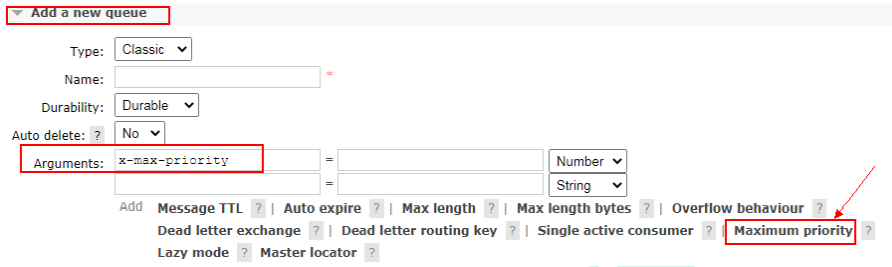
#### 2.1.2、队列声明时添加
跟控制台一样，只是设置队列的最大优先级，消息的实际优先级需要在消息中设置。
```java
Map<String, Object> params = new HashMap();
params.put("x-max-priority", 10);
channel.queueDeclare("hello", true, false, false, params);
```
#### 2.1.3、消息中添加
```java
AMQP.BasicProperties properties = new AMQP.BasicProperties().builder().priority(5).build();
```
#### 2.1.4、注意事项
要让队列实现优先级需要做的事情有如下事情：

- 队列需要设置为优先级队列
- 消息需要设置消息的优先级
- **消费者需要等待消息已经发送到队列中才去消费**，因为这样才有机会对消息进行排序
### 2.3、实战
#### 2.3.1、配置类
```java
@Configuration
public class PriorityConfig {
    public static final String HELLO_QUEUE = "hello.queue";
    public static final String HELLO_EXCHANGE = "hello.exchange";

    @Bean
    public Queue helloQueue() {
        Map<String, Object> params = new HashMap<>();
        params.put("x-max-priority", 10);
        return new Queue(HELLO_QUEUE, false, false, false, params);
    }

    @Bean
    public DirectExchange helloExchange() {
        return new DirectExchange(HELLO_EXCHANGE);
    }

    @Bean
    public Binding helloToExchange(Queue helloQueue,DirectExchange helloExchange) {
        return BindingBuilder.bind(helloQueue).to(helloExchange).with("");
    }
}
```
#### 2.3.2、消息生产者
```java
@RequestMapping("/priority")
public void testPriority() {
    for (int i = 0; i < 30; i++) {
        if (i % 5 == 0) {
            rabbitTemplate.convertAndSend(PriorityConfig.HELLO_EXCHANGE, "", "info" + i, message -> {
                message.getMessageProperties().setPriority(5);
                return message;
            });
        } else {
            rabbitTemplate.convertAndSend(PriorityConfig.HELLO_EXCHANGE, "", "info" + i);
        }
    }
}
```
#### 2.3.3、消息消费者
```java
@RabbitListener(queues = PriorityConfig.HELLO_QUEUE)
public void receiveMsg(Message message) {
    log.info("接收到队列的消息：{}", new String(message.getBody()));
}
```
> 测试的时候先发送消息到队列后，再打开这个消费者接收。

## 3、惰性队列
### 3.1、使用场景 
RabbitMQ 从 3.6.0 版本开始引入了惰性队列的概念。惰性队列会尽可能的将消息存入磁盘中，而在消费者消费到相应的消息时才会被加载到内存中，它的一个重要的设计目标是能够支持更长的队列，即支持更多的消息存储。当消费者由于各种各样的原因(比如消费者下线、宕机亦或者是由于维护而关闭等)而致使长时间内不能消费消息造成堆积时，惰性队列就很有必要了。
默认情况下，当生产者将消息发送到 RabbitMQ 的时候，队列中的消息会尽可能的存储在内存之中，这样可以更加快速的将消息发送给消费者。即使是持久化的消息，在被写入磁盘的同时也会在内存中驻留一份备份。当 RabbitMQ 需要释放内存的时候，会将内存中的消息保存至磁盘中，这个操作会耗费较长的时间，也会阻塞队列的操作，进而无法接收新的消息。虽然 RabbitMQ 的开发者们一直在升级相关的算法，但是效果始终不太理想，尤其是在消息量特别大的时候。
### 3.2、队列两种模式 
队列具备两种模式：default 和 lazy。默认的为 default 模式，在 3.6.0 之前的版本无需做任何变更。lazy 模式即为惰性队列的模式，可以通过调用 channel.queueDeclare 方法的时候在参数中设置，也可以通过 Policy 的方式设置，如果一个队列同时使用这两种方式设置的话，那么 Policy 的方式具备更高的优先级。
在队列声明的时候可以通过 “x-queue-mode” 参数来设置队列的模式，取值为“default”和“lazy”。
下面示例中演示了一个惰性队列的声明细节：
```java
Map<String, Object> args = new HashMap<String, Object>();
args.put("x-queue-mode", "lazy");
channel.queueDeclare("myqueue", false, false, false, args);
```
### 3.3、内存开销对比 
在发送 1 百万条消息，每条消息大概占 1KB 的情况下，普通队列占用内存是 1.2GB，而惰性队列仅仅占用 1.5MB。
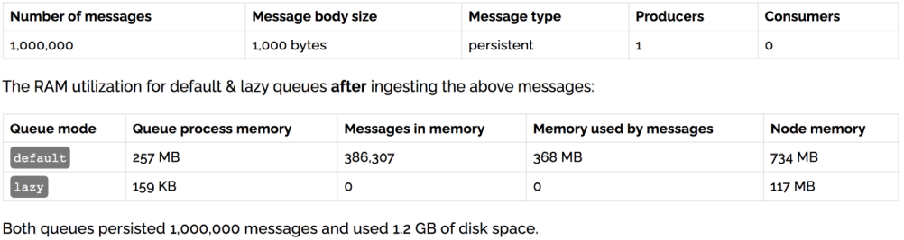
# 十一、集群
最开始我们介绍了如何安装及运行 RabbitMQ 服务，不过这些是单机版的，无法满足目前真实应用的要求。如果 RabbitMQ 服务器遇到内存崩溃、机器掉电或者主板故障等情况，该怎么办？
单台 RabbitMQ服务器可以满足每秒 1000 条消息的吞吐量，那么如果应用需要 RabbitMQ 服务满足每秒 10 万条消息的吞吐量呢？
购买昂贵的服务器来增强单机 RabbitMQ 务的性能显得捉襟见肘，搭建一个 RabbitMQ 集群才是解决实际问题的关键。
## 1、搭建步骤
### 1.1、修改主机名称
> 这里是以三台机器为例。

修改 3 台机器的主机名称
`vim /etc/hostname`
### 1.2、配置hosts文件
> 配置各个节点的 hosts 文件，让各个节点都能互相识别对方
> 实际生产中使用域名或者 ip

```bash
vim /etc/hosts
10.211.55.74 node1
10.211.55.75 node2
10.211.55.76 node3
```
### 1.3、复制 cookie
以确保各个节点的 cookie 文件使用的是同一个值
在 node1 上执行远程操作命令
`scp /var/lib/rabbitmq/.erlang.cookie root@node2:/var/lib/rabbitmq/.erlang.cookie`
`scp /var/lib/rabbitmq/.erlang.cookie root@node3:/var/lib/rabbitmq/.erlang.cookie`
### 1.4、启动 RabbitMQ
启动 RabbitMQ 服务,顺带启动 Erlang 虚拟机和 RbbitMQ 应用服务(在三台节点上分别执行以下命令)
`rabbitmq-server -detached`
### 1.5、节点 2 执行
```bash
rabbitmqctl stop_app
#(rabbitmqctl stop 会将 Erlang 虚拟机关闭，rabbitmqctl stop_app 只关闭 RabbitMQ 服务)
rabbitmqctl reset
rabbitmqctl join_cluster rabbit@node1
rabbitmqctl start_app #(只启动应用服务)
```
### 1.6、节点 3 执行
```bash
rabbitmqctl stop_app
rabbitmqctl reset
rabbitmqctl join_cluster rabbit@node2
rabbitmqctl start_app
```
### 1.7、查看集群状态
`rabbitmqctl cluster_status`
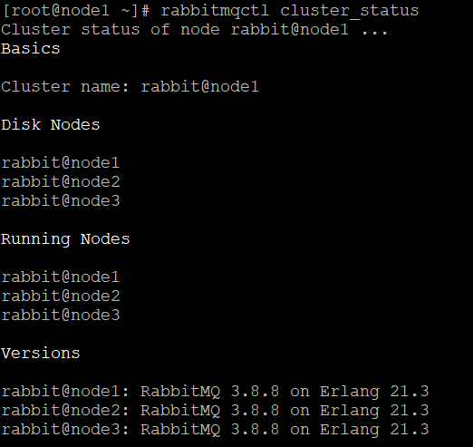
### 1.8、重新设置用户

- 创建账号
   - `rabbitmqctl add_user admin 123`
- 设置用户角色
   - `rabbitmqctl set_user_tags admin administrator`
- 设置用户权限
   - `rabbitmqctl set_permissions -p "/" admin ".*" ".*" ".*"`
### 1.9、解除集群节点

- node2 和 node3 机器分别执行
   - `rabbitmqctl stop_app`
   - `rabbitmqctl reset`
   - `rabbitmqctl start_app`
   - `rabbitmqctl cluster_status`
- node1 机器上执行【忘记node2 和 node3】
   - `rabbitmqctl forget_cluster_node rabbit@node2`
   - `rabbitmqctl forget_cluster_node rabbit@node3`
## 2、镜像队列
### 2.1、介绍
引入镜像队列(Mirror Queue)的机制，可以将队列镜像到集群中的其他 Broker 节点之上，如果集群中的一个节点失效了，队列能自动地切换到镜像中的另一个节点上以保证服务的可用性。
### 2.2、搭建步骤 
#### 2.2.1、启动三台集群节点
#### 2.2.2、添加 policy
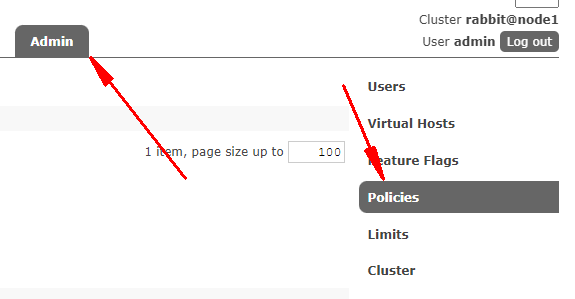
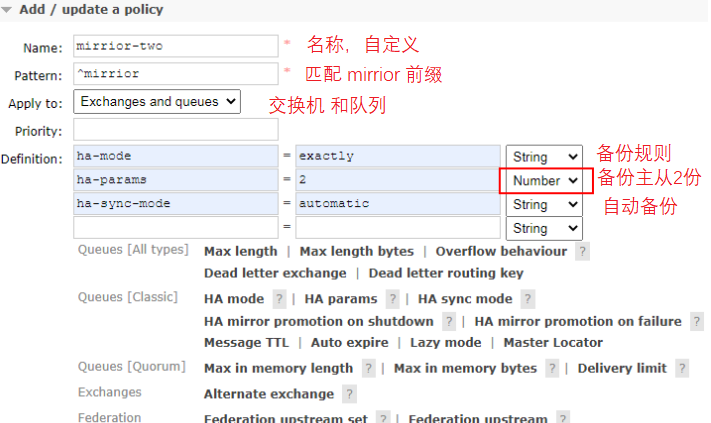

> 在 node1 上创建一个队列发送一条消息，队列存在镜像队列。
> 停掉 node1 之后发现 node2 成为镜像队列。
> 就算整个集群只剩下一台机器了 依然能消费队列里面的消息。
> 说明队列里面的消息被镜像队列传递到相应机器里面了

## 3、负载均衡
Haproxy+Keepalive 实现高可用负载均衡
### 3.1、整体架构图
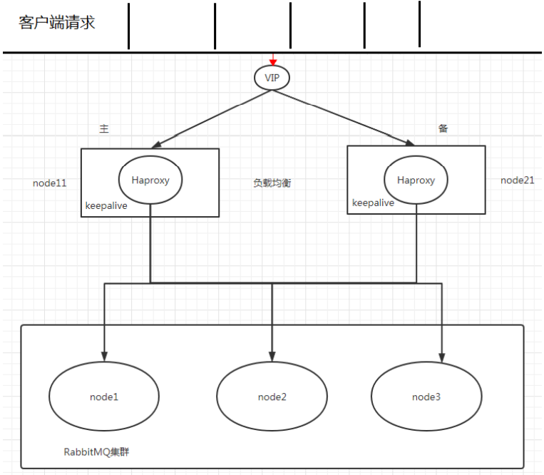
### 3.2、Haproxy 实现
HAProxy 提供高可用性、负载均衡及基于 TCPHTTP 应用的代理，支持虚拟主机，它是免费、快速并且可靠的一种解决方案，包括 Twitter,Reddit,StackOverflow,GitHub 在内的多家知名互联网公司在使用。
HAProxy 实现了一种事件驱动、单一进程模型，此模型支持非常大的井发连接数。
扩展：nginx,lvs,haproxy 之间的区别: [http://www.ha97.com/5646.html](http://www.ha97.com/5646.html)
### 3.3、Haproxy 搭建步骤 

- 安装 haproxy(在 node1 和 node2)
   - `yum -y install haproxy`
- 修改 node1 和 node2 的 haproxy.cfg
   - `vim /etc/haproxy/haproxy.cfg`
   -  需要修改红色 IP 为当前机器 IP
   -  
- 在两台节点启动 haproxy
   - `haproxy -f /etc/haproxy/haproxy.cfg`
   - `ps -ef | grep haproxy`
- 访问地址
   - [http://10.211.55.71:8888/stats](http://10.211.55.71:8888/stats)
### 3.4、Keepalived 双机(主备)热备 
试想如果前面配置的 HAProxy 主机突然宕机或者网卡失效，那么虽然 RbbitMQ 集群没有任何故障但是对于外界的客户端来说所有的连接都会被断开结果将是灾难性的为了确保负载均衡服务的可靠性同样显得十分重要，这里就要引入 Keepalived 它能够通过自身健康检查、资源接管功能做高可用(双机热备)，实现
故障转移。
### 3.5、Keepalived搭建步骤 

- 安装 keepalived
   - `yum -y install keepalived`
- 节点 node1 配置文件
   - `vim /etc/keepalived/keepalived.conf`
   - 把资料里面的 keepalived.conf 修改之后替换
- 节点 node2 配置文件
   - 需要修改 global_defs 的 router_id,如:nodeB
   - 其次要修改 vrrp_instance_VI 中 state 为"BACKUP"；
   - 最后要将 priority 设置为小于 100 的值
- 添加 haproxy_chk.sh
   - 为了防止 HAProxy 服务挂掉之后 Keepalived 还在正常工作而没有切换到 Backup 上，所以这里需要编写一个脚本来检测 HAProxy 务的状态,当 HAProxy 服务挂掉之后该脚本会自动重启HAProxy 的服务，如果不成功则关闭 Keepalived 服务，这样便可以切换到 Backup 继续工作。
   - `vim /etc/keepalived/haproxy_chk.sh`(可以直接上传文件)
   - 修改权限 `chmod 777 /etc/keepalived/haproxy_chk.sh`
- 启动 keepalive 命令(node1 和 node2 启动)
   - `systemctl start keepalived`
- 观察 Keepalived 的日志
   - `tail -f /var/log/messages -n 200`
- 观察最新添加的 vip
   - `ip add show`
- node1 模拟 keepalived 关闭状态
   - `systemctl stop keepalived`
- 使用 vip 地址来访问 rabbitmq 集群
## 4、Federation Exchange
详细介绍
[https://www.jianshu.com/p/c23eec2858fb](https://www.jianshu.com/p/c23eec2858fb)
### 4.1、介绍
(broker 北京)，(broker 深圳)彼此之间相距甚远，网络延迟是一个不得不面对的问题。有一个在北京的业务(Client 北京) 需要连接(broker 北京)，向其中的交换器 exchangeA 发送消息，此时的网络延迟很小，(Client 北京)可以迅速将消息发送至 exchangeA 中，就算在开启了 publisherconfirm 机制或者事务机制的情况下，也可以迅速收到确认信息。
此时又有个在深圳的业务(Client 深圳)需要向 exchangeA 发送消息，那么(Client 深圳) (broker 北京)之间有很大的网络延迟，(Client 深圳) 将发送消息至 exchangeA 会经历一定的延迟，尤其是在开启了 publisherconfirm 机制或者事务机制的情况下，(Client 深圳) 会等待很长的延迟时间来接收(broker 北京)的确认信息，进而必然造成这条发送线程的性能降低，甚至造成一定程度上的阻塞。
将业务(Client 深圳)部署到北京的机房可以解决这个问题，但是如果(Client 深圳)调用的另些服务都部署在深圳，那么又会引发新的时延问题。
这里使用 Federation 插件就可以很好地解决这个问题。

### 4.2、搭建步骤

- 需要保证每台节点单独运行
   - 比如上面北京节点和深圳节点**不能在一个集群里面**。
- 在每台机器上开启 federation 相关插件
   - `rabbitmq-plugins enable rabbitmq_federation`
   - `rabbitmq-plugins enable rabbitmq_federation_management`
- 原理图(先运行 consumer 在 node2 创建 fed_exchange)
   - 
- 在 downstream(node2)配置 upstream(node1)
   - 
- 添加 policy
   - 
- 成功前提
   - 
   - 这时在 node2 中为交换器 fed_exchange （node2 的队列 node2_queue 通过 "routeKey" 与 fed_exchange 进行了绑定）与 node1 之间建立一条单向的连接。此时 Federation 插件会在 node1 上会建立一个同名的交换器 fed_exchange (这个名称可以配置，默认同名)，同时建立一个内部的交换器 "federation: fed_exchange -> rabbit@node2.lan B"，**并通过路由键 "routeKey" 将这两个交换器绑定起来**。
## 5、Federation Queue
详细介绍
[https://www.jianshu.com/p/c23eec2858fb](https://www.jianshu.com/p/c23eec2858fb)
### 5.1、介绍
联邦队列可以在多个 Broker 节点(或者集群)之间为单个队列提供均衡负载的功能。一个联邦队列可以连接一个或者多个上游队列(upstream queue)，并从这些上游队列中获取消息以满足本地消费者消费消息的需求。
### 5.2、搭建步骤 

- 原理图
   -  
- 添加 upstream(同上)
   - 如果已经设置过，就不用再设置了，可以直接使用
- 添加 policy
   - 
- 成功前提
   - 
   - 此时 Federation 插件会在 node1 上创建同名的队列 fed.queue ，与 node2 中的队列 fed.queue 建立单向独立的连接。
### 5.3、消费方式
当有消费者连接 node2 并通过 Basic.Consume 消费队列 fed.queue 中的消息时，如果队列 fed.queue 中本身有若干消息堆积，那么直接消费这些消息，此时 node2 中的 fed.queue 并不会拉取 node1中的 fed.queue 的消息。
如果队列 fed.queue 中没有消息堆积或者消息被消费完了，那么它会通过 Federation link 拉取在 node1 中的上游队列 fed.queue 中的消息（如果有消息），然后存储到本地，之后再被消费者进行消费。

## 6、Shovel
### 6.1、介绍 
与 Federation 具备的数据转发功能类似，Shovel 够可靠、持续地从一个 Broker 中的队列(作为源端，即source)拉取数据并转发至另一个 Broker 中的交换器(作为目的端，即 destination)。
作为源端的队列和作为目的端的交换器**可以同时位于同一个 Broker，也可以位于不同的 Broker 上**。
Shovel 可以翻译为"铲子"，是一种比较形象的比喻，这个"铲子"可以将消息从一方"铲向"另一方。
Shovel 行为就像优秀的客户端应用程序能够负责连接源和目的地、负责消息的读写及负责连接失败问题的处理。
### 6.2、搭建步骤 

- 开启插件(需要的机器都开启)
   - `rabbitmq-plugins enable rabbitmq_shovel`
   - `rabbitmq-plugins enable rabbitmq_shovel_management`
- 2.原理图(在源头发送的消息直接会进入到目的地队列)
   - 
- 添加 shovel 源和目的地
   - 
   - 交换机操作类似