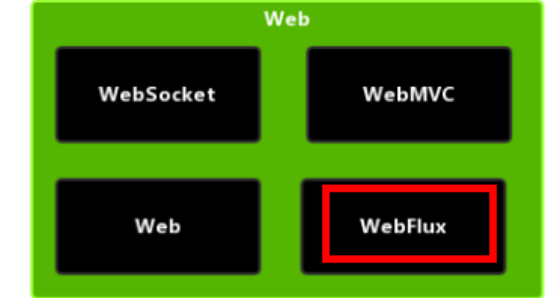

Spring5 框架概述

[尚硅谷Spring框架视频教程（spring5源码级讲解）_哔哩哔哩_bilibili](https://www.bilibili.com/video/BV1Vf4y127N5)

1. **Spring 是轻量级的开源的 JavaEE 框架**

2. **Spring 可以解决企业应用开发的复杂性**

3. **Spring 有两个核心部分：IOC 和 Aop**

   （1）IOC：控制反转，把创建对象过程交给 Spring 进行管理

   （2）Aop：面向切面，不修改源代码进行功能增强

4. **Spring 特点**

   （1）方便解耦，简化开发

   （2）Aop 编程支持

   （3）方便程序测试

   （4）方便和其他框架进行整合

   （5）方便进行事务操作

   （6）降低 API 开发难度

# 一、IOC

## 1、概念和原理


1. **什么是 IOC**

   （1）控制反转，把对象创建和对象之间的调用过程，交给 Spring 进行管理

   （2）使用 IOC 目的：为了耦合度降低

   （3）做入门案例就是 IOC 实现

2. **IOC 底层原理**

   xml 解析、工厂模式、反射

3. **画图讲解 IOC 底层原理**

   

## 2、BeanFactory

### 2.1、介绍

- IOC 思想基于 IOC 容器完成，IOC 容器底层就是对象工厂
- Spring 的核心容器, 主要的 ApplicationContext 实现都【组合】了它的功能。
- 控制反转、基本的依赖注入、Bean 生命周期的各种功能，都由它的实现类提供。
- 主要实现类。
  - DefaultListableBeanFactory，是 BeanFactory 最重要的实现。
  - 像**控制反转**和**依赖注入**功能，都是它来实现


### 2.2、ApplicationContext

- BeanFactory 的子接口，组合并扩展了 BeanFactory 的功能。

- 扩展了国际化、通配符方式获取一组 Resource 资源、整合 Environment 环境、事件发布与监听。

- 主要实现类。

  - ClassPathXmlApplicationContext，从类路径查找 XML 配置文件，创建容器（旧）
  - FileSystemXmlApplicationContext，从磁盘路径查找 XML 配置文件，创建容器（旧）
  - XmlWebApplicationContext，传统 SSM 整合时，基于 XML 配置文件的容器（旧）
  - AnnotationConfigWebApplicationContext，传统 SSM 整合时，基于 java 配置类的容器（旧）
  - AnnotationConfigApplicationContext，Spring boot 中非 web 环境容器（新）
  - AnnotationConfigServletWebServerApplicationContext，Spring boot 中 servlet web 环境容器（新）
  - AnnotationConfigReactiveWebServerApplicationContext，Spring boot 中 reactive web 环境容器（新）

  > 后面这些带有 ApplicationContext 的类都是 ApplicationContext 接口的实现，但它们是**组合**了 DefaultListableBeanFactory 的功能，并非继承而来


## 3、概念

1. Bean 管理指的是两个操作

   （1）Spring 创建对象

   （2）Spirng 注入属性 

2. Bean 管理操作有两种方式

   （1）基于 xml 配置文件方式实现

   （2）基于注解方式实现

## 4、基于 xml 方式

### 4.1、创建对象

```xml
<bean id="user" class="com.chaoRen.spring5.User"></bean>
```

（1）在 spring 配置文件中，使用 bean 标签，标签里面添加对应属性，就可以实现对象创建

（2）在 bean 标签有很多属性，介绍常用的属性

* id 属性：唯一标识
* class 属性：类全路径（包类路径）

（3）创建对象时候，默认也是执行无参数构造方法完成对象创建

### 4.2、注入属性

DI：依赖注入，就是注入属性

#### 4.2.1、set 方法注入

（1）创建类，定义属性和对应的 set 方法

（2）在 spring 配置文件配置对象创建，配置属性注入

```xml
<bean id="user" class="com.chaoRen.spring5.User">
    <property name="name" value="任超"></property>
    <property name="age" value="31"></property>
</bean>
```

#### 4.2.2、有参数构造注入

（1）创建类，定义属性，创建属性对应有参数构造方法

（2）在 spring 配置文件中进行配置

```xml
<bean id="user" class="com.chaoRen.spring5.User">
    <constructor-arg name="name" value="任超"></constructor-arg>
    <constructor-arg name="age" value="32"></constructor-arg>
</bean>
```

#### 4.2.3、p 名称空间注入（了解）

使用 p 名称空间注入，可以简化基于 xml 配置方式

第一步 添加 p 名称空间在配置文件中

```xml
xmlns:p="http://www.springframework.org/schema/p"
```

第二步 进行属性注入，在 bean 标签里面进行操作

```xml
<bean id="user" class="com.chaoRen.spring5.User" p:name="任超pp" p:age="25"/>
```


## 5、xml 注入其他类型属性

### 5.1、字面量

（1）null 值

```xml
<property name="address">
    <null/>
</property>
```

（2）属性值包含特殊符号

```xml
<!--属性值包含特殊符号
1 把<>进行转义 &lt; &gt;
2 把带特殊符号内容写到 CDATA
-->
<property name="address">
    <value><![CDATA[<<南京>>]]></value>
</property>
```

### 5.2、注入属性-外部 bean

（1）创建两个类 service 类和 dao 类

（2）在 service 调用 dao 里面的方法

（3）在 spring 配置文件中进行配置

```java
public class UserService {
    private UserDao userDao;
    public void setUserDao(UserDao userDao) {
        this.userDao = userDao;
    }
    public void add() {
        System.out.println("添加成功。。。。");
        userDao.update();
    }
}
```

```xml
    <bean id="userDao" class="com.chaoRen.dao.UserDaoImpl"/>
    <bean id="userService" class="com.chaoRen.service.UserService">
        <property name="userDao" ref="userDao"/>
    </bean>
```

### 5.3、注入属性-内部 bean

（1）一对多关系：一个部门有多个员工

（2）在 spring 配置文件中进行配置

```xml
    <bean id="emp" class="com.chaoRen.bean.Emp">
        <property name="name" value="任超"/>
        <property name="sex" value="男"/>
        <property name="dept">
            <bean class="com.chaoRen.bean.Dept">
                <property name="name" value="开发部"/>
            </bean>
        </property>
    </bean>
```

### 5.4、注入属性-级联赋值

（1）第一种写法 

```xml
    <bean id="emp" class="com.chaoRen.bean.Emp">
        <property name="name" value="任超"/>
        <property name="sex" value="男"/>
        <!--级联赋值-->
        <property name="dept" ref="dept"/>
    </bean>
    <bean id="dept" class="com.chaoRen.bean.Dept">
        <property name="name" value="开发部"/>
    </bean>
```

（2）第二种写法

```xml
    <bean id="emp" class="com.chaoRen.bean.Emp">
        <property name="name" value="任超"/>
        <property name="sex" value="男"/>
        <!--级联赋值-->
        <property name="dept" ref="dept"/>
        <property name="dept.name" value="产品部"/>
    </bean>
    <bean id="dept" class="com.chaoRen.bean.Dept">
    </bean>
```


## 6、xml 注入集合属性

1. 注入数组类型属性

2. 注入 List 集合类型属性

3. 注入 Map 集合类型属性

   （1）创建类，定义数组、list、map、set 类型属性，生成对应 set 方法

   ```java
   public class Student {
       private String[] arr;
       private List<String> list;
       private Map<Integer,String> map;
       private Set<String> set;
       private List<Food> foods;
       //......
   }
   ```

   （2）在 spring 配置文件进行配置

   ```xml
       <bean id="student" class="com.chaoRen.collectiontype.Student">
           <property name="arr">
               <array>
                   <value>任超</value>
                   <value>王道月</value>
                   <value>任子馨</value>
                   <value>任传睿</value>
               </array>
           </property>
           <property name="list">
               <list>
                   <value>超</value>
                   <value>月</value>
                   <value>馨</value>
                   <value>睿</value>
               </list>
           </property>
           <property name="map">
               <map>
                   <entry key="1" value="任超"/>
                   <entry key="2" value="王道月"/>
                   <entry key="3" value="任子馨"/>
                   <entry key="4" value="任传睿"/>
               </map>
           </property>
           <property name="set">
               <set>
                   <value>馨</value>
                   <value>睿</value>
               </set>
           </property>
       </bean>
   ```

4. 在集合里面设置对象类型值

   ```xml
       <!--创建多个 food 对象-->
       <bean id="food1" class="com.chaoRen.collectiontype.Food" p:name="米饭"/>
       <bean id="food2" class="com.chaoRen.collectiontype.Food" p:name="青菜"/>
   
   	<!--注入 list 集合类型，值是对象-->
       <bean id="student" class="com.chaoRen.collectiontype.Student">
           <property name="foods">
               <list>
                   <ref bean="food1"/>
                   <ref bean="food2"/>
               </list>
           </property>
       </bean>
   ```

5. 把集合注入部分提取出来

   （1）在 spring 配置文件中引入名称空间 util

   （2）使用 util 标签完成 list 集合注入提取

   ```xml
       <util:list id="bookList">
           <value>三国演义</value>
           <value>童话故事</value>
           <value>西游记</value>
       </util:list>
       <bean id="book" class="com.chaoRen.collectiontype.Book">
           <property name="list" ref="bookList"/>
       </bean>
   ```

   

## 7、FactoryBean(工厂bean)

1. **Spring 有两种类型 bean**

   - 普通 bean，
   - 工厂 bean（FactoryBean）

2. 普通 bean：在配置文件中定义 bean 类型就是返回类型

3. 工厂 bean：在配置文件定义 bean 类型可以和返回类型不一样

   第一步 创建类，让这个类作为工厂 bean，实现接口 FactoryBean

   第二步 实现接口里面的方法，在实现的方法中定义返回的 bean 类型

   ```java
   public class MyBean implements FactoryBean<Book> {
       @Override
       public Book getObject() throws Exception {
           Book book = new Book();
           ArrayList<String> strings = new ArrayList<>();
           strings.add("任超");
           book.setList(strings);
           return book;
       }
   
       @Override
       public Class<?> getObjectType() {
           return null;
       }
   
       @Override
       public boolean isSingleton() {
           return FactoryBean.super.isSingleton();
       }
   }
   ```

   

## 8、bean 作用域(单实例 多实例)

1. 在 Spring 里面，默认情况下，bean 是单实例对象

2. bean 标签属性（scope）设置单实例还是多实例

   - 默认值，singleton，表示是单实例对象
   - prototype，表示是多实例对象

3. singleton 和 prototype 区别

   singleton：加载 spring 配置文件时候就会创建单实例对象

   prototype：加载 spring 配置文件时不创建对象，调用getBean方法时才创建多实例对象

## 9、bean 生命周期

1. 生命周期

   从对象创建到对象销毁的过程

2. bean 生命周期

   （1）通过构造器创建 bean 实例（无参数构造）

   （2）为 bean 的属性设置值和对其他 bean 引用（调用 set 方法）

   （3）调用 bean 的初始化的方法（需要进行配置初始化的方法）

   （4）bean 可以使用了（对象获取到了

   （5）当容器关闭时候，调用 bean 的销毁的方法（需要进行配置销毁的方法）

   ```java
   public class Order {
       private String name;
       public Order() {
           System.out.println("第一步，构造器");
       }
       public void setName(String name) {
           this.name = name;
           System.out.println("第二步，注入参数");
       }
       public void init() {
           System.out.println("第三步，初始化");
       }
       public void destroy() {
           System.out.println("第五部，销毁");
       }
   }
   ```

   ```xml
       <bean id="order" class="com.chaoRen.collectiontype.Order" 
             init-method="init" destroy-method="destroy">
           <property name="name" value="手机"/>
       </bean>
   ```

   ```java
       @Test
       public void TestBean4() {
           ClassPathXmlApplicationContext context = new ClassPathXmlApplicationContext("bean4.xml");
           Order order = context.getBean("order", Order.class);
           System.out.println("第四步，获取对象");
           System.out.println(order);
           context.close();
       }
   ```

   

3. bean 的后置处理器，bean 生命周期有七步

   （1）通过构造器创建 bean 实例（无参数构造）

   （2）为 bean 的属性设置值和对其他 bean 引用（调用 set 方法）

   **（3）把 bean 实例传递 bean 后置处理器的方法 postProcessBeforeInitialization**

   （4）调用 bean 的初始化的方法（需要进行配置初始化的方法）

   **（5）把 bean 实例传递 bean 后置处理器的方法 postProcessAfterInitialization**

   （6）bean 可以使用了（对象获取到了）

   （7）当容器关闭时候，调用 bean 的销毁的方法（需要进行配置销毁的方法） 

4. 演示添加后置处理器效果

   （1）创建类，实现接口 BeanPostProcessor，创建后置处理器

   ```java
   public class MyBeanPost implements BeanPostProcessor {
       @Override
       public Object postProcessBeforeInitialization(Object bean, String beanName) throws BeansException {
           System.out.println("==========初始化之前==========");
           return bean;
       }
       @Override
       public Object postProcessAfterInitialization(Object bean, String beanName) throws BeansException {
           System.out.println("==========初始化之后==========");
           return bean;
       }
   }
   ```

   （2）配置后置处理器
   
   ```xml
       <bean id="myBeanPost" class="com.chaoRen.collectiontype.MyBeanPost"/>
   ```
   
   

## 10、xml 自动装配

1. 根据指定装配规则（属性名称或者属性类型），Spring 自动将匹配的属性值进行注入

2. 演示自动装配过程

   ```java
   public class UserService {
       private UserDao userDao;
       public void setUserDao(UserDao userDao) {
           this.userDao = userDao;
       }
       //......
   }
   ```

   （1）根据属性名称自动注入

   ```xml
       <bean id="userDao" class="com.chaoRen.dao.UserDaoImpl"/>
       <bean id="userService" class="com.chaoRen.service.UserService" autowire="byName"/>
   ```

   （2）根据属性类型自动注入

   ```xml
       <bean id="userDao" class="com.chaoRen.dao.UserDaoImpl"/>
       <bean id="userService" class="com.chaoRen.service.UserService" autowire="byType"/>
   ```

   

## 11、外部属性文件

1. 以配置数据库信息为例

   （1）配置德鲁伊连接池

   （2）引入德鲁伊连接池依赖 jar 包

2. 引入外部属性文件配置数据库连接池

   （1）创建外部属性文件，properties 格式文件，写数据库信息

   ```properties
   jdbc.driverClass=com.mysql.jdbc.Driver
   jdbc.url=jdbc:mysql://localhost:3306/book
   jdbc.username=root
   jdbc.password=123
   ```

   （2）把外部 properties 属性文件引入到 spring 配置文件中

   * 需引入 context 名称空间

   ```xml
       <!--引入外部属性文件-->
       <context:property-placeholder location="classpath:jdbc.properties"/>
       <!--配置连接池-->
       <bean id="dataSource" class="com.alibaba.druid.pool.DruidDataSource">
           <property name="driverClassName" value="${jdbc.driverClass}"/>
           <property name="url" value="${jdbc.url}"/>
           <property name="username" value="${jdbc.username}"/>
           <property name="password" value="${jdbc.password}"/>
       </bean>
   ```

   

## 12、基于注解方式

### 12.1、什么是注解

（1）注解是代码特殊标记，格式：@注解名称(属性名称=属性值, 属性名称=属性值..)

（2）使用注解，注解作用在类上面，方法上面，属性上面

（3）使用注解目的：简化 xml 配置

### 12.2、Bean 管理4个注解

（1）@Component	普通

（2）@Service	业务逻辑层Service

（3）@Controller	web层

（4）@Repository	持久层dao

* 上面四个注解功能是一样的，都可以用来创建 bean 实例

### 12.3、基于注解对象创建

第一步 引入依赖

`spring-aop-5.2.6.RELEASE.jar`

第二步 开启组件扫描

```xml
    <!--开启组件扫描
     如果扫描多个包，多个包使用逗号隔开，或者扫描包上层目录-->
    <context:component-scan base-package="com.chaoRen.spring5.aopanno"/>
```

第三步 创建类，在类上面添加创建对象注解

```java
@Component(value = "user")
public class User {
    public void add() {
        System.out.println("User,add...");
    }
}
```

### 12.4、组件扫描细节配置

```xml
    <!--示例 1
     use-default-filters="false" 表示现在不使用默认 filter，自己配置 filter
     context:include-filter ，设置扫描哪些内容-->
    <context:component-scan base-package="com.chaoRen.spring5.aopanno" use-default-filters="false">
        <context:include-filter type="annotation" expression="org.springframework.stereotype.Component"/>
    </context:component-scan>

    <!--示例 2
     下面配置扫描包所有内容
     context:exclude-filter： 设置哪些内容不进行扫描-->
    <context:component-scan base-package="com.chaoRen.spring5.aopanno">
        <context:exclude-filter type="annotation" expression="org.springframework.stereotype.Controller"/>
    </context:component-scan>
```

### 12.5、属性注入

1. **@Autowired：**根据属性类型进行自动装配
   第一步 把 service 和 dao 对象创建，在 service 和 dao 类添加创建对象注解
   第二步 在 service 注入 dao 对象，在 service 类添加 dao 类型属性，在属性上面使用注解

   ```java
   @Service
   public class BookService {
       @Autowired
       private BookDao bookDao;
       
       public void add(Book book) {
           bookDao.add(book);
       }
   }
   ```

2. @Qualifier：根据名称进行注入
   @Qualifier 注解需要和@Autowired 一起使用

   ```java
   @Autowired
   @Qualifier(value = "bookDaoImpl")
   private BookDao bookDao;
   ```

3. @Resource：可以根据类型注入，可以根据名称注入

   ```java
   //根据类型进行注入
   @Resource
   private BookDao bookDao;
   
   //根据名称进行注入
   @Resource(name = "bookDaoImpl")
   private BookDao bookDao;
   ```

4. @Value：注入普通类型属性

   ```java
   @Value(value = "我是BookService")
   public String name;
   ```

### 12.6、完全注解开发

1. 创建配置类，替代 xml 配置文件

   ```java
   @Configuration  //告诉Spring这是配置类
   //开启组件扫描
   @ComponentScan(basePackages = {"com.chaoRen.spring5"})
   public class SpringConfig {}
   ```

2. 编写测试类

   ```java
   @Test
   public void test2() throws SQLException {
       ApplicationContext context = new AnnotationConfigApplicationContext(SpringConfig.class);
       BookService bookService = context.getBean("bookService", BookService.class);
       System.out.println(bookService.name);
   }
   ```

   


# 二、AOP

## 1、概念

- 什么是 AOP?

  （1）面向切面编程（方面），利用 AOP 可以对业务逻辑的各个部分进行隔离，从而使得 业务逻辑各部分之间的耦合度降低，提高程序的可重用性，同时提高了开发的效率。

  （2）通俗描述：不通过修改源代码方式，在主干功能里面添加新功能

  （3）使用登录例子说明 AOP

  

## 2、底层原理

AOP 底层使用动态代理

有两种情况动态代理

- 有接口情况，使用 JDK 动态代理

  创建接口实现类代理对象，增强类的方法

  

- 没有接口情况，使用 CGLIB 动态代理

  创建子类的代理对象，增强类的方法

  

## 3、JDK 动态代理

静态代理查看：

1. 使用 JDK 动态代理，使用 Proxy 类里面的方法创建代理对象

   `java.lang.reflect.Proxy`

   （1）调用 newProxyInstance 方法

   

   方法有三个参数：

   第一参数，类加载器

   第二参数，增强方法所在的类，这个类实现的接口，支持多个接口

   第三参数，实现这个接口 InvocationHandler，创建代理对象，写增强的部分

2. 编写 JDK 动态代理代码

   （1）创建接口，定义方法

   ```java
   public interface HelloInterface {
       void sayHello();
       int addition(int i1, int i2);
   }
   ```

   （2）创建接口实现类，实现方法

   ```java
   public class Hello implements HelloInterface{
       @Override
       public void sayHello() {
           System.out.println("Hello,我是实现类");
       }
   
       @Override
       public int addition(int i1, int i2) {
           return i1 + i2;
       }
   }
   ```

   （3）使用 Proxy 类创建接口代理对象

   ```java
   public class TestDynamic {
       @Test
       public void test2() {
           Hello hello = new Hello();
           HelloInterface helloInterface = (HelloInterface)
                   Proxy.newProxyInstance(TestDynamic.class.getClassLoader(),
                           hello.getClass().getInterfaces(),
                           new InvocationHandler() {//使用匿名内部类
               @Override
               public Object invoke(Object proxy, Method method, Object[] args) throws Throwable {
                   System.out.println("前置【" + method.getName() + "】传递的参数：" + Arrays.toString(args));
                   Object invoke = method.invoke(hello, args);
                   System.out.println(invoke);
                   System.out.println("后置。。。。。");
                   return invoke;
               }
           });
           helloInterface.addition(5,9);
       }
   }
   ```

   

## 4、术语

1. **连接点**

   类里面可以被增强的方法称为连接点。

2. **切入点**

   实际被增强的方法称为切入点。

3. **通知（增强）**

   实际增强的逻辑部分称为通知（增强）。

   通知有多种类型：

   - 前置通知@Before
   - 后置通知@AfterReturning，也叫返回通知（发生错误不执行）
   - 环绕通知@Around（发生错误环绕之后不执行）
   - 异常通知@AfterThrowing（发生错误执行）
   - 最终通知@After（有没有发生错误都会执行）

4. **切面（动作）**

   把通知应用到切面的过程。

## 5、准备工作

1. Spring 框架一般都是基于 AspectJ 实现 AOP 操作

   AspectJ 不是 Spring 组成部分，独立 AOP 框架，一般把 AspectJ 和 Spirng 框架一起使 用，进行 AOP 操作

2. 基于 AspectJ 实现 AOP 操作

   - 基于 xml 配置文件实现
   - 基于注解方式实现（使用）

3. 在项目工程里面引入 AOP 相关依赖

   

4. 切入点表达式

   （1）作用：知道对哪个类里面的哪个方法进行增强

   （2）语法结构： 

   - `execution([权限修饰符] [返回类型] [类全路径] [方法名称]([参数列表]))`

   ```xml
   例1：
   对 com.chaoRen.dao.BookDao 类里面的 add 进行增强
   execution(* com.chaoRen.dao.BookDao.add(..))
   例2：
   对 com.chaoRen.dao.BookDao 类里面的所有的方法进行增强
   execution(* com.chaoRen.dao.BookDao.* (..))
   例3：
   对 com.chaoRen.dao 包里面所有类，类里面所有方法进行增强
   execution(* com.chaoRen.dao.*.* (..))
   ```

   

## 6、AspectJ 注解

1. 创建类，在类里面定义方法

   ```java
   @Component
   public class User {
       public void add() {
           System.out.println("User,add...");
       }
   }
   ```

2. 创建增强类（编写增强逻辑）

   在增强类里面，创建方法，让不同方法代表不同通知类型

3. 进行通知的配置

   （1）在 spring 配置文件中，开启注解扫描

   ```xml
   <context:component-scan base-package="com.chaoRen.spring5.aopanno"/>
   ```

   （2）使用注解创建 User 和 UserProxy 对象

   （3）在增强类上面添加注解 @Aspect

   ```java
   @Component
   @Aspect
   public class UserProxy {}
   ```

   （4）在 spring 配置文件中开启生成代理对象

   ```xml
   <!-- 开启Aspect 生成代理对象-->
   <aop:aspectj-autoproxy/>
   ```

4. 配置不同类型的通知

   （1）在增强类的里面，在作为通知方法上面添加通知类型注解，使用切入点表达式配置

   ```java
   @Component
   @Aspect
   public class UserProxy {
       //前置通知
       @Before(value = "execution(* com.chaoRen.spring5.aopanno.User.add(..))")
       public void before() {
           System.out.println("before.....");
       }
   
       //最终通知
       @After(value = "execution(* com.chaoRen.spring5.aopanno.User.add(..))")
       public void after() {
           System.out.println("After.....");
       }
   
       //返回通知（发生错误不执行）
       @AfterReturning(value = "execution(* com.chaoRen.spring5.aopanno.User.add(..))")
       public void afterReturning() {
           System.out.println("AfterReturning.....");
       }
   
       //错误抛出通知（发生错误执行）
       @AfterThrowing(value = "execution(* com.chaoRen.spring5.aopanno.User.add(..))")
       public void afterThrowing() {
           System.out.println("AfterThrowing.....");
       }
   
       //环绕通知（发生错误环绕之后不执行）
       @Around(value = "execution(* com.chaoRen.spring5.aopanno.User.add(..))")
       public void around(ProceedingJoinPoint point) throws Throwable {
           System.out.println("环绕之前.....");
           point.proceed();
           System.out.println("环绕之后.....");
       }
   }
   ```

5. 相同的切入点抽取

   ```java
   //相同切入点抽取
   @Pointcut(value = "execution(* com.chaoRen.spring5.aopanno.User.add(..))")
   public void pointDemo() {}
   
   @Before(value = "pointDemo()")
   public void before() {
       System.out.println("before.....");
   }
   ```

6. 有多个增强类多同一个方法进行增强，设置增强类优先级

   在增强类上面添加注解 @Order(数字类型值)，数字类型值越小优先级越高

   ```java
   @Component
   @Aspect
   @Order(1)
   public class UserProxy {}
   ```

7. 完全使用注解开发

   创建配置类，不需要创建 xml 配置文件

   ```java
   @Configuration
   @ComponentScan(basePackages = {"com.atguigu"})
   @EnableAspectJAutoProxy(proxyTargetClass = true) //开启Aspect 生成代理对象
   public class ConfigAop {}
   ```

   

## 7、AspectJ 配置文件

1. 创建两个类，增强类和被增强类，创建方法

2. 在 spring 配置文件中创建两个类对象

   ```xml
   <bean id="book" class="com.chaoRen.spring5.aopxml.Book"/>
   <bean id="bookProxy" class="com.chaoRen.spring5.aopxml.BookProxy"/>
   ```

3. 在 spring 配置文件中配置切入点

   ```xml
   <!--    配置AOP增强-->
   <aop:config>
       <!--切入点-->
       <aop:pointcut id="p" expression="execution(* com.chaoRen.spring5.aopxml.Book.buy())"/>
       <!--配置切面-->
       <aop:aspect ref="bookProxy">
           <!--切入具体的方法-->
           <aop:before method="before" pointcut-ref="p"/>
       </aop:aspect>
   </aop:config>
   ```

   

# 三、JdbcTemplate

## 1、概念和准备

1. 什么是 JdbcTemplate

   - Spring 框架对 JDBC 进行封装，使用 JdbcTemplate 方便实现对数据库操作

2. 准备工作

   （1）引入相关 jar 包

   

   （2）在 spring 配置文件配置数据库连接池

   ```xml
   <!-- 数据库连接池 -->
   <bean id="dataSource" class="com.alibaba.druid.pool.DruidDataSource" destroy-method="close">
       <property name="url" value="jdbc:mysql:///user_db" />
       <property name="username" value="root" />
       <property name="password" value="123" />
       <property name="driverClassName" value="com.mysql.jdbc.Driver" />
   </bean>
   ```

   （3）配置 JdbcTemplate 对象，注入 DataSource

   ```xml
       <!-- 创建JdbcTemplate -->
       <bean id="jdbcTemplate" class="org.springframework.jdbc.core.JdbcTemplate">
           <!-- 注入DataSource -->
           <property name="dataSource" ref="dataSource"/>
       </bean>
   ```

   （4）创建 service 类，创建 dao 类，在 dao 注入 jdbcTemplate 对象

   ```xml
       <!-- 组件扫描 -->
       <context:component-scan base-package="com.chaoRen"/>
   ```

   ```java
   @Repository
   public class BookDaoImpl implements BookDao{
       @Autowired
       JdbcTemplate jdbcTemplate;
   }
   ```

   

## 2、添加、修改、删除

调用 JdbcTemplate 对象里面 update 方法进行操作

- ```java
  update(String sql, Object... args)
  ```

- 第一个参数：sql 语句
- 第二个参数：可变参数，设置 sql 语句值

1. 添加

   ```java
   public void add(Book book) {
       String sql = "insert into t_book values(?,?,?)";
       int update = jdbcTemplate.update(sql, book.getUserId(), book.getUsername(), book.getStatus());
   }
   ```

2. 修改

   ```java
   public void updateBook(Book book) {
       String sql = "update t_book set username=?,status=? where user_id=?";
       int update = jdbcTemplate.update(sql, book.getUsername(), book.getStatus(), book.getUserId());
   }
   ```

3. 删除

   ```java
   public void deleteBook(String id) {
       String sql = "delete from t_book where user_id=?";
       int update = jdbcTemplate.update(sql, id);
   }
   ```

   

## 3、查询返回某个值

使用 JdbcTemplate 实现查询返回某个值代码

- ```java
  queryForObject(String sql, Class<T> requiredType)
  ```

- 第一个参数：sql 语句

- 第二个参数：返回类型 Class

```java
    public Integer selectCount() {
        String sql = "select count(*) from t_book";
        return jdbcTemplate.queryForObject(sql, Integer.class);
    }
```

## 4、查询返回对象

使用 JdbcTemplate 实现查询返回对象

- ```java
  queryForObject(String sql, RowMapper<T> rowMapper, Object... args)
  ```

- 第一个参数：sql 语句

- 第二个参数：RowMapper 是接口，针对返回不同类型数据，使用这个接口里面实现类完成 数据封装

- 第三个参数：可变参数，sql 语句值

```java
    public Book findBookInfo(String id) {
        String sql = "select * from t_book where user_id=?";
        return jdbcTemplate.queryForObject(sql,new BeanPropertyRowMapper<>(Book.class),id);
    }
```

## 5、查询返回集合

调用 JdbcTemplate 方法实现查询返回集合

- ```java
  queryForObject(String sql, RowMapper<T> rowMapper, Object... args)
  ```

- 第一个参数：sql 语句

- 第二个参数：RowMapper 是接口，针对返回不同类型数据，使用这个接口里面实现类完成 数据封装
- 第三个参数：可变参数，sql 语句值

```java
    public List<Book> findBookAll() {
        String sql = "select * from t_book";
        return jdbcTemplate.query(sql,new BeanPropertyRowMapper<>(Book.class));
    }
```

## 6、批量操作

JdbcTemplate 实现批量添加操作

- ```java
  batchUpdate(String sql, List<Object[]> batchArgs)
  ```

- 第一个参数：sql 语句

- 第二个参数：List 集合，添加多条记录数据

```java
    /**
     * 批量添加
     */
    public void batchBook(List<Object[]> batchArgs) {
        String sql = "insert into t_book values(?,?,?)";
        int[] ints = jdbcTemplate.batchUpdate(sql, batchArgs);
    }
```

```java
    /**
     * 批量修改
     */
	public void batchUpdateBook(List<Object[]> batchArgs) {
        String sql = "update t_book set username=?,status=? where user_id=?";
        int[] ints = jdbcTemplate.batchUpdate(sql, batchArgs);
    }
```

```java
    /**
     * 批量删除
     */
	public void batchDeleteBook(List<Object[]> batchArgs) {
        String sql = "delete from t_book where user_id=?";
        int[] ints = jdbcTemplate.batchUpdate(sql, batchArgs);
    }
```

# 四、事务操作

## 1、事务概念

1. 什么事务

   （1）事务是数据库操作最基本单元，逻辑上一组操作，要么都成功，如果有一个失败所有操 作都失败

   （2）典型场景：银行转账

   - lucy 转账 100 元 给 mary 
   -  lucy 少 100，mary 多 100

2. 事务四个特性（ACID）

   （1）原子性

   （2）一致性

   （3）隔离性

   （4）持久性

## 2、Spring 事务管理介绍

1. 事务添加到 JavaEE 三层结构里面 Service 层（业务逻辑层）

2. 在 Spring 进行事务管理操作

   - 编程式事务管理
   - 声明式事务管理（使用）

3. 声明式事务管理

   - 基于注解方式（使用）
   - 基于 xml 配置文件方式 

4. 在 Spring 进行声明式事务管理，**底层使用 AOP 原理**

5. Spring 事务管理 API

   提供一个接口，代表事务管理器，这个接口针对不同的框架提供不同的实现类

   

## 3、注解声明式事务管理

1. 在 spring 配置文件配置事务管理器

   ```xml
   <!--创建事务管理器-->
   <bean id="transactionManager" 
   class="org.springframework.jdbc.datasource.DataSourceTransactionManager">
    <!--注入数据源-->
    <property name="dataSource" ref="dataSource"></property>
   </bean>
   ```

2. 在 spring 配置文件，开启事务注解

   （1）在 spring 配置文件引入名称空间 tx

   （2）开启事务注解

   ```xml
   <!--开启事务注解-->
   <tx:annotation-driven transaction-manager="transactionManager"></tx:annotation-driven>
   ```

3. 在 service 类上面（或者 service 类里面方法上面）添加事务注解

   （1）@Transactional，这个注解添加到类上面，也可以添加方法上面

   （2）如果把这个注解添加类上面，这个类里面所有的方法都添加事务

   （3）如果把这个注解添加方法上面，为这个方法添加事务

   ```java
   @Service
   @Transactional
   public class UserService {}
   ```

   

## 4、参数配置

### 4.1、propagation：事务传播行为

多事务方法直接进行调用，这个过程中事务 是如何进行管理的


```java
@Service
@Transactional(propagation = Propagation.REQUIRED)
public class UserService {}
```

### 4.2、ioslation：事务隔离级别

（1）事务有特性成为隔离性，多事务操作之间不会产生影响。不考虑隔离性产生很多问题

（2）有三个读问题：脏读、不可重复读、虚（幻）读 

- 脏读：一个未提交事务读取到另一个未提交事务的数据
- 不可重复读：一个未提交事务读取到另一提交事务修改数据
- 虚读：一个未提交事务读取到另一提交事务添加数据

（3）解决：通过设置事务隔离级别，解决读问题

|                              | 脏读 | 不可重复读 | 虚（幻）读 |
| :--------------------------: | :--: | :--------: | :--------: |
| READ_UNCOMMITTED    读未提交 |  有  |     有     |     有     |
|  READ_COMMITTED    读已提交  |      |     有     |     有     |
| REPEATABLE_READ    可重复读  |      |            |     有     |
|    SERIALIZABLE    串行化    |      |            |            |

```java
@Service
@Transactional(isolation = Isolation.REPEATABLE_READ)
public class UserService {}
```

### 4.3、timeout：超时时间

（1）事务需要在一定时间内进行提交，如果不提交进行回滚

（2）默认值是 -1 ，设置时间以秒单位进行计算

### 4.4、readOnly：是否只读

（1）读：查询操作，写：添加修改删除操作

（2）readOnly 默认值 false，表示可以查询，可以添加修改删除操作

（3）设置 readOnly 值是 true，设置成 true 之后，只能查询

### 4.5、rollbackFor：回滚

设置出现哪些异常进行事务回滚

### 4.6、noRollbackFor：不回滚

设置出现哪些异常不进行事务回滚

## 5、XML 声明式事务管理

1. 配置事务管理器

2. 配置通知

3. 配置切入点和切面

   ```xml
   <!--1 创建事务管理器-->
   <bean id="transactionManager"
         class="org.springframework.jdbc.datasource.DataSourceTransactionManager">
       <!--注入数据源-->
       <property name="dataSource" ref="dataSource"/>
   </bean>
   
   <!--2 配置通知-->
   <tx:advice id="txadvice">
       <!--配置事务参数-->
       <tx:attributes>
           <!--指定哪种规则的方法上面添加事务-->
           <tx:method name="accountMoney" propagation="REQUIRED"/>
           <!--<tx:method name="account*"/>-->
       </tx:attributes>
   </tx:advice>
   
   <!--3 配置切入点和切面-->
   <aop:config>
       <!--配置切入点-->
       <aop:pointcut id="pt" expression="execution(* com.chaoRen.spring5.service.BookService.*(..))"/>
       <!--配置切面-->
       <aop:advisor advice-ref="txadvice" pointcut-ref="pt"/>
   </aop:config>
   ```

   

## 6、完全注解声明式事务管理

创建配置类，使用配置类替代 xml 配置文件

```java
@Configuration //配置类
@ComponentScan(basePackages = "com.chaoRen.spring5") //组件扫描
@EnableTransactionManagement //开启事务
public class TxConfig {
    //创建数据库连接池
    @Bean
    public DruidDataSource getDruidDataSource() {
        DruidDataSource dataSource = new DruidDataSource();
        dataSource.setDriverClassName("com.mysql.jdbc.Driver");
        dataSource.setUrl("jdbc:mysql://localhost:3306/book");
        dataSource.setUsername("root");
        dataSource.setPassword("123");
        return dataSource;
    }

    //创建 JdbcTemplate 对象
    @Bean
    public JdbcTemplate getJdbcTemplate(DataSource dataSource) {
        //到 ioc 容器中根据类型找到 dataSource
        JdbcTemplate jdbcTemplate = new JdbcTemplate();
        //注入 dataSource
        jdbcTemplate.setDataSource(dataSource);
        return jdbcTemplate;
    }

    //创建事务管理器
    @Bean
    public DataSourceTransactionManager
    getDataSourceTransactionManager(DataSource dataSource) {
        DataSourceTransactionManager transactionManager =
                new DataSourceTransactionManager();
        transactionManager.setDataSource(dataSource);
        return transactionManager;
    }
}
```

# 五、Spring5 框架新功能

## 1、基于 Java8

整个 Spring5 框架的代码基于 Java8，运行时兼容 JDK9，许多不建议使用的类和方法在代码库中删除。

## 2、日志封装

Spring 5.0 框架自带了通用的日志封装

1. Spring5 已经移除 Log4jConfigListener，官方建议使用 Log4j2

2. Spring5 框架整合 Log4j2

   第一步 引入 jar 包

    

   第二步 创建 log4j2.xml 配置文件

   ```xml
   <?xml version="1.0" encoding="UTF-8"?>
   <!--日志级别以及优先级排序: OFF > FATAL > ERROR > WARN > INFO > DEBUG > TRACE > ALL -->
   <!--Configuration后面的status用于设置log4j2自身内部的信息输出，可以不设置，当设置成trace时，可以看到log4j2内部各种详细输出-->
   <configuration status="INFO">
       <!--先定义所有的appender-->
       <appenders>
           <!--输出日志信息到控制台-->
           <console name="Console" target="SYSTEM_OUT">
               <!--控制日志输出的格式-->
               <PatternLayout pattern="%d{yyyy-MM-dd HH:mm:ss.SSS} [%t] %-5level %logger{36} - %msg%n"/>
           </console>
       </appenders>
       <!--然后定义logger，只有定义了logger并引入的appender，appender才会生效-->
       <!--root：用于指定项目的根日志，如果没有单独指定Logger，则会使用root作为默认的日志输出-->
       <loggers>
           <root level="info">
               <appender-ref ref="Console"/>
           </root>
       </loggers>
   </configuration>
   ```

   

## 3、支持@Nullable 注解

Spring5 框架核心容器支持@Nullable 注解

@Nullable 注解可以使用在方法上面，属性上面，参数上面，表示方法返回可以为空，属性值可以 为空，参数值可以为空

1. 注解用在方法上面，方法返回值可以为空。

   ```java
   @Nullable
   public String getUserId() {}
   ```

2. 注解使用在方法参数里面，方法参数可以为空。

   ```java
   public <T> T queryForObject(String sql, @Nullable Object[] args, RowMapper<T> rowMapper) throws DataAccessException {}
   ```

3. 注解使用在属性上面，属性值可以为空。

   ```java
   @Nullable
   private String userId;
   ```

   

## 4、支持函数式风格

Spring5 核心容器支持函数式风格 GenericApplicationContext

```java
//函数式风格创建对象，交给 spring 进行管理
@Test
public void testGenericApplicationContext() {
 //1 创建 GenericApplicationContext 对象
 GenericApplicationContext context = new GenericApplicationContext();
 //2 调用 context 的方法对象注册
 context.refresh();
 context.registerBean("user1",User.class,() -> new User());
 //3 获取在 spring 注册的对象
 // User user = (User)context.getBean("com.atguigu.spring5.test.User");
 User user = (User)context.getBean("user1");
 System.out.println(user);
}
```

## 5、整合 JUnit5

1. 整合 JUnit4

   第一步 引入 Spring 相关针对测试依赖

    

   第二步 创建测试类，使用注解方式完成

   ```java
   @RunWith(SpringJUnit4ClassRunner.class) //单元测试框架
   @ContextConfiguration("classpath:bean1.xml") //加载配置文件
   public class JTest4 {
    @Autowired
    private UserService userService;
    @Test
    public void test1() {
    userService.accountMoney();
    }
   }
   ```

2. Spring5 整合 JUnit5

   第一步 引入 JUnit5 的 jar 包

    

   第二步 创建测试类，使用注解完成

   ```java
   @ExtendWith(SpringExtension.class)
   @ContextConfiguration("classpath:bean1.xml")
   public class JTest5 {
       @Autowired
       private UserService userService;
   
       @Test
       public void test1() {
           userService.accountMoney();
       }
   }
   ```

   **使用一个复合注解替代上面两个注解完成整合**

   ```java
   @SpringJUnitConfig(locations = "classpath:bean1.xml")
   public class JTest5 {
       @Autowired
       private UserService userService;
   
       @Test
       public void test1() {
           userService.accountMoney();
       }
   }
   ```

   

# 六、Webflux(Spring5)

## 1、SpringWebflux 介绍

1. **是 Spring5 添加新的模块**，用于 web 开发的，功能和 SpringMVC 类似的，Webflux 使用 当前一种比较流程响应式编程出现的框架。

   

2. 使用传统 web 框架，比如 SpringMVC，这些基于 Servlet 容器，Webflux 是一种异步非阻 塞的框架，异步非阻塞的框架在 Servlet3.1 以后才支持，核心是基于 Reactor 的相关 API 实现 的。

3. 解释什么是异步非阻塞

   - **异步和同步针对调用者**

     调用者发送请求，如果等着对方回应之后才去做其他事情就是同 步，如果发送请求之后不等着对方回应就去做其他事情就是异步

   - **阻塞和非阻塞针对被调用者**
     被调用者受到请求之后，做完请求任务之后才给出反馈就是阻 塞，受到请求之后马上给出反馈然后再去做事情就是非阻塞

4. Webflux 特点：

   - 非阻塞式：
     在有限资源下，提高系统吞吐量和伸缩性，以 Reactor 为基础实现响应式编程
   - 函数式编程：
     Spring5 框架基于 java8，Webflux 使用 Java8 函数式编程方式实现路由请求

5. 比较 SpringMVC
   

   - 两个框架都可以使用注解方式，都运行在 Tomet 等容器中
   - SpringMVC 采用命令式编程，Webflux 采用异步响应式编

   

## 2、响应式编程（Java 实现）

1. **什么是响应式编程**

   响应式编程是一种面向数据流和变化传播的编程范式。这意味着可以在编程语言中很方便地表达静态或动态的数据流，而相关的计算模型会自动将变化的值通过数据流进行传播。 

   电子表格程序就是响应式编程的一个例子。单元格可以包含字面值或类似"=B1+C1"的公 式，而包含公式的单元格的值会依据其他单元格的值的变化而变化。

2. **Java8 及其之前版本**

   > 提供的观察者模式两个类 Observer 和 Observable

   ```java
   public class ObserverDemo extends Observable {
       public static void main(String[] args) {
           ObserverDemo observer = new ObserverDemo();
           
           observer.addObserver(new Observer() {
               @Override
               public void update(Observable o, Object arg) {
                   System.out.println("发生变化");
               }
           });
   
           observer.addObserver((o, arg) -> System.out.println("手动被观察者通知，准备改变"));
   
           observer.setChanged();//数据变化
           observer.notifyObservers();//通知
       }
   }
   ```

   

## 3、响应式编程（Reactor 实现）

1. 响应式编程操作中，Reactor 是满足 Reactive 规范框架

2. Reactor 有两个核心类，Mono 和 Flux，这两个类实现接口 Publisher，提供丰富操作符。

   - Flux 对象实现发布者，返回 N 个元素；
   - Mono 实现发布者，返回 0 或者 1 个元素

3. Flux 和 Mono 都是数据流的发布者，使用 Flux 和 Mono 都可以发出三种数据信号： 元素值，错误信号，完成信号，错误信号和完成信号都代表终止信号，终止信号用于告诉 订阅者数据流结束了，错误信号终止数据流同时把错误信息传递给订阅者

4. 代码演示 Flux 和 Mono

   - 引入依赖

     ```xml
     <dependency>
         <groupId>io.projectreactor</groupId>
         <artifactId>reactor-core</artifactId>
         <version>3.1.5.RELEASE</version>
     </dependency>
     ```

   - 编写代码

     ```java
     public class TestReactor {
         public static void main(String[] args) {
             //just 方法直接声明
             Flux.just(1, 2, 3, 4);
             Mono.just(1);
     
             //其他的方法
             Integer[] array = {1,2,3,4};
             Flux.fromArray(array);
     
             List<Integer> list = Arrays.asList(array);
             Flux.fromIterable(list);
             Stream<Integer> stream = list.stream();
             Flux.fromStream(stream);
         }
     }
     ```

5. 三种信号特点

   - 错误信号和完成信号都是终止信号，不能共存的 
   - 如果没有发送任何元素值，而是直接发送错误或者完成信号，表示是空数据流
   - 如果没有错误信号，没有完成信号，表示是无限数据流

6. 调用 just 或者其他方法只是声明数据流，数据流并没有发出，只有进行订阅之后才会触 发数据流，不订阅什么都不会发生的

7. 操作符

   > 对数据流进行一道道操作，称为操作符，比如工厂流水线

   - map 元素映射为新元素
     

   - flatMap 元素映射为流

     > 把每个元素转换流，把转换之后多个流合并大的流

      


## 4、SpringWebflux 执行流程和核心 API

> SpringWebflux 基于 Reactor，默认使用容器是 Netty，Netty 是高性能的 NIO 框架，异步非阻 塞的框架

1. Netty

   - BIO
     
   - NIO
     

2. SpringWebflux 执行过程和 SpringMVC 相似的

   - SpringWebflux 核心控制器 DispatchHandler，实现接口 WebHandler

   - 接口 WebHandler 有一个方法

     ```java
     public interface WebHandler {
     	Mono<Void> handle(ServerWebExchange exchange);
     }
     ```

     ```java
     @Override
     public Mono<Void> handle(ServerWebExchange exchange) {//exchange存放的HTTP请求响应信息
        if (this.handlerMappings == null) {
           return createNotFoundError();
        }
        if (CorsUtils.isPreFlightRequest(exchange.getRequest())) {
           return handlePreFlight(exchange);
        }
        return Flux.fromIterable(this.handlerMappings)
              .concatMap(mapping -> mapping.getHandler(exchange))//根据请求地址获取获取对应mapping
              .next()
              .switchIfEmpty(createNotFoundError())
              .flatMap(handler -> invokeHandler(exchange, handler))//调用具体的业务方法
              .flatMap(result -> handleResult(exchange, result));//处理结果返回
     }
     ```

3. SpringWebflux 里面 DispatcherHandler，负责请求的处理

   - HandlerMapping：请求查询到处理的方法
   - HandlerAdapter：真正负责请求处理
   - HandlerResultHandler：响应结果处理

4. SpringWebflux 实现函数式编程，两个接口：

   - RouterFunction（路由处理）
   - HandlerFunction（处理函数）


## 5、SpringWebflux（基于注解编程模型）

> - SpringWebflux 实现方式有两种：注解编程模型和函数式编程模型
>
> - 使用注解编程模型方式，和之前 SpringMVC 使用相似的，只需要把相关依赖配置到项目中， SpringBoot 自动配置相关运行容器，默认情况下使用 Netty 服务器

1. 创建 SpringBoot 工程，引入 Webflux 依赖

   ```xml
   <dependency>
       <groupId>org.springframework.boot</groupId>
       <artifactId>spring-boot-starter-webflux</artifactId>
   </dependency>
   ```

2. 配置启动端口号

   ```yaml
   server:
     port: 8080
   ```

3. 创建包和相关类

   - 实体类

     ```java
     @Data
     @AllArgsConstructor
     @NoArgsConstructor
     public class User {
         private String name;
         private String gender;
         private Integer age;
     }
     ```

   - 创建接口定义操作的方法

     ```java
     public interface UserService {
         //根据 id 查询用户
         Mono<User> getUserById(int id);
         //查询所有用户
         Flux<User> getAllUser();
         //添加用户
         Mono<Void> saveUserInfo(Mono<User> user);
     }
     ```

   - 接口实现类

     ```java
     @Service
     public class UserServiceImpl implements UserService {
         //创建 map 集合存储数据
         private final Map<Integer,User> users = new HashMap<>();
         public UserServiceImpl() {
             this.users.put(1,new User("lucy","nan",20));
             this.users.put(2,new User("mary","nv",30));
             this.users.put(3,new User("jack","nv",50));
         }
         //根据 id 查询
         @Override
         public Mono<User> getUserById(int id) {
             return Mono.justOrEmpty(this.users.get(id));
         }
         //查询多个用户
         @Override
         public Flux<User> getAllUser() {
             return Flux.fromIterable(this.users.values());
         }
         //添加用户
         @Override
         public Mono<Void> saveUserInfo(Mono<User> userMono) {
             return userMono.doOnNext(person -> {
                 //向 map 集合里面放值
                 int id = users.size()+1;
                 users.put(id,person);
             }).thenEmpty(Mono.empty());
         }
     }
     ```

   - 创建 controller

     ```java
     @RestController
     public class UserController {
         //注入 service
         @Autowired
         private UserService userService;
         //id 查询
         @GetMapping("/user/{id}")
         public Mono<User> getUserId(@PathVariable int id) {
             return userService.getUserById(id);
         }
         //查询所有
         @GetMapping("/user")
         public Flux<User> getUsers() {
             return userService.getAllUser();
         }
         //添加
         @PostMapping("/saveuser")
         public Mono<Void> saveUser(@RequestBody User user) {
             Mono<User> userMono = Mono.just(user);
             return userService.saveUserInfo(userMono);
         }
     }
     ```

   - 说明

     > SpringMVC 方式实现，同步阻塞的方式，基于 SpringMVC+Servlet+Tomcat
     >
     > SpringWebflux 方式实现，异步非阻塞 方式，基于 SpringWebflux+Reactor+Netty

## 6、SpringWebflux（基于函数式编程模型）

1. 在使用函数式编程模型操作时候，需要自己初始化服务器

2. 基于函数式编程模型时候，有两个核心接口：

   - RouterFunction（实现路由功能，请求转发 给对应的 handler）
   - HandlerFunction（处理请求生成响应的函数）。

   > 核心任务定义两个函数式接口的实现并且启动需要的服务器。

3. SpringWebflux 请求和响应不再是 ServletRequest 和 ServletResponse ，而是 ServerRequest 和 ServerResponse

4. 编写代码

   - 第一步 把注解编程模型工程复制一份 ，保留 entity 和 service 内容
   
   - 第二步 创建 Handler（具体实现方法）
   
     ```java
     public class UserHandler {
         private final UserService userService;
     
         public UserHandler(UserService userService) {
             this.userService = userService;
         }
     
         //根据 id 查询
         public Mono<ServerResponse> getUserById(ServerRequest request) {
             //获取 id 值
             int userId = Integer.parseInt(request.pathVariable("id"));
             //空值处理
             Mono<ServerResponse> notFound = ServerResponse.notFound().build();
             //调用 service 方法得到数据
             Mono<User> userMono = this.userService.getUserById(userId);
             //把 userMono 进行转换返回
             //使用 Reactor 操作符 flatMap
             return userMono.flatMap(person -> ServerResponse.ok().contentType(MediaType.APPLICATION_JSON)
                             .body(fromObject(person))).switchIfEmpty(notFound);
         }
     
         //查询所有
         public Mono<ServerResponse> getAllUsers(ServerRequest request) {
             //调用 service 得到结果
             Flux<User> users = this.userService.getAllUser();
             return ServerResponse.ok().contentType(MediaType.APPLICATION_JSON).body(users, User.class);
         }
     
         //添加
         public Mono<ServerResponse> saveUser(ServerRequest request) {
             //得到 user 对象
             Mono<User> userMono = request.bodyToMono(User.class);
             return ServerResponse.ok().build(this.userService.saveUserInfo(userMono));
         }
     }
     ```
   
   - 第三步 初始化服务器，编写 Router
     
   
     > 创建服务器Server类
   
     ```java
     package com.chaoren.webflux;
     
     import com.chaoren.webflux.handler.UserHandler;
     import com.chaoren.webflux.service.UserService;
     import com.chaoren.webflux.service.impl.UserServiceImpl;
     import org.springframework.http.server.reactive.HttpHandler;
     import org.springframework.http.server.reactive.ReactorHttpHandlerAdapter;
     import org.springframework.web.reactive.function.server.RouterFunction;
     import org.springframework.web.reactive.function.server.RouterFunctions;
     import org.springframework.web.reactive.function.server.ServerResponse;
     import reactor.netty.http.server.HttpServer;
     
     import static org.springframework.http.MediaType.APPLICATION_JSON;
     import static org.springframework.web.reactive.function.server.RequestPredicates.GET;
     import static org.springframework.web.reactive.function.server.RequestPredicates.accept;
     import static org.springframework.web.reactive.function.server.RouterFunctions.toHttpHandler;
     
     public class Server {
     }
     ```
   
     - 创建路由的方法
   
       ```java
       //1 创建 Router 路由
       public RouterFunction<ServerResponse> routingFunction() {
           //创建 handler 对象
           UserService userService = new UserServiceImpl();
           UserHandler handler = new UserHandler(userService);
           //设置路由
           return RouterFunctions.route(GET("/users/{id}").and(accept(APPLICATION_JSON)),handler::getUserById)
               .andRoute(GET("/users").and(accept(APPLICATION_JSON)),handler::getAllUsers);
       }
       ```
   
     - 创建服务器完成适配
       
     - 
   
5. 使用 WebClient 调用

   ```java
   public class Client {
       public static void main(String[] args) {
           //调用服务器地址
           WebClient webClient = WebClient.create("http://127.0.0.1:9997");//填写服务器端口
           //根据 id 查询
           String id = "1";
           User userResult = webClient.get().uri("/users/{id}", id)
                   .accept(MediaType.APPLICATION_JSON).retrieve().bodyToMono(User.class)
                   .block();
           assert userResult != null;
           System.out.println(userResult.getName());
           //查询所有
           Flux<User> results = webClient.get().uri("/users")
                   .accept(MediaType.APPLICATION_JSON).retrieve()
                   .bodyToFlux(User.class);
           results.map(User::getName)
                   .buffer().doOnNext(System.out::println).blockFirst();
       }
   }
   ```
   
   