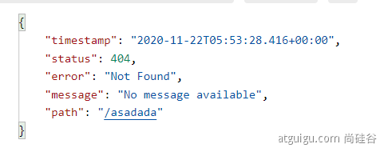

# 学习资料

- 文档地址： https://www.yuque.com/atguigu/springboot
  - 文档不支持旧版本IE、Edge浏览器，请使用chrome或者firefox
- 视频地址： http://www.gulixueyuan.com/    https://www.bilibili.com/video/BV19K4y1L7MT?p=1
- [Spring注解驱动教程(雷丰阳源码级讲解)_哔哩哔哩_bilibili](https://www.bilibili.com/video/BV1gW411W7wy)
- 源码地址：https://gitee.com/leifengyang/springboot2

# **一、SpringBoot2入门**

## 1、系统要求

- [Java 8](https://www.java.com/) & 兼容java14 .
- Maven 3.3+

- idea 2019.1.2

## 2、maven设置

```xml
<mirrors>
    <mirror>
        <id>nexus-aliyun</id>
        <mirrorOf>central</mirrorOf>
        <name>Nexus aliyun</name>
        <url>http://maven.aliyun.com/nexus/content/groups/public</url>
    </mirror>
</mirrors>

<profiles>
    <profile>
        <id>jdk-1.8</id>
        <activation>
            <activeByDefault>true</activeByDefault>
            <jdk>1.8</jdk>
        </activation>
        <properties>
            <maven.compiler.source>1.8</maven.compiler.source>
            <maven.compiler.target>1.8</maven.compiler.target>
            <maven.compiler.compilerVersion>1.8</maven.compiler.compilerVersion>
        </properties>
    </profile>
</profiles>
```

## 3、HelloWorld

需求：浏览发送/hello请求，响应 Hello，Spring Boot 2 

### 3.1、创建maven工程


### 3.2、引入依赖

```xml
<groupId>com.chaoRen</groupId>
<artifactId>boot01-helloworld</artifactId>
<version>1.0-SNAPSHOT</version>

<parent>
    <groupId>org.springframework.boot</groupId>
    <artifactId>spring-boot-starter-parent</artifactId>
    <version>2.3.4.RELEASE</version>
</parent>

<dependencies>
    <dependency>
        <groupId>org.springframework.boot</groupId>
        <artifactId>spring-boot-starter-web</artifactId>
    </dependency>
</dependencies>
```

### 3.3、创建主程序

```java
/**
 * 主程序类
 * @SpringBootApplication：这是一个SpringBoot应用
 */
@SpringBootApplication
public class MainApplication {
    public static void main(String[] args) {
        SpringApplication.run(MainApplication.class, args);
    }
}
```

### 3.4、编写业务

```java
@RestController
public class HelloController {
    @RequestMapping("/hello")
    public String hello01() {
        return "hello SpringBoot2!!";
    }
}
```

### 3.5、测试

直接运行main方法

### 3.6、简化配置

`application.properties`

```xml
server.port=8888
```

### 3.7、简化部署

将`pom.xml`. 在该`dependencies`部分下方插入以下行

```xml
    <build>
        <plugins>
            <plugin>
                <groupId>org.springframework.boot</groupId>
                <artifactId>spring-boot-maven-plugin</artifactId>
            </plugin>
        </plugins>
    </build>
```

把项目打成jar包，直接在目标服务器执行即可。

# 二、了解自动配置原理

## 1、SpringBoot特点

### 1.1、依赖管理

- 父项目做依赖管理

  ```xml
  依赖管理    
  <parent>
          <groupId>org.springframework.boot</groupId>
          <artifactId>spring-boot-starter-parent</artifactId>
          <version>2.3.4.RELEASE</version>
  </parent>
  
  他的父项目
   <parent>
      <groupId>org.springframework.boot</groupId>
      <artifactId>spring-boot-dependencies</artifactId>
      <version>2.3.4.RELEASE</version>
    </parent>
  
  几乎声明了所有开发中常用的依赖的版本号,自动版本仲裁机制
  ```

- 开发导入starter场景启动器

  ```xml
  1、见到很多 spring-boot-starter-* ： *就某种场景
  2、只要引入starter，这个场景的所有常规需要的依赖我们都自动引入
  3、SpringBoot所有支持的场景
  https://docs.spring.io/spring-boot/docs/current/reference/html/using-spring-boot.html#using-boot-starter
  4、见到的  *-spring-boot-starter： 第三方为我们提供的简化开发的场景启动器。
  5、所有场景启动器最底层的依赖
  <dependency>
    <groupId>org.springframework.boot</groupId>
    <artifactId>spring-boot-starter</artifactId>
    <version>2.3.4.RELEASE</version>
    <scope>compile</scope>
  </dependency>
  ```

- 无需关注版本号，自动版本仲裁

  ```xml
  1、引入依赖默认都可以不写版本
  2、引入非版本仲裁的jar，要写版本号。
  ```

- 可以修改默认版本号

  ```xml
  1、查看spring-boot-dependencies里面规定当前依赖的版本 用的 key。
  2、在当前项目里面重写配置
  <properties>
      <mysql.version>5.1.43</mysql.version>
  </properties>
  ```


### 1.2、自动配置

- 自动配好Tomcat

- - 引入Tomcat依赖。
  - 配置Tomcat

- 自动配好Web常见功能，如：字符编码问题

- - SpringBoot帮我们配置好了所有web开发的常见场景

- 默认的包结构

- - 主程序所在包及其下面的所有子包里面的组件都会被默认扫描进来
  - 无需以前的包扫描配置

- - 想要改变扫描路径，@SpringBootApplication(scanBasePackages=**"com.atguigu"**)

- - - 或者@ComponentScan 指定扫描路径

      ```java
      @SpringBootApplication
      等同于
      @SpringBootConfiguration
      @EnableAutoConfiguration
      @ComponentScan("com.chaoRen.boot")
      ```

- 各种配置拥有默认值

- - 默认配置最终都是映射到某个类上，如：MultipartProperties
  - 配置文件的值最终会绑定某个类上，这个类会在容器中创建对象

- 按需加载所有自动配置项

- - 非常多的starter
  - 引入了哪些场景这个场景的自动配置才会开启

- - SpringBoot所有的自动配置功能都在 spring-boot-autoconfigure 包里面
  - 

- ......

## 2、组件添加

### 2.1、常用注解

@Bean、@Component、@Controller、@Service、@Repository

### 2.2、@Configuration

- 基本使用

- **Full模式与Lite模式**

  配置 类组件之间无依赖关系用Lite模式加速容器启动过程，减少判断

  配置类组件之间有依赖关系，方法会被调用得到之前单实例组件，用Full模式

  ```java
  //######################Configuration使用示例#############################################
  /**
   * 1、配置类里面使用@Bean标注在方法上给容器注册组件，默认也是单实例的
   * 2、配置类本身也是组件
   * 3、proxyBeanMethods：代理bean的方法
   *      Full(proxyBeanMethods = true)、【保证每个@Bean方法被调用多少次返回的组件都是单实例的】
   *      Lite(proxyBeanMethods = false)【每个@Bean方法被调用多少次返回的组件都是新创建的】
   *      组件依赖必须使用Full模式默认。其他默认是否Lite模式
   */
  @Configuration(proxyBeanMethods = true) //告诉SpringBoot这是一个配置类 == 配置文件
  public class MyConfig {
      @Bean
      public Pet pet01() {
          return new Pet("小猫");
      }
  
      @Bean
      public User user() {
          return new User("任超", 32, pet01());
      }
  }
  
  //################################@Configuration测试代码如下##############################
  @SpringBootApplication
  public class MainApplication {
      public static void main(String[] args) {
          //1、返回IOC容器
          ConfigurableApplicationContext run = SpringApplication.run(MainApplication.class, args);
          //2、查看容器里面的组件
          String[] names = run.getBeanDefinitionNames();
          for (String name : names) {
              System.out.println(name);
          }
          //3、从容器中获取组件
          User user = run.getBean("user", User.class);
          User user2 = run.getBean("user", User.class);
          System.out.println("user是否一样：" + (user == user2));
          Pet pet01 = run.getBean("pet01", Pet.class);
          System.out.println("user的pet与pet是否一样：" + (user.getPet() == pet01));
      }
  }
  ```

  


### 2.3、@Import快速导入组件

```java
//快速的给容器中导入组件
@Import({User.class, DBHelper.class})
@Configuration(proxyBeanMethods = false) //告诉SpringBoot这是一个配置类 == 配置文件
public class MyConfig {
}
```

@Import 高级用法： https://www.bilibili.com/video/BV1gW411W7wy?p=8

### 2.4、@Conditional条件装配

条件装配：满足Conditional指定的条件，则进行组件注入


```java
@Configuration
public class MyConfig {
    @Bean
    public Pet pet01() {
        return new Pet("小猫");
    }

    //容器中有pet01组件才进行装配
    @ConditionalOnBean(name = "pet01")
    @Bean
    public User user() {
        return new User("任超", 32, pet01());
    }
}
```

### 2.5、@ImportResource

导入Spring配置文件

beans.xml

```xml
    <bean id="user2" class="com.chaoRen.boot.bean.User"></bean>
    <bean id="pet2" class="com.chaoRen.boot.bean.Pet"></bean>
```

MyConfig.java

```java
@Configuration
@ImportResource("classpath:beans.xml")
public class MyConfig {}

//======================测试=================
System.out.println("容器中是否有pet2：" + run.containsBean("pet2"));
System.out.println("容器中是否有user2：" + run.containsBean("user2"));
```

## 3、@ConfigurationProperties

配置绑定

application.properties

```properties
    mycar.brand=BYD
    mycar.price=10000
```

#### 2.3.1、@Component 组合

```java
/**
 * 只有在容器中的组件，才会拥有SpringBoot提供的强大功能
 */
@Component
@ConfigurationProperties(prefix = "mycar")
public class Car {
    private String brand;
    private Integer price;
    ......
}

//======================测试=================
    @Autowired
    private Car car;
    @RequestMapping("/car")
    public Car car() {
        return car;
    }
```

#### 2.3.2、@EnableConfigurationProperties 组合

```java
@Configuration //告诉SpringBoot这是一个配置类 == 配置文件
@EnableConfigurationProperties(Car.class)
//1、开启Car配置绑定功能
//2、把这个Car这个组件自动注册到容器中
public class MyConfig {}
```

```java
@ConfigurationProperties(prefix = "mycar")
public class Car {
    private String brand;
    private Integer price;
    ......
}
```

## 4、自动配置原理入门


### 4.1、引导加载自动配置类

`@SpringBootApplication`等同于

```Java
@SpringBootConfiguration
@EnableAutoConfiguration
@ComponentScan(excludeFilters = { @Filter(type = FilterType.CUSTOM, classes = TypeExcludeFilter.class),
		@Filter(type = FilterType.CUSTOM, classes = AutoConfigurationExcludeFilter.class) })
```

#### 4.1.1、@SpringBootConfiguration

代表当前是一个配置类

```java
@Target(ElementType.TYPE)
@Retention(RetentionPolicy.RUNTIME)
@Documented
@Configuration	//代表当前是一个配置类
public @interface SpringBootConfiguration {
....
}
```

#### 4.1.2、@ComponentScan

自动扫描指定包下所有使用@Service,@Component,@Controller,@Repository的类并注册

#### 4.1.3、@EnableAutoConfiguration

```java
@AutoConfigurationPackage
@Import(AutoConfigurationImportSelector.class)
public @interface EnableAutoConfiguration {}
```

- @AutoConfigurationPackage

  自动配置包？指定了默认的包规则

  ```java
  @Import(AutoConfigurationPackages.Registrar.class)  //给容器中导入一个组件
  public @interface AutoConfigurationPackage {}
  //利用Registrar给容器中导入一系列组件
  //将指定的一个包下的所有组件导入进来？MainApplication 所在包下。
  ```

- @Import(AutoConfigurationImportSelector.class)

  ```java
  1、利用getAutoConfigurationEntry(annotationMetadata);给容器中批量导入一些组件
  2、调用List<String> configurations = getCandidateConfigurations(annotationMetadata, attributes)
     获取到所有需要导入到容器中的配置类
  3、利用工厂加载 Map<String, List<String>> loadSpringFactories(@Nullable ClassLoader classLoader)；得到所有的组件
  4、从META-INF/spring.factories位置来加载一个文件。
  	默认扫描我们当前系统里面所有META-INF/spring.factories位置的文件
      spring-boot-autoconfigure-2.3.4.RELEASE.jar包里面也有META-INF/spring.factories
  ```

   

   

   

   

### 4.2、按需开启自动配置项

- 虽然我们127个场景的所有自动配置启动的时候默认全部加载。xxxxAutoConfiguration
- 按照条件装配规则（@Conditional），最终会按需配置。

### 4.3、修改默认配置

```java
//给容器中加入了文件上传解析器；
@Bean
@ConditionalOnBean(MultipartResolver.class)  //容器中有这个类型组件
@ConditionalOnMissingBean(name = DispatcherServlet.MULTIPART_RESOLVER_BEAN_NAME) //容器中没有这个名字 multipartResolver 的组件
public MultipartResolver multipartResolver(MultipartResolver resolver) {
    //给@Bean标注的方法传入了对象参数，这个参数的值就会从容器中找。
    //SpringMVC multipartResolver。防止有些用户配置的文件上传解析器不符合规范
    //Detect if the user has created a MultipartResolver but named it incorrectly
    return resolver;
}
```

SpringBoot默认会在底层配好所有的组件。但是如果用户自己配置了以用户的优先

```java
@Bean
@ConditionalOnMissingBean
public CharacterEncodingFilter characterEncodingFilter() {}
```

总结：

- SpringBoot先加载所有的自动配置类  xxxxxAutoConfiguration
- 每个自动配置类按照条件进行生效，默认都会绑定配置文件指定的值。xxxxProperties里面拿。xxxProperties和配置文件进行了绑定

- 生效的配置类就会给容器中装配很多组件
- 只要容器中有这些组件，相当于这些功能就有了

- 定制化配置

- - 用户直接自己@Bean替换底层的组件
  - 用户去看这个组件是获取的配置文件什么值就去修改。

**xxxxxAutoConfiguration ---> 组件  --->** **xxxxProperties里面拿值  ----> application.properties**

## 5、最佳实践

- #### 引入场景依赖

- - https://docs.spring.io/spring-boot/docs/current/reference/html/using-spring-boot.html#using-boot-starter

- #### 查看自动配置了哪些（选做）

- - 自己分析，引入场景对应的自动配置一般都生效了
  - 配置文件中debug=true开启自动配置报告。Negative（不生效）Positive（生效）

- #### 是否需要修改

- - 参照文档修改配置项

- - - https://docs.spring.io/spring-boot/docs/current/reference/html/appendix-application-properties.html#common-application-properties
    - 自己分析。xxxxProperties绑定了配置文件的哪些。

- - 自定义加入或者替换组件

- - - @Bean、@Component。。。

- - 自定义器  **XXXXXCustomizer**；
  - ......

## 6、开发小技巧

### 6.1、简化JavaBean - Lombok

```xml
<dependency>
    <groupId>org.projectlombok</groupId>
    <artifactId>lombok</artifactId>
</dependency>

<!--idea中搜索安装lombok插件-->
```

1. @Data：在JavaBean中使用，注解包含包含getter、setter、NoArgsConstructor注解

   @Value注解和@Data类似，区别在于它会把所有成员变量默认定义为private final修饰，并且不会生成set方法

2. @getter：在JavaBean中使用，注解会生成对应的getter方法

3. @setter：在JavaBean中使用，注解会生成对应的setter方法

4. @NoArgsConstructor：在JavaBean中使用，注解会生成对应的无参构造方法

5. @AllArgsConstructor：在JavaBean中使用，注解会生成对应的有参构造方法

   @RequiredArgsConstructor ：生成private构造方法，使用staticName选项生成指定名称的static方法。

6. @ToString：在JavaBean中使用，注解会自动重写对应的toStirng方法

   @ToString(exclude={"column1","column2"})：排除多个column列所对应的元素

   @ToString(of={"column1","column2"})：只生成包含多个column列所对应的元素

7. @EqualsAndHashCode：在JavaBean中使用，注解会自动重写对应的equals方法和hashCode方法

8. @Slf4j：在需要打印日志的类中使用，项目中使用slf4j日志框架

9. @Log4j：在需要打印日志的类中使用，项目中使用log4j日志框架

10. @NonNull：注解快速判断是否为空,为空抛出java.lang.NullPointerException

11. @Synchronized：注解自动添加到同步机制，生成的代码并不是直接锁方法,而是锁代码块， 作用范围是方法上

12. @Cleanup：注解用于确保已分配的资源被释放（IO的连接关闭）

```java
================================简化日志开发===================================
@Slf4j
@RestController
public class HelloController {
    @RequestMapping("/hello")
    public String handle01(@RequestParam("name") String name){
        log.info("请求进来了....");
        return "Hello, Spring Boot 2!"+"你好："+name;
    }
}
```

### 6.2、dev-tools - 热更新

https://docs.spring.io/spring-boot/docs/2.4.13/reference/html/using-spring-boot.html#using-boot-devtools

```xml
<dependency>
    <groupId>org.springframework.boot</groupId>
    <artifactId>spring-boot-devtools</artifactId>
    <optional>true</optional>
</dependency>
```

### 6.3、Spring Initailizr（项目初始化向导）

 

# 三、配置文件

## 1、properties

同以前的properties用法

## 2、yaml

#### 2.1、简介

- YAML 是 "YAML Ain't Markup Language"（YAML 不是一种标记语言）的递归缩写。在开发的这种语言时，YAML 的意思其实是："Yet Another Markup Language"（仍是一种标记语言）。 
- 非常适合用来做以数据为中心的配置文件

#### 2.2、基本语法

- key: value；kv之间有空格
- 大小写敏感

- 使用缩进表示层级关系
- 缩进不允许使用tab，只允许空格

- 缩进的空格数不重要，只要相同层级的元素左对齐即可
- '#'表示注释

- 字符串无需加引号，如果要加，''与""表示字符串内容 会被 转义/不转义

#### 2.3、数据类型

- 字面量：单个的、不可再分的值。date、boolean、string、number、null

  ```yaml
  k: v
  ```

- 对象：键值对的集合。map、hash、set、object 

  ```yaml
  #行内写法：
  k: {k1:v1,k2:v2,k3:v3}
  #或
  k: 
    k1: v1
    k2: v2
    k3: v3
  ```

- 数组：一组按次序排列的值。array、list、queue

  ```yaml
  #行内写法：  
  k: [v1,v2,v3]
  #或者
  k:
   - v1
   - v2
   - v3
  ```

#### 2.4、示例

```java
@Data
public class Person {
	private String userName;
	private Boolean boss;
	private Date birth;
	private Integer age;
	private Pet pet;
	private String[] interests;
	private List<String> animal;
	private Map<String, Object> score;
	private Set<Double> salarys;
	private Map<String, List<Pet>> allPets;
}

@Data
public class Pet {
	private String name;
	private Double weight;
}
```

```yaml
# yaml表示以上对象
person:
  userName: zhangsan
  boss: false
  birth: 2019/12/12 20:12:33
  age: 18
  pet: 
    name: tomcat
    weight: 23.4
  interests: [篮球,游泳]
  animal: 
    - jerry
    - mario
  score:
    english: 
      first: 30
      second: 40
      third: 50
    math: [131,140,148]
    chinese: {first: 128,second: 136}
  salarys: [3999,4999.98,5999.99]
  allPets:
    sick:
      - {name: tom}
      - {name: jerry,weight: 47}
    health: [{name: mario,weight: 47}]
```

## 3、自定义类绑定配置提示

在 Maven 中，依赖项应声明为可选，如下例所示：

```xml
<dependency>
    <groupId>org.springframework.boot</groupId>
    <artifactId>spring-boot-configuration-processor</artifactId>
    <optional>true</optional>
</dependency>
```
防止`repackage`目标将依赖项添加到 fat jar 中：
```xml
<build>
    <plugins>
        <plugin>
            <groupId>org.springframework.boot</groupId>
            <artifactId>spring-boot-maven-plugin</artifactId>
            <configuration>
                <excludes>
                    <exclude>
                        <groupId>org.springframework.boot</groupId>
                        <artifactId>spring-boot-configuration-processor</artifactId>
                    </exclude>
                </excludes>
            </configuration>
        </plugin>
    </plugins>
</build>
```

# 四、Web开发


## 1、SpringMVC自动配置概览

Spring Boot 为 Spring MVC 提供了自动配置，适用于大多数应用程序。

自动配置在 Spring 的默认值之上添加了以下特性：

- 包括`ContentNegotiatingViewResolver`和`BeanNameViewResolver`类。

  **内容协商视图解析器**和**BeanName视图解析器**

- 支持提供静态资源，包括对 WebJars 的支持（[本文档后面会介绍](https://docs.spring.io/spring-boot/docs/2.3.4.RELEASE/reference/html/spring-boot-features.html#boot-features-spring-mvc-static-content)））。

- 自动注册`Converter`、`GenericConverter`和`Formatter`bean。

- 支持`HttpMessageConverters`（[本文档稍后介绍](https://docs.spring.io/spring-boot/docs/2.3.4.RELEASE/reference/html/spring-boot-features.html#boot-features-spring-mvc-message-converters)）。

- 自动注册`MessageCodesResolver`（[本文档稍后介绍](https://docs.spring.io/spring-boot/docs/2.3.4.RELEASE/reference/html/spring-boot-features.html#boot-features-spring-message-codes)）。

  （国际化用）

- 静态`index.html`支持。

- 自定义`Favicon`支持（[本文档稍后介绍](https://docs.spring.io/spring-boot/docs/2.3.4.RELEASE/reference/html/spring-boot-features.html#boot-features-spring-mvc-favicon)）。

- `ConfigurableWebBindingInitializer`bean的自动使用（[本文档稍后会介绍](https://docs.spring.io/spring-boot/docs/2.3.4.RELEASE/reference/html/spring-boot-features.html#boot-features-spring-mvc-web-binding-initializer)）。

如果您想保留那些 Spring Boot MVC 自定义并进行更多[MVC 自定义](https://docs.spring.io/spring/docs/5.2.9.RELEASE/spring-framework-reference/web.html#mvc)（拦截器、格式化程序、视图控制器和其他功能），您可以添加自己`@Configuration`的类型类`WebMvcConfigurer`但**不** `@EnableWebMvc`添加。

如果您想提供、 或的自定义实例`RequestMappingHandlerMapping`，并且仍然保留 Spring Boot MVC 自定义，则可以声明一个类型的 bean并使用它来提供这些组件的自定义实例。`RequestMappingHandlerAdapter``ExceptionHandlerExceptionResolver``WebMvcRegistrations`。

如果你想完全控制 Spring MVC，你可以添加你自己的`@Configuration`注释`@EnableWebMvc`，或者添加你自己的`@Configuration`-annotated `DelegatingWebMvcConfiguration`，如`@EnableWebMvc`。

## 2、简单功能分析

### 2.1、静态资源访问

#### 2.1.1、静态资源目录

- 默认情况下，Spring Boot 从类路径中名为`/static`（或`/public`或`/resources`或`/META-INF/resources`）的目录

- 访问 ： 当前项目根路径/ + 静态资源名 

- 原理： 静态映射/**。

- 请求进来，先去找Controller看能不能处理。不能处理的所有请求又都交给静态资源处理器。静态资源也找不到则响应404页面

- 改变默认的静态资源路径

  ```yaml
  #调整静态资源访问前缀
  spring:
    mvc:
      static-path-pattern: /res/**
      
  #自定义静态资源位置
    resources:
      static-locations: [classpath:/haha/]
  ```

#### 2.1.2、webjar

[WebJars - Jars 中的 Web Libraries](https://www.webjars.org/)

自动映射 /[webjars](http://localhost:8080/webjars/jquery/3.5.1/jquery.js)/**

```xml
<dependency>
    <groupId>org.webjars</groupId>
    <artifactId>jquery</artifactId>
    <version>3.5.1</version>
</dependency>
```

访问地址：`http://localhost:8080/webjars/jquery/3.5.1/jquery.js`后面地址要按照依赖里面的包路径

### 2.2、欢迎页支持

- 静态资源路径下  index.html

- - 可以配置静态资源路径

  - 但是不可以配置静态资源的访问前缀。否则导致 index.html不能被默认访问

    ```yaml
    spring:
    #  mvc:
    #    static-path-pattern: /res/**   这个会导致welcome page功能失效
    
      resources:
        static-locations: [classpath:/haha/]
    ```

  - controller能处理/index

### 2.3、自定义 `Favicon`

- 最新版本没法使用

- favicon.ico 放在静态资源目录下即可。

  ```yaml
  #配置静态资源访问前缀也会导致失效
  ```

### 2.4、静态资源配置原理

[尚硅谷雷神SpringBoot2零基础入门springboot全套完整版（spring boot2）_哔哩哔哩_bilibili](https://www.bilibili.com/video/BV19K4y1L7MT?p=25)

- SpringBoot启动默认加载  xxxAutoConfiguration 类（自动配置类）
- SpringMVC功能的自动配置类 WebMvcAutoConfiguration，生效

```java
@Configuration(proxyBeanMethods = false)
@ConditionalOnWebApplication(type = Type.SERVLET)
@ConditionalOnClass({ Servlet.class, DispatcherServlet.class, WebMvcConfigurer.class })
@ConditionalOnMissingBean(WebMvcConfigurationSupport.class)//是否用户自己接管了SpringMVC
@AutoConfigureOrder(Ordered.HIGHEST_PRECEDENCE + 10)
@AutoConfigureAfter({ DispatcherServletAutoConfiguration.class, TaskExecutionAutoConfiguration.class,
		ValidationAutoConfiguration.class })
public class WebMvcAutoConfiguration {}
```

给容器中配了什么。

其中内部类：`WebMvcAutoConfigurationAdapter`

```java
@Configuration(proxyBeanMethods = false)
@Import(EnableWebMvcConfiguration.class)
@EnableConfigurationProperties({ WebMvcProperties.class, ResourceProperties.class })
@Order(0)
public static class WebMvcAutoConfigurationAdapter implements WebMvcConfigurer {}
```

- 配置文件的相关属性和xxxProperties进行了绑定。
- WebMvcProperties==**spring.mvc**、ResourceProperties==**spring.resources**

#### 2.4.1、配置类只有一个有参构造器

当配置类只有一个有参构造器，有参构造器所有参数的值都会从容器中确定

```java
//ResourceProperties resourceProperties；获取和spring.resources绑定的所有的值的对象
//WebMvcProperties mvcProperties 获取和spring.mvc绑定的所有的值的对象
//ListableBeanFactory beanFactory Spring的beanFactory
//HttpMessageConverters 找到所有的HttpMessageConverters
//ResourceHandlerRegistrationCustomizer 找到 资源处理器的自定义器。=========
//DispatcherServletPath  
//ServletRegistrationBean   给应用注册Servlet、Filter....
public WebMvcAutoConfigurationAdapter(ResourceProperties resourceProperties, WebMvcProperties mvcProperties,
        ListableBeanFactory beanFactory, ObjectProvider<HttpMessageConverters> messageConvertersProvider,
        ObjectProvider<ResourceHandlerRegistrationCustomizer> resourceHandlerRegistrationCustomizerProvider,
        ObjectProvider<DispatcherServletPath> dispatcherServletPath,
        ObjectProvider<ServletRegistrationBean<?>> servletRegistrations) {
    this.resourceProperties = resourceProperties;
    this.mvcProperties = mvcProperties;
    this.beanFactory = beanFactory;
    this.messageConvertersProvider = messageConvertersProvider;
    this.resourceHandlerRegistrationCustomizer = resourceHandlerRegistrationCustomizerProvider.getIfAvailable();
    this.dispatcherServletPath = dispatcherServletPath;
    this.servletRegistrations = servletRegistrations;
}
```

#### 2.4.2、资源处理的默认规则

- **新版源码有变化**
- **2.4以后ResourcesProperties类被废弃了，取而代之的是WebProperties下的Resource类**

```java
@Override
public void addResourceHandlers(ResourceHandlerRegistry registry) {
    if (!this.resourceProperties.isAddMappings()) {	//通过addMappings属性设置是否禁用所有静态资源规则
        logger.debug("Default resource handling disabled");
        return;
    }
    Duration cachePeriod = this.resourceProperties.getCache().getPeriod();
    CacheControl cacheControl = this.resourceProperties.getCache().getCachecontrol().toHttpCacheControl();
    //webjars的规则。
    if (!registry.hasMappingForPattern("/webjars/**")) {
        customizeResourceHandlerRegistration(registry.addResourceHandler("/webjars/**")//访问路径
                 .addResourceLocations("classpath:/META-INF/resources/webjars/")//资源路径
                 .setCachePeriod(getSeconds(cachePeriod)).setCacheControl(cacheControl));
    }
    //静态资源访问路径规则
    String staticPathPattern = this.mvcProperties.getStaticPathPattern();
    if (!registry.hasMappingForPattern(staticPathPattern)) {
        customizeResourceHandlerRegistration(registry.addResourceHandler(staticPathPattern)//访问路径
                 .addResourceLocations(getResourceLocations(this.resourceProperties.getStaticLocations()))//资源路径
                 .setCachePeriod(getSeconds(cachePeriod)).setCacheControl(cacheControl));
    }
}
```

```java
@ConfigurationProperties(prefix = "spring.resources", ignoreUnknownFields = false)
public class ResourceProperties {
	private static final String[] CLASSPATH_RESOURCE_LOCATIONS = { "classpath:/META-INF/resources/",
			"classpath:/resources/", "classpath:/static/", "classpath:/public/" };
	/**
	 * Locations of static resources. Defaults to classpath:[/META-INF/resources/,
	 * /resources/, /static/, /public/].
	 */
	private String[] staticLocations = CLASSPATH_RESOURCE_LOCATIONS;
```

```yaml
spring:
#  mvc:
#    static-path-pattern: /res/**

  resources:
    add-mappings: false   禁用所有静态资源规则
```

#### 2.4.3、欢迎页的处理规则

HandlerMapping：处理器映射。保存了每一个Handler能处理哪些请求。

```java
@Bean
public WelcomePageHandlerMapping welcomePageHandlerMapping(ApplicationContext applicationContext,
		FormattingConversionService mvcConversionService, ResourceUrlProvider mvcResourceUrlProvider) {
	WelcomePageHandlerMapping welcomePageHandlerMapping = new WelcomePageHandlerMapping(
			new TemplateAvailabilityProviders(applicationContext), applicationContext, getWelcomePage(),
			this.mvcProperties.getStaticPathPattern());
	welcomePageHandlerMapping.setInterceptors(getInterceptors(mvcConversionService, mvcResourceUrlProvider));
	welcomePageHandlerMapping.setCorsConfigurations(getCorsConfigurations());
	return welcomePageHandlerMapping;
}
```

```java
WelcomePageHandlerMapping(TemplateAvailabilityProviders templateAvailabilityProviders,
		ApplicationContext applicationContext, Optional<Resource> welcomePage, String staticPathPattern) {
	if (welcomePage.isPresent() && "/**".equals(staticPathPattern)) {
		//要用欢迎页功能，必须是/**
		logger.info("Adding welcome page: " + welcomePage.get());
		setRootViewName("forward:index.html");
	}
	else if (welcomeTemplateExists(templateAvailabilityProviders, applicationContext)) {
		// 调用Controller  /index
		logger.info("Adding welcome page template: index");
		setRootViewName("index");
	}
}
```

#### 2.4.4、favicon

。。。。。。。。。。


## 3、请求参数处理

### 3.1请求映射

[尚硅谷雷神SpringBoot2零基础入门springboot全套完整版（spring boot2）_哔哩哔哩_bilibili](https://www.bilibili.com/video/BV19K4y1L7MT?p=26)

#### 3.1.1、rest使用介绍

- @xxxMapping；
- Rest风格支持（*使用**HTTP**请求方式动词来表示对资源的操作*）

- - *以前：**/getUser*  *获取用户*    */deleteUser* *删除用户*   */editUser*  *修改用户*      */saveUser* *保存用户*
  - *现在： /user*    *GET-**获取用户*    *DELETE-**删除用户*     *PUT-**修改用户*      *POST-**保存用户*

- - 核心Filter；HiddenHttpMethodFilter

- - - 用法： 表单method=post，隐藏域 _method=put
    - SpringBoot中手动开启

- - 扩展：如何把_method 这个名字换成我们自己喜欢的。

#### 3.1.2、rest开启

```java
@Bean
@ConditionalOnMissingBean(HiddenHttpMethodFilter.class)	//可以自定义
@ConditionalOnProperty(prefix = "spring.mvc.hiddenmethod.filter", name = "enabled", matchIfMissing = false)//设置是否开启
public OrderedHiddenHttpMethodFilter hiddenHttpMethodFilter() {
    return new OrderedHiddenHttpMethodFilter();
}
```

```yaml
spring:
  mvc:
    hiddenmethod:
      filter:
        enabled: true   #开启页面表单的Rest功能
```

#### 3.1.2、自定义HiddenHttpMethodFilter

```java
@Bean
public HiddenHttpMethodFilter hiddenHttpMethodFilter(){
	HiddenHttpMethodFilter methodFilter = new HiddenHttpMethodFilter();
	methodFilter.setMethodParam("_m");
	return methodFilter;
}
```

#### 3.1.3、Rest原理

- 表单提交会带上如：**_method=PUT**
- **请求过来被**HiddenHttpMethodFilter拦截

- - 请求是否正常，并且是POST

- - - 获取到**_method**的值。
    - 兼容以下请求；**PUT**.**DELETE**.**PATCH**

- - - **原生request（post），包装模式requesWrapper重写了getMethod方法，返回的是传入的值。**
    - **过滤器链放行的时候用wrapper。以后的方法调用getMethod是调用requesWrapper的。**

#### 3.1.4、Rest使用客户端工具

- 如PostMan直接发送Put、delete等方式请求，无需Filter。


### 3.2、请求映射原理

[尚硅谷雷神SpringBoot2零基础入门springboot全套完整版（spring boot2）_哔哩哔哩_bilibili](https://www.bilibili.com/video/BV19K4y1L7MT?p=28)

#### 3.2.1、Servlet执行流程

 

#### 3.2.2、请求映射处理流程

 

```java
// 找到当前请求使用哪个Handler（Controller的方法）处理
mappedHandler = getHandler(processedRequest);
if (mappedHandler == null) {
    noHandlerFound(processedRequest, response);
    return;
}
```

- HandlerMapping：处理器映射

   

- **RequestMappingHandlerMapping**：保存了所有@RequestMapping 和handler的映射规则。

   

- 所有的请求映射都在HandlerMapping中。

  - SpringBoot自动配置欢迎页的 WelcomePageHandlerMapping 。访问 /能访问到index.html；

  - SpringBoot自动配置了默认 的 RequestMappingHandlerMapping

  - 请求进来，挨个尝试所有的HandlerMapping看是否有请求信息。

  - 如果有就找到这个请求对应的handler

  - 如果没有就是下一个 HandlerMapping

  - 我们需要一些自定义的映射处理，我们也可以自己给容器中放**HandlerMapping**。自定义 **HandlerMapping**

    

### 3.2、普通参数与基本注解

#### 3.2.1、@PathVariable

- ##### 路径变量

```html
<!-- 请求地址 -->
<a href="/car/222/owner/任超">测试@PathVariable</a>
```

```java
//Controller
@GetMapping("/car/{id}/owner/{name}")
public String getCar(@PathVariable Integer id,
					 @PathVariable String name,
					 @PathVariable Map<String, String> pv) {
	System.out.println("id:" + id);
	System.out.println("name:" + name);
	System.out.println("pv:" + pv);
	return "请求成功！！！";
}
/** ==输出结果============================
 * id:222
 * name:任超
 * pv:{id=222, name=任超}
 */
```

#### 3.2.2、@RequestHeader

- ##### 获取请求头

```java
//请求地址：http://localhost:8080/car
@GetMapping("/car")
public String testRequestHeader(@RequestHeader("Host") String host,
								@RequestHeader Map<String, String> header) {
	System.out.println("Host:" + host);
	System.out.println("RequestHeader:" + header);
	return "请求成功！！！";
}
/** ==输出结果============================
 * Host:localhost:8080
 * RequestHeader:{host=localhost:8080, connection=keep-alive, 。。。。}
 */
```

#### 3.2.3、@RequestParam

- ##### 获取请求参数

```java
//请求地址：http://localhost:8080/requestParam?username=任超&password=123456
@GetMapping("/requestParam")
public String testRequestParam(@RequestParam("username") String name,
							   @RequestParam("password") String pwd,
							   @RequestParam Map<String,String> params) {
	System.out.println("username:" + name);
	System.out.println("password:" + pwd);
	System.out.println("params:" + params);
	return "请求成功！！！";
}
/** ==输出结果===========================
 * username:任超
 * password:123456
 * params:{username=任超, password=123456}
 */
```

#### 3.2.4、@CookieValue

- ##### 获取Cookie

```java
//请求地址：http://localhost:8080/cookie
@GetMapping("/cookie")
public String testCookie(@CookieValue("Idea-b88688e3") String idea,
						 @CookieValue("Idea-b88688e3") Cookie cookie) {
	System.out.println(idea);
	System.out.println(cookie);
	return "请求成功！！！";
}
/** ==输出结果===========================
 * 38a5fcbc-0725-4b5d-b3fd-36ccef0a56d8
 * javax.servlet.http.Cookie@141db8d
 */
```

#### 3.2.5、@RequestBody

- ##### 获取请求体【POST】

```html
<form action="save" method="post">
    <input type="text" name="username"><br>
    <input type="password" name="password"><br>
    <input type="submit" value="提交按钮">
</form>
```

```java
@PostMapping("/save")
public String postMethod(@RequestBody String body) {
	System.out.println("body:" + body);
	return "请求成功！！！";
}
/** ==输出结果===========================
 * body:username=renchao&password=123456
 */
```

#### 3.2.5、@RequestAttribute

- ##### 获取request域属性

```java
//请求地址：http://localhost:8080/togo
@GetMapping("/togo")
public String togo(HttpServletRequest request) {
	request.setAttribute("name", "任超");
	request.setAttribute("password","123456");
	return "forward:/success";	//转发到success请求
}

@ResponseBody
@GetMapping("success")
public String success(@RequestAttribute("name") String name,
					  @RequestAttribute("password") String pwd) {
	System.out.println("name:" + name);
	System.out.println("password:" + pwd);
	return "请求成功。。。。";
}
/** ==输出结果===========================
 * name:任超
 * password:123456
 */
```

#### 3.2.6、@ModelAttribute

- ##### 获取请求参数，并封装为Java对象

```java
//请求地址：http://localhost:8080/model?username=任超&password=12345&age=32
@GetMapping("/model")
public String testModelAttribute(@ModelAttribute User user) {
    System.out.println(user);
    return "请求成功！！！";
}
/** ==输出结果===========================
 * User(username=任超, password=12345, age=32)
 */
```

#### 3.2.6、@MatrixVariable

- ##### 获取矩阵变量

  > 矩阵变量需要在SpringBoot中手动开启
  > 根据RFC3986的规范，矩阵变量应当绑定在路径变量中
  > 若是有多个矩阵变量，应当使用英文符号;进行分隔

  - 语法：

    ```java
    //请求路径：/cars/sell;low=34;brand=byd,audi,yd
    ```

- ##### 手动开启及原理

    

  帮助类UrlPathHelper里面有很多功能，就是通过这个帮助类开启矩阵变量

  自定义一个实现了`WebMvcConfigurer`接口的类，然后放到容器中

- 方法一：

  通过匿名内部类

  ```java
  @Configuration
  public class MyConfig {
      @Bean
      public WebMvcConfigurer webMvcConfigurer() {
          return new WebMvcConfigurer() {
              @Override
              public void configurePathMatch(PathMatchConfigurer configurer) {
                  UrlPathHelper urlPathHelper = new UrlPathHelper();
                  //不移除";"号后面的内容，矩阵变量功能才可以生效
                  urlPathHelper.setRemoveSemicolonContent(false);
                  configurer.setUrlPathHelper(urlPathHelper);
              }
          };
      }
  }
  ```

- 方法二：

  让配置类实现`WebMvcConfigurer`接口，然后重写`configurePathMatch`方法

  ```java
  @Configuration
  public class MyConfig implements WebMvcConfigurer {
      @Override
      public void configurePathMatch(PathMatchConfigurer configurer) {
          UrlPathHelper urlPathHelper = new UrlPathHelper();
          //不移除";"号后面的内容，矩阵变量功能才可以生效
          urlPathHelper.setRemoveSemicolonContent(false);
          configurer.setUrlPathHelper(urlPathHelper);
      }
  }
  ```

- 案例：

  ```java
  //一般情况
  //请求地址：http://localhost:8080/cars/sell;low=34;brand=byd,audi,yd
  @GetMapping("/cars/{path}")
  public Map<String,Object> carsSell(@MatrixVariable("low") Integer low,
  								   @MatrixVariable("brand") List<String> brand,
  								   @PathVariable("path") String path) {
  	HashMap<String, Object> map = new HashMap<>();
  	map.put("low", low);
  	map.put("brand", brand);
  	map.put("path", path);
  	return map;
  }
  //浏览器结果：{"path":"sell","low":34,"brand":["byd","audi","yd"]}
  ```

  ```java
  //重写相同变量名的情况
  //请求地址：http://localhost:8080//boss/1;age=20/2;age=10
  @GetMapping("/boss/{bossId}/{empId}")
  public Map<String, Object> boss(@MatrixVariable(value = "age", pathVar = "bossId") Integer bossAge,
  								@MatrixVariable(value = "age", pathVar = "empId") Integer empAge) {
  	Map<String, Object> map = new HashMap<>();
  	map.put("bossAge", bossAge);
  	map.put("empAge", empAge);
  	return map;
  }
  //浏览器结果：{"bossAge":20,"empAge":10}
  ```

  

### 3.3、参数处理原理

[尚硅谷雷神SpringBoot2零基础入门springboot全套完整版（spring boot2）_哔哩哔哩_bilibili](https://www.bilibili.com/video/BV19K4y1L7MT?p=32)

流程图： [参数处理原理及流程.vsdx](流程图\参数处理原理及流程.vsdx) 


### 3.4、Servlet API

- WebRequest
- ServletRequest
- MultipartRequest
- HttpSession
- javax.servlet.http.PushBuilder
- Principal
- InputStream
- Reader
- HttpMethod
- Locale
- TimeZone
- ZoneId

**以上的部分参数都是由`ServletRequestMethodArgumentResolver`解析器进行解析**


## 4、数据响应与内容协商

### 4.1、Model、Map原理

[尚硅谷雷神SpringBoot2零基础入门springboot全套完整版（spring boot2）_哔哩哔哩_bilibili](https://www.bilibili.com/video/BV19K4y1L7MT?p=34)

流程图： [map-model原理.vsdx](流程图\map-model原理.vsdx) 

### 4.2、自定义参数绑定原理原理

[尚硅谷雷神SpringBoot2零基础入门springboot全套完整版（spring boot2）_哔哩哔哩_bilibili](https://www.bilibili.com/video/BV19K4y1L7MT?p=35)

流程图： [自定义对象参数绑定原理.vsdx](流程图\自定义对象参数绑定原理.vsdx) 

`ServletModelAttributeMethodProcessor ` 这个参数处理器支持

### 4.3、自定义 Converter 转换器

```java
@Configuration
public class MyConfig implements WebMvcConfigurer {
    @Override
    public void addFormatters(FormatterRegistry registry) {
        registry.addConverter(new Converter<String, Pet>() {
            @Override
            public Pet convert(String source) {
                if (!StringUtils.isEmpty(source)) {
                    Pet pet = new Pet();
                    String[] p = source.split(",");
                    pet.setName(p[0]);
                    pet.setAge(p[1]);
                    return pet;
                }
                return null;
            }
        });
    }
}
//格式：小狗,5
```

### 4.4、@ResponseBody原理

[尚硅谷雷神SpringBoot2零基础入门springboot全套完整版（spring boot2）_哔哩哔哩_bilibili](https://www.bilibili.com/video/BV19K4y1L7MT?p=37)

流程图： [响应JSON.vsdx](流程图\响应JSON.vsdx) 

- 1、返回值处理器判断是否支持这种类型返回值 supportsReturnType
- 2、返回值处理器调用 handleReturnValue 进行处理

- 3、RequestResponseBodyMethodProcessor 可以处理返回值标了@ResponseBody 注解的。

- - 利用 MessageConverters 进行处理 将数据写为json

- - - 1、内容协商（浏览器默认会以请求头的方式告诉服务器他能接受什么样的内容类型）
    - 2、服务器最终根据自己自身的能力，决定服务器能生产出什么样内容类型的数据，

- - - 3、SpringMVC会挨个遍历所有容器底层的 HttpMessageConverter ，看谁能处理？

- - - - 利用MappingJackson2HttpMessageConverter将对象转为json再写出去。

    - 

### 4.5、HTTPMessageConverter原理

#### 4.5.1、MessageConverter接口规范


HttpMessageConverter: 看是否支持将 此 Class类型的对象，转为MediaType类型的数据。

例子：Person对象转为JSON。或者 JSON转为Person

#### 4.5.2、默认的MessageConverter


### 4.6、内容协商原理

[尚硅谷雷神SpringBoot2零基础入门springboot全套完整版（spring boot2）_哔哩哔哩_bilibili](https://www.bilibili.com/video/BV19K4y1L7MT?p=39)

流程图： [内容协商原理.vsdx](流程图\内容协商原理.vsdx) 

根据客户端接收能力不同，返回不同媒体类型的数据。

#### 4.6.1、引入xml依赖

```xml
<dependency>
    <groupId>com.fasterxml.jackson.dataformat</groupId>
    <artifactId>jackson-dataformat-xml</artifactId>
</dependency>
```

#### 4.6.2、postman分别测试返回json和xml

只需要改变请求头中Accept字段。Http协议中规定的，告诉服务器本客户端可以接收的数据类型。


#### 4.6.3、开启浏览器参数方式内容协商功能

为了方便内容协商，开启基于请求参数的内容协商功能。

```yaml
spring:
    contentnegotiation:
      favor-parameter: true  #开启请求参数内容协商模式
#发请求：http://localhost:8080/test/person?format=json
#		http://localhost:8080/test/person?format=xml
```


支持的类型mediaTypes可以通过重写配置类`configureContentNegotiation`进行添加或者修改。

```java
@Configuration
public class MyConfig implements WebMvcConfigurer {
    @Override
    public void configureContentNegotiation(ContentNegotiationConfigurer configurer) {
        HashMap<String, MediaType> map = new HashMap<>();
        map.put("chao", new MediaType("application", "x-chao"));
        configurer.mediaTypes(map);
    }
}
```


#### 4.6.4、内容协商源码注释

```java
protected <T> void writeWithMessageConverters(@Nullable T value, MethodParameter returnType,
		ServletServerHttpRequest inputMessage, ServletServerHttpResponse outputMessage)
		throws IOException, HttpMediaTypeNotAcceptableException, HttpMessageNotWritableException {

	Object body;
	Class<?> valueType;
	Type targetType;

	//判断返回值类型
	if 。。。。。。

	//开始内容协商
	MediaType selectedMediaType = null;
	MediaType contentType = outputMessage.getHeaders().getContentType();
	boolean isContentTypePreset = contentType != null && contentType.isConcrete();
	if (isContentTypePreset) {
		if (logger.isDebugEnabled()) {
			logger.debug("Found 'Content-Type:" + contentType + "' in response");
		}
		selectedMediaType = contentType;
	}
	else {
		HttpServletRequest request = inputMessage.getServletRequest();
		List<MediaType> acceptableTypes = getAcceptableMediaTypes(request);//可接受的类型
		List<MediaType> producibleTypes = getProducibleMediaTypes(request, valueType, targetType);//生产类型

		if (body != null && producibleTypes.isEmpty()) {
			throw new HttpMessageNotWritableException(
					"No converter found for return value of type: " + valueType);
		}
		//最佳匹配筛选
		List<MediaType> mediaTypesToUse = new ArrayList<>();
		for (MediaType requestedType : acceptableTypes) {
			for (MediaType producibleType : producibleTypes) {
				if (requestedType.isCompatibleWith(producibleType)) {
					mediaTypesToUse.add(getMostSpecificMediaType(requestedType, producibleType));
				}
			}
		}
		if (mediaTypesToUse.isEmpty()) {
			if (body != null) {
				throw new HttpMediaTypeNotAcceptableException(producibleTypes);
			}
			if (logger.isDebugEnabled()) {
				logger.debug("No match for " + acceptableTypes + ", supported: " + producibleTypes);
			}
			return;
		}
		//排序
		MediaType.sortBySpecificityAndQuality(mediaTypesToUse);

		//确定类型
		for (MediaType mediaType : mediaTypesToUse) {
			if (mediaType.isConcrete()) {
				selectedMediaType = mediaType;
				break;
			}
			else if (mediaType.isPresentIn(ALL_APPLICATION_MEDIA_TYPES)) {
				selectedMediaType = MediaType.APPLICATION_OCTET_STREAM;
				break;
			}
		}

		if (logger.isDebugEnabled()) {
			logger.debug("Using '" + selectedMediaType + "', given " +
					acceptableTypes + " and supported " + producibleTypes);
		}
	}

	//查找消息转换器，找到后进行转换
    。。。。。。
}
```

### 4.7、自定义 MessageConverter

**实现多协议数据兼容。json、xml、x-guigu**

1. **@ResponseBody 响应数据出去 调用 RequestResponseBodyMethodProcessor** 处理
2. Processor 处理方法返回值。通过 **MessageConverter** 处理
3. 所有 **MessageConverter** 合起来可以支持各种媒体类型数据的操作（读、写）
4. 内容协商找到最终的 **messageConverter**；

#### 4.7.1、创建MessageConverter

创建一共`MessageConverter`实现`HttpMessageConverter`

```java
public class ChaoMessageConverter implements HttpMessageConverter<Person> {
    @Override
    public boolean canRead(Class<?> clazz, MediaType mediaType) {
        return false;
    }

    /**
     * 判断什么类型的能使用
     */
    @Override
    public boolean canWrite(Class<?> clazz, MediaType mediaType) {
        return clazz.isAssignableFrom(Person.class);
    }

    /**
     * 支持的媒体类型
     * application/x-chao
     */
    @Override
    public List<MediaType> getSupportedMediaTypes() {
        return MediaType.parseMediaTypes("application/x-chao");
    }

    @Override
    public Person read(Class<? extends Person> clazz, HttpInputMessage inputMessage) throws IOException, HttpMessageNotReadableException {
        return null;
    }

    @Override
    public void write(Person person, MediaType contentType, HttpOutputMessage outputMessage) throws IOException, HttpMessageNotWritableException {
        //自定义的协议写出格式
        String data = person.getUserName() + ";" + person.getAge() + ";" + person.getBirth();
        
        OutputStream body = outputMessage.getBody();
        body.write(data.getBytes());
    }
}
```

#### 4.7.2、配置WebMvcConfigurer

在WebMvcConfigurer里面重写extendMessageConverters方法，把自己的MessageConverter添加进去。

```java
@Configuration
public class MyConfig implements WebMvcConfigurer {
    @Override
    public void extendMessageConverters(List<HttpMessageConverter<?>> converters) {
        converters.add(new ChaoMessageConverter());
    }
}
```

## 5、视图解析与模板引擎

### 5.1、模板引擎-Thymeleaf

#### 5.1.1、thymeleaf简介

**Thymeleaf**是一个现代的服务器端 Java 模板引擎，适用于 Web 和独立环境。

#### 5.1.2、基本语法

##### 1、表达式

| 表达式名字 | 语法   | 用途                               |
| ---------- | ------ | ---------------------------------- |
| 变量取值   | ${...} | 获取请求域、session域、对象等值    |
| 选择变量   | *{...} | 获取上下文对象值                   |
| 消息       | #{...} | 获取国际化等值                     |
| 链接       | @{...} | 生成链接                           |
| 片段表达式 | ~{...} | jsp:include 作用，引入公共页面片段 |

##### 2、字面量

文本值: **'one text'** **,** **'Another one!'** **,…**数字: **0** **,** **34** **,** **3.0** **,** **12.3** **,…**布尔值: **true** **,** **false**

空值: **null**

变量： one，two，.... 变量不能有空格

##### 3、文本操作

字符串拼接: **+**

变量替换: **|The name is ${name}|** 

##### 4、数学运算

运算符: + , - , * , / , %

##### 5、布尔运算

运算符:  **and** **,** **or**

一元运算: **!** **,** **not** 

##### 6、比较运算

比较: **>** **,** **<** **,** **>=** **,** **<=** **(** **gt** **,** **lt** **,** **ge** **,** **le** **)**等式: **==** **,** **!=** **(** **eq** **,** **ne** **)** 

##### 7、条件运算

If-then: **(if) ? (then)**

If-then-else: **(if) ? (then) : (else)**

Default: (value) **?: (defaultvalue)** 

##### 8、特殊操作

无操作： _


#### 5.1.3、设置属性值-th:attr

##### 设置单个值

```html
<form action="subscribe.html" th:attr="action=@{/subscribe}">
  <fieldset>
    <input type="text" name="email" />
    <input type="submit" value="Subscribe!" th:attr="value=#{subscribe.submit}"/>
  </fieldset>
</form>
```

##### 设置多个值

```html

```

##### 以上两个的代替写法 th:xxxx

```html
<input type="submit" value="Subscribe!" th:value="#{subscribe.submit}"/>
<form action="subscribe.html" th:action="@{/subscribe}">
```

所有h5兼容的标签写法

https://www.thymeleaf.org/doc/tutorials/3.0/usingthymeleaf.html#setting-value-to-specific-attributes

#### 5.1.4、迭代

```html
<tr th:each="prod : ${prods}">
        <td th:text="${prod.name}">Onions</td>
        <td th:text="${prod.price}">2.41</td>
        <td th:text="${prod.inStock}? #{true} : #{false}">yes</td>
</tr>
```

```html
<tr th:each="prod,iterStat : ${prods}" th:class="${iterStat.odd}? 'odd'">
  <td th:text="${prod.name}">Onions</td>
  <td th:text="${prod.price}">2.41</td>
  <td th:text="${prod.inStock}? #{true} : #{false}">yes</td>
</tr>
```

#### 5.1.5、条件运算

```html
<a href="comments.html"
th:href="@{/product/comments(prodId=${prod.id})}"
th:if="${not #lists.isEmpty(prod.comments)}">view</a>
```

```html
<div th:switch="${user.role}">
  <p th:case="'admin'">User is an administrator</p>
  <p th:case="#{roles.manager}">User is a manager</p>
  <p th:case="*">User is some other thing</p>
</div>
```

#### 5.1.6、属性优先级


### 5.2、thymeleaf使用

#### 5.2.1、引入Starter

```xml
<dependency>
    <groupId>org.springframework.boot</groupId>
    <artifactId>spring-boot-starter-thymeleaf</artifactId>
</dependency>
```

#### 5.2.2、自动配置好了thymeleaf

```java
@Configuration(proxyBeanMethods = false)
@EnableConfigurationProperties(ThymeleafProperties.class)
@ConditionalOnClass({ TemplateMode.class, SpringTemplateEngine.class })
@AutoConfigureAfter({ WebMvcAutoConfiguration.class, WebFluxAutoConfiguration.class })
public class ThymeleafAutoConfiguration { }
```

自动配好的策略

- 1、所有thymeleaf的配置值都在 ThymeleafProperties
- 2、配置好了 **SpringTemplateEngine** 

- **3、配好了** **ThymeleafViewResolver** 
- 4、我们只需要直接开发页面

```java
	public static final String DEFAULT_PREFIX = "classpath:/templates/";
	public static final String DEFAULT_SUFFIX = ".html";  //xxx.html
```

### 5.3、构建后台管理系统

#### 5.3.1、项目创建

thymeleaf、web-starter、devtools、lombok

#### 5.3.2、静态资源处理

自动配置好，我们只需要把所有静态资源放到 static 文件夹下

#### 5.3.3、路径构建

th:action="@{/login}"

#### 5.3.4、模板抽取

th:insert/replace/include

#### 5.3.5、页面跳转

```java
@PostMapping("/login")
public String main(User user, HttpSession session, Model model){

	if(StringUtils.hasLength(user.getUserName()) && "123456".equals(user.getPassword())){
		//把登陆成功的用户保存起来
		session.setAttribute("loginUser",user);
		//登录成功重定向到main.html;  重定向防止表单重复提交
		return "redirect:/main.html";
	}else {
		model.addAttribute("msg","账号密码错误");
		//回到登录页面
		return "login";
	}

}
```

#### 5.3.6、数据渲染

```java
@GetMapping("/dynamic_table")
public String dynamic_table(Model model) {
	List<User> users = Arrays.asList(new User("张三", "123456"),
			new User("lishi", "567890"),
			new User("wangwu", "pppppp"),
			new User("damin", "88899955"),
			new User("大名", "hh126"),
			new User("码字", "8888"));
	model.addAttribute("users", users);
	return "/table/dynamic_table";
}
```

```html
<table>
	<thead>
	<tr>
		<th>序号</th>
		<th>姓名</th>
		<th>密码</th>
		<th class="hidden-phone">Engine version</th>
		<th class="hidden-phone">CSS grade</th>
	</tr>
	</thead>
	
	<tbody>
	<tr class="gradeX" th:each="user,status:${users}">
		<td th:text="${status.count}">Trident</td>
		<td th:text="${user.username}">Internet</td>
		<td th:text="${user.password}">Win 95+</td>
		<td class="center hidden-phone">》</td>
		<td class="center hidden-phone">X</td>
	</tr>
	</tbody>
</table>
```

### 5.4、视图解析【源码】

#### 5.4.1、视图渲染流程


#### 5.4.2、视图解析原理

- 目标方法处理的过程中，所有数据都会被放在 ModelAndViewContainer 里面。包括数据和视图地址

- 方法的参数是一个自定义类型对象（从请求参数中确定的），把他重新放在ModelAndViewContainer

- 任何目标方法执行完成以后都会返回 ModelAndView（数据和视图地址）。

- processDispatchResult  处理派发结果（页面改如何响应）

  根据方法的String返回值得到 **View** 对象【定义了页面的渲染逻辑】

  - 1、所有的视图解析器尝试是否能根据当前返回值得到**View**对象
  - 2、得到了  **redirect:/main.html** --> Thymeleaf - new **RedirectView**()
  - 3、ContentNegotiationViewResolver 里面包含了下面所有的视图解析器，内部还是利用下面所有视图解析器得到视图对象。
  - 4、view.render(mv.getModelInternal(), request, response);   视图对象调用自定义的render进行页面渲染工作

## 6、拦截器

### 6.1、实现HandlerInterceptor

```java
public class LoginInterceptor implements HandlerInterceptor {
    /**
     * 方法执行之前
     */
    @Override
    public boolean preHandle(HttpServletRequest request, HttpServletResponse response, Object handler) throws Exception {
        if (request.getSession().getAttribute("loginUser") == null) {
            request.setAttribute("msg", "请先登陆账户！！！");
            request.getRequestDispatcher("/").forward(request, response);
            return false;
        }
        return true;
    }

    /**
     *方法执行之后
     */
    @Override
    public void postHandle(HttpServletRequest request, HttpServletResponse response, Object handler, ModelAndView modelAndView) throws Exception {
        HandlerInterceptor.super.postHandle(request, response, handler, modelAndView);
    }

    /**
     *页面渲染完成之后
     */
    @Override
    public void afterCompletion(HttpServletRequest request, HttpServletResponse response, Object handler, Exception ex) throws Exception {
        HandlerInterceptor.super.afterCompletion(request, response, handler, ex);
    }
}
```

### 6.2、配置拦截器

```java
@Configuration
public class AdminWebConfig implements WebMvcConfigurer {
    @Override
    public void addInterceptors(InterceptorRegistry registry) {
        registry.addInterceptor(new LoginInterceptor()).addPathPatterns("/**")
                .excludePathPatterns("/",
                        "/login",
                        "/css/**",
                        "/fonts/**",
                        "/images/**",
                        "/js/**");
    }
}
```

### 6.3、拦截器原理

1、根据当前请求，找到**HandlerExecutionChain【**可以处理请求的handler以及handler的所有 拦截器】

2、先来**顺序执行** 所有拦截器的 preHandle方法

- 如果当前拦截器prehandler返回为true。则执行下一个拦截器的preHandle
- 如果当前拦截器返回为false。直接    倒序执行所有已经执行了的拦截器的  afterCompletion；

**3、如果任何一个拦截器返回false。直接跳出不执行目标方法**

**4、所有拦截器都返回True。执行目标方法**

**5、倒序执行所有拦截器的postHandle方法。**

**6、前面的步骤有任何异常都会直接倒序触发** afterCompletion

7、页面成功渲染完成以后，也会倒序触发 afterCompletion


## 7、文件上传

### 7.1、代码示例

```html
<form role="form" th:action="@{/upload}" method="post" enctype="multipart/form-data">
	邮箱:<input type="email" name="email">
	名字:<input type="text" name="username">
    <!--multiple代表可以选择多个文件-->
	头像:<input type="file" name="headerImg">
	<!--multiple代表可以选择多个文件-->
	生活照片:<input type="file" name="photos" multiple>
	<button type="submit">提交</button>
</form>
```

```java
public String upload(@RequestParam("email") String email,
					 @RequestParam("username") String username,
					 @RequestPart("headerImg") MultipartFile headerImg,
					 @RequestPart("photos") MultipartFile[] photos) throws IOException {

	log.info("上传的信息：email={},username={},headerImg={},photos={}",
			email,username,headerImg.getSize(),photos.length);
	if (!headerImg.isEmpty()) {
		//保存文件到服务器，或者OSS服务器
		String filename = headerImg.getOriginalFilename();
		headerImg.transferTo(new File("E:\\FFOutput\\" + filename));
	}
	if (photos.length > 0) {
		for (MultipartFile photo : photos) {
			if (!photo.isEmpty()) {
				String filename = photo.getOriginalFilename();
				photo.transferTo(new File("E:\\FFOutput\\photo\\" + filename));
			}
		}
	}
	return "admin";
}
```

设置文件上传大小

```yaml
spring:
  servlet:
    multipart:
      max-file-size: 10MB
      max-request-size: 100MB
```

### 7.2、自动配置原理

**文件上传自动配置类-MultipartAutoConfiguration - MultipartProperties**

- 自动配置好了 **StandardServletMultipartResolver   【文件上传解析器】**

**原理步骤**

```java
protected void doDispatch(HttpServletRequest request, HttpServletResponse response) throws Exception {
	......
	boolean multipartRequestParsed = false;
    .......
        //这里返回包装后的request已经有解析后的数据了
        processedRequest = checkMultipart(request);
    	multipartRequestParsed = (processedRequest != request);
	......
}
```


## 8、异常处理

### 8.1、默认规则

- 默认情况下，Spring Boot提供`/error`处理所有错误的映射

- 对于机器客户端，它将生成JSON响应，其中包含错误，HTTP状态和异常消息的详细信息。

   

- 对于浏览器客户端，响应一个“ whitelabel”错误视图，以HTML格式呈现相同的数据

   

  

- 要对其进行自定义，添加`View`解析为`error`

  要完全替换默认行为，可以实现 `ErrorController `并注册该类型的Bean定义，

  或添加`ErrorAttributes`类型的组件以使用现有机制但替换其内容。

- error/下的4xx，5xx页面会被自动解析；

   

### 8.2、默认执行流程

- Controller方法如果出现异常，异常会被捕获，然后执行`processDispatchResult()`

- 根据`exception`判断有异常，调用异常处理程序`processHandlerException()`

  ```java
  if (exception != null) {
      if (exception instanceof ModelAndViewDefiningException) {
          logger.debug("ModelAndViewDefiningException encountered", exception);
          mv = ((ModelAndViewDefiningException) exception).getModelAndView();
      }
      else {
          Object handler = (mappedHandler != null ? mappedHandler.getHandler() : null);
          //调用异常处理程序
          mv = processHandlerException(request, response, handler, exception);
          errorView = (mv != null);
      }
  }
  ```

- 遍历处理程序异常解析器，查找合适的异常处理器

  ```java
  if (this.handlerExceptionResolvers != null) {
      for (HandlerExceptionResolver resolver : this.handlerExceptionResolvers) {
          exMv = resolver.resolveException(request, response, handler, ex);
          if (exMv != null) {
              break;
          }
      }
  }
  ```

   

  DefaultErrorAttributes先来处理异常。把异常信息保存到rrequest域，并且返回null。

  默认情况下没有任何人能处理异常，所以异常会被抛出

  - 1、如果没有任何人能处理最终底层就会发送 /error 请求。会被底层的BasicErrorController处理
    
  - 2、解析错误视图；遍历所有的  ErrorViewResolver  看谁能解析。
    
     
    
  - 3、默认的 DefaultErrorViewResolver ,作用是把响应状态码作为错误页的地址，error/500.html 
    
  - 4、模板引擎最终响应这个页面 error/500.html
  
    
  

### 8.3、定制错误处理逻辑

#### 8.3.1、自定义错误页

error/404.html   error/5xx.html；有精确的错误状态码页面就匹配精确，没有就找 4xx.html；如果都没有就触发白页

#### 8.3.2、处理全局异常@ControllerAdvice+@ExceptionHandler

- **常用**
- 底层是 `ExceptionHandlerExceptionResolver` 支持的，调用包含`@ExceptionHandler`注解的方法处理
- 返回视图，然后进入正常页面渲染流程。

```java
/**
 * 处理整个Web Controller的异常
 */
@Slf4j
@ControllerAdvice
public class GlobalException {
    //定义处理数学运行异常和空指针异常
    @ExceptionHandler({ArithmeticException.class,NullPointerException.class})
    public String handleArithmeticException(Exception e) {
        //打印异常
        log.error("异常是：{}",e.getMessage());
        //返回视图地址
        return "admin";
    }
}
```

#### 8.3.3、@ResponseStatus+自定义异常

- 底层是 `ResponseStatusExceptionResolver` ，
- 获取@ResponseStatus的注解信息，然后调用 response.sendError(statusCode, resolvedReason)，tomcat发送/error

```java
//自定义异常类
@ResponseStatus(value = HttpStatus.FORBIDDEN,reason = "用户太多了。。")
public class UsersToManyException extends RuntimeException {}
```

```java
@GetMapping("/dynamic_table")
public String dynamic_table(Model model) {
	List<User> users = Arrays.asList(new User("张三", "123456"),
			new User("lishi", "567890"),
			new User("wangwu", "pppppp"),
			new User("damin", "88899955"),
			new User("大名", "hh126"));
	if (users.size() > 3) {
        //抛出自定义的异常
		throw new UsersToManyException();
	}
	model.addAttribute("users", users);
	return "/table/dynamic_table";
}
```

#### 8.3.4、Spring底层的异常

- 如 参数类型转换异常；框架底层的异常由 `DefaultHandlerExceptionResolver` 处理。
- 最后也是调用 `response.sendError()`，由tomcat发送/error

#### 8.3.5、自定义实现 HandlerExceptionResolver 处理异常

- 自定义异常程序解析器，实现HandlerExceptionResolver
- 可以调用 `response.sendError()`，由tomcat发送/error，调用BasicErrorController进行处理
- 也可以返回ModelAndView，按照正常请求流程进行处理

```java
@Order(Ordered.HIGHEST_PRECEDENCE)  //设置最高优先级
@Controller
public class CustomerHandlerExceptionResolver implements HandlerExceptionResolver {
    @Override
    public ModelAndView resolveException(HttpServletRequest request,
                                         HttpServletResponse response,
                                         Object handler, Exception ex) {
        try {
            //由tomcat发送/error,调用BasicErrorController
            response.sendError(533,"我自定义的异常处理。。。");
        } catch (IOException e) {
            e.printStackTrace();
        }
        return new ModelAndView();  //也可以返回ModelAndView，按照自定义视图进行处理
    }
}
```

#### 8.3.6、总结

 

 

## 9、Web原生组件注入（Servlet、Filter、Listener）

### 9.1、使用Servlet API

- 在主程序上面`@ServletComponentScan` :指定原生Servlet组件都放在那里

  ```java
  @ServletComponentScan(basePackages = "com.chaoRen.admin")
  @SpringBootApplication
  public class Boot05WebAdminApplication {
      public static void main(String[] args) {
          SpringApplication.run(Boot05WebAdminApplication.class, args);
      }
  }
  ```

#### 9.1.1、Servlet

- 效果：直接响应，没有经过Spring的拦截器

```java
@WebServlet(urlPatterns = "/my")
public class MyServlet extends HttpServlet {
    @Override
    protected void doGet(HttpServletRequest req, HttpServletResponse resp) throws ServletException, IOException {
        resp.setCharacterEncoding("GBK");
        resp.getWriter().write("测试原生Servlet。。。");
    }
}
```

#### 9.1.2、Filter

> 单*	Servlet写法
>
> 双*	Spring写法

```java
@WebFilter(urlPatterns = {"/css/*","/images/*"})
public class MyFilter implements Filter {
    @Override
    public void init(FilterConfig filterConfig) throws ServletException {
        System.out.println("过滤器初始化成功。。。");
    }

    @Override
    public void doFilter(ServletRequest servletRequest, ServletResponse servletResponse, FilterChain filterChain) throws IOException, ServletException {
        System.out.println("过滤器Filter执行。。。。");
        filterChain.doFilter(servletRequest,servletResponse);
    }

    @Override
    public void destroy() {
        System.out.println("过滤器Filter销毁。。。。");
    }
}
```

#### 9.1.3、Listener

```java
@WebListener
public class MyServletContextListener implements ServletContextListener {
    @Override
    public void contextInitialized(ServletContextEvent sce) {
        System.out.println("MyServletContextListener监听到项目初始化完成。");
    }

    @Override
    public void contextDestroyed(ServletContextEvent sce) {
        System.out.println("MyServletContextListener监听到项目销毁");
    }
}
```

### 9.2、使用RegistrationBean

- ServletRegistrationBean
- FilterRegistrationBean
- ServletListenerRegistrationBean

```java
@Configuration
public class MyRegistrationConfig {
    @Bean
    public ServletRegistrationBean<MyServlet> myServlet() {
        MyServlet myServlet = new MyServlet();
        return new ServletRegistrationBean<>(myServlet, "/my", "/my01");
    }

    @Bean
    public FilterRegistrationBean<MyFilter> myFilter() {
        MyFilter myFilter = new MyFilter();
//        return new FilterRegistrationBean<>(myFilter, myServlet());
        FilterRegistrationBean<MyFilter> filterRegistrationBean = new FilterRegistrationBean<>(myFilter);
        filterRegistrationBean.setUrlPatterns(Arrays.asList("/css/*","/images/*"));
        return filterRegistrationBean;
    }

    @Bean
    public ServletListenerRegistrationBean<MyServletContextListener> myServletContextListener() {
        MyServletContextListener myServletContextListener = new MyServletContextListener();
        return new ServletListenerRegistrationBean<>(myServletContextListener);
    }
}
```

### 9.3、DispatchServlet 如何注册进来

- 容器中自动配置了  `DispatcherServlet`  属性绑定到 `WebMvcProperties`；对应的配置文件配置项是 `spring.mvc`。
- **通过** `ServletRegistrationBean<DispatcherServlet>` 把 `DispatcherServlet`  配置进来。

- 默认映射的是 / 路径。

   

  Tomcat-Servlet；

  多个Servlet都能处理到同一层路径，精确优选原则

## 10、嵌入式Servlet容器

### 10.1、切换嵌入式Servlet容器

- 默认支持的webServer

- - `Tomcat`, `Jetty`, or `Undertow`
  - `ServletWebServerApplicationContext` 容器启动寻找 `ServletWebServerFactory` 并引导创建服务器。

- 切换服务器

  ```xml
  <dependency>
      <groupId>org.springframework.boot</groupId>
      <artifactId>spring-boot-starter-web</artifactId>
      <!--排除tomcat-->
      <exclusions>
          <exclusion>
              <groupId>org.springframework.boot</groupId>
              <artifactId>spring-boot-starter-tomcat</artifactId>
          </exclusion>
      </exclusions>
  </dependency>
  
  <!--引入undertow-->
  <dependency>
      <groupId>org.springframework.boot</groupId>
      <artifactId>spring-boot-starter-undertow</artifactId>
  </dependency>
  ```

  

- 原理

  - SpringBoot应用启动发现当前是Web应用。web场景包-导入tomcat

  - web应用会创建一个web版的ioc容器 `ServletWebServerApplicationContext` 

  - `ServletWebServerApplicationContext` 启动的时候寻找 `ServletWebServerFactory`

    （Servlet 的web服务器工厂---> Servlet 的web服务器）` 

  - SpringBoot底层默认有很多的WebServer工厂；

    - `TomcatServletWebServerFactory`
    - `JettyServletWebServerFactory`
    - `UndertowServletWebServerFactory`

  - 底层直接会有一个自动配置类。

    - `ServletWebServerFactoryAutoConfiguration`

  - ServletWebServerFactoryAutoConfiguration导入了ServletWebServerFactoryConfiguration（配置类）

  - `ServletWebServerFactoryConfiguration` 配置类 根据动态判断系统中到底导入了那个Web服务器的包。

    （默认是web-starter导入tomcat包），容器中就有 `TomcatServletWebServerFactory`

  - TomcatServletWebServerFactory 创建出Tomcat服务器并启动；

    TomcatWebServer 的构造器拥有初始化方法initialize---this.tomcat.start()

  - 内嵌服务器，就是利用代码调用来启动服务器（tomcat核心jar包存在）

### 10.2、定制Servlet容器

- 实现  `WebServerFactoryCustomizer<ConfigurableServletWebServerFactory>`

- - 把配置文件的值和`ServletWebServerFactory` 进行绑定

- 修改配置文件 **server.xxx**

- 直接自定义 `ConfigurableServletWebServerFactory`

  

`xxxxxCustomizer`**：定制化器，可以改变xxxx的默认规则**

```java
@Component
public class CustomizationBean implements WebServerFactoryCustomizer<ConfigurableServletWebServerFactory> {

    @Override
    public void customize(ConfigurableServletWebServerFactory server) {
        server.setPort(9000);
    }
}
```

## 11、定制化原理

### 11.1、原理分析套路


### 11.2、定制化的常见方式 

#### 11.2.1、修改配置文件

根据自动配置类里的Properties修改`application.properties`或者`application.yaml`

#### 11.2.2、实现 WebMvcConfigurer【Web应用】

Web应用：

- 可以编写一个配置类实现 `WebMvcConfigurer` 
- 重写对应的方法，即可定制化web功能
- 添加@Bean给容器中再扩展一些组件

```java
@Configuration
public class AdminWebConfig implements WebMvcConfigurer {}
```


#### 11.2.3、编写自定义的配置类

编写自定义的配置类   `xxxConfiguration`；+ @Bean替换、增加容器中默认组件；

例如：视图解析器

#### 11.2.4、@EnableWebMvc + WebMvcConfigurer

可以全面接管SpringMVC，所有规则全部自己重新配置； 

实现定制和扩展功能

- 原理

  - 1、WebMvcAutoConfiguration  默认的SpringMVC的自动配置功能类。静态资源、欢迎页.....
  - 2、一旦使用 @EnableWebMvc 、。会 @Import(DelegatingWebMvcConfiguration.**class**)
  - 3、**DelegatingWebMvcConfiguration** 的 作用，只保证SpringMVC最基本的使用
    - 把所有系统中的 WebMvcConfigurer 拿过来。所有功能的定制都是这些 WebMvcConfigurer  合起来一起生效

  - - - 自动配置了一些非常底层的组件。**RequestMappingHandlerMapping**、这些组件依赖的组件都是从容器中获取

  - - - **public class** DelegatingWebMvcConfiguration **extends** **WebMvcConfigurationSupport**

  - 4、**WebMvcAutoConfiguration** 里面的配置要能生效 必须  @ConditionalOnMissingBean(**WebMvcConfigurationSupport**.**class**)
  - 5、@EnableWebMvc  导致了 **WebMvcAutoConfiguration  没有生效。**


# 五、数据访问

## 1、SQL

### 1.1、数据源的自动配置

- HikariDataSource

#### 1.1.1、导入JDBC场景

```java
<dependency>
	<groupId>org.springframework.boot</groupId>
	<artifactId>spring-boot-starter-data-jdbc</artifactId>
</dependency>
```


数据库驱动

- 官方不导入驱动，因为官方不知道我们接下要操作什么数据库。
- 数据库版本和驱动版本对应

```xml
<!--
默认版本是按照SpringBoot约定的，是8.0
修改版本
-->
<!--方式一：直接依赖引入具体版本（maven的就近依赖原则）-->
<dependency>
    <groupId>mysql</groupId>
    <artifactId>mysql-connector-java</artifactId>
    <version>5.1.49</version>
</dependency>

<!--方式二：重新声明版本（maven的属性的就近优先原则）-->
<properties>
    <java.version>1.8</java.version>
    <mysql.version>5.1.49</mysql.version>
</properties>
```

#### 1.1.2、分析自动配置

- ##### 相关自动配置的类

  - DataSourceTransactionManagerAutoConfiguration： 事务管理器的自动配置
  - JdbcTemplateAutoConfiguration： **JdbcTemplate的自动配置，可以来对数据库进行crud**

  - - 可以修改这个配置项@ConfigurationProperties(prefix = **"spring.jdbc"**) 来修改JdbcTemplate
    - @Bean@Primary    JdbcTemplate；容器中有这个组件

  - JndiDataSourceAutoConfiguration： jndi的自动配置
  - XADataSourceAutoConfiguration： 分布式事务相关的

- DataSourceAutoConfiguration ： 数据源的自动配置

- - 修改数据源相关的配置：`spring.datasource`
  - 数据库连接池的配置，是自己容器中没有`DataSource`才自动配置的

- - 底层配置好的连接池是：**HikariDataSource**

- ```java
  @Configuration(proxyBeanMethods = false)
  @Conditional(PooledDataSourceCondition.class)
  @ConditionalOnMissingBean({ DataSource.class, XADataSource.class })
  @Import({ DataSourceConfiguration.Hikari.class, DataSourceConfiguration.Tomcat.class,
  		DataSourceConfiguration.Dbcp2.class, DataSourceConfiguration.OracleUcp.class,
  		DataSourceConfiguration.Generic.class, DataSourceJmxConfiguration.class })
  protected static class PooledDataSourceConfiguration {
  }
  ```

- 

#### 1.1.2、修改配置项

```yaml
spring:
  datasource:
    url: jdbc:mysql://localhost:3306/db03
    username: root
    password: 123
    driver-class-name: com.mysql.jdbc.Driver
```

#### 1.1.3、测试

```java
@SpringBootTest
class Boot05WebAdminApplicationTests {
    @Autowired
    JdbcTemplate jdbcTemplate;

    @Test
    void contextLoads() {
        Long aLong = jdbcTemplate.queryForObject("select count(*) from user", Long.class);
        System.out.println("====================================");
        System.out.println("查询到的数量是：" + aLong);
    }
}
```

### 1.2、使用Druid数据源

#### 1.2.1、druid官方github地址

https://github.com/alibaba/druid

整合第三方技术的两种方式

- 自定义
- 找starter


#### 1.2.2、自定义方式

参考视频和官方文档：

[尚硅谷雷神SpringBoot2零基础入门springboot全套完整版（spring boot2）_哔哩哔哩_bilibili](https://www.bilibili.com/video/BV19K4y1L7MT?p=61)

[常见问题 · alibaba/druid Wiki · GitHub](https://github.com/alibaba/druid/wiki/常见问题)

#### 1.2.3、使用官方starter方式

[druid/druid-spring-boot-starter at master · alibaba/druid · GitHub](https://github.com/alibaba/druid/tree/master/druid-spring-boot-starter)

1. 引入druid-starter

   ```xml
   <dependency>
      <groupId>com.alibaba</groupId>
      <artifactId>druid-spring-boot-starter</artifactId>
      <version>1.1.17</version>
   </dependency>
   ```

2. 分析自动配置

   - 扩展配置项 `spring.datasource.druid`

   - `DruidSpringAopConfiguration.class`,   监控SpringBean的；

     配置项：`spring.datasource.druid.aop-patterns`

   - `DruidStatViewServletConfiguration.class`, 监控页

     配置项：`spring.datasource.druid.stat-view-servlet`；默认开启

   -  `DruidWebStatFilterConfiguration.class`, web监控

     配置项：`spring.datasource.druid.web-stat-filter`；默认开启

   - `DruidFilterConfiguration.class`所有Druid自己filter的配置

     ```java
     FILTER_STAT_PREFIX = "spring.datasource.druid.filter.stat";
     FILTER_CONFIG_PREFIX = "spring.datasource.druid.filter.config";
     FILTER_ENCODING_PREFIX = "spring.datasource.druid.filter.encoding";
     FILTER_SLF4J_PREFIX = "spring.datasource.druid.filter.slf4j";
     FILTER_LOG4J_PREFIX = "spring.datasource.druid.filter.log4j";
     FILTER_LOG4J2_PREFIX = "spring.datasource.druid.filter.log4j2";
     FILTER_COMMONS_LOG_PREFIX = "spring.datasource.druid.filter.commons-log";
     FILTER_WALL_PREFIX = "spring.datasource.druid.filter.wall";
     ```

3. 配置示例

   ```yaml
   spring:
     datasource:
       url: jdbc:mysql://localhost:3306/db_account
       username: root
       password: 123456
       driver-class-name: com.mysql.jdbc.Driver
   
       druid:
         aop-patterns: com.chaoren.admin.*  #监控SpringBean
         filters: stat,wall     # 底层开启功能，stat（sql监控），wall（防火墙）
   
         stat-view-servlet:   # 配置监控页功能
           enabled: true
           login-username: admin
           login-password: admin
           resetEnable: false
   
         web-stat-filter:  # 监控web
           enabled: true
           urlPattern: /*
           exclusions: '*.js,*.gif,*.jpg,*.png,*.css,*.ico,/druid/*'
   
   
         filter:
           stat:    # 对上面filters里面的stat的详细配置
             slow-sql-millis: 1000
             logSlowSql: true
             enabled: true
           wall:
             enabled: true
             config:
               drop-table-allow: false
   ```

   配置项列表

   [DruidDataSource配置属性列表 · alibaba/druid Wiki · GitHub](https://github.com/alibaba/druid/wiki/DruidDataSource配置属性列表)

### 1.3、整合MyBatis操作【未】


### 1.4、整合 MyBatis-Plus 完成CRUD【未】


## 2、NoSQL【未】


# 六、单元测试【未】


# 七、指标监控【未】


# 八、原理解析

## 1、Profile功能

为了方便多环境适配，springboot简化了profile功能。

### 1.1、application-profile功能

- 默认配置文件  application.properties；任何时候都会加载
- 指定环境配置文件  application-{env}.properties
- 激活指定环境
- - 配置文件激活，在application.properties里面配置，`spring.profiles.active={env}`
  - 命令行激活：java -jar xxx.jar --**spring.profiles.active=prod  --person.name=haha**
    - 修改配置文件的任意值，命令行优先
- 默认配置与环境配置同时生效
- 同名配置项，profile配置优先

### 1.2、@Profile条件装配功能

```java
@Configuration
public class MyConfig {

    @Profile("prod")
    @Bean
    public Color red() {
        return new Color("生产环境，红色");
    }

    @Profile("test")
    @Bean
    public Color green() {
        return new Color("测试环境，绿色");
    }
}
```

### 1.3、profile分组

每个组可以引入多个配置文件，多个配置文件同时生效。

```properties
spring.profiles.active=myprod

#myprod组
spring.profiles.group.myprod[0]=pp01
spring.profiles.group.myprod[1]=pp02
#mytest组
spring.profiles.group.mytest[0]=test
```

## 2、外部化配置

[核心特性 - 外化配置 (spring.io)](https://docs.spring.io/spring-boot/docs/current/reference/html/features.html#features.external-config)

### 2.1、外部配置源

1. 默认属性（由设置 指定）。`SpringApplication.setDefaultProperties`
2. [`@PropertySource`](https://docs.spring.io/spring-framework/docs/5.3.16/javadoc-api/org/springframework/context/annotation/PropertySource.html)类上的注释。请注意，在刷新应用程序上下文之前，不会将此类属性源添加到 中。配置某些属性（如 和）为时已晚，无法在刷新开始之前读取这些属性。`@Configuration` `Environment` `logging.*` `spring.main.*`
3. 配置文件数据（如文件）。`application.properties`
4. 仅在 中具有属性的 A。`RandomValuePropertySource``random.*`
5. 操作系统环境变量。
6. Java 系统属性 （）。`System.getProperties()`
7. 来自 的 JNDI 属性。`java:comp/env`
8. `ServletContext`初始化参数。
9. `ServletConfig`初始化参数。
10. 属性自（嵌入在环境变量或系统属性中的内联 JSON）。`SPRING_APPLICATION_JSON`
11. 命令行参数。
12. `properties`属性。在[`@SpringBootTest`](https://docs.spring.io/spring-boot/docs/2.6.4/api/org/springframework/boot/test/context/SpringBootTest.html)和[用于测试应用程序特定切片的测试注释](https://docs.spring.io/spring-boot/docs/current/reference/html/features.html#features.testing.spring-boot-applications.autoconfigured-tests)上可用。
13. [`在测试中@TestPropertySource`](https://docs.spring.io/spring-framework/docs/5.3.16/javadoc-api/org/springframework/test/context/TestPropertySource.html)注释。
14. [Devtools](https://docs.spring.io/spring-boot/docs/current/reference/html/using.html#using.devtools.globalsettings) 处于活动状态时，目录中的全局设置属性。`$HOME/.config/spring-boot`

常用：**Java属性文件**、**YAML文件**、**环境变量**、**命令行参数**；

### 2.2、配置文件查找位置

1. classpath 根路径
2. classpath 根路径下config目录
3. jar包当前目录
4. jar包当前目录的config目录
5. /config子目录的直接子目录

### 2.3、配置文件加载顺序

1. 当前jar包内部的application.properties和application.yml
2. 当前jar包内部的application-{profile}.properties 和 application-{profile}.yml
3. 引用的外部jar包的application.properties和application.yml
4. 引用的外部jar包的application-{profile}.properties 和 application-{profile}.yml

- #### 指定环境优先，外部优先，后面的可以覆盖前面的同名配置项


## 3、自定义starter

### 3.1、starter启动原理

- starter-pom引入 autoconfigurer 包

  

- autoconfigure包中配置使用 `META-INF/spring.factories` 中 `EnableAutoConfiguration` 的值，使得项目启动加载指定的自动配置类
- 编写自动配置类 `xxxAutoConfiguration -> xxxxProperties`

- - **@Configuration**
  - **@Conditional**
  - **@EnableConfigurationProperties**
  - **@Bean**
  - ......

- **引入starter** **--- xxxAutoConfiguration --- 容器中放入组件 ---- 绑定xxxProperties ----** **配置项**

### 3.2、自定义starter

#### 3.2.1、创建自动配置包

1. 创建工程

   pom.xml

   ```xml
   <?xml version="1.0" encoding="UTF-8"?>
   <project xmlns="http://maven.apache.org/POM/4.0.0" xmlns:xsi="http://www.w3.org/2001/XMLSchema-instance"
            xsi:schemaLocation="http://maven.apache.org/POM/4.0.0 https://maven.apache.org/xsd/maven-4.0.0.xsd">
       <modelVersion>4.0.0</modelVersion>
       <parent>
           <groupId>org.springframework.boot</groupId>
           <artifactId>spring-boot-starter-parent</artifactId>
           <version>2.6.4</version>
           <relativePath/> <!-- lookup parent from repository -->
       </parent>
       <groupId>com.chaoren</groupId>
       <artifactId>chaoren-hello-spring-boot-starter-autoconfigure</artifactId>
       <version>0.0.1-SNAPSHOT</version>
       <name>chaoren-hello-spring-boot-starter-autoconfigure</name>
       <description>chaoren-hello-spring-boot-starter-autoconfigure</description>
       <properties>
           <java.version>1.8</java.version>
       </properties>
       <dependencies>
           <dependency>
               <groupId>org.springframework.boot</groupId>
               <artifactId>spring-boot-starter</artifactId>
           </dependency>
       </dependencies>
   </project>
   ```

2. 编写`xxxProperties`

   ```java
   @ConfigurationProperties("chaoren.hello")
   public class HelloProperties {
   
       private String prefix;
       private String suffix;
   
       public String getPrefix() {
           return prefix;
       }
   
       public void setPrefix(String prefix) {
           this.prefix = prefix;
       }
   
       public String getSuffix() {
           return suffix;
       }
   
       public void setSuffix(String suffix) {
           this.suffix = suffix;
       }
   }
   ```

3. 编写相关业务功能Service

   ```java
   public class HelloService {
       @Autowired
       HelloProperties helloProperties;
   
       public String sayHello(String username) {
           return helloProperties.getPrefix() + ": " + username + " > " + helloProperties.getSuffix();
       }
   }
   ```

4. 编写自动配置类`xxxAutoConfiguration`

   ```java
   @Configuration
   @EnableConfigurationProperties(HelloProperties.class)   //把HelloProperties放入容器并与配置类绑定
   public class HelloServiceAutoConfiguration {
   
       @Bean
       @ConditionalOnMissingBean(HelloService.class)
       public HelloService helloService() {
           return new HelloService();
       }
   }
   ```

   

5. 配置静态文件`META-INF/spring.factories`

   在`META-INF/spring.factories` 中配置 `EnableAutoConfiguration` 的值，使得项目启动加载指定的自动配置类。

   ```properties
   # Auto Configure
   org.springframework.boot.autoconfigure.EnableAutoConfiguration=\
   	com.chaoren.hello.auto.HelloServiceAutoConfiguration
   ```

6. 总结：

    

#### 3.2.2、创建启动器

创建一个空的Maven工程，然后在pom.xml中引入自动配置包。


```xml
<?xml version="1.0" encoding="UTF-8"?>
<project xmlns="http://maven.apache.org/POM/4.0.0"
         xmlns:xsi="http://www.w3.org/2001/XMLSchema-instance"
         xsi:schemaLocation="http://maven.apache.org/POM/4.0.0 http://maven.apache.org/xsd/maven-4.0.0.xsd">
    <modelVersion>4.0.0</modelVersion>

    <groupId>com.chaoren</groupId>
    <artifactId>chaoren-hello-spring-boot-starter</artifactId>
    <version>1.0-SNAPSHOT</version>

    <dependencies>
        <dependency>
            <groupId>com.chaoren</groupId>
            <artifactId>chaoren-hello-spring-boot-starter-autoconfigure</artifactId>
            <version>0.0.1-SNAPSHOT</version>
        </dependency>
    </dependencies>

</project>
```

#### 3.2.3、引入starter

```xml
<dependency>
    <groupId>com.chaoren</groupId>
    <artifactId>chaoren-hello-spring-boot-starter</artifactId>
    <version>1.0-SNAPSHOT</version>
</dependency>
```

## 4、SpringBoot原理

Spring原理【[Spring注解](https://www.bilibili.com/video/BV1gW411W7wy?p=1)】、**SpringMVC**原理、**自动配置原理**、SpringBoot原理

### 4.1、SpringBoot启动过程

#### 4.1.1、创建 SpringApplication

```java
public SpringApplication(ResourceLoader resourceLoader, Class<?>... primarySources) {
	this.resourceLoader = resourceLoader;//资源加载器
	Assert.notNull(primarySources, "PrimarySources must not be null");	//断言有配置类 
	this.primarySources = new LinkedHashSet<>(Arrays.asList(primarySources));	//保存主配置类信息
	this.webApplicationType = WebApplicationType.deduceFromClasspath();	//web应用程序类型
	this.bootstrapRegistryInitializers = new ArrayList<>(	//查找初始启动引导器，在spring.factories文件中找
			getSpringFactoriesInstances(BootstrapRegistryInitializer.class));
	setInitializers((Collection) getSpringFactoriesInstances(ApplicationContextInitializer.class));	//查找初始化器
	setListeners((Collection) getSpringFactoriesInstances(ApplicationListener.class));	//查找监听器
	this.mainApplicationClass = deduceMainApplicationClass();	//确定主程序
}
```

#### 4.1.2、运行 SpringApplication

  ```java
  public ConfigurableApplicationContext run(String... args) {
  	long startTime = System.nanoTime();	//记录应用启动时间
  	DefaultBootstrapContext bootstrapContext = createBootstrapContext();	//创建引导上下文（Context环境）
  	ConfigurableApplicationContext context = null;	//可配置的应用程序上下文
  	configureHeadlessProperty();	//让当前应用进入headless模式。java.awt.headless
  	//  获取所有 RunListener（运行监听器）实际上就是事件发布器
  	//  通过SimpleApplicationEventMulticaster发布事件
  	SpringApplicationRunListeners listeners = getRunListeners(args);
  	listeners.starting(bootstrapContext, this.mainApplicationClass);	//遍历 RunListener 调用 starting 方法
  	try {
  		ApplicationArguments applicationArguments = new DefaultApplicationArguments(args);//  保存命令行参数；ApplicationArguments
  		ConfigurableEnvironment environment = prepareEnvironment(listeners, bootstrapContext, applicationArguments);//准备环境
  		configureIgnoreBeanInfo(environment);//配置忽略Bean信息
  		Banner printedBanner = printBanner(environment);//打印Banner
  		context = createApplicationContext();//创建IOC容器
  		context.setApplicationStartup(this.applicationStartup);//设置应用程序启动
  		prepareContext(bootstrapContext, context, environment, listeners, applicationArguments, printedBanner);//准备IOC容器的基本信息
  		refreshContext(context);//刷新IOC容器
  		afterRefresh(context, applicationArguments);//刷新IOC容器之后
  		Duration timeTakenToStartup = Duration.ofNanos(System.nanoTime() - startTime);//计算启动用时
  		if (this.logStartupInfo) {//记录启动信息
  			new StartupInfoLogger(this.mainApplicationClass).logStarted(getApplicationLog(), timeTakenToStartup);
  		}
  		listeners.started(context, timeTakenToStartup);  //通知所有的监听器 started
  		callRunners(context, applicationArguments);//调用所有runners
  	}
  	catch (Throwable ex) {
  		handleRunFailure(context, ex, listeners);
  		throw new IllegalStateException(ex);
  	}
  	try {
  		Duration timeTakenToReady = Duration.ofNanos(System.nanoTime() - startTime);
  		listeners.ready(context, timeTakenToReady);
  	}
  	catch (Throwable ex) {
  		handleRunFailure(context, ex, null);
  		throw new IllegalStateException(ex);
  	}
  	return context;
  }
  ```

整体流程


准备环境


准备容器


# 九、框架组件

## 1、事件监听器和发布器

### 1.1、示例

```java
@Configuration  
public class A48_1 {  
    public static void main(String[] args) {  
        AnnotationConfigApplicationContext context = new AnnotationConfigApplicationContext(A48_1.class);  
        context.getBean(MyService.class).doBusiness();  
        context.close();  
    }

    // 事件对象
    static class MyEvent extends ApplicationEvent {  
        public MyEvent(Object source) {  
            super(source);  
        }  
    }  

	// 需要发布事件的服务
    @Component
    static class MyService {  
        private static final Logger log = LoggerFactory.getLogger(MyService.class);  
        @Autowired  
        private ApplicationEventPublisher publisher; // applicationContext  
        public void doBusiness() {  
            log.debug("主线业务");  
            // 主线业务完成后需要做一些支线业务，下面是问题代码  
            publisher.publishEvent(new MyEvent("MyService.doBusiness()"));  
        }  
    }  

	// 监听器，通过实现ApplicationListener接口
	// 泛型MyEvent代表监听的事件
    @Component  
    static class EmailApplicationListener implements ApplicationListener<MyEvent> {  
        private static final Logger log = LoggerFactory.getLogger(EmailApplicationListener.class);  
        @Override  
        public void onApplicationEvent(MyEvent event) {  
            log.debug("发送邮件");  
        }  
    }  
  
	// 普通Component，通过在方法上添加@EventListener注解
	// 必须有一个参数，该参数是监听的事件
	@Component  
	static class SmsService {  
	    private static final Logger log = LoggerFactory.getLogger(SmsService.class);  
	    @EventListener  
	    public void listener(MyEvent myEvent) {  
	        log.debug("发送短信");  
	    }  
	}

}
```


### 1.2、原理

[第 20 章 观察者模式 - Observer](Java设计模式#第%2020%20章%20观察者模式%20-%20Observer)


