# 第一章、版本
## 1、boot版本选择
### 1.1、源码地址
[https://github.com/spring-projects/spring-boot/releases/](https://github.com/spring-projects/spring-boot/releases/)
### 1.2、官网
[https://spring.io/projects/spring-boot](https://spring.io/projects/spring-boot)
### 1.2、Boot2.0新特性
[https://github.com/spring-projects/spring-boot/wiki/Spring-Boot-2.0-Release-Notes](https://github.com/spring-projects/spring-boot/wiki/Spring-Boot-2.0-Release-Notes)
## 2、Cloud版本选择
### 2.1、源码地址
[https://github.com/spring-projects/spring-cloud](https://github.com/spring-projects/spring-cloud)
### 2.2、官网
[https://spring.io/projects/spring-cloud](https://spring.io/projects/spring-cloud)

### 2.3、命名规则
Spring Cloud 采用了**英国伦敦地铁站**的名称来命名，并由地铁站名称字母A-Z依次类推的形式来发布迭代版本。
SpringCloud是一个由许多子项目组成的综合项目，各子项目有不同的发布节奏。为了管理SpringCloud与各子项目的版本依赖关系，发布了一个清单，其中包括了某个SpringCloud版本对应的子项目版本。为了避免SpringCloud版本号与子项目版本号混淆，**SpringCloud版本采用了名称而非版本号的命名，这些版本的名字采用了伦敦地铁站的名字，根据字母表的顺序来对应版本时间顺序**。例如Angel是第一个版本, Brixton是第二个版本。
当SpringCloud的发布内容积累到临界点或者一个重大BUG被解决后，会发布一个"service releases"版本，简称SRX版本，比如Greenwich.SR2就是SpringCloud发布的Greenwich版本的第2个SRX版本。

## 3、Boot 和 Cloud 依赖关系
### 3.1、查看
[https://spring.io/projects/spring-cloud#overview](https://spring.io/projects/spring-cloud#overview)


### 3.2、详细查看方法
[https://start.spring.io/actuator/info](https://start.spring.io/actuator/info)
查看json串返回结果

## 4、课程使用
### 4.1、软件版本

- cloud
   - Hoxton.SR1
- boot
   - 2.2.2.RELEASE
- cloud alibaba
   - 2.1.0.RELEASE
- Java
   - Java8
- Maven
   - 3.5及以上
- Mysql
   - 5.7及以上
### 4.2、说明
#### 4.2.1、为什么

- 只用boot，直接用最新
- 同时用boot和cloud，需要照顾cloud，由cloud决定boot版本
- SpringCloud和SpringBoot版本对应关系
   - 
#### 4.2.2、常用的组件pom
2.X版本常用的组件pom

## 5、其他版本对应
#### 版本号：version1

#### 版本号：version2

#### 版本号：version3

#### 版本号：version4

# 第二章、组件说明
## 1、停更/升级/替换
### 1.1、停更不停用

- 被动修复bugs
- 不再接受合并请求
- 不再发布新版本
## 2、明细条目
### 2.1、以前

### 2.2、2020

## 3、参考资料
见官网
Spring Cloud
[https://cloud.spring.io/spring-cloud-static/Hoxton.SR1/reference/htmlsingle/](https://cloud.spring.io/spring-cloud-static/Hoxton.SR1/reference/htmlsingle/)
Spring Cloud中文文档
[https://www.bookstack.cn/read/spring-cloud-docs/docs-index.md](https://www.bookstack.cn/read/spring-cloud-docs/docs-index.md)
Spring Boot
[https://docs.spring.io/spring-boot/docs/2.2.2.RELEASE/reference/htmlsingle/](https://docs.spring.io/spring-boot/docs/2.2.2.RELEASE/reference/htmlsingle/)

# 第三章、编码构建
> 约定 > 配置 > 编码

## 1、工作空间
### 1.1、父工程步骤
#### 1.1.1、新建 Maven 工程

#### 1.1.2、字符编码

#### 1.1.3、注解生效激活

#### 1.1.4、java编译版本选8

#### 1.1.5、File Type过滤


### 1.2、父工程POM
```xml
<?xml version="1.0" encoding="UTF-8"?>

<project xmlns="http://maven.apache.org/POM/4.0.0" xmlns:xsi="http://www.w3.org/2001/XMLSchema-instance"
  xsi:schemaLocation="http://maven.apache.org/POM/4.0.0 http://maven.apache.org/xsd/maven-4.0.0.xsd">
  <modelVersion>4.0.0</modelVersion>

  <groupId>com.renchao.springcloud</groupId>
  <artifactId>mscloud</artifactId>
  <version>1.0-SNAPSHOT</version>
  <packaging>pom</packaging>

  <modules>
    <module>cloud-provider-payment8001</module>
    <module>cloud-api-commons</module>
      <module>cloud-consumer-order80</module>
  </modules>

  <!-- 统一管理jar包版本 -->
  <properties>
    <project.build.sourceEncoding>UTF-8</project.build.sourceEncoding>
    <maven.compiler.source>1.8</maven.compiler.source>
    <maven.compiler.target>1.8</maven.compiler.target>
    <junit.version>4.12</junit.version>
    <log4j.version>1.2.17</log4j.version>
    <lombok.version>1.16.18</lombok.version>
    <mysql.version>5.1.47</mysql.version>
    <druid.version>1.1.16</druid.version>
    <mybatis.spring.boot.version>1.3.0</mybatis.spring.boot.version>
  </properties>

  <!-- 子模块继承之后，提供作用：锁定版本+子module不用写groupId和version  -->
  <dependencyManagement>
    <dependencies>
      <!--spring boot 2.2.2-->
      <dependency>
        <groupId>org.springframework.boot</groupId>
        <artifactId>spring-boot-dependencies</artifactId>
        <version>2.2.2.RELEASE</version>
        <type>pom</type>
        <scope>import</scope>
      </dependency>
      <!--spring cloud Hoxton.SR1-->
      <dependency>
        <groupId>org.springframework.cloud</groupId>
        <artifactId>spring-cloud-dependencies</artifactId>
        <version>Hoxton.SR1</version>
        <type>pom</type>
        <scope>import</scope>
      </dependency>
      <!--spring cloud alibaba 2.1.0.RELEASE-->
      <dependency>
        <groupId>com.alibaba.cloud</groupId>
        <artifactId>spring-cloud-alibaba-dependencies</artifactId>
        <version>2.1.0.RELEASE</version>
        <type>pom</type>
        <scope>import</scope>
      </dependency>
      <dependency>
        <groupId>mysql</groupId>
        <artifactId>mysql-connector-java</artifactId>
        <version>${mysql.version}</version>
      </dependency>
      <dependency>
        <groupId>com.alibaba</groupId>
        <artifactId>druid</artifactId>
        <version>${druid.version}</version>
      </dependency>
      <dependency>
        <groupId>org.mybatis.spring.boot</groupId>
        <artifactId>mybatis-spring-boot-starter</artifactId>
        <version>${mybatis.spring.boot.version}</version>
      </dependency>
      <dependency>
        <groupId>junit</groupId>
        <artifactId>junit</artifactId>
        <version>${junit.version}</version>
      </dependency>
      <dependency>
        <groupId>log4j</groupId>
        <artifactId>log4j</artifactId>
        <version>${log4j.version}</version>
      </dependency>
      <dependency>
        <groupId>org.projectlombok</groupId>
        <artifactId>lombok</artifactId>
        <version>${lombok.version}</version>
        <optional>true</optional>
      </dependency>
    </dependencies>
  </dependencyManagement>

  <build>
    <plugins>
      <plugin>
        <groupId>org.springframework.boot</groupId>
        <artifactId>spring-boot-maven-plugin</artifactId>
        <configuration>
          <fork>true</fork>
          <addResources>true</addResources>
        </configuration>
      </plugin>
    </plugins>
  </build>

</project>
```
> 父工程创建完成执行mvn:install将父工程发布到仓库方便子工程继承。

### 1.3、mysql驱动说明

- com.mysql.jdbc.Driver和mysql-connector-java 5一起用。
- com.mysql.cj.jdbc.Driver和mysql-connector-java 6 一起用。
   - com.mysql.cj.jdbc.Driver是mysql-connector-java 6 中的特性，相比mysql-connector-java 5 多了一个时区：serverTimezone，把数据源配置的驱动改一下就好了
- org.gjt.mm.mysql.Driver是当时最好的MySQL JDBC，但不是MySQL公司的，然后MySQL将MM的JDBC驱动 收为官方的JDBC驱动，所以将驱动的package也改了，但还保留了org.gjt.mm.mysql.Driver这个路径的引用，也就是你使用新版的JDBC驱动时还可以通过这个来引用，打开下载的新版JDBC驱动的jar文件可以看到，只有一个文件的目录是org.gjt.mm.mysql，就是为了兼容而设计的。
## 2、工程构建
### 2.1、提供者支付模块
#### 2.1.1、建module

- 建cloud-provider-payment8001
- 创建完成后请回到父工程查看pom文件变化
#### 2.1.2、改POM
```xml
<?xml version="1.0" encoding="UTF-8"?>
<project xmlns="http://maven.apache.org/POM/4.0.0"
         xmlns:xsi="http://www.w3.org/2001/XMLSchema-instance"
         xsi:schemaLocation="http://maven.apache.org/POM/4.0.0 http://maven.apache.org/xsd/maven-4.0.0.xsd">
    <parent>
        <artifactId>mscloud</artifactId>
        <groupId>com.renchao.springcloud</groupId>
        <version>1.0-SNAPSHOT</version>
    </parent>
    <modelVersion>4.0.0</modelVersion>

    <artifactId>cloud-provider-payment8001</artifactId>

    <dependencies>
        <dependency>
            <groupId>com.renchao.springcloud</groupId>
            <artifactId>cloud-api-commons</artifactId>
            <version>${project.version}</version>
        </dependency>
        <dependency>
            <groupId>org.springframework.boot</groupId>
            <artifactId>spring-boot-starter-web</artifactId>
        </dependency>
        <dependency>
            <groupId>org.springframework.boot</groupId>
            <artifactId>spring-boot-starter-actuator</artifactId>
        </dependency>
        <dependency>
            <groupId>org.mybatis.spring.boot</groupId>
            <artifactId>mybatis-spring-boot-starter</artifactId>
        </dependency>
        <dependency>
            <groupId>com.alibaba</groupId>
            <artifactId>druid-spring-boot-starter</artifactId>
            <version>1.1.10</version>
        </dependency>
        <!--mysql-connector-java-->
        <dependency>
            <groupId>mysql</groupId>
            <artifactId>mysql-connector-java</artifactId>
        </dependency>
        <!--jdbc-->
        <dependency>
            <groupId>org.springframework.boot</groupId>
            <artifactId>spring-boot-starter-jdbc</artifactId>
        </dependency>
        <dependency>
            <groupId>org.springframework.boot</groupId>
            <artifactId>spring-boot-devtools</artifactId>
            <scope>runtime</scope>
            <optional>true</optional>
        </dependency>
        <dependency>
            <groupId>org.projectlombok</groupId>
            <artifactId>lombok</artifactId>
            <optional>true</optional>
        </dependency>
        <dependency>
            <groupId>org.springframework.boot</groupId>
            <artifactId>spring-boot-starter-test</artifactId>
            <scope>test</scope>
        </dependency>
    </dependencies>

</project>
```
#### 2.1.3、写YML
创建application.yml
```yaml
server:
  port: 8001

spring:
  application:
    name: cloud-payment-service
  datasource:
    type: com.alibaba.druid.pool.DruidDataSource            # 当前数据源操作类型
    driver-class-name: org.gjt.mm.mysql.Driver              # mysql驱动包 com.mysql.jdbc.Driver
    url: jdbc:mysql://localhost:3306/db2022?useUnicode=true&characterEncoding=utf-8&useSSL=false
    username: root
    password: 123
    druid:
      test-while-idle: false

mybatis:
  mapperLocations: classpath:mapper/*.xml
  type-aliases-package: com.renchao.springcloud.entities    # 所有Entity别名类所在包
```
#### 2.1.4、主启动
```java
package com.renchao.springcloud;

import org.springframework.boot.SpringApplication;
import org.springframework.boot.autoconfigure.SpringBootApplication;

@SpringBootApplication
public class PaymentMain8001 {
    public static void main(String[] args) {
        SpringApplication.run(PaymentMain8001.class, args);
    }
}
```
#### 2.1.5、业务类

- 创建SQL表
```sql
create database db2022

create table `payment` (
  `id` bigint(20) not null auto_increment comment 'ID',
  `serial` varchar(200) default '',
  primary key (`id`)
) engine=innodb auto_increment=1 default charset=utf8
```

- entities
```java
@Data
@AllArgsConstructor
@NoArgsConstructor
public class Payment implements Serializable {
    private Long id;
    private String serial;
}
```
```java
@Data
@AllArgsConstructor
@NoArgsConstructor
public class CommonResult<T> {
    private Integer code;
    private String message;
    private T data;

    public CommonResult(Integer code, String message) {
        this(code, message, null);
    }
}
```

- dao
```java
package com.renchao.springcloud.dao;

import com.renchao.springcloud.entities.Payment;
import org.apache.ibatis.annotations.Mapper;
import org.apache.ibatis.annotations.Param;

@Mapper
public interface PaymentDao {

    public int create(Payment payment);

    public Payment getPaymentById(@Param("id") Long id);
}
```
```xml
<?xml version="1.0" encoding="UTF-8" ?>
<!DOCTYPE mapper
        PUBLIC "-//mybatis.org//DTD Mapper 3.0//EN"
        "http://mybatis.org/dtd/mybatis-3-mapper.dtd">
<mapper namespace="com.renchao.springcloud.dao.PaymentDao">
    <resultMap id="BaseResultMap" type="com.renchao.springcloud.entities.Payment">
        <id column="id" property="id" jdbcType="BIGINT"/>
        <result column="serial" property="serial" jdbcType="VARCHAR"/>
    </resultMap>
    
    <insert id="create" parameterType="Payment" useGeneratedKeys="true" keyProperty="id">
        insert into payment(serial)
        values (#{serial})
    </insert>

    <select id="getPaymentById" parameterType="Long" resultMap="BaseResultMap">
        select * from payment where id = #{id}
    </select>
</mapper>
```

- service
   - 
```java
@Service
public class PaymentServiceImpl implements PaymentService {
    
    @Resource
    private PaymentDao paymentDao;
    
    @Override
    public int create(Payment payment) {
        return paymentDao.create(payment);
    }
    
    @Override
    public Payment getPaymentById(Long id) {
        return paymentDao.getPaymentById(id);
    }
}
```

- controller
```java
@Slf4j
@RestController
public class PaymentController {

    @Resource
    private PaymentService paymentService;

    @PostMapping("/payment")
    public CommonResult<Integer> create(@RequestBody Payment payment) {
        int result = paymentService.create(payment);
        log.info("*****插入操作返回结果:" + result);
        if (result > 0) {
            return new CommonResult<>(200, "插入数据成功！", result);
        } else {
            return new CommonResult<>(444, "插入数据失败！", null);
        }
    }


    @GetMapping("/payment/{id}")
    public CommonResult<Payment> getPaymentById(@PathVariable("id") Long id) {
        Payment payment = paymentService.getPaymentById(id);
        log.info("*****查询操作返回结果:" + payment);
        if (payment != null) {
            return new CommonResult<>(200, "查询成功====================", payment);
        } else {
            return new CommonResult<>(444, "查询失败", null);
        }
    }
}
```
### 2.2、热部署Devtools
#### 2.2.1、添加依赖
```xml
<dependency>
    <groupId>org.springframework.boot</groupId>
    <artifactId>spring-boot-devtools</artifactId>
    <scope>runtime</scope>
    <optional>true</optional>
</dependency>
```
#### 2.2.2、添加插件
```xml
<build>
    <finalName>工程名字，也可以不要这个标签</finalName>
    <plugins>
        <plugin>
            <groupId>org.springframework.boot</groupId>
            <artifactId>spring-boot-maven-plugin</artifactId>
            <configuration>
                <fork>true</fork>
                <addResources>true</addResources>
            </configuration>
        </plugin>
    </plugins>
</build>
```
#### 2.2.3、启用自动构建

#### 2.2.4、更新注册表

- 2021版之前
   - 
- 2021版
   - File --- Settings --- Advanced Settings --- 勾选 “Allow auto-make to start... ”
   - 
#### 2.2.5、重启IDEA
重启IDEA后，热部署生效。
### 2.3、消费者订单模块
####   2.3.1、建module

- 建cloud-consumer-order80
- 创建完成后请回到父工程查看pom文件变化
#### 2.3.2、改POM
```xml
<?xml version="1.0" encoding="UTF-8"?>
<project xmlns="http://maven.apache.org/POM/4.0.0"
         xmlns:xsi="http://www.w3.org/2001/XMLSchema-instance"
         xsi:schemaLocation="http://maven.apache.org/POM/4.0.0 http://maven.apache.org/xsd/maven-4.0.0.xsd">
    <parent>
        <artifactId>mscloud</artifactId>
        <groupId>com.renchao.springcloud</groupId>
        <version>1.0-SNAPSHOT</version>
    </parent>
    <modelVersion>4.0.0</modelVersion>

    <artifactId>cloud-consumer-order80</artifactId>

    <properties>
        <maven.compiler.source>8</maven.compiler.source>
        <maven.compiler.target>8</maven.compiler.target>
    </properties>

    <dependencies>
        <dependency>
            <groupId>com.renchao.springcloud</groupId>
            <artifactId>cloud-api-commons</artifactId>
            <version>${project.version}</version>
        </dependency>

        <dependency>
            <groupId>org.springframework.boot</groupId>
            <artifactId>spring-boot-starter-web</artifactId>
        </dependency>
        <dependency>
            <groupId>org.springframework.boot</groupId>
            <artifactId>spring-boot-starter-actuator</artifactId>
        </dependency>

        <dependency>
            <groupId>org.springframework.boot</groupId>
            <artifactId>spring-boot-devtools</artifactId>
            <scope>runtime</scope>
            <optional>true</optional>
        </dependency>
        <dependency>
            <groupId>org.projectlombok</groupId>
            <artifactId>lombok</artifactId>
            <optional>true</optional>
        </dependency>
        <dependency>
            <groupId>org.springframework.boot</groupId>
            <artifactId>spring-boot-starter-test</artifactId>
            <scope>test</scope>
        </dependency>
    </dependencies>

</project>
```
#### 2.3.3、写YML
```yaml
server:
  port: 80
```
#### 2.3.4、主启动
```java
@SpringBootApplication
public class OrderMain80 {
    public static void main(String[] args) {
        SpringApplication.run(OrderMain80.class, args);
    }
}
```
#### 2.3.5、业务类

- entities
   - 主实体Payment
   - Json封装体CommonResult
- RestTemplate
   - RestTemplate提供了多种便捷访问远程Http服务的方法。
   - 是一种简单便捷的访问restful服务模板类，是Spring提供的用于访问Rest服务的客户端模板工具集
   - 官网地址：[RestTemplate (Spring Framework 5.2.2.RELEASE API)](https://docs.spring.io/spring-framework/docs/5.2.2.RELEASE/javadoc-api/org/springframework/web/client/RestTemplate.html)
- config配置类
```java
@Configuration
public class ApplicationContextConfig {
    @Bean
    public RestTemplate restTemplate() {
        return new RestTemplate();
    }
}
```

- controller
```java
@RestController
@Slf4j
public class OrderController {

    private final static String PAYMENT_SERVICE_URL = "http://localhost:8001";

    @Autowired
    private RestTemplate restTemplate;

    @GetMapping("/payment")
    public CommonResult create(Payment payment) {
        return restTemplate.postForObject(PAYMENT_SERVICE_URL + "/payment", payment, CommonResult.class);
    }

    @GetMapping("/payment/{id}")
    public CommonResult getPayment(@PathVariable("id") Long id) {
        log.info("查询Payment");
        return restTemplate.getForObject(PAYMENT_SERVICE_URL + "/payment/" + id, CommonResult.class);
    }

}
```
### 2.4、工程重构
> 系统中有重复部分，重构

#### 2.4.1、建module
cloud-api-commons
#### 2.4.2、改POM
```xml
<?xml version="1.0" encoding="UTF-8"?>
<project xmlns="http://maven.apache.org/POM/4.0.0"
         xmlns:xsi="http://www.w3.org/2001/XMLSchema-instance"
         xsi:schemaLocation="http://maven.apache.org/POM/4.0.0 http://maven.apache.org/xsd/maven-4.0.0.xsd">
    <parent>
        <artifactId>mscloud</artifactId>
        <groupId>com.renchao.springcloud</groupId>
        <version>1.0-SNAPSHOT</version>
    </parent>
    <modelVersion>4.0.0</modelVersion>
    
    <artifactId>cloud-api-commons</artifactId>

    <dependencies>
        <dependency>
            <groupId>org.springframework.boot</groupId>
            <artifactId>spring-boot-devtools</artifactId>
            <scope>runtime</scope>
            <optional>true</optional>
        </dependency>
        <dependency>
            <groupId>org.projectlombok</groupId>
            <artifactId>lombok</artifactId>
            <optional>true</optional>
        </dependency>
        <dependency>
            <groupId>cn.hutool</groupId>
            <artifactId>hutool-all</artifactId>
            <version>5.1.0</version>
        </dependency>
    </dependencies>
    
</project>
```
#### 2.4.3、entities
Payment实体
CommonResult通用封装类
#### 2.4.4、安装到maven仓库
`clean install`
#### 2.4.5、引入本模块
在其他需要的模块中引入本模块。
```xml
<dependency>
    <groupId>com.renchao.springcloud</groupId>
    <artifactId>cloud-api-commons</artifactId>
    <version>${project.version}</version>
</dependency>
```
## 3、目前工程样图

# 第五章、Eureka
## 1、介绍
### 1.1、什么是服务治理　　
Spring Cloud 封装了 Netflix 公司开发的 Eureka 模块来实现服务治理
在传统的rpc远程调用框架中，管理每个服务与服务之间依赖关系比较复杂，管理比较复杂，所以需要使用服务治理，管理服务于服务之间依赖关系，可以实现服务调用、负载均衡、容错等，实现服务发现与注册。
### 1.2、什么是服务注册与发现
Eureka采用了CS的设计架构，Eureka Server 作为服务注册功能的服务器，它是服务注册中心。而系统中的其他微服务，使用 Eureka的客户端连接到 Eureka Server并维持心跳连接。这样系统的维护人员就可以通过 Eureka Server 来监控系统中各个微服务是否正常运行。
在服务注册与发现中，有一个注册中心。当服务器启动的时候，会把当前自己服务器的信息 比如 服务地址通讯地址等以别名方式注册到注册中心上。另一方（消费者|服务提供者），以该别名的方式去注册中心上获取到实际的服务通讯地址，然后再实现本地RPC调用RPC远程调用框架核心设计思想：在于注册中心，因为使用注册中心管理每个服务与服务之间的一个依赖关系(服务治理概念)。在任何rpc远程框架中，都会有一个注册中心(存放服务地址相关信息(接口地址))
下左图是Eureka系统架构，右图是Dubbo的架构
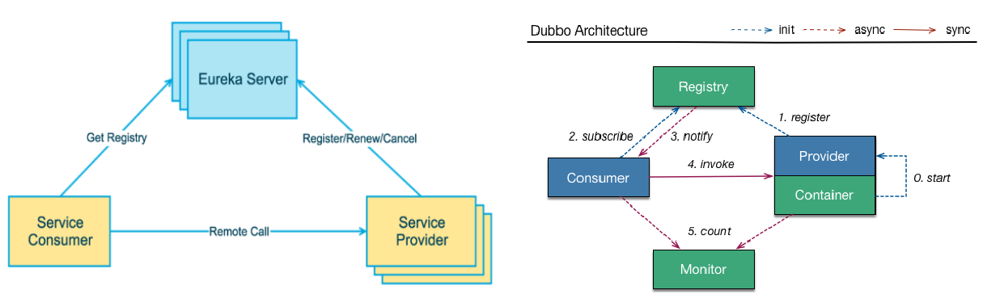
### 1.3、Eureka两个组件
Eureka包含两个组件：Eureka Server 和 Eureka Client

- Eureka Server提供服务注册服务
   - 各个微服务节点通过配置启动后，会在EurekaServer中进行注册，这样EurekaServer中的服务注册表中将会存储所有可用服务节点的信息，服务节点的信息可以在界面中直观看到。
- EurekaClient通过注册中心进行访问
   - 是一个Java客户端，用于简化Eureka Server的交互，客户端同时也具备一个内置的、使用轮询(round-robin)负载算法的负载均衡器。在应用启动后，将会向Eureka Server发送心跳(默认周期为30秒)。如果Eureka Server在多个心跳周期内没有接收到某个节点的心跳，EurekaServer将会从服务注册表中把这个服务节点移除（默认90秒）
## 2、单机搭建
### 2.1、EurekaServer
EurekaServer端服务注册中心
#### 2.1.1、建Module
cloud-eureka-server7001
#### 2.1.2、改POM
```xml
<?xml version="1.0" encoding="UTF-8"?>
<project xmlns="http://maven.apache.org/POM/4.0.0"
         xmlns:xsi="http://www.w3.org/2001/XMLSchema-instance"
         xsi:schemaLocation="http://maven.apache.org/POM/4.0.0 http://maven.apache.org/xsd/maven-4.0.0.xsd">
    <parent>
        <artifactId>mscloud</artifactId>
        <groupId>com.renchao.springcloud</groupId>
        <version>1.0-SNAPSHOT</version>
    </parent>
    <modelVersion>4.0.0</modelVersion>

    <artifactId>cloud-eureka-server7001</artifactId>
    <dependencies>
        <!--eureka-server-->
        <dependency>
            <groupId>org.springframework.cloud</groupId>
            <artifactId>spring-cloud-starter-netflix-eureka-server</artifactId>
        </dependency>
        <!-- 引入自己定义的api通用包，可以使用Payment支付Entity -->
        <dependency>
            <groupId>com.renchao.springcloud</groupId>
            <artifactId>cloud-api-commons</artifactId>
            <version>${project.version}</version>
        </dependency>
        <!--boot web actuator-->
        <dependency>
            <groupId>org.springframework.boot</groupId>
            <artifactId>spring-boot-starter-web</artifactId>
        </dependency>
        <dependency>
            <groupId>org.springframework.boot</groupId>
            <artifactId>spring-boot-starter-actuator</artifactId>
        </dependency>
        <!--一般通用配置-->
        <dependency>
            <groupId>org.springframework.boot</groupId>
            <artifactId>spring-boot-devtools</artifactId>
            <scope>runtime</scope>
            <optional>true</optional>
        </dependency>
        <dependency>
            <groupId>org.projectlombok</groupId>
            <artifactId>lombok</artifactId>
        </dependency>
        <dependency>
            <groupId>org.springframework.boot</groupId>
            <artifactId>spring-boot-starter-test</artifactId>
            <scope>test</scope>
        </dependency>
        <dependency>
            <groupId>junit</groupId>
            <artifactId>junit</artifactId>
        </dependency>
    </dependencies>

</project>
```
**1.X和2.X的对比说明**
```xml
<!-- 以前的老版本（当前使用2018）-->
<dependency>
        <groupId>org.springframework.cloud</groupId>
        <artifactId>spring-cloud-starter-eureka</artifactId>
</dependency>

<!-- 现在新版本（当前使用2020.2）-->
<dependency>
    <groupId>org.springframework.cloud</groupId>
    <artifactId>spring-cloud-starter-netflix-eureka-server</artifactId>
</dependency>
```
#### 2.1.3、写YML
```yaml
server:
  port: 7001

eureka:
  instance:
    hostname: localhost #eureka服务端的实例名称
  client:
    #false表示不向注册中心注册自己。
    register-with-eureka: false
    #false表示自己端就是注册中心，我的职责就是维护服务实例，并不需要去检索服务
    fetch-registry: false
    service-url:
      #设置与Eureka Server交互的地址查询服务和注册服务都需要依赖这个地址。
      defaultZone: http://${eureka.instance.hostname}:${server.port}/eureka/
```
#### 2.1.4、主启动
使用注解 `@EnableEurekaServer` 开启 EurekaServer
#### 2.1.5、测试
访问：[http://localhost:7001/](http://localhost:7001/)
### 2.2、提供者provider
> 改造 cloud-provider-payment8001，将其注册到注册中心 EurekaServer 成为服务提供者provider

#### 2.2.1、改POM
在 POM 里添加以下依赖
```xml
<!--eureka-client-->
<dependency>
    <groupId>org.springframework.cloud</groupId>
    <artifactId>spring-cloud-starter-netflix-eureka-client</artifactId>
</dependency>
```
**依赖 1.X 和 2.X 的对比说明**
```xml
<!-- 以前老版本，别再使用-->
<dependency>
        <groupId>org.springframework.cloud</groupId>
        <artifactId>spring-cloud-starter-eureka</artifactId>
</dependency>

<!-- 现在新版本,当前使用-->
<dependency>
    <groupId>org.springframework.cloud</groupId>
    <artifactId>spring-cloud-starter-netflix-eureka-client</artifactId>
</dependency>
```
#### 2.2.2、改YML
在配置文件中添加以下配置
```yaml
eureka:
  client:
    #表示是否将自己注册进EurekaServer默认为true。
    register-with-eureka: true
    #是否从EurekaServer抓取已有的注册信息，默认为true。单节点无所谓，集群必须设置为true才能配合ribbon使用负载均衡
    fetchRegistry: true
    service-url:
      defaultZone: http://localhost:7001/eureka
```
#### 2.2.3、主启动
主启动类添加下面注解，开启 EurekaClient
`@EnableEurekaClient`
### 2.3、消费者consumer
> 改造 cloud-consumer-order80 将其注册进 EurekaServer 成为服务消费者consumer

#### 2.3.1、POM
在 POM 里添加以下依赖
```xml
<!--eureka-client-->
<dependency>
    <groupId>org.springframework.cloud</groupId>
    <artifactId>spring-cloud-starter-netflix-eureka-client</artifactId>
</dependency>
```
#### 2.3.2、YML
在配置文件中添加以下配置
```yaml
spring:
  application:
    name: cloud-order-service

eureka:
  client:
    #表示是否将自己注册进EurekaServer默认为true。
    register-with-eureka: true
    #是否从EurekaServer抓取已有的注册信息，默认为true。单节点无所谓，集群必须设置为true才能配合ribbon使用负载均衡
    fetchRegistry: true
    service-url:
      defaultZone: http://localhost:7001/eureka
```
#### 2.3.3、主启动
主启动类添加下面注解，开启 EurekaClient
`@EnableEurekaClient`
## 3、Eureka集群构建
### 3.1、原理说明

### 3.2、EurekaServer集群
#### 3.2.1、建module
参考 cloud-eureka-server7001 新建 cloud-eureka-server7002
#### 3.2.2、POM
直接复制 cloud-eureka-server7001 的，注意模块名称需要修改。
#### 3.2.3、修改映射配置
找到C:\Windows\System32\drivers\etc路径下的hosts文件
修改映射配置添加进hosts文件

- 127.0.0.1  eureka1.com
- 127.0.0.1  eureka2.com
#### 3.2.4、写YML

- cloud-eureka-server7001
```yaml
server:
  port: 7001

eureka:
  instance:
    hostname: eureka1.com #eureka服务端的实例名称
  client:
    #false表示不向注册中心注册自己。
    register-with-eureka: false
    #false表示自己端就是注册中心，我的职责就是维护服务实例，并不需要去检索服务
    fetch-registry: false
    service-url:
      #设置与Eureka Server交互的地址查询服务和注册服务都需要依赖这个地址。
      defaultZone: http://eureka2.com:7002/eureka/
```

- cloud-eureka-server7002
```yaml
server:
  port: 7002

eureka:
  instance:
    hostname: eureka2.com #eureka服务端的实例名称
  client:
    #false表示不向注册中心注册自己。
    register-with-eureka: false
    #false表示自己端就是注册中心，我的职责就是维护服务实例，并不需要去检索服务
    fetch-registry: false
    service-url:
      #设置与Eureka Server交互的地址查询服务和注册服务都需要依赖这个地址。
      defaultZone: http://eureka1.com:7001/eureka/
```
#### 3.2.5、主启动
不变
#### 3.2.6、EurekaClient配置
把服务提供者和消费者的配置文件中注册中心地址从单机的修改为集群的。
```yaml
eureka:
  client:
    service-url:
      #defaultZone: http://localhost:7001/eureka
      defaultZone: http://eureka1.com:7001/eureka,http://eureka2.com:7002/eureka  # 集群版
```
### 3.3、服务提供者集群
#### 3.3.1、建module
参考 cloud-provider-payment8001 新建 cloud-provider-payment8002
> 可以直接复制8001的，但注意修改module名称和端口号。

#### 3.3.2、改POM
直接复制8001的，然后修改 `<artifactId>`
#### 3.3.3、写YML
直接复制8001的，然后修改端口号为8002
#### 3.3.4、主启动
不变
#### 3.3.5、业务类
直接从8001粘
修改8001/8002的Controller
```java
@Slf4j
@RestController
public class PaymentController {

    @Value("${server.port}")
    private String serverPort;

    @Resource
    private PaymentService paymentService;

    @PostMapping("/payment")
    public CommonResult<Integer> create(@RequestBody Payment payment) {
        int result = paymentService.create(payment);
        log.info("*****插入操作返回结果:" + result);
        if (result > 0) {
            return new CommonResult<>(200, "插入成功,返回结果"+result+"\t 服务端口："+serverPort, result);
        } else {
            return new CommonResult<>(444, "插入数据失败！", null);
        }
    }


    @GetMapping("/payment/{id}")
    public CommonResult<Payment> getPaymentById(@PathVariable("id") Long id) {
        Payment payment = paymentService.getPaymentById(id);
        log.info("*****查询操作返回结果:" + payment);
        if (payment != null) {
            return new CommonResult<>(200, "查询成功"+"\t 服务端口："+serverPort, payment);
        } else {
            return new CommonResult<>(444, "查询失败", null);
        }
    }
}
```
### 3.4、负载均衡
#### 3.4.1、修改服务访问地址
通过在eureka上注册过的微服务名称调用
`private final static String PAYMENT_SERVICE_URL = "http://CLOUD-PAYMENT-SERVICE";`
#### 3.4.2、配置类设置
```java
@Configuration
public class ApplicationContextConfig {
    @Bean
    @LoadBalanced //使用@LoadBalanced注解赋予RestTemplate负载均衡的能力
    public RestTemplate restTemplate() {
        return new RestTemplate();
    }
}
```
## 4、服务信息完善
actuator微服务信息完善
### 4.1、主机名称
```yaml
eureka:
  instance:
    instance-id: payment8001 # 修改主机名称
```
修改之后

### 4.2、IP提示信息
```yaml
eureka:
  instance:
    prefer-ip-address: true # 访问路径可以显示IP地址
```
修改之后


## 5、服务发现Discovery
对于注册进eureka里面的微服务，可以通过服务发现来获得该服务的信息
修改 cloud-consumer-order80 的Controller 进行测试。
### 5.1、Controller
```java
@RestController
@Slf4j
public class OrderController {

    @Resource
    private DiscoveryClient discoveryClient;
    
    ...............
    ...............

    @GetMapping("/payment/discovery")
    public Object discovery() {
        List<String> services = discoveryClient.getServices();
        for (String element : services) {
            System.out.println(element);
        }

        List<ServiceInstance> instances = discoveryClient.getInstances("CLOUD-PAYMENT-SERVICE");
        for (ServiceInstance element : instances) {
            System.out.println(element.getServiceId() + "\t" + element.getHost() + "\t" + element.getPort() + "\t"
                    + element.getUri());
        }
        return this.discoveryClient;
    }
}
```
### 2.1、主启动类
添加 `@EnableDiscoveryClient` 注解，开启服务发现
## 6、Eureka自我保护
### 6.1、概述
保护模式主要用于一组客户端和Eureka Server之间存在网络分区场景下的保护。一旦进入保护模式，Eureka Server将会尝试保护其服务注册表中的信息，不再删除服务注册表中的数据，也就是不会注销任何微服务。
如果在Eureka Server的首页看到以下这段提示，则说明Eureka进入了保护模式：

自我保护模式是一种应对网络异常的安全保护措施。它的架构哲学是宁可同时保留所有微服务（健康的微服务和不健康的微服务都会保留）也不盲目注销任何健康的微服务。使用自我保护模式，可以让Eureka集群更加的健壮、稳定。

- 一句话：某时刻某一个微服务不可用了，Eureka不会立刻清理，依旧会对该微服务的信息进行保存。
- 属于CAP里面的AP分支
### 6.2、禁止自我保护
使用 `eureka.server.enable-self-preservation = false` 可以禁用自我保护模式
```yaml
eureka:
  server:
       #关闭自我保护机制，保证不可用服务被及时踢除
       enable-self-preservation: false
```
关闭效果

# 第六章、Zookeeper服务注册与发现
## 1、介绍
### 1.1、Eureka停止更新
[https://github.com/Netflix/eureka/wiki](https://github.com/Netflix/eureka/wiki)
### 1.2、注册中心Zookeeper

- zookeeper是一个分布式协调工具，可以实现注册中心功能
- 关闭Linux服务器防火墙后启动zookeeper服务器
- zookeeper服务器取代Eureka服务器，zk作为服务注册中心
## 2、Zookeeper代替Eureka
### 2.1、服务提供者
#### 2.1.1、建module
cloud-provider-payment8004
#### 2.1.2、POM
> zookeeper 的依赖需要与服务器端的版本一致，如果不一致，需要先排除，然后单独加入。


```xml
<?xml version="1.0" encoding="UTF-8"?>
<project xmlns="http://maven.apache.org/POM/4.0.0"
         xmlns:xsi="http://www.w3.org/2001/XMLSchema-instance"
         xsi:schemaLocation="http://maven.apache.org/POM/4.0.0 http://maven.apache.org/xsd/maven-4.0.0.xsd">
    <parent>
        <artifactId>mscloud</artifactId>
        <groupId>com.renchao.springcloud</groupId>
        <version>1.0-SNAPSHOT</version>
    </parent>
    <modelVersion>4.0.0</modelVersion>

    <artifactId>cloud-provider-payment8004</artifactId>


    <dependencies>
        <!-- SpringBoot整合Web组件 -->
        <dependency>
            <groupId>org.springframework.boot</groupId>
            <artifactId>spring-boot-starter-web</artifactId>
        </dependency>
        <dependency><!-- 引入自己定义的api通用包，可以使用Payment支付Entity -->
            <groupId>com.renchao.springcloud</groupId>
            <artifactId>cloud-api-commons</artifactId>
            <version>${project.version}</version>
        </dependency>
        <!-- SpringBoot整合zookeeper客户端 -->
        <dependency>
            <groupId>org.springframework.cloud</groupId>
            <artifactId>spring-cloud-starter-zookeeper-discovery</artifactId>
            <exclusions>
                <!--先排除自带的zookeeper3.5.3-->
                <exclusion>
                    <groupId>org.apache.zookeeper</groupId>
                    <artifactId>zookeeper</artifactId>
                </exclusion>
            </exclusions>
        </dependency>
        <!--添加zookeeper3.4.9版本(与服务器的版本一致)-->
        <dependency>
            <groupId>org.apache.zookeeper</groupId>
            <artifactId>zookeeper</artifactId>
            <version>3.4.9</version>
        </dependency>
        <dependency>
            <groupId>org.springframework.boot</groupId>
            <artifactId>spring-boot-devtools</artifactId>
            <scope>runtime</scope>
            <optional>true</optional>
        </dependency>
        <dependency>
            <groupId>org.projectlombok</groupId>
            <artifactId>lombok</artifactId>
            <optional>true</optional>
        </dependency>
        <dependency>
            <groupId>org.springframework.boot</groupId>
            <artifactId>spring-boot-starter-test</artifactId>
            <scope>test</scope>
        </dependency>
    </dependencies>

</project>
```
#### 2.1.3、YML
```yaml
#8004表示注册到zookeeper服务器的支付服务提供者端口号
server:
  port: 8004
#服务别名----注册zookeeper到注册中心名称
spring:
  application:
    name: cloud-provider-payment
  cloud:
    zookeeper:
      connect-string: 192.168.123.110:2181
```
#### 2.1.4、主启动类
```java
@SpringBootApplication
@EnableDiscoveryClient //该注解用于向使用consul或者zookeeper作为注册中心时注册服务
public class PaymentMain8004 {
    public static void main(String[] args) {
        SpringApplication.run(PaymentMain8004.class, args);
    }
}
```
#### 2.1.5、Controller
```java
@RestController
public class PaymentController {
    @Value("${server.port}")
    private String serverPort;

    @RequestMapping(value = "/payment/zk")
    public String paymentzk() {
        return "springcloud with zookeeper: "+serverPort+"\t"+ UUID.randomUUID();
    }
}
```
#### 2.1.6、测试

- 启动8004注册进zookeeper
- 验证测试1
   - 
   - [http://localhost:8004/payment/zk](http://localhost:8004/payment/zk)
- 验证测试2
   - 
> 服务节点是临时节点

### 2.2、服务消费者
#### 2.2.1、建module
新建cloud-consumerzk-order80
#### 2.2.2、POM
与服务提供者一样，注意模块名称。
#### 2.2.3、YML
```yaml
server:
  port: 80

spring:
  application:
    name: cloud-consumer-order
  cloud:
    #注册到zookeeper地址
    zookeeper:
      connect-string: 192.168.123.110:2181
```
#### 2.2.4、主启动
```java
@SpringBootApplication
public class OrderZK80 {
    public static void main(String[] args) {
        SpringApplication.run(OrderZK80.class, args);
    }
}
```
#### 2.2.5、业务类

- 配置类
```java
@Configuration
public class ApplicationContextConfig {
    @Bean
    @LoadBalanced //使用@LoadBalanced注解赋予RestTemplate负载均衡的能力
    public RestTemplate restTemplate() {
        return new RestTemplate();
    }
}
```

- Controller
```java
@RestController
public class OrderZKController {
    public static final String INVOKE_URL = "http://cloud-provider-payment";

    @Autowired
    private RestTemplate restTemplate;

    @RequestMapping(value = "/consumer/payment/zk")
    public String paymentInfo()
    {
        String result = restTemplate.getForObject(INVOKE_URL+"/payment/zk", String.class);
        System.out.println("消费者调用支付服务(zookeeper)--->result:" + result);
        return result;
    }
}
```
#### 2.2.6、测试
测试1

测试2
[http://localhost/consumer/payment/zk](http://localhost/consumer/payment/zk)
# 第七章、Consul服务注册与发现
## 1、Consul简介
### 1.1、是什么
[https://www.consul.io/intro/index.html](https://www.consul.io/intro/index.html)
### 1.2、功能

- 服务发现
   - 提供HTTP和DNS两种发现方式。
- 健康监测
   - 支持多种方式，HTTP、TCP、Docker、Shell脚本定制化监控
- KV存储
   - Key、Value的存储方式
- 多数据中心
   - Consul支持多数据中心
- 可视化Web界面
### 1.3、下载
[https://www.consul.io/downloads.html](https://www.consul.io/downloads.html)
### 1.4、使用文档
[https://www.springcloud.cc/spring-cloud-consul.html](https://www.springcloud.cc/spring-cloud-consul.html)
## 2、安装并运行Consul
### 2.1、安装

- 官网安装说明
   - [https://learn.hashicorp.com/consul/getting-started/install.html](https://learn.hashicorp.com/consul/getting-started/install.html)
- windows
   - 下载完成后只有一个consul.exe文件， 硬盘路径下双击运行，查看版本号信息
- Linux
```bash
yum install -y yum-utils
yum-config-manager --add-repo https://rpm.releases.hashicorp.com/RHEL/hashicorp.repo
yum -y install consul
```
### 2.2、运行
使用开发模式启动 `consul agent -dev -client 0.0.0.0`
> -client 表示可以访问的客户端地址。

- 通过以下地址可以访问Consul的首页：[http://ip:8500](http://localhost:8500)
- 结果页面
   - 
## 3、服务提供者
### 3.1、建Module
cloud-providerconsul-payment8006
### 3.2、POM
```xml
<?xml version="1.0" encoding="UTF-8"?>
<project xmlns="http://maven.apache.org/POM/4.0.0"
         xmlns:xsi="http://www.w3.org/2001/XMLSchema-instance"
         xsi:schemaLocation="http://maven.apache.org/POM/4.0.0 http://maven.apache.org/xsd/maven-4.0.0.xsd">
    <parent>
        <artifactId>mscloud</artifactId>
        <groupId>com.renchao.springcloud</groupId>
        <version>1.0-SNAPSHOT</version>
    </parent>
    <modelVersion>4.0.0</modelVersion>

    <artifactId>cloud-providerconsul-payment8006</artifactId>

    <dependencies>
        <!--SpringCloud consul-server -->
        <dependency>
            <groupId>org.springframework.cloud</groupId>
            <artifactId>spring-cloud-starter-consul-discovery</artifactId>
        </dependency>
        <!-- SpringBoot整合Web组件 -->
        <dependency>
            <groupId>org.springframework.boot</groupId>
            <artifactId>spring-boot-starter-web</artifactId>
        </dependency>
        <dependency>
            <groupId>org.springframework.boot</groupId>
            <artifactId>spring-boot-starter-actuator</artifactId>
        </dependency>
        <!--日常通用jar包配置-->
        <dependency>
            <groupId>org.springframework.boot</groupId>
            <artifactId>spring-boot-devtools</artifactId>
            <scope>runtime</scope>
            <optional>true</optional>
        </dependency>
        <dependency>
            <groupId>org.projectlombok</groupId>
            <artifactId>lombok</artifactId>
            <optional>true</optional>
        </dependency>
        <dependency>
            <groupId>org.springframework.boot</groupId>
            <artifactId>spring-boot-starter-test</artifactId>
            <scope>test</scope>
        </dependency>
    </dependencies>

</project>
```
### 3.3、YML
```yaml
###consul服务端口号
server:
  port: 8006

spring:
  application:
    name: consul-provider-payment
  ####consul注册中心地址
  cloud:
    consul:
      host: 192.168.123.90
      port: 8500
      discovery:
        #hostname: 127.0.0.1
        service-name: ${spring.application.name}
```
### 3.4、主启动类
```java
@SpringBootApplication
@EnableDiscoveryClient
public class PaymentMain8006 {
    public static void main(String[] args) {
        SpringApplication.run(PaymentMain8006.class, args);
    }
}
```
### 3.5、Controller
```java
@RestController
public class PaymentController {
    @Value("${server.port}")
    private String serverPort;

    @GetMapping("/payment/consul")
    public String paymentInfo() {
        return "springCloud with consul: "+serverPort+"\t\t"+ UUID.randomUUID();
    }
}
```
### 3.6、测试

[http://localhost:8006/payment/consul](http://localhost:8006/payment/consul)
## 4、服务消费者
### 4.1、建Module
cloud-consumerconsul-order80
### 4.2、POM
与服务提供者一样，注意模块名称。
### 4.3、YML
```yaml
###consul服务端口号
server:
  port: 80

spring:
  application:
    name: cloud-consumer-order
  ####consul注册中心地址
  cloud:
    consul:
      host: 192.168.123.90
      port: 8500
      discovery:
        #hostname: 127.0.0.1
        service-name: ${spring.application.name}
```
### 4.4、主启动类
与服务提供者一样。
### 4.5、业务类
#### 4.5.1、配置类
```java
@Configuration
public class ApplicationContextConfig {
    @Bean
    @LoadBalanced //使用@LoadBalanced注解赋予RestTemplate负载均衡的能力
    public RestTemplate restTemplate() {
        return new RestTemplate();
    }
}
```
#### 4.5.2、Controller
```java
@RestController
public class OrderConsulController {
    public static final String INVOKE_URL = "http://consul-provider-payment"; //consul-provider-payment

    @Autowired
    private RestTemplate restTemplate;

    @GetMapping(value = "/consumer/payment/consul")
    public String paymentInfo() {
        String result = restTemplate.getForObject(INVOKE_URL+"/payment/consul", String.class);
        System.out.println("消费者调用支付服务(consule)--->result:" + result);
        return result;
    }
}
```
### 4.6、测试

访问测试地址
[http://localhost/consumer/payment/consul](http://localhost/consumer/payment/consul)
## 5、三个注册中心比较
### 5.1、CAP

- C：Consistency（强一致性）
- A：Availability（可用性）
- P：Partition tolerance（分区容错性）
> CAP理论关注粒度是数据，而不是整体系统设计的策略

### 5.2、经典CAP图
#### 5.2.1、AP(Eureka)
AP架构
当网络分区出现后，为了保证可用性，系统B**可以返回旧值**，保证系统的可用性。
**结论：违背了一致性C的要求，只满足可用性和分区容错，即AP。**

#### 5.2.2、CP(Zookeeper/Consul)
CP架构
当网络分区出现后，为了保证一致性，就必须拒接请求，否则无法保证一致性
结论：违背了可用性A的要求，只满足一致性和分区容错，即CP。

# 第八章、Ribbon负载均衡
## 1、概述
### 1.1、是什么
官网资料
[https://github.com/Netflix/ribbon/wiki/Getting-Started](https://github.com/Netflix/ribbon/wiki/Getting-Started)
Ribbon目前也进入维护模式
未来替换方案

- Starter Loadbalancer
### 1.2、负载均衡（LB）
#### 1.2.1、集中式LB
即在服务的消费方和提供方之间使用独立的LB设施(可以是硬件，如F5, 也可以是软件，如nginx)，由该设施负责把访问请求通过某种策略转发至服务的提供方。
#### 1.2.2、进程内LB
将LB逻辑集成到消费方，消费方从服务注册中心获知有哪些地址可用，然后自己再从这些地址中选择出一个合适的服务器。
Ribbon就属于进程内LB，它只是一个类库，集成于消费方进程，消费方通过它来获取到服务提供方的地址。

-  一句话
   - 负载均衡+RestTemplate调用
## 2、负载均衡演示
### 2.1、架构

Ribbon在工作时分成两步：

- 第一步先选择 EurekaServer ,它优先选择在同一个区域内负载较少的server.
- 第二步再根据用户指定的策略，在从server取到的服务注册列表中选择一个地址。
   - 其中Ribbon提供了多种策略：比如轮询、随机和根据响应时间加权。

**总结：**Ribbon其实就是一个软负载均衡的客户端组件， 他可以和其他所需请求的客户端结合使用，和eureka结合只是其中的一个实例。
### 2.2、依赖说明
```xml
<dependency>
    <groupId>org.springframework.cloud</groupId>
    <artifactId>spring-cloud-starter-netflix-ribbon</artifactId>
</dependency>
```

- 没有引入spring-cloud-starter-ribbon也可以使用ribbon
- 是因为 spring-cloud-starter-netflix-eureka-client 自带了 spring-cloud-starter-ribbon 依赖。


### 2.3、RestTemplate使用
#### 2.3.1、官网
[RestTemplate (Spring Framework 5.2.2.RELEASE API)](https://docs.spring.io/spring-framework/docs/5.2.2.RELEASE/javadoc-api/org/springframework/web/client/RestTemplate.html)
#### 2.3.2、Object 与 Entity

- getForObject / postForObject
   - 返回对象为响应体中数据转化成的对象，基本上可以理解为Json
- getForEntity / postForEntity
   - 返回对象为ResponseEntity对象，包含了响应中的一些重要信息，比如响应头、响应状态码、响应体等
#### 2.3.2、GET方法
```java
<T> T getForObject(String url, Class<T> responseType, Object... uriVariables);
<T> T getForObject(String url, Class<T> responseType, Map<String, ?> uriVariables);
<T> T getForObject(URI url, Class<T> responseType);
<T> ResponseEntity<T> getForEntity(String url, Class<T> responseType, Object... uriVariables);
<T> ResponseEntity<T> getForEntity(String url, Class<T> responseType, Map<String, ?> uriVariables);
<T> ResponseEntity<T> getForEntity(URI var1, Class<T> responseType);
```
#### 2.3.3、POST方法
```java
<T> T postForObject(String url, @Nullable Object request, Class<T> responseType, Object... uriVariables);
<T> T postForObject(String url, @Nullable Object request, Class<T> responseType, Map<String, ?> uriVariables);
<T> T postForObject(URI url, @Nullable Object request, Class<T> responseType);
<T> ResponseEntity<T> postForEntity(String url, @Nullable Object request, Class<T> responseType, Object... uriVariables);
<T> ResponseEntity<T> postForEntity(String url, @Nullable Object request, Class<T> responseType, Map<String, ?> uriVariables);
<T> ResponseEntity<T> postForEntity(URI url, @Nullable Object request, Class<T> responseType);
```
## 3、核心组件IRule
### 3.1、介绍
IRule：根据特定算法中从服务列表中选取一个要访问的服务

### 3.2、常用规则

- **RoundRobinRule**
   - 轮询
- **RandomRule**
   - 随机
- **RetryRule**
   - 先按照RoundRobinRule的策略获取服务，如果获取服务失败则在指定时间内会进行重试，获取可用的服务
- **WeightedResponseTimeRule**
   - 对RoundRobinRule的扩展，响应速度越快的实例选择权重越大，越容易被选择
- **BestAvailableRule**
   - 会先过滤掉由于多次访问故障而处于断路器跳闸状态的服务，然后选择一个并发量最小的服务
- **AvailabilityFilteringRule**
   - 先过滤掉故障实例，再选择并发较小的实例
- **ZoneAvoidanceRule**
   - 默认规则,复合判断server所在区域的性能和server的可用性选择服务器
## 4、规则替换
> 修改cloud-consumer-order80

### 4.1、配置细节
官方文档明确给出了警告：
这个自定义配置类**不能放在@ComponentScan所扫描的当前包下以及子包下**，否则我们自定义的这个配置类就会被所有的Ribbon客户端所共享，达不到特殊化定制的目的了。
### 4.2、新建package

### 4.3、新建规则类
```java
@Configuration
public class MySelfRule {
    @Bean
    public IRule myRule() {
        return new RandomRule();
    }
}
```
### 4.4、主启动类
主启动类添加@RibbonClient
```java
@SpringBootApplication
@EnableEurekaClient
@RibbonClient(name = "CLOUD-PAYMENT-SERVICE",configuration= MySelfRule.class)
public class OrderMain80 {
    public static void main(String[] args) {
        SpringApplication.run(OrderMain80.class, args);
    }
}
```
### 4.5、测试
[http://localhost/payment/1](http://localhost/payment/1)
## 5、负载均衡算法
### 5.1、原理
负载均衡算法：rest接口第几次请求数 % 服务器集群总数量 = 实际调用服务器位置下标  ，每次服务重启动后rest接口计数从1开始。
`List<ServiceInstance> instances = discoveryClient.getInstances("CLOUD-PAYMENT-SERVICE");`
如：

- List [0] instances = 127.0.0.1:8002
- List [1] instances = 127.0.0.1:8001

8001+ 8002 组合成为集群，它们共计2台机器，集群总数为2， 按照轮询算法原理：

- 当总请求数为1时： 1 % 2 =1 对应下标位置为1 ，则获得服务地址为127.0.0.1:8001
- 当总请求数位2时： 2 % 2 =0 对应下标位置为0 ，则获得服务地址为127.0.0.1:8002
- 当总请求数位3时： 3 % 2 =1 对应下标位置为1 ，则获得服务地址为127.0.0.1:8001
- 当总请求数位4时： 4 % 2 =0 对应下标位置为0 ，则获得服务地址为127.0.0.1:8002
- 如此类推......
### 5.2、自己手写
> 7001/7002集群启动

#### 5.2.1、8001/8002改造
controller 加入以下内容：
```java
@GetMapping(value = "/payment/lb")
public String getPaymentLB() {
    return serverPort;
}
```
#### 5.2.2、编写算法
自旋锁知识：[https://www.bilibili.com/video/BV1zb411M7NQ?p=12](https://www.bilibili.com/video/BV1zb411M7NQ?p=12)

- LoadBalancer接口
```java
package com.renchao.springcloud.lb;

import org.springframework.cloud.client.ServiceInstance;
import java.util.List;

public interface LoadBalancer {
    ServiceInstance instances(List<ServiceInstance> serviceInstances);
}
```

- MyLB
```java
@Component
public class MyLB implements LoadBalancer {

    private final AtomicInteger atomicInteger = new AtomicInteger(0);

    public final int getAndIncrement() {
        int current;
        int next;
        do {
            current = this.atomicInteger.get();
            next = current >= 2147483647 ? 0 : current + 1;
        } while (!this.atomicInteger.compareAndSet(current, next));
        System.out.println("*****next: " + next);
        return next;
    }

    @Override
    public ServiceInstance instances(List<ServiceInstance> serviceInstances) {
        int index = getAndIncrement() % serviceInstances.size();
        return serviceInstances.get(index);
    }
}
```
#### 5.2.3、80改造

- ApplicationContextConfig 去掉注解 @LoadBalanced
- OrderController 添加以下内容
```java
//可以获取注册中心上的服务列表
@Resource
private DiscoveryClient discoveryClient;
@Resource
private LoadBalancer loadBalancer;

@GetMapping("/consumer/payment/lb")
public String getPaymentLB() {
    List<ServiceInstance> instances = discoveryClient.getInstances("CLOUD-PAYMENT-SERVICE");
    if(instances == null || instances.size()<=0) {
        return null;
    }
    ServiceInstance serviceInstance = loadBalancer.instances(instances);
    URI uri = serviceInstance.getUri();
    return restTemplate.getForObject(uri+"/payment/lb",String.class);
}
```
#### 5.2.4、测试
[http://localhost/consumer/payment/lb](http://localhost/consumer/payment/lb)

# 第九章、OpenFeign服务接口调用
## 1、概述
### 1.1、是什么
官网解释：
[https://cloud.spring.io/spring-cloud-static/Hoxton.SR1/reference/htmlsingle/#spring-cloud-openfeign](https://cloud.spring.io/spring-cloud-static/Hoxton.SR1/reference/htmlsingle/#spring-cloud-openfeign)
Feign是一个声明式的Web服务客户端，让编写Web服务客户端变得非常容易，只需创建一个接口并在接口上添加注解即可。
它的使用方法是定义一个服务接口然后在上面添加注解。Feign也支持可拔插式的编码器和解码器。Spring Cloud对Feign进行了封装，使其支持了Spring MVC标准注解和HttpMessageConverters。Feign可以与Eureka和Ribbon组合使用以支持负载均衡
GitHub：[https://github.com/spring-cloud/spring-cloud-openfeign](https://github.com/spring-cloud/spring-cloud-openfeign)
### 1.2、能干嘛
Feign旨在使编写Java Http客户端变得更容易。
前面在使用Ribbon+RestTemplate时，利用RestTemplate对http请求的封装处理，形成了一套模版化的调用方法。但是在实际开发中，由于对服务依赖的调用可能不止一处，往往一个接口会被多处调用，所以通常都会针对每个微服务自行封装一些客户端类来包装这些依赖服务的调用。所以，Feign在此基础上做了进一步封装，由他来帮助我们定义和实现依赖服务接口的定义。在Feign的实现下，我们只需创建一个接口并使用注解的方式来配置它(以前是Dao接口上面标注Mapper注解,现在是一个微服务接口上面标注一个Feign注解即可)，即可完成对服务提供方的接口绑定，简化了使用Spring cloud Ribbon时，自动封装服务调用客户端的开发量。
Feign集成了Ribbon。
利用Ribbon维护了Payment的服务列表信息，并且通过轮询实现了客户端的负载均衡。而与Ribbon不同的是，通过feign只需要定义服务绑定接口且以声明式的方法，优雅而简单的实现了服务调用。
### 1.3、Feign和OpenFeign区别
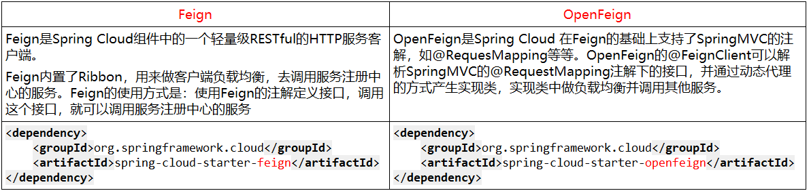
## 2、使用步骤
> 接口+注解
> 微服务调用接口 + @FeignClient

### 2.1、建module
新建cloud-consumer-feign-order80
> Feign在消费端使用

### 2.2、POM
```xml
<?xml version="1.0" encoding="UTF-8"?>
<project xmlns="http://maven.apache.org/POM/4.0.0"
         xmlns:xsi="http://www.w3.org/2001/XMLSchema-instance"
         xsi:schemaLocation="http://maven.apache.org/POM/4.0.0 http://maven.apache.org/xsd/maven-4.0.0.xsd">
    <parent>
        <artifactId>mscloud</artifactId>
        <groupId>com.renchao.springcloud</groupId>
        <version>1.0-SNAPSHOT</version>
    </parent>
    <modelVersion>4.0.0</modelVersion>

    <artifactId>cloud-consumer-feign-order80</artifactId>

    <dependencies>
        <!--openFeign-->
        <dependency>
            <groupId>org.springframework.cloud</groupId>
            <artifactId>spring-cloud-starter-openfeign</artifactId>
        </dependency>
        <!--eureka client-->
        <dependency>
            <groupId>org.springframework.cloud</groupId>
            <artifactId>spring-cloud-starter-netflix-eureka-client</artifactId>
        </dependency>
        <!-- 引入自己定义的api通用包，可以使用Payment支付Entity -->
        <dependency>
            <groupId>com.renchao.springcloud</groupId>
            <artifactId>cloud-api-commons</artifactId>
            <version>${project.version}</version>
        </dependency>
        <!--web-->
        <dependency>
            <groupId>org.springframework.boot</groupId>
            <artifactId>spring-boot-starter-web</artifactId>
        </dependency>
        <dependency>
            <groupId>org.springframework.boot</groupId>
            <artifactId>spring-boot-starter-actuator</artifactId>
        </dependency>
        <!--一般基础通用配置-->
        <dependency>
            <groupId>org.springframework.boot</groupId>
            <artifactId>spring-boot-devtools</artifactId>
            <scope>runtime</scope>
            <optional>true</optional>
        </dependency>
        <dependency>
            <groupId>org.projectlombok</groupId>
            <artifactId>lombok</artifactId>
            <optional>true</optional>
        </dependency>
        <dependency>
            <groupId>org.springframework.boot</groupId>
            <artifactId>spring-boot-starter-test</artifactId>
            <scope>test</scope>
        </dependency>
    </dependencies>
    
</project>
```
### 2.3、YML
```yaml
server:
  port: 80

eureka:
  client:
    register-with-eureka: false
    service-url:
      defaultZone: http://eureka1.com:7001/eureka/,http://eureka2.com:7002/eureka/
```
### 2.4、主启动
添加` @EnableFeignClients` 注解，开启 OpenFeign
```java
@SpringBootApplication
@EnableFeignClients // 开启openfeign
public class OrderFeignMain80 {
    public static void main(String[] args) {
        SpringApplication.run(OrderFeignMain80.class, args);
    }
}
```
### 2.5、业务类
> 业务逻辑接口 + @FeignClient 配置调用 provider 服务

- 新建 PaymentFeignService 接口并新增注解 `@FeignClient`
```java
@Service
@FeignClient("CLOUD-PAYMENT-SERVICE") // 使用openfeign
public interface PaymentFeignService {
    @GetMapping("/payment/{id}")
    CommonResult<Payment> getById(@PathVariable("id") Long id);
}
```

- 控制层Controller
```java
@RestController
public class OrderFeignController {

    @Resource
    private PaymentFeignService paymentFeignService;

    @GetMapping("/consumer/payment/{id}")
    public CommonResult<Payment> getPaymentById(@PathVariable("id") Long id) {
        return paymentFeignService.getById(id);
    }
}
```
### 2.6、测试

- 先启动2个 eureka 集群 7001/7002
- 再启动2个微服务 8001/8002
- 最后启动 OrderFeignMain80
- 打开 [http://localhost/consumer/payment/2](http://localhost/consumer/payment/2)
> Feign自带负载均衡配置项

### 2.7、总结

## 3、超时控制
> 超时设置，故意设置超时演示出错情况

### 3.1、演示代码

- 服务提供方8001故意写暂停程序
```java
@GetMapping(value = "/payment/feign/timeout")
public String paymentFeignTimeOut() {
    System.out.println("*****paymentFeignTimeOut from port: "+serverPort);
    //暂停几秒钟线程
    try { TimeUnit.SECONDS.sleep(3); } catch (InterruptedException e) { e.printStackTrace(); }
    return serverPort;
}
```

- 服务消费方80添加超时方法PaymentFeignService
```java
@GetMapping(value = "/payment/feign/timeout")
String paymentFeignTimeOut();
```

- 服务消费方80添加超时方法OrderFeignController
```java
@GetMapping(value = "/consumer/payment/feign/timeout")
public String paymentFeignTimeOut() {
    return paymentFeignService.paymentFeignTimeOut();
}
```

- 测试
   - [http://localhost/consumer/payment/feign/timeout](http://localhost/consumer/payment/feign/timeout)
   - 错误页面
   - 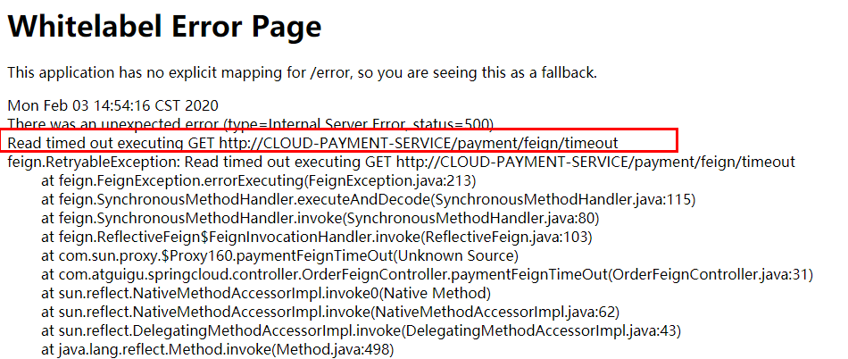
> OpenFeign默认等待1秒钟，超过后报错 

### 3.2、超时配置
OpenFeign默认支持Ribbon
YML文件里需要开启OpenFeign客户端超时控制

```yaml
feign:
  client:
    config:
      default:
        #指的是建立连接后从服务器读取到可用资源所用的时间
        ConnectTimeOut: 5000
        #指的是建立连接所用的时间，适用于网络状况正常的情况下,两端连接所用的时间
        ReadTimeOut: 5000
```
或者使用下面配置，但下面配置会有错误提示，但也可以使用。
```yaml
#设置feign客户端超时时间(OpenFeign默认支持ribbon)
ribbon:
  #指的是建立连接所用的时间，适用于网络状况正常的情况下,两端连接所用的时间
  ReadTimeout: 5000
  #指的是建立连接后从服务器读取到可用资源所用的时间
  ConnectTimeout: 5000
```
## 4、日志打印功能
### 4.1、介绍
Feign 提供了日志打印功能，我们可以通过配置来调整日志级别，从而了解 Feign 中 Http 请求的细节。
说白了就是对Feign接口的调用情况进行监控和输出。
### 4.2、日志级别

- **NONE：**默认的，不显示任何日志；
- **BASIC：**仅记录请求方法、URL、响应状态码及执行时间；
- **HEADERS：**除了 BASIC 中定义的信息之外，还有请求和响应的头信息；
- **FULL：**除了 HEADERS 中定义的信息之外，还有请求和响应的正文及元数据。
### 4.3、配置

- 配置类
```java
@Configuration
public class FeignConfig {
    @Bean
    public Logger.Level feignLoggerLevel() {
        return Logger.Level.FULL;
    }
}
```

- YML文件里需要开启日志的Feign客户端
```yaml
logging:
  level:
    # feign日志以什么级别监控哪个接口
    com.renchao.springcloud.service.PaymentFeignService: debug
```


## 5、同步请求头

详细参考 [267、商城业务-订单服务-Feign远程调用丢失请求头问题_哔哩哔哩_bilibili](https://www.bilibili.com/video/BV1np4y1C7Yf?p=268)

```java
@Configuration
public class GulimallFeignConfig {
    @Bean
    public RequestInterceptor requestInterceptor() {
        return new RequestInterceptor() {
            @Override
            public void apply(RequestTemplate template) {
                // 获取当前的原始请求request
                ServletRequestAttributes attributes =(ServletRequestAttributes) RequestContextHolder.getRequestAttributes();
                HttpServletRequest request = attributes.getRequest();

                // 把需要的请求头数据同步到新请求
                String cookie = request.getHeader("Cookie");
                template.header("Cookie", cookie);
            }
        };
    }
}
```


## 6、debug方法

1、断点打在上面同步请求头的位置，然后通过方法栈进行跟踪。

2、在SynchronousMethodHandler中的executeAndDecode()方法


## 7、使用OkHttpClient

OpenFeign 在默认情况下使用的是基于 Java 标准库的 HttpURLConnection 作为其底层 HTTP 客户端。

### 7.1、启用

如果要使用OkHttpClient，可根据下面配置。

①配置文件 `feign.okhttp.enabled=true`

②添加两个依赖

```xml
<dependency>
    <groupId>com.squareup.okhttp3</groupId>
    <artifactId>okhttp</artifactId>
</dependency>
<dependency>
    <groupId>io.github.openfeign</groupId>
    <artifactId>feign-okhttp</artifactId>
</dependency>
```


### 7.2、OkHttp拦截器

```java
@Bean
public OkHttpClient okHttpClient() {
    OkHttpClient.Builder builder = new OkHttpClient.Builder();
    builder.addInterceptor(new Interceptor() {
        @Override
        public Response intercept(Chain chain) throws IOException {
            // 拦截逻辑
            System.out.println("OkHttpClient生效");
            return null;
        }
    });
    return builder.build();
}
```

> 在这里还可以对OkHttpClient进行其他配置


### 7.3、debug入口

在 TracingFeignClient 类的 delegate 属性中放的就是发送http请求的Client。【默认是HttpURLConnection】

执行在 TracingFeignClient 类的 execute 方法


# 第十章、Hystrix断路器

## 1、概述

/ˈhɪstrɪks/，中文翻译是**海斯特瑞克斯**

### 1.1、分布式的问题
分布式系统面临的问题
复杂分布式体系结构中的应用程序有数十个依赖关系，每个依赖关系在某些时候将不可避免地失败。

**服务雪崩**
多个微服务之间调用的时候，假设微服务A调用微服务B和微服务C，微服务B和微服务C又调用其它的微服务，这就是所谓的“扇出”。如果扇出的链路上某个微服务的调用响应时间过长或者不可用，对微服务A的调用就会占用越来越多的系统资源，进而引起系统崩溃，所谓的“雪崩效应”。
对于高流量的应用来说，单一的后端依赖可能会导致所有服务器上的所有资源都在几秒钟内饱和。比失败更糟糕的是，这些应用程序还可能导致服务之间的延迟增加，备份队列，线程和其他系统资源紧张，导致整个系统发生更多的级联故障。这些都表示需要对故障和延迟进行隔离和管理，以便单个依赖关系的失败，不能取消整个应用程序或系统。
所以，通常当你发现一个模块下的某个实例失败后，这时候这个模块依然还会接收流量，然后这个有问题的模块还调用了其他的模块，这样就会发生级联故障，或者叫雪崩。
### 1.2、Hystrix
Hystrix是一个用于处理分布式系统的延迟和容错的开源库，在分布式系统里，许多依赖不可避免的会调用失败，比如超时、异常等，Hystrix能够保证在一个依赖出问题的情况下，不会导致整体服务失败，避免级联故障，以提高分布式系统的弹性。
“断路器”本身是一种开关装置，当某个服务单元发生故障之后，通过断路器的故障监控（类似熔断保险丝），**向调用方返回一个符合预期的、可处理的备选响应（FallBack），而不是长时间的等待或者抛出调用方无法处理的异常**，这样就保证了服务调用方的线程不会被长时间、不必要地占用，从而避免了故障在分布式系统中的蔓延，乃至雪崩。
### 1.3、功能

- 服务降级
- 服务熔断
- 接近实时的监控
- 。。。。。。
### 1.4、官网资料
[https://github.com/Netflix/Hystrix/wiki/How-To-Use](https://github.com/Netflix/Hystrix/wiki/How-To-Use)
Hystrix官宣，停更进维
[https://github.com/Netflix/Hystrix](https://github.com/Netflix/Hystrix)
## 2、重要概念
### 2.1、服务降级（fallback）
> 服务器忙，请稍后再试，不让客户端等待并立刻返回一个友好提示，fallback

下面情况会出发降级：

- 程序运行异常
- 超时
- 服务熔断触发服务降级
- 线程池/信号量打满也会导致服务降级
### 2.2、服务熔断
类比保险丝，达到最大服务访问后，直接拒绝访问，拉闸限电，然后调用服务降级的方法并返回友好提示。
服务的降级 -> 进而熔断 -> 恢复调用链路
### 2.3、服务限流
秒杀高并发等操作，严禁一窝蜂的过来拥挤，大家排队，一秒钟N个，有序进行
## 3、案例
### 3.1、构建
#### 3.1.1、建module
新建cloud-provider-hystrix-payment8001
#### 3.1.2、POM
```xml
<?xml version="1.0" encoding="UTF-8"?>
<project xmlns="http://maven.apache.org/POM/4.0.0"
         xmlns:xsi="http://www.w3.org/2001/XMLSchema-instance"
         xsi:schemaLocation="http://maven.apache.org/POM/4.0.0 http://maven.apache.org/xsd/maven-4.0.0.xsd">
    <parent>
        <artifactId>mscloud</artifactId>
        <groupId>com.renchao.springcloud</groupId>
        <version>1.0-SNAPSHOT</version>
    </parent>
    <modelVersion>4.0.0</modelVersion>

    <artifactId>cloud-provider-hystrix-payment8001</artifactId>


    <dependencies>
        <!--hystrix-->
        <dependency>
            <groupId>org.springframework.cloud</groupId>
            <artifactId>spring-cloud-starter-netflix-hystrix</artifactId>
        </dependency>
        <!--eureka client-->
        <dependency>
            <groupId>org.springframework.cloud</groupId>
            <artifactId>spring-cloud-starter-netflix-eureka-client</artifactId>
        </dependency>
        <!--web-->
        <dependency>
            <groupId>org.springframework.boot</groupId>
            <artifactId>spring-boot-starter-web</artifactId>
        </dependency>
        <dependency>
            <groupId>org.springframework.boot</groupId>
            <artifactId>spring-boot-starter-actuator</artifactId>
        </dependency>
        <dependency><!-- 引入自己定义的api通用包，可以使用Payment支付Entity -->
            <groupId>com.renchao.springcloud</groupId>
            <artifactId>cloud-api-commons</artifactId>
            <version>${project.version}</version>
        </dependency>
        <dependency>
            <groupId>org.springframework.boot</groupId>
            <artifactId>spring-boot-devtools</artifactId>
            <scope>runtime</scope>
            <optional>true</optional>
        </dependency>
        <dependency>
            <groupId>org.projectlombok</groupId>
            <artifactId>lombok</artifactId>
            <optional>true</optional>
        </dependency>
        <dependency>
            <groupId>org.springframework.boot</groupId>
            <artifactId>spring-boot-starter-test</artifactId>
            <scope>test</scope>
        </dependency>
    </dependencies>

</project>
```
#### 3.1.3、YML
```yaml
server:
  port: 8001

spring:
  application:
    name: cloud-provider-hystrix-payment

eureka:
  client:
    register-with-eureka: true
    fetch-registry: true
    service-url:
      #defaultZone: http://eureka7001.com:7001/eureka,http://eureka7002.com:7002/eureka
      defaultZone: http://eureka1.com:7001/eureka
```
#### 3.1.4、主启动
```java
@SpringBootApplication
@EnableEurekaClient
public class PaymentHystrixMain8001 {
    public static void main(String[] args) {
        SpringApplication.run(PaymentHystrixMain8001.class, args);
    }
}
```
#### 3.1.5、业务类

- service
```java
@Service
public class PaymentService {
    /**
     * 正常访问，一切OK
     */
    public String paymentInfo_OK(Integer id) {
        return "线程池:"+Thread.currentThread().getName()+",\tpaymentInfo_OK,id: "+id+"\t"+"O(∩_∩)O";
    }

    /**
     * 超时访问，演示降级
     */
    public String paymentInfo_TimeOut(Integer id) {
        try { TimeUnit.SECONDS.sleep(3); } catch (InterruptedException e) { e.printStackTrace(); }
        return "线程池:"+Thread.currentThread().getName()+",\tpaymentInfo_TimeOut,id: "+id+",\t"+"O(∩_∩)O，耗费3秒";
    }
}
```

- controller
#### 3.1.6、正常测试

- 启动eureka7001
- 启动cloud-provider-hystrix-payment8001
- 访问
   - 普通请求：[http://localhost:8001/payment/hystrix/ok/31](http://localhost:8001/payment/hystrix/ok/31)
   - 每次请求耗费5秒钟：[http://localhost:8001/payment/hystrix/timeout/31](http://localhost:8001/payment/hystrix/timeout/31)
## 4、高并发测试
非高并发情形下，还能勉强满足   but......
### 4.1、Jmeter压测测试

- 开启Jmeter，来20000个并发压死8001，20000个请求都去访问paymentInfo_TimeOut服务
- 
- 再来一个访问
   - [http://localhost:8001/payment/hystrix/ok/31](http://localhost:8001/payment/hystrix/ok/31)
   - 两个都在自己转圈圈
- 卡顿原因
   - tomcat的默认的工作线程数被打满 了，没有多余的线程来分解压力和处理。
### 4.2、Jmeter压测结论
上面还是服务提供者8001自己测试，假如此时外部的消费者80也来访问， 那消费者只能干等，最终导致消费端80不满意，服务端8001直接被拖死。
### 4.3、80新建加入
#### 4.3.1、建module
新建cloud-consumer-feign-hystrix-order80
#### 4.3.2、POM
```xml
<?xml version="1.0" encoding="UTF-8"?>
<project xmlns="http://maven.apache.org/POM/4.0.0"
         xmlns:xsi="http://www.w3.org/2001/XMLSchema-instance"
         xsi:schemaLocation="http://maven.apache.org/POM/4.0.0 http://maven.apache.org/xsd/maven-4.0.0.xsd">
    <parent>
        <artifactId>mscloud</artifactId>
        <groupId>com.renchao.springcloud</groupId>
        <version>1.0-SNAPSHOT</version>
    </parent>
    <modelVersion>4.0.0</modelVersion>

    <artifactId>cloud-consumer-feign-hystrix-order80</artifactId>

    <dependencies>
        <!--openfeign-->
        <dependency>
            <groupId>org.springframework.cloud</groupId>
            <artifactId>spring-cloud-starter-openfeign</artifactId>
        </dependency>
        <!--hystrix-->
        <dependency>
            <groupId>org.springframework.cloud</groupId>
            <artifactId>spring-cloud-starter-netflix-hystrix</artifactId>
        </dependency>
        <!--eureka client-->
        <dependency>
            <groupId>org.springframework.cloud</groupId>
            <artifactId>spring-cloud-starter-netflix-eureka-client</artifactId>
        </dependency>
        <!-- 引入自己定义的api通用包，可以使用Payment支付Entity -->
        <dependency>
            <groupId>com.renchao.springcloud</groupId>
            <artifactId>cloud-api-commons</artifactId>
            <version>1.0-SNAPSHOT</version>
        </dependency>
        <!--web-->
        <dependency>
            <groupId>org.springframework.boot</groupId>
            <artifactId>spring-boot-starter-web</artifactId>
        </dependency>
        <dependency>
            <groupId>org.springframework.boot</groupId>
            <artifactId>spring-boot-starter-actuator</artifactId>
        </dependency>
        <!--一般基础通用配置-->
        <dependency>
            <groupId>org.springframework.boot</groupId>
            <artifactId>spring-boot-devtools</artifactId>
            <scope>runtime</scope>
            <optional>true</optional>
        </dependency>
        <dependency>
            <groupId>org.projectlombok</groupId>
            <artifactId>lombok</artifactId>
            <optional>true</optional>
        </dependency>
        <dependency>
            <groupId>org.springframework.boot</groupId>
            <artifactId>spring-boot-starter-test</artifactId>
            <scope>test</scope>
        </dependency>
    </dependencies>

</project>
```
#### 4.3.3、YML
```yaml
server:
  port: 80

eureka:
  client:
    register-with-eureka: false
    service-url:
      defaultZone: http://eureka1.com:7001/eureka/
```
#### 4.3.4、主启动
```java
@SpringBootApplication
@EnableFeignClients
@EnableHystrix  // 开启Hystrix
public class OrderHystrixMain80 {
    public static void main(String[] args) {
        SpringApplication.run(OrderHystrixMain80.class, args);
    }
}
```
#### 4.3.5、业务类

- PaymentHystrixService
```java
@Component
@FeignClient(value = "CLOUD-PROVIDER-HYSTRIX-PAYMENT")
public interface PaymentHystrixService {
    @GetMapping("/payment/hystrix/ok/{id}")
    String paymentInfo_OK(@PathVariable("id") Integer id);

    @GetMapping("/payment/hystrix/timeout/{id}")
    String paymentInfo_TimeOut(@PathVariable("id") Integer id);
}
```

- OrderHystrixController
```java
@RestController
public class OrderHystrixController {
    @Resource
    private PaymentHystrixService paymentHystrixService;

    @GetMapping("/consumer/payment/hystrix/ok/{id}")
    public String paymentInfo_OK(@PathVariable("id") Integer id) {
        return paymentHystrixService.paymentInfo_OK(id);
    }

    @GetMapping("/consumer/payment/hystrix/timeout/{id}")
    public String paymentInfo_TimeOut(@PathVariable("id") Integer id) {
        return paymentHystrixService.paymentInfo_TimeOut(id);
    }
}
```
#### 4.3.6、正常测试
[http://localhost/consumer/payment/hystrix/ok/31](http://localhost/consumer/payment/hystrix/ok/31)
#### 4.3.7、高并发测试

- 2W个线程压8001
- 消费端80微服务再去访问正常的Ok微服务8001地址
   - [http://localhost/consumer/payment/hystrix/ok/32](http://localhost/consumer/payment/hystrix/ok/32)
- 消费者80，o(╥﹏╥)o
   - 要么转圈圈等待
   - 要么消费端报超时错误
## 5、故障解决
### 5.1、现象和原因

- 8001同一层次的其它接口服务被困死，因为tomcat线程池里面的工作线程已经被挤占完毕。
- 80此时调用8001，客户端访问响应缓慢，或者超时。
> 正因为有上述故障或不佳表现，才有我们的降级/容错/限流等技术诞生

### 5.2、解决

- 超时导致服务器变慢(转圈)
   - 超时不再等待
   - 对方服务(8001)超时了，调用者(80)不能一直卡死等待，必须有服务降级
- 出错(宕机或程序运行出错)
   - 出错要有兜底
   -  对方服务(8001)down机了，调用者(80)不能一直卡死等待，必须有服务降级
-   对方服务(8001)OK，调用者(80)自己出故障或有自我要求（自己的等待时间小于服务提供者），自己处理降级
## 6、服务降级
### 6.1、8001fallback
#### 6.1.1、主启动类激活
添加注解 @EnableCircuitBreaker 或者 @EnableHystrix
建议使用 @EnableHystrix
```java
@SpringBootApplication
@EnableEurekaClient
//@EnableCircuitBreaker
@EnableHystrix
public class PaymentHystrixMain8001 {
    public static void main(String[] args) {
        SpringApplication.run(PaymentHystrixMain8001.class, args);
    }
}
```
#### 6.1.2、业务类启用
```java
@Service
public class PaymentService {

    // 正常访问，一切OK
    public String paymentInfo_OK(Integer id) {
        return "线程池:"+Thread.currentThread().getName()+",\tpaymentInfo_OK,id: "+id+"\t"+"O(∩_∩)O";
    }

    // 超时访问，演示降级
    @HystrixCommand(fallbackMethod = "paymentInfo_TimeOutHandler",commandProperties = {
            @HystrixProperty(name="execution.isolation.thread.timeoutInMilliseconds",value="3000")
    })
    public String paymentInfo_TimeOut(Integer id) {
//        int i = 3/0;
        int timeout = 2000;
        try { TimeUnit.MILLISECONDS.sleep(timeout); } catch (InterruptedException e) { e.printStackTrace(); }
        return "线程池:"+Thread.currentThread().getName()+",\tpaymentInfo_TimeOut,id: "+id+",\t"+"O(∩_∩)O，耗费" + timeout +"秒";
    }

    public String paymentInfo_TimeOutHandler(Integer id){
        return "/(ㄒoㄒ)/调用支付接口超时或异常：\t"+ "\t当前线程池名字" + Thread.currentThread().getName();
    }
}
```
#### 6.1.3、测试结果
一旦调用服务方法失败并抛出了错误信息后， 会自动调用@HystrixCommand标注好的 fallbackMethod调用类中的指定方法

> 上图故意制造两个异常：
> - int age = 10/0; 计算异常
> - 我们能接受3秒钟，它运行5秒钟，超时异常。
>
> 当前服务不可用了，做服务降级，兜底的方案都是paymentInfo_TimeOutHandler

### 6.2、80fallback
> 注意：
> 配置过的热部署方式对java代码的改动明显， 但对@HystrixCommand内属性的修改建议重启微服务。

#### 6.2.1、YML
添加下面配置，开启Hystrix
自己测试，似乎不能打开，打开后，只要超时最高1秒就会降级。@HystrixCommand里配置1秒以上的时间无效。
```yaml
feign:
  hystrix:
    enabled: true
```
#### 6.2.2、主启动
```java
@SpringBootApplication
@EnableFeignClients
@EnableHystrix  // 开启Hystrix
public class OrderHystrixMain80 {
    public static void main(String[] args) {
        SpringApplication.run(OrderHystrixMain80.class, args);
    }
}
```
#### 6.2.3、业务类
```java
@RestController
public class OrderHystrixController {
    @Resource
    private PaymentHystrixService paymentHystrixService;

    @GetMapping("/consumer/payment/hystrix/ok/{id}")
    public String paymentInfo_OK(@PathVariable("id") Integer id) {
        return paymentHystrixService.paymentInfo_OK(id);
    }

    @GetMapping("/consumer/payment/hystrix/timeout/{id}")
    @HystrixCommand(fallbackMethod = "paymentTimeOutFallbackMethod",commandProperties = {
            @HystrixProperty(name="execution.isolation.thread.timeoutInMilliseconds",value="5500")
    })
    public String paymentInfo_TimeOut(@PathVariable("id") Integer id) {
        return paymentHystrixService.paymentInfo_TimeOut(id);
    }

    public String paymentTimeOutFallbackMethod(@PathVariable("id") Integer id) {
        return "我是消费者80,对方支付系统繁忙请10秒钟后再试或者自己运行出错请检查自己,o(╥﹏╥)o";
    }
}
```
> 80端口开启Hystrix，则8001端口需要关闭Hystrix

### 6.3、优化
#### 6.3.1、全局服务降级
@DefaultProperties(defaultFallback = "。。。")
除了个别重要核心业务有专属，其它普通的可以通过@DefaultProperties(defaultFallback = "")  统一跳转到统一处理结果页面。
通用的和独享的各自分开，避免了代码膨胀，合理减少了代码量。
controller配置：
```java
@RestController
@DefaultProperties(defaultFallback = "payment_Global_FallbackMethod")
public class OrderHystrixController {
    @Resource
    private PaymentHystrixService paymentHystrixService;

    @GetMapping("/consumer/payment/hystrix/ok/{id}")
    @HystrixCommand
    public String paymentInfo_OK(@PathVariable("id") Integer id) {
        return paymentHystrixService.paymentInfo_OK(id);
    }

    @GetMapping("/consumer/payment/hystrix/timeout/{id}")
    @HystrixCommand(fallbackMethod = "paymentTimeOutFallbackMethod",commandProperties = {
            @HystrixProperty(name="execution.isolation.thread.timeoutInMilliseconds",value="5500")
    })
    public String paymentInfo_TimeOut(@PathVariable("id") Integer id) {
        return paymentHystrixService.paymentInfo_TimeOut(id);
    }

    public String paymentTimeOutFallbackMethod(@PathVariable("id") Integer id) {
        return "我是消费者80,对方支付系统繁忙请10秒钟后再试或者自己运行出错请检查自己,o(╥﹏╥)o";
    }

    public String payment_Global_FallbackMethod() {
        return "payment_Global_FallbackMethod,对方支付系统繁忙请10秒钟后再试或者自己运行出错请检查自己,o(╥﹏╥)o";
    }
}
```
#### 6.3.2、通配服务降级
根据cloud-consumer-feign-hystrix-order80已经有的PaymentHystrixService接口， 重新新建一个类(PaymentFallbackService)实现该接口，统一为接口里面的每个方法进行异常处理。

- PaymentFallbackService
```java
@Component
public class PaymentFallbackService implements PaymentHystrixService
{
    @Override
    public String paymentInfo_OK(Integer id) {
        return "提示来自:paymentInfo_OK";
    }

    @Override
    public String paymentInfo_TimeOut(Integer id) {
        return "提示来自:paymentInfo_TimeOut";
    }
}
```

- YML
```java
feign:
  hystrix:
    enabled: true
```

- PaymentFeignClientService接口
   - 把上面的PaymentFallbackService添加到@FeignClient：`fallback = PaymentFallbackService.class`
```java
@Component
@FeignClient(value = "CLOUD-PROVIDER-HYSTRIX-PAYMENT",fallback = PaymentFallbackService.class)
public interface PaymentHystrixService {
    @GetMapping("/payment/hystrix/ok/{id}")
    String paymentInfo_OK(@PathVariable("id") Integer id);

    @GetMapping("/payment/hystrix/timeout/{id}")
    String paymentInfo_TimeOut(@PathVariable("id") Integer id);
}
```
## 7、服务熔断
### 7.1、介绍
> 断路器
> 一句话就是家里的保险丝

大神论文
[https://martinfowler.com/bliki/CircuitBreaker.html](https://martinfowler.com/bliki/CircuitBreaker.html)
熔断机制概述
熔断机制是应对雪崩效应的一种微服务链路保护机制。当扇出链路的某个微服务出错不可用或者响应时间太长时，
会进行服务的降级，进而熔断该节点微服务的调用，快速返回错误的响应信息。
当检测到该节点微服务调用响应正常后，恢复调用链路。
在Spring Cloud框架里，熔断机制通过Hystrix实现。Hystrix会监控微服务间调用的状况，当失败的调用到一定阈值，缺省是5秒内20次调用失败，就会启动熔断机制。熔断机制的注解是@HystrixCommand。
### 7.2、实操
修改cloud-provider-hystrix-payment8001
#### 7.2.1、PaymentService
```java
//=========服务熔断
@HystrixCommand(fallbackMethod = "paymentCircuitBreaker_fallback",commandProperties = {
     @HystrixProperty(name = "circuitBreaker.enabled",value = "true"),// 开启断路器
     @HystrixProperty(name = "circuitBreaker.requestVolumeThreshold",value = "10"),// 请求次数超过了峰值，熔断器将从关闭状态变成打开状态
     @HystrixProperty(name = "circuitBreaker.sleepWindowInMilliseconds",value = "10000"),// 时间范围
     @HystrixProperty(name = "circuitBreaker.errorThresholdPercentage",value = "60"),// 失败率达到多少后跳闸
})
public String paymentCircuitBreaker(@PathVariable("id") Integer id) {
    if(id < 0) {
        throw new RuntimeException("******id 不能负数");
    }
    String serialNumber = IdUtil.simpleUUID();
    return Thread.currentThread().getName()+"\t"+"调用成功，流水号: " + serialNumber;
}

public String paymentCircuitBreaker_fallback(@PathVariable("id") Integer id) {
    return "id 不能负数，请稍后再试，/(ㄒoㄒ)/~~   id: " +id;
}
```
#### 7.2.2、PaymentController
```java
@GetMapping("/payment/circuit/{id}")
public String paymentCircuitBreaker(@PathVariable("id") Integer id) {
    String result = paymentService.paymentCircuitBreaker(id);
    log.info("****result: "+result);
    return result;
}
```
#### 7.2.3、测试
自测cloud-provider-hystrix-payment8001

- 正确请求
   - [http://localhost:8001/payment/circuit/31](http://localhost:8001/payment/circuit/31)
- 错误请求
   - [http://localhost:8001/payment/circuit/-31](http://localhost:8001/payment/circuit/-31)
> 测试结果
> 多次错误，然后慢慢正确，发现刚开始不满足条件，就算是正确的访问地址也不能进行。


7.3、原理(小总结)
#### 7.3.1、大神结论

#### 7.3.2、熔断类型

- 熔断打开
   - 请求不再进行调用当前服务，内部设置时钟一般为MTTR（平均故障处理时间)，当打开时长达到所设时钟则进入半熔断状态
- 熔断关闭
   - 熔断关闭不会对服务进行熔断
- 熔断半开
   - 部分请求根据规则调用当前服务，如果请求成功且符合规则则认为当前服务恢复正常，关闭熔断
#### 7.2.3、官网断路器流程图


- 官网步骤
   - 
- 断路器在什么情况下开始起作用
   - 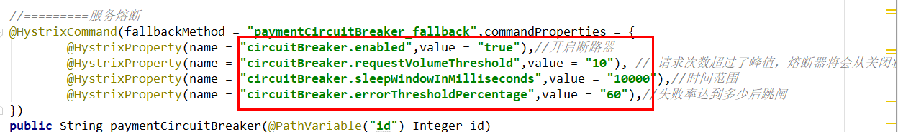
   - 涉及到断路器的三个重要参数：快照时间窗、请求总数阀值、错误百分比阀值。
      - 快照时间窗：断路器确定是否打开需要统计一些请求和错误数据，而统计的时间范围就是快照时间窗，默认为最近的10秒。
      - 请求总数阀值：在快照时间窗内，必须满足请求总数阀值才有资格熔断。默认为20，意味着在10秒内，如果该hystrix命令的调用次数不足20次，即使所有的请求都超时或其他原因失败，断路器都不会打开。
      - 错误百分比阀值：当请求总数在快照时间窗内超过了阀值，比如发生了30次调用，如果在这30次调用中，有15次发生了超时异常，也就是超过50%的错误百分比，在默认设定50%阀值情况下，这时候就会将断路器打开。
- 断路器开启或者关闭的条件
   - 当满足一定的阀值的时候（默认10秒内超过20个请求次数）
   - 当失败率达到一定的时候（默认10秒内超过50%的请求失败）
   - 到达以上阀值，断路器将会开启
   - 当开启的时候，所有请求都不会进行转发
   - 一段时间之后（默认是5秒），这个时候断路器是半开状态，会让其中一个请求进行转发。 如果成功，断路器会关闭，若失败，继续开启。重复4和5
- 断路器打开之后
   - 再有请求调用的时候，将不会调用主逻辑，而是直接调用降级fallback。通过断路器，实现了自动地发现错误并将降级逻辑切换为主逻辑，减少响应延迟的效果。
   - 对主逻辑进行熔断之后，hystrix会启动一个休眠时间窗，在这个时间窗内，降级逻辑是临时的成为主逻辑，当休眠时间窗到期，断路器将进入半开状态，释放一次请求到原来的主逻辑上，如果此次请求正常返回，那么断路器将继续闭合，主逻辑恢复，如果这次请求依然有问题，断路器继续进入打开状态，休眠时间窗重新计时。
- All配置
```java
//========================All
@HystrixCommand(fallbackMethod = "str_fallbackMethod",
        groupKey = "strGroupCommand",
        commandKey = "strCommand",
        threadPoolKey = "strThreadPool",
        commandProperties = {
                // 设置隔离策略，THREAD 表示线程池 SEMAPHORE：信号池隔离
                @HystrixProperty(name = "execution.isolation.strategy", value = "THREAD"),
                // 当隔离策略选择信号池隔离的时候，用来设置信号池的大小（最大并发数）
                @HystrixProperty(name = "execution.isolation.semaphore.maxConcurrentRequests", value = "10"),
                // 配置命令执行的超时时间
                @HystrixProperty(name = "execution.isolation.thread.timeoutinMilliseconds", value = "10"),
                // 是否启用超时时间
                @HystrixProperty(name = "execution.timeout.enabled", value = "true"),
                // 执行超时的时候是否中断
                @HystrixProperty(name = "execution.isolation.thread.interruptOnTimeout", value = "true"),
                // 执行被取消的时候是否中断
                @HystrixProperty(name = "execution.isolation.thread.interruptOnCancel", value = "true"),
                // 允许回调方法执行的最大并发数
                @HystrixProperty(name = "fallback.isolation.semaphore.maxConcurrentRequests", value = "10"),
                // 服务降级是否启用，是否执行回调函数
                @HystrixProperty(name = "fallback.enabled", value = "true"),
                // 是否启用断路器
                @HystrixProperty(name = "circuitBreaker.enabled", value = "true"),
                // 该属性用来设置在滚动时间窗中，断路器熔断的最小请求数。例如，默认该值为 20 的时候，
                // 如果滚动时间窗（默认10秒）内仅收到了19个请求， 即使这19个请求都失败了，断路器也不会打开。
                @HystrixProperty(name = "circuitBreaker.requestVolumeThreshold", value = "20"),
                // 该属性用来设置在滚动时间窗中，表示在滚动时间窗中，在请求数量超过
                // circuitBreaker.requestVolumeThreshold 的情况下，如果错误请求数的百分比超过50,
                // 就把断路器设置为 "打开" 状态，否则就设置为 "关闭" 状态。
                @HystrixProperty(name = "circuitBreaker.errorThresholdPercentage", value = "50"),
                // 该属性用来设置当断路器打开之后的休眠时间窗。 休眠时间窗结束之后，
                // 会将断路器置为 "半开" 状态，尝试熔断的请求命令，如果依然失败就将断路器继续设置为 "打开" 状态，
                // 如果成功就设置为 "关闭" 状态。
                @HystrixProperty(name = "circuitBreaker.sleepWindowinMilliseconds", value = "5000"),
                // 断路器强制打开
                @HystrixProperty(name = "circuitBreaker.forceOpen", value = "false"),
                // 断路器强制关闭
                @HystrixProperty(name = "circuitBreaker.forceClosed", value = "false"),
                // 滚动时间窗设置，该时间用于断路器判断健康度时需要收集信息的持续时间
                @HystrixProperty(name = "metrics.rollingStats.timeinMilliseconds", value = "10000"),
                // 该属性用来设置滚动时间窗统计指标信息时划分"桶"的数量，断路器在收集指标信息的时候会根据
                // 设置的时间窗长度拆分成多个 "桶" 来累计各度量值，每个"桶"记录了一段时间内的采集指标。
                // 比如 10 秒内拆分成 10 个"桶"收集这样，所以 timeinMilliseconds 必须能被 numBuckets 整除。否则会抛异常
                @HystrixProperty(name = "metrics.rollingStats.numBuckets", value = "10"),
                // 该属性用来设置对命令执行的延迟是否使用百分位数来跟踪和计算。如果设置为 false, 那么所有的概要统计都将返回 -1。
                @HystrixProperty(name = "metrics.rollingPercentile.enabled", value = "false"),
                // 该属性用来设置百分位统计的滚动窗口的持续时间，单位为毫秒。
                @HystrixProperty(name = "metrics.rollingPercentile.timeInMilliseconds", value = "60000"),
                // 该属性用来设置百分位统计滚动窗口中使用 “ 桶 ”的数量。
                @HystrixProperty(name = "metrics.rollingPercentile.numBuckets", value = "60000"),
                // 该属性用来设置在执行过程中每个 “桶” 中保留的最大执行次数。如果在滚动时间窗内发生超过该设定值的执行次数，
                // 就从最初的位置开始重写。例如，将该值设置为100, 滚动窗口为10秒，若在10秒内一个 “桶 ”中发生了500次执行，
                // 那么该 “桶” 中只保留 最后的100次执行的统计。另外，增加该值的大小将会增加内存量的消耗，并增加排序百分位数所需的计算时间。
                @HystrixProperty(name = "metrics.rollingPercentile.bucketSize", value = "100"),
                // 该属性用来设置采集影响断路器状态的健康快照（请求的成功、 错误百分比）的间隔等待时间。
                @HystrixProperty(name = "metrics.healthSnapshot.intervalinMilliseconds", value = "500"),
                // 是否开启请求缓存
                @HystrixProperty(name = "requestCache.enabled", value = "true"),
                // HystrixCommand的执行和事件是否打印日志到 HystrixRequestLog 中
                @HystrixProperty(name = "requestLog.enabled", value = "true"),
        },
        threadPoolProperties = {
                // 该参数用来设置执行命令线程池的核心线程数，该值也就是命令执行的最大并发量
                @HystrixProperty(name = "coreSize", value = "10"),
                // 该参数用来设置线程池的最大队列大小。当设置为 -1 时，线程池将使用 SynchronousQueue 实现的队列，
                // 否则将使用 LinkedBlockingQueue 实现的队列。
                @HystrixProperty(name = "maxQueueSize", value = "-1"),
                // 该参数用来为队列设置拒绝阈值。 通过该参数， 即使队列没有达到最大值也能拒绝请求。
                // 该参数主要是对 LinkedBlockingQueue 队列的补充,因为 LinkedBlockingQueue
                // 队列不能动态修改它的对象大小，而通过该属性就可以调整拒绝请求的队列大小了。
                @HystrixProperty(name = "queueSizeRejectionThreshold", value = "5"),
        }
)
public String strConsumer() {
    return "hello 2020";
}
public String str_fallbackMethod()
{
    return "*****fall back str_fallbackMethod";
}
```
## 8、服务限流
后面高级篇讲解alibaba的Sentinel说明
## 9、hystrix工作流程
[https://github.com/Netflix/Hystrix/wiki/How-it-Works](https://github.com/Netflix/Hystrix/wiki/How-it-Works)
### 9.1、官网图例

### 9.2、步骤说明
| ** 1 ** | 创建 HystrixCommand（用在依赖的服务返回单个操作结果的时候） 或 HystrixObserableCommand（用在依赖的服务返回多个操作结果的时候） 对象。 |
| ------- | ------------------------------------------------------------ |
| 2       | 命令执行。其中 HystrixComand 实现了下面前两种执行方式；而 HystrixObservableCommand 实现了后两种执行方式：execute()：同步执行，从依赖的服务返回一个单一的结果对象， 或是在发生错误的时候抛出异常。queue()：异步执行， 直接返回 一个Future对象， 其中包含了服务执行结束时要返回的单一结果对象。observe()：返回 Observable 对象，它代表了操作的多个结果，它是一个 Hot Obserable（不论 "事件源" 是否有 "订阅者"，都会在创建后对事件进行发布，所以对于 Hot Observable 的每一个 "订阅者" 都有可能是从 "事件源" 的中途开始的，并可能只是看到了整个操作的局部过程）。toObservable()： 同样会返回 Observable 对象，也代表了操作的多个结果，但它返回的是一个Cold Observable（没有 "订阅者" 的时候并不会发布事件，而是进行等待，直到有 "订阅者" 之后才发布事件，所以对于 Cold Observable 的订阅者，它可以保证从一开始看到整个操作的全部过程）。 |
| 3       | 若当前命令的请求缓存功能是被启用的， 并且该命令缓存命中， 那么缓存的结果会立即以 Observable 对象的形式返回。 |
| 4       | 检查断路器是否为打开状态。如果断路器是打开的，那么Hystrix不会执行命令，而是转接到 fallback 处理逻辑（第 8 步）；如果断路器是关闭的，检查是否有可用资源来执行命令（第 5 步）。 |
| 5       | 线程池/请求队列/信号量是否占满。如果命令依赖服务的专有线程池和请求队列，或者信号量（不使用线程池的时候）已经被占满， 那么 Hystrix 也不会执行命令， 而是转接到 fallback 处理逻辑（第8步）。 |
| 6       | Hystrix 会根据我们编写的方法来决定采取什么样的方式去请求依赖服务。HystrixCommand.run() ：返回一个单一的结果，或者抛出异常。HystrixObservableCommand.construct()： 返回一个Observable 对象来发射多个结果，或通过 onError 发送错误通知。 |
| 7       | Hystrix会将 "成功"、"失败"、"拒绝"、"超时" 等信息报告给断路器， 而断路器会维护一组计数器来统计这些数据。断路器会使用这些统计数据来决定是否要将断路器打开，来对某个依赖服务的请求进行 "熔断/短路"。 |
| 8       | 当命令执行失败的时候， Hystrix 会进入 fallback 尝试回退处理， 我们通常也称该操作为 "服务降级"。而能够引起服务降级处理的情况有下面几种：第4步： 当前命令处于"熔断/短路"状态，断路器是打开的时候。第5步： 当前命令的线程池、 请求队列或 者信号量被占满的时候。第6步：HystrixObservableCommand.construct() 或 HystrixCommand.run() 抛出异常的时候。 |
| 9       | 当Hystrix命令执行成功之后， 它会将处理结果直接返回或是以Observable 的形式返回。 |

> 如果我们没有为命令实现降级逻辑或者在降级处理逻辑中抛出了异常， Hystrix 依然会返回一个 Observable 对象， 但是它不会发射任何结果数据， 而是通过 onError 方法通知命令立即中断请求，并通过onError()方法将引起命令失败的异常发送给调用者。

## 10、服务监控hystrixDashboard
[https://www.jianshu.com/p/ba9716464e37](https://www.jianshu.com/p/ba9716464e37)
### 10.1、概述
除了隔离依赖服务的调用以外，Hystrix还提供了准实时的调用监控（Hystrix Dashboard），Hystrix会持续地记录所有通过Hystrix发起的请求的执行信息，并以统计报表和图形的形式展示给用户，包括每秒执行多少请求多少成功，多少失败等。Netflix通过hystrix-metrics-event-stream项目实现了对以上指标的监控。Spring Cloud也提供了Hystrix Dashboard的整合，对监控内容转化成可视化界面。
### 10.2、仪表盘9001
#### 10.2.1、建module
新建cloud-consumer-hystrix-dashboard9001
#### 10.2.2、POM
```xml
<?xml version="1.0" encoding="UTF-8"?>
<project xmlns="http://maven.apache.org/POM/4.0.0"
         xmlns:xsi="http://www.w3.org/2001/XMLSchema-instance"
         xsi:schemaLocation="http://maven.apache.org/POM/4.0.0 http://maven.apache.org/xsd/maven-4.0.0.xsd">
    <parent>
        <artifactId>mscloud</artifactId>
        <groupId>com.renchao.springcloud</groupId>
        <version>1.0-SNAPSHOT</version>
    </parent>
    <modelVersion>4.0.0</modelVersion>

    <artifactId>cloud-consumer-hystrix-dashboard9001</artifactId>


    <dependencies>
        <dependency>
            <groupId>org.springframework.cloud</groupId>
            <artifactId>spring-cloud-starter-netflix-hystrix-dashboard</artifactId>
        </dependency>
        <dependency>
            <groupId>org.springframework.boot</groupId>
            <artifactId>spring-boot-starter-actuator</artifactId>
        </dependency>
        <dependency>
            <groupId>org.springframework.boot</groupId>
            <artifactId>spring-boot-devtools</artifactId>
            <scope>runtime</scope>
            <optional>true</optional>
        </dependency>
        <dependency>
            <groupId>org.projectlombok</groupId>
            <artifactId>lombok</artifactId>
            <optional>true</optional>
        </dependency>
        <dependency>
            <groupId>org.springframework.boot</groupId>
            <artifactId>spring-boot-starter-test</artifactId>
            <scope>test</scope>
        </dependency>
    </dependencies>

</project>
```
#### 10.2.3、YML
```yaml
server:
  port: 9001
```
#### 10.2.4、主启动
注解@EnableHystrixDashboard
```java
@SpringBootApplication
@EnableHystrixDashboard
public class HystrixDashboardMain9001 {
    public static void main(String[] args) {
        SpringApplication.run(HystrixDashboardMain9001.class, args);
    }
}
```
#### 10.2.5、Provider微服务配置
所有Provider微服务提供类(8001/8002/8003)都需要下面的监控依赖
```java
<dependency>
    <groupId>org.springframework.boot</groupId>
    <artifactId>spring-boot-starter-actuator</artifactId>
</dependency>
```
新版本Hystrix需要在主启动类MainAppHystrix8001中指定监控路径。
不然会报 Unable to connect to Command Metric Stream。404 错误。
有两种方式，选一种：

- yml中配置（推荐）
```yaml
management:
  endpoints:
    web:
      exposure:
        include: hystrix.stream
      base-path: /
```

- 主配置类中配置
```java
/*
 *此配置是为了服务监控而配置，与服务容错本身无关，springCloud升级后的坑
 *ServletRegistrationBean因为springboot的默认路径不是"/hystrix.stream"，
 *只要在自己的项目里配置上下面的servlet就可以了
 */
@Bean
public ServletRegistrationBean getServlet() {
    HystrixMetricsStreamServlet streamServlet = new HystrixMetricsStreamServlet();
    ServletRegistrationBean registrationBean = new ServletRegistrationBean(streamServlet);
    registrationBean.setLoadOnStartup(1);
    registrationBean.addUrlMappings("/hystrix.stream");
    registrationBean.setName("HystrixMetricsStreamServlet");
    return registrationBean;
}
```
#### 10.2.6、启动仪表盘9001
启动cloud-consumer-hystrix-dashboard9001该微服务后续将监控微服务8001
[http://localhost:9001/hystrix](http://localhost:9001/hystrix)
#### 10.2.7、监控测试

- 启动1个eureka或者3个eureka集群均可
- 9001监控8001
   - 填写监控地址
   - [http://localhost:8001/hystrix.stream](http://localhost:8001/hystrix.stream)
   - 
- 测试地址
   - [http://localhost:8001/payment/circuit/31](http://localhost:8001/payment/circuit/31)
   - [http://localhost:8001/payment/circuit/-31](http://localhost:8001/payment/circuit/-31)

先访问正确地址，再访问错误地址，再正确地址，会发现图示断路器都是慢慢放开的。

- 监控结果，成功
   - 
- 监控结果，失败
   - 
### 10.3、使用说明
#### 10.3.1、七色
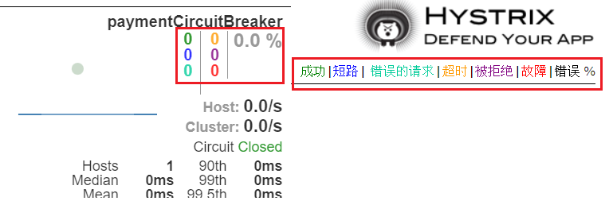 
#### 10.3.2、一圈
实心圆：共有两种含义。它通过颜色的变化代表了实例的健康程度，它的健康度从**绿色** < **黄色** < **橙色** < **红色** 递减。
该实心圆除了颜色的变化之外，它的大小也会根据实例的请求流量发生变化，流量越大该实心圆就越大。所以通过该实心圆的展示，就可以在大量的实例中快速的发现故障实例和高压力实例。
#### 10.3.3、一线
曲线：用来记录2分钟内流量的相对变化，可以通过它来观察到流量的上升和下降趋势。
#### 10.3.4、整图说明

#### 10.3.5、整图说明2
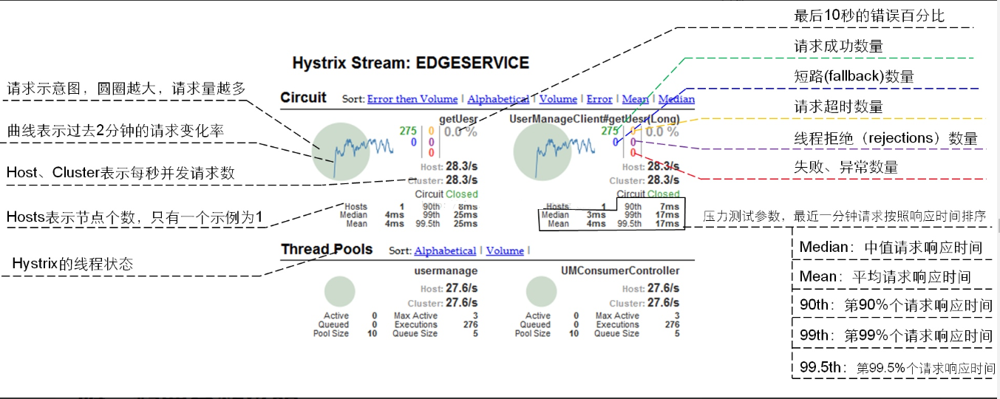
#### 10.3.6、复杂


# 第十一章、zuul路由网关
## 1、概述简介

网关的作用是：

- 将客户端请求与服务端应用相分离，通过定义的路由和断言进行转发。
- 将各个服务对外提供的API汇聚起来，让外界看起来是一个统一的接口。
- 在网关中提供额外的功能，如日志拦截、权限控制、解决跨域问题、限流、熔断、负载均衡等。
- 隐藏服务端的IP，防止直接访问。

### 1.1、官网资料
[https://github.com/Netflix/zuul/wiki/Getting-Started](https://github.com/Netflix/zuul/wiki/Getting-Started)
[https://cloud.spring.io/spring-cloud-static/spring-cloud-netflix/2.2.1.RELEASE/reference/html/#router-and-filter-zuul](https://cloud.spring.io/spring-cloud-static/spring-cloud-netflix/2.2.1.RELEASE/reference/html/#router-and-filter-zuul)
### 1.2、是什么
Zuul是一种提供动态路由、监视、弹性、安全性等功能的边缘服务。
Zuul是Netflix出品的一个基于JVM路由和服务端的负载均衡器。
API网关为微服务架构中的服务提供了统一的访问入口，客户端通过API网关访问相关服务。API网关的定义类似于设计模式中的门面模式，它相当于整个微服务架构中的门面，所有客户端的访问都通过它来进行路由及过滤。它实现了请求路由、负载均衡、校验过滤、服务容错、服务聚合等功能。


### 1.3、能干嘛

- 路由
- 过滤
- 负载均衡
   - 网关会获取微服务注册中心里面的服务连接地址，再配合一些算法选择其中一个服务地址，进行处理业务。
   - 这个属于客户端侧的负载均衡，由调用方去实现负载均衡逻辑。
   - 
- 灰度发布
   - 又称金丝雀发布
   - 
## 2、路由基本配置
> 路由功能负责将外部请求转发到具体的服务实例上去，是实现统一访问入口的基础

### 2.1、建Module
新建Module模块cloud-zuul-gateway9527
### 2.2、POM
```xml
<?xml version="1.0" encoding="UTF-8"?>
<project xmlns="http://maven.apache.org/POM/4.0.0"
         xmlns:xsi="http://www.w3.org/2001/XMLSchema-instance"
         xsi:schemaLocation="http://maven.apache.org/POM/4.0.0 http://maven.apache.org/xsd/maven-4.0.0.xsd">
    <parent>
        <artifactId>mscloud</artifactId>
        <groupId>com.renchao.springcloud</groupId>
        <version>1.0-SNAPSHOT</version>
    </parent>
    <modelVersion>4.0.0</modelVersion>

    <artifactId>cloud-zuul-gateway9527</artifactId>


    <dependencies>
        <dependency>
            <groupId>org.springframework.cloud</groupId>
            <artifactId>spring-cloud-starter-netflix-eureka-client</artifactId>
        </dependency>
        <dependency>
            <groupId>org.springframework.cloud</groupId>
            <artifactId>spring-cloud-starter-netflix-zuul</artifactId>
        </dependency>
        <dependency>
            <groupId>org.springframework.boot</groupId>
            <artifactId>spring-boot-devtools</artifactId>
            <scope>runtime</scope>
            <optional>true</optional>
        </dependency>
        <dependency>
            <groupId>org.projectlombok</groupId>
            <artifactId>lombok</artifactId>
            <optional>true</optional>
        </dependency>
        <dependency>
            <groupId>org.springframework.boot</groupId>
            <artifactId>spring-boot-starter-test</artifactId>
            <scope>test</scope>
        </dependency>
    </dependencies>

</project>
```
### 2.3、YML
```yaml
server:
  port: 9527

spring:
  application:
    name: cloud-zuul-gateway

eureka:
  client:
    service-url:
      #defaultZone: http://eureka7001.com:7001/eureka,http://eureka7002.com:7002/eureka,http://eureka7003.com:7003/eureka
      defaultZone: http://eureka1.com:7001/eureka
  instance:
    instance-id: gateway-9527.com
    prefer-ip-address: true
```
### 2.4、主启动类
@EnableZuulProxy 开启Zuul
```java
@SpringBootApplication
@EnableZuulProxy
public class ZuulStartSpringCloudApp9527 {
    public static void main(String[] args) {
        SpringApplication.run(ZuulStartSpringCloudApp9527.class, args);
    }
}
```
### 2.5、启动

- 一个eureka集群
- 一个服务提供类cloud-provider-payment8001
- 一个路由Zuul
### 2.6、测试

- 不用路由
   - [http://localhost:8001/payment/2](http://localhost:8001/payment/2)
- 启用路由
   - zuul映射配置+注册中心注册后对外暴露的服务名称+rest调用地址
   - [http://localhost:9527/cloud-payment-service/payment/2](http://localhost:9527/cloud-payment-service/payment/2)
## 3、路由访问映射规则
### 3.1、代理名称
#### 3.1.1、YML配置
```yaml
zuul:
  routes: # 路由映射配置
    mypayment:  # 名称自定义
      path: /cps/**  # IE地址栏输入的路径
      serviceId: cloud-payment-service  # 注册到注册中心的微服务名称
      
    # 下面这种配置方式与上面的效果是一样的，前面是微服务名称，后面是访问路径
    cloud-payment-service: /cps2/**
```
#### 2.1.2、测试

- 路由访问OK
   - [http://localhost:9527/cloud-payment-service/payment/2](http://localhost:9527/cloud-payment-service/payment/2)
- 原路径访问OK
   - [http://localhost:9527/cps/payment/2](http://localhost:9527/cps/payment/2)
### 3.2、忽略原服务名
YML加入下面配置
```yaml
zuul:
  ignored-services: cloud-payment-service
```

- 上面配置后，cloud-payment-service就不能访问了。
- 单个具体，多个可以用 `*`
### 3.3、路由转发和负载均衡功能
由于Zuul自动集成了Ribbon和Hystrix，所以Zuul天生就有负载均衡和服务容错能力

- 只有8001一个服务时，是路由转发。
- 如果同时启动8001和8002时，有负载均衡功能。
### 3.4、设置统一公共前缀
加入下面配置
```yaml
zuul: 
  prefix: /renchao
```
[http://localhost:9527/renchao/cps/payment/2](http://localhost:9527/renchao/cps/payment/2)
## 4、过滤器
### 4.1、介绍
过滤功能负责对请求过程进行额外的处理，是请求校验过滤及服务聚合的基础。
过滤器的生命周期
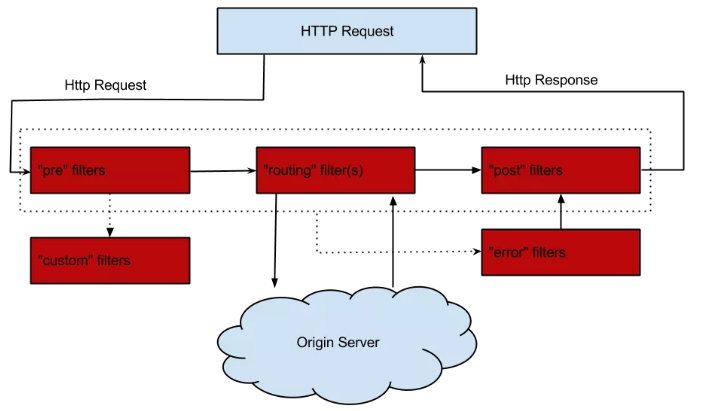
### 4.2、ZuulFilter
#### 4.2.1、过滤类型

- **pre：**在请求被路由到目标服务前执行，比如权限校验、打印日志等功能；
- **routing：**在请求被路由到目标服务时执行
- **post：**在请求被路由到目标服务后执行，比如给目标服务的响应添加头信息，收集统计数据等功能；
- **error：**请求在其他阶段发生错误时执行。
#### 4.2.2、过滤顺序
数字小的先执行
#### 4.2.3、过滤是否开启
shouldFilter方法为true走
#### 4.2.4、执行逻辑
自己的业务逻辑
### 4.3、案例
前置过滤器，用于在请求路由到目标服务前打印请求日志。
#### 4.3.1、业务代码
```java
@Component
@Slf4j
public class PreLogFilter extends ZuulFilter {
    @Override
    public String filterType() {
        return FilterConstants.PRE_TYPE;
    }

    @Override
    public int filterOrder() {
        return 0;
    }

    @Override
    public boolean shouldFilter() {
        return false;
    }

    @Override
    public Object run() throws ZuulException {
        RequestContext requestContext = RequestContext.getCurrentContext();
        HttpServletRequest request = requestContext.getRequest();
        String host = request.getRemoteHost();
        String method = request.getMethod();
        String uri = request.getRequestURI();
        log.info("=====> Remote host:{},method:{},uri:{}", host, method, uri);
        System.out.println("********"+new Date().getTime());

        return null;
    }
}
```
#### 4.3.2、方法说明

- **filterType：**返回过滤器的类型。有pre、route、post、error等几种取值，分别对应上文的几种过滤器。
   - 详细可以参考com.netflix.zuul.ZuulFilter.filterType() 中的注释。
- **filterOrder：**返回一个int值来指定过滤器的执行顺序，不同的过滤器允许返回相同的数字。
- **shouldFilter：**返回一个boolean值来判断该过滤器是否要执行，true表示执行, false表示不执行。
- **run：**过滤器的具体逻辑。
## 5、查看端点信息
### 5.1、介绍
当@EnableZuulProxy与Spring Boot Actuator配合使用时,Zuul会暴露两个端点：

- /actuator/routes
- /actuator/filters
### 5.2、开启
> spring-cloud-starter-netflix-zuul已经包含了spring-boot-starter-actuator，因此不需再次引入

```yaml
# 暴露端点
management:
  endpoints:
    web:
      exposure:
        include: '*'
```
### 5.3、查看

- 访问：http://localhost:9527/actuator/routes 可以查看路由设置
- 访问：http://localhost:9527/actuator/filters 可以查看过滤器端点
> 从SpringCloud Edgware版本开始，Zuul提供了filters端点

# 第十二章、Gateway新一代网关
## 1、概述简介
[https://blog.csdn.net/rain_web/article/details/102469745](https://blog.csdn.net/rain_web/article/details/102469745)
### 1.1、官网

- 上一代zuul 1.X
   - [https://github.com/Netflix/zuul/wiki](https://github.com/Netflix/zuul/wiki)
- 当前gateway
   - [https://cloud.spring.io/spring-cloud-static/spring-cloud-gateway/2.2.1.RELEASE/reference/html/](https://cloud.spring.io/spring-cloud-static/spring-cloud-gateway/2.2.1.RELEASE/reference/html/)
### 1.2、是什么
Gateway是在Spring生态系统之上构建的API网关服务，基于Spring 5，Spring Boot 2和 Project Reactor等技术。
Gateway旨在提供一种简单而有效的方式来对API进行路由，以及提供一些强大的过滤器功能， 例如：熔断、限流、重试等。
SpringCloud Gateway 使用的Webflux中的reactor-netty响应式编程组件，底层使用了Netty通讯框架。

### 1.3、能干嘛

- 反向代理
- 鉴权
- 流量控制
- 熔断
- 日志监控
- 。。。。。。
### 1.4、架构中网关位置

### 1.5、为什么选择Gateway
#### 1.5.1、neflix不靠谱
因为Zuul1.0已经进入了维护阶段，而且Gateway是SpringCloud团队研发的，是亲儿子产品，值得信赖。
Gateway是基于异步非阻塞模型上进行开发的，性能方面不需要担心。虽然Netflix早就发布了最新的 Zuul 2.x，但 Spring Cloud 貌似没有整合计划。而且Netflix相关组件都宣布进入维护期；不知前景如何。
多方面综合考虑Gateway是很理想的网关选择。
#### 1.5.2、Gateway特性

- 基于Spring Framework 5, Project Reactor 和 Spring Boot 2.0 进行构建；
- 动态路由：能够匹配任何请求属性；
- 可以对路由指定 Predicate（断言）和 Filter（过滤器）；
- 集成Hystrix的断路器功能；
- 集成 Spring Cloud 服务发现功能；
- 易于编写的 Predicate（断言）和 Filter（过滤器）；
- 请求限流功能；
- 支持路径重写。
#### 1.5.3、Gateway 与 Zuul 区别
在SpringCloud Finchley 正式版之前，Spring Cloud 推荐的网关是 Netflix 提供的Zuul：

- Zuul 1.x，
   - 是一个基于阻塞 I/ O 的 API 网关。
   - Zuul 1.x 基于Servlet 2. 5使用阻塞架构它不支持任何长连接(如 WebSocket) Zuul 的设计模式和Nginx较像，每次 I/ O 操作都是从工作线程中选择一个执行，请求线程被阻塞到工作线程完成，但是差别是Nginx 用C++ 实现，Zuul 用 Java 实现，而 JVM 本身会有第一次加载较慢的情况，使得Zuul 的性能相对较差。
   - Zuul 2.x理念更先进，想基于Netty非阻塞和支持长连接，但SpringCloud目前还没有整合。 Zuul 2.x的性能较 Zuul 1.x 有较大提升。在性能方面，根据官方提供的基准测试， Spring Cloud Gateway 的 RPS（每秒请求数）是Zuul 的 1. 6 倍。
- Spring Cloud Gateway
   - 建立 在 Spring Framework 5、 Project Reactor 和 Spring Boot 2 之上， 使用非阻塞 API。
   - 还 支持 WebSocket， 并且与Spring紧密集成拥有更好的开发体验
## 2、三大核心概念
### 2.1、Route(路由)
路由是构建网关的基本模块，它由ID，目标URI，一系列的断言和过滤器组成，如果断言为true则匹配该路由。
### 2.2、Predicate(断言)
参考的是Java8的java.util.function.Predicate 开发人员可以匹配HTTP请求中的所有内容(例如请求头或请求参数)，如果请求与断言相匹配则进行路由
### 2.3、Filter(过滤)
指的是Spring框架中GatewayFilter的实例，使用过滤器，可以在请求被路由前或者之后对请求进行修改。
### 2.4、总体
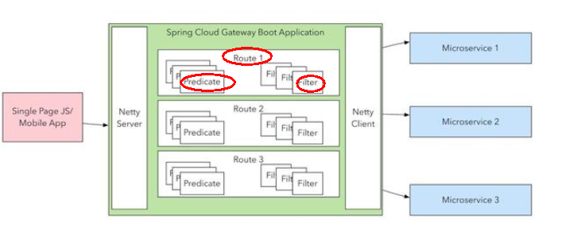
Web请求，通过一些匹配条件，定位到真正的服务节点。并在这个转发过程的前后，进行一些精细化控制。

- predicate就是我们的匹配条件；
- filter，就可以理解为一个无所不能的拦截器。
- 有了这两个元素，再加上目标uri，就可以实现一个具体的路由了。
## 3、Gateway工作流程
### 3.1、官网总结

客户端向 Spring Cloud Gateway 发出请求。然后在 Gateway Handler Mapping 中找到与请求相匹配的路由，将其发送到 Gateway Web Handler。
Handler 再通过指定的过滤器链来将请求发送到我们实际的服务执行业务逻辑，然后返回。
过滤器之间用虚线分开是因为过滤器可能会在发送代理请求之前（“pre”）或之后（“post”）执行业务逻辑。
Filter在“pre”类型的过滤器可以做参数校验、权限校验、流量监控、日志输出、协议转换等。
在“post”类型的过滤器中可以做响应内容、响应头的修改，日志的输出，流量监控等有着非常重要的作用。
### 3.2、核心逻辑
路由转发+执行过滤器链。
## 4、入门配置
### 4.1、建Module
新建cloud-gateway-gateway9527
### 4.2、POM
```xml
<?xml version="1.0" encoding="UTF-8"?>
<project xmlns="http://maven.apache.org/POM/4.0.0"
         xmlns:xsi="http://www.w3.org/2001/XMLSchema-instance"
         xsi:schemaLocation="http://maven.apache.org/POM/4.0.0 http://maven.apache.org/xsd/maven-4.0.0.xsd">
    <parent>
        <artifactId>mscloud</artifactId>
        <groupId>com.renchao.springcloud</groupId>
        <version>1.0-SNAPSHOT</version>
    </parent>
    <modelVersion>4.0.0</modelVersion>

    <artifactId>cloud-gateway-gateway9527</artifactId>


    <dependencies>
        <!--gateway-->
        <dependency>
            <groupId>org.springframework.cloud</groupId>
            <artifactId>spring-cloud-starter-gateway</artifactId>
        </dependency>
        <!--eureka-client-->
        <dependency>
            <groupId>org.springframework.cloud</groupId>
            <artifactId>spring-cloud-starter-netflix-eureka-client</artifactId>
        </dependency>
        <!-- 引入自己定义的api通用包，可以使用Payment支付Entity -->
        <dependency>
            <groupId>com.renchao.springcloud</groupId>
            <artifactId>cloud-api-commons</artifactId>
            <version>${project.version}</version>
        </dependency>
        <!--一般基础配置类-->
        <dependency>
            <groupId>org.springframework.boot</groupId>
            <artifactId>spring-boot-devtools</artifactId>
            <scope>runtime</scope>
            <optional>true</optional>
        </dependency>
        <dependency>
            <groupId>org.projectlombok</groupId>
            <artifactId>lombok</artifactId>
            <optional>true</optional>
        </dependency>
        <dependency>
            <groupId>org.springframework.boot</groupId>
            <artifactId>spring-boot-starter-test</artifactId>
            <scope>test</scope>
        </dependency>
    </dependencies>

</project>
```
### 4.3、YML
```yaml
server:
  port: 9527

spring:
  application:
    name: cloud-gateway

eureka:
  instance:
    hostname: cloud-gateway-service
  client: #服务提供者provider注册进eureka服务列表内
    service-url:
      register-with-eureka: true
      fetch-registry: true
      defaultZone: http://eureka1.com:7001/eureka
```
### 4.4、主启动类
```java
@SpringBootApplication
@EnableEurekaClient
public class GateWayMain9527 {
    public static void main(String[] args) {
        SpringApplication.run(GateWayMain9527.class, args);
    }
}
```
### 4.4、配置网关（yml）
```yaml
spring:
  # 网关配置
  cloud:
    gateway:
      routes:
        - id: payment_routh #payment_route    #路由的ID，没有固定规则但要求唯一，建议配合服务名
          uri: http://localhost:8001          #匹配后提供服务的路由地址
          predicates:
            - Path=/payment/**         # 断言，路径相匹配的进行路由

        - id: payment_routh2 #payment_route    #路由的ID，没有固定规则但要求唯一，建议配合服务名
          uri: http://localhost:8001          #匹配后提供服务的路由地址
          predicates:
            - Path=/payment/lb/**         # 断言，路径相匹配的进行路由
```
### 4.5、测试

- 启动7001
- 启动8001
- 启动9527网关

访问说明

- 添加网关前
   - http://localhost:8001/payment/2
- 添加网关后
   - http://localhost:9527/payment/2

4.6、配置类配置网关
代码中注入RouteLocator的Bean
```java
@Configuration
public class GateWayConfig {
    @Bean
    public RouteLocator customRouteLocator(RouteLocatorBuilder builder) {
        RouteLocatorBuilder.Builder routes = builder.routes();
        routes.route("path_route1", r -> r.path("/guonei").uri("http://news.baidu.com/guonei")).build();
        return routes.build();
    }
    
    @Bean
    public RouteLocator customRouteLocator2(RouteLocatorBuilder builder) {
        RouteLocatorBuilder.Builder routes = builder.routes();
        routes.route("path_route2", r -> r.path("/guoji").uri("http://news.baidu.com/guoji")).build();
        return routes.build();
    }
}
```
## 5、动态路由
### 5.1、服务名为路径
#### 5.1.1、配置
以注册中心上微服务名为路径创建动态路由进行转发，从而实现动态路由的功能。
```yaml
spring:
  application:
    name: cloud-gateway
  # 网关配置
  cloud:
    gateway:
      discovery:
        locator:
          enabled: true #开启从注册中心动态创建路由的功能，利用微服务名进行路由
          lower-case-service-id: true # 服务名转小写，不然服务名必须要大写才能访问成功
```
#### 5.1.2、测试

- 启动：
   - eureka7001
   - 两个服务提供者8001/8002
   - 9527网关
- 访问
   - [http://localhost:9527/cloud-payment-service/payment/lb](http://localhost:9527/cloud-payment-service/payment/lb)
> 有负载均衡功能。

### 5.2、路由转发
#### 5.2.1、配置
需要注意的是uri的协议为lb，表示启用Gateway的负载均衡功能。
lb://serviceName是spring cloud gateway在微服务中自动为我们创建的负载均衡uri。
```yaml
spring:
  application:
    name: cloud-gateway
  # 网关配置
  cloud:
    gateway:
      routes:
        - id: payment_routh #payment_route    #路由的ID，没有固定规则但要求唯一，建议配合服务名
          uri: lb://cloud-payment-service          #匹配后提供服务的路由地址
          predicates:
            - Path=/payment/**         # 断言，路径相匹配的进行路由

        - id: payment_routh2 #payment_route    #路由的ID，没有固定规则但要求唯一，建议配合服务名
          uri: lb://cloud-payment-service          #匹配后提供服务的路由地址
          predicates:
            - Path=/payment/lb/**         # 断言，路径相匹配的进行路由
```
#### 5.2.2、测试
[http://localhost:9527/payment/lb](http://localhost:9527/payment/lb)
> 8001/8002两个端口切换

## 6、Predicate的使用
### 6.1、是什么

- 启动gateway9527
   - 
- Route Predicate Factories
   - 
### 6.2、常用Predicate
#### 6.2.1、After Route Predicate
匹配在指定日期时间之后发生的请求。
```yaml
spring:
  cloud:
    gateway:
      routes:
        - id: payment_routh #payment_route    #路由的ID，没有固定规则但要求唯一，建议配合服务名
          uri: lb://cloud-payment-service          #匹配后提供服务的路由地址
          predicates:
            - Path=/payment/**         # 断言，路径相匹配的进行路由
            - After=2022-06-18T10:31:03.685+08:00[Asia/Shanghai]
```
#### 6.2.2、Before Route Predicate
匹配在指定日期时间之前发生的请求。
```yaml
spring:
  cloud:
    gateway:
      routes:
        - id: payment_routh #payment_route    #路由的ID，没有固定规则但要求唯一，建议配合服务名
          uri: lb://cloud-payment-service          #匹配后提供服务的路由地址
          predicates:
            - Path=/payment/**         # 断言，路径相匹配的进行路由
            - Before=2022-06-18T10:31:03.685+08:00[Asia/Shanghai]
```
#### 6.2.3、Between Route Predicate
匹配在指定日期**时间段**发生的请求。
```yaml
spring:
  cloud:
    gateway:
      routes:
        - id: payment_routh #payment_route    #路由的ID，没有固定规则但要求唯一，建议配合服务名
          uri: lb://cloud-payment-service          #匹配后提供服务的路由地址
          predicates:
            - Path=/payment/**         # 断言，路径相匹配的进行路由
            - Between=2022-05-18T10:31:03.685+08:00[Asia/Shanghai], 2022-06-18T10:31:03.685+08:00[Asia/Shanghai]
```
#### 6.2.4、Cookie Route Predicate
有两个参数，cookie 名称和正则表达式。匹配具有给定名称且其值与正则表达式匹配的 cookie。
```yaml
spring:
  cloud:
    gateway:
      routes:
        - id: payment_routh #payment_route    #路由的ID，没有固定规则但要求唯一，建议配合服务名
          uri: lb://cloud-payment-service          #匹配后提供服务的路由地址
          predicates:
            - Path=/payment/**         # 断言，路径相匹配的进行路由
            - Cookie=chocolate, \d+   # 断言，匹配整数
```

- 使用curl带上cookies访问：
   - curl http://localhost:9527/payment/lb --cookie chocolate=azb
> 加入curl返回中文乱码【自己在win10上使用的时候，没有乱码】
> [https://blog.csdn.net/leedee/article/details/82685636](https://blog.csdn.net/leedee/article/details/82685636)

#### 6.2.5、Header Route Predicate
两个参数：一个是属性名称和一个正则表达式，这个属性值和正则表达式匹配则执行。
```yaml
spring:
  cloud:
    gateway:
      routes:
        - id: payment_routh #payment_route    #路由的ID，没有固定规则但要求唯一，建议配合服务名
          uri: lb://cloud-payment-service          #匹配后提供服务的路由地址
          predicates:
          - Path=/payment/**         # 断言，路径相匹配的进行路由
          - Header=X-Request-Id, \d+
```
#### 6.2.6、Host Route Predicate
Host Route Predicate 接收一组参数，一组匹配的域名列表，这个模板是一个 ant 分隔的模板，用.号作为分隔符。
它通过参数中的主机地址作为匹配规则。
```yaml
spring:
  cloud:
    gateway:
      routes:
        - id: payment_routh #payment_route    #路由的ID，没有固定规则但要求唯一，建议配合服务名
          uri: lb://cloud-payment-service          #匹配后提供服务的路由地址
          predicates:
          - Path=/payment/**         # 断言，路径相匹配的进行路由
          - Host=**.eureka1.com:9527,**.renchao.com:9527
```
#### 6.2.7、Method Route Predicate
匹配的 HTTP 方法。
```yaml
spring:
  cloud:
    gateway:
      routes:
        - id: payment_routh #payment_route    #路由的ID，没有固定规则但要求唯一，建议配合服务名
          uri: lb://cloud-payment-service          #匹配后提供服务的路由地址
          predicates:
          - Path=/payment/**         # 断言，路径相匹配的进行路由
          - Method=GET,POST
```
#### 6.2.8、Path Route Predicate
匹配uri
```yaml
      routes:
        - id: payment_routh #payment_route    #路由的ID，没有固定规则但要求唯一，建议配合服务名
          uri: lb://cloud-payment-service          #匹配后提供服务的路由地址
          predicates:
            - Path=/payment/**         # 断言，路径相匹配的进行路由
#            - Path=/payment/{se}         # 断言，路径相匹配的进行路由
```
#### 6.2.9、Query Route Predicate
匹配请求参数
两个参数，一个是属性名，一个为属性值，属性值可以是正则表达式。
```yaml
      routes:
        - id: payment_routh #payment_route    #路由的ID，没有固定规则但要求唯一，建议配合服务名
          uri: lb://cloud-payment-service          #匹配后提供服务的路由地址
          predicates:
            - Path=/payment/**         # 断言，路径相匹配的进行路由
            - Query=red
            #- Query=red, gree\d+
```
## 7、Filter使用
### 7.1、介绍
#### 7.1.1、是什么
路由过滤器可用于修改进入的HTTP请求和返回的HTTP响应，路由过滤器只能指定路由进行使用。
Spring Cloud Gateway 内置了多种路由过滤器，他们都由GatewayFilter的工厂类来产生。
#### 7.1.2、生命周期

- pre
- post
#### 7.1.3、种类

- GatewayFilter 
- GlobalFilter
### 7.2、常用GatewayFilter
[https://cloud.spring.io/spring-cloud-static/spring-cloud-gateway/2.2.1.RELEASE/reference/html/#gatewayfilter-factories](https://cloud.spring.io/spring-cloud-static/spring-cloud-gateway/2.2.1.RELEASE/reference/html/#gatewayfilter-factories)
### 7.3、自定义过滤器
自定义全局GlobalFilter
#### 7.3.1、两个接口
`implements GlobalFilter,Ordered`
#### 7.3.2、能干嘛

- 全局日志记录
- 统一网关鉴权
- 。。。。。。
#### 7.3.3、案例

- 代码
```java
@Component
public class MyLogGateWayFilter implements GlobalFilter, Ordered {
    @Override
    public Mono<Void> filter(ServerWebExchange exchange, GatewayFilterChain chain) {
        System.out.println("time:"+new Date()+"\t 执行了自定义的全局过滤器: "+"MyLogGateWayFilter"+"hello");
        
        String uname = exchange.getRequest().getQueryParams().getFirst("uname");
        if (uname == null) {
            System.out.println("****用户名为null，无法登录");
            exchange.getResponse().setStatusCode(HttpStatus.NOT_ACCEPTABLE);
            return exchange.getResponse().setComplete();
        }
        return chain.filter(exchange);
    }
    
    @Override
    public int getOrder() {
        return 0;
    }
}
```

- 测试
   - 正确
      - [http://localhost:9527/payment/lb?uname=z3](http://localhost:9527/payment/lb?uname=z3)
   - 错误
      - [http://localhost:9527/payment/lb](http://localhost:9527/payment/lb)
      - 因为没有参数uname
      - 无法正常使用转发
# 第十三章、Config 分布式配置中心
## 1、概述
官网：[https://cloud.spring.io/spring-cloud-static/spring-cloud-config/2.2.1.RELEASE/reference/html/](https://cloud.spring.io/spring-cloud-static/spring-cloud-config/2.2.1.RELEASE/reference/html/)
### 1.1、配置问题
微服务意味着要将单体应用中的业务拆分成一个个子服务，每个服务的粒度相对较小，因此系统中会出现大量的服务。由于每个服务都需要必要的配置信息才能运行，所以一套集中式的、动态的配置管理设施是必不可少的。
SpringCloud提供了ConfigServer来解决这个问题。
### 1.2、SpringCloud Config

SpringCloud Config为微服务架构中的微服务提供集中化的外部配置支持，配置服务器为各个不同微服务应用的所有环境提供了一个中心化的外部配置。
SpringCloud Config分为服务端和客户端两部分。

- 服务端也称为分布式配置中心，它是一个独立的微服务应用，用来连接配置服务器并为客户端提供获取配置信息，加密/解密信息等访问接口。
- 客户端则是通过指定的配置中心来管理应用资源，以及与业务相关的配置内容，并在启动的时候从配置中心获取和加载配置信息配置服务器默认采用git来存储配置信息，这样就有助于对环境配置进行版本管理，并且可以通过git客户端工具来方便的管理和访问配置内容。
### 1.3、功能

- 集中管理配置文件
- 不同环境不同配置，动态化的配置更新，分环境部署比如dev/test/prod/beta/release
- 运行期间动态调整配置，不再需要在每个服务部署的机器上编写配置文件，服务会向配置中心统一拉取配置自己的信息
- 当配置发生变动时，服务不需要重启即可感知到配置的变化并应用新的配置
- 将配置信息以REST接口的形式暴露
   - post、curl访问刷新均可......
### 1.4、与GitHub整合
由于SpringCloud Config默认使用Git来存储配置文件(也有其它方式,比如支持SVN和本地文件)， 但最推荐的还是Git，而且使用的是http/https访问的形式。
## 2、服务端配置
[https://blog.csdn.net/u010811939/article/details/100171060](https://blog.csdn.net/u010811939/article/details/100171060)
### 2.1、git仓库
#### 2.1.1、远程仓库
在GitHub或者Gitee上新建一个名为 springcloud-config 的新Repository。
#### 2.1.2、本地仓库

- 新建目录
   - E:\java\SpringCloud\config-git
- 初始化仓库
   - `git init`
- 本地仓库新建三个文件
   - config-dev.yml
   - config-prod.yml
   - config-test.yml
- 提交仓库
   - `git commit -am "first commit"`
- push 到远程仓库
   - `git remote add origin https://gitee.com/renchao05/springcloud-config.git`
   - `git push -u origin main`
### 2.2、Config服务
[https://blog.csdn.net/xgw1010/article/details/108112195](https://blog.csdn.net/xgw1010/article/details/108112195)
#### 2.2.1、建Module
新建Module模块cloud-config-center-3344 它即为Cloud的配置中心模块cloudConfig Center
#### 2.2.2、POM
```xml
<?xml version="1.0" encoding="UTF-8"?>
<project xmlns="http://maven.apache.org/POM/4.0.0"
         xmlns:xsi="http://www.w3.org/2001/XMLSchema-instance"
         xsi:schemaLocation="http://maven.apache.org/POM/4.0.0 http://maven.apache.org/xsd/maven-4.0.0.xsd">
    <parent>
        <artifactId>mscloud</artifactId>
        <groupId>com.renchao.springcloud</groupId>
        <version>1.0-SNAPSHOT</version>
    </parent>
    <modelVersion>4.0.0</modelVersion>
    <artifactId>cloud-config-center-3344</artifactId>
    
    <dependencies>
        <dependency>
            <groupId>org.springframework.cloud</groupId>
            <artifactId>spring-cloud-config-server</artifactId>
        </dependency>
        <dependency>
            <groupId>org.springframework.cloud</groupId>
            <artifactId>spring-cloud-starter-netflix-eureka-client</artifactId>
        </dependency>
        <dependency>
            <groupId>org.springframework.boot</groupId>
            <artifactId>spring-boot-starter-web</artifactId>
        </dependency>
      
        <dependency>
            <groupId>org.springframework.boot</groupId>
            <artifactId>spring-boot-devtools</artifactId>
            <scope>runtime</scope>
            <optional>true</optional>
        </dependency>
        <dependency>
            <groupId>org.projectlombok</groupId>
            <artifactId>lombok</artifactId>
            <optional>true</optional>
        </dependency>
        <dependency>
            <groupId>org.springframework.boot</groupId>
            <artifactId>spring-boot-starter-test</artifactId>
            <scope>test</scope>
        </dependency>
    </dependencies>
    
</project>
```
> spring-cloud-config-server 已经包含 spring-boot-starter-actuator
> 所以不需要添加 spring-boot-starter-actuator 依赖

#### 2.2.3、YML
```yaml
server:
  port: 3344

spring:
  application:
    name:  cloud-config-center # 注册进Eureka服务器的微服务名
  cloud:
    config:
      server:
        git:
          uri: https://gitee.com/renchao05/springcloud-config.git #GitHub上面的git仓库名字
          skipSslValidation: true #关闭ssl验证
          # 搜索目录
          search-paths:
            - springcloud-config
      # 读取分支
      label: main

#服务注册到eureka地址
eureka:
  client:
    service-url:
      defaultZone: http://localhost:7001/eureka
```
#### 2.2.4、主启动类
@EnableConfigServer 开启Config
```java
@SpringBootApplication
@EnableConfigServer
public class ConfigCenterMain3344 {
    public static void main(String[] args) {
        SpringApplication.run(ConfigCenterMain3344.class, args);
    }
}
```
#### 2.2.5、测试
测试通过Config微服务从GitHub上获取配置内容

- 启动7001注册中心
- 启动微服务3344
- 获取配置内容
   - http://localhost:3344/master/config-dev.yml
### 2.3、配置读取规则
官网

#### 2.3.1、/{label}/{application}-{profile}.yml

- master分支
   - [http://localhost:3344/master/config-dev.yml](http://localhost:3344/master/config-dev.yml)
   - [http://localhost:3344/master/config-test.yml](http://localhost:3344/master/config-test.yml)
   - [http://localhost:3344/master/config-prod.yml](http://localhost:3344/master/config-prod.yml)
- dev分支
   - [http://localhost:3344/dev/config-dev.yml](http://localhost:3344/dev/config-dev.yml)
   - [http://localhost:3344/dev/config-test.yml](http://localhost:3344/dev/config-test.yml)
   - [http://localhost:3344/dev/config-prod.yml](http://localhost:3344/dev/config-prod.yml)
#### 2.3.2、/{application}-{profile}.yml
[http://localhost:3344/config-dev.yml](http://localhost:3344/config-dev.yml)
[http://localhost:3344/config-test.yml](http://localhost:3344/config-test.yml)
[http://localhost:3344/config-prod.yml](http://localhost:3344/config-prod.yml)
[http://localhost:3344/config-xxxx.yml(](http://localhost:3344/config-xxxx.yml()不存在的配置)
#### 2.3.3、/{application}/{profile}[/{label}]
[http://localhost:3344/config/dev/master](http://localhost:3344/config/dev/master)
[http://localhost:3344/config/test/master](http://localhost:3344/config/test/master)
[http://localhost:3344/config/test/dev](http://localhost:3344/config/test/dev)
#### 2.3.4、配置细节

- label：分支(branch)
- application ：服务名
- profiles：环境(dev/test/prod)
## 3、客户端配置
### 3.1、建Module
新建cloud-config-client-3355
### 3.2、POM
```xml
<?xml version="1.0" encoding="UTF-8"?>
<project xmlns="http://maven.apache.org/POM/4.0.0"
         xmlns:xsi="http://www.w3.org/2001/XMLSchema-instance"
         xsi:schemaLocation="http://maven.apache.org/POM/4.0.0 http://maven.apache.org/xsd/maven-4.0.0.xsd">
    <parent>
        <artifactId>mscloud</artifactId>
        <groupId>com.renchao.springcloud</groupId>
        <version>1.0-SNAPSHOT</version>
    </parent>
    <modelVersion>4.0.0</modelVersion>
    <artifactId>cloud-config-client-3355</artifactId>
    
    <dependencies>
        <dependency>
            <groupId>org.springframework.cloud</groupId>
            <artifactId>spring-cloud-starter-config</artifactId>
        </dependency>
        <dependency>
            <groupId>org.springframework.cloud</groupId>
            <artifactId>spring-cloud-starter-netflix-eureka-client</artifactId>
        </dependency>
        <dependency>
            <groupId>org.springframework.boot</groupId>
            <artifactId>spring-boot-starter-web</artifactId>
        </dependency>
        <dependency>
            <groupId>org.springframework.boot</groupId>
            <artifactId>spring-boot-starter-actuator</artifactId>
        </dependency>

        <dependency>
            <groupId>org.springframework.boot</groupId>
            <artifactId>spring-boot-devtools</artifactId>
            <scope>runtime</scope>
            <optional>true</optional>
        </dependency>
        <dependency>
            <groupId>org.projectlombok</groupId>
            <artifactId>lombok</artifactId>
            <optional>true</optional>
        </dependency>
        <dependency>
            <groupId>org.springframework.boot</groupId>
            <artifactId>spring-boot-starter-test</artifactId>
            <scope>test</scope>
        </dependency>
    </dependencies>
    
</project>
```
### 3.3、bootstrap.yml
Spring Cloud会创建一个 Bootstrap Context ，作为Spring应用的 Application Context的父上下文。初始化的时候， Bootstrap Context 负责从外部源加载配置属性并解析配置。这两个上下文共享一个从外部获取的环境（Environment）。
Bootstrap 属性有高优先级，默认情况下，它们不会被本地配置覆盖。 Bootstrap context 和 Application Context 有着不同的约定，所以新增了一个 bootstrap.yml 文件，保证 Bootstrap Context 和 Application Context 配置的分离。
要将Client模块下的application.yml文件改为bootstrap.yml,这是很关键的，因为bootstrap.yml是比application.yml先加载的。

- applicaiton.yml是用户级的资源配置项。
- bootstrap.yml是系统级的，优先级更加高。
```yaml
server:
  port: 3355

spring:
  application:
    name: config-client
  cloud:
    #Config客户端配置
    config:
      label: master #分支名称
      name: config #配置文件名称
      profile: dev #读取后缀名称   上述3个综合：master分支上config-dev.yml的配置文件被读取http://localhost:3344/master/config-dev.yml
      uri: http://localhost:3344 #配置中心地址

#服务注册到eureka地址
eureka:
  client:
    service-url:
      defaultZone: http://localhost:7001/eureka
```
### 3.3、主启动
```java
@SpringBootApplication
@EnableEurekaClient
public class ConfigClientMain3355 {
    public static void main(String[] args) {
        SpringApplication.run(ConfigClientMain3355.class, args);
    }
}
```
### 3.4、业务类
```java
@RestController
public class ConfigClientController {

    @Value("${config.info}")
    private String configInfo;

    @GetMapping("/configInfo")
    public String getConfigInfo() {
        return configInfo;
    }
}
```
### 3.5、测试

- 启动注册中心7001
- 启动Config配置中心3344微服务并自测
   - [http://localhost:3344/master/config-prod.yml](http://localhost.com:3344/master/config-prod.yml)
   - [http://localhost:3344/master/config-dev.yml](http://localhost:3344/master/config-dev.yml)
- 启动3355作为Client准备访问
   - [http://localhost:3355/configInfo](http://localhost:3355/configInfo)
> 成功实现了客户端3355访问SpringCloud Config3344通过GitHub获取配置信息

### 3.6、刷新问题

- Linux运维修改GitHub上的配置文件内容做调整
- 刷新3344，发现ConfigServer配置中心立刻响应
- 刷新3355，发现ConfigClient客户端没有任何响应
   - 3355没有变化除非自己重启或者重新加载
## 4、客户端动态刷新
修改客户端3355模块
避免服务重启
### 4.1、修改POM
引入actuator监控
```xml
<dependency>
    <groupId>org.springframework.boot</groupId>
    <artifactId>spring-boot-starter-actuator</artifactId>
</dependency>
```
### 4.2、修改YML
暴露监控端口
```yaml
# 暴露监控端点
management:
  endpoints:
    web:
      exposure:
        include: "*"
```
### 4.3、业务类
修改 Controller 添加 @RefreshScope
```java
@RestController
@RefreshScope
public class ConfigClientController {

    @Value("${config.info}")
    private String configInfo;

    @GetMapping("/configInfo")
    public String getConfigInfo() {
        return configInfo;
    }
}
```
### 4.4、手动刷新
需要运维人员发送Post请求刷新3355

- POST请求
   - curl -X POST "http://localhost:3355/actuator/refresh"      
### 4.5、弊端问题

- 假如有多个微服务客户端3355/3366/3377。。。。。。
- 每个微服务都要执行一次post请求，手动刷新。
- 如果需要广播，参考下一章 Bus 消息总线。

# 第十四章、Bus 消息总线
## 1、概述
### 1.1、是什么
Spring Cloud Bus 配合 Spring Cloud Config 使用可以实现配置的动态刷新。
是用来将分布式系统的节点与轻量级消息系统链接起来的框架，它整合了Java的事件处理机制和消息中间件的功能。
> 目前支持RabbitMQ和Kafka。

### 1.2、能干嘛
Spring Cloud Bus能管理和传播分布式系统间的消息，就像一个分布式执行器，可用于广播状态更改、事件推送等，也可以当作微服务间的通信通道。

### 1.3、总线
什么是总线
在微服务架构的系统中，通常会使用轻量级的消息代理来构建一个共用的消息主题，并让系统中所有微服务实例都连接上来。由于该主题中产生的消息会被所有实例监听和消费，所以称它为消息总线。在总线上的各个实例，都可以方便地广播一些需要让其他连接在该主题上的实例都知道的消息。
基本原理
ConfigClient实例都监听MQ中同一个topic(默认是springCloudBus)。当一个服务刷新数据的时候，它会把这个信息放入到Topic中，这样其它监听同一Topic的服务就能得到通知，然后去更新自身的配置。
[https://www.bilibili.com/video/av55976700?from=search&seid=15010075915728605208](https://www.bilibili.com/video/av55976700?from=search&seid=15010075915728605208)
## 2、RabbitMQ配置
参考RabbitMQ笔记
[https://www.yuque.com/renchao-xukzq/war4gr/gu0wp2](https://www.yuque.com/renchao-xukzq/war4gr/gu0wp2)
## 3、Bus动态刷新
### 3.1、新建3366
为演示广播效果，增加复杂度，再以3355为模板再制作一个3366
除了配置文件里的端口号修改为3366 ，其他的都一样。
### 3.2、设计思想
#### 3.2.1、触发客户端
利用消息总线触发一个客户端/bus/refresh,而刷新所有客户端的配置。

#### 3.2.2、触发服务端
利用消息总线触发一个服务端ConfigServer的/bus/refresh端点，而刷新所有客户端的配置。

#### 3.2.3、选择
触发服务端的架构显然更加适合，触发客户端不适合的原因如下：

- 打破了微服务的职责单一性，因为微服务本身是业务模块，它本不应该承担配置刷新的职责。
- 破坏了微服务各节点的对等性。
- 有一定的局限性。
   - 例如，微服务在迁移时，它的网络地址常常会发生变化，此时如果想要做到自动刷新，那就会增加更多的修改。
### 3.3、添加消息总线
#### 3.3.1、服务端
给cloud-config-center-3344配置中心服务端添加消息总线支持。

- POM
   - 依赖 bus-amqp 和 actuator 。因为 config-server 已经包含 actuator。所以必须添加了。
```xml
<!--添加消息总线RabbitMQ支持-->
<dependency>
    <groupId>org.springframework.cloud</groupId>
    <artifactId>spring-cloud-starter-bus-amqp</artifactId>
</dependency>
```

- YML
```yaml
spring:
  #rabbitmq相关配置 15672是Web管理界面的端口；5672是MQ访问的端口
  rabbitmq:
    host: localhost
    port: 5672
    username: admin
    password: 123

##rabbitmq相关配置,暴露bus刷新配置的端点
management:
  endpoints: #暴露bus刷新配置的端点
    web:
      exposure:
        include: 'bus-refresh'
```
#### 3.3.2、客户端
给客户端3355/3366添加消息总线支持

- POM
```xml
<!--添加消息总线RabbitMQ支持-->
<dependency>
    <groupId>org.springframework.cloud</groupId>
    <artifactId>spring-cloud-starter-bus-amqp</artifactId>
</dependency>
<dependency>
    <groupId>org.springframework.boot</groupId>
    <artifactId>spring-boot-starter-actuator</artifactId>
</dependency>
```

- YML
```yaml
spring:
  #rabbitmq相关配置 15672是Web管理界面的端口；5672是MQ访问的端口
  rabbitmq:
    host: localhost
    port: 5672
    username: admin
    password: 123
```
#### 3.3.3、刷新测试

- 发送POST请求
   - curl -X POST "http://localhost:3344/actuator/bus-refresh"
- 查看
   - 配置中心
      - [http://localhost:3344/config-dev.yml](http://config-3344.com:3344/config-dev.yml)
   - 客户端
      - [http://localhost:3355/configInfo](http://localhost:3355/configInfo)
      - [http://localhost:3366/configInfo](http://localhost:3366/configInfo)
> 获取配置信息，都已经刷新了
> 一次修改，广播通知，处处生效


## 4、Bus定点通知
指定具体某一个实例生效，而不是全部 
公式：`http://localhost:配置中心的端口号/actuator/bus-refresh/{destination}`
/bus/refresh请求不再发送到具体的服务实例上，而是发给 config server 并通过 destination 参数类指定需要更新配置的服务或实例。
这里以刷新运行在3355端口上的config-client为例

- 只通知3355
- 不通知3366
- curl -X POST "http://localhost:3344/actuator/bus-refresh/config-client:3355"
> 上面 config-client 就是3355的微服务名，3355 即端口号。

## 5、总结


# 第十五章、Stream 消息驱动
[https://www.cnblogs.com/fengzheng/p/11576661.html](https://www.cnblogs.com/fengzheng/p/11576661.html)
## 1、概述
### 1.1、官网
[https://spring.io/projects/spring-cloud-stream#overview](https://spring.io/projects/spring-cloud-stream#overview)
[https://cloud.spring.io/spring-cloud-static/spring-cloud-stream/3.0.1.RELEASE/reference/html/](https://cloud.spring.io/spring-cloud-static/spring-cloud-stream/3.0.1.RELEASE/reference/html/)
Spring Cloud Stream中文指导手册
[https://m.wang1314.com/doc/webapp/topic/20971999.html](https://m.wang1314.com/doc/webapp/topic/20971999.html)
### 1.2、是什么
官方定义 Spring Cloud Stream 是一个构建消息驱动微服务的框架。
应用程序通过 inputs 或者 outputs 来与 Spring Cloud Stream中binder对象交互。
通过我们配置来binding(绑定) ，而 Spring Cloud Stream 的 binder 对象负责与消息中间件交互。
所以，我们只需要搞清楚如何与 Spring Cloud Stream 交互就可以方便使用消息驱动的方式。
通过使用Spring Integration来连接消息代理中间件以实现消息事件驱动。
Spring Cloud Stream 为一些供应商的消息中间件产品提供了个性化的自动化配置实现，引用了**发布-订阅、消费组、分区**的三个核心概念。
**目前仅支持RabbitMQ、Kafka。**
一句话：
屏蔽底层消息中间件的差异,降低切换成本，统一消息的编程模型
### 1.3、设计思想
#### 1.3.1、标准MQ


- 生产者/消费者之间靠消息媒介传递信息内容
   - Message
- 消息必须走特定的通道
   - 消息通道MessageChannel
- 消息通道里的消息如何被消费呢，谁负责收发处理
   -  消息通道MessageChannel的子接口SubscribableChannel，由MessageHandler消息处理器所订阅
#### 1.3.2、Cloud Stream
比方说我们用到了RabbitMQ和Kafka，由于这两个消息中间件的架构上的不同，
像RabbitMQ有exchange，kafka有Topic和Partitions分区

这些中间件的差异性导致我们实际项目开发给我们造成了一定的困扰，我们如果用了两个消息队列的其中一种，后面的业务需求，我想往另外一种消息队列进行迁移，这时候无疑就是一个灾难性的，一大堆东西都要重新推倒重新做，因为它跟我们的系统耦合了，这时候springcloud Stream给我们提供了一种解耦合的方式。
#### 1.3.3、Binder
在没有绑定器这个概念的情况下，我们的SpringBoot应用要直接与消息中间件进行信息交互的时候，由于各消息中间件构建的初衷不同，它们的实现细节上会有较大的差异性，通过定义绑定器作为中间层，完美地实现了应用程序与消息中间件细节之间的隔离。Stream对消息中间件的进一步封装，可以做到代码层面对中间件的无感知，甚至于动态的切换中间件(rabbitmq切换为kafka)，使得微服务开发的高度解耦，服务可以关注更多自己的业务流程。

**通过定义绑定器Binder作为中间层，实现了应用程序与消息中间件细节之间的隔离。**
Binder可以生成Binding，Binding用来绑定消息容器的生产者和消费者，它有两种类型：

- INPUT：对应于消费者。
- OUTPUT：对应于生产者。
#### 1.3.4、发布-订阅模式
Stream中的消息通信方式遵循了发布-订阅模式。

- 在RabbitMQ就是Exchange
- 在Kakfa中就是Topic
#### 1.3.5、Stream标准流程


- Binder
   - 很方便的连接中间件，屏蔽差异
- Channel
   - 通道，是队列Queue的一种抽象，在消息通讯系统中就是实现存储和转发的媒介，通过Channel对队列进行配置。
- Source和Sink
   - 简单的可理解为参照对象是Spring Cloud Stream自身， 从Stream发布消息就是输出，接受消息就是输入。
## 2、生产者
### 2.1、建Module
新建cloud-stream-rabbitmq-provider8801
### 2.2、POM
```xml
<?xml version="1.0" encoding="UTF-8"?>
<project xmlns="http://maven.apache.org/POM/4.0.0"
         xmlns:xsi="http://www.w3.org/2001/XMLSchema-instance"
         xsi:schemaLocation="http://maven.apache.org/POM/4.0.0 http://maven.apache.org/xsd/maven-4.0.0.xsd">
    <parent>
        <artifactId>mscloud</artifactId>
        <groupId>com.renchao.springcloud</groupId>
        <version>1.0-SNAPSHOT</version>
    </parent>
    <modelVersion>4.0.0</modelVersion>
    <artifactId>cloud-stream-rabbitmq-provider8801</artifactId>

    <dependencies>
        <dependency>
            <groupId>org.springframework.boot</groupId>
            <artifactId>spring-boot-starter-web</artifactId>
        </dependency>
        <dependency>
            <groupId>org.springframework.boot</groupId>
            <artifactId>spring-boot-starter-actuator</artifactId>
        </dependency>
        <dependency>
            <groupId>org.springframework.cloud</groupId>
            <artifactId>spring-cloud-starter-netflix-eureka-client</artifactId>
        </dependency>
        <dependency>
            <groupId>org.springframework.cloud</groupId>
            <artifactId>spring-cloud-starter-stream-rabbit</artifactId>
        </dependency>
        <!--基础配置-->
        <dependency>
            <groupId>org.springframework.boot</groupId>
            <artifactId>spring-boot-devtools</artifactId>
            <scope>runtime</scope>
            <optional>true</optional>
        </dependency>
        <dependency>
            <groupId>org.projectlombok</groupId>
            <artifactId>lombok</artifactId>
            <optional>true</optional>
        </dependency>
        <dependency>
            <groupId>org.springframework.boot</groupId>
            <artifactId>spring-boot-starter-test</artifactId>
            <scope>test</scope>
        </dependency>
    </dependencies>
    
</project>
```
### 2.3、YML
```yaml
server:
  port: 8801

spring:
  application:
    name: cloud-stream-provider
  rabbitmq: # 启动的时候会二次检测，如果这里不设置，会启动不了
    host: 192.168.123.67
    port: 5672
    username: admin
    password: 123
  cloud:
    stream:
      binders: # 在此处配置要绑定的rabbitmq的服务信息；
        defaultRabbit: # 表示定义的名称，用于于binding整合
          type: rabbit # 消息组件类型
          environment: # 设置rabbitmq的相关的环境配置
            spring:
              rabbitmq:
                host: 192.168.123.11
                port: 5672
                username: admin
                password: 123
      bindings: # 服务的整合处理
        output: # 这个名字是一个通道的名称
          destination: studyExchange # 表示要使用的Exchange名称定义
          content-type: application/json # 设置消息类型，本次为对象json，如果是文本则设置“text/plain”
          binder: defaultRabbit  # 设置要绑定的消息服务的具体设置

eureka:
  client: # 客户端进行Eureka注册的配置
    service-url:
      defaultZone: http://localhost:7001/eureka
  instance:
    lease-renewal-interval-in-seconds: 2 # 设置心跳的时间间隔（默认是30秒）
    lease-expiration-duration-in-seconds: 5 # 如果现在超过了5秒的间隔（默认是90秒）
    instance-id: send-8801.com  # 在信息列表时显示主机名称
    prefer-ip-address: true     # 访问的路径变为IP地址
```
### 2.4、主启动类
```java
@SpringBootApplication
public class StreamMQMain8801 {
    public static void main(String[] args) {
        SpringApplication.run(StreamMQMain8801.class, args);
    }
}
```
### 2.5、业务类
#### 2.5.1、发送消息接口
```java
public interface IMessageProvider {
    public String send() ;
}
```
#### 2.5.2、发送消息接口实现
```java
@EnableBinding(Source.class)
public class MessageProviderImpl implements IMessageProvider {

    @Resource
    private MessageChannel output;
    @Override
    public String send() {
        String serial = UUID.randomUUID().toString();
        this.output.send(MessageBuilder.withPayload(serial).build()); // 创建并发送消息
        System.out.println("***serial: "+serial);
        return serial;
    }
}
```
#### 2.5.3、Controller
```java
@RestController
public class SendMessageController {

    @Resource
    private IMessageProvider messageProvider;

    @GetMapping(value = "/sendMessage")
    public String sendMessage() {
        return messageProvider.send();
    }
}
```
### 2.6、测试

- 启动7001eureka
- 启动rabbitmq
- 启动8801
- 访问
   - [http://localhost:8801/sendMessage](http://localhost:8801/sendMessage)
## 3、消费者
### 3.1、建Module
新建cloud-stream-rabbitmq-consumer8802
### 3.2、POM
与生产者一样
### 3.3、YML
```yaml
server:
  port: 8802

spring:
  application:
    name: cloud-stream-consumer
  rabbitmq: # 启动的时候会二次检测，如果这里不设置，会启动不了
    host: 192.168.123.67
    port: 5672
    username: admin
    password: 123
  cloud:
    stream:
      binders: # 在此处配置要绑定的rabbitmq的服务信息；
        defaultRabbit: # 表示定义的名称，用于于binding整合
          type: rabbit # 消息组件类型
          environment: # 设置rabbitmq的相关的环境配置
            spring:
              rabbitmq:
                host: 192.168.123.11
                port: 5672
                username: admin
                password: 123
      bindings: # 服务的整合处理
        input: # 这个名字是一个通道的名称
          destination: studyExchange # 表示要使用的Exchange名称定义
          content-type: application/json # 设置消息类型，本次为对象json，如果是文本则设置“text/plain”
          binder: defaultRabbit # 设置要绑定的消息服务的具体设置

eureka:
  client: # 客户端进行Eureka注册的配置
    service-url:
      defaultZone: http://localhost:7001/eureka
  instance:
    lease-renewal-interval-in-seconds: 2 # 设置心跳的时间间隔（默认是30秒）
    lease-expiration-duration-in-seconds: 5 # 如果现在超过了5秒的间隔（默认是90秒）
    instance-id: receive-8802.com  # 在信息列表时显示主机名称
    prefer-ip-address: true     # 访问的路径变为IP地址
```
### 3.4、主启动类
```java
@SpringBootApplication
public class StreamMQMain8802 {
    public static void main(String[] args) {
        SpringApplication.run(StreamMQMain8802.class, args);
    }
}
```
### 3.5、业务类
```java
package com.renchao.springcloud.service;

@Component
@EnableBinding(Sink.class)
public class ReceiveMessageListener {
    @Value("${server.port}")
    private String serverPort;

    @StreamListener(Sink.INPUT)
    public void input(Message<String> message) {
        System.out.println("消费者1号，------->接收到的消息：" + message.getPayload()+"\t port: "+serverPort);
    }
}
```
### 3.6、测试
8801发送，8802接收消息
[http://localhost:8801/sendMessage](http://localhost:8801/sendMessage)
## 4、分组消费
### 4.1、分组前
#### 4.1.1、复制8003
依照8802，clone出来一份运行8803
cloud-stream-rabbitmq-consumer8803
除了端口号不一样，其他都一样。
#### 4.1.2、测试

- 启动7001服务注册
- 启动 8801 消息生产
- 启动 8802 /8803 消息消费
- 8801 发送消息
   - [http://localhost:8801/sendMessage](http://localhost:8801/sendMessage)
#### 4.1.3、问题
目前是8802/8803同时都收到了，存在重复消费问题
如果一个订单同时被两个服务获取到，那么就会造成数据错误，我们得避免这种情况。
这时我们就可以使用Stream中的消息分组来解决

注意在Stream中处于同一个group中的多个消费者是竞争关系，就能够保证消息只会被其中一个应用消费一次。
不同组是可以全面消费的(重复消费)，同一组内会发生竞争关系，只有其中一个可以消费。
### 4.2、分组
#### 4.2.1、不同组

- 8802/8803都变成不同组。
   - group: groupA、groupB
- 8802修改YML
   - 
- 8803修改YML
   - 
- 结论
   - 还是重复消费
#### 4.2.2、相同组

- 8802/8803都变成相同组。
   - group: groupA
- 8802 / 8803 都修改为修改groupA
- 结论
   - 同一个组的多个微服务实例，每次只会有一个消费者进行消费。
# 第十六章、Sleuth 请求链路跟踪
## 1、概述
### 1.1、问题
在微服务框架中，一个由客户端发起的请求在后端系统中会经过多个不同的的服务节点调用来协同产生最后的请求结果，每一个前段请求都会形成一条复杂的分布式服务调用链路，链路中的任何一环出现高延时或错误都会引起整个请求最后的失败。
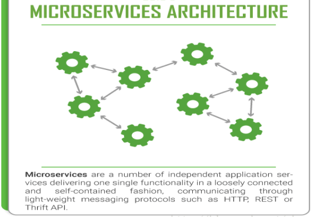

### 1.2、是什么
[https://github.com/spring-cloud/spring-cloud-sleuth](https://github.com/spring-cloud/spring-cloud-sleuth)
Spring Cloud Sleuth提供了一套完整的服务跟踪的解决方案
在分布式系统中提供追踪解决方案并且兼容支持了zipkin
### 1.3、解决

## 2、搭建步骤
[https://www.jianshu.com/p/c6d5883f136b](https://www.jianshu.com/p/c6d5883f136b)
### 2.1、zipkin
#### 2.1.1、下载

- SpringCloud从F版起已不需要自己构建Zipkin Server了，只需调用jar包即可。
   - https://repo1.maven.org/maven2/io/zipkin/zipkin-server/2.23.16/zipkin-server-2.23.16-exec.jar
- 或者命令下载最新版
   - curl -sSL https://zipkin.io/quickstart.sh | bash -s
#### 2.1.2、运行jar
`java -jar zipkin.jar`

#### 2.1.3、运行控制台
[http://localhost:9411/zipkin/](http://localhost:9411/zipkin/)
完整的调用链路

一条链路通过Trace Id唯一标识，Span标识发起的请求信息，各 span 通过 parent id 关联起来。

**Trace：**类似于树结构的Span集合，表示一条调用链路，存在唯一标识
**span：**表示调用链路来源，通俗的理解span就是一次请求信息


#### 2.1.4、docker安装

`docker run -d -p 9411:9411 openzipkin/zipkin --name zipkin`


### 2.2、服务配置

cloud-provider-payment8001
cloud-consumer-order80
#### 2.2.1、POM
```xml
<!--包含了sleuth+zipkin-->
<dependency>
    <groupId>org.springframework.cloud</groupId>
    <artifactId>spring-cloud-starter-zipkin</artifactId>
</dependency>
```
#### 2.2.2、YML
```yaml
spring:
  zipkin:
    base-url: http://localhost:9411
  sleuth:
    sampler:
      #采样率值介于 0 到 1 之间，1 则表示全部采集
      probability: 1
```
### 2.3、测试
依次启动eureka7001/8001/80
80调用8001几次测试下
打开浏览器访问：[http://localhost:9411](http://localhost:9411)

# 第十七章、SpringCloud Alibaba 简介
## 1、Netflix进入维护模式
Spring Cloud Netflix项目进入维护模式
[https://spring.io/blog/2018/12/12/spring-cloud-greenwich-rc1-available-now](https://spring.io/blog/2018/12/12/spring-cloud-greenwich-rc1-available-now)


- 什么是维护模式
   - 
   - 将模块置于维护模式，意味着 Spring Cloud 团队将不会再向模块添加新功能。
   - 将修复 block 级别的 bug 以及安全问题，会考虑并审查社区的小型 pull request。
- 进入维护模式意味着什么呢？
   - Spring Cloud Netflix 将不再开发新的组件
   - Spring Cloud 版本迭代算是比较快的，因而出现了很多重大ISSUE都还来不及Fix就又推另一个Release了。
   - 进入维护模式意思就是目前一直以后一段时间Spring Cloud Netflix提供的服务和功能就这么多了，不在开发新的组件和功能了。以后将以维护和Merge分支Full Request为主。
- 新组件功能将以其他替代平代替的方式实现
   - 
## 2、SpringCloud alibaba
### 2.1、是什么
官网：
[https://github.com/alibaba/spring-cloud-alibaba/blob/master/README-zh.md](https://github.com/alibaba/spring-cloud-alibaba/blob/master/README-zh.md)
诞生：
2018.10.31，Spring Cloud Alibaba 正式入驻了 Spring Cloud 官方孵化器，并在 Maven 中央库发布了第一个版本。

### 2.2、能干嘛

- **服务限流降级**
   - 默认支持 Servlet、Feign、RestTemplate、Dubbo 和 RocketMQ 限流降级功能的接入。
   - 可以在运行时通过控制台实时修改限流降级规则，还支持查看限流降级 Metrics 监控。
- **服务注册与发现**
   - 适配 Spring Cloud 服务注册与发现标准，默认集成了 Ribbon 的支持。
- **分布式配置管理**
   - 支持分布式系统中的外部化配置，配置更改时自动刷新。
- **消息驱动能力**
   - 基于 Spring Cloud Stream 为微服务应用构建消息驱动能力。
- **阿里云对象存储**
   - 阿里云提供的海量、安全、低成本、高可靠的云存储服务。支持在任何应用、任何时间、任何地点存储和访问任意类型的数据。
- **分布式任务调度**
   - 提供秒级、精准、高可靠、高可用的定时（基于 Cron 表达式）任务调度服务。
   - 同时提供分布式的任务执行模型，如网格任务。网格任务支持海量子任务均匀分配到所有 Worker（schedulerx-client）上执行。
### 2.3、去哪下
[https://github.com/alibaba/spring-cloud-alibaba/blob/master/README-zh.md](https://github.com/alibaba/spring-cloud-alibaba/blob/master/README-zh.md)
### 2.4、怎么玩

## 3、学习资料获取

- 官网
   - [https://spring.io/projects/spring-cloud-alibaba#overview](https://spring.io/projects/spring-cloud-alibaba#overview)
- 英文
   - [https://github.com/alibaba/spring-cloud-alibaba](https://github.com/alibaba/spring-cloud-alibaba)
   - [https://spring-cloud-alibaba-group.github.io/github-pages/greenwich/spring-cloud-alibaba.html](https://spring-cloud-alibaba-group.github.io/github-pages/greenwich/spring-cloud-alibaba.html)
- 中文
   - [https://github.com/alibaba/spring-cloud-alibaba/blob/master/README-zh.md](https://github.com/alibaba/spring-cloud-alibaba/blob/master/README-zh.md)

# 第十八章、Nacos服务注册和配置中心
## 1、Nacos简介
### 1.1、为什么叫Nacos
前四个字母分别为**Na**ming和**Co**nfiguration的前两个字母，最后的s为**S**ervice。
### 1.2、是什么
一个更易于构建云原生应用的动态服务发现、配置管理和服务管理平台。
Nacos: Dynamic Naming and Configuration Service

- Nacos就是注册中心 + 配置中心的组合
- Nacos = Eureka + Config + Bus
### 1.3、能干嘛

- 替代Eureka做服务注册中心
- 替代Config做服务配置中心
### 1.4、去哪下
[https://github.com/alibaba/Nacos](https://github.com/alibaba/Nacos)
官网文档
[https://nacos.io/zh-cn/index.html](https://nacos.io/zh-cn/index.html)
[https://spring-cloud-alibaba-group.github.io/github-pages/greenwich/spring-cloud-alibaba.html#_spring_cloud_alibaba_nacos_discovery](https://spring-cloud-alibaba-group.github.io/github-pages/greenwich/spring-cloud-alibaba.html#_spring_cloud_alibaba_nacos_discovery)
### 1.5、各种注册中心比较

据说 Nacos 在阿里巴巴内部有超过 10 万的实例运行，已经过了类似双十一等各种大型流量的考验。
## 2、安装并运行Nacos

### 2.1、普通安装

- 先从官网下载Nacos
   - [https://github.com/alibaba/nacos/releases](https://github.com/alibaba/nacos/releases)
- 解压安装包，直接运行bin目录下的startup.sh/startup.cmd
   - 默认是集群模式，单机模式：`./startup.sh -m standalone`
- 命令运行成功后直接访问[http://localhost:8848/nacos](http://localhost:8848/nacos)
- 默认账号密码都是nacos


### 2.2、Docker 安装

[Docker 简单部署 Nacos 超详细图文步骤_=蜗牛=的博客-CSDN博客_docker nacos](https://blog.csdn.net/u011374856/article/details/109204466)

```bash
docker run -d -p 8848:8848 \
--name nacos \
--env MODE=standalone \
--env SPRING_DATASOURCE_PLATFORM=mysql \
--env MYSQL_SERVICE_HOST=10.0.0.207 \
--env MYSQL_SERVICE_PORT=3306 \
--env MYSQL_SERVICE_DB_NAME=nacos \
--env MYSQL_SERVICE_USER=root \
--env MYSQL_SERVICE_PASSWORD=123456 \
-v /mydata/nacos/conf:/home/nacos/conf \
-v /mydata/nacos/logs:/home/nacos/logs \
-v /mydata/nacos/data:/home/nacos/data \
nacos/nacos-server:2.0.4-slim
```

> MySql参考持久化配置


## 3、注册中心演示
官网文档
[https://spring-cloud-alibaba-group.github.io/github-pages/greenwich/spring-cloud-alibaba.html#_spring_cloud_alibaba_nacos_config](https://spring-cloud-alibaba-group.github.io/github-pages/greenwich/spring-cloud-alibaba.html#_spring_cloud_alibaba_nacos_config)
### 3.1、服务提供者
#### 3.1.1、建Module
新建cloudalibaba-provider-payment9001
#### 3.1.2、POM

- 父POM
```xml
<!--spring cloud alibaba 2.1.0.RELEASE-->
<dependency>
  <groupId>com.alibaba.cloud</groupId>
  <artifactId>spring-cloud-alibaba-dependencies</artifactId>
  <version>2.1.0.RELEASE</version>
  <type>pom</type>
  <scope>import</scope>
</dependency>
```

- 本模块POM
```xml
<?xml version="1.0" encoding="UTF-8"?>
<project xmlns="http://maven.apache.org/POM/4.0.0"
         xmlns:xsi="http://www.w3.org/2001/XMLSchema-instance"
         xsi:schemaLocation="http://maven.apache.org/POM/4.0.0 http://maven.apache.org/xsd/maven-4.0.0.xsd">
    <parent>
        <artifactId>mscloud</artifactId>
        <groupId>com.renchao.springcloud</groupId>
        <version>1.0-SNAPSHOT</version>
    </parent>
    <modelVersion>4.0.0</modelVersion>
    <artifactId>cloudalibaba-provider-payment9001</artifactId>
    
    <dependencies>
        <!--SpringCloud ailibaba nacos -->
        <dependency>
            <groupId>com.alibaba.cloud</groupId>
            <artifactId>spring-cloud-starter-alibaba-nacos-discovery</artifactId>
        </dependency>
        <!-- SpringBoot整合Web组件 -->
        <dependency>
            <groupId>org.springframework.boot</groupId>
            <artifactId>spring-boot-starter-web</artifactId>
        </dependency>
        <dependency>
            <groupId>org.springframework.boot</groupId>
            <artifactId>spring-boot-starter-actuator</artifactId>
        </dependency>
        <!--日常通用jar包配置-->
        <dependency>
            <groupId>org.springframework.boot</groupId>
            <artifactId>spring-boot-devtools</artifactId>
            <scope>runtime</scope>
            <optional>true</optional>
        </dependency>
        <dependency>
            <groupId>org.projectlombok</groupId>
            <artifactId>lombok</artifactId>
            <optional>true</optional>
        </dependency>
        <dependency>
            <groupId>org.springframework.boot</groupId>
            <artifactId>spring-boot-starter-test</artifactId>
            <scope>test</scope>
        </dependency>
    </dependencies>
    
</project>
```
#### 3.1.3、YML
```yaml
server:
  port: 9001

spring:
  application:
    name: nacos-payment-provider
  cloud:
    nacos:
      discovery:
        server-addr: 192.168.123.167:8848 #配置Nacos地址

management:
  endpoints:
    web:
      exposure:
        include: '*'
```
#### 3.1.4、主启动
```java
@SpringBootApplication
@EnableDiscoveryClient
public class PaymentMain9001 {
    public static void main(String[] args) {
        SpringApplication.run(PaymentMain9001.class, args);
    }
}
```
#### 3.1.5、业务类
```java
@RestController
public class PaymentController {
    @Value("${server.port}")
    private String serverPort;

    @GetMapping(value = "/payment/nacos/{id}")
    public String getPayment(@PathVariable("id") Integer id) {
        return "nacos registry, serverPort: "+ serverPort+"\t id"+id;
    }
}
```
#### 3.1.6、测试
[http://localhost:9001/payment/nacos/1](http://localhost:9001/payment/nacos/1)
nacos控制台
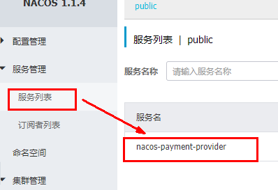
nacos服务注册中心+服务提供者9001都OK了
#### 3.1.7、新建9002
为了演示nacos的负载均衡，参照9001新建9002
新建cloudalibaba-provider-payment9002
除了端口不一样，其他的都一样。
> 或者取巧不想新建重复体力劳动，直接拷贝虚拟端口映射
> 
> 
> 

### 3.2、服务消费者
#### 3.2.1、建Module
新建cloudalibaba-consumer-nacos-order83
#### 3.2.2、POM
```xml
<?xml version="1.0" encoding="UTF-8"?>
<project xmlns="http://maven.apache.org/POM/4.0.0"
         xmlns:xsi="http://www.w3.org/2001/XMLSchema-instance"
         xsi:schemaLocation="http://maven.apache.org/POM/4.0.0 http://maven.apache.org/xsd/maven-4.0.0.xsd">
    <parent>
        <artifactId>mscloud</artifactId>
        <groupId>com.renchao.springcloud</groupId>
        <version>1.0-SNAPSHOT</version>
    </parent>
    <modelVersion>4.0.0</modelVersion>
    <artifactId>cloudalibaba-consumer-nacos-order83</artifactId>
    
    <dependencies>
        <!--SpringCloud ailibaba nacos -->
        <dependency>
            <groupId>com.alibaba.cloud</groupId>
            <artifactId>spring-cloud-starter-alibaba-nacos-discovery</artifactId>
        </dependency>
        <!-- 引入自己定义的api通用包，可以使用Payment支付Entity -->
        <dependency>
            <groupId>com.renchao.springcloud</groupId>
            <artifactId>cloud-api-commons</artifactId>
            <version>${project.version}</version>
        </dependency>
        <!-- SpringBoot整合Web组件 -->
        <dependency>
            <groupId>org.springframework.boot</groupId>
            <artifactId>spring-boot-starter-web</artifactId>
        </dependency>
        <dependency>
            <groupId>org.springframework.boot</groupId>
            <artifactId>spring-boot-starter-actuator</artifactId>
        </dependency>
        <!--日常通用jar包配置-->
        <dependency>
            <groupId>org.springframework.boot</groupId>
            <artifactId>spring-boot-devtools</artifactId>
            <scope>runtime</scope>
            <optional>true</optional>
        </dependency>
        <dependency>
            <groupId>org.projectlombok</groupId>
            <artifactId>lombok</artifactId>
            <optional>true</optional>
        </dependency>
        <dependency>
            <groupId>org.springframework.boot</groupId>
            <artifactId>spring-boot-starter-test</artifactId>
            <scope>test</scope>
        </dependency>
    </dependencies>
</project>
```
为什么nacos支持负载均衡

#### 3.2.3、YML
```yaml
server:
  port: 83


spring:
  application:
    name: nacos-order-consumer
  cloud:
    nacos:
      discovery:
        server-addr: 192.168.123.167:8848


#消费者将要去访问的微服务名称(注册成功进nacos的微服务提供者)
service-url:
  nacos-user-service: http://nacos-payment-provider
```
#### 3.2.4、主启动
```java
@SpringBootApplication
@EnableDiscoveryClient
public class OrderNacosMain83 {
    public static void main(String[] args) {
        SpringApplication.run(OrderNacosMain83.class, args);
    }
}
```
#### 3.2.5、业务类

- ApplicationConfig
```java
@Configuration
public class ApplicationConfig {
    @Bean
    @LoadBalanced
    public RestTemplate getRestTemplate() {
        return new RestTemplate();
    }
}
```

- OrderNacosController
```java
@RestController
public class OrderNacosController {
    @Resource
    private RestTemplate restTemplate;

    // 从配置文件获取微服务名称
    @Value("${service-url.nacos-user-service}")
    private String serverURL;

    @GetMapping("/consumer/payment/nacos/{id}")
    public String paymentInfo(@PathVariable("id") Long id) {
        return restTemplate.getForObject(serverURL+"/payment/nacos/"+id,String.class);
    }
}
```
#### 2.3.6、测试
nacos控制台
[http://localhost:83/consumer/payment/nacos/13](http://localhost:83/consumer/payment/nacos/13)
83访问9001/9002，轮询负载OK
### 3.3、服务注册中心对比
#### 3.3.1、各种注册中心对比


#### 3.3.2、Nacos全景

#### 3.3.3、AP/CP模式切换

- C：所有节点在同一时间看到的数据是一致的。（一致性）
- A：所有的请求都会收到响应。（高可用）

何时选择使用何种模式？
一般来说，如果不需要存储服务级别的信息且服务实例是通过nacos-client注册，并能够保持心跳上报，那么就可以选择AP模式。
当前主流的服务如 Spring cloud 和 Dubbo 服务，都适用于AP模式，AP模式为了服务的可能性而减弱了一致性，因此AP模式下只支持注册临时实例。
如果需要在服务级别编辑或者存储配置信息，那么 CP 是必须，K8S服务和DNS服务则适用于CP模式。
CP模式下则支持注册持久化实例，此时则是以 Raft 协议为集群运行模式，该模式下注册实例之前必须先注册服务，如果服务不存在，则会返回错误。
**AP/CP模式切换：**

- `curl -X PUT '$NACOS_SERVER:8848/nacos/v1/ns/operator/switches?entry=serverMode&value=CP'`
## 4、服务配置中心
### 4.1、建工程
#### 4.1.1、建Module
新建cloudalibaba-config-nacos-client3377
#### 4.1.2、POM
```xml
<?xml version="1.0" encoding="UTF-8"?>
<project xmlns="http://maven.apache.org/POM/4.0.0"
         xmlns:xsi="http://www.w3.org/2001/XMLSchema-instance"
         xsi:schemaLocation="http://maven.apache.org/POM/4.0.0 http://maven.apache.org/xsd/maven-4.0.0.xsd">
    <parent>
        <artifactId>mscloud</artifactId>
        <groupId>com.renchao.springcloud</groupId>
        <version>1.0-SNAPSHOT</version>
    </parent>
    <modelVersion>4.0.0</modelVersion>
    <artifactId>cloudalibaba-config-nacos-client3377</artifactId>

    <dependencies>
        <!--nacos-config-->
        <dependency>
            <groupId>com.alibaba.cloud</groupId>
            <artifactId>spring-cloud-starter-alibaba-nacos-config</artifactId>
        </dependency>
        <!--nacos-discovery-->
        <dependency>
            <groupId>com.alibaba.cloud</groupId>
            <artifactId>spring-cloud-starter-alibaba-nacos-discovery</artifactId>
        </dependency>
        <!--web + actuator-->
        <dependency>
            <groupId>org.springframework.boot</groupId>
            <artifactId>spring-boot-starter-web</artifactId>
        </dependency>
        <dependency>
            <groupId>org.springframework.boot</groupId>
            <artifactId>spring-boot-starter-actuator</artifactId>
        </dependency>
        <!--一般基础配置-->
        <dependency>
            <groupId>org.springframework.boot</groupId>
            <artifactId>spring-boot-devtools</artifactId>
            <scope>runtime</scope>
            <optional>true</optional>
        </dependency>
        <dependency>
            <groupId>org.projectlombok</groupId>
            <artifactId>lombok</artifactId>
            <optional>true</optional>
        </dependency>
        <dependency>
            <groupId>org.springframework.boot</groupId>
            <artifactId>spring-boot-starter-test</artifactId>
            <scope>test</scope>
        </dependency>
    </dependencies>

</project>
```
#### 4.1.3、YML
> 配置两个YML
> Nacos同springcloud-config一样，在项目初始化时，要保证先从配置中心进行配置拉取，拉取配置之后，才能保证项目的正常启动。
> springboot中配置文件的加载是存在优先级顺序的，bootstrap优先级高于application。

- bootstrap
```yaml
# nacos配置
server:
  port: 3377

spring:
  application:
    name: nacos-config-client
  cloud:
    nacos:
      discovery:
        server-addr: 192.168.123.167:8848 #Nacos服务注册中心地址
      config:
        server-addr: 192.168.123.167:8848 #Nacos作为配置中心地址
        file-extension: yaml #指定yaml格式的配置
```

- application
```yaml
spring:
  profiles:
    active: dev # 表示开发环境
```
#### 4.1.4、主启动
```java
@SpringBootApplication
@EnableDiscoveryClient
public class NacosConfigClientMain3377 {
    public static void main(String[] args) {
        SpringApplication.run(NacosConfigClientMain3377.class, args);
    }
}
```
#### 4.1.5、业务类
通过 @RefreshScope 开启配置自动刷新。
```java
@RestController
@RefreshScope //在控制器类加入@RefreshScope注解使当前类下的配置支持Nacos的动态刷新功能。
public class ConfigClientController {

    @Value("${config.info}")
    private String configInfo;

    @GetMapping("/config/info")
    public String getConfigInfo() {
        return configInfo;
    }
}
```
### 4.2、基础配置
#### 4.2.1、匹配规则
Nacos中的 dataId 格式与SpringBoot配置文件中的匹配规则。
[https://nacos.io/zh-cn/docs/quick-start-spring-cloud.html](https://nacos.io/zh-cn/docs/quick-start-spring-cloud.html)

最后公式：
`${spring.application.name}-${spring.profiles.active}.${spring.cloud.nacos.config.file-extension}`
#### 4.2.2、Nacos中添加配置

最终：`nacos-config-client-dev.yaml`
#### 4.2.3、历史配置
Nacos会记录配置文件的历史版本默认保留30天，此外还有一键回滚功能，回滚操作将会触发配置更新。
#### 4.2.4、测试
> 启动前需要在nacos客户端-配置管理-配置管理栏目下有对应的yaml配置文件。

- 运行cloud-config-nacos-client3377的主启动类
- 调用接口查看配置信息
   - [http://localhost:3377/config/info](http://localhost:3377/config/info)
- 自带动态刷新
   - 修改下Nacos中的yaml配置文件，再次调用查看配置的接口，就会发现配置已经刷新
### 4.3、分类配置
#### 4.3.1、多环境多项目管理
一个大型分布式微服务系统会有很多微服务子项目，每个微服务项目又都会有相应的开发环境、测试环境、预发环境、正式环境......
实际开发中，通常一个系统会准备：

- dev开发环境
- test测试环境
- prod生产环境

那怎么对这些微服务配置进行管理呢？

#### 4.3.2、Namespace+Group+Data ID


- NameSpace
   - 默认的命名空间是public，Namespace主要用来实现隔离。
   - 比方说我们现在有三个环境：开发、测试、生产环境，我们就可以创建三个Namespace，不同的Namespace之间是隔离的。
- Group
   - 默认是DEFAULT_GROUP，Group可以把不同的微服务划分到同一个分组里面去。
- Service
   - 就是微服务；一个Service可以包含多个Cluster（集群），Nacos默认Cluster是DEFAULT，Cluster是对指定微服务的一个虚拟划分。
   - 比方说为了容灾，将Service微服务分别部署在了杭州机房和广州机房，这时就可以给杭州机房的Service微服务起一个集群名称（HZ），给广州机房的Service微服务起一个集群名称（GZ），还可以尽量让同一个机房的微服务互相调用，以提升性能。
- Instance
   - 就是微服务的实例。
#### 4.3.3、DataID 配置
指定spring.profile.active和配置文件的DataID来使不同环境下读取不同的配置

- 默认空间+默认分组+新建dev和test两个DataID
   - nacos-config-client-dev.yml
   - nacos-config-client-test.yml
- 通过spring.profile.active属性就能进行多环境下配置文件的读取
   - 配置是什么就加载什么
   - 
#### 4.3.4、Group配置
通过Group实现环境区分

- 新建Group
   - 在nacos图形界面控制台上面新建配置文件DataID
   - 
- 在config下增加一条group的配置即可。 可配置为DEV_GROUP或TEST_GROUP
   - 
#### 4.3.5、Namespace配置

- 新建dev/test的Namespace
   - 
- 回到服务管理-服务列表查看
   - 
- 按照域名配置填写
   - 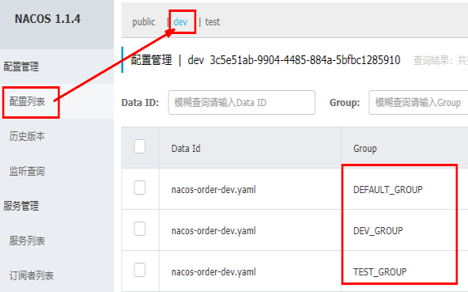
- YML
   - 
#### 4.3.6、加载多个配置文件

## 5、集群和持久化配置（重要）
### 5.1、官网说明
[https://nacos.io/zh-cn/docs/cluster-mode-quick-start.html](https://nacos.io/zh-cn/docs/cluster-mode-quick-start.html)

- 官网架构图
   - 
- 真实情况
   - 
- 说明
   - 默认Nacos使用嵌入式数据库实现数据的存储。所以，如果启动多个默认配置下的Nacos节点，数据存储是存在一致性问题的。
   - 为了解决这个问题，Nacos采用了集中式存储的方式来支持集群化部署，目前只支持MySQL的存储。
   - [https://nacos.io/zh-cn/docs/deployment.html](https://nacos.io/zh-cn/docs/deployment.html)
### 5.2、持久化配置
#### 5.2.1、默认数据库
Nacos默认自带的是嵌入式数据库derby
[https://github.com/alibaba/nacos/blob/develop/config/pom.xml](https://github.com/alibaba/nacos/blob/develop/config/pom.xml)
#### 5.2.2、切换mysql
> 在 Linux 下操作。
> nacos 换版本，数据库表须重新建

- 连接数据库
- 创建 nacos 数据库
   - `create databases nacos;`
- 进入nacos数据库
   - `use nacos;`
- 执行 nacos/conf 目录下的sql脚本 nacos-mysql.sql
   - `source /opt/nacos/conf/nacos-mysql.sql`
- nacos/conf 目录下找到 application.properties ，添加下面内容
```properties
# 高版本 nacos 有模板，直接修改就可以了
spring.datasource.platform=mysql

db.num=1
db.url.0=jdbc:mysql://192.168.123.189:3306/nacos?characterEncoding=utf8&connectTimeout=1000&socketTimeout=3000&autoReconnect=true&useUnicode=true&useSSL=false&serverTimezone=UTC
db.user=root
db.password=123
```
> `./startup.sh` 集群模式启动Nacos，可以看到是个全新的空记录界面，以前是记录进derby

### 5.3、集群配置(重点)
#### 5.3.1、克隆服务器
把前面配置好的Linux服务器再克隆两份，总共3台服务器。

- 192.168.123.167:8848
- 192.168.123.122:8848
- 192.168.123.134:8848
#### 5.3.2、配置cluster.conf

- 复制出cluster.conf
   - `cp cluster.conf.example cluster.conf`
- 修改内容
   - 
   - 这个IP不能写127.0.0.1，必须是主机的实际IP。
   - 8848端口号不能少。
#### 5.3.3、配置Nginx
> 由Nginx作为负载均衡器。
> 这里的 www.mynacos.com 是 Nginx 服务器的地址，可用在 hosts 文件里面配置。

修改nginx的配置文件 nginx.conf
```bash
# nacos负载均衡列表
upstream nacos {
      server 192.168.123.167:8848;
      server 192.168.123.122:8848;
      server 192.168.123.134:8848;
}

# nacos服务
server {
    listen       1111;
    server_name  www.mynacos.com;

    location / {
        proxy_pass http://nacos;
    }
}
```
重启Nginx
`/usr/local/nginx/sbin/nginx -s reload`
截止到此处，1个Nginx+3个nacos注册中心+1个mysql
#### 5.3.4、测试

- 通过nginx访问nacos
   - [http://www.mynacos.com:1111/nacos/](http://192.168.111.144:1111/nacos/#/login)
- 新建一个配置测试
   - 
- 修改前面 cloudalibaba-config-nacos-client3377 的 bootstrap.yml
   - 
- 启动 cloudalibaba-config-nacos-client3377 并且注册进 nacos 集群。
   - 
- 读取配置信息
   - [http://localhost:3377/config/info](http://localhost:3377/config/info)
#### 5.3.5、高可用小总结

# 第十九章、Sentinel熔断与限流
## 1、简介
### 1.1、官网
官方文档：
[https://sentinelguard.io/zh-cn/docs/introduction.html](https://sentinelguard.io/zh-cn/docs/introduction.html)
[https://github.com/alibaba/Sentinel](https://github.com/alibaba/Sentinel)
中文
[https://github.com/alibaba/Sentinel/wiki/%E4%BB%8B%E7%BB%8D](https://github.com/alibaba/Sentinel/wiki/%E4%BB%8B%E7%BB%8D)
### 1.2、是什么

> 一句话解释，就是之前的Hystrix

### 1.3、去哪下
[https://github.com/alibaba/Sentinel/releases](https://github.com/alibaba/Sentinel/releases)
### 1.4、能干嘛

### 1.5、怎么玩
[https://spring-cloud-alibaba-group.github.io/github-pages/greenwich/spring-cloud-alibaba.html#_spring_cloud_alibaba_sentinel](https://spring-cloud-alibaba-group.github.io/github-pages/greenwich/spring-cloud-alibaba.html#_spring_cloud_alibaba_sentinel)
服务使用中的各种问题

- 服务雪崩
- 服务降级
- 服务熔断
- 服务限流
## 2、安装Sentinel控制台
### 2.1、Sentinel组成
sentinel组件由2部分构成

- 后台
- 前台8080


### 2.2、安装步骤

- 下载
   - [https://github.com/alibaba/Sentinel/releases](https://github.com/alibaba/Sentinel/releases)
- 下载到本地sentinel-dashboard-1.7.0.jar
- 运行命令
   - `java -jar sentinel-dashboard-1.7.0.jar`
- 访问sentinel管理界面
   - [http://ip:8080](http://localhost:8080)
- 登录账号密码均为sentinel
> 前提：
> java8环境OK
> 8080端口不能被占用

### 2.3、修改登录密码

```bash
java -Dserver.port=8480 -Dcsp.sentinel.dashboard.server=localhost:8480 -Dproject.name=sentinel-dashboard -Dsentinel.dashboard.auth.username=sentinel -Dsentinel.dashboard.auth.password=123456 -jar sentinel-dashboard-1.7.2.jar

# 参数说明
-Dserver.port=8480 # 指定控制台的端口为8480
-Dcsp.sentinel.dashboard.server=localhost:8480 # 指定要被哪个控制台监控（这里指定的是自己监控自己）
-Dproject.name=sentinel-dashboard # 指定实例名称（名称会在控制台左侧以菜单显示）
-Dsentinel.dashboard.auth.username=sentinel # 设置登录的帐号为：sentinel
-Dsentinel.dashboard.auth.password=123456 # 设置登录的密码为：123456
```


## 3、初始化演示工程
### 3.1、建Module
cloudalibaba-sentinel-service8401
### 3.2、POM
```xml
<?xml version="1.0" encoding="UTF-8"?>
<project xmlns="http://maven.apache.org/POM/4.0.0"
         xmlns:xsi="http://www.w3.org/2001/XMLSchema-instance"
         xsi:schemaLocation="http://maven.apache.org/POM/4.0.0 http://maven.apache.org/xsd/maven-4.0.0.xsd">
    <parent>
        <artifactId>mscloud</artifactId>
        <groupId>com.renchao.springcloud</groupId>
        <version>1.0-SNAPSHOT</version>
    </parent>
    <modelVersion>4.0.0</modelVersion>
    <artifactId>cloudalibaba-sentinel-service8401</artifactId>

    <dependencies>
        <!--SpringCloud ailibaba nacos -->
        <dependency>
            <groupId>com.alibaba.cloud</groupId>
            <artifactId>spring-cloud-starter-alibaba-nacos-discovery</artifactId>
        </dependency>
        <!--SpringCloud ailibaba sentinel-datasource-nacos 后续做持久化用到-->
        <dependency>
            <groupId>com.alibaba.csp</groupId>
            <artifactId>sentinel-datasource-nacos</artifactId>
        </dependency>
        <!--SpringCloud ailibaba sentinel -->
        <dependency>
            <groupId>com.alibaba.cloud</groupId>
            <artifactId>spring-cloud-starter-alibaba-sentinel</artifactId>
        </dependency>
        <!--openfeign-->
        <dependency>
            <groupId>org.springframework.cloud</groupId>
            <artifactId>spring-cloud-starter-openfeign</artifactId>
        </dependency>
        <!-- SpringBoot整合Web组件+actuator -->
        <dependency>
            <groupId>org.springframework.boot</groupId>
            <artifactId>spring-boot-starter-web</artifactId>
        </dependency>
        <dependency>
            <groupId>org.springframework.boot</groupId>
            <artifactId>spring-boot-starter-actuator</artifactId>
        </dependency>
        <!--日常通用jar包配置-->
        <dependency>
            <groupId>org.springframework.boot</groupId>
            <artifactId>spring-boot-devtools</artifactId>
            <scope>runtime</scope>
            <optional>true</optional>
        </dependency>
        <dependency>
            <groupId>cn.hutool</groupId>
            <artifactId>hutool-all</artifactId>
            <version>4.6.3</version>
        </dependency>
        <dependency>
            <groupId>org.projectlombok</groupId>
            <artifactId>lombok</artifactId>
            <optional>true</optional>
        </dependency>
        <dependency>
            <groupId>org.springframework.boot</groupId>
            <artifactId>spring-boot-starter-test</artifactId>
            <scope>test</scope>
        </dependency>
    </dependencies>

</project>
```
### 3.3、YML
```yaml
server:
  port: 8401

spring:
  application:
    name: cloudalibaba-sentinel-service
  cloud:
    nacos:
      discovery:
        #Nacos服务注册中心地址
        server-addr: www.mynacos.com:1111
    sentinel:
      transport:
        #配置Sentinel dashboard地址
        dashboard: 192.168.123.167:8080
        #默认8719端口，假如被占用会自动从8719开始依次+1扫描,直至找到未被占用的端口
        port: 8719

management:
  endpoints:
    web:
      exposure:
        include: '*'
```
### 3.4、主启动
```java
@SpringBootApplication
@EnableDiscoveryClient
public class MainApp8401 {
    public static void main(String[] args) {
        SpringApplication.run(MainApp8401.class, args);
    }
}
```
### 3.5、业务类
```java
@RestController
public class FlowLimitController {

    @GetMapping("/testA")
    public String testA() {
        return "------testA";
    }

    @GetMapping("/testB")
    public String testB() {
        return "------testB";
    }
}
```
### 3.6、测试

- 启动Nacos
- 启动Sentinel
- 启动微服务8401
- 启动8401微服务后查看sentienl控制台
   - 空空如也，啥都没有
- Sentinel采用的懒加载说明
   - 执行一次访问即可
   - [http://localhost:8401/testA](http://localhost:8401/testA)
   - [http://localhost:8401/testB](http://localhost:8401/testB)
## 4、流控规则
### 4.1、基本介绍

### 4.2、流控模式
#### 4.2.1、直接(默认)

- 直接->快速失败
   - 系统默认
- 配置及说明
   - 
#### 4.2.2、关联
当关联的资源达到阈值时，就限流自己
当与A关联的资源B达到阀值后，就限流A自己

- 配置A
   - 
- postman模拟并发密集访问testB
   - 
- 运行
   - 
   - 
> 连续访问B，导致A失效了。
> 注意，这时B是正常的。

#### 4.2.3、链路
链路流控模式指的是，当从某个接口过来的资源达到限流条件时，开启限流。
它的功能有点类似于针对来源配置项，区别在于：**针对来源是针对上级微服务，而链路流控是针对上级接口，也就是说它的粒度更细。**
> 注意：
> 从1.6.3 版本开始，Sentinel Web filter默认收敛所有URL的入口context，因此链路限流不生效。
> 目前使用的版本是2.1.0.RELEASE，按照网上的方法配置，也不行。
> 把版本升级到2.2.5.RELEASE，然后按照网上的配置，测试通过。
> 配置：`spring.cloud.sentinel.web-context-unify=false`
> 或者通过配置类方式，详细看下面连接：
> [https://github.com/alibaba/sentinel/issues/1213](https://github.com/alibaba/sentinel/issues/1213)
> [https://blog.csdn.net/qq_31155349/article/details/108478190](https://blog.csdn.net/qq_31155349/article/details/108478190)

- 编写一个service，在里面添加一个something方法
```java
@Service
public class OrderService {
    @SentinelResource("something")       // 将此方法标注为sentinel的资源。value=资源名
    public void something() {
        System.out.println("do something");
    }
}
```

- 在Controller两个方法中分别调用service中的something方法
```java
@RestController
public class FlowLimitController {

    @Autowired
    private OrderService orderService;

    @GetMapping("/testA")
    public String testA() throws InterruptedException {
        orderService.something();
        return "------testA";
    }

    @GetMapping("/testB")
    public String testB() {
        orderService.something();
        return "------testB";
    }
}
```

- 在Sentinel控制台配置
   - 

浏览器分别对 /testA 和 /testB 进行频繁刷新访问，发现 testB 接口没有问题。而testA会有限流现象。

### 4.3、流控效果
#### 4.3.1、快速失败
直接->快速失败(默认的流控处理)

- 直接失败，抛出异常
   - Blocked by Sentinel (flow limiting)
- 源码
   - com.alibaba.csp.sentinel.slots.block.flow.controller.DefaultController
#### 4.3.2、预热

- 说明
   - 公式：阈值除以coldFactor(默认值为3),经过预热时长后才会达到阈值
- 官网
   - 限流 冷启动
   - [https://github.com/alibaba/Sentinel/wiki/%E9%99%90%E6%B5%81---%E5%86%B7%E5%90%AF%E5%8A%A8](https://github.com/alibaba/Sentinel/wiki/%E9%99%90%E6%B5%81---%E5%86%B7%E5%90%AF%E5%8A%A8)
   - 默认coldFactor为3，即请求 QPS 从 threshold / 3 开始，经预热时长逐渐升至设定的 QPS 阈值。
- 源码
   - com.alibaba.csp.sentinel.slots.block.flow.controller.WarmUpController
- WarmUp配置
   - 系统初始化的阀值为10 / 3 约等于3,即阀值刚开始为3；然后过了5秒后阀值才慢慢升高恢复到10
   - 
- 多次点击[http://localhost:8401/testB](http://localhost:8401/testB)
   - 刚开始不行，后续慢慢OK
- 应用场景
   - 如：秒杀系统在开启的瞬间，会有很多流量上来，很有可能把系统打死，预热方式就是把为了保护系统，可慢慢的把流量放进来，慢慢的把阀值增长到设置的阀值。
#### 4.3.3、排队等待
匀速排队，阈值必须设置为QPS

- 官网
   - [https://github.com/alibaba/Sentinel/wiki/%E6%B5%81%E9%87%8F%E6%8E%A7%E5%88%B6](https://github.com/alibaba/Sentinel/wiki/%E6%B5%81%E9%87%8F%E6%8E%A7%E5%88%B6)
- 源码
   - com.alibaba.csp.sentinel.slots.block.flow.controller.RateLimiterController
## 5、熔断规则
### 5.1、基本介绍
官网
[https://github.com/alibaba/Sentinel/wiki/%E7%86%94%E6%96%AD%E9%99%8D%E7%BA%A7](https://github.com/alibaba/Sentinel/wiki/%E7%86%94%E6%96%AD%E9%99%8D%E7%BA%A7)

### 5.2、熔断策略实战
#### 5.2.1、慢调用比例

#### 5.2.2、异常比例

#### 5.2.3、异常数
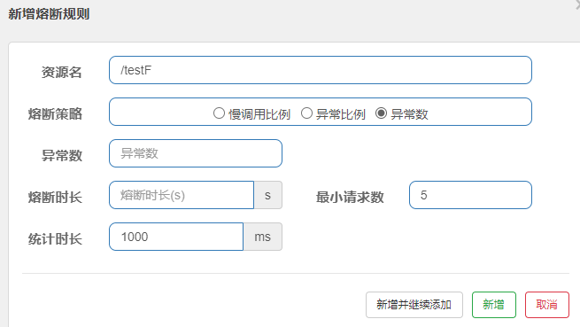
> 注意，统计时长最低是60秒。

## 6、热点key限流
### 6.1、基本介绍
#### 6.1.1、官网
[https://github.com/alibaba/Sentinel/wiki/%E7%83%AD%E7%82%B9%E5%8F%82%E6%95%B0%E9%99%90%E6%B5%81](https://github.com/alibaba/Sentinel/wiki/%E7%83%AD%E7%82%B9%E5%8F%82%E6%95%B0%E9%99%90%E6%B5%81)
#### 6.1.2、说明
热点即经常访问的数据，很多时候我们希望统计或者限制某个热点数据中访问频次最高的TopN数据，并对其访问进行限流或者其它操作。
#### 6.1.3、源码
com.alibaba.csp.sentinel.slots.block.BlockException
### 6.2、Controller
```java
@RestController
public class HotKeyController {

    @GetMapping("/testHotKey")
    // 如果没有设置 blockHandler 属性，异常会直接打到了前台。
    @SentinelResource(value = "testHotKey", blockHandler = "dealHandler_testHotKey")
    public String testHotKey(@RequestParam(value = "p1", required = false) String p1,
                             @RequestParam(value = "p2", required = false) String p2) {
        return "------testHotKey";
    }

    public String dealHandler_testHotKey(String p1, String p2, BlockException exception) {
        return "-----dealHandler_testHotKey";
    }
}
```
### 6.3、配置

### 6.4、测试

- 超过阈值有效
   - http://localhost:8401/testHotKey?p1=abc
   - http://localhost:8401/testHotKey?p1=abc&p2=33
- 超过阈值无效
   - http://localhost:8401/testHotKey?p2=abc
### 6.5、参数例外项
期望p1参数当它是某个特殊值时，它的限流值和平时不一样，例如：
当p1的值等于5时，它的阈值可以达到200。

- 配置
   - 
- 测试
   - http://localhost:8401/testHotKey?p1=5
   - http://localhost:8401/testHotKey?p1=3
   - 当p1等于5的时候，阈值变为200
   - 当p1不等于5的时候，阈值就是平常的1
> 参数必须是基本类型或者String

## 7、系统规则
### 7.1、官网
[https://github.com/alibaba/Sentinel/wiki/%E7%B3%BB%E7%BB%9F%E8%87%AA%E9%80%82%E5%BA%94%E9%99%90%E6%B5%81](https://github.com/alibaba/Sentinel/wiki/%E7%B3%BB%E7%BB%9F%E8%87%AA%E9%80%82%E5%BA%94%E9%99%90%E6%B5%81)
### 7.2、各项配置说明
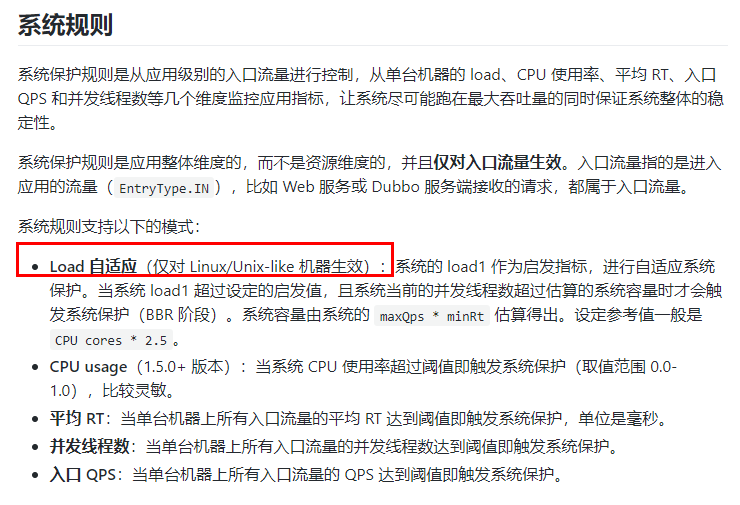
## 8、@SentinelResource
### 8.1、介绍
官网
[https://github.com/alibaba/Sentinel/wiki/%E6%B3%A8%E8%A7%A3%E6%94%AF%E6%8C%81](https://github.com/alibaba/Sentinel/wiki/%E6%B3%A8%E8%A7%A3%E6%94%AF%E6%8C%81)

### 8.2、自定义处理逻辑
#### 8.2.1、创建处理类
创建CustomerBlockHandler类用于自定义限流处理逻辑
```java
public class CustomerBlockHandler {
    public static CommonResult handleException1(BlockException exception){
        return new CommonResult(2020,"自定义的限流处理信息...方法1...CustomerBlockHandler");
    }

    public static CommonResult handleException2(BlockException exception){
        return new CommonResult(2020,"自定义的限流处理信息...方法2...CustomerBlockHandler");
    }
}
```
创建FallbackHandler类用于自定义异常处理逻辑
```java
public class FallbackHandler {
    public static CommonResult fallbackHandle1(Throwable exception){
        return new CommonResult(2020,"自定义的异常处理逻辑...方法1...FallbackHandler");
    }

    public static CommonResult fallbackHandle2(Throwable exception){
        return new CommonResult(2020,"自定义的异常处理逻辑...方法2...FallbackHandler");
    }
}
```
#### 8.2.2、后台资源配置
```java
@GetMapping("/rateLimit/customerBlockHandler")
@SentinelResource(value = "byResource",    // 资源名
        blockHandlerClass = CustomerBlockHandler.class, // 限流处理类
        blockHandler = "handleException1",  // 指定限流处理类的哪个方法
        fallbackClass = FallbackHandler.class, // 异常处理类
        fallback = "fallbackHandle2")   // 指定异常处理类的哪个方法
public CommonResult customerBlockHandler() {
    int a = 4 / 0;
    return new CommonResult(200,"按客户自定义限流处理逻辑");
}
```
#### 8.2.3、其他说明
所有的代码都要用try-catch-finally方式进行处理。

Sentinel主要有三个核心API

- SphU：定义资源
- Tracer：定义统计
- ContextUtil：定义了上下文
## 9、整合Ribbon 和 Feign
### 9.1、提供者9003/9004
#### 9.1.1、建Module
新建cloudalibaba-provider-payment9003/9004
两个一样的做法
#### 9.1.2、POM
```xml
<?xml version="1.0" encoding="UTF-8"?>
<project xmlns="http://maven.apache.org/POM/4.0.0"
         xmlns:xsi="http://www.w3.org/2001/XMLSchema-instance"
         xsi:schemaLocation="http://maven.apache.org/POM/4.0.0 http://maven.apache.org/xsd/maven-4.0.0.xsd">
    <parent>
        <artifactId>mscloud</artifactId>
        <groupId>com.renchao.springcloud</groupId>
        <version>1.0-SNAPSHOT</version>
    </parent>
    <modelVersion>4.0.0</modelVersion>
    <artifactId>cloudalibaba-provider-payment9003</artifactId>
    
    <dependencies>
        <!--SpringCloud ailibaba nacos -->
        <dependency>
            <groupId>com.alibaba.cloud</groupId>
            <artifactId>spring-cloud-starter-alibaba-nacos-discovery</artifactId>
        </dependency>
        <dependency><!-- 引入自己定义的api通用包，可以使用Payment支付Entity -->
            <groupId>com.renchao.springcloud</groupId>
            <artifactId>cloud-api-commons</artifactId>
            <version>${project.version}</version>
        </dependency>
        <!-- SpringBoot整合Web组件 -->
        <dependency>
            <groupId>org.springframework.boot</groupId>
            <artifactId>spring-boot-starter-web</artifactId>
        </dependency>
        <dependency>
            <groupId>org.springframework.boot</groupId>
            <artifactId>spring-boot-starter-actuator</artifactId>
        </dependency>
        <!--日常通用jar包配置-->
        <dependency>
            <groupId>org.springframework.boot</groupId>
            <artifactId>spring-boot-devtools</artifactId>
            <scope>runtime</scope>
            <optional>true</optional>
        </dependency>
        <dependency>
            <groupId>org.projectlombok</groupId>
            <artifactId>lombok</artifactId>
            <optional>true</optional>
        </dependency>
        <dependency>
            <groupId>org.springframework.boot</groupId>
            <artifactId>spring-boot-starter-test</artifactId>
            <scope>test</scope>
        </dependency>
    </dependencies>
</project>
```
#### 9.1.3、YML
注意修改端口
```yaml
server:
  port: 9003

spring:
  application:
    name: nacos-payment-provider
  cloud:
    nacos:
      discovery:
        server-addr: www.mynacos.com:1111 #配置Nacos地址

management:
  endpoints:
    web:
      exposure:
        include: '*'
```
#### 9.1.4、主启动
```java
@SpringBootApplication
@EnableDiscoveryClient
public class PaymentMain9003 {
    public static void main(String[] args) {
        SpringApplication.run(PaymentMain9003.class, args);
    }
}
```
#### 9.1.5、业务类
```java
@RestController
public class PaymentController {
    @Value("${server.port}")
    private String serverPort;
    
    @GetMapping(value = "/payment/{id}")
    public CommonResult<Payment> paymentSQL(@PathVariable("id") Long id)
    {
        return new CommonResult<>(200, serverPort, new Payment(id, "测试"));
    }
}
```
### 9.2、消费者84
#### 9.2.1、建Module
新建cloudalibaba-consumer-nacos-order84
#### 9.2.2、POM
```xml
<?xml version="1.0" encoding="UTF-8"?>
<project xmlns="http://maven.apache.org/POM/4.0.0"
         xmlns:xsi="http://www.w3.org/2001/XMLSchema-instance"
         xsi:schemaLocation="http://maven.apache.org/POM/4.0.0 http://maven.apache.org/xsd/maven-4.0.0.xsd">
    <parent>
        <artifactId>mscloud</artifactId>
        <groupId>com.renchao.springcloud</groupId>
        <version>1.0-SNAPSHOT</version>
    </parent>
    <modelVersion>4.0.0</modelVersion>

    <artifactId>cloudalibaba-consumer-nacos-order84</artifactId>

    <dependencies>
        <!--SpringCloud ailibaba nacos -->
        <dependency>
            <groupId>com.alibaba.cloud</groupId>
            <artifactId>spring-cloud-starter-alibaba-nacos-discovery</artifactId>
        </dependency>
        <!--SpringCloud ailibaba sentinel -->
        <dependency>
            <groupId>com.alibaba.cloud</groupId>
            <artifactId>spring-cloud-starter-alibaba-sentinel</artifactId>
        </dependency>

        <!--SpringCloud OpenFeign -->
        <dependency>
            <groupId>org.springframework.cloud</groupId>
            <artifactId>spring-cloud-starter-openfeign</artifactId>
        </dependency>

        <!-- 引入自己定义的api通用包，可以使用Payment支付Entity -->
        <dependency>
            <groupId>com.renchao.springcloud</groupId>
            <artifactId>cloud-api-commons</artifactId>
            <version>${project.version}</version>
        </dependency>
        <!-- SpringBoot整合Web组件 -->
        <dependency>
            <groupId>org.springframework.boot</groupId>
            <artifactId>spring-boot-starter-web</artifactId>
        </dependency>
        <dependency>
            <groupId>org.springframework.boot</groupId>
            <artifactId>spring-boot-starter-actuator</artifactId>
        </dependency>
        <!--日常通用jar包配置-->
        <dependency>
            <groupId>org.springframework.boot</groupId>
            <artifactId>spring-boot-devtools</artifactId>
            <scope>runtime</scope>
            <optional>true</optional>
        </dependency>
        <dependency>
            <groupId>org.projectlombok</groupId>
            <artifactId>lombok</artifactId>
            <optional>true</optional>
        </dependency>
        <dependency>
            <groupId>org.springframework.boot</groupId>
            <artifactId>spring-boot-starter-test</artifactId>
            <scope>test</scope>
        </dependency>
    </dependencies>
</project>
```
#### 9.2.3、YML
需要激活Sentinel对Feign的支持
```yaml
server:
  port: 84

spring:
  application:
    name: nacos-order-consumer
  cloud:
    nacos:
      discovery:
        server-addr: localhost:8848
    sentinel:
      transport:
        #配置Sentinel dashboard地址
        dashboard: localhost:8080
        #默认8719端口，假如被占用会自动从8719开始依次+1扫描,直至找到未被占用的端口
        port: 8719

# 激活Sentinel对Feign的支持
feign:
  sentinel:
    enabled: true

#消费者将要去访问的微服务名称(注册成功进nacos的微服务提供者)
service-url:
  user-service: nacos-payment-provider
```
#### 9.2.4、主启动
添加@EnableFeignClients启动Feign的功能
```java
@SpringBootApplication
@EnableDiscoveryClient
@EnableFeignClients
public class OrderNacosMain84 {
    public static void main(String[] args) {
        SpringApplication.run(OrderNacosMain84.class, args);
    }
}
```
#### 9.2.5、业务类

- ApplicationContextConfig
```java
@Configuration
public class ApplicationContextConfig {
    @Bean
    @LoadBalanced
    public RestTemplate getRestTemplate() {
        return new RestTemplate();
    }
}
```

- OpenFeign业务接口
```java
@FeignClient(value = "${service-url.user-service}",fallback = PaymentFallbackService.class)
public interface PaymentService {
    @GetMapping(value = "/payment/{id}")
    CommonResult<Payment> payment(@PathVariable("id") Long id);
}
```

- OpenFeign服务降级处理类
```java
@Component
public class PaymentFallbackService implements PaymentService{
    @Override
    public CommonResult<Payment> payment(Long id) {
        return new CommonResult<>(444,"服务降级返回!",new Payment(id, "errorSerial......"));
    }
}
```

- CircleBreakerController 
```java
@RestController
public class PaymentController {
    
    // OpenFeign
    @Resource
    private PaymentService paymentService;

    @GetMapping(value = "/consumer/openfeign/{id}")
    public CommonResult<Payment> paymentSQL(@PathVariable("id") Long id) {
        return paymentService.payment(id);
    }
}
```
### 9.3、测试
#### 9.3.1、测试负载均衡
访问 [http://localhost:84/consumer/openfeign/1](http://localhost:84/consumer/openfeign/1)
9003 和 9004 交替响应，说明有负载均衡功能。
#### 9.3.1、测试OpenFeign自动降级
测试84调用9003，此时故意关闭9003微服务提供者，84消费侧自动降级，不会被耗死

## 10、规则持久化
### 10.1、介绍
[在生产环境中使用 Sentinel · alibaba/Sentinel Wiki (github.com)](https://github.com/alibaba/Sentinel/wiki/%E5%9C%A8%E7%94%9F%E4%BA%A7%E7%8E%AF%E5%A2%83%E4%B8%AD%E4%BD%BF%E7%94%A8-Sentinel)
一旦我们重启应用，sentinel规则将消失，生产环境需要将配置规则进行持久化。
将限流配置规则持久化进Nacos保存，只要刷新8401某个rest地址，sentinel控制台 的流控规则就能看到，只要Nacos里面的配置不删除，针对8401上sentinel上的流控规则持续有效
### 10.2、步骤
修改cloudalibaba-sentinel-service8401
#### 10.2.1、POM
```xml
<!--SpringCloud ailibaba sentinel-datasource-nacos -->
<dependency>
    <groupId>com.alibaba.csp</groupId>
    <artifactId>sentinel-datasource-nacos</artifactId>
</dependency>
```
#### 10.2.2、YML
添加Nacos数据源配置
```yaml
spring:
  cloud:
    sentinel:
      datasource:
        ds1:
          nacos:
            server-addr: www.mynacos.com:1111
            dataId: cloudalibaba-sentinel-service
            groupId: DEFAULT_GROUP
            data-type: json
            rule-type: flow
```
#### 10.2.3、添加Nacos配置

```json
[
    {
        "resource": "/testA",
        "limitApp": "default",
        "grade": 1,
        "count": 1,
        "strategy": 0,
        "controlBehavior": 0,
        "clusterMode": false
    }
]
```
内容解析

- resource：资源名称；
- limitApp：来源应用；
- grade：阈值类型，0表示线程数，1表示QPS；
- count：单机阈值；
- strategy：流控模式，0表示直接，1表示关联，2表示链路；
- controlBehavior：流控效果，0表示快速失败，1表示Warm Up，2表示排队等待；
- clusterMode：是否集群。
#### 10.2.4、配置参数说明
[https://blog.csdn.net/m0_46379371/article/details/114904351](https://blog.csdn.net/m0_46379371/article/details/114904351)
##### ①限流规则配置
| **属性**        | **说明**                                                     |
| --------------- | ------------------------------------------------------------ |
| app             | 应用名                                                       |
| resource        | 资源名(唯一名称，默认请求路径)                               |
| limitApp        | 针对来源 (填微服务名，指定微服务进行限流 ，默认default(全部限制)) |
| grade           | 阈值类型（阀值类型，0：线程数，1：QPS）                      |
| count           | 单机阀值                                                     |
| clusterMode     | 是否集群（false：否，true：是）                              |
| controlBehavior | 流控效果 (0:失败，1：warmUp，2：排队等待)                    |
| strategy        | 流控模式（0：直接，1：关联，2：链路)                         |
| clusterConfig   | thresholdType: 0                                             |

若流控模式选择关联模式/链路模式:

| **属性**    | **说明**          |
| ----------- | ----------------- |
| refResource | 关联资源/入口资源 |

若流控效果选择Warm Up/排队等待:

| **属性**          | **说明**                 |
| ----------------- | ------------------------ |
| warmUpPeriodSec   | Warm Up效果中的预热时长  |
| maxQueueingTimeMs | 排队等待效果中的超时时间 |

集群开启配置说明若集群开启:

| **属性**                | **说明**                                 |
| ----------------------- | ---------------------------------------- |
| clusterConfig           | 集群流控相关配置                         |
| thresholdType           | 集群阈值模式（0：单机均摊，1：总体阈值） |
| fallbackToLocalWhenFail | 失败退化（选择为true，不选择为false）    |

限流配置参数示例：
```json
{
		"app": "nacos-sentinel-example",
		"resource": "/api/v1/test",
		"limitApp": "default",
		"grade": 1,
		"count": 1,
		"clusterMode": false,
		"strategy": "0",
		"controlBehavior": "0",
		"clusterConfig": {
			"thresholdType": 0
		}
}

```
##### ②熔断规则配置
| **属性**           | **说明**                                                     |
| ------------------ | ------------------------------------------------------------ |
| app                | 应用名                                                       |
| count              | **慢调用比例：**最大Rt；**异常比例中为：**比例阈值；**异常数中为：**异常数 |
| limitApp           | 针对来源 (微服务名，指定微服务进行限流 ，默认default(全部限制)) |
| grade              | 熔断策略（0：慢调用比例，1：异常比例，2：异常数）            |
| minRequestAmount   | 最小请求数（允许通过的最小请求数，在该数量内不发生熔断）     |
| timeWindow         | 熔断时长（在这段时间内发生熔断，拒绝所有请求）               |
| slowRatioThreshold | 比例阈值 (慢调用占所有的调用比率，范围[0~1])【**慢调用比例**】 |
| resource           | 资源名(唯一名称，默认请求路径)                               |
| statIntervalMs     | 熔断时长(熔断时长，默认为1秒)                                |

熔断配置参数示例：
```json
{
	"app": "nacos-sentinel-example",
	"limitApp": "default",
	"resource": "/api/v1/sleep",
	"grade": 0,
	"count": 1,
	"slowRatioThreshold": 0.5,
	"timeWindow": 10,
	"minRequestAmount": 1,
	"statIntervalMs": 1000
}
```
##### ③热点规则配置
| **属性**          | **说明**                                                     |
| ----------------- | ------------------------------------------------------------ |
| app               | 应用名                                                       |
| resource          | 资源名(唯一名称，默认请求路径)                               |
| limitApp          | 针对来源 (微服务名，指定微服务进行限流 ，默认default(全部限制)) |
| grade             | 限流模式(0：线程数，1：QPS)                                  |
| count             | 单机阀值                                                     |
| durationInSec     | 统计窗口时间                                                 |
| clusterMode       | 是否集群（false：否，true：是）                              |
| paramIdx          | 参数索引                                                     |
| paramFlowItemList | 参数例外项。仅支持基本类型和String                           |
| controlBehavior   | 流控效果,默认为0 (0:快速失败，1：warmUp，2：排队等待)        |
| maxQueueingTimeMs | 最大排队等待时长,默认0（仅在匀速排队模式生效）               |

若集群开启:

| **属性**                | **说明**                                 |
| ----------------------- | ---------------------------------------- |
| clusterConfig           | 集群流控相关配置                         |
| thresholdType           | 集群阈值模式（0：单机均摊，1：总体阈值） |
| fallbackToLocalWhenFail | 失败退化（选择为true，不选择为false）    |

若参数例外项开启:

| **属性**          | **说明**                                                     |
| ----------------- | ------------------------------------------------------------ |
| paramFlowItemList | 参数例外项。仅支持基本类型和String                           |
| classType         | 参数类型（基本数据类型 int,double,String,long,float,char,byte） |
| count             | 限流阈值                                                     |
| object            | 参数值                                                       |

热点配置参数示例：
```json
{
		"app": "nacos-sentinel-example",
		"resource": "/api/v1/test",
		"limitApp": "default",
		"grade": 1,
		"count": 1,
		"clusterMode": false,
		"strategy": "0",
		"controlBehavior": "0",
		"clusterConfig": {
			"fallbackToLocalWhenFail": true
			"thresholdType": 0
		},
		"paramFlowItemList": [{object: "20", classType: "int", count: 21}]
}

```
##### ④授权规则配置
| **属性** | **说明**                                                |
| -------- | ------------------------------------------------------- |
| app      | 应用名                                                  |
| resource | 资源名                                                  |
| limitApp | 流控应用(指调用方，多个调用方名称用半角英文逗号(,)分隔) |
| strategy | 授权类型（0：白名单，1：黑名单）                        |

授权配置参数示例：
```json
{
		"app": "nacos-sentinel-example",
		"rule":{"strategy":0,
            "limitApp":"/test",
            "resource":"ssss"
           }
}
```
##### ⑤系统规则配置
| **属性**          | **说明**                                                     |
| ----------------- | ------------------------------------------------------------ |
| app               | 应用名                                                       |
| highestSystemLoad | 阈值（阈值类型为Load的阈值）[0,1)的正整数                    |
| avgRt             | 阈值（阈值类型为RT的阈值）所有入口流量的平均响应时间，[0,1)的正整数 |
| maxThread         | 阈值（阈值类型为线程数的阈值）入口流量的最大并发数，[0,1)的正整数 |
| qps               | 阈值 （阈值类型为入口 QPS的阈值）所有入口资源的 QPS，[0,1)的正整数 |
| highestCpuUsage   | 阈值（阈值类型为CPU 使用率的阈值）[0,1]的小数，代表百分比    |

系统配置参数示例：
```json
Load 阈值类型
{
		"app": "nacos-sentinel-example",
		"highestSystemLoad":1
}

RT 阈值类型
{
		"app": "nacos-sentinel-example",
		"avgRt":1
}

线程数 阈值类型
{
		"app": "nacos-sentinel-example",
		"maxThread":1
}

QPS 阈值类型
{
		"app": "nacos-sentinel-example",
		"qps":1
}

CPU使用率 阈值类型
{
		"app": "nacos-sentinel-example",
		"highestCpuUsage":1
}
```
##### ⑥API分组规则配置
| **属性**       | **说明**                                                     |
| -------------- | ------------------------------------------------------------ |
| app            | 应用名                                                       |
| apiName        | API名称                                                      |
| grade          | 阈值类型（阀值类型，0：线程数，1：QPS），api分组管理中始终为0 |
| predicateItems | 分组参数                                                     |
| matchStrategy  | 匹配模式（0：精确，1：前缀，2：正则）                        |
| pattern        | 匹配串                                                       |

API分组配置参数示例：
```json
[
    {
        "apiName": "group1",
        "predicateItems": [
            {
                "pattern": "/nacos-provider-example/hello",
                "matchStrategy": 0
            },
            {
                "pattern": "/nacos-consumer-example/**",
                "matchStrategy": 1
            }
        ]
    }
]
```
## 12、统一异常处理

[sentinel自定义统一限流降级处理 - 请叫我西毒 - 博客园 (cnblogs.com)](https://www.cnblogs.com/hhhshct/p/14315821.html)

```java
@Component
public class MyBlockExceptionHandler implements BlockExceptionHandler {
    private BlockExceptionUtil blockExceptionUtil;

    public MyBlockExceptionHandler(BlockExceptionUtil blockExceptionUtil) {
        this.blockExceptionUtil = blockExceptionUtil;
    }
    public MyBlockExceptionHandler() {
    }

    @Override
    public void handle(HttpServletRequest httpServletRequest, HttpServletResponse httpServletResponse, BlockException e) throws Exception {
        BaseDtoResponse baseDtoResponse = blockExceptionUtil.getResponseDto(e, null);
        httpServletResponse.setStatus(HttpStatus.OK.value());
        httpServletResponse.setCharacterEncoding("UTF-8");
        httpServletResponse.setContentType("application/json;charset=utf-8");
        httpServletResponse.setHeader("Content-Type","application/json;charset=utf-8");
        new ObjectMapper().writeValue(httpServletResponse.getWriter(),baseDtoResponse);
    }
}
```


## 11、熔断框架比较

|                   | **Sentinel**                                           | **Hystrix**             | **resilience4j**                 |
| ----------------- | ------------------------------------------------------ | ----------------------- | -------------------------------- |
| 隔离策略          | 信号量隔离（并发控制）                                 | 线程池隔离/信号量隔离   | 信号量隔离                       |
| 熔断降级策略      | 基于慢调用比例、异常比例、异常数                       | 基于异常比例            | 基于异常比例、响应时间           |
| 实时统计实现      | 滑动窗口（LeapArray）                                  | 滑动窗口（基于 RxJava） | Ring Bit Buffer                  |
| 动态规则配置      | 支持近十种动态数据源                                   | 支持多种数据源          | 有限支持                         |
| 扩展性            | 多个扩展点                                             | 插件的形式              | 接口的形式                       |
| 基于注解的支持    | 支持                                                   | 支持                    | 支持                             |
| 单机限流          | 基于 QPS，支持基于调用关系的限流                       | 有限的支持              | Rate Limiter                     |
| 集群流控          | 支持                                                   | 不支持                  | 不支持                           |
| 流量整形          | 支持预热模式与匀速排队控制效果                         | 不支持                  | 简单的 Rate Limiter 模式         |
| 系统自适应保护    | 支持                                                   | 不支持                  | 不支持                           |
| 热点识别/防护     | 支持                                                   | 不支持                  | 不支持                           |
| 多语言支持        | Java/Go/C++                                            | Java                    | Java                             |
| Service Mesh 支持 | 支持 Envoy/Istio                                       | 不支持                  | 不支持                           |
| 控制台            | 提供开箱即用的控制台，可配置规则、实时监控、机器发现等 | 简单的监控查看          | 不提供控制台，可对接其它监控系统 |

> resilience4j 国外使用的较多

# 第二十章、Seata分布式事务
## 1、简介
### 1.1、是什么
Seata是一款开源的分布式事务解决方案，致力于在微服务架构下提供高性能和简单易用的分布式事务服务。
官网地址
[http://seata.io/zh-cn/](http://seata.io/zh-cn/)
### 1.2、能干嘛
#### 1.2.1、分布式事务过程
一个ID + 三组件模型：

- Transaction ID XID
   - 全局唯一的事务ID
- 3组件概念
   - Transaction Coordinator (TC)
      - 事务协调器，维护全局事务的运行状态，负责协调并驱动全局事务的提交或回滚。
   - Transaction Manager (TM)
      - 控制全局事务的边界，负责开启一个全局事务，并最终发起全局提交或全局回滚的决议。
   - Resource Manager (RM)
      - 控制分支事务，负责分支注册、状态汇报，并接收事务协调器的指令，驱动分支（本地）事务的提交和回滚。
#### 1.2.2、处理过程


- TM 向 TC 申请开启一个全局事务，全局事务创建成功并生成一个全局唯一的 XID；
- XID 在微服务调用链路的上下文中传播；
- RM 向 TC 注册分支事务，将其纳入 XID 对应全局事务的管辖；
- TM 向 TC 发起针对 XID 的全局提交或回滚决议；
- TC 调度 XID 下管辖的全部分支事务完成提交或回滚请求。
### 1.3、去哪下
发布说明: [https://github.com/seata/seata/releases](https://github.com/seata/seata/releases)
### 1.4、怎么玩
本地@Transactional
全局@GlobalTransactional
SEATA 的分布式交易解决方案：

## 2、Server安装
### 2.1、下载

- 官网地址
   - [http://seata.io/zh-cn/](http://seata.io/zh-cn/)
- 下载版本
   - [https://github.com/seata/seata/releases](https://github.com/seata/seata/releases)
- 下面以 seata-server-1.4.2 为例。
### 2.2、简单file.conf方式
解压下载后的文件，修改 conf 目录下的 file.conf 配置文件。

下面都使用默认的file.conf。

- registry 注册中心
- config 配置中心
- 事务日志存储

#### 2.2.1、service模块

file.conf 添加 service模块

```bash
service {
  #vgroup->rgroup ############## 在这里自定义事务组名称 #####################
  vgroup_mapping.my_test_tx_group = "default"
  #only support single node
  default.grouplist = "127.0.0.1:8091"
  #degrade current not support
  enableDegrade = false
  #disable
  disable = false
  #unit ms,s,m,h,d represents milliseconds, seconds, minutes, hours, days, default permanent
  max.commit.retry.timeout = "-1"
  max.rollback.retry.timeout = "-1"
}
```
#### 2.2.2、client

```yaml
seata:
  tx-service-group: my_test_tx_group
  service:
    vgroup-mapping:
      my_test_tx_group: default
    grouplist:
      # TC IP地址和端口
      default: 127.0.0.1:8091
    enable-degrade: false
    disable-global-transaction: false
```

> 每个需要事务的服务都要配置
>
> 在事务的入口方法处添加 @GlobalTransactional 注解

#### 2.2.3、回滚日志表

在每个服务的数据库中都建回滚日志表。

[seata/script at master · seata/seata (github.com)](https://github.com/seata/seata/tree/master/script)


### 2.3、事务日志MySQL

#### 2.3.1、建事务日志库

mysql5.7数据库新建库seata
- `create database seata;`
- 在seata库里建表[seata/script at master · seata/seata (github.com)](https://github.com/seata/seata/tree/master/script)

#### 2.3.2、修改配置

```bash
## transaction log store, only used in seata-server
store {
  ## store mode: file、db、redis
  mode = "db"
  ## rsa decryption public key
  publicKey = ""
  ## database store property
  db {
    ## the implement of javax.sql.DataSource, such as DruidDataSource(druid)/BasicDataSource(dbcp)/HikariDataSource(hikari) etc.
    datasource = "druid"
    ## mysql/oracle/postgresql/h2/oceanbase etc.
    dbType = "mysql"
    driverClassName = "com.mysql.jdbc.Driver"
    ## if using mysql to store the data, recommend add rewriteBatchedStatements=true in jdbc connection param
    url = "jdbc:mysql://127.0.0.1:3306/seata?rewriteBatchedStatements=true"
    user = "mysql"
    password = "mysql"
    minConn = 5
    maxConn = 100
    globalTable = "global_table"
    branchTable = "branch_table"
    lockTable = "lock_table"
    queryLimit = 100
    maxWait = 5000
  }
  
}
```


### 2.4、Nacos 注册和配置中心

官方文档：

[nacos (seata.io)](https://seata.io/zh-cn/docs/user/configuration/nacos.html)

#### 2.4.1、server

修改 seata\conf目录下的 registry.conf 配置文件。

```bash
registry {
  # file 、nacos 、eureka、redis、zk、consul、etcd3、sofa
  type = "nacos"

  nacos {
    application = "seata-server"
    serverAddr = "192.168.10.188:8848"
    group = "SEATA_GROUP"
    namespace = "6a8ee0cb-25fa-42ea-8336-1c62a88751af"
    cluster = "default"
    username = ""
    password = ""
  }
  
}

config {
  # file、nacos 、apollo、zk、consul、etcd3
  type = "nacos"

  nacos {
    serverAddr = "192.168.10.188:8848"
    namespace = "6a8ee0cb-25fa-42ea-8336-1c62a88751af"
    group = "SEATA_GROUP"
    username = ""
    password = ""
    dataId = "seataServer.properties"
  }
  
}
```

#### 2.4.2、client

```xml
        <!--seata-->
        <dependency>
            <groupId>com.alibaba.cloud</groupId>
            <artifactId>spring-cloud-starter-alibaba-seata</artifactId>
            <exclusions>
                <exclusion>
                    <groupId>io.seata</groupId>
                    <artifactId>seata-spring-boot-starter</artifactId>
                </exclusion>
            </exclusions>
        </dependency>

        <dependency>
            <groupId>io.seata</groupId>
            <artifactId>seata-spring-boot-starter</artifactId>
            <version>1.4.2</version>
        </dependency>
```

> application.yml
>
> 每个涉及到事务的服务都要配置

```yaml
seata:
  # 事务分组，要与服务端的一致
  tx-service-group: default_tx_group
  service:
    vgroup-mapping:
      default_tx_group: default
  config:
    type: nacos
    nacos:
      server-addr: 192.168.10.188:8848
      group : "SEATA_GROUP"
      namespace: "6a8ee0cb-25fa-42ea-8336-1c62a88751af"
      # 要与服务端的一致
      dataId: "seataServer.properties"
  registry:
    type: nacos
    nacos:
      application: seata-server
      server-addr: 192.168.10.188:8848
      group : "SEATA_GROUP"
      namespace: "6a8ee0cb-25fa-42ea-8336-1c62a88751af"
```

入口方法添加 @GlobalTransactional 注解

#### 2.4.3、Nacos配置

> 在nacos新建配置，此处dataId为seataServer.properties。
>
> 配置内容参考https://github.com/seata/seata/tree/develop/script/config-center 的config.txt并按需修改保存
>
> dataId方式需要v1.4.2版本及以上。
>
> 说明：
>
> 此时 file.conf 文件已经没有用了，可以直接删除。

```properties
#Transaction routing rules configuration, only for the client
service.vgroupMapping.default_tx_group=default

#Transaction storage configuration, only for the server. The file, db, and redis configuration values are optional.
store.mode=db

#Used for password encryption
store.publicKey=

#These configurations are required if the `store mode` is `db`. If `store.mode,store.lock.mode,store.session.mode` are not equal to `db`, you can remove the configuration block.
store.db.datasource=druid
store.db.dbType=mysql
store.db.driverClassName=com.mysql.jdbc.Driver
store.db.url=jdbc:mysql://192.168.10.188:3306/seata?useUnicode=true&rewriteBatchedStatements=true
store.db.user=root
store.db.password=root
store.db.minConn=5
store.db.maxConn=30
store.db.globalTable=global_table
store.db.branchTable=branch_table
store.db.distributedLockTable=distributed_lock
store.db.queryLimit=100
store.db.lockTable=lock_table
store.db.maxWait=5000
```


## 3、业务数据库准备
### 3.1、说明
分布式事务业务演示说明：

- 下订单--->扣库存--->减账户(余额)
- 准备订单/库存/账户业务数据库
### 3.2、创建数据库
```sql
-- 订单
CREATE DATABASE seata_order;
CREATE TABLE t_order (
  `id` BIGINT(11) NOT NULL AUTO_INCREMENT PRIMARY KEY,
  `user_id` BIGINT(11) DEFAULT NULL COMMENT '用户id',
  `product_id` BIGINT(11) DEFAULT NULL COMMENT '产品id',
  `count` INT(11) DEFAULT NULL COMMENT '数量',
  `money` DECIMAL(11,0) DEFAULT NULL COMMENT '金额',
  `status` INT(1) DEFAULT NULL COMMENT '订单状态：0：创建中；1：已完结' 
) ENGINE=INNODB AUTO_INCREMENT=7 DEFAULT CHARSET=utf8;

-- 库存
CREATE DATABASE seata_storage;
CREATE TABLE t_storage (
 `id` BIGINT(11) NOT NULL AUTO_INCREMENT PRIMARY KEY,
 `product_id` BIGINT(11) DEFAULT NULL COMMENT '产品id',
 `total` INT(11) DEFAULT NULL COMMENT '总库存',
 `used` INT(11) DEFAULT NULL COMMENT '已用库存',
 `residue` INT(11) DEFAULT NULL COMMENT '剩余库存'
) ENGINE=INNODB AUTO_INCREMENT=2 DEFAULT CHARSET=utf8;

INSERT INTO seata_storage.t_storage(`id`, `product_id`, `total`, `used`, `residue`)
VALUES ('1', '1', '100', '0', '100');


-- 账户
CREATE DATABASE seata_account;
CREATE TABLE t_account (
  `id` BIGINT(11) NOT NULL AUTO_INCREMENT PRIMARY KEY COMMENT 'id',
  `user_id` BIGINT(11) DEFAULT NULL COMMENT '用户id',
  `total` DECIMAL(10,0) DEFAULT NULL COMMENT '总额度',
  `used` DECIMAL(10,0) DEFAULT NULL COMMENT '已用余额',
  `residue` DECIMAL(10,0) DEFAULT '0' COMMENT '剩余可用额度'
) ENGINE=INNODB AUTO_INCREMENT=2 DEFAULT CHARSET=utf8;
 
INSERT INTO seata_account.t_account(`id`, `user_id`, `total`, `used`, `residue`)  VALUES ('1', '1', '1000', '0', '1000');
```
### 3.3、创建回滚日志表
上面在 **订单** - **库存** - **账户** 3个库下都需要建各自的回滚日志表。
https://github.com/seata/seata/blob/master/script/client/at/db/mysql.sql

### 3.4、最终效果

## 4、微服务准备
下订单->减库存->扣余额->改(订单)状态
订单/库存/账户业务微服务准备

详细代码查看项目 mscloud 的代码。下面三个模块分别是订单、库存、账户。

- seata-order-service2001
- seata-storage-service2002
- seata-account-service2003


## 5、测试
下订单->减库存->扣余额->改(订单)状态
### 5.1、未开启事务
OrderServiceImpl 的 create 方法没有添加 `@GlobalTransactional`

- 手动添加异常
- 正常下单
   - [http://localhost:2001/order/create?userId=1&productId=1&count=10&money=100](http://localhost:2001/order/create?userId=1&productId=1&count=10&money=100)
- 出现异常数据**没有回滚**
### 5.2、开启事务
OrderServiceImpl 的 create 方法添加 `@GlobalTransactional`


- 手动添加异常
- 正常下单
   - [http://localhost:2001/order/create?userId=1&productId=1&count=10&money=100](http://localhost:2001/order/create?userId=1&productId=1&count=10&money=100)
- 出现异常数据回滚


## 6、原理简介

### 6.1、Seata
2019年1月份蚂蚁金服和阿里巴巴共同开源的分布式事务解决方案。
**S**imple **E**xtensible **A**utonomous **T**ransaction **A**rchitecture，简单可扩展自治事务框架。

> 工作用1.0以后的版本

### 6.2、事务执行流程
TC/TM/RM三大组件


- TM 开启分布式事务（TM 向 TC 注册全局事务记录）；
- 按业务场景，编排数据库、服务等事务内资源（RM 向 TC 汇报资源准备状态 ）；
- TM 结束分布式事务，事务一阶段结束（TM 通知 TC 提交/回滚分布式事务）；
- TC 汇总事务信息，决定分布式事务是提交还是回滚；
- TC 通知所有 RM 提交/回滚 资源，事务二阶段结束。
### 6.3、AT模式
AT模式如何做到对业务的无侵入

#### 6.3.1、一阶段加载
在一阶段，Seata 会拦截“业务 SQL”

- 解析 SQL 语义，找到“业务 SQL”要更新的业务数据，在业务数据被更新前，将其保存成“before image”。
- 执行“业务 SQL”更新业务数据，在业务数据更新之后。
- 其保存成“after image”，最后生成行锁。

以上操作全部在一个数据库事务内完成，这样保证了一阶段操作的原子性。


#### 6.3.2、二阶段

- 提交
   - 二阶段如是顺利提交的话，
   - 因为“业务 SQL”这一阶段已经提交至数据库，所以Seata框架只需将一阶段保存的快照数据和行锁删掉，完成数据清理即可。
   - 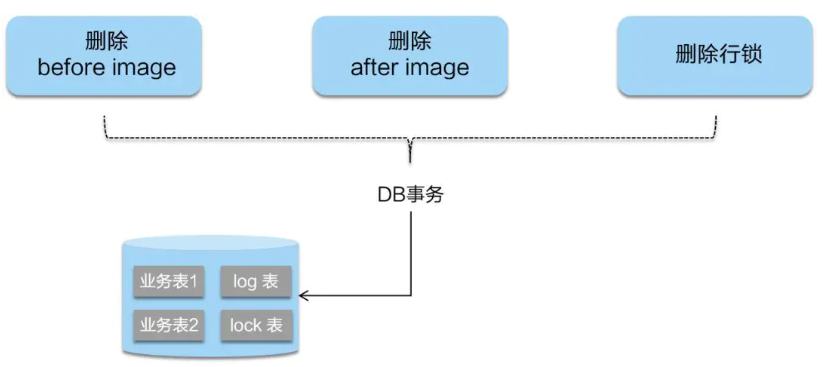
- 回滚
   - 二阶段如果是回滚的话，Seata 就需要回滚一阶段已经执行的“业务 SQL”，还原业务数据。
   - 回滚方式便是用“before image”还原业务数据；但在还原前要首先要校验脏写，对比“数据库当前业务数据”和 “after image”，
   - 如果两份数据完全一致就说明没有脏写，可以还原业务数据，如果不一致就说明有脏写，出现脏写就需要转人工处理。
### 6.4、整体流程
