# 第 1 章 框架简介

[尚硅谷SpringSecurity框架教程（spring security源码剖析从入门到精通）_哔哩哔哩_bilibili](https://www.bilibili.com/video/BV15a411A7kP)

## 1.1、概要

Spring 是非常流行和成功的 Java 应用开发框架，Spring Security 正是 Spring 家族中的成员。Spring Security 基于 Spring 框架，提供了一套 Web 应用安全性的完整解决方案。

正如你可能知道的关于安全方面的两个主要区域是“认证”和“授权”（或者访问控 制），一般来说，Web 应用的安全性包括**用户认证（Authentication）**和**用户授权 （Authorization）**两个部分，这两点也是 Spring Security 重要核心功能。

- **用户认证**
  验证某个用户是否为系统中的合法主体，也就是说用户能否访问 该系统。用户认证一般要求用户提供用户名和密码。系统通过校验用户名和密码来完成认 证过程。*通俗点说就是系统认为用户是否能登录*。

- **用户授权**

  验证某个用户是否有权限执行某个操作。在一个系统中，不同用户 所具有的权限是不同的。比如对一个文件来说，有的用户只能进行读取，而有的用户可以进行修改。一般来说，系统会为不同的用户分配不同的角色，而每个角色则对应一系列的权限。*通俗点讲就是系统判断用户是否有权限去做某些事情。*

## 1.2、历史

“Spring Security 开始于 2003 年年底,““spring 的 acegi 安全系统”。 起因是 Spring 开发者邮件列表中的一个问题,有人提问是否考虑提供一个基于 spring 的安全实现。

Spring Security 以“The Acegi Secutity System for Spring” 的名字始于 2013 年晚些 时候。一个问题提交到 Spring 开发者的邮件列表，询问是否已经有考虑一个机遇 Spring  的安全性社区实现。那时候 Spring 的社区相对较小（相对现在）。实际上 Spring 自己在 2013 年只是一个存在于 ScourseForge 的项目，这个问题的回答是一个值得研究的领 域，虽然目前时间的缺乏组织了我们对它的探索。

考虑到这一点，一个简单的安全实现建成但是并没有发布。几周后，Spring 社区的其他成 员询问了安全性，这次这个代码被发送给他们。其他几个请求也跟随而来。到 2014 年一 月大约有 20 万人使用了这个代码。这些创业者的人提出一个 SourceForge 项目加入是为 了，这是在 2004 三月正式成立。

在早些时候，这个项目没有任何自己的验证模块，身份验证过程依赖于容器管理的安全性 和 Acegi 安全性。而不是专注于授权。开始的时候这很适合，但是越来越多的用户请求额 外的容器支持。容器特定的认证领域接口的基本限制变得清晰。还有一个相关的问题增加 新的容器的路径，这是最终用户的困惑和错误配置的常见问题。

Acegi 安全特定的认证服务介绍。大约一年后，Acegi 安全正式成为了 Spring 框架的子项 目。1.0.0 最终版本是出版于 2006 -在超过两年半的大量生产的软件项目和数以百计的改 进和积极利用社区的贡献。

Acegi 安全 2007 年底正式成为了 Spring 组合项目，更名为"Spring Security"。

## 1.3、同款产品对比

### 1.3.1、Spring Security

> Spring 技术栈的组成部分。
>
> 通过提供完整可扩展的认证和授权支持保护你的应用程序。
>
> [Spring Security](https://spring.io/projects/spring-security)

**SpringSecurity 特点：**

- 和 Spring 无缝整合。
- 全面的权限控制。
- 专门为 Web 开发而设计。
  - 旧版本不能脱离 Web 环境使用。
  - 新版本对整个框架进行了分层抽取，分成了核心模块和 Web 模块。单独 引入核心模块就可以脱离 Web 环境。
-  重量级。

### 1.3.2、Shiro

> Apache 旗下的轻量级权限控制框架。

**特点：**

- 轻量级。Shiro 主张的理念是把复杂的事情变简单。针对对性能有更高要求 的互联网应用有更好表现。
- 通用性。
  - 好处：不局限于 Web 环境，可以脱离 Web 环境使用。
  - 缺陷：在 Web 环境下一些特定的需求需要手动编写代码定制。

### 1.3.3、总结

> Spring Security 是 Spring 家族中的一个安全管理框架，实际上，在 Spring Boot 出现之 前，Spring Security 就已经发展了多年了，但是使用的并不多，安全管理这个领域，一直 是 Shiro 的天下。
>
> 相对于 Shiro，在 SSM 中整合 Spring Security 都是比较麻烦的操作，所以，Spring  Security 虽然功能比 Shiro 强大，但是使用反而没有 Shiro 多（Shiro 虽然功能没有 Spring Security 多，但是对于大部分项目而言，Shiro 也够用了）。
>
> 自从有了 Spring Boot 之后，Spring Boot 对于 Spring Security 提供了自动化配置方 案，可以使用更少的配置来使用 Spring Security。
>
> 因此，一般来说，常见的安全管理技术栈的组合是这样的：
>
> - SSM + Shiro 
> - Spring Boot/Spring Cloud + Spring Security
>
> **以上只是一个推荐的组合而已，如果单纯从技术上来说，无论怎么组合，都是可以运行的。**


## 1.4、模块划分

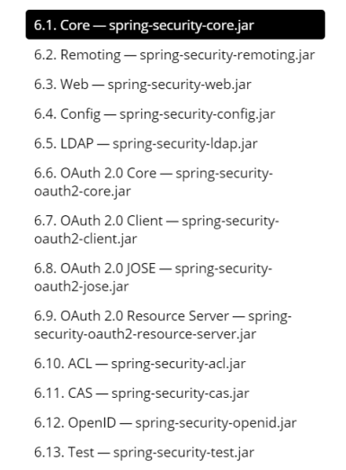


# 第 2 章 入门案例

## 2.1、创建一个项目

 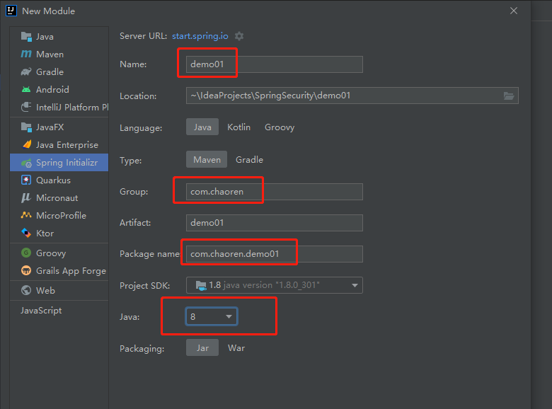

```xml
<dependency>
    <groupId>org.springframework.boot</groupId>
    <artifactId>spring-boot-starter-web</artifactId>
</dependency>

<dependency>
    <groupId>org.springframework.boot</groupId>
    <artifactId>spring-boot-starter-security</artifactId>
</dependency>
```

## 2.2、测试运行项目

- 控制器代码

  ```java
  @RestController
  @RequestMapping("/test")
  public class TestController {
  
      @RequestMapping("/hello")
      public String hello() {
          return "hello Security";
      }
  }
  ```

- 访问 `http://localhost:8080/test/hello`

- 结果
  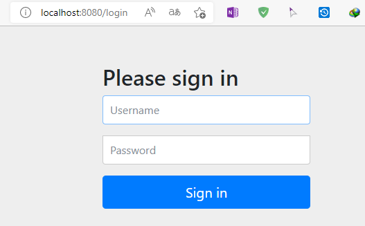

- 默认账户和密码

  > 用户名：user
  >
  > 密码：项目启动的时候在控制台会打印。【每次都会变化】


## 2.3、权限管理中的相关概念

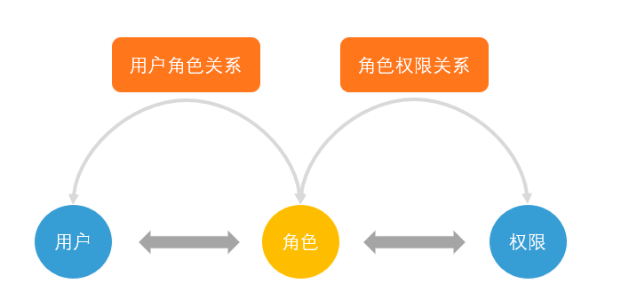

### 2.3.1、主体

- 英文单词：principal
- 使用系统的用户或设备或从其他系统远程登录的用户等等。
  简单说就是谁使用系统谁就是主体。

### 2.3.2 认证

- 英文单词：authentication
- 权限管理系统确认一个主体的身份，允许主体进入系统。
  简单说就是“主体”证明自己是谁。
  笼统的认为就是以前所做的登录操作。

### 2.3.3 授权

- 英文单词：authorization
- 将操作系统的“权力”“授予”“主体”，这样主体就具备了操作系统中特定功能的能力。
  所以简单来说，授权就是给用户分配权限。

## 2.4、SpringSecurity 基本原理

- SpringSecurity 本质是一个过滤器链：
  从启动是可以获取到过滤器链：

  ```xml
  org.springframework.security.web.context.request.async.WebAsyncManagerIntegrationFilter
  org.springframework.security.web.context.SecurityContextPersistenceFilter 
  org.springframework.security.web.header.HeaderWriterFilter
  org.springframework.security.web.csrf.CsrfFilter
  org.springframework.security.web.authentication.logout.LogoutFilter 
  org.springframework.security.web.authentication.UsernamePasswordAuthenticationFilter 
  org.springframework.security.web.authentication.ui.DefaultLoginPageGeneratingFilter 
  org.springframework.security.web.authentication.ui.DefaultLogoutPageGeneratingFilter
  org.springframework.security.web.savedrequest.RequestCacheAwareFilter
  org.springframework.security.web.servletapi.SecurityContextHolderAwareRequestFilter
  org.springframework.security.web.authentication.AnonymousAuthenticationFilter 
  org.springframework.security.web.session.SessionManagementFilter 
  org.springframework.security.web.access.ExceptionTranslationFilter 
  org.springframework.security.web.access.intercept.FilterSecurityInterceptor
  ```

- 代码底层流程，重点看三个过滤器：

  - FilterSecurityInterceptor：是一个方法级的权限过滤器, 基本位于过滤链的最底部。

    ```java
    @Override
    public void doFilter(ServletRequest request, ServletResponse response, FilterChain chain)
    		throws IOException, ServletException {
    	invoke(new FilterInvocation(request, response, chain));
    }
    ```

    ```java
    public void invoke(FilterInvocation filterInvocation) throws IOException, ServletException {
        if (isApplied(filterInvocation) && this.observeOncePerRequest) {
            // filter already applied to this request and user wants us to observe
            // once-per-request handling, so don't re-do security checking
            filterInvocation.getChain().doFilter(filterInvocation.getRequest(), filterInvocation.getResponse());
            return;
        }
        // first time this request being called, so perform security checking
        if (filterInvocation.getRequest() != null && this.observeOncePerRequest) {
            filterInvocation.getRequest().setAttribute(FILTER_APPLIED, Boolean.TRUE);
        }
        InterceptorStatusToken token = super.beforeInvocation(filterInvocation);//查看之前的 filter 是否通过。
        try {
            //真正的调用后台的服务。
            filterInvocation.getChain().doFilter(filterInvocation.getRequest(), filterInvocation.getResponse());
        }
        finally {
            super.finallyInvocation(token);
        }
        super.afterInvocation(token, null);
    }
    ```

  - ExceptionTranslationFilter：是个异常过滤器，用来处理在认证授权过程中抛出的异常

  - UsernamePasswordAuthenticationFilter ：对/login 的 POST 请求做拦截，校验表单中用户名，密码。

## 2.5、过滤器加载过程

- SecurityFilterAutoConfiguration

  ```java
  @Bean
  @ConditionalOnBean(name = DEFAULT_FILTER_NAME)
  public DelegatingFilterProxyRegistrationBean securityFilterChainRegistration(
  		SecurityProperties securityProperties) {
  	DelegatingFilterProxyRegistrationBean registration = new DelegatingFilterProxyRegistrationBean(
  			DEFAULT_FILTER_NAME);
  	registration.setOrder(securityProperties.getFilter().getOrder());
  	registration.setDispatcherTypes(getDispatcherTypes(securityProperties));
  	return registration;
  }
  ```

  > 自动配置类首先往容器中添加DelegatingFilterProxyRegistrationBean

- DelegatingFilterProxyRegistrationBean

  ```java
  @Override
  public DelegatingFilterProxy getFilter() {
      return new DelegatingFilterProxy(this.targetBeanName, getWebApplicationContext()) {
  
          @Override
          protected void initFilterBean() throws ServletException {
              // Don't initialize filter bean on init()
          }
  
      };
  }
  ```

- DelegatingFilterProxy

  ```java
  @Override
  public void doFilter(ServletRequest request, ServletResponse response, FilterChain filterChain)
        throws ServletException, IOException {
  
     // Lazily initialize the delegate if necessary.
     Filter delegateToUse = this.delegate;
     if (delegateToUse == null) {
        synchronized (this.delegateMonitor) {
           delegateToUse = this.delegate;
           if (delegateToUse == null) {
              WebApplicationContext wac = findWebApplicationContext();
              if (wac == null) {
                 throw new IllegalStateException("No WebApplicationContext found: " +
                       "no ContextLoaderListener or DispatcherServlet registered?");
              }
              delegateToUse = initDelegate(wac);//获取过滤链代理FilterChainProxy
           }
           this.delegate = delegateToUse;
        }
     }
  
     // Let the delegate perform the actual doFilter operation.
     invokeDelegate(delegateToUse, request, response, filterChain);//调用过滤链
  }
  ```

- FilterChainProxy

  ```java
  private void doFilterInternal(ServletRequest request, ServletResponse response, FilterChain chain)
        throws IOException, ServletException {
     FirewalledRequest firewallRequest = this.firewall.getFirewalledRequest((HttpServletRequest) request);
     HttpServletResponse firewallResponse = this.firewall.getFirewalledResponse((HttpServletResponse) response);
     List<Filter> filters = getFilters(firewallRequest);//加载所有过滤器
     if (filters == null || filters.size() == 0) {
        if (logger.isTraceEnabled()) {
           logger.trace(LogMessage.of(() -> "No security for " + requestLine(firewallRequest)));
        }
        firewallRequest.reset();
        chain.doFilter(firewallRequest, firewallResponse);
        return;
     }
     if (logger.isDebugEnabled()) {
        logger.debug(LogMessage.of(() -> "Securing " + requestLine(firewallRequest)));
     }
     VirtualFilterChain virtualFilterChain = new VirtualFilterChain(firewallRequest, chain, filters);
     virtualFilterChain.doFilter(firewallRequest, firewallResponse);
  }
  ```

## 2.6、UserDetailsService 接口讲解

- 当什么也没有配置的时候，账号和密码是由 Spring Security 定义生成的。

- 而在实际项目中账号和密码都是从数据库中查询出来的。 所以我们要通过自定义逻辑控制认证逻辑。

- 如果需要自定义逻辑时，只需要实现 UserDetailsService 接口即可。接口定义如下：

  ```java
  public interface UserDetailsService {
     UserDetails loadUserByUsername(String username) throws UsernameNotFoundException;
  }
  ```

- 返回值 UserDetails

  - 这个类是系统默认的用户**“主体”**

    ```java
    public interface UserDetails extends Serializable {
    
    	// 获取登录用户所有权限
    	Collection<? extends GrantedAuthority> getAuthorities();
    
    	// 获取密码
    	String getPassword();
    
    	// 获取用户名
    	String getUsername();
    
    	// 判断账户是否过期
    	boolean isAccountNonExpired();
    
    	// 判断账户是否被锁定
    	boolean isAccountNonLocked();
    
    	// 凭证{密码}是否过期
    	boolean isCredentialsNonExpired();
    
    	// 当前用户是否可用
    	boolean isEnabled();
    
    }
    ```

  - 以下是 UserDetails 实现类。
    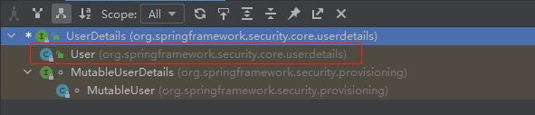

  - 以后我们只需要使用 User 这个实体类即可！

    ```java
    public User(String username, String password, Collection<? extends GrantedAuthority> authorities) {
       this(username, password, true, true, true, true, authorities);
    }
    ```

  - 方法参数 username
    表示用户名。此值是客户端表单传递过来的数据。默认情况下必须叫 username，否则无 法接收。

    

- **使用流程**

  - 创建类继承 `UsernamePasswordAuthenticationFilter` 【验证用户信息】

    > 重写三个方法：
    >
    > attemptAuthentication	尝试验证
    >
    > successfulAuthentication	验证成功
    >
    > unsuccessfulAuthentication	验证失败

  - 创建类实现`UserDetailsService`

    > 编写查询数据过程，返回User对象。
    >
    > User对象是安全框架提供的


## 2.7、PasswordEncoder 接口讲解

> 密码编码器
>
> 对密码进行编码，验证

- 接口相关方法

  ```java
  public interface PasswordEncoder {
  
     // 把参数按照特定的解析规则进行解析
     String encode(CharSequence rawPassword);
  
     //表示验证从存储中获取的编码密码与编码后提交的原始密码是否匹配。
     //如果密码匹配，则返回 true；如果不匹配，则返回false。
     //第一个参数表示需要被解析的密码。第二个参数表示存储的密码。
     boolean matches(CharSequence rawPassword, String encodedPassword);
  
     // 表示如果解析的密码能够再次进行解析且达到更安全的结果则返回 true，否则返回false。默认返回 false。
     default boolean upgradeEncoding(String encodedPassword) {
        return false;
     }
  }
  ```

- 接口实现类
  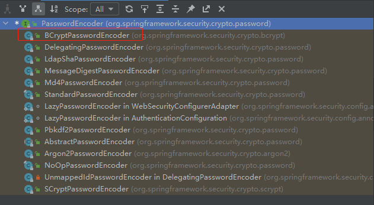

  > BCryptPasswordEncoder 是 Spring Security 官方推荐的密码解析器，平时多数情况下使用这个解析器。
  >
  > BCryptPasswordEncoder 是对 bcrypt 强散列方法的具体实现。
  >
  > 是基于 Hash 算法实现的单向加密。可以通过 strength 控制加密强度，默认 10。

- BCryptPasswordEncoder常用方法演示

  ```java
  @Test
  public void test01() {
      //创建密码解析器
      BCryptPasswordEncoder encoder = new BCryptPasswordEncoder();
      //对密码进行加密
      String chaoRen = encoder.encode("chaoRen");
      //打印加密后的密码
      System.out.println(chaoRen);
      //判断原字符加密后与加密前是否匹配
      boolean b = encoder.matches("chaoRen", chaoRen);
      //打印匹配结果
      System.out.println(b);
  }
  ```


## 2.8、SpringBoot 对 Security 的自动配置

[Spring Security Reference](https://docs.spring.io/spring-security/site/docs/5.3.4.RELEASE/reference/html5/#servlet-hello)


# 第 3 章 Web 权限方案

## 3.1、设置登录系统的账号、密码

### 3.1.1、方式一：

在 application.yaml

```yaml
spring:
  security:
    user:
      name: chao
      password: 123
```

### 3.1.2、方式二：

编写配置类实现接口 `WebSecurityConfigurerAdapter` 重写 `configure` 方法

```java
@Configuration
public class SecurityConfig extends WebSecurityConfigurerAdapter {
    @Override
    protected void configure(AuthenticationManagerBuilder auth) throws Exception {
        String password = bCryptPasswordEncoder().encode("123456");
        auth.inMemoryAuthentication().withUser("ren").password(password).roles("admin");
    }

    @Bean
    BCryptPasswordEncoder bCryptPasswordEncoder() {
        return new BCryptPasswordEncoder();
    }
}
```

下面方式也可以：

```java
@Configuration
public class SecurityConfig {
    @Bean
    public UserDetailsService userDetailService() {
        //使用org.springframework.security.core.userdetails.User类来定义用户
        //定义两个用户
        UserDetails user1 = User.builder().username("eric").password(bCryptPasswordEncoder().encode("123456")).roles("student").build();
        UserDetails user2 = User.builder().username("thomas").password(bCryptPasswordEncoder().encode("123456")).roles("teacher").build();
        //创建两个用户
        InMemoryUserDetailsManager userDetailsManager = new InMemoryUserDetailsManager();
        userDetailsManager.createUser(user1);
        userDetailsManager.createUser(user2);
        return userDetailsManager;
    }

    @Bean
    BCryptPasswordEncoder bCryptPasswordEncoder() {
        return new BCryptPasswordEncoder();
    }
}
```


### 3.1.3、方式三：

自定义类实现 `UserDetailsService` 接口进行配置。

- 实现  `UserDetailsService` 

  ```java
  @Service("userDetailsService")
  public class MyUserDetailsService implements UserDetailsService {
      @Override
      public UserDetails loadUserByUsername(String username) throws UsernameNotFoundException {
          List<GrantedAuthority> authorities = AuthorityUtils.commaSeparatedStringToAuthorityList("role");
          //系统提供的实现了UserDetails的User;authorities不能为空
          return new User("yue",new BCryptPasswordEncoder().encode("12345"),authorities);
      }
  }
  ```

- 编写配置类

  ```java
  @Configuration
  public class SecurityConfig02 extends WebSecurityConfigurerAdapter {
  
      @Autowired
      private UserDetailsService userDetailsService;//上面的UserDetailsService
  
      @Override
      protected void configure(AuthenticationManagerBuilder auth) throws Exception {
          auth.userDetailsService(userDetailsService).passwordEncoder(passwordEncoder());
      }
  
      @Bean
      BCryptPasswordEncoder passwordEncoder() {
          return new BCryptPasswordEncoder();
      }
  }
  ```


## 3.2、数据库认证登录

### 3.2.1、准备 sql

```sql
create database `security` /*!40100 DEFAULT CHARACTER SET utf8mb4 */;

use `security`;

create table users(
`id` bigint primary key auto_increment,
`username` varchar(20) unique not null,
`password` varchar(100)
);
-- 密码 1234
insert into users values(1,'chao','$2a$10$pjheTM0PyaE9DdvKT1v5euRufKoWyVbpLxmzoOOGe82YkDoZCQ0hO');
-- 密码 1234
insert into users values(2,'yue','$2a$10$pjheTM0PyaE9DdvKT1v5euRufKoWyVbpLxmzoOOGe82YkDoZCQ0hO');


create table role(
`id` bigint primary key auto_increment,
`name` varchar(20)
);
insert into role values(1,'管理员');
insert into role values(2,'普通用户');


create table role_user(
`uid` bigint,
`rid` bigint
);
insert into role_user values(1,1);
insert into role_user values(2,2);


create table menu(
`id` bigint primary key auto_increment,
`name` varchar(20),
`url` varchar(100),
`parentid` bigint,
`permission` varchar(20)
);
insert into menu values(1,'系统管理','',0,'menu:system');
insert into menu values(2,'用户管理','',0,'menu:user');


create table role_menu(
`mid` bigint,
`rid` bigint
);
insert into role_menu values(1,1);
insert into role_menu values(2,1);
insert into role_menu values(2,2);
```


### 3.2.2、添加依赖

```xml
<dependency>
    <groupId>org.springframework.boot</groupId>
    <artifactId>spring-boot-starter-web</artifactId>
</dependency>

<dependency>
    <groupId>org.springframework.boot</groupId>
    <artifactId>spring-boot-starter-security</artifactId>
</dependency>

<dependency>
    <groupId>org.springframework.boot</groupId>
    <artifactId>spring-boot-starter-test</artifactId>
    <scope>test</scope>
</dependency>

<!--mybatis-plus-->
<dependency>
    <groupId>com.baomidou</groupId>
    <artifactId>mybatis-plus-boot-starter</artifactId>
    <version>3.5.1</version>
</dependency>
<!--mysql-->
<dependency>
    <groupId>mysql</groupId>
    <artifactId>mysql-connector-java</artifactId>
</dependency>
<!--lombok 用来简化实体类-->
<dependency>
    <groupId>org.projectlombok</groupId>
    <artifactId>lombok</artifactId>
</dependency>
```

### 3.2.3、编写实体类

```java
@Data
public class Users {
    private Integer id;
    private String username;
    private String password;
}
```

### 3.2.4、整合 MybatisPlus 编写 mapper

**mapper**：

```java
@Repository
public interface UsersMapper extends BaseMapper<Users> {
}
```

**mysql 数据库连接**：

```yaml
spring:
  datasource:
    url: jdbc:mysql://localhost:3306/security?serverTimezone=GMT%2B8
    username: root
    password: 123
    driver-class-name: com.mysql.cj.jdbc.Driver
```

**加 `@MapperScan`** 

```java
@SpringBootApplication
@MapperScan("com.chaoren.demo01.mapper")
public class Demo01Application {

    public static void main(String[] args) {
        SpringApplication.run(Demo01Application.class, args);
    }

}
```


### 3.2.5、编写UserDetailsService实现类

```java
@Service("userDetailsService")
public class SqlUserDetailsService implements UserDetailsService {

    @Autowired
    private UsersMapper usersMapper;

    @Override
    public UserDetails loadUserByUsername(String username) throws UsernameNotFoundException {
        QueryWrapper<Users> queryWrapper = new QueryWrapper<>();
        queryWrapper.eq("username", username);
        Users users = usersMapper.selectOne(queryWrapper);
        if (users == null) {
            throw new UsernameNotFoundException("用户不存在！！");
        }
        System.out.println(users);
        List<GrantedAuthority> auths = AuthorityUtils.commaSeparatedStringToAuthorityList("role");
        return new User(users.getUsername(),users.getPassword(),auths);
    }
}
```

### 3.2.6、测试访问

> 根据数据库用户名密码进行访问。


## 3.3、自定义登陆页面

### 3.3.1、配置类设置

```java
@Configuration
public class SecurityConfig03 extends WebSecurityConfigurerAdapter {

    @Autowired
    private UserDetailsService userDetailsService;

    @Override
    protected void configure(AuthenticationManagerBuilder auth) throws Exception {
        auth.userDetailsService(userDetailsService).passwordEncoder(passwordEncoder());
    }

    @Override
    protected void configure(HttpSecurity http) throws Exception {
        http.formLogin()    //自定义自己编写的登陆页面
                .loginPage("/login.html")   //登陆页面设置
                .loginProcessingUrl("/user/login")  //登陆访问路径
                .successForwardUrl("/success")   //登陆成功后跳转页面，或.defaultSuccessUrl("/success",true)
                .failureForwardUrl("/fail") //登陆失败后跳转的页面
                .permitAll();	//需要permitAll()结束，不然登陆页面也没法访问

        http.authorizeRequests()
                .antMatchers("/", "/test/hello", "/test/index").permitAll() //设置不需要登陆可以直接访问的页面
                .anyRequest()   //其他请求
                .authenticated();   //需要认证

        http.csrf()
                .disable();    //关闭csrf防护
    }

    @Bean
    BCryptPasswordEncoder passwordEncoder() {
        return new BCryptPasswordEncoder();
    }
}
```

> `.loginPage("/authenticate") ` 设置后。默认：
>
> | 路径                 | 请求方式 | 功能                                     |
> | -------------------- | -------- | ---------------------------------------- |
> | /authenticate        | GET      | 登录表单                                 |
> | /authenticate        | POST     | 处理凭据，如果有效，则对用户进行身份验证 |
> | /authenticate?error  | GET      | 在此处重定向失败的身份验证尝试           |
> | /authenticate?logout | GET      | 成功注销后重定向到这里                   |

### 3.3.2、编写登陆页面

login.html

```html
<form action="/user/login" method="post">
    <!--用户名和密码的name必须为username和password-->
    用户名：<input name="username" type="text"><br>
    密码：<input name="password" type="password"><br>
    <input type="submit" value="登陆">
</form>
```

注意：

> 页面提交方式必须为 post 请求，所以上面的页面不能使用，用户名，密码必须为 username,password
>
> 因为在执行登录的时候会走一个过滤器 `UsernamePasswordAuthenticationFilter`
>
> 也可以通过配置类进行修改。


### 3.3.2、修改表单属性名

如果修改配置可以调用 usernameParameter()和 passwordParameter()方法。

```java
@Override
protected void configure(HttpSecurity http) throws Exception {
    http.formLogin()    //自定义自己编写的登陆页面
            .loginPage("/login.html")   //登陆页面设置
            .loginProcessingUrl("/user/login")  //登陆访问路径
            .defaultSuccessUrl("/success",true)	//登陆成功后跳转页面
        	.permitAll()
            .usernameParameter("loginAcct") //表单用户名属性名
            .passwordParameter("userPwd");   //表单密码属性名
}
```

```html
<form action="/user/login" method="post">
    <!--用户名和密码的name必须为username和password-->
    用户名：<input name="loginAcct" type="text"><br>
    密码：<input name="userPwd" type="password"><br>
    <input type="submit" value="登陆">
</form>
```


## 3.4、基于角色或权限进行访问控制

### 3.4.1、hasAuthority 方法

> 如果当前的主体具有指定的权限，则返回 true,否则返回 false

- 修改配置类

  ```java
  @Override
  protected void configure(HttpSecurity http) throws Exception {
      http.authorizeRequests()
              .antMatchers("/test/01").hasAuthority("admins") //设置有admins权限的可以访问
              .antMatchers("/", "/test/hello", "/test/index").permitAll() //设置不需要登陆可以直接访问的页面
              .anyRequest()   //其他请求
              .authenticated();   //需要认证
  
      http.csrf()
              .disable();    //关闭csrf防护
  }
  ```

- `UserDetailsService` 给用户登录主体赋予权限

  ```java
  @Override
  public UserDetails loadUserByUsername(String username) throws UsernameNotFoundException {
      QueryWrapper<Users> queryWrapper = new QueryWrapper<>();
      queryWrapper.eq("username", username);
      Users users = usersMapper.selectOne(queryWrapper);
      if (users == null) {
          throw new UsernameNotFoundException("用户不存在！！");
      }
      System.out.println(users);
      List<GrantedAuthority> auths = AuthorityUtils
              .commaSeparatedStringToAuthorityList("admins,user");//设置权限
      return new User(users.getUsername(),users.getPassword(),auths);
  }
  ```


### 3.4.2、hasAnyAuthority 方法

> 如果当前主体提供的权限有其中任何一个（给定的作为一个逗号分隔的字符串列表）的话，返回 true。

- 修改配置类

  ```java
  @Override
  protected void configure(HttpSecurity http) throws Exception {
      http.authorizeRequests()
              ..antMatchers("/test/01").hasAnyAuthority("admins,user") //用户只要有admins,user其中一个都可以访问
              .antMatchers("/", "/test/hello", "/test/index").permitAll() //设置不需要登陆可以直接访问的页面
              .anyRequest()   //其他请求
              .authenticated();   //需要认证
  
      http.csrf()
              .disable();    //关闭csrf防护
  }
  ```


### 3.4.3、hasRole 方法

> 如果用户具备给定角色就允许访问,否则出现 403。
>
> 如果当前主体具有指定的角色，则返回 true。

- 底层源码：

  ```java
  rolePrefix = "ROLE_";
  
  private static String hasRole(String rolePrefix, String role) {
  	Assert.notNull(role, "role cannot be null");
  	Assert.isTrue(rolePrefix.isEmpty() || !role.startsWith(rolePrefix), () -> "role should not start with '"
  			+ rolePrefix + "' since it is automatically inserted. Got '" + role + "'");
  	return "hasRole('" + rolePrefix + role + "')";
  }
  ```

- `UserDetailsService` 给用户添加角色：

  > 注意：根据源码发现，角色前面必须加ROLE_

  ```java
  @Override
  public UserDetails loadUserByUsername(String username) throws UsernameNotFoundException {
  	QueryWrapper<Users> queryWrapper = new QueryWrapper<>();
  	queryWrapper.eq("username", username);
  	Users users = usersMapper.selectOne(queryWrapper);
  	if (users == null) {
  		throw new UsernameNotFoundException("用户不存在！！");
  	}
  	System.out.println(users);
  	List<GrantedAuthority> auths = AuthorityUtils
  			.commaSeparatedStringToAuthorityList("admins,ROLE_admin");//角色前面必须加ROLE_
  	return new User(users.getUsername(),users.getPassword(),auths);
  }
  ```

- 修改配置文件：

  > 注意配置文件中不需要添加”ROLE_“，因为上述的底层代码会自动添加与之进行匹配。

  ```java
  http.authorizeRequests()
  		.antMatchers("/test/01").hasRole("admin") //用户拥有admin角色才能访问
  		.anyRequest()   //其他请求
  		.authenticated();   //需要认证
  ```


### 3.4.4、hasAnyRole 方法

> 表示用户具备任何一个条件都可以访问。

- 给用户添加角色：

  ```java
  List<GrantedAuthority> auths = AuthorityUtils
      .commaSeparatedStringToAuthorityList("admins,ROLE_admin,ROLE_admin2");//角色前面必须加ROLE_
  ```

- 修改配置文件：

  ```java
  http.authorizeRequests()
  		.antMatchers("/test/01").hasAnyRole("admin,role") //用户只要拥有admin,role其中一个角色都可以访问
  		.anyRequest()   //其他请求
  		.authenticated();   //需要认证
  ```

  

## 3.5、基于数据库实现权限认证

### 3.5.1、添加实体类

```java
@Data
public class Menu {
    private Long id;
    private String name;
    private String url;
    private Long parentId;
    private String permission;
}
```

```java
@Data
public class Role {
    private Long id;
    private String name;
}
```

### 3.5.2、编写接口

UserInfoMapper

```java
@Repository
public interface UserInfoMapper extends BaseMapper<Users> {
    /**
     * 根据用户 Id 查询用户角色
     */
    List<Role> selectRoleByUserId(Long userId);
    /**
     * 根据用户 Id 查询菜单
     */
    List<Menu> selectMenuByUserId(Long userId);

    Users selectByUsername(@Param("username") String username);

}
```

> 上述接口需要进行多表管理查询：
>
> 需要在 resource/mapper 目录下自定义 UserInfoMapper.xml 

```xml
<?xml version="1.0" encoding="UTF-8" ?>
<!DOCTYPE mapper
        PUBLIC "-//mybatis.org//DTD Mapper 3.0//EN"
        "http://mybatis.org/dtd/mybatis-3-mapper.dtd">
<mapper namespace="com.chaoren.demo01.mapper.UserInfoMapper">
    <!--根据用户 Id 查询角色信息-->
    <select id="selectRoleByUserId" resultType="com.chaoren.demo01.bean.Role">
        SELECT r.id, r.name
        FROM role r
                 INNER JOIN role_user ru ON
            ru.rid = r.id
        where ru.uid = #{0}
    </select>
    <!--根据用户 Id 查询权限信息-->
    <select id="selectMenuByUserId" resultType="com.chaoren.demo01.bean.Menu">
        SELECT m.id, m.name, m.url, m.parentid, m.permission
        FROM menu m
                 INNER JOIN role_menu rm ON m.id = rm.mid
                 INNER JOIN role r ON r.id = rm.rid
                 INNER JOIN role_user ru ON r.id = ru.rid
        WHERE ru.uid = #{0}
    </select>
    <select id="selectByUsername" resultType="com.chaoren.demo01.bean.Users">
        select *
        from users
        where
        username = #{username,jdbcType=VARCHAR}
    </select>

</mapper>
```


### 3.5.3、编写UserDetailsService实现类

```java
@Service("userDetailsService")
public class UsersServiceImpl implements UserDetailsService {

    @Autowired
    private UserInfoMapper userInfoMapper;

    @Override
    public UserDetails loadUserByUsername(String username) throws UsernameNotFoundException {
        Users users = userInfoMapper.selectByUsername(username);
        if (users == null) {
            throw new UsernameNotFoundException("用户不存在！！");
        }
        Long id = (long) users.getId();
        //获取到用户角色和菜单列表
        List<Role> roles = userInfoMapper.selectRoleByUserId(id);
        List<Menu> menus = userInfoMapper.selectMenuByUserId(id);

        //声明应该List<GrantedAuthority>集合
        List<GrantedAuthority> grantedAuthorities = new ArrayList<>();
        //处理角色
        for (Role role : roles) {
            grantedAuthorities.add(new SimpleGrantedAuthority("ROLE_" + role.getName()));
        }
        //处理权限
        for (Menu menu : menus) {
            grantedAuthorities.add(new SimpleGrantedAuthority(menu.getPermission()));
        }

        //将角色，权限添加到当前用户
        return new User(username,users.getPassword(),grantedAuthorities);
    }
}
```


### 3.5.4、修改访问配置类

```java
http.authorizeRequests()
        .antMatchers("/test/01").hasRole("管理员") //管理员才能访问
        .antMatchers("/test/02").hasAnyAuthority("menu:system") //有menu:system权限才能访问
        .anyRequest()   //其他请求
        .authenticated();   //需要认证
```


### 3.5.5、使用管理员与非管理员进行测试

> 如果非管理员测试会提示 403 没有权限

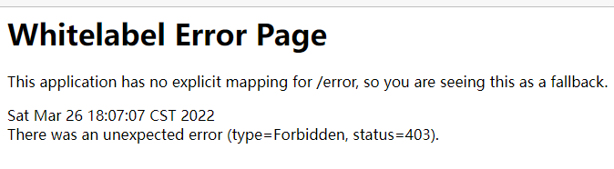

## 3.6、自定义 403 页面

### 3.6.1、修改访问配置类

方式一：

```java
http.exceptionHandling().accessDeniedPage("/unauthorized.html");
```

方式二：

```java
http.exceptionHandling()
    .accessDeniedHandler((request,response,accessDeniedException) -> {
        request.setAttribute("message", accessDeniedException.getMessage());
        request.getRequestDispatcher("/WEB-INF/views/no_auth.jsp").forward(request, response);
    });
```


### 3.6.2、添加静态页面或控制器方法

```html
<body>
<h1>对不起，您没有权限访问！</h1>
</body>
```


## 3.7、注解使用

### 3.7.1、@Secured

> 判断是否具有角色，另外需要注意的是这里匹配的字符串需要添加前缀“ROLE_“。
>
> 使用注解先要开启注解功能！

- 开启注解功能
  在主程序或者配置类上面添加 `@EnableGlobalMethodSecurity(securedEnabled=true)`

  ```java
  @SpringBootApplication
  @EnableGlobalMethodSecurity(securedEnabled=true)
  public class Demo01Application {
      public static void main(String[] args) {
          SpringApplication.run(Demo01Application.class, args);
      }
  }
  ```

- 在控制器方法上添加注解

  ```java
  @RequestMapping("/testSecured")
  @Secured("ROLE_管理员")
  public String testSecured() {
      return "hello testSecured!!";
  }
  ```


### 3.7.2、@PreAuthorize

> 进入方法前的权限验证
>
> hasAuthority()，hasAnyAuthority()，hasRole()，hasAnyRole()
>
> 上面四个都可以使用，同配置类里面的使用方法相同
>
> PreAuthorize 可以将登录用户的 roles/permissions 参数传到方法中。

- 开启注解功能：
  在主程序或者配置类上面添加

  ```java
  @SpringBootApplication
  @EnableGlobalMethodSecurity(securedEnabled=true,prePostEnabled = true)
  public class Demo01Application {
  }
  ```

- 在控制器方法上添加注解

  ```java
  @RequestMapping("/testPreAuthorize")
  @PreAuthorize("hasRole('管理员')")
  public String testPreAuthorize() {
      System.out.println("进入到方法了！！");
      return "hello testPreAuthorize!!";
  }
  ```


### 3.7.3、@PostAuthorize

> 使用并不多，在方法执行后再进行权限验证，适合验证带有返回值的权限。
>
> 其他使用与上面@PreAuthorize类似

- 开启注解功能：
  在主程序或者配置类上面添加

  ```java
  @EnableGlobalMethodSecurity(prePostEnabled = true)
  ```

- 在控制器方法上添加注解

  ```java
  @RequestMapping("/testPostAuthorize")
  @PostAuthorize("hasRole('管理员')")
  public String testPostAuthorize() {
      System.out.println("进入到方法了！！");
      return "hello testPostAuthorize!!";
  }
  ```

  

### 3.7.4、@PostFilter

> 权限验证之后对数据进行过滤 留下用户名是 admin1 的数据
>
> 表达式中的 filterObject 引用的是方法返回值 List 中的某一个元素

- 在控制器方法上添加注解

  ```java
  @RequestMapping("/getAll")
  @PreAuthorize("hasRole('ROLE_管理员')")
  @PostFilter("filterObject.username == 'admin1'")
  public List<Users> getAllUser(){
      ArrayList<Users> list = new ArrayList<>();
      list.add(new Users(1,"admin1","6666"));
      list.add(new Users(2,"admin2","888"));
      return list;
  }
  ```

- 浏览器访问`/getAll`结果

  ```json
  [{"id":1,"username":"admin1","password":"6666"}]
  ```


### 3.7.5、@PreFilter

> 进入控制器之前对数据进行过滤。
>
> 

- 在控制器方法上添加注解

  ```java
  @RequestMapping("/getTestPreFilter")
  @PreAuthorize("hasRole('ROLE_管理员')")
  @PreFilter(value = "filterObject.id%2==0")
  public List<Users> getTestPreFilter(@RequestBody List<Users> list){
      list.forEach(t-> {
          System.out.println(t.getId()+"\t"+t.getUsername());
      });
      return list;
  }
  ```

- 先登录，然后使用 postman 进行测试
  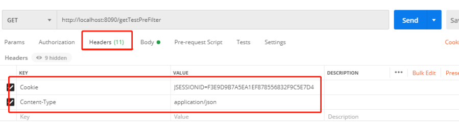
  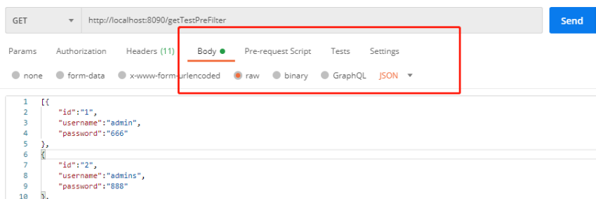

- 测试是数据

  ```json
  [{
      "id":1,
      "username":"admin1",
      "password":"6666"
  },
  {
      "id":2,
      "username":"admin2",
      "password":"6666"
  },
  {
      "id":3,
      "username":"admin3",
      "password":"6666"
  },
  {
      "id":4,
      "username":"admin4",
      "password":"6666"
  },
  {
      "id":5,
      "username":"admin5",
      "password":"6666"
  }]
  ```

- 测试的结果
  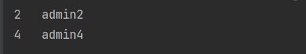

  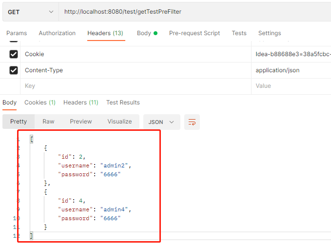


### 3.7.6、权限表达式

[Spring Security Reference](https://docs.spring.io/spring-security/site/docs/5.3.4.RELEASE/reference/html5/#el-access)


## 3.8、基于数据库的记住我

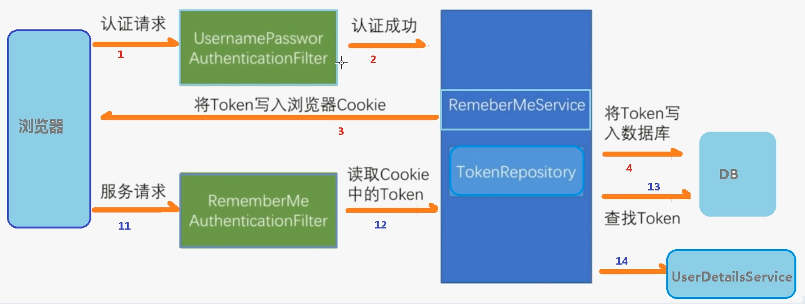

### 3.8.1、创建表

```sql
create table `persistent_logins` (
 `username` varchar(64) not null,
 `series` varchar(64) not null,
 `token` varchar(64) not null,
 `last_used` timestamp not null default current_timestamp on update 
current_timestamp,
 primary key (`series`)
) engine=innodb default charset=utf8;
```

### 3.8.2、添加数据库的配置文件

```yaml
spring:
  datasource:
    url: jdbc:mysql://localhost:3306/security?serverTimezone=GMT%2B8
    username: root
    password: 123
    driver-class-name: com.mysql.cj.jdbc.Driver
```

### 3.8.3、编写配置类

```java
@Autowired
private DataSource dataSource;

@Bean
public PersistentTokenRepository persistentTokenRepository() {
    JdbcTokenRepositoryImpl jdbcTokenRepository = new JdbcTokenRepositoryImpl();
    // 赋值数据源
    jdbcTokenRepository.setDataSource(dataSource);
    // 自动创建表,第一次执行会创建，以后要执行就要删除掉！
    //jdbcTokenRepository.setCreateTableOnStartup(true);
    return jdbcTokenRepository;
}
```

### 3.8.4、修改安全配置类

```java
@Autowired
private UsersServiceImpl usersService;
@Autowired
private PersistentTokenRepository tokenRepository;
// 开启记住我功能
http.rememberMe()
		.tokenRepository(tokenRepository)//如果在同一个配置类里面，需要直接调用方法persistentTokenRepository()
		.userDetailsService(userDetailsService);
```

### 3.8.5、页面添加记住我复选框

```html
记住我：<input type="checkbox"name="remember-me"title="记住密码"/><br/>
```

> 此处：name 属性值必须位 `remember-me` 。
>
> 如果不能使用 `remember-me` 作为请求参数名称，可以使用 `http.rememberMe().rememberMeParameter()` 方法定制。

### 3.8.6、登录测试

> 登录成功之后，关闭浏览器再次访问，发现依然可以使用！

### 3.8.7、设置有效期

> 默认 2 周时间。但是可以通过设置状态有效时间，即使项目重新启动下次也可以正常登录。

```java
http.rememberMe()
        .tokenValiditySeconds(20)   //单位是秒
        .tokenRepository(persistentTokenRepository())
        .userDetailsService(userDetailsService);
```

### 3.8.8、基于内存记住我

其他不需要设置，只需要在登录页面添加记住我复选框就可以了。


## 3.9、用户注销

### 3.9.1、添加退出连接

```html
<body>
登录成功<br>
<a href="/logout">退出</a>
</body>
```

> 注意：
>
> 如果开启了CRSF防护，需要使用POST请求并携带CRSF令牌退出。
>
> ```html
> <form action="/logout" method="post">
>     <input type="hidden" th:if="${_csrf}!=null" th:value="${_csrf.token}" name="_csrf"/>
>     <input type="submit" value="退出">
> </form>
> ```

### 3.9.2、配置类中添加退出映射地址

```java
http.logout()
		.logoutUrl("/logout")   //退出链接
		.logoutSuccessUrl("/index") //退出后跳转的地址
		.permitAll();
```


## 3.10、CSRF

### 3.10.1、CSRF 理解

跨站请求伪造（英语：Cross-site request forgery），也被称为 one-click attack 或者 session riding，通常缩写为 CSRF 或者 XSRF，是一种挟制用户在当前已登录的 Web 应用程序上执行非本意的操作的攻击方法。跟跨网站脚本（XSS）相比，XSS利用的是用户对指定网站的信任，CSRF 利用的是网站对用户网页浏览器的信任。

跨站请求攻击，简单地说，是攻击者通过一些技术手段欺骗用户的浏览器去访问一个自己曾经认证过的网站并运行一些操作（如发邮件，发消息，甚至财产操作如转账和购买商品）。由于浏览器曾经认证过，所以被访问的网站会认为是真正的用户操作而去运行。这利用了 web中用户身份验证的一个漏洞：简单的身份验证只能保证请求发自某个用户的浏览器，却不能保证请求本身是用户自愿发出的。

从 Spring Security 4.0 开始，默认情况下会启用 CSRF 保护，以防止 CSRF 攻击应用程序，Spring Security CSRF 会针对 PATCH，POST，PUT 和 DELETE 方法进行防护。

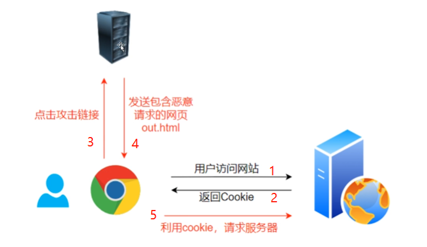

### 3.10.2、案例

- 关闭安全配置的类中的 CRSF

  ```java
  //        http.csrf()
  //                .disable();    //关闭csrf防护
  ```

- 设置CRSF令牌

  > 在PATCH，POST，PUT 和 DELETE 请求中添加一个隐藏域：
  >
  > 下面代码需要使用Thymeleaf进行渲染

  ```html
  <input type="hidden" th:if="${_csrf}!=null" th:value="${_csrf.token}" name="_csrf"/>
  ```


### 3.10.3、实现 CSRF 的原理

- 流程
  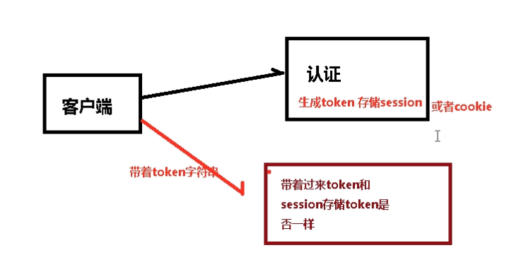
- 源码
  - 主要通过 CsrfFilter 过滤器来完成。
  - 生成 csrfToken 保存到 HttpSession 或者 Cookie 中。
  - csrfToken 都是由 CsrfTokenRepository 接口进行管理的。
  - 请求到来时，从请求中提取 csrfToken，和保存的 csrfToken 做比较，进而判断当前请求是否合法。

## 3.11、SSM 配置 Security

### 3.11.1、添加依赖

```xml
<!-- SpringSecurity 对 Web 应用进行权限管理 -->
<dependency>
    <groupId>org.springframework.security</groupId>
    <artifactId>spring-security-config</artifactId>
    <version>5.6.2</version>
    <scope>compile</scope>
</dependency>
<!-- SpringSecurity 配置 -->
<dependency>
    <groupId>org.springframework.security</groupId>
    <artifactId>spring-security-web</artifactId>
    <version>5.6.2</version>
    <scope>compile</scope>
</dependency>
<!-- SpringSecurity 标签库 -->
<dependency>
    <groupId>org.springframework.security</groupId>
    <artifactId>spring-security-taglibs</artifactId>
    <version>5.6.2</version>
</dependency>
```

### 3.11.2、配置Filte

在 web.xml 加入 SpringSecurity 控制权限的 Filter。

Security使用的是过滤器Filter而不是拦截器Interceptor，意味着Security能够管理的不仅仅是 SpringMVC 中的 handler 请求，还包含 Web 应用中所有请求。比如：项目中的静态资源也会被拦截，从而进行权限控制。

```xml
<filter>
    <filter-name>springSecurityFilterChain</filter-name>
    <filter-class>org.springframework.web.filter.DelegatingFilterProxy</filter-class>
</filter>
<filter-mapping>
    <filter-name>springSecurityFilterChain</filter-name>
    <url-pattern>/*</url-pattern>
</filter-mapping>
```

> 注意 ： 
>
> filter-name 必须是 `springSecurityFilterChain` 。
>
> 因为 `springSecurityFilterChain` 在 IOC 容器中对应真正执行权限控制的二十几个 Filter，只有这个才能够加载到这些 Filter 。

### 3.11.3、加入配置类

```java
@Configuration
@EnableWebSecurity
public class WebAppSecurityConfig extends WebSecurityConfigurerAdapter {
    @Override
    protected void configure(HttpSecurity http) throws Exception {
        
    }
}
```

> `Enable` 理解为启用。
>
> `@EnableWebSecurity` 注解表示启用 Web 安全功能。
>
> 以后会接触到很多`@EnableXXX` 注解，用来启用对应的功能。

### 3.11.4 效果

到此，其他使用流程都跟上面在SpringBoot是一样的了。


# 第 4 章 微服务权限方案

参考若依

[动力节点SpringSecurity框架视频教程-springsecurity+jwt实战精讲_哔哩哔哩_bilibili](https://www.bilibili.com/video/BV1DV4y1Z71y/)

[JSON Web Tokens - jwt.io](https://jwt.io/)


# 第 5 节 原理总结


# 第 6 节 Thymeleaf整合

[(8条消息) Security+Thymeleaf整合_夏天秃头之路的博客-CSDN博客_security thymeleaf](https://blog.csdn.net/qq_41673830/article/details/116734371)

[官方地址](https://github.com/thymeleaf/thymeleaf-extras-springsecurity)

## 1、版本介绍

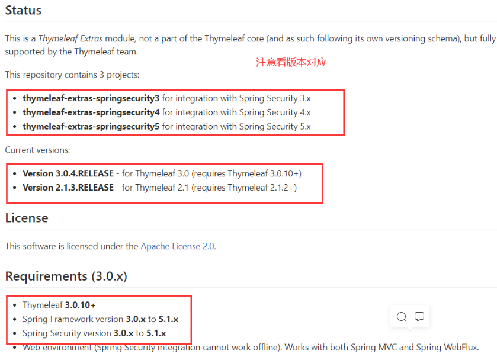

## 2、加入依赖

```xml
<!--SpringSecurity的标签依赖-->
<dependency>
    <groupId>org.thymeleaf.extras</groupId>
    <artifactId>thymeleaf-extras-springsecurity5</artifactId>
    <version>3.0.4.RELEASE</version>
</dependency>
```

## 3、配置视图解析器

```xml
<!-- 配置 Thymeleaf 视图解析器 -->
<bean id="templateResolver"
      class="org.thymeleaf.spring5.templateresolver.SpringResourceTemplateResolver">
    <property name="prefix" value="/WEB-INF/"/>
    <property name="suffix" value=".html"/>
    <property name="characterEncoding" value="UTF-8"/>
    <property name="order" value="1"/>
    <property name="templateMode" value="HTML5"/>
    <property name="cacheable" value="false"/>
</bean>

<bean id="templateEngine" class="org.thymeleaf.spring5.SpringTemplateEngine">
    <property name="templateResolver" ref="templateResolver"/>
    <!--加入下面配置-->
    <property name="additionalDialects">
        <set>
            <bean class="org.thymeleaf.extras.springsecurity5.dialect.SpringSecurityDialect"/>
        </set>
    </property>
</bean>

<bean id="viewResolver" class="org.thymeleaf.spring5.view.ThymeleafViewResolver">
    <property name="templateEngine" ref="templateEngine"/>
    <property name="characterEncoding" value="UTF-8"/>
</bean>
```

## 4、演示demo

```html
<html xmlns:th="http://www.thymeleaf.org"
      xmlns:sec="http://www.thymeleaf.org/thymeleaf-extras-springsecurity4">
<head>
    <meta charset="UTF-8"/>
    <title>Title</title>
</head>
<body>
<!--如果没认证-->
<div sec:authorize="!isAuthenticated()">显示没认证的内容</div>
<!--如果认证了-->
<div sec:authorize="isAuthenticated()">显示认证的内容</div>

<div th:if="false">不显示内容</div>
</body>
</html>
```

## 3、常见使用表达式

**Using the expression utility objects**

The `#authentication` object can be easily used, like this:

```HTML
<div th:text="${#authentication.name}">
  The value of the "name" property of the authentication object should appear here.
</div>
<span th:text="${#authentication.principal}"></span>
```

The `#authorization` object can be used in a similar way, normally in `th:if` or `th:unless` tags:

```html
<div th:if="${#authorization.expression('hasRole(''ROLE_ADMIN'')')}">
  This will only be displayed if authenticated user has role ROLE_ADMIN.
</div>
```

The object is an instance of , see this class and its documentation to understand all the methods offered.`#authorizationorg.thymeleaf.extras.springsecurity5.auth.Authorization`

## Using the attributes

Using the attribute is equivalent to using the object, but using its own attribute:`sec:authentication` `#authentication`

```html
<div sec:authentication="name">
  The value of the "name" property of the authentication object should appear here.
</div>
```

The and attributes are exactly the same. They work equivalently to a that evaluated an expression, by evaluating a *Spring Security Expression*:`sec:authorize``sec:authorize-expr``th:if``#authorization.expression(...)`

```html
<div sec:authorize="hasRole('ROLE_ADMIN')">
  This will only be displayed if authenticated user has role ROLE_ADMIN.
</div>
```

