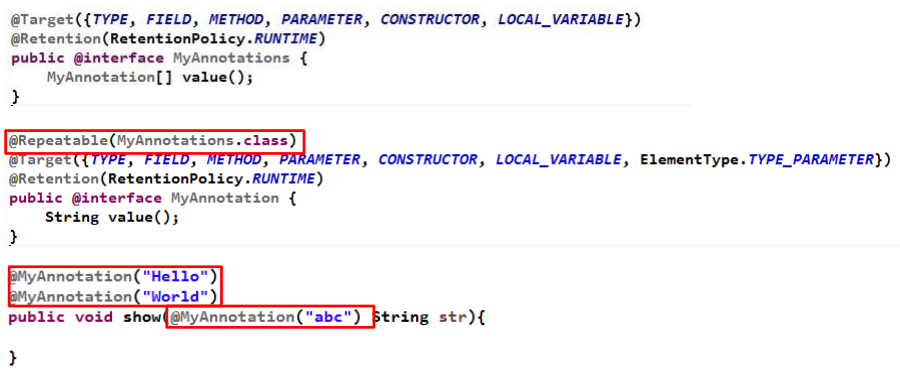

学习视频：

[尚硅谷Java8新特性教程_哔哩哔哩_bilibili](https://www.bilibili.com/video/BV14W411u7Ly)

# 一、Lambda表达式

## 1、为什么使用Lambda 表达式

> Lambda 是一个匿名函数，我们可以把 Lambda 表达式理解为是一段可以传递的代码（将代码像数据一样进行传递）。
>
> 可以写出更简洁、更 灵活的代码。作为一种更紧凑的代码风格，使 Java的语言表达能力得到了提升。

## 2、Lambda 表达式语法

> - Lambda 表达式在Java 语言中引入了一个新的语法元素和操作符。
>
> - 这个操作符为 “->” ， 该操作符被称 为 Lambda 操作符或剪头操作符。
>
> - 它将 Lambda 分为 两个部分： 
>   左侧：指定了 Lambda 表达式需要的所有参数
>   右侧：指定了 Lambda 体，即 Lambda 表达式要执行的功能。

### 2.1、无参 无返回值

```java
@Test
public void test01() {
    Runnable run = () -> System.out.println("你好，任超！！");
    run.run();
}
```

### 2.2、一个参数 无返回值

```java
@Test
public void test02() {
    Consumer<String> f = (args) -> System.out.println(args);
    f.accept("你好，任超！");
}
```

提示：

> Lambda只需要一个参数时，参数的小括号可以省略
>
> `args -> System.out.println(args)`

### 2.3、两个参数 有返回值

```java
@Test
public void test03() {
    BinaryOperator<Integer> bo = (x, y) -> {
        System.out.println("实现函数接口方法。");
        return x + y;
    };
    System.out.println(bo.apply(5, 9));
}
```

提示：

> 当 Lambda 体只有一条语句时，return 与大括号可以省略
>
> `(x, y) -> x + y`

### 2.4、类型推断

```java
//数据类型可以省略，因为可由编译器推断得出，称为“类型推断”
BinaryOperator<Integer> bo = (Integer x, Integer y) -> {
    System.out.println("实现函数接口方法。");
    return x + y;
};
```

- 上述 Lambda 表达式中的参数类型都是由编译器推断得出的。

  Lambda 表达式中无需指定类型，程序依然可以编译，这是因为 javac 根据程序的上下文，在后台推断出了参数的类型。

  Lambda 表达式的类型依赖于上下文环境，是由编译器推断出来的。这就是所谓的 “ 类型推断”


# 二、函数式接口

## 1、什么是函数式接口

- 只包含一个抽象方法的接口，称为函数式接口。
- 你可以通过 Lambda 表达式来创建该接口的对象。
  若 Lambda  表达式抛出一个受检异常，那么该异常需要在目标接口的抽象方 法上进行声明。 
- 我们可以在任意函数式接口上使用 `@FunctionalInterface` 注解。
  这样做可以检查它是否是一个函数式接口，同时 javadoc 也会包含一条声明，说明这个接口是一个函数式接口。

## 2、自定义函数式接口

```java
@FunctionalInterface
public interface MyNumber {
    public Double getValue();
}

//函数式接口中使用泛型：
@FunctionalInterface
public interface MyFunc<T> {
    public T getValue(T t);
}
```

## 3、作为参数传递Lambda 表达式

```java
@Test
public void test04() {
    String s = toUpperString((e) -> e.toUpperCase(), "abcde！");
    System.out.println(s);
}

public String toUpperString(MyFunc<String> mf, String str) {
    return mf.getValue(str);
}
```

作为参数传递 Lambda 表达式：

> - 为了将 Lambda 表达式作为参数传递，接收Lambda 表达式的参数类型必须是与该 Lambda 表达式兼容的函数式接口的类型。

## 4、Java内置四大核心函数式接口

|         函数式接口         | 参数类型 | 返回类型 |                             用途                             |
| :------------------------: | :------: | :------: | :----------------------------------------------------------: |
|  `Consumer<T>` 消费型接口  |    T     |   void   |   对类型为T的对象应用操 作，包含方法： `void accept(T t)`    |
|  `Supplier<T>` 供给型接口  |    无    |    T     |           返回类型为T的对象，包 含方法：`T get()`            |
| `Function<T,R>` 函数型接口 |    T     |    R     | 对类型为T的对象应用操作，并返回结果。结果是R类型的对象。包含方法：`R apply(T t)` |
| `Predicate<T>` 断定型接口  |    T     | boolean  | 确定类型为T的对象是否满足某约束，并返回 boolean 值。包含方法 `boolean test(T t)` |

## 5、其他接口

 


# 三、方法引用与构造器引用

## 1、方法引用

- 当要传递给Lambda体的操作，已经有实现的方法了，可以使用方法引用！
  实现抽象方法的参数列表，必须与方法引用方法的参数列表保持一致！
  
- 方法引用：使用操作符 “::” 将方法名和对象或类的名字分隔开来。 

- 如下三种主要使用情况：
  - 对象::实例方法
  
    ```java
    //例如:
    Consumer<String> sum = (e) -> System.out.println(e);
    //等同于
    Consumer<String> sum = System.out::println;
    ```
  
  - 类::静态方法
  
    ```java
    //例如:
    BinaryOperator<Double> bo = (x, y) -> Math.pow(x, y);
    //等同于
    BinaryOperator<Double> bo = Math::pow;
    ```
  
  - 类::实例方法
  
    ```java
    //例如:
    BiFunction<String, String, Boolean> fun = (x, y) -> x.equals(y);
    //等同于
    BiFunction<String, String, Boolean> fun1 = String::equals;
    ```
  
    注意：
  
    > 当需要引用方法的第一个参数是调用对象，并且第二个参数是需要引用方法的第二个参数(或无参数)时：ClassName::methodName

## 2、构造器引用

> - 格式：
>   `ClassName::new`  
> - 与函数式接口相结合，自动与函数式接口中方法兼容。
> - 可以把构造器引用赋值给定义的方法。
> - 构造器参数列表要与接口中抽象方法的参数列表一致！

```java
//例如:
BiFunction<String, Integer, User> fun = (x, y) -> new User(x, y);
//等同于
BiFunction<String, Integer, User> fun = User::new;
```


## 3、数组引用

> - 格式：
>
>   `type[]::new`

```java
//例如:
Function<Integer, String[]> fun = (x) -> new String[x];
//等同于
Function<Integer, String[]> fun1 = String[]::new;
```


# 四、强大的Stream API

[尚硅谷Java8新特性教程_哔哩哔哩_bilibili](https://www.bilibili.com/video/BV14W411u7Ly?p=7)

## 1、创建Stream

```java
//创建Stream
@Test
public void test01() {
    //1、通过 Collection 系列提供的 stream() 或 parallelStream()
    List<String> list = new ArrayList<>();
    Stream<String> stream1 = list.stream();

    //2、通过 Arrays 中的静态方法 stream() 获取数组流
    User[] users = new User[10];
    Stream<User> stream2 = Arrays.stream(users);

    //3、通过Stream类中的静态方法of()
    Stream<String> stream3 = Stream.of("aa", "bb", "cc", "dd");

    //4、创建无限流
    //迭代
    Stream<Integer> stream4 = Stream.iterate(0, x -> x + 2);
    stream4.limit(20).forEach(System.out::println);

    //生成
    Stream<Double> stream5 = Stream.generate(Math::random);
    stream5.limit(14).forEach(System.out::println);
}
```

## 2、筛选与切片【中间操作】

```java
List<User> users = Arrays.asList(
        new User(102, "李四", 59, 6666.66),
        new User(101, "张三", 18, 9999.99),
        new User(103, "王五", 28, 3333.33),
        new User(104, "赵六", 8, 7777.77),
        new User(104, "赵六", 8, 7777.77),
        new User(104, "赵六", 8, 7777.77),
        new User(105, "田七", 38, 5555.55)
);

/**
 * 筛选与切片
 * filter——接收 Lambda ， 从流中排除某些元素。
 * limit——截断流，使其元素不超过给定数量。
 * skip(n) —— 跳过元素，返回一个扔掉了前 n 个元素的流。若流中元素不足 n 个，则返回一个空流。与 limit(n) 互补
 * distinct——筛选，通过流所生成元素的 hashCode() 和 equals() 去除重复元素
 */
@Test
public void test01() {
    System.out.println("=========filter==============");
    Stream<User> stream1 = users.stream().filter(e -> e.getAge() > 20);
    stream1.forEach(System.out::println);

    System.out.println("==========limit=============");
    Stream<User> stream2 = users.stream().filter(e -> e.getAge() > 20).limit(2);
    stream2.forEach(System.out::println);

    System.out.println("==========skip(n)=============");
    Stream<User> stream3 = users.stream().filter(e -> e.getAge() > 20).skip(2);
    stream3.forEach(System.out::println);

    System.out.println("==========distinct=============");
    Stream<User> stream4 = users.stream().distinct();
    stream4.forEach(System.out::println);
}
    /**
     * 结果：
     * =========filter==============
     * User{name='李四', age=59}
     * User{name='王五', age=28}
     * User{name='田七', age=38}
     * ==========limit=============
     * User{name='李四', age=59}
     * User{name='王五', age=28}
     * ==========skip(n)=============
     * User{name='田七', age=38}
     * ==========distinct=============
     * User{name='李四', age=59}
     * User{name='张三', age=18}
     * User{name='王五', age=28}
     * User{name='赵六', age=8}
     * User{name='田七', age=38}
     */
```

## 3、映射【中间操作】

```java
public class TestStreamAPI02 {
    /**
     * 映射
     * map——接收 Lambda ， 将元素转换成其他形式或提取信息。
     *      接收一个函数作为参数，该函数会被应用到每个元素上，并将其映射成一个新的元素。
     * flatMap——接收一个函数作为参数，将流中的每个值都换成另一个流，然后把所有流连接成一个流
     */
    @Test
    public void test02() {
        List<String> list = Arrays.asList("aaa", "bbb", "ccc", "ddd");
        list.stream().map(String::toUpperCase)
                .forEach(System.out::println);

        System.out.println("==================");
        Stream<Stream<Character>> stream = list.stream().map(TestStreamAPI02::filterCharacter);
        stream.forEach(e -> e.forEach(System.out::println));

        System.out.println("==================");
        Stream<Character> stream1 = list.stream().flatMap(TestStreamAPI02::filterCharacter);
        stream1.forEach(System.out::println);
    }

    public static Stream<Character> filterCharacter(String str) {
        List<Character> list = new ArrayList<>();
        for (Character c : str.toCharArray()) {
            list.add(c);
        }
        return list.stream();
    }
}
```

## 4、排序【中间操作】

```java
public class TestStreamAPI02 {

    List<User> users = Arrays.asList(
            new User(102, "e李四", 59, 6666.66),
            new User(101, "z张三", 18, 9999.99),
            new User(103, "a王五", 28, 3333.33),
            new User(104, "g赵六", 6, 7777.77),
            new User(104, "g赵六", 10, 7777.77),
            new User(104, "g赵六", 8, 7777.77),
            new User(105, "c田七", 38, 5555.55)
    );
    /**
     * sorted()——自然排序(Comparable)
     * sorted(Comparator com)——定制排序
     */
    @Test
    public void test03() {
        List<String> list = Arrays.asList("bbb", "ccc", "aaa", "ddd");
        list.stream().sorted()
                .forEach(System.out::println);

        System.out.println("====================");
        users.stream().sorted((e1,e2) -> {
            if (e1.getName().equals(e2.getName())) {
                return e1.getAge().compareTo(e2.getAge());
            } else {
                return e1.getName().compareTo(e2.getName());
            }
        }).forEach(System.out::println);
    }
}
```


## 5、查找与匹配【终止操作】

```java
public class TestStreamAPI03 {
    List<User> users = Arrays.asList(
            new User(102, "李四", 79, 6666.66, Status.BUSY),
            new User(101, "张三", 18, 9999.99, Status.FREE),
            new User(103, "王五", 28, 3333.33, Status.VOCATION),
            new User(104, "赵六", 8, 7777.77, Status.BUSY),
            new User(104, "赵六", 8, 7777.77, Status.FREE),
            new User(104, "赵六", 8, 7777.77, Status.FREE),
            new User(105, "田七", 38, 5555.55, Status.BUSY)
    );

    /**
     *     allMatch——检查是否匹配所有元素
     *     anyMatch——检查是否至少匹配一个元素
     *     noneMatch——检查是否没有匹配的元素
     *     findFirst——返回第一个元素
     *     findAny——返回当前流中的任意元素
     *     count——返回流中元素的总个数
     *     max——返回流中最大值
     *     min——返回流中最小值
     */
    @Test
    public void test01() {
        //allMatch——检查是否匹配所有元素
        boolean b1 = users.stream().allMatch(e -> e.getStatus().equals(Status.BUSY));
        System.out.println(b1);

        //anyMatch——检查是否至少匹配一个元素
        boolean b2 = users.stream().anyMatch(e -> e.getStatus().equals(Status.BUSY));
        System.out.println(b2);

        //noneMatch——检查是否没有匹配的元素
        boolean b3 = users.stream().noneMatch(e -> e.getStatus().equals(Status.BUSY));
        System.out.println(b3);

        //findFirst——返回第一个元素
        Optional<User> op = users.stream().filter(e -> e.getStatus().equals(Status.FREE)).findFirst();
        System.out.println(op.get());

        //findAny——返回当前流中的任意元素
        Optional<User> any = users.stream().findAny();
        System.out.println(any.get());

        //count——返回流中元素的总个数
        long count = users.stream().filter(e -> e.getStatus().equals(Status.FREE)).count();
        System.out.println(count);

        //max——返回流中最大值
        Optional<User> max = users.stream().max(Comparator.comparingDouble(User::getSalary));
        System.out.println(max.get());

        //min——返回流中最小值
        Optional<Double> min = users.stream().map(User::getSalary).min(Double::compare);
        System.out.println(min);
    }
}
```

## 6、归约与收集【终止操作】

### 6.1、归约

```java
/**
 *     归约
 *     reduce(T identity, BinaryOperator) / reduce(BinaryOperator) ——可以将流中元素反复结合起来，得到一个值。
 */
@Test
public void test01() {
    List<Integer> list = Arrays.asList(1, 2, 3, 4, 5, 6, 7, 8, 9, 10);
    Optional<Integer> sum = list.stream().reduce(Integer::sum);
    System.out.println(sum);

    List<String> list2 = Arrays.asList("aaa", "bbb", "ccc", "ddd");
    String str = list2.stream().reduce("A", (s1, s2) -> s1 + s2);
    System.out.println(str);
}
```

### 6.2、收集 - 集合

> 收集
>
> collect——将流转换为其他形式。接收一个 Collector接口的实现，用于给Stream中元素做汇总的方法

```java
@Test
public void test02() {
    //获取list
    List<String> names1 = users.stream()
            .map(User::getName)
            .collect(Collectors.toList());
    names1.forEach(System.out::println);

    //获取set对结果去重
    System.out.println("==============");
    Set<String> names2 = users.stream()
            .map(User::getName)
            .collect(Collectors.toSet());
    names2.forEach(System.out::println);

    //获取HashSet
    System.out.println("==============");
    HashSet<String> names3 = users.stream()
            .map(User::getName)
            .collect(Collectors.toCollection(HashSet::new));
    names3.forEach(System.out::println);
}
```

### 6.3、收集 - 取值

```java
@Test
public void test03() {
    //计数
    Long aLong = users.stream()
            .collect(Collectors.counting());
    System.out.println(aLong);

    //最大值maxBy，最小值minBy
    Optional<Double> max = users.stream()
            .map(User::getSalary)
            .collect(Collectors.maxBy(Double::compare));
    System.out.println(max);

    //求和summingDouble，平均值averagingDouble
    Double sum = users.stream()
            .collect(Collectors.summingDouble(User::getSalary));
    System.out.println(sum);

    //上面所有值
    DoubleSummaryStatistics dss = users.stream()
            .collect(Collectors.summarizingDouble(User::getSalary));
    System.out.println(dss);
}
```

### 6.4、收集 - 分组

```java
@Test
public void test04() {
    //分组
    Map<Status, List<User>> map1 = users.stream()
            .collect(Collectors.groupingBy(User::getStatus));
    map1.forEach((s,u) -> System.out.println(s + " : " + u));

    //多级分组
    System.out.println("=============");
    Map<Status, Map<String, List<User>>> map2 = users.stream()
            .collect(Collectors.groupingBy(User::getStatus, Collectors.groupingBy(e -> {
                if (e.getAge() >= 60) {
                    return "老年";
                } else if (e.getAge() >= 35) {
                    return "中年";
                } else
                    return "成年";
            })));
    map2.forEach((s,aa) -> {
        System.out.println(s + " :");
        aa.forEach((a,u) -> System.out.println("\t" + a + " : " + u));
    });
}
```

### 6.5、收集 - 分区

```java
@Test
public void test05() {
    //分区
    Map<Boolean, List<User>> map = users.stream()
            .collect(Collectors.partitioningBy(e -> e.getAge() > 25));
    map.forEach((b,u) -> System.out.println(b + " : " + u));
}
```

### 6.6、收集 - 字符串拼接

```java
@Test
public void test06() {
    //字符串拼接
    String str = users.stream()
            .map(User::getName)
            .collect(Collectors.joining(",","==","=="));
    System.out.println(str);
}
```

## 7、并行流与串行流

> 并行流就是把一个内容分成多个数据块，并用不同的线程分别处理每个数据块的流。
>
> Java 8 中将并行进行了优化，我们可以很容易的对数据进行并行操作。
>
> Stream API 可以声明性地通过 `parallel()`  与 `sequential()` 在并行流与顺序流之间进行切换。

```java
public class TestStreamAPI05 {
    @Test
    public void test01() {

        Instant start = Instant.now();
        OptionalLong reduce = LongStream.rangeClosed(0, 10000000000L)
                .parallel()
                .reduce(Long::sum);
        Instant end = Instant.now();
        System.out.println("耗时：" + Duration.between(start,end).toMillis());
    }
}
```


# 五、新时间日期API

## 5.1、LocalDateTime

使用LocalDate、LocalTime、LocalDateTime

LocalDate、LocalTime、LocalDateTime 类的实例是不可变的对象，分别表示使用 ISO-8601日历系统的日期、时间、日期和时间。

它们提供了简单的日期或时间，并不包含当前的时间信息。也不包含与时区相关的信息。

> 注：ISO-8601日历系统是国际标准化组织制定的现代公民的日期和时间的表示法


```java
@Test
public void test01() {
    LocalDateTime ldt = LocalDateTime.now();
    System.out.println(ldt);
    System.out.println(ldt.withMonth(10));

    LocalDateTime ldt2 = LocalDateTime.of(2022, 2, 25, 13, 32, 59);
    System.out.println(ldt2);
    System.out.println(ldt2.getDayOfWeek());
    System.out.println(ldt2.getDayOfYear());

    LocalDateTime ldt3 = ldt2.plusYears(3);
    System.out.println(ldt3);

    LocalDateTime ldt4 = ldt2.minusMonths(14);
    System.out.println(ldt4);

    System.out.println(ldt.getYear());
    System.out.println(ldt.getMonthValue());
    System.out.println(ldt.getDayOfMonth());
    System.out.println(ldt.getHour());
    System.out.println(ldt.getMinute());
    System.out.println(ldt.getSecond());
}
```

## 5.2、Instant 时间戳

用于“时间戳”的运算。它是以Unix元年(传统的设定为UTC时区1970年1月1日午夜时分)开始所经历的描述进行运算

```java
@Test
public void test02() {
    Instant now = Instant.now(); //默认使用 UTC 时区
    System.out.println(now);

    OffsetDateTime odt = now.atOffset(ZoneOffset.ofHours(8));
    System.out.println(odt);

    System.out.println(now.getNano());

    Instant second = Instant.ofEpochSecond(5);//1970-01-01T00：00：00加上这个时间以后的时间
    System.out.println(second);
}
```

## 5.3、Period - Duration计算间隔

- Duration:用于计算两个“时间”间隔
- Period:用于计算两个“日期”间隔

```java
@Test
public void test03() throws InterruptedException {
    Instant ins1 = Instant.now();
    System.out.println("=====睡眠=====");
    Thread.sleep(1000);
    Instant ins2 = Instant.now();
    System.out.println("睡眠时间为：" + Duration.between(ins1,ins2));

    System.out.println("=======================");
    LocalDateTime ldt1 = LocalDateTime.now();
    LocalDateTime ldt2 = LocalDateTime.of(2020, 2, 25, 13, 32, 59);
    System.out.println("时间间隔：" + Duration.between(ldt2,ldt1));
    Duration between = Duration.between(ldt2, ldt1);
    System.out.println(between.getSeconds());

    System.out.println("========================");
    LocalDate ld1 = LocalDate.now();
    LocalDate ld2 = LocalDate.of(2020, 2, 25);
    Period pe = Period.between(ld2, ld1);
    System.out.println(pe);
    System.out.println(pe.getYears());
    System.out.println(pe.getMonths());
    System.out.println(pe.getDays());
}
```

## 5.4、TemporalAdjuster 时间校正器

- TemporalAdjuster : 时间校正器。

  有时我们可能需要获 取例如：将日期调整到“下个周日”等操作。

- TemporalAdjusters: 该类通过静态方法提供了大量的常用 TemporalAdjuster 的实现。

```java
@Test
public void test04() {
    LocalDateTime ldt1 = LocalDateTime.now();
    System.out.println(ldt1.withDayOfMonth(10));

    //下一个周五是几月几号
    LocalDateTime ldt2 = ldt1.with(TemporalAdjusters.next(DayOfWeek.FRIDAY));
    System.out.println(ldt2);

    //自定义：下一个工作日
    LocalDateTime ldt4 = ldt1.with(l -> {
        LocalDateTime ldt3 = (LocalDateTime) l;
        DayOfWeek week = ldt3.getDayOfWeek();
        if (week.equals(DayOfWeek.FRIDAY))
            return ldt3.plusDays(3);//周五的下一个工作日是周一
        else if (week.equals(DayOfWeek.SATURDAY))
            return ldt3.plusDays(2);//周六的下一个工作日也是周一
        return ldt3.plusDays(1);//其他是次日
    });
    System.out.println(ldt4);
}
```


## 5.5、DateTimeFormatter 格式化

java.time.format.DateTimeFormatter类：

该类提供了三种 格式化方法：

- 预定义的标准格式
- 语言环境相关的格式
- 自定义的格式

```java
@Test
public void test05() {
    //DateTimeFormatter dtf = DateTimeFormatter.ISO_LOCAL_DATE;
    DateTimeFormatter dtf = DateTimeFormatter.ofPattern("yyyy年MM月dd日 HH:mm:ss E");//字母大小写不能错，不然解析会出错
    LocalDateTime now = LocalDateTime.now();
    String strDate = now.format(dtf);
    System.out.println(strDate);

    LocalDateTime ldt = LocalDateTime.parse(strDate, dtf);
    System.out.println(ldt);
}
```

## 5.6、ZonedDateTime 时区处理

- Java8 中加入了对时区的支持，带时区的时间为分别为：

  - ZonedDate
  - ZonedTime
  - ZonedDateTime

- 其中每个时区都对应着 ID，地区ID都为 “{区域}/{城市}”的格式

  - 例如 ：Asia/Shanghai 等

- ZoneId：该类中包含了所有的时区信息

  - `getAvailableZoneIds()` : 可以获取所有时区时区信息

  - `of(id)` : 用指定的时区信息获取ZoneId 对象

```java
@Test
public void testZoned() {
    Set<String> set = ZoneId.getAvailableZoneIds();
    set.forEach(System.out::println);
    ZoneId Shanghai = ZoneId.of("Asia/Shanghai");
}
```

```java
@Test
public void test06() {
    LocalDateTime now = LocalDateTime.now(ZoneId.of("Asia/Shanghai"));
    System.out.println(now);

    ZonedDateTime time = ZonedDateTime.now(ZoneId.of("US/Pacific"));
    System.out.println(time);
}
```


## 5.7、与传统日期处理的转换


# 六、接口中的默认方法与静态方法

## 6.1、默认方法

[Java 8 默认方法 | 菜鸟教程 (runoob.com)](https://www.runoob.com/java/java8-default-methods.html)

Java 8中允许接口中包含具有具体实现的方法，该方法称为 “默认方法” ，默认方法使用 default 关键字修饰。

```java
public interface MyFun {
    default String getName(){
        return "哈哈哈";
    }
}
```

接口默认方法的”类优先”原则

若一个接口中定义了一个默认方法，而另外一个父类或接口中 又定义了一个同名的方法时

- 选择父类中的方法。如果一个父类提供了具体的实现，那么 接口中具有相同名称和参数的默认方法会被忽略。 
- 接口冲突。如果一个父接口提供一个默认方法，而另一个接 口也提供了一个具有相同名称和参数列表的方法（不管方法 是否是默认方法），那么必须覆盖该方法来解决冲突

## 6.2、接口中的静态方法

Java 8 的另一个特性是接口可以声明（并且可以提供实现）静态方法。

```java
public interface MyFun {
    default String getName(){
        return "哈哈哈";
    }

    static void show(){
        System.out.println("接口中的静态方法");
    }
}
```


# 七、其他新特性

## 7.1、Optional 类

Optional 类(java.util.Optional) 是一个容器类，代表一个值存在或不存在，原来用 null 表示一个值不存在，现在 Optional 可以更好的表达这个概念。并且可以避免空指针异常。

常用方法：

- Optional.of(T t) : 创建一个 Optional 实例 
- Optional.empty() : 创建一个空的 Optional 实例 
- Optional.ofNullable(T t):若 t 不为 null,创建 Optional 实例,否则创建空实例 
- isPresent() : 判断是否包含值 
- orElse(T t) : 如果调用对象包含值，返回该值，否则返回t  
- orElseGet(Supplier s) :如果调用对象包含值，返回该值，否则返回 s 获取的值 
- map(Function f): 如果有值对其处理，并返回处理后的Optional，否则返回 Optional.empty() 
- flatMap(Function mapper):与 map 类似，要求返回值必须是Optional


## 7.2、重复注解与类型注解

Java 8对注解处理提供了两点改进：可重复的注解及可用于类型的注解。

