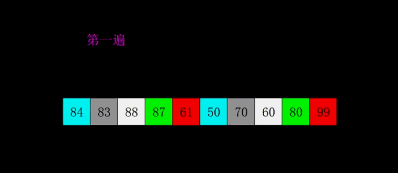
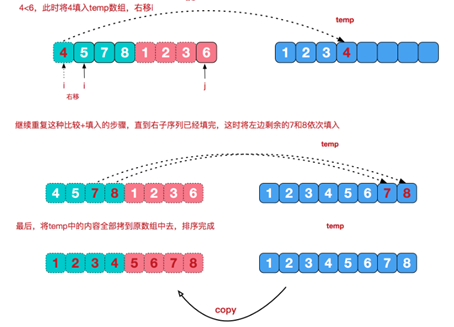
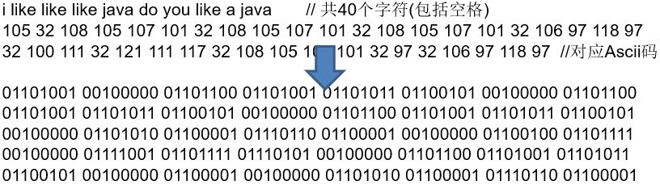
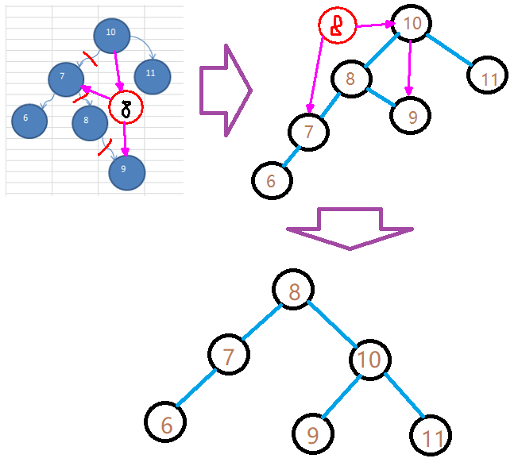
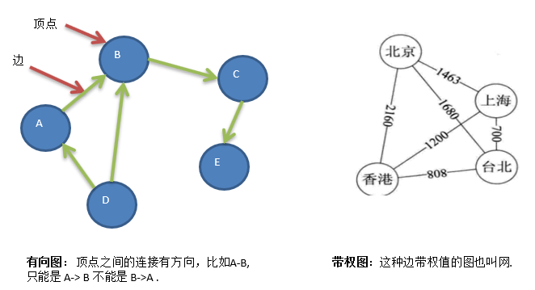

[Hello 算法 (hello-algo.com)](https://www.hello-algo.com/chapter_preface/)
# 一、数据结构分类

数据结构包括：线性结构和非线性结构。

## 1、线性结构

线性结构作为最常用的数据结构，其特点是数据元素之间存在一对一的线性关系

线性结构有两种不同的存储结构，即：**顺序存储**结构(数组)和**链式存储**结构(链表)。

- 顺序存储的线性表称为顺序表，顺序表中的存储元素是连续的。
- 链式存储的线性表称为链表，链表中的存储元素不一定是连续的，元素节点中存放数据元素以及相邻元素的地址信息。

线性结构常见的有：

- 数组
- 队列
- 链表
- 栈

## 2、非线性结构

- 二维数组
- 多维数组
- 广义表
- 树结构
- 图结构


# 二、稀疏数组 sparsearray

> 当一个数组中大部分元素为０，或者为同一个值的数组时，可以使用稀疏数组来保存该数组。

稀疏数组的处理方法是:

- 稀疏数组第一行记录原数组整体信息，**行，列，总共数值数量。**
- 其余行记录每个数值的行、列坐标和具体数值。


```java
public class SparseArray {
    public static void main(String[] args) {
        // 创建二维数值
        int[][] is = new int[11][11];
        is[3][6] = 15;
        is[4][7] = 19;
        is[8][1] = 25;
        // 打印原二维数值
        for (int[] ints : is) {
            for (int i : ints) {
                System.out.print(i+"\t");
            }
            System.out.println();
        }

        // 统计原数组的有效数据个数
        int size = 0;
        for (int[] ints : is) {
            for (int i : ints) {
                if (i != 0)
                    size++;
            }
        }

        // 创建稀疏数组
        int[][] ints = new int[size+1][3];
        ints[0][0] = is.length;
        ints[0][1] = is[0].length;
        ints[0][2] = size;

        // 原数组 ==》 稀疏数组
        int k = 1;
        for (int i = 0; i < is.length; i++) {
            for (int j = 0; j < is[i].length; j++) {
                if (is[i][j] != 0) {
                    ints[k][0] = i;
                    ints[k][1] = j;
                    ints[k++][2] = is[i][j];
                }
            }
        }

        // 输出稀疏数组
        System.out.println("======================");
        for (int[] ints1 : ints) {
            for (int i : ints1) {
                System.out.print(i + "\t");
            }
            System.out.println();
        }

        // 稀疏数组 ==》 原数组
        int[][] is2 = new int[ints[0][0]][ints[0][1]];
        for (int i = 1; i < ints.length; i++) {
            is2[ints[i][0]][ints[i][1]] = ints[i][2];
        }

        // 输出原数组
        System.out.println("======is2===========");
        for (int[] ints3 : is2) {
            for (int i : ints3) {
                System.out.print(i+"\t");
            }
            System.out.println();
        }

    }
}
```


# 三、链表

## 1、单向链表

```java
package com.renchao.linkedlist;

/**
 * 单向链表练习
 */
public class SingleLinkedListDemo {
    public static void main(String[] args) {
        SingleLinkedList sll = new SingleLinkedList();
        HeroNode h1 = new HeroNode(1, "任超", "爸爸");
        HeroNode h2 = new HeroNode(20, "王道月", "妈妈");
        HeroNode h3 = new HeroNode(30, "任子馨", "姐姐");
        HeroNode h4 = new HeroNode(40, "任传睿", "弟弟");
        sll.add(h3);
        sll.add(h1);
        sll.add(h1);
        sll.add(h4);
        sll.add(h2);
        sll.show2(sll.head);
        sll.show();
        System.out.println("反转后。。。。。");
        sll.reversal2(sll.head);
        sll.show();
        SingleLinkedList sll2 = new SingleLinkedList();
        HeroNode h5 = new HeroNode(6, "任超", "爸爸");
        HeroNode h6 = new HeroNode(25, "王道月", "妈妈");
        HeroNode h7 = new HeroNode(15, "任子馨", "姐姐");
        HeroNode h8 = new HeroNode(9, "任传睿", "弟弟");
        sll2.add(h8);
        sll2.add(h7);
        sll2.add(h6);
        sll2.add(h5);
        sll2.add(h4);
        System.out.println("=======sll===========");
        sll.show();
        System.out.println("========sll2==========");
        sll2.show();
        System.out.println("==========下面是合并后的========");
        sll.addAll(sll2);
        sll.show();

        System.out.println("=======下面是反向遍历，数组方法===========");
        sll.reverse();

        System.out.println("=======上面是反向遍历，数组方法===========");
        sll.reversal();

        sll.show();
        System.out.println("系统计数" + sll.size);
        System.out.println("方法：" + sll.size());
        int rec = 2;

        System.out.println(sll.getHead(sll.size - rec + 1));

        System.out.println("下面是使用倒数的方法=============");
        for (int i = 0; i < sll.size; i++) {
            System.out.println(sll.getHead(sll.size - i));
        }
    }
}

class SingleLinkedList {
    public final HeroNode head = new HeroNode(0, null, null);
    public int size = 0;

    //添加数据
    public void add(HeroNode hero) {
        HeroNode temp = head;
        while (true) {
            if (temp.next == null)
                break;
            if (temp.next.no == hero.no) {
                System.out.println("人物不能重复添加！");
                return;
            }
            if (temp.next.no > hero.no)
                break;
            temp = temp.next;
        }
        hero.next = temp.next;
        temp.next = hero;
        size++;
    }

    //链表合并
    public void addAll(SingleLinkedList list) {
        HeroNode temp = list.head.next;
        HeroNode temp2;
        while (true) {
            if (temp == null)
                return;
            temp2 = temp.next;
            add(temp);
            temp = temp2;
        }
    }

    //常规逆向打印
    public void reverse() {
        if (size == 0)
            return;
        HeroNode[] hns = new HeroNode[size];
        HeroNode temp = head.next;
        for (int i = 0; i < size; i++) {
            hns[i] = temp;
            temp = temp.next;
        }

        for (int i = size - 1; i >= 0; i--) {
            System.out.println(hns[i]);
        }
    }

    //递归逆向打印
    public void show2(HeroNode head) {
        if (head.next == null)
            return;
        show2(head.next);
        System.out.println(head.next);
    }

    //普通打印
    public void show() {
        HeroNode temp = head;
        if (temp.next == null)
            System.out.println("没有数据。。。。");
        while (true) {
            if (temp.next == null)
                break;
            System.out.println(temp.next);
            temp = temp.next;
        }
    }

    //修改节点name
    public void revise(int no, String name) {
        HeroNode temp = head;
        while (true) {
            if (temp.next == null) {
                System.out.println("没有查询到要修改的数据。");
                return;
            }
            temp = temp.next;
            if (temp.no == no) {
                temp.name = name;
                return;
            }
        }
    }

    //计算链表大小
    public int size() {
        HeroNode temp = head;
        int num = 0;
        while (true) {
            if (temp.next == null)
                return num;
            temp = temp.next;
            num++;
        }
    }

    //删除链表节点
    public void delete(int no) {
        HeroNode temp = head;
        while (true) {
            if (temp.next == null) {
                System.out.println("没有查询到要修改的数据。");
                return;
            }
            if (temp.next.no == no) {
                temp.next = temp.next.next;
                size--;
                return;
            }
            temp = temp.next;
        }
    }

    //查询指定序号的节点
    public HeroNode getHead(int key) {
        if (key > size) {
            System.out.println("没有要查询的数据。。。");
            return null;
        }
        HeroNode temp = head;
        for (int i = 0; i < key; i++) {
            temp = temp.next;
        }
        return temp;
    }

    //递归反转
    public HeroNode reversal2(HeroNode head) {
        //把第一个节点指针值为空
        if (this.head == head) {
            if (head.next == null)
                return null;
            return reversal2(head.next).next = null;
        }
        //到最后一个节点后，开始返回
        if (head.next == null) {
            this.head.next = head;
            return head;
        }
        return reversal2(head.next).next = head;
    }

    //常规反转
    public void reversal() {
        if (size == 1)
            return;
        HeroNode temp = head.next;
        HeroNode temp1 = temp.next;
        temp.next = null;
        HeroNode temp2 = temp1.next;
        while (true) {
            temp1.next = temp;
            temp = temp1;
            if (temp2 == null)
                break;
            temp1 = temp2;
            temp2 = temp2.next;
        }
        head.next = temp;
    }
}

class HeroNode {
    public int no;
    public String name;
    public String nickname;
    public HeroNode next;

    public HeroNode(int no, String name, String nickname) {
        this.no = no;
        this.name = name;
        this.nickname = nickname;
    }

    @Override
    public String toString() {
        return "HeroNode{" +
                "no=" + no +
                ", name='" + name + '\'' +
                ", nickname='" + nickname + '\'' +
                '}';
    }
}
```

## 2、约瑟夫问题Josephu

**Josephu**(约瑟夫、约瑟夫环) **问题**

Josephu 问题为：设编号为1，2，… n的n个人围坐一圈，约定编号为k（1<=k<=n）的人从1开始报数，数到m 的那个人出列，它的下一位又从1开始报数，数到m的那个人又出列，依次类推，直到所有人出列为止，由此产生一个出队编号的序列。

> **提示**：用一个不带头结点的循环链表来处理Josephu 问题：先构成一个有n个结点的单循环链表，然后由k结点起从1开始计数，计到m时，对应结点从链表中删除，然后再从被删除结点的下一个结点又从1开始计数，直到最后一个结点从链表中删除算法结束。

```java
package com.renchao.linkedlist;

public class Josephu {
    public static void main(String[] args) {
        SingleLinkedList2 sl = new SingleLinkedList2();
        for (int i = 0; i < 125; i++) {
            sl.add(new Child(i + 1));
        }

        sl.show();
        System.out.println("=========");
//        sl.delete(5);
//        sl.show();
        sl.jP(10, 20);
    }
}

class SingleLinkedList2 {
    public Child last;
    public int size = 0;

    //添加数据
    public void add(Child child) {
        if (last == null) {
            last = child;
            last.next = child;
            size++;
            return;
        }
        child.next = last.next;
        last.next = child;
        last = child;
        size++;
    }

    //打印
    public void show() {
        if (last == null)
            return;
        for (int i = 0; i < size; i++) {
            System.out.println(last.next);
            last = last.next;
        }
    }

    public void delete(int no) {
        if (last == null)
            return;
        if (last.next == last && last.no == no) {
            last = null;
            size = 0;
            return;
        }
        if (last.no == no) {
            for (int i = 0; i < size - 1; i++) {
                last = last.next;
            }
            last.next = last.next.next;
            size--;
        }
        Child temp = last;
        for (int i = 0; i < size; i++) {
            if (temp.next.no == no) {
                temp.next = temp.next.next;
                size--;
                return;
            }
            temp = temp.next;
        }
    }

    //约瑟夫环问题，k开始的索引，m数到的数
    public void jP(int k, int m) {
        if (k < 1 || k > size)
            return;
        Child temp = last;
        for (int i = 0; i < k; i++) {
            temp = temp.next;
        }
        while (true) {
            if (last == null)
                break;
            for (int i = 0; i < m - 1; i++) {
                temp = temp.next;
            }
            System.out.print(temp + "\t");
            delete(temp.no);
            temp = temp.next;
        }

    }
}

class Child {
    public int no;
    public Child next;

    public Child(int no) {
        this.no = no;
    }

    @Override
    public String toString() {
        return no + "";
    }
}
```


# 四、栈


# 五、递归

## 1、迷宫


```java
package com.renchao.recursion;

/**
 * 0，路
 * 1，墙
 * 3，走过，路不通
 * 8，走通路线
 */
public class MiGong {
    public static void main(String[] args) {
        // 创建地图
        int[][] map = createMap();
        // 走迷宫
        boolean b = way(map, 1, 1);
        System.out.println(b ? "找到路径。。。。" : "没有找到！！");

        // 显示结果
        for (int[] ints : map) {
            for (int anInt : ints) {
                System.out.print(anInt + "\t");
            }
            System.out.println();
        }
    }

    public static boolean way(int[][] map, int row, int col) {
        if (map[7][5] == 8)
            return true;
        if (map[row][col] == 0) {
            map[row][col] = 8;
            if (way(map, row + 1, col)) // 向下
                return true;
            if (way(map, row, col + 1)) // 向右
                return true;
            if (way(map, row - 1, col)) // 向上
                return true;
            if (way(map, row, col - 1)) // 向左
                return true;
            map[row][col] = 3;
        }
        return false;
    }

    // 创建地图
    public static int[][] createMap() {
        // 创建地图
        int[][] map = new int[8][7];
        for (int i = 0; i < 7; i++) {
            map[0][i] = 1;
            map[5][i] = 1;
            map[7][i] = 1;
            map[i][0] = 1;
            map[i][6] = 1;
        }
        map[3][1] = 1;
        map[3][2] = 1;
        map[7][5] = 0;
        //上面是创建地图
        map[2][2] = 1;
        map[5][1] = 0;
//        map[6][2] = 1; // 堵住出口
        return map;
    }
}

```

## 2、八皇后问题

八皇后问题，是一个古老而著名的问题，是回溯算法的典型案例。该问题是国际西洋棋棋手马克斯·贝瑟尔于1848年提出：在8×8格的国际象棋上摆放八个皇后，使其不能互相攻击，即：

任意两个皇后都**不能处于同一行、同一列或同一斜线上**，问有多少种摆法。


```java
package com.renchao.recursion;


/**
 * 八皇后问题
 * 任意两个皇后都不能处于同一行、同一列或同一斜线上，问有多少种摆法。
 */
public class EightQueensRecall {
    public static int[] arr = {88, 88, 88, 88, 88, 88, 88, 88};//棋盘
    public static int num = 0;

    public static void main(String[] args) {
        //参数n代表是第几个皇后
        place(0);
        System.out.println("总共：" + num);
    }


    //放皇后
    public static void place(int n) {
        // n等于8，说明8个皇后已经放置成功，然后进行回溯
        if (n == 8) {
            num++;
            print();
            return;
        }
        // 循环当前行的每一列，循环结束回溯到上一个皇后
        for (int i = 0; i < 8; i++) {
            arr[n] = i; // 当前皇后试放每一个位置
            if (judge(n))   // 判断当前位置是否有冲突，没有冲突，则试放下一个皇后
                place(n + 1);
        }
    }

    //打印输出
    public static void print() {
        for (int i : arr) {
            System.out.print(i + " ");
        }
        System.out.print("\n");
    }

    //判断冲突
    public static boolean judge(int n) {
        for (int k = 0; k < n; k++) {
            if (arr[n] == arr[k] || Math.abs(n - k) == Math.abs(arr[n] - arr[k]))
                return false;
        }
        return true;
    }
}

```


# 六、时间复杂度

## 1、介绍

常见的时间复杂度量级有：

- 1)常数阶O(1)
- 2)对数阶O(log2n)
- 3)线性阶O(n)
- 4)线性对数阶O(nlog2n)
- 5)平方阶O(n^2)
- 6)立方阶O(n^3)
- 7)k次方阶O(n^k)
- 8)指数阶O(2^n)

常用的时间复杂度所耗费的时间从小到大依次是：

- O(1) < O(logn) < (n) < O(nlogn) < O(n2) < O(n3) < O(2n) < O(n!) < O(nn)


## 2、复杂度速查表


**图例**


**抽象数据结构的操作复杂度**


**数组排序**


**图操作**


**堆操作**


# 七、排序算法


## 1、冒泡排序

冒泡排序（Bubble Sorting）的基本思想是：

通过对待排序序列从前向后（从下标较小的元素开始）,依次比较相邻元素的值，若发现逆序则交换，使值较大的元素逐渐从前移向后部，就象水底下的气泡一样逐渐向上冒。

```java
    public static void bubblingSort(int[] ints) {
        int temp;
        boolean index = false;  // 是否进行过数据交换，如果没有，则数据是有序的，可以结束排序
        for (int i = 0; i < ints.length - 1; i++) {
            for (int j = 0; j < ints.length - i - 1; j++) {
                if (ints[j] > ints[j + 1]) {
                    temp = ints[j];
                    ints[j] = ints[j + 1];
                    ints[j + 1] = temp;
                    index = true;   // 有数据交换
                }
            }
            if (!index) // 没有数据交换，就结束循环
                break;
            index = false;  // 重置
        }
    }
```


## 2、选择排序

选择排序（select sorting）也是一种简单的排序方法。它的基本思想是：

在待排序的数据中，每次找出最小（或最大）的元素，放到已排序序列的末尾，直到所有元素都排好顺序。选择排序的时间复杂度是O(n平方)，空间复杂度是O(1)。

例如：

第一次从arr[0]~arr[n-1]中选取最小值，与arr[0]交换，

第二次从arr[1]~arr[n-1]中选取最小值，与arr[1]交换，

第三次从arr[2]~arr[n-1]中选取最小值，与arr[2]交换，

…，

第i次从arr[i-1]~arr[n-1]中选取最小值，与arr[i-1]交换，

…, 

第n-1次从arr[n-2]~arr[n-1]中选取最小值，与arr[n-2]交换，

总共通过n-1次，得到一个按排序码从小到大排列的有序序列。

```java
    public static void choiceSort(int[] ints) {
        int temp;
        int index;
        // 最后一次不需要再比较，所以是 ints.length - 1
        for (int i = 0; i < ints.length - 1; i++) {
            index = i;  // 记录最小值索引
            for (int j = index + 1; j < ints.length; j++) {
                if (ints[index] > ints[j])
                    index = j;
            }
            // 数据交换
            if (index != i) {
                temp = ints[i];
                ints[i] = ints[index];
                ints[index] = temp;
            }
        }
    }
```


## 3、插入排序

插入排序（Insertion Sorting）的基本思想是：

把n个待排序的元素看成为一个有序表和一个无序表，开始时有序表中只包含一个元素，无序表中包含有n-1个元素，排序过程中每次从无序表中取出第一个元素，把它的排序码依次与有序表元素的排序码进行比较，将它插入到有序表中的适当位置，使之成为新的有序表。


```java
//插入排序,j表示插入点
public static void insertSort(int[] ints) {
    int temp;
    int j;
    for (int i = 1; i < ints.length; i++) {
        temp = ints[i];
        j = i - 1;
        // 大于temp的值进行后移
        while (j >= 0 && ints[j] > temp) {
            ints[j + 1] = ints[j];
            j--;
        }
        // 插入
        ints[j + 1] = temp;
    }
}
```

## 4、希尔排序

> 希尔排序是希尔（Donald Shell）于1959年提出的一种排序算法。希尔排序也是一种插入排序，**它是简单插入排序经过改进之后的一个更高效的版本**，也称为缩小增量排序。

希尔排序法基本思想：
希尔排序是把记录按下标的一定增量分组，对每组使用直接插入排序算法排序；随着增量逐渐减少，每组包含的关键词越来越多，当增量减至1时，整个文件恰被分成一组，算法便终止。

希尔排序是通过**分组+插入。**

**首先，如果排序的数量是8个，我们需要把数据分成8/2=4组，**如下图所示：


对上面4组的数据进行**插入排序后得到：**


然后，再继续分组822=2分成2组：


这两组数据再进行插入排序，如下图所示：


这样之后，整个数据的排序就差不多完成了。

我们在这个基础上再对整个队列执行一次插入排序，就会完成了整个队列的排序，因为之前已经对数据进行过排序，**再进行插入排序的时候，效率会明显得到提升。**

整个过程可以观看动态图片：



> 代码实现的时候，第二遍的每组是交替执行的。

```java
//希尔排序（插入排序改进版），j是插入点，k是增量步长
public static void shellSort(int[] ints) {
    int temp;
    int j;
    // 增量循环，k是增量
    for (int k = ints.length / 2; k >= 1; k /= 2) {
        // 下面是普通插入排序算法，不通的是增量不同，普通插入增量是1
        // 增量是1以上的时候，每组是交替排序
        for (int i = k; i < ints.length; i++) {
            temp = ints[i];
            j = i;
            while (j >= k && ints[j - k] > temp) {
                ints[j] = ints[j - k];
                j -= k;
            }
            ints[j] = temp;
        }
    }
}
```


## 5、快速排序

[快速排序详解_凉夏y的博客-CSDN博客_快速排序](https://blog.csdn.net/LiangXiay/article/details/121421920)

快速排序（Quicksort）是对冒泡排序的一种改进。

基本思想是：

先从序列中选取一个基准数，然后将序列分成两个子序列，使得左边的子序列中的所有数都小于或等于基准数，右边的子序列中的所有数都大于基准数，然后对两个子序列递归地进行快速排序，直到所有的数都有序。快速排序的优点是排序速度快，平均时间复杂度为O(nlogn)。

```java
//快速排序
public static void fastSort(int[] arr, int left, int right) {
    if (left > right)
        return;
    int l = left;
    int r = right;
    int middle = arr[(l + r) / 2];
    int temp;
    while (l < r) {
        while (arr[l] < middle) {
            l++;
        }
        while (arr[r] > middle) {
            r--;
        }
        if (l < r) {
            temp = arr[l];
            arr[l] = arr[r];
            arr[r] = temp;
            // 防止重复值出现死循环
            if (arr[l] == middle)
                r--;
            if (arr[r] == middle)
                l++;
        }
    }

    // 必须，不然递归没法结束，会出现栈溢出
    if (l == r) {
        l++;
        r--;
    }
    fastSort(arr, left, r);
    fastSort(arr, l, right);
}
```

## 6、归并排序

> 归并排序（MERGE-SORT）是利用归并的思想实现的排序方法，该算法采用经典的分治（divide-and-conquer）策略（分治法将问题分(divide)成一些小的问题然后递归求解，而治(conquer)的阶段则将分的阶段得到的各答案"修补"在一起，即分而治之)。


治阶段，我们需要将两个已经有序的子序列合并成一个有序序列，比如上图中的最后一次合并，要将[4,5,7,8]和[1,2,3,6]两个已经有序的子序列，合并为最终序列[1,2,3,4,5,6,7,8]，来看下实现步骤




```java
/**
     * 归并排序
     * @param arr
     * @param left
     * @param right
     * @param temp
     */
public static void mergeSort(int[] arr, int left, int right, int[] temp) {
    if (left < right) {
        int mid = (left + right) / 2; //中间索引
        //向左分解
        mergeSort(arr, left, mid, temp);
        //向右分解
        mergeSort(arr, mid + 1, right, temp);
        // 合并
        merge(arr, left, mid, right, temp);
    }
}


/**
     * 合并
     * @param arr   原始数组
     * @param left  左边序列的初始索引
     * @param mid   中间索引
     * @param right 右边索引
     * @param temp  中转数组
     */
public static void merge(int[] arr, int left, int mid, int right, int[] temp) {
    int l = left;
    int m = mid + 1;
    int t = 0;

    //逐个比较两组元素大小，然后按顺序将数据拷贝到temp
    while (l <= mid && m <= right) {
        if (arr[l] < arr[m]) {
            temp[t++] = arr[l++];
        } else {
            temp[t++] = arr[m++];
        }
    }

    //将另外一组剩余元素拷贝到temp
    while (l <= mid) {
        temp[t++] = arr[l++];
    }
    while (m <= right) {
        temp[t++] = arr[m++];
    }

    //将temp元素重新拷贝回arr
    t = 0;
    int tempLeft = left;
    while (tempLeft <= right) {
        arr[tempLeft++] = temp[t++];
    }
}
```


## 7、基数排序

**介绍**

- 通过键值得各个位的值，将要排序的元素分配至一些桶中，达到排序的作用
- 基数排序法是属于稳定性的排序，基数排序法是效率高的稳定排序法
- 基数排序是桶排序的扩展

**实现原理**

- 将所有待比较数值（自然数）统一为同样的数位长度，数位较短的数前面补零。然后，从最低位开始，依次进行一次排序。这样从最低位排序一直到最高位排序完成以后, 数列就变成一个有序序列。

**实现步骤**

- 确定数组中的最大元素有几位（MAX）（确定执行的轮数）
- 创建0~9个桶（桶的底层是队列），因为所有的数字元素都是由0~9的十个数字组成
- 依次判断每个元素的个位，十位至MAX位，存入对应的桶中，出队，存入原数组；直至MAX轮结束输出数组。
- 具体实现步骤如下图
  - 

```java
    public static void radixSort(int[] arr) {
        int[][] bucket = new int[10][arr.length];
        int[] pointer = new int[10];
        int h;
        int max = arr[0];
        for (int i : arr) {
            if (i > max)
                max = i;
        }
        int maxLength = (max + "").length();

        for (int k = 0, n = 1; k < maxLength; k++, n *= 10) {
            for (int j : arr) {
                int vl = (j / n) % 10;
                bucket[vl][pointer[vl]++] = j;
            }
            h = 0;
            for (int i = 0; i < 10; i++) {
                if (pointer[i] != 0) {
                    for (int j = 0; j < pointer[i]; j++) {
                        arr[h++] = bucket[i][j];
                    }
                }
                pointer[i] = 0;
            }
        }
    }
```


## 8、堆排序

[堆排序 详细讲解_舒克日记的博客-CSDN博客_堆排序](https://blog.csdn.net/cativen/article/details/124810686)

### 8.1、介绍

堆排序是利用堆这种数据结构而设计的一种排序算法。

堆排序是一种选择排序，它的最坏，最好，平均时间复杂度均为 O(nlogn)，它也是不稳定排序。

堆是具有以下性质的完全二叉树：

- 每个结点的值都大于或等于其左右孩子结点的值，称为大顶堆
- 每个结点的值都小于或等于其左右孩子结点的值，称为小顶堆

> 注意 : 没有要求结点的左孩子的值和右孩子的值的大小关系。
> 一般升序采用大顶堆，降序采用小顶堆

### 8.2、基本思想

堆排序的基本思想是：

- 将待排序序列构造成一个大顶堆
- 此时，整个序列的最大值就是堆顶的根节点。
- 将其与末尾元素进行交换，此时末尾就为最大值。
- 然后将剩余 n-1 个元素重新构造成一个堆，这样会得到 n 个元素的次小值。
- 如此反复执行，便能得到一个有序序列了。

### 8.3、代码

```java
    /**
     * heapSort
     * @param arr
     */
    public static void heapSort(int[] arr) {
        int temp;
        // 整体调整所有顶堆，从最后一个非叶子节点开始调整
        for (int i = arr.length / 2 - 1; i >= 0; i--) {
            adjustHeap(arr, i, arr.length);
        }
        // 把最大数与数组最后一个数进行交换。后面每次交换后，只要调整最上面这个堆就可以了。
        // 注意，length - 1 ,因为第一个循环最后一个数已经调整了
        for (int i = arr.length - 1; i >=0 ; i--) {
            temp = arr[0];
            arr[0] = arr[i];
            arr[i] = temp;
            adjustHeap(arr, 0, i);
        }
    }
    /**
     * 针对单个节点进行堆调整
     * @param arr 目标数组
     * @param i 需要调整的节点。k是右子节点下标，左右节点比较大小后，会指向大的节点。
     * @param len 需要调整的数组长度
     */
    public static void adjustHeap(int[] arr, int i, int len) {
        int temp = arr[i];
        for (int k = i * 2 + 1; k < len; k = i * 2 + 1) {
            // 两个子节点进行比较，哪个大，k就指向哪个节点
            if (k + 1 < len && arr[k] < arr[k + 1])
                k++;
            //与大的子节点进行比较，如果子节点大，则进行交换。下面的节点受到影响了，还要循环处理
            if (arr[k] > temp) {
                arr[i] = arr[k];// 子节点替换当前节点
                i = k;//跳到下一个节点
                arr[k] = temp; // 当前节点到子节点位置，因为i==k,所以temp不用修改。
            } else {
                break;
            }
        }
    }
```


# 八、查找算法

在java中，我们常用的查找有四种:
1) 顺序(线性)查找
2) 二分查找/折半查找【必须有序】
3) 插值查找【必须有序】
4) 斐波那契查找【必须有序】

## 1、顺序查找


## 2、二分查找

```java
/**
 * 二分查找
 * @param arr 目标有序数组
 * @param left 左边界索引
 * @param right 右边界索引
 * @param value 需要查找的目标值
 * @return 查找到的目标值索引集合，包含重复值
 */
public static ArrayList<Integer> binary(int[] arr, int left, int right, int value) {
    if (left > right || value < arr[0] || value > arr[arr.length -1])
        return null;
    System.out.println("被调用");
    int mid = (left + right) / 2;
    // 插值查找公式
    // int mid = (value - arr[left]) / (arr[right] - arr[left]) * (right - left) + left;

    int midVal = arr[mid];
    // 向左右递归查找
    if (value > midVal)
        return binary(arr, mid + 1, right, value);
    if (value < midVal)
        return binary(arr, left, mid - 1, value);

    // 既不大于也不小于，就是等于，说明找到，执行下面代码
    ArrayList<Integer> als = new ArrayList<>();
    als.add(mid);
    int midT = mid - 1; // 向左查找重复值
    while (midT >= left && arr[midT] == arr[mid])
        als.add(midT--);
    midT = mid + 1; // 向右查找重复值
    while (midT <= right && arr[midT] == arr[mid])
        als.add(midT++);
    return als;
}
```


## 3、插值查找

插值查找算法类似于二分查找，不同的是插值查找每次从自适应mid处开始查找。


> 将折半查找中的求mid 索引的公式 , low 表示左边索引left, high表示右边索引right。
> key 就是前面我们讲的findVal。
>
> 原理是，在分布均匀的目标集合中，通过比例估算索引位置。


```java
// 修改二分查找的 mid 公式就可以了
int mid = (value - arr[left]) / (arr[right] - arr[left]) * (right - left) + left;
```


## 4、斐波那契(黄金分割法)

斐波那契(黄金分割法)查找基本介绍:

黄金分割点是指把一条线段分割为两部分，使其中一部分与全长之比等于另一部分与这部分之比。取其前三位数字的近似值是0.618。由于按此比例设计的造型十分美丽，因此称为黄金分割，也称为中外比。这是一个神奇的数字，会带来意想不到的效果。

斐波那契数列 {1, 1, 2, 3, 5, 8, 13, 21, 34, 55 } 发现斐波那契数列的两个相邻数 的比例，无限接近 黄金分割值0.618。


```java
    public static int fibonacci(int[] arr, int value) {
        int left = 0;
        int right = arr.length - 1;
        int mid;
        // 根据数组长度获取斐波那契数列
        int[] f = fib(arr.length, 0, 1, 0);
        int fx = f.length - 1;  // 记录斐波那契数的索引。
        // 新建与最大的斐波那契数一样大的数组。
        int[] temp = Arrays.copyOf(arr, f[fx]);
        // 把后面的多余部分都填充为数值的最后一个数值
        for (int i = arr.length; i < temp.length; i++) {
            temp[i] = arr[right];
        }

        while (left <= right) {
            // 获取斐波那契数列第 n-1 的值作为mid,后面减1是为了与数组的索引对齐
            mid = left + f[fx - 1] - 1;
            // 向左搜索
            if (value < temp[mid]) {
                right = mid - 1;    // 调整right值
                fx--;   // 向左，是斐波那契数列是 f(n-1)
                // 向右搜索
            } else if (value > temp[mid]) {
                left = mid + 1;
                fx -= 2;   // 向右，是斐波那契数列是 f(n-2)
                // 既不大于，也不小于，说明是等于，就找到目标值
            } else {
                // mid 大于数组的最大索引，说明是最后一个数，则返回最后一个数的索引
                if (mid >= arr.length - 1)
                    return arr.length - 1;
                return mid;
            }
        }
        return -1;
    }

    /**
     * 根据目标数组的长度生成斐波那契数列
     * @param len   目标数组长度
     * @param f1    f(n-2)
     * @param f2    f(n-1)
     * @param index 斐波那契数的索引
     */
    public static int[] fib(int len, int f1, int f2, int index) {
        if (f2 > len) {
            int[] f = new int[index + 2];
            f[index] = f1;
            f[index + 1] = f2;
            return f;
        }
        int[] f = fib(len, f2, f1 + f2, index + 1);
        f[index] = f1;
        return f;
    }
```


# 九、哈希表（散列表）

## 1、介绍

[散列表](https://baike.baidu.com/item/散列表)（Hash table，也叫哈希表），是根据关键码值(Key value)而直接进行访问的[数据结构](https://baike.baidu.com/item/数据结构/1450)。也就是说，它通过把关键码值映射到表中一个位置来访问记录，以加快查找的速度。这个映射函数叫做[散列函数](https://baike.baidu.com/item/散列函数)，存放记录的[数组](https://baike.baidu.com/item/数组)叫做[散列表](https://baike.baidu.com/item/散列表)。


## 2、代码

```java
public class HashTabTest {
    public static void main(String[] args) {
        HashTab hashTab = new HashTab(7);
        hashTab.add(new Emp(100,"任超"));
        hashTab.add(new Emp(107,"任超22"));
        hashTab.add(new Emp(101,"王道月"));
        hashTab.list();
        System.out.println("==========下面是查找的=========");
        System.out.println(hashTab.find(100));
        System.out.println(hashTab.find(107));
        System.out.println(hashTab.find(109));
        hashTab.delete(101);
        hashTab.delete(107);

        System.out.println("==========删除以后的=========");
        hashTab.list();

    }
}

class HashTab {
    public final EmpLinkedList[] linkedListArr;
    private final int size;

    // 构造
    public HashTab(int size) {
        this.linkedListArr = new EmpLinkedList[size];
        this.size = size;
        for (int i = 0; i < size; i++) {
            linkedListArr[i] = new EmpLinkedList();
        }
    }


    // 查找
    public Emp find(int id) {
        return linkedListArr[hashFun(id)].find(id);
    }

    // 删除
    public boolean delete(int id) {
        return linkedListArr[hashFun(id)].delete(id);
    }

    // 添加
    public void add(Emp emp) {
        linkedListArr[hashFun(emp.id)].add(emp);
    }

    // 打印输出
    public void list() {
        for (int i = 0; i < size; i++) {
            linkedListArr[i].list(i + 1);
        }
    }

    // 根据id获取所在数组的索引
    public int hashFun(int id) {
        return id % size;
    }
}

class EmpLinkedList {
    public Emp head = null;

    // 查找
    public Emp find(int id) {
        if (head == null)
            return null;
        Emp temp = head;
        while (true) {
            if (temp.id == id) {
                return temp;
            }
            if (head.next == null)
                return null;
            temp = temp.next;
        }
    }

    // 删除
    public boolean delete(int id) {
        if (head == null)
            return false;
        if (head.id == id) {
            head = head.next;
            return true;
        }
        Emp temp = head;
        while (true) {
            if (head.next == null)
                return false;
            if (temp.next.id == id) {
                temp.next = temp.next.next;
                return true;
            }
            temp = temp.next;
        }
    }

    // 添加
    public void add(Emp emp) {
        if (head == null) {
            head = emp;
            return;
        }
        Emp temp = head;
        while (temp.next != null)
            temp = temp.next;
        temp.next = emp;
    }

    // 打印输出
    public void list(int n) {
        if (head == null) {
            System.out.println(n + " 链表为空");
            return;
        }
        System.out.print(n + " 链表为:");
        Emp temp = head;
        while (true) {
            System.out.print(temp + "\t");
            if (temp.next == null) {
                System.out.println();
                return;
            }
            temp = temp.next;
        }
    }
}


class Emp {
    public int id;
    public String name;
    public Emp next;

    @Override
    public String toString() {
        return "Emp{" +
                "id=" + id +
                ", name='" + name + '\'' +
                '}';
    }

    public Emp(int id, String name) {
        this.id = id;
        this.name = name;
    }
}
```


# 十、树结构基础

## 1、二叉树

### 1.1、术语


- 节点
- 根节点
- 父节点
- 子节点
- 叶子节点 (没有子节点的节点)
- 节点的权(节点值)
- 路径(从root节点找到该节点的路线)
- 层
- 子树
- 树的高度(最大层数)
- 森林 :多颗子树构成森林

### 1.2、概念

树有很多种，每个节点最多只能有两个子节点的一种形式称为二叉树。
二叉树的子节点分为左节点和右节点。


如果该二叉树的所有叶子节点都在最后一层，并且结点总数= 2^n -1 , n 为层数，则我们称为**满二叉树**。
如果该二叉树的所有叶子节点都在最后一层或者倒数第二层，而且最后一层的叶子节点在左边连续，倒数第二层的叶子节点在右边连续，我们称为**完全二叉树**。


### 1.3、遍历

用**前序，中序和后序**对下面的二叉树进行遍历。

- 前序遍历: 先输出父节点，再遍历左子树和右子树
- 中序遍历: 先遍历左子树，再输出父节点，再遍历右子树
- 后序遍历: 先遍历左子树，再遍历右子树，最后输出父节点

> 小结: 看输出父节点的顺序，就确定是前序，中序还是后序

```java
    //前序遍历
    public void preorder() {
        System.out.println(this);
        if (this.left != null)
            this.left.preorder();
        if (this.right != null)
            this.right.preorder();
    }

    //中序遍历 中序
    public void middleOrder() {
        if (this.left != null)
            this.left.middleOrder();
        System.out.println(this);
        if (this.right != null)
            this.right.middleOrder();
    }

    //后序遍历
    public void postorder() {
        if (this.left != null)
            this.left.postorder();
        if (this.right != null)
            this.right.postorder();
        System.out.println(this);
    }
```


### 1.4、查找

```java
    /**
     * 快速查找,必须有序
     */
    public Student quickFind(int id) {
        if (id == this.id) {
            return this;
        }
        if (id < this.id && this.left != null) {
            return this.left.quickFind(id);
        }
        if (id > this.id && this.right != null) {
            return this.right.quickFind(id);
        }
        return null;
    }

    //前序查找
    public Student preLookup(int id) {
        if (this.id == id)
            return this;
        if (this.left != null) {
            Student stu = this.left.preLookup(id);
            if (stu != null)
                return stu;
        }
        if (this.right != null) {
            return this.right.preLookup(id);
        }
        return null;
    }
```

### 1.5、删除节点

```java
    public boolean delete(int id) {
        if (root == null) {
            return false;
        }
        return deletes(null, root, id);
    }
    
    // 删除 Node
    private boolean deletes(Student parent, Student stu, int id) {
        if (id == stu.id) {
            // 先右后左，
            if (stu.right != null) {
                // 找到右节点的最小叶子节点，然后把左节点挂上去
                Student temp = stu.right;
                while (temp.left != null)
                    temp = temp.left;
                temp.left = stu.left;
                // 右节点 放到父节点
                if (parent == null) { // parent 是空，说明是 head
                    root = stu.right;
                } else if (stu.id < parent.id) {
                    parent.left = stu.right;
                } else {
                    parent.right = stu.right;
                }
            } else { // 如果右节点为空，左节点直接放到父节点
                if (parent == null) { // parent 是空，说明是 head
                    root = stu.left;
                } else if (stu.id < parent.id) {
                    parent.left = stu.left;
                } else {
                    parent.right = stu.left;
                }
            }
            return true;
        }
        // 向左查找
        if (id < stu.id && stu.left != null) {
            return deletes(stu, stu.left, id);
        }
        // 向右查找
        if (id > stu.id && stu.right != null) {
            return deletes(stu, stu.right, id);
        }
        return false;
    }
```


## 2、顺序二叉树

### 2.1、概念

从数据存储来看，数组存储方式和树的存储方式可以相互转换，即数组可以转换成树，树也可以转换成数组。


顺序存储二叉树的特点:

- 第 n 个元素的左子节点为 `2 * n + 1`
- 第 n 个元素的右子节点为 `2 * n + 2`
- 第 n 个元素的父节点为 `(n-1) / 2`

> n : 表示二叉树中的第几个元素(按 0 开始编号如图所示)
>
> 顺序二叉树通常只考虑完全二叉树


### 2.2、遍历

```java
/**
 * 数组二叉树遍历
 */
public class ArrBinaryTree {
    private final int[] arr;

    public ArrBinaryTree(int[] arr) {
        this.arr = arr;
    }

    //前序遍历
    public void preorder() {
        if (arr == null || arr.length == 0) {
            System.out.println("数组为空。");
            return;
        }
        preorder(0);
    }

    private void preorder(int i) {
        System.out.println(arr[i]);
        if (2 * i + 1 < arr.length)
            preorder(2 * i + 1);
        if (2 * i + 2 < arr.length)
            preorder(2 * i + 2);
    }


    //中序遍历
    public void middleOrder() {
        if (arr == null || arr.length == 0) {
            System.out.println("数组为空。");
            return;
        }
        this.middleOrder(0);
    }

    private void middleOrder(int i) {
        if (2 * i + 1 < arr.length)
            this.middleOrder(2 * i + 1);
        System.out.println(arr[i]);
        if (2 * i + 2 < arr.length)
            this.middleOrder(2 * i + 2);
    }


    //后序遍历
    public void postorder() {
        if (arr == null || arr.length == 0) {
            System.out.println("数组为空。");
            return;
        }
        postorder(0);
    }

    private void postorder(int i) {
        if (2 * i + 1 < arr.length)
            postorder(2 * i + 1);
        if (2 * i + 2 < arr.length)
            postorder(2 * i + 2);
        System.out.println(arr[i]);
    }
}
```


## 3、线索化二叉树

### 3.1、介绍

n 个结点的二叉链表中含有 n+1 【公式 2n-(n-1)=n+1】 个空指针域。

利用二叉链表中的空指针域，存放指向该结点在某种遍历次序下的前驱和后继结点的指针（这种附加的指针称为"线索"）。

这种加上了线索的二叉链表称为线索链表，相应的二叉树称为线索二叉树(Threaded BinaryTree)。

根据线索性质的不同，线索二叉树可分为前序线索二叉树、中序线索二叉树和后序线索二叉树三种

- 一个结点的前一个结点，称为前驱结点
- 一个结点的后一个结点，称为后继结点


### 3.2、线索化

```java
    //线索化二叉树-中序
    public void threadedNodes() {
        threadedNodes(root);
        pre = null;// 清空pre
    }

    private void threadedNodes(Hero hero) {
        if (hero == null)
            return;
        threadedNodes(hero.left);

        // 设置当前节点的前驱节点。【注意：第一个节点是没有前驱节点的。】
        if (hero.left == null) {
            hero.left = pre;
            hero.leftType = 1;
        }
        // 设置前驱节点的后置节点为当前节点
        if (pre != null && pre.right == null) {
            pre.right = hero;
            pre.rightType = 1;
        }
        pre = hero; // 处理完当前节点，把当前节点置为下一个节点的前置节点。

        threadedNodes(hero.right);
    }
```


### 3.3、遍历线索化

```java
    //中序遍历-必须序列化后的
    public void threadedShow() {
        Hero temp = root;
        while (temp != null) {
            // 因为是中序线索化的，一直向左找
            while (temp.leftType == 0) {
                temp = temp.left;
            }
            System.out.println(temp);
            // 后继节点
            while (temp.rightType == 1) {
                temp = temp.right;
                System.out.println(temp);
            }
            // 不是后继节点，就是右子节点，temp.right 为空时，表示遍历的最后一个节点。结束循环
            temp = temp.right;
        }
    }
```


### 3.4、查找

与遍历差不多


# 十一、树结构应用

## 1、堆排序

[堆排序 详细讲解_舒克日记的博客-CSDN博客_堆排序](https://blog.csdn.net/cativen/article/details/124810686)

代码见 第七章 堆排序


## 2、赫夫曼树

### 2.1、介绍

给定 n 个权值作为 n 个叶子结点，构造一棵二叉树，若该树的带权路径长度(wpl)达到最小，称这样的二叉树为最优二叉树，也称为哈夫曼树(Huffman Tree), 还有的书翻译为霍夫曼树。

赫夫曼树是带权路径长度最短的树，权值较大的结点离根较近

重要概念和举例说明

- 路径和路径长度：
  - 在一棵树中，从一个结点往下可以达到的孩子或孙子结点之间的通路，称为路径。
  - 通路中分支的数目称为路径长度。若规定根结点的层数为 1，则从根结点到第 L 层结点的路径长度为 L-1
- 结点的权及带权路径长度：
  - 若将树中结点赋给一个有着某种含义的数值，则这个数值称为该结点的权。
  - 结点的带权路径长度为：从根结点到该结点之间的路径长度与该结点的权的乘积
- 树的带权路径长度：
  - 树的带权路径长度规定为所有叶子结点的带权路径长度之和，记为 WPL(weighted pathlength)。
  - 权值越大的结点离根结点越近的二叉树才是最优二叉树。

WPL 最小的就是赫夫曼

### 2.2、构建思路

例如：一个数列 {13, 7, 8, 3, 29, 6, 1}，转成一颗赫夫曼树

步骤：

- 从小到大进行排序, 将每一个数据，每个数据都是一个节点 ， 每个节点可以看成是一颗最简单的二叉树
- 取出根节点权值最小的两颗二叉树
- 组成一颗新的二叉树, 该新的二叉树的根节点的权值是前面两颗二叉树根节点权值的和
- 再将这颗新的二叉树，以根节点的权值大小再次排序， 不断重复 1-2-3-4 的步骤，直到数列中，所有的数据都被处理，就得到一颗赫夫曼树


### 2.3、代码

```java
    /**
     * 创建霍夫曼树
     * @param arr
     * @return
     */
    public static Node createHuffmanTree(int[] arr) {
        // 把数列放入集合
        List<Node> nodes = new ArrayList<>();
        for (int val : arr) {
            nodes.add(new Node(val));
        }
        // 循环处理，直到所有的数据都被处理
        while (nodes.size() > 1) {
            // 加入了新的根节点权值后，需要重新排序
            Collections.sort(nodes);
            // 取出两个最小权值
            Node leftNode = nodes.get(0);
            Node rightNode = nodes.get(1);
            // 建新的二叉树, 该新的二叉树的根节点的权值是前面两颗二叉树根节点权值的和
            Node node = new Node(leftNode.value + rightNode.value);
            node.left = leftNode;
            node.right = rightNode;

            // 删除已处理的两个，然后把根节点加入到集合
            nodes.remove(leftNode);
            nodes.remove(rightNode);
            nodes.add(node);
        }
        // 当每个循环介绍后，集合里只剩一个元素的时候，则这个元素就是树的根节点。
        return nodes.get(0);
    }
```


## 3、赫夫曼编码

### 3.1、基本介绍

赫夫曼编码也翻译为 哈夫曼编码(Huffman Coding)，又称霍夫曼编码，是一种编码方式, 属于一种程序算法

赫夫曼编码是赫哈夫曼树在电讯通信中的经典的应用之一。

赫夫曼编码广泛地用于数据文件压缩。其压缩率通常在 20%～90%之间

赫夫曼码是可变字长编码(VLC)的一种。Huffman 于 1952 年提出一种编码方法，称之为最佳编码

### 3.2、原理剖析

通信领域中信息的处理方式：

**1-定长编码**



> 按照二进制来传递信息，总的长度是 359  (包括空格)

**2-变长编码**


> 按照上面给各个字符规定的编码，则我们在传输 "i like like like java do you like a java" 数据时，编码就是
>
> 10010110100... 
>
> 字符的编码都不能是其他字符编码的前缀，符合此要求的编码叫做前缀编码， 即不能匹配到重复的编码
>
> (这个在**赫夫曼编码**中，还要进行举例说明)

**3-赫夫曼编码**


```java
//根据赫夫曼树，给各个字符
//规定编码 ， 向左的路径为0
//向右的路径为1 ， 编码如下:

o: 1000   u: 10010  d: 100110  y: 100111  i: 101
a: 110    k: 1110   e: 1111    j: 0000    v: 0001
l: 001     : 01
//按照上面的赫夫曼编码，我们的"i like like like java do you like a java"   字符串对应的编码为 (注意这里我们使用的无损压缩)

1010100110111101111010011011110111101001101111011110100001100001110011001111000011001111000100100100110111101111011100100001100001110
//长度为 ： 133 
//说明:
//原来长度是  359 , 压缩了  (359-133) / 359 = 62.9%
//此编码满足前缀编码, 即字符的编码都不能是其他字符编码的前缀。不会造成匹配的多义性
```

注意事项

这个赫夫曼树根据排序方法不同，也可能不太一样，这样对应的赫夫曼编码也不完全一样，但是 wpl 是 一样的，都是最小的, 最后生成的赫夫曼编码的长度是一样。

比如: 如果我们让每次生成的新的二叉树总是排在权 值相同的二叉树的最后一个，则生成的二叉树为


### 3.3、应用代码

```java

public class HuffmanCode {
    private static final HashMap<Byte, String> huffmanCode = new HashMap<>();

    /**
     * 测试赫夫曼编码原理
     */
    @Test
    public void testHuffmanCode() {
        String content = "i like like like java do you like a java";
        byte[] contentBytes = content.getBytes();
        byte[] huffman = huffman(contentBytes);

        System.out.println(Arrays.toString(huffman));
        decode(huffmanCode,huffman);
        System.out.println(huffmanCode);
    }

    /**
     * 测试通过赫夫曼编码压缩文件
     */
    @Test
    public void testHuffmanZip() {
        String in = "d:\\src.bmp";
        String out = "d:\\google22.zip";
        zipFile(in,out);
    }

    /**
     * 文件压缩
     * @param in
     * @param out
     */
    public static void zipFile(String in, String out) {
        byte[] file;
        FileInputStream fis = null;
        ObjectOutputStream outs = null;
        try {
            fis = new FileInputStream(in);
            file = new byte[fis.available()];
            fis.read(file);
            byte[] huffman = huffman(file);
            System.out.println("压缩编码完成。。。。。");
            outs = new ObjectOutputStream(new FileOutputStream(out));
            outs.writeObject(huffman);
            outs.writeObject(huffmanCode);
            outs.flush();
            System.out.println("文件保存完成。。。。。");
            outs.close();
            fis.close();
        } catch (IOException e) {
            e.printStackTrace();
        }
    }

    /**
     * 解码
     * @param huffmanCodes
     * @param bytes
     */
    public static void decode(Map<Byte, String> huffmanCodes, byte[] bytes) {
        StringBuilder stringBuilder = new StringBuilder();
        for (int i = 0; i < bytes.length - 1; i++) {
            stringBuilder.append(byteToBitString(true, bytes[i]));
        }
        stringBuilder.append(byteToBitString(false, bytes[bytes.length - 1]));
//        return stringBuilder.toString();
        HashMap<String, Byte> sm = new HashMap<>();
        for (Map.Entry<Byte,String> entry : huffmanCode.entrySet()) {
            sm.put(entry.getValue(), entry.getKey());
        }

        StringBuilder str = new StringBuilder();
        Byte b;
        ArrayList<Byte> bs = new ArrayList<>();
        for (int i = 0; i < stringBuilder.length(); i++) {
            str.append(stringBuilder.substring(i, i + 1));
            if ((b = sm.get(str.toString())) != null) {
                bs.add(b);
                str.delete(0, str.length());
            }
        }
        byte[] bs2 = new byte[bs.size()];
        int i = 0;
        for (Byte by : bs) {
            bs2[i++] = by;
        }

        String s = new String(bs2);
        System.out.println(s);
    }

    public static String byteToBitString(boolean flag, byte b) {
        int temp = b;
        if (flag)
            temp |= 256;
        String str = Integer.toBinaryString(temp);
        if (flag)
            return str.substring(str.length() - 8);
        else
            return str;
    }

    public static byte[] huffman(byte[] bytes) {
        //把字符数组转集合中
        List<Node> list = list(bytes);
        //得到赫夫曼数
        Node root = createHuffmanTree(list);
        //得到字符对应的赫夫曼编码huffmanCode
        getCodes(root);
        //把字符数组转为二进制编码返回
        return zip(bytes);
    }

    public static byte[] zip(byte[] bytes) {
        StringBuilder str = new StringBuilder();
        for (byte b : bytes) {
            str.append(huffmanCode.get(b));
        }
        byte[] bs = new byte[(str.length() + 7) / 8];
        int k = 0;
        int i;
        for (i = 0; i < str.length() - 8; i += 8) {
            bs[k++] = (byte) Integer.parseInt(str.substring(i, i + 8), 2);
        }
        bs[k] = (byte) Integer.parseInt(str.substring(i), 2);
        return bs;
    }

    /**
     * 获取哈夫曼编码
     * @param root 哈夫曼树
     */
    public static void getCodes(Node root) {
        getCodes(root, "", new StringBuilder());
    }

    /**
     * @param node 节点
     * @param code 节点左右路径表示，左表示0，右表示1
     * @param str  路径拼接
     */
    public static void getCodes(Node node, String code, StringBuilder str) {
        if (node == null)
            return;
        StringBuilder strCode = new StringBuilder(str);
        strCode.append(code);
        if (node.data == null) {
            getCodes(node.left, "0", strCode);
            getCodes(node.right, "1", strCode);
        } else {
            huffmanCode.put(node.data, strCode.toString());
        }
    }


    /**
     * 创建赫夫曼树
     * @param list
     * @return
     */
    public static Node createHuffmanTree(List<Node> list) {
        while (list.size() > 1) {
            Collections.sort(list);
            Node leftNode = list.get(0);
            Node rightNode = list.get(1);

            Node node = new Node(null, leftNode.weight + rightNode.weight);
            node.left = leftNode;
            node.right = rightNode;

            list.remove(leftNode);
            list.remove(rightNode);
            list.add(node);
        }
        return list.get(0);
    }

    //前序遍历
    public static void preOrder(Node node) {
        if (node == null) {
            System.out.println("数是空的。。。");
            return;
        }
        node.preOrder();
    }

    public static List<Node> list(byte[] bytes) {
        ArrayList<Node> nodes = new ArrayList<>();
        HashMap<Byte, Integer> bi = new HashMap<>();
        for (Byte b : bytes) {
            bi.merge(b, 1, Integer::sum);
        }
        for (Map.Entry<Byte, Integer> bie : bi.entrySet()) {
            nodes.add(new Node(bie.getKey(), bie.getValue()));
        }
        return nodes;
    }
}
```


## 4、二叉排序树（BST）

二叉排序树：BST: (Binary Sort(Search) Tree), 对于二叉排序树的任何一个非叶子节点，要求左子节点的值比当前节点的值小，右子节点的值比当前节点的值大。

特别说明：如果有相同的值，可以将该节点放在左子节点或右子节点


代码见前面第十章二叉树。


## 5、平衡二叉树(AVL 树)

### 5.1、介绍

平衡二叉树也叫平衡二叉搜索树（Self-balancing binary search tree）又被称为 AVL 树， 可以保证查询效率较高。

具有以下特点：

- 它是一 棵空树或它的左右两个子树的高度差的绝对值不超过 1，并且左右两个子树都是一棵平衡二叉树。
- 平衡二叉树的常用实现方法有**红黑树、AVL、替罪羊树、Treap、伸展树**等。

举例说明, 看看下面哪些 AVL 树。


### 5.2、单旋转(左旋转)


### 5.3、单旋转(右旋转)


### 5.4、双旋转

前面的两个数列，进行单旋转(即一次旋转)就可以将非平衡二叉树转成平衡二叉树,但是在某些情况下，单旋转不能完成平衡二叉树的转换。

比如数列

{ 10, 11, 7, 6, 8, 9 };  运行原来的代码可以看到，并没有转成 AVL树。


解决思路分析：

- 当符合右旋转的条件时
- 如果它的左子树的右子树高度大于它的左子树的高度
- 先对当前这个结点的左节点进行左旋转
- 再对当前结点进行右旋转的操作即可




# 十二、多路查找树

## 1、多叉树和B树

### 1.1、多叉树

在二叉树中，每个节点有数据项，最多有两个子节点。如果允许每个节点可以有更多的数据项和更多的子节点，就是多叉树（multiway tree）

后面的 2-3 树，2-3-4 树就是多叉树，多叉树通过重新组织节点，减少树的高度，能对二叉树进行优化。

举例说明(下面 2-3 树就是一颗多叉树)


### 1.2、B 树基本介绍

B 树通过重新组织节点，降低树的高度，并且减少 i/o 读写次数来提升效率。


B 树通过重新组织节点， 降低了树的高度。

文件系统及数据库系统的设计者利用了磁盘预读原理，将一个节点的大小设为等于一个页(页得大小通常为 4k)，这样每个节点只需要一次 I/O 就可以完全载入

将树的度 M 设置为 1024，在 600 亿个元素中最多只需要 4 次 I/O 操作就可以读取到想要的元素, B 树(B+)广泛应用于文件存储系统以及数据库系统中。


## 2、2-3 树

### 2.1、介绍

2-3 树是最简单的 B 树结构, 具有如下特点:

- 所有叶子节点都在同一层.(只要是 B 树都满足这个条件)。
- 有两个子节点的节点叫二节点，二节点要么没有子节点，要么有两个子节点。
- 有三个子节点的节点叫三节点，三节点要么没有子节点，要么有三个子节点。
- 2-3 树是由二节点和三节点构成的树。

### 2.2、应用案例

将数列{16, 24, 12, 32, 14, 26, 34, 10, 8, 28, 38, 20} 构建成 2-3 树，并保证数据插入的大小顺序。


插入规则:

- 2-3 树的所有叶子节点都在同一层。(只要是 B 树都满足这个条件)
- 有两个子节点的节点叫二节点，二节点要么没有子节点，要么有两个子节点. 3) 有三个子节点的节点叫三节点，三节点要么没有子节点，要么有三个子节点
- 当按照规则插入一个数到某个节点时，不能满足上面三个要求，就需要拆，先向上拆，如果上层满，则拆本层，拆后仍然需要满足上面 3 个条件。
- 对于三节点的子树的值大小仍然遵守(BST 二叉排序树)的规则。


### 2.3、其它说明

除了 23 树，还有 234 树等，概念和 23 树类似，也是一种 B 树。 如图:


## 3、B树、B+树和B*树

### 3.1、B 树介绍

前面已经介绍了 2-3 树和 2-3-4 树，他们就是 B 树(英语：B-tree 也写成 B-树)，这里我们再做一个说明，如图:


对上图的说明:

- B 树的阶：节点的最多子节点个数。比如 2-3 树的阶是 3，2-3-4 树的阶是 4
- B-树的搜索：从根结点开始，对结点内的关键字（有序）序列进行二分查找，如果命中则结束，否则进入查询关键字所属范围的儿子结点；重复，直到所对应的儿子指针为空，或已经是叶子结点
- 关键字集合分布在整颗树中, 即叶子节点和非叶子节点都存放数据
- 搜索有可能在非叶子结点结束
- 其搜索性能等价于在关键字全集内做一次二分查找

### 3.2、B+树介绍

B+树是 B 树的变体，也是一种多路搜索树。


对上图的说明:

- B+树的搜索与 B 树也基本相同，区别是 B+树只有达到叶子结点才命中（B 树可以在非叶子结点命中），其性能也等价于在关键字全集做一次二分查找。
- 所有关键字都出现在叶子结点的链表中（即数据只能在叶子节点【也叫稠密索引】），且链表中的关键字(数据)恰好是有序的。
- 不可能在非叶子结点命中。
- 非叶子结点相当于是叶子结点的索引（稀疏索引），叶子结点相当于是存储（关键字）数据的数据层。
- 更适合文件索引系统。
- B 树和 B+树各有自己的应用场景，不能说 B+树完全比 B 树好，反之亦然。

### 3.3、B*树介绍

B*树是 B+树的变体，在 B+树的非根和非叶子结点再增加指向兄弟的指针。


B*树的说明：

- B*树定义了非叶子结点关键字个数至少为(2/3)M，即块的最低使用率为 2/3，而 B+树的块的最低使用率为的1/2。
- 从上面特点我们可以看出，B树分配新结点的概率比 B+树要低，空间使用率更高


# 十三、图

## 1、介绍

图是一种数据结构，其中结点可以具有零个或多个相邻元素。两个结点之间的连接称为边。 结点也可以称为 顶点。如图：


- 顶点(vertex)
- 边(edge)
- 路径
- 无向图(右图
- 有向图
- 带权图



## 2、表示方式

图的表示方式有两种：

- 二维数组表示（邻接矩阵）。
- 链表表示（邻接表）。

### 2.1、邻接矩阵

邻接矩阵是表示图形中顶点之间相邻关系的矩阵，对于 n 个顶点的图而言，矩阵是的 row 和 col 表示的是 1....n个点。


### 2.2、邻接表

邻接矩阵需要为每个顶点都分配 n 个边的空间，其实有很多边都是不存在,会造成空间的一定损失。

邻接表的实现只关心存在的边，不关心不存在的边。因此没有空间浪费，邻接表由数组+链表组成。


> 说明:
>
> 标号为0的结点的相关联的结点为 1 2 3 4
> 标号为1的结点的相关联结点为0 4，
> 标号为2的结点相关联的结点为 0 4 5
> ....


## 3、遍历


**深度优先DFS(Depth First Search)** 

遍历顺序为 1->2->4->8->5->3->6->7

**广度优先BFS(Broad First Search)**

遍历顺序为：1->2->3->4->5->6->7->8 


## 4、代码

```java
/**
 * 图
 */
public class Graph {
    private final ArrayList<String> vertexList; // 存储顶点集合
    private final int[][] edges;    // 存储图对应的邻结矩阵
    private int numOfEdges; // 边的数目
    private final boolean[] state;

    public Graph(int n) {
        this.vertexList = new ArrayList<>(n);
        this.edges = new int[n][n];
        this.state = new boolean[n];
    }


    //广度优先遍历
    public void bfs() {
        for (int i = 0; i < vertexList.size(); i++) {
            if (!state[i])
                bfs(i);
        }
    }

    public void bfs(int v) {
        // 遍历过节点以后，把该节点记入该队列，供后面接着遍历其相邻的节点
        LinkedList<Integer> queue = new LinkedList<>();
        // w 相邻节点，u当前节点
        int w, u;
        System.out.print(vertexList.get(v) + "->");
        state[v] = true;
        queue.addLast(v);
        // 全部遍历完成结束
        while (!queue.isEmpty()) {
            u = queue.removeFirst();
            w = firstAdjacent(u);
            // 当前节点的相邻节点遍历完结束
            while (w != -1) {
                if (!state[w]) {
                    System.out.print(vertexList.get(w) + "->");
                    state[w] = true;
                    queue.addLast(w);
                }
                w = nextAdjacent(u, w);
            }
        }
    }

    //深度优先遍历
    public void dfs() {
        for (int i = 0; i < vertexList.size(); i++) {
            if (!state[i])
                dfs(i);
        }
    }

    private void dfs(int v) {
        System.out.print(vertexList.get(v) + "->");
        state[v] = true;
        int w = firstAdjacent(v); //获取第一个邻接节点的下标
        while (w != -1) {
            if (!state[w])
                dfs(w);
            w = nextAdjacent(v, w); //获取下一个邻接节点的下标
        }
    }


    // 插入节点
    public void insertVertex(String vertex) {
        this.vertexList.add(vertex);
    }

    // 添加边
    public void insertEdge(int v1, int v2, int weight) {
        edges[v1][v2] = weight;
        edges[v2][v1] = weight;
        numOfEdges++;
    }

    //获取第一个邻接节点的下标
    private int firstAdjacent(int index) {
        for (int i = 0; i < vertexList.size(); i++) {
            if (edges[index][i] > 0)
                return i;
        }
        return -1;
    }

    //获取下一个邻接节点的下标
    private int nextAdjacent(int index, int v) {
        for (int i = v + 1; i < vertexList.size(); i++) {
            if (edges[index][i] > 0)
                return i;
        }
        return -1;
    }

    // 返回边的个数
    public int getNumOfEdges() {
        return numOfEdges;
    }

    // 返回节点个数
    public int getNumOfVertex() {
        return vertexList.size();
    }

    // 返回节点i(下标)对应的数据
    public String getValueByIndex(int i) {
        return vertexList.get(i);
    }

    // 返回v1,v2的权值
    public int getWeight(int v1, int v2) {
        return edges[v1][v2];
    }

    // 显示图对应的矩阵
    public void showGraph() {
        for (int[] ints : edges) {
            System.out.println(Arrays.toString(ints));
        }
    }

}
```


# 十四、十大常用算法

## 1、二分查找（非递归）

```java
    public static int search(int[] arr, int value) {
        int left = 0;
        int right = arr.length - 1;
        int mid;
        while (true) {
            if (left > right)
                return -1;
            mid = (right + left) / 2;
            if (value < arr[mid]) {
                right = mid - 1;
            } else if (value > arr[mid]) {
                left = mid + 1;
            } else {
                return mid;
            }
        }
    }
```

## 2、分治算法（汉诺塔）

```java
public class HanoiTower {
    public static void main(String[] args) {
        hanoi(2);
    }

    public static void hanoi(int num) {
        hanoi(num,"A","B","C");
    }

    /**
     * 汉诺塔
     * @param num 层数
     * @param current 当前圆盘所在位置
     * @param transit 中转位置
     * @param target 目标位置
     */
    public static void hanoi(int num,String current,String transit,String target) {
        if (num == 1) {
            // 如果只有一块，直接从当前位置放到目标位置
            System.out.println(current + "->" + target);
        } else if (num >= 2) { // 两块以及两块以上
            // 把当前位置最后一层上面的圆盘都移动到中转位置。
            hanoi(num - 1,current,target,transit);
            // 把最后一层的圆盘移动到目标位置
            System.out.println(current + "->" + target);
            // 把中转位置的圆盘移动到目标位置
            hanoi(num - 1,transit,current,target);
        }
    }
}
```


## 3、动态规划（背包问题）

### 3.1、背包问题

动态规划(**Dynamic Programming**)算法的核心思想是：将大问题划分为小问题进行解决，从而一步步获取最优解的处理算法。

动态规划算法与分治算法类似，其基本思想也是将待求解问题分解成若干个子问题，先求解子问题，然后从这些子问题的解得到原问题的解。

与分治法不同的是，**适合于用动态规划求解的问题，经分解得到子问题往往不是互相独立的。** ( 即下一个子阶段的求解是建立在上一个子阶段的解的基础上，进行进一步的求解 )

动态规划可以通过**填表的方式**来逐步推进，得到最优解。


```java
public class DynamicProgramming {
    public static void main(String[] args) {
        int[] bv = {0, 1500, 3000, 2000};    // 物品价值，0表示没有商品，为了商品标号从1开始
        int[] bw = {0, 1, 4, 3}; // 物品重量。0表示没有商品，也是为了与table表对齐
        int volume = 4;   // 背包容量
        knapsack(bv, bw, volume);
    }

    /**
     * 动态规划 背包问题
     * @param bv 物品价值
     * @param bw 物品重量
     * @param volume 背包容量
     */
    private static void knapsack(int[] bv, int[] bw, int volume) {
        int n = bv.length;   // 物品数量
        // table[i][w]记录前i个物品能够装入容量为w的背包中的最大价值。
        int[][] table = new int[n][volume + 1];
        // 记录物品放入背包的情况。
        int[][] record = new int[n][volume + 1];

        // 循环每个商品，从1号商品开始，0表示没有商品。
        for (int i = 1; i < n; i++) {
            // 循环每个容量，这里直接使用w表示容量
            for (int w = 1; w < table[i].length; w++) {
                if (w >= bw[i]) {    // 容量w大于第i号商品的重量时
                    // bv[i]当前商品的价值
                    // table[i-1][w-bw[i]]装完当前商品，剩余容量在上一个商品时，可以装下的最大价值，w-bw[i]表示剩余容量
                    // table[i-1][w]上一个商品在当前容量下的最大价值
                    if (bv[i] + table[i - 1][w - bw[i]] > table[i - 1][w]) {
                        table[i][w] = bv[i] + table[i - 1][w - bw[i]];
                        record[i][w] = 1;// 记录商品放入
                    } else {
                        table[i][w] = table[i - 1][w];
                    }
                } else {
                    table[i][w] = table[i - 1][w];
                }
            }
        }
        System.out.println("======商品价值表======");
        for (int[] arr : table) {
            System.out.println(Arrays.toString(arr));
        }
        System.out.println("======商品放入情况======");
        for (int[] arr : record) {
            System.out.println(Arrays.toString(arr));
        }
        // 在最大化情况下，背包可放的物品
        int w = volume; // 可放入的最大容量
        // 从最后一个商品开始循环
        for (int i = n - 1; i > 0 && w > 0; i--) {
            if (record[i][w] == 1) {
                System.out.println(i + "放入背包。");
                w = w - bw[i];  // 减去该商品重量
            }
        }
    }
}
```


### 3.2、正则表达式匹配

https://leetcode.cn/problems/regular-expression-matching/solutions/2361807/10-zheng-ze-biao-da-shi-pi-pei-dong-tai-m5z1i

```java
public boolean isMatch(String s, String p) {  
    int row = s.length();  
    int col = p.length();  
    boolean[][] dp = new boolean[row + 1][col + 1];  
    // 初始化首行  
    dp[0][0] = true;  
    for (int j = 2; j <= col; j += 2) {  
        if (dp[0][j - 2] && p.charAt(j - 1) == '*') {  
            dp[0][j] = true;  
        }  
    }  
  
    // 状态转移  
    for (int i = 1; i <= row; i++) {  
        for (int j = 1; j <= col; j++) {  
            if (p.charAt(j - 1) == '*') {  
                if (dp[i][j - 2] || (dp[i - 1][j] && (s.charAt(i - 1) == p.charAt(j - 2) || p.charAt(j - 2) == '.'))) {  
                    dp[i][j] = true;  
                }  
            } else {  
                if (dp[i - 1][j - 1] && (s.charAt(i - 1) == p.charAt(j - 1) || p.charAt(j - 1) == '.')) {  
                    dp[i][j] = true;  
                }  
            }  
        }  
    }  
    return dp[row][col];  
}
```


## 4、KMP（字符串查找）

[（原创）详解KMP算法 - 孤~影 - 博客园 (cnblogs.com)](https://www.cnblogs.com/yjiyjige/p/3263858.html)

[很详尽KMP算法（厉害） - ZzUuOo666 - 博客园 (cnblogs.com)](https://www.cnblogs.com/zzuuoo666/p/9028287.html)

### 4.1、介绍


> next数组本质上是记录了当前位置与前面字符重合的个数。


### 4.2、代码

```java
    /**
     * kmp算法
     *
     * @param s 主字符串
     * @param p 模式串
     * @return
     */
    public static int kmp(String s, String p) {
        byte[] sb = s.getBytes();
        byte[] pb = p.getBytes();
        int[] next = getNext(p);
        int sLen = sb.length;
        int pLen = pb.length;
        int j = 0;
        int i = 0;
        while (j < sLen && i < pLen) {
            if (i == -1 || pb[i] == sb[j]) {
                j++;
                i++;
            } else {
                i = next[i];
            }
        }
        return i == pLen ? j - i : -1;
    }

    /**
     * 获取 Next 数组
     * 相对原始 next 被整体后移的获取方式，next[0]是-1
     * @param str 模式串
     * @return
     */
    public static int[] getNext(String str) {
        byte[] b = str.getBytes();
        int[] next = new int[b.length];
        int i = -1; // 前缀子串指针，也代表与后缀匹配了的字符个数
        int j = 0;  // 后缀子串指针
        next[0] = -1;
        // 遍历后缀子串的每个字符
        while (j < b.length - 1) {
            // 当前缀子串指针在最左侧(-1)，或者前缀和后缀的当前字符相同时，两个指针同时向前推进，进行比较。
            if (i == -1 || b[i] == b[j]) {
                // 对比到当前位置有多少给相同字符，把个数填入next数组下一个位置
                next[++j] = ++i;
            } else {
                // 在这里 后缀子串可以看成是主字符串，前缀子串可以看成是模式串。
                // 当失配的时候，也是通过已经生成的next数组值确定前缀子串指针的指向
                // 失配时，最终是先i=0,再i=-1,在-1的时候，j再向前推进。
                // 在第一个字符串没有匹配的情况下，i总是被置为-1后，才能让j向前推进。
                i = next[i];
            }
        }
        return next;
    }


    /**
     * 原始 next 数组获取方法，更容易理解一些
     * @param str
     * @return
     */
    public static int[] getNext2(String str) {
        byte[] b = str.getBytes();
        int[] next = new int[b.length];
        int i = 0; // 前缀子串指针，也代表与后缀匹配了的字符个数
        int j = 1;  // 后缀子串指针
        next[0] = 0;
        while (j < b.length - 1) {
            if (b[i] == b[j]) {
                // 字符相同时，双指针同时后移，并且向next记录当前位置前后缀相同字符的个数。
                next[j++] = ++i;
            } else if (i == 0) {
                // 字符不同，但前缀子串指针在第一个字符时，只让后缀子串指针后移
                j++;
            } else {
                // 失配时，前缀子串指针跳转的位置，这里是递推的。
                // 比如：通过这个字符串测试ABCDABA ABCDAB ABCDABCDABDE
                i = next[i - 1];
            }
        }
        return next;
    }
```


## 5、贪心算法（集合覆盖）

贪心算法介绍

- 贪婪算法(贪心算法)是指在对问题进行求解时，**在每一步选择中都采取最好或者最优(即最有利)的选择**，从而希望能够导致结果是最好或者最优的算法。
- 贪婪算法所得到的**结果不一定是最优的结果**(有时候会是最优解)，但是都是相对近似(接近)最优解的结果

应用-集合覆盖

假设存在如下表的需要付费的广播台，以及广播台信号可以覆盖的地区。 如何选择最少的广播台，让所有的地区都可以接收到信号。

思路分析:

- 遍历所有的广播电台, 找到一个覆盖了最多未覆盖的地区的电台(此电台可能包含一些已覆盖的地区，但没有关系）
- 将这个电台加入到一个集合中(比如 ArrayList), 想办法把该电台覆盖的地区在下次比较时去掉。
- 重复第 1 步直到覆盖了全部的地区

```java
/**
 * 贪婪算法，集合覆盖问题
 */
public class Greedy {
    public static void main(String[] args) {
        // 获取电台
        HashMap<String, String[]> ks = getK();
        // 用于收集所有地区，并且去重
        HashSet<String> kk = new HashSet<>();
        // 保存符合要求的电台
        ArrayList<String> selects = new ArrayList<>();
        String maxK = null;   // 记录覆盖地区最多的电台
        int max;
        int num;
        // 收集所有的电台，并且去重
        for (Map.Entry<String,String[]> entry : ks.entrySet()) {
            kk.addAll(Arrays.asList(entry.getValue()));
        }
        while (kk.size() > 0) {
            max = 0;
            for (Map.Entry<String,String[]> k : ks.entrySet()) {
                num = 0;
                //获取当前电台覆盖数
                for (String s : k.getValue()) {
                    if (kk.contains(s))
                        num++;
                }
                // 与最大覆盖数比较
                if (num > max) {
                    max = num;
                    maxK = k.getKey();
                }
            }
            selects.add(maxK);
            // 删除已经覆盖的地区，然后进行下一轮比较
            for (String s : ks.get(maxK)) {
                kk.remove(s);
            }
        }

        // 输出结果
        for (String strings : selects) {
            System.out.println(strings);
        }
    }

    // 获取电台
    public static HashMap<String, String[]> getK() {
        HashMap<String, String[]> ks = new HashMap<>();
        ks.put("k1", new String[]{"北京", "上海", "天津"});
        ks.put("k2", new String[]{"广州", "北京", "深圳"});
        ks.put("k3", new String[]{"成都", "上海", "杭州"});
        ks.put("k4", new String[]{"上海", "天津"});
        ks.put("k5", new String[]{"杭州", "大连"});
        return ks;
    }
}
```


## 6、普里姆算法（最小生成树）

普里姆算法介绍

普利姆(Prim)算法求最小生成树，也就是在包含 n 个顶点的连通图中，找出只有(n-1)条边包含所有 n 个顶点的连通子图，也就是所谓的极小连通子图。

普利姆的算法如下:


1) 设 G 是连通网，V是顶点集合。
2) 从 V 中随机取一个顶点 u 加入 G，并且标记 u 已经加入连通网。
3) 遍历所有与连通网相邻的顶点（没有加入连通网），找出距离最短一个，加入连通网。
4) 循环步骤3，直到所有节点都加入连通网。

```java
    /**
     * 普利姆算法
     *
     * @param graph 图
     * @param v     开始的顶点
     */
    public static void prim(MGraph graph, char v) {
        // 标记节点是否已经修通在最小生成树上
        int[] gs = new int[graph.vertex];
        // 查找开始节点
        for (int i = 0; i < graph.vertex; i++) {
            if (graph.data[i] == v) {
                gs[i] = 1;
                break;
            }
        }
        // h1,h2记录准备连通的两个顶点的下标。minWeight记录两个顶点的权值（距离）
        int h1, h2, minWeight;
        // 循环连接每一条边，边数 = 顶点数-1
        for (int k = 1; k < graph.vertex; k++) {
            minWeight = 1000;
            h1 = -1;
            h2 = -1;
            // 遍历每个已经在最小生成树上的顶点
            for (int i = 0; i < graph.vertex; i++) {
                // 遍历每个与最小生成树还没有连接的顶点
                for (int j = 0; j < graph.vertex; j++) {
                    // 找出最短路径,gs[i] == 1已经在树上的顶点。gs[j] == 0还没有加入节点的
                    if (gs[i] == 1 && gs[j] == 0 && graph.weight[i][j] < minWeight) {
                        h1 = i;
                        h2 = j;
                        minWeight = graph.weight[i][j];
                    }
                }
            }
            // 打印连通的顶点，以及两个顶点的权值
            System.out.println(graph.data[h1] + ">" + graph.data[h2] + " :" + minWeight);
            gs[h2] = 1; // 加入最小生成树
        }
    }
```


## 7、克鲁斯卡尔算法（最小生成树）

介绍

- 克鲁斯卡尔(Kruskal)算法，是用来求加权连通图的最小生成树的算法。

基本思想：

- 按照权值从小到大的顺序选择 n-1 条边，并保证这 n-1 条边不构成回路


具体做法：

- 首先构造一个只含 n 个顶点的森林，然后依权值从小到大从连通网中选择边加入到森林中，并使森林中不产生回路，直至森林变成一棵树为止。

```java
    /**
     * 根据课程重新写的，代码简洁
     */
    public void Kruskal2() {
        getEdge();
        // 并查集表，当前值是下一个值的下标。严格来说，这里初始值应该是都指向自己的，如：【0，1，2，3，4，5，6】
        int[] edges = new int[vertex.length];
        // v1,v2是准备连接的两个顶点，m,n分别是
        int v1, v2, m, n;
        for (int[] e : edge) {
            v1 = e[0];
            v2 = e[1];
            m = getEnd(edges, v1);  //终点
            n = getEnd(edges, v2);  //终点,两个终点相同，说明构成回路
            if (m != n) {
                edges[m] = n;   //并查集
                System.out.println(vertex[v1] + ">" + vertex[v2] + " :" + e[2]);
            }
        }
    }

    /**
     * 获取顶点的终点，根据课程重新写的，代码简洁
     * 通过并查集【当前值是下一个值的下标】
     *
     * @param edges 记录边的终点情况，并查集，有点像链表，
     * @param v     顶点
     * @return 返回终点
     */
    public int getEnd(int[] edges, int v) {
        int i = v;
        while (edges[i] != 0) { // 如果初始化的表是指向自己的，这里应该是 edges[i] != i
            i = edges[i];
        }
        return i;
    }

    /**
     * 获取待修路的边
     * 是排序后的
     */
    public void getEdge() {
        int k = 0;
        for (int i = 0; i < vertex.length; i++) {
            for (int j = i + 1; j < vertex.length; j++) {
                if (matrix[i][j] < 999) {
                    edge[k][0] = i; // 第一列顶点
                    edge[k][1] = j; // 第二列顶点
                    edge[k++][2] = matrix[i][j];    // 第三列权值
                }
            }
        }
        sort();
        for (int[] ints : edge) {
            System.out.println(Arrays.toString(ints));
        }
    }
```


## 8、迪杰斯特拉算法（最短路径）

迪杰斯特拉(Dijkstra)算法是典型最短路径算法，用于计算一个结点到其他结点的最短路径。它的主要特点是以起始点为中心向外层层扩展(广度优先搜索思想)，直到扩展到终点为止。

迪杰斯特拉(Dijkstra)算法过程


1) 设置出发顶点为 v，顶点集合 V{v1,v2,vi...}，v 到 V 中各顶点的距离构成距离集合 Dis，Dis{d1,d2,di...}，Dis集合记录着 v 到图中各顶点的距离(到自身可以看作 0，v 到 vi 距离对应为 di)。
2) 从 Dis 中选择值最小的 di 并移出 Dis 集合，同时移出 V 集合中对应的顶点 vi，此时的 v 到 vi 即为最短路径。
3) 更新 Dis 集合，更新规则为：比较 v 到 V 集合中顶点的距离值，与 v 通过 vi 到 V 集合中顶点的距离值，保留值较小的一个(同时也应该更新顶点的前驱节点为 vi，表明是通过 vi 到达的)。
4) 重复执行两步骤，直到最短路径顶点为目标顶点即可结束。

代码：

[src/com/renchao/algorithm_10/Dijkstra · 任超/数据结构 - 码云 - 开源中国 (gitee.com)](https://gitee.com/renchao05/DataAlgorithms/tree/master/src/com/renchao/algorithm_10/Dijkstra)


## 9、弗洛伊德算法（最短路径）

弗洛伊德(Floyd)算法介绍

和 Dijkstra 算法一样，弗洛伊德(Floyd)算法也是一种用于寻找给定的加权图中顶点间最短路径的算法。该算法名称以创始人之一、1978 年图灵奖获得者、斯坦福大学计算机科学系教授罗伯特·弗洛伊德命名

弗洛伊德算法(Floyd)

- 计算图中**各个顶点之间的最短路径**。
- 弗洛伊德算法中每一个顶点都是出发访问点，所以需要将每一个顶点看做被访问顶点，求出从每一个顶点到其他顶点的最短路径。

迪杰斯特拉算法

- 用于计算图中**某一个顶点到其他顶点的最短路径**。
- 迪杰斯特拉算法通过选定的被访问顶点，求出从出发访问顶点到其他顶点的最短路径；


**算法说明：**

比如 C 到 D，最短路径是 C -> E -> F -> D 。

首先 C -> D 通过路由矩阵定位到 D 的前驱是 F。

通过 C -> F 定位到 F 的前驱是 E 。

通过 C -> E 定位到 E 的前驱是 C。

到此，形成一条完整的路径。


```java
public class FloydGraph {
    private static final int N = 999;
    private final char[] vertex;  //顶点数组
    private final int[][] m1;   //记录顶点间距离数据
    private final int[][] m2;   //路由矩阵，根据中间中转顶点，记录路径
    private final int len;

    //构造器
    public FloydGraph() {
        this.vertex = new char[] {'A', 'B', 'C', 'D', 'E', 'F', 'G'};
        len = this.vertex.length;
        m1 = new int[][] {
                {N,5,7,N,N,N,2},
                {5,N,N,9,N,N,3},
                {7,N,N,N,8,N,N},
                {N,9,N,N,N,4,N},
                {N,N,8,N,N,5,4},
                {N,N,N,4,5,N,6},
                {2,3,N,N,4,6,N}};
        // 自己到自己置为0
        for (int i = 0; i < len; i++) {
            m1[i][i] = 0;
        }
        m2 = new int[len][len];
        for (int i = 0; i < len; i++) {
            Arrays.fill(m2[i], i);
        }

    }

    /**
     * 打印输出两点的路径和距离
     *
     * @param v1 出发点
     * @param v2 终点
     */
    public void route(char v1, char v2) {
        int h1 = getV(v1);
        int h2 = getV(v2);
        route(h1, h2);
        System.out.println(v2 + " :" + m1[h1][h2]);
    }

    /**
     * 通过递归打印路径
     *
     * @param h1 起始顶点
     * @param h2 结束顶点
     */
    private void route(int h1, int h2) {
        int h = m2[h1][h2];
        if (h != h1)
            route(h1, h);
        System.out.print(vertex[h] + ">");
    }

    /**
     * 显示图
     */
    public void show() {
        for (int[] ints : m1) {
            System.out.println(Arrays.toString(ints));
        }
        System.out.println("================");
        for (int[] ints : m2) {
            System.out.println(Arrays.toString(ints));
        }
    }

    /**
     * 获取顶点下标
     *
     * @param v 顶点
     * @return 返回下标
     */
    public int getV(char v) {
        for (int i = 0; i < len; i++) {
            if (vertex[i] == v)
                return i;
        }
        return -1;
    }

    public void floyd() {
        int dis = 0;
        // 遍历中间顶点,i是中转顶点
        for (int i = 0; i < len; i++) {
            // 遍历所有以i为中间节点的情况，j出发顶点，k是目的顶点
            for (int j = 0; j < len; j++) {
                for (int k = 0; k < len && j != i; k++) {
                    dis = m1[i][j] + m1[i][k];
                    if (dis < m1[j][k]) {
                        m1[j][k] = dis; // j -> k 的距离
                        //j -> k 经过 i -> k ,所以设置 i -> k 的中转给m2[j][k]
                        m2[j][k] = m2[i][k];
                    }
                }
            }
        }
    }
}
```


## 10、马踏棋盘算法

```java
public class Horse {
    private static final int X = 16; //棋盘宽度
    private static final int Y = 16; //棋盘高度
    private static final int[][] check = new int[X][Y];   //棋盘
    private static int step = 0;    //步数

    public static void main(String[] args) {
        long l1 = System.currentTimeMillis();
        horse(new Point(5, 1));
        long l2 = System.currentTimeMillis();

        //输出耗时
        System.out.println("耗时：" + (l2 - l1));
        //输出结果
        for (int[] ints : check) {
            System.out.println(Arrays.toString(ints));
        }
    }

    /**
     * 马踏棋盘主方法
     *
     * @param p 当前棋子坐标
     */
    public static void horse(Point p) {
        step++;
        check[p.x][p.y] = step;
        //获取下一步可以走的位置，//getNext，getSortNext(最优的)，getSortNext2
        ArrayList<Point> next = getSortNext(p);
        //对可以走的位置进行循环递归回溯
        for (Point point : next) {
            horse(point);
        }
        //判断步数是否走完，如果走完了就退出，否则进行回溯
        if (step >= X * Y)
            return;
        //回溯
        step--;
        check[p.x][p.y] = 0;
    }

    /**
     * 获取下一步可以走的所有位置
     *
     * @param p 当前坐标
     * @return 返回所有位置坐标
     */
    public static ArrayList<Point> getNext(Point p) {
        ArrayList<Point> ps = new ArrayList<>();
        //1、下一步棋子要在棋盘范围内。2、下一步棋子也必须没有走过
        if (p.x - 2 >= 0 && p.y - 1 >= 0 && check[p.x - 2][p.y - 1] == 0)
            ps.add(new Point(p.x - 2, p.y - 1));
        if (p.x - 1 >= 0 && p.y - 2 >= 0 && check[p.x - 1][p.y - 2] == 0)
            ps.add(new Point(p.x - 1, p.y - 2));
        if (p.x + 1 < X && p.y - 2 >= 0 && check[p.x + 1][p.y - 2] == 0)
            ps.add(new Point(p.x + 1, p.y - 2));
        if (p.x + 2 < X && p.y - 1 >= 0 && check[p.x + 2][p.y - 1] == 0)
            ps.add(new Point(p.x + 2, p.y - 1));
        if (p.x + 2 < X && p.y + 1 < Y && check[p.x + 2][p.y + 1] == 0)
            ps.add(new Point(p.x + 2, p.y + 1));
        if (p.x + 1 < X && p.y + 2 < Y && check[p.x + 1][p.y + 2] == 0)
            ps.add(new Point(p.x + 1, p.y + 2));
        if (p.x - 1 >= 0 && p.y + 2 < Y && check[p.x - 1][p.y + 2] == 0)
            ps.add(new Point(p.x - 1, p.y + 2));
        if (p.x - 2 >= 0 && p.y + 1 < Y && check[p.x - 2][p.y + 1] == 0)
            ps.add(new Point(p.x - 2, p.y + 1));
        return ps;
    }


    /**
     * 返回排序后的坐标，按照下一步的可走位置从小到大进行排序
     *
     * @param point 当前位置坐标
     * @return 返回排序后的坐标
     */
    public static ArrayList<Point> getSortNext(Point point) {
        ArrayList<Point> list = getNext(point);
        ArrayList<PNode> ipt = new ArrayList<>();
        for (Point p : list) {
            ipt.add(new PNode(p, getNext(p).size()));
        }
        Collections.sort(ipt);
        ArrayList<Point> next = new ArrayList<>();
        for (PNode node : ipt) {
            next.add(node.getPoint());
        }
        return next;
    }
}
```


